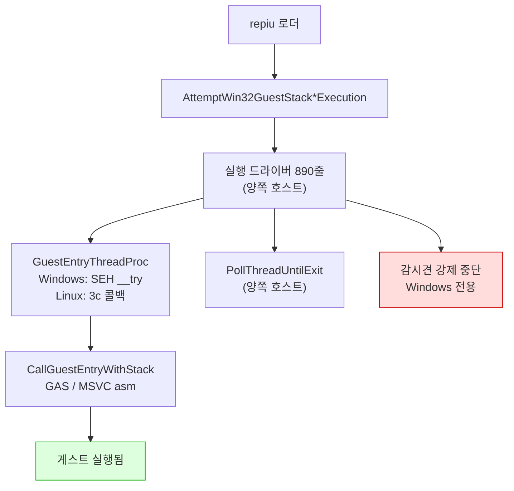
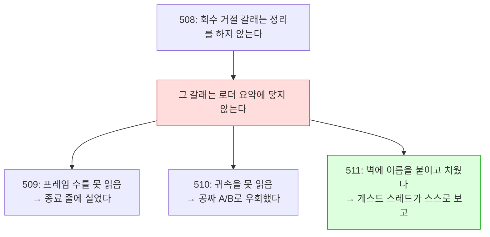
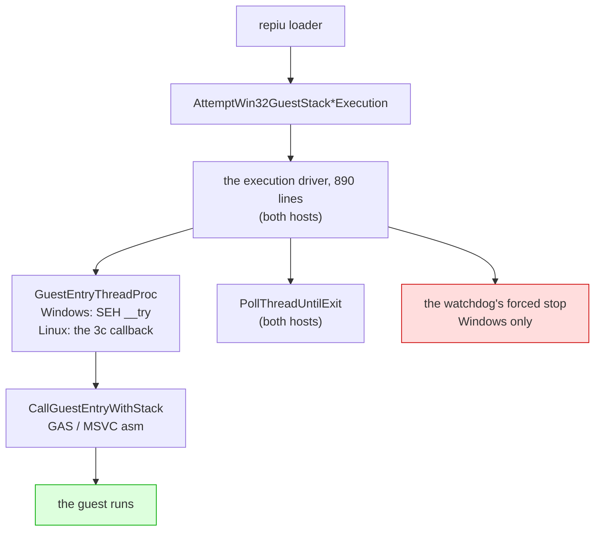
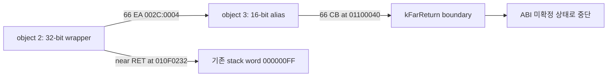

# Linux 이식 frontier / Linux port frontier

## 최신 x64 검증: Task 606 / Latest x64 verification: Task 606

**확인됨 (2026-09-05):** 16비트 register PUSH/POP lowering 누락을 보완한 뒤
FPU 초기화 루틴의 반환주소 `0x010F4B7E`가 보존된다. Task 605의
`AX=1E7Fh` 사설 ABI blocker 및 의도적 중첩 진입 결론은 철회한다.
기본 실행에서 그 호출과 `0x010F4AD2` null 쓰기가 사라졌으며 새 오류는
guest `0x010F1E0F`, 바이트 `80 3C 24 00` (`CMP byte ptr [ESP],0`)이다.
fault의 `access`는 실행마다 달라지고 guest ESP `0x0158CC68`과 일치하지 않는다.
**미확정:** 새 오류에서 raw guest 실행과 host/guest stack 주소의 관계.
빌드와 core probe 23개는 통과했다.

**Confirmed (2026-09-05):** word register PUSH/POP lowering preserves the FPU
initialization return address `0x010F4B7E`. Task 605's private `AX=1E7Fh` ABI
and intentional-overlap conclusions are withdrawn. The default run no longer
reaches that call or the `0x010F4AD2` null write. The new fault is at guest
`0x010F1E0F`, bytes `80 3C 24 00`, guest `CMP byte ptr [ESP],0`.
The access address varies between runs and differs from guest ESP `0x0158CC68`.
**Unresolved:** raw guest execution and host/guest stack handling at this fault.
The build and all 23 core probes pass.

근거 / Evidence: [Task 606 log](../work-logs/20260905-606-x64-word-stack-lowering.md).

설계: [20260822-503](../design/20260822-503-linux-execution-engine.md) ·
작업 지시: [20260822-503](../work-orders/20260822-503-linux-execution-engine.md) ·
작업 로그: [20260822-503](../work-logs/20260822-503-linux-execution-engine.md) ·
측정 절차: [linux-engine-port-measurement](../guides/linux-engine-port-measurement.md)

이 문서는 **Linux 이식이 지금 어디까지 왔는지와 다음에 무엇이 필요한지**만 유지합니다.
단계별 증거는 작업 로그에 있습니다. 표기는 이 디렉터리의 규칙을 따릅니다 — **확인됨**,
**추정**, **미확정**.

## 1. 한 줄 요약

> **두 축이 있습니다.** 아래 대부분은 **Linux i386** 축이고 게임이 화면까지 나옵니다.
> **Linux x64** 축은 별도이고 **[3.19](#319-task-574--주석이-사실이-아니었고-census가-그것을-소거로-확정했다)가
> 최신 상태입니다** — 거기서는 guest가 아직 실행되지 않고, emitter가 명령의 99.21%를
> 낼 수 있으며 완결 block은 90.09%, entry에서 도달 가능한 block은 44.47%입니다.
> **Linux x64 축의 정본은 [3.27 인수인계](#327-세션-인수인계-2026-09-03--x64가-게스트를-실행하기-시작했다)입니다.**
> x64는 `repiu`를 만들고, 로더가 동작하고, code cache로 진입해 게스트 명령을
> 실행하며, 두 번째 방출 block의 `sti`가 일으킨 #GP에서 멈춥니다. — 로더·DOS FS·LE 재배치·AOT code cache 배치가
> 모두 x64에서 동작하고, Task 544의 32비트 요구에서 멈춥니다(exit 0). 남은 작업
> 표는 3.20이며 3.21·3.22가 갱신합니다.
> ([3.10 인수인계](#310-세션-인수인계-2026-09-01--x64가-guest-바이트를-실행하고-명령의-23를-낼-수-있다)는
> 그 축의 배경이고, 수치는 3.11~3.17이 갱신합니다.)

**게스트 코드와 기본 `dynamic` AOT backend가 Linux에서 실행됩니다.** DOS/4GW 샘플은
`legacy`와 `dynamic` 모두 같은 종료 코드 2·초점 오프셋 0x10·opcode 0x80에서 멈춥니다.

**화면도 열렸습니다(Task 506).** WSLg `pumpit1`은 약 45.1초에 첫 버퍼 스왑, 약 51.7초에
69,263/307,200 non-black 픽셀을 기록했고 이후 스왑이 계속되었습니다. 오디오 장치도 열립니다.

**종료도 스스로 됩니다(Task 507).** 예산 만료·SIGTERM 여덟 번 모두 프로세스가 스스로
끝났습니다 — 이전에는 TERM을 받고도 영원히 기다렸습니다.

**그리고 코어 덤프 없이 끝납니다(Task 508).** 507 뒤에 남아 있던 것은 회수를 거절당한 실행이
SIGTRAP으로 끝나는 경우였습니다. 60초 예산 6회에서 거절 6회 중 2회가 그렇게 끝났고, 수정 후
같은 6회에서 거절은 그대로 6회·SIGTRAP은 0회입니다. **이제 Linux에서 `exit=133`을 보면 그것은
회귀입니다.**

**그리고 왜 느린지도 이제 압니다(Task 511).** 프레임당 격차 126M cycle 중 **68%가 폴트
핸들러**이고, Linux에서 그것은 시그널 전달입니다. 아래 4절에 분해가 있습니다.

**화면이 나오는 것을 사람이 확인했습니다(2026-08-28, 사용자 관측).** 같은 관측이 남긴 다음
과제가 **속도**였고, Task 509가 쟀습니다 — **Linux는 Windows의 3.7%, 약 26.8배 느립니다**
(Release, vsync OFF, `pumpit1`, 호스트당 3회, 범위 무중첩). 남은 것은 **어디가 느린가**이고,
4절에 순서를 적었습니다.

## 2. 확인됨 — 지금 서 있는 것

> **범위 (2026-08-29, [3.8](#38-2026-08-29-실제-ubuntu--wslg는-대표-환경이-아니었습니다)).**
> 이 절과 Tasks 505~519의 측정은 **WSLg에서** 이루어졌습니다. 실제 ext4 데스크톱은 다르게
> 동작할 수 있고, 실제로 달랐습니다 — 그 환경에서는 게임이 시작조차 못 하고 있었습니다.
> 아래를 인용할 때 환경을 함께 적으십시오.

| 항목 | 상태 | 근거 |
|---|---|---|
| `src/platform/win32` 81개 소스 Linux 컴파일 | **81 / 81** | 3d-16, 3d-17 측정 |
| `repiu` 로더 Linux 링크 | ELF 32-bit `EXEC`, 텍스트 0x40000000, 쓰기 불가 | 3d-17 |
| 엔진 수준 미정의 심볼 | **0** (라이브러리 배선 9개뿐이었고 해결됨) | 3d-17 측정 |
| `repiu_core_probe` | 양쪽 호스트 **15 / 15** | 3d-18 |
| 게스트 스택 전환·폴트 복구 | 양쪽에서 같은 probe 통과 | 3d-16 |
| 스레드 생성·조회·대기·해제 | 양쪽에서 같은 probe 통과 | 3d-18 |
| **게스트 실행** | **샘플 실행, Windows와 같은 명령에서 정지** | **3d-19** |
| 폴트 18건·종료 코드·blocker | 두 호스트 일치 | 3d-19 |
| **Linux dynamic AOT** | 캐시 배치·인라인 패치·pumpit1 스왑/non-black 픽셀 | **Task 506** |
| **Linux 종료 경로** | 예산 만료·SIGTERM 모두 프로세스가 스스로 종료 | **Task 507** |
| **Linux 종료 경로 — 코어 덤프 없음** | 회수 거절 6/6에서 SIGTRAP **0회** (수정 전 2회) | **Task 508** |
| **Linux i386 Release 빌드** | 성공(프로젝트 최초), 샘플이 3d-19 기준선 통과 | **Task 509** |
| **Linux 프레임률** | 27.21 fps 대 Windows 730.05 fps — 약 **26.8배** | **Task 509** |
| **격차의 축** | 폴트 핸들러가 프레임당 격차의 **68.3%** (42.6배), 3회 재현 | **Task 511** |
| **그 42.6배의 분해** | 프레임당 경계 **13.6배** × 핸들러 본문 **3.3배**. 커널 전달은 Linux가 **0.44배**로 더 쌈 | **Task 512** |

계층으로 내려간 것들입니다.

| 계층 | 헤더 | 단계 |
|---|---|---|
| 게스트 레지스터 컨텍스트 | `platform/guest_cpu_context.h` | 3a |
| 가상 메모리 | `platform/virtual_memory.h` | 3b |
| 폴트 전달 | `platform/fault_handler.h` | 3c |
| 워커 신호 | `platform/worker_signal.h` | 3d-6 |
| 안전한 메모리 복사 | `platform/safe_memory_copy.h` | 3d-7 |
| 시간·사이클 카운터 | `platform/host_time.h` | 3d-8 |
| 환경 변수 읽기·열거·쓰기 | `platform/host_environment.h` | 3d-9, 3d-16, 3d-17 |
| 진단 출력 | `platform/host_error_stream.h` | 3d-14 |
| 스레드 번호·생성·조회·대기 | `platform/host_thread.h` | 3d-15, 3d-18 |
| 게스트 스택 전환 오프셋과 전역 | `platform/guest_stack_switch.h` | 3d-16 |
| 자식 프로세스 재실행 | `platform/host_process.h` | 3d-17 |
| 양보·짧은 대기 | `platform/host_time.h` | 3d-19 |

어셈블리는 GAS로 옮겨졌습니다 — 다섯 디스패치 thunk(`stack_bridge.inc.S` 매크로 하나,
3d-12)와 트램폴린의 세 진입점(`guest_stack_switch.S`, 3d-16).

## 3. 벽은 열렸습니다 (3d-19)



`IsGuestStackSwitchSupported()`와 `IsDirectX86ExecutionSupported()`는 이제 컴파일러가 아니라
**아키텍처**를 묻습니다 — 3d-16이 스택 전환을 GAS로 쓴 뒤로 컴파일러에 달려 있지 않습니다.

## 3.5 2026-08-27 main 병합 인계

이 날 main에 들어간 것은 다섯입니다. 종합 설계는 없고, 각 작업의 설계·지시서·로그가 정본입니다.

| 커밋 | 무엇 |
|---|---|
| `6f9ac34` | 503d-22 마감 — 포기한 인터럽트가 다시 오지 못함을 probe로 고정, 그 과정에서 드러난 교차 스레드 구멍을 닫음 |
| `9acbabe` | `SA_NODEFER`를 **후보에서 제외** — 증상을 원인으로 읽고 있었음. 같은 플래그를 두고 자기모순이던 주석도 정정 |
| `bd6e736` | 503d-23 — **9초 정지 해결.** `native_fast_path`가 복귀 브레이크포인트를 무장하면서 트랩 플래그를 해제하는데 Linux에서 무장만 버려짐 |
| `db234db` | Task 505 — **Glide 창이 Linux에서 열림.** 이식이 아니라 울타리 57개 해제 |
| `486fe09` | `0x010EE1xx`를 "대기 루프"라 한 것 정정 — Task 219가 이미 확정한 비트스트림 디코더 |

### 이 날 반복해서 걸린 것

**성공 신호 하나로 성공을 판정한 것**이 세 번입니다.

| 무엇을 봤나 | 무엇으로 읽었나 | 실제 |
|---|---|---|
| `exit 0` | 정상 완주 | 창을 못 열어 게임이 포기 |
| `opened=1` | 창이 열림 | 더미 폴백도 같은 값을 반환 |
| `dispatch_entry` 폭증 | 전진 중 | 일하는 중이지 나아가는 중이 아님 |

그리고 **관측 창보다 긴 주기는 보이지 않는다**에 두 번 걸렸습니다 — 30초는 "느리다",
240초는 "갇혔다", 1,200초에서야 실상.

세 경우 모두 **한 걸음 더 갔으면** 잡혔습니다. 종료 코드 대신 로그를, 반환값 대신 메시지를,
카운터 대신 EIP 궤적과 코드를 봤어야 했습니다. `0x010EE1xx`는 특히 그렇습니다 — 답이
저장소 안에 두 달 전부터 있었습니다.

### 다음

**감시견과 종료 경로의 강제 중단을 안전한 Linux 복구 경로로 바꾸는 작업**입니다. Task 506
검증에서도 측정을 마치고 종료를 요청했을 때 TERM에 응답하지 않아 측정 프로세스를 PID 확인 후
강제 종료했습니다.

> 이 항목은 Task 507·508로 끝났습니다. **현재의 다음 항목은 아래 4절**에 있습니다. 이 절은
> 2026-08-27 시점의 기록으로 남깁니다.

## 3.6 2026-08-28 main 병합 인계

이 날 main에 들어간 것은 넷입니다. 화면이 열린 다음 **왜 느린지까지** 갔습니다.

| 커밋 | 무엇 |
|---|---|
| `f2694dc` | Tasks 506·507·508 — **화면이 나오고, 종료가 되고, 코어를 덤프하지 않습니다** |
| `1f914db` | Task 509 — 실행이 자기 프레임률을 보고합니다. **Linux는 Windows의 3.7%** |
| `9d5a12b` | Task 510 — Glide 게이트를 축에서 **배제**. 코드 변경 0 |
| `2cd1e13` | Task 511 — 실행 중 귀속 보고. **격차의 68%가 폴트 핸들러** |
| `bd0ebaa` | Task 512 — 그 68%를 **횟수 13.6배 × 단가 3.3배**로 분해. 시그널 전달 자체는 **무죄** |

### 하나의 사슬로 읽으십시오

세 작업이 같은 벽에 세 번 부딪혔고, 세 번째에야 이름을 붙였습니다.



**교훈**: Linux에서 계측이 아무것도 내지 않으면, 계측을 의심하기 전에 **그것이 `attempt`를
거쳐 `main.cpp`로 나가는지** 먼저 보십시오. 그렇다면 렌더까지 간 Linux 실행에서는 나오지
않습니다.

### 이 날 걸린 것

**하나. 배율이 크면 백분율이 거짓말을 합니다.** `SETTER_ELIDE=0`이 Linux에서 −1.0%라 "호스트
왕복은 공짜"로 읽힐 뻔했습니다. 같은 노브가 Windows에서 27.1%를 깎는데, **절대 비용은 양쪽이
같습니다**(+0.51 대 +0.38 ms). 안 보인 이유는 싸서가 아니라 프레임이 36.75 ms이기
때문입니다. → **항상 프레임당 ms 또는 cycle로 비교하십시오.**

**둘. 널 결과는 그 자체로 읽을 수 없습니다.** "축이 아니다"와 "노브가 이 장면에서 아무 일도
안 했다"가 같은 모양입니다. → **대조군을 돌리십시오.** 510이 그렇게 살아났습니다.

**셋. Debug 수치를 성질로 읽었습니다.** Task 506의 "약 45.1초에 첫 스왑"은 Debug였고,
Release에서는 약 2초입니다. "자산 디코드가 오래 걸린다"는 엔진의 성질이 아니었습니다.

**넷. 누적 평균은 변화를 지웁니다.** Linux 프레임당 비용이 실행 중 83M → 272M cycle로 세 배가
됩니다. 시간별 보고가 없었으면 "일정하게 26.8배"로 적었을 것입니다.

### 다음 — 시그널 전달의 횟수인가 단가인가

**축은 확정되고 분해까지 끝났습니다.** `veh`(폴트 핸들러)가 격차의 68.3%이고, 그 42.6배는
**프레임당 경계 13.6배 × 핸들러 본문 3.3배**입니다. **시그널 전달 자체는 무죄입니다** —
커널 왕복이 Linux에서 0.44배로 더 쌉니다(512).

**다음 질문 하나: 왜 경계를 13.6배 더 밟는가.**

초과분은 **single-step이 아닙니다**(Linux 배달의 3.6%, Windows 24.4%). breakpoint이거나
access violation입니다.

**유력 후보는 아래 6절에 이미 적혀 있습니다** — Linux 사용자 공간이 하드웨어 디버그
레지스터를 못 써서 `native_fast_path`·`native_region`·`native_linear_span` **셋이 모두
차단**돼 있습니다. **그 셋은 정확히 트랩을 피하려고 있는 경로**이고, 꺼진 대가는 측정된 적이
없습니다.

먼저 할 일은 **초과 배달의 종류를 세는 것**입니다. `veh_gap_counts`가 이미 single-step /
breakpoint / other 세 칸으로 나뉘어 있으므로, 511의 보고 줄에 나머지 두 칸을 더하면 종류별
분포가 바로 나옵니다 — 512와 같은 모양의, 새로 세지 않는 변경입니다.

남은 둘: **핸들러 본문 3.3배**(하위 버킷 `kVehPrologue`·`kAotReentry` 등이 가릅니다), 그리고
`dos`의 **433.9배**(격차 기여는 1.9%로 작지만 배율은 표에서 가장 큽니다 — 작다고 넘기지 말 것).

### 재현에 필요한 것

```bash
./scripts/build_linux_i386.sh --config Release
bash scripts/task509_frame_rate_measure.sh 3 90000 <label>     # 프레임률
bash scripts/task508_refused_recovery_repro.sh 3 60000 <label> # 종료 갈래
```

귀속은 `REPIU_EXECUTION_TIME_PROFILE=1 REPIU_LIVE_PROFILE_INTERVAL_MS=10000`입니다. 조건과
함정은 [실행 프레임률 측정 절차](../guides/execution-frame-rate-measurement.md)에 있습니다.

**Linux 빌드 트리는 지금 Release입니다.** 단일 구성 생성기라 Debug를 대체했고, 정확성 작업으로
돌아가려면 `--config Debug` 재구성이 필요합니다(SDL 재빌드 포함).

## 3.7 2026-08-29 main 병합 인계

이 날 main에 들어간 것은 Linux 성능 축의 다섯입니다(Tasks 515~519). **한 줄로: 26.8배의
정체를 "재진입마다 트랩 하나"까지 좁혔고, 그 다음 한 걸음에서 네 번 틀렸습니다.**

| 커밋 | 무엇 |
|---|---|
| `15cae5e` | 515 — 초과 경계는 **breakpoint**(69%). 후보 둘을 대조군으로 지움 |
| `b357ec1` | 516 — 축은 boundary가 아니라 **재진입**. Linux는 재진입당 트랩 1.010, Windows 0.0432 |
| `6d3b59b` | 517 — Linux에서 direct dispatch는 **돈다**(87%). 그런데 성공해도 트랩이 붙음 |
| `08f1074` | 518 — 디스패치마다 relink 6.1회 (**결론은 519가 철회**) |
| `d3870cb` | 519 — relink는 지속성과 무관한 수였음. `content=0` |

### 지금 쓸 수 있는 계측

실행 중에 네 줄이 나옵니다. `REPIU_EXECUTION_TIME_PROFILE=1`과
`REPIU_LIVE_PROFILE_INTERVAL_MS=10000`으로 켭니다.

| 줄 | 무엇 |
|---|---|
| `[repiu-live-profile]` | guest-run 대비 veh/glide/port-io/dos/unaccounted 몫, 창 값 포함 |
| `[repiu-live-veh]` | 배달 수·배달당 cycle·커널 gap, 그리고 클래스 셋(ss/bp/other) |
| `[repiu-live-aot]` | 캐시 entry/boundary/재진입, 경계 사유 다섯, `sum_ok` |
| `[repiu-live-gdd]` | Glide direct dispatch: patched/verified/resolved/relinked(content·fixup)/entry/success |

**이 넷이 이 축에서 나온 실질 산출물입니다.** Linux는 로더 요약에 닿지 못하므로 이 줄들이
아니면 아무것도 읽을 수 없습니다.

### 다음 한 걸음

**Windows에서 그 INT3은 왜 다시 밟히지 않는가.** 활성화는 `Eip`만 돌리고 INT3을 지우지
않는데, Windows에서는 재진입의 95%가 트랩 없이 처리되고 Linux에서는 100%가 트랩을 냅니다.

**시작하기 전에 위 8절의 표를 읽으십시오** — 같은 실수를 네 번 했습니다.

### 남은 다른 축

* `other`(접근 위반) 프레임당 **10.7배** — 페이지 보호·포트 I/O·write watch.
* 핸들러 본문 **3.3배** — 하위 버킷(`kVehPrologue`·`kAotReentry` 등)이 가릅니다.
* `dos` 프레임당 **433.9배** — 격차 기여는 1.9%로 작지만 배율은 가장 큽니다.


## 3.8 2026-08-29 실제 Ubuntu — WSLg는 대표 환경이 아니었습니다

Tasks 522~523. **한 줄로: 505~519의 "확인됨"은 전부 WSLg 한정이었고, 실제 ext4 데스크톱에서는
게임이 시작조차 하지 못했습니다.**

VMware Ubuntu(커널 7.0.0-30-generic)에서 창이 열리지 않았습니다. 단일 스텝 인구 조사가 한
주소 `0x010F3438`에 **814,138 / 814,683 샘플(99.93%)**을 보여 주었습니다 — 초당 3만 4천 번,
25초 내내. 진행이 아니라 정지입니다.

### 사슬 — 원인과 증상 사이 여덟 단계

```
Glide2x.ovl 대소문자 불일치 (ext4)
  → glide_exports 0개        → 게이트 계획 무효
  → 이미지 쓰기 3/5 실패      → 디스크립터 등록 실패
  → linexe_environment_active = false
  → INT 21h AX=FF00h 폴백(AL=0) → DOS/4G DLL 로더 초기화 실패
  → 게스트 fatal 경로 → 자기 0xCC에서 영원히 회전
```

**여덟 단계 중 어디에서도 오류가 보고되지 않았습니다.** `exists()`가 거짓이면 `if` 하나가
조용히 건너뛰어지고 실행이 계속되기 때문입니다.

| 호스트 | 파일시스템 | `"Glide2x.ovl"` |
|---|---|---|
| Windows | NTFS | 대소문자 무시 → 찾음 |
| WSLg | DrvFs (`/mnt/e/...`) | 대소문자 무시 → 찾음 |
| **실제 Ubuntu** | **ext4** | **구분 → 못 찾음** |

### 결정적 관측 기법

**두 호스트의 DOS/DPMI 호출 순서를 나란히 놓는 것**이었습니다. `REPIU_DOS_INT_TRACE=1`.

| # | WSLg | VMware (전) | VMware (후) |
|---|---|---|---|
| 2 | `21 FF00` | `21 FF00` | `21 FF00` |
| **3** | `31 0006` | **`21 ED2B`** | **`31 0006`** |

세 번째 호출이 갈리는 지점이고, 그것이 일치로 돌아오는 것이 수정의 서명입니다.

### 얻은 것

| | 전 | 후 |
|---|---:|---:|
| Glide exports | 0 | **173** |
| `linexe_environment_active` | false | **true** |
| 게스트 INT3 트랩 | 814,138 | **0** |
| Glide 게이트 진입 | 0 | **96** |
| 종료 | segfault (139) | 타임아웃 (3) |

### 이 절이 바꾸는 것

* **"확인됨"에 환경을 적으십시오.** 이 문서의 505~519 주장은 WSLg에서 측정된 것입니다.
  실제 데스크톱에서 다시 재지 않았습니다.
* **크래시 없음 ≠ 정상 동작**을 또 만났습니다 — 이번에는 "로그 없음 ≠ 문제 없음"의 형태로.
* `docs/analysis/dll-loader-int21-ff00.md`의 원인 서술이 낡아 있었습니다. **문서를 먼저 읽되,
  코드로 확인해야 합니다.**

### 남은 것

* **창 확인은 VM 데스크톱에서.** SSH 세션에는 `DISPLAY`가 없어 SDL이 더미 폴백을 타고
  `frames=0`입니다.
* VM teardown의 segfault는 `step=thread-release` 이후 `step=done` 전에서 여전히 발생합니다.
* 실제 데스크톱에서의 성능 수치는 아직 없습니다.


### 데스크톱 패키지 — 같은 조용한 실패가 한 겹 더 있었습니다

창이 열린 뒤 **제목줄이 없었습니다.** Wayland에는 서버 측 장식이 없어 클라이언트가 직접
그려야 하고, SDL3는 그것을 `libdecor`에 맡깁니다. 그런데 SDL 구성이 이랬습니다.

```
/* #undef HAVE_LIBDECOR_H */    ← 지원이 통째로 컴파일에서 빠짐
#define SDL_VIDEO_DRIVER_WAYLAND 1
```

`libdecor-0-dev:i386`이 없어 SDL이 지원을 빼고 빌드했고, **아무것도 그 사실을 보고하지
않았습니다.** 창이 그냥 맨몸으로 열릴 뿐입니다. 런타임에도 `libdecor-0-0`은 `:amd64`만 깔려
있었는데 `repiu`는 32비트입니다 — 빌드를 고쳤어도 거기서 또 막혔을 상황이었습니다.

| | 조치 |
|---|---|
| 재빌드 없는 우회 | `SDL_VIDEODRIVER=x11` (XWayland는 서버가 장식을 그림) |
| 정식 | `libdecor-0-dev:i386 libdecor-0-0:i386 libdecor-0-plugin-1-gtk:i386` |

**패키지 설치만으로는 안 됩니다.** CMake가 패키지 없던 시절의 실패를 캐시에 담고 있습니다
(`SDL_WAYLAND_LIBDECOR=ON`인데 `PC_LIBDECOR_FOUND=`가 빈 값). 빌드 디렉터리를 통째로 버리는
것보다 캐시 항목만 비우는 편이 쌉니다.

```
cmake -U "PC_LIBDECOR*" -U HAVE_LIBDECOR_H -S . -B build/linux_i386
```

`scripts/build_linux_i386.sh`가 이제 이것을 점검하고 경고합니다 — libpulse와 같은 방식이고,
같은 이유입니다. **빌드는 성공하고 게임도 도는데 조용히 반쪽만 동작하는** 부류입니다.

## 4. 다음에 필요한 것

> 이 절은 3d-20을 가리키고 있었습니다. 3d-20(다른 스레드의 레지스터)·3d-21(표본기)·
> 3d-22(시한이 지난 인터럽트)는 끝났고, 목록에서 **빠지지 않은 둘**이 아래에 그대로
> 남습니다. 인터럽트 계층 자체는 양쪽 호스트에서 probe를 통과합니다.

1. ~~**AOT 코드 캐시**~~ — **해결 (Task 506).** Win32 메모리 호출 62곳을 3b 계층으로 옮겼고,
   Linux `dynamic`에서 배치·동적 실행·인라인 패치·페이지 retirement가 동작합니다. `pumpit1`은
   45.1초에 첫 스왑, 51.7초에 첫 non-black 스왑을 기록했습니다.
2. ~~**감시견의 강제 중단.**~~ — **해결 (Task 507).** 종료 블록을 `InterruptHostThread`로
   옮겼습니다. 회수에 성공하면 정상 종료하고, 회수가 거절되면 `DetachHostThread`로 기다리지
   않고 내려가며 AOT 캐시 해제를 건너뛰고 `_Exit`로 프로세스를 즉시 끝냅니다. `pumpit1`에서
   예산 만료·SIGTERM 여덟 번 모두 스스로 종료했습니다(더 이상 매달리지 않음). 회수가 거절된
   경로에서 SIGTRAP으로 끝나는 경우가 남아 있고, 그 원인은 위 6절에 적었습니다 — 프로세스가
   끝나는 것 자체는 507의 조건을 만족합니다.
3. ~~**회수를 거절당한 종료의 코어 덤프.**~~ — **해결 (Task 508).** 근인은 트랩이 아니라
   **순서**였습니다. 종료 블록이 회수 성공 여부와 무관하게 `RemoveFaultHandler()`를 부르는데,
   거절당한 실행에서는 그 뒤로도 게스트 스레드가 돌면서 AOT 엔진이 평소처럼 심는 INT3을
   밟습니다. 508은 거절된 갈래에서 정리를 통째로 건너뛰고(핸들러도 떼지 않고) 파일로 나가는
   두 진단과 detach만 남긴 뒤 `_Exit` 합니다. 60초 예산 6회에서 거절 6/6·SIGTRAP 0회.

### 측정됨 (Task 509) — Linux는 Windows의 3.7%입니다


> **2026-08-29 재측정 ([Task 524](../work-logs/20260829-524-wslg-baseline-remeasure.md)).**
> 같은 조건으로 v0.0.172에서 다시 재니 WSLg가 **34.11 · 35.22 · 36.96, 평균 35.43 fps
> (프레임당 28.2 ms)**였습니다. 아래 표의 27.21보다 **1.30배 빠르고 두 집단의 범위가 겹치지
> 않습니다**(최저 34.11 > 최고 27.76).
>
> **왜 빨라졌는지는 모릅니다.** 그 사이 머지에 성능을 노린 변경은 없었습니다. 측정 시점의
> 호스트 상태 차이일 수도 있고 아래 값이 이미 낡았을 수도 있습니다. 원인을 확인하지 않았으므로
> 추정하지 않습니다.
>
> **Windows 쪽은 다시 재지 않았습니다.** 730.05와 비교하면 격차는 26.8배에서 **약 20.6배**로
> 줄지만, 한쪽만 새로 잰 비교이므로 그 배수는 아래 표만큼 단단하지 않습니다.

| 호스트 | fps (Release, vsync OFF, `pumpit1` 90초, 3회) | 평균 | 프레임당 |
|---|---|---:|---:|
| Windows | 743.91 · 737.46 · 708.79 | **730.05** | 1.37 ms |
| Linux (WSLg) | 26.22 · 27.76 · 27.65 | **27.21** | 36.75 ms |

**약 26.8배이고 두 집단의 범위가 겹치지 않습니다.** 가장 보수적으로 잡아도 25.5배입니다.
프레임당 Linux가 **35.4 ms를 더 씁니다.**

**기동은 원인이 아닙니다** — 양쪽 모두 `span_ms` 88초로 첫 프레임까지 2초 남짓입니다. 차이는
전부 렌더 루프 안입니다. 여기서 Task 506의 "약 45.1초에 첫 스왑"이 **Debug 수치**였음이
드러납니다. Release에서는 약 2초입니다.

**배율이 아직 분해되지 않았습니다.** 컴파일러 차이(MSVC 대 GCC)와 WSLg의 X11 한 겹이 26.8배
안에 함께 들어 있습니다.

### 귀속 1차 (Task 510) — Glide 게이트는 축이 아닙니다

이미 있는 노브 다섯 변인을 A/B 했습니다(코드 변경 0). **프레임당 ms로 비교해야 합니다** —
배율이 26.8배인 곳에서 백분율은 같은 비용을 한쪽 37%, 다른 쪽 1%로 보이게 합니다.

| 변인 | 평균 fps | 프레임당 | 기준선 대비 |
|---|---:|---:|---:|
| Linux 기준선 | 27.21 | 36.75 ms | — |
| `RENDEZVOUS_SPIN_US=2000` | 30.50 | 32.78 ms | −3.97 ms |
| `ASYNC_PRESENT=1` | 32.83 | 30.46 ms | −6.29 ms |
| 위 둘 동시 | 33.12 | 30.19 ms | −6.56 ms (가산 아님) |
| `SETTER_ELIDE=0` | 26.93 | 37.13 ms | +0.38 ms |
| `DRAW_BATCH=0` | 28.14 | 35.54 ms | −1.21 ms |
| **Windows `SETTER_ELIDE=0`** | 532.29 | 1.88 ms | **+0.51 ms** |

마지막 줄이 대조군입니다. **같은 노브가 Windows에서 27.1% 떨어집니다** — 노브는 이 장면에서
살아 있습니다. 그런데 **절대 비용은 양쪽이 같습니다**(+0.51 대 +0.38 ms). Linux에서 안 보인
이유는 그 일이 싸서가 아니라 프레임이 36.75 ms이기 때문입니다.

**배제됨**: rendezvous 깨우기 지연(한 몫이나 지배항 아님), present 임계 경로(같음), 호스트
왕복 **횟수**, 게이트 **크로싱 횟수**.

**남은 것: 프레임당 약 30 ms.** 어떤 Glide 노브도 닿지 못했고, 최선의 조합으로도 Windows의
22.0배입니다.

**보조 정황(추정)**: 기동 구간(스왑 0회, 게스트 코드가 자산 디코드)은 첫 프레임까지 300 ms
안쪽 차이 — 약 10~15%입니다. 게스트 코드 실행 자체가 20배 느린 것은 아니라는 방향입니다.

### 귀속 2차 (Task 511) — 축은 폴트 전달입니다

벽을 치웠습니다(실행 중 보고, 게스트 스레드 위). 같은 기계이므로 TSC cycle이 직접 비교됩니다 —
프레임당, 100만 cycle 단위입니다.

| 버킷 | Windows | Linux | 배율 | **격차 기여** |
|---|---:|---:|---:|---:|
| **veh (폴트 핸들러)** | 2.065 | 88.072 | **42.6x** | **68.3%** |
| glide | 1.618 | 26.480 | 16.4x | 19.7% |
| unaccounted | 2.159 | 17.214 | 8.0x | 12.0% |
| dos | 0.006 | 2.438 | **433.9x** | 1.9% |
| port-io | 0.006 | 0.105 | 18.6x | 0.1% |
| 합계 | 5.843 | 131.805 | 22.6x | 126.0M |

**Linux 격차의 68%가 폴트 핸들러입니다.** (511은 이것을 "시그널 전달"이라 불렀는데 **Task 512가
정정했습니다** — 전달 경로 자체는 Linux가 더 쌉니다. 아래 512 절을 볼 것.) `veh` 몫은 3회에서
66.82% · 66.71% · 64.55%로 재현되고, Windows 대조군은 35.35%입니다.

**510과 어긋나지 않습니다.** 510이 시험한 것은 호스트 왕복 **횟수**와 크로싱 **횟수**였고,
여기 glide 26.5M cycle의 대부분은 횟수가 아니라 회당 비용과 대기입니다.

**그리고 프레임당 비용이 실행 중에 세 배가 됩니다**(83M → 272M). "일정하게 26.8배"가 아니라
장면이 진행될수록 나빠집니다 — 누적 평균만 냈으면 보이지 않았을 것입니다.

### 귀속 3차 (Task 512) — 전달은 범인이 아닙니다. 횟수입니다

511이 축을 "시그널 전달"이라 불렀는데 **정정합니다.** 42.6배를 두 인자로 갈랐습니다.

| | Windows | Linux | 배율 |
|---|---:|---:|---:|
| 프레임당 배달 | 18.8 | 256.3 | **13.6x** |
| 배달당 cycle (핸들러 본문) | 104,002 | 341,557 | **3.3x** |
| 곱 | | | 44.8x ≈ 511의 42.6x |
| **커널 왕복 바닥 (`gap min`)** | 21,756 | **9,632** | **0.44x** |
| **커널 왕복 single-step 평균** | 28,185 | **16,466** | **0.58x** |

**`gap`은 핸들러가 나간 뒤 다음 진입까지, 곧 커널의 전달 경로만 봅니다**(Task 372). 그 값이
Linux에서 더 작습니다 — **시그널 전달은 Windows의 예외 디스패치보다 두 배 이상 쌉니다.**
비싼 것은 전달이 아니라 그 주위입니다.

**정규화 주의.** 초당으로 보면 Linux가 폴트를 **40% 적게** 냅니다(7,732 대 12,951). 프레임당이
큰 것은 프레임이 24배 드물기 때문입니다. 프레임당이 하중을 지는 정규화이지만(한 프레임 =
`grBufferSwap` 한 번 = 같은 게스트 경로), **게임 로직이 저프레임률에서 일을 줄이는 구조라면
그 전제가 깨집니다 — 확인되지 않았습니다.**

### 귀속 4차 (Task 515) — 초과분은 breakpoint이고, 후보 둘은 반증됐습니다

**프레임당 배달 수**로 봅니다.

| 클래스 | Windows | Linux | 배율 | 초과분 기여 |
|---|---:|---:|---:|---:|
| single-step | 4.87 | 8.95 | 1.8x | 1.8% |
| **breakpoint** | 6.94 | **167.80** | **24.2x** | **69%** |
| other (접근 위반) | 6.92 | 74.29 | 10.7x | 29% |

성격 자체가 뒤집혀 있습니다 — Windows는 세 클래스가 고른데(24/39/37%), Linux는 **breakpoint
67.0%**에 몰려 있습니다.

**후보 둘을 Windows 대조군으로 반증했습니다.**

| Windows 대조군 | bp/frame | 기준선 대비 |
|---|---:|---:|
| 기준선 | 6.94 | — |
| `native_fast_path` 끔 | 6.67 | −3.9% |
| direct-return table 끔 | 6.73 | −2.9% |

**정제 하나**: `native_region`·`native_linear_span`은 Windows에서도 opt-in이라 기본 꺼짐입니다.
**기본값이 두 호스트에서 다른 것은 `native_fast_path` 하나뿐**입니다 — 그런데 그 카운터가
**기준선에서도 `0/0/0`**입니다. 이 장면에서는 Windows에서도 한 번도 작동하지 않으므로
**두 호스트의 차이가 될 수 없습니다.** (노브를 껐는데 안 변할 때 카운터를 보라는 510의 규칙이
여기서 약한 결론을 강한 결론으로 바꿨습니다.)

### 귀속 5~8차 (Tasks 516~519) — 재진입마다 트랩이 하나, 그리고 틀린 답 셋

**516: 축은 boundary가 아니라 재진입입니다.**

| | Windows | Linux | 배율 |
|---|---:|---:|---:|
| 프레임당 boundary | 6.69 | 13.78 | 2.1x |
| 프레임당 reentry | 160.63 | ~154 | **0.90x** |
| **reentry당 breakpoint** | **0.0432** | **1.010** | **23x** |

재진입 비율은 Linux가 오히려 10% 적습니다. 다른 것은 **나올 때마다 트랩을 내는가**이고, 이
23배가 515의 breakpoint 24.2배와 맞습니다. Windows가 트랩을 피하는 경로는 **Glide direct
dispatch**로, 재진입의 95.1%(8,719,788 / 9,171,551)를 처리합니다.

**517: 그 경로는 Linux에서도 돕니다.** `patched=172 verified=172 entry=338,929
success=338,928 miss=0`, 재진입의 87%. 그런데 산술이 강제합니다 — Linux의 비-gdd 재진입은
50,685뿐인데 트랩이 392,670으로 **7.7배 초과**합니다. **성공한 direct dispatch도 트랩을
냅니다.**

**518~519: relink 카운터는 이 질문에 답할 수 없는 수였습니다.** 518이 "디스패치마다 6.1회
relink → 패치가 안 붙는다"고 적었고, 519가 카운터를 갈라 **`content=0`, `fixup`이 전부**임을
보였습니다. `fixup` 쪽은 캐시를 읽지 않고 매번 다시 쓰므로 지속성과 무관합니다.
**518의 결론은 철회됐습니다.**

### 그다음 — Windows에서 그 INT3은 왜 다시 밟히지 않는가

`ActivateWin32GlideGateDirectTarget`은 breakpoint 폴트 핸들러 안에서 불리고, 성공하면 `Eip`를
게스트 게이트 주소로 돌리고 트랩 플래그를 끕니다. **INT3 자체는 지우지 않습니다.** 그런데
Windows에서는 같은 INT3이 사실상 다시 밟히지 않고, Linux에서는 매번 밟힙니다. **여기가 다음
자리입니다.**

**측정 다섯 번 동안 제 추정이 네 번 틀렸습니다.** 공통 원인이 하나이고, 다음 사람에게
그것이 이 절에서 가장 값나가는 내용입니다.

| # | 함의 | 실제 |
|---|---|---|
| 515 | 껐는데 안 변하니 원인이 아니다 | 애초에 한 번도 안 돌고 있었음 (`0/0/0`) |
| 516 | `residency_mean=0`이니 캐시가 안 돈다 | 표본 카운터가 이 경로에서 안 채워짐 |
| 517 | 트랩이 매 재진입에 있으니 direct dispatch가 안 돈다 | 87%가 그 경로로 감 |
| 519 | relink가 많으니 패치가 안 붙는다 | relink는 지속성과 무관한 수 |

**넷 다 카운터의 이름으로 뜻을 추정하고 증가 지점을 읽지 않은 것입니다.** 새 카운터를 읽기
전에 `fetch_add`가 어디에 있는지부터 보십시오.

다음 후보는 **AOT 코드 캐시가 Linux에서 경계를 얼마나 이어 붙이는가**입니다 — direct edge
연결과 인라인 패치의 **효과**. Task 506이 "동작한다"까지는 확인했지만 얼마나 효과적인지는
재지 않았습니다.

그 수치(patched/verified/resolved-target/fallback 계열)는 지금 `main.cpp` 요약으로만 나가
**Linux에서 읽을 수 없습니다.** 512·515와 같은 모양으로 live 줄에 실으면 됩니다.

`other`의 10.7배도 남습니다 — 페이지 보호·포트 I/O·write watch 쪽입니다.

**초과분은 single-step이 아닙니다.** `gap_ss_count`가 Linux 배달의 **3.6%**인데 Windows는
**24.4%**입니다. 초과분은 breakpoint이거나 access violation입니다.

**유력 후보가 이 문서 6절에 이미 있습니다** — 하드웨어 디버그 레지스터를 Linux 사용자 공간이
쓸 수 없어 `native_fast_path`·`native_region`·`native_linear_span` **셋이 모두 차단**되어
있습니다. 그 셋은 정확히 **트랩을 피하려고** 있는 경로이고, 그것들이 꺼진 대가는 **측정된 적이
없습니다.** 이것이 다음 단위입니다.

남은 둘: **핸들러 본문 3.3배**(하위 버킷 `kVehPrologue`·`kAotReentry` 등이 가릅니다),
그리고 `dos`의 **433.9배**.

`veh`가 축인 것은 확정입니다. 남은 질문은 **배달이 많은 것인가 회당 단가가 큰 것인가**이고,
`veh` 버킷의 `counts`가 그 답을 갖고 있습니다. 둘은 고칠 방법이 전혀 다릅니다 — 횟수면
경계를 줄이는 일이고, 단가면 전달 경로 자체의 문제입니다.

`dos`의 **433.9배**도 따로 봐야 합니다. 격차 기여는 1.9%로 작지만 배율은 이 표에서 가장
큽니다.

세 항목이 모두 닫히면서 **Linux에서 게스트가 돌고, 창이 열리고, 종료가 됩니다.**

**그리고 화면이 나오는 것을 사람이 확인했습니다 (2026-08-28, 사용자 관측).** 계측이 닿는
데까지는 non-black 픽셀 수였고, "실제로 게임 화면이 보이는가"는 사람이 봐야 하는
질문이었습니다 — 그 답이 예입니다. 같은 관측이 남긴 것은 **"속도가 아주 느리다"**였고,
Task 509가 그것을 숫자로 바꿨습니다(위 표).

이제 남은 것은 **어디에서 느린가**이고, Task 510이 Glide 축을 배제했습니다(위 표).
그런데 세밀한 귀속 계측은 **Linux에서 출력되지 않습니다** — `REPIU_GLIDE_ORDINAL_TIME_PROFILE`과
`REPIU_AOT_RETURN_STAGE_PROFILE`이 전부 `attempt`를 거쳐 `main.cpp`가 찍는데, `attempt`를 채우는
`CopyThreadObservationToAttempt`가 "게스트 스레드가 멈췄다"를 전제로 하고 Linux 렌더 실행은
`stopped=0`이라 거기 닿지 못합니다(Task 508). **509에서 프레임 수가 없던 것과 같은 벽입니다.**
다음 단위가 그 벽입니다.

그리고 **WSLg인지 실제 데스크톱인지**를 나누는 것이 배율 분해의 절반입니다. WSLg는 X11을
한 겹 더 지나므로 present 비용이 다를 수 있고, 26.8배 안에 그 몫이 얼마인지 모릅니다.

**무엇이 그려지는가**(Task 506이 "별도 검증"으로 남긴 것)는 사람이 화면을 본 것으로 절반이
닫혔고, Windows와 같은 장면인지 프레임 단위로 대조하는 것은 남아 있습니다.
`REPIU_GLIDE_FRAME_DUMP`가 두 호스트에 다 있으므로 대조 자체는 가능합니다.

6절의 나머지(핸들러 미반환, 자식 프로세스 재실행, CHD 마운트)는 게스트 구동을 막고 있지
않으므로 그 뒤입니다.

## 5. 실행 확인 방법 (3d-19에서 확립)

게임 자산 없이 "게스트가 도는가"를 확인하는 절차입니다. `build/openwatcom_samples/`의 DOS/4GW
샘플과 direct executable 경로를 씁니다.

```bash
cd build/linux_i386
REPIU_EXECUTION_BACKEND=legacy ./repiu     ../../build/openwatcom_samples/clibexam__bprintf_c/sample.exe
```

같은 샘플을 Windows에서 돌려 **대조하는 것이 요점**입니다. 3d-19 시점의 기준값:

| 항목 | 값 |
|---|---|
| 폴트 총계 | 18 (양쪽) |
| 스레드 종료 코드 | 2 (양쪽) |
| 정지 지점 | `… 8E C1 89 D6 42 [26] 80 3E 00 …`, focus offset 0x10, opcode 0x80 (양쪽) |
| 예외 코드 | Linux `0x0000000B` / Windows `0xC0000005` — 호스트 번호이고 기록용 |
| census 칸 | Linux 18/0 / Windows 17/1 — Windows에만 구분되는 코드가 있어서 |

주소는 재배치 이미지 베이스만큼 다릅니다(Linux 0x01000000, Windows 0x03000000). **오프셋으로
비교하십시오.**

## 6. 미확정 — 확인하지 않고 넘어온 것들

| 항목 | 상태 | 어디에 |
|---|---|---|
| 자식 프로세스 재실행이 Linux에도 필요한가 | **미측정** | Task 500의 근거(GPU 드라이버의 주소 공간 선점)가 Linux에도 해당하는지 확인한 적 없음. 되돌릴 자리는 `host_process.h` |
| 자산 경로와 CHD 마운트의 Linux 검증 | **범위 밖** | 설계의 "범위 밖" 절. 실행 시도 전에 다시 볼 것 |
| ~~렌더 백엔드 (창)~~ | **해결 (Task 505)** | 이식할 것이 없었습니다 — 두 파일 모두 이미 SDL3이고 진짜 Win32 API는 **0개**였습니다. 503d-10이 컴파일용으로 세운 울타리 57개(backend 44 + shader 13)가 전부였고, 실제 수정은 각 파일 한 줄(`SDL_FunctionPointer`)입니다. 이제 `opened=1`, 640x480 논리 창 2배(1280x960), 깊이 24비트 승인 |
| ~~첫 프레임에 도달하지 못함 (화면)~~ | **해결 (Task 506)** | `dynamic` AOT가 legacy의 명령 단위 단일 스텝 병목을 우회했습니다. `pumpit1`은 약 45.1초에 첫 스왑(검정), 약 51.7초에 69,263/307,200 non-black 픽셀, 이후 40회 이상의 연속 스왑을 기록했습니다. 무엇이 정확히 그려지는지는 별도 검증입니다. |
| 오디오 출력 셋 | **정정됨** | 아래 8절 |
| 하드웨어 디버그 레지스터 | **불가 — 이제 술어로 강제** | Linux 사용자 공간은 자기 스레드의 것을 쓸 수 없습니다. **`native_linear_span`만이 아니라** `native_fast_path`·`native_region`도 이 위에 서 있었고, 그 중 `native_fast_path`는 **기본 켜짐**이라 9초 정지를 냈습니다(3d-23). `HardwareDebugRegistersAvailable()`이 셋 모두를 env 설정보다 앞에서 막습니다 |
| **Release probe 실패** | **미해결 (Task 509에서 발견)** | probe 모음이 **Release에서 검증된 적이 없습니다.** Linux Release는 `dos_file_handle_cache` 뒤 `== pit_timer ==` 헤더 전에 **segfault(exit 139)**, Windows Release는 `fault_handler_data_faults`·`stack_bridge_contract` **2건 실패**. 양쪽 Debug는 15/15이고, 509의 변경을 넣은 Windows Debug도 15/15입니다 — 호스트가 아니라 **구성**이 가르는 문제입니다. **엔진은 Release에서 정상** — Linux Release `repiu`가 DOS/4GW 샘플에서 3d-19 기준선을 그대로 냅니다. 509의 변경(프레임 카운터·종료 줄)은 이 probe들의 경로를 지나지 않습니다 |
| 교차 프로세스 텔레메트리 | **울타리 안** | `live_telemetry_snapshot.cpp`의 공유 섹션·정지 스냅샷. 게스트 구동에 불필요 |
| `CaptureSuspendedThreadSnapshot` | **호출자 없음** | 정의만 있고 선언도 호출도 없음. 지우는 것은 의도 확인 후 |
| ~~종료 시 SIGTRAP~~ | **해결 (Task 508)** | 507이 재현했고 508이 근인을 확정했습니다 — **트랩이 아니라 순서**입니다. 종료 블록은 회수 성공 여부와 무관하게 같은 정리 순서를 밟고, 그 세 번째 단계가 `RemoveFaultHandler()`입니다. 회수를 거절당했다는 것은 게스트 스레드가 계속 돈다는 뜻이고, `dynamic` backend는 정상 동작으로 INT3과 트랩 플래그를 심으므로 핸들러가 사라진 뒤 그중 하나를 밟으면 커널 기본 처분(코어 덤프)이 실행됩니다. 507이 넣어 둔 단계 표시가 증거였습니다 — **두 번의 SIGTRAP 모두 마지막 줄이 `step=translation-worker`**, 곧 `step=fault-handler` 바로 다음이었습니다. 508은 거절된 갈래에서 정리를 하지 않습니다: `probe-dump` → `DetachHostThread` → `_Exit`. 60초 예산 6회에서 거절 6/6, SIGTRAP 0회 (수정 전 같은 조건 6회에서 2회). 507이 걱정한 "해제된 AOT 캐시를 가리키는 EIP"는 발생하지 않습니다 — **해제 자체를 하지 않기 때문**입니다. |
| ~~pumpit1의 9초 정지~~ | **해결 (3d-23)** | 근인은 `native_fast_path`가 복귀 브레이크포인트를 무장하면서 트랩 플래그를 해제하는데, Linux에서 무장만 버려진 것. 게스트가 되돌릴 것 없이 풀려났습니다. `fast=18/0/17`(복귀 0)이 카운터에 그대로 있었습니다. 디버그 레지스터가 없는 곳에서 세 경로를 차단해 수정 |
| 인터럽트 핸들러가 반환하지 않는 것 | **원인 미상** | 정지한 게스트에서 첫 배달이 핸들러로 들어간 뒤 반환하지 않았고, 그래서 이후 46건이 전부 보류·시한 초과가 됐습니다. **`SA_NODEFER`는 답이 아닙니다** — 아래를 볼 것 |
| ~~인터럽트 핸들러의 `SA_NODEFER`~~ | **후보에서 제외 (2026-08-27)** | 이것을 "고칠 거리"로 적어 둔 것이 오해였습니다. 이 플래그가 **없어서** 시그널 하나가 한 스레드에서 차단된 채 남고, 그것이 "핸들러가 반환하지 않았다"를 읽게 해 준 **진단 신호**입니다. 붙이면 멈춘 핸들러가 반환하게 되는 게 아니라 그 안으로 배달이 중첩되고, 이 스레드는 이미 3c의 대체 스택 위에 있어 그 스택이 조용히 넘칩니다. 근거는 `host_thread.cpp`의 `EnsureInterruptHandler` 주석에 있습니다 |

## 7. 정정 — 오디오 출력은 이미 이식되어 있었습니다

이 문서의 이전 판은 오디오 출력 셋을 "Linux 백엔드 없음, 무음"으로 적었습니다. **틀렸습니다.**
세 파일 모두 이미 SDL을 쓰고 있고 waveOut 호출이 하나도 없습니다.

| 파일 | `SDL_` 호출 | waveOut 호출 |
|---|---|---|
| `ymz280b_audio_out.cpp` | 16 | **0** |
| `piu10_mp3_audio_out.cpp` | 31 | **0** |
| `cd_audio_wave_out.cpp` | 24 | **0** |

`cd_audio_wave_out`은 **이름만** waveOut입니다. 설계의 "정정 1"이 `Win32AotPageWriteWatchSet`
이름을 보고 `GetWriteWatch`를 쓴다고 단정했다 틀린 것과 **같은 함정**이고, 그 교훈은 이미
설계에 적혀 있었습니다 — **이름이 아니라 구현을 봐야 합니다.**

소리가 나지 않은 진짜 이유는 SDL 쪽이었습니다. i386 빌드인데 `libpulse`의 32비트 판이 없어
SDL이 PulseAudio 백엔드를 빼고 ALSA만 컴파일했고, WSL에는 ALSA가 직접 열 장치가 없습니다.

```
#define SDL_AUDIO_DRIVER_ALSA 1     ← 이것만 있었음
#define SDL_AUDIO_DRIVER_DISK 1
#define SDL_AUDIO_DRIVER_DUMMY 1
```

`libpulse-dev:i386`을 넣고 트리를 **버리고 다시 구성**해야 합니다 — SDL의 드라이버 감지는
구성 시점에 캐시되므로, 남은 캐시가 "안 고쳐졌다"처럼 보이게 만듭니다.

### 7.1 그래서 갖춰야 하는 구성 (2026-08-26 확인)

위가 진단이고, 여기는 **실제로 세워 놓고 확인한 결과**입니다. 다음 세션이 데스크톱에서
돌려 보려면 이 절만 보면 됩니다.

패키지는 전부 `:i386`입니다. 32비트 프로세스가 링크하고 `dlopen` 하는 것들이라 amd64 판은
설치돼 있어도 쓰이지 않습니다.

```bash
sudo dpkg --add-architecture i386
sudo apt update && sudo apt install -y pkg-config \
    libpulse-dev:i386 libasound2-dev:i386 libgl-dev:i386 \
    libx11-dev:i386 libxext-dev:i386 libxrandr-dev:i386 libxi-dev:i386 \
    libxfixes-dev:i386 libxcursor-dev:i386 libxrender-dev:i386 \
    libxkbcommon-dev:i386
```

`libxss-dev`와 `libxtst-dev`는 **필요 없습니다.** 빌드 스크립트가 XSCRNSAVER와 XTEST를 끄고,
그 주석이 이유를 적어 두었습니다 — 켜 둔 확장 하나가 곧 찾아야 할 32비트 패키지 하나입니다.

`pkg-config`가 빠지기 쉽습니다. 없으면 SDL이 PulseAudio를 **조용히** 빼고, 있어도 i386 `.pc`가
`/usr/lib/i386-linux-gnu/pkgconfig`에 있어 기본 검색 경로에 안 잡힙니다. 그래서 패키지를 깔아도
"없다"는 답이 나옵니다. 빌드 스크립트가 `PKG_CONFIG_PATH`로 그 디렉터리를 앞에 붙입니다.

확인된 것:

| 항목 | 결과 |
|---|---|
| SDL 오디오 드라이버 | `PULSEAUDIO` + `ALSA` (이전엔 `DUMMY`뿐) |
| SDL 비디오 드라이버 | `X11` (+ XCURSOR·XFIXES·XINPUT2·XRANDR·XSHAPE·XSYNC·XDBE) |
| 런처 | WSLg에서 창 실행, 롬셋 22개 중 16개 인식 |
| **오디오 장치** | `[repiu-ymz] YMZ280B ready through SDL3 at 88200 Hz` |
| 게스트 실행 (pumpit1, legacy) | 8초 동안 dispatch 167,776회, EIP가 재배치 이미지 안에서 이동 |

소리가 실제로 **들리는지**는 사람이 들어야 합니다. 측정이 답할 수 있는 것은 장치가 열렸다는
데까지입니다.

두 가지가 이 확인을 반복할 때 걸립니다.

* **`--headless`로 구성된 트리는 창도 소리도 만들지 못합니다.** 그 옵션이 켜는
  `SDL_UNIX_CONSOLE_BUILD=ON`은 X11/Wayland 요구를 통째로 건너뜁니다. 데스크톱에서 쓰려면
  `--headless` 없이 구성하고, SDL이 감지 결과를 캐시하므로 **트리를 지우고** 다시 해야 합니다.
* **WSLg 자체가 없을 수 있습니다.** `/mnt/wslg`가 없거나 `DISPLAY`·`PULSE_SERVER`가 비어 있으면
  패키지가 아니라 WSL이 문제입니다. `wsl --update` 후 `wsl --shutdown`입니다. 오래된 커널
  (5.10 대)에는 WSLg가 아예 없습니다.

## 8. 반복해서 겪은 함정 — 그리고 컴파일로는 못 잡는 것

**막고 있는 것 하나가 그 뒤의 숫자를 전부 가립니다.** 네 번 겪었습니다.

| 단계 | 막고 있던 것 | 겉보기 | 실제 |
|---|---|---|---|
| 3d-15 | 2,000줄 `#if defined(_WIN32)` | 실패 84 | 97 (숨은 것은 13개뿐) |
| 3d-16 | `#include <psapi.h>` 한 줄 | fatal error 1 | 17개, 네 곳 |
| 3d-17 | 빠진 spdlog include 경로 | fatal error 1 | 19개, 두 곳 |
| 3d-19 | 함수 **반환 타입**의 `DWORD` | 오류 2 | 69개 (시그니처가 본문을 가림) |

**파일 크기도 오류 개수도 남은 작업량의 지표가 아닙니다.** 절차는
[측정 가이드](../guides/linux-engine-port-measurement.md)에 있습니다 — 저장소를 고치지 말고
**막고 있는 것을 치운 사본**으로 다시 재십시오.

**그리고 3d-19가 다른 종류를 하나 더 찾았습니다.** `runtime_memory_policy.cpp`는 컴파일 측정을
**늘 통과했습니다** — 컴파일되고 `#if !defined(_WIN32)`에서 조기 반환만 했기 때문입니다.
조기 반환 넷을 찾은 것은 어떤 측정도 아니고 **실제 실행**이었습니다.

> 컴파일되는 코드가 아무것도 하지 않는 것은 컴파일로 볼 수 없습니다.

같은 모양이 남아 있는 곳은 **넷**이고, 전부 AOT 경로입니다(`grep -rn "requires Win32"`).

| 파일 | 함수가 답하지 않는 것 |
|---|---|
| `aot_code_cache_win32.cpp:812` | 코드 캐시 배치 |
| `aot_code_cache_win32.cpp:1023` | 동적 번역 |
| `aot_code_cache_win32.cpp:1775` | inline-cache 패치 |
| `aot_page_coherence_win32.cpp:637` | 게스트 페이지 회수 |

3d-20의 목록이 이것입니다.

### 8.1 빌드 스크립트가 스스로를 가린 경우

**빌드가 죽은 자리가 빌드가 잘못한 자리는 아닙니다.**

`cmake --build --parallel`을 숫자 없이 부르면 make에 `-j`가 숫자 없이 전달됩니다. 그것은
코어 수가 아니라 **무제한**이고, 4코어 VM에서 `cc1plus` **58개**가 측정됐습니다. Debug의 큰
번역 단위가 1 GB 넘게 쓰므로 VM 메모리가 고갈됐고, WSL이 세 번 통째로 멈췄습니다 — 그때마다
**서로 다른 고장으로 보였습니다.**

| 겉보기 | 실제 |
|---|---|
| `cc1plus`가 OOM으로 죽음 | 무제한 병렬 |
| `Wsl/Service/E_UNEXPECTED` | 무제한 병렬 |
| `Wsl/Service/0x8007274c` | 무제한 병렬 |

가린 것을 하나 더 겹치게 만든 것은 **분명해 보이는 조절 수단이 아무 일도 하지 않는다**는
점이었습니다. CMake는 `--parallel`이 붙어 있으면 `CMAKE_BUILD_PARALLEL_LEVEL`을 **보지
않습니다.** 그래서 병렬도를 1이나 2로 낮췄다고 믿은 세 번의 시도가 전부 무제한이었고, 그 결과
"이 머신이 이 프로젝트에는 작다"는 잘못된 결론이 두 번 나왔습니다. 커밋 `d838ce1`이 잡 수를
명시합니다.

호스트가 8 GB급이면 `.wslconfig`로 상한과 스왑을 주는 편이 안전합니다 — 죽는 대신 느려집니다.

```ini
[wsl2]
memory=4GB
swap=8GB
```

## 2026-08-30 Task 540: Linux P_8/AP_88 경로 검토

사용자가 Win32의 느린 구간이 paletted texture 사용 구간이었다고 확인하여 Linux 실행을
추가 대조했습니다. Linux CMake도 Win32와 동일한 공용
`src/engine/glide_opengl_backend.cpp`와 `src/hle/glide_texture_decode.cpp`를 사용합니다.
따라서 Linux에 별도의 palette 구현 누락은 없습니다. P_8/AP_88은 CPU에서 RGBA8로
확장되고 OpenGL texture로 업로드되며, palette 변경 뒤에는 현재 draw의 stale texture만
지연 갱신됩니다.

현재 Linux WSLg `pumpipx3`의 texture census는 uploads/distinct `54/48`, P_8(`format 5`)
`42`, ARGB_4444(`format 12`) `12`, palette downloads/changed/identical `266/266/0`,
lazy refresh/failure `224/0`을 기록했습니다. refresh source/RGBA bytes는
`14,680,064/58,720,256`, decode/upload time은 `25.845/7.021 ms`였고, decode failure,
palette missing, GL debug error는 모두 0입니다.

이번 확인에서 Linux 환경의 실제 EGL/OpenGL renderer는 Mesa `llvmpipe`이며
`Accelerated: no`였습니다. 이는 모든 Linux에 대한 결론이 아니라 현재 WSLg 측정 환경에
대한 사실입니다. 그러나 P_8을 RGBA8로 확장한 texture의 fragment sampling과
rasterization까지 소프트웨어로 수행될 수 있으므로, 하드웨어 가속 Win32보다 paletted
texture 장면이 불리할 수 있습니다.

refresh decode/upload 누계 32.866 ms만으로는 지속적인 5 fps 구간 전체를 설명할 수 없습니다.
반면 upload 뒤 실제 draw에서 발생하는 llvmpipe의 texture sampling 비용은 해당 계측에
포함되지 않았으므로 아직 배제할 수 없습니다. 또한 texture upload 경로의 무조건적인
`glGetError()`가 Linux driver에서 동기화 비용을 만드는지는 미측정입니다.

**판정:** Linux 포트의 기능 누락은 확인되지 않았고, 현재 Linux에서 가장 구체적인
추가 위험은 WSLg가 하드웨어 가속이 아닌 `llvmpipe`라는 점입니다. 전체 late drop을
paletted texture에 귀속하려면 하드웨어 가속 native Linux와의 비교 및 frame별 P_8 draw
비용 계측이 필요합니다.

## 2026-08-30 Task 540: Linux P_8/AP_88 path review

Following the user's confirmation that the slow Win32 section used paletted textures, the
Linux run was checked separately. Linux builds the same shared
`src/engine/glide_opengl_backend.cpp` and `src/hle/glide_texture_decode.cpp` as Win32, so
there is no separate Linux palette implementation missing. P_8/AP_88 are expanded to RGBA8
on the CPU and uploaded as OpenGL textures; after a palette change, only the stale texture
used by the current draw is refreshed lazily.

The current Linux WSLg `pumpipx3` texture census reported uploads/distinct `54/48`, P_8
(`format 5`) `42`, ARGB_4444 (`format 12`) `12`, palette downloads/changed/identical
`266/266/0`, and lazy refresh/failure `224/0`. Refresh source/RGBA bytes were
`14,680,064/58,720,256`; decode/upload time was `25.845/7.021 ms`. Decode failures,
missing palettes, and GL debug errors were all zero.

The actual EGL/OpenGL renderer in this Linux environment is Mesa `llvmpipe` with
`Accelerated: no`. This is a fact about the current WSLg measurement environment, not every
Linux installation. It does mean that fragment sampling and rasterization of the RGBA8
expansion can be performed in software, making a paletted-texture scene less favourable than
hardware-accelerated Win32.

The 32.866 ms refresh decode/upload total cannot explain the entire sustained 5 FPS interval.
However, the llvmpipe texture-sampling cost during later draws is not included in that upload
measurement and is not yet ruled out. The unconditional `glGetError()` in the texture upload
paths may also synchronize expensively on a Linux driver, but that has not been measured.

**Decision:** no missing Linux functionality was found. The most concrete additional Linux
risk is that WSLg uses unaccelerated `llvmpipe`. Attributing the entire late drop to paletted
textures requires an accelerated native-Linux comparison and per-frame P_8 draw accounting.

## 2026-08-30 Task 541: WSLg acceleration versus the i386 runtime

### 한국어

Task 540의 `llvmpipe` 관찰은 WSLg 전체의 3D 가속 부재를 의미하지 않습니다. 같은
WSLg 세션에서 기본 `glxinfo -B`는 `llvmpipe`와 `Accelerated: no`를 보고했지만,
`GALLIUM_DRIVER=d3d12 glxinfo -B`는 `Microsoft Corporation`,
`D3D12 (NVIDIA GeForce RTX 4090)`, `Accelerated: yes`를 보고했습니다. `/dev/dxg`와
`/dev/dri/renderD128`도 존재했습니다. Microsoft WSLg 문서가 설명하는 D3D12 Gallium
가속 경로 자체는 동작합니다.

이번 측정 대상 `build/linux_i386/repiu`는 ELF 32-bit i386이며
`/lib/i386-linux-gnu/libGL.so.1`과 `libGLX.so.0`를 사용합니다. i386 Mesa 패키지는
설치되어 있었지만 `/usr/lib/i386-linux-gnu/dri/d3d12_dri.so`는 없었고,
64-bit 쪽 `/usr/lib/x86_64-linux-gnu/dri/d3d12_dri.so`만 확인되었습니다.

**확인됨**

- WSLg에서 64-bit GL client의 D3D12 하드웨어 가속이 동작합니다.
- 기존 측정의 기본 GL client는 `llvmpipe`였습니다.
- 게임 바이너리는 32-bit i386입니다.
- i386 Mesa D3D12 DRI 모듈은 현재 테스트 환경에서 보이지 않습니다.

**추정**

- 32-bit 게임 프로세스는 i386 D3D12 DRI 모듈을 로드하지 못해
  `swrast/llvmpipe`로 폴백했을 가능성이 높습니다.
- 따라서 Task 540에서 관찰한 RGBA8 paletted texture의 sampling/rasterization 비용은
  Linux 포트 자체보다 현재 i386 GL runtime 제약의 영향을 크게 받았을 수 있습니다.

**미확정**

- 게임 프로세스 내부의 실제 `GL_RENDERER` 값은 아직 기록하지 않았습니다. 64-bit
  `glxinfo`의 성공만으로 i386 게임의 renderer를 확정할 수 없습니다.
- i386 D3D12 DRI 모듈이 Ubuntu 24.04 패키지에서 제공되지 않는 이유와 대체 경로는
  아직 확인하지 않았습니다.

**판정 변경:** “Linux/WSLg가 소프트웨어 OpenGL이라서 느리다”가 아니라,
“이번 WSLg 측정에서는 기본 GL 경로가 소프트웨어로 폴백했으며, 특히 32-bit 게임용
i386 D3D12 DRI가 없는 것이 유력한 환경 제약”이 현재의 정확한 결론입니다. 다음 비교는
게임 프로세스 내부 renderer 로그와 가속 전·후 동일 장면의 frame/P_8 draw 계측이어야 합니다.

참고: [Microsoft WSLg](https://github.com/microsoft/wslg),
[WSLg GPU selection](https://github.com/microsoft/wslg/wiki/GPU-selection-in-WSLg)

### English

Task 540's `llvmpipe` observation does not mean that WSLg lacks 3D acceleration. In the
same WSLg session, the default `glxinfo -B` reported `llvmpipe` and `Accelerated: no`,
while `GALLIUM_DRIVER=d3d12 glxinfo -B` reported `Microsoft Corporation`,
`D3D12 (NVIDIA GeForce RTX 4090)`, and `Accelerated: yes`. `/dev/dxg` and
`/dev/dri/renderD128` were also present. The D3D12 Gallium path described by the
Microsoft WSLg documentation works.

The measured `build/linux_i386/repiu` is an ELF 32-bit i386 executable using
`/lib/i386-linux-gnu/libGL.so.1` and `libGLX.so.0`. The i386 Mesa packages were installed,
but `/usr/lib/i386-linux-gnu/dri/d3d12_dri.so` was absent; only the 64-bit
`/usr/lib/x86_64-linux-gnu/dri/d3d12_dri.so` was present.

**Confirmed**

- A 64-bit GL client can use WSLg D3D12 hardware acceleration.
- The default GL client in the previous measurement used `llvmpipe`.
- The game binary is 32-bit i386.
- The i386 Mesa D3D12 DRI module is absent in the current test environment.

**Inferred**

- The 32-bit game likely fails to load an i386 D3D12 DRI module and falls back to
  `swrast/llvmpipe`.
- The RGBA8 paletted-texture sampling/rasterization cost observed in Task 540 may therefore
  be dominated by the i386 GL runtime constraint rather than the Linux port itself.

**Unresolved**

- The actual `GL_RENDERER` inside the game process has not yet been recorded. A successful
  64-bit `glxinfo` check cannot establish the renderer used by the i386 game.
- Why the i386 D3D12 DRI module is not supplied by the Ubuntu 24.04 package, and whether an
  alternative runtime path exists, remains unverified.

**Decision update:** The precise conclusion is not “Linux/WSLg is software OpenGL and is
slow.” It is “the default GL path in this WSLg measurement fell back to software, and the
absence of an i386 D3D12 DRI module is a likely environment constraint for the 32-bit game.”
The next comparison should log the renderer inside the game process and measure the same
scene's frame time and P_8 draw cost with acceleration enabled.

References: [Microsoft WSLg](https://github.com/microsoft/wslg),
[WSLg GPU selection](https://github.com/microsoft/wslg/wiki/GPU-selection-in-WSLg)

## 2026-08-30 Task 542: Linux x64 host feasibility

### 한국어

WSLg 가속을 활용하기 위한 Linux x64 host 전환은 장기 후보로 검토할 가치가 있습니다.
그러나 원본 guest는 32-bit DOS/4G 코드이므로, 이것은 guest를 64-bit로 변환하는
작업이 아닙니다. 현재 engine의 32-bit native 실행 경계를 x86-64 host에 맞게 새로
설계하는 작업입니다.

현재 제약은 명확합니다. Linux build script가 `-m32`를 사용하고, 실행 엔진의
`IsDirectX86ExecutionSupported()`와 `IsGuestStackSwitchSupported()`가 i386만 허용하며,
`guest_cpu_context.cpp`도 `__i386__`의 `REG_EIP`/`REG_ESP` context만 처리합니다.
Linux GAS trampoline은 EAX/ESP/EBP와 32-bit cdecl/stdcall frame을 사용합니다.
`aot_code_cache.cpp`는 thunk·counter·cache pointer를 32-bit immediate로 patch하고
4 GiB 밖의 code-cache 배치를 거부합니다. non-PIE와 고정 guest/code address range도
현재 실행 계약의 일부입니다.

**판정:** x64 host를 `-m64`만으로 재빌드하는 것은 불가능합니다. 가능한 장기 경로는
(1) x86-64 AOT/DBT로 guest 실행을 번역하거나, (2) 32-bit native guest와 x64 renderer를
분리하는 IPC 구조입니다. 우선순위는 x64 graphics-only GL probe, x64 compile probe,
그 다음 실행 모델 선택 순서로 정합니다.

설계 근거는 [20260830-542 Linux x64 host feasibility](../design/20260830-542-linux-x64-host-feasibility.md)에
기록했습니다.

### x64 컴파일 probe 결과

graphics-only probe에서 64비트 WSLg client가 D3D12 가속을 사용할 수 있음은 이미
확인했습니다. 이어서 수행한 `-m64` CMake build는 third-party dependency를
컴파일하고 프로젝트 소스까지 도달했지만, 첫 번째 프로젝트 소유 ABI assertion에서
중단되었습니다.

```text
include/repiu/engine/live_telemetry.h:207:28: error: static assertion failed
static_assert(sizeof(long) == 4);
note: the comparison reduces to ‘(8 == 4)’
```

이는 renderer 오류가 아니라 Linux x86-64 LP64의 실제 장벽입니다.
`SharedLiveTelemetry`는 다른 process가 map하는 고정 레이아웃이고 여러
`volatile long` field를 포함하므로 host의 `long` 폭을 그대로 사용하면 shared-memory
layout도 바뀝니다. 따라서 다음 구현 단위는 실행 계층을 probe하기 전에 이 ABI에
명시적인 32비트 field type과 대응 atomic operation을 도입하는 것입니다. probe
자체에서는 source code를 변경하지 않았습니다.

### English

A Linux x64 host remains a worthwhile long-term candidate for using WSLg acceleration.
The original guest is 32-bit DOS/4G code, however, so this is not a conversion of the
guest to 64-bit. It is a redesign of the current 32-bit native-execution boundary for an
x86-64 host.

The constraints are concrete. The Linux build script uses `-m32`; the execution engine's
`IsDirectX86ExecutionSupported()` and `IsGuestStackSwitchSupported()` accept only i386;
and `guest_cpu_context.cpp` handles only the `__i386__` `REG_EIP`/`REG_ESP` context. The
Linux GAS trampoline uses EAX/ESP/EBP and 32-bit cdecl/stdcall frames. `aot_code_cache.cpp`
patches thunk, counter, and cache pointers as 32-bit immediates and rejects code-cache
placements above 4 GiB. Non-PIE and fixed guest/code address ranges are also part of the
current execution contract.

**Decision:** rebuilding the host with only `-m64` is not viable. The long-term options are
(1) translating guest execution through x86-64 AOT/DBT or (2) separating the 32-bit native
guest and an x64 renderer through IPC. First run an x64 graphics-only GL probe, then an x64
compile probe, and choose the execution model.

The design rationale is recorded in [20260830-542 Linux x64 host feasibility](../design/20260830-542-linux-x64-host-feasibility.md).

### x64 compile probe result

The graphics-only probe had already established that a 64-bit WSLg client can use
D3D12 acceleration. The following `-m64` CMake build compiled the third-party
dependencies and reached the project sources, but stopped at the first project-owned
ABI assertion:

```text
include/repiu/engine/live_telemetry.h:207:28: error: static assertion failed
static_assert(sizeof(long) == 4);
note: the comparison reduces to ‘(8 == 4)’
```

This is a real Linux x86-64 LP64 barrier, not a renderer failure. `SharedLiveTelemetry`
is mapped by another process and contains many `volatile long` fields, so using the
host `long` width would change the shared-memory layout. The next implementation unit
is therefore to give this ABI an explicit 32-bit field type and matching atomic
operations before probing the execution layer again. No source code was changed by
the probe itself.

## 2026-08-31 Task 543: Linux x64 telemetry ABI normalization

### 한국어

Task 543은 `SharedLiveTelemetry`의 host-sized `long` 의존성을 제거했습니다.
고정 shared-memory field는 `std::int32_t` 기반 `LiveTelemetryWord`가 되었고,
shared field 및 32비트 placement counter에는 4바이트 atomic overload가 사용됩니다.
기존 local `volatile long` counter 경로는 그대로 유지했습니다.

Linux i386 `repiu_exe` 정적 라이브러리와 Win32 `repiu_supervisor_win32` Debug
target은 성공했습니다. Linux x64 probe는 첫 LP64 assertion을 통과했지만 다음
오류에서 중단되었습니다.

```text
src/engine/execution/execution_trampoline.cpp:2288:9:
error: ‘CallGuestEntryWithStackTimed’ was not declared in this scope
src/engine/execution/execution_trampoline.cpp:2306:9:
error: ‘CallGuestEntryDirectTimed’ was not declared in this scope
```

두 함수는 `_M_IX86 || __i386__`에서만 정의되고 Linux x64 guest thread procedure는
이를 호출합니다. 따라서 다음 작업은 x64에서 이 호출을 억지로 활성화하는 것이
아니라, x86-64 host의 guest entry 및 stack bridge 설계를 분리하는 것입니다.

### English

Task 543 removed the host-sized `long` dependency from `SharedLiveTelemetry`.
Fixed shared-memory fields now use the `std::int32_t`-based `LiveTelemetryWord`, and
four-byte atomic overloads are used for shared fields and 32-bit placement counters.
The existing local `volatile long` counter path remains unchanged.

The Linux i386 `repiu_exe` static library and Win32 `repiu_supervisor_win32` Debug
target succeeded. The Linux x64 probe passed the first LP64 assertion and stopped at:

```text
src/engine/execution/execution_trampoline.cpp:2288:9:
error: ‘CallGuestEntryWithStackTimed’ was not declared in this scope
src/engine/execution/execution_trampoline.cpp:2306:9:
error: ‘CallGuestEntryDirectTimed’ was not declared in this scope
```

The two functions are defined only under `_M_IX86 || __i386__`, while the Linux x64
guest thread procedure calls them. The next unit must therefore separate the x86-64
host guest-entry and stack-bridge design instead of force-enabling this call path.

## 2026-08-31 Task 544: Linux x64 guest entry build fence

### 한국어

Linux non-Win32 `GuestEntryThreadProc`에 x64 fail-closed 경계를 추가했습니다. x64
host는 기존 i386 timed entry를 호출하지 않고 unsupported code 4를 반환하며,
i386 guest entry 경로는 그대로 유지합니다.

그 결과 Linux x64 C++ 단계는 통과했지만, 첫 assembler 장벽이
`src/platform/linux/aot_dbt_dispatch_thunks.S`에서 확인되었습니다.

```text
Error: `pusha' is not supported in 64-bit mode
Error: operand size mismatch for `push'
Error: `popa' is not supported in 64-bit mode
```

현재 thunk가 32비트 register-save frame과 stack ABI를 직접 사용한다는 뜻입니다.
따라서 x64 port는 기존 assembly에 `-m64`를 적용하는 작업이 아니며, 다음 단위에서
x86-64 register frame·SysV ABI bridge·guest state bridge를 설계해야 합니다.

### English

Added an x64 fail-closed boundary to the non-Win32 Linux `GuestEntryThreadProc`.
An x64 host returns unsupported code 4 instead of calling the existing i386 timed
entry, while the i386 guest-entry path remains unchanged.

The Linux x64 C++ stage then passed, but the first assembler barrier appeared in
`src/platform/linux/aot_dbt_dispatch_thunks.S`:

```text
Error: `pusha' is not supported in 64-bit mode
Error: operand size mismatch for `push'
Error: `popa' is not supported in 64-bit mode
```

The current thunk directly uses a 32-bit register-save frame and stack ABI. The x64
port therefore cannot reuse this assembly with `-m64`; the next unit must design an
x86-64 register frame, SysV ABI bridge, and guest-state bridge.

## 2026-08-31 Task 545: Linux x64 32-bit assembly fence

### 한국어

Linux x64 compile probe가 i386 전용 GAS에서 멈추지 않도록
`aot_dbt_dispatch_thunks.S`와 `guest_stack_switch.S`를 실제 포인터 폭이 4바이트인
구성에서만 수집하도록 CMake 경계를 추가했습니다. `repiu_core_probe`의
`stack_bridge`와 `guest_stack_switch`도 같은 조건으로 제한하고, x64 출력에서는
두 probe를 skipped로 표시합니다.

이 변경은 x64 실행을 제공하지 않습니다. Task 544의 fail-closed guest entry와
thunk 주소의 unsupported 정책은 유지됩니다. 목적은 x64 C++/POSIX 계층의 다음
장벽을 독립적으로 관찰하는 것이며, 32비트 assembly를 x64로 변환한 것으로
간주하지 않습니다.

현재 세션에서는 WSL 빌드가 `Wsl/Service/CreateInstance/E_ACCESSDENIED`로
거부되어 실제 x64 재빌드를 완료하지 못했습니다. 소스 정적 검증에서는 x64
구성의 포인터 폭이 8, i386 구성의 포인터 폭이 4로 기록되어 조건의 대상이
분리되어 있음을 확인했습니다. 실제 빌드 결과는 다음 검증 세션에서 보완해야
합니다.

### English

Added a CMake boundary so Linux x64 collects `aot_dbt_dispatch_thunks.S` and
`guest_stack_switch.S` only in configurations with four-byte pointers. The
`stack_bridge` and `guest_stack_switch` probes are restricted by the same condition
and are reported as skipped by the x64 core probe.

This does not provide x64 execution. Task 544's fail-closed guest entry and the
unsupported thunk-address policy remain in effect. The purpose is to observe the next
x64 C++/POSIX barriers independently rather than treating a converted 32-bit
assembly unit as an x64 port.

The WSL build could not be rerun in this session because the environment rejected
`Wsl/Service/CreateInstance/E_ACCESSDENIED`. Static source/build-cache checks confirmed
that the x64 configuration records an eight-byte pointer width and the i386
configuration records four bytes, so the intended inputs are separated. The concrete
build result must be completed in the next Linux verification session.

## 2026-08-31 Task 546: Linux x64 AOT/DBT execution model

### 한국어

Task 545에서 i386 assembly 입력을 x64 build에서 분리한 뒤, x64 실행 모델의 설계를
고정했습니다. x64 경로는 host RSP를 guest ESP로 바꾸지 않고, guest GPR/EIP/ESP/
EFLAGS/selector/x87 상태를 32비트로 유지하면서 host pointer와 x64 code-cache 주소를
별도 타입으로 취급해야 합니다.

현재 `kCopy`는 LEGACY_32 decoder가 읽은 바이트를 그대로 emitted code에 넣을 수
있다는 뜻이지만, x64 long mode에서는 stack, address-size, segment, absolute address,
control-transfer semantics가 달라질 수 있습니다. 따라서 x64 emitter는 semantic
re-encode 또는 helper 경계를 사용해야 하며, 검증되지 않은 복사는 허용하지 않습니다.
Resolver는 `pushad` frame index 대신 이름 있는 x64 frame과 SysV AMD64 bridge를
사용하고, fault는 host RIP를 guest EIP로 간주하지 않고 active frame과 code-cache
address map으로 복원해야 합니다.

다음 구현 순서는 x64 frame/type header, synthetic ABI probe, 제한된 emitter subset,
dispatch/fault 연결, DOS/4GW sample 상태 비교입니다. 이 단위에서는 실행 코드를
추가하지 않았습니다.

설계 근거는 [20260831-546 Linux x64 AOT/DBT execution model](../design/20260831-546-linux-x64-aot-dbt-execution-model.md)에
기록했습니다.

### English

After Task 545 separated i386 assembly inputs from the x64 build, Task 546 fixed the
x64 execution model. The x64 path must keep guest GPR/EIP/ESP/EFLAGS/selectors/x87 state
at 32-bit width, keep host pointers and x64 code-cache addresses in separate types, and
never replace host RSP with guest ESP.

The current `kCopy` means that bytes decoded in LEGACY_32 mode may be copied into the
emitted image, but stack, address-size, segment, absolute-address, and control-transfer
semantics can differ in x64 long mode. The x64 emitter therefore needs semantic
re-encoding or helper boundaries, and unverified copies must remain unsupported.
Resolvers need a named x64 frame and SysV AMD64 bridge instead of `pushad` frame indexes.
Fault recovery must not treat host RIP as guest EIP; it must use the active frame and the
code-cache address map.

The next implementation order is the x64 frame/type header, a synthetic ABI probe, a
restricted emitter subset, dispatch/fault integration, and DOS/4GW sample state
comparison. This unit adds no execution code.

The design rationale is recorded in [20260831-546 Linux x64 AOT/DBT execution model](../design/20260831-546-linux-x64-aot-dbt-execution-model.md).

## 2026-08-31 Task 547: Linux x64 frame/ABI probe

### 한국어

Task 546의 첫 구현으로 Linux x64 전용 `LinuxX64AotDispatchFrame`을 추가했습니다.
guest register, EIP/ESP, metadata는 `std::uint32_t`로 유지하고 context, guest memory
base, host continuation은 64비트 `std::uintptr_t`로 분리했습니다. frame은 16바이트
정렬되며 C++ assertion이 assembly에서 사용하는 오프셋과 구조체 layout을 고정합니다.

`repiu_core_probe`에는 실제 guest를 호출하지 않는 synthetic SysV AMD64 probe를
추가했습니다. 이 probe는 resolver에 frame과 context를 전달하고, 16-byte call-site
stack alignment, callee-saved register 보존, XMM state의 FXSAVE/FXRSTOR 복원,
named frame 수정 여부를 검사합니다. x64 production thunk나 guest emitter는 아직
추가하지 않았습니다.

이번 세션에서는 WSL 권한 제한으로 Linux x64 compile/run을 완료하지 못했으므로,
assembler와 probe의 실제 결과는 미확정입니다. 다음 검증에서 `repiu_core_probe`를
실행하여 synthetic contract를 확인해야 합니다.

### English

As the first implementation of Task 546, added the Linux x64-only
`LinuxX64AotDispatchFrame`. Guest registers, EIP/ESP, and metadata remain
`std::uint32_t`, while context, guest-memory base, and host continuation are separate
64-bit `std::uintptr_t` fields. The frame is 16-byte aligned, and C++ assertions pin the
layout and the offsets consumed by assembly.

Added a synthetic SysV AMD64 probe to `repiu_core_probe` without calling a real guest.
It passes context and the named frame to a resolver and checks 16-byte call-site stack
alignment, callee-saved-register preservation, XMM state restoration through
FXSAVE/FXRSTOR, and named-frame edits. No production x64 thunk or guest emitter is
included yet.

WSL was rechecked successfully: `Ubuntu-24.04` is running under WSL2. The Linux x64
Release and Debug `repiu_core_probe` C++/GAS compile and link both succeeded. The Debug
probe passed the existing `dos_file_handle_cache` stage, then produced no output at
`pit_timer` and was manually interrupted. The synthetic SysV ABI probe therefore remains
unexecuted and must be isolated from the shared `pit_timer` hang in the next session.

## 2026-08-31 Task 548: Linux x64 ucontext adapter

### 한국어

Task 547의 x64 core-probe 빌드에서 기존 `guest_cpu_context_probe`가 i386 전용
`REG_ESP`/`REG_UESP`를 직접 참조하는 다음 포팅 장벽을 확인했습니다. Linux x64
`ucontext_t`에 맞춰 GPR, RIP, RSP, EFLAGS를 32비트 guest context로 변환하고,
`REG_CSGSFS`에 packed된 CS/GS/FS를 읽도록 adapter를 확장했습니다. x64 signal
context에 없는 DS/ES/SS는 0으로 두며 signal return 시 segment selector를 쓰지
않습니다.

FXSAVE의 x87 80-bit register bytes와 abridged tag는 기존 FSAVE-style
`GuestFloatingSaveArea`로 변환했습니다. 현재 계약에 XMM/MXCSR를 추가하지 않았고,
이 adapter를 통해 host 64비트 RIP/RSP를 guest native 실행 주소로 재개하지 않는
경계도 유지했습니다.

WSL 재확인 결과 `Ubuntu-24.04`가 WSL2로 실행 중이었고, Linux x64 Release
`repiu_exe`와 Release/Debug `repiu_core_probe`의 C++/GAS 빌드·링크가 성공했습니다.
Debug core probe는 `env_toggle`, `execution_backend`, `execution_timeout`,
`dos_file_handle_cache`까지 통과했지만 `pit_timer`에서 출력 없이 멈춰 수동
중단했습니다. 따라서 `guest_cpu_context_all`과 `linux_x64_aot_frame_all`은 아직
실행 확인되지 않았습니다.

**확인됨:** x64 ucontext adapter 컴파일·링크, x64 core-probe 컴파일·링크,
WSL2 실행 환경.

**미확정:** x64 context probe 실행 결과, synthetic frame ABI 실행 결과, 공통
`pit_timer` hang의 원인.

### English

The next x64 porting barrier appeared while building Task 547's core probe: the
existing `guest_cpu_context_probe` directly referenced the i386-only
`REG_ESP`/`REG_UESP` fields. The Linux x64 adapter now maps GPRs, RIP, RSP, and EFLAGS
into the 32-bit guest context and reads CS/GS/FS from packed `REG_CSGSFS`. DS/ES/SS are
left zero because the x64 signal context does not provide them, and segment selectors
are not written back on signal return.

The adapter converts x87 80-bit register bytes and the FXSAVE abridged tag into the
existing FSAVE-style `GuestFloatingSaveArea`. XMM/MXCSR were not added to the current
contract, and the boundary preventing host 64-bit RIP/RSP from being used to resume
native guest execution remains in place.

WSL was rechecked successfully: `Ubuntu-24.04` is running under WSL2. The Linux x64
Release `repiu_exe` and the Release/Debug `repiu_core_probe` C++/GAS builds and links
both succeeded. The Debug core probe passed `env_toggle`, `execution_backend`,
`execution_timeout`, and `dos_file_handle_cache`, then produced no output at `pit_timer`
and was manually interrupted. `guest_cpu_context_all` and
`linux_x64_aot_frame_all` therefore remain unexecuted.

**Confirmed:** x64 ucontext adapter compile/link, x64 core-probe compile/link, and the
WSL2 execution environment.

**Unresolved:** x64 context-probe execution, synthetic frame-ABI execution, and the
cause of the shared `pit_timer` hang.

---

# Linux port frontier

Design: [20260822-503](../design/20260822-503-linux-execution-engine.md) ·
Work order: [20260822-503](../work-orders/20260822-503-linux-execution-engine.md) ·
Work log: [20260822-503](../work-logs/20260822-503-linux-execution-engine.md) ·
Measurement: [linux-engine-port-measurement](../guides/linux-engine-port-measurement.md)

This document keeps only **where the Linux port stands and what the next step needs**. Per-sub-stage
evidence is in the work log. Status labels follow this directory's convention: **Confirmed**,
**Inferred**, **Unresolved**.

## 1. In one line

**Guest code and the default `dynamic` AOT backend execute on Linux.** The DOS/4GW sample stops under
both `legacy` and `dynamic` with exit code 2, focus offset 0x10, and opcode 0x80.

**The screen opens too (Task 506).** WSLg `pumpit1` recorded its first buffer swap at about 45.1
seconds and 69,263 of 307,200 non-black pixels at about 51.7 seconds, followed by continuing swaps.
The audio device opens as well.

**Shutdown ends by itself too (Task 507).** Eight budget-expiry and SIGTERM runs all ended the
process by itself -- before this, TERM was accepted and then waited on forever.

**And it ends without a core dump (Task 508).** What 507 left was that a run whose recovery was
refused sometimes ended in SIGTRAP. Two of six refused runs on a 60-second budget ended that way;
after the fix, the same six were still refused six times with zero SIGTRAPs. **An `exit=133` on Linux
is now a regression.**

**And now we know why it is slow (Task 511).** Of the 126M-cycle gap per frame, **68% is the fault
handler**, which on Linux is signal delivery. Section 4 below carries the decomposition.

**A person has confirmed the screen appears (2026-08-28, user observation).** What the same
observation left was **speed**, and Task 509 measured it: **Linux runs at 3.7% of Windows, about
26.8x slower** (Release, vsync off, `pumpit1`, three runs per host, non-overlapping ranges). What
remains is **where** it is slow, and section 4 records the order.

**A window and sound are confirmed on WSLg too** — the launcher's window, and `YMZ280B ready through
SDL3 at 88200 Hz`. The 32-bit packages this needs, and the traps around them, are collected in 7.1.

## 2. Confirmed — what stands today

> **Scope (2026-08-29, [3.8](#38-a-real-ubuntu-desktop-2026-08-29--wslg-was-not-representative)).**
> This section and the Tasks 505–519 measurements were taken **on WSLg**. A real ext4 desktop
> can behave differently, and did — the game was not starting there at all. Name the
> environment whenever you quote these.

| Item | State | Evidence |
|---|---|---|
| The 81 `src/platform/win32` sources compiling on Linux | **81 of 81** | 3d-16, 3d-17 measurements |
| The `repiu` loader linking on Linux | ELF 32-bit `EXEC`, text at 0x40000000, not writable | 3d-17 |
| Undefined symbols of the engine's own | **none** (nine were library wiring, resolved) | 3d-17 measurement |
| `repiu_core_probe` | **15 of 15** on both hosts | 3d-18 |
| The guest stack switch and fault recovery | the same probe passes on both | 3d-16 |
| Thread create, query, join, release | the same probe passes on both | 3d-18 |
| **Guest execution** | **the sample runs, stopping where Windows does** | **3d-19** |
| 18 faults, exit code, blocker | the two hosts agree | 3d-19 |
| **Linux dynamic AOT** | cache placement, inline patching, pumpit1 swaps/non-black pixels | **Task 506** |
| **The Linux shutdown path** | budget expiry and SIGTERM both end the process by itself | **Task 507** |
| **The Linux shutdown path, no core dump** | **zero** SIGTRAPs across 6 of 6 refused runs (two before the fix) | **Task 508** |
| **A Linux i386 Release build** | succeeds (a project first); the sample passes 3d-19's baseline | **Task 509** |
| **The Linux frame rate** | 27.21 fps against Windows' 730.05 -- about **26.8x** | **Task 509** |
| **The axis of the gap** | the fault handler is **68.3%** of the per-frame gap (42.6x), over three runs | **Task 511** |
| **That 42.6x, decomposed** | **13.6x** more boundaries a frame times a **3.3x** handler body; kernel delivery is **0.44x**, cheaper on Linux | **Task 512** |

What moved into the platform layer:

| Layer | Header | Sub-stage |
|---|---|---|
| Guest register context | `platform/guest_cpu_context.h` | 3a |
| Virtual memory | `platform/virtual_memory.h` | 3b |
| Fault delivery | `platform/fault_handler.h` | 3c |
| Worker signal | `platform/worker_signal.h` | 3d-6 |
| Safe memory copy | `platform/safe_memory_copy.h` | 3d-7 |
| Time and cycle counter | `platform/host_time.h` | 3d-8 |
| Environment read, enumerate, write | `platform/host_environment.h` | 3d-9, 3d-16, 3d-17 |
| Diagnostic output | `platform/host_error_stream.h` | 3d-14 |
| Thread id, create, query, join | `platform/host_thread.h` | 3d-15, 3d-18 |
| Stack-switch offsets and globals | `platform/guest_stack_switch.h` | 3d-16 |
| Child-process relaunch | `platform/host_process.h` | 3d-17 |
| Yielding and short waits | `platform/host_time.h` | 3d-19 |

The assembly is in GAS: the five dispatch thunks as one macro in `stack_bridge.inc.S` (3d-12), and
the trampoline's three entries in `guest_stack_switch.S` (3d-16).

## 3. The wall is open (3d-19)



`IsGuestStackSwitchSupported()` and `IsDirectX86ExecutionSupported()` now ask about the
**architecture** rather than the compiler — since 3d-16 wrote the stack switch in GAS, the compiler
stopped being the question.

## 3.5 Main-merge handoff, 2026-08-27

Five things landed on main this day. There is no consolidated design; each task's design, work order
and log are the record.

| Commit | What |
|---|---|
| `6f9ac34` | Closing out 503d-22 — a probe pins that an abandoned interrupt cannot come back, and the cross-thread hole that surfaced while writing it is closed |
| `9acbabe` | `SA_NODEFER` **struck as a candidate** — a symptom had been read as a cause. A comment that contradicted itself about the same flag is corrected |
| `bd6e736` | 503d-23 — **the nine-second stall resolved.** `native_fast_path` arms a return breakpoint and clears the trap flag; on Linux only the arming was discarded |
| `db234db` | Task 505 — **a Glide window opens on Linux.** Not a port but 57 fences taken down |
| `486fe09` | Correcting "wait loop" for `0x010EE1xx` — it is the bitstream decoder Task 219 already identified |

### What caught me repeatedly

**Judging success from a single success signal**, three times.

| What was seen | How it was read | What it was |
|---|---|---|
| `exit 0` | a clean finish | the game giving up for want of a window |
| `opened=1` | a window opened | the dummy fallback returns the same value |
| a soaring `dispatch_entry` | advancing | working, not advancing |

And twice by **a window showing nothing with a period longer than itself** — thirty seconds said
"slow", 240 said "trapped", and only 1,200 showed what was happening.

All three would have been caught by **going one step further**: the log rather than the exit code,
the message rather than the return value, the EIP trajectory and the code rather than the counter.
`0x010EE1xx` most of all — the answer had been in this repository for two months.

### Next

**Replace the watchdog and shutdown forced-stop path with safe Linux recovery.** When measurement
ended, the Task 506 run also stopped responding to TERM and had to be killed after confirming the
exact PID.

> This item was finished by Tasks 507 and 508. **The current next item is in section 4 below.** This
> section is kept as the record it was on 2026-08-27.

## 3.6 Main-merge handoff, 2026-08-28

Four things landed on main this day. The screen opened, and then the question moved to **why it is
slow**.

| Commit | What |
|---|---|
| `f2694dc` | Tasks 506, 507, 508 -- **a picture on the screen, a run that stops, and no core dump** |
| `1f914db` | Task 509 -- a run reports its own frame rate. **Linux is at 3.7% of Windows** |
| `9d5a12b` | Task 510 -- the Glide gate **ruled out** as the axis. No code change |
| `2cd1e13` | Task 511 -- attribution during the run. **68% of the gap is the fault handler** |
| `bd0ebaa` | Task 512 -- that 68% split into **13.6x count times 3.3x price**. Signal delivery itself is **cleared** |

### Read them as one chain

Three tasks hit the same wall three times, and only the third named it.

**The lesson**: when an instrument produces nothing on Linux, before suspecting the instrument, check
**whether it reports through `attempt` and `main.cpp`**. If it does, a Linux run that reaches
rendering will never print it.

### What caught me this day

**One: where the factor is large, percentages lie.** `SETTER_ELIDE=0` costs 1.0% on Linux, which
almost read as "host round trips are free there". The same knob costs Windows 27.1%, and **the
absolute cost is the same on both** (+0.51 against +0.38 ms). It is invisible because the frame is
36.75 ms, not because it is cheap. → **Always compare in ms or cycles per frame.**

**Two: a null result cannot be read on its own.** "Not the axis" and "the knob did nothing in this
scene" look identical. → **Run the control.** That is what rescued 510.

**Three: a Debug number was read as a property.** Task 506's "first swap at about 45.1 seconds" was
Debug; in Release it is about two seconds. "The asset decode takes a long time" was not a property of
the engine.

**Four: a cumulative average erases change.** Linux's cost per frame triples during a run, 83M to
272M cycles. Without reporting over time this would have been written down as "uniformly 26.8x".

### Next — is signal delivery a count problem or a price problem

**The axis is settled and decomposed.** `veh` (the fault handler) is 68.3% of the gap, and its 42.6x
is **13.6x more boundaries a frame times a 3.3x handler body**. **Signal delivery itself is
cleared** -- the kernel round trip is 0.44x, cheaper on Linux (512).

**One question next: why 13.6x more boundaries.**

The excess is **not single steps** (3.6% of Linux's deliveries against Windows' 24.4%). It is
breakpoints or access violations.

**A strong candidate is already written in section 6 below**: Linux user space cannot use the
hardware debug registers, so `native_fast_path`, `native_region` and `native_linear_span` are **all
three blocked**. **Those exist precisely to avoid traps**, and the price of running without them has
never been measured.

The first step is **counting what the excess deliveries are**. `veh_gap_counts` is already split into
single-step, breakpoint and other, so adding the remaining two to 511's report line gives the
distribution directly -- the same shape of change as 512, counting nothing new.

Two others remain: the **3.3x handler body** (which the sub-buckets `kVehPrologue`, `kAotReentry` and
the rest separate), and `dos` at **433.9x** (a small 1.9% of the gap, but the largest factor in the
table -- not something to wave off as small).

### What reproducing needs

```bash
./scripts/build_linux_i386.sh --config Release
bash scripts/task509_frame_rate_measure.sh 3 90000 <label>     # the frame rate
bash scripts/task508_refused_recovery_repro.sh 3 60000 <label> # the shutdown arm
```

Attribution is `REPIU_EXECUTION_TIME_PROFILE=1 REPIU_LIVE_PROFILE_INTERVAL_MS=10000`. The conditions
and the traps are in [Measuring the execution frame
rate](../guides/execution-frame-rate-measurement.md).

**The Linux build tree is currently Release.** It uses a single-config generator, so that replaced
the Debug tree; going back to correctness work means `--config Debug` again, and SDL rebuilds.

## 3.7 Main-merge handoff, 2026-08-29

Five tasks on the Linux performance axis landed this day (515-519). **In one line: the 26.8x was
narrowed to "one trap per cache reentry", and the step after that was got wrong four times.**

| Commit | What |
|---|---|
| `15cae5e` | 515 -- the excess boundaries are **breakpoints** (69%); two candidates struck by control |
| `b357ec1` | 516 -- the axis is **reentries**, not boundaries. 1.010 traps per reentry against Windows' 0.0432 |
| `6d3b59b` | 517 -- direct dispatch **does run** on Linux (87%), yet a success still costs a trap |
| `08f1074` | 518 -- 6.1 relinks per dispatch (**conclusion withdrawn by 519**) |
| `d3870cb` | 519 -- relink cannot speak to persistence. `content=0` |

### The instrument that now exists

Four lines during a run, enabled with `REPIU_EXECUTION_TIME_PROFILE=1` and
`REPIU_LIVE_PROFILE_INTERVAL_MS=10000`.

| Line | What |
|---|---|
| `[repiu-live-profile]` | veh / glide / port-io / dos / unaccounted as shares of guest-run, with a window value |
| `[repiu-live-veh]` | deliveries, cycles per delivery, the kernel gap, and the three classes |
| `[repiu-live-aot]` | cache entry / boundary / reentry, the five boundary reasons, `sum_ok` |
| `[repiu-live-gdd]` | Glide direct dispatch: patched / verified / resolved / relinked (content and fixup) / entry / success |

**These four are the durable product of this axis.** Linux never reaches the loader summary, so
without them nothing here can be read at all.

### The next single step

**Why does that INT3 stop being hit on Windows.** Activation only redirects `Eip` and never removes
the INT3, yet Windows resolves 95% of reentries without a trap and Linux traps on all of them.

**Read the table in section 8 above before starting** -- the same mistake was made four times.

### The other axes still open

* `other` (access violations) at **10.7x** a frame -- page protection, port I/O, write watches.
* The handler body at **3.3x** -- separated by the sub-buckets (`kVehPrologue`, `kAotReentry`).
* `dos` at **433.9x** a frame -- a small 1.9% of the gap but the largest factor in the table.


## 3.8 A real Ubuntu desktop, 2026-08-29 — WSLg was not representative

Tasks 522–523. **In one line: everything Tasks 505–519 called confirmed was confirmed on WSLg
only, and on a real ext4 desktop the game did not start at all.**

No window opened on VMware Ubuntu (kernel 7.0.0-30-generic). A single-step census put
**814,138 of 814,683 samples (99.93%)** on one address, `0x010F3438` — 34,000 traps a second for
25 seconds. That is a stall, not progress.

### The chain — eight steps between cause and symptom

```
Glide2x.ovl case mismatch (ext4)
  → glide_exports empty       → gate plan invalid
  → 3 of 5 image writes fail  → descriptor registration fails
  → linexe_environment_active = false
  → INT 21h AX=FF00h falls back (AL=0) → DOS/4G DLL loader init fails
  → guest fatal path → spins forever on its own 0xCC
```

**Not one of those eight steps reported an error**, because a false `exists()` skips one `if`
and execution carries on.

| Host | Filesystem | `"Glide2x.ovl"` |
|---|---|---|
| Windows | NTFS | case-insensitive → found |
| WSLg | DrvFs (`/mnt/e/...`) | case-insensitive → found |
| **Real Ubuntu** | **ext4** | **case-sensitive → missed** |

### The decisive technique

**Putting the two hosts' DOS/DPMI call sequences side by side** (`REPIU_DOS_INT_TRACE=1`).

| # | WSLg | VMware (before) | VMware (after) |
|---|---|---|---|
| 2 | `21 FF00` | `21 FF00` | `21 FF00` |
| **3** | `31 0006` | **`21 ED2B`** | **`31 0006`** |

The third call is where they diverge, and its return to agreement is the fix's signature.

### What it bought

| | Before | After |
|---|---:|---:|
| Glide exports | 0 | **173** |
| `linexe_environment_active` | false | **true** |
| Guest INT3 traps | 814,138 | **0** |
| Glide gate entries | 0 | **96** |
| Exit | segfault (139) | timeout (3) |

### What this section changes

* **Name the environment beside every "confirmed".** The 505–519 claims in this document were
  measured on WSLg and have not been re-measured on a real desktop.
* **No crash is not correct behaviour** — met again, this time as *no log is not no problem*.
* The cause narrative in `docs/analysis/dll-loader-int21-ff00.md` had gone stale. **Read the
  documents first, then confirm against the code.**

### Still open

* **The window itself must be checked from the VM desktop.** An SSH session has no `DISPLAY`,
  so SDL takes its dummy fallback and `frames=0`.
* The teardown segfault after `step=thread-release` and before `step=done` remains.
* There is still no performance figure from a real desktop.


### Desktop packages — the same quiet failure, one layer up

The window opened with **no title bar.** Wayland has no server-side decorations, so the client
draws its own and SDL3 delegates that to `libdecor`. The SDL configuration read:

```
/* #undef HAVE_LIBDECOR_H */    <- support compiled out entirely
#define SDL_VIDEO_DRIVER_WAYLAND 1
```

`libdecor-0-dev:i386` was absent, so SDL built its Wayland driver without the support, and
**nothing reported it** — the window is simply bare. At runtime only the amd64 `libdecor-0-0`
was installed while `repiu` is 32-bit, so a fixed build would have been blocked there too.

| | Action |
|---|---|
| Workaround, no rebuild | `SDL_VIDEODRIVER=x11` (XWayland gets server-side decorations) |
| Proper | `libdecor-0-dev:i386 libdecor-0-0:i386 libdecor-0-plugin-1-gtk:i386` |

**Installing the package is not enough.** CMake caches the failure from before it existed
(`SDL_WAYLAND_LIBDECOR=ON` while `PC_LIBDECOR_FOUND=` is empty). Clearing the cached entries is
cheaper than discarding the build directory:

```
cmake -U "PC_LIBDECOR*" -U HAVE_LIBDECOR_H -S . -B build/linux_i386
```

`scripts/build_linux_i386.sh` now checks for this and warns, the same way and for the same
reason it does for libpulse: **the build succeeds and the game runs, quietly half-working.**

## 3.9 세션 인수인계, 2026-08-31 — x64 host가 fault를 받고 주소를 갖고 낮추는 법을 안다

Tasks 549–552, branch `task549-linux-x64-core-probe-hang`.

> **2026-09-01 갱신.** 이 절이 쓰인 시점의 기록입니다. 그 뒤 Tasks 553–557이 같은 branch에
> 이어졌고, **전체가 `v0.0.175`로 main에 머지됐습니다.**

**한 줄로: x64 host가 실제 fault를 받아 재개하고, guest에게 guest 자신의 주소를 줄 수
있으며, memory operand를 어떻게 낮출지 압니다. guest 실행은 여전히 Task 544의
fail-closed 그대로입니다.**

| Commit | 내용 |
|---|---|
| `0cbba6e` | 549 — 실제 정지 지점은 `pit_timer`가 아니라 `fault_handler`. 결함 3개 수정 |
| `1204947` | 550 — long-mode byte 판정기. 복사해도 되는 바이트를 fail-closed로 정함 |
| `e33054e` | 551 — 결정 4를 측정으로 닫음. guest arena가 하위 4 GiB에 배치됨 |
| `db6413a` | 552 — 결정 4 확정 + memory operand lowering, 실행으로 검증 |

### 지금 존재하는 것

세 host에서 `core_probe_all=true`이고, x64는 skipped 2(i386 assembly)를 뺀 17/17입니다.

| Probe | 무엇을 답하나 |
|---|---|
| `guest_cpu_context` | x64 `ucontext_t` ↔ 32비트 guest context 변환 |
| `fault_handler` | x64에서 실제 fault를 받아 재개, `int3` rewind, trap flag single-step |
| `linux_x64_aot_frame` | SysV AMD64 frame·정렬·callee-saved·XMM (Task 547) |
| `host_thread` | 다른 thread의 register를 읽고 편집해 되쓰기 |
| `long_mode_compatibility` | 32비트 바이트를 long mode에서 복사해도 되는가 (host 무관) |
| `guest_address_space` | 이 host가 guest에게 그 주소를 줄 수 있는가 |
| `long_mode_lowering` | lowering된 바이트를 **실행해서** 같은 주소를 읽는지 (x64 전용) |

빌드는 `scripts/build_linux_x64.sh`입니다. **두 configuration을 동시에 두려면
`--build-dir`이 필요합니다** — 같은 디렉터리에 다른 build type을 요청하면 거부합니다.
현재 tree는 `build/linux_x64`(Debug), `build/linux_x64_release`(Release),
`build/linux_i386`(Release), `build/win32_x86_debug`입니다.

### Task 546 구현 순서 기준 현재 위치

| 단계 | 상태 |
|---|---|
| 1. frame/type header + width assertion | ✅ 547 |
| 2. synthetic x64 ABI probe | ✅ 547, 549에서 측정 |
| 3. x64 emitter 명령 subset | ✅ 553에서 emitter에 연결됨 (550·552 + 553) |
| 4. dispatch resolver + fault-context adapter | ◐ adapter만 (548·549). resolver 미착수 |
| 5. DOS/4GW sample에서 block 단위 상태 비교 | ⬜ |

### 다음 한 걸음

> **2026-09-01 갱신 — 이 걸음은 [Task 553](#2026-09-01-task-553-emitter에-연결됨--wired-to-the-emitter)이
> 끝냈습니다.** 아래는 그때의 기록으로 남깁니다. Task 546 구현 순서 3단계는 완료이고,
> 현재 상태와 다음 한 걸음은 **3.10 인수인계**가 정본입니다.

**lowering을 code cache emitter의 `kCopy` 경로에 연결하는 것.** 지금은 판정기와
`LowerLongModeBytes`가 독립적으로 존재하고 emitter는 둘 다 호출하지 않으므로, **i386
동작은 한 줄도 바뀌지 않았습니다.** 연결하는 순간 그 성질이 사라지므로, x64에서만
호출되도록 경계를 먼저 정하고 시작해야 합니다.

### 열려 있는 항목

* **`mmap_min_addr` 여유 0** (551). PIU 프로파일의 guest base `0x00010000`이 커널 기본
  floor와 **같은 값**입니다. 이 값을 올린 배포판·컨테이너에서는 guest를 배치할 수 없고,
  **x64만이 아니라 i386도 같은 노출**입니다. 기본값이 마침 일치해 지금까지 보이지
  않았을 뿐입니다.
* **Task 546 문서의 결정 번호 불일치.** 한국어 절은 결정이 5개, 영어 절은 6개이고 서로
  대응하지 않습니다. 영어 결정 5(`kCopy`는 자동이 아니다)는 한국어에서 번호 없이 결정 3
  본문에 있고, 영어 결정 6이 한국어 결정 5입니다. 549–552 문서의 "결정 5·6" 인용은
  **영어 번호를 따른 것이라 한국어 절 독자에게는 어긋납니다**(결정 4는 양쪽 일치).
* **segment override.** 결정 5에 따라 helper 경계로 남아 있고 lowering이 없습니다.
* **stack/control 명령의 lowering.** 판정기가 `kNeedsReencode`로 표시만 하고 변환은
  없습니다.

### 이번에 반복해서 걸린 것

**한 번은 다른 사람의 실수, 두 번은 패턴입니다.**

Task 547과 548이 연속으로 "`pit_timer`에서 멈춤"을 기록했고, 그 때문에 두 세션 분량의
측정이 미확정으로 남았습니다. `pit_timer`에는 loop도 대기도 syscall도 없으므로 소스를
한 번만 읽었어도 배제됐을 것입니다. 실제로는 buffering 때문에 **출력이 멈춘 곳이 실행이
멈춘 곳과 달랐습니다.** §8과 §8.1의 형태가 한 단계 얕은 곳에서 반복된 것입니다.

> 출력이 멈춘 곳은 실행이 멈춘 곳이 아니다.

그리고 이번 세션에서 저 자신도 같은 종류로 틀렸습니다. "PIE 기본값이라 실행 파일이 높은
주소에 놓이고 `-no-pie`로 낮추면 `0x400000` 충돌이 생긴다"고 단정했는데, 이 프로젝트는
이미 `-no-pie -Wl,-Ttext-segment=0x40000000`으로 링크하고 있었습니다(Task 503). **측정
하나가 추론 하나를 뒤집었습니다.**

## 3.9 (English) Session handoff, 2026-08-31 — the x64 host takes faults, holds addresses, and knows how to lower

Tasks 549–552 on branch `task549-linux-x64-core-probe-hang`.

> **Updated 2026-09-01.** This is the record as of when the section was written. Tasks
> 553–557 followed on the same branch, and **all of it merged to main as `v0.0.175`.**

**In one line: the x64 host takes real faults and resumes from them, can give the guest
the guest's own addresses, and knows how to lower a memory operand. Guest execution is
still fail-closed exactly as Task 544 left it.**

| Commit | What |
|---|---|
| `0cbba6e` | 549 — the real stop is `fault_handler`, not `pit_timer`. Three defects fixed |
| `1204947` | 550 — the long-mode byte classifier, fail-closed, for what may be copied |
| `e33054e` | 551 — decision 4 closed by measurement; the guest arena is placed below 4 GiB |
| `db6413a` | 552 — decision 4 settled, plus memory-operand lowering verified by execution |

### What exists now

`core_probe_all=true` on all three hosts; x64 is 17 of 17 with 2 skipped (i386 assembly).

| Probe | What it answers |
|---|---|
| `guest_cpu_context` | x64 `ucontext_t` ↔ the 32-bit guest context |
| `fault_handler` | taking and resuming real faults on x64, `int3` rewind, trap-flag single step |
| `linux_x64_aot_frame` | the SysV AMD64 frame, alignment, callee-saved, XMM (Task 547) |
| `host_thread` | reading, editing and writing back another thread's registers |
| `long_mode_compatibility` | whether 32-bit bytes may be copied in long mode (host-independent) |
| `guest_address_space` | whether this host can give the guest those addresses |
| `long_mode_lowering` | **executing** lowered bytes to see they read the same address (x64 only) |

The build is `scripts/build_linux_x64.sh`. **Two configurations need `--build-dir`** — it
refuses a different build type in the same directory. The trees are
`build/linux_x64` (Debug), `build/linux_x64_release` (Release), `build/linux_i386`
(Release), and `build/win32_x86_debug`.

### Position against Task 546's implementation order

| Step | State |
|---|---|
| 1. frame/type header and width assertions | ✅ 547 |
| 2. synthetic x64 ABI probe | ✅ 547, measured in 549 |
| 3. the x64 emitter's instruction subset | ✅ wired to the emitter in 553 (550, 552, 553) |
| 4. dispatch resolver and fault-context adapter | ◐ the adapter only (548, 549); no resolver |
| 5. block-level state comparison on a DOS/4GW sample | ⬜ |

### The next single step

> **Updated 2026-09-01 -- this step is done, by
> [Task 553](#2026-09-01-task-553-emitter에-연결됨--wired-to-the-emitter).** What follows is
> kept as the record of the time. Step 3 of Task 546's order is complete; **3.10 is the
> current handoff** for where things stand and what comes next.

**Connect the lowering to the code cache emitter's `kCopy` path.** Today the classifier
and `LowerLongModeBytes` stand on their own and the emitter calls neither, which is why
**not one line of i386 behaviour has changed.** Wiring them ends that property, so the
boundary that keeps the calls to x64 only has to be settled before starting.

### Open items

* **Zero `mmap_min_addr` headroom** (551). The PIU profiles' guest base `0x00010000` is
  **the same number** as the kernel's default floor. Any distribution or container that
  raises it cannot place the guest, and **this is i386's exposure too**, invisible only
  because the defaults happen to match.
* **The decision numbering in Task 546 disagrees between its halves.** The Korean section
  numbers five decisions and the English six, and they do not correspond. English
  decision 5 (`kCopy` is not automatic) appears unnumbered inside Korean decision 3, and
  English 6 is Korean 5. The "decision 5/6" citations in the 549–552 documents follow the
  **English** numbering and therefore do not line up for a reader of the Korean half;
  decision 4 agrees in both.
* **Segment overrides** stay at a helper boundary per decision 5, with no lowering.
* **Stack and control instructions** are marked `kNeedsReencode` with no transform.

### What caught me repeatedly

**Once is someone's mistake; twice is a pattern.**

Tasks 547 and 548 both recorded a stop at `pit_timer`, and two sessions' worth of
measurement was left unresolved because of it. `pit_timer` holds no loop, no wait and no
syscall, so one reading of its source would have ruled it out. What actually happened is
that buffering made **where the output stopped differ from where the run stopped** — §8
and §8.1's shape, one layer shallower.

> Where the output stops is not where the run stopped.

And I made the same kind of error in this session. I stated that a PIE default puts the
executable high and that `-no-pie` would collide at `0x400000` — while the project has
been linking `-no-pie -Wl,-Ttext-segment=0x40000000` since Task 503. **One measurement
overturned one inference.**

## 3.10 세션 인수인계, 2026-09-01 — x64가 guest 바이트를 실행하고, 명령의 2/3를 낼 수 있다

Tasks 553–559. **`v0.0.176`으로 main에 머지됐습니다.**

**한 줄로: x64가 emitter의 바이트를 실제로 실행하고, guest 명령의 66.17%를 낼 수 있습니다.
그런데 끝까지 방출되는 block은 2.66%뿐이고, 그 이유가 다음 단위를 정합니다.**

| Commit | 내용 |
|---|---|
| `a340457` | 553 — lowering을 emitter에 연결. 검증기가 "조용히 다른 명령"을 놓치던 것도 수정 |
| `b515ddc` | 554 — x64는 code cache를 하나도 배치하지 못하고 있었음. 하위 4 GiB 후보 사다리 |
| `e5b3a00` | 555 — `add esp,16`이 cache에 그대로 복사되고 있었음. 적히지 않은 전제를 기록 |
| `f8239d2` | 556 — 남은 거리를 숫자로: 명령 51%, block 1.8% |
| `d32fb17` | 557 — `INC`/`DEC r32` 재인코딩. x87의 자리를 정정 |
| `bf9f04c` | 558 — guest 상태 배치 결정. **x64가 처음으로 방출된 바이트를 실행** |
| `adf2425` | 559 — stack lowering. `operand-width` 8,217 → 3 |

### 지금 어디까지 왔나 — 숫자

`pumpit1`의 `PIU.EXE`, 14,307 block · 59,908 명령 기준입니다.

| 항목 | 556 | 557 | 559 |
|---|---:|---:|---:|
| 복사 | 32.03% | 32.03% | 32.03% |
| lowering | 19.13% | 20.43% | **34.15%** |
| **방출 가능** | 51.15% | 52.46% | **66.17%** |
| **완결 block** | 1.82% | 2.21% | **2.66%** |

**두 숫자를 함께 읽어야 합니다.** 명령의 2/3를 낼 수 있는데 완결 block은 2.66%입니다.
block은 control flow로 끝나고 그것이 아직 하나도 방출되지 않으므로, 완결 block에서
출발해도 **기대 연쇄 길이가 약 1 block**입니다. 실행은 여전히 사실상 0입니다.

### 남은 거절 — 이 표가 다음 순서를 정합니다

| 사유 | 건수 | 무엇인가 |
|---|---:|---|
| `not-a-copy-record` | **12,856** | control flow, guarded slot, port I/O |
| `stack-pointer` | **6,401** | `ESP`를 피연산자로 쓰는 일반 명령 (x87 대부분 포함) |
| `silently-different` | 682 | moffs `A0`–`A3`(`mov` 681), `BOUND`·`ARPL`·`LES`·`LDS` |
| `rip-relative/lowering-declined` | 265 | `disp32` 뒤에 immediate가 오는 형태 |
| `invalid-in-long-mode` | 58 | `PUSH`/`POP` seg 등 |
| `operand-width` | 3 | `PUSH`/`POP` `FS`·`GS`, `FF /6` |

### 지금 존재하는 것

| 요소 | 상태 |
|---|---|
| guest register mapping | guest GPR *n* = host GPR *n* (**강제**), `ESP` = `R15D`, scratch = `R14D` |
| code cache 배치 | 하위 4 GiB 후보 사다리, 실측 `0x20000000` |
| 방출 | 복사 · `0x67` lowering · `FF /0` 재인코딩 · stack 시퀀스 |
| 실행 | **x64가 방출된 바이트를 실행하고 guest가 뜻한 값을 냄** |
| 검증기 | entry별로 **방출자가 의도한 명령 개수**와 대조 |
| 측정 도구 | census가 실제 image를 빌드해 emitter 카운터를 읽고 `agrees=` 출력 |

핵심 파일:

* `include/repiu/platform/linux_x64_guest_registers.h` — mapping 결정, static assertion
* `include/repiu/runtime/aot_long_mode_compatibility.h` — 판정기·lowering 계약, **전제 문장**
* `src/runtime/aot_long_mode_compatibility.cpp` — 판정과 시퀀스 생성
* `src/runtime/aot_code_cache.cpp` — `EmitLongModeCopy`, 방출 루프, 검증기
* `src/runtime/aot_code_cache_reservation.cpp` — 배치 정책
* `src/tools/aot_probe/linux_x64_guest_register_probe.{cpp,S}` — **실행 harness**
* `src/tools/instruction_census/main.cpp` — 방출 비율 census

### Task 546 구현 순서 기준 현재 위치

| 단계 | 상태 |
|---|---|
| 1. frame/type header + width assertion | ✅ 547 |
| 2. synthetic x64 ABI probe | ✅ 547 |
| 3. x64 emitter 명령 subset | ◐ 데이터 명령은 거의 끝. **control flow와 `ESP` operand 남음** |
| 4. dispatch resolver + fault-context adapter | ◐ adapter(548·549), 배치(554). **resolver·thunk·slot 미착수** |
| 5. DOS/4GW sample block 단위 상태 비교 | ⬜ |

### 다음 한 걸음 — control flow와 dispatch resolver

**이것 없이는 완결 block이 늘지 않습니다.** `ESP` operand 재인코더(6,401)가 건수는 비슷해
보이지만, 그것을 먼저 해도 block은 여전히 control flow에서 멈춥니다.

다음 세션이 알아야 할 것:

* Task 553 결정 2에 따라 **long mode 방출에서 `kCopy` 외의 모든 kind는 fail-closed**입니다.
  control flow를 여는 것은 그 결정에 x64용 slot을 더하는 일이고, 32비트 slot을 되살리는
  일이 아닙니다.
* **`E9 rel32`는 이미 long mode에서 그대로 유효**하고 block fallthrough가 쓰고 있습니다.
  cache 내부 분기는 여기서 출발할 수 있습니다.
* `CALL`/`RET`은 guest stack에 **guest 주소**를 밀고 꺼내는데, 점프 목표는 **cache 주소**
  입니다. 둘을 잇는 것이 resolver의 일이고, `R15D`를 통한 push/pop은 Task 559의 시퀀스가
  이미 합니다.
* frame은 `include/repiu/platform/linux_x64_aot_frame.h`(Task 547)에 이미 있고 offset
  매크로가 assembly에서 쓸 수 있게 정의돼 있습니다. `RepiuLinuxX64AotFrameAbiProbe`가
  SysV 계약(callee-saved·정렬·XMM)을 이미 통과시켰습니다.
* i386 thunk는 `src/platform/linux/aot_dbt_dispatch_thunks.S`이고 **i386 assembly**입니다.
  x64는 새로 써야 합니다. resolver의 i386 쪽 계약은
  `src/engine/aot/aot_dbt_hle_dispatch.cpp`의 `ResolveAotDbtHleFrame`이 `pushad` 순서
  `uint32_t*`를 받는 형태입니다 — x64는 named frame을 받아야 합니다.
* **`R14D`는 이미 emitter scratch로 쓰이고 있습니다.** control flow가 또 하나 필요하면
  `R12`·`R13`이 남아 있지만 base 인코딩 예외가 있습니다(`R12`는 SIB 필요, `R13`은
  `mod=00`에서 disp8 필요).

### 실행·측정 절차

```bash
# x64 (WSL Ubuntu-24.04, 저장소는 /mnt/e/MYWORK/Projects/rePIU)
./scripts/build_linux_x64.sh --config Release --build-dir build/linux_x64_probe \
    --headless --target repiu_core_probe
./build/linux_x64_probe/repiu_core_probe

# 방출 비율
./build/linux_x64_probe/repiu_instruction_census \
    build/runtime_mounts/pumpit1/PIU/PIU.EXE
```

Windows는 `build/win32_x86_debug`, Linux i386은 `build/linux_i386`입니다. **문서가 말하는
`build/linux_x64`·`build/linux_x64_release`는 이 머신에 없습니다** — 실제로 있는 것은
`build/linux_x64_debug`와 `build/linux_x64_probe`입니다.

### 열려 있는 항목

* **`mmap_min_addr` 여유 0** (551). guest base `0x00010000`이 커널 기본 floor와 같은
  값이고, **i386도 같은 노출**입니다.
* **Task 546 문서의 결정 번호가 한국어 절과 영어 절에서 다릅니다.** 549–559의 "결정 5·6"
  인용은 영어 번호를 따릅니다. 결정 3·4는 양쪽 일치.
* **segment override** — 결정 5에 따라 helper 경계로 남아 있고 lowering이 없습니다.
* **`8F` 메모리 형태, `FF /6` `PUSH r/m`** — 두 번째 메모리 피연산자가 `ESP`를 쓸 수 있어
  일반 재인코더의 일입니다.
* **guest `EIP`를 register에 둘지** 미정. 지금은 frame입니다.

### 이번 세션에서 배운 것 — 방법 하나가 계속 통했습니다

**고친 것을 되돌려서 재는 것.** 553·555·557·559에서 전부 이 방법이 결정적이었습니다.

| Task | 되돌려 잰 것 | 결과 |
|---|---|---|
| 553 | 검증 디코드 모드 | 통과해 버림 → 규칙이 약하다는 발견 |
| 555 | stack pointer 검사 | `copied=2` → `add esp,16`이 복사되고 있었음 |
| 557 | (예측만 함) | **예측이 틀림** — 남은 21건은 prefix가 아니라 `[esp]` |
| 559 | `LEA` → `SUB` | 값은 전부 맞고 **flag만 파괴** |

> 고쳤다고 말하려면, 고치기 전에 그것이 실패하는 것을 봐야 합니다.

그리고 **제 예측이 세 번 틀렸고 셋 다 쌌습니다.**

1. 553 설계: "모드를 안 바꾸면 실패한다" → 통과했습니다. 검증기가 길이 합계만 봤기 때문.
2. 556 로그: "`operand-width`는 stack + x87" → x87은 거기 없었습니다. 전부 `push`/`pop`.
3. 557 설계: "805보다 적으면 prefix 형태가 남은 것" → `[esp]` 형태였습니다.

셋 다 **재기 전에 적었고, 재는 비용이 낮았습니다.** 다음 세션에 남기는 규칙:

> 설계에 예측을 적었으면, 그 예측을 재는 항목도 같이 적으십시오.

그리고 555가 남긴 것:

> 적히지 않은 전제는 지켜지지 않습니다.

`0x67` lowering은 "guest GPR *n*이 host GPR *n*에 있다"에 기대고 있었는데 어디에도 적혀
있지 않았고, 그래서 `ESP`에서 깨졌습니다. 558이 그것을 결정으로 만들고 헤더에 static
assertion으로 두었습니다.

### 아직 아닌 것

**guest는 실행되지 않습니다.** Task 544의 fence 그대로입니다. x64가 실행한 것은 **probe가
만든 프로그램**이지 게임이 아닙니다. 게임까지는 control flow, `ESP` operand, dispatch
resolver, 그리고 5단계의 block 단위 대조가 남았습니다.

## 3.10 (English) Session handoff, 2026-09-01 — x64 runs guest bytes, and can emit two thirds of them

Tasks 553–559, **merged to main as `v0.0.176`.**

**In one line: x64 actually executes the emitter's bytes and can produce 66.17% of the
guest's instructions -- but only 2.66% of blocks come out complete, and that is what sets
the next unit.**

| Commit | What |
|---|---|
| `a340457` | 553 — wired the lowering into the emitter, and fixed a verifier that was missing "quietly a different instruction" |
| `b515ddc` | 554 — x64 was placing no code cache at all; a below-4-GiB candidate ladder |
| `e5b3a00` | 555 — `add esp,16` was being copied into the cache verbatim; the unwritten premise recorded |
| `f8239d2` | 556 — the distance as numbers: 51% of instructions, 1.8% of blocks |
| `d32fb17` | 557 — `INC`/`DEC r32` re-encoded; x87's place corrected |
| `bf9f04c` | 558 — guest state placement settled; **x64 executed emitted bytes for the first time** |
| `adf2425` | 559 — the stack lowering; `operand-width` 8,217 → 3 |

### Where it stands -- the numbers

Against `pumpit1`'s `PIU.EXE`: 14,307 blocks, 59,908 instructions.

| Item | 556 | 557 | 559 |
|---|---:|---:|---:|
| Copied | 32.03% | 32.03% | 32.03% |
| Lowered | 19.13% | 20.43% | **34.15%** |
| **Emittable** | 51.15% | 52.46% | **66.17%** |
| **Complete blocks** | 1.82% | 2.21% | **2.66%** |

**Both numbers have to be read together.** Two thirds of instructions can be emitted and
2.66% of blocks come out complete. A block ends in control flow and none of that is emitted
yet, so even starting from a complete block the **expected chain is about one block**.
Execution is still effectively zero.

### What is still refused -- this table sets the order

| Reason | Count | What it is |
|---|---:|---|
| `not-a-copy-record` | **12,856** | control flow, guarded slots, port I/O |
| `stack-pointer` | **6,401** | ordinary instructions naming `ESP` (most x87 among them) |
| `silently-different` | 682 | moffs `A0`-`A3` (681 of them `mov`), `BOUND`, `ARPL`, `LES`, `LDS` |
| `rip-relative/lowering-declined` | 265 | a `disp32` followed by an immediate |
| `invalid-in-long-mode` | 58 | `PUSH`/`POP` of segments and friends |
| `operand-width` | 3 | `PUSH`/`POP` `FS`/`GS`, `FF /6` |

### What exists now

| Piece | State |
|---|---|
| Guest register mapping | guest GPR *n* = host GPR *n* (**forced**), `ESP` = `R15D`, scratch = `R14D` |
| Code cache placement | below-4-GiB candidate ladder, measured at `0x20000000` |
| Emission | copies, `0x67` lowering, `FF /0` re-encoding, stack sequences |
| Execution | **x64 runs the emitted bytes and produces the value the guest meant** |
| Verifier | compares each entry against **the instruction count the emitter intended** |
| Measurement | the census builds a real image, reads the emitter's counters, prints `agrees=` |

The files that matter:

* `include/repiu/platform/linux_x64_guest_registers.h` — the mapping decision, with static
  assertions
* `include/repiu/runtime/aot_long_mode_compatibility.h` — the classifier and lowering
  contract, and **the premise sentence**
* `src/runtime/aot_long_mode_compatibility.cpp` — the judgement and the sequence writer
* `src/runtime/aot_code_cache.cpp` — `EmitLongModeCopy`, the emit loop, the verifier
* `src/runtime/aot_code_cache_reservation.cpp` — the placement policy
* `src/tools/aot_probe/linux_x64_guest_register_probe.{cpp,S}` — **the execution harness**
* `src/tools/instruction_census/main.cpp` — the emittable-fraction census

### Position against Task 546's implementation order

| Step | State |
|---|---|
| 1. frame/type header and width assertions | ✅ 547 |
| 2. synthetic x64 ABI probe | ✅ 547 |
| 3. the x64 emitter's instruction subset | ◐ the data instructions are nearly done. **Control flow and `ESP` operands remain** |
| 4. dispatch resolver and fault-context adapter | ◐ the adapter (548, 549) and placement (554). **No resolver, thunk or slot** |
| 5. block-level state comparison on a DOS/4GW sample | ⬜ |

### The next single step -- control flow and the dispatch resolver

**Without it, complete blocks do not grow.** The `ESP` operand re-encoder (6,401) looks
comparable by count, but doing it first still leaves every block stopping at its control
flow.

What the next session needs to know:

* Per Task 553's decision 2, **every kind other than `kCopy` is fail-closed under long-mode
  emission.** Opening control flow means adding x64 slots to that decision, not reviving
  the 32-bit ones.
* **`E9 rel32` is already valid unchanged in long mode** and the block fallthrough uses it.
  Intra-cache branches can start from there.
* `CALL` and `RET` push and pop a **guest address** on the guest stack while the jump
  target is a **cache address**. Joining the two is the resolver's job; the push and pop
  through `R15D` are already what Task 559's sequences do.
* The frame already exists in `include/repiu/platform/linux_x64_aot_frame.h` (Task 547),
  with offset macros usable from assembly, and `RepiuLinuxX64AotFrameAbiProbe` has already
  passed the SysV contract (callee-saved, alignment, XMM).
* The i386 thunk is `src/platform/linux/aot_dbt_dispatch_thunks.S` and is **i386
  assembly**; x64 needs its own. The i386 resolver contract is
  `ResolveAotDbtHleFrame` in `src/engine/aot/aot_dbt_hle_dispatch.cpp`, which takes a
  `pushad`-ordered `uint32_t*` -- x64 must take the named frame instead.
* **`R14D` is already in use as the emitter's scratch.** If control flow needs another,
  `R12` and `R13` remain, but both carry base-encoding exceptions (`R12` needs a SIB byte,
  `R13` needs a disp8 at `mod=00`).

### How to build and measure

```bash
# x64 (WSL Ubuntu-24.04; the repository is /mnt/e/MYWORK/Projects/rePIU)
./scripts/build_linux_x64.sh --config Release --build-dir build/linux_x64_probe \
    --headless --target repiu_core_probe
./build/linux_x64_probe/repiu_core_probe

# the emittable fraction
./build/linux_x64_probe/repiu_instruction_census \
    build/runtime_mounts/pumpit1/PIU/PIU.EXE
```

Windows is `build/win32_x86_debug` and Linux i386 is `build/linux_i386`. **The
`build/linux_x64` and `build/linux_x64_release` this document mentions elsewhere do not
exist on this machine** -- what exists is `build/linux_x64_debug` and
`build/linux_x64_probe`.

### Open items

* **Zero `mmap_min_addr` headroom** (551). The guest base `0x00010000` is the same number as
  the kernel's default floor, and **i386 has the same exposure.**
* **Task 546's decision numbers differ between its Korean and English halves.** The
  "decision 5/6" citations in 549-559 follow the English numbering. Decisions 3 and 4 agree
  in both.
* **Segment overrides** stay at a helper boundary per decision 5, with no lowering.
* **The `8F` memory form and `FF /6` `PUSH r/m`** -- their second memory operand may name
  `ESP`, so they belong to the general re-encoder.
* **Whether guest `EIP` wants a register** is undecided; it is in the frame today.

### What this session taught -- one method kept working

**Turning the fix off and measuring.** It was decisive in 553, 555, 557 and 559.

| Task | Reverted and measured | Result |
|---|---|---|
| 553 | the verification decode mode | it passed anyway → the rule was too weak |
| 555 | the stack pointer check | `copied=2` → `add esp,16` was being copied |
| 557 | (only predicted) | **the prediction was wrong** — the remaining 21 were `[esp]`, not prefixed |
| 559 | `LEA` → `SUB` | every value correct and **only the flags destroyed** |

> To say something is fixed, you have to have watched it fail first.

And **three of my predictions were wrong, and all three were cheap to check.**

1. 553's design: "without the mode change this fails" -- it passed, because the verifier
   looked only at total length.
2. 556's log: "`operand-width` is stack plus x87" -- x87 was not in it at all; it is `push`
   and `pop`.
3. 557's design: "fewer than 805 means prefixed forms remain" -- they were `[esp]` forms.

All three were **written down before measuring, and measuring was cheap.** The rule this
leaves for the next session:

> If a design states a prediction, give it an item that measures the prediction.

And what 555 left:

> A premise that is not written down is not kept.

The `0x67` lowering rested on "guest GPR *n* is in host GPR *n*" while that appeared
nowhere, and it broke at `ESP`. Task 558 made it a decision with static assertions in a
header.

### What this is not yet

**The guest does not run.** Task 544's fence stands. What x64 executed is **a program the
probe built**, not the game. Between here and the game are control flow, the `ESP`
operands, the dispatch resolver, and step 5's block-level comparison.

## 3.11 세션 인수인계, 2026-09-01 (2) — 커버리지가 아니라 도달 가능성을 재기 시작했습니다

Tasks 560–566. **560–562는 `v0.0.177`로 main에 머지됐고, 563–566은 branch
`task563-x64-execution-frontier`에 있으며 머지되지 않았습니다.**

**한 줄로: x64가 guest 명령의 97.88%를 낼 수 있고 call과 return이 이어지지만, 진입점에서
실제로 갈 수 있는 block은 8개입니다. 이 세 번째 수를 재기 시작한 것이 이번 구간에서
가장 중요한 변화입니다.**

| 항목 | 559 | 562 | 566 |
|---|---:|---:|---:|
| 방출 가능 | 66.17% | 86.46% | **97.88%** |
| 완결 block | 2.66% | 64.13% | **86.13%** |
| **도달 가능 block** | — | — | **8** (+ serviced 12) |

| Commit | 내용 |
|---|---|
| `948ca69` | 560–562 (merged, `v0.0.177`) — 분기·호출·복귀 방출, call이 돌아옴 |
| `17ba5b6` | 563 — 도달 가능성 측정. **답은 1이었습니다** |
| `1642d1a` | 564 — `ESP` → `R15D` 재인코딩. 장애물이 21바이트 이동 |
| `5ba7124` | 565 — moffs 재인코딩, 벽과 문 구분. 도달 가능 1 → 8 |
| `bfc067e` | 566 — segment base 측정. flat model 아님 |

### 이번 구간이 바꾼 것 — 세는 대상

Task 556 이후 진척은 방출 가능 비율과 완결 block 비율로 읽혀 왔습니다. 562를 마쳤을 때
86.46%와 64.13%였고 "거의 다 왔다"처럼 보였습니다.

563이 세 번째 수를 만들었습니다 — **진입점에서 실제로 갈 수 있는 block.** 답은 **1**
이었습니다.

> 이미지는 실행이 아니다. 무엇이 빠졌는가와 무엇이 가로막는가는 다른 질문이다.

이후 모든 단위는 이 수로 성패를 판정합니다. 564는 커버리지를 86%에서 97%로 올리고도
**자기 기준으로는 실패**했습니다 — 도달 가능이 1에서 움직이지 않았기 때문입니다.

### 다음 한 걸음 — x64 segment override

정지 지점 `0x10f4c83`, 바이트 `26 8b 1d 5c 00 00 00` = `mov ebx, es:[0x5c]`.
frontier는 `kGuardedSegmentLoad` 2와 `kSegmentOverrideMem` 2입니다.

**566이 방법을 좁혀 두었습니다.** segment base가 0이 아니므로(`0x1000000` 등) long mode가
override를 무시하는 것은 **정확히 틀린 답**이고, prefix를 떼는 손쉬운 길은 없습니다.

i386의 `EmitSegmentOverrideSlot`이 옳은 방법을 씁니다 — prefix 제거, ModRM을 disp32
형태로 확장, **base를 displacement에 접어 넣기**, shadow selector guard. x64에서는 그
결과에 Task 552/564의 memory operand lowering이 **한 번 더** 얹혀야 합니다.

**변환 둘을 합성하는 것이므로, 합성 결과를 실행으로 검증하지 않은 채 열면 안 됩니다.**

### 다음 세션이 알아야 할 것

* **census를 먼저 돌리십시오.** 이번 구간에서 추측이 세 번 졌고 세 번 다 census가 한
  번에 답했습니다. 그래서 census에 세 줄이 상설로 남아 있습니다.

  ```bash
  ./build/linux_x64_release/repiu_instruction_census \
      build/runtime_mounts/pumpit1/PIU/PIU.EXE
  ```

  | 줄 | 답하는 질문 |
  |---|---|
  | `reachable blocks` / `reachable serviced` | 얼마나 갈 수 있는가 |
  | `first stop` + `first stop bytes` | **무엇이** 막는가 |
  | `selector bindings` | segment base가 얼마인가 |

* **`agrees=true`를 확인하십시오.** census가 emitter의 규칙을 거울처럼 따라 하므로,
  어긋나면 둘 중 하나가 틀린 것입니다. 562에서 실제로 잡혔습니다.
* **규칙을 바꾸면 그 규칙을 검사하던 probe가 빨개집니다.** 이번 구간에 세 번
  있었습니다(561 검증기, 562 `kReturn`, 564 `ESP`). 빨개지는 것이 정상이고, probe를
  **현재 규칙에 맞게 옮기되 검사하는 위험은 유지**하십시오.
* **guest는 여전히 실행되지 않습니다.** Task 544의 fence가 그대로이고, 이어진 call/return은
  probe가 만든 프로그램에 probe의 resolver입니다. thunk가 읽는 전역 셋은 임시입니다.

### 열린 항목

* **x64 segment override** — 위. 다음 한 걸음
* **`mmap_min_addr` 여유 0** (551) — i386도 같은 노출
* **32비트 wraparound** (564) — `ESP + disp` 감쌈이 보존되지 않음. 현재 arena에서는
  일어날 수 없지만 우연한 안전
* **Task 546 결정 번호 불일치** — 한국어 5개 / 영어 6개
* **inline cache 없음** (562) — 모든 return이 resolver를 부름
* **남은 non-copy 700** — `kHleBoundary` 177, guarded segment 171, `kPortIo` 138,
  `kIndirectExit` 109, `kJumpTable` 22

### 이번 구간이 남긴 규칙

> 성공 기준을 미리 적어 두십시오. 564는 커버리지가 크게 올랐고, 기준을 적어 두지
> 않았다면 진척으로 읽었을 것입니다.

> 추측한 것을 재는 줄을 census에 남기십시오. 답을 적는 것보다 질문을 남기는 편이 다음
> 번에 값을 합니다.

> 거부를 증명하는 probe를 지우지 마십시오. 565에서 `return true;` 하나를 실수로 지워
> BOUND·ARPL·LES·LDS가 전부 통과하게 됐고, `long_mode_refused_arpl=false` 한 줄이
> 잡았습니다.

## 3.11 (English) Session handoff, 2026-09-01 (2) — measuring reachability, not coverage

Tasks 560–566. **560–562 merged to main as `v0.0.177`; 563–566 sit on branch
`task563-x64-execution-frontier`, unmerged.**

**In one line: x64 can emit 97.88% of the guest's instructions and a call now returns, but
execution reaches eight blocks from the entry -- and starting to measure that third number
is the most important thing this stretch did.**

| Item | 559 | 562 | 566 |
|---|---:|---:|---:|
| Emittable | 66.17% | 86.46% | **97.88%** |
| Complete blocks | 2.66% | 64.13% | **86.13%** |
| **Reachable blocks** | — | — | **8** (plus 12 serviced) |

| Commit | What |
|---|---|
| `948ca69` | 560–562 (merged, `v0.0.177`) — branches, calls and returns; a call comes back |
| `17ba5b6` | 563 — reachability measured. **The answer was one** |
| `1642d1a` | 564 — `ESP` re-encoded to `R15D`; the obstruction moved 21 bytes |
| `5ba7124` | 565 — moffs re-encoded, walls told from doors; reachable 1 → 8 |
| `bfc067e` | 566 — segment bases measured; not a flat model |

### What changed: what is counted

Progress had been read through the emittable and complete-block fractions. At the end of
562 those were 86.46% and 64.13% and looked like nearly there. Task 563 added a third
number -- blocks execution actually reaches from the entry -- and it was **one**.

> An image is not a run. What is missing and what is in the way are different questions.

Every unit since is judged by it. Task 564 raised coverage from 86% to 97% and **failed by
its own criterion**, because reachable did not move.

### The next single step -- the x64 segment override

The stop is `0x10f4c83`, `26 8b 1d 5c 00 00 00`, `mov ebx, es:[0x5c]`, with the frontier
two `kGuardedSegmentLoad` and two `kSegmentOverrideMem`.

**Task 566 narrowed the method.** The bases are not zero, so long mode ignoring the
override is exactly the wrong answer and there is no cheap prefix-dropping route.

i386's `EmitSegmentOverrideSlot` does it right -- drop the prefix, widen ModRM to a disp32
form, **fold the base into the displacement**, guard on the shadow selector. On x64 that
result then needs Task 552's and 564's memory-operand lowering **on top**.

**Two transforms composed, so do not open it without running the combination.**

### What the next session needs to know

* **Run the census first.** Three guesses lost this stretch and the census answered each
  in one round, which is why it now keeps three standing lines:

  | Line | Question it answers |
  |---|---|
  | `reachable blocks` / `reachable serviced` | how far execution gets |
  | `first stop` + `first stop bytes` | **what** is in the way |
  | `selector bindings` | what the segment bases are |

* **Check `agrees=true`.** The census mirrors the emitter's rule, so a mismatch means one
  of them is wrong. It caught a real one in 562.
* **Changing a rule turns its checker red** -- three times this stretch. That is correct
  behaviour: move the probe to the current rule while **keeping the danger it guards**.
* **The guest still does not run.** Task 544's fence stands; the joined call and return
  are a program the probe built, resolved by the probe's own resolver, and the globals the
  thunk reads are temporary.

### Open items

x64 segment override (above); zero `mmap_min_addr` headroom (551, i386 too); 32-bit
wraparound not preserved by the `ESP` re-encoding (564, accidental safety today); Task
546's decision numbering differing between its halves; no inline cache (562); and the 700
non-copy records, none dominant.

### Rules this stretch leaves

> Write the success criterion down first. 564's coverage rose a great deal and would have
> read as progress without one.

> Leave the census a line that asks what you guessed, not a note of the answer.

> Do not weaken a probe that proves refusals. In 565 one deleted `return true;` let BOUND,
> ARPL, LES and LDS all through, and `long_mode_refused_arpl=false` caught it.

## 4. What is needed next

> This section used to point at 3d-20. 3d-20 (another thread's registers), 3d-21 (the sampler) and
> 3d-22 (what a timed-out interrupt leaves behind) are done, and **the two items that were never
> struck off** are still below. The interrupt layer itself passes its probe on both hosts.

1. ~~**The AOT code cache**~~ — **resolved in Task 506.** Its 62 Win32 memory calls moved onto the 3b
   layer, and placement, dynamic execution, inline patching, and page retirement now run under
   Linux. `pumpit1` reached its first swap at 45.1 seconds and first non-black swap at 51.7 seconds.
2. ~~**The watchdog's forced interruption.**~~ — **resolved in Task 507.** The shutdown block moved
   onto `InterruptHostThread`. A successful recovery ends the run normally; a refused recovery goes
   down through `DetachHostThread` without waiting, skips releasing the AOT cache, and ends the
   process immediately with `_Exit`. Eight budget-expiry and SIGTERM runs on `pumpit1` all ended by
   themselves -- none hung. A refused-recovery run sometimes ends in a SIGTRAP instead of a clean
   exit; section 6 above records why. The process ending either way satisfies 507's criterion.
3. ~~**The core dump on a refused-recovery shutdown.**~~ — **resolved in Task 508.** The cause was
   the **ordering**, not the trap: the shutdown block called `RemoveFaultHandler()` whether or not
   recovery had succeeded, and on a refused run the guest thread kept going and hit an INT3 the AOT
   engine plants in the ordinary course of dispatching. 508 skips the cleanup wholesale on the
   refused arm -- the handler included -- keeping only the two diagnostics that write a file, plus
   the detach, before `_Exit`. Six 60-second-budget runs: 6 of 6 refused, zero SIGTRAPs.

### Measured (Task 509) — Linux runs at 3.7% of Windows


> **Re-measured 2026-08-29 ([Task 524](../work-logs/20260829-524-wslg-baseline-remeasure.md)).**
> Under the same conditions at v0.0.172, WSLg gave **34.11 · 35.22 · 36.96, mean 35.43 fps
> (28.2 ms per frame)** — **1.30x faster** than the 27.21 below, with the two groups not
> overlapping (lowest 34.11 > highest 27.76).
>
> **Why it got faster is not known.** No merge in between aimed at performance. It may be host
> conditions at measurement time, or the figure below may simply have gone stale. The cause was
> not established, so none is claimed.
>
> **Windows was not re-measured.** Against 730.05 the gap narrows from 26.8x to **about 20.6x**,
> but only one side is new, so that multiple is not as firm as the table below.

| Host | fps (Release, vsync off, `pumpit1`, 90 s, 3 runs) | Mean | Per frame |
|---|---|---:|---:|
| Windows | 743.91 · 737.46 · 708.79 | **730.05** | 1.37 ms |
| Linux (WSLg) | 26.22 · 27.76 · 27.65 | **27.21** | 36.75 ms |

**About 26.8x, and the two groups do not overlap.** Taken as conservatively as the data allows it is
still 25.5x. Per frame, Linux spends **35.4 ms more**.

**Start-up is not the cause** -- `span_ms` is 88 seconds on both, so both reach their first frame in
about two seconds. The whole difference is inside the render loop. This is also where Task 506's
"first swap at about 45.1 seconds" turns out to have been a **Debug** number; in Release it is about
two seconds.

**The factor has not been decomposed.** The compiler difference (MSVC against GCC) and WSLg's extra
layer of X11 are both inside the 26.8x.

### First attribution pass (Task 510) — the Glide gate is not the axis

Five variables A/B'd over knobs that already exist, with no code change. **Compare in ms per frame**:
where the factor is 26.8x, percentages make the same cost look like 37% on one host and 1% on the
other.

| Variable | Mean fps | Per frame | vs baseline |
|---|---:|---:|---:|
| Linux baseline | 27.21 | 36.75 ms | — |
| `RENDEZVOUS_SPIN_US=2000` | 30.50 | 32.78 ms | −3.97 ms |
| `ASYNC_PRESENT=1` | 32.83 | 30.46 ms | −6.29 ms |
| both together | 33.12 | 30.19 ms | −6.56 ms (not additive) |
| `SETTER_ELIDE=0` | 26.93 | 37.13 ms | +0.38 ms |
| `DRAW_BATCH=0` | 28.14 | 35.54 ms | −1.21 ms |
| **Windows `SETTER_ELIDE=0`** | 532.29 | 1.88 ms | **+0.51 ms** |

The last row is the control. **The same knob costs Windows 27.1%** -- it is alive in this scene. Yet
**the absolute cost is the same on both** (+0.51 against +0.38 ms). It is invisible on Linux not
because it is cheap there but because the frame is 36.75 ms.

**Ruled out**: rendezvous wake latency (a share, not dominant), present on the critical path (same),
the **number** of host round trips, the **number** of gate crossings.

**What remains: about 30 ms per frame.** No Glide knob touched it, and the best combination is still
22.0x Windows.

**Supporting, inferred**: the start-up stretch (zero swaps, guest code decoding assets) differs by
under 300 ms to the first frame -- about 10-15%. That points away from guest code execution itself
being twenty times slower.

### Second attribution pass (Task 511) — the axis is fault delivery

The wall came down (reporting during the run, on the guest thread). Both hosts are the same machine,
so TSC cycles compare directly -- per frame, in millions of cycles:

| Bucket | Windows | Linux | Factor | **Share of the gap** |
|---|---:|---:|---:|---:|
| **veh (the fault handler)** | 2.065 | 88.072 | **42.6x** | **68.3%** |
| glide | 1.618 | 26.480 | 16.4x | 19.7% |
| unaccounted | 2.159 | 17.214 | 8.0x | 12.0% |
| dos | 0.006 | 2.438 | **433.9x** | 1.9% |
| port-io | 0.006 | 0.105 | 18.6x | 0.1% |
| total | 5.843 | 131.805 | 22.6x | 126.0M |

**68% of Linux's gap is the fault handler.** (511 called this "signal delivery"; **Task 512 corrected
that** -- the delivery path itself is cheaper on Linux. See 512's section below.) The `veh` share
reproduces at 66.82%, 66.71% and 64.55% over three runs, against a Windows control of 35.35%.

**This does not contradict 510.** What 510 varied was the **number** of host round trips and the
**number** of crossings; most of the 26.5M glide cycles here is cost per crossing and waiting, not
count.

**And the cost per frame triples during a run** (83M to 272M). It is not "uniformly 26.8x"; it gets
worse as the scene proceeds -- which a cumulative average alone would not have shown.

### Third attribution pass (Task 512) — delivery is not the culprit; the count is

511 called the axis "signal delivery", and that **needs correcting.** The 42.6x splits into two
factors:

| | Windows | Linux | Factor |
|---|---:|---:|---:|
| Deliveries per frame | 18.8 | 256.3 | **13.6x** |
| Cycles per delivery (handler body) | 104,002 | 341,557 | **3.3x** |
| Product | | | 44.8x, against 511's 42.6x |
| **Kernel round-trip floor (`gap min`)** | 21,756 | **9,632** | **0.44x** |
| **Kernel round trip, single-step mean** | 28,185 | **16,466** | **0.58x** |

**The `gap` measures handler exit to next entry -- the kernel's delivery path alone** (Task 372). It
is smaller on Linux: **signal delivery is more than twice as cheap as Windows' exception dispatch.**
What costs is not the delivery but everything around it.

**A normalisation caution.** Per second, Linux takes **40% fewer** faults (7,732 against 12,951). The
per-frame figure is large because frames are 24x rarer. Per frame is the load-bearing normalisation
(one frame is one `grBufferSwap`, and the guest code between two of them walks the same path), **but
that premise breaks if the game logic sheds work at a low frame rate, which has not been checked.**

### Fourth attribution pass (Task 515) — the excess is breakpoints, and two candidates are refuted

Read as **deliveries per frame**:

| Class | Windows | Linux | Factor | Share of the excess |
|---|---:|---:|---:|---:|
| Single-step | 4.87 | 8.95 | 1.8x | 1.8% |
| **Breakpoint** | 6.94 | **167.80** | **24.2x** | **69%** |
| Other (access violations) | 6.92 | 74.29 | 10.7x | 29% |

The character itself is inverted: Windows spreads evenly across the three (24/39/37%), Linux
concentrates at **67.0% breakpoint**.

**Two candidates were refuted by Windows control.**

| Windows control | bp/frame | vs baseline |
|---|---:|---:|
| Baseline | 6.94 | — |
| `native_fast_path` off | 6.67 | −3.9% |
| Direct-return table off | 6.73 | −2.9% |

**One refinement**: `native_region` and `native_linear_span` are opt-in on Windows too, so they are
off by default there. **The only default that differs between the hosts is `native_fast_path`** --
and its counter reads **`0/0/0` in the baseline as well.** It never engages in this scene on Windows
either, so it **cannot be the difference between the hosts.** (Task 510's rule -- check the counter
when a knob changes nothing -- turned a weak conclusion into a strong one here.)

### Attribution passes five to eight (Tasks 516-519) — one trap per reentry, and three wrong answers

**516: the axis is reentries, not boundaries.**

| | Windows | Linux | Factor |
|---|---:|---:|---:|
| Boundaries a frame | 6.69 | 13.78 | 2.1x |
| Reentries a frame | 160.63 | ~154 | **0.90x** |
| **Breakpoints per reentry** | **0.0432** | **1.010** | **23x** |

Linux actually reenters 10% less often. What differs is **whether leaving costs a trap**, and that
23x matches 515's 24.2x breakpoint excess. The path Windows uses to avoid it is **Glide direct
dispatch**, carrying 95.1% of its reentries (8,719,788 of 9,171,551).

**517: that path runs on Linux too.** `patched=172 verified=172 entry=338,929 success=338,928
miss=0`, and 87% of reentries. Yet the arithmetic forces a conclusion: only 50,685 Linux reentries
skip direct dispatch while there are 392,670 breakpoints -- **7.7x more traps than reentries to
account for them.** A successful direct dispatch traps too.

**518-519: the relink counter could not answer this question.** 518 measured 6.1 relinks per
dispatch and concluded the patch was not sticking; 519 split the counter and found **`content=0`
with `fixup` carrying all of it.** The fixup collection never reads the cache and rewrites every
time, so it says nothing about persistence. **518's conclusion is withdrawn.**

### Next — why does that INT3 stop being hit on Windows

`ActivateWin32GlideGateDirectTarget` runs inside the breakpoint fault handler, and on success
redirects `Eip` to the guest gate address and clears the trap flag. **It never removes the INT3.**
Yet on Windows that INT3 is effectively never hit again, and on Linux it is hit every time. That is
where this goes next.

**Across five measurements, four of my inferences were wrong**, all in the same way, and for the
next reader that is the most valuable thing in this section.

| # | The inference | What was true |
|---|---|---|
| 515 | turning it off changed nothing, so it is not the cause | it had never run at all (`0/0/0`) |
| 516 | `residency_mean=0`, so the cache runs nothing | the sample counter does not fill on this path |
| 517 | a trap on every reentry, so direct dispatch is not running | 87% of reentries go through it |
| 519 | many relinks, so the patch does not stick | relink cannot speak to persistence |

**All four took a counter's meaning from its name instead of from where it increments.** Read the
`fetch_add` before reading the number.

The next candidate is **how well the AOT code cache links its boundaries on Linux** -- the
effectiveness of direct-edge linking and inline patching. Task 506 confirmed they *run*; how
effective they are was never measured.

Those numbers (the patched / verified / resolved-target / fallback family) leave only through
`main.cpp`'s summary today and so **cannot be read on Linux**. Putting them on the live line is the
same shape of change as 512 and 515.

`other` at 10.7x also remains -- page protection, port I/O and write watches.

**The excess is not single steps.** `gap_ss_count` is **3.6%** of Linux's deliveries against Windows'
**24.4%**. The excess is breakpoints or access violations.

**A strong candidate is already in section 6 of this document**: Linux user space cannot use the
hardware debug registers, so `native_fast_path`, `native_region` and `native_linear_span` are **all
three blocked**. Those paths exist precisely **to avoid traps**, and the price of running without
them has **never been measured**. That is the next unit.

Two others remain: the **3.3x handler body** (which the sub-buckets `kVehPrologue`, `kAotReentry` and
the rest separate), and `dos` at **433.9x**.

That `veh` is the axis is settled. What remains is **whether there are many deliveries or each one is
expensive**, and the `counts` beside the `veh` bucket holds that answer. The two have completely
different fixes: a count problem means removing boundaries, a price problem is the delivery path
itself.

`dos` at **433.9x** also wants looking at on its own. Its share of the gap is a small 1.9%, but the
factor is the largest in the table.

With those three closed, **the guest runs on Linux, a window opens, and shutdown works.**

**And a person has confirmed the screen appears (2026-08-28, user observation).** Measurement reached
as far as a non-black pixel count; whether a game screen is actually visible was a question only a
person could answer, and the answer is yes. What the same observation added is that **it is very
slow**, and Task 509 turned that into the number in the table above.

What remains is **where** it is slow, and Task 510 ruled the Glide axis out (table above). The
fine-grained attribution, though, **cannot be printed on Linux**:
`REPIU_GLIDE_ORDINAL_TIME_PROFILE` and `REPIU_AOT_RETURN_STAGE_PROFILE` all travel through `attempt`
and are printed by `main.cpp`, and `CopyThreadObservationToAttempt`, which fills `attempt`, stands on
"the guest thread has stopped" -- which a Linux render run does not, reporting `stopped=0` and ending
at `_Exit` (Task 508). **It is the same wall that hid the frame count in 509**, and it is the next
unit.

And **separating WSLg from a real desktop** is half of decomposing the factor: WSLg goes through one
more layer of X11, and how much of the 26.8x that accounts for is unknown.

**What is drawn** -- Task 506's "separate verification" -- is half closed by a person having seen the
screen; comparing frame by frame against Windows remains. `REPIU_GLIDE_FRAME_DUMP` exists on both
hosts, so the comparison itself is available.

The rest of section 6 -- the handler that does not return, the child-process relaunch, the CHD mount
-- is not blocking the guest from running, so it comes after.

## 5. How to check that the guest runs (established in 3d-19)

The procedure for establishing that the guest executes, with no game assets: a DOS/4GW sample from
`build/openwatcom_samples/` through the direct-executable path.

```bash
cd build/linux_i386
REPIU_EXECUTION_BACKEND=legacy ./repiu     ../../build/openwatcom_samples/clibexam__bprintf_c/sample.exe
```

**Comparing against the same sample on Windows is the point.** The baseline as of 3d-19:

| Item | Value |
|---|---|
| Faults in total | 18 on both |
| Thread exit code | 2 on both |
| Stopping point | `… 8E C1 89 D6 42 [26] 80 3E 00 …`, focus offset 0x10, opcode 0x80, on both |
| Exception code | Linux `0x0000000B` / Windows `0xC0000005` — the host's number, for the record |
| Census bucket | Linux 18/0 / Windows 17/1 — Windows has distinct codes where Linux has one |

Addresses differ by the relocated image base (Linux 0x01000000, Windows 0x03000000). **Compare
offsets.**

## 6. Unresolved — carried across without confirmation

| Item | State | Where |
|---|---|---|
| Whether Linux needs the child-process relaunch | **not measured** | Task 500's reason (a GPU driver claiming the guest's address space) has never been checked on Linux. `host_process.h` is where it comes out |
| Asset paths and the CHD mount on Linux | **out of scope** | the design's out-of-scope section; revisit before attempting a run |
| ~~The render backend (the window)~~ | **resolved (Task 505)** | There was nothing to port — both files were already SDL3 with **zero** real Win32 API calls. All of it was 57 fences 503d-10 raised to get them compiling (44 backend + 13 shader); the actual fix was one line each (`SDL_FunctionPointer`). Now `opened=1`, a 640x480 logical window at 2x (1280x960), depth 24 bits granted |
| ~~No first frame is reached (the screen)~~ | **resolved in Task 506** | `dynamic` AOT bypassed legacy's per-instruction single-step bottleneck. `pumpit1` produced its first black swap at about 45.1 seconds, 69,263/307,200 non-black pixels at about 51.7 seconds, and more than forty continuing swaps. What is drawn accurately remains a separate verification question. |
| The three audio outputs | **corrected** | see section 8 |
| Hardware debug registers | **unavailable — now enforced by a predicate** | Linux user space cannot write its own thread's. **Not only `native_linear_span`** stood on them but `native_fast_path` and `native_region` too, and `native_fast_path` is **on by default**, which is what produced the nine-second stall (3d-23). `HardwareDebugRegistersAvailable()` now gates all three ahead of their environment settings |
| **The Release probe failures** | **open (found in Task 509)** | the probe suite has **never been validated in Release.** Linux Release **segfaults (exit 139)** after `dos_file_handle_cache` and before the `== pit_timer ==` header; Windows Release fails `fault_handler_data_faults` and `stack_bridge_contract`. Debug is 15 of 15 on both, including a Windows Debug build carrying 509's change -- what separates them is the **configuration**, not the host. **The engine is fine in Release** -- the Linux Release `repiu` reproduces 3d-19's baseline on the DOS/4GW sample. 509's change (frame counters and one shutdown line) does not pass through these probes |
| Cross-process telemetry | **fenced** | the shared section and suspended snapshot in `live_telemetry_snapshot.cpp`; not needed to run the guest |
| `CaptureSuspendedThreadSnapshot` | **no callers** | defined, never declared or called; removing it wants its intent confirmed first |
| ~~A SIGTRAP on teardown~~ | **resolved (Task 508)** | 507 reproduced it and 508 settled the cause: **the ordering, not the trap**. The shutdown block walks the same cleanup sequence whether or not recovery succeeded, and its third step is `RemoveFaultHandler()`. A refused recovery means the guest thread keeps running, and the `dynamic` backend plants INT3s and sets the trap flag in the ordinary course of dispatching, so hitting one after the handler is gone runs the kernel's default disposition -- a core dump. 507's own step markers were the evidence: **both SIGTRAPs printed `step=translation-worker` last**, the step immediately after `step=fault-handler`. 508 does no cleanup on the refused arm: `probe-dump`, `DetachHostThread`, `_Exit`. Six 60-second-budget runs gave 6 of 6 refused and zero SIGTRAPs (two under the same conditions before the fix). The "EIP pointing into an already-released AOT cache" 507 worried about does not arise -- **because nothing is released**. |
| ~~pumpit1's nine-second stall~~ | **resolved (3d-23)** | `native_fast_path` armed a return breakpoint and cleared the trap flag; on Linux only the arming was discarded, so the guest was released with nothing to bring it back. `fast=18/0/17` (zero returns) had been sitting in the counters. Fixed by blocking all three such paths where there are no debug registers |
| The interrupt handler not returning | **cause unknown** | on the stalled guest the first delivery entered the handler and never came back, which is why the 46 requests after it all went pending and timed out. **`SA_NODEFER` is not the answer** — see below |
| ~~`SA_NODEFER` on the interrupt handler~~ | **struck as a candidate (2026-08-27)** | listing this as something to fix was a misreading. The flag's **absence** is what leaves one signal blocked on one thread, and that is the **diagnostic** that says "the handler did not return". Adding it would not make a stuck handler return; it would nest deliveries into one that already is, on a thread already running on 3c's alternate stack, which that nesting can quietly overflow. The reasoning is in the `EnsureInterruptHandler` comment in `host_thread.cpp` |

## 7. Correction — the audio outputs were already portable

An earlier revision of this document recorded the three audio outputs as "silent, with no Linux
backend". **That was wrong.** All three already use SDL, with no waveOut call between them.

| File | `SDL_` calls | waveOut calls |
|---|---|---|
| `ymz280b_audio_out.cpp` | 16 | **0** |
| `piu10_mp3_audio_out.cpp` | 31 | **0** |
| `cd_audio_wave_out.cpp` | 24 | **0** |

Only the *name* `cd_audio_wave_out` says waveOut. This is the **same trap** the design's first
correction records — assuming `Win32AotPageWriteWatchSet` used `GetWriteWatch` because of its name —
and its lesson was already written down: **read the implementation, not the name.**

The real reason there was no sound is on the SDL side. This is an i386 build, and with no 32-bit
`libpulse` present SDL compiled the PulseAudio backend out and left only ALSA, which has no device
to open under WSL.

```
#define SDL_AUDIO_DRIVER_ALSA 1     ← the only one
#define SDL_AUDIO_DRIVER_DISK 1
#define SDL_AUDIO_DRIVER_DUMMY 1
```

The fix is `libpulse-dev:i386` and then **discarding and reconfiguring** the tree: SDL caches its
driver detection at configure time, so a surviving cache makes this look as though it had not worked.

### 7.1 What the environment has to be (verified 2026-08-26)

The above is the diagnosis; this is **what was actually stood up and confirmed**. A session that
wants to run on a desktop needs only this subsection.

Every package is `:i386`. A 32-bit process links and `dlopen`s these, so an amd64 copy goes unused
even when installed.

```bash
sudo dpkg --add-architecture i386
sudo apt update && sudo apt install -y pkg-config \
    libpulse-dev:i386 libasound2-dev:i386 libgl-dev:i386 \
    libx11-dev:i386 libxext-dev:i386 libxrandr-dev:i386 libxi-dev:i386 \
    libxfixes-dev:i386 libxcursor-dev:i386 libxrender-dev:i386 \
    libxkbcommon-dev:i386
```

`libxss-dev` and `libxtst-dev` are **not** needed: the build script turns XSCRNSAVER and XTEST off,
and its comment says why — every extension left on is one more 32-bit package to hunt down.

`pkg-config` is easy to miss. Without it SDL drops PulseAudio **silently**, and with it the i386
`.pc` files still sit in `/usr/lib/i386-linux-gnu/pkgconfig`, which is not on the default search
path — which is how an installed package still reports as missing. The build script prepends that
directory through `PKG_CONFIG_PATH`.

What was confirmed:

| Item | Result |
|---|---|
| SDL audio drivers | `PULSEAUDIO` + `ALSA` (previously `DUMMY` alone) |
| SDL video drivers | `X11` (+ XCURSOR, XFIXES, XINPUT2, XRANDR, XSHAPE, XSYNC, XDBE) |
| The launcher | a window on WSLg; 22 ROM sets listed, 16 runnable |
| **The audio device** | `[repiu-ymz] YMZ280B ready through SDL3 at 88200 Hz` |
| The guest running (pumpit1, legacy) | 167,776 dispatches in 8 seconds, EIP moving inside the relocated image |

Whether sound is **audible** is for a person to hear. What measurement reaches is that the device
opened.

Two things get in the way of repeating this check.

* **A tree configured with `--headless` can produce neither a window nor a sound.** The
  `SDL_UNIX_CONSOLE_BUILD=ON` it sets skips the X11/Wayland requirement outright. Configure without
  `--headless`, and **discard the tree** first, because SDL caches what it detected.
* **WSLg may simply not be there.** If `/mnt/wslg` is missing, or `DISPLAY` and `PULSE_SERVER` are
  unset, the problem is WSL rather than the packages: `wsl --update`, then `wsl --shutdown`. An old
  kernel (the 5.10 series) has no WSLg at all.

## 8. One trap met four times

**A single obstruction hides every number behind it.**

| Sub-stage | The obstruction | Apparent | Actual |
|---|---|---|---|
| 3d-15 | a 2,000-line `#if defined(_WIN32)` | 84 failures | 97 (only 13 were hidden) |
| 3d-16 | one `#include <psapi.h>` | 1 fatal error | 17, in four places |
| 3d-17 | a missing spdlog include directory | 1 fatal error | 19, in two places |
| 3d-19 | `DWORD` in a function's **return type** | 2 errors | 69 (the signature hid the body) |

**Neither file size nor error count measures the work remaining.** The procedure is in the
[measurement guide](../guides/linux-engine-port-measurement.md): measure a **copy with the
obstruction removed**, without editing the repository to find out.

**And 3d-19 found a different kind.** `runtime_memory_policy.cpp` had **always passed** the compile
measurement, because it compiles and merely returns early at `#if !defined(_WIN32)`. What found its
four early returns was not a measurement but an actual run.

> Code that compiles and does nothing cannot be seen by compiling.

Four of that shape remain, all on the AOT path (`grep -rn "requires Win32"`):

| File | What the function does not answer |
|---|---|
| `aot_code_cache_win32.cpp:812` | placing the code cache |
| `aot_code_cache_win32.cpp:1023` | dynamic translation |
| `aot_code_cache_win32.cpp:1775` | inline-cache patching |
| `aot_page_coherence_win32.cpp:637` | retiring a guest page |

That is 3d-20's list.

### 8.1 When the build script hid itself

**Where a build dies is not where the build went wrong.**

`cmake --build --parallel` with no number passes `-j` bare to make. That does not mean one job per
core but **unlimited**, and on a four-core VM it was measured at **58** concurrent `cc1plus`
processes. The engine's larger translation units take over a gigabyte each in Debug, so the VM ran
out of memory and WSL went down with it three times — **looking like three different faults.**

| Apparent | Actual |
|---|---|
| an OOM-killed `cc1plus` | unlimited parallelism |
| `Wsl/Service/E_UNEXPECTED` | unlimited parallelism |
| `Wsl/Service/0x8007274c` | unlimited parallelism |

What layered a second concealment on top is that **the obvious control does nothing**: CMake
consults `CMAKE_BUILD_PARALLEL_LEVEL` only when `--parallel` is absent. Three attempts believed to
be running at parallel level 1 or 2 were all unlimited, and twice that produced the wrong
conclusion — that the machine was too small for the project. Commit `d838ce1` names the job count.

On a host with 8 GB or so, a ceiling and a swap file in `.wslconfig` are worth having: the build
then slows instead of dying.

```ini
[wsl2]
memory=4GB
swap=8GB
```

## 2026-08-31 Task 549: 멈춘 곳과 멈췄다고 읽은 곳 / Where it stopped and where it was read as stopping

### 한국어

두 세션(Task 547, 548)이 Linux x64 core probe가 `pit_timer`에서 멈춘다고 기록했고,
그 때문에 `guest_cpu_context_all`과 `linux_x64_aot_frame_all`이 두 번 연속
미확정으로 남았습니다. **`pit_timer`는 멈춘 적이 없습니다.**

`repiu_core_probe`는 `std::cout`에 개행만 쓰고 flush하지 않습니다. `wsl.exe`를 통해
실행하면 stdout이 pipe가 되어 block buffering 되고, 죽거나 강제 중단된 실행은 buffer가
들고 있던 내용을 전부 잃습니다. 남는 것은 마지막으로 flush된 경계입니다.

이것은 §8 "One trap met four times"와 §8.1 "빌드가 죽은 곳은 빌드가 잘못된 곳이
아니다"와 같은 형태입니다. 여기서는 한 단계 더 얕습니다.

> 출력이 멈춘 곳은 실행이 멈춘 곳이 아니다.

`pit_timer`에는 loop도, 대기도, syscall도 없습니다. 귀속을 코드로 한 번만 확인했다면
어느 세션에서든 배제할 수 있었습니다.

| 겉보기 | 실제 |
|---|---|
| `pit_timer`에서 정지 | `fault_handler`에서 정지 |
| Linux x64 전용 문제 | i386도 같은 probe에서 죽고 있었음 |
| i386 대 x64 차이 | Release 대 Debug 차이 |

`std::cout << std::unitbuf` 한 줄과 probe 단계 표지를 넣자 세 개의 결함이 한 번에
드러났습니다.

#### 1. x86-64 register write-back이 host 상위 32비트를 지웠다 (확인됨)

`machine.gregs[REG_RIP] = static_cast<greg_t>(registers.Eip)`는 bits 32..63을 0으로
만듭니다. 측정된 host page는 `0x7791a47c0000`이었고, 잘린 값은 `0xa47c0000`입니다.
signal resume이 매핑된 적 없는 주소로 돌아가 즉시 다시 fault하고, 그 상태가
무한히 이어졌습니다. `timeout`이 아니면 끝나지 않는 정지입니다.

`GuestCpuContext`는 모든 host에서 고정 32비트 계약이므로, 이 구조체를 통한 편집은
register의 low half가 무엇이 되는지만 말할 수 있고 그 위 절반에 대해서는 아무것도
말할 수 없습니다. 이제 low half만 쓰고 상위 절반은 보존합니다. Task 546 결정 6의
"host RIP is not guest EIP"가 여기서 처음 실물로 나타났습니다.

#### 2. breakpoint rewind가 잘린 Eip로 host memory를 읽었다 (확인됨)

`RewindPastBreakpoint`는 `registers->Eip - 1`의 바이트가 `0xCC`인지 확인합니다.
x64에서 그 값은 RIP의 low half이므로, 역참조 대상은 매핑된 적 없는 주소입니다.
fault handler 안에서 일어나는 fault는 보고될 곳이 없는 유일한 fault입니다. 이제 host
context의 RIP에서 직접 후보 주소를 구합니다. i386에서는 두 값이 같습니다.

#### 3. signal handler에 건네는 상태가 -O2에서 사라졌다 (확인됨, i386 회귀)

`fault_handler_probe`의 `stage`는 signal handler가 읽는 값인데 ordinary global이었고,
두 store 사이에 있는 것은 *다른* 객체에 대한 `volatile` load뿐입니다. 그것은 아무
순서도 강제하지 않고, 그 사이에서 `stage`를 읽는 코드가 없으므로 첫 store는 dead
store입니다. 삭제는 컴파일러가 옳습니다.

커널 보고가 이를 확정했습니다.

```text
segfault at f7f70010 ip 4001793d sp ff940c90 error 4
Code: ... <0f> b6 43 10        movzx eax, byte ptr [ebx+0x10]
```

fault 주소는 probe의 page + `kReadOffset`, error 4는 "user read, page not present",
faulting instruction은 probe 자신의 재시도 read입니다. 즉 **handler가 접근을 허용하지
않은 채 재개했다**는 뜻입니다. handler 진입은 정확히 한 번이었고 `kind`는
`kAccessViolation`이었으므로, `kNotHandled`에 도달할 수 있는 경로는 `stage`가
`kReadFault`가 아닌 경우뿐입니다.

이 회귀는 Linux i386 Release에서만 보였습니다. x64 tree는 Debug라 같은 소스가
통과합니다. 최적화 수준이 바뀌면 언제든 다시 나타날 수 있는 UB였고, 08-27 바이너리가
통과했던 것은 정확성이 아니라 운입니다.

> signal handler와 나누어 쓰는 상태는 `volatile`이거나 atomic이어야 한다. 그 사이에
> 있는 다른 객체의 `volatile` 접근은 아무것도 보장하지 않는다.

#### 측정 결과

| Host | 결과 |
|---|---|
| Linux x64 Debug | `core_probe_all=true`, 14/14, skipped 2 |
| Linux i386 Release | `core_probe_all=true`, 15/15 |

x64에서 처음으로 확인된 것:

```text
guest_cpu_context_all=true
fault_handler_all=true
linux_x64_aot_frame_all=true
host_thread_all=true
```

x64 host가 실제 fault를 받아 재개하고, planted `int3`에서 rewind하고, trap flag로 한
instruction을 single-step하며, 다른 thread의 register를 읽고 편집해 되씁니다. Task
547의 synthetic SysV AMD64 frame probe도 통과합니다. guest 실행은 여전히 Task 544의
fail-closed 상태이며, 이 결과가 그것을 바꾸지는 않습니다.

### English

Two sessions (Tasks 547 and 548) recorded that the Linux x64 core probe stopped at
`pit_timer`, which is why `guest_cpu_context_all` and `linux_x64_aot_frame_all` were left
unresolved twice. **`pit_timer` never stopped.**

`repiu_core_probe` writes newlines to `std::cout` and never flushes. Run through
`wsl.exe`, stdout is a pipe and buffers in whole blocks, so a run that dies or is
interrupted loses everything the buffer still held; what survives is the last flushed
boundary.

This is the shape of §8 and §8.1, one layer shallower.

> Where the output stops is not where the run stopped.

`pit_timer` holds no loop, no wait, and no syscall. One reading of its source would have
ruled it out in either session.

| Apparent | Actual |
|---|---|
| stopped at `pit_timer` | stopped at `fault_handler` |
| a Linux x64 problem | i386 was dying in the same probe |
| i386 versus x64 | Release versus Debug |

One `std::cout << std::unitbuf` and a set of stage markers exposed three defects at once.

#### 1. The x86-64 register write-back zeroed the host's upper 32 bits (confirmed)

`machine.gregs[REG_RIP] = static_cast<greg_t>(registers.Eip)` clears bits 32..63. The
measured host page was `0x7791a47c0000`; truncated it is `0xa47c0000`. A signal resume
returned to an address that had never been mapped, refaulted at once, and went on doing
that -- a stop that only `timeout` ends.

`GuestCpuContext` is a fixed 32-bit contract on every host, so an edit through it can say
what the low half of a register becomes and nothing about the half above it. The adapter
now writes the low half and preserves the upper. Task 546's decision 6, "host RIP is not
guest EIP", showed up here in the concrete for the first time.

#### 2. The breakpoint rewind read host memory through a truncated Eip (confirmed)

`RewindPastBreakpoint` checks whether the byte at `registers->Eip - 1` is `0xCC`. On x64
that value is the low half of RIP, so the dereference targets an address that was never
mapped -- and a fault inside the fault handler is the one fault with nowhere to be
reported. The candidate address now comes from the host context's own RIP. On i386 the
two are the same number.

#### 3. State handed to a signal handler vanished at -O2 (confirmed; an i386 regression)

`fault_handler_probe`'s `stage` is read by a signal handler but was an ordinary global,
and what sits between its two stores is a `volatile` load of a *different* object. That
orders nothing, and nothing the compiler can see reads `stage` in between, so the first
store is dead. Deleting it is the compiler being right.

The kernel's report settled it:

```text
segfault at f7f70010 ip 4001793d sp ff940c90 error 4
Code: ... <0f> b6 43 10        movzx eax, byte ptr [ebx+0x10]
```

The fault address is the probe's page plus `kReadOffset`, error 4 is a user read of a
page that is not present, and the faulting instruction is the probe's own retried read --
so **the handler resumed without granting access**. The handler was entered exactly once
with `kind` as `kAccessViolation`, and the only path to `kNotHandled` from there is a
`stage` that is not `kReadFault`.

The regression was visible only on Linux i386 Release; the x64 tree is a Debug tree, so
the same source passed there. It is undefined behaviour that can return whenever an
optimisation decision changes, and the 08-27 binary passing was luck rather than
correctness.

> State shared with a signal handler must be `volatile` or atomic. A `volatile` access to
> some other object in between guarantees nothing.

#### What was measured

| Host | Result |
|---|---|
| Linux x64 Debug | `core_probe_all=true`, 14 of 14, 2 skipped |
| Linux i386 Release | `core_probe_all=true`, 15 of 15 |

Confirmed on x64 for the first time:

```text
guest_cpu_context_all=true
fault_handler_all=true
linux_x64_aot_frame_all=true
host_thread_all=true
```

The x64 host takes real faults and resumes from them, rewinds onto a planted `int3`,
single-steps one instruction under the trap flag, and reads, edits and writes back
another thread's registers. Task 547's synthetic SysV AMD64 frame probe passes as well.
Guest execution remains fail-closed as Task 544 left it, and none of this changes that.

## 2026-08-31 Task 550: 복사해도 되는 바이트를 정하는 판정기 / What may be copied

### 한국어

Task 546 구현 순서 3단계(x64 emitter subset)에 착수하려다, 그 단계가 의존하는 판정이
없다는 것을 확인했습니다. 결정 5는 "x64 emitter가 long-mode 의미를 증명하기 전에는
복사된 32비트 바이트를 x86 전용으로 취급한다"고 적었지만 증명할 주체가 없었습니다.

`ClassifyLongModeBytes`는 fail-closed입니다. 기본값이 `kUnsupported`이고, 살펴본
적 없는 명령은 거부되며, 누군가 안전한 이유를 적어 넣을 때 통과합니다.

**핵심: x64에서 32비트 바이트를 실행할 때 위험한 것은 fault가 아니라 조용한 오답입니다.**

Task 544가 만난 `pusha`/`popa`는 assembler가 거부해 주었으므로 세 갈래 중 가장 운이
좋은 쪽이었습니다.

| 갈래 | 무슨 일이 일어나나 | 발견 난이도 |
|---|---|---|
| `#UD` | long mode에 그 opcode가 없다 | 쉬움 — 예외가 난다 |
| 폭 변화 | 같은 연산이 64비트로 수행된다 | 중간 — 값이 어긋난다 |
| **의미 변화** | **다른 명령으로 해석되어 실행된다** | **어려움 — 조용하다** |

확인된 의미 변화 (Intel SDM Vol.2 / AMD64 APM Vol.3):

| 바이트 | 32비트 | 64비트 |
|---|---|---|
| `40`–`4F` | `INC`/`DEC r32` | REX prefix — 뒤따르는 명령에 붙는다 |
| `62` / `63` | `BOUND` / `ARPL` | EVEX prefix / `MOVSXD` |
| `C4` / `C5` | `LES` / `LDS` | VEX3 / VEX2 prefix |
| `A0`–`A3` | `mov eAX, moffs32` | `moffs64` — 길이가 5에서 9로 바뀐다 |
| ModRM `mod=00,rm=101` | 절대 `disp32` | `RIP`-relative |

`40`–`4F`와 마지막 줄이 가장 무겁습니다. 앞의 것은 32비트 코드에서 가장 흔한 1바이트
명령 축에 들고, 뒤의 것은 전역을 절대 주소로 읽는 모든 곳에 나타납니다. 마지막 줄은
opcode가 아니라 addressing form이라 opcode 목록으로는 잡히지 않아 별도 검사가
필요합니다. `A0`–`A3`는 길이까지 바뀌므로 **그 뒤 바이트들의 해석도** 어긋납니다.

memory operand가 있는 명령은 어느 것도 통과시키지 않습니다. `67` prefix가 32비트
주소 계산을 되살리지만, 그것이 정답이 되려면 guest memory가 하위 4 GiB에 있어야 하고
그 배치는 Task 546 결정 4의 미결 항목입니다. **판정기가 정할 문제가 아닙니다.**

통과하는 subset은 register 대 register ALU와 `MOV`, 8·16·32비트뿐입니다.

#### probe를 거부 중심으로 쓴 이유

> 통과 목록만 확인하는 probe는 모든 것을 허용하는 판정기에 대해서도 통과한다.

그래서 probe는 A·B·C 목록을 바이트로 만들어 하나도 `kIdenticalBytes`를 받지 않는지
확인합니다. A의 여덟 항목은 개별 이름으로 보고합니다 — 조용히 통과하면 안 되는
것들이라 집계 하나에 묻히면 안 됩니다.

이 probe는 해독해 판정할 뿐 실행하지 않으므로 모든 host에서 같은 답을 내야 합니다.
x64 fence 뒤가 아니라 공용 목록에 둔 이유입니다.

#### 측정 결과

| Host | 결과 |
|---|---|
| Linux x64 Debug | `core_probe_all=true`, 15/15, skipped 2 |
| Linux x64 Release | `core_probe_all=true`, 15/15, skipped 2 |
| Linux i386 Release | `core_probe_all=true`, 16/16 |
| Win32 x86 Debug | `core_probe_all=true`, 16/16 |

i386과 x64의 `long_mode_*` 16줄은 `diff`로 동일합니다.

#### Task 549를 Release에서 재확인

Task 549는 Debug tree에서만 검증됐고, 같은 작업이 찾은 결함은 `-O0`에서 보이지 않는
종류였습니다. x64 Release tree를 따로 만들어 돌린 결과 `fault_handler_all=true`,
`linux_x64_aot_frame_all=true`, `host_thread_all=true`로 Debug와 같습니다. Task 549의
수정은 최적화 수준에 의존하지 않습니다.

그 과정에서 Task 549가 추가한 `scripts/build_linux_x64.sh`의 결함도 드러났습니다.
`--config Release`가 Debug tree를 그 자리에서 reconfigure해 검증된 tree를 지웠을
것입니다. 이제 거부하고 `--build-dir`을 안내합니다.

> Task 549의 결함이 보인 것은 Debug와 Release를 나란히 둘 수 있었기 때문이다. 한쪽을
> 지우는 스크립트는 그 능력을 없앤다.

### English

Starting step 3 of Task 546's implementation order -- the x64 emitter subset -- showed
that the judgement it depends on did not exist. Decision 5 says copied 32-bit bytes are
x86-only "unless the x64 emitter proves their long-mode semantics", and nothing did the
proving.

`ClassifyLongModeBytes` is fail-closed: `kUnsupported` is the default, an instruction
nobody has looked at is refused, and it passes only once someone writes down why it is
safe.

**The point: what is dangerous about executing 32-bit bytes on x64 is not faulting but
being quietly wrong.**

Task 544 met `pusha`/`popa`, which the assembler refused outright -- the luckiest of the
three outcomes.

| Kind | What happens | How hard to notice |
|---|---|---|
| `#UD` | the opcode is gone from long mode | easy -- it raises |
| Width change | the same operation runs at 64 bits | moderate -- values drift |
| **Meaning change** | **it decodes as a different instruction and runs** | **hard -- it is silent** |

Confirmed meaning changes (Intel SDM Vol.2 / AMD64 APM Vol.3):

| Bytes | 32-bit | 64-bit |
|---|---|---|
| `40`–`4F` | `INC`/`DEC r32` | REX prefix, applied to what follows |
| `62` / `63` | `BOUND` / `ARPL` | EVEX prefix / `MOVSXD` |
| `C4` / `C5` | `LES` / `LDS` | VEX3 / VEX2 prefix |
| `A0`–`A3` | `mov eAX, moffs32` | `moffs64`; length goes from five to nine |
| ModRM `mod=00,rm=101` | absolute `disp32` | `RIP`-relative |

`40`–`4F` and the last row carry the most weight: the first is among the most common
one-byte instructions in 32-bit code, the last appears wherever a global is read by
absolute address. The last row is an addressing form rather than an opcode, so no opcode
list catches it and it is checked separately. `A0`–`A3` also changes length, so **the
decode of everything after it** is wrong too.

No instruction with a memory operand is admitted. A `67` prefix would restore 32-bit
address computation, but that is only correct while guest memory sits below 4 GiB, and
that placement is Task 546's still-open decision 4. **It is not the classifier's to
settle.**

The admitted subset is register-to-register ALU and `MOV` at 8, 16, and 32 bits.

#### Why the probe is written around refusals

> A probe that checks only the pass list also passes against a classifier that allows
> everything.

So it builds the bytes for lists A, B, and C and checks that not one is answered
`kIdenticalBytes`, reporting A's eight entries under their own names -- they are the ones
that must never pass quietly, so they must not hide in a count.

The probe decodes and judges without executing, so every host must give the same answer.
That is why it sits in the shared list rather than behind an x64 fence.

#### What was measured

| Host | Result |
|---|---|
| Linux x64 Debug | `core_probe_all=true`, 15 of 15, 2 skipped |
| Linux x64 Release | `core_probe_all=true`, 15 of 15, 2 skipped |
| Linux i386 Release | `core_probe_all=true`, 16 of 16 |
| Win32 x86 Debug | `core_probe_all=true`, 16 of 16 |

The sixteen `long_mode_*` lines from i386 and x64 are identical under `diff`.

#### Task 549 rechecked on Release

Task 549 was verified on a Debug tree only, and the defect it found was of a kind `-O0`
cannot show. An x64 Release tree was built separately and run: `fault_handler_all=true`,
`linux_x64_aot_frame_all=true`, `host_thread_all=true`, the same as Debug. Task 549's
fixes do not depend on the optimisation level.

Doing that exposed a flaw in the `scripts/build_linux_x64.sh` Task 549 added: `--config
Release` would have reconfigured the Debug tree in place and destroyed the verified tree.
It now refuses and points at `--build-dir`.

> Task 549's defect was visible because a Debug tree and a Release tree could sit side by
> side. A script that overwrites one takes that away.

## 2026-08-31 Task 551: 결정 4를 측정으로 닫다 / Decision 4, closed by measurement

### 한국어

Task 546 결정 4는 "하위 4 GiB 배치" 정책을 둘로 쪼개라고 적었습니다 — guest address
보존에 **진짜 필요한** 부분과, host pointer가 4 GiB 아래 있으리라는 **우연한 가정**.
두 갈래의 답이 실제로 다르고, 둘 다 코드를 읽는 것만으로는 확정되지 않았습니다.

#### (a) guest memory — 됩니다 (확인됨)

```text
guest_arena base=0x10000 size=0x85d7000 placed=true host_error=0 overlaps_own_image=0
```

x86-64 Linux가 134 MB arena를 `0x00010000`에 `MAP_FIXED_NOREPLACE`로 정확히 내줍니다.
guest relocation이 이미 그 주소를 guest memory에 써 넣었으므로 이건 선호가 아니라
요구사항이었고, 거절당했다면 port가 거기서 끝났습니다. **memory operand lowering을
막던 미결 항목이 풀렸습니다.**

#### (b) host pointer — 부분적으로만 (확인됨)

| 항목 | Linux x64 | 정하는 주체 |
|---|---|---|
| engine 자신의 code | 4 GiB 아래 | Task 503의 `-no-pie -Wl,-Ttext-segment=0x40000000` |
| heap | 4 GiB 아래 | non-PIE image를 따라감 |
| stack | **4 GiB 위** | 커널 |
| 실행 가능한 매핑 | **4 GiB 위**, 최고 `0x788914de2000` | `ld.so`와 런타임 `dlopen` |

engine 이미지가 낮은 것은 우연이 아니라 Task 503이 guest 재배치 범위 밖에 두려고
`0x400000`이 아닌 `0x40000000`을 고른 결과입니다. 그러나 stack과 shared library는
build가 정할 수 없으므로 **그 둘을 담을 수 있는 host pointer는 `uintptr_t`여야
합니다.** 결정 4가 제거하라고 한 가정이 정확히 이 부분입니다.

#### 하위 4 GiB로 옮겨도 RIP-relative는 그대로 남습니다

(a)가 확인됐다고 Task 550의 목록이 줄어들지는 않습니다. `0x67` prefix는 RIP-relative
addressing을 끄지 못합니다 — Intel SDM이 명시하듯 RIP-relative는 64-bit *mode*가 켜는
것이지 64비트 address-size가 켜는 것이 아니고, address-size prefix는 계산 결과를
32비트로 자를 뿐입니다. 즉 `67`을 붙이면 절대 주소가 아니라 **EIP-relative**가 됩니다.

```
8B 05 78 56 34 12      32비트: mov eax, [0x12345678]       (절대)
67 8B 05 78 56 34 12   64비트: mov eax, [eip + 0x12345678]  (여전히 상대)
```

절대 주소를 얻으려면 SIB로 `base=101, index=100, mod=00` 형태로 다시 인코딩해야
합니다. **가장 흔한 silent divergence는 배치 결정과 무관하게 남습니다.**

또한 (a)가 확인돼도 memory operand가 `kIdenticalBytes`가 되지는 않습니다. `67`을
붙이는 순간 복사가 아니라 lowering이므로, 판정기에서는 `kUnsupported`가 아니라
`kNeedsReencode`(prefix 한 바이트짜리 가장 싼 lowering)로 옮겨가는 것입니다.

#### 새로 드러난 위험: `mmap_min_addr` 여유가 0

```text
guest_address_space_mmap_min_addr=65536,lowest_guest_base=65536,headroom=0
```

PIU 프로파일의 base가 커널 기본 floor와 **같은 값**입니다. 여유가 한 바이트도
없으므로 `vm.mmap_min_addr`을 조금이라도 높인 환경에서는 guest를 배치할 수 없습니다.
**x64만의 문제가 아니라 i386도 같습니다.** 기본값이 마침 같아서 지금까지 보이지
않았을 뿐입니다.

#### Win32의 `placed=false`는 Windows 이야기가 아닙니다

```text
guest_arena base=0x10000 size=0x85d7000 placed=false host_error=487 overlaps_own_image=1
```

평범한 MSVC 실행 파일은 `0x400000`에 놓이고 그것은 arena 범위 안입니다. 실제 Win32
loader host는 `/BASE:0x10000000`으로 링크되어 arena 위쪽이라 충돌하지 않습니다.

> 배치 실패는 host의 성질이 아니라 **묻고 있는 바이너리의 성질**일 수 있다.

probe가 `overlaps_own_image`를 함께 보고하지 않았다면 이 줄은 "Windows는 guest를
배치할 수 없다"로 읽혔을 것입니다.

#### 계약과 측정을 나눈 것이 값을 했습니다

probe는 **계약**만 판정합니다 — 정확히 그 주소로 오거나 아예 오지 않을 것. 정확한
배치의 성공 여부는 host마다 다른 **측정값**이라 값으로만 남깁니다. 배치 실패를 probe
실패로 만들었다면 Win32 core probe 전체가 빨간색이 됐을 것이고 그건 거짓 신호입니다.

| Host | arena 배치 | `core_probe_all` |
|---|---|---|
| Linux x64 Debug | `placed=true` | true, 16/16, skipped 2 |
| Linux i386 Release | `placed=true` | true, 17/17 |
| Win32 x86 Debug | `placed=false` (자기 image 겹침) | true, 17/17 |

### English

Task 546's decision 4 asks the "place below 4 GiB" policy to be split into what is
**genuinely required** to preserve guest addresses and the **accidental assumption** that
host pointers sit below 4 GiB. The two halves really do have different answers, and
neither was settled by reading code.

#### (a) Guest memory -- it works (confirmed)

x86-64 Linux gives the 134 MB arena the exact base it asks for, at `0x00010000`, through
`MAP_FIXED_NOREPLACE`. The guest's relocations have already written that address into
guest memory, so this was a requirement rather than a preference, and a refusal would
have ended the port. **The item blocking memory-operand lowering is now open.**

#### (b) Host pointers -- only partly (confirmed)

| Item | Linux x64 | Decided by |
|---|---|---|
| The engine's own code | below 4 GiB | Task 503's `-no-pie -Wl,-Ttext-segment=0x40000000` |
| Heap | below 4 GiB | follows the non-PIE image |
| Stack | **above 4 GiB** | the kernel |
| Executable mappings | **above 4 GiB**, highest `0x788914de2000` | `ld.so` and runtime `dlopen` |

The engine image being low is not an accident -- Task 503 chose `0x40000000` over
`0x400000` to stay clear of the guest's relocation range. But the stack and the shared
libraries are not the build's to place, so **any host pointer that can hold one must be
`uintptr_t`**, which is exactly the assumption decision 4 asks to be removed.

#### Placing the guest low does not retire RIP-relative

Confirming (a) does not shorten Task 550's list. A `0x67` prefix cannot switch
RIP-relative addressing off: as the Intel SDM states, RIP-relative is enabled by 64-bit
*mode* rather than by a 64-bit address size, and the address-size prefix only truncates
the computed address to 32 bits. With `67` the form becomes **EIP-relative**, not
absolute.

```
8B 05 78 56 34 12      32-bit: mov eax, [0x12345678]       (absolute)
67 8B 05 78 56 34 12   64-bit: mov eax, [eip + 0x12345678]  (still relative)
```

An absolute address needs re-encoding through SIB with `base=101, index=100, mod=00`.
**The most common silent divergence survives the placement decision.**

Nor does (a) make memory operands `kIdenticalBytes`: adding `67` is a lowering, not a
copy, so in the classifier they move from `kUnsupported` to `kNeedsReencode` -- the
cheapest lowering there is, one prefix byte.

#### A new risk: zero `mmap_min_addr` headroom

The PIU profiles' base is **the same number** as the kernel's default floor, so there is
not one byte of margin. Any environment that raises `vm.mmap_min_addr` cannot place the
guest, and **this is not specific to x64 -- i386 has it too**. It has stayed invisible
only because the default happens to match.

#### `placed=false` on Win32 is not about Windows

An ordinary MSVC executable is based at `0x400000`, inside the arena range. The real
Win32 loader host links at `/BASE:0x10000000`, above the arena, and does not collide.

> A placement failure can be a property of **the binary asking**, not of the host.

Without the probe reporting `overlaps_own_image` beside it, that line would read as
"Windows cannot place the guest".

#### Separating the contract from the measurement earned its keep

The probe judges only the contract -- land exactly there or not at all. Whether exact
placement succeeds is a measurement reported as a value. Had a placement failure been a
probe failure, the whole Win32 core probe would have gone red on a false signal.

## 2026-08-31 Task 552: 결정 4가 연 것 / What decision 4 opened

### 한국어

결정 4가 "guest memory는 하위 4 GiB"로 확정되면서 Task 550이 전부 거절하던 memory
operand가 **거절에서 재작성으로** 바뀌었습니다.

| 형태 | 판정 | lowering |
|---|---|---|
| base/index 사용 | `kNeedsReencode` | `kAddressSizePrefix` — `0x67` 한 바이트 |
| `mod=00, rm=101` | `kNeedsReencode` | `kAbsoluteToSib` — `0x67` + ModRM을 SIB 절대형으로 |
| segment override | `kUnsupported` | 없음 (결정 5: helper 경계) |

`kIdenticalBytes`가 되지는 않습니다. `0x67`을 붙이는 순간 바이트가 달라지므로 복사가
아니라 lowering입니다. 판정만 하고 변환을 남에게 맡기지 않도록 `LowerLongModeBytes`를
같은 파일에 두었습니다 — 판정과 변환이 갈라지면 둘 다 믿을 수 없게 됩니다.

#### 절대형에 prefix만으로는 부족한 이유 (확인됨)

`0x67`은 RIP-relative를 끄지 못하고 **EIP-relative**로 바꿀 뿐이라 여전히 상대
주소입니다. 절대 주소는 SIB(`mod=00`, `rm=100`, SIB `base=101`, `index=100`)로만
표현됩니다.

`0x67`은 SIB 절대형에도 필요합니다. 없으면 `disp32`가 64비트로 **sign-extend** 되어
bit 31이 선 주소가 `0xFFFFFFFF8…`이 됩니다. 현재 arena는 `0x085E7000` 아래라 그럴 일이
없지만 **그것은 우연한 안전이지 규칙이 아닙니다.**

#### 실행으로 확인했습니다

주장이 "이렇게 바꾸면 같은 주소를 읽는다"였으므로 매뉴얼 인용이 아니라 실행으로
확인했습니다. lowering된 바이트를 실행 가능한 페이지에 써 넣고 호출합니다.

```text
long_mode_lowering_prefix=true,observed=0x5a17c0de
long_mode_lowering_absolute=true,distinct_pages=1,observed=0x5a17c0de,0x5a17c0de
```

- **prefix**: base register 상위 절반에 `0xDEADBEEF`를 채웠습니다. `0x67`이 그 절반을
  버리지 않았다면 매핑되지 않은 주소를 건드렸을 것입니다.
- **absolute**: 같은 바이트를 **서로 다른 주소의 두 페이지**에서 실행해 같은 값을
  얻었습니다. RIP-relative였다면 두 결과가 갈렸을 것이므로, 이 한 줄이 재작성이
  필요한 이유이자 통했다는 증거입니다.

재작성하지 않은 형태는 일부러 실행하지 않았습니다. 그 형태의 문제가 "어디에 놓였느냐에
따라 다른 것을 읽는다"이고, 이 host에서는 매핑되지 않은 주소를 뜻하므로 probe 안에서
증명하면 실행 자체가 끝납니다.

> 재작성이 옳다는 주장은 프로세서에 대한 주장이다. 매뉴얼을 인용하는 것은 측정이
> 아니다.

#### 측정 결과

| Host | 결과 |
|---|---|
| Linux x64 Debug | `core_probe_all=true`, 17/17, skipped 2 |
| Linux i386 Release | `core_probe_all=true`, 17/17 |
| Win32 x86 Debug | `core_probe_all=true`, 17/17 |

32비트 host에서는 lowering probe가 빌드되지 않습니다. 불필요한 것을 넘어 보여줄 것이
없기 때문입니다. 판정기는 host와 무관하므로 i386과 x64의 `long_mode_*` 16줄은
`diff`로 동일합니다.

### English

With decision 4 settled as "guest memory below 4 GiB", the memory operands Task 550
refused entirely move **from refusal to rewrite**.

| Form | Verdict | Lowering |
|---|---|---|
| base/index used | `kNeedsReencode` | `kAddressSizePrefix` -- one `0x67` |
| `mod=00, rm=101` | `kNeedsReencode` | `kAbsoluteToSib` -- `0x67` plus a SIB rewrite |
| segment override | `kUnsupported` | none (decision 5: a helper boundary) |

They do not become `kIdenticalBytes`: adding `0x67` changes the bytes, so it is a
lowering rather than a copy. `LowerLongModeBytes` sits beside the classifier so the
judgement and the rewrite cannot drift apart -- if they did, neither could be believed.

#### Why a prefix is not enough for the absolute form (confirmed)

`0x67` cannot switch RIP-relative off; it makes the form **EIP-relative**, which is still
relative. An absolute address is expressible only through SIB (`mod=00`, `rm=100`, SIB
`base=101`, `index=100`).

The `0x67` is needed on the SIB form too: without it the `disp32` is **sign-extended** to
64 bits, so an address with bit 31 set becomes `0xFFFFFFFF8…`. Today's arena ends below
`0x085E7000` and never sets that bit, but **that is accidental safety rather than a
rule.**

#### Confirmed by running it

The claim is "rewritten this way, it reads the same address" -- so it was run rather than
quoted. The lowered bytes are written into an executable page and called.

- **prefix**: the base register carried `0xDEADBEEF` in its upper half. Had `0x67` not
  discarded it, the instruction would have touched an unmapped address.
- **absolute**: the same bytes executed from **two pages at two different addresses**
  returned the same value. RIP-relative bytes would have disagreed, so that line is both
  the reason for the rewrite and the evidence it works.

The un-lowered form is deliberately not executed: its problem is that what it reads
depends on where it sits, which here means an unmapped address, and proving that inside a
probe would end the run.

> A claim that a rewrite is correct is a claim about a processor. Quoting the manual at
> it is not a measurement.

#### What was measured

| Host | Result |
|---|---|
| Linux x64 Debug | `core_probe_all=true`, 17 of 17, 2 skipped |
| Linux i386 Release | `core_probe_all=true`, 17 of 17 |
| Win32 x86 Debug | `core_probe_all=true`, 17 of 17 |

The lowering probe is not built on the 32-bit hosts, because there it has nothing to
demonstrate rather than merely being unnecessary. The classifier is host-independent, so
the sixteen `long_mode_*` lines from i386 and x64 remain identical under `diff`.

## 2026-09-01 Task 553: emitter에 연결됨 / Wired to the emitter

### 한국어

Task 550의 판정기와 Task 552의 lowering이 **code cache emitter에 연결됐습니다.** Task 546
구현 순서 3단계가 끝났습니다. 설계는
[20260831-553](../design/20260831-553-linux-x64-code-cache-long-mode-emission.md),
로그는 [20260901-553](../work-logs/20260901-553-linux-x64-code-cache-long-mode-emission.md)입니다.

`AotCodeCacheBuildOptions::enable_long_mode_emission`이 경계입니다. 기본값 `false`이고,
**호스트 매크로가 아닙니다** — 방출은 계산이라 같은 plan에 대한 답이 모든 호스트에서
같아야 하고, `#ifdef`로 갈랐다면 그 답을 Windows에서 볼 수 없게 됩니다.

| 결과 | 방출 |
|---|---|
| `kIdenticalBytes` | guest 바이트 그대로 |
| lowering 이름 있음 | `LowerLongModeBytes`의 바이트 |
| 그 외 · lowering 실패 · `kCopy` 아님 | `0xCC` + `kHleBoundary` fixup |

option이 켜지면 **`kCopy`만 방출됩니다.** 나머지 kind의 slot은 손으로 쓴 32비트
시퀀스이고 long mode가 그 중 여럿을 조용히 다르게 읽으므로(`68 imm32`는 그곳에서 8바이트를
민다) 전부 fail-closed입니다.

#### 확인됨 — 검증기가 "조용히 다른 명령"을 놓치고 있었습니다

이번에 측정이 추론 하나를 뒤집었습니다. "검증 디코드 모드를 바꾸지 않으면 실패한다"고
적었는데, 되돌려 재보니 **그대로 통과했습니다.**

code cache의 방출 후 검증은 **길이 합계만** 봅니다. `67 8B 04 25 78 56 34 12`를 32비트
모드로 읽으면 3바이트 `mov`와 5바이트 `and` 두 명령이고, 합이 8바이트로 맞아 아무 말도
하지 않습니다. 판정기가 다루는 위험이 한 층 위 검증기에서 그대로 재현된 것입니다.

**수정:** long mode 방출에서는 map entry 하나가 정확히 명령 한 개이므로(복사·lowering·
`0xCC`), 길이에 더해 개수를 확인합니다. 그 뒤 모드를 되돌린 build는 `decode_failures=1`로
실패합니다.

> 바이트를 덮는 것과 의도한 대로 디코드되는 것은 다릅니다.

#### 측정

| Host | 결과 |
|---|---|
| Win32 x86 Debug | `core_probe_all=true`, 18/18 |
| Linux x64 Release | `core_probe_all=true`, 18/18, skipped 2 |
| Linux i386 Release | `core_probe_all=true`, 18/18 |

새 probe `long_mode_emission`은 호스트 무관이라 세 호스트 출력이 줄 단위로 동일합니다.

**guest 실행은 여전히 Task 544의 fail-closed 그대로입니다.**

### English

Task 550's classifier and Task 552's lowering are **wired to the code cache emitter**,
finishing step 3 of Task 546's implementation order. The design is
[20260831-553](../design/20260831-553-linux-x64-code-cache-long-mode-emission.md) and the
log is
[20260901-553](../work-logs/20260901-553-linux-x64-code-cache-long-mode-emission.md).

The boundary is `AotCodeCacheBuildOptions::enable_long_mode_emission`, defaulting to
`false` and **not a host macro** — emission is computation, so the answer for a given plan
must be the same everywhere, and an `#ifdef` would have hidden that answer from Windows.

| Outcome | Emitted |
|---|---|
| `kIdenticalBytes` | the guest's bytes unchanged |
| a named lowering | what `LowerLongModeBytes` produces |
| anything else, a failed lowering, or not `kCopy` | `0xCC` + a `kHleBoundary` fixup |

With the option on **only `kCopy` is emitted.** The other kinds' slots are hand-written
32-bit sequences and long mode reads several of them differently without raising
(`68 imm32` pushes eight bytes there), so all of them are fail-closed.

#### Confirmed -- the verifier was missing "quietly a different instruction"

One measurement overturned one inference again. The design said that without changing the
verification decode's mode this would fail; reverted and measured, it **still passed.**

The code cache's post-emission verification checks **total length only**. Read in 32-bit
mode, `67 8B 04 25 78 56 34 12` is a three-byte `mov` and a five-byte `and`; the eight
bytes are covered and nothing is said. The classifier's own hazard, reappearing one layer
up inside the verifier.

**Fixed:** under long-mode emission a map entry is exactly one instruction -- a copy, a
lowering, or one `0xCC` -- so the count is checked alongside the length. With that in
place, the build with the mode reverted fails with `decode_failures=1`.

> Covering the bytes is not the same as decoding them as intended.

#### What was measured

| Host | Result |
|---|---|
| Win32 x86 Debug | `core_probe_all=true`, 18 of 18 |
| Linux x64 Release | `core_probe_all=true`, 18 of 18, 2 skipped |
| Linux i386 Release | `core_probe_all=true`, 18 of 18 |

The new `long_mode_emission` probe is host-independent, and the three hosts' output is
identical line for line.

**Guest execution is still fail-closed exactly as Task 544 left it.**

## 2026-09-01 Task 554: x64는 code cache를 놓을 자리가 없었다 / The cache had nowhere to go

### 한국어

step 4(dispatch resolver)로 들어가려다 그 앞에서 막힌 것을 찾았습니다. 설계는
[20260901-554](../design/20260901-554-linux-x64-code-cache-placement.md), 로그는
[20260901-554](../work-logs/20260901-554-linux-x64-code-cache-placement.md)입니다.

#### 확인됨 — x64 host는 code cache를 하나도 배치하지 못하고 있었습니다

code cache 주소는 host pointer인데 engine은 `std::uint32_t`에 담고
(`AotCodeCachePlacement::base_address`, `FindAotGuestAddress`,
`FindAotCacheAddress`), 4 GiB를 넘으면 **절단하지 않고 거절합니다**
(`AOT code cache is outside the x86 address range`). 그리고 `PlaceAotCodeCache`는 hint
없이 요청합니다.

| 요청 | 결과 | 하위 4 GiB |
|---|---|---|
| `hint=NULL` | `0x00007fddf72e8000` | 아니오 |
| `MAP_32BIT` | `0x00000000419d5000` | 예 |
| `hint=0x20000000` | `0x0000000020000000` | 예 |

Task 551의 `mmap_min_addr` 여유 0과 같은 형태입니다 — 기본값이 맞는지 아닌지에 결과가
달려 있고, 여기서는 맞지 않았습니다.

#### 넓히지 않고 낮췄습니다

`base_address` 참조가 121곳이고 `uintptr_t`로 넓히는 것이 대안이었지만, 결정적인 이유가
하나 있습니다.

> **cache 주소는 C++ 필드만이 아닙니다.** inline cache의 `abs32` patch target, timer safe
> point의 request address, jump table 항목처럼 **방출된 바이트 안에도** 있습니다. C++
> 필드를 넓혀도 방출된 `disp32`는 넓어지지 않습니다.

그래서 64비트 host에서만 하위 4 GiB 후보 사다리(`0x20000000`부터 128 MiB 간격 넷)를 타고,
32비트 host는 예전처럼 hint 없이 요청합니다. 정책은
`src/runtime/aot_code_cache_reservation.cpp`로 분리했습니다.

#### 측정 — 대비

| 사다리 | x64 base | addressable |
|---|---|---|
| 끔 (이전 동작) | `0x00007f733924e000` | **0** |
| 켬 | `0x0000000020000000` | **1** |

rung이 하나면 안 되는 이유도 같은 probe가 보여줍니다. 둘을 동시에 잡으면 두 번째가
`0x28000000`으로 갑니다 — `MAP_FIXED_NOREPLACE`는 덮지 않고 실패하기 때문입니다.

| Host | 결과 | attempt |
|---|---|---|
| Linux x64 Release | `core_probe_all=true`, 19/19, skipped 2 | `0` (`0x20000000`) |
| Linux i386 Release | `core_probe_all=true`, 19/19 | `unhinted` |
| Win32 x86 Debug | `core_probe_all=true`, 19/19 | `unhinted` |

**배치가 됐을 뿐입니다.** x64 dispatch slot 방출도, thunk도, resolver 본체도 아직
없습니다. guest 실행은 Task 544의 fence 그대로입니다.

### English

The blocker in front of step 4 (the dispatch resolver). The design is
[20260901-554](../design/20260901-554-linux-x64-code-cache-placement.md); the log is
[20260901-554](../work-logs/20260901-554-linux-x64-code-cache-placement.md).

#### Confirmed -- an x64 host was placing no code cache at all

A code cache address is a host pointer that the engine keeps in a `std::uint32_t`
(`AotCodeCachePlacement::base_address`, `FindAotGuestAddress`, `FindAotCacheAddress`), and
above 4 GiB the engine **refuses rather than truncating**
(`AOT code cache is outside the x86 address range`). `PlaceAotCodeCache` asks with no hint.

| Request | Result | Below 4 GiB |
|---|---|---|
| `hint=NULL` | `0x00007fddf72e8000` | no |
| `MAP_32BIT` | `0x00000000419d5000` | yes |
| `hint=0x20000000` | `0x0000000020000000` | yes |

The same shape as Task 551's zero `mmap_min_addr` headroom -- the outcome turns on whether
the defaults happen to line up, and here they did not.

#### Lowered rather than widened

`base_address` has 121 references and widening it to `uintptr_t` was the alternative. One
reason decided it.

> **A cache address is not only a C++ field.** It is also **inside the emitted bytes** --
> the inline cache's `abs32` patch targets, the timer safe point's request address, the
> jump table's entries. Widening a C++ field does not widen an emitted `disp32`.

So a 64-bit host walks a ladder of below-4-GiB candidates (four, 128 MiB apart from
`0x20000000`) and a 32-bit host asks without a hint exactly as before. The policy lives in
`src/runtime/aot_code_cache_reservation.cpp`.

#### Measured -- the contrast

| Ladder | x64 base | addressable |
|---|---|---|
| off (the previous behaviour) | `0x00007f733924e000` | **0** |
| on | `0x0000000020000000` | **1** |

The same probe shows why one rung would not do: hold two at once and the second takes
`0x28000000`, because `MAP_FIXED_NOREPLACE` refuses rather than displacing.

| Host | Result | attempt |
|---|---|---|
| Linux x64 Release | `core_probe_all=true`, 19 of 19, 2 skipped | `0` (`0x20000000`) |
| Linux i386 Release | `core_probe_all=true`, 19 of 19 | `unhinted` |
| Win32 x86 Debug | `core_probe_all=true`, 19 of 19 | `unhinted` |

**Only the placement.** There is no x64 dispatch slot emission, no thunk and no resolver
body yet, and guest execution is fenced exactly as Task 544 left it.

## 2026-09-01 Task 555: lowering이 host stack을 건드리고 있었다 / The lowering was reaching the host stack

### 한국어

x64 현황을 설명하려고 판정기를 다시 읽다가 나온 결함입니다. 설계는
[20260901-555](../design/20260901-555-linux-x64-stack-pointer-refusal.md), 로그는
[20260901-555](../work-logs/20260901-555-linux-x64-stack-pointer-refusal.md)입니다.

#### 확인됨 — `add esp,16`이 cache에 그대로 복사되고 있었습니다

Task 546 결정 3은 host RSP를 SysV stack으로 남기고 guest ESP는 state로 둡니다. 그러면
long mode에서 `ESP`는 **host stack pointer의 하위 절반**입니다. 그런데 판정기는 base
register가 무엇인지 보지 않았습니다.

| 형태 | 이전 판정 | 실제 결과 |
|---|---|---|
| `mov eax,[esp+8]` | `kAddressSizePrefix` | host stack을 읽음 |
| `add esp,16` | **`kIdenticalBytes`** | host RSP를 씀 — **host stack pointer 파괴** |

두 번째가 더 나쁘고, memory operand가 없어 Task 552의 lowering 경로를 지나가지도
않았습니다. **Task 550부터 있던 구멍**이고 Task 553이 emitter에 연결했습니다.

검사를 껐다 켠 측정이 이것을 말합니다.

```text
검사 끔:  copied=2, lowered=2, refused=2
검사 켬:  copied=1, lowered=2, refused=3
```

#### 근인은 적히지 않은 전제였습니다

Task 552의 lowering이 옳으려면 **lowering 시점에 guest GPR *n*이 host GPR *n*에 있어야**
합니다. `0x67`이 뜻을 갖는 이유가 그것인데 어디에도 없었습니다. 지금은 헤더에 문장으로
있습니다. register mapping이 미결정이라 대부분의 register에 대해 이것은 **미확정**이고,
`ESP`만 **이미 거짓으로 결정된** 경우입니다.

> 적히지 않은 전제는 지켜지지 않습니다.

#### 측정

세 호스트 전부 `core_probe_all=true`, 19/19(x64는 skipped 2)입니다.

```text
long_mode_stack_pointer_refused=true,non_stack_base_still_lowered=true
```

두 값이 한 줄에 있는 것이 의도입니다 — 거절이 표적이지 담요가 아님을 같은 자리에서
보입니다.

### English

A defect that surfaced while re-reading the classifier to explain the x64 status. The
design is [20260901-555](../design/20260901-555-linux-x64-stack-pointer-refusal.md); the
log is [20260901-555](../work-logs/20260901-555-linux-x64-stack-pointer-refusal.md).

#### Confirmed -- `add esp,16` was being copied into the cache verbatim

Task 546's decision 3 keeps host RSP as the SysV stack and holds guest ESP as state, so in
long mode `ESP` is **the low half of the host's stack pointer**. The classifier never
looked at what the base register was.

| Shape | Previous verdict | What actually happened |
|---|---|---|
| `mov eax,[esp+8]` | `kAddressSizePrefix` | reads the host stack |
| `add esp,16` | **`kIdenticalBytes`** | writes host RSP -- **destroys the host stack pointer** |

The second is worse, and having no memory operand it never entered Task 552's lowering path
at all. It is **a hole from Task 550**, which Task 553 then wired into the emitter.

Measured with the check off and on:

```text
check off:  copied=2, lowered=2, refused=2
check on:   copied=1, lowered=2, refused=3
```

#### The cause was an unstated premise

For Task 552's lowering to be correct, **guest GPR *n* must be in host GPR *n* when the
lowered instruction runs.** That is what makes `0x67` mean anything, and it was written
nowhere. It is now a sentence in the header. The register mapping is undecided, so for most
registers this is **undecided**; `ESP` is the one already **decided false**.

> A premise that is not written down is not kept.

#### What was measured

All three hosts report `core_probe_all=true`, 19 of 19 (x64 with 2 skipped).

```text
long_mode_stack_pointer_refused=true,non_stack_base_still_lowered=true
```

The two values share a line deliberately -- the refusal is shown to be targeted rather than
a blanket, in the same place.

## 2026-09-01 Task 556: 명령의 51%, block의 1.8% / 51% of instructions, 1.8% of blocks

### 한국어

x64가 실제 guest에서 얼마나 낼 수 있는지 쟀습니다. 설계는
[20260901-556](../design/20260901-556-x64-emittable-fraction-census.md), 로그는
[20260901-556](../work-logs/20260901-556-x64-emittable-fraction-census.md)입니다.

`pumpit1`의 `PIU.EXE`, 14,307 block · 59,908 명령.

| 항목 | 수 | 비율 |
|---|---:|---:|
| 복사 | 19,187 | 32.03% |
| lowering | 11,458 | 19.13% |
| **방출 가능** | **30,645** | **51.15%** |
| **완결 block** | **260 / 14,307** | **1.82%** |

#### 두 숫자를 함께 읽어야 합니다

명령 비율만 보면 절반을 왔다고 읽게 됩니다. block은 control flow로 끝나므로, 완결
block이 1.82%라는 것은 완결 block에서 출발해도 다음이 완결일 확률이 1.82%라는 뜻입니다 —
**기대 연쇄 길이 약 1 block.**

> 명령의 51%는 실행의 51%가 아닙니다.

#### 거절 사유

| 사유 | 건수 | 비중 |
|---|---:|---:|
| `not-a-copy-record` (control flow 등) | 12,856 | 43.9% |
| `operand-width` (사실상 전부 `push`·`pop`) | 8,217 | 28.1% |
| `stack-pointer` (Task 555) | 6,401 | 21.9% |
| `silently-different` | 1,466 | 5.0% |
| `rip-relative/lowering-declined` | 265 | 0.9% |
| `invalid-in-long-mode` | 58 | 0.2% |

**stack 계열(14,618, 거절의 50%)과 control flow(12,856, 44%)가 거의 같은 크기이고 둘 다
있어야 연쇄가 생깁니다.** `push`를 다 낮춰도 block 끝의 `ret`이 INT3이고, 그 반대도
같습니다. 그래서 둘이 한 묶음이고 다음 두 단위입니다.

싼 항목 하나: **`INC`/`DEC r32` 805건**은 `40+r` → `FF /0`·`FF /1` 2바이트 재인코딩이고,
가장 위험한 부류인 `silently-different`를 절반 넘게 줍니다.

x87은 plan 안에 2,758건인데, **Task 557이 그 자리를 정정했습니다** — x87 거절은 전부
`stack-pointer`이고(`[esp]`를 가리켜서) 약 1,900건은 이미 방출됩니다. 별개의 덩어리가
아니라 **stack lowering이 함께 여는 것**입니다.

#### 도구가 스스로를 검사합니다

census는 방출 규칙을 다시 구현하지 않고 **실제 image를 빌드해** emitter 카운터를 읽은 뒤
자신의 분해와 대조해 `agrees=`를 출력합니다. Windows와 Linux x64가 같은 숫자입니다.

### English

How much of the real guest an x64 host can emit. The design is
[20260901-556](../design/20260901-556-x64-emittable-fraction-census.md); the log is
[20260901-556](../work-logs/20260901-556-x64-emittable-fraction-census.md).

`pumpit1`'s `PIU.EXE`: 14,307 blocks, 59,908 instructions.

| Item | Count | Share |
|---|---:|---:|
| Copied | 19,187 | 32.03% |
| Lowered | 11,458 | 19.13% |
| **Emittable** | **30,645** | **51.15%** |
| **Complete blocks** | **260 / 14,307** | **1.82%** |

#### The two numbers have to be read together

The instruction share alone looks half done. A block ends in control flow, so 1.82%
complete means that from a complete block the next one is complete with probability
1.82% -- **an expected chain of about one block.**

> 51% of instructions is not 51% of execution.

#### Refusal reasons

| Reason | Count | Share |
|---|---:|---:|
| `not-a-copy-record` (control flow and friends) | 12,856 | 43.9% |
| `operand-width` (essentially all `push` and `pop`) | 8,217 | 28.1% |
| `stack-pointer` (Task 555) | 6,401 | 21.9% |
| `silently-different` | 1,466 | 5.0% |
| `rip-relative/lowering-declined` | 265 | 0.9% |
| `invalid-in-long-mode` | 58 | 0.2% |

**The stack family (14,618, half of all refusals) and control flow (12,856, 44%) are
nearly equal, and a chain needs both.** Lower every `push` and the `ret` at the block's
end is still an INT3, and the reverse holds too. They are one pair, and they are the next
two units.

One cheap item: **`INC`/`DEC r32`, 805**, is a two-byte re-encoding of `40+r` into `FF /0`
and `FF /1`, and it removes more than half of `silently-different`, the most dangerous
class.

x87 is 2,758 in the plan, and **Task 557 corrected where it sits**: every x87 refusal is
`stack-pointer`, for pointing through `[esp]`, and about 1,900 are already emitted. It is
not a separate mass but **something the stack lowering opens with it.**

#### The tool checks itself

The census does not reimplement the emission rule: it **builds a real image**, reads the
emitter's counters, and prints `agrees=` after comparing them with its own breakdown.
Windows and Linux x64 produce the same numbers.

## 2026-09-01 Task 557: `INC`/`DEC r32` 재인코딩, 그리고 x87의 자리 정정 / Re-encoded, and x87 relocated

### 한국어

Task 556 표에서 노력 대비 건수가 가장 좋은 항목을 처리했습니다. 설계는
[20260901-557](../design/20260901-557-inc-dec-modrm-lowering.md), 로그는
[20260901-557](../work-logs/20260901-557-inc-dec-modrm-lowering.md)입니다.

`40+r` → `FF /0`, `48+r` → `FF /1`. **784건**이 낮춰졌습니다.

| 항목 | 556 | 557 |
|---|---:|---:|
| 방출 가능 | 51.15% | **52.46%** |
| `silently-different` | 1,466 | **682** |
| 완결 block | 260 (1.82%) | **316 (2.21%)** |

`inc esp`·`dec esp`는 `kStackPointerRegister`로 거절됩니다 — 낮추면 `FF C4`가 되어 host
RSP를 쓰기 때문이고, Task 555의 구멍이 이 문으로 다시 들어오지 못하게 합니다.

#### 확인됨 — 이 guest에 prefix가 붙은 `INC`/`DEC`는 없습니다

805건 중 784건이 낮춰지고 21건이 남았습니다. 설계는 "805보다 적으면 prefix 형태"라고
예상했는데 **틀렸습니다.** mnemonic별 표에 사유를 붙여 재니 남은 것은
`inc stack-pointer 20` — `FF /0`에 `[esp+N]`이 붙은 형태입니다.

#### 정정 — `operand-width`는 x87이 아니라 전부 stack 명령입니다

Task 556이 `operand-width`를 "stack 명령 + x87"이라고 적은 것은 **틀렸습니다.**

```text
push  operand-width  4923
pop   operand-width  3291     합계 8,214 / 8,217
```

x87은 거기 없습니다. **x87 거절은 전부 `stack-pointer`**이고, 이유는 x87이라서가 아니라
`[esp]`를 가리켜서입니다. plan 안 x87 2,758건 중 **약 1,900건은 이미 방출됩니다.**

> x87은 별개의 큰 덩어리가 아닙니다. 대부분 이미 되고, 나머지는 stack lowering이 함께
> 엽니다.

### English

The best count-per-effort item from Task 556's table. The design is
[20260901-557](../design/20260901-557-inc-dec-modrm-lowering.md); the log is
[20260901-557](../work-logs/20260901-557-inc-dec-modrm-lowering.md).

`40+r` becomes `FF /0` and `48+r` becomes `FF /1`. **784** instructions lowered.

| Item | 556 | 557 |
|---|---:|---:|
| Emittable | 51.15% | **52.46%** |
| `silently-different` | 1,466 | **682** |
| Complete blocks | 260 (1.82%) | **316 (2.21%)** |

`inc esp` and `dec esp` are refused as `kStackPointerRegister` -- lowered they would be
`FF C4`, writing host RSP, and this keeps Task 555's hole from returning through this door.

#### Confirmed -- this guest has no prefixed `INC`/`DEC`

784 of 805 lowered, 21 left. The design predicted "fewer than 805 means prefixed forms
remain"; **that was wrong.** With reasons attached to the per-mnemonic table, what remains
is `inc stack-pointer 20` -- the `FF /0` form with an `[esp+N]` operand.

#### Correction -- `operand-width` is all stack instructions, not x87

Task 556 describing `operand-width` as "stack instructions + x87" was **wrong.**

```text
push  operand-width  4923
pop   operand-width  3291     total 8,214 of 8,217
```

x87 is not there. **Every x87 refusal is `stack-pointer`**, not for being x87 but for
pointing through `[esp]`. Of the plan's 2,758 x87 instructions, **about 1,900 are already
emitted.**

> x87 is not a separate mass. Most of it already works, and the rest comes with the stack
> lowering.

## 2026-09-01 Task 558: x64가 emitter의 바이트를 처음 실행했습니다 / x64 ran the emitted bytes

### 한국어

설계는 [20260901-558](../design/20260901-558-x64-guest-register-placement.md), 로그는
[20260901-558](../work-logs/20260901-558-x64-guest-register-placement.md)입니다.

#### 확인됨 — 실행됐고, guest가 뜻한 값이 나왔습니다

```text
guest_register_emitted=true copied=5 lowered=2 refused=1
  eax observed=0x11224345 expected=0x11224345
  r15 observed=0xabcdef expected=0xabcdef
guest_register_mapping=true,guest_esp_held=true
```

| guest 명령 | 방출 | 확인된 것 |
|---|---|---|
| `mov eax,[ebx+4]` | `0x67` lowering (552) | guest base로 옳은 주소를 읽음 |
| `inc eax` | `FF C0` (557) | REX가 아니라 `INC`로 실행 |
| 나머지 5개 | 복사 (550) | mapping이 항등이라 그대로 맞음 |

#### 결정 — mapping은 강제된 것입니다

guest GPR *n* = host GPR *n*. `kIdenticalBytes`가 존재하는 한 다른 선택지가 없습니다 —
다른 mapping을 고르면 Tasks 550·552·553·557이 전부 무의미해집니다. Task 555가 "적히지 않은
전제"로 남긴 것이 이제 결정이고 헤더에 static assertion으로 있습니다.

guest `ESP`만 **`R15D`**입니다. 이유는 취향이 아닙니다.

> **32비트 인코딩은 `R8`–`R15`를 이름 부를 수 없습니다.** REX가 필요한데 32비트에는 REX가
> 없기 때문입니다. 즉 복사된 guest 명령이 guest `ESP`의 거처에 닿는 인코딩 자체가
> 없습니다. 메모리 슬롯에는 그런 보장이 없습니다.

그리고 `R12`–`R15`는 callee-saved라 SysV ABI가 대신 보존합니다. `R15`는 `R12`·`R13`이 가진
base 인코딩 예외가 없습니다.

#### 상위 절반 0은 실행으로 확인했습니다

bridge가 적재 전에 `R15`를 `0xDEADBEEF00000000`으로 오염시킵니다 — 그러지 않으면 0이 나와도
32비트 적재가 한 일인지 알 수 없기 때문입니다.

#### 부수 수정 — 32비트 호스트가 제외를 숨기고 있었습니다

x64 전용 probe 셋이 `core_probe_skipped`에 없어서 32비트 호스트가 "19/19 통과"만 찍고
있었습니다. `core_probe/main.cpp`가 첫머리에 막겠다고 적어 둔 바로 그 읽힘입니다.

```text
core_probe_skipped=3 linux_x64_aot_frame long_mode_lowering linux_x64_guest_register
core_probe_host=i386
```

#### 측정

| Host | 결과 |
|---|---|
| Linux x64 Release | `core_probe_all=true`, **20/20**, skipped 2 |
| Linux i386 Release | `core_probe_all=true`, 19/19, skipped 3 |
| Win32 x86 Debug | `core_probe_all=true`, 19/19, skipped 3 |

### English

The design is
[20260901-558](../design/20260901-558-x64-guest-register-placement.md); the log is
[20260901-558](../work-logs/20260901-558-x64-guest-register-placement.md).

#### Confirmed -- it ran, and produced the value the guest meant

```text
guest_register_emitted=true copied=5 lowered=2 refused=1
  eax observed=0x11224345 expected=0x11224345
  r15 observed=0xabcdef expected=0xabcdef
guest_register_mapping=true,guest_esp_held=true
```

| Guest instruction | Emitted as | What it confirms |
|---|---|---|
| `mov eax,[ebx+4]` | `0x67` lowering (552) | the right address through a guest base |
| `inc eax` | `FF C0` (557) | runs as `INC`, not as a REX prefix |
| five more | copied (550) | the identity mapping makes a copy correct |

#### The decision -- the mapping is forced

Guest GPR *n* = host GPR *n*. While `kIdenticalBytes` exists there is no alternative;
choosing another mapping erases Tasks 550, 552, 553 and 557. What Task 555 recorded as an
unwritten premise is now a decision, with static assertions in a header.

Only guest `ESP` differs, and it lives in **`R15D`** for a reason that is not preference.

> **A 32-bit encoding cannot name `R8`-`R15`**, because that needs a REX prefix and 32-bit
> mode has none. So no encoding exists by which a copied guest instruction could reach
> guest `ESP`'s home. A memory slot carries no such guarantee.

And `R12`-`R15` are callee-saved, so the SysV ABI preserves it. `R15` lacks the base
encoding exceptions `R12` and `R13` carry.

#### The zero upper half was confirmed by execution

The bridge poisons `R15` with `0xDEADBEEF00000000` before the load -- without it, a zero
could not be told apart from what was already there.

#### Fixed along the way -- 32-bit hosts were hiding their exclusions

The three x64-only probes were missing from `core_probe_skipped`, so a 32-bit host printed
"19 of 19 passed" alone. That is the exact reading `core_probe/main.cpp` says at the top of
the file that it exists to prevent.

```text
core_probe_skipped=3 linux_x64_aot_frame long_mode_lowering linux_x64_guest_register
core_probe_host=i386
```

#### What was measured

| Host | Result |
|---|---|
| Linux x64 Release | `core_probe_all=true`, **20 of 20**, 2 skipped |
| Linux i386 Release | `core_probe_all=true`, 19 of 19, 3 skipped |
| Win32 x86 Debug | `core_probe_all=true`, 19 of 19, 3 skipped |

## 2026-09-01 Task 559: stack lowering — 방출 가능 66.17% / The stack lowering

### 한국어

설계는 [20260901-559](../design/20260901-559-x64-stack-instruction-lowering.md), 로그는
[20260901-559](../work-logs/20260901-559-x64-stack-instruction-lowering.md)입니다.

| 항목 | 557 | 559 |
|---|---:|---:|
| **방출 가능** | 52.46% | **66.17%** |
| `operand-width` | 8,217 | **3** |
| 완결 block | 316 (2.21%) | 381 (2.66%) |

`PUSH`/`POP`/`PUSHFD`/`POPFD`/`LEAVE`가 guest `ESP`(=`R15D`)를 쓰는 시퀀스로 낮춰집니다.

#### 확인됨 — `LEA`여야 합니다. `SUB`가 아닙니다

guest `PUSH`·`POP`은 flag를 바꾸지 않으므로 `ESP` 조정을 `LEA`로 합니다. 반대로 해 보면
왜인지 드러납니다 — `SUB`/`ADD`는 바이트 수도 명령 개수도 같은데:

```text
guest_stack_data=true                                  ← 값은 전부 맞음
  zf_after_push_pop observed=0x0 expected=0x1  MISMATCH ← flag만 파괴
```

> 값이 틀리면 스스로 드러납니다. flag가 틀리면 아무것도 일으키지 않습니다.

#### 실행으로 확인했습니다

`push`가 **guest stack 메모리에 실제로** 쓰는지(레지스터가 아니라 메모리를 직접 읽어),
`pop`이 되돌리는지, `ESP`가 정확히 ±4인지, flag가 보존되는지, `pushfd`/`popfd` 왕복이
flag를 복원하고 `ESP`가 균형 잡히는지 — 모두 통과했습니다.

#### 검증기 규칙은 약해지지 않았습니다

Task 553의 "entry 하나 = 명령 하나"는 시퀀스 때문에 더 이상 맞지 않지만, 지우는 대신
**방출자가 의도한 개수**와 비교하도록 정확하게 만들었습니다.

#### 측정

| Host | 결과 |
|---|---|
| Linux x64 Release | `core_probe_all=true`, 20/20, skipped 2 |
| Linux i386 Release | `core_probe_all=true`, 19/19, skipped 3 |
| Win32 x86 Debug | `core_probe_all=true`, 19/19, skipped 3 |

남은 것은 `not-a-copy-record` 12,856(control flow)과 `stack-pointer` 6,401입니다. 완결
block이 2.66%에 그친 것은 **block이 control flow로 끝나기 때문**입니다.

### English

The design is
[20260901-559](../design/20260901-559-x64-stack-instruction-lowering.md); the log is
[20260901-559](../work-logs/20260901-559-x64-stack-instruction-lowering.md).

| Item | 557 | 559 |
|---|---:|---:|
| **Emittable** | 52.46% | **66.17%** |
| `operand-width` | 8,217 | **3** |
| Complete blocks | 316 (2.21%) | 381 (2.66%) |

`PUSH`, `POP`, `PUSHFD`, `POPFD` and `LEAVE` become sequences that use guest `ESP` in
`R15D`.

#### Confirmed -- it has to be `LEA`, not `SUB`

Guest `PUSH` and `POP` change no flags, so the `ESP` adjustment is a `LEA`. Doing it the
other way shows why -- `SUB`/`ADD` is the same byte count and the same instruction count:

```text
guest_stack_data=true                                  <- every value correct
  zf_after_push_pop observed=0x0 expected=0x1  MISMATCH <- only the flags destroyed
```

> A wrong value announces itself. Wrong flags raise nothing.

#### Confirmed by execution

That a push **actually reaches guest stack memory** (read from memory rather than a
register), that a pop brings it back, that `ESP` moves by exactly four, that flags survive,
and that a `pushfd`/`popfd` round trip restores the flags and balances `ESP`.

#### The verifier's rule was not weakened

Task 553's "one entry, one instruction" no longer holds for sequences, but rather than
dropping it, it now compares against **the count the emitter intended**.

#### What was measured

| Host | Result |
|---|---|
| Linux x64 Release | `core_probe_all=true`, 20 of 20, 2 skipped |
| Linux i386 Release | `core_probe_all=true`, 19 of 19, 3 skipped |
| Win32 x86 Debug | `core_probe_all=true`, 19 of 19, 3 skipped |

What is left is `not-a-copy-record` at 12,856 (control flow) and `stack-pointer` at 6,401.
Complete blocks reached only 2.66% because **a block ends in control flow**.

## 2026-09-01 Task 560: 완결 block 2.66% → 38.32% / Complete blocks, 14x

### 한국어

설계는 [20260901-560](../design/20260901-560-x64-direct-branch-emission.md), 로그는
[20260901-560](../work-logs/20260901-560-x64-direct-branch-emission.md)입니다.

`kDirectJump`와 `kConditionalBranch`를 long-mode emission에서 방출합니다.

| 항목 | 559 | 560 |
|---|---:|---:|
| 방출 가능 | 39,643 (66.17%) | **46,490 (77.60%)** |
| **완결 block** | 381 (2.66%) | **5,482 (38.32%)** |
| non-copy 거부 | 12,856 | 6,009 |

**명령은 11.4%p 늘었는데 완결 block은 14.4배입니다.** block은 terminator 하나만 있으면
완결되기 때문이고, Task 556이 "두 수를 함께 읽어야 한다"고 한 것이 반대 방향으로도
성립한다는 뜻입니다.

#### 측정이 순서를 정했습니다

`not-a-copy-record` 12,856은 그동안 한 덩어리였습니다. plan kind로 나누자 순서가 바로
나왔습니다. **예측("block terminator가 지배적")은 맞았습니다 — 12,174 / 12,856 (94.7%).**

| kind | 이전 | 이후 | 필요한 것 |
|---|---:|---:|---|
| `kConditionalBranch` | 5,202 | **18** | `0F 8x rel32` — 그대로 유효 |
| `kDirectJump` | 1,663 | **0** | `E9 rel32` — 그대로 유효 |
| `kDirectCall` | 4,204 | 4,204 | guest 주소 push — 559 시퀀스 |
| `kReturn` | 1,105 | 1,105 | **dispatch resolver** |

남은 18개는 `ReadConditionOpcode`가 철자를 모르는 조건이고, i386에서도 INT3입니다.

#### 새 판단이 아니라 기존 판단의 확장입니다

block fallthrough가 이 문제를 이미 풀어 두었습니다 — `E9 rel32`는 양쪽 모드에서 내고,
timer safe point만 long mode에서 뺍니다. 이유도 코드에 적혀 있습니다.

`EmitTimerSafePoint`는 x64에서 **세 군데가 동시에 조용히 틀립니다**.

| 바이트 | 32비트 | 64비트 |
|---|---|---|
| `9C` / `9D` | `pushfd` / `popfd` | **8바이트, host RSP** |
| `83 3D <abs32> 00` | 절대 주소 비교 | **RIP-relative** |

셋 다 예외를 일으키지 않습니다. **x64 backward edge는 timer safe point를 잃습니다** —
guest가 아직 실행되지 않으므로 지금은 기록으로 충분합니다.

#### cache 밖 target이 위험 지점이었습니다

`enable_dbt_direct_edge_dispatch`가 기본 `false`라, 미해결 direct edge는
**이미지 빌드 전체를 실패**시킵니다. 분기를 여는 순간 오늘 성립하는 x64 빌드가 깨질 수
있었습니다. long mode에서는 slot을 `0xCC`로 덮고 boundary로 세되, 덮기 전에 그 바이트가
예상한 opcode인지 확인합니다.

```text
branch edges        emitted=6847 unresolved=0
```

실제 이미지에서는 **0**입니다. 따라서 38.32%는 미해결 edge로 부풀려지지 않았고, 동시에
그 안전망은 이 이미지로 검증되지 않았습니다.

#### 실행으로 확인했고, 첫 실행이 틀린 것을 잡았습니다

```text
branch_taken_eax       observed=0x1111 expected=0x1111
branch_fallthrough_eax observed=0x2222 expected=0x2222
```

한 방향만 봤다면 "분기하지 않는 `jz`"와 "분기를 빼먹은 emitter"를 구분하지 못했습니다.

**첫 실행은 `unresolved=1`로 실패했고, 원인은 emitter가 아니라 probe가 만든
프로그램이었습니다** — join block이 어떤 block도 소유하지 않는 주소로 fallthrough
하고 있었고, emitter는 규정대로 그 edge를 boundary로 돌렸습니다.

> 안전망이 처음 울린 곳은 안전망이 틀린 곳이 아니었다.

그리고 그 사고가 이 단위에서 유일하게 그 경로를 실행시킨 순간이기도 합니다.

#### 측정

| Host | 결과 |
|---|---|
| Linux x64 Release | `core_probe_all=true`, 20/20, skipped 2 |
| Linux i386 Release | `core_probe_all=true`, 19/19, skipped 3 |
| Win32 x86 Debug | `core_probe_all=true`, 19/19, skipped 3 |

census의 `agrees=true`가 새 branch 카운터까지 포함해 유지됩니다.

#### 다음

non-copy 6,009 중 `kDirectCall` 4,204(69.96%)와 `kReturn` 1,105(18.39%)가 88%입니다.
`kReturn`은 guest 주소를 cache 주소로 잇는 dispatch resolver를 요구하며, 그것이
없으면 call을 열어도 호출된 곳에서 되돌아올 수 없습니다.

### English

The design is [20260901-560](../design/20260901-560-x64-direct-branch-emission.md); the
log is [20260901-560](../work-logs/20260901-560-x64-direct-branch-emission.md).

`kDirectJump` and `kConditionalBranch` are emitted under long-mode emission.

| Item | 559 | 560 |
|---|---:|---:|
| Emittable | 39,643 (66.17%) | **46,490 (77.60%)** |
| **Complete blocks** | 381 (2.66%) | **5,482 (38.32%)** |
| non-copy refusals | 12,856 | 6,009 |

**Instructions rose 11.4 points and complete blocks went up 14.4-fold**, because a block
needs only its terminator. Task 556's "read both numbers together" holds in this direction
too.

#### The measurement set the order

`not-a-copy-record`'s 12,856 had been one bucket. Splitting it by plan kind gave the order
at once, and **the prediction that block terminators dominate held: 12,174 of 12,856
(94.7%).**

| Kind | Before | After | What it needs |
|---|---:|---:|---|
| `kConditionalBranch` | 5,202 | **18** | `0F 8x rel32`, unchanged |
| `kDirectJump` | 1,663 | **0** | `E9 rel32`, unchanged |
| `kDirectCall` | 4,204 | 4,204 | pushing a guest address — 559's sequences |
| `kReturn` | 1,105 | 1,105 | **the dispatch resolver** |

The remaining 18 are conditions `ReadConditionOpcode` cannot spell; they are INT3 on i386
as well.

#### Not a new judgement but an existing one extended

The block fallthrough had already settled this: `E9 rel32` in both modes, the timer safe
point left out of long mode, with the reason in the code.

`EmitTimerSafePoint` is **wrong in three places at once** on x64: `9C`/`9D` become
eight-byte `pushfq`/`popfq` against the *host* RSP, and `cmp dword ptr [abs32],0` becomes
RIP-relative. None of them raise. **Backward edges lose their safe point on x64**, which is
recorded rather than fixed because the guest does not run there yet.

#### The out-of-cache target was the hazard

With `enable_dbt_direct_edge_dispatch` defaulting to false, an unresolved direct edge
**fails the whole image build**. Opening branches could therefore have broken an x64 build
that works today. In long mode the slot becomes `0xCC` and is counted as a boundary, with
the byte at the derived position checked against the opcode it must be first.

On the real image it never happened -- `unresolved=0` -- so the 38.32% is not inflated,
and equally that safety net went unexercised by this measurement.

#### Confirmed by execution, and the first run caught a wrong one

Checking one direction would not have separated "a `jz` that never jumps" from "an emitter
that dropped the branch". **The first run failed with `unresolved=1`, and the cause was the
program the probe built, not the emitter**: its join block fell through to an address no
block owned, and the emitter turned that edge into a boundary exactly as designed.

> Where the safety net first fired was not where the safety net was wrong.

That accident is also the only thing that has exercised the path.

#### What was measured

| Host | Result |
|---|---|
| Linux x64 Release | `core_probe_all=true`, 20 of 20, 2 skipped |
| Linux i386 Release | `core_probe_all=true`, 19 of 19, 3 skipped |
| Win32 x86 Debug | `core_probe_all=true`, 19 of 19, 3 skipped |

The census still agrees with the emitter, now including the branch counter.

#### Next

`kDirectCall` (4,204) and `kReturn` (1,105) are 88% of the remaining 6,009. `kReturn` needs
the dispatch resolver that joins a guest address to a cache address; without it, opening
calls still leaves nothing able to come back.

## 2026-09-01 Task 561: direct call — 완결 block 59.90% / The direct call

### 한국어

설계는 [20260901-561](../design/20260901-561-x64-direct-call-emission.md), 로그는
[20260901-561](../work-logs/20260901-561-x64-direct-call-emission.md)입니다.

| 항목 | 559 | 560 | 561 |
|---|---:|---:|---:|
| 방출 가능 | 66.17% | 77.60% | **84.62%** |
| **완결 block** | 2.66% | 38.32% | **59.90%** |
| non-copy 거부 | 12,856 | 6,009 | **1,805** |

#### 새 시퀀스 없이 두 조각을 이었습니다

i386 call slot은 "복귀 주소 push + 대상으로 jump"이고 x64에는 둘 다 이미 있었습니다 —
Task 559의 stack lowering, Task 560의 direct edge. push는 `{0x68, fallthrough}`를
합성해 **기존 lowering에 통과**시킵니다.

```text
45 8D 7F FC          lea r15d, [r15-4]     ESP -= 4, flag 불변
41 C7 07 <imm32>     mov dword ptr [r15], 복귀 주소
```

Task 559가 `LEA`를 쓰는 이유는 `SUB`로 해 보고 guest ZF가 파괴되는 것을 관측해서
얻은 것입니다. 같은 시퀀스를 다시 쓰면 그것이 다시 틀릴 자리가 하나 더 생깁니다.

#### 실행으로 확인했습니다

```text
call_reached_callee   observed=0x3333 expected=0x3333
call_return_address   observed=0x14000a expected=0x14000a
call_esp              observed=0x200017fc expected=0x200017fc
```

점프만 봤다면 **call이 아니라 jump를 확인한 것**입니다. call을 call로 만드는 것은
guest stack에 남는 복귀 주소이므로 register가 아니라 guest 메모리를 직접 읽었습니다.

#### 오류 경로를 시험해 두 결함을 잡았고, 하나는 이미 들어와 있던 것입니다

미해결 call에 전용 검사를 붙이자 연달아 둘이 나왔습니다.

**1. push가 trap보다 먼저 실행됩니다.** 처음엔 `E9`만 덮었습니다. call은 push가 jump
앞에 있으므로 guest ESP가 내려가고 복귀 주소가 쓰인 뒤 trap하고, boundary 핸들러는
guest의 `call`에서 재개하므로 **두 번 push**합니다.

**2. 검증기가 이미지를 거부했습니다.**

```text
guest_unresolved_call=false message="emitted code cache failed decode verification"
```

entry는 "3 명령"이라는데 바이트는 `INT3` + 잔여물이 됐기 때문입니다. Task 559가
정확하게 만든 검증기가 정확히 그 불일치를 잡았습니다. slot 전체를 `INT3`로 채우고
의도 명령 수를 길이에 맞추자 통과했습니다 — trap 하나가 명령 하나라 스스로
일관됩니다.

**두 번째 결함은 Task 560의 경로에도 이미 있었습니다.** 실제 이미지에서 `unresolved=0`
이라 한 번도 실행되지 않아 드러나지 않았을 뿐이고, Task 560 로그가 "검증되지 않은
안전망"이라고 적어 둔 그것이 **실제로 고장나 있었습니다**.

> 실행되지 않는 오류 경로는 작동한다는 증거가 없는 코드다.

이는 §8 계열과 같은 형태입니다 — 측정되지 않은 것은 성립한다고 읽히지만 성립하지
않습니다.

#### 이것만으로 실행이 이어지지는 않습니다

피호출자의 `ret`은 여전히 boundary입니다. guest stack에는 올바른 복귀 주소가
들어가지만 그 guest 주소를 cache 주소로 바꿀 것이 없습니다. 늘어난 것은 **방출 범위와
완결 block**이며, 체인이 길어지는 것은 resolver 이후입니다.

#### 측정

| Host | 결과 |
|---|---|
| Linux x64 Release | `core_probe_all=true`, 20/20, skipped 2 |
| Linux i386 Release | `core_probe_all=true`, 19/19, skipped 3 |
| Win32 x86 Debug | `core_probe_all=true`, 19/19, skipped 3 |

`agrees=true`, `branch edges emitted=11051 unresolved=0`.

#### 다음

남은 non-copy 1,805 중 `kReturn` 1,105(61%)가 최대이며 dispatch resolver를 요구합니다.
call과 return은 짝이라 어느 하나만으로는 함수를 드나들 수 없습니다.

### English

The design is [20260901-561](../design/20260901-561-x64-direct-call-emission.md); the log
is [20260901-561](../work-logs/20260901-561-x64-direct-call-emission.md).

| Item | 559 | 560 | 561 |
|---|---:|---:|---:|
| Emittable | 66.17% | 77.60% | **84.62%** |
| **Complete blocks** | 2.66% | 38.32% | **59.90%** |
| non-copy refusals | 12,856 | 6,009 | **1,805** |

#### Two pieces joined, no new sequence

The i386 slot is a push of the return address plus a jump, and x64 had both halves
already. The push is synthesised as `{0x68, fallthrough}` and put **through the existing
lowering**. Task 559's reason for `LEA` was learned by trying `SUB` and watching the
guest's ZF die; a second copy of that sequence would be a second place to get it wrong.

#### Confirmed by execution

Checking only the jump would have confirmed **a jump, not a call**. What makes it a call
is the return address on the guest stack, so it was read from guest memory rather than a
register.

#### Testing the error path caught two defects, one of them already present

**1. The push runs before the trap.** Overwriting only the `E9` would let guest ESP move
and the return address be stored before trapping -- and the handler resumes at the guest's
`call`, pushing again.

**2. The verifier refused the image**, because the entry claimed three instructions while
its bytes were a trap plus leftovers. Filling the whole slot with `INT3` and setting the
count to its length is self-consistent and passed.

**That second defect was already in Task 560's path**, invisible only because no edge went
unresolved on the real image. What Task 560's log called an unexercised safety net was in
fact broken.

> An error path that never runs is code with no evidence it works.

This is §8's shape again: what is not measured reads as holding, and does not.

#### This alone does not make execution continue

The callee's `ret` is still a boundary. Emission coverage and complete blocks rose; chains
lengthen after the resolver.

#### What was measured

| Host | Result |
|---|---|
| Linux x64 Release | `core_probe_all=true`, 20 of 20, 2 skipped |
| Linux i386 Release | `core_probe_all=true`, 19 of 19, 3 skipped |
| Win32 x86 Debug | `core_probe_all=true`, 19 of 19, 3 skipped |

#### Next

`kReturn` is 1,105 of the 1,805 left (61%) and needs the dispatch resolver. Call and
return are a pair: neither alone lets control both enter and leave a function.

## 2026-09-01 Task 562: call과 return이 이어졌습니다 / The call and the return joined

### 한국어

설계는 [20260901-562](../design/20260901-562-x64-return-dispatch.md), 로그는
[20260901-562](../work-logs/20260901-562-x64-return-dispatch.md)입니다.

```text
returned_to_after_call  observed=0x4444 expected=0x4444
resolver_asked          observed=0x14000a expected=0x14000a
esp_balanced            observed=0x20001800 expected=0x20001800
```

**호출하고, 피호출자가 실행되고, `ret`이 resolver에게 물어, 호출 다음 명령이
실행됐습니다.**

| 항목 | 559 | 560 | 561 | 562 |
|---|---:|---:|---:|---:|
| 방출 가능 | 66.17% | 77.60% | 84.62% | **86.46%** |
| **완결 block** | 2.66% | 38.32% | 59.90% | **64.13%** |
| non-copy 거부 | 12,856 | 6,009 | 1,805 | **700** |

#### return이 다른 이유

560·561의 edge는 대상이 emit 시점에 알려져 rel32 하나로 끝났습니다. `ret`은 대상이
**실행 중 guest stack에서 나오는 guest 주소**이고 뛸 곳은 **cache 주소**입니다.

#### 배제한 대안 셋 — 각각 이 저장소가 이미 배운 것 때문입니다

| 대안 | 왜 안 되는가 |
|---|---|
| `jmp rel32` | cache-engine 거리가 Task 554의 배치 사다리 때문에 보장되지 않음 |
| `jmp qword ptr [rip+disp]` | code 안 8바이트 데이터를 **검증기가 명령으로 decode** — Task 561이 그 형태로 걸림 |
| scratch R13 | **실행 harness의 state 포인터** — emitted code가 harness를 부숨 |

alignment도 `and rsp, -16`으로 **강제**했습니다. thunk는 `jmp`로 도달하므로 진입 위상에
계약이 없고, 지금 경로가 하나라는 것은 계약이 아닙니다.

#### 규칙을 바꾸자 그 규칙을 검사하던 probe가 빨개졌습니다

`long_mode_emission`이 "`kCopy` 외 전부 boundary"를 **`kReturn`으로** 검사하고
있었습니다. 이번 단위가 정확히 그것을 바꿨으므로 probe는 과거를 주장하고 있었습니다.
아직 slot이 없는 `kPortIo`로 옮겼습니다.

> 규칙을 바꾸면 그 규칙을 검사하던 것도 함께 바뀌어야 한다. 빨개지는 것이 그것을
> 알려주는 방법이다.

#### census가 어긋난 것을 스스로 잡았습니다

`agrees=false`, 차이는 정확히 1,105(return 수)였습니다. 그리고 새 성질이 하나
생겼습니다 — **return 방출은 host에 따라 달라지는 첫 결과입니다.** 그 전까지 long-mode
판정은 전부 바이트에 대한 판단이라 어느 host에서든 답이 같았습니다.

census가 `#if`를 복사하는 대신 `LongModeReturnDispatchAvailable()`로 emitter에게 묻게
했습니다. 복사한 규칙이 어긋나는 일이 방금 일어났으니 같은 방식을 한 번 더 쓸 이유가
없습니다.

#### 아직 아닌 것

**guest는 실행되지 않습니다.** Task 544의 fence는 그대로이고, 이어진 것은 **probe가
만든 프로그램**입니다. resolver도 probe의 것이며 image의 address map을 조회할 뿐입니다.
engine runtime이 x64에 닿으면 전역 셋이 실제 `ThreadContext`의 필드가 됩니다.
**inline cache도 없습니다** — 지금은 모든 return이 resolver를 부릅니다.

#### 측정

| Host | 결과 |
|---|---|
| Linux x64 Release | `core_probe_all=true`, 20/20, skipped 2 |
| Linux i386 Release | `core_probe_all=true`, 19/19, skipped 3 |
| Win32 x86 Debug | `core_probe_all=true`, 19/19, skipped 3 |

#### 다음

남은 non-copy 700: `kHleBoundary` 177, `kPortIo` 138, `kIndirectExit` 109, guarded
segment 셋 171, `kJumpTable` 22. **어느 것도 지배적이지 않으므로 다음 단위는 수가
아니라 무엇이 실행을 막는가로 골라야 합니다** — 560이 수로 고를 수 있었던 국면은
끝났습니다.

### English

The design is [20260901-562](../design/20260901-562-x64-return-dispatch.md); the log is
[20260901-562](../work-logs/20260901-562-x64-return-dispatch.md).

**Control called in, the callee ran, the `ret` asked the resolver, and the instruction
after the call executed.**

| Item | 559 | 560 | 561 | 562 |
|---|---:|---:|---:|---:|
| Emittable | 66.17% | 77.60% | 84.62% | **86.46%** |
| **Complete blocks** | 2.66% | 38.32% | 59.90% | **64.13%** |
| non-copy refusals | 12,856 | 6,009 | 1,805 | **700** |

#### Why return differs

560's and 561's edges had targets known at emit time. A `ret`'s target is a **guest
address that appears on the guest stack at run time**, and the place to jump is a **cache
address**.

#### Three alternatives ruled out, each by something already learned here

| Alternative | Why not |
|---|---|
| `jmp rel32` | the cache-to-engine distance is not guaranteed (Task 554) |
| `jmp qword ptr [rip+disp]` | eight bytes of data inside code that **the verifier decodes** -- Task 561's shape |
| R13 as scratch | **the execution harness's state pointer** lives there |

Alignment is forced with `and rsp, -16` too: the thunk is reached by `jmp`, and there
being one entry path today is not a contract.

#### Changing the rule turned the probe that checked it red

`long_mode_emission` checked "everything but `kCopy` is a boundary" **using a `kReturn`**,
which this unit changed, so the probe was asserting the past. It moved to `kPortIo`.

> Change a rule and the thing checking it has to change with it. Going red is how that
> gets said.

#### The census caught its own drift

`agrees=false`, off by exactly the 1,105 returns. With it came a new property: **emitting
a return is the first long-mode outcome that depends on the host**, since it needs the
thunk; everything before was a judgement about bytes that answered the same everywhere.
So the census asks the emitter through `LongModeReturnDispatchAvailable()` instead of
copying the `#if` -- a copied rule drifting had just happened.

#### What this is not yet

**The guest does not run.** Task 544's fence stands and what joined up is **a program the
probe built**, resolved by the probe's own resolver reading the image's address map. When
the engine runtime reaches x64 the three globals become fields it owns. **There is no
inline cache**: every return calls the resolver.

#### Next

Of the 700 non-copy records left -- `kHleBoundary` 177, `kPortIo` 138, `kIndirectExit`
109, the guarded-segment kinds 171, `kJumpTable` 22 -- none dominates. **The next unit has
to be chosen by what blocks execution rather than by count**; the phase where 560 could
pick by volume is over.

## 2026-09-01 Task 563: 도달 가능한 block은 1개입니다 / One reachable block

### 한국어

설계는 [20260901-563](../design/20260901-563-x64-reachability-from-entry.md), 로그는
[20260901-563](../work-logs/20260901-563-x64-reachability-from-entry.md)입니다.

```text
reachable blocks    1  (0.01% of blocks)
kCopy  stack-pointer            1
entry=0x10f4bb8 first stop=0x10f4c31
```

| 수치 | 값 |
|---|---:|
| 방출 가능 | 86.46% |
| 완결 block | 64.13% |
| **진입점에서 도달 가능한 block** | **1** |

#### 두 수는 틀리지 않았습니다. 다른 질문에 답하고 있었습니다

| 질문 | 답하는 수 |
|---|---|
| 무엇이 **빠졌는가** | 방출 가능 비율, 완결 block 비율 |
| 무엇이 **가로막는가** | 진입점에서 도달 가능한 block 수 |

이미지의 86%가 방출 가능해도 진입 직후 한 명령이 거부되면 체인은 거기서 끝납니다.
Task 556이 "두 수를 함께 읽어야 한다"고 한 것보다 한 걸음 더 나아간 곳입니다 —
**두 수를 함께 읽어도 실행 여부는 알 수 없습니다.**

> 이미지는 실행이 아니다.

#### 예측이 틀렸고, 그것이 이 측정의 값입니다

Task 562를 마치며 "다음은 아마 engine runtime 연결일 것"이라고 적었습니다. 아닙니다.
runtime을 붙여도 두 번째 block에서 멈춥니다. 남은 non-copy 700개도 아닙니다 — 체인이
거기 닿지도 않습니다.

막는 것은 **`stack-pointer` 거부 6,401개**이고, 첫 하나가 진입 바로 다음에 있습니다.
당연한 자리입니다 — 프로그램 진입부가 가장 먼저 하는 일이 스택 프레임 세우기이고,
Task 555가 `ESP` 쓰기를 거부하게 만든 이유(long mode에서 `ESP` 쓰기가 zero-extend되어
**host `RSP`를 파괴**)가 곧 거기서 걸리는 이유입니다.

#### 6,401개의 형태 — 두 경우입니다

| mnemonic | 수 | 형태 |
|---|---:|---|
| `mov` | 3,800 | 대부분 `[esp+N]` 메모리 base |
| `add` `sub` | 1,120 | `ESP` 자체가 register operand |
| `fstp` `fild` `fld` … | 약 900 | x87의 `[esp]` 메모리 base |
| `push` `lea` `cmp` … | 나머지 | 혼재 |

메모리 base는 SIB base를, register operand는 ModRM `rm`을 `R15D`로 바꿔야 하며 둘 다
`REX.B`가 붙습니다. 재인코딩 방식이 다르므로 두 경우로 나뉩니다.

#### 인수인계 3.10의 판단은 틀리지 않았습니다

3.10은 `ESP` 재인코더를 두고 "수로는 비슷해 보여도 먼저 해도 block은 여전히 control
flow에서 멈춘다"며 control flow를 앞세웠습니다. **그때는 맞았습니다** — 완결 block이
2.66%에서 64.13%로 갔습니다. 순서가 뒤바뀐 것뿐이고, 그 사실은 이 측정이 생기기 전에는
알 수 없었습니다.

### English

The design is [20260901-563](../design/20260901-563-x64-reachability-from-entry.md); the
log is [20260901-563](../work-logs/20260901-563-x64-reachability-from-entry.md).

| Number | Value |
|---|---:|
| Emittable | 86.46% |
| Complete blocks | 64.13% |
| **Blocks reachable from the entry** | **1** |

#### The two numbers are not wrong. They answer a different question

What is **missing** is the emittable and complete-block fractions; what is **in the way**
is the reachable count. Eighty-six percent of an image can be emittable and the chain
still ends at the first refused instruction after the entry. This goes a step past Task
556's "read both numbers together": **reading both together still does not say whether
anything runs.**

> An image is not a run.

#### A prediction was wrong, and that is what the measurement was for

Finishing Task 562 I wrote that the next thing was probably connecting the engine
runtime. It is not: with the runtime attached execution still stops at the second block.
Nor is it the 700 non-copy records -- no chain reaches them.

What blocks it is the **6,401 `stack-pointer` refusals**, the first immediately after the
entry -- the obvious place, since setting up a stack frame is a program entry's first act,
and Task 555's reason for refusing `ESP` writes (they zero-extend and **destroy the host's
`RSP`**) is the reason it is hit there.

#### The shape of the 6,401 -- two cases

`mov` 3,800 is mostly the `[esp+N]` memory-base form; `add` and `sub` at 1,120 name `ESP`
as a register operand; roughly 900 x87 instructions use `[esp]`. A memory base needs its
SIB base changed to `R15D`, a register operand its ModRM `rm`, and both take `REX.B`. The
two re-encode differently.

#### Handoff 3.10's judgement was not wrong

It put control flow ahead of the `ESP` re-encoder, reasoning that 6,401 first would still
leave blocks stopping at their control flow. **That was right then** -- complete blocks
went from 2.66% to 64.13%. The order has reversed, and that could not have been known
before this measurement existed.

## 2026-09-01 Task 564: `ESP` 재인코딩 — 장애물이 21바이트 옮겨갔습니다 / The obstruction moved 21 bytes

### 한국어

설계는 [20260901-564](../design/20260901-564-x64-esp-operand-reencode.md), 로그는
[20260901-564](../work-logs/20260901-564-x64-esp-operand-reencode.md)입니다.

| 항목 | 563 | 564 |
|---|---:|---:|
| 방출 가능 | 86.46% | **96.74%** |
| 완결 block | 64.13% | **83.01%** |
| `stack-pointer` 거부 | 6,401 | **234** |
| **도달 가능 block** | 1 | **1** |
| 정지 지점 | `0x10f4c31` `stack-pointer` | `0x10f4c46` `silently-different` |

#### 설계가 세운 기준으로는 실패입니다

설계에 **"방출 가능 비율이 아니라 도달 가능 block이 성패를 말한다"** 고 적어 두었고,
그 수는 움직이지 않았습니다. 커버리지 두 수치가 크게 올랐으니 그것으로 성공을 말할 수는
있지만, 그건 Task 563이 방금 "다른 질문에 답하는 수"라고 확인한 바로 그 수치입니다.

> 하나의 장애물을 걷어내면 그 뒤의 것이 드러난다.

§8이 네 번 만난 형태이고, 이번에는 **걷어낸 즉시** 같은 block 안에서 드러났습니다.
성공 기준을 미리 적어 두지 않았다면 96.74%를 보고 진척으로 읽었을 것입니다.

#### 재인코딩 자체는 맞고, 실행으로 확인했습니다

`ESP`는 세 곳에 나타나며 셋 다 한 가지 변환입니다 — 필드를 `111`로, 대응하는 `REX`
비트를.

| 자리 | 예 | 결과 |
|---|---|---|
| ModRM `rm` | `83 C4 10` | `41 83 C7 10` `add r15d,16` |
| ModRM `reg` | `89 E2` | `41 89 FA` |
| SIB `base` | `8B 44 24 08` | `41 8B 44 27 08` |

`add esp,16` 검사에서 **값보다 중요한 것은 실행이 돌아왔다는 사실**입니다. 재인코딩이
없었다면 host `RSP`가 16 옮겨져 복귀 주소를 엉뚱한 곳에서 읽었을 것이고, 값을 비교할
기회조차 없었을 것입니다.

#### 남긴 것 — 32비트 wraparound

`R15`로 바꾼 뒤 `0x67`을 붙이지 않으므로 `ESP + disp`의 32비트 감쌈이 보존되지
않습니다. arena가 `0x085E7000` 아래라 현재는 일어날 수 없지만 **우연한 안전이지 규칙이
아닙니다.**

#### 세 번째로 probe가 옛 규칙을 주장했습니다

`long_mode_compatibility`와 `long_mode_emission`이 "`ESP`는 거부"를 검사하다
빨개졌습니다. Task 561의 검증기, Task 562의 `kReturn`에 이어 세 번째입니다.

> 규칙을 바꾸면 그 규칙을 검사하던 것도 함께 바뀌어야 한다. 빨개지는 것이 그것을
> 알려주는 방법이다.

### English

| Item | 563 | 564 |
|---|---:|---:|
| Emittable | 86.46% | **96.74%** |
| Complete blocks | 64.13% | **83.01%** |
| `stack-pointer` refusals | 6,401 | **234** |
| **Reachable blocks** | 1 | **1** |
| Stopping point | `0x10f4c31` `stack-pointer` | `0x10f4c46` `silently-different` |

#### By the criterion its own design set, this unit failed

The design said **reachable blocks decide it, not the emittable fraction**, and that number
did not move. The coverage numbers rose a great deal and could be called success -- but
they are exactly the numbers Task 563 had just shown answer a different question.

> Remove one obstruction and the next appears.

§8's shape again, and this time it appeared **the moment the first was cleared**, inside
the same block. Without the criterion written down first, 96.74% would have read as
progress.

#### The re-encoding itself is right, and was run

Three places, one transform -- the field to `111`, the matching `REX` bit. For
`add esp,16`, **what matters more than the value is that the run came back**: without the
re-encoding the host's `RSP` would have moved by sixteen and there would have been no
chance to compare anything.

#### What it gives up: 32-bit wraparound

No `0x67` after the base becomes `R15`, so an `ESP + disp` that wrapped past 32 bits would
not wrap. The arena makes that impossible today -- accidental safety, not a rule.

#### A probe asserted the past, for the third time

After Task 561's verifier and Task 562's `kReturn`, `long_mode_compatibility` and
`long_mode_emission` both went red for checking "`ESP` is refused".

> Change a rule and the thing checking it has to change with it.

## 2026-09-01 Task 565: moffs 재인코딩, 그리고 벽과 문 / Walls and doors

### 한국어

설계는 [20260901-565](../design/20260901-565-x64-moffs-reencode.md), 로그는
[20260901-565](../work-logs/20260901-565-x64-moffs-reencode.md)입니다.

| 항목 | 563 | 564 | 565 |
|---|---:|---:|---:|
| 방출 가능 | 86.46% | 96.74% | **97.88%** |
| 완결 block | 64.13% | 83.01% | **86.13%** |
| **도달 가능 block** | 1 | 1 | **8** |
| serviced 통과 | — | — | **12** |

**도달 가능 block이 세 단위 만에 처음 움직였습니다.**

#### 벽과 문 — 측정의 정의가 숫자를 낮추고 있었습니다

`66 A3`를 통과시키자 다음 정지가 `cd 21`(`INT 21h`)이었습니다. 그것은 emitter가 못 내는
것이 아니라 **HLE dispatcher가 처리하도록 설계된 것**이고, i386에서는 handler가
서비스한 뒤 다음 명령에서 실행이 이어집니다.

Task 563의 walk는 방출되지 않은 모든 record에서 멈춰 **벽과 문을 같은 것으로 셌습니다.**
serviced boundary를 통과하게 하자 1 → 8이 됐습니다.

> 측정이 낮았던 이유의 일부는 측정의 정의였다.

두 수를 따로 보고합니다 — "runtime 도움 없이"와 "dispatcher가 제 일을 하면"은 다른
주장입니다.

#### 제한이 정확히 문제의 명령을 놓쳤고, 바이트가 그것을 말했습니다

Task 557의 방침대로 맨 5바이트 형태만 통과시키고 "제한이 무엇을 놓치는지는 census가
잰다"고 적었습니다. 즉시 답이 나왔습니다 — 216개가 남았고 막고 있던 것은
`66 a3 24 66 1a 01`(`mov [0x011A6624], ax`), 제외한 바로 그 형태였습니다.

Task 564가 "다음은 moffs"라고 예측했다가 형태를 틀린 직후라, 이번에는 **막는 바이트를
찍도록** census를 고쳤습니다. 추론 한 라운드가 사실 한 줄로 바뀝니다.

#### Task 550의 probe가 오늘 값을 했습니다

`A0`–`A3`를 거부 목록에서 빼면서 **그 케이스들이 공유하던 `return true;`까지
지웠습니다.** `62`(BOUND)·`63`(ARPL)·`C4`(LES)·`C5`(LDS)가 전부 거부되지 않게 됐고,
넷 다 Task 550이 "조용히 다른 명령이 되는" 부류로 분류한 것들입니다. 복사됐다면 실행되는
잘못된 프로그램이 나왔을 것입니다.

`long_mode_refused_arpl=false` 한 줄이 잡았습니다.

> 통과 목록만 확인하는 probe는 모든 것을 허용하는 판정기에 대해서도 통과한다.

Task 550이 설계에 적어 둔 문장이고, 오늘 그것이 실제 회귀를 잡았습니다.

#### 다음

정지 지점 `0x10f4c83`, 바이트 `26 8b 1d 5c 00 00 00` = **`mov ebx, es:[0x5c]`**. frontier는
`kGuardedSegmentLoad` 2와 `kSegmentOverrideMem` 2입니다.

Task 552가 segment override를 미뤄 둔 근거는 `FS`/`GS`였습니다. **`ES`는 다릅니다** —
long mode에서 `CS`/`DS`/`ES`/`SS` override는 무시되고 base가 0이므로, flat guest라면
prefix를 떼는 것이 같은 의미일 수 있습니다. i386 경로도 이미 base를 displacement에 접어
넣는 guard를 씁니다. **확인하고 정할 문제입니다.**

### English

| Item | 563 | 564 | 565 |
|---|---:|---:|---:|
| Emittable | 86.46% | 96.74% | **97.88%** |
| Complete blocks | 64.13% | 83.01% | **86.13%** |
| **Reachable blocks** | 1 | 1 | **8** |
| Walked through serviced | — | — | **12** |

**Reachable blocks moved for the first time in three units.**

#### Walls and doors -- the definition was holding the number down

With `66 A3` admitted the next stop was `cd 21`, an `INT 21h`: not something the emitter
fails to produce but something the HLE dispatcher handles, after which i386 execution
carries on at the next instruction. Task 563's walk stopped at every unemitted record and
so **counted doors as walls**. Passing through serviced kinds takes it from one to eight.

> Part of why the number was low was the definition of the number.

Both are reported: "with no runtime help" and "if the dispatcher does its job" are
different claims.

#### The restriction missed exactly the instruction that mattered, and the bytes said so

Only the bare five-byte moffs was admitted, on Task 557's policy, with the design saying
the census would measure the cost. It answered at once: the blocker was
`66 a3 24 66 1a 01`, the operand-size form that had been excluded. Task 564 had just
predicted "moffs next" and got the shape wrong, so this time the census was made to
**print the blocking bytes** -- a round of reasoning replaced by one line of fact.

#### Task 550's probe earned its keep

Taking `A0`–`A3` off the refusal list removed **the `return true;` those cases shared**,
so `62`, `63`, `C4` and `C5` -- BOUND, ARPL, LES, LDS, all of Task 550's "quietly a
different instruction" class -- stopped being refused. Copied, they would have produced a
program that runs and is wrong. One line, `long_mode_refused_arpl=false`, caught it.

> A probe that checks only the pass list also passes against a classifier that allows
> everything.

That was written in Task 550's design, and today it caught a real regression.

#### Next

The stop is `26 8b 1d 5c 00 00 00`, `mov ebx, es:[0x5c]`, with the frontier two
`kGuardedSegmentLoad` and two `kSegmentOverrideMem`. Task 552 deferred segment overrides
on `FS`/`GS` grounds, and **`ES` is not those**: long mode ignores `CS`/`DS`/`ES`/`SS`
overrides and their base is zero, so under a flat guest dropping the prefix might mean the
same thing, and the i386 path already folds a base into the displacement behind a guard.
Something to check and decide, not to assert.

## 2026-09-01 Task 566: guest는 flat model이 아닙니다 / The guest is not flat

### 한국어

로그는 [20260901-566](../work-logs/20260901-566-guest-segment-bases.md)입니다.

```text
selector=0x1c base=0x1000000  limit=0xf       object=1
selector=0x24 base=0x1010000  limit=0xef0cf   object=2
selector=0x2c base=0x1100000  limit=0x47      object=3
selector=0x34 base=0x1110000  limit=0x4c6e5f  object=4
```

**segment base가 0이 아니라 재배치된 object base입니다.**

#### 이것이 뒤집은 것

Task 565를 마치며 "`ES`는 `FS`/`GS`와 다르고, flat guest면 prefix를 떼는 것으로 충분할
수 있다 — **확인하고 정할 문제**"라고 적었습니다. 확인했고, 아닙니다.

base가 0이 아니므로 long mode가 `CS`/`DS`/`ES`/`SS` override를 무시하는 것은 편의가
아니라 **정확히 틀린 답**입니다. `mov ebx, es:[0x5c]`는 `[ES_base + 0x5c]`이고, prefix를
떼면 예외 없이 다른 주소를 읽습니다 — Task 550이 분류한 "조용히 다른 명령이 되는"
부류와 같은 성질입니다.

#### x64 segment override는 두 변환의 합성입니다

i386의 `EmitSegmentOverrideSlot`이 이미 옳은 방법을 씁니다 — prefix를 떼고, ModRM을
disp32 형태로 넓히고, **base를 displacement에 접어 넣고**, shadow selector가 어긋나면
boundary로 가는 guard를 답니다.

x64에서는 그 결과에 Task 552/564의 memory operand lowering이 한 번 더 얹혀야 합니다.
변환 둘을 합성하는 것이므로 별도 단위이며, 그 조합이 검증되지 않은 채로는 열 수
없습니다.

#### 추측이 세 번 졌습니다

| 단위 | 추측 | 측정 |
|---|---|---|
| 563 | "다음은 engine runtime 연결" | `stack-pointer`가 진입 직후를 막고 있었음 |
| 564 | "다음 장애물은 moffs" | 맞았으나 **형태를 틀림** (`66` prefix) |
| 565 | "flat guest면 prefix를 떼면 됨" | **base가 0이 아님** |

세 번 다 측정이 한 번에 답했고, 그때마다 census에 그것을 묻는 줄을 남겼습니다 — 정지
지점(563), 정지 바이트(565), selector base(566).

> 다음 세션은 추론으로 시작하지 않아도 된다.

### English

The log is [20260901-566](../work-logs/20260901-566-guest-segment-bases.md).

**The segment bases are the relocated object bases, not zero.**

#### What that overturns

Task 565 closed by saying `ES` is not `FS`/`GS`, that a flat guest might let the prefix
simply be dropped, and that this was **something to check and decide**. Checked, and it is
not so.

With non-zero bases, long mode ignoring the `CS`/`DS`/`ES`/`SS` overrides is not a
convenience but **exactly the wrong answer**: `mov ebx, es:[0x5c]` means
`[ES_base + 0x5c]`, and dropping the prefix reads a different address without raising --
Task 550's "quietly a different instruction" shape once more.

#### The x64 segment override is two transforms composed

i386's `EmitSegmentOverrideSlot` already does it right: drop the prefix, widen ModRM to a
disp32 form, **fold the base into the displacement**, and guard on the shadow selector.
On x64 that result then needs Task 552's and 564's memory-operand lowering on top. Two
transforms composed, so its own unit, and not one to open without the combination
verified.

#### Three guesses lost

| Unit | Guess | Measurement |
|---|---|---|
| 563 | "next is the engine runtime" | `stack-pointer` blocked right after the entry |
| 564 | "next obstruction is moffs" | right, **wrong shape** -- the `66`-prefixed form |
| 565 | "flat guest, drop the prefix" | **the bases are not zero** |

Each answered in one round, and each left the census a line that asks it: where the chain
stops, the bytes that stop it, the selector bases.

> The next session does not have to start by reasoning.

## 3.12 Task 567 — segment override slot, 그리고 +1이라는 수치

x64 segment override slot을 만들고 양방향으로 검증했다. 실행 결과와 판단은
[작업 기록](../work-logs/20260901-567-x64-segment-override.md)에 있다.

여기 남길 것은 **수치의 해석**이다. census에 새 줄을 넣어 물었다.

```
reachable blocks     8
reachable if seg     9   (가정: segment override가 patch됨)
then stops at        0x10f4ca2   8e c0     ; MOV ES, AX
```

`+1`이다. 그런데 다음 벽이 `MOV ES, AX`라는 사실이 이 `+1`의 의미를 정한다.
guest 진입부는 DOS/4GW startup의 segment 설정 구간이라, override 다음이 곧장
load다. 즉 지금 남은 것은 서로 무관한 긴 꼬리가 아니라 **segment 작업 한
덩어리**이고, 하나씩 만들면 한 칸씩 나가고 묶어서 만들면 덩어리째 나간다.

`reachable if seg`는 가정이라고 이름에 적혀 있고 headline과 분리되어 있다.
patcher가 없는 동안 headline은 8에서 움직이지 않는다. 움직이게 만들려면 slot을
기본으로 켜면 되지만, 그러면 지표는 오르고 실행은 틀린다.

---

## 3.12 (English) Task 567 — the segment-override slot, and what +1 means

The x64 segment-override slot was built and verified in both directions; the
results and the reasoning are in the
[work log](../work-logs/20260901-567-x64-segment-override.md).

What belongs here is the **reading of the number**. A new census line asks it:

```
reachable blocks     8
reachable if seg     9   (hypothetical: segment overrides patched)
then stops at        0x10f4ca2   8e c0     ; MOV ES, AX
```

`+1` -- but the identity of the next wall is what fixes its meaning. The
guest's entry is the DOS/4GW startup's segment-setup run, so a segment load
follows the override immediately. What remains is therefore not a long tail of
unrelated obstructions but **one cluster of segment work**: built one at a
time it advances one block at a time; built together it advances as a cluster.

`reachable if seg` is named as a hypothesis and kept apart from the headline.
While no patcher exists the headline stays at 8. It could be made to move by
turning the slot on by default -- and then the metric would rise while
execution became wrong.

## 3.13 Task 568 — 없던 것은 patcher가 아니라 맞는 patcher였다

x64 segment override를 실제 patcher에 연결했다. 실행 결과는
[작업 기록](../work-logs/20260901-568-x64-segment-patcher.md)에 있다.

여기 남길 것은 두 가지다.

**첫째, 이음매.** x64 probe를 진짜 patcher에 붙이려다 link가 깨졌다.
`repiu_core_probe`는 플랫폼 계층 없이 모든 host에서 빌드되는 타깃인데 engine을
링크하면 OpenGL이 딸려오고, Linux에는 engine을 링크하는 probe 타깃이 없다.
그 실패가 이음매를 가리켰다 — **어떤 바이트를 쓸지는 emitter 옆의 runtime
지식이고, 어느 페이지를 열지는 engine의 일이다.** 둘이 한 함수에 있어서 앞의
것을 검증하려면 뒤의 것을 통째로 링크해야 했다. 링크 오류가 설계 문제를 가리킨
경우다.

**둘째, 측정의 복제.** 567은 census에 가정을 넣어 "8 → 9"라고 적었다. 켜 보니
11이다. census는 "발행됨"을 두 곳에서 판단하는데 가정이 한 곳에만 적용됐다.
이 단위가 engine에서 지운 것과 **똑같은 복제가 측정 도구 안에도** 있었다.

여기서 규칙이 하나 굳는다. **가정을 재는 코드는 사실을 재는 코드와 같은 술어를
써야 한다.** 아니면 재는 것은 가정이 아니라 그 가정을 반쯤 적용한 무언가다.

```
              이전    이후
도달 가능      8      11
serviced      12      13
첫 정지    26 8b 1d   8e c0   (MOV ES, AX)
```

---

## 3.13 (English) Task 568 — what was missing was not a patcher but a fitting one

The x64 segment override is connected to the real patcher; the results are in
the [work log](../work-logs/20260901-568-x64-segment-patcher.md).

Two things belong here.

**First, a seam.** Wiring the x64 probe to the real patcher broke the link:
`repiu_core_probe` builds on every host with no platform layer, linking the
engine drags OpenGL in, and Linux has no probe target that links the engine.
That failure pointed at the seam -- **what bytes to write is runtime knowledge
belonging beside the emitter; which page to open is the engine's business.**
Having both in one function meant verifying the first required linking all of
the second. A link error pointing at a design problem.

**Second, duplication inside the measurement.** Task 567 put a hypothesis in the
census and recorded "8 -> 9". Turned on for real it is 11. The census decides
"emitted" in two places and the hypothesis reached only one of them. The very
duplication this unit deleted from the engine **was also sitting in the
measuring tool**.

A rule hardens out of that. **Code that measures a hypothesis must use the same
predicate as the code that measures the fact.** Otherwise what is measured is
not the hypothesis but something with the hypothesis half applied.

```
                 before   after
reachable          8       11
serviced          12       13
first stop     26 8b 1d   8e c0   (MOV ES, AX)
```

## 3.14 Task 569 — segment load 한 번이 일곱 block을 열었다

x64 guarded segment-load slot을 만들고 실제 emitted bytes로 검증했다. 설계는
[20260902-569](../design/20260902-569-linux-x64-guarded-segment-load.md), 실행 결과는
[작업 기록](../work-logs/20260902-569-linux-x64-guarded-segment-load.md)에 있다.

x64는 guest selector를 host segment register에 설치하지 않는다. 따라서 i386
slot처럼 host `ES`까지 비교하면 guest 상태가 아니라 host ABI를 묻게 된다. x64
slot은 source의 하위 16비트와 shadow selector만 비교한다. 같으면 원본
`MOV ES,AX`는 guest-visible 상태를 바꾸지 않는 no-op이고, 다르면 descriptor base까지
바꿔야 하므로 flags를 복원하고 HLE 경계로 간다.

실제 실행 probe는 세 가지를 확인했다.

- `AX == shadow ES`: 다음 marker 실행, `EAX`와 flags 및 guest ESP 보존.
- `AX != shadow ES`: marker 미실행, slot 내부 INT3를 정확히 한 번 관측.
- unresolved → native 재patch: 첫 바이트 `CC` 뒤 원래 x64 prologue가 복원되고
  일치 경로가 다시 실행됨.

원본 `pumpipx3/PIU/PIU.EXE` census 결과는 다음과 같다.

| 항목 | Task 568 | Task 569 |
|---|---:|---:|
| 도달 가능 block | 11 | **18** |
| serviced block | 13 | **16** |

현재 전체 수치는 complete block **84.83%**, emittable instruction **97.77%**다.
이 백분율은 이전 문서의 수치와 순증 비교로 쓰지 않는다. 현재 census는 segment
override와 guarded load를 headline `emittable` 합에 포함하고, 현재 원본의 planner
수치도 함께 다시 계산한다. emitter 자체의 비교 계약은 `agrees=true`다.

새 첫 정지는 `0x10fc27d`, `26 8a 4f ff` = `mov cl, es:[edi-1]`이다. kind는 다시
`kSegmentOverrideMem`이지만 Task 567/568이 연 absolute disp32가 아니라
**base + disp8** 형태다. 다음 단위는 segment 의미를 새로 만들 일이 아니라, 검증된
base fold와 shadow guard를 일반 ModRM 주소 형식에 합성하는 일이다.

---

## 3.14 (English) Task 569 — one segment load opened seven blocks

The x64 guarded segment-load slot was built and verified by executing the
actual emitted bytes. The design is
[20260902-569](../design/20260902-569-linux-x64-guarded-segment-load.md), and the
results are in the
[work log](../work-logs/20260902-569-linux-x64-guarded-segment-load.md).

An x64 host does not install guest selectors in host segment registers.
Carrying over the i386 slot's comparison with host `ES` would therefore ask
about the host ABI, not guest state. The x64 slot compares only the source's
low 16 bits with the shadow selector. Equality makes the original `MOV ES,AX`
a guest-visible no-op; a mismatch requires changing the descriptor base too,
so it restores flags and reaches HLE.

The execution probe confirmed three paths:

- `AX == shadow ES`: the following marker runs and `EAX`, flags, and guest ESP
  are preserved;
- `AX != shadow ES`: the marker does not run and the slot's INT3 is observed
  exactly once;
- unresolved to native re-patch: after the first byte becomes `CC`, the
  original x64 prologue is restored and the matching path runs again.

The census over the original `pumpipx3/PIU/PIU.EXE` reports:

| Item | Task 568 | Task 569 |
|---|---:|---:|
| Reachable blocks | 11 | **18** |
| Serviced blocks | 13 | **16** |

The current totals are **84.83%** complete blocks and **97.77%** emittable
instructions. These percentages are not used as a like-for-like incremental
comparison with the older document: the current headline includes segment
overrides and guarded loads in `emittable`, and the current planner totals were
recomputed. The emitter/census contract itself reports `agrees=true`.

The new first stop is `26 8a 4f ff` at `0x10fc27d`,
`mov cl, es:[edi-1]`. It is again `kSegmentOverrideMem`, but unlike the absolute
disp32 form opened by Tasks 567 and 568, this is a **base plus disp8** form. The
next unit needs no new segment semantics; it needs to compose the verified base
fold and shadow guard with a general ModRM address form.

## 3.15 Task 570 — base+disp8 하나가 열 block을 열었다

설계는 [20260902-570](../design/20260902-570-linux-x64-segment-base-disp8.md),
실행 증거는 [작업 기록](../work-logs/20260902-570-linux-x64-segment-base-disp8.md)에
있다.

`26 8a 4f ff`의 핵심은 segment가 아니라 displacement 폭이었다. guest의 `-1`을
부호 확장해 `disp32`로 만들고 ModRM을 `mod=01`에서 `mod=10`으로 바꾸면, Task 568의
patcher가 똑같이 `-1 + live ES base`를 쓸 수 있다. `0x67`을 붙였으므로 long mode의
주소 계산도 32비트 `EDI`를 사용한다.

실제 emitted bytes probe는 새 base+disp8 slot을 기존 absolute slot보다 먼저 두었다.
selector가 맞으면 `EDI + ES_base - 1`의 `0x5a`가 `CL`에 들어가고 이어서 absolute
load도 `0xfeedface`를 읽었다. selector가 다르면 새 첫 slot에서 INT3가 한 번 발생해
두 access 모두 실행되지 않았다. 두 site를 HLE로 닫았다가 native로 다시 열어도 두
값이 다시 관측됐다.

| 항목 | Task 569 | Task 570 |
|---|---:|---:|
| segment override emitted | 4 | **7** |
| emittable instruction | 72,672 | **72,675** |
| complete block | 14,733 | **14,736** |
| 도달 가능 block | 18 | **28** |
| serviced block | 16 | **18** |

emitter와 census는 `agrees=true`다. 첫 정지는 `0x10fc2d5`, 바이트 `1f`의 plain
`POP DS`, planner kind `kGuardedSegmentPop`으로 이동했다. i386 slot은 host의 물리
segment selector와 guest stack word 및 shadow selector를 비교하지만, x64는 guest
selector를 host `DS`에 설치하지 않는다. 다음 단위는 Task 569의 원칙처럼 physical
selector 비교를 옮기지 않고, stack word가 shadow와 같을 때 selector load를 의미상
no-op으로 처리하며 guest ESP만 4 증가시키는 x64 전용 slot이어야 한다.

---

## 3.15 (English) Task 570 — one base-plus-disp8 opened ten blocks

The design is [20260902-570](../design/20260902-570-linux-x64-segment-base-disp8.md),
and the execution evidence is in the
[work log](../work-logs/20260902-570-linux-x64-segment-base-disp8.md).

The essential difference in `26 8a 4f ff` was displacement width, not segment
semantics. Sign-extending guest `-1` to disp32 and changing ModRM from `mod=01`
to `mod=10` lets Task 568's patcher write the same `-1 + live ES base`. The
`0x67` makes long mode use the guest's 32-bit `EDI` address calculation.

The actual emitted-byte probe puts the new base-plus-disp8 slot before the
existing absolute slot. With a matching selector, the `0x5a` at
`EDI + ES_base - 1` enters `CL` and the following absolute load reads
`0xfeedface`. With a mismatch, one INT3 occurs in the new first slot and neither
access runs. Closing both sites to HLE and resolving them back to native makes
both values observable again.

| Item | Task 569 | Task 570 |
|---|---:|---:|
| Segment overrides emitted | 4 | **7** |
| Emittable instructions | 72,672 | **72,675** |
| Complete blocks | 14,733 | **14,736** |
| Reachable blocks | 18 | **28** |
| Serviced blocks | 16 | **18** |

The emitter and census report `agrees=true`. The first stop moved to plain
`POP DS` (`1f`) at `0x10fc2d5`, planner kind `kGuardedSegmentPop`. The i386 slot
compares the host's physical segment selector with the guest stack word and the
shadow selector, but x64 never installs the guest selector in host `DS`. The
next unit should follow Task 569's rule: do not carry over the physical-selector
comparison; treat the load as a semantic no-op when the stack word equals the
shadow, while advancing guest ESP by four in a dedicated x64 slot.

---

## 3.16 Task 571 — segment pop, 그리고 offset이라는 진짜 위험

설계는 [20260902-571](../design/20260902-571-linux-x64-guarded-segment-pop.md),
실행 증거는 [작업 기록](../work-logs/20260902-571-linux-x64-guarded-segment-pop.md)에
있다.

long-mode `kGuardedSegmentPop` slot을 추가했다. guest stack top의 하위 16비트가
shadow selector와 같으면 명령의 남은 효과는 `ESP += 4` 하나뿐이므로 slot이 그것만
수행한다. 다르면 guest ESP를 그대로 둔 채 INT3 HLE 경계로 간다.

이 단위의 실제 위험은 segment 의미가 아니라 **offset**이었다. Task 559의 lowered
`PUSHFD`는 host stack이 아니라 guest stack에 쓴다. 따라서 flags를 저장한 뒤 비교할
stack word는 `[r15]`가 아니라 `[r15+4]`에 있다. `[r15]`를 읽었다면 저장된 flags를
selector와 비교하게 되고 그것은 **항상 불일치**하므로, 크래시 없이 fallback만 타는
guard가 된다. 그래서 probe가 값과 ESP를 둘 다 고정한다.

pop patch를 runtime `PatchAotGuardedSegmentPopSites`로 옮기는 과정에서 **기존 결함
하나를 확인했다.** `ResolveAotGuardedSegmentLoads`는 counter operand가 항상 있다고
가정하고 `image_bytes + success_counter_address_offset`에 무조건 썼다. Task 569의
x64 load site는 counter operand가 없어 그 offset이 0이므로, 이 경로는 counter 주소를
**이미지의 첫 4바이트에** 쓴다. x64가 아직 게스트를 돌리지 않아 드러나지 않았을
뿐이다. 두 patcher가 `has_counter_operands`를 보도록 통일해 없앴다.

| 항목 | Task 570 | Task 571 |
|---|---:|---:|
| guarded seg pops | 0 | **49** |
| emittable | 72,675 | **72,724** |
| complete block | 14,736 | **14,782** |
| 도달 가능 block | 28 | **29** |

`agrees=true`다. 49개 slot이 열렸는데 도달 block은 1개만 늘었다 — 나머지 48개가
아직 도달 불가능한 영역에 있다는 뜻이고, emittable과 reachable이 다른 척도라는
Task 563의 지적이 그대로 유효하다. 첫 정지는 `0x10fc2fa`,
`80 3d a6 93 15 01 01` = `cmp byte ptr [0x11593a6], 1`로 옮겨갔고 **kind가 바뀌었다** —
지금까지 세 단위를 막던 non-copy kind가 아니라 refused `kCopy`다.

## 3.16 (English) Task 571 — the segment pop, and the offset that was the real hazard

The design is [20260902-571](../design/20260902-571-linux-x64-guarded-segment-pop.md),
and the execution evidence is in the
[work log](../work-logs/20260902-571-linux-x64-guarded-segment-pop.md).

The long-mode `kGuardedSegmentPop` slot was added. When the low 16 bits of the
guest stack top equal the shadow selector, the instruction's only remaining
effect is `ESP += 4` and the slot performs exactly that; otherwise it leaves
guest ESP alone and reaches the INT3 HLE boundary.

The real hazard was not segment semantics but the **offset**. Task 559's lowered
`PUSHFD` writes to the guest stack, not the host's, so after the flags save the
word to compare sits at `[r15+4]` and not `[r15]`. Reading `[r15]` would compare
saved flags against a selector, which **always mismatches** — a guard that
crashes nothing and only ever falls back. The probe therefore pins both the
value and the ESP left behind.

Moving pop patching into the runtime's `PatchAotGuardedSegmentPopSites`
**confirmed an existing defect.** `ResolveAotGuardedSegmentLoads` assumed counter
operands are always present and wrote unconditionally to
`image_bytes + success_counter_address_offset`. Task 569's x64 load sites have
none, so that offset is zero and the path wrote counter addresses into the
**image's first four bytes** — invisible only because x64 does not run a guest
yet. Making both patchers honour `has_counter_operands` removes it.

| Item | Task 570 | Task 571 |
|---|---:|---:|
| Guarded segment pops | 0 | **49** |
| Emittable | 72,675 | **72,724** |
| Complete blocks | 14,736 | **14,782** |
| Reachable blocks | 28 | **29** |

`agrees=true`. Forty-nine slots opened and only one more block became reachable,
which means the other forty-eight sit in regions still unreachable — Task 563's
point that emittability and reachability are different measures continues to
hold. The first stop moved to `0x10fc2fa`, `80 3d a6 93 15 01 01`
(`cmp byte ptr [0x11593a6], 1`), and **the kind changed**: what blocks now is a
refused `kCopy`, not the non-copy kinds that blocked the previous three units.

---

## 3.17 Task 572 — 조건 한 줄이 도달 가능 block을 255배로 늘렸다

설계는 [20260903-572](../design/20260903-572-linux-x64-absolute-displacement-immediate.md),
실행 증거는 [작업 기록](../work-logs/20260903-572-linux-x64-absolute-displacement-immediate.md)에
있다.

**이 단위는 slot을 추가하지 않았다.** 분류기는 이미 `cmp byte ptr [abs32], 1`을
`kAbsoluteToSib`로 판정하고 있었고, 거절하는 것은 rewriter였다.
`LowerLongModeBytes`의 폭 조건이 이렇게 되어 있었다.

```cpp
if (modrm_offset + 1U + 4U != length) { return false; }
```

이 산술 하나가 "disp32가 여기 있다"와 "뒤에 아무것도 없다"를 동시에 주장하고
있었다. 필요한 것은 앞의 주장뿐이었고, 뒤의 주장이 **immediate를 갖는 absolute
형식 전부**를 거절하고 있었다 — census 기준 865건으로, 남아 있던 거절 1,609건의
53.8%다.

immediate의 값은 인코딩 안에서의 위치에 의존하지 않으므로 SIB를 끼워 넣고 그대로
뒤에 두면 된다. 위치가 의미를 바꾸는 유일한 필드는 RIP-relative displacement이고,
이 lowering이 없애고 있는 것이 정확히 그것이다.

### 없앤 조건이 부수 효과로 하고 있던 일

`IsAbsoluteDisplacementForm`은 ModRM의 `mod`와 `rm` **필드만** 본다. 명령에 이미
`0x67`이 붙어 있으면 guest는 16-bit addressing이고 `mod=00 rm=101`은 절대 주소가
아니라 `[DI]`인데, 분류기는 그것도 `kAbsoluteToSib`라고 답한다. 그것을 막고 있던
것은 분류기가 아니라 위 **산술의 부수 효과**였다. 조건을 푸는 순간 보호가 함께
사라지므로 `raw.disp.size == 32`로 명시적으로 옮기고 probe로 고정했다.

| 항목 | Task 571 | Task 572 |
|---|---:|---:|
| emittable | 72,724 (97.84%) | **73,589 (99.00%)** |
| refused | 1,609 | **744** |
| complete block | 14,782 (85.12%) | **15,525 (89.39%)** |
| **도달 가능 block** | **29 (0.17%)** | **7,404 (42.63%)** |
| **reachable instrs** | **77** | **31,770** |
| serviced block | 18 | 55 |

`agrees=true`이고 `rip-relative/lowering-declined`는 한 건도 남지 않았다.

### 왜 이번만 도달 범위가 움직였는가

Tasks 569–571은 방출 가능 명령을 늘렸지만 도달 가능 block은 18 → 28 → 29로만
움직였다. 이번에는 29 → 7,404이다. 차이는 열린 명령의 **수**가 아니라 **위치**다.
`cmp [abs32], imm` 계열은 전역 플래그를 읽는 코드의 기본 형태이고 분기 직전에
놓인다. 하나가 막히면 그 분기 뒤의 block 전체가 도달 불가능해진다. 865개를 연 것이
아니라 **분기 앞을 막고 있던 것을 치운 것**이다.

**이것이 Task 563의 지적을 뒤집지는 않는다.** emittable과 reachable은 여전히 다른
척도다. 이 단위가 보태는 것은 그 둘의 관계가 선형이 아니라는 것 — 어떤 명령이
열리느냐가 몇 개가 열리느냐보다 크게 작용한다는 것이다.

### 다음 — 이제 막는 것은 lowering이 아니다

정지 지점이 한 종류에서 아홉 종류 123곳으로 바뀌었다. 새 first stop은 `0x1101370`,
바이트 `06` = `PUSH ES`(`invalid-in-long-mode`)다. 그러나 **가장 큰 정지 원인은
`kIndirectExit` 60건**이고, 그다음이 `stack-pointer` 계열 29건, `kJumpTable` 12건이다.

다음 단위가 볼 곳은 lowering 표가 아니라 **indirect 분기 처리**다.

## 3.17 (English) Task 572 — one condition, 255x the reachable blocks

The design is [20260903-572](../design/20260903-572-linux-x64-absolute-displacement-immediate.md),
and the execution evidence is in the
[work log](../work-logs/20260903-572-linux-x64-absolute-displacement-immediate.md).

**This unit added no slot.** The classifier already judged
`cmp byte ptr [abs32], 1` to be `kAbsoluteToSib`; what refused it was the
rewriter. `LowerLongModeBytes`'s width condition read:

```cpp
if (modrm_offset + 1U + 4U != length) { return false; }
```

That single arithmetic identity asserted both "the disp32 is here" and "nothing
follows it". Only the first was wanted, and the second refused **every absolute
form carrying an immediate** — 865 in the census, 53.8% of the 1,609 refusals
that remained.

An immediate's value does not depend on where it sits in the encoding, so the
SIB byte goes in and the immediate follows unchanged. The one field whose
position does carry meaning is the RIP-relative displacement, which is precisely
what this lowering removes.

### What the removed condition was doing as a side effect

`IsAbsoluteDisplacementForm` inspects **only** ModRM's `mod` and `rm` fields.
Under an existing `0x67` prefix the guest addresses in 16 bits and
`mod=00 rm=101` is `[DI]`, not an absolute address — and the classifier calls
that `kAbsoluteToSib` too. What kept it out was not the classifier but a **side
effect of the arithmetic above**. Lifting the condition would have dropped the
protection with it, so it moved into `raw.disp.size == 32` explicitly and is
pinned by a probe.

| Item | Task 571 | Task 572 |
|---|---:|---:|
| Emittable | 72,724 (97.84%) | **73,589 (99.00%)** |
| Refused | 1,609 | **744** |
| Complete blocks | 14,782 (85.12%) | **15,525 (89.39%)** |
| **Reachable blocks** | **29 (0.17%)** | **7,404 (42.63%)** |
| **Reachable instructions** | **77** | **31,770** |
| Serviced blocks | 18 | 55 |

`agrees=true`, and not one `rip-relative/lowering-declined` remains.

### Why reachability moved this time

Tasks 569–571 added emittable instructions while reachable blocks moved only
18 → 28 → 29. This time it went 29 → 7,404. The difference is not the **number**
of instructions opened but their **position**. The `cmp [abs32], imm` family is
the ordinary shape of code reading a global flag, and it sits immediately before
a branch; one of them blocked makes every block behind that branch unreachable.
This did not open 865 instructions so much as **clear what stood in front of the
branches**.

**This does not overturn Task 563's point.** Emittability and reachability
remain different measures. What this unit adds is that the relation between them
is not linear — *which* instructions open matters more than how many.

### Next — what blocks now is not the lowering

The stopping points went from one kind to nine kinds across 123 places. The new
first stop is `0x1101370`, byte `06` (`PUSH ES`, `invalid-in-long-mode`). But the
**largest cause of stopping is `kIndirectExit` at 60**, followed by the
`stack-pointer` family at 29 and `kJumpTable` at 12.

The next unit should look at **indirect branch handling**, not at the lowering
table.

---

## 3.18 Task 573 — indirect call, 그리고 kind가 unit을 고르지 못한다는 것

설계는 [20260903-573](../design/20260903-573-linux-x64-indirect-call.md),
실행 증거는 [작업 기록](../work-logs/20260903-573-linux-x64-indirect-call.md)에 있다.

Task 572의 정지 표는 `kIndirectExit 60`이라고만 말했고, 그것으로는 무엇을 만들지
정할 수 없었다. indirect **call**과 indirect **jump**는 같은 slot을 쓰지만 walk를
완전히 다른 곳에 남긴다. Task 557이 `kCopy` 행에 이유를 붙인 것과 같은 이유로
형식을 붙여 다시 쟀고, **그 측정이 설계를 바꿨다.**

| 형식 | 건수 |
|---|---:|
| `call-base+disp` / return-in-plan | **34** |
| `call-base+disp` / return-absent | 20 |
| `call-abs32` / return-absent | 4 |
| `call-sib` / return-absent | 2 |

60건 전부가 `FF /2` indirect call이고 jump는 하나도 없다. 그리고 34건은 return
지점에 이미 plan block이 있다. 두 번째가 이 unit을 할지를 갈랐다 — planner는
indirect exit에서 block을 끝내고 다음 주소를 push하지 않으므로, return 지점 block이
없으면 slot을 내도 정지가 "edge outside the plan"으로 **이름만 바뀐다.**

### 새 기계는 없었다

indirect call은 기존 세 조각의 결합이다. Task 572의 주소 재작성이 target을 읽고,
Task 559의 stack sequence가 return 주소를 push하고, Task 562의 thunk가 resolver에게
묻는다. thunk 계약은 "R14D에 guest 주소가 있으니 그리로 가라"이고 **return에 고유한
것이 하나도 없다** — 이름은 누가 만들었는지를 기록할 뿐이다.

target을 읽는 명령도 손으로 쓰지 않았다. guest bytes에서 opcode `FF`를 `8B`로,
ModRM의 `reg`를 `010`에서 `110`으로 바꾼 32-bit 명령을 합성해 lowering에 넘긴다.
`110`은 R14의 하위 3비트이므로 REX.R 한 바이트면 R14D가 된다.

### 진짜 위험은 순서였다

x86의 `CALL r/m32`은 target을 먼저 계산하고 그다음에 push한다. 그리고 load가
먼저이므로 **push sequence가 R14D를 건드리면 안 된다.** 현재 `PUSH imm32`는 안전하지만
같은 파일의 Task 559 `PUSHFD`는 R14D를 scratch로 쓴다 — 즉 이것은 slot이 기대는
전제이지 slot이 보장하는 성질이 아니고, 바뀌면 조용히 틀린다.

probe가 둘을 한 값으로 고정한다. operand를 push가 덮을 word에 두고 callee 주소를
심으면, 순서가 옳을 때만 resolver의 **첫** 질문이 callee다. round trip에서 마지막
질문은 어느 순서든 return 지점이므로 첫 질문만이 둘을 구분한다.

| 항목 | Task 572 | Task 573 |
|---|---:|---:|
| indirect calls | 0 | **100** |
| emittable | 73,589 (99.00%) | **73,689 (99.13%)** |
| refused | 744 | **644** |
| complete block | 15,525 (89.39%) | **15,614 (89.91%)** |
| 도달 가능 block | 7,404 (42.63%) | **7,462 (42.97%)** |
| **edge outside the plan** | **0** | **24** |

`agrees=true`. 정지 표에서 `kIndirectExit` 60건 중 **58건이 사라졌고**, 남은 2건은
설계가 일부러 닫아 둔 ESP 기반 SIB 형식이다.

### 다음 — 이제 막는 것은 planner다

first stop은 `0x1101370`의 `06` = `PUSH ES`로 Task 572 이후 그대로이고,
`invalid-in-long-mode` 부류다. 남은 정지는
`stack-pointer` 계열 29건, `invalid-in-long-mode` 16건, `kJumpTable` 12건이다.

그러나 이번에 새로 생긴 **`edge outside the plan` 24건은 emitter가 아니라 planner의
구멍이다.** planner가 indirect call 뒤를 잇지 않기 때문이고, i386에서는 dynamic
append가 실행 중에 메우는 자리다. 정적 census를 더 밀려면 그쪽을 봐야 한다.

## 3.18 (English) Task 573 — the indirect call, and why a kind cannot choose a unit

The design is [20260903-573](../design/20260903-573-linux-x64-indirect-call.md),
and the execution evidence is in the
[work log](../work-logs/20260903-573-linux-x64-indirect-call.md).

Task 572's stop table said only `kIndirectExit 60`, and that cannot decide what
to build: an indirect **call** and an indirect **jump** use the same slot but
leave the walk in completely different places. For the reason Task 557 attached
reasons to the `kCopy` rows, the form was attached and the measurement repeated
— and **that measurement changed the design.**

| Form | Count |
|---|---:|
| `call-base+disp` / return-in-plan | **34** |
| `call-base+disp` / return-absent | 20 |
| `call-abs32` / return-absent | 4 |
| `call-sib` / return-absent | 2 |

All 60 are `FF /2` indirect calls, with not one jump. And 34 already have a plan
block at their return site. The second decided whether to do the unit at all:
the planner ends a block at an indirect exit and does not push the following
address, so where that block is absent a slot only **changes the stop's name** to
"edge outside the plan".

### There was no new machinery

An indirect call is a composition of three existing pieces. Task 572's address
rewrite reads the target, Task 559's stack sequence pushes the return address,
and Task 562's thunk asks the resolver. That thunk's contract is "R14D holds a
guest address, go there", and **nothing in it is specific to returns** — its
name records who built it.

The instruction reading the target was not hand-written either. A 32-bit
instruction is synthesised from the guest bytes by changing opcode `FF` to `8B`
and ModRM's `reg` from `010` to `110`, then handed to the lowering. Since `110`
is R14's low three bits, one REX.R byte makes it R14D.

### The real hazard was the order

x86's `CALL r/m32` computes the target before pushing. And because the load comes
first, **the push sequence must not touch R14D.** Today's `PUSH imm32` is safe,
but Task 559's `PUSHFD` in the same file does use R14D as scratch — a premise the
slot rests on rather than a property it guarantees, and one that would fail
silently.

The probe pins both with one value. Placing the operand at the word the push
overwrites and seeding it with the callee's address makes the resolver's
**first** question the callee only when the order is right. In a round trip the
last question is the return site either way, so only the first can tell them
apart.

| Item | Task 572 | Task 573 |
|---|---:|---:|
| Indirect calls | 0 | **100** |
| Emittable | 73,589 (99.00%) | **73,689 (99.13%)** |
| Refused | 744 | **644** |
| Complete blocks | 15,525 (89.39%) | **15,614 (89.91%)** |
| Reachable blocks | 7,404 (42.63%) | **7,462 (42.97%)** |
| **Edge outside the plan** | **0** | **24** |

`agrees=true`. **Fifty-eight of the 60 `kIndirectExit` stops are gone**, and the
two that remain are the ESP-based SIB form the design deliberately left closed.

### Next — what blocks now is the planner

The first stop is still `0x1101370`, `06` (`PUSH ES`), unchanged since Task 572
and part of the `invalid-in-long-mode` family. The remaining stops are the
`stack-pointer` family at 29, `invalid-in-long-mode` at 16, and `kJumpTable` at
12.

But the **24 new `edge outside the plan` are a hole in the planner, not the
emitter.** The planner does not continue past an indirect call, and on i386
dynamic append fills that in at run time. Pushing the static census further
means looking there.

---

## 3.19 Task 574 — 주석이 사실이 아니었고, census가 그것을 소거로 확정했다

설계는 [20260903-574](../design/20260903-574-linux-x64-two-byte-stack-pointer-reencode.md),
실행 증거는 [작업 기록](../work-logs/20260903-574-linux-x64-two-byte-stack-pointer-reencode.md)에
있다.

정지 표의 `kCopy` 행에 mnemonic을 붙였다. 이유는 분류기가 왜 거절했는지를 말할 뿐
**무엇을 쓸지는 말하지 않는다.** Task 573이 `kIndirectExit`를 형식으로 나눈 논리를
한 단계 아래에 적용한 것이고, 두 가지가 드러났다.

첫째, `push`라는 이름 아래 **완전히 다른 두 작업**이 있었다 — 세그먼트
push(`06`/`0E`/`16`/`1E`) 15건과 `FF /6` 12건. `stack-pointer` 이유만 보고 있었을
때는 구분되지 않았다.

둘째, `lowering-declined` 17건이 `imul`과 `movzx` 둘뿐이었다. `movzx`의 인코딩은
`0F B6`과 `0F B7`뿐이므로, 그 18건은 두 바이트 opcode를 막는 조건 말고는 거절될
경로가 없다. **근인이 추정이 아니라 소거로 확정됐다.**

### 주석의 주장

```cpp
// ... 두 바이트 opcode map은 여기 오지 않는다. `ESP`가 ModRM이나 SIB에 있는 것은
// 한 바이트 opcode의 형태이고, 그 밖은 위에서 이미 거절됐기 때문이다.
if (instruction.opcode_map != ZYDIS_OPCODE_MAP_DEFAULT) { return false; }
```

`movzx esi, byte ptr [esp+8]`은 `0F B6`이고 `ESP`는 SIB base다 — 두 바이트
opcode이면서 정확히 이 unit이 허용한다고 말하는 형태다.

opcode 위치를 `modrm.offset - 1`에서 `raw.prefix_count`로 바꿨다. 앞의 식은 한
바이트 opcode에서만 참이고, 두 바이트를 허용하는 순간 `0F`와 실제 opcode 사이에
REX를 끼운다 — raise 없이 실행되는 **다른 명령**이다.

| 항목 | Task 573 | Task 574 |
|---|---:|---:|
| lowered | 31,746 | **31,805** (+59) |
| emittable | 73,689 (99.13%) | **73,748 (99.21%)** |
| refused | 644 | **585** |
| complete block | 15,614 (89.91%) | **15,646 (90.09%)** |
| 도달 가능 block | 7,462 (42.97%) | **7,723 (44.47%)** |
| reachable instrs | 32,055 | **34,188** |

`agrees=true`. `+59`는 census가 앞서 센 `imul` 41 + `movzx` 18과 정확히 같다.

### 검증에서 틀린 것 — 기대값이었다

byte 검사의 기대값을 `41 0F B6 74 24 08`로 적었는데 실제는
`41 0F B6 74 27 08`이었다. **틀린 쪽은 코드가 아니라 기대값이었다.** SIB base를
`100`(ESP) 그대로 두고 REX.B만 붙이면 R15가 아니다 — REX.B가 상위 비트를, SIB
base `111`이 하위 세 비트를 대야 한다.

이것은 사소한 오타가 아니다. SIB가 그대로 살아남기를 기대하는 검사는 **host RSP로
주소를 계산하는 lowering을 통과시키는 검사**다. 실행 probe가 먼저 통과하고 byte
검사만 실패한 것이 이것을 빨리 잡았다.

### 다음

| 정지 | 건수 |
|---|---:|
| `invalid-in-long-mode` `push` (세그먼트 push) | 15 |
| `stack-pointer` `push` (`FF /6`) | 12 |
| `kJumpTable` | 12 |
| edge outside the plan | 24 |

`FF /6`은 image 전체로 261건이라 남은 거절 585건의 **44.6%**이고, Task 573의
합성-lowering 기법을 그대로 쓸 수 있다. 세그먼트 push는 shadow selector가
필요하므로 patch site가 있는 slot이어야 하고, planner가 그것을 `kCopy`로
분류한다는 점 때문에 앞의 세 세그먼트 단위보다 구조가 크다.

## 3.19 (English) Task 574 — the comment was untrue, and the census settled it by elimination

The design is [20260903-574](../design/20260903-574-linux-x64-two-byte-stack-pointer-reencode.md),
and the execution evidence is in the
[work log](../work-logs/20260903-574-linux-x64-two-byte-stack-pointer-reencode.md).

Mnemonics were attached to the stop table's `kCopy` rows. A reason says why the
classifier refused; it **does not say what to write**. This is Task 573's
argument for splitting `kIndirectExit` by form, applied one level down, and it
showed two things.

First, there were **two entirely different jobs** under the name `push` — 15
segment pushes (`06`/`0E`/`16`/`1E`) and 12 `FF /6`. The `stack-pointer` reason
alone did not distinguish them.

Second, the 17 `lowering-declined` were only `imul` and `movzx`. `movzx` has no
encoding but `0F B6` and `0F B7`, so those 18 could not have been refused
anywhere except the condition blocking two-byte opcodes. **The root cause was
settled by elimination rather than inferred.**

### The comment's claim

```cpp
// ... a two-byte opcode map never reaches here, because `ESP` in ModRM or SIB
// is a one-byte-opcode shape and anything else was refused above.
if (instruction.opcode_map != ZYDIS_OPCODE_MAP_DEFAULT) { return false; }
```

`movzx esi, byte ptr [esp+8]` is `0F B6` with `ESP` as the SIB base — a two-byte
opcode in exactly the shape the unit says it admits.

The opcode's position moved from `modrm.offset - 1` to `raw.prefix_count`. The
former is true only of a one-byte opcode, and admitting two-byte ones would put
the REX between `0F` and the opcode proper — a **different instruction** that
runs without raising.

| Item | Task 573 | Task 574 |
|---|---:|---:|
| Lowered | 31,746 | **31,805** (+59) |
| Emittable | 73,689 (99.13%) | **73,748 (99.21%)** |
| Refused | 644 | **585** |
| Complete blocks | 15,614 (89.91%) | **15,646 (90.09%)** |
| Reachable blocks | 7,462 (42.97%) | **7,723 (44.47%)** |
| Reachable instructions | 32,055 | **34,188** |

`agrees=true`. The `+59` is exactly the `imul` 41 plus `movzx` 18 already
counted.

### What was wrong in verification — the expectation

The byte check expected `41 0F B6 74 24 08`; the actual was
`41 0F B6 74 27 08`. **What was wrong was the expectation, not the code.**
Leaving the SIB base at `100` (ESP) and adding only REX.B does not name R15 —
the REX bit supplies the high bit and SIB base `111` the low three.

This is not a typo worth passing over. A check expecting the SIB byte to survive
unchanged is **a check that would pass a lowering still addressing through host
RSP**. The execution probe passing while only the byte check failed is what
caught it quickly.

### Next

| Stop | Count |
|---|---:|
| `invalid-in-long-mode` `push` (segment pushes) | 15 |
| `stack-pointer` `push` (`FF /6`) | 12 |
| `kJumpTable` | 12 |
| Edge outside the plan | 24 |

`FF /6` is 261 image-wide, **44.6%** of the 585 refusals that remain, and Task
573's synthesise-then-lower technique applies to it directly. The segment pushes
need the shadow selector and therefore a slot with a patch site, and because the
planner classifies them as `kCopy` they are structurally larger than the three
segment units before them.

---

## 3.20 x64가 게스트를 돌리기까지 무엇이 남았는가 (2026-09-03 측정)

Tasks 550~574는 Task 546이 정한 다섯 단계 중 **3단계(제한된 emitter subset)** 안에
있었다. 이 절은 4·5단계를 재서, "x64 `repiu`가 언제 게스트를 돌리는가"를 파일 개수가
아니라 측정으로 답한다. **코드는 바꾸지 않았다.**

### 확인됨 — x64 `repiu`는 링크 직전까지 간다

`repiu` 타깃은 [CMakeLists.txt](../../CMakeLists.txt)에서 `if(UNIX AND NOT
EMSCRIPTEN)` 안에 있고 **비트수 게이트가 없다.** x64 트리에 없었던 것은 막혀서가
아니라 지금까지 probe 타깃만 지정해 빌드했기 때문이다.

실제로 빌드하면 SDL·엔진·로더의 C++가 전부 컴파일되고 **링크에서 정확히 두 심볼**로
멈춘다.

```text
undefined reference to `RecoverGuestStackException'
undefined reference to `RecoverHostStackException'
```

둘 다 `src/platform/linux/guest_stack_switch.S`에 있고, Task 545가 i386 실행 계약
이라는 이유로 `if(CMAKE_SIZEOF_VOID_P EQUAL 4)` 안에 넣어 x64 빌드에서 제외했다.
그 밖의 미해결 심볼은 **하나도 없다.**

즉 "x64는 게임을 빌드하지 않는다"는 표현은 정확하지 않다. **두 심볼이 없을 뿐이다.**

### 확인됨 — 다섯 개의 i386 dispatch thunk는 x64 경로에 없다

`aot_dbt_dispatch_thunks.S`가 x64 빌드에서 빠져 있고 다섯 dispatch 소스
(`direct_edge`·`glide_gate`·`hle`·`indirect`·`return`)가 모두 `_M_IX86`/`__i386__`
울타리를 갖고 있어서, 이것이 4단계의 본체처럼 보인다. **아니다.**

`BuildAotCodeCacheImage`의 long-mode 분기는
[aot_code_cache.cpp:2116](../../src/runtime/aot_code_cache.cpp#L2116)에서 `continue`
하며, dbt dispatch site를 만드는 `switch`는
[2118행](../../src/runtime/aot_code_cache.cpp#L2118)부터다. 그 switch에 **도달하지
않으므로** long-mode 이미지에는 `dbt_*_dispatch_sites`가 하나도 생기지 않고, 다섯
thunk가 참조되지 않는다.

x64의 경계 모델은 다르다 — 낼 수 없는 것은 `INT3`이 되어 fault handler가 서비스하고,
target이 동적인 것은 Task 562의 return thunk로 나간다. **이 항목의 남은 작업은
0이다.**

### 확인됨 — 진짜 4단계 공백은 fault 경로의 guest 상태 어댑터다

`src/platform/linux/guest_cpu_context.cpp`의 x64 분기:

```cpp
registers->Eip = Register(machine, REG_RIP);   // host RIP의 하위 32비트
registers->Esp = Register(machine, REG_RSP);   // host RSP의 하위 32비트
```

i386에서는 이 둘이 게스트 자신의 값이다. **x64에서는 아니다.**

* `Eip`에 들어가는 것은 **code cache 주소**다. guest EIP가 되려면 address map을
  거쳐야 한다. **[3.23]의 정정**: 엔진은 이미 그렇게 하고 있고 i386에서도 같으므로
  `Eip`는 틀리지 않았다. 이 항목은 `Esp` 하나였다.
* `Esp`에 들어가는 것은 **host의 SysV 스택**이다. guest ESP는 Task 558에 따라
  `R15D`에 있다.

둘 다 **타입은 맞고 값이 틀린** 형태이고, 이것이 Task 546이 "fault 복구는 host RIP를
guest EIP로 간주하면 안 되고 active frame과 code-cache address map을 써야 한다"고
적어 둔 바로 그 지점이다.

지금 당장 손상으로 이어지지는 않는다. `HandleOriginalFatalBreakpoint`는
`registers->Eip`를 게스트 arena에 대해 `IsGuestRangeReadable`로 검사하므로, cache
주소는 그 검사에서 떨어져 **fail-closed**가 된다. 그러나 경계를 서비스하는 모든
핸들러가 같은 전제를 깔고 있으므로, 게스트를 돌리기 전에 이 어댑터가 먼저 바뀌어야
한다.

### 확인됨 — guest entry는 울타리이고, 대체물이 이미 probe 형태로 있다

[execution_trampoline.cpp:2263](../../src/engine/execution/execution_trampoline.cpp#L2263)의
`GuestEntryThreadProc`은 non-i386에서 `return 4`다(Task 544).

그 자리를 채울 것이 이미 있다. `src/tools/aot_probe/linux_x64_guest_register_probe.S`
74줄은 callee-saved 레지스터를 저장하고, state block에서 guest GPR을 싣고(ESP는
`R15D`로), code cache를 `call`하고, 상태를 다시 쓴다 — 모양으로는 entry 그
자체다. 없는 것은 x87 상태, fault handler 설치, timed entry, 그리고 probe의 state
block 대신 `ThreadContext`에 연결되는 것이다.

### 남은 작업 표

| # | 항목 | 상태 | 규모 |
|---|---|---|---|
| 1 | `RecoverGuestStackException` / `RecoverHostStackException` | 링크 실패 | **작음** — 심볼 둘 |
| 2 | fault 경로의 `Eip`/`Esp` 의미 | **틀린 값** | 중간 — address map 역참조 + `R15D` |
| 3 | guest entry (`return 4`) | 울타리 | 중간 — probe `.S`가 씨앗 |
| 4 | 다섯 dispatch thunk | **불필요** | **0** |
| 5 | 경계 서비스 핸들러들의 전제 | 미측정 | ? |
| 6 | DOS/4GW 샘플 상태 비교 (5단계) | 미착수 | ? |

이미 x64로 올라와 있는 것: `fault_handler.cpp`의 `HostInstructionPointer`,
`guest_cpu_context.cpp`의 machine context 지원, code cache 배치(554), return
thunk와 dispatch 설치(562), 그리고 emitter subset(99.21% 방출 가능·44.47% 도달
가능).

### 이 측정이 바꾸는 것

4단계를 "다섯 개의 thunk를 포팅하는 일"로 보고 있었다면 그것은 **틀린 그림**이었다.
그 항목은 0이고, 대신 **한 파일 두 줄의 의미 문제**(항목 2)가 실질적인 공백이다.
그리고 링크는 두 심볼로 끝난다.

다음 단위는 항목 1과 2 중 하나여야 한다. 항목 1이 먼저면 x64 `repiu`가 링크되어
**실행 파일이 생기고**, 그때부터는 정적 census가 아니라 실제 실행으로 잴 수 있다 —
Task 508 이후 Linux i386에서 그랬던 것처럼. 다만 항목 2를 고치기 전에는 boundary가
잘못된 `Eip`를 보게 되므로, 링크만으로 게스트가 도는 것은 아니다.

## 3.20 (English) What remains before x64 runs a guest (measured 2026-09-03)

Tasks 550–574 sat inside **step 3 (the restricted emitter subset)** of the five
Task 546 laid out. This section measures steps 4 and 5 so that "when does x64
`repiu` run a guest" is answered by measurement rather than by counting files.
**No code was changed.**

### Confirmed — x64 `repiu` gets as far as the link

The `repiu` target sits inside `if(UNIX AND NOT EMSCRIPTEN)` in
[CMakeLists.txt](../../CMakeLists.txt) with **no bitness gate**. Its absence from
the x64 tree was not a fence but the consequence of only ever naming probe
targets on the build command line.

Building it actually compiles all of SDL, the engine, and the loader, and stops
at the link with **exactly two symbols**:

```text
undefined reference to `RecoverGuestStackException'
undefined reference to `RecoverHostStackException'
```

Both live in `src/platform/linux/guest_stack_switch.S`, which Task 545 placed
inside `if(CMAKE_SIZEOF_VOID_P EQUAL 4)` as an i386 execution contract. There is
**not one other** unresolved symbol.

So "x64 does not build the game" is not accurate. **Two symbols are missing.**

### Confirmed — the five i386 dispatch thunks are not on the x64 path

With `aot_dbt_dispatch_thunks.S` excluded from the x64 build and all five
dispatch sources (`direct_edge`, `glide_gate`, `hle`, `indirect`, `return`)
carrying `_M_IX86`/`__i386__` fences, this looks like the substance of step 4.
**It is not.**

`BuildAotCodeCacheImage`'s long-mode branch `continue`s at
[aot_code_cache.cpp:2116](../../src/runtime/aot_code_cache.cpp#L2116), and the
`switch` that creates dbt dispatch sites begins at
[line 2118](../../src/runtime/aot_code_cache.cpp#L2118). That switch is **never
reached**, so a long-mode image holds no `dbt_*_dispatch_sites` and never
references those thunks.

x64's boundary model is different: what cannot be emitted becomes an `INT3` the
fault handler services, and dynamic targets leave through Task 562's return
thunk. **The remaining work in this row is zero.**

### Confirmed — the real step-4 gap is the fault path's guest-state adapter

The x64 branch of `src/platform/linux/guest_cpu_context.cpp`:

```cpp
registers->Eip = Register(machine, REG_RIP);   // low 32 bits of host RIP
registers->Esp = Register(machine, REG_RSP);   // low 32 bits of host RSP
```

On i386 both are the guest's own values. **On x64 neither is.**

* `Eip` receives a **code-cache address**. Becoming a guest EIP requires the
  address map. **Corrected in 3.23**: the engine already does exactly that, on
  i386 too, so `Eip` was not wrong. This item was `Esp` alone.
* `Esp` receives the **host's SysV stack**. Guest ESP lives in `R15D` per Task
  558.

Both are the **right type carrying the wrong value**, which is exactly where
Task 546 wrote that "fault recovery must not treat host RIP as guest EIP; it
must use the active frame and the code-cache address map."

Nothing is corrupted today. `HandleOriginalFatalBreakpoint` tests
`registers->Eip` against the guest arena with `IsGuestRangeReadable`, and a cache
address fails that test — so it is **fail-closed**. But every handler servicing a
boundary rests on the same assumption, so this adapter has to change before a
guest runs.

### Confirmed — the guest entry is a fence, and its replacement exists in probe form

`GuestEntryThreadProc` at
[execution_trampoline.cpp:2263](../../src/engine/execution/execution_trampoline.cpp#L2263)
returns 4 on non-i386 (Task 544).

What would fill that place already exists. The 74 lines of
`src/tools/aot_probe/linux_x64_guest_register_probe.S` save the callee-saved
registers, load guest GPRs from a state block (ESP into `R15D`), `call` the code
cache, and write the state back — in shape, that is the entry. What it lacks is
x87 state, fault-handler installation, a timed entry, and being wired to
`ThreadContext` rather than a probe's state block.

### The remaining-work table

| # | Item | Status | Size |
|---|---|---|---|
| 1 | `RecoverGuestStackException` / `RecoverHostStackException` | link failure | **small** — two symbols |
| 2 | The fault path's `Eip`/`Esp` meaning | **wrong values** | medium — address-map lookup plus `R15D` |
| 3 | Guest entry (`return 4`) | fenced | medium — the probe `.S` is the seed |
| 4 | The five dispatch thunks | **not needed** | **0** |
| 5 | The assumptions in the boundary handlers | not measured | ? |
| 6 | DOS/4GW sample state comparison (step 5) | not started | ? |

Already carried to x64: `HostInstructionPointer` in `fault_handler.cpp`,
machine-context support in `guest_cpu_context.cpp`, code-cache placement (554),
the return thunk and dispatch installation (562), and the emitter subset (99.21%
emittable, 44.47% reachable).

### What this measurement changes

Reading step 4 as "port five thunks" was **the wrong picture**. That row is zero,
and the actual gap is **a two-line meaning problem in one file** (item 2). The
link, meanwhile, ends at two symbols.

The next unit should be item 1 or item 2. Item 1 first would make x64 `repiu`
link and **produce an executable**, after which measurement can come from running
rather than from a static census — as it did on Linux i386 after Task 508.
Linking alone does not make a guest run, though: until item 2 is fixed the
boundary handlers would be reading the wrong `Eip`.

---

## 3.21 Task 575 — x64 `repiu`가 생겼고, 첫 실행이 3.20의 표를 고쳤다

설계는 [20260903-575](../design/20260903-575-linux-x64-repiu-link.md),
실행 증거는 [작업 기록](../work-logs/20260903-575-linux-x64-repiu-link.md)에 있다.

3.20절이 잰 두 심볼을 `guest_stack_recover_x64.S`에 `ud2`로 정의했다. `ret`가
아닌 이유는 도달 자체가 결함이기 때문이다 — i386 동작을 흉내 내면 쓰레기 프레임
위에서 "복구된 것처럼" 보인다.

**x64 `repiu` 실행 파일이 생겼다.** ELF 64-bit x86-64, 엔진 심볼 미해결 0.

### 정정 — 설계가 걱정한 주소 잘림은 이 구성에 없다

설계는 32비트 `Eip`에 x64 함수 주소를 넣으면 잘린다고 적었다. 실제 심볼은
`0x401b2ed6`이다. `repiu_link_linux_engine`이 `-no-pie`와
`-Wl,-Ttext-segment=0x40000000`을 UNIX 전체에 적용하므로(Task 503d) x64 text도
4 GiB 아래에 있고, 잘림이 무손실이다. **가정이었고 측정으로 반증됐다.**

### 첫 실행이 드러낸 것 — 엔진은 long-mode 방출을 켜지 않는다

로더는 x64에서 동작한다. DOS 가상 파일시스템, LE 이미지 재배치(0x01000000, object
4개), selector binding 4개까지 전부 성공한다. 그리고 **Task 544의 guest entry
울타리에 닿기도 전에** 멈춘다.

```text
[error] [loader] Failed to place requested AOT code cache:
                 AOT timer safe-point request is unavailable
```

`ResolveAotTimerSafePoints`는 site가 없으면 바로 성공하므로, 실패는 site가 있다는
뜻이다. 그런데 Task 553은 long-mode 이미지가 timer safe point를 내지 않는다고
적었다. 모순의 답은 하나다.

```
$ grep -rn "long_mode_emission" src/engine/
(결과 없음)
```

`enable_long_mode_emission`은 기본값 `false`이고 **엔진 어디에서도 켜지 않는다.**
`true`로 두는 곳은 census와 probe뿐이다.

**즉 x64에서 로더는 i386 방식 이미지를 만든다** — 게스트의 32비트 바이트를 그대로
복사하고 손으로 쓴 32비트 timer safe point를 낸다. 실패는 그 request 주소가 4 GiB
위에 있기 때문이다(`AotCodeCachePlacement`는 힙/스택에 있어 0x40000000 특례를 받지
않는다).

**Tasks 550~574가 만든 long-mode emitter 전체가 엔진에 연결되어 있지 않다.**

### 3.20의 표에 항목 0이 있었다

| # | 항목 | 3.20 | 지금 |
|---|---|---|---|
| 0 | 엔진이 long-mode 방출을 켜는 것 | **몰랐음** | **미해결 — 다음** |
| 1 | 심볼 두 개 | 링크 실패 | **해결** |
| 2 | fault 경로 `Eip`/`Esp` 의미 | 틀린 값 | 미해결 |
| 3 | guest entry (`return 4`) | 울타리 | 미해결 |
| 4 | dispatch thunk 5개 | 불필요 | 불필요 |

항목 0 없이는 2·3을 고쳐도 x64가 i386 바이트를 실행하려 든다. 그리고 항목 0을
켜면 timer safe point가 사라지므로 지금 막고 있는 오류도 함께 없어질 수 있다 —
가설이고, 재야 한다.

정적 census로는 이 사실에 닿을 수 없었다. 실행 파일을 만든 것이 이 단위의 성과이고,
첫 실행이 곧바로 보여 줬다.

## 3.21 (English) Task 575 — an x64 `repiu` exists, and its first run corrected 3.20's table

The design is [20260903-575](../design/20260903-575-linux-x64-repiu-link.md), and
the execution evidence is in the
[work log](../work-logs/20260903-575-linux-x64-repiu-link.md).

The two symbols section 3.20 measured are defined as `ud2` in
`guest_stack_recover_x64.S`. Not `ret`, because arriving is itself the defect —
imitating i386 would look recovered on top of a rubbish frame.

**An x64 `repiu` executable exists.** ELF 64-bit x86-64, zero unresolved engine
symbols.

### Correction — the truncation the design worried about is not in this configuration

The design wrote that putting an x64 function address into a 32-bit `Eip`
truncates. The actual symbol is at `0x401b2ed6`: `repiu_link_linux_engine`
applies `-no-pie` and `-Wl,-Ttext-segment=0x40000000` across all of UNIX (Task
503d), so x64 text also sits below 4 GiB and the truncation is lossless. **It was
an assumption, and measurement refuted it.**

### What the first run revealed — the engine never enables long-mode emission

The loader works on x64. The DOS virtual filesystem, the LE image relocation
(0x01000000, four objects), and four selector bindings all succeed. Then it
stops — **before ever reaching Task 544's guest-entry fence.**

```text
[error] [loader] Failed to place requested AOT code cache:
                 AOT timer safe-point request is unavailable
```

`ResolveAotTimerSafePoints` succeeds immediately when there are no sites, so
failing means sites exist. But Task 553 recorded that a long-mode image emits no
timer safe point. There is one resolution:

```
$ grep -rn "long_mode_emission" src/engine/
(no results)
```

`enable_long_mode_emission` defaults to `false` and **nothing in the engine sets
it.** Only the census and the probes set it true.

**So on x64 the loader builds an i386-style image** — the guest's 32-bit bytes
copied verbatim, with hand-built 32-bit timer safe points. The failure is that
such a request address is above 4 GiB (`AotCodeCachePlacement` lives on the heap
or stack and gets no 0x40000000 treatment).

**The entire long-mode emitter Tasks 550–574 built is not wired into the
engine.**

### 3.20's table had an item 0

| # | Item | At 3.20 | Now |
|---|---|---|---|
| 0 | The engine enabling long-mode emission | **not known** | **open — next** |
| 1 | Two symbols | link failure | **done** |
| 2 | The fault path's `Eip`/`Esp` meaning | wrong values | open |
| 3 | Guest entry (`return 4`) | fenced | open |
| 4 | The five dispatch thunks | not needed | not needed |

Without item 0, fixing 2 and 3 still leaves x64 trying to execute i386 bytes. And
enabling item 0 removes timer safe points, so the error blocking it today may go
with it — a hypothesis, to be measured.

The static census could not reach this fact. Producing an executable is the
unit's result, and the first run showed it at once.

---

## 3.22 Task 576 — x64 실행이 guest entry 울타리까지 갔다

설계는 [20260903-576](../design/20260903-576-engine-long-mode-emission.md),
실행 증거는 [작업 기록](../work-logs/20260903-576-engine-long-mode-emission.md)에
있다.

Task 575가 드러낸 항목 0을 닫았다. `HostRequiresLongModeEmission()`을 runtime에
두고 로더가 그것으로 `enable_long_mode_emission`을 설정한다. env toggle이 아닌
이유는 x86-64에서 이 플래그가 꺼진 이미지가 다른 선택지가 아니라 **틀린
이미지**이기 때문이다 — Task 550의 전제 그대로다.

판정은 `sizeof(void*)`가 아니라 `__x86_64__`/`_M_X64`다. 질문이 "CPU가 이 바이트를
long mode로 디코드하는가"이고, x32 ABI에서는 pointer 크기가 틀린 답을 낸다.

배선은 다른 옵션과 같은 경로다. 이미지가 이미 기록하고 있었으므로 placement가
물려받고 append가 되읽는 두 홉만 더했다. **append가 host를 다시 묻지 않는 것**이
요점이다 — 정적 캐시와 나중에 붙는 block이 다른 종류가 되는 것을 막는다.

### 같은 ROM 세트(`pumpit2a`) 비교

| | Task 575 | Task 576 |
|---|---|---|
| timer safe point site | 존재 | **`true/0`** |
| AOT code cache 배치 | **실패** | **성공** |
| 도달 지점 | AOT 배치 | **guest entry** |
| 정지 메시지 | `timer safe-point request is unavailable` | `minimal original entry execution requires a 32-bit host` |
| 종료 코드 | 1 | **0** |

`sites: true/0`이 설계 예측을 그대로 보인다 — timer safe point는 요청되지만
long-mode 이미지가 하나도 내지 않으므로 resolver가 즉시 성공한다.

**x64 실행이 처음으로 Task 544의 울타리에 닿았다.** 그 앞의 모든 단계 — 로더, DOS
가상 파일시스템, LE 재배치, AOT 배치 — 가 x64에서 동작한다.

### 정정 — Task 571의 validator 서술이 불완전했다

Task 571의 작업 로그는 `ValidateAotCodeCacheHleCoverage`가 "Win32 전용
`repiu_aot_probe`에서만 호출된다"고 적었다. **엔진의 dynamic append 경로도
호출한다.** 그 함수는 i386 바이트 배치를 그대로 검사하므로 long-mode 이미지에
실패한다. 이번 변경이 막히지 않은 이유는 정적 배치 경로가 그것을 호출하지 않기
때문이다.

### 표

| # | 항목 | 상태 |
|---|---|---|
| 0 | 엔진이 long-mode 방출을 켜는 것 | **해결 (576)** |
| 1 | 심볼 두 개 | 해결 (575) |
| 2 | fault 경로 `Eip`/`Esp` 의미 | 미해결 |
| 3 | guest entry (`return 4`) | **이제 여기까지 도달** |
| 4 | dispatch thunk 5개 | 불필요 |
| 5 | `ValidateAotCodeCacheHleCoverage`의 i386 전제 | 새로 확인됨 |

항목 3이 다음으로 보이지만 열면 항목 2가 즉시 필요해진다 — 게스트가 돌기 시작하면
첫 boundary에서 fault 경로가 틀린 `Eip`를 본다.

## 3.22 (English) Task 576 — the x64 run reaches the guest-entry fence

The design is [20260903-576](../design/20260903-576-engine-long-mode-emission.md),
and the execution evidence is in the
[work log](../work-logs/20260903-576-engine-long-mode-emission.md).

Item 0, which Task 575 uncovered, is closed. `HostRequiresLongModeEmission()`
lives in the runtime and the loader sets `enable_long_mode_emission` from it. Not
an environment toggle, because on x86-64 an image with the flag off is a **wrong
image** rather than an alternative — Task 550's premise, unchanged.

The test is `__x86_64__`/`_M_X64` rather than `sizeof(void*)`: the question is
whether the CPU decodes these bytes in long mode, and under the x32 ABI pointer
size answers it wrongly.

The wiring follows the path every other option takes. The image already recorded
it, so only two hops were added — the placement inherits it and append reads it
back. The point is that **append does not ask the host again**, which is what
would let the static cache and later-appended blocks become different kinds of
image.

### Same ROM set (`pumpit2a`)

| | Task 575 | Task 576 |
|---|---|---|
| Timer safe-point sites | present | **`true/0`** |
| AOT code cache placement | **failed** | **succeeds** |
| Stage reached | AOT placement | **guest entry** |
| Stopping message | `timer safe-point request is unavailable` | `minimal original entry execution requires a 32-bit host` |
| Exit code | 1 | **0** |

`sites: true/0` is the design's prediction exactly: timer safe points are
requested, a long-mode image emits none, and the resolver succeeds at once.

**The x64 run reaches Task 544's fence for the first time.** Every stage before
it — the loader, the DOS virtual filesystem, the LE relocation, the AOT
placement — works on x64.

### Correction — Task 571's account of the validator was incomplete

Task 571's work log said `ValidateAotCodeCacheHleCoverage` "is called only from
the Win32-only `repiu_aot_probe`". **The engine's dynamic-append path calls it
too.** That function checks i386 byte placement literally, so it fails on a
long-mode image. This change was not blocked by it only because the static
placement path does not call it.

### The table

| # | Item | Status |
|---|---|---|
| 0 | The engine enabling long-mode emission | **done (576)** |
| 1 | Two symbols | done (575) |
| 2 | The fault path's `Eip`/`Esp` meaning | open |
| 3 | Guest entry (`return 4`) | **now reached** |
| 4 | The five dispatch thunks | not needed |
| 5 | `ValidateAotCodeCacheHleCoverage`'s i386 assumption | newly confirmed |

Item 3 looks like the next step, but opening it makes item 2 immediately
necessary: once a guest starts running, the first boundary puts the fault path in
front of a wrong `Eip`.

---

## 3.23 Task 577 — guest `ESP`는 `R15`에 있고, `Eip`는 애초에 옳았다

설계는 [20260903-577](../design/20260903-577-x64-guest-esp-context.md),
실행 증거는 [작업 기록](../work-logs/20260903-577-x64-guest-esp-context.md)에 있다.

### 정정 — 3.20 항목 2는 절반이 틀린 진단이었다

3.20절은 이 항목을 "`Eip`와 `Esp` 둘 다 틀린 값"으로 적었다. **`Eip`는 틀리지
않았다.**

엔진은 fault 시점의 `Eip`를 guest EIP가 아니라 **cache 주소로 취급한다** —
`IsAotCacheAddress`로 판정하고 `AotGuestAddressForExecutionAddress`로 변환한다.
i386에서도 같다. x64에서 `REG_RIP`의 하위 32비트가 그 cache 주소가 되려면 cache가
4 GiB 아래여야 하는데, 실행이 확인해 준다 — `AOT cache base 0x20000000`.

**이 세션에서 가정이 측정으로 반증된 세 번째다** — Task 574의 SIB 기대값, Task
575의 주소 잘림, 그리고 이번 `Eip`. 세 번 다 "틀렸을 것"이라고 적어 둔 쪽이
틀렸다.

### `Esp`는 두 방향으로 틀렸다

i386에서는 guest ESP와 host ESP가 한 레지스터다. x64에서는 Task 546 결정 3이 host
RSP를 SysV 스택으로, Task 558이 guest ESP를 `R15D`로 둔다.

읽기: 엔진은 `Esp`를 guest 주소로 쓴다(`[Esp+8]` 읽기, `guest_return_esp`,
`in_range` 검사). **쓰기가 더 나쁘다** — 엔진은 `Esp`를 수정하고, 그 값이
`REG_RSP`로 돌아가면 host 스택 포인터가 게스트 주소로 옮겨진 채 커널이 resume
한다.

수정: 읽기는 `REG_R15`, 쓰기는 `REG_R15`에 **zero-extend**, `REG_RSP` 기록
**제거**. zero-extend인 이유는 Task 558의 불변식이다 — `[r15]` 접근에서 64비트
전체가 주소이므로 상위 절반이 0이어야 하고, `merge`는 그것을 유지하는 것이 아니라
가정하는 것이다.

### 검사를 믿기 전에 검사를 시험했다

probe는 원래 x64에서 `gregs[REG_RSP] == kEsp`를 단언했다 — **바꾸려는 그 가정을
검사하고 있었다.** 새 계약은 `Esp`가 `R15`로 왕복하고(64비트 전체 비교), `RSP`에
심어 둔 4 GiB 위 표식이 store 뒤에도 남는 것이다.

두 번째가 없으면 `RSP`를 여전히 덮어쓰는 구현이 통과하므로, **실제로 확인했다** —
`REG_RSP` 기록을 일시적으로 되살리니 `round_trip=false`로 실패하고, 되돌리니 다시
통과한다. 검사가 옛 동작을 잡는다는 것이 추론이 아니라 관측이다.

x64 `repiu`의 정지 지점은 **움직이지 않는다**. 이 단위는 게스트를 돌리기 시작하지
않으므로 움직였다면 회귀다.

### 표

| # | 항목 | 상태 |
|---|---|---|
| 0 | 엔진이 long-mode 방출을 켜는 것 | 해결 (576) |
| 1 | 심볼 두 개 | 해결 (575) |
| 2 | fault 경로 `Esp` | **해결 (577)** — `Eip`는 애초에 옳았음 |
| 3 | guest entry (`return 4`) | 미해결 — **다음** |
| 4 | dispatch thunk 5개 | 불필요 |
| 5 | `ValidateAotCodeCacheHleCoverage`의 i386 전제 | 미해결 |

항목 3을 열면 게스트가 실제로 돌기 시작하고, 그때 항목 5가 dynamic append에서
기다린다. 그리고 이번 변경은 fault 경로가 **실제로 실행되는 상황**에서는 아직
검증되지 않았다 — probe는 손으로 만든 `ucontext_t`를 왕복시킬 뿐이다.

## 3.23 (English) Task 577 — guest `ESP` lives in `R15`, and `Eip` was right all along

The design is [20260903-577](../design/20260903-577-x64-guest-esp-context.md),
and the execution evidence is in the
[work log](../work-logs/20260903-577-x64-guest-esp-context.md).

### Correction — half of 3.20's item 2 was a wrong diagnosis

Section 3.20 recorded the item as "`Eip` and `Esp`, both wrong values". **`Eip`
is not wrong.**

The engine treats a faulting `Eip` as **a cache address** rather than a guest
EIP: `IsAotCacheAddress` decides, and `AotGuestAddressForExecutionAddress`
translates. The same is true on i386. For `REG_RIP`'s low 32 bits to be that
cache address on x64 the cache must sit below 4 GiB, and the run confirms it —
`AOT cache base 0x20000000`.

**This is the third assumption measurement has refuted this session** — Task
574's expected SIB byte, Task 575's address truncation, and now `Eip`. Each time
the error ran the same way: what had been written down as wrong was right.

### `Esp` was wrong in both directions

On i386 guest ESP and host ESP are one register. On x64, Task 546's decision 3
keeps host RSP as the SysV stack and Task 558 puts guest ESP in `R15D`.

Reading: the engine spends `Esp` as a guest address (`[Esp+8]`,
`guest_return_esp`, the `in_range` test). **Writing is worse** — the engine
modifies `Esp`, and sending that back into `REG_RSP` leaves the kernel resuming
with the host stack pointer moved to a guest address.

The fix: load from `REG_R15`, store to `REG_R15` **zero-extended**, and **remove**
the `REG_RSP` write. Zero-extension because of Task 558's invariant — all 64 bits
of `R15` are the address in an `[r15]` access, so the upper half must be zero, and
`merge` assumes that rather than maintaining it.

### The check was tested before it was trusted

The probe used to assert `gregs[REG_RSP] == kEsp` on x64 — **checking the very
assumption being changed.** The new contract is that `Esp` round-trips through
`R15` (compared as all 64 bits) and that a marker planted above 4 GiB in `RSP`
survives the store.

Without the second, an implementation that still overwrote `RSP` would pass, so
**that was confirmed**: temporarily restoring the `REG_RSP` write gives
`round_trip=false`, and reverting passes again. That the check catches the old
behaviour is an observation, not an inference.

The x64 `repiu` stopping point **does not move**. This unit does not start
running a guest, so a moved stop would be a regression.

### The table

| # | Item | Status |
|---|---|---|
| 0 | The engine enabling long-mode emission | done (576) |
| 1 | Two symbols | done (575) |
| 2 | The fault path's `Esp` | **done (577)** — `Eip` was right all along |
| 3 | Guest entry (`return 4`) | open — **next** |
| 4 | The five dispatch thunks | not needed |
| 5 | `ValidateAotCodeCacheHleCoverage`'s i386 assumption | open |

Opening item 3 starts a guest actually running, and item 5 waits there on the
dynamic-append path. This change is also **not yet verified with the fault path
actually executing** — the probe only round-trips a hand-built `ucontext_t`.

---

## 3.24 Task 578 — x64가 게스트 명령을 실행했다

설계는 [20260903-578](../design/20260903-578-x64-guest-entry.md),
실행 증거는 [작업 기록](../work-logs/20260903-578-x64-guest-entry.md)에 있다.

```text
[repiu-fault] unhandled signal=0xb eip=0x20000005 access=0x0
```

**이 프로젝트에서 x64가 게스트 명령을 실행한 첫 기록이다.** 정지 지점이
`minimal original entry execution requires a 32-bit host`에서 **code cache 안의
주소**로 옮겨갔다.

### 진입은 세 번째 경로다

`IsDirectX86ExecutionSupported`를 거짓말시키지 않았다. 그 함수는 "게스트 자신의
바이트로 뛰어들 수 있는가"를 묻고 x64에서 답은 진짜로 아니오다. 새 술어
`IsCodeCacheEntrySupported`는 다른 질문 — 방출된 cache로 들어가는가 — 이고,
브리지는 guest GPR을 host 동번호 레지스터에, guest ESP를 `R15D`에 싣는다.
resolver는 `FindAotCacheAddress` 위의 어댑터이고, 0을 답하면 Task 562의 thunk가
`INT3`을 놓는다.

### 설계가 놓친 것 — 울타리는 셋이었다

첫 울타리를 열자 두 번째에서 멈췄다: `guest stack execution requires a 32-bit
x86 host`. `IsGuestStackSwitchSupported`를 x64에서 false로 유지한 판단은 옳았다 —
되돌릴 전환이 없다. 놓친 것은 **호출자가 요구하는 것이 "전환"이 아니라 "게스트가
자기 스택 위에서 돈다"**는 것이고, x64는 진입이 `R15D`에 guest ESP를 심으므로 전환
없이 이미 만족한다. 술어는 그대로 두고 거절 조건을 두 메커니즘을 아는 형태로
고쳤다.

### 계측 하나 — Linux에는 미처리 fault를 말해 줄 것이 없었다

첫 실행이 `exit=139`로 끝났는데 어디인지 알 방법이 없었다. `InstallHostCrashReporter`의
본문은 통째로 `#if defined(_WIN32)`이고, WSL에 gdb도 없다. fault handler의 미처리
경로에 signal·`Eip`·접근 주소를 `write(2, ...)` 하나로 쓰는 줄을 넣었다 —
async-signal-safe하게, 서식 라이브러리도 할당도 없이.

### 관측, 그리고 관측과 어긋나는 예상

cache base와 entry가 모두 `0x20000000`이므로 fault는 cache 진입 5바이트 지점이다.
게스트 entry `0x010F16B0`은 `eb 76` 하나짜리 block(Watcom 배너 건너뛰기)이고 long
mode에서 `E9 rel32` 5바이트가 되므로, `0x20000005`는 **두 번째 방출 block의
시작**이다. 점프 대상 `0x010F1728`은 `fb` = `sti`로 시작한다.

`sti`는 privileged이므로 `INT3`이 놓여야 하고 그러면 `SIGTRAP`(0x5)이어야 한다.
관측된 것은 `SIGSEGV`(0xb), 접근 주소 0이다. **이 불일치는 확정하지 않고 넘긴다** —
방출된 캐시 바이트를 덤프해야 결정되고 그 도구가 아직 없으며, 추측을 결론으로
적는 방식은 이 세션에서 세 번(574·575·577) 반증됐다.

### 표

| # | 항목 | 상태 |
|---|---|---|
| 0~2 | long-mode 방출 / 심볼 / `Esp` | 해결 |
| 3 | guest entry | **해결 (578)** |
| 4 | dispatch thunk 5개 | 불필요 |
| 5 | validator의 i386 전제 | 미해결 (아직 도달 못 함) |
| **6** | **cache+5의 SIGSEGV** | **신규 — 다음** |

항목 6의 첫 필요는 **방출된 캐시 바이트를 덤프하는 수단**이다.

## 3.24 (English) Task 578 — x64 executed a guest instruction

The design is [20260903-578](../design/20260903-578-x64-guest-entry.md), and the
execution evidence is in the
[work log](../work-logs/20260903-578-x64-guest-entry.md).

```text
[repiu-fault] unhandled signal=0xb eip=0x20000005 access=0x0
```

**This is the first record of x64 executing a guest instruction in this
project.** The stopping point moved from `minimal original entry execution
requires a 32-bit host` to **an address inside the code cache**.

### The entry is a third path

`IsDirectX86ExecutionSupported` was not made to lie. It asks whether the guest's
own bytes may be jumped at, and on x64 the answer is genuinely no. The new
`IsCodeCacheEntrySupported` is a different question — may the emitted cache be
entered — and the bridge loads guest GPRs into the host registers of the same
number with guest ESP in `R15D`. The resolver is an adapter over
`FindAotCacheAddress`; answering zero makes Task 562's thunk plant an `INT3`.

### What the design missed — there were three fences

Opening the first stopped at a second: `guest stack execution requires a 32-bit
x86 host`. Keeping `IsGuestStackSwitchSupported` false on x64 was the right
judgement — there is no switch to undo. What was missed is that **the caller asks
not for "a switch" but for "the guest runs on its own stack"**, which x64 already
satisfies without one because the entry seeds guest ESP into `R15D`. The
predicate stayed and the refusal was taught about both mechanisms.

### One instrument — Linux had nothing to report an unhandled fault

The first run ended in `exit=139` with no way to know where.
`InstallHostCrashReporter`'s entire body is inside `#if defined(_WIN32)`, and
there is no gdb in this WSL. The fault handler's unhandled path gained a line
writing the signal, `Eip` and access address through a single `write(2, ...)` —
async-signal-safe, with no formatting library and no allocation.

### The observation, and the expectation it contradicts

Cache base and entry are both `0x20000000`, so the fault is five bytes into the
cache. The guest entry `0x010F16B0` is a one-instruction block, `eb 76` jumping
over the Watcom banner, emitted in long mode as a 5-byte `E9 rel32` — so
`0x20000005` is **the start of the second emitted block**. Its target
`0x010F1728` begins `fb`, `sti`.

`sti` is privileged, so an `INT3` should be planted and the result should be
`SIGTRAP` (0x5). What was observed is `SIGSEGV` (0xb) with an access address of
zero. **That discrepancy is left unsettled**: deciding it means dumping the
emitted cache bytes, no tool does that yet, and writing a guess down as a
conclusion is the method this session has had refuted three times (574, 575,
577).

### The table

| # | Item | Status |
|---|---|---|
| 0–2 | long-mode emission / symbols / `Esp` | done |
| 3 | Guest entry | **done (578)** |
| 4 | The five dispatch thunks | not needed |
| 5 | The validator's i386 assumption | open (not yet reached) |
| **6** | **The SIGSEGV at cache+5** | **new — next** |

Item 6's first need is **a way to dump the emitted cache bytes**.

---

## 3.25 Task 579 — `sti`는 그대로 복사되어 있었고, 크래시는 설계된 메커니즘이었다

설계는 [20260903-579](../design/20260903-579-emitted-cache-dump.md),
실행 증거는 [작업 기록](../work-logs/20260903-579-emitted-cache-dump.md)에 있다.

census에 `--cache <offset>` 을 더했다. 폴트가 주는 것은 cache 주소이므로 질문
방향은 offset → 명령이고, 그 반대가 아니다.

```text
-- emitted cache window around 0x5 --
     cache=0x0 len=5  guest=0x10f16b0   emitted: e9 00 00 00 00
  >> cache=0x5 len=1  guest=0x10f1728   emitted: fb
     cache=0x6 len=4  guest=0x10f1729   emitted: 41 83 e7 fc
     cache=0xa len=3  guest=0x10f172c   emitted: 44 89 fb
```

**`sti`는 `INT3`이 아니라 그대로 복사되어 있다.** 그리고 뒤의 두 항목은 emitter가
제대로 일하고 있음을 보인다 — `and esp,-4` → `and r15d,-4`, `mov ebx,esp` →
`mov ebx,r15d`. Task 574·577의 `ESP`→`R15D` 경로가 실제 게스트 코드에서 동작한다.

### 진단

`STI`는 CPL 3에서 #GP를 일으키고, Linux는 그것을 `SIGSEGV`·`si_addr=0`으로
전달한다. Task 578이 관측한 `signal=0xb access=0x0`이 정확히 그것이다.

그리고 이것은 사고가 아니다. `src/hle/privileged_instruction.cpp`가 opcode `0xFB`를
`"STI"`로 다룬다 — i386에서도 `sti`는 그대로 복사되어 실행되고 #GP를 일으키고,
fault handler가 잡아 HLE로 처리한다. **폴트가 HLE가 제어를 얻는 방법이다.**

따라서 x64의 문제는 방출이 아니라 **그 폴트를 handler가 서비스하지 못한 것**이다.

### 네 번째 반증

Task 578은 "`sti`는 privileged이므로 `INT3`이 놓여야 하고 `SIGTRAP`이어야 한다"고
추론했다. **전제가 틀렸다.** 분류기는 `sti`를 거절하지 않고 통과시키며, 그것이 옳다.

Task 578이 그 불일치를 확정하지 않고 넘긴 판단이 값을 했다. 추측을 결론으로
적었다면 "분류기가 `sti`를 거절하지 않는 버그"를 고치러 갔을 것이고, 그것은
i386에서 동작하는 메커니즘을 부수는 일이었다.

이 세션에서 관측이 추론을 뒤집은 네 번째다 — 574의 SIB 기대값, 575의 주소 잘림,
577의 `Eip`, 그리고 이번 `sti`.

### 곁가지

진입 분기의 `e9 00 00 00 00`은 미해결이 아니라 옳게 해결된 것이다
(`rel32 = 5 - (1+4) = 0`). 다만 `pumpit2a`에는 미해결 분기가 하나 있다
(`unresolved=1`; `pumpipx3`은 0). 쫓지 않았다.

### 표

| # | 항목 | 상태 |
|---|---|---|
| 0~3 | 방출·심볼·`Esp`·guest entry | 해결 |
| 5 | validator의 i386 전제 | 미해결 (아직 도달 못 함) |
| 6 | cache+5의 SIGSEGV | **진단 완료 — `sti`의 #GP** |
| **7** | **x64 handler가 privileged 폴트를 서비스하지 못함** | **신규 — 다음** |

i386에는 동작하는 경로가 있으므로, 다음 질문은 "무엇을 만드는가"가 아니라
**"x64에서 그 경로의 어디가 끊기는가"**다.

## 3.25 (English) Task 579 — `sti` was copied verbatim, and the crash is the designed mechanism

The design is [20260903-579](../design/20260903-579-emitted-cache-dump.md), and
the execution evidence is in the
[work log](../work-logs/20260903-579-emitted-cache-dump.md).

The census gained `--cache <offset>`. A fault hands over a cache address, so the
question runs offset → instruction, not the reverse.

```text
-- emitted cache window around 0x5 --
     cache=0x0 len=5  guest=0x10f16b0   emitted: e9 00 00 00 00
  >> cache=0x5 len=1  guest=0x10f1728   emitted: fb
     cache=0x6 len=4  guest=0x10f1729   emitted: 41 83 e7 fc
     cache=0xa len=3  guest=0x10f172c   emitted: 44 89 fb
```

**`sti` was copied verbatim, not turned into an `INT3`.** And the two entries
after it show the emitter working: `and esp,-4` became `and r15d,-4`, and
`mov ebx,esp` became `mov ebx,r15d`. Tasks 574 and 577's `ESP`→`R15D` path works
on real guest code.

### The diagnosis

`STI` raises #GP at CPL 3, and Linux delivers that as `SIGSEGV` with
`si_addr=0` — exactly the `signal=0xb access=0x0` Task 578 observed.

It is not an accident. `src/hle/privileged_instruction.cpp` handles opcode `0xFB`
as `"STI"`: on i386 too, `sti` is copied verbatim, executed, raises #GP, and the
fault handler catches it and services it through the HLE. **The fault is how the
HLE gets control.**

So x64's problem is not the emission but **the handler not servicing that
fault**.

### The fourth refutation

Task 578 reasoned that "`sti` is privileged, so an `INT3` should be planted and
the result should be `SIGTRAP`". **The premise was wrong.** The classifier does
not refuse `sti`, and that is correct.

Task 578's judgement to leave the discrepancy unsettled paid here. Written down
as a conclusion, the next step would have been to "fix" the classifier for not
refusing `sti` — breaking a mechanism that works on i386.

This is the fourth time this session that observation overturned reasoning: Task
574's expected SIB byte, Task 575's address truncation, Task 577's `Eip`, and now
`sti`.

### Side notes

The entry branch's `e9 00 00 00 00` is not unresolved but correctly resolved
(`rel32 = 5 - (1+4) = 0`). Separately, `pumpit2a` carries one unresolved branch
(`unresolved=1`, where `pumpipx3` has none). Not chased.

### The table

| # | Item | Status |
|---|---|---|
| 0–3 | emission / symbols / `Esp` / guest entry | done |
| 5 | The validator's i386 assumption | open (not yet reached) |
| 6 | The SIGSEGV at cache+5 | **diagnosed — `sti`'s #GP** |
| **7** | **The x64 handler does not service the privileged fault** | **new — next** |

i386 has a working path, so the next question is not "what must be built" but
**"where does that path break on x64"**.

---

## 3.26 Task 580 — cache 안 폴트를 서비스하는 경로가 없다

> **정정: 이 절의 결론 두 개가 3.28(Task 581)에서 반증됐다.** 경로는 있고
> (`AotHleTranslationScope`), i386은 그 `sti`를 cache에서 실행한다. 절 제목은
> 당시 기록으로 남기고 고치지 않는다.

실행 증거는 [작업 기록](../work-logs/20260903-580-x64-cache-fault-service-gap.md)에
있다.

Task 579의 덤프에 **kind 열이 빠져 있었다.** 설계가 표로 정해 두었는데 구현이
빠뜨렸고, 그 누락이 조사 하나를 낭비하게 했다 — `fb`만 보고 `kCopy`를 보지
못하면 "거절되어 INT3가 된 것인가, 일부러 복사된 것인가"가 열린 채 남는데 그것이
물어야 할 질문이었다. 열을 더하니 `kind=kCopy`다. **planner가 `sti`를 `kCopy`로
표시하므로 i386 emitter도 같은 `fb`를 복사한다.**

### 확인된 것

* `HandlePrivilegedTrapInstruction`은 `Eip`에서 직접 바이트를 읽고
  `IsGuestRangeReadable`을 요구하며, 그것은 **게스트 arena만** 허용한다. cache는
  `0x20000000`으로 그 밖이다.
* cache 주소를 guest 주소로 되돌리는 `HandleAotReentry`는
  **`fault.kind == kBreakpoint`일 때만** 그렇게 한다.
* `sti`의 #GP는 breakpoint가 아니라 access violation이다.

**cache 안에서 일어난 access-violation 폴트를 guest 주소로 되돌리는 경로가 없다.**

### 추정 — i386에서 드러나지 않은 이유

같은 ROM으로 i386 `repiu`는 42초를 계속 돌고 `repiu-fault`는 한 번도 찍히지
않는다(`single_step=14304`, `aot=14481/197211`). single-step 비중이 크고 cache
진입이 dispatch를 거치므로 entry 영역의 `sti`를 cache에서 실행하지 않을 가능성이
높다 — **그러나 그 블록이 실제로 어떻게 실행되는지는 재지 않았다.**

x64는 Task 578의 진입이 첫 block부터 곧장 cache로 들어가므로 두 번째 block에서
곧바로 공백에 닿는다.

### 다음 — 두 방향

* cache 안 access-violation 폴트도 guest 주소로 되돌린다(공백을 메운다).
* x64도 dispatch를 거쳐 cache에 들어간다(i386 경로를 따른다).

첫 번째가 작아 보이지만 서비스 후 `++Eip`한 guest 주소를 다시 cache 주소로
되돌리는 반대 방향도 필요하므로 **작아 보이는 것이 함정일 수 있다.** 어느 쪽이든
i386이 이 `sti`를 실제로 어떻게 실행하는지 먼저 재는 편이 낫다 — 이 세션에서
추정이 네 번 반증됐다.

## 3.26 (English) Task 580 — nothing services a fault raised inside the cache

> **Correction: two of this section's conclusions are refuted in 3.28 (Task
> 581).** The path exists (`AotHleTranslationScope`), and i386 does execute that
> `sti` from the cache. The heading is left as written, as the record of what
> was believed at the time.

The execution evidence is in the
[work log](../work-logs/20260903-580-x64-cache-fault-service-gap.md).

Task 579's dump was **missing its kind column.** The design fixed the columns in
a table and the implementation left one out, and that omission wasted an
investigation: seeing `fb` without `kCopy` beside it leaves "refused into an INT3
or copied on purpose" open, which was the question. With the column,
`kind=kCopy`. **The planner marks `sti` as `kCopy`, so the i386 emitter copies
the same `fb`.**

### Confirmed

* `HandlePrivilegedTrapInstruction` reads bytes directly at `Eip` and requires
  `IsGuestRangeReadable`, which admits only the **guest arena**. The cache is at
  `0x20000000`, outside it.
* `HandleAotReentry`, which maps a cache address back to a guest address, does so
  **only when `fault.kind == kBreakpoint`**.
* `sti`'s #GP is an access violation, not a breakpoint.

**Nothing translates an access-violation fault raised inside the cache back to a
guest address.**

### Inferred — why i386 never showed it

On the same ROM the i386 `repiu` keeps running for 42 seconds and prints no
`repiu-fault` at all (`single_step=14304`, `aot=14481/197211`). Single-stepping
is a large share of its execution and cache entry goes through dispatch, so it
very likely does not execute the entry region's `sti` from the cache — **but how
that block actually executes was not measured.**

x64 differs: Task 578's entry goes straight into the cache from the first block,
so it meets the gap at the second.

### Next — two directions

* Make an access-violation fault inside the cache translate back to a guest
  address too (fill the gap).
* Have x64 reach the cache through dispatch as i386 does (follow the path).

The first looks smaller, but servicing then `++Eip`s a *guest* address that has
to be mapped back to a cache address to resume, so **looking smaller may be the
trap.** Either way, measuring how i386 actually executes this `sti` comes first —
four inferences have been refuted this session.

---

## 3.27 세션 인수인계 2026-09-03 — x64가 게스트를 실행하기 시작했다

이 절이 **Linux x64 축의 현재 정본**입니다. 3.10을 대체합니다.

### 한 줄

x64는 이제 **`repiu` 실행 파일을 만들고, 로더가 동작하고, code cache로 진입해
게스트 명령을 실행합니다.** 두 번째 방출 block의 `sti`가 일으킨 #GP에서 멈추고,
그 폴트를 서비스하는 경로가 없다는 것까지 진단됐습니다.

### 이 세션에서 옮긴 것

| | 세션 시작 | 세션 끝 |
|---|---|---|
| emittable | 72,724 (97.84%) | **73,748 (99.21%)** |
| 완결 block | 14,782 (85.12%) | **15,646 (90.09%)** |
| 도달 가능 block | **29 (0.17%)** | **7,723 (44.47%)** |
| reachable instrs | 77 | **34,188** |
| x64 `repiu` | 링크 실패 | **실행되고 게스트를 돌림** |

### 두 단계로 나뉩니다

**Tasks 571~574 — emitter.** 정지 표를 하나씩 지웠습니다. 572가 `kAbsoluteToSib`의
폭 제한을 없애 도달 가능 block을 29 → 7,404로(255배) 늘렸고, 573이 indirect call
slot을, 574가 두 바이트 opcode의 `ESP` 재인코딩을 열었습니다.

**Tasks 575~580 — 실행.** 3.20이 잰 "게스트 실행까지 무엇이 남았는가"를 따라
링크(575), 엔진의 long-mode 방출 연결(576), fault 경로의 guest `ESP`(577), guest
entry(578)를 차례로 닫고, 579·580이 남은 정지를 진단했습니다.

### 지금 어디서 멈추는가

```text
[repiu-fault] unhandled signal=0xb eip=0x20000005 access=0x0
```

`build/linux_x64_repiu/repiu pumpit2a` 기준. cache base는 `0x20000000`이고
`0x20000005`는 두 번째 방출 block, guest `0x10f1728`의 `sti`입니다.

### 남은 작업 (3.20의 표, 갱신)

| # | 항목 | 상태 |
|---|---|---|
| 0 | 엔진이 long-mode 방출을 켜는 것 | 해결 (576) |
| 1 | 링크 심볼 두 개 | 해결 (575) |
| 2 | fault 경로 `Esp` | 해결 (577). `Eip`는 애초에 옳았음 |
| 3 | guest entry | 해결 (578) |
| 4 | dispatch thunk 5개 | **불필요** — long-mode 이미지는 dbt site를 만들지 않음 |
| 5 | `ValidateAotCodeCacheHleCoverage`의 i386 전제 | 미해결, 아직 도달 못 함 |
| 6 | cache+5의 SIGSEGV | 진단 완료 (579·580·581) |
| 7 | cache 안 access-violation 폴트를 서비스할 경로가 없음 | **틀린 항목** (581) — 경로는 있다 |
| 8 | x64가 `DispatchGuestFault`와 HLE chain 사이에서 그 폴트를 거절함 | 진단 완료 (582) — `guest-stack-not-entered` |
| 9 | x64가 `use_guest_stack`은 참인데 `active_call_state`가 없음 | **해결** (583) — 가드를 두 질문으로 쪼갬 |
| 10 | guest `0x010F18A4`의 `mov eax,[esi]`가 `0x200202`에서 폴트 | `access == esi` 확인 (584) — base 미적용 확정 |
| **11** | **`ESI`가 `0x200202`여야 했는가 — i386과 대조 필요** | **다음** (584, 3.31절) |

### 다음 세션이 할 일

*(3.28이 대체합니다. Task 581이 이 문단이 요구한 측정을 했고, 아래 두 선택은
둘 다 틀린 전제 위에 있었습니다 — 되돌리는 경로는 이미 있고, i386은 그 block을
cache에서 돌립니다. 지금의 질문은 "x64가 `DispatchGuestFault`의 어느 조기
반환을 타는가"이고, 그것은 아직 재지 않았습니다.)*

**먼저 재십시오.** i386이 이 `sti`를 실제로 어떻게 실행하는지는 **재지 않았습니다.**
"single-step이라 cache에서 안 돈다"는 것은 추정입니다.

그다음 둘 중 하나를 고릅니다.

- cache 안 access-violation 폴트도 guest 주소로 되돌린다(공백을 메운다).
- x64도 dispatch를 거쳐 cache에 들어간다(i386 경로를 따른다).

첫 번째가 작아 보이지만, 서비스 후 `++Eip`한 **guest 주소를 다시 cache 주소로
되돌리는 반대 방향**도 필요합니다.

### 쓸 수 있는 도구

```bash
# 방출된 캐시 바이트 — 폴트가 준 offset으로 조회
./build/linux_x64_release/repiu_instruction_census --cache 0x5 \
    build/runtime_mounts/pumpit2a/PIU/PIU.EXE

# x64 게스트 실행
./scripts/build_linux_x64.sh --config Release \
    --build-dir build/linux_x64_repiu --target repiu
timeout 180 ./build/linux_x64_repiu/repiu pumpit2a

# guest 주소 하나가 어떤 경로로 실행되는지 (Task 581)
REPIU_GUEST_WATCH=0x010F1728 timeout 45 ./build/linux_i386/repiu pumpit2a

# 거절된 폴트가 어느 exit site로 나갔는지 (Task 582)
REPIU_FAULT_EXIT_TRACE=1 timeout 30 ./build/linux_x64/repiu pumpit2a
```

미처리 폴트는 이제 `[repiu-fault] unhandled signal=… eip=… access=…`를 찍습니다
(Task 578). Linux에는 그전까지 아무것도 없었고 WSL에 gdb도 없습니다.

`REPIU_GUEST_WATCH`는 `[repiu-watch] event=… guest=… n=… at=…`를 찍습니다.
event는 `step`·`dispatch`·`cache`·`priv`·`fault` 다섯 가지이고, 두 호스트가 같은
계측을 가지므로 나란히 비교할 수 있습니다.

### 이 세션의 방법론 — 추정이 다섯 번 반증됐습니다

| 단위 | 적어 둔 것 | 실제 |
|---|---|---|
| 574 | SIB 바이트가 `24`로 남는다 | `27` — R15는 REX.B와 base 필드 둘 다 필요 |
| 575 | 32비트 `Eip`가 x64 주소를 자른다 | text가 `0x40000000`이라 무손실 |
| 577 | `Eip`가 틀린 값이다 | 엔진이 cache 주소로 취급하므로 옳았음 |
| 578 | `sti`는 `INT3`이 된다 | 그대로 복사됨 — 폴트가 HLE 진입점 |
| 580 | i386은 cache에서 안 돈다 | **cache에서 돈다** (581) — 서비스 경로도 이미 있었다 |

578이 그 불일치를 **확정하지 않고 넘긴 것**이 값을 했습니다. 추측을 결론으로
적었다면 "분류기가 `sti`를 거절하지 않는 버그"를 고치러 갔을 것이고, 그것은
i386에서 동작하는 메커니즘을 부수는 일이었습니다.

## 3.27 (English) Session handoff 2026-09-03 — x64 began executing a guest

**This section is the current record for the Linux x64 axis.** It supersedes 3.10.

### One line

x64 now **produces a `repiu` executable, runs its loader, enters the code cache
and executes guest instructions.** It stops at a #GP raised by the `sti` in the
second emitted block, and the absence of a path servicing that fault is
diagnosed.

### What this session moved

| | Session start | Session end |
|---|---|---|
| Emittable | 72,724 (97.84%) | **73,748 (99.21%)** |
| Complete blocks | 14,782 (85.12%) | **15,646 (90.09%)** |
| Reachable blocks | **29 (0.17%)** | **7,723 (44.47%)** |
| Reachable instructions | 77 | **34,188** |
| x64 `repiu` | link failure | **runs, and runs a guest** |

### It divides in two

**Tasks 571–574 — the emitter.** The stop table was cleared row by row. 572
removed `kAbsoluteToSib`'s width restriction and took reachable blocks from 29 to
7,404 (255x); 573 added the indirect-call slot; 574 opened the `ESP` re-encode
for two-byte opcodes.

**Tasks 575–580 — execution.** Following 3.20's measurement of what stood between
x64 and a running guest: the link (575), wiring long-mode emission into the
engine (576), guest `ESP` in the fault path (577), and the guest entry (578),
with 579 and 580 diagnosing what stops it now.

### Where it stops now

```text
[repiu-fault] unhandled signal=0xb eip=0x20000005 access=0x0
```

From `build/linux_x64_repiu/repiu pumpit2a`. The cache base is `0x20000000`, so
`0x20000005` is the second emitted block — the `sti` at guest `0x10f1728`.

### Remaining work (3.20's table, updated)

| # | Item | Status |
|---|---|---|
| 0 | The engine enabling long-mode emission | done (576) |
| 1 | Two link symbols | done (575) |
| 2 | The fault path's `Esp` | done (577). `Eip` was right all along |
| 3 | Guest entry | done (578) |
| 4 | The five dispatch thunks | **not needed** — a long-mode image creates no dbt sites |
| 5 | `ValidateAotCodeCacheHleCoverage`'s i386 assumption | open, not yet reached |
| 6 | The SIGSEGV at cache+5 | diagnosed (579, 580, 581) |
| 7 | No path services an access-violation fault inside the cache | **a wrong item** (581) — one does |
| 8 | x64 declines that fault between `DispatchGuestFault` and the HLE chain | diagnosed (582) — `guest-stack-not-entered` |
| 9 | x64 has `use_guest_stack` true with no `active_call_state` | **resolved** (583) — the guard was split into its two questions |
| 10 | `mov eax,[esi]` at guest `0x010F18A4` faults on `0x200202` | `access == esi` confirmed (584) — no base applied |
| **11** | **Should `ESI` have held `0x200202` — needs an i386 comparison** | **next** (584, section 3.31) |

### What the next session should do

*(Superseded by 3.28. Task 581 made the measurement this paragraph asked for,
and both of the two choices below turned out to rest on a wrong premise: the
translation already exists, and i386 does run the block from the cache. The
question is now "which early return in `DispatchGuestFault` does x64 take", and
it is unmeasured.)*

**Measure first.** How i386 actually executes this `sti` **was not measured**.
"It single-steps, so it does not run from the cache" is an inference.

Then pick one of two:

- make an access-violation fault inside the cache translate back to a guest
  address (fill the gap); or
- have x64 reach the cache through dispatch as i386 does (follow the path).

The first looks smaller, but servicing then `++Eip`s a **guest** address that has
to be mapped back to a cache address to resume.

### Tools available

```bash
# Emitted cache bytes, looked up by the offset a fault hands over
./build/linux_x64_release/repiu_instruction_census --cache 0x5 \
    build/runtime_mounts/pumpit2a/PIU/PIU.EXE

# Running a guest on x64
./scripts/build_linux_x64.sh --config Release \
    --build-dir build/linux_x64_repiu --target repiu
timeout 180 ./build/linux_x64_repiu/repiu pumpit2a

# Which path executes one guest address (Task 581)
REPIU_GUEST_WATCH=0x010F1728 timeout 45 ./build/linux_i386/repiu pumpit2a

# Which exit site a declined fault left by (Task 582)
REPIU_FAULT_EXIT_TRACE=1 timeout 30 ./build/linux_x64/repiu pumpit2a
```

An unhandled fault now prints `[repiu-fault] unhandled signal=… eip=… access=…`
(Task 578). Linux had nothing before it, and there is no gdb in this WSL.

`REPIU_GUEST_WATCH` prints `[repiu-watch] event=… guest=… n=… at=…`. The five
events are `step`, `dispatch`, `cache`, `priv` and `fault`, and both hosts carry
the same instrumentation, so the two can be read side by side.

### This session's method — five inferences refuted

| Unit | What was written down | What was true |
|---|---|---|
| 574 | the SIB byte stays `24` | `27` — naming R15 needs REX.B *and* the base field |
| 575 | a 32-bit `Eip` truncates an x64 address | text sits at `0x40000000`, so it is lossless |
| 577 | `Eip` is a wrong value | the engine treats it as a cache address, so it was right |
| 578 | `sti` becomes an `INT3` | copied verbatim — the fault is the HLE's entry point |
| 580 | i386 does not run it from the cache | **it does** (581) — and the servicing path existed all along |

578's choice to **leave its contradiction unsettled** rather than act on it paid
off. Acting would have meant "fixing" the classifier for not refusing `sti`,
breaking a mechanism i386 depends on.

---

## 3.28 Task 581 — i386은 cache 안에서 `sti`를 실행하고, 그것을 서비스한다

실행 증거는 [작업 기록](../work-logs/20260903-581-guest-address-watch.md)에 있다.

### 3.26의 두 결론이 반증됐다

3.26은 두 가지를 적었다. 둘 다 틀렸다.

| 3.26이 적은 것 | Task 581이 잰 것 |
|---|---|
| i386은 entry 영역의 `sti`를 cache에서 실행하지 않을 가능성이 높다 (추정) | **cache에서 실행한다** |
| cache 안 access-violation 폴트를 guest 주소로 되돌리는 경로가 없다 (확인됨으로 적음) | **경로가 있다 — `AotHleTranslationScope`** |

두 번째가 더 무겁다. 3.26은 그것을 "확인된 것"으로 적었고, 그 근거는
`HandleAotReentry`가 `kBreakpoint`에서만 되돌린다는 것이었다. 그 관찰 자체는
옳지만 **그것이 유일한 경로라는 결론이 틀렸다.**

### 확인된 것 — 계측 관측

`REPIU_GUEST_WATCH=0x010F1728`로 `pumpit2a`를 돌린 두 호스트.

```text
i386  [repiu-watch] event=fault guest=0x010F1728 n=1 at=0xF5372005
      [repiu-watch] event=priv  guest=0x010F1728 n=1 at=0x010F1728

x64   [repiu-watch] event=fault guest=0x010F1728 n=1 at=0x20000005
      [repiu-fault] unhandled signal=0xb eip=0x20000005 access=0x0
```

* **두 호스트가 같은 폴트를 낸다.** 둘 다 cache offset 5, 둘 다 guest
  `0x010F1728`로 되돌아간다. 방출된 entry block은 양쪽 다 5바이트다.
* **i386은 그것을 서비스한다.** `priv` 이벤트의 `at=`이 guest 주소다 — 폴트가
  cache 주소로 도착했는데 handler는 guest 주소에서 명령을 읽었다. 그 사이에서
  `Eip`를 바꾼 것이 `AotHleTranslationScope`다.
* **`step`·`dispatch`·`cache` 이벤트는 하나도 없다.** i386은 그 block에
  dispatch로 들어가지 않는다 — cache 안의 직접 점프로 닿는다. 3.26의 추정이
  가리킨 것과 정반대다.
* 43초 실행에서 `n=1`이다. 그 block은 한 번 돈다.

### `AotHleTranslationScope` — 이미 있는 메커니즘

`src/engine/execution/execution_trampoline.cpp`, HLE handler chain의 머리에서
생성되는 RAII scope다.

* 생성자 — `Eip`가 cache 주소면 `FindAotGuestAddress`로 guest 주소를 찾아
  `Eip`에 넣는다.
* 소멸자 — handler가 `Eip`를 바꿨으면(`sti` 서비스의 `++Eip`) 그 guest 주소를
  `FindAotCacheAddress`로 cache 주소로 되돌리고, 바꾸지 않았으면 원래 cache
  주소를 복원한다.

3.26이 "작아 보이는 것이 함정"이라며 필요하다고 적은 **반대 방향이 이미 여기
있다.** 3.26의 두 방향 중 첫 번째는 이미 구현되어 있었다.

### 그래서 남은 질문은 더 좁다

x64에서도 `DispatchGuestFault`는 **도달한다.** Task 581의 `fault` 훅은 그 함수의
모든 조기 반환보다 위에 있고, 실제로 찍혔다.

**따라서 폴트가 안 오는 것이 아니라, `DispatchGuestFault` 진입과 HLE chain
사이에서 x64가 그것을 거절한다.** i386은 같은 자리를 지나 서비스한다.

### 아직 재지 않음

어느 조기 반환인지는 **재지 않았다.** 후보는 guest thread id 검사,
`use_guest_stack`·`active_call_state` 검사, 그리고 `AotHleTranslationScope`
앞에 있는 handler들이다. **이것은 후보 목록이지 진단이 아니다** — 이 세션에서
추정이 다섯 번 반증됐다.

---

## 3.28 (English) Task 581 — i386 runs the `sti` inside the cache, and services it

The execution evidence is in the
[work log](../work-logs/20260903-581-guest-address-watch.md).

### Two of 3.26's conclusions are refuted

3.26 wrote down two things. Both were wrong.

| What 3.26 wrote | What Task 581 measured |
|---|---|
| i386 very likely does not execute the entry region's `sti` from the cache (inferred) | **it does** |
| nothing translates an access-violation fault inside the cache back to a guest address (written as confirmed) | **something does — `AotHleTranslationScope`** |

The second is the heavier one. 3.26 filed it under "Confirmed", resting on the
observation that `HandleAotReentry` translates only for `kBreakpoint`. That
observation is correct; **the conclusion that it was the only such path was
not.**

### Confirmed — the instrumented observation

Both hosts, `pumpit2a`, with `REPIU_GUEST_WATCH=0x010F1728`.

```text
i386  [repiu-watch] event=fault guest=0x010F1728 n=1 at=0xF5372005
      [repiu-watch] event=priv  guest=0x010F1728 n=1 at=0x010F1728

x64   [repiu-watch] event=fault guest=0x010F1728 n=1 at=0x20000005
      [repiu-fault] unhandled signal=0xb eip=0x20000005 access=0x0
```

* **Both hosts raise the same fault.** Cache offset 5 on each, and each maps
  back to guest `0x010F1728`. The emitted entry block is five bytes on both.
* **i386 services it.** The `priv` event's `at=` is the *guest* address: the
  fault arrived at a cache address, yet the handler read the instruction at the
  guest one. What changed `Eip` in between is `AotHleTranslationScope`.
* **Not one `step`, `dispatch` or `cache` event.** i386 does not enter that
  block through dispatch — it arrives by a direct jump inside the cache, the
  opposite of what 3.26 inferred.
* `n=1` over a 43-second run. The block executes once.

### `AotHleTranslationScope` — the mechanism that already exists

In `src/engine/execution/execution_trampoline.cpp`, an RAII scope constructed at
the head of the HLE handler chain.

* Constructor — when `Eip` is a cache address, resolve the guest address with
  `FindAotGuestAddress` and put it in `Eip`.
* Destructor — if a handler moved `Eip` (the `++Eip` of servicing `sti`), map
  that guest address back through `FindAotCacheAddress`; otherwise restore the
  original cache address.

**The reverse direction 3.26 called "the trap" is already here.** The first of
3.26's two directions was already implemented.

### So the remaining question is narrower

`DispatchGuestFault` **is reached** on x64. Task 581's `fault` hook sits above
every early return in that function, and it printed.

**So the fault is not failing to arrive; x64 declines it somewhere between the
entry of `DispatchGuestFault` and the HLE chain,** where i386 passes through and
services it.

### Not yet measured

Which early return it is was **not measured.** The candidates are the guest
thread-id check, the `use_guest_stack`/`active_call_state` check, and the
handlers ahead of `AotHleTranslationScope`. **That is a candidate list, not a
diagnosis** — five inferences have been refuted this session.

---

## 3.29 Task 582 — x64는 첫 handler에 닿기도 전에 나간다

실행 증거는 [작업 기록](../work-logs/20260903-582-fault-exit-attribution.md)에 있다.

### 답 — `guest-stack-not-entered`

```text
x64   [repiu-watch] event=fault guest=0x010F1728 n=1 at=0x20000005
      [repiu-exit]  site=guest-stack-not-entered eip=0x20000005 code=0x0000000B
                    guest_stack=1 call_state=0 n=1
      [repiu-fault] unhandled signal=0xb eip=0x20000005 access=0x0

i386  [repiu-watch] event=fault guest=0x010F1728 n=1 at=0xF5357005
      [repiu-watch] event=priv  guest=0x010F1728 n=1 at=0x010F1728
      (43.8초 동안 [repiu-exit] 0줄)
```

Task 582가 적어 둔 세 후보 중 **두 번째**다.

```c
if (context->use_guest_stack &&
    (context->active_call_state == nullptr ||
     context->active_call_state->host_esp == 0))
```

x64는 `use_guest_stack=1`이고 `call_state=0`이다. 그래서 `DispatchGuestFault`는
**AOT transfer도, single-step도, HLE chain도 시작하기 전에** 반환한다.
`AotHleTranslationScope`는 실행되지 않는다 — 도달하지 못하므로.

### 대조군이 대칭을 확정한다

i386은 같은 추적을 켜고 43.8초를 돌면서 `[repiu-exit]`를 **한 줄도** 내지
않는다. 폴트를 거절하는 일 자체가 없다. 그래서 이것은 "i386도 가끔 여기서
나가는데 x64가 더 자주 나간다"가 아니라 **x64만 나간다**이다.

### 왜 그런가 — 확인된 구조

`GuestCacheEntryThreadProc`(Task 578)은 i386의 **direct** 경로와 같은 모양이다 —
fault handler를 걸고, 실행하고, 지운다. `active_call_state`를 채우지 않는다.
i386에서 `use_guest_stack`이 참이면 `GuestEntryThreadProc`은 stack-switch 분기로
가서 `StackSwitchCallState`를 채우고 `active_call_state`를 설정한다.

**x64는 `use_guest_stack`이 참인 채로 그 분기를 거치지 않는다.**

이것은 Task 578이 이미 한 번 부딪힌 비대칭의 세 번째 결과다. 그 작업 로그는
"울타리는 둘이 아니라 셋이었습니다"라고 적었다 — 넷이었다.

### 같은 두 값이 한 곳 더를 막는다

`GuestThreadFaultCallback`도 `active_call_state == nullptr`이면 거절을 복구로
바꾸지 못하고 그대로 돌려보낸다. 그 함수의 주석이 그것을 이미 적어 두었다 —
"direct-entry 경로에는 착지할 host frame이 없다".

즉 **하나의 사실이 두 곳을 막고 있다.**

### 다음 단위가 정할 것

두 가지가 가능하고, 어느 쪽인지는 이 단위가 정하지 않는다.

* x64가 `active_call_state`를 채운다. 전환이 없는데 `host_esp`가 무엇을
  뜻하는지 정의해야 한다.
* 그 가드를 지금 실제로 요구하는 것 — "게스트가 자기 스택 위에서 돈다" — 으로
  다시 쓴다. Task 578이 `IsGuestStackSwitchSupported`에 적용한 것과 같은 논리다.

### 아직 재지 않음

가드를 통과시킨 뒤 x64가 어디까지 가는지는 **재지 않았다.** `sti`가 서비스된 뒤
다음 벽이 무엇인지는 열린 채로 남는다.

---

## 3.29 (English) Task 582 — x64 leaves before it reaches any handler

The execution evidence is in the
[work log](../work-logs/20260903-582-fault-exit-attribution.md).

### The answer — `guest-stack-not-entered`

```text
x64   [repiu-watch] event=fault guest=0x010F1728 n=1 at=0x20000005
      [repiu-exit]  site=guest-stack-not-entered eip=0x20000005 code=0x0000000B
                    guest_stack=1 call_state=0 n=1
      [repiu-fault] unhandled signal=0xb eip=0x20000005 access=0x0

i386  [repiu-watch] event=fault guest=0x010F1728 n=1 at=0xF5357005
      [repiu-watch] event=priv  guest=0x010F1728 n=1 at=0x010F1728
      (zero [repiu-exit] lines over 43.8 seconds)
```

The **second** of the three candidates Task 582 wrote down.

```c
if (context->use_guest_stack &&
    (context->active_call_state == nullptr ||
     context->active_call_state->host_esp == 0))
```

x64 has `use_guest_stack=1` and `call_state=0`. So `DispatchGuestFault` returns
**before the AOT transfer block, before single-step handling, before the HLE
chain.** `AotHleTranslationScope` never runs, because it is never reached.

### The control settles the asymmetry

i386, with the same trace on, runs 43.8 seconds and prints **not one**
`[repiu-exit]`. It never declines a fault at all. So this is not "i386 leaves
here sometimes and x64 more often" — **only x64 leaves.**

### Why — the confirmed structure

`GuestCacheEntryThreadProc` (Task 578) has the same shape as i386's **direct**
path: install the fault handler, run, clear it. It does not fill
`active_call_state`. On i386, when `use_guest_stack` is true,
`GuestEntryThreadProc` takes the stack-switch branch, which fills a
`StackSwitchCallState` and sets `active_call_state`.

**x64 leaves `use_guest_stack` true while never taking that branch.**

This is the third consequence of an asymmetry Task 578 already met once. Its
work log wrote "the fences were three, not two" — they were four.

### The same two values block one more place

`GuestThreadFaultCallback` also cannot turn a decline into a recovery when
`active_call_state` is null, and hands it straight back. That function's own
comment already said so: "the direct-entry path has no host frame to land on".

So **one fact is blocking two places.**

### What the next unit decides

Two things are possible, and this unit does not choose between them.

* Have x64 fill an `active_call_state`. That requires defining what `host_esp`
  means where there is no switch to return from.
* Rewrite the guard in terms of what it actually requires today — "the guest is
  running on its own stack" — the same reasoning Task 578 applied to
  `IsGuestStackSwitchSupported`.

### Not yet measured

**How far x64 gets once past that guard was not measured.** What the next wall
is after the `sti` is serviced remains open.

---

## 3.30 Task 583 — x64가 `sti`를 서비스하고, 673바이트 뒤에서 멈춘다

실행 증거는 [작업 기록](../work-logs/20260903-583-fault-guard-two-questions.md)에 있다.

### 무엇을 고쳤나

`DispatchGuestFault`의 두 번째 가드가 서로 다른 두 질문을 하나로 묶고 있었다.

* A — 게스트가 지금 실행 중인가?
* B — 포기하면 호스트로 되돌아갈 수 있는가?

i386은 두 답이 같은 사실(전환이 일어났는가)에서 나오므로 융합이 드러나지 않았다.
x64는 A가 예, B가 아니오여서 B의 아니오가 A를 끌어내렸다.

B를 실제로 물어야 할 자리 — 되감기를 시도하는 포기 지점 두 곳 — 로 옮겼다.
진입 가드는 A만 묻는다. A의 x64 쪽 답은 `cache_entry_active`이고, **i386에서는
항상 거짓이므로 그 호스트의 판단은 논리적으로 동일하다.**

### 확인된 것 — x64가 `sti`를 서비스한다

```text
[repiu-watch] event=fault guest=0x010F1728 n=1 at=0x20000005
[repiu-watch] event=priv  guest=0x010F1728 n=1 at=0x010F1728
```

**i386이 내는 것과 같은 두 줄이다.** `AotHleTranslationScope`가 cache→guest로
번역했고, `HandlePrivilegedTrapInstruction`이 서비스했고, 실행이 재개됐다.

설계가 미리 적어 둔 예상 실패 — 서비스 후 guest `0x010F1729`를 cache 주소로
되돌리는 조회가 실패할 수 있다 — 는 **일어나지 않았다.** 되돌아갔고 실행이
이어졌다.

### 새 정지점 — guest `0x010F18A4`

```text
[repiu-exit]  site=no-host-frame-to-unwind eip=0x200002AA code=0x0000000B
              guest_stack=1 call_state=0 n=1
[repiu-fault] unhandled signal=0xb eip=0x200002aa access=0x200202
```

census `--cache 0x2aa`가 그 자리를 이렇게 찍는다.

```text
   cache=0x26e len=58  guest=0x10f189a  kind=kSegmentOverrideMem
      emitted: ... 66 67 8e 1c 25 00 00 00 00 e9 00 00 00 00
   cache=0x2a8 len=2   guest=0x10f18a2  kind=kCopy   emitted: 29 ed
>> cache=0x2aa len=3   guest=0x10f18a4  kind=kCopy   emitted: 67 8b 06
```

guest `0x010F18A4`의 `mov eax, [esi]`다. long mode에서 32비트 주소로 만들려고
`67` 접두사가 붙어 그대로 복사됐다.

**cache offset 5에서 0x2AA로 673바이트 전진했다.** 그 사이에 `kSegmentOverrideMem`
블록 하나와 guarded DS load가 들어 있다.

### 추정 — 세그먼트 base가 붙지 않았을 가능성

접근 주소가 `0x200202`다. 이 이미지의 selector base는 `0x1000000`,
`0x1010000`, `0x1100000`, `0x1110000`이다. **어느 base도 더해지지 않은 값과
일관된다** — 예컨대 `0x1010000`이 더해졌다면 주소는 `0x1210202` 근방이었을 것이다.

바로 앞 블록이 guarded DS load(`8e 1c 25 ...`)로 끝나고, 문제의 명령은 세그먼트
override가 없는 `kCopy`이므로 **기본 DS를 쓴다.** long mode에서 DS base는 0이다.

**이것은 추정이다.** `ESI`의 실제 값을 재지 않았으므로 "base가 빠졌다"와
"`ESI`가 애초에 그 값이었다"를 구분하지 못한다. 다음 단위가 먼저 재야 할 것이
그것이다.

### 부수적으로 정정한 것

`guest_stack_recover_x64.S`의 주석이 "x64에서는 게스트 스레드가 시작되지
않으므로 이 심볼들은 도달 불가"라고 적고 있었다. Task 575 시점에는 사실이었고
Task 578 이후로는 거짓이다. 이 단위가 x64를 그 영역에 더 가까이 보내므로 같이
정정했다. `ud2` 본문은 그대로다 — 이제 도달 불가는 우연이 아니라
`no-host-frame-to-unwind` 거절로 **강제된다.**

---

## 3.30 (English) Task 583 — x64 services the `sti` and stops 673 bytes later

The execution evidence is in the
[work log](../work-logs/20260903-583-fault-guard-two-questions.md).

### What was repaired

`DispatchGuestFault`'s second guard fused two different questions.

* A — is a guest executing right now?
* B — if we give up, can we unwind to the host?

On i386 both answers come from one fact (did the switch happen), so the fusion
never showed. On x64 A is yes and B is no, and the no dragged A down with it.

B moved to where it is actually asked — the two give-up sites that attempt an
unwind. The entry guard asks only A. A's x64 answer is `cache_entry_active`,
which is **always false on i386, so that host's decision is logically
identical.**

### Confirmed — x64 services the `sti`

```text
[repiu-watch] event=fault guest=0x010F1728 n=1 at=0x20000005
[repiu-watch] event=priv  guest=0x010F1728 n=1 at=0x010F1728
```

**The same two lines i386 produces.** `AotHleTranslationScope` translated
cache→guest, `HandlePrivilegedTrapInstruction` serviced it, and execution
resumed.

The failure the design anticipated — that mapping the post-service guest address
`0x010F1729` back to a cache address might fail — **did not happen.** It mapped
back and execution continued.

### The new stopping point — guest `0x010F18A4`

```text
[repiu-exit]  site=no-host-frame-to-unwind eip=0x200002AA code=0x0000000B
              guest_stack=1 call_state=0 n=1
[repiu-fault] unhandled signal=0xb eip=0x200002aa access=0x200202
```

The census `--cache 0x2aa` prints that place as:

```text
   cache=0x26e len=58  guest=0x10f189a  kind=kSegmentOverrideMem
      emitted: ... 66 67 8e 1c 25 00 00 00 00 e9 00 00 00 00
   cache=0x2a8 len=2   guest=0x10f18a2  kind=kCopy   emitted: 29 ed
>> cache=0x2aa len=3   guest=0x10f18a4  kind=kCopy   emitted: 67 8b 06
```

`mov eax, [esi]` at guest `0x010F18A4`, copied with a `67` prefix to keep the
address 32-bit in long mode.

**673 bytes of forward progress, from cache offset 5 to 0x2AA,** across one
`kSegmentOverrideMem` block and a guarded DS load.

### Inferred — a segment base that may not have been applied

The access address is `0x200202`. This image's selector bases are `0x1000000`,
`0x1010000`, `0x1100000` and `0x1110000`. **The value is consistent with none of
them having been added** — with `0x1010000` applied it would have been near
`0x1210202`.

The immediately preceding block ends in a guarded DS load (`8e 1c 25 ...`), and
the faulting instruction is a `kCopy` with no segment override, so it uses
**the default DS**, whose base in long mode is zero.

**This is an inference.** `ESI`'s actual value was not measured, so "the base is
missing" and "`ESI` simply held that value" are not yet separated. That is what
the next unit should measure first.

### Corrected in passing

`guest_stack_recover_x64.S` carried a comment saying these symbols are
unreachable because no guest thread starts on x64. True as of Task 575, false
since Task 578. This unit moves x64 nearer that region, so the comment was
corrected alongside. The `ud2` bodies are unchanged — unreachability is now
**enforced** by the `no-host-frame-to-unwind` refusal rather than incidental.

---

## 3.31 Task 584 — `access`와 `ESI`가 같다

실행 증거는 [작업 기록](../work-logs/20260903-584-declined-fault-registers.md)에 있다.

### 답 — base가 붙지 않았다

```text
[repiu-exit] site=no-host-frame-to-unwind eip=0x200002AA code=0x0000000B
             guest_stack=1 call_state=0 n=1
[repiu-regs] access=0x00200202 eax=0x00000000 ecx=0x00000000 edx=0x01380000
             ebx=0x00000024 esp=0x0158CC74 ebp=0x00000000 esi=0x00200202
             edi=0x0138CC96 eflags=0x00210246 cs=0x0033 fs=0x0000 gs=0x0000
```

`access == esi == 0x00200202`. 방출된 `67 8b 06`(`mov eax,[esi]`)이 만든 선형
주소는 **정확히 `ESI`**다. long mode에서 DS base가 0이므로 예상되는 결과이고,
3.30이 "어느 base도 더해지지 않은 값과 일관된다"고 적은 것이 **확정됐다.**

### 확정된 것과 확정되지 않은 것을 구분한다

| 질문 | 상태 |
|---|---|
| 방출된 명령이 base 없이 주소를 만들었는가 | **확인됨** — `access == esi` |
| `ESI`가 애초에 `0x200202`여야 했는가 | **미확정** — 재지 않았다 |

두 번째가 남은 질문이다. `0x200202`가 이미 base가 적용된 완전한 선형 주소인데
그 영역이 매핑되지 않은 것일 수도, base를 기다리는 세그먼트 상대 offset일 수도
있다. **i386에서 같은 guest EIP의 `ESI`를 읽어 대조하는 것이 그것을 가른다.**

### 부수 관측 — 레지스터 파일이 일관돼 보인다

`edx=0x01380000`, `edi=0x0138CC96`, `esp=0x0158CC74`가 게스트 arena 대역의
그럴듯한 주소다. **x64 실행이 여기까지 헤맨 것이 아니라 실제로 진행했다**는
정황이다.

`ebx=0x00000024`가 눈에 띈다 — selector 번호와 같은 값이다. **정황일 뿐
확인된 것이 아니다.**

### 새로 기록한 제약

x64 fault context는 **`DS`·`ES`·`SS`를 주지 않는다.** Linux의 `mcontext_t`가
`REG_CSGSFS`에 CS·GS·FS만 담기 때문이고, `guest_cpu_context.cpp`는 나머지 셋을
0으로 채운다. 그러므로 그 0은 게스트 상태가 아니다.

세그먼트 모양의 벽 앞에서 이것은 오독하기 딱 좋은 값이므로 `[repiu-regs]`는 그
셋을 **찍지 않는다.** 자세한 것은
[Linux x86-64 fault context](linux-x64-fault-context.md)에 있다.

---

## 3.31 (English) Task 584 — `access` and `ESI` are the same

The execution evidence is in the
[work log](../work-logs/20260903-584-declined-fault-registers.md).

### The answer — no base was applied

```text
[repiu-exit] site=no-host-frame-to-unwind eip=0x200002AA code=0x0000000B
             guest_stack=1 call_state=0 n=1
[repiu-regs] access=0x00200202 eax=0x00000000 ecx=0x00000000 edx=0x01380000
             ebx=0x00000024 esp=0x0158CC74 ebp=0x00000000 esi=0x00200202
             edi=0x0138CC96 eflags=0x00210246 cs=0x0033 fs=0x0000 gs=0x0000
```

`access == esi == 0x00200202`. The linear address formed by the emitted
`67 8b 06` (`mov eax,[esi]`) is **exactly `ESI`** — the expected result with DS's
base zero in long mode, and it **confirms** 3.30's "consistent with no base
having been added".

### Separating what is settled from what is not

| Question | Status |
|---|---|
| Did the emitted instruction form its address with no base? | **Confirmed** — `access == esi` |
| Should `ESI` have held `0x200202` at all? | **Unresolved** — not measured |

The second is what remains. `0x200202` might already be a complete linear
address into a region that is simply unmapped, or a segment-relative offset
still waiting for a base. **Reading `ESI` at the same guest EIP on i386 is what
separates those.**

### An incidental observation — the register file looks coherent

`edx=0x01380000`, `edi=0x0138CC96` and `esp=0x0158CC74` are plausible addresses
in the guest arena band. That is circumstantial evidence that **x64 execution
genuinely progressed to here rather than wandering.**

`ebx=0x00000024` stands out — the same value as a selector number. **That is
circumstance, not a confirmed fact.**

### A newly recorded constraint

The x64 fault context **does not provide `DS`, `ES` or `SS`.** Linux's
`mcontext_t` packs only CS, GS and FS into `REG_CSGSFS`, and
`guest_cpu_context.cpp` fills the other three with zero, so those zeros are not
guest state.

In front of a segment-shaped wall that is exactly the value that invites a
misreading, so `[repiu-regs]` **does not print** those three. The details are in
[Linux x86-64 fault context](linux-x64-fault-context.md).

---

## 3.32 Task 585~587 — shadow selector 뒤의 segment PUSH frontier

Task 585의 low-4GiB shadow selector block은 long-mode guard의 `cmp word ptr
[disp32]`가 잘린 host pointer를 읽던 문제를 제거했습니다. Linux x64 `pumpit2a`
실행에서 `0x010F18A4`는 `ESI=0x00000000`으로 환경 블록을 읽고, 이후 문자열을
스캔하며 ESI가 증가합니다. 이전의 `0x00200202` EFLAGS 누수는 재현되지 않았습니다.

그 다음 원본 frontier는 `0x010F4A96: 06` (`push es`)입니다. 32-bit guest에서는
유효하지만 long mode에서는 `push es`/`push ss`/`push ds`가 불법입니다. Task 587은
ES·SS·DS·FS·GS selector를 shadow state에서 읽어 guest stack의 4-byte slot에
zero-extended dword로 저장하는 HLE를 추가했습니다. 이 handler는 일반 fault chain과
`DispatchGuestHleHandlers` 양쪽에 연결되어, AOT boundary의 legacy single-step 이전에
처리됩니다.

현재 실행은 `0x010F4A96`의 AOT boundary까지 도달하고 HLE dispatch에 진입하지만,
그 뒤 `eip=0x402AAE46`의 SIGTRAP와 바로 다음 `eip=0x402AAE47`의 SIGILL로 끝납니다.
이 주소들은 guest arena/low AOT cache 주소가 아니며, **guest `push es` SIGILL과는
별개의 새 frontier**입니다. segment PUSH의 stack 결과를 독립적으로 관측하는 작은
probe와 high-half host RIP 보존 경로의 attribution이 다음 작업에 필요합니다.

| 항목 | 상태 |
|---|---|
| `0x010F18A4` EFLAGS stack leak | **확인됨: 해결됨** |
| `0x010F4A96`의 원본 opcode | **확인됨: `push es` (`06`)** |
| segment PUSH HLE의 AOT boundary 도달 | **확인됨** |
| PUSH 뒤 `0x402AAE46/47` host-address fault 원인 | **미확정** |

---

## 3.32 (English) Tasks 585–587 — segment PUSH frontier after the shadow selector

Task 585's low-4GiB shadow-selector block removed the long-mode guard's
truncated-host-pointer `cmp word ptr [disp32]`. On Linux x64 `pumpit2a`,
`0x010F18A4` now reads the environment block with `ESI=0x00000000` and then
increments ESI while scanning strings. The old `0x00200202` EFLAGS leak no
longer reproduces.

The next original frontier is `0x010F4A96: 06` (`push es`). It is valid in the
32-bit guest but `push es`/`push ss`/`push ds` are invalid in long mode. Task
587 adds HLE that reads ES, SS, DS, FS, or GS from shadow state and writes its
zero-extended dword to a four-byte guest-stack slot. The handler is connected
both to the ordinary fault chain and to `DispatchGuestHleHandlers`, before an
AOT boundary can fall back to legacy single-stepping.

The current run reaches the AOT boundary at `0x010F4A96` and enters HLE
dispatch, but then ends at SIGTRAP `eip=0x402AAE46` followed immediately by
SIGILL `eip=0x402AAE47`. Those are neither guest-arena nor low-AOT-cache
addresses, so they are a **new frontier separate from the guest `push es`
SIGILL**. The next task needs a small probe for the PUSH stack result and
attribution of the high-half host-RIP preservation path.

| Item | Status |
|---|---|
| EFLAGS stack leak at `0x010F18A4` | **Confirmed: resolved** |
| Original opcode at `0x010F4A96` | **Confirmed: `push es` (`06`)** |
| Segment PUSH HLE reaches the AOT boundary | **Confirmed** |
| Cause of post-PUSH host-address fault at `0x402AAE46/47` | **Unresolved** |

---

## 3.33 Task 588 — full RIP가 가리킨 것은 recovery alias가 아니라 return thunk의 INT3

Task 588은 Linux의 미처리 fault 로그에 kernel context의 full `rip=`을 추가했다.
`pumpit2a`를 같은 watch point로 재현한 결과는 다음과 같다.

```text
[repiu-fault] unhandled signal=0x5 rip=0x402aaef7 eip=0x402aaef6 access=0x0
[repiu-fault] unhandled signal=0x4 rip=0x402aaef7 eip=0x402aaef7 access=0x0
```

`addr2line`과 `objdump`는 `0x402AAEF7`을 `RecoverGuestStackException`의 `ud2`로,
그 바로 앞 `0x402AAEF6`을 `RepiuLinuxX64ReturnThunk`의 unresolved `int3`로 확인했다.
따라서 첫 SIGTRAP는 return thunk가 resolver에서 zero target을 받고 의도적으로 멈춘
것이며, signal handler가 breakpoint를 한 byte 되감아 `eip=0x402AAEF6`로 보인다.
그 breakpoint가 미처리된 뒤 기본 동작으로 재실행되면서 바로 다음 주소의 `ud2`가
SIGILL로 보이는 것은 **인접한 recovery symbol의 fall-through**다.

이번 full RIP는 `0x00000000402AAEF7`로, 4 GiB 아래이고 `eip`와 상위 절반도 같다.
따라서 Task 587 뒤 fault는 high-half merge alias가 아니라 **Linux x64 return-dispatch
resolver가 null target을 반환한 frontier**로 확정됐다.

| 질문 | 상태 |
|---|---|
| `rip`가 실제 host RIP를 나타내는가 | **확인됨** |
| `0x402AAEF6`의 정체 | **확인됨: `RepiuLinuxX64ReturnThunk` unresolved INT3** |
| `0x402AAEF7`의 정체 | **확인됨: `RecoverGuestStackException`의 `ud2`** |
| return resolver가 zero를 답한 이유 | **미확정** |

다음 작업은 return thunk가 전달하는 guest return address, resolver 선택, target 값을
독립적으로 기록해 zero-answer 원인을 AOT cache miss, 설치 누락, 또는 resolver 정책으로
분리해야 한다.

---

## 3.33 (English) Task 588 — full RIP identifies the return thunk's INT3, not a recovery alias

Task 588 added full kernel-context `rip=` to the Linux unhandled-fault line.
Reproducing `pumpit2a` at the same watch point produced:

```text
[repiu-fault] unhandled signal=0x5 rip=0x402aaef7 eip=0x402aaef6 access=0x0
[repiu-fault] unhandled signal=0x4 rip=0x402aaef7 eip=0x402aaef7 access=0x0
```

`addr2line` and `objdump` identify `0x402AAEF7` as the `ud2` in
`RecoverGuestStackException`, and the preceding `0x402AAEF6` as the unresolved
`int3` in `RepiuLinuxX64ReturnThunk`. The first SIGTRAP is therefore the thunk's
intentional stop after its resolver answered zero. Linux breakpoint handling
rewinds EIP by one, and re-executing that unhandled INT3 falls through to the
adjacent recovery symbol's `ud2`, explaining the SIGILL.

The full RIP is `0x00000000402AAEF7`, below 4 GiB, and shares its upper half
with EIP. So the post-Task-587 fault is not a high-half merge alias: it is a
**Linux x64 return-dispatch resolver returning a null target**. The reason for
that zero answer remains unresolved.

---

## 3.34 Task 589 — return target `0x010F4AD1`은 AOT cache miss

Task 589은 `REPIU_LINUX_X64_RETURN_TRACE=1` opt-in을 추가해 normal C++ resolver의
입력과 답을 기록했다. `push es` watch 재현은 다음과 같다.

```text
[repiu-x64-return] result=cache-miss source=0x010F4AD1 cache=0x00000000
```

이는 return thunk가 설치된 `LinuxX64EngineResolver`를 실제로 호출했으며, null
target의 원인이 dispatch 설치 누락이나 null context가 아니라 `0x010F4AD1`의
`FindAotCacheAddress` miss임을 확인한다. thunk의 INT3는 이 miss의 의도된 fail-closed
결과다.

원본 실행 파일의 `0x010F4AC0` 덤프는
`... 1E 07 52 FF D0 5A C6 03 02 ...`이다. 즉 `0x010F4AD1`은 `5A` (`pop edx`)이며,
직전 간접 `call eax` (`FF D0`) 다음의 continuation이다. 따라서 miss는 임의의 잘못된
target이 아니라 **guest basic block 내부 복귀 주소**이고, 현재 map에는 이를 가리키는
cache entry가 없다.

다음 작업은 `0x010F4AD1`이 return address로 필요한 이유와 address-map 부재의 원인을
원본/AOT image에서 확인한 뒤, cache miss에서 safe translation 또는 기존 boundary
reentry로 연결하는 정책을 설계해야 한다. 원본 guest byte를 long mode로 실행해서는 안 된다.

---

## 3.34 (English) Task 589 — return target `0x010F4AD1` is an AOT cache miss

Task 589 added the opt-in `REPIU_LINUX_X64_RETURN_TRACE` for the normal C++
resolver. The watched segment-PUSH reproduction reports:

```text
[repiu-x64-return] result=cache-miss source=0x010F4AD1 cache=0x00000000
```

The return thunk did call its installed `LinuxX64EngineResolver`; the null
target is neither missing dispatch installation nor null context, but
`FindAotCacheAddress` missing guest `0x010F4AD1`. The thunk's INT3 is the
intended fail-closed result of that miss.

The original executable dump at `0x010F4AC0` contains
`... 1E 07 52 FF D0 5A C6 03 02 ...`: `0x010F4AD1` is `5A` (`pop edx`), the
continuation immediately after the indirect `call eax` (`FF D0`). The miss is
therefore structurally a **return to an address inside a guest basic block**,
not an arbitrary bad target. The current map cannot resolve that continuation
to a cache entry.

The next task must identify why `0x010F4AD1` is the return address and why it is
absent from the address map, then design a safe translation or existing-boundary
reentry policy. It must not execute the original guest byte in long mode.

---

## 3.35 Task 590 — return continuation dynamic translation은 CFG coverage에서 안전하게 거절됐다

Task 590은 Linux x64 return resolver를 직접 map lookup 대신 공용
`ResolveAotTransferTarget`에 연결했다. 이로써 `0x010F4AD1` miss는 dynamic translation
worker까지 도달했다. 그러나 실행 결과는 다음과 같다.

```text
[repiu-x64-return] result=translation-failed source=0x010F4AD1 cache=0x00000000
    detail=dynamic AOT CFG lacks complete HLE/selector-guard coverage
```

이는 dispatch 설치 문제나 raw guest 실행이 아니라, dynamic CFG가 해당 continuation에서
필요한 HLE/selector guard 경로를 완전하게 만들지 못했음을 append validator가 감지해
거절한 것이다. resolver는 zero를 반환하고 기존 INT3 fail-closed 동작을 유지한다.

다음 구현 단위는 dynamic CFG의 coverage 검증이 요구하는 HLE/selector guard boundary를
`0x010F4AD1`부터 포함하도록 plan/translation 범위를 보강해야 한다. validator를 우회하거나
원본 바이트로 재개하는 것은 허용되지 않는다.

---

## 3.35 (English) Task 590 — dynamic translation of the return continuation is safely rejected by CFG coverage

Task 590 connected the Linux x64 return resolver to the shared
`ResolveAotTransferTarget` policy. The `0x010F4AD1` miss reached the dynamic
translation worker, which reported:

```text
[repiu-x64-return] result=translation-failed source=0x010F4AD1 cache=0x00000000
    detail=dynamic AOT CFG lacks complete HLE/selector-guard coverage
```

This is neither missing dispatch installation nor raw guest execution. The
append validator detected incomplete required HLE/selector-guard coverage in
the dynamic CFG and rejected it; the resolver returns zero and retains the
existing fail-closed INT3.

The next unit must expand the plan/translation range from `0x010F4AD1` so the
dynamic CFG contains the required HLE and selector-guard boundaries. It must
not bypass validation or resume original guest bytes.

---

## 3.36 Task 591 — dynamic coverage 실패 boundary는 `0x010F4ACD`다

Task 591은 `ValidateAotCodeCacheHleCoverage()`가 이미 계산하는
`failure_guest_address`를 dynamic append result message에 보존했다. validator false,
append 생략, resolver zero, return thunk의 INT3 fail-closed 동작은 그대로다.

같은 watched `pumpit2a` 재현은 다음을 확인했다.

```text
[repiu-x64-return] result=translation-failed source=0x010F4AD1 cache=0x00000000
    detail=dynamic AOT CFG lacks complete HLE/selector-guard coverage at 0x010F4ACD
```

따라서 `0x010F4AD1` continuation을 번역하는 CFG의 누락은 일반적인 범위 문제가 아니라
구체적으로 `0x010F4ACD` record의 coverage 계약에 있다. 다음 작업은 이 주소의 planner
kind와 emitted bytes/options를 대조해야 한다. validator 우회나 raw guest reentry는 여전히
허용되지 않는다.

---

## 3.36 (English) Task 591 — the dynamic coverage failure boundary is `0x010F4ACD`

Task 591 preserved the `failure_guest_address` already calculated by
`ValidateAotCodeCacheHleCoverage()` in the dynamic-append result message. The
false validator outcome, skipped append, zero resolver result, and the return
thunk's INT3 fail-closed behavior are unchanged.

The same watched `pumpit2a` reproduction established:

```text
[repiu-x64-return] result=translation-failed source=0x010F4AD1 cache=0x00000000
    detail=dynamic AOT CFG lacks complete HLE/selector-guard coverage at 0x010F4ACD
```

The omission is therefore not a generic range issue: it is the coverage contract
of the concrete `0x010F4ACD` record reached by the continuation CFG. The next
task must compare that planner kind with emitted bytes and options. It must not
bypass validation or resume raw guest code.

---

## 3.37 Task 592 — long-mode segment-pop coverage가 return continuation을 통과시켰다

`0x010F4ACD`는 `pop es` (`0x07`) `kGuardedSegmentPop`이었다. Task 592는 long-mode
emitter의 실제 56-byte lowered flags/guest-stack slot을 validator가 검사하도록 바꿨다.
정상 synthetic slot은 통과하고 fallback INT3를 손상한 slot은 같은 guest 주소로 거절한다.

watched 실행은 다음처럼 `0x010F4AD1` dynamic translation의 성공을 확인했다.

```text
[repiu-x64-return] result=resolved source=0x010F4AD1 cache=0x2004FB64 detail=
```

기존 `0x010F4ACD` coverage 실패와 signal-5/signal-4 return thunk 종료는 사라졌다. 다만
실행은 이후 raw guest `rip=eip=0x010F010C`에서 `signal=0xB`로 멈췄다. 이는 cache
continuation이 해결된 뒤 드러난 새 dispatch/resolver frontier이며, raw guest reentry를
허용하는 해결책은 사용할 수 없다.

---

## 3.37 (English) Task 592 — long-mode segment-pop coverage passes the return continuation

`0x010F4ACD` is `pop es` (`0x07`), a `kGuardedSegmentPop`. Task 592 taught the
validator to check the long-mode emitter's actual 56-byte lowered
flags/guest-stack slot. A normal synthetic slot passes and a corrupted fallback
INT3 is rejected at the same guest address.

The watched run established successful dynamic translation of `0x010F4AD1`:

```text
[repiu-x64-return] result=resolved source=0x010F4AD1 cache=0x2004FB64 detail=
```

The former `0x010F4ACD` coverage failure and signal-5/signal-4 return-thunk
termination are gone. Execution then stops at raw guest `signal=0xB`,
`rip=eip=0x010F010C`. This is a newly exposed dispatch/resolver frontier, not
permission to resume raw guest bytes.

---

## 3.38 Task 593 — raw single-step byte attribution identifies `INT 31h`

Task 593 extended the watched single-step event so it can print the first eight
guest bytes when the watched EIP is fully readable in the guest range. The
cache-fault event still reports its cache address in `at`; the step event reads
the guest image and prints the optional little-endian word. The watched
`pumpit2a` run produced:

```text
[repiu-watch] event=fault guest=0x010F010C n=1 at=0x200050EF ...
[repiu-watch] event=step guest=0x010F010C n=1 at=0x010F010C le_bytes=0x00000118820F31CD ...
[repiu-fault] unhandled signal=0xb rip=0x10f010c eip=0x10f010c access=0x0
```

The little-endian value is the byte sequence `CD 31 0F 82 18 01 00 00`.
Therefore the first raw guest instruction at this frontier is `INT 31h`
(`CD 31`), followed by the bytes of a conditional branch. The fault and step
events both identify guest `0x010F010C`; only the step event carries the byte
word because the fault hook's `at` value is a cache address.

The process still reaches the same unhandled Linux x64 `SIGSEGV` at
`RIP/EIP 0x010F010C`, so the byte attribution is diagnostic evidence only. It
does not authorize execution of the original guest instruction in long mode.

| Question | Status |
|---|---|
| Watched guest bytes at `0x010F010C` | **Confirmed**: `CD 31 0F 82 18 01 00 00` |
| First instruction at the raw frontier | **Confirmed**: `INT 31h` |
| Cache fault and single-step guest attribution | **Confirmed**: both identify `0x010F010C` |
| Safe long-mode handling for `INT 31h` | **Unresolved** |

---

## 3.38 (English) Task 593 — raw single-step byte attribution identifies `INT 31h`

Task 593 extended the watched single-step event to print the first eight guest
bytes when the watched EIP is fully readable in the guest range. The cache-fault
event continues to report its cache address in `at`; the step event reads the
guest image and prints an optional little-endian word. The watched `pumpit2a`
run produced:

```text
[repiu-watch] event=fault guest=0x010F010C n=1 at=0x200050EF ...
[repiu-watch] event=step guest=0x010F010C n=1 at=0x010F010C le_bytes=0x00000118820F31CD ...
[repiu-fault] unhandled signal=0xb rip=0x10f010c eip=0x10f010c access=0x0
```

The little-endian value is the byte sequence `CD 31 0F 82 18 01 00 00`.
The first raw guest instruction at this frontier is therefore `INT 31h`
(`CD 31`), followed by the bytes of a conditional branch. Both the fault and
step events identify guest `0x010F010C`; only the step event carries the byte
word because the fault hook's `at` value is a cache address.

The process still reaches the same unhandled Linux x64 `SIGSEGV` at
`RIP/EIP 0x010F010C`, so this byte attribution is diagnostic evidence only. It
does not authorize executing the original guest instruction in long mode.

| Question | Status |
|---|---|
| Watched guest bytes at `0x010F010C` | **Confirmed**: `CD 31 0F 82 18 01 00 00` |
| First instruction at the raw frontier | **Confirmed**: `INT 31h` |
| Cache fault and single-step guest attribution | **Confirmed**: both identify `0x010F010C` |
| Safe long-mode handling for `INT 31h` | **Unresolved** |

---

## 3.39 Task 595 — `INT 31h AX=1E7F` is handled as an unsupported DPMI function

Task 595 confirmed that the next raw guest instruction at `0x010F010C`
loads `AX=1E7F` before executing `INT 31h`. The DPMI HLE dispatcher now
records the interrupt, returns `AX=8001h` with CF set for an undefined or
unsupported function, and advances EIP past the two-byte interrupt. The raw
`INT 31h` is therefore not executed by the Linux x64 host.

The watched run reached the following new frontier:

```text
[repiu-dos-int] #3 int=31 ax=1E7F
[repiu-watch] event=fault guest=0x010F022C n=1 at=0x200017F8 ...
[repiu-watch] event=step guest=0x010F022C n=1 at=0x010F022C le_bytes=0x5B078BADF00DB8CC ...
```

The bytes are `CC B8 0D F0 AD 8B 07 5B`: a guest-owned `INT3`, followed by
`MOV EAX,8BADF00Dh`, `POP ES`, and `POP EBX`. The DPMI error choice follows
the DPMI 1.0 unsupported-function error contract.

| Question | Status |
|---|---|
| `INT 31h` dispatch at `0x010F010C` | **Confirmed**: `AX=1E7F` reaches HLE |
| Unsupported DPMI result | **Confirmed**: `AX=8001h`, CF set, EIP advanced by 2 |
| Raw Linux x64 execution of `INT 31h` | **Confirmed avoided** |
| Next guest frontier | **Confirmed**: guest-owned `INT3` at `0x010F022C` |

---

## 3.39 (English) Task 595 — `INT 31h AX=1E7F` is handled as an unsupported DPMI function

Task 595 confirmed that the raw guest instruction at `0x010F010C` loads
`AX=1E7F` before `INT 31h`. The DPMI HLE dispatcher now records the interrupt,
returns `AX=8001h` with CF set for an undefined or unsupported function, and
advances EIP past the two-byte interrupt. Linux x64 therefore never executes
the raw `INT 31h`.

The watched run reached this new frontier:

```text
[repiu-dos-int] #3 int=31 ax=1E7F
[repiu-watch] event=fault guest=0x010F022C n=1 at=0x200017F8 ...
[repiu-watch] event=step guest=0x010F022C n=1 at=0x010F022C le_bytes=0x5B078BADF00DB8CC ...
```

The bytes are `CC B8 0D F0 AD 8B 07 5B`: a guest-owned `INT3`, followed by
`MOV EAX,8BADF00Dh`, `POP ES`, and `POP EBX`. The DPMI result follows the
DPMI 1.0 unsupported-function error contract.

| Question | Status |
|---|---|
| `INT 31h` dispatch at `0x010F010C` | **Confirmed**: `AX=1E7F` reaches HLE |
| Unsupported DPMI result | **Confirmed**: `AX=8001h`, CF set, EIP advanced by 2 |
| Raw Linux x64 execution of `INT 31h` | **Confirmed avoided** |
| Next guest frontier | **Confirmed**: guest-owned `INT3` at `0x010F022C` |

---

## 3.40 Task 596 — guest-owned `INT3` is consumed before single-step reentry

Task 596 moved the guest-owned breakpoint check ahead of the single-step
trace handler in `DispatchGuestFault`. This preserves the distinction between
an engine cache breakpoint and the guest's own `CC` byte while allowing the
guest breakpoint to advance EIP before trace reentry can re-arm TF at the same
address.

The Linux x64 rebuild and core probe passed:

```text
core_probe_total=20
core_probe_failures=0
core_probe_all=true
```

The runtime recorded `[repiu-guest-int3]` exactly once and then reached a
dispatch/cache entry for guest `0x010F0232`. The old `0x010F022C` repetition
was not observed. The next blocker is a separate unhandled null-address
SIGSEGV at AOT cache `0x2004FB6B`, after the guest-owned breakpoint has been
consumed.

| Question | Status |
|---|---|
| Guest `INT3` consumed once | **Confirmed** |
| Old `0x010F022C` repetition | **Resolved** |
| Next AOT frontier at `0x010F0232` | **Confirmed** |
| AOT cache fault at `0x2004FB6B` | **Confirmed**: `si_addr=0` |
| Faulting AOT opcode / slot ownership | **Unresolved** |

---


Task 602 reran the probe-success runtime after the Task 601 far-jump HLE. The
former guest SIGILL at `0x010F016B` remained resolved, and the guest `INT3` at
the far-jump target `0x01100042` was consumed exactly once.

**Confirmed:** the next watched instruction at `0x010F0232` has bytes
`07 5B 5E 5F 5D C3`, decoding in the 32-bit guest as `POP ES`, `POP EBX`,
`POP ESI`, `POP EDI`, `POP EBP`, and `RET`. The return trace reports:

```text
[repiu-x64-return] result=translation-failed source=0x000000FF cache=0x00000000
  detail=dynamic AOT target is outside the guest arena
```

The unhandled-fault guest stack window also reports `guest_stack_m4=0x000000FF`.
This confirms that guest `RET` consumed `0x000000FF`, rather than a translated
AOT address. The value is outside the guest arena.

**Confirmed:** the host address belongs to the x64 AOT return boundary:

```text
00000000402ad353 T RepiuLinuxX64ReturnThunk
00000000402ad3dd T RecoverGuestStackException
00000000402ad3df T RecoverHostStackException

402ad3dc: cc                    int3
402ad3dd <RecoverGuestStackException>:
402ad3dd: 0f 0b                 ud2
```

The zero resolver result therefore reaches the intentional `INT3` in
`RepiuLinuxX64ReturnThunk`; the next instruction is the x64 fail-closed
`RecoverGuestStackException` `UD2`. This is a host AOT return-resolution
failure boundary, not an additional guest `UD2` frontier and not a failure of
the `002C:0004` far-jump translation.

**Unresolved:** `REPIU_DPMI_1E7F_PROBE_SUCCESS=1` clears only CF for diagnosis.
The actual private-service contract and success-path return frame remain
unknown. The resolver must not fabricate a target or ignore `0xFF` until the
original binary flow establishes that ABI.

| Question | Status |
|---|---|
| Far-jump HLE `002C:0004 -> 0x01100004` | **Confirmed** |
| Guest `INT3` at `0x01100042` | **Confirmed**: consumed once |
| `0x010F0232` instruction boundary | **Confirmed**: guest `RET` |
| Return source consumed by `RET` | **Confirmed**: `0x000000FF` |
| Ownership of `0x402AD3DC` / `0x402AD3DD` | **Confirmed**: return sentinel / recovery `UD2` |
| `1E7Fh` private success ABI | **Unresolved** |

## 3.51 Task 614 — Linux x64 high-byte source is explicitly re-encoded

The previous dynamic-generation evidence identified the guest instruction
`mov byte ptr [esp],ah` as the immediate source of the wrong allocator branch.
The normal `ESP -> R15` rewrite necessarily adds a REX prefix, which changes
the legacy ModRM high-byte name `AH` into host `SPL`.

**Confirmed:** the new lowering admits only source-only `AH/CH/DH/BH` in a
ModRM `reg` field when the memory base is guest `ESP`. It preserves the source
GPR and flags by using legacy `XCHG`, copies the high byte to `R14B`, and
re-encodes the operation with `R14B` and `R15`. For `mov [esp],ah`, the exact
bytes are:

```text
86 C4 41 88 C6 86 C4 45 88 34 27
```

**Confirmed:** the synthetic execution probe stores `AH=0xC3` to guest stack
memory and keeps `ZF=1`. The Linux x64 core probe passes with 24 total probes
and zero failures. AOT image decode verification reports zero decode failures.

**Confirmed:** `pumpit2a` no longer stops at the former high-byte corruption
point and progresses to the later guest segment-instruction boundary. The
subsequent `PUSH ES` attribution and the current x64 return-sentinel frontier
are recorded by Task 615.

**Unresolved:** the x64 return resolver can still receive `guest_source=0` and
fail closed at its intentional `INT3`/`UD2` recovery boundary. This task does
not infer a return address or alter that recovery contract.

| Question | Status |
|---|---|
| `mov [esp],ah` high-byte semantics | **Confirmed**: explicit re-encoding |
| Guest source GPR and flags preservation | **Confirmed**: synthetic probe |
| High-byte destination/read-write lowering | **Confirmed**: refused |
| AOT image decode after expansion | **Confirmed**: zero failures |
| Prior allocator high-byte corruption | **Resolved** |
| x64 return resolver `guest_source=0` | **Unresolved** |

---

## 3.52 Task 615 — `PUSH ES` is handled by the shared HLE path

Task 615 added bounded, opt-in segment diagnostics to both the shared
single-step HLE dispatcher and the later fault-chain location. The first
runtime result explains why the later fault-chain trace was empty: the guest
instruction is consumed earlier by the shared dispatcher.

**Confirmed:** at guest `0x010F4A96`, the watch sequence is a fault at AOT
`0x2004F95A`, followed by single-step reentry at the original guest EIP. The
shared dispatcher then reports:

```text
[repiu-segment-hle] stage=shared-dispatch n=1 eip=0x010F4A96 opcode=06 second=89 offset=0 enabled=1 cache_active=1 call_state=0 esp=0x0158CC7C es=0x0024
[repiu-segment-hle] stage=shared-handler n=1 handled=1 eip_after=0x010F4A97 esp_after=0x0158CC78
```

This confirms that `HandleSegmentPushInstruction` recognized `PUSH ES`, wrote
the selector to the guest stack, advanced the guest EIP/ESP, and returned
handled. The same run reports other segment pushes as handled, up to the
diagnostic bound of 16 events.

**Confirmed:** the Linux x64 core probe still passes with 24 total probes and
zero failures. Execution continues past `0x010F4A96` and later stops at the
host `0x401C94F5` `no-host-frame-to-unwind` / `UD2` fail-closed boundary.

**Conclusion:** segment HLE is not the current Linux x64 cause. The next
frontier is the x64 return thunk receiving `guest_source=0`; frame state and
the guest stack word must be captured at resolver entry before any return
policy is changed.

| Question | Status |
|---|---|
| `PUSH ES` shared dispatch reached | **Confirmed** |
| `HandleSegmentPushInstruction` result | **Confirmed**: `handled=1` |
| Guest EIP/ESP update | **Confirmed**: `0x010F4A97` / `0x0158CC78` |
| Segment HLE as current cause | **Rejected** |
| x64 return `guest_source=0` provenance | **Unresolved** |

---

## 3.53 Task 616 — x64 `guest_source=0` is a direct `RET` zero word

Task 616 added an opt-in frame provenance trace and a producer tag to the
shared Linux x64 return thunk. The emitter writes a tag through caller-saved
`R10D`: zero for an ordinary `RET`, one for an indirect-call target transfer.
The thunk copies that tag to the existing frame `status` field without
changing guest registers, flags, or resolver policy.

**Confirmed:** the zero-source event is:

```text
[repiu-x64-return-frame] n=1 source=0x00000000 guest_eip=0x00000000 guest_esp=0x0158CC4C eflags=0x00000000 continuation=0x00000000 metadata_esp=0x00000000 status=0x00000000 stack_base=0x0158CC44 valid=0xF m8=0x0128E488 m4=0x00000000 p0=0x010F1026 p4=0x011A7AE0 matches=0x2 producer=ret last_indirect=0x010F4ACF/0x0103B140 last_return=0x00000000/0x00000000 call_depth=12 top_call=0x010F4ACF/0x0103B140/0x010F4AD1/0x0158CC74/0
```

`producer=ret` proves that this is not an indirect-call zero target. The
frame guest ESP is `0x0158CC4C`, which is the post-pop ESP, and `matches=0x2`
shows that the consumed word at `ESP-4` is zero. The next words are
`0x010F1026` and `0x011A7AE0`, both readable. The tracked top call expects
fallthrough `0x010F4AD1`, so the observed zero return word is not the expected
return of that tracked call.

**Confirmed:** the Linux x64 core probe passes with 24 total probes and zero
failures. The run still reaches the intentional x64 fail-closed `INT3`/`UD2`
boundary after the resolver returns zero.

**Unresolved:** which guest `RET` site consumed the zero word, and which prior
guest stack writer created it. No return policy or zero-target behavior should
be changed until that site-level provenance is captured.

| Question | Status |
|---|---|
| Shared thunk producer classification | **Confirmed**: direct `RET` |
| Consumed return word | **Confirmed**: zero at `ESP-4` |
| Indirect-call zero target hypothesis | **Rejected for this event** |
| Guest `RET` site | **Unresolved** |
| Preceding zero stack writer | **Unresolved** |

---

## 3.54 Task 617 — zero return word의 guest `RET` site는 `0x010F101D`

Task 617 extended the x64 thunk producer tag so the direct `RET` emitter carries
its guest instruction address in frame metadata. The zero-source trace now
reports:

```text
producer=ret producer_site=0x010F101D
guest_esp=0x0158CC4C stack_base=0x0158CC44 valid=0xF
m8=0x0128E488 m4=0x00000000 p0=0x010F1026 p4=0x011A7AE0 matches=0x2
```

**Confirmed:** the guest `RET` consumes the word at `0x0158CC48`, because the
frame ESP is the post-pop value `0x0158CC4C`. The consumed word is zero, while
the tracked top-call expected fallthrough remains `0x010F4AD1`.

**Confirmed:** `REPIU_AOT_GUEST_MAP_TRACE=0xF101D` finds one exact initial map
entry at index `13859`, cache `0x2001487D`, with `guest_len=1` and
`emitted_len=26`. The producer site is therefore a real guest return record.

**Unresolved:** which guest stack writer created zero at `0x0158CC48`. The
remaining hypotheses are a missing/invalid direct-call return slot, an HLE/DOS
path that altered the stack, or an initial guest-stack value. No zero-return
repair is justified yet.

| Question | Status |
|---|---|
| Zero-source direct RET site | **Confirmed**: `0x010F101D` |
| Consumed guest stack slot | **Confirmed**: `0x0158CC48` |
| Zero-word origin | **Unresolved** |

## 3.55 Task 618 — direct `CALL`은 zero `RET` 슬롯을 정상적으로 기록함

Task 618은 `REPIU_LINUX_X64_STACK_TRACE=1`에서 long-mode AOT direct `CALL`
직후의 게스트 스택 기록을 고정 크기 ring에 남기도록 했다. 기록에는 CALL site,
fallthrough 반환 주소, 기록 후 guest ESP, 실제 슬롯 값이 포함된다. flags를
보존하는 opt-in 진단이며 반환 주소나 resolver 정책은 변경하지 않는다.

**확인됨:** Linux x64 image decode 검증과 core probe는 통과했다. 첫 구현에서
trace 명령 수 대신 바이트 길이를 `emitted_instructions`에 넣어 image 검증이
실패했으나, 이를 20개 명령으로 고친 뒤 image가 정상적으로 빌드됐다.

**확인됨:** terminal zero `RET` 실행에서 consumed slot과 일치하는 direct-call
기록이 세 건 있었다.

```text
[repiu-x64-stack-write] consumed=0x0158CC48 sequence=70 matches=3
[repiu-x64-stack-write] slot=0x0158CC48 index=26 site=0x010F729A fallthrough=0x010F729F esp=0x0158CC48 value=0x010F729F
[repiu-x64-stack-write] slot=0x0158CC48 index=27 site=0x010F72BC fallthrough=0x010F72C1 esp=0x0158CC48 value=0x010F72C1
[repiu-x64-stack-write] slot=0x0158CC48 index=29 site=0x010F7304 fallthrough=0x010F7309 esp=0x0158CC48 value=0x010F7309
```

세 기록 모두 `ESP=0x0158CC48`에 올바른 nonzero 반환 주소를 썼다. 따라서
`0x010F101D`의 최종 0은 direct `CALL`의 push 실패로 설명되지 않는다. 마지막
direct `CALL` 이후 `RET` 사이에 다른 게스트 stack writer 또는 stack-frame
계약 위반이 남아 있다. 기존과 같이 zero target을 추측해 보정하지 않는다.

| 질문 | 상태 |
|---|---|
| direct `CALL`이 consumed slot에 기록했는가 | **확인됨**: 세 건, 모두 올바른 값 |
| direct `CALL` push 자체의 실패 | **배제됨** |
| 마지막 direct `CALL` 이후 zero writer | **미확정** |
| zero target 자동 복구 | **범위 밖 / 수행하지 않음** |

## 3.55 (English) Task 618 — direct `CALL` writes the zero `RET` slot correctly

Task 618 records long-mode AOT direct-call guest-stack writes in a fixed-size
ring when `REPIU_LINUX_X64_STACK_TRACE=1`. Each record contains the CALL site,
fallthrough return address, post-write guest ESP, and observed slot value. The
trace preserves flags and is opt-in; it does not change the return target or
resolver policy.

**Confirmed:** Linux x64 image decode verification and the core probe passed. An
initial implementation reported the trace byte length as `emitted_instructions`,
which failed image verification; changing it to the actual 20 instructions made
the image build normally.

**Confirmed:** the terminal zero `RET` had three direct-call records matching its
consumed slot:

```text
[repiu-x64-stack-write] consumed=0x0158CC48 sequence=70 matches=3
[repiu-x64-stack-write] slot=0x0158CC48 index=26 site=0x010F729A fallthrough=0x010F729F esp=0x0158CC48 value=0x010F729F
[repiu-x64-stack-write] slot=0x0158CC48 index=27 site=0x010F72BC fallthrough=0x010F72C1 esp=0x0158CC48 value=0x010F72C1
[repiu-x64-stack-write] slot=0x0158CC48 index=29 site=0x010F7304 fallthrough=0x010F7309 esp=0x0158CC48 value=0x010F7309
```

All three records wrote a correct nonzero return address at
`ESP=0x0158CC48`. The final zero consumed by `0x010F101D` therefore is not
explained by a failed direct-call push. A different guest stack writer or a
stack-frame contract violation remains between the last direct CALL and RET.
As before, no zero target is guessed or repaired.

| Question | Status |
|---|---|
| Did direct `CALL` write the consumed slot? | **Confirmed**: three correct records |
| Direct-call push failure | **Ruled out** |
| Zero writer after the last direct CALL | **Unresolved** |
| Automatic zero-target repair | **Out of scope / not performed** |

## 3.56 Task 619 — ordinary AOT `PUSH` identifies the final zero writer

Task 619 extended the opt-in Linux x64 stack-write ring from direct `CALL`
emission to ordinary AOT `PUSH` lowering. The ring was increased to 512
records because the reproduced run reached sequence 321; the initial 64-record
ring would have overwritten the beginning of the relevant history.

The terminal return still consumed `0x00000000` from slot `0x0158CC48`, but the
trace now showed eleven matching writes. Three were the already-confirmed
direct-call writes. The last matching ordinary push was:

```text
[repiu-x64-stack-write] slot=0x0158CC48 index=11 writer=guest-push site=0x010F0FE5 fallthrough=0x00000000 esp=0x0158CC48 value=0x00000000
```

The AOT map entry for `0x010F0FE5` is `45 8D 7F FC 41 89 0F`, which is the
long-mode lowering of guest `PUSH ECX`. The preceding map entry,
`0x010F0FE2`, has guest length three and original bytes `C2 04 00`; it is
guest `RET 4`. Therefore the zero write is a legitimate later `PUSH ECX`, and
the stronger defect is that the x64 return emitter currently advances guest
ESP by only four bytes for `RET 4`, ignoring its immediate stack adjustment.

**Confirmed:** direct `CALL` writes are correct, the final zero writer is an
ordinary guest push, and the preceding instruction is `RET 4`.

**Next:** make the long-mode near-return emitter apply the unsigned `imm16` of
`C2 iw` to guest ESP while preserving flags. Do not repair the zero target.

## 3.56 (English) Task 619 — ordinary AOT `PUSH` identifies the final zero writer

Task 619 extended the opt-in Linux x64 stack-write ring from direct `CALL`
emission to ordinary AOT `PUSH` lowering. The ring was increased to 512
records because the reproduced run reached sequence 321; the initial 64-record
ring would have overwritten the beginning of the relevant history.

The terminal return still consumed `0x00000000` from slot `0x0158CC48`, but the
trace now showed eleven matching writes. Three were the already-confirmed
direct-call writes. The last matching ordinary push was:

```text
[repiu-x64-stack-write] slot=0x0158CC48 index=11 writer=guest-push site=0x010F0FE5 fallthrough=0x00000000 esp=0x0158CC48 value=0x00000000
```

The AOT map entry for `0x010F0FE5` is `45 8D 7F FC 41 89 0F`, the long-mode
lowering of guest `PUSH ECX`. The preceding map entry, `0x010F0FE2`, has guest
length three and original bytes `C2 04 00`; it is guest `RET 4`. Therefore the
zero write is a legitimate later `PUSH ECX`, and the stronger defect is that
the x64 return emitter currently advances guest ESP by only four bytes for
`RET 4`, ignoring its immediate stack adjustment.

**Confirmed:** direct `CALL` writes are correct, the final zero writer is an
ordinary guest push, and the preceding instruction is `RET 4`.

**Next:** make the long-mode near-return emitter apply the unsigned `imm16` of
`C2 iw` to guest ESP while preserving flags. Do not repair the zero target.

---

## 3.57 Task 620 — x64 `RET 4` stack adjustment is corrected

Task 620 decoded the original return bytes in the long-mode emitter instead of
assuming that every near return has only the four-byte pop effect. `C3` keeps
the adjustment at four bytes, while `C2 iw` now advances guest `R15D` by
`4 + unsigned imm16` using a flags-preserving `LEA`.

The new core probe reports:

```text
guest_ret_imm16=true adjustment=8
core_probe_total=24
core_probe_failures=0
core_probe_all=true
```

The reproduced map entry changed from the old `+4` sequence to the `RET 4`
sequence containing `LEA R15D,[R15+8]`:

```text
[repiu-aot-map-entry] target=0x010F0FE2 index=13908 guest=0x010F0FE2 cache=0x200149C8 guest_len=3 emitted_len=26 inactive=0 bytes=458B37458D7F0849BCCCAC1C40000000
```

The previous zero-return frontier at `0x010F101D` no longer occurs. Execution
now reaches a later return target `0x011A643A`, which resolves to dynamic AOT
cache code, and then faults at `0x011A6440`. That address is not an initial AOT
map entry and its observed instruction bytes are zero/data-like, so the next
investigation is the return or indirect control-flow path that produced target
`0x011A643A`, not another zero-target repair.

## 3.57 (English) Task 620 — the x64 `RET 4` stack adjustment is corrected

Task 620 made the long-mode emitter decode original return bytes instead of
assuming that every near return has only the four-byte pop effect. `C3` keeps a
four-byte adjustment, while `C2 iw` now advances guest `R15D` by
`4 + unsigned imm16` with a flags-preserving `LEA`.

The new core probe reports:

```text
guest_ret_imm16=true adjustment=8
core_probe_total=24
core_probe_failures=0
core_probe_all=true
```

The reproduced map entry changed to the `RET 4` sequence containing
`LEA R15D,[R15+8]`:

```text
[repiu-aot-map-entry] target=0x010F0FE2 index=13908 guest=0x010F0FE2 cache=0x200149C8 guest_len=3 emitted_len=26 inactive=0 bytes=458B37458D7F0849BCCCAC1C40000000
```

The old zero-return frontier at `0x010F101D` no longer occurs. Execution now
reaches a later return target `0x011A643A`, resolves it to dynamic AOT cache
code, and then faults at `0x011A6440`. That address is not an initial AOT map
entry and its observed instruction bytes are zero/data-like. The next
investigation is therefore the return or indirect control-flow path that
produced target `0x011A643A`, not another zero-target repair.

---

## 3.58 Task 621 — Linux x64 return target provenance is narrowed

Task 621 extended the opt-in `REPIU_LINUX_X64_RETURN_TRACE` output with the
return producer tag and post-`RET` guest ESP. It also printed AOT stack-write
records whose guest ESP matches the return's consumed slot. The diagnostic ring
was expanded to 16384 records so the reproduced run's sequence 13676 was not
overwritten.

The reproduced return is now attributed as follows:

```text
[repiu-x64-return] result=resolved source=0x011A643A cache=0x20126E56 producer=0x010F1AF8 guest_esp=0x0158CC48 detail=
[repiu-x64-return-stack] source=0x011A643A producer=0x010F1AF8 consumed=0x0158CC44 sequence=13676 matches=15
```

The producer map entry at `0x010F1AF8` is a one-byte plain `RET`; its emitted
code advances guest ESP by four bytes. The consumed slot therefore is
`0x0158CC44`. Among the 15 retained AOT records, site `0x010F12BF` wrote
`0x011A643A` to that slot at one point:

```text
[repiu-x64-return-stack] index=485 writer=guest-push site=0x010F12BF fallthrough=0x00000000 esp=0x0158CC44 value=0x011A643A
```

This is historical provenance, not a last-writer proof: later records for the
same slot exist (the highest retained matching index is 2784), and the final
value may also be written through an HLE or otherwise uninstrumented path.
Consequently, the target word's complete last-writer attribution remains
unresolved.

The resolved target `0x011A643A` has no initial AOT map entry because it lies
just beyond the `PIU.EXE` file image and is dynamically translated. Execution
still faults at `0x011A6440`, whose bytes are data-like. The next task should
instrument guest-memory writes outside the AOT stack-write ring and dump the
dynamic translation for `0x011A643A`; it must not repair or reinterpret the
return target.

| Question | Status |
|---|---|
| Return producer for `0x011A643A` | **Confirmed**: `0x010F1AF8` plain `RET` |
| Post-`RET` guest ESP | **Confirmed**: `0x0158CC48` |
| Consumed return slot | **Confirmed**: `0x0158CC44` |
| Historical AOT write of `0x011A643A` | **Confirmed**: `0x010F12BF` |
| Final last writer of the slot | **Unresolved** |
| Dynamic target `0x011A643A` | **Confirmed**: no initial map entry |
| Fault at `0x011A6440` | **Confirmed**: data-like bytes; cause unresolved |

## 3.58 (English) Task 621 — Linux x64 return target provenance is narrowed

Task 621 extended the opt-in `REPIU_LINUX_X64_RETURN_TRACE` output with the
return producer tag and post-`RET` guest ESP. It also printed AOT stack-write
records whose guest ESP matches the return's consumed slot. The diagnostic ring
was expanded to 16384 records so the reproduced run's sequence 13676 was not
overwritten.

The reproduced return is now attributed as follows:

```text
[repiu-x64-return] result=resolved source=0x011A643A cache=0x20126E56 producer=0x010F1AF8 guest_esp=0x0158CC48 detail=
[repiu-x64-return-stack] source=0x011A643A producer=0x010F1AF8 consumed=0x0158CC44 sequence=13676 matches=15
```

The producer map entry at `0x010F1AF8` is a one-byte plain `RET`; its emitted
code advances guest ESP by four bytes. The consumed slot is therefore
`0x0158CC44`. Among the 15 retained AOT records, site `0x010F12BF` wrote
`0x011A643A` to that slot at one point:

```text
[repiu-x64-return-stack] index=485 writer=guest-push site=0x010F12BF fallthrough=0x00000000 esp=0x0158CC44 value=0x011A643A
```

This is historical provenance, not a last-writer proof: later records for the
same slot exist (the highest retained matching index is 2784), and the final
value may also be written through an HLE or otherwise uninstrumented path.
Therefore, complete last-writer attribution for the target word remains
unresolved.

The resolved target `0x011A643A` has no initial AOT map entry because it lies
just beyond the `PIU.EXE` file image and is dynamically translated. Execution
still faults at `0x011A6440`, whose bytes are data-like. The next task should
instrument guest-memory writes outside the AOT stack-write ring and dump the
dynamic translation for `0x011A643A`; it must not repair or reinterpret the
return target.

| Question | Status |
|---|---|
| Return producer for `0x011A643A` | **Confirmed**: `0x010F1AF8` plain `RET` |
| Post-`RET` guest ESP | **Confirmed**: `0x0158CC48` |
| Consumed return slot | **Confirmed**: `0x0158CC44` |
| Historical AOT write of `0x011A643A` | **Confirmed**: `0x010F12BF` |
| Final last writer of the slot | **Unresolved** |
| Dynamic target `0x011A643A` | **Confirmed**: no initial map entry |
| Fault at `0x011A6440` | **Confirmed**: data-like bytes; cause unresolved |

---

## 3.59 Task 622 — dynamic target is a five-byte code fragment followed by HLE

Task 622 added the opt-in `REPIU_AOT_DYNAMIC_TRACE=<guest-address>` diagnostic.
For `0x011A643A`, one reproduced dynamic append reported:

```text
[repiu-aot-dynamic] stage=raw guest=0x011A643A bytes=0DE96B0137060000F0E36B010900000005000000001000000000000000000000 length=138611654
[repiu-aot-dynamic] stage=plan-entry guest=0x011A643A bytes=0DE96B0137 length=5
[repiu-aot-dynamic] stage=plan-entry-meta guest=0x011A643A kind=0 length=5 mnemonic=489
[repiu-aot-dynamic] stage=image-entry guest=0x011A643A bytes=0DE96B0137 length=5
[repiu-aot-dynamic] stage=image-entry-meta guest=0x011A643A cache=0x20126E56 append_offset=0x00126E56 guest_len=5 emitted_len=5 active=1
```

The first five bytes are `OR EAX,0x37016BE9`. The next byte at
`0x011A643F` is `PUSH ES` (`06`), and the next two bytes at
`0x011A6440` are `00 00`. The dynamic plan therefore emits the first
five-byte copy and leaves the segment instruction at the existing HLE boundary.

The guest watch confirms that the boundary is reached from the dynamic cache
and then single-stepped at the guest address:

```text
[repiu-watch] event=fault guest=0x011A643F n=1 at=0x20126E5B esi=0x00000001 esp=0x0158CC48 ebx=0x00000004 eflags=0x00200202
[repiu-watch] event=step guest=0x011A643F n=1 at=0x011A643F le_bytes=0x09016BE3F0000006 esi=0x00000001 esp=0x0158CC48 ebx=0x00000004 eflags=0x00200302
```

After `PUSH ES` HLE, guest ESP is `0x0158CC44`. The unhandled fault at
`0x011A6440` then sees `00 00` and attempts access `0x37016BE9` with
`EAX=0x37016BE9`. The same stack/return trace run without the dynamic dump
resolved the target to `0x20126E56` and reached the same `0x011A6440` fault.

**Confirmed:** Task 622 did not find an x64 emitted-byte mismatch at the
dynamic entry. The current frontier is the guest control flow after the
legitimate `PUSH ES` HLE, specifically why execution at `0x011A6440` uses
`EAX=0x37016BE9` as a memory address. This is not a reason to fabricate a
return target or to skip the guest memory fault.

| Question | Status |
|---|---|
| Raw bytes at `0x011A643A` | **Confirmed**: `0D E9 6B 01 37 ...` |
| Dynamic plan entry | **Confirmed**: five-byte copy, kind `0` |
| `0x011A643F` instruction | **Confirmed**: guest `PUSH ES` HLE boundary |
| HLE stack effect | **Confirmed**: ESP `0x0158CC48 -> 0x0158CC44` |
| `0x011A6440` instruction | **Confirmed**: `00 00` |
| Fault access | **Confirmed**: `EAX=0x37016BE9`; cause unresolved |
| Dynamic dump side effect | **Ruled out**: target/cache/fault unchanged |

## 3.59 (English) Task 622 — dynamic target is a five-byte code fragment followed by HLE

Task 622 added the opt-in `REPIU_AOT_DYNAMIC_TRACE=<guest-address>` diagnostic.
For `0x011A643A`, one reproduced dynamic append reported:

```text
[repiu-aot-dynamic] stage=raw guest=0x011A643A bytes=0DE96B0137060000F0E36B010900000005000000001000000000000000000000 length=138611654
[repiu-aot-dynamic] stage=plan-entry guest=0x011A643A bytes=0DE96B0137 length=5
[repiu-aot-dynamic] stage=plan-entry-meta guest=0x011A643A kind=0 length=5 mnemonic=489
[repiu-aot-dynamic] stage=image-entry guest=0x011A643A bytes=0DE96B0137 length=5
[repiu-aot-dynamic] stage=image-entry-meta guest=0x011A643A cache=0x20126E56 append_offset=0x00126E56 guest_len=5 emitted_len=5 active=1
```

The first five bytes are `OR EAX,0x37016BE9`. The next byte at
`0x011A643F` is `PUSH ES` (`06`), and the next two bytes at
`0x011A6440` are `00 00`. The dynamic plan consequently emits the first
five-byte copy and leaves the segment instruction at the existing HLE boundary.

The guest watch confirms that the boundary is reached from the dynamic cache
and then single-stepped at the guest address:

```text
[repiu-watch] event=fault guest=0x011A643F n=1 at=0x20126E5B esi=0x00000001 esp=0x0158CC48 ebx=0x00000004 eflags=0x00200202
[repiu-watch] event=step guest=0x011A643F n=1 at=0x011A643F le_bytes=0x09016BE3F0000006 esi=0x00000001 esp=0x0158CC48 ebx=0x00000004 eflags=0x00200302
```

After `PUSH ES` HLE, guest ESP is `0x0158CC44`. The unhandled fault at
`0x011A6440` then sees `00 00` and attempts access `0x37016BE9` with
`EAX=0x37016BE9`. The same stack/return trace run without the dynamic dump
resolved the target to `0x20126E56` and reached the same `0x011A6440` fault.

**Confirmed:** Task 622 found no x64 emitted-byte mismatch at the dynamic
entry. The current frontier is guest control flow after the legitimate
`PUSH ES` HLE, specifically why execution at `0x011A6440` uses
`EAX=0x37016BE9` as a memory address. This does not justify fabricating a
return target or skipping the guest memory fault.

| Question | Status |
|---|---|
| Raw bytes at `0x011A643A` | **Confirmed**: `0D E9 6B 01 37 ...` |
| Dynamic plan entry | **Confirmed**: five-byte copy, kind `0` |
| `0x011A643F` instruction | **Confirmed**: guest `PUSH ES` HLE boundary |
| HLE stack effect | **Confirmed**: ESP `0x0158CC48 -> 0x0158CC44` |
| `0x011A6440` instruction | **Confirmed**: `00 00` |
| Fault access | **Confirmed**: `EAX=0x37016BE9`; cause unresolved |
| Dynamic dump side effect | **Ruled out**: target/cache/fault unchanged |

## 3.60 Task 623 — segment HLE write is not the x64 fault source

Task 623 added an opt-in line tied to the existing `REPIU_GUEST_WATCH` address.
It records the segment-push HLE operation after the existing guest write and
register updates.

With `REPIU_GUEST_WATCH=0x011A643F`, the Linux x64 reproduction reported:

```text
[repiu-segment-hle-watch] eip=0x011A643F opcode=0x06 selector=0x0024 destination=0x0158CC44 value=0x00000024 esp=0x0158CC48->0x0158CC44 next_eip=0x011A6440 size=1
[repiu-fault] unhandled signal=0xb rip=0x11a6440 eip=0x11a6440 access=0x37016be9 bytes=00 00 f0 e3 6b 01 09 00 00 00 05 00 00 00 00 10 guest_stack_m8=0x128cc2c guest_stack_m4=0x4 guest_stack_0=0x24 guest_stack_p4=0x0 eax=0x37016be9 ebx=0x4 ecx=0x128cc2c edx=0x0 esi=0x1 edi=0x128cc2c esp=0x158cc44 eflags=0x210302
```

**Confirmed:** the HLE interprets opcode `06` as guest `PUSH ES`, obtains the
guest ES selector `0x0024`, writes its zero-extended dword `0x00000024` to the
expected destination `0x0158CC44`, and advances EIP to `0x011A6440`. The next
fault therefore occurs after the legitimate segment-push semantics have
completed. The trace does not show a write of `EAX=0x37016BE9` to the stack or
an incorrect ESP transition.

**Unresolved:** the original guest path still reaches `00 00` at
`0x011A6440` and uses `EAX=0x37016BE9` as a memory address. The next useful
diagnostic is an instruction/register provenance trace for the value loaded
into EAX before `0x011A643A`; changing the segment HLE or suppressing this
guest memory fault is not justified.

| Question | Status |
|---|---|
| `PUSH ES` selector | **Confirmed**: `0x0024` |
| HLE destination/value | **Confirmed**: `0x0158CC44 <- 0x00000024` |
| HLE ESP transition | **Confirmed**: `0x0158CC48 -> 0x0158CC44` |
| HLE EIP transition | **Confirmed**: `0x011A643F -> 0x011A6440` |
| HLE as fault cause | **Ruled out** for this reproduction |
| `EAX=0x37016BE9` provenance | **Unresolved** |

## 3.60 (English) Task 623 — segment HLE write is not the x64 fault source

Task 623 added an opt-in line tied to the existing `REPIU_GUEST_WATCH` address.
It records the segment-push HLE operation after the existing guest write and
register updates.

With `REPIU_GUEST_WATCH=0x011A643F`, the Linux x64 reproduction reported:

```text
[repiu-segment-hle-watch] eip=0x011A643F opcode=0x06 selector=0x0024 destination=0x0158CC44 value=0x00000024 esp=0x0158CC48->0x0158CC44 next_eip=0x011A6440 size=1
[repiu-fault] unhandled signal=0xb rip=0x11a6440 eip=0x11a6440 access=0x37016be9 bytes=00 00 f0 e3 6b 01 09 00 00 00 05 00 00 00 00 10 guest_stack_m8=0x128cc2c guest_stack_m4=0x4 guest_stack_0=0x24 guest_stack_p4=0x0 eax=0x37016be9 ebx=0x4 ecx=0x128cc2c edx=0x0 esi=0x1 edi=0x128cc2c esp=0x158cc44 eflags=0x210302
```

**Confirmed:** the HLE decodes opcode `06` as guest `PUSH ES`, obtains guest
ES selector `0x0024`, writes the zero-extended dword `0x00000024` to the
expected destination `0x0158CC44`, and advances EIP to `0x011A6440`. The next
fault occurs after the legitimate segment-push semantics have completed. The
trace shows neither a write of `EAX=0x37016BE9` to the stack nor an incorrect
ESP transition.

**Unresolved:** the original guest path still reaches `00 00` at
`0x011A6440` and uses `EAX=0x37016BE9` as a memory address. The next useful
diagnostic is instruction/register provenance for the value loaded into EAX
before `0x011A643A`; changing segment HLE or suppressing this guest memory
fault is not justified.

| Question | Status |
|---|---|
| `PUSH ES` selector | **Confirmed**: `0x0024` |
| HLE destination/value | **Confirmed**: `0x0158CC44 <- 0x00000024` |
| HLE ESP transition | **Confirmed**: `0x0158CC48 -> 0x0158CC44` |
| HLE EIP transition | **Confirmed**: `0x011A643F -> 0x011A6440` |
| HLE as fault cause | **Ruled out** for this reproduction |
| `EAX=0x37016BE9` provenance | **Unresolved** |

---

## 3.61 Task 624 — target page의 first/final writer가 guest AOT로 확인됨

Task 624는 `REPIU_GUEST_WRITE_TRACE=<guest-address>`를 추가하여 선택된
guest page를 초기 AOT write-watch에 강제로 포함하고, native fault/completion과
HLE write를 같은 target 기준으로 기록하게 했습니다. 긴 write sequence 때문에
즉시 출력은 처음 32건으로 제한하고, Linux unhandled fault 경로에서는 최근
64건의 writer ring을 직접 `write(2)`로 출력하도록 했습니다. trace 환경 변수가
없으면 이 경로는 활성화되지 않습니다.

정적 분석에서 target `0x011A643A`는 object 4의 `0x01110000 + 0x9643A`이며,
원본 `PIU.EXE`의 대응 file offset `0x1A4A3A`는 0입니다. 따라서 이 값은
원본 파일에 있던 정적 instruction이 아니라 실행 중 guest AOT writer가 만드는
동적 code fragment입니다.

재현 결과 첫 writer는 다음과 같습니다.

```text
[repiu-guest-write-trace] event=native-fault n=1 execution=0x2000B13D source=0x010F29FA destination=0x011A643A
[repiu-guest-write-trace] event=native-complete n=2 execution=0x2000B13D source=0x010F29FA destination=0x011A643A size=1 bytes=00
```

마지막 writer tail은 총 2642개 event 뒤 `0x010F2469`에서 확인되었습니다.
해당 initial AOT map entry는 다음과 같습니다.

```text
[repiu-aot-map-entry] target=0x010F2469 index=13521 guest=0x010F2469 cache=0x200140A3 guest_len=2 emitted_len=3 inactive=0 bytes=67891A
[repiu-aot-map-fixup] source=0x010F2469 kind=block-fallthrough target=0x010F246B patch=0x000140A7 resolved=1
[repiu-guest-write-trace-tail] event=native-complete n=0x00000A52 execution=0x200140A3 source=0x010F2469 destination=0x011A643A size=0x00000004 bytes=0DE96B01 ... ebx=0x016BE90D edx=0x011A643A
```

`67 89 1A`는 32-bit address-size `MOV [EDX],EBX`이므로 마지막 write는
`EBX=0x016BE90D`의 little-endian bytes `0D E9 6B 01`을 target에 기록합니다.
동적 append의 raw/plan/image entry는 모두 `0D E9 6B 01 37`을 보고했습니다.
이는 target bytes와 dynamic AOT append 사이의 writer mismatch 가설을
기각합니다.

같은 실행에서 `0x011A643F`의 `PUSH ES` HLE는 기존과 같이 `0x0024`를
`0x0158CC44`에 기록하고 EIP를 `0x011A6440`으로 진행시켰습니다. 이후
`0x011A6440`의 `00 00`이 EAX=`0x37016BE9`를 access하여 SIGSEGV가
발생했습니다. 따라서 현재 남은 frontier는 target page의 writer가 아니라,
정상적으로 생성된 dynamic code fragment 이후 `EAX`가 유효 guest address가
아닌 값을 갖는 이유와 HLE boundary 다음 재진입 경로입니다.

검증 결과 `repiu_core_probe`는 `24/24`를 통과했습니다.

| 항목 | 상태 |
|---|---|
| target page first writer | **확인됨**: `0x010F29FA`, byte `00` |
| target page final writer | **확인됨**: `0x010F2469`, `EBX=0x016BE90D` |
| final target bytes | **확인됨**: `0D E9 6B 01` |
| dynamic append bytes | **확인됨**: `0D E9 6B 01 37` |
| writer/append mismatch | **기각됨** |
| `PUSH ES` HLE | **기존 동작 유지** |
| `0x011A6440` fault cause | **미확정**: HLE boundary 이후 EAX/address 경로 |

## 3.61 (English) Task 624 — first and final target-page writers are guest AOT

Task 624 added `REPIU_GUEST_WRITE_TRACE=<guest-address>`. The selected guest
page is forced into the initial AOT write-watch set, and native fault/completion
and HLE writes are recorded against the same target. Immediate output is limited
to the first 32 events because the write sequence is long; the Linux unhandled
fault path dumps the most recent 64 writer records directly with `write(2)`.
The path is inactive when the trace environment variable is absent.

Static analysis places target `0x011A643A` in object 4 at
`0x01110000 + 0x9643A`. The corresponding original `PIU.EXE` file offset
`0x1A4A3A` is zero. The target is therefore a dynamic code fragment constructed
by guest execution, not a static instruction from the file image.

The first writer in the reproduction was:

```text
[repiu-guest-write-trace] event=native-fault n=1 execution=0x2000B13D source=0x010F29FA destination=0x011A643A
[repiu-guest-write-trace] event=native-complete n=2 execution=0x2000B13D source=0x010F29FA destination=0x011A643A size=1 bytes=00
```

The final writer appeared after 2642 events at `0x010F2469`. Its initial AOT
map entry was:

```text
[repiu-aot-map-entry] target=0x010F2469 index=13521 guest=0x010F2469 cache=0x200140A3 guest_len=2 emitted_len=3 inactive=0 bytes=67891A
[repiu-aot-map-fixup] source=0x010F2469 kind=block-fallthrough target=0x010F246B patch=0x000140A7 resolved=1
[repiu-guest-write-trace-tail] event=native-complete n=0x00000A52 execution=0x200140A3 source=0x010F2469 destination=0x011A643A size=0x00000004 bytes=0DE96B01 ... ebx=0x016BE90D edx=0x011A643A
```

`67 89 1A` is 32-bit address-size `MOV [EDX],EBX`, so the final write stores
the little-endian bytes `0D E9 6B 01` from `EBX=0x016BE90D`. The dynamic raw,
plan, and image-entry traces all report `0D E9 6B 01 37`. This rejects a
writer-versus-dynamic-append byte mismatch.

The same run preserved the existing `PUSH ES` HLE: selector `0x0024` was
written to `0x0158CC44` and EIP advanced to `0x011A6440`. The `00 00` bytes at
that address then accessed `EAX=0x37016BE9` and raised SIGSEGV. The remaining
frontier is therefore not the target-page writer; it is why EAX is not a valid
guest address after the correctly generated dynamic fragment and how execution
re-enters after the HLE boundary.

`repiu_core_probe` passed `24/24`.

| Item | Status |
|---|---|
| First target-page writer | **Confirmed**: `0x010F29FA`, byte `00` |
| Final target-page writer | **Confirmed**: `0x010F2469`, `EBX=0x016BE90D` |
| Final target bytes | **Confirmed**: `0D E9 6B 01` |
| Dynamic append bytes | **Confirmed**: `0D E9 6B 01 37` |
| Writer/append mismatch | **Rejected** |
| `PUSH ES` HLE | **Existing behavior preserved** |
| `0x011A6440` fault cause | **Unresolved**: EAX/address path after HLE boundary |

---

## 3.62 Task 625 — HLE 이후 cache hit이 span decode에서 거부됨

Task 625는 `REPIU_AOT_HLE_REENTRY_TRACE=<guest-address>`를 추가하여 특정
HLE boundary의 `TryResumeAotAfterHandledHle` 상태를 기록했습니다. 이 trace는
실행 정책을 바꾸지 않으며, 환경 변수가 없으면 비활성화됩니다.

`REPIU_AOT_HLE_REENTRY_TRACE=0x011A643F` 재현에서 다음 상태가 확인되었습니다.

```text
[repiu-hle-reentry] stage=entry n=1 watch=0x011A643F
  handled=0x011A643F current=0x011A6440 pending=1
  cache_hit=0 span_safe=0 posthle=0 translated=0 cache_target=0x00000000 detail=pending
[repiu-hle-reentry] stage=cache-hit-span-unsafe n=2
  watch=0x011A643F handled=0x011A643F current=0x011A6440 pending=1
  cache_hit=1 span_safe=0 posthle=0 translated=0 cache_target=0x200611A5 detail=decode
```

즉 `PUSH ES` HLE가 `0x011A6440`으로 EIP를 진행한 뒤 해당 주소에는 이미
`0x200611A5` cache hit가 있습니다. 그러나 immediate re-entry safety scan은
guest bytes를 연속적으로 decode하다가 `decode` 사유로 span을 거부합니다.
따라서 이 실행에서는 cache-miss 분기와 `REPIU_DBT_POST_HLE_TRANSLATE` gate가
호출되지 않습니다. gate를 켠 A/B 실행에서도 dynamic append가 발생하지 않고
동일한 fault가 유지된 것은 gate가 무시된 것이 아니라 cache-hit/span-unsafe
분기보다 뒤에 있기 때문입니다.

span 거부 후 기존 정책은 single-step re-entry로 돌아가며, fault 직전 EIP는
`0x011A6440`, EAX는 `0x37016BE9`입니다. 해당 위치의 dynamic bytes는
`00 00`이고, AOT cache를 강제로 선택해도 주소 계산 문제 자체를 해결하지
않습니다. 현재 fault는 HLE selector write나 dynamic writer/append 불일치가
아니라, HLE 다음 guest state에서 유효하지 않은 EAX를 사용하는 경로입니다.

| 항목 | 상태 |
|---|---|
| HLE 이후 current EIP | **확인됨**: `0x011A6440` |
| current EIP cache lookup | **확인됨**: hit `0x200611A5` |
| immediate re-entry span | **확인됨**: `decode` 사유로 거부 |
| post-HLE translation gate | **확인됨**: 이번 경로에서는 도달하지 않음 |
| 기존 fault frontier | **유지됨**: `0x011A6440`, EAX=`0x37016BE9` |
| EAX의 최초 원인 | **미확정** |

## 3.62 (English) Task 625 — cache hit is rejected by span decoding after HLE

Task 625 added `REPIU_AOT_HLE_REENTRY_TRACE=<guest-address>` to record the
state of `TryResumeAotAfterHandledHle` at one selected HLE boundary. The trace
does not change execution policy and is inactive when the environment variable
is absent.

With `REPIU_AOT_HLE_REENTRY_TRACE=0x011A643F`, the reproduction reported:

```text
[repiu-hle-reentry] stage=entry n=1 watch=0x011A643F
  handled=0x011A643F current=0x011A6440 pending=1
  cache_hit=0 span_safe=0 posthle=0 translated=0 cache_target=0x00000000 detail=pending
[repiu-hle-reentry] stage=cache-hit-span-unsafe n=2
  watch=0x011A643F handled=0x011A643F current=0x011A6440 pending=1
  cache_hit=1 span_safe=0 posthle=0 translated=0 cache_target=0x200611A5 detail=decode
```

After the `PUSH ES` HLE advances EIP to `0x011A6440`, that address already has
an AOT cache hit at `0x200611A5`. The immediate re-entry safety scan rejects
the span with reason `decode` while decoding consecutive guest bytes.
Therefore this execution does not reach the cache-miss branch or the
`REPIU_DBT_POST_HLE_TRANSLATE` gate. An A/B run with the gate enabled still
produced no dynamic append and the same fault; this is because the gate follows
the cache-hit/span-unsafe branch, not because the setting was ignored.

After the span rejection, the existing policy returns to single-step re-entry.
Immediately before the fault, EIP is `0x011A6440` and EAX is `0x37016BE9`.
The dynamic bytes at that location are `00 00`; forcing the AOT cache entry would
not fix the invalid address calculation itself. The frontier is therefore not
the HLE selector write or a dynamic writer/append mismatch. It is the guest
state path that leaves EAX invalid after HLE.

| Item | Status |
|---|---|
| EIP after HLE | **Confirmed**: `0x011A6440` |
| Cache lookup for current EIP | **Confirmed**: hit `0x200611A5` |
| Immediate re-entry span | **Confirmed**: rejected with `decode` |
| Post-HLE translation gate | **Confirmed**: not reached on this path |
| Existing fault frontier | **Preserved**: `0x011A6440`, EAX=`0x37016BE9` |
| First cause of EAX | **Unresolved** |

---

## 3.63 Task 626 — return thunk 진입 시 EAX는 0이며 target stack slot은 오염되어 있음

Task 626은 `REPIU_LINUX_X64_RETURN_REG_TRACE=<guest-address>`를 추가하여
x64 return resolver가 받은 frame의 guest register와 stack window를
기록했습니다. 또한 return thunk가 resolver 호출 전에 진입 시점 EFLAGS를
frame에 저장하도록 보완했습니다. trace는 선택된 return target에만
적용되며 실행 정책을 변경하지 않습니다.

`REPIU_LINUX_X64_RETURN_REG_TRACE=0x011A643A`에서 정상 target frame은
다음과 같이 관측되었습니다.

```text
[repiu-x64-return-reg] n=1 target=0x011A643A
  edi=0x0128CC2C esi=0x00000001 ebx=0x00000004 edx=0x00000000
  ecx=0x0128CC2C eax=0x00000000 ebp=0x0128DA68 eip=0x011A643A
  esp=0x0158CC48 eflags=0x00200246 status=0x010F1AF8
  stack_base=0x0158CC44 valid=0xF m4=0x011A643A m0=0x00000000
  p4=0x011A7B28 p8=0x00000000
```

`status=0x010F1AF8`는 일반 `RET` producer를 나타내고, `m4`는 RET가
소비하는 `0x0158CC44`의 값입니다. 따라서 `0x011A643A`는 return thunk가
만든 주소가 아니라 guest stack에서 실제로 읽은 target입니다. 동시에
resolver 진입 시 EAX는 0이므로 thunk의 GPR 저장·복원 단계가
`0x37016BE9`를 만든 증거는 없습니다.

Task 624에서 확인한 dynamic bytes `0D E9 6B 01 37`는
`OR EAX,0x37016BE9`로 decode됩니다. 따라서 return target으로 진입한 뒤
이 instruction이 EAX를 정확히 `0x37016BE9`로 만들고, 다음 `00 00`이 그
주소를 memory operand로 사용하면서 기존 SIGSEGV가 발생합니다.

이번 결과로 fault의 성격이 다시 좁혀졌습니다. 문제는 HLE selector write,
return thunk의 EAX 보존, 또는 post-HLE cache re-entry가 아닙니다. 잘못된
값은 `RET`가 stack에서 동적 data fragment 주소 `0x011A643A`를 target으로
소비한 뒤, 그 fragment가 의도하지 않은 code로 실행되는 경로에서 발생합니다.
`0x0158CC44` stack slot에 target을 기록한 최초 writer는 아직 확인되지
않았습니다.

| 항목 | 상태 |
|---|---|
| return thunk frame EAX | **확인됨**: `0x00000000` |
| RET consumed target | **확인됨**: stack `0x0158CC44 -> 0x011A643A` |
| thunk GPR corruption | **기각됨** |
| dynamic fragment EAX effect | **확인됨**: `OR EAX,0x37016BE9` |
| final `0x011A6440` fault | **재현됨** |
| stack target 최초 writer | **미확정** |

## 3.63 (English) Task 626 — EAX is zero at thunk entry and the target stack slot is tainted

Task 626 added `REPIU_LINUX_X64_RETURN_REG_TRACE=<guest-address>` to record
the guest registers and stack window received by the x64 return resolver. The
return thunk also now saves entry EFLAGS in the frame before calling the
resolver. The trace is restricted to the selected return target and does not
change execution policy.

With `REPIU_LINUX_X64_RETURN_REG_TRACE=0x011A643A`, the valid target frame was:

```text
[repiu-x64-return-reg] n=1 target=0x011A643A
  edi=0x0128CC2C esi=0x00000001 ebx=0x00000004 edx=0x00000000
  ecx=0x0128CC2C eax=0x00000000 ebp=0x0128DA68 eip=0x011A643A
  esp=0x0158CC48 eflags=0x00200246 status=0x010F1AF8
  stack_base=0x0158CC44 valid=0xF m4=0x011A643A m0=0x00000000
  p4=0x011A7B28 p8=0x00000000
```

`status=0x010F1AF8` identifies an ordinary `RET`, and `m4` is the value at
the consumed stack slot `0x0158CC44`. Thus `0x011A643A` was read from guest
stack by the return path; it was not fabricated by the thunk. EAX is zero at
resolver entry, so there is no evidence that the thunk's GPR save/restore
created `0x37016BE9`.

Task 624 established that the dynamic bytes `0D E9 6B 01 37` decode as
`OR EAX,0x37016BE9`. After entering that return target, this instruction sets
EAX to exactly `0x37016BE9`, and the following `00 00` uses that value as a
memory operand, producing the existing SIGSEGV.

The fault is therefore not the HLE selector write, return-thunk EAX
preservation, or post-HLE cache re-entry. The invalid value appears because
`RET` consumes the dynamic data-fragment address `0x011A643A` from the stack
and executes it as code. The first writer of target `0x011A643A` into stack
slot `0x0158CC44` remains unresolved.

| Item | Status |
|---|---|
| EAX in return-thunk frame | **Confirmed**: `0x00000000` |
| RET-consumed target | **Confirmed**: stack `0x0158CC44 -> 0x011A643A` |
| Thunk GPR corruption | **Rejected** |
| Dynamic fragment EAX effect | **Confirmed**: `OR EAX,0x37016BE9` |
| Final `0x011A6440` fault | **Reproduced** |
| First writer of stack target | **Unresolved** |

---

## 3.64 Task 627 — stack-page write watch가 HLE store에서 중단되지 않음

Task 627은 `REPIU_GUEST_WRITE_TRACE=0x0158CC44`로 stack page를 감시할 때
segment HLE의 `PUSH ES`가 보호된 guest page에 직접 store하여 host fault를
일으키는 진단 간섭을 수정했습니다. 감시 대상 destination일 때만 기존
`WriteGuestUInt32` 경로를 사용하므로 page protection을 임시로 writable로
바꾸고 복원하며, HLE writer를 trace ring에 기록합니다. 감시가 없을 때의
기존 직접 store 경로와 guest stack semantics는 유지됩니다.

다음 조합으로 재현했습니다.

```text
REPIU_GUEST_WRITE_TRACE=0x0158CC44 \
REPIU_LINUX_X64_STACK_TRACE=1 \
REPIU_LINUX_X64_RETURN_TRACE=1 \
REPIU_LINUX_X64_RETURN_REG_TRACE=0x011A643A \
./build/linux_x64_repiu/repiu pumpit2a
```

관측 결과는 다음과 같습니다.

```text
[repiu-x64-return-reg] ... target=0x011A643A ... eax=0x00000000 ... esp=0x0158CC48 ...
[repiu-x64-return-stack] source=0x011A643A producer=0x010F1AF8 consumed=0x0158CC44 sequence=13676 matches=15
[repiu-fault] ... eip=0x011A6440 access=0x37016BE9 ... eax=0x37016BE9 ...
[repiu-guest-write-trace-tail] event=hle ... destination=0x0158CC44 size=4 bytes=24000000
```

따라서 HLE store는 더 이상 watch fault로 실행을 중단시키지 않고,
`0x0158CC44 <- 0x00000024`가 HLE writer로 기록됩니다. 최종 fault는
이전과 동일하게 `0x011A6440`에서 발생하며, `0x0158CC44`에
`0x011A643A`를 쓴 native AOT writer event는 이번 실행에서 별도로
관측되지 않았습니다. 기존 AOT stack trace의 `0x010F12BF PUSH EBX`는
동일 ESP slot을 과거에 쓴 기록이지만 slot 재사용이 있으므로 최종 writer의
증거로 확정할 수 없습니다.

| 항목 | 상태 |
|---|---|
| watched stack page에서 HLE store 진행 | **확인됨** |
| HLE selector writer trace | **확인됨**: `0x0158CC44 <- 0x00000024` |
| final fault 재현 | **확인됨**: `0x011A6440`, access `0x37016BE9` |
| native exact writer event | **이번 실행에서 미관측** |
| stack target 최종 writer | **미확정** |

## 3.64 (English) Task 627 — stack-page write watch survives the HLE store

Task 627 fixed diagnostic interference caused by the segment-HLE `PUSH ES`
when `REPIU_GUEST_WRITE_TRACE=0x0158CC44` watches the stack page. For a
watched destination only, the handler now uses the existing
`WriteGuestUInt32` path, which temporarily enables write access, restores the
page protection, and records the HLE writer in the trace ring. The unobserved
path keeps its existing direct store and guest stack semantics.

The reproduction used:

```text
REPIU_GUEST_WRITE_TRACE=0x0158CC44 \
REPIU_LINUX_X64_STACK_TRACE=1 \
REPIU_LINUX_X64_RETURN_TRACE=1 \
REPIU_LINUX_X64_RETURN_REG_TRACE=0x011A643A \
./build/linux_x64_repiu/repiu pumpit2a
```

Observed output included:

```text
[repiu-x64-return-reg] ... target=0x011A643A ... eax=0x00000000 ... esp=0x0158CC48 ...
[repiu-x64-return-stack] source=0x011A643A producer=0x010F1AF8 consumed=0x0158CC44 sequence=13676 matches=15
[repiu-fault] ... eip=0x011A6440 access=0x37016BE9 ... eax=0x37016BE9 ...
[repiu-guest-write-trace-tail] event=hle ... destination=0x0158CC44 size=4 bytes=24000000
```

The HLE store now survives the write watch and is recorded as
`0x0158CC44 <- 0x00000024`. The final fault remains unchanged at
`0x011A6440`, accessing `0x37016BE9`. No native AOT event for the exact write
of `0x011A643A` to `0x0158CC44` was observed in this run. The existing AOT
stack trace records `PUSH EBX` at `0x010F12BF` writing the same slot in an
earlier reuse of the guest ESP, but that is not proof of the final writer.

| Item | Status |
|---|---|
| HLE store through watched stack page | **Confirmed** |
| HLE selector writer trace | **Confirmed**: `0x0158CC44 <- 0x00000024` |
| Final fault reproduced | **Confirmed**: `0x011A6440`, access `0x37016BE9` |
| Native exact-writer event | **Not observed in this run** |
| Final writer of stack target | **Unresolved** |

---

---

## 3.47 (한국어) Task 612 — AOT guest 주소 맵과 동적 세대 확인

Task 612에서는 초기 AOT 배치와 guest/translation worker 종료 후 최종 배치를
비교하는 `REPIU_AOT_GUEST_MAP_TRACE`를 추가했습니다. 이 진단은 map/cache를
변경하지 않으며, 환경 변수가 없으면 기본 실행에 영향을 주지 않습니다.

### 확인됨

초기 map entry 수는 `51866`, 최종 map entry 수는 `55194`였습니다. allocator
본체 `0x010F1D74`와 helper `0x010F4FE8`, `0x010F5134`, `0x010F849D`는 최종
배치에서 각각 3개 세대가 존재했고 모든 출력 entry는 `inactive=0`이었습니다.
이는 초기 배치에만 설치한 execution sentinel이 동적 세대에서 hit하지 않을 수
있음을 보여줍니다. 실제 allocator 호출 source인 `0x010F1E17`도 각 세대에
존재했으며, `0x010F4FE8`로 가는 direct-call fixup은 모든 세대에서
`resolved=1`이었습니다. 초기 patch offset은 `0x26F0`, 동적 세대의 patch
offset은 `0x50788`과 `0x51AA9`였습니다.

호출 source의 x64 emitted bytes는
`458D7FFC41C7071C1E0F01E95E000000`, helper는
`458D7FFC41891F`, 호출 직후 `TEST EAX,EAX`인 `0x010F1E1C`도 매핑되어
있었습니다. allocator prologue watch가 동적 cache 주소에서 3회 발생했으므로,
초기 entry sentinel의 miss만으로 해당 호출 경로가 실행되지 않았다고 결론낼 수
없습니다.

### 결론

`allocator/helper map 누락`과 `direct-call fixup 미해결` 가설은 기각되었습니다.
남은 핵심 미확정 사항은 동적 AOT 세대가 helper까지 실제로 도달하는지, 그리고
helper 반환값이 무엇인지입니다. 다음 관찰은 host stack에서 원본 guest stack
instruction을 실행하지 않도록 post-call 지점 또는 세대별 slot-level trace를
사용해야 합니다.

기본 `pumpit2a`는 기존 오류 메시지와 `AX=4C01` 종료를 유지했고 SIGSEGV/SIGILL은
없었습니다. `repiu_core_probe`는 `24/24`를 통과했습니다.

### 미확정 표

| 항목 | 상태 |
|---|---|
| allocator/helper가 AOT map에 존재 | **확인됨** |
| `0x010F1E17 -> 0x010F4FE8` direct-call fixup | **확인됨**, 모든 세대 `resolved=1` |
| 동적 세대 수 | **확인됨**, 대상별 3개 |
| 동적 세대에서 helper 실제 도달 여부 | **미확정** |
| helper 반환값과 allocator 진행 조건 | **미확정** |

## 3.47 (English) Task 612 — AOT guest map and dynamic generations

Task 612 added `REPIU_AOT_GUEST_MAP_TRACE`, which compares the initial AOT
placement with the final placement after the guest and translation workers stop.
The diagnostic is read-only and has no default-path effect when unset.

### Confirmed

The initial placement had `51866` map entries and the final placement had
`55194`. The allocator body at `0x010F1D74` and helpers at `0x010F4FE8`,
`0x010F5134`, and `0x010F849D` each had three generations in the final
placement, all reported with `inactive=0`. This explains why an execution
sentinel installed only in the initial placement can miss a dynamically active
generation. The actual allocator call source at `0x010F1E17` was present in all
generations, and every direct-call fixup to `0x010F4FE8` reported `resolved=1`.
The initial patch offset was `0x26F0`; dynamic generations used `0x50788` and
`0x51AA9`.

The call source emitted
`458D7FFC41C7071C1E0F01E95E000000`; the helper emitted
`458D7FFC41891F`; and the post-call `TEST EAX,EAX` at `0x010F1E1C` was mapped
as well. The allocator prologue watch fired three times at dynamic cache
addresses, so a miss from the initial entry sentinel does not prove that the
call path was not executed.

### Conclusion

The hypotheses that the allocator/helper was absent from the AOT map or that the
direct-call fixup was unresolved are rejected. The remaining questions are
whether dynamic AOT generations actually reach the helper and what value the
helper returns. The next observation must use a safe post-call point or a
per-generation slot-level trace, rather than executing original guest stack
instructions on the host stack.

The default `pumpit2a` run retained the existing error message and `AX=4C01`
termination without SIGSEGV or SIGILL. `repiu_core_probe` passed `24/24` checks.

### Open questions

| Item | Status |
|---|---|
| Allocator/helper present in AOT map | **Confirmed** |
| `0x010F1E17 -> 0x010F4FE8` direct-call fixup | **Confirmed**, `resolved=1` in every generation |
| Dynamic generation count | **Confirmed**, three per target |
| Helper reached by a dynamic generation | **Unresolved** |
| Helper return value and allocator continuation condition | **Unresolved** |

---

## 3.48 (한국어) Task 613 — 동적 generation probe와 x64 snapshot 확인

Task 613은 기존 `REPIU_EXECUTION_PROBE_OFFSET`가 초기 AOT map에만 설치되는
문제를 보완하여, dynamic append 직후 최신 generation의 active exact entry에도
INT3를 설치하도록 했습니다. 또한 Linux x64의 fixed-width guest context를
probe snapshot으로 복사하도록 수정했습니다.

### 확인됨

`REPIU_EXECUTION_PROBE_OFFSET=0xF1D79` 실행에서 generation 9와 10에 probe가
설치되었고, probe는 `hit=true`를 보고했습니다. snapshot은 다음과 같이 실제
값을 보존했습니다.

```text
EIP=0x010F1D79 ESP=0x0158CC3C EFLAGS=0x00200246
EAX=0x00000001 EBX=0x011A7B16 ECX=0x00000000 EDX=0x00000000
```

안전한 branch probe는 `0x010F1DAC`, `0x010F1DB9`, `0x010F1DC3`,
`0x010F1DD1`, `0x010F1E0D`, `0x010F1E13`에서 hit했습니다. 그러나
`0x010F1E17` direct-call, `0x010F1E1C` post-call TEST,
`0x010F4FE8` helper entry는 hit하지 않았습니다.

`0x010F1E13`에서 EAX=`0x0000000C`, EFLAGS=`0x00200286`이었고 JNZ는
ZF=0으로 taken 되었습니다. `0x010F1E0F` 앞의 local 비교가 기대와 다르게
분기한 원인은 map trace에서 확인된 다음 emitted bytes입니다.

```text
guest:  mov byte ptr [esp],ah
cache:  41 88 24 27
```

REX prefix가 있는 long mode에서는 ModRM reg=4가 AH가 아니라 SPL을
지정합니다. 따라서 이 lowering은 EAX의 AH를 저장하지 않고 host RSP의
low byte를 guest stack local에 기록할 수 있습니다. 현재 `0x00000088` local
값과 direct-call 이전의 taken branch는 이 인코딩 오류와 일치합니다.

### 결론

동적 probe와 x64 snapshot은 정상 동작하며, allocator/helper map 누락이
원인이 아닙니다. 현재 Linux x64 blocker는 REX가 필요한 메모리 operand에서
AH/CH/DH/BH high-byte register를 그대로 재사용하는 lowering입니다. 다음
Task 614에서 high-byte source를 보존하는 별도 re-encoding과 synthetic/runtime
검증을 추가해야 합니다.

`repiu_core_probe`는 `24/24`를 통과했고, 기본 실행은 기존 오류 메시지와
`AX=4C01` fault-free 종료를 유지했습니다.

## 3.48 (English) Task 613 — dynamic-generation probes and x64 snapshots

Task 613 extended `REPIU_EXECUTION_PROBE_OFFSET` beyond the initial AOT map:
after each dynamic append, INT3 is installed in active exact entries of the
latest generation. It also makes Linux x64 copy its fixed-width guest context
into probe snapshots.

### Confirmed

With `REPIU_EXECUTION_PROBE_OFFSET=0xF1D79`, generations 9 and 10 installed the
probe and the run reported `hit=true`. The snapshot retained actual values:

```text
EIP=0x010F1D79 ESP=0x0158CC3C EFLAGS=0x00200246
EAX=0x00000001 EBX=0x011A7B16 ECX=0x00000000 EDX=0x00000000
```

Safe branch probes hit at `0x010F1DAC`, `0x010F1DB9`, `0x010F1DC3`,
`0x010F1DD1`, `0x010F1E0D`, and `0x010F1E13`. The
`0x010F1E17` direct call, `0x010F1E1C` post-call TEST, and `0x010F4FE8`
helper entry did not hit.

At `0x010F1E13`, EAX was `0x0000000C` and EFLAGS was `0x00200286`, so the JNZ
was taken with ZF clear. The map trace identifies the preceding lowering:

```text
guest:  mov byte ptr [esp],ah
cache:  41 88 24 27
```

In long mode with a REX prefix, ModRM reg=4 names SPL rather than AH. The
lowering therefore stores the low byte of host RSP into the guest stack local
instead of storing EAX's AH. The observed local value `0x00000088` and the
taken branch before the direct call match this encoding defect.

### Conclusion

Dynamic probing and x64 snapshots work; missing allocator/helper map entries are
not the cause. The current Linux x64 blocker is reusing AH/CH/DH/BH high-byte
register encodings in a memory operand that requires REX. Task 614 should add a
dedicated high-byte source re-encoding and synthetic/runtime verification.

`repiu_core_probe` passed `24/24`, and the default run retained the existing
error message and fault-free `AX=4C01` termination.

---

## 3.49 Task 610 — DPMI selector context is fixed; the remaining frontier is allocator headroom

### 확인된 사실

Task 610에서 Linux x64 `pumpit2a` 실행의 `MOV BX,DS` 경계를 보정하고,
논리 DS와 SS를 LE placement selector에서 초기화했다. 최신 실행 증거는
다음과 같다.

```text
[repiu-dpmi-context] phase=enter ... selector=0x0024 base=0x01010000 present=1 ... cf=0
[repiu-dpmi-context] phase=return ... ecx=0x00000101 edx=0x00000000 ... cf=0
[repiu-dos-io] op=console-write ... handle=0x0005 ... requested=47 actual=47 error=0x0000
```

따라서 DPMI `AX=0006`, `CON` open/write, 그리고 표준 DOS 종료 `AX=4C01h`는
현재 Linux x64 경로에서 정상이다. 원본 오류 문구는 `CON` HLE 실패의 증거가
아니다.

`pumpit2a`의 원본 file-structure allocator 상태는 object 4 기준으로 다음과
같다.

```text
head=0 cursor=0 limit=0
gate=1 extension_limit=0x10
selector_limit=memory_base=0x0158CC90
mode=0x101 mode_flag=1
```

allocator는 요청 크기 8을 `0x1000`으로 올린다. 확장 경로의 요청 끝은
`0x0158DC90`이지만 `memory_base=0x0158CC90`보다 크므로
`0x109A9D`의 경계 비교에서 먼저 실패한다. 이 실행은 DOS `AH=4Ah`까지
도달하지 않으며, 현재의 다음 문제는 `CON`, DPMI selector, 또는 resize
HLE가 아니라 DOS/4GW가 기대하는 동적 메모리 경계와 guest stack top 사이의
headroom 계약이다.

`pumpit1`도 같은 원본 오류 문구와 정상 종료까지 도달했다. 다만 allocator
진단의 auto-data/code 오프셋은 `pumpit2a`에 맞춘 것이므로 다른 대상의 수치는
비교 근거로 사용하지 않는다. `pumpit2`는 이 환경에 CHD mount directory가
없어 비교하지 못했다.

### 구현 및 검증

* x64 AOT planner가 `66 8C DB`를 DS에서 BX로 읽는 guarded GPR16
  segment-read로 분류하고 HLE 경계로 fail-closed한다.
* 실행 문맥은 guest entry를 포함하는 object 2의 selector `0x0024`를 DS로,
  stack object 4의 selector `0x0034`를 SS로 사용한다.
* opt-in DPMI, segment, DOS write, allocator 진단을 추가했다. 기본 guest
  실행 계약은 변경하지 않았다.
* `repiu` 및 `repiu_core_probe` 재빌드가 성공했다.
* `repiu_core_probe` 결과는 `core_probe_total=24`,
  `core_probe_failures=0`, `core_probe_all=true`이다.
* `pumpit2a`는 SIGSEGV/SIGILL 없이 `AX=4C01h`로 종료했으며, allocator
  headroom 부족 문구를 원본 코드 경로에서 출력했다.

### 미확정 사항

다음 작업에서는 임의의 free-list node를 주입하거나 특정 EIP를 우회하지
않고, LE stack/object 배치와 DOS/4GW memory-boundary 계약을 먼저 설계해야
한다. 특히 동적 allocator 범위를 stack top보다 위로 확장할지, 원본이
기대하는 PharLap/DPMI 초기화 결과를 별도 HLE 계약으로 제공할지, 또는 두
계약을 공용 runtime memory plan으로 연결할지를 정해야 한다.

## 3.49 Task 610 — DPMI selector context is fixed; allocator headroom is the remaining frontier

### Confirmed facts

Task 610 fixed the Linux x64 `MOV BX,DS` boundary and initialized logical DS
and SS from LE placement selectors. The latest `pumpit2a` evidence is:

```text
[repiu-dpmi-context] phase=enter ... selector=0x0024 base=0x01010000 present=1 ... cf=0
[repiu-dpmi-context] phase=return ... ecx=0x00000101 edx=0x00000000 ... cf=0
[repiu-dos-io] op=console-write ... handle=0x0005 ... requested=47 actual=47 error=0x0000
```

Therefore DPMI `AX=0006`, `CON` open/write, and standard DOS termination
`AX=4C01h` are working on the current Linux x64 path. The original error text
is not evidence of a `CON` HLE failure.

The `pumpit2a` original file-structure allocator state, interpreted relative
to object 4, is:

```text
head=0 cursor=0 limit=0
gate=1 extension_limit=0x10
selector_limit=memory_base=0x0158CC90
mode=0x101 mode_flag=1
```

The allocator rounds request size 8 up to `0x1000`. Its extension request ends
at `0x0158DC90`, which exceeds `memory_base=0x0158CC90` and is rejected by the
boundary comparison at `0x109A9D`. The run does not reach DOS `AH=4Ah`. The
next problem is therefore the DOS/4GW dynamic-memory boundary and guest-stack
headroom contract, not `CON`, DPMI selector handling, or resize HLE.

`pumpit1` also reaches the same original error text and normal termination, but
the allocator diagnostic auto-data/code offsets are specific to `pumpit2a` and
are not cross-target evidence. `pumpit2` could not be compared because its CHD
mount directory is absent in this environment.

### Implementation and verification

* The x64 AOT planner classifies `66 8C DB` as a guarded GPR16 segment read
  from DS into BX and fails closed to the HLE boundary.
* The execution context uses selector `0x0024` from object 2 containing the
  guest entry as DS, and selector `0x0034` from stack object 4 as SS.
* Opt-in DPMI, segment, DOS-write, and allocator diagnostics were added;
  default guest-visible behavior remains unchanged.
* `repiu` and `repiu_core_probe` rebuilt successfully.
* `repiu_core_probe` reports `core_probe_total=24`,
  `core_probe_failures=0`, and `core_probe_all=true`.
* `pumpit2a` terminates without SIGSEGV or SIGILL at `AX=4C01h`, while the
  original guest path reports the allocator headroom failure.

### Unresolved

The next task must first design the LE stack/object placement and DOS/4GW
memory-boundary contract without injecting an arbitrary free-list node or
bypassing a guest EIP. It must decide whether to extend dynamic allocation
above the stack top, expose the original PharLap/DPMI initialization result as
a separate HLE contract, or connect both through a shared runtime memory plan.

---

## 3.50 Task 611 — PharLap memory-path probe reaches AH=4Ah but does not solve allocation

Task 611 added an opt-in probe only. With
`REPIU_DOS4GW_MEMORY_PATH_PROBE=pharlap`, `AX=3000h` returns
`0x44580007`, selecting the original PharLap-style branch. The run then
reaches:

```text
[repiu-dos-int] #2 int=21 ax=4A24
[repiu-dos-resize] ... selector=0x0024 requested_ebx=0x000011A8
  requested_end=0x01021A80 allocator_end=0x01021A80 success=1 error=0x0000 cf=0
```

The resize HLE accepts the request, but the guest immediately follows the same
file-structure error path and terminates with `AX=4C01h`. The opt-in signature
therefore proves branch selection and `AH=4Ah` reachability only; it is not a
valid default response and remains disabled by default. No guest EIP bypass or
allocator metadata injection was used.

The next frontier is the allocator state transition after the successful
resize: identify which original call returns zero, and whether the resize
updates the expected block/global state. The investigation must stay at the
original call/return and DOS/4GW memory contract level.

## 3.50 Task 611 — PharLap memory-path probe reaches AH=4Ah but does not solve allocation

Task 611 adds an opt-in probe only. With
`REPIU_DOS4GW_MEMORY_PATH_PROBE=pharlap`, `AX=3000h` returns
`0x44580007`, selecting the original PharLap-style branch. The run reaches:

```text
[repiu-dos-int] #2 int=21 ax=4A24
[repiu-dos-resize] ... selector=0x0024 requested_ebx=0x000011A8
  requested_end=0x01021A80 allocator_end=0x01021A80 success=1 error=0x0000 cf=0
```

The resize HLE accepts the request, but the guest immediately follows the same
file-structure error path and terminates with `AX=4C01h`. The opt-in signature
therefore proves branch selection and `AH=4Ah` reachability only. It is not a
valid default response and remains disabled. No guest-EIP bypass or allocator
metadata injection was used.

The next frontier is the allocator state transition after successful resize:
identify which original call returns zero and whether resize updates the
expected block/global state. The investigation remains at the original
call/return and DOS/4GW memory-contract level.

---

## Task 608 — Linux x64 DOS `CON` device and LINEXE initialization evidence

### 한국어

**확인됨:** `INT 21h AH=3Dh`의 guest path `con`은 일반 파일이 아니라 DOS
`CON` character device로 처리되어야 합니다. 수정 후 handle `0x0005`가
반환되고 host `CON` 파일은 생성되지 않으며, 이어지는 `AH=40h` 쓰기는
console sink로 전달됩니다.

**확인됨:** 초기화 단계 진단에서 `extracted=1`, `plan=1`, `layout=1`은
성공했지만 Linux x64 기본 direct-dispatch 설정에서는
`glide_fits=0`, `direct=1`, `active=0`이었습니다. 실패는 32비트 guest
image에 넣을 Linux x64 Glide direct-dispatch thunk가 없는 상태에서
선택적 patch를 필수 LINEXE 초기화 결과처럼 취급한 데서 발생합니다.

**확인됨:** direct dispatch를 끄면 `glide_fits=1`, 모든 image write와
descriptor/protection 단계가 성공하고 `active=1`이 됩니다. 같은 실행의
`AX=FF00h`는 `EAX=0000FFFFh`, `GS=0x20`으로 반환되므로 DOS/4GW 식별
서비스는 정상화됩니다.

**미확정:** direct dispatch를 끈 뒤에도 guest는 `CON`을 열고 `0x2F` 바이트를
성공적으로 쓴 다음 `Not enough memory to allocate file structures`를
출력하고 `AX=4C01h`로 종료합니다. 이 메시지는 더 이상 `CON` open 실패의
증거가 아니며, 다음 LINEXE/DPMI 또는 guest initialization frontier로
분리해야 합니다.

| 질문 | 상태 |
|---|---|
| `con` open 결과 | **확인됨**: DOS handle `0x0005` |
| host `CON` regular file 생성 | **확인됨**: 생성하지 않음 |
| `CON` `AH=40h` write | **확인됨**: console sink, `0x2F` bytes |
| LINEXE 실패 첫 단계 | **확인됨**: x64 direct Glide patch capability |
| `AX=FF00h` with direct off | **확인됨**: `EAX=FFFFh`, `GS=0020h` |
| 남은 `Not enough memory...` 원인 | **미확정**: DPMI/guest initialization |

### English

**Confirmed:** the guest path `con` requested by `INT 21h AH=3Dh` is a DOS
`CON` character device, not a host regular file. The fixed path returns user
handle `0x0005`, creates no host `CON` file, and routes the following
`AH=40h` write to the console sink.

**Confirmed:** initialization diagnostics show `extracted=1`, `plan=1`, and
`layout=1`, but the Linux x64 default direct-dispatch setting produced
`glide_fits=0`, `direct=1`, and `active=0`. The failure occurs because the
optional Glide direct-dispatch patch has no thunk that can be embedded in the
32-bit guest image on Linux x64, while its failure currently invalidates the
whole LINEXE initialization.

**Confirmed:** with direct dispatch disabled, `glide_fits=1`, all image writes,
descriptor registration, and protection stages succeed, and `active=1`. The
same run returns `EAX=0000FFFFh` and `GS=0x20` from `AX=FF00h`, restoring the
DOS/4GW identification service contract.

**Unresolved:** after direct dispatch is disabled, the guest still opens `CON`,
writes `0x2F` bytes successfully, prints `Not enough memory to allocate file
structures`, and exits with `AX=4C01h`. That message is no longer evidence of
the `CON` open failure; it is a separate LINEXE/DPMI or guest-initialization
frontier.

| Question | Status |
|---|---|
| `con` open result | **Confirmed**: DOS handle `0x0005` |
| Host `CON` regular-file creation | **Confirmed**: none |
| `CON` `AH=40h` write | **Confirmed**: console sink, `0x2F` bytes |
| First LINEXE failure stage | **Confirmed**: x64 direct Glide patch capability |
| `AX=FF00h` with direct dispatch off | **Confirmed**: `EAX=FFFFh`, `GS=0020h` |
| Remaining `Not enough memory...` cause | **Unresolved**: DPMI/guest initialization |

---

## Task 609 — Linux x64 direct-dispatch capability fallback

### 한국어

**해결됨:** Linux x64 기본 실행에서 선택적 Glide direct-dispatch thunk가
없어도 LINEXE 전체를 실패 처리하지 않습니다. loader는
`requested/capable/enabled=true/false/false`를 기록하고, 초기화 단계는
`glide_fits=1`, `direct=0`, `active=1`로 완료됩니다.

**해결됨:** `AX=FF00h`는 `EAX=0000FFFFh`, `GS=0x20`으로 반환됩니다.
원본 guest image는 수정되지 않았고, direct patch가 불가능한 host에서는
검증된 trap/HLE Glide gate image가 유지됩니다.

**확인됨:** fallback 이후 guest는 `INT 31h AX=0006`을 실행하고 `CON`을
`0x0005` handle로 열어 `0x2F` 바이트를 씁니다. 이후에도
`Not enough memory to allocate file structures`와 `AX=4C01h` 종료가
남아 있으므로, 다음 frontier는 DPMI `AX=0006` 또는 그 결과를 사용하는
guest 초기화 경로입니다.

### English

**Resolved:** the Linux x64 default run no longer fails the entire LINEXE
environment when the optional Glide direct-dispatch thunk is unavailable. The
loader reports `requested/capable/enabled=true/false/false`, while
initialization completes with `glide_fits=1`, `direct=0`, and `active=1`.

**Resolved:** `AX=FF00h` returns `EAX=0000FFFFh` with `GS=0x20`. The original
guest image is unchanged, and hosts without a usable direct thunk retain the
validated trap/HLE Glide gate image.

**Confirmed:** after fallback, the guest executes `INT 31h AX=0006`, opens
`CON` as handle `0x0005`, and writes `0x2F` bytes. It still prints
`Not enough memory to allocate file structures` and exits with `AX=4C01h`, so
the next frontier is DPMI `AX=0006` or the guest initialization path using its
result.

---

## 3.47 Task 607 — ESP 비교와 Linux x64 HLE 종료 경계 해결

**확인됨:** Task 606 직후의 guest `0x010F1E0F` fault는 `80 3C 24 00`, 즉
`CMP byte ptr [ESP],0`입니다. runtime 진단에서 fault 직전 재진입 주소
`0x010F920C`는 AOT cache에 매핑되지 않은 legacy fallback으로 확인되었고,
원본 바이트를 x64 long mode에서 직접 실행하면서 host `RSP`를 참조했습니다.
반면 compatibility probe와 lowerer는 이미 이를 `kStackPointerToR15`로 분류하고
`41 80 3C 27 00`을 생성하고 있었습니다. 따라서 결함은 해당 명령의 lowerer가
아니라 fallback fault HLE가 `/7 CMP r/m8,imm8`을 처리하지 못한 것이었습니다.

공용 traced memory-compare 경로가 이제 guest ESP로 계산한 주소를 읽고,
기존 8비트 subtraction flags를 갱신하며 opcode와 immediate 길이만큼 guest EIP를
전진시킵니다. 특정 EIP 예외나 원본 코드 수정은 추가하지 않았습니다.

**확인됨:** 같은 실행에서 long-mode `MOV Sreg,r/m16` guarded slot과 segment-override
memory-load slot의 coverage validator가 실제 emitted layout을 검증하도록 보강되었습니다.
이에 따라 해당 두 경계가 잘못된 image를 조용히 통과시키지 않고 거절하며, probe의
의도적인 byte corruption도 거절합니다.

**확인됨:** Linux x64 Debug 재빌드와 core probe 결과는 다음과 같습니다.

```text
core_probe_total=23
core_probe_failures=0
core_probe_all=true
core_probe_skipped=2 stack_bridge guest_stack_switch
core_probe_host=x64 (Task 545: i386 assembly probes are not built)
```

**확인됨:** ESP fault와 두 long-mode validator 경계를 통과한 뒤 실제
`pumpit2a` 실행은 DOS `INT 21h AX=4C01`에 도달했습니다. 최초 종료 구현은
Linux x64 signal resume에서 32비트 guest EIP를 i386 recovery `ud2` 주소에
겹쳐 SIGILL을 만들었지만, `FaultEvent`에 full-width host RIP override를
추가하고 `RepiuLinuxX64GuestExit`의 `ret` trampoline으로 host cache call
frame을 소비하도록 수정했습니다. single-step trace가 종료 후 다시 TF를
설정하지 않도록 TF/DF도 종료 resume 시 제거했습니다.

최종 실행은 SIGSEGV, SIGILL, core dump 없이 종료되었습니다.

```text
[repiu-dos-int] #5 int=21 ax=4C01
minimal execution thread exit code: 0
DOS termination captured: true
DOS termination AX/EIP/ESP: 0x4C01/0x010F1977/0x0158CC54
minimal execution message: original entry returned to host trampoline
```

**미확정:** 이것은 현재 `pumpit2a` minimal execution이 DOS 종료 경계까지
안전하게 도달했다는 의미이며, 전체 게임플레이·입력·화면 루프의 Linux x64
완료를 의미하지 않습니다. 다음 작업은 종료 후 상태가 아니라, 정상 종료를
제외한 다음 guest 실행 frontier와 실제 게임 실행 경로를 별도로 관찰해야 합니다.

## 3.47 Task 607 — the ESP compare and Linux x64 HLE exit boundary are resolved

**Confirmed:** The guest fault immediately after Task 606 was at
`0x010F1E0F`, bytes `80 3C 24 00`, or `CMP byte ptr [ESP],0`. Runtime
diagnostics identified the pre-fault re-entry address `0x010F920C` as an unmapped
legacy-fallback entry. Executing the original bytes in x64 long mode therefore
used host `RSP`. The compatibility probe and lowerer already classified the
instruction as `kStackPointerToR15` and emitted `41 80 3C 27 00`, so the defect
was in the fallback fault HLE: it did not handle the `/7` `CMP r/m8,imm8` form.

The shared traced memory-compare path now reads the address calculated from
guest ESP, reuses the existing 8-bit subtraction-flag update, and advances guest
EIP by the opcode, ModRM/SIB, and immediate length. No EIP-specific exception
or original-code patch was added.

**Confirmed:** The same run strengthened the long-mode coverage validator for
the guarded `MOV Sreg,r/m16` slot and the segment-override memory-load slot.
The validator now checks the emitted layout and rejects deliberate byte
corruption instead of allowing an invalid image to pass silently.

**Confirmed:** The Linux x64 Debug rebuild and core probe reported:

```text
core_probe_total=23
core_probe_failures=0
core_probe_all=true
core_probe_skipped=2 stack_bridge guest_stack_switch
core_probe_host=x64 (Task 545: i386 assembly probes are not built)
```

**Confirmed:** After passing the ESP fault and both long-mode validator
boundaries, the real `pumpit2a` run reached DOS `INT 21h AX=4C01`. The first
exit implementation still produced SIGILL because Linux x64 signal resume
overlaid the 32-bit guest EIP with the i386 recovery `ud2` address. The fix adds
an optional full-width host RIP override to `FaultEvent` and uses the
`ret`-only `RepiuLinuxX64GuestExit` trampoline to consume the host cache-call
frame. The exit resume also clears TF/DF so the single-step trace does not
re-arm itself after termination.

The final run exited without SIGSEGV, SIGILL, or a core dump:

```text
[repiu-dos-int] #5 int=21 ax=4C01
minimal execution thread exit code: 0
DOS termination captured: true
DOS termination AX/EIP/ESP: 0x4C01/0x010F1977/0x0158CC54
minimal execution message: original entry returned to host trampoline
```

**Unresolved:** This confirms that the current `pumpit2a` minimal execution
reaches the DOS termination boundary safely; it does not claim completion of
the full Linux x64 gameplay, input, or presentation loop. The next task should
observe the next guest execution frontier and the real game path separately from
the now-resolved termination path.

---

## 3.47 (한국어) Task 605 — `0x010F0107`은 유효한 중첩 엔트리이며 `1E7Fh` ABI가 실제 blocker임

> **Task 606에서 결론 철회:** AOT map 등록과 디코드 가능성은 원본의 의도적 진입을
> 입증하지 않는다. FPU 초기화 중 누락된 `66 PUSH/POP` lowering이 스택 반환주소를
> `0x010F4B7E`에서 `0x010F0103`으로 손상시켰다. Task 606 수정 후 원래 주소로 복귀하고
> `1E7Fh` 호출이 사라졌다. 아래의 사설 ABI 및 AOT 오류 반증 표는 당시의 가설 기록이다.

Task 604 이후 `0x010F010C`의 `INT 31h` 주변을 원본 LE object 2와 Linux x64 AOT trace로 다시 대조했다.

**확인됨:** relocated object 2 base는 `0x01010000`이고, guest `0x010F0107`은 object 2 offset `0xE0107`이다. 해당 원본 바이트는 다음과 같다.

```text
guest 0x010F0104: 66 8B 4D 1E
guest 0x010F0107: 1E 66 8B 55 1C CD 31
guest 0x010F010C: CD 31
```

`0x010F0104`에서 순차 디코드할 때 `1E`는 `66 8B 4D 1E`의 displacement이다. 반면 AOT가 별도 등록한 `0x010F0107`에서 시작하면 `1E`는 유효한 `PUSH DS`이고, 이어서 `MOV DX,[EBP+1C]`와 `INT 31h`가 실행된다. 이는 x86 원본에서 가능한 중첩 엔트리이며, AOT가 instruction 중간으로 잘못 진입했다는 증거가 아니다.

trace도 이를 확인한다.

```text
[repiu-aot-fault] cache=0x2004FDCE ... guest=0x010F0107
[repiu-exec-trace] #0 eip=0x010F0107 ... eax=0x00001E7F
[repiu-exec-trace] #1 eip=0x010F010C ... eax=0x00001E7F
[repiu-dpmi-1e7f] ... probe-success=0
```

따라서 주변의 `MOV EAX,7`을 실행시키기 위한 AOT reverse-map 보정이나 guest 바이트 수정은 근거가 없다. 실제 제품 blocker는 caller-prepared `AX=1E7Fh`의 사설 서비스 계약이다. 기본 경로는 `AX=8001h`와 CF를 반환하고, 후속 오류 경로는 `0x010F4AD2`에서 `EBX=0` null write에 도달한다. `REPIU_DPMI_1E7F_PROBE_SUCCESS=1`은 진단용 관찰 스위치일 뿐 성공 ABI 구현이 아니다.

**미확정:** `1E7Fh`의 성공 시 레지스터 출력, 메모리 효과, 반환 frame과 호출자 후속 분기.

| 질문 | 상태 |
|---|---|
| `0x010F0107` AOT entry의 유효성 | **확인됨**: `PUSH DS` 중첩 엔트리 |
| `0x010F010C`에서 caller-prepared `AX=1E7Fh` | **확인됨** |
| AOT instruction-boundary 오류 | **반증됨** |
| `0x010F4AD2` `EBX=0` write | **확인됨**: 기본 오류 경로 frontier |
| `1E7Fh` private success ABI | **미확정** |

## 3.47 (English) Task 605 — `0x010F0107` is a valid overlapping entry and `1E7Fh` is the product blocker

> **Conclusion withdrawn by Task 606:** AOT registration and decodability do not prove
> intended entry. Missing `66 PUSH/POP` lowering during FPU initialization corrupted
> the return address from `0x010F4B7E` to `0x010F0103`. Task 606 restores the original
> return and removes the `1E7Fh` call. The private-ABI and AOT-error-refutation claims
> below are historical hypotheses, not current conclusions.

After Task 604, the area around the `INT 31h` at `0x010F010C` was correlated again with reconstructed LE object 2 and the Linux x64 AOT trace.

**Confirmed:** relocated object 2 base is `0x01010000`, and guest `0x010F0107` is object 2 offset `0xE0107`. The original bytes are:

```text
guest 0x010F0104: 66 8B 4D 1E
guest 0x010F0107: 1E 66 8B 55 1C CD 31
guest 0x010F010C: CD 31
```

Sequential decoding from `0x010F0104` treats `1E` as the displacement in `66 8B 4D 1E`. Starting from the separately registered AOT entry `0x010F0107` makes `1E` a valid `PUSH DS`, followed by `MOV DX,[EBP+1C]` and `INT 31h`. This is a valid overlapping entry pattern in the original x86 code, not evidence of an incorrect AOT entry into the middle of an instruction.

The trace confirms the same behavior:

```text
[repiu-aot-fault] cache=0x2004FDCE ... guest=0x010F0107
[repiu-exec-trace] #0 eip=0x010F0107 ... eax=0x00001E7F
[repiu-exec-trace] #1 eip=0x010F010C ... eax=0x00001E7F
[repiu-dpmi-1e7f] ... probe-success=0
```

There is therefore no evidence for an AOT reverse-map correction or guest-byte modification to force execution of the nearby `MOV EAX,7`. The actual product blocker is the private service contract for caller-prepared `AX=1E7Fh`. The default path returns `AX=8001h` with CF set, and its follow-on error path reaches the `EBX=0` null write at `0x010F4AD2`. `REPIU_DPMI_1E7F_PROBE_SUCCESS=1` is only a diagnostic observation switch, not a success-ABI implementation.

**Unresolved:** success-register outputs, memory effects, return frame, and caller follow-up branch for `1E7Fh`.

| Question | Status |
|---|---|
| Validity of the `0x010F0107` AOT entry | **Confirmed**: overlapping `PUSH DS` entry |
| Caller-prepared `AX=1E7Fh` at `0x010F010C` | **Confirmed** |
| AOT instruction-boundary error | **Refuted** |
| `EBX=0` write at `0x010F4AD2` | **Confirmed**: default error-path frontier |
| Private `1E7Fh` success ABI | **Unresolved** |

---

## 3.48 Task 604 — Linux x64 mixed-mode far-return frame

### 확인된 사실

Task 603에서 분리한 guest `66 CB` 경계를 fault HLE 경로에 연결했습니다.
LE object flag를 selector descriptor까지 전달하여 `0x002C` current code를
executable/16-bit default로, `0x0024` target code를 executable/32-bit
default로 식별하도록 했습니다.

첫 실행에서는 frame의 `[ESP] = 0x010F0232`, `[ESP+4] = 0x00000024`가
`0x0024`의 selector-relative offset으로는 limit을 벗어나므로 fail-closed
되었습니다. 그러나 target descriptor의 relocated base가 `0x01010000`,
limit이 `0x000EBBDF`이므로 raw 값 `0x010F0232`는 그 descriptor의 mapped
linear window 안에 있습니다. 이에 따라 resolver는 selector-relative 해석을
먼저 시도하고, descriptor window로 제한된 absolute-linear 해석을 보조
표현으로 허용합니다.

### 구현 및 검증 결과

순수 frame resolver probe는 다음을 확인했습니다.

```text
far_return_frame=true,offset=0x10f0232,selector=0x24,stack_bytes=8,target=0x10f0232
far_return_refusals=true,relative_offset=true,offset_limit=true,current_32_bit=true
far_return_all=true
core_probe_total=23
core_probe_failures=0
core_probe_all=true
```

probe-success 실행에서는 다음과 같이 far return이 실제로 경계를 통과했습니다.

```text
[repiu-far-return] stage=resolved eip=0x010F0232 esp=0x0158CC5C
```

기존 frame 시작 ESP가 `0x0158CC54`였으므로 32-bit operand-size far return의
8바이트 frame 소비가 확인되었습니다. 이후 실행은 기존에 기록된 frontier인
cache `0x2004FB6B`, guest `0x010F4AD2`로 진행했고, 다음 bytes는
`67 C6 03 02` (`MOV byte ptr [EBX], 2`), `EBX=0`으로 관찰되었습니다.

### 범위와 미해결 사항

이번 작업은 `66 CB`의 관찰된 frame과 fault HLE 연결만 다룹니다. `INT 31h`
`AX=1E7Fh`, generic near `RET`, 원본 guest bytes, null 주소 write는 변경하지
않았습니다. 다음 구현 frontier는 `0x010F4AD2`의 `EBX=0` write semantics이며,
`1E7Fh` private success ABI는 여전히 미해결입니다.

### English — Task 604

The guest `66 CB` boundary separated in Task 603 is now connected to the fault
HLE path. LE object flags are carried into selector descriptors, identifying
current code `0x002C` as executable with a 16-bit default and target code
`0x0024` as executable with a 32-bit default.

The first runtime attempt rejected `[ESP] = 0x010F0232` and `[ESP+4] = 0x24`
because the raw value is outside the `0x0024` selector-relative limit. The target
descriptor has relocated base `0x01010000` and limit `0x000EBBDF`, however, so
`0x010F0232` lies inside its mapped linear window. The resolver therefore tries
the selector-relative interpretation first and permits the bounded observed
absolute-linear representation only within that descriptor window.

The pure resolver and complete core probe passed:

```text
far_return_all=true
core_probe_total=23
core_probe_failures=0
core_probe_all=true
```

The probe-success runtime crossed the boundary:

```text
[repiu-far-return] stage=resolved eip=0x010F0232 esp=0x0158CC5C
```

The frame began at `0x0158CC54`, confirming consumption of the 8-byte 32-bit
operand-size far-return frame. Execution then reached the existing frontier at
cache `0x2004FB6B`, guest `0x010F4AD2`, bytes `67 C6 03 02` (`MOV byte ptr
[EBX], 2`) with `EBX=0`.

`INT 31h AX=1E7Fh`, generic near `RET`, original guest bytes, and the null write
semantics remain unchanged. The next implementation frontier is the
`0x010F4AD2` `EBX=0` write behavior; the private `1E7Fh` success ABI remains
unresolved.

---

## 3.47 Task 603 — 혼합 모드 `66 CB`를 generic near return에서 분리

Task 603은 Task 602의 `0x000000FF` 원인을 더 앞선 명령 경계까지 분리했다.
`REPIU_EXECUTION_TRACE_ESP_OFFSET=0x10` 관찰에서 `INT 31h AX=1E7Fh` 진입 전후의
`ESP=0x0158CC5C`와 `[ESP+0x10]=0x000000FF`가 유지되었다. 따라서 `1E7Fh` HLE가
해당 값을 기록했다는 근거는 없으며, 문제의 값은 wrapper의 이후 near `RET`가
읽은 기존 stack word이다.

원본 LE와 정적 코드의 관계도 확인했다. object 2는 `0x2045`로 32-bit
`OBJBIGDEF` code object이고, object 3은 `0x1045`로 `OBJALIAS16` code object이다.
object 2의 `0x010F0117` 주변 코드는 `PUSH CS`, `PUSH 0x010F0232` 뒤
`66 EA`로 selector `002C:0004`에 진입한다. object 3의 끝에는
`0x01100040: 66 CB`가 있으며, object 3의 16-bit code mode에서 이는
32-bit offset과 16-bit selector를 소비하는 protected-mode far return으로
분류된다. LE object flag의 D-bit 및 alias 의미는 [Open Watcom LE flag definitions](https://github.com/open-watcom/open-watcom-v2/blob/master/bld/watcom/h/exeflat.h#L1186-L1243)와
[IBM LE/LX object table specification](https://komh.github.io/os2books/os2tk45/lxref.htm#37)에
기록된 정의와 일치한다.



구현은 planner에서 Zydis `ZYDIS_BRANCH_TYPE_FAR` return을 `kFarReturn`과
`far_return_count`로 분리하고, long-mode 및 기본 emitter가 이를 generic near
return resolver에 연결하지 않고 `CC` boundary로 남기도록 했다. 합성 `66 CB`
emission probe도 이 경계를 확인한다.

검증 결과:

```text
long_mode_emission_far_return_boundary=true
long_mode_emission_counts=true,copied=1,lowered=4,refused=3
core_probe_total=22
core_probe_failures=0
core_probe_all=true
```

probe-success runtime은 다음 순서로 진행되었다.

```text
[repiu-dpmi-1e7f] ... eip=0x010F010C ... esp=0x0158CC5C ... probe-success=1
[repiu-dos-int] #3 int=31 ax=1E7F
[repiu-guest-int3] #1 eip=0x01100042 ... esp=0x0158CC48
[repiu-fault] ... rip=0x1100040 eip=0x1100040 ... bytes=66 cb cc ...
  guest_stack_m4=0x0 guest_stack_0=0x10f0232 guest_stack_p4=0x24
```

이제 이 경로에서는 `source=0x000000FF` x64 return resolver 실패가 먼저
발생하지 않고, guest `0x01100040`의 명시적인 far-return boundary가 관찰된다.
이는 far-return ABI가 해결되었다는 뜻이 아니다. selector 소비, object D-bit,
stack-segment B-bit, selector base/limit를 반영한 반환 프레임 규칙은 여전히
미확정이며, `ESP += 6` 같은 추정 패치는 적용하지 않았다.

| 질문 | 상태 |
|---|---|
| `1E7Fh` 진입 시 `0x000000FF` 선행 존재 | **확인됨** |
| object 2/3 혼합 모드 경로 | **확인됨** |
| `0x01100040`의 `66 CB` | **확인됨** |
| `66 CB`의 generic near resolver 유입 | **해결됨**: `kFarReturn` boundary로 분리 |
| far-return frame ABI | **미확정** |
| `1E7Fh` private success ABI | **미확정** |

---

## 3.47 (English) Task 603 — separate mixed-mode `66 CB` from generic near return

Task 603 pushed the Task 602 `0x000000FF` finding back to the preceding
instruction boundary. With `REPIU_EXECUTION_TRACE_ESP_OFFSET=0x10`, the
`INT 31h AX=1E7Fh` entry and exit preserve `ESP=0x0158CC5C` and
`[ESP+0x10]=0x000000FF`. There is therefore no evidence that the `1E7Fh` HLE
wrote the value; it is an existing stack word later consumed by the wrapper's
near `RET`.

The original LE and static code relationship is also confirmed. Object 2 has
`0x2045`, a 32-bit `OBJBIGDEF` code object, while object 3 has `0x1045`, an
`OBJALIAS16` code object. Around object 2's `0x010F0117`, the wrapper executes
`PUSH CS`, `PUSH 0x010F0232`, and then `66 EA` enters selector `002C:0004`.
Object 3 ends with `0x01100040: 66 CB`; in its 16-bit code mode this is a
protected-mode far return consuming a 32-bit offset and a 16-bit selector. The
LE flag and alias interpretation matches the definitions in [Open Watcom LE flag definitions](https://github.com/open-watcom/open-watcom-v2/blob/master/bld/watcom/h/exeflat.h#L1186-L1243) and the
[IBM LE/LX object table specification](https://komh.github.io/os2books/os2tk45/lxref.htm#37).

The implementation records Zydis `ZYDIS_BRANCH_TYPE_FAR` returns as
`kFarReturn` with `far_return_count`. Both the long-mode and default emitters
keep this kind out of the generic near-return resolver and leave a `CC`
boundary. The synthetic `66 CB` emission probe verifies the same policy.

Verification:

```text
long_mode_emission_far_return_boundary=true
long_mode_emission_counts=true,copied=1,lowered=4,refused=3
core_probe_total=22
core_probe_failures=0
core_probe_all=true
```

The probe-success runtime now reaches the explicit far-return boundary at guest
`0x01100040` (`bytes=66 cb cc ...`) after the guest `INT3` at `0x01100042`.
The former `source=0x000000FF` x64 return-resolver failure is no longer the first
failure on this path. This does not resolve the far-return ABI: selector
consumption, object D-bit, stack-segment B-bit, and selector base/limit still
need a descriptor-aware design. No guessed `ESP += 6` patch was applied.

| Question | Status |
|---|---|
| `0x000000FF` already present at `1E7Fh` entry | **Confirmed** |
| Mixed-mode object 2/object 3 path | **Confirmed** |
| `66 CB` at `0x01100040` | **Confirmed** |
| `66 CB` entering generic near resolver | **Resolved**: separated as `kFarReturn` boundary |
| Far-return frame ABI | **Unresolved** |
| Private `1E7Fh` success ABI | **Unresolved** |

---

## 3.41 Task 597 — AOT fault는 등록된 `MOV [EBX],2`이며 `EBX=0` 상태를 재현한다

Task 597은 Linux unhandled fault line에 faulting host RIP의 최대 16바이트와
guest stack window를 추가하고, opt-in reverse address-map 진단을 추가했다. AOT trace는
반복 fault에서 로그가 폭증하지 않도록 프로세스당 최초 16건으로 제한했다.

Linux x64 대상과 probe를 다시 빌드한 결과는 다음과 같다.

```text
cmake --build build/linux_x64_debug --target repiu repiu_core_probe -j 2
exit_code=0
core_probe_total=20
core_probe_failures=0
core_probe_all=true
```

재빌드본의 `pumpit2a` 실행은 다음 frontier를 재현했다.

```text
[repiu-dos-int] #3 int=31 ax=1E7F
[repiu-guest-int3] #1 eip=0x010F022C eax=0x00008001 ...
[repiu-watch] event=fault guest=0x010F4AD2 n=1 at=0x2004FB6B ... ebx=0x00000000 ...
[repiu-fault] unhandled signal=0xb rip=0x2004fb6b eip=0x2004fb6b access=0x0 bytes=67 c6 03 02 e9 00 00 00 00 3e be b6 7a 1a 01 3e guest_stack_m8=0x10f4ad1 guest_stack_m4=0xff guest_stack_0=0x0 guest_stack_p4=0x138007c ...
```

`0x2004FB6B`는 미등록 cache 주소가 아니다. `REPIU_GUEST_WATCH=0x010F4AD2`의
cache-fault reverse lookup이 `guest=0x010F4AD2`를 반환했다. 별도 opt-in trace에서도
초기 AOT faults가 `mapped=1`로 기록됐고 cache size/map count가 함께 출력됐다.

fault bytes의 첫 네 바이트 `67 C6 03 02`는 long mode에서 address-size override를
사용한 `MOV byte ptr [EBX], 02h`이다. 따라서 `EBX=0`과 `si_addr=0`은 같은 명령의
null write로 일치한다. 이 명령은 host가 임의로 삽입한 코드가 아니라 guest
`0x010F4AD2`에 대응하는 등록된 AOT translation에서 실행됐다.

stack window는 현재 fault 바로 앞의 `0x010F4AD1`이 `POP EDX`인 사실과도 맞는다.
`guest_stack_m4=0xFF`가 fault context의 `EDX=0xFF`와 일치한다. 그러므로 이 window는
근접 stack 상태를 확인하지만, 이 시점만으로 앞선 `POP EBX`의 입력이 0이었다고
단정할 수는 없다. `EBX=0`이 만들어진 upstream 경로와 실제 guest stack source는
여전히 미확정이다. synthetic Linux x64 stack/pop probe는 통과하므로 일반적인
`POP` lowering 계약은 확인됐지만, 이 특정 guest 실행의 상태 보존까지 증명하지는
않는다.

| 질문 | 상태 |
|---|---|
| Linux x64 rebuild / core probe | **확인됨**: exit 0, failures 0 |
| `0x2004FB6B` cache ownership | **확인됨**: registered AOT map → guest `0x010F4AD2` |
| faulting guest instruction | **확인됨**: `67 C6 03 02` = `MOV byte ptr [EBX],2` |
| null write 원인 | **확인됨**: `EBX=0`, `si_addr=0` |
| `EBX=0`의 upstream source | **미확정** |
| AOT map gap/raw guest reentry 여부 | **해당 없음**: map gap이 아니며 raw guest 재개도 관측되지 않음 |

다음 작업은 `0x010F0233`의 실제 `POP EBX` 입력과 그 직후 register state를
관측하여 `EBX=0`이 원본 stack data인지, segment-pop/stack transition 과정의 상태
손실인지 분리하는 것이다. 원본 guest bytes를 수정하거나 null write를 무시하는
방식은 사용하지 않는다.

## 3.41 (English) Task 597 — the AOT fault is a registered `MOV [EBX],2` with `EBX=0`

Task 597 added up to 16 bytes at the faulting host RIP and a guest stack window to
the Linux unhandled-fault line, plus an opt-in reverse address-map diagnostic. The
AOT trace is capped at the first 16 faults per process so a repeated fault cannot
flood the log.

The Linux x64 targets and probes were rebuilt successfully:

```text
cmake --build build/linux_x64_debug --target repiu repiu_core_probe -j 2
exit_code=0
core_probe_total=20
core_probe_failures=0
core_probe_all=true
```

The rebuilt `pumpit2a` run reproduced this frontier:

```text
[repiu-dos-int] #3 int=31 ax=1E7F
[repiu-guest-int3] #1 eip=0x010F022C eax=0x00008001 ...
[repiu-watch] event=fault guest=0x010F4AD2 n=1 at=0x2004FB6B ... ebx=0x00000000 ...
[repiu-fault] unhandled signal=0xb rip=0x2004fb6b eip=0x2004fb6b access=0x0 bytes=67 c6 03 02 e9 00 00 00 00 3e be b6 7a 1a 01 3e guest_stack_m8=0x10f4ad1 guest_stack_m4=0xff guest_stack_0=0x0 guest_stack_p4=0x138007c ...
```

`0x2004FB6B` is not an unregistered cache address. With
`REPIU_GUEST_WATCH=0x010F4AD2`, the cache-fault reverse lookup returned
`guest=0x010F4AD2`. The separate opt-in trace also reported early AOT faults as
`mapped=1` and included the cache size and map count.

The first four fault bytes, `67 C6 03 02`, decode in long mode as
`MOV byte ptr [EBX],02h` with a 32-bit address-size override. Thus `EBX=0` and
`si_addr=0` are consistent with the same instruction attempting a null write.
This is not host-injected code: it is the registered AOT translation corresponding
to guest `0x010F4AD2`.

The stack window also agrees with the fact that the preceding guest instruction,
`0x010F4AD1`, is `POP EDX`: `guest_stack_m4=0xFF` matches the fault context's
`EDX=0xFF`. The window is therefore useful nearby stack evidence, but it does
not by itself prove that the earlier `POP EBX` consumed zero. The upstream path
that produced `EBX=0` and the exact guest stack source remain unresolved. The
synthetic Linux x64 stack/pop probes pass, confirming the general `POP` lowering
contract but not state preservation for this particular guest execution.

| Question | Status |
|---|---|
| Linux x64 rebuild / core probe | **Confirmed**: exit 0, zero failures |
| `0x2004FB6B` cache ownership | **Confirmed**: registered AOT map → guest `0x010F4AD2` |
| Faulting guest instruction | **Confirmed**: `67 C6 03 02` = `MOV byte ptr [EBX],2` |
| Null write cause | **Confirmed**: `EBX=0`, `si_addr=0` |
| Upstream source of `EBX=0` | **Unresolved** |
| AOT map gap/raw guest reentry | **Not applicable**: no map gap and no raw guest resume was observed |

The next task is to observe the actual input and immediate register state at
`0x010F0233`'s `POP EBX`, separating original stack data from any state loss in
the segment-pop or stack-transition path. It must not modify the original guest
bytes or swallow the null write.

---

## 3.42 Task 598 — `POP EBX`는 zero guest stack word를 그대로 소비한다

Task 598은 기존 execution trace ring에 `REPIU_EXECUTION_TRACE_LOG=1` opt-in
immediate stderr 출력을 추가했다. Linux x64 terminal fault는 normal attempt summary
이전에 종료되므로, 이 출력이 capture evidence를 보존한다. 기본 실행(설정 없음)에서는
`[repiu-exec-trace]` line이 없고 Task 597과 같은 `0x010F4AD2` null write만 재현됐다.

두 sentinel로 실행한 한 번의 재현은 다음 capture를 남겼다.

```text
[repiu-exec-trace] #0 eip=0x010F0233 esp=0x0158CC60 stack=0x00000000
    eax=0x8BADF00D ebx=0x011A7AEC edx=0x00000000 eflags=0x00200397
```

첫 sentinel은 `0x010F0232`의 `POP ES`를 one-step으로 실행한다. 따라서 post-step
EIP `0x010F0233`의 `stack`은 아직 실행되지 않은 `POP EBX`의 입력이며, 실제 값은
zero다. 이 시점의 EBX는 이전 `0x011A7AEC`이므로 `POP EBX`가 실행되면 EBX가 zero가
되는 것이 x86 guest semantics와 정확히 일치한다. Task 597의 fault context
`EBX=0`은 일반적인 AOT `POP` lowering 오류가 아니라 이 guest stack word의 결과다.

두 번째 sentinel(`0x010F0233`)은 예상한 post-step `0x010F0234` line을 남기지 못했다.
그 capture 직후 host `0x402ACEB9`에서 `SIGTRAP` 뒤 `SIGILL` (`0F 0B`)이 발생했다.
두 번째 sentinel 없이 동일 trace setting을 실행하면 original null-write frontier는
재현되었지만 first capture도 발생하지 않았다. 이 dynamic AOT reentry/sentinel
도달성은 진단 경로의 별도 제한으로 기록하며, 첫 capture가 확인한 zero input보다
넓은 결론을 내리지 않는다.

Linux x64 rebuild와 core probe는 성공했다(`core_probe_failures=0`).

| 질문 | 상태 |
|---|---|
| `POP EBX` 직전 input | **확인됨**: `0x00000000` |
| `POP EBX` 직전 EBX | **확인됨**: `0x011A7AEC` |
| 이후 fault의 `EBX=0` | **확인됨**: guest stack zero를 pop한 결과와 일치 |
| 일반적인 AOT POP lowering 오류 | **배제됨**: 이 frontier의 직접 원인이 아님 |
| guest stack zero를 만든 upstream writer/contract | **미확정** |
| 두 번째 sentinel post-POP capture | **미확정**: diagnostic reentry가 host trap/illegal instruction으로 종료 |

다음 분석은 `INT 31h AX=1E7F` HLE가 `AX=8001h, CF=1`을 반환한 직후 이 zero stack
frame을 만들도록 guest를 error path로 유도했는지, 또는 다른 upstream writer가 zero를
저장했는지를 원본 control-flow와 DPMI/DOS4GW contract로 분리해야 한다.

## 3.42 (English) Task 598 — `POP EBX` consumes a zero guest-stack word

Task 598 added opt-in immediate stderr output to the existing execution-trace
ring under `REPIU_EXECUTION_TRACE_LOG=1`. A Linux x64 terminal fault exits before
the normal attempt summary, so this preserves capture evidence. With the setting
unset, no `[repiu-exec-trace]` line was emitted and the Task 597 null write at
`0x010F4AD2` reproduced unchanged.

One two-sentinel reproduction produced this capture:

```text
[repiu-exec-trace] #0 eip=0x010F0233 esp=0x0158CC60 stack=0x00000000
    eax=0x8BADF00D ebx=0x011A7AEC edx=0x00000000 eflags=0x00200397
```

The first sentinel single-steps `POP ES` at `0x010F0232`. Its post-step EIP,
`0x010F0233`, therefore sees the not-yet-consumed input of `POP EBX`, which is
actually zero. EBX is still `0x011A7AEC` at that point, so x86 guest semantics
make `POP EBX` load zero. The Task 597 fault-context `EBX=0` is thus the result
of this guest stack word, not a generic AOT `POP` lowering error.

The second sentinel at `0x010F0233` did not produce the expected post-step
`0x010F0234` line. Immediately after the first capture, host `0x402ACEB9`
received `SIGTRAP` followed by `SIGILL` (`0F 0B`). Running the same trace without
the second sentinel reproduced the original null-write frontier but did not
produce the first capture either. This dynamic AOT reentry/sentinel reachability
is recorded as a diagnostic limitation and does not broaden the conclusion from
the confirmed zero input.

The Linux x64 rebuild and core probe succeeded (`core_probe_failures=0`).

| Question | Status |
|---|---|
| Input before `POP EBX` | **Confirmed**: `0x00000000` |
| EBX before `POP EBX` | **Confirmed**: `0x011A7AEC` |
| Later fault's `EBX=0` | **Confirmed**: consistent with popping the zero guest word |
| Generic AOT POP lowering defect | **Ruled out** as this frontier's direct cause |
| Upstream writer/contract that produced zero | **Unresolved** |
| Second-sentinel post-POP capture | **Unresolved**: diagnostic reentry terminated at host trap/illegal instruction |

The next analysis must separate whether `INT 31h AX=1E7F` HLE returning
`AX=8001h, CF=1` led the guest to construct this zero stack frame as an error
path, or whether another upstream writer stored zero, using original control
flow and the DPMI/DOS4GW contract.

## 3.43 Task 599 — `1E7Fh` probe reaches guest `PUSH CS`

**Confirmed:** the DPMI request enters `0x010F010C` with
`EAX=00001E7Fh`, `EBX=011A7AECh`, `ECX=EDX=0`, `ESI=EDI=011A7B28h`, and
`ESP=0158CC5Ch`. The Task 595 default response (`AX=8001h`, CF=1) takes the
immediately following `JB` to `0x010F022C`; it is therefore the direct cause of
the already documented error path rather than an unrelated upstream writer.

**Confirmed:** an opt-in diagnostic response that preserves registers and clears
only CF bypasses that branch and stops at guest `0x010F0117`, whose first byte is
`0Eh` (`PUSH CS`). Linux x64 raises SIGILL because that segment push is not a
valid long-mode instruction.

**Unresolved:** `AX=1E7Fh` is not established as a public DPMI function and its
private DOS4GW output contract remains unknown. CF clear is an observation
probe only; it is not a compatibility implementation.

| Question | Status |
|---|---|
| `1E7Fh` entry registers | **Confirmed**: `EAX=1E7Fh`, `EBX=011A7AECh`, `ECX=EDX=0` |
| Current error path trigger | **Confirmed**: Task 595 CF=1 takes `JB 0x010F022C` |
| Probe-success next frontier | **Confirmed**: guest `0x010F0117`, `PUSH CS` (`0Eh`) |
| `1E7Fh` private ABI | **Unresolved** |
| Appropriate next Linux x64 HLE | **Confirmed**: 32-bit guest `PUSH CS` semantics |

## 3.44 Task 600 — `PUSH CS` HLE reaches operand-size far jump

**Confirmed:** `PUSH CS` (`0Eh`) was the omitted case in the existing
segment-push HLE. It now finds the sole present selector descriptor that covers
the current EIP, pushes its zero-extended selector as one dword, and advances
EIP. No descriptor or a second overlapping descriptor is rejected.

**Confirmed:** PIU `0x010F0117` maps uniquely to selector `0x0024`; the core
probe also verifies absent and overlapping-range rejection. With the Task 599
diagnostic CF-clear probe, the old `0x010F0117` SIGILL no longer occurs.

**Confirmed:** the next frontier is guest `0x010F016B`, bytes
`66 EA 04 00 2C 00`: an operand-size-override far jump to `002C:0004` that is
invalid in x86-64 long mode.

| Question | Status |
|---|---|
| CS selector at `0x010F0117` | **Confirmed**: `0x0024` |
| `PUSH CS` guest stack width | **Confirmed**: one zero-extended dword |
| Old `0x010F0117` SIGILL | **Resolved** |
| New frontier | **Confirmed**: `66 EA ptr16:16`, target `002C:0004` |
| `1E7Fh` private ABI | **Unresolved** |

---

## 3.44 (English) Task 600 — `PUSH CS` HLE reaches an operand-size far jump

**Confirmed:** `PUSH CS` (`0Eh`) was omitted from the existing segment-push HLE.
It now finds the sole present selector descriptor that covers current EIP,
pushes its zero-extended selector as one dword, and advances EIP. An absent or
overlapping descriptor is rejected.

**Confirmed:** PIU `0x010F0117` maps uniquely to selector `0x0024`, while the
core probe verifies both absent and overlapping-range rejection. With the Task
599 diagnostic CF-clear probe, the old `0x010F0117` SIGILL does not recur.

**Confirmed:** the next frontier is guest `0x010F016B`, bytes
`66 EA 04 00 2C 00`: an operand-size-override far jump to `002C:0004`, invalid
in x86-64 long mode.

| Question | Status |
|---|---|
| CS selector at `0x010F0117` | **Confirmed**: `0x0024` |
| `PUSH CS` guest stack width | **Confirmed**: one zero-extended dword |
| Old `0x010F0117` SIGILL | **Resolved** |
| New frontier | **Confirmed**: `66 EA ptr16:16`, target `002C:0004` |
| `1E7Fh` private ABI | **Unresolved** |

## 3.45 Task 601 — `66 EA` far jump HLE reaches a new AOT re-entry frontier

**Confirmed:** Linux x64 now handles the observed six-byte guest instruction
`66 EA 04 00 2C 00` as a 32-bit protected-mode `JMP FAR ptr16:16`. The HLE
reads offset `0x0004` and selector `0x002C`, validates the selector table entry
and limit, and updates only the linear guest EIP. The core probe confirms that
`002C:0004` becomes `0x01100004`; absent and out-of-limit entries are rejected.

**Confirmed:** with the diagnostic `REPIU_DPMI_1E7F_PROBE_SUCCESS=1`, the former
SIGILL at `0x010F016B` no longer occurs. Execution proceeds through the far
jump target and consumes the guest-owned `INT3` at `0x01100042` once.

**Unresolved:** execution then reaches a host AOT `CC/UD2` location and emits
SIGTRAP/SIGILL. This is recorded as a new frontier only. The current evidence
does not yet distinguish an AOT re-entry sentinel from a genuinely unsupported
guest path, and does not change the conclusion that the `1E7Fh` success ABI is
unknown.

| Question | Status |
|---|---|
| `66 EA 04 00 2C 00` target | **Confirmed**: `0x01100004` |
| ESP/EFLAGS effect of HLE | **Confirmed**: preserved |
| Old `0x010F016B` SIGILL | **Resolved** |
| Guest `INT3` at `0x01100042` | **Confirmed**: consumed once |
| Following host `CC/UD2` cause | **Unresolved** |
| `1E7Fh` private ABI | **Unresolved** |

---

## 3.45 (English) Task 601 — `66 EA` far-jump HLE reaches a new AOT re-entry frontier

**Confirmed:** Linux x64 now handles the observed six-byte guest instruction
`66 EA 04 00 2C 00` as a 32-bit protected-mode `JMP FAR ptr16:16`. The HLE
reads offset `0x0004` and selector `0x002C`, validates the selector-table entry
and limit, and updates only the linear guest EIP. The core probe confirms that
`002C:0004` becomes `0x01100004`; absent and out-of-limit entries are rejected.

**Confirmed:** with the diagnostic `REPIU_DPMI_1E7F_PROBE_SUCCESS=1`, the former
SIGILL at `0x010F016B` no longer occurs. Execution proceeds through the far-jump
target and consumes the guest-owned `INT3` at `0x01100042` once.

**Unresolved:** execution then reaches a host AOT `CC/UD2` location and emits
SIGTRAP/SIGILL. This is recorded only as a new frontier. The evidence does not
yet distinguish an AOT re-entry sentinel from a genuinely unsupported guest
path, and it does not change the conclusion that the `1E7Fh` success ABI is
unknown.

| Question | Status |
|---|---|
| `66 EA 04 00 2C 00` target | **Confirmed**: `0x01100004` |
| ESP/EFLAGS effect of HLE | **Confirmed**: preserved |
| Old `0x010F016B` SIGILL | **Resolved** |
| Guest `INT3` at `0x01100042` | **Confirmed**: consumed once |
| Following host `CC/UD2` cause | **Unresolved** |
| `1E7Fh` private ABI | **Unresolved** |

---

## 3.43 (English) Task 599 — the `1E7Fh` probe reaches guest `PUSH CS`

**Confirmed:** the DPMI request reaches `0x010F010C` with
`EAX=00001E7Fh`, `EBX=011A7AECh`, `ECX=EDX=0`, `ESI=EDI=011A7B28h`, and
`ESP=0158CC5Ch`. The Task 595 default response (`AX=8001h`, CF=1) takes the
immediately following `JB` to `0x010F022C`, so it directly selects the
documented error path rather than merely correlating with an upstream writer.

**Confirmed:** an opt-in diagnostic response that preserves registers and clears
only CF bypasses that branch and stops at guest `0x010F0117`, whose first byte is
`0Eh` (`PUSH CS`). Linux x64 raises SIGILL because that segment push is not a
valid long-mode instruction.

**Unresolved:** `AX=1E7Fh` has not been established as a public DPMI function,
and its private DOS4GW output contract is unknown. CF clear is an observation
probe only, not a compatibility implementation.

| Question | Status |
|---|---|
| `1E7Fh` entry registers | **Confirmed**: `EAX=1E7Fh`, `EBX=011A7AECh`, `ECX=EDX=0` |
| Current error path trigger | **Confirmed**: Task 595 CF=1 takes `JB 0x010F022C` |
| Probe-success next frontier | **Confirmed**: guest `0x010F0117`, `PUSH CS` (`0Eh`) |
| `1E7Fh` private ABI | **Unresolved** |
| Appropriate next Linux x64 HLE | **Confirmed**: 32-bit guest `PUSH CS` semantics |

---

## 3.40 (English) Task 596 — the guest-owned `INT3` is consumed before single-step reentry

Task 596 moved the guest-owned breakpoint check ahead of the single-step trace
handler in `DispatchGuestFault`. This preserves the distinction between an
engine cache breakpoint and the guest's own `CC` byte while allowing the guest
breakpoint to advance EIP before trace reentry can re-arm TF at the same address.

The Linux x64 rebuild and core probe passed:

```text
core_probe_total=20
core_probe_failures=0
core_probe_all=true
```

The runtime recorded `[repiu-guest-int3]` exactly once and then reached a
dispatch/cache entry for guest `0x010F0232`. The old `0x010F022C` repetition
did not recur. The next blocker is separate: an unhandled null-address
SIGSEGV at AOT cache `0x2004FB6B`, after the guest-owned breakpoint was
consumed.

| Question | Status |
|---|---|
| Guest `INT3` consumed once | **Confirmed** |
| Old `0x010F022C` repetition | **Resolved** |
| Next AOT frontier at `0x010F0232` | **Confirmed** |
| AOT cache fault at `0x2004FB6B` | **Confirmed**: `si_addr=0` |
| Faulting AOT opcode / slot ownership | **Unresolved** |

---

## 3.46 Task 602 — `RET` invalid source reaches the x64 return fail-closed sentinel

Task 602 reran the probe-success runtime after the Task 601 far-jump HLE. The
old guest SIGILL at `0x010F016B` remained resolved, and the far-jump target's
guest `INT3` at `0x01100042` was consumed exactly once.

**Confirmed:** the next watched instruction at `0x010F0232` has bytes
`07 5B 5E 5F 5D C3`, which decode in the 32-bit guest as `POP ES`, `POP EBX`,
`POP ESI`, `POP EDI`, `POP EBP`, and `RET`. The return trace then reports:

```text
[repiu-x64-return] result=translation-failed source=0x000000FF cache=0x00000000
  detail=dynamic AOT target is outside the guest arena
```

The unhandled-fault guest stack window also reports `guest_stack_m4=0x000000FF`.
This confirms that the guest `RET` consumed `0x000000FF`, not a translated AOT
address. The value is outside the guest arena.

**Confirmed:** the host address belongs to the x64 AOT return boundary:

```text
00000000402ad353 T RepiuLinuxX64ReturnThunk
00000000402ad3dd T RecoverGuestStackException
00000000402ad3df T RecoverHostStackException

402ad3dc: cc                    int3
402ad3dd <RecoverGuestStackException>:
402ad3dd: 0f 0b                 ud2
```

The zero resolver result therefore reaches the intentional `INT3` in
`RepiuLinuxX64ReturnThunk`; the next instruction is the x64 fail-closed
`RecoverGuestStackException` `UD2`. This is a host AOT return-resolution
failure boundary, not an additional guest `UD2` frontier and not a failure of
the `002C:0004` far-jump translation.

**Unresolved:** `REPIU_DPMI_1E7F_PROBE_SUCCESS=1` only clears CF for diagnosis.
The actual private service contract and the success-path return frame are still
unknown. The resolver must not fabricate a target or ignore `0xFF` until the
original binary flow establishes that ABI.

| Question | Status |
|---|---|
| Far-jump HLE `002C:0004 -> 0x01100004` | **Confirmed** |
| Guest `INT3` at `0x01100042` | **Confirmed**: consumed once |
| `0x010F0232` instruction boundary | **Confirmed**: guest `RET` |
| Return source consumed by `RET` | **Confirmed**: `0x000000FF` |
| `0x402AD3DC` / `0x402AD3DD` ownership | **Confirmed**: return sentinel / recovery `UD2` |
| `1E7Fh` private success ABI | **Unresolved** |

---

## 3.46 (English) Task 602 — `RET` invalid source reaches the x64 return fail-closed sentinel

Task 602 reran the probe-success runtime after the Task 601 far-jump HLE. The
former guest SIGILL at `0x010F016B` remained resolved, and the guest `INT3` at
the far-jump target `0x01100042` was consumed exactly once.

**Confirmed:** the next watched instruction at `0x010F0232` has bytes
`07 5B 5E 5F 5D C3`, decoding in the 32-bit guest as `POP ES`, `POP EBX`,
`POP ESI`, `POP EDI`, `POP EBP`, and `RET`. The return trace reports:

```text
[repiu-x64-return] result=translation-failed source=0x000000FF cache=0x00000000
  detail=dynamic AOT target is outside the guest arena
```

The unhandled-fault guest stack window also reports `guest_stack_m4=0x000000FF`.
This confirms that guest `RET` consumed `0x000000FF`, rather than a translated
AOT address. The value is outside the guest arena.

**Confirmed:** the host address belongs to the x64 AOT return boundary:

```text
00000000402ad353 T RepiuLinuxX64ReturnThunk
00000000402ad3dd T RecoverGuestStackException
00000000402ad3df T RecoverHostStackException

402ad3dc: cc                    int3
402ad3dd <RecoverGuestStackException>:
402ad3dd: 0f 0b                 ud2
```

The zero resolver result therefore reaches the intentional `INT3` in
`RepiuLinuxX64ReturnThunk`; the next instruction is the x64 fail-closed
`RecoverGuestStackException` `UD2`. This is a host AOT return-resolution
failure boundary, not an additional guest `UD2` frontier and not a failure of
the `002C:0004` far-jump translation.

**Unresolved:** `REPIU_DPMI_1E7F_PROBE_SUCCESS=1` clears only CF for diagnosis.
The actual private-service contract and success-path return frame remain
unknown. The resolver must not fabricate a target or ignore `0xFF` until the
original binary flow establishes that ABI.

| Question | Status |
|---|---|
| Far-jump HLE `002C:0004 -> 0x01100004` | **Confirmed** |
| Guest `INT3` at `0x01100042` | **Confirmed**: consumed once |
| `0x010F0232` instruction boundary | **Confirmed**: guest `RET` |
| Return source consumed by `RET` | **Confirmed**: `0x000000FF` |
| Ownership of `0x402AD3DC` / `0x402AD3DD` | **Confirmed**: return sentinel / recovery `UD2` |
| `1E7Fh` private success ABI | **Unresolved** |
