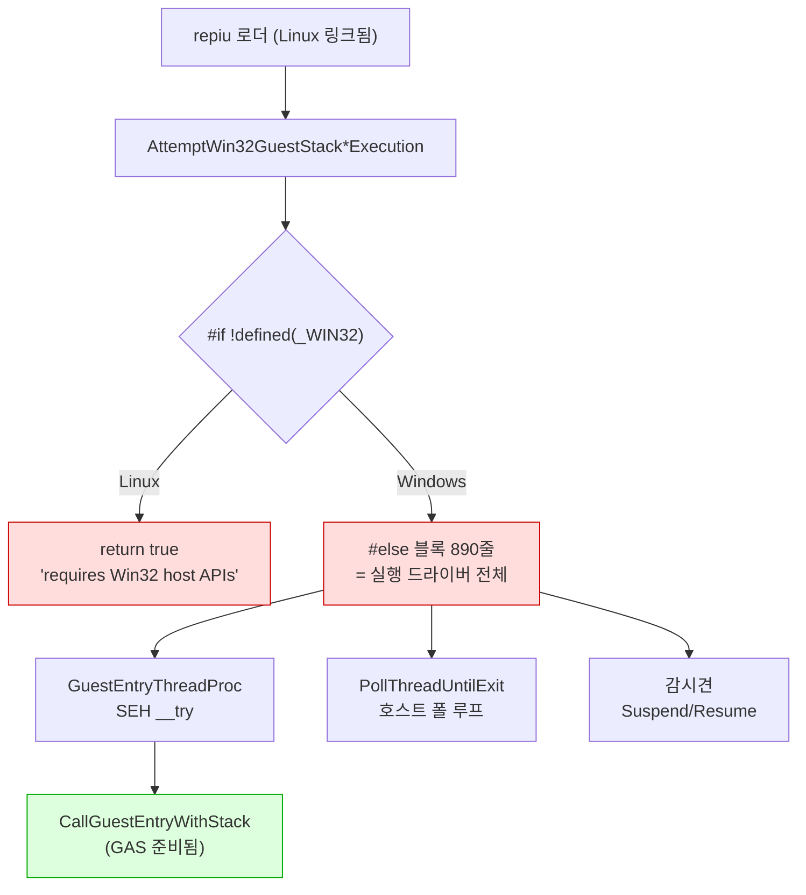
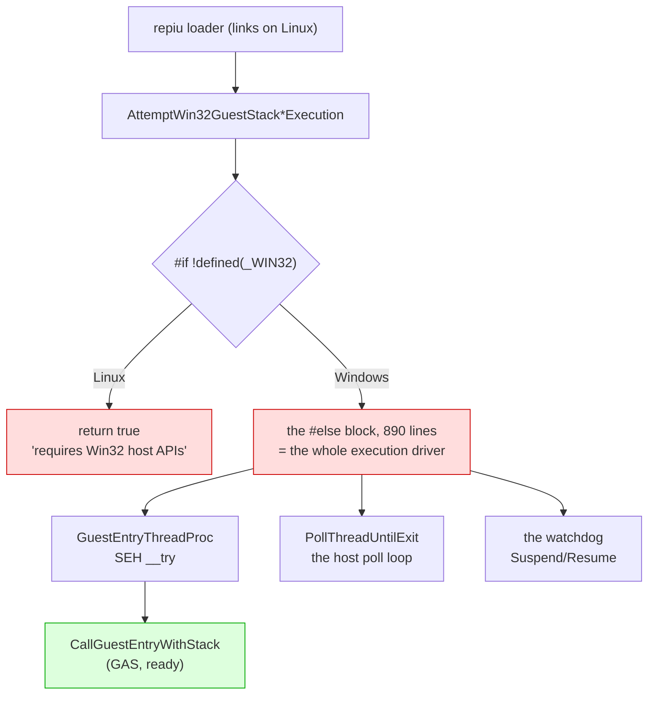

# Linux 이식 frontier / Linux port frontier

설계: [20260822-503](../design/20260822-503-linux-execution-engine.md) ·
작업 지시: [20260822-503](../work-orders/20260822-503-linux-execution-engine.md) ·
작업 로그: [20260822-503](../work-logs/20260822-503-linux-execution-engine.md) ·
측정 절차: [linux-engine-port-measurement](../guides/linux-engine-port-measurement.md)

이 문서는 **Linux 이식이 지금 어디까지 왔는지와 다음에 무엇이 필요한지**만 유지합니다.
단계별 증거는 작업 로그에 있습니다. 표기는 이 디렉터리의 규칙을 따릅니다 — **확인됨**,
**추정**, **미확정**.

## 1. 한 줄 요약

**로더가 Linux에서 링크되고 실행 엔진의 모든 소스가 컴파일되지만, 게스트는 아직 돌지
않습니다.** 실행 드라이버 890줄이 여전히 Windows 전용입니다.

## 2. 확인됨 — 지금 서 있는 것

| 항목 | 상태 | 근거 |
|---|---|---|
| `src/platform/win32` 81개 소스 Linux 컴파일 | **81 / 81** | 3d-16, 3d-17 측정 |
| `repiu` 로더 Linux 링크 | ELF 32-bit `EXEC`, 텍스트 0x40000000, 쓰기 불가 | 3d-17 |
| 엔진 수준 미정의 심볼 | **0** (라이브러리 배선 9개뿐이었고 해결됨) | 3d-17 측정 |
| `repiu_core_probe` | 양쪽 호스트 **15 / 15** | 3d-18 |
| 게스트 스택 전환·폴트 복구 | 양쪽에서 같은 probe 통과 | 3d-16 |
| 스레드 생성·조회·대기·해제 | 양쪽에서 같은 probe 통과 | 3d-18 |

계층으로 내려간 것들입니다.

| 계층 | 헤더 | 단계 |
|---|---|---|
| 게스트 레지스터 컨텍스트 | `platform/guest_cpu_context.h` | 3a |
| 가상 메모리 | `platform/virtual_memory.h` | 3b |
| 폴트 전달 | `platform/fault_handler.h` | 3c |
| 워커 신호 | `platform/worker_signal.h` | 3d-6 |
| 안전한 메모리 복사 | `platform/safe_memory_copy.h` | 3d-7 |
| 시간·사이클 카운터 | `platform/host_time.h` | 3d-8 |
| 환경 변수 읽기·열거·쓰기 | `platform/host_environment.h` | 3d-9, 3d-16, 3d-17 |
| 진단 출력 | `platform/host_error_stream.h` | 3d-14 |
| 스레드 번호·생성·조회·대기 | `platform/host_thread.h` | 3d-15, 3d-18 |
| 게스트 스택 전환 오프셋과 전역 | `platform/guest_stack_switch.h` | 3d-16 |
| 자식 프로세스 재실행 | `platform/host_process.h` | 3d-17 |

어셈블리는 GAS로 옮겨졌습니다 — 다섯 디스패치 thunk(`stack_bridge.inc.S` 매크로 하나,
3d-12)와 트램폴린의 세 진입점(`guest_stack_switch.S`, 3d-16).

## 3. 벽 — 실행 드라이버 890줄

`IsGuestStackSwitchSupported()`가 Linux에서 **false**를 돌려주고, 게스트 스택 분기는
`#if defined(_MSC_VER) && defined(_M_IX86)` 안이라 `return 4`로 끝납니다. **링크가 확인해
준 것은 심볼이 다 있다는 것이지 경로가 있다는 것이 아닙니다.**

## 4. 다음 단계(3d-19)에 필요한 셋

1. **Linux 게스트 스레드 프로시저.** SEH `__try` 없이. 3c 핸들러가 `DispatchGuestFault`로
   전달하고(그 함수는 이미 중립입니다), 처리되지 않은 폴트는 `RecoverToHost`로 되돌려
   `CallGuestEntryWithStack`이 2를 돌려주게 합니다 — Windows의 `__except`가 하는 일과 같은
   결과입니다. **3d-16 probe가 이 왕복을 이미 Linux에서 확인했습니다.**
2. **호스트 폴 루프.** `PollThreadUntilExit`(약 500줄)의 대응물. 블로킹 대기가 아니라
   **폴링**이라는 점이 중요합니다 — Glide 명령 펌프와 타이머 틱 전달이 질문 사이에
   들어갑니다. 3d-18의 `QueryHostThread`가 기다리지 않고 답하도록 만들어진 이유입니다.
3. **`IsGuestStackSwitchSupported()`가 Linux에서 참**이 되는 것, 그리고 그 위의
   `#if !defined(_WIN32)` 조기 반환을 걷어내는 것.

감시견의 정지·재개도 같은 단계에서 시그널로 답합니다 — `TerminateThread`에는 대응물을
만들지 않기로 3d-18에서 정했고, 그 앞의 우아한 경로(정지 → `RecoverToHost` → 재개)가
Linux에서는 유일한 경로가 됩니다.

## 5. 첫 실행 대상 — 게임 자산 없이

**추정.** 게임을 돌리려면 자산 경로와 CHD 마운트가 필요한데 설계가 그것을 **범위 밖**으로
두었습니다. 그 전에 "게스트가 Linux에서 실행된다"만 확인할 대상으로
`build/openwatcom_samples/`의 DOS/4GW 샘플 820개가 있습니다. HLE 프로파일
`dos4gw_console_sample`과 direct executable 경로가 이미 존재하므로 자산이 필요 없습니다.
아직 시도한 적은 없습니다.

## 6. 미확정 — 확인하지 않고 넘어온 것들

| 항목 | 상태 | 어디에 |
|---|---|---|
| 자식 프로세스 재실행이 Linux에도 필요한가 | **미측정** | Task 500의 근거(GPU 드라이버의 주소 공간 선점)가 Linux에도 해당하는지 확인한 적 없음. 되돌릴 자리는 `host_process.h` |
| 자산 경로와 CHD 마운트의 Linux 검증 | **범위 밖** | 설계의 "범위 밖" 절. 실행 시도 전에 다시 볼 것 |
| 오디오 출력 셋 | **무음** | `cd_audio_wave_out`·`ymz280b_audio_out`·`piu10_mp3_audio_out`이 컴파일·링크되지만 Linux 백엔드 없음 |
| 하드웨어 디버그 레지스터 | **불가** | Linux 사용자 공간은 자기 스레드의 것을 쓸 수 없음. `native_linear_span`은 Linux에서 비활성 |
| 교차 프로세스 텔레메트리 | **울타리 안** | `live_telemetry_snapshot.cpp`의 공유 섹션·정지 스냅샷. 게스트 구동에 불필요 |
| `CaptureSuspendedThreadSnapshot` | **호출자 없음** | 정의만 있고 선언도 호출도 없음. 지우는 것은 의도 확인 후 |

## 7. 반복해서 겪은 함정 하나

**막고 있는 것 하나가 그 뒤의 숫자를 전부 가립니다.** 세 번 겪었습니다.

| 단계 | 막고 있던 것 | 겉보기 | 실제 |
|---|---|---|---|
| 3d-15 | 2,000줄 `#if defined(_WIN32)` | 실패 84 | 97 (숨은 것은 13개뿐) |
| 3d-16 | `#include <psapi.h>` 한 줄 | fatal error 1 | 17개, 네 곳 |
| 3d-17 | 빠진 spdlog include 경로 | fatal error 1 | 19개, 두 곳 |

**파일 크기도 오류 개수도 남은 작업량의 지표가 아닙니다.** 절차는
[측정 가이드](../guides/linux-engine-port-measurement.md)에 있습니다 — 저장소를 고치지 말고
**막고 있는 것을 치운 사본**으로 다시 재십시오.

---

# Linux port frontier

Design: [20260822-503](../design/20260822-503-linux-execution-engine.md) ·
Work order: [20260822-503](../work-orders/20260822-503-linux-execution-engine.md) ·
Work log: [20260822-503](../work-logs/20260822-503-linux-execution-engine.md) ·
Measurement: [linux-engine-port-measurement](../guides/linux-engine-port-measurement.md)

This document keeps only **where the Linux port stands and what the next step needs**. Per-sub-stage
evidence is in the work log. Status labels follow this directory's convention: **Confirmed**,
**Inferred**, **Unresolved**.

## 1. In one line

**The loader links on Linux and every source of the execution engine compiles, but the guest does not
run yet.** 890 lines of the execution driver are still Windows-only.

## 2. Confirmed — what stands today

| Item | State | Evidence |
|---|---|---|
| The 81 `src/platform/win32` sources compiling on Linux | **81 of 81** | 3d-16, 3d-17 measurements |
| The `repiu` loader linking on Linux | ELF 32-bit `EXEC`, text at 0x40000000, not writable | 3d-17 |
| Undefined symbols of the engine's own | **none** (nine were library wiring, resolved) | 3d-17 measurement |
| `repiu_core_probe` | **15 of 15** on both hosts | 3d-18 |
| The guest stack switch and fault recovery | the same probe passes on both | 3d-16 |
| Thread create, query, join, release | the same probe passes on both | 3d-18 |

What moved into the platform layer:

| Layer | Header | Sub-stage |
|---|---|---|
| Guest register context | `platform/guest_cpu_context.h` | 3a |
| Virtual memory | `platform/virtual_memory.h` | 3b |
| Fault delivery | `platform/fault_handler.h` | 3c |
| Worker signal | `platform/worker_signal.h` | 3d-6 |
| Safe memory copy | `platform/safe_memory_copy.h` | 3d-7 |
| Time and cycle counter | `platform/host_time.h` | 3d-8 |
| Environment read, enumerate, write | `platform/host_environment.h` | 3d-9, 3d-16, 3d-17 |
| Diagnostic output | `platform/host_error_stream.h` | 3d-14 |
| Thread id, create, query, join | `platform/host_thread.h` | 3d-15, 3d-18 |
| Stack-switch offsets and globals | `platform/guest_stack_switch.h` | 3d-16 |
| Child-process relaunch | `platform/host_process.h` | 3d-17 |

The assembly is in GAS: the five dispatch thunks as one macro in `stack_bridge.inc.S` (3d-12), and
the trampoline's three entries in `guest_stack_switch.S` (3d-16).

## 3. The wall — 890 lines of execution driver

`IsGuestStackSwitchSupported()` answers **false** on Linux, and the guest-stack branch sits inside
`#if defined(_MSC_VER) && defined(_M_IX86)`, ending at `return 4`. **What linking established is that
every symbol exists — not that a path does.**

## 4. What the next sub-stage (3d-19) needs

1. **A Linux guest thread procedure**, without the SEH `__try`. The 3c handler forwards to
   `DispatchGuestFault` — already neutral — and turns an unhandled fault back with `RecoverToHost`,
   so `CallGuestEntryWithStack` returns 2, which is the same outcome Windows' `__except` produces.
   **The 3d-16 probe already exercised that round trip on Linux.**
2. **A host poll loop** standing where `PollThreadUntilExit` (about 500 lines) does. That it
   *polls* rather than blocks is the important part — pumping Glide commands and delivering timer
   ticks happen between the questions, which is why 3d-18's `QueryHostThread` answers without
   waiting.
3. **`IsGuestStackSwitchSupported()` answering true on Linux**, and removing the
   `#if !defined(_WIN32)` early return above it.

The watchdog's suspend and resume are answered with a signal in the same sub-stage. 3d-18 settled
that `TerminateThread` gets no counterpart: the graceful path ahead of it (suspend, `RecoverToHost`,
resume) becomes the only path on Linux.

## 5. A first run target that needs no game assets

**Inferred.** Running the game needs asset paths and the CHD mount, which the design placed **out of
scope**. Before that, the 820 DOS/4GW samples under `build/openwatcom_samples/` would establish only
that the guest executes on Linux. The `dos4gw_console_sample` HLE profile and the direct-executable
path already exist, so no assets are involved. This has not been attempted.

## 6. Unresolved — carried across without confirmation

| Item | State | Where |
|---|---|---|
| Whether Linux needs the child-process relaunch | **not measured** | Task 500's reason (a GPU driver claiming the guest's address space) has never been checked on Linux. `host_process.h` is where it comes out |
| Asset paths and the CHD mount on Linux | **out of scope** | the design's out-of-scope section; revisit before attempting a run |
| The three audio outputs | **silent** | `cd_audio_wave_out`, `ymz280b_audio_out`, `piu10_mp3_audio_out` compile and link with no Linux backend |
| Hardware debug registers | **unavailable** | Linux user space cannot write its own thread's, so `native_linear_span` stays disabled there |
| Cross-process telemetry | **fenced** | the shared section and suspended snapshot in `live_telemetry_snapshot.cpp`; not needed to run the guest |
| `CaptureSuspendedThreadSnapshot` | **no callers** | defined, never declared or called; removing it wants its intent confirmed first |

## 7. One trap met three times

**A single obstruction hides every number behind it.**

| Sub-stage | The obstruction | Apparent | Actual |
|---|---|---|---|
| 3d-15 | a 2,000-line `#if defined(_WIN32)` | 84 failures | 97 (only 13 were hidden) |
| 3d-16 | one `#include <psapi.h>` | 1 fatal error | 17, in four places |
| 3d-17 | a missing spdlog include directory | 1 fatal error | 19, in two places |

**Neither file size nor error count measures the work remaining.** The procedure is in the
[measurement guide](../guides/linux-engine-port-measurement.md): measure a **copy with the
obstruction removed**, without editing the repository to find out.
