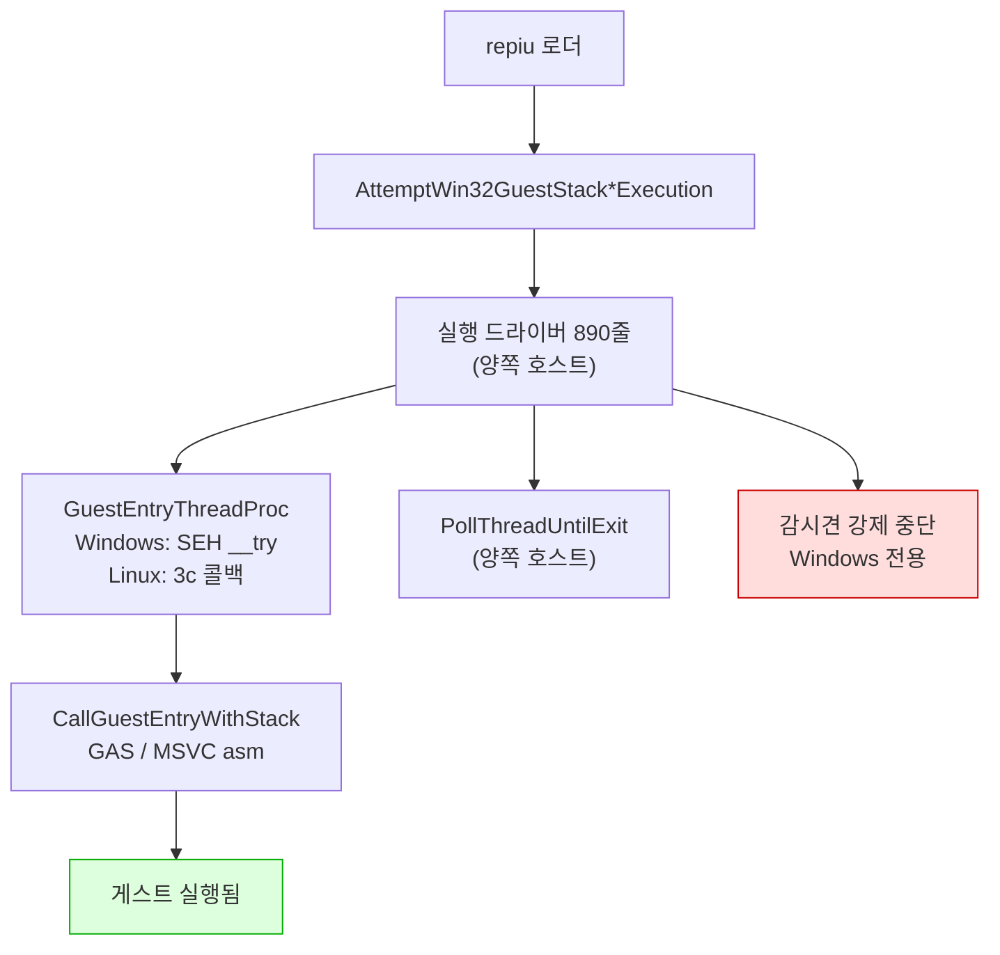
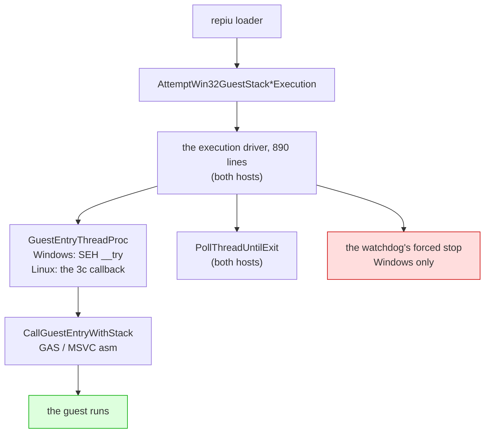

# Linux 이식 frontier / Linux port frontier

설계: [20260822-503](../design/20260822-503-linux-execution-engine.md) ·
작업 지시: [20260822-503](../work-orders/20260822-503-linux-execution-engine.md) ·
작업 로그: [20260822-503](../work-logs/20260822-503-linux-execution-engine.md) ·
측정 절차: [linux-engine-port-measurement](../guides/linux-engine-port-measurement.md)

이 문서는 **Linux 이식이 지금 어디까지 왔는지와 다음에 무엇이 필요한지**만 유지합니다.
단계별 증거는 작업 로그에 있습니다. 표기는 이 디렉터리의 규칙을 따릅니다 — **확인됨**,
**추정**, **미확정**.

## 1. 한 줄 요약

**게스트 코드가 Linux에서 실행됩니다.** DOS/4GW 샘플이 `legacy` 백엔드로 돌고 Windows와 같은
명령에서 멈춥니다. 기본 백엔드 `dynamic`은 AOT 코드 캐시가 아직 Windows 전용이라 Linux에서는
`REPIU_EXECUTION_BACKEND=legacy`가 필요합니다.

**창은 열립니다(Task 505). 화면은 아직 안 나옵니다.** Glide 창이 640x480 논리 해상도로 열리고
상태 초기화도 완주하지만, 게스트가 **첫 프레임에 도달하지 못합니다** — 대기 루프에 갇힙니다
(6절). 오디오는 장치가 열립니다. **"실행된다"·"창이 열린다"·"그려진다"는 서로 다른 세 가지이고,
진행 지표(dispatch·EIP)는 그 중 첫째까지만 답합니다.**

## 2. 확인됨 — 지금 서 있는 것

| 항목 | 상태 | 근거 |
|---|---|---|
| `src/platform/win32` 81개 소스 Linux 컴파일 | **81 / 81** | 3d-16, 3d-17 측정 |
| `repiu` 로더 Linux 링크 | ELF 32-bit `EXEC`, 텍스트 0x40000000, 쓰기 불가 | 3d-17 |
| 엔진 수준 미정의 심볼 | **0** (라이브러리 배선 9개뿐이었고 해결됨) | 3d-17 측정 |
| `repiu_core_probe` | 양쪽 호스트 **15 / 15** | 3d-18 |
| 게스트 스택 전환·폴트 복구 | 양쪽에서 같은 probe 통과 | 3d-16 |
| 스레드 생성·조회·대기·해제 | 양쪽에서 같은 probe 통과 | 3d-18 |
| **게스트 실행** | **샘플 실행, Windows와 같은 명령에서 정지** | **3d-19** |
| 폴트 18건·종료 코드·blocker | 두 호스트 일치 | 3d-19 |

계층으로 내려간 것들입니다.

| 계층 | 헤더 | 단계 |
|---|---|---|
| 게스트 레지스터 컨텍스트 | `platform/guest_cpu_context.h` | 3a |
| 가상 메모리 | `platform/virtual_memory.h` | 3b |
| 폴트 전달 | `platform/fault_handler.h` | 3c |
| 워커 신호 | `platform/worker_signal.h` | 3d-6 |
| 안전한 메모리 복사 | `platform/safe_memory_copy.h` | 3d-7 |
| 시간·사이클 카운터 | `platform/host_time.h` | 3d-8 |
| 환경 변수 읽기·열거·쓰기 | `platform/host_environment.h` | 3d-9, 3d-16, 3d-17 |
| 진단 출력 | `platform/host_error_stream.h` | 3d-14 |
| 스레드 번호·생성·조회·대기 | `platform/host_thread.h` | 3d-15, 3d-18 |
| 게스트 스택 전환 오프셋과 전역 | `platform/guest_stack_switch.h` | 3d-16 |
| 자식 프로세스 재실행 | `platform/host_process.h` | 3d-17 |
| 양보·짧은 대기 | `platform/host_time.h` | 3d-19 |

어셈블리는 GAS로 옮겨졌습니다 — 다섯 디스패치 thunk(`stack_bridge.inc.S` 매크로 하나,
3d-12)와 트램폴린의 세 진입점(`guest_stack_switch.S`, 3d-16).

## 3. 벽은 열렸습니다 (3d-19)



`IsGuestStackSwitchSupported()`와 `IsDirectX86ExecutionSupported()`는 이제 컴파일러가 아니라
**아키텍처**를 묻습니다 — 3d-16이 스택 전환을 GAS로 쓴 뒤로 컴파일러에 달려 있지 않습니다.

## 3.5 2026-08-27 main 병합 인계

이 날 main에 들어간 것은 다섯입니다. 종합 설계는 없고, 각 작업의 설계·지시서·로그가 정본입니다.

| 커밋 | 무엇 |
|---|---|
| `6f9ac34` | 503d-22 마감 — 포기한 인터럽트가 다시 오지 못함을 probe로 고정, 그 과정에서 드러난 교차 스레드 구멍을 닫음 |
| `9acbabe` | `SA_NODEFER`를 **후보에서 제외** — 증상을 원인으로 읽고 있었음. 같은 플래그를 두고 자기모순이던 주석도 정정 |
| `bd6e736` | 503d-23 — **9초 정지 해결.** `native_fast_path`가 복귀 브레이크포인트를 무장하면서 트랩 플래그를 해제하는데 Linux에서 무장만 버려짐 |
| `db234db` | Task 505 — **Glide 창이 Linux에서 열림.** 이식이 아니라 울타리 57개 해제 |
| `486fe09` | `0x010EE1xx`를 "대기 루프"라 한 것 정정 — Task 219가 이미 확정한 비트스트림 디코더 |

### 이 날 반복해서 걸린 것

**성공 신호 하나로 성공을 판정한 것**이 세 번입니다.

| 무엇을 봤나 | 무엇으로 읽었나 | 실제 |
|---|---|---|
| `exit 0` | 정상 완주 | 창을 못 열어 게임이 포기 |
| `opened=1` | 창이 열림 | 더미 폴백도 같은 값을 반환 |
| `dispatch_entry` 폭증 | 전진 중 | 일하는 중이지 나아가는 중이 아님 |

그리고 **관측 창보다 긴 주기는 보이지 않는다**에 두 번 걸렸습니다 — 30초는 "느리다",
240초는 "갇혔다", 1,200초에서야 실상.

세 경우 모두 **한 걸음 더 갔으면** 잡혔습니다. 종료 코드 대신 로그를, 반환값 대신 메시지를,
카운터 대신 EIP 궤적과 코드를 봤어야 했습니다. `0x010EE1xx`는 특히 그렇습니다 — 답이
저장소 안에 두 달 전부터 있었습니다.

### 다음

**AOT 코드 캐시 이식**([Task 506](../design/20260827-506-linux-aot-code-cache.md))이고, 성격이
바뀌었습니다 — "기본 백엔드에 필요"가 아니라 **화면이 기다리는 항목**입니다.

## 4. 다음에 필요한 것

> 이 절은 3d-20을 가리키고 있었습니다. 3d-20(다른 스레드의 레지스터)·3d-21(표본기)·
> 3d-22(시한이 지난 인터럽트)는 끝났고, 목록에서 **빠지지 않은 둘**이 아래에 그대로
> 남습니다. 인터럽트 계층 자체는 양쪽 호스트에서 probe를 통과합니다.

1. **AOT 코드 캐시**(`aot_code_cache_win32.cpp`). 기본 백엔드 `dynamic`이 Linux에서 돌려면
   필요하고, **Task 505 이후로는 화면을 여는 열쇠이기도 합니다** — legacy의 명령 단위 단일
   스텝(초당 약 127,000 디스패치)으로는 시작 시 자산 디코드가 끝나지 않아 첫 프레임에
   도달하지 못합니다(6절). 3d-19가 배치 함수를 옮기다 **Win32 메모리 호출 23곳**을 보고 되돌렸습니다 —
   동적 번역 경로가 캐시를 쓰기 가능으로 바꾸고, 패치하고, 실행 가능으로 되돌리는 주기를
   반복합니다. 전부 3b가 덮는 호출이라 기계적이지만 양이 있습니다.
2. **감시견의 강제 중단.** 3d-18이 답을 정했습니다 — `TerminateThread`에는 대응물을 만들지
   않고, 그 앞의 우아한 경로(정지 → `RecoverToHost` → 재개)를 Linux에서는 시그널로 합니다.
   구현만 남았습니다. 이 경로는 예산 만료나 창 닫힘에만 도는 것이라 3d-19의 실행에는
   걸리지 않았습니다.

## 5. 실행 확인 방법 (3d-19에서 확립)

게임 자산 없이 "게스트가 도는가"를 확인하는 절차입니다. `build/openwatcom_samples/`의 DOS/4GW
샘플과 direct executable 경로를 씁니다.

```bash
cd build/linux_i386
REPIU_EXECUTION_BACKEND=legacy ./repiu     ../../build/openwatcom_samples/clibexam__bprintf_c/sample.exe
```

같은 샘플을 Windows에서 돌려 **대조하는 것이 요점**입니다. 3d-19 시점의 기준값:

| 항목 | 값 |
|---|---|
| 폴트 총계 | 18 (양쪽) |
| 스레드 종료 코드 | 2 (양쪽) |
| 정지 지점 | `… 8E C1 89 D6 42 [26] 80 3E 00 …`, focus offset 0x10, opcode 0x80 (양쪽) |
| 예외 코드 | Linux `0x0000000B` / Windows `0xC0000005` — 호스트 번호이고 기록용 |
| census 칸 | Linux 18/0 / Windows 17/1 — Windows에만 구분되는 코드가 있어서 |

주소는 재배치 이미지 베이스만큼 다릅니다(Linux 0x01000000, Windows 0x03000000). **오프셋으로
비교하십시오.**

## 6. 미확정 — 확인하지 않고 넘어온 것들

| 항목 | 상태 | 어디에 |
|---|---|---|
| 자식 프로세스 재실행이 Linux에도 필요한가 | **미측정** | Task 500의 근거(GPU 드라이버의 주소 공간 선점)가 Linux에도 해당하는지 확인한 적 없음. 되돌릴 자리는 `host_process.h` |
| 자산 경로와 CHD 마운트의 Linux 검증 | **범위 밖** | 설계의 "범위 밖" 절. 실행 시도 전에 다시 볼 것 |
| ~~렌더 백엔드 (창)~~ | **해결 (Task 505)** | 이식할 것이 없었습니다 — 두 파일 모두 이미 SDL3이고 진짜 Win32 API는 **0개**였습니다. 503d-10이 컴파일용으로 세운 울타리 57개(backend 44 + shader 13)가 전부였고, 실제 수정은 각 파일 한 줄(`SDL_FunctionPointer`)입니다. 이제 `opened=1`, 640x480 논리 창 2배(1280x960), 깊이 24비트 승인 |
| **첫 프레임에 도달하지 못함 (화면)** | **정체는 확인, 종료 여부 미확정 — 새 경계** | 창은 열리고 Glide 상태 초기화도 완주(11종 setter, 오류 0건)하는데 **버퍼 스왑이 0회**입니다(30초·240초 모두). 게스트는 `0x010EE170`–`0x010EE1DA`에 머무는데, 이곳은 **Task 219가 이미 확정한 비트스트림(Huffman류) 디코더**입니다 — 같은 주소(Windows 베이스로 `0x030EE170`). **대기가 아니라 디코드**이며, `--dump` 역어셈블(비트 버퍼 `[0x013a6194]`, 16회·256회 테이블 루프)이 이를 확인합니다. 감속 원인은 Task 219의 AOT 인라인 캐시 스래싱(Task 499에서 해소)이 아니라 **legacy의 명령 단위 단일 스텝**입니다 — 초당 약 127,000 디스패치, 네이티브 대비 약 만 배. 1,200초 실행에서 게스트는 디코더를 **드나듭니다**(418초 `0x010579F5`, 718초 `0x01087408`, 1078초 `0x010579B6`) — 갇힌 것이 아니라 자산을 하나씩 처리하며 전진하는 모습. 그래도 **스왑은 1,200초 내내 0회**. 유한한 디코드인지는 Task 219의 미확정 항목 (2) 그대로 미해결이며, **legacy로는 실용적이지 않다는 것이 결론** — 초당 127,000 디스패치는 네이티브 대비 약 만 배 (2026-08-27) |
| 오디오 출력 셋 | **정정됨** | 아래 8절 |
| 하드웨어 디버그 레지스터 | **불가 — 이제 술어로 강제** | Linux 사용자 공간은 자기 스레드의 것을 쓸 수 없습니다. **`native_linear_span`만이 아니라** `native_fast_path`·`native_region`도 이 위에 서 있었고, 그 중 `native_fast_path`는 **기본 켜짐**이라 9초 정지를 냈습니다(3d-23). `HardwareDebugRegistersAvailable()`이 셋 모두를 env 설정보다 앞에서 막습니다 |
| 교차 프로세스 텔레메트리 | **울타리 안** | `live_telemetry_snapshot.cpp`의 공유 섹션·정지 스냅샷. 게스트 구동에 불필요 |
| `CaptureSuspendedThreadSnapshot` | **호출자 없음** | 정의만 있고 선언도 호출도 없음. 지우는 것은 의도 확인 후 |
| 종료 시 SIGTRAP | **미확인** | 실행 예산이 만료된 뒤 teardown에서 코어를 떨굽니다(2026-08-26, pumpit1, legacy, 8초 예산). 실행 자체는 정상이었고 오디오와도 무관합니다. 어느 단계에서 나는지 아직 좁히지 않았습니다 |
| ~~pumpit1의 9초 정지~~ | **해결 (3d-23)** | 근인은 `native_fast_path`가 복귀 브레이크포인트를 무장하면서 트랩 플래그를 해제하는데, Linux에서 무장만 버려진 것. 게스트가 되돌릴 것 없이 풀려났습니다. `fast=18/0/17`(복귀 0)이 카운터에 그대로 있었습니다. 디버그 레지스터가 없는 곳에서 세 경로를 차단해 수정 |
| 인터럽트 핸들러가 반환하지 않는 것 | **원인 미상** | 정지한 게스트에서 첫 배달이 핸들러로 들어간 뒤 반환하지 않았고, 그래서 이후 46건이 전부 보류·시한 초과가 됐습니다. **`SA_NODEFER`는 답이 아닙니다** — 아래를 볼 것 |
| ~~인터럽트 핸들러의 `SA_NODEFER`~~ | **후보에서 제외 (2026-08-27)** | 이것을 "고칠 거리"로 적어 둔 것이 오해였습니다. 이 플래그가 **없어서** 시그널 하나가 한 스레드에서 차단된 채 남고, 그것이 "핸들러가 반환하지 않았다"를 읽게 해 준 **진단 신호**입니다. 붙이면 멈춘 핸들러가 반환하게 되는 게 아니라 그 안으로 배달이 중첩되고, 이 스레드는 이미 3c의 대체 스택 위에 있어 그 스택이 조용히 넘칩니다. 근거는 `host_thread.cpp`의 `EnsureInterruptHandler` 주석에 있습니다 |

## 7. 정정 — 오디오 출력은 이미 이식되어 있었습니다

이 문서의 이전 판은 오디오 출력 셋을 "Linux 백엔드 없음, 무음"으로 적었습니다. **틀렸습니다.**
세 파일 모두 이미 SDL을 쓰고 있고 waveOut 호출이 하나도 없습니다.

| 파일 | `SDL_` 호출 | waveOut 호출 |
|---|---|---|
| `ymz280b_audio_out.cpp` | 16 | **0** |
| `piu10_mp3_audio_out.cpp` | 31 | **0** |
| `cd_audio_wave_out.cpp` | 24 | **0** |

`cd_audio_wave_out`은 **이름만** waveOut입니다. 설계의 "정정 1"이 `Win32AotPageWriteWatchSet`
이름을 보고 `GetWriteWatch`를 쓴다고 단정했다 틀린 것과 **같은 함정**이고, 그 교훈은 이미
설계에 적혀 있었습니다 — **이름이 아니라 구현을 봐야 합니다.**

소리가 나지 않은 진짜 이유는 SDL 쪽이었습니다. i386 빌드인데 `libpulse`의 32비트 판이 없어
SDL이 PulseAudio 백엔드를 빼고 ALSA만 컴파일했고, WSL에는 ALSA가 직접 열 장치가 없습니다.

```
#define SDL_AUDIO_DRIVER_ALSA 1     ← 이것만 있었음
#define SDL_AUDIO_DRIVER_DISK 1
#define SDL_AUDIO_DRIVER_DUMMY 1
```

`libpulse-dev:i386`을 넣고 트리를 **버리고 다시 구성**해야 합니다 — SDL의 드라이버 감지는
구성 시점에 캐시되므로, 남은 캐시가 "안 고쳐졌다"처럼 보이게 만듭니다.

### 7.1 그래서 갖춰야 하는 구성 (2026-08-26 확인)

위가 진단이고, 여기는 **실제로 세워 놓고 확인한 결과**입니다. 다음 세션이 데스크톱에서
돌려 보려면 이 절만 보면 됩니다.

패키지는 전부 `:i386`입니다. 32비트 프로세스가 링크하고 `dlopen` 하는 것들이라 amd64 판은
설치돼 있어도 쓰이지 않습니다.

```bash
sudo dpkg --add-architecture i386
sudo apt update && sudo apt install -y pkg-config \
    libpulse-dev:i386 libasound2-dev:i386 libgl-dev:i386 \
    libx11-dev:i386 libxext-dev:i386 libxrandr-dev:i386 libxi-dev:i386 \
    libxfixes-dev:i386 libxcursor-dev:i386 libxrender-dev:i386 \
    libxkbcommon-dev:i386
```

`libxss-dev`와 `libxtst-dev`는 **필요 없습니다.** 빌드 스크립트가 XSCRNSAVER와 XTEST를 끄고,
그 주석이 이유를 적어 두었습니다 — 켜 둔 확장 하나가 곧 찾아야 할 32비트 패키지 하나입니다.

`pkg-config`가 빠지기 쉽습니다. 없으면 SDL이 PulseAudio를 **조용히** 빼고, 있어도 i386 `.pc`가
`/usr/lib/i386-linux-gnu/pkgconfig`에 있어 기본 검색 경로에 안 잡힙니다. 그래서 패키지를 깔아도
"없다"는 답이 나옵니다. 빌드 스크립트가 `PKG_CONFIG_PATH`로 그 디렉터리를 앞에 붙입니다.

확인된 것:

| 항목 | 결과 |
|---|---|
| SDL 오디오 드라이버 | `PULSEAUDIO` + `ALSA` (이전엔 `DUMMY`뿐) |
| SDL 비디오 드라이버 | `X11` (+ XCURSOR·XFIXES·XINPUT2·XRANDR·XSHAPE·XSYNC·XDBE) |
| 런처 | WSLg에서 창 실행, 롬셋 22개 중 16개 인식 |
| **오디오 장치** | `[repiu-ymz] YMZ280B ready through SDL3 at 88200 Hz` |
| 게스트 실행 (pumpit1, legacy) | 8초 동안 dispatch 167,776회, EIP가 재배치 이미지 안에서 이동 |

소리가 실제로 **들리는지**는 사람이 들어야 합니다. 측정이 답할 수 있는 것은 장치가 열렸다는
데까지입니다.

두 가지가 이 확인을 반복할 때 걸립니다.

* **`--headless`로 구성된 트리는 창도 소리도 만들지 못합니다.** 그 옵션이 켜는
  `SDL_UNIX_CONSOLE_BUILD=ON`은 X11/Wayland 요구를 통째로 건너뜁니다. 데스크톱에서 쓰려면
  `--headless` 없이 구성하고, SDL이 감지 결과를 캐시하므로 **트리를 지우고** 다시 해야 합니다.
* **WSLg 자체가 없을 수 있습니다.** `/mnt/wslg`가 없거나 `DISPLAY`·`PULSE_SERVER`가 비어 있으면
  패키지가 아니라 WSL이 문제입니다. `wsl --update` 후 `wsl --shutdown`입니다. 오래된 커널
  (5.10 대)에는 WSLg가 아예 없습니다.

## 8. 반복해서 겪은 함정 — 그리고 컴파일로는 못 잡는 것

**막고 있는 것 하나가 그 뒤의 숫자를 전부 가립니다.** 네 번 겪었습니다.

| 단계 | 막고 있던 것 | 겉보기 | 실제 |
|---|---|---|---|
| 3d-15 | 2,000줄 `#if defined(_WIN32)` | 실패 84 | 97 (숨은 것은 13개뿐) |
| 3d-16 | `#include <psapi.h>` 한 줄 | fatal error 1 | 17개, 네 곳 |
| 3d-17 | 빠진 spdlog include 경로 | fatal error 1 | 19개, 두 곳 |
| 3d-19 | 함수 **반환 타입**의 `DWORD` | 오류 2 | 69개 (시그니처가 본문을 가림) |

**파일 크기도 오류 개수도 남은 작업량의 지표가 아닙니다.** 절차는
[측정 가이드](../guides/linux-engine-port-measurement.md)에 있습니다 — 저장소를 고치지 말고
**막고 있는 것을 치운 사본**으로 다시 재십시오.

**그리고 3d-19가 다른 종류를 하나 더 찾았습니다.** `runtime_memory_policy.cpp`는 컴파일 측정을
**늘 통과했습니다** — 컴파일되고 `#if !defined(_WIN32)`에서 조기 반환만 했기 때문입니다.
조기 반환 넷을 찾은 것은 어떤 측정도 아니고 **실제 실행**이었습니다.

> 컴파일되는 코드가 아무것도 하지 않는 것은 컴파일로 볼 수 없습니다.

같은 모양이 남아 있는 곳은 **넷**이고, 전부 AOT 경로입니다(`grep -rn "requires Win32"`).

| 파일 | 함수가 답하지 않는 것 |
|---|---|
| `aot_code_cache_win32.cpp:812` | 코드 캐시 배치 |
| `aot_code_cache_win32.cpp:1023` | 동적 번역 |
| `aot_code_cache_win32.cpp:1775` | inline-cache 패치 |
| `aot_page_coherence_win32.cpp:637` | 게스트 페이지 회수 |

3d-20의 목록이 이것입니다.

### 8.1 빌드 스크립트가 스스로를 가린 경우

**빌드가 죽은 자리가 빌드가 잘못한 자리는 아닙니다.**

`cmake --build --parallel`을 숫자 없이 부르면 make에 `-j`가 숫자 없이 전달됩니다. 그것은
코어 수가 아니라 **무제한**이고, 4코어 VM에서 `cc1plus` **58개**가 측정됐습니다. Debug의 큰
번역 단위가 1 GB 넘게 쓰므로 VM 메모리가 고갈됐고, WSL이 세 번 통째로 멈췄습니다 — 그때마다
**서로 다른 고장으로 보였습니다.**

| 겉보기 | 실제 |
|---|---|
| `cc1plus`가 OOM으로 죽음 | 무제한 병렬 |
| `Wsl/Service/E_UNEXPECTED` | 무제한 병렬 |
| `Wsl/Service/0x8007274c` | 무제한 병렬 |

가린 것을 하나 더 겹치게 만든 것은 **분명해 보이는 조절 수단이 아무 일도 하지 않는다**는
점이었습니다. CMake는 `--parallel`이 붙어 있으면 `CMAKE_BUILD_PARALLEL_LEVEL`을 **보지
않습니다.** 그래서 병렬도를 1이나 2로 낮췄다고 믿은 세 번의 시도가 전부 무제한이었고, 그 결과
"이 머신이 이 프로젝트에는 작다"는 잘못된 결론이 두 번 나왔습니다. 커밋 `d838ce1`이 잡 수를
명시합니다.

호스트가 8 GB급이면 `.wslconfig`로 상한과 스왑을 주는 편이 안전합니다 — 죽는 대신 느려집니다.

```ini
[wsl2]
memory=4GB
swap=8GB
```

---

# Linux port frontier

Design: [20260822-503](../design/20260822-503-linux-execution-engine.md) ·
Work order: [20260822-503](../work-orders/20260822-503-linux-execution-engine.md) ·
Work log: [20260822-503](../work-logs/20260822-503-linux-execution-engine.md) ·
Measurement: [linux-engine-port-measurement](../guides/linux-engine-port-measurement.md)

This document keeps only **where the Linux port stands and what the next step needs**. Per-sub-stage
evidence is in the work log. Status labels follow this directory's convention: **Confirmed**,
**Inferred**, **Unresolved**.

## 1. In one line

**Guest code executes on Linux.** A DOS/4GW sample runs under the `legacy` backend and stops at the
same instruction as Windows. The default `dynamic` backend still needs the AOT code cache, which is
Windows-only, so Linux needs `REPIU_EXECUTION_BACKEND=legacy` today.

**A window opens (Task 505). The screen still does not.** The Glide window opens at 640x480 logical
and state setup completes, but the guest **never reaches a first frame** — it is caught in a wait
loop (section 6). Audio's device opens. **"Executes", "opens a window" and "draws" are three
different things, and the progress counters (dispatches, EIP) answer only the first.**

**A window and sound are confirmed on WSLg too** — the launcher's window, and `YMZ280B ready through
SDL3 at 88200 Hz`. The 32-bit packages this needs, and the traps around them, are collected in 7.1.

## 2. Confirmed — what stands today

| Item | State | Evidence |
|---|---|---|
| The 81 `src/platform/win32` sources compiling on Linux | **81 of 81** | 3d-16, 3d-17 measurements |
| The `repiu` loader linking on Linux | ELF 32-bit `EXEC`, text at 0x40000000, not writable | 3d-17 |
| Undefined symbols of the engine's own | **none** (nine were library wiring, resolved) | 3d-17 measurement |
| `repiu_core_probe` | **15 of 15** on both hosts | 3d-18 |
| The guest stack switch and fault recovery | the same probe passes on both | 3d-16 |
| Thread create, query, join, release | the same probe passes on both | 3d-18 |
| **Guest execution** | **the sample runs, stopping where Windows does** | **3d-19** |
| 18 faults, exit code, blocker | the two hosts agree | 3d-19 |

What moved into the platform layer:

| Layer | Header | Sub-stage |
|---|---|---|
| Guest register context | `platform/guest_cpu_context.h` | 3a |
| Virtual memory | `platform/virtual_memory.h` | 3b |
| Fault delivery | `platform/fault_handler.h` | 3c |
| Worker signal | `platform/worker_signal.h` | 3d-6 |
| Safe memory copy | `platform/safe_memory_copy.h` | 3d-7 |
| Time and cycle counter | `platform/host_time.h` | 3d-8 |
| Environment read, enumerate, write | `platform/host_environment.h` | 3d-9, 3d-16, 3d-17 |
| Diagnostic output | `platform/host_error_stream.h` | 3d-14 |
| Thread id, create, query, join | `platform/host_thread.h` | 3d-15, 3d-18 |
| Stack-switch offsets and globals | `platform/guest_stack_switch.h` | 3d-16 |
| Child-process relaunch | `platform/host_process.h` | 3d-17 |
| Yielding and short waits | `platform/host_time.h` | 3d-19 |

The assembly is in GAS: the five dispatch thunks as one macro in `stack_bridge.inc.S` (3d-12), and
the trampoline's three entries in `guest_stack_switch.S` (3d-16).

## 3. The wall is open (3d-19)



`IsGuestStackSwitchSupported()` and `IsDirectX86ExecutionSupported()` now ask about the
**architecture** rather than the compiler — since 3d-16 wrote the stack switch in GAS, the compiler
stopped being the question.

## 3.5 Main-merge handoff, 2026-08-27

Five things landed on main this day. There is no consolidated design; each task's design, work order
and log are the record.

| Commit | What |
|---|---|
| `6f9ac34` | Closing out 503d-22 — a probe pins that an abandoned interrupt cannot come back, and the cross-thread hole that surfaced while writing it is closed |
| `9acbabe` | `SA_NODEFER` **struck as a candidate** — a symptom had been read as a cause. A comment that contradicted itself about the same flag is corrected |
| `bd6e736` | 503d-23 — **the nine-second stall resolved.** `native_fast_path` arms a return breakpoint and clears the trap flag; on Linux only the arming was discarded |
| `db234db` | Task 505 — **a Glide window opens on Linux.** Not a port but 57 fences taken down |
| `486fe09` | Correcting "wait loop" for `0x010EE1xx` — it is the bitstream decoder Task 219 already identified |

### What caught me repeatedly

**Judging success from a single success signal**, three times.

| What was seen | How it was read | What it was |
|---|---|---|
| `exit 0` | a clean finish | the game giving up for want of a window |
| `opened=1` | a window opened | the dummy fallback returns the same value |
| a soaring `dispatch_entry` | advancing | working, not advancing |

And twice by **a window showing nothing with a period longer than itself** — thirty seconds said
"slow", 240 said "trapped", and only 1,200 showed what was happening.

All three would have been caught by **going one step further**: the log rather than the exit code,
the message rather than the return value, the EIP trajectory and the code rather than the counter.
`0x010EE1xx` most of all — the answer had been in this repository for two months.

### Next

**Porting the AOT code cache** ([Task 506](../design/20260827-506-linux-aot-code-cache.md)), and its
character has changed: not "the default backend needs it" but **the item the screen is waiting on**.

## 4. What is needed next

> This section used to point at 3d-20. 3d-20 (another thread's registers), 3d-21 (the sampler) and
> 3d-22 (what a timed-out interrupt leaves behind) are done, and **the two items that were never
> struck off** are still below. The interrupt layer itself passes its probe on both hosts.

1. **The AOT code cache** (`aot_code_cache_win32.cpp`), which the default `dynamic` backend needs on
   Linux — and which, since Task 505, **is also what opens the screen**: legacy's per-instruction
   single-stepping (about 127,000 dispatches a second) never finishes the start-up asset decode, so
   no first frame is reached (section 6). 3d-19 started porting its placement function and reverted on finding **23 Win32 memory
   calls** in the file — the dynamic translation path cycles the cache between writable and
   executable around every patch. All of them are calls 3b covers, so the work is mechanical, but
   there is a lot of it.
2. **The watchdog's forced interruption.** 3d-18 settled the answer — no counterpart for
   `TerminateThread`, and the graceful path ahead of it (suspend, `RecoverToHost`, resume) done with
   a signal — leaving only the work. That path runs on a budget expiry or a window close, which is
   why 3d-19's run never reached it.

## 5. How to check that the guest runs (established in 3d-19)

The procedure for establishing that the guest executes, with no game assets: a DOS/4GW sample from
`build/openwatcom_samples/` through the direct-executable path.

```bash
cd build/linux_i386
REPIU_EXECUTION_BACKEND=legacy ./repiu     ../../build/openwatcom_samples/clibexam__bprintf_c/sample.exe
```

**Comparing against the same sample on Windows is the point.** The baseline as of 3d-19:

| Item | Value |
|---|---|
| Faults in total | 18 on both |
| Thread exit code | 2 on both |
| Stopping point | `… 8E C1 89 D6 42 [26] 80 3E 00 …`, focus offset 0x10, opcode 0x80, on both |
| Exception code | Linux `0x0000000B` / Windows `0xC0000005` — the host's number, for the record |
| Census bucket | Linux 18/0 / Windows 17/1 — Windows has distinct codes where Linux has one |

Addresses differ by the relocated image base (Linux 0x01000000, Windows 0x03000000). **Compare
offsets.**

## 6. Unresolved — carried across without confirmation

| Item | State | Where |
|---|---|---|
| Whether Linux needs the child-process relaunch | **not measured** | Task 500's reason (a GPU driver claiming the guest's address space) has never been checked on Linux. `host_process.h` is where it comes out |
| Asset paths and the CHD mount on Linux | **out of scope** | the design's out-of-scope section; revisit before attempting a run |
| ~~The render backend (the window)~~ | **resolved (Task 505)** | There was nothing to port — both files were already SDL3 with **zero** real Win32 API calls. All of it was 57 fences 503d-10 raised to get them compiling (44 backend + 13 shader); the actual fix was one line each (`SDL_FunctionPointer`). Now `opened=1`, a 640x480 logical window at 2x (1280x960), depth 24 bits granted |
| **No first frame is reached (the screen)** | **identified; whether it ends is unresolved — the new boundary** | The window opens and Glide state setup completes (eleven setters, zero errors), but **buffer swaps stay at zero** (at 30 s and at 240 s). The guest sits in `0x010EE170`–`0x010EE1DA`, which is **the bitstream (Huffman-style) decoder Task 219 already identified** — the same code at `0x030EE170` on the Windows base. **Decoding, not waiting**, confirmed by `--dump` disassembly (bit buffer `[0x013a6194]`, 16- and 256-iteration table loops). The slowness is not Task 219's AOT inline-cache thrashing (resolved by Task 499) but **legacy single-stepping every instruction** — about 127,000 dispatches a second, some ten thousand times slower than native. Over 1,200 seconds the guest goes **in and out** of the decoder (418 s `0x010579F5`, 718 s `0x01087408`, 1078 s `0x010579B6`) — not trapped, but working through assets one at a time. **Swaps stayed at zero for all 1,200 seconds.** Whether the decode is finite is still Task 219's open item (2); what is settled is that **legacy is not a practical route** — 127,000 dispatches a second is some ten thousand times slower than native (2026-08-27) |
| The three audio outputs | **corrected** | see section 8 |
| Hardware debug registers | **unavailable — now enforced by a predicate** | Linux user space cannot write its own thread's. **Not only `native_linear_span`** stood on them but `native_fast_path` and `native_region` too, and `native_fast_path` is **on by default**, which is what produced the nine-second stall (3d-23). `HardwareDebugRegistersAvailable()` now gates all three ahead of their environment settings |
| Cross-process telemetry | **fenced** | the shared section and suspended snapshot in `live_telemetry_snapshot.cpp`; not needed to run the guest |
| `CaptureSuspendedThreadSnapshot` | **no callers** | defined, never declared or called; removing it wants its intent confirmed first |
| A SIGTRAP on teardown | **unconfirmed** | after the execution budget expires the process dumps core on the way down (2026-08-26, pumpit1, legacy, an 8-second budget). The run itself was healthy and this is unrelated to audio; which teardown step raises it has not been narrowed down |
| ~~pumpit1's nine-second stall~~ | **resolved (3d-23)** | `native_fast_path` armed a return breakpoint and cleared the trap flag; on Linux only the arming was discarded, so the guest was released with nothing to bring it back. `fast=18/0/17` (zero returns) had been sitting in the counters. Fixed by blocking all three such paths where there are no debug registers |
| The interrupt handler not returning | **cause unknown** | on the stalled guest the first delivery entered the handler and never came back, which is why the 46 requests after it all went pending and timed out. **`SA_NODEFER` is not the answer** — see below |
| ~~`SA_NODEFER` on the interrupt handler~~ | **struck as a candidate (2026-08-27)** | listing this as something to fix was a misreading. The flag's **absence** is what leaves one signal blocked on one thread, and that is the **diagnostic** that says "the handler did not return". Adding it would not make a stuck handler return; it would nest deliveries into one that already is, on a thread already running on 3c's alternate stack, which that nesting can quietly overflow. The reasoning is in the `EnsureInterruptHandler` comment in `host_thread.cpp` |

## 7. Correction — the audio outputs were already portable

An earlier revision of this document recorded the three audio outputs as "silent, with no Linux
backend". **That was wrong.** All three already use SDL, with no waveOut call between them.

| File | `SDL_` calls | waveOut calls |
|---|---|---|
| `ymz280b_audio_out.cpp` | 16 | **0** |
| `piu10_mp3_audio_out.cpp` | 31 | **0** |
| `cd_audio_wave_out.cpp` | 24 | **0** |

Only the *name* `cd_audio_wave_out` says waveOut. This is the **same trap** the design's first
correction records — assuming `Win32AotPageWriteWatchSet` used `GetWriteWatch` because of its name —
and its lesson was already written down: **read the implementation, not the name.**

The real reason there was no sound is on the SDL side. This is an i386 build, and with no 32-bit
`libpulse` present SDL compiled the PulseAudio backend out and left only ALSA, which has no device
to open under WSL.

```
#define SDL_AUDIO_DRIVER_ALSA 1     ← the only one
#define SDL_AUDIO_DRIVER_DISK 1
#define SDL_AUDIO_DRIVER_DUMMY 1
```

The fix is `libpulse-dev:i386` and then **discarding and reconfiguring** the tree: SDL caches its
driver detection at configure time, so a surviving cache makes this look as though it had not worked.

### 7.1 What the environment has to be (verified 2026-08-26)

The above is the diagnosis; this is **what was actually stood up and confirmed**. A session that
wants to run on a desktop needs only this subsection.

Every package is `:i386`. A 32-bit process links and `dlopen`s these, so an amd64 copy goes unused
even when installed.

```bash
sudo dpkg --add-architecture i386
sudo apt update && sudo apt install -y pkg-config \
    libpulse-dev:i386 libasound2-dev:i386 libgl-dev:i386 \
    libx11-dev:i386 libxext-dev:i386 libxrandr-dev:i386 libxi-dev:i386 \
    libxfixes-dev:i386 libxcursor-dev:i386 libxrender-dev:i386 \
    libxkbcommon-dev:i386
```

`libxss-dev` and `libxtst-dev` are **not** needed: the build script turns XSCRNSAVER and XTEST off,
and its comment says why — every extension left on is one more 32-bit package to hunt down.

`pkg-config` is easy to miss. Without it SDL drops PulseAudio **silently**, and with it the i386
`.pc` files still sit in `/usr/lib/i386-linux-gnu/pkgconfig`, which is not on the default search
path — which is how an installed package still reports as missing. The build script prepends that
directory through `PKG_CONFIG_PATH`.

What was confirmed:

| Item | Result |
|---|---|
| SDL audio drivers | `PULSEAUDIO` + `ALSA` (previously `DUMMY` alone) |
| SDL video drivers | `X11` (+ XCURSOR, XFIXES, XINPUT2, XRANDR, XSHAPE, XSYNC, XDBE) |
| The launcher | a window on WSLg; 22 ROM sets listed, 16 runnable |
| **The audio device** | `[repiu-ymz] YMZ280B ready through SDL3 at 88200 Hz` |
| The guest running (pumpit1, legacy) | 167,776 dispatches in 8 seconds, EIP moving inside the relocated image |

Whether sound is **audible** is for a person to hear. What measurement reaches is that the device
opened.

Two things get in the way of repeating this check.

* **A tree configured with `--headless` can produce neither a window nor a sound.** The
  `SDL_UNIX_CONSOLE_BUILD=ON` it sets skips the X11/Wayland requirement outright. Configure without
  `--headless`, and **discard the tree** first, because SDL caches what it detected.
* **WSLg may simply not be there.** If `/mnt/wslg` is missing, or `DISPLAY` and `PULSE_SERVER` are
  unset, the problem is WSL rather than the packages: `wsl --update`, then `wsl --shutdown`. An old
  kernel (the 5.10 series) has no WSLg at all.

## 8. One trap met four times

**A single obstruction hides every number behind it.**

| Sub-stage | The obstruction | Apparent | Actual |
|---|---|---|---|
| 3d-15 | a 2,000-line `#if defined(_WIN32)` | 84 failures | 97 (only 13 were hidden) |
| 3d-16 | one `#include <psapi.h>` | 1 fatal error | 17, in four places |
| 3d-17 | a missing spdlog include directory | 1 fatal error | 19, in two places |
| 3d-19 | `DWORD` in a function's **return type** | 2 errors | 69 (the signature hid the body) |

**Neither file size nor error count measures the work remaining.** The procedure is in the
[measurement guide](../guides/linux-engine-port-measurement.md): measure a **copy with the
obstruction removed**, without editing the repository to find out.

**And 3d-19 found a different kind.** `runtime_memory_policy.cpp` had **always passed** the compile
measurement, because it compiles and merely returns early at `#if !defined(_WIN32)`. What found its
four early returns was not a measurement but an actual run.

> Code that compiles and does nothing cannot be seen by compiling.

Four of that shape remain, all on the AOT path (`grep -rn "requires Win32"`):

| File | What the function does not answer |
|---|---|
| `aot_code_cache_win32.cpp:812` | placing the code cache |
| `aot_code_cache_win32.cpp:1023` | dynamic translation |
| `aot_code_cache_win32.cpp:1775` | inline-cache patching |
| `aot_page_coherence_win32.cpp:637` | retiring a guest page |

That is 3d-20's list.

### 8.1 When the build script hid itself

**Where a build dies is not where the build went wrong.**

`cmake --build --parallel` with no number passes `-j` bare to make. That does not mean one job per
core but **unlimited**, and on a four-core VM it was measured at **58** concurrent `cc1plus`
processes. The engine's larger translation units take over a gigabyte each in Debug, so the VM ran
out of memory and WSL went down with it three times — **looking like three different faults.**

| Apparent | Actual |
|---|---|
| an OOM-killed `cc1plus` | unlimited parallelism |
| `Wsl/Service/E_UNEXPECTED` | unlimited parallelism |
| `Wsl/Service/0x8007274c` | unlimited parallelism |

What layered a second concealment on top is that **the obvious control does nothing**: CMake
consults `CMAKE_BUILD_PARALLEL_LEVEL` only when `--parallel` is absent. Three attempts believed to
be running at parallel level 1 or 2 were all unlimited, and twice that produced the wrong
conclusion — that the machine was too small for the project. Commit `d838ce1` names the job count.

On a host with 8 GB or so, a ceiling and a swap file in `.wslconfig` are worth having: the build
then slows instead of dying.

```ini
[wsl2]
memory=4GB
swap=8GB
```
