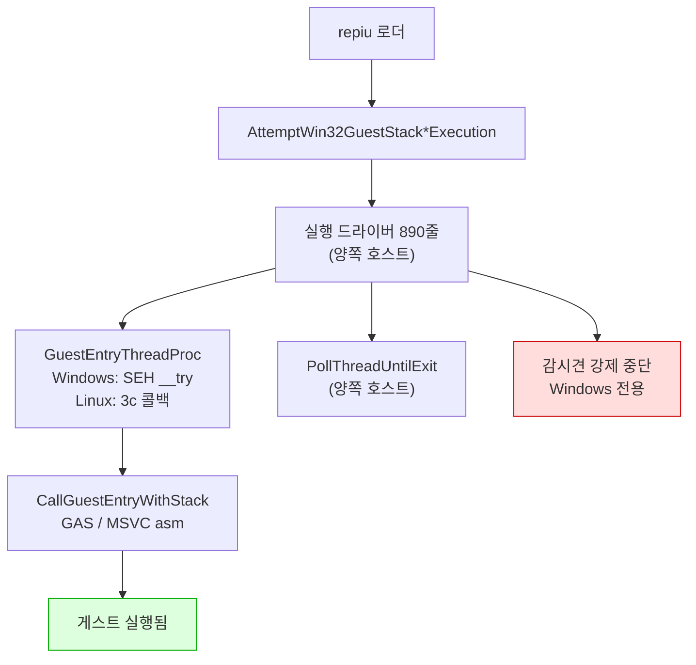
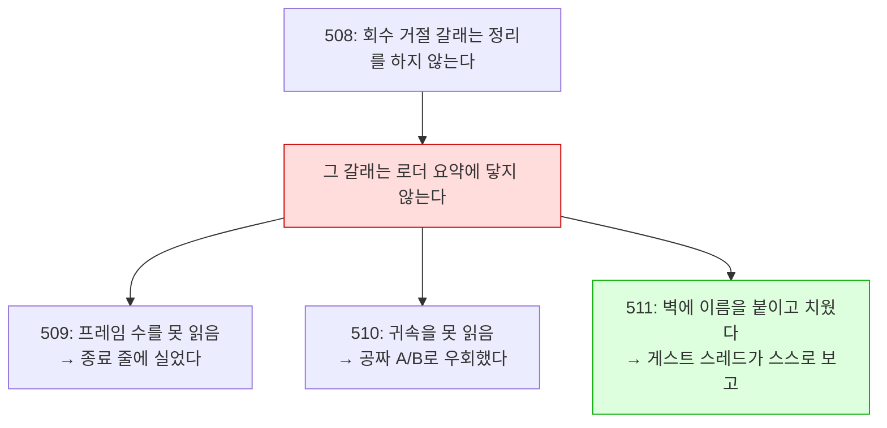
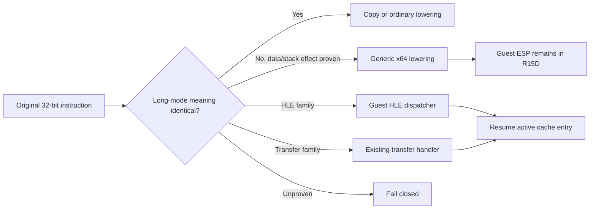
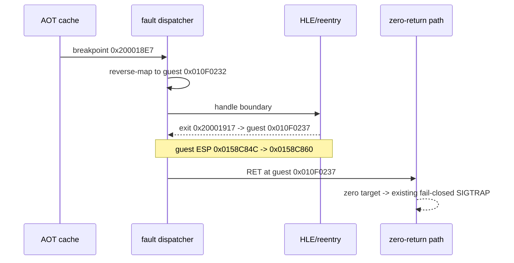
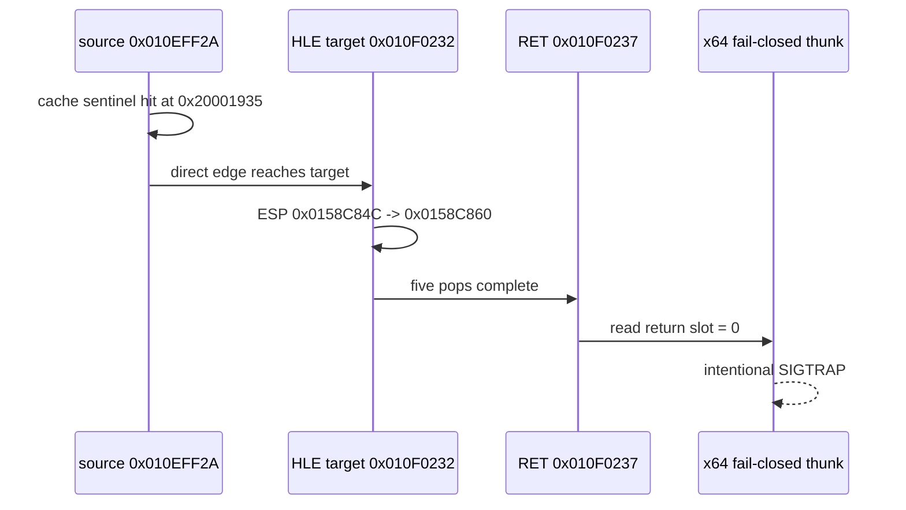
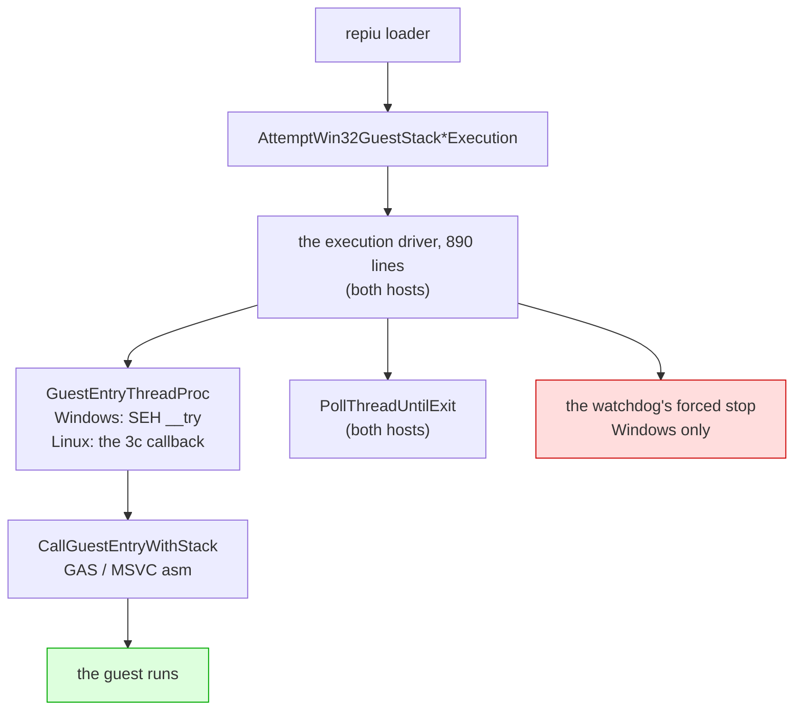
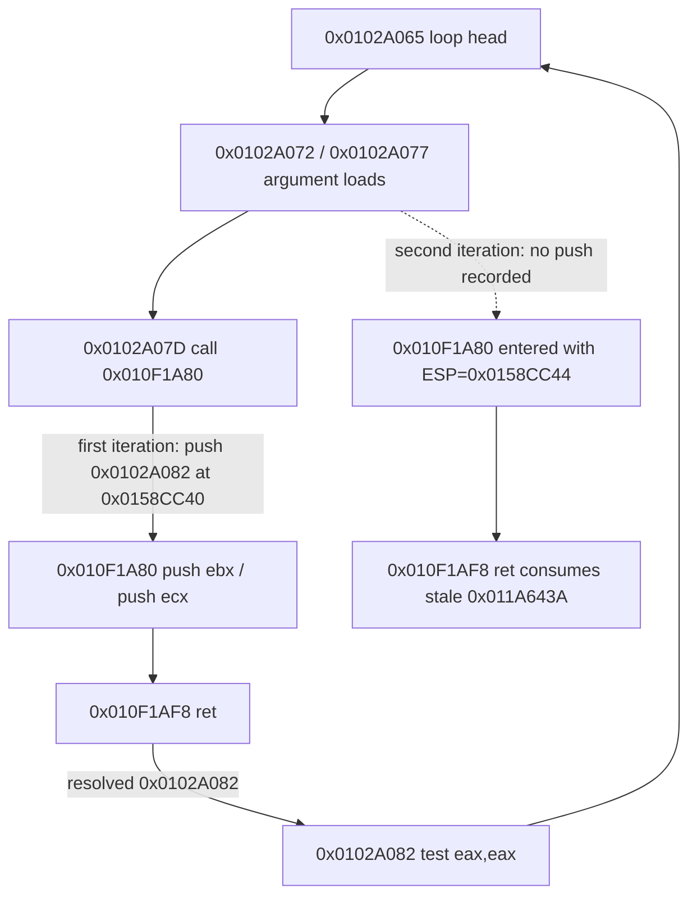
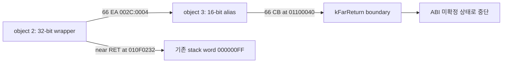
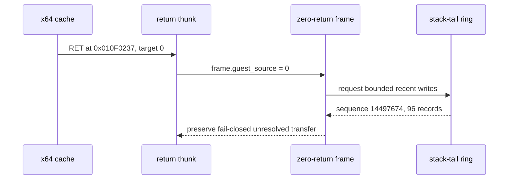
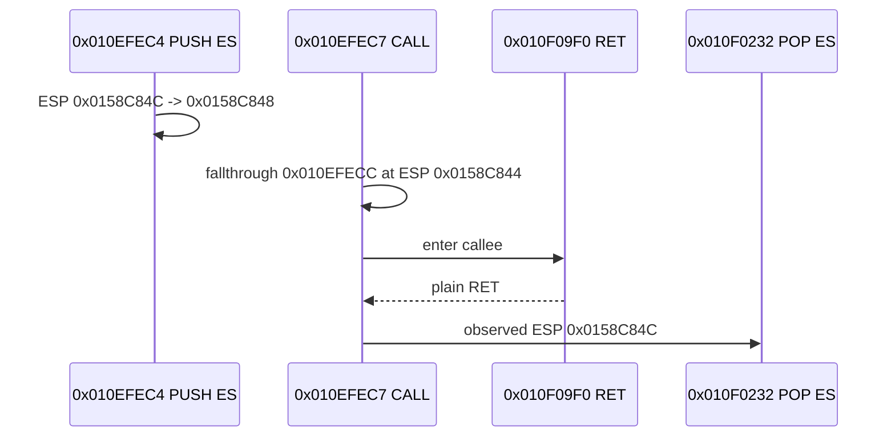

# Linux 이식 frontier / Linux port frontier

## 최신 x64 검증: Task 606 / Latest x64 verification: Task 606

**확인됨 (2026-09-05):** 16비트 register PUSH/POP lowering 누락을 보완한 뒤
FPU 초기화 루틴의 반환주소 `0x010F4B7E`가 보존된다. Task 605의
`AX=1E7Fh` 사설 ABI blocker 및 의도적 중첩 진입 결론은 철회한다.
기본 실행에서 그 호출과 `0x010F4AD2` null 쓰기가 사라졌으며 새 오류는
guest `0x010F1E0F`, 바이트 `80 3C 24 00` (`CMP byte ptr [ESP],0`)이다.
fault의 `access`는 실행마다 달라지고 guest ESP `0x0158CC68`과 일치하지 않는다.
**미확정:** 새 오류에서 raw guest 실행과 host/guest stack 주소의 관계.
빌드와 core probe 23개는 통과했다.

**Confirmed (2026-09-05):** word register PUSH/POP lowering preserves the FPU
initialization return address `0x010F4B7E`. Task 605's private `AX=1E7Fh` ABI
and intentional-overlap conclusions are withdrawn. The default run no longer
reaches that call or the `0x010F4AD2` null write. The new fault is at guest
`0x010F1E0F`, bytes `80 3C 24 00`, guest `CMP byte ptr [ESP],0`.
The access address varies between runs and differs from guest ESP `0x0158CC68`.
**Unresolved:** raw guest execution and host/guest stack handling at this fault.
The build and all 23 core probes pass.

근거 / Evidence: [Task 606 log](../work-logs/20260905-606-x64-word-stack-lowering.md).

설계: [20260822-503](../design/20260822-503-linux-execution-engine.md) ·
작업 지시: [20260822-503](../work-orders/20260822-503-linux-execution-engine.md) ·
작업 로그: [20260822-503](../work-logs/20260822-503-linux-execution-engine.md) ·
측정 절차: [linux-engine-port-measurement](../guides/linux-engine-port-measurement.md)

이 문서는 **Linux 이식이 지금 어디까지 왔는지와 다음에 무엇이 필요한지**만 유지합니다.
단계별 증거는 작업 로그에 있습니다. 표기는 이 디렉터리의 규칙을 따릅니다 — **확인됨**,
**추정**, **미확정**.

## 1. 한 줄 요약

> **두 축이 있습니다.** 아래 대부분은 **Linux i386** 축이고 게임이 화면까지 나옵니다.
> **Linux x64** 축은 별도이고 **[3.19](#319-task-574--주석이-사실이-아니었고-census가-그것을-소거로-확정했다)가
> 최신 상태입니다** — 거기서는 guest가 아직 실행되지 않고, emitter가 명령의 99.21%를
> 낼 수 있으며 완결 block은 90.09%, entry에서 도달 가능한 block은 44.47%입니다.
> **Linux x64 축의 정본은 [3.27 인수인계](#327-세션-인수인계-2026-09-03--x64가-게스트를-실행하기-시작했다)입니다.**
> x64는 `repiu`를 만들고, 로더가 동작하고, code cache로 진입해 게스트 명령을
> 실행하며, 두 번째 방출 block의 `sti`가 일으킨 #GP에서 멈춥니다. — 로더·DOS FS·LE 재배치·AOT code cache 배치가
> 모두 x64에서 동작하고, Task 544의 32비트 요구에서 멈춥니다(exit 0). 남은 작업
> 표는 3.20이며 3.21·3.22가 갱신합니다.
> ([3.10 인수인계](#310-세션-인수인계-2026-09-01--x64가-guest-바이트를-실행하고-명령의-23를-낼-수-있다)는
> 그 축의 배경이고, 수치는 3.11~3.17이 갱신합니다.)

**게스트 코드와 기본 `dynamic` AOT backend가 Linux에서 실행됩니다.** DOS/4GW 샘플은
`legacy`와 `dynamic` 모두 같은 종료 코드 2·초점 오프셋 0x10·opcode 0x80에서 멈춥니다.

**화면도 열렸습니다(Task 506).** WSLg `pumpit1`은 약 45.1초에 첫 버퍼 스왑, 약 51.7초에
69,263/307,200 non-black 픽셀을 기록했고 이후 스왑이 계속되었습니다. 오디오 장치도 열립니다.

**종료도 스스로 됩니다(Task 507).** 예산 만료·SIGTERM 여덟 번 모두 프로세스가 스스로
끝났습니다 — 이전에는 TERM을 받고도 영원히 기다렸습니다.

**그리고 코어 덤프 없이 끝납니다(Task 508).** 507 뒤에 남아 있던 것은 회수를 거절당한 실행이
SIGTRAP으로 끝나는 경우였습니다. 60초 예산 6회에서 거절 6회 중 2회가 그렇게 끝났고, 수정 후
같은 6회에서 거절은 그대로 6회·SIGTRAP은 0회입니다. **이제 Linux에서 `exit=133`을 보면 그것은
회귀입니다.**

**그리고 왜 느린지도 이제 압니다(Task 511).** 프레임당 격차 126M cycle 중 **68%가 폴트
핸들러**이고, Linux에서 그것은 시그널 전달입니다. 아래 4절에 분해가 있습니다.

**화면이 나오는 것을 사람이 확인했습니다(2026-08-28, 사용자 관측).** 같은 관측이 남긴 다음
과제가 **속도**였고, Task 509가 쟀습니다 — **Linux는 Windows의 3.7%, 약 26.8배 느립니다**
(Release, vsync OFF, `pumpit1`, 호스트당 3회, 범위 무중첩). 남은 것은 **어디가 느린가**이고,
4절에 순서를 적었습니다.

## 2. 확인됨 — 지금 서 있는 것

> **범위 (2026-08-29, [3.8](#38-2026-08-29-실제-ubuntu--wslg는-대표-환경이-아니었습니다)).**
> 이 절과 Tasks 505~519의 측정은 **WSLg에서** 이루어졌습니다. 실제 ext4 데스크톱은 다르게
> 동작할 수 있고, 실제로 달랐습니다 — 그 환경에서는 게임이 시작조차 못 하고 있었습니다.
> 아래를 인용할 때 환경을 함께 적으십시오.

| 항목 | 상태 | 근거 |
|---|---|---|
| `src/platform/win32` 81개 소스 Linux 컴파일 | **81 / 81** | 3d-16, 3d-17 측정 |
| `repiu` 로더 Linux 링크 | ELF 32-bit `EXEC`, 텍스트 0x40000000, 쓰기 불가 | 3d-17 |
| 엔진 수준 미정의 심볼 | **0** (라이브러리 배선 9개뿐이었고 해결됨) | 3d-17 측정 |
| `repiu_core_probe` | 양쪽 호스트 **15 / 15** | 3d-18 |
| 게스트 스택 전환·폴트 복구 | 양쪽에서 같은 probe 통과 | 3d-16 |
| 스레드 생성·조회·대기·해제 | 양쪽에서 같은 probe 통과 | 3d-18 |
| **게스트 실행** | **샘플 실행, Windows와 같은 명령에서 정지** | **3d-19** |
| 폴트 18건·종료 코드·blocker | 두 호스트 일치 | 3d-19 |
| **Linux dynamic AOT** | 캐시 배치·인라인 패치·pumpit1 스왑/non-black 픽셀 | **Task 506** |
| **Linux 종료 경로** | 예산 만료·SIGTERM 모두 프로세스가 스스로 종료 | **Task 507** |
| **Linux 종료 경로 — 코어 덤프 없음** | 회수 거절 6/6에서 SIGTRAP **0회** (수정 전 2회) | **Task 508** |
| **Linux i386 Release 빌드** | 성공(프로젝트 최초), 샘플이 3d-19 기준선 통과 | **Task 509** |
| **Linux 프레임률** | 27.21 fps 대 Windows 730.05 fps — 약 **26.8배** | **Task 509** |
| **격차의 축** | 폴트 핸들러가 프레임당 격차의 **68.3%** (42.6배), 3회 재현 | **Task 511** |
| **그 42.6배의 분해** | 프레임당 경계 **13.6배** × 핸들러 본문 **3.3배**. 커널 전달은 Linux가 **0.44배**로 더 쌈 | **Task 512** |

계층으로 내려간 것들입니다.

| 계층 | 헤더 | 단계 |
|---|---|---|
| 게스트 레지스터 컨텍스트 | `platform/guest_cpu_context.h` | 3a |
| 가상 메모리 | `platform/virtual_memory.h` | 3b |
| 폴트 전달 | `platform/fault_handler.h` | 3c |
| 워커 신호 | `platform/worker_signal.h` | 3d-6 |
| 안전한 메모리 복사 | `platform/safe_memory_copy.h` | 3d-7 |
| 시간·사이클 카운터 | `platform/host_time.h` | 3d-8 |
| 환경 변수 읽기·열거·쓰기 | `platform/host_environment.h` | 3d-9, 3d-16, 3d-17 |
| 진단 출력 | `platform/host_error_stream.h` | 3d-14 |
| 스레드 번호·생성·조회·대기 | `platform/host_thread.h` | 3d-15, 3d-18 |
| 게스트 스택 전환 오프셋과 전역 | `platform/guest_stack_switch.h` | 3d-16 |
| 자식 프로세스 재실행 | `platform/host_process.h` | 3d-17 |
| 양보·짧은 대기 | `platform/host_time.h` | 3d-19 |

어셈블리는 GAS로 옮겨졌습니다 — 다섯 디스패치 thunk(`stack_bridge.inc.S` 매크로 하나,
3d-12)와 트램폴린의 세 진입점(`guest_stack_switch.S`, 3d-16).

## 3. 벽은 열렸습니다 (3d-19)



`IsGuestStackSwitchSupported()`와 `IsDirectX86ExecutionSupported()`는 이제 컴파일러가 아니라
**아키텍처**를 묻습니다 — 3d-16이 스택 전환을 GAS로 쓴 뒤로 컴파일러에 달려 있지 않습니다.

## 3.5 2026-08-27 main 병합 인계

이 날 main에 들어간 것은 다섯입니다. 종합 설계는 없고, 각 작업의 설계·지시서·로그가 정본입니다.

| 커밋 | 무엇 |
|---|---|
| `6f9ac34` | 503d-22 마감 — 포기한 인터럽트가 다시 오지 못함을 probe로 고정, 그 과정에서 드러난 교차 스레드 구멍을 닫음 |
| `9acbabe` | `SA_NODEFER`를 **후보에서 제외** — 증상을 원인으로 읽고 있었음. 같은 플래그를 두고 자기모순이던 주석도 정정 |
| `bd6e736` | 503d-23 — **9초 정지 해결.** `native_fast_path`가 복귀 브레이크포인트를 무장하면서 트랩 플래그를 해제하는데 Linux에서 무장만 버려짐 |
| `db234db` | Task 505 — **Glide 창이 Linux에서 열림.** 이식이 아니라 울타리 57개 해제 |
| `486fe09` | `0x010EE1xx`를 "대기 루프"라 한 것 정정 — Task 219가 이미 확정한 비트스트림 디코더 |

### 이 날 반복해서 걸린 것

**성공 신호 하나로 성공을 판정한 것**이 세 번입니다.

| 무엇을 봤나 | 무엇으로 읽었나 | 실제 |
|---|---|---|
| `exit 0` | 정상 완주 | 창을 못 열어 게임이 포기 |
| `opened=1` | 창이 열림 | 더미 폴백도 같은 값을 반환 |
| `dispatch_entry` 폭증 | 전진 중 | 일하는 중이지 나아가는 중이 아님 |

그리고 **관측 창보다 긴 주기는 보이지 않는다**에 두 번 걸렸습니다 — 30초는 "느리다",
240초는 "갇혔다", 1,200초에서야 실상.

세 경우 모두 **한 걸음 더 갔으면** 잡혔습니다. 종료 코드 대신 로그를, 반환값 대신 메시지를,
카운터 대신 EIP 궤적과 코드를 봤어야 했습니다. `0x010EE1xx`는 특히 그렇습니다 — 답이
저장소 안에 두 달 전부터 있었습니다.

### 다음

**감시견과 종료 경로의 강제 중단을 안전한 Linux 복구 경로로 바꾸는 작업**입니다. Task 506
검증에서도 측정을 마치고 종료를 요청했을 때 TERM에 응답하지 않아 측정 프로세스를 PID 확인 후
강제 종료했습니다.

> 이 항목은 Task 507·508로 끝났습니다. **현재의 다음 항목은 아래 4절**에 있습니다. 이 절은
> 2026-08-27 시점의 기록으로 남깁니다.

## 3.6 2026-08-28 main 병합 인계

이 날 main에 들어간 것은 넷입니다. 화면이 열린 다음 **왜 느린지까지** 갔습니다.

| 커밋 | 무엇 |
|---|---|
| `f2694dc` | Tasks 506·507·508 — **화면이 나오고, 종료가 되고, 코어를 덤프하지 않습니다** |
| `1f914db` | Task 509 — 실행이 자기 프레임률을 보고합니다. **Linux는 Windows의 3.7%** |
| `9d5a12b` | Task 510 — Glide 게이트를 축에서 **배제**. 코드 변경 0 |
| `2cd1e13` | Task 511 — 실행 중 귀속 보고. **격차의 68%가 폴트 핸들러** |
| `bd0ebaa` | Task 512 — 그 68%를 **횟수 13.6배 × 단가 3.3배**로 분해. 시그널 전달 자체는 **무죄** |

### 하나의 사슬로 읽으십시오

세 작업이 같은 벽에 세 번 부딪혔고, 세 번째에야 이름을 붙였습니다.



**교훈**: Linux에서 계측이 아무것도 내지 않으면, 계측을 의심하기 전에 **그것이 `attempt`를
거쳐 `main.cpp`로 나가는지** 먼저 보십시오. 그렇다면 렌더까지 간 Linux 실행에서는 나오지
않습니다.

### 이 날 걸린 것

**하나. 배율이 크면 백분율이 거짓말을 합니다.** `SETTER_ELIDE=0`이 Linux에서 −1.0%라 "호스트
왕복은 공짜"로 읽힐 뻔했습니다. 같은 노브가 Windows에서 27.1%를 깎는데, **절대 비용은 양쪽이
같습니다**(+0.51 대 +0.38 ms). 안 보인 이유는 싸서가 아니라 프레임이 36.75 ms이기
때문입니다. → **항상 프레임당 ms 또는 cycle로 비교하십시오.**

**둘. 널 결과는 그 자체로 읽을 수 없습니다.** "축이 아니다"와 "노브가 이 장면에서 아무 일도
안 했다"가 같은 모양입니다. → **대조군을 돌리십시오.** 510이 그렇게 살아났습니다.

**셋. Debug 수치를 성질로 읽었습니다.** Task 506의 "약 45.1초에 첫 스왑"은 Debug였고,
Release에서는 약 2초입니다. "자산 디코드가 오래 걸린다"는 엔진의 성질이 아니었습니다.

**넷. 누적 평균은 변화를 지웁니다.** Linux 프레임당 비용이 실행 중 83M → 272M cycle로 세 배가
됩니다. 시간별 보고가 없었으면 "일정하게 26.8배"로 적었을 것입니다.

### 다음 — 시그널 전달의 횟수인가 단가인가

**축은 확정되고 분해까지 끝났습니다.** `veh`(폴트 핸들러)가 격차의 68.3%이고, 그 42.6배는
**프레임당 경계 13.6배 × 핸들러 본문 3.3배**입니다. **시그널 전달 자체는 무죄입니다** —
커널 왕복이 Linux에서 0.44배로 더 쌉니다(512).

**다음 질문 하나: 왜 경계를 13.6배 더 밟는가.**

초과분은 **single-step이 아닙니다**(Linux 배달의 3.6%, Windows 24.4%). breakpoint이거나
access violation입니다.

**유력 후보는 아래 6절에 이미 적혀 있습니다** — Linux 사용자 공간이 하드웨어 디버그
레지스터를 못 써서 `native_fast_path`·`native_region`·`native_linear_span` **셋이 모두
차단**돼 있습니다. **그 셋은 정확히 트랩을 피하려고 있는 경로**이고, 꺼진 대가는 측정된 적이
없습니다.

먼저 할 일은 **초과 배달의 종류를 세는 것**입니다. `veh_gap_counts`가 이미 single-step /
breakpoint / other 세 칸으로 나뉘어 있으므로, 511의 보고 줄에 나머지 두 칸을 더하면 종류별
분포가 바로 나옵니다 — 512와 같은 모양의, 새로 세지 않는 변경입니다.

남은 둘: **핸들러 본문 3.3배**(하위 버킷 `kVehPrologue`·`kAotReentry` 등이 가릅니다), 그리고
`dos`의 **433.9배**(격차 기여는 1.9%로 작지만 배율은 표에서 가장 큽니다 — 작다고 넘기지 말 것).

### 재현에 필요한 것

```bash
./scripts/build_linux_i386.sh --config Release
bash scripts/task509_frame_rate_measure.sh 3 90000 <label>     # 프레임률
bash scripts/task508_refused_recovery_repro.sh 3 60000 <label> # 종료 갈래
```

귀속은 `REPIU_EXECUTION_TIME_PROFILE=1 REPIU_LIVE_PROFILE_INTERVAL_MS=10000`입니다. 조건과
함정은 [실행 프레임률 측정 절차](../guides/execution-frame-rate-measurement.md)에 있습니다.

**Linux 빌드 트리는 지금 Release입니다.** 단일 구성 생성기라 Debug를 대체했고, 정확성 작업으로
돌아가려면 `--config Debug` 재구성이 필요합니다(SDL 재빌드 포함).

## 3.7 2026-08-29 main 병합 인계

이 날 main에 들어간 것은 Linux 성능 축의 다섯입니다(Tasks 515~519). **한 줄로: 26.8배의
정체를 "재진입마다 트랩 하나"까지 좁혔고, 그 다음 한 걸음에서 네 번 틀렸습니다.**

| 커밋 | 무엇 |
|---|---|
| `15cae5e` | 515 — 초과 경계는 **breakpoint**(69%). 후보 둘을 대조군으로 지움 |
| `b357ec1` | 516 — 축은 boundary가 아니라 **재진입**. Linux는 재진입당 트랩 1.010, Windows 0.0432 |
| `6d3b59b` | 517 — Linux에서 direct dispatch는 **돈다**(87%). 그런데 성공해도 트랩이 붙음 |
| `08f1074` | 518 — 디스패치마다 relink 6.1회 (**결론은 519가 철회**) |
| `d3870cb` | 519 — relink는 지속성과 무관한 수였음. `content=0` |

### 지금 쓸 수 있는 계측

실행 중에 네 줄이 나옵니다. `REPIU_EXECUTION_TIME_PROFILE=1`과
`REPIU_LIVE_PROFILE_INTERVAL_MS=10000`으로 켭니다.

| 줄 | 무엇 |
|---|---|
| `[repiu-live-profile]` | guest-run 대비 veh/glide/port-io/dos/unaccounted 몫, 창 값 포함 |
| `[repiu-live-veh]` | 배달 수·배달당 cycle·커널 gap, 그리고 클래스 셋(ss/bp/other) |
| `[repiu-live-aot]` | 캐시 entry/boundary/재진입, 경계 사유 다섯, `sum_ok` |
| `[repiu-live-gdd]` | Glide direct dispatch: patched/verified/resolved/relinked(content·fixup)/entry/success |

**이 넷이 이 축에서 나온 실질 산출물입니다.** Linux는 로더 요약에 닿지 못하므로 이 줄들이
아니면 아무것도 읽을 수 없습니다.

### 다음 한 걸음

**Windows에서 그 INT3은 왜 다시 밟히지 않는가.** 활성화는 `Eip`만 돌리고 INT3을 지우지
않는데, Windows에서는 재진입의 95%가 트랩 없이 처리되고 Linux에서는 100%가 트랩을 냅니다.

**시작하기 전에 위 8절의 표를 읽으십시오** — 같은 실수를 네 번 했습니다.

### 남은 다른 축

* `other`(접근 위반) 프레임당 **10.7배** — 페이지 보호·포트 I/O·write watch.
* 핸들러 본문 **3.3배** — 하위 버킷(`kVehPrologue`·`kAotReentry` 등)이 가릅니다.
* `dos` 프레임당 **433.9배** — 격차 기여는 1.9%로 작지만 배율은 가장 큽니다.


## 3.8 2026-08-29 실제 Ubuntu — WSLg는 대표 환경이 아니었습니다

Tasks 522~523. **한 줄로: 505~519의 "확인됨"은 전부 WSLg 한정이었고, 실제 ext4 데스크톱에서는
게임이 시작조차 하지 못했습니다.**

VMware Ubuntu(커널 7.0.0-30-generic)에서 창이 열리지 않았습니다. 단일 스텝 인구 조사가 한
주소 `0x010F3438`에 **814,138 / 814,683 샘플(99.93%)**을 보여 주었습니다 — 초당 3만 4천 번,
25초 내내. 진행이 아니라 정지입니다.

### 사슬 — 원인과 증상 사이 여덟 단계

```
Glide2x.ovl 대소문자 불일치 (ext4)
  → glide_exports 0개        → 게이트 계획 무효
  → 이미지 쓰기 3/5 실패      → 디스크립터 등록 실패
  → linexe_environment_active = false
  → INT 21h AX=FF00h 폴백(AL=0) → DOS/4G DLL 로더 초기화 실패
  → 게스트 fatal 경로 → 자기 0xCC에서 영원히 회전
```

**여덟 단계 중 어디에서도 오류가 보고되지 않았습니다.** `exists()`가 거짓이면 `if` 하나가
조용히 건너뛰어지고 실행이 계속되기 때문입니다.

| 호스트 | 파일시스템 | `"Glide2x.ovl"` |
|---|---|---|
| Windows | NTFS | 대소문자 무시 → 찾음 |
| WSLg | DrvFs (`/mnt/e/...`) | 대소문자 무시 → 찾음 |
| **실제 Ubuntu** | **ext4** | **구분 → 못 찾음** |

### 결정적 관측 기법

**두 호스트의 DOS/DPMI 호출 순서를 나란히 놓는 것**이었습니다. `REPIU_DOS_INT_TRACE=1`.

| # | WSLg | VMware (전) | VMware (후) |
|---|---|---|---|
| 2 | `21 FF00` | `21 FF00` | `21 FF00` |
| **3** | `31 0006` | **`21 ED2B`** | **`31 0006`** |

세 번째 호출이 갈리는 지점이고, 그것이 일치로 돌아오는 것이 수정의 서명입니다.

### 얻은 것

| | 전 | 후 |
|---|---:|---:|
| Glide exports | 0 | **173** |
| `linexe_environment_active` | false | **true** |
| 게스트 INT3 트랩 | 814,138 | **0** |
| Glide 게이트 진입 | 0 | **96** |
| 종료 | segfault (139) | 타임아웃 (3) |

### 이 절이 바꾸는 것

* **"확인됨"에 환경을 적으십시오.** 이 문서의 505~519 주장은 WSLg에서 측정된 것입니다.
  실제 데스크톱에서 다시 재지 않았습니다.
* **크래시 없음 ≠ 정상 동작**을 또 만났습니다 — 이번에는 "로그 없음 ≠ 문제 없음"의 형태로.
* `docs/analysis/dll-loader-int21-ff00.md`의 원인 서술이 낡아 있었습니다. **문서를 먼저 읽되,
  코드로 확인해야 합니다.**

### 남은 것

* **창 확인은 VM 데스크톱에서.** SSH 세션에는 `DISPLAY`가 없어 SDL이 더미 폴백을 타고
  `frames=0`입니다.
* VM teardown의 segfault는 `step=thread-release` 이후 `step=done` 전에서 여전히 발생합니다.
* 실제 데스크톱에서의 성능 수치는 아직 없습니다.


### 데스크톱 패키지 — 같은 조용한 실패가 한 겹 더 있었습니다

창이 열린 뒤 **제목줄이 없었습니다.** Wayland에는 서버 측 장식이 없어 클라이언트가 직접
그려야 하고, SDL3는 그것을 `libdecor`에 맡깁니다. 그런데 SDL 구성이 이랬습니다.

```
/* #undef HAVE_LIBDECOR_H */    ← 지원이 통째로 컴파일에서 빠짐
#define SDL_VIDEO_DRIVER_WAYLAND 1
```

`libdecor-0-dev:i386`이 없어 SDL이 지원을 빼고 빌드했고, **아무것도 그 사실을 보고하지
않았습니다.** 창이 그냥 맨몸으로 열릴 뿐입니다. 런타임에도 `libdecor-0-0`은 `:amd64`만 깔려
있었는데 `repiu`는 32비트입니다 — 빌드를 고쳤어도 거기서 또 막혔을 상황이었습니다.

| | 조치 |
|---|---|
| 재빌드 없는 우회 | `SDL_VIDEODRIVER=x11` (XWayland는 서버가 장식을 그림) |
| 정식 | `libdecor-0-dev:i386 libdecor-0-0:i386 libdecor-0-plugin-1-gtk:i386` |

**패키지 설치만으로는 안 됩니다.** CMake가 패키지 없던 시절의 실패를 캐시에 담고 있습니다
(`SDL_WAYLAND_LIBDECOR=ON`인데 `PC_LIBDECOR_FOUND=`가 빈 값). 빌드 디렉터리를 통째로 버리는
것보다 캐시 항목만 비우는 편이 쌉니다.

```
cmake -U "PC_LIBDECOR*" -U HAVE_LIBDECOR_H -S . -B build/linux_i386
```

`scripts/build_linux_i386.sh`가 이제 이것을 점검하고 경고합니다 — libpulse와 같은 방식이고,
같은 이유입니다. **빌드는 성공하고 게임도 도는데 조용히 반쪽만 동작하는** 부류입니다.

## 4. 다음에 필요한 것

> 이 절은 3d-20을 가리키고 있었습니다. 3d-20(다른 스레드의 레지스터)·3d-21(표본기)·
> 3d-22(시한이 지난 인터럽트)는 끝났고, 목록에서 **빠지지 않은 둘**이 아래에 그대로
> 남습니다. 인터럽트 계층 자체는 양쪽 호스트에서 probe를 통과합니다.

1. ~~**AOT 코드 캐시**~~ — **해결 (Task 506).** Win32 메모리 호출 62곳을 3b 계층으로 옮겼고,
   Linux `dynamic`에서 배치·동적 실행·인라인 패치·페이지 retirement가 동작합니다. `pumpit1`은
   45.1초에 첫 스왑, 51.7초에 첫 non-black 스왑을 기록했습니다.
2. ~~**감시견의 강제 중단.**~~ — **해결 (Task 507).** 종료 블록을 `InterruptHostThread`로
   옮겼습니다. 회수에 성공하면 정상 종료하고, 회수가 거절되면 `DetachHostThread`로 기다리지
   않고 내려가며 AOT 캐시 해제를 건너뛰고 `_Exit`로 프로세스를 즉시 끝냅니다. `pumpit1`에서
   예산 만료·SIGTERM 여덟 번 모두 스스로 종료했습니다(더 이상 매달리지 않음). 회수가 거절된
   경로에서 SIGTRAP으로 끝나는 경우가 남아 있고, 그 원인은 위 6절에 적었습니다 — 프로세스가
   끝나는 것 자체는 507의 조건을 만족합니다.
3. ~~**회수를 거절당한 종료의 코어 덤프.**~~ — **해결 (Task 508).** 근인은 트랩이 아니라
   **순서**였습니다. 종료 블록이 회수 성공 여부와 무관하게 `RemoveFaultHandler()`를 부르는데,
   거절당한 실행에서는 그 뒤로도 게스트 스레드가 돌면서 AOT 엔진이 평소처럼 심는 INT3을
   밟습니다. 508은 거절된 갈래에서 정리를 통째로 건너뛰고(핸들러도 떼지 않고) 파일로 나가는
   두 진단과 detach만 남긴 뒤 `_Exit` 합니다. 60초 예산 6회에서 거절 6/6·SIGTRAP 0회.

### 측정됨 (Task 509) — Linux는 Windows의 3.7%입니다


> **2026-08-29 재측정 ([Task 524](../work-logs/20260829-524-wslg-baseline-remeasure.md)).**
> 같은 조건으로 v0.0.172에서 다시 재니 WSLg가 **34.11 · 35.22 · 36.96, 평균 35.43 fps
> (프레임당 28.2 ms)**였습니다. 아래 표의 27.21보다 **1.30배 빠르고 두 집단의 범위가 겹치지
> 않습니다**(최저 34.11 > 최고 27.76).
>
> **왜 빨라졌는지는 모릅니다.** 그 사이 머지에 성능을 노린 변경은 없었습니다. 측정 시점의
> 호스트 상태 차이일 수도 있고 아래 값이 이미 낡았을 수도 있습니다. 원인을 확인하지 않았으므로
> 추정하지 않습니다.
>
> **Windows 쪽은 다시 재지 않았습니다.** 730.05와 비교하면 격차는 26.8배에서 **약 20.6배**로
> 줄지만, 한쪽만 새로 잰 비교이므로 그 배수는 아래 표만큼 단단하지 않습니다.

| 호스트 | fps (Release, vsync OFF, `pumpit1` 90초, 3회) | 평균 | 프레임당 |
|---|---|---:|---:|
| Windows | 743.91 · 737.46 · 708.79 | **730.05** | 1.37 ms |
| Linux (WSLg) | 26.22 · 27.76 · 27.65 | **27.21** | 36.75 ms |

**약 26.8배이고 두 집단의 범위가 겹치지 않습니다.** 가장 보수적으로 잡아도 25.5배입니다.
프레임당 Linux가 **35.4 ms를 더 씁니다.**

**기동은 원인이 아닙니다** — 양쪽 모두 `span_ms` 88초로 첫 프레임까지 2초 남짓입니다. 차이는
전부 렌더 루프 안입니다. 여기서 Task 506의 "약 45.1초에 첫 스왑"이 **Debug 수치**였음이
드러납니다. Release에서는 약 2초입니다.

**배율이 아직 분해되지 않았습니다.** 컴파일러 차이(MSVC 대 GCC)와 WSLg의 X11 한 겹이 26.8배
안에 함께 들어 있습니다.

### 귀속 1차 (Task 510) — Glide 게이트는 축이 아닙니다

이미 있는 노브 다섯 변인을 A/B 했습니다(코드 변경 0). **프레임당 ms로 비교해야 합니다** —
배율이 26.8배인 곳에서 백분율은 같은 비용을 한쪽 37%, 다른 쪽 1%로 보이게 합니다.

| 변인 | 평균 fps | 프레임당 | 기준선 대비 |
|---|---:|---:|---:|
| Linux 기준선 | 27.21 | 36.75 ms | — |
| `RENDEZVOUS_SPIN_US=2000` | 30.50 | 32.78 ms | −3.97 ms |
| `ASYNC_PRESENT=1` | 32.83 | 30.46 ms | −6.29 ms |
| 위 둘 동시 | 33.12 | 30.19 ms | −6.56 ms (가산 아님) |
| `SETTER_ELIDE=0` | 26.93 | 37.13 ms | +0.38 ms |
| `DRAW_BATCH=0` | 28.14 | 35.54 ms | −1.21 ms |
| **Windows `SETTER_ELIDE=0`** | 532.29 | 1.88 ms | **+0.51 ms** |

마지막 줄이 대조군입니다. **같은 노브가 Windows에서 27.1% 떨어집니다** — 노브는 이 장면에서
살아 있습니다. 그런데 **절대 비용은 양쪽이 같습니다**(+0.51 대 +0.38 ms). Linux에서 안 보인
이유는 그 일이 싸서가 아니라 프레임이 36.75 ms이기 때문입니다.

**배제됨**: rendezvous 깨우기 지연(한 몫이나 지배항 아님), present 임계 경로(같음), 호스트
왕복 **횟수**, 게이트 **크로싱 횟수**.

**남은 것: 프레임당 약 30 ms.** 어떤 Glide 노브도 닿지 못했고, 최선의 조합으로도 Windows의
22.0배입니다.

**보조 정황(추정)**: 기동 구간(스왑 0회, 게스트 코드가 자산 디코드)은 첫 프레임까지 300 ms
안쪽 차이 — 약 10~15%입니다. 게스트 코드 실행 자체가 20배 느린 것은 아니라는 방향입니다.

### 귀속 2차 (Task 511) — 축은 폴트 전달입니다

벽을 치웠습니다(실행 중 보고, 게스트 스레드 위). 같은 기계이므로 TSC cycle이 직접 비교됩니다 —
프레임당, 100만 cycle 단위입니다.

| 버킷 | Windows | Linux | 배율 | **격차 기여** |
|---|---:|---:|---:|---:|
| **veh (폴트 핸들러)** | 2.065 | 88.072 | **42.6x** | **68.3%** |
| glide | 1.618 | 26.480 | 16.4x | 19.7% |
| unaccounted | 2.159 | 17.214 | 8.0x | 12.0% |
| dos | 0.006 | 2.438 | **433.9x** | 1.9% |
| port-io | 0.006 | 0.105 | 18.6x | 0.1% |
| 합계 | 5.843 | 131.805 | 22.6x | 126.0M |

**Linux 격차의 68%가 폴트 핸들러입니다.** (511은 이것을 "시그널 전달"이라 불렀는데 **Task 512가
정정했습니다** — 전달 경로 자체는 Linux가 더 쌉니다. 아래 512 절을 볼 것.) `veh` 몫은 3회에서
66.82% · 66.71% · 64.55%로 재현되고, Windows 대조군은 35.35%입니다.

**510과 어긋나지 않습니다.** 510이 시험한 것은 호스트 왕복 **횟수**와 크로싱 **횟수**였고,
여기 glide 26.5M cycle의 대부분은 횟수가 아니라 회당 비용과 대기입니다.

**그리고 프레임당 비용이 실행 중에 세 배가 됩니다**(83M → 272M). "일정하게 26.8배"가 아니라
장면이 진행될수록 나빠집니다 — 누적 평균만 냈으면 보이지 않았을 것입니다.

### 귀속 3차 (Task 512) — 전달은 범인이 아닙니다. 횟수입니다

511이 축을 "시그널 전달"이라 불렀는데 **정정합니다.** 42.6배를 두 인자로 갈랐습니다.

| | Windows | Linux | 배율 |
|---|---:|---:|---:|
| 프레임당 배달 | 18.8 | 256.3 | **13.6x** |
| 배달당 cycle (핸들러 본문) | 104,002 | 341,557 | **3.3x** |
| 곱 | | | 44.8x ≈ 511의 42.6x |
| **커널 왕복 바닥 (`gap min`)** | 21,756 | **9,632** | **0.44x** |
| **커널 왕복 single-step 평균** | 28,185 | **16,466** | **0.58x** |

**`gap`은 핸들러가 나간 뒤 다음 진입까지, 곧 커널의 전달 경로만 봅니다**(Task 372). 그 값이
Linux에서 더 작습니다 — **시그널 전달은 Windows의 예외 디스패치보다 두 배 이상 쌉니다.**
비싼 것은 전달이 아니라 그 주위입니다.

**정규화 주의.** 초당으로 보면 Linux가 폴트를 **40% 적게** 냅니다(7,732 대 12,951). 프레임당이
큰 것은 프레임이 24배 드물기 때문입니다. 프레임당이 하중을 지는 정규화이지만(한 프레임 =
`grBufferSwap` 한 번 = 같은 게스트 경로), **게임 로직이 저프레임률에서 일을 줄이는 구조라면
그 전제가 깨집니다 — 확인되지 않았습니다.**

### 귀속 4차 (Task 515) — 초과분은 breakpoint이고, 후보 둘은 반증됐습니다

**프레임당 배달 수**로 봅니다.

| 클래스 | Windows | Linux | 배율 | 초과분 기여 |
|---|---:|---:|---:|---:|
| single-step | 4.87 | 8.95 | 1.8x | 1.8% |
| **breakpoint** | 6.94 | **167.80** | **24.2x** | **69%** |
| other (접근 위반) | 6.92 | 74.29 | 10.7x | 29% |

성격 자체가 뒤집혀 있습니다 — Windows는 세 클래스가 고른데(24/39/37%), Linux는 **breakpoint
67.0%**에 몰려 있습니다.

**후보 둘을 Windows 대조군으로 반증했습니다.**

| Windows 대조군 | bp/frame | 기준선 대비 |
|---|---:|---:|
| 기준선 | 6.94 | — |
| `native_fast_path` 끔 | 6.67 | −3.9% |
| direct-return table 끔 | 6.73 | −2.9% |

**정제 하나**: `native_region`·`native_linear_span`은 Windows에서도 opt-in이라 기본 꺼짐입니다.
**기본값이 두 호스트에서 다른 것은 `native_fast_path` 하나뿐**입니다 — 그런데 그 카운터가
**기준선에서도 `0/0/0`**입니다. 이 장면에서는 Windows에서도 한 번도 작동하지 않으므로
**두 호스트의 차이가 될 수 없습니다.** (노브를 껐는데 안 변할 때 카운터를 보라는 510의 규칙이
여기서 약한 결론을 강한 결론으로 바꿨습니다.)

### 귀속 5~8차 (Tasks 516~519) — 재진입마다 트랩이 하나, 그리고 틀린 답 셋

**516: 축은 boundary가 아니라 재진입입니다.**

| | Windows | Linux | 배율 |
|---|---:|---:|---:|
| 프레임당 boundary | 6.69 | 13.78 | 2.1x |
| 프레임당 reentry | 160.63 | ~154 | **0.90x** |
| **reentry당 breakpoint** | **0.0432** | **1.010** | **23x** |

재진입 비율은 Linux가 오히려 10% 적습니다. 다른 것은 **나올 때마다 트랩을 내는가**이고, 이
23배가 515의 breakpoint 24.2배와 맞습니다. Windows가 트랩을 피하는 경로는 **Glide direct
dispatch**로, 재진입의 95.1%(8,719,788 / 9,171,551)를 처리합니다.

**517: 그 경로는 Linux에서도 돕니다.** `patched=172 verified=172 entry=338,929
success=338,928 miss=0`, 재진입의 87%. 그런데 산술이 강제합니다 — Linux의 비-gdd 재진입은
50,685뿐인데 트랩이 392,670으로 **7.7배 초과**합니다. **성공한 direct dispatch도 트랩을
냅니다.**

**518~519: relink 카운터는 이 질문에 답할 수 없는 수였습니다.** 518이 "디스패치마다 6.1회
relink → 패치가 안 붙는다"고 적었고, 519가 카운터를 갈라 **`content=0`, `fixup`이 전부**임을
보였습니다. `fixup` 쪽은 캐시를 읽지 않고 매번 다시 쓰므로 지속성과 무관합니다.
**518의 결론은 철회됐습니다.**

### 그다음 — Windows에서 그 INT3은 왜 다시 밟히지 않는가

`ActivateWin32GlideGateDirectTarget`은 breakpoint 폴트 핸들러 안에서 불리고, 성공하면 `Eip`를
게스트 게이트 주소로 돌리고 트랩 플래그를 끕니다. **INT3 자체는 지우지 않습니다.** 그런데
Windows에서는 같은 INT3이 사실상 다시 밟히지 않고, Linux에서는 매번 밟힙니다. **여기가 다음
자리입니다.**

**측정 다섯 번 동안 제 추정이 네 번 틀렸습니다.** 공통 원인이 하나이고, 다음 사람에게
그것이 이 절에서 가장 값나가는 내용입니다.

| # | 함의 | 실제 |
|---|---|---|
| 515 | 껐는데 안 변하니 원인이 아니다 | 애초에 한 번도 안 돌고 있었음 (`0/0/0`) |
| 516 | `residency_mean=0`이니 캐시가 안 돈다 | 표본 카운터가 이 경로에서 안 채워짐 |
| 517 | 트랩이 매 재진입에 있으니 direct dispatch가 안 돈다 | 87%가 그 경로로 감 |
| 519 | relink가 많으니 패치가 안 붙는다 | relink는 지속성과 무관한 수 |

**넷 다 카운터의 이름으로 뜻을 추정하고 증가 지점을 읽지 않은 것입니다.** 새 카운터를 읽기
전에 `fetch_add`가 어디에 있는지부터 보십시오.

다음 후보는 **AOT 코드 캐시가 Linux에서 경계를 얼마나 이어 붙이는가**입니다 — direct edge
연결과 인라인 패치의 **효과**. Task 506이 "동작한다"까지는 확인했지만 얼마나 효과적인지는
재지 않았습니다.

그 수치(patched/verified/resolved-target/fallback 계열)는 지금 `main.cpp` 요약으로만 나가
**Linux에서 읽을 수 없습니다.** 512·515와 같은 모양으로 live 줄에 실으면 됩니다.

`other`의 10.7배도 남습니다 — 페이지 보호·포트 I/O·write watch 쪽입니다.

**초과분은 single-step이 아닙니다.** `gap_ss_count`가 Linux 배달의 **3.6%**인데 Windows는
**24.4%**입니다. 초과분은 breakpoint이거나 access violation입니다.

**유력 후보가 이 문서 6절에 이미 있습니다** — 하드웨어 디버그 레지스터를 Linux 사용자 공간이
쓸 수 없어 `native_fast_path`·`native_region`·`native_linear_span` **셋이 모두 차단**되어
있습니다. 그 셋은 정확히 **트랩을 피하려고** 있는 경로이고, 그것들이 꺼진 대가는 **측정된 적이
없습니다.** 이것이 다음 단위입니다.

남은 둘: **핸들러 본문 3.3배**(하위 버킷 `kVehPrologue`·`kAotReentry` 등이 가릅니다),
그리고 `dos`의 **433.9배**.

`veh`가 축인 것은 확정입니다. 남은 질문은 **배달이 많은 것인가 회당 단가가 큰 것인가**이고,
`veh` 버킷의 `counts`가 그 답을 갖고 있습니다. 둘은 고칠 방법이 전혀 다릅니다 — 횟수면
경계를 줄이는 일이고, 단가면 전달 경로 자체의 문제입니다.

`dos`의 **433.9배**도 따로 봐야 합니다. 격차 기여는 1.9%로 작지만 배율은 이 표에서 가장
큽니다.

세 항목이 모두 닫히면서 **Linux에서 게스트가 돌고, 창이 열리고, 종료가 됩니다.**

**그리고 화면이 나오는 것을 사람이 확인했습니다 (2026-08-28, 사용자 관측).** 계측이 닿는
데까지는 non-black 픽셀 수였고, "실제로 게임 화면이 보이는가"는 사람이 봐야 하는
질문이었습니다 — 그 답이 예입니다. 같은 관측이 남긴 것은 **"속도가 아주 느리다"**였고,
Task 509가 그것을 숫자로 바꿨습니다(위 표).

이제 남은 것은 **어디에서 느린가**이고, Task 510이 Glide 축을 배제했습니다(위 표).
그런데 세밀한 귀속 계측은 **Linux에서 출력되지 않습니다** — `REPIU_GLIDE_ORDINAL_TIME_PROFILE`과
`REPIU_AOT_RETURN_STAGE_PROFILE`이 전부 `attempt`를 거쳐 `main.cpp`가 찍는데, `attempt`를 채우는
`CopyThreadObservationToAttempt`가 "게스트 스레드가 멈췄다"를 전제로 하고 Linux 렌더 실행은
`stopped=0`이라 거기 닿지 못합니다(Task 508). **509에서 프레임 수가 없던 것과 같은 벽입니다.**
다음 단위가 그 벽입니다.

그리고 **WSLg인지 실제 데스크톱인지**를 나누는 것이 배율 분해의 절반입니다. WSLg는 X11을
한 겹 더 지나므로 present 비용이 다를 수 있고, 26.8배 안에 그 몫이 얼마인지 모릅니다.

**무엇이 그려지는가**(Task 506이 "별도 검증"으로 남긴 것)는 사람이 화면을 본 것으로 절반이
닫혔고, Windows와 같은 장면인지 프레임 단위로 대조하는 것은 남아 있습니다.
`REPIU_GLIDE_FRAME_DUMP`가 두 호스트에 다 있으므로 대조 자체는 가능합니다.

6절의 나머지(핸들러 미반환, 자식 프로세스 재실행, CHD 마운트)는 게스트 구동을 막고 있지
않으므로 그 뒤입니다.

## 5. 실행 확인 방법 (3d-19에서 확립)

게임 자산 없이 "게스트가 도는가"를 확인하는 절차입니다. `build/openwatcom_samples/`의 DOS/4GW
샘플과 direct executable 경로를 씁니다.

```bash
cd build/linux_i386
REPIU_EXECUTION_BACKEND=legacy ./repiu     ../../build/openwatcom_samples/clibexam__bprintf_c/sample.exe
```

같은 샘플을 Windows에서 돌려 **대조하는 것이 요점**입니다. 3d-19 시점의 기준값:

| 항목 | 값 |
|---|---|
| 폴트 총계 | 18 (양쪽) |
| 스레드 종료 코드 | 2 (양쪽) |
| 정지 지점 | `… 8E C1 89 D6 42 [26] 80 3E 00 …`, focus offset 0x10, opcode 0x80 (양쪽) |
| 예외 코드 | Linux `0x0000000B` / Windows `0xC0000005` — 호스트 번호이고 기록용 |
| census 칸 | Linux 18/0 / Windows 17/1 — Windows에만 구분되는 코드가 있어서 |

주소는 재배치 이미지 베이스만큼 다릅니다(Linux 0x01000000, Windows 0x03000000). **오프셋으로
비교하십시오.**

## 6. 미확정 — 확인하지 않고 넘어온 것들

| 항목 | 상태 | 어디에 |
|---|---|---|
| 자식 프로세스 재실행이 Linux에도 필요한가 | **미측정** | Task 500의 근거(GPU 드라이버의 주소 공간 선점)가 Linux에도 해당하는지 확인한 적 없음. 되돌릴 자리는 `host_process.h` |
| 자산 경로와 CHD 마운트의 Linux 검증 | **범위 밖** | 설계의 "범위 밖" 절. 실행 시도 전에 다시 볼 것 |
| ~~렌더 백엔드 (창)~~ | **해결 (Task 505)** | 이식할 것이 없었습니다 — 두 파일 모두 이미 SDL3이고 진짜 Win32 API는 **0개**였습니다. 503d-10이 컴파일용으로 세운 울타리 57개(backend 44 + shader 13)가 전부였고, 실제 수정은 각 파일 한 줄(`SDL_FunctionPointer`)입니다. 이제 `opened=1`, 640x480 논리 창 2배(1280x960), 깊이 24비트 승인 |
| ~~첫 프레임에 도달하지 못함 (화면)~~ | **해결 (Task 506)** | `dynamic` AOT가 legacy의 명령 단위 단일 스텝 병목을 우회했습니다. `pumpit1`은 약 45.1초에 첫 스왑(검정), 약 51.7초에 69,263/307,200 non-black 픽셀, 이후 40회 이상의 연속 스왑을 기록했습니다. 무엇이 정확히 그려지는지는 별도 검증입니다. |
| 오디오 출력 셋 | **정정됨** | 아래 8절 |
| 하드웨어 디버그 레지스터 | **불가 — 이제 술어로 강제** | Linux 사용자 공간은 자기 스레드의 것을 쓸 수 없습니다. **`native_linear_span`만이 아니라** `native_fast_path`·`native_region`도 이 위에 서 있었고, 그 중 `native_fast_path`는 **기본 켜짐**이라 9초 정지를 냈습니다(3d-23). `HardwareDebugRegistersAvailable()`이 셋 모두를 env 설정보다 앞에서 막습니다 |
| **Release probe 실패** | **미해결 (Task 509에서 발견)** | probe 모음이 **Release에서 검증된 적이 없습니다.** Linux Release는 `dos_file_handle_cache` 뒤 `== pit_timer ==` 헤더 전에 **segfault(exit 139)**, Windows Release는 `fault_handler_data_faults`·`stack_bridge_contract` **2건 실패**. 양쪽 Debug는 15/15이고, 509의 변경을 넣은 Windows Debug도 15/15입니다 — 호스트가 아니라 **구성**이 가르는 문제입니다. **엔진은 Release에서 정상** — Linux Release `repiu`가 DOS/4GW 샘플에서 3d-19 기준선을 그대로 냅니다. 509의 변경(프레임 카운터·종료 줄)은 이 probe들의 경로를 지나지 않습니다 |
| 교차 프로세스 텔레메트리 | **울타리 안** | `live_telemetry_snapshot.cpp`의 공유 섹션·정지 스냅샷. 게스트 구동에 불필요 |
| `CaptureSuspendedThreadSnapshot` | **호출자 없음** | 정의만 있고 선언도 호출도 없음. 지우는 것은 의도 확인 후 |
| ~~종료 시 SIGTRAP~~ | **해결 (Task 508)** | 507이 재현했고 508이 근인을 확정했습니다 — **트랩이 아니라 순서**입니다. 종료 블록은 회수 성공 여부와 무관하게 같은 정리 순서를 밟고, 그 세 번째 단계가 `RemoveFaultHandler()`입니다. 회수를 거절당했다는 것은 게스트 스레드가 계속 돈다는 뜻이고, `dynamic` backend는 정상 동작으로 INT3과 트랩 플래그를 심으므로 핸들러가 사라진 뒤 그중 하나를 밟으면 커널 기본 처분(코어 덤프)이 실행됩니다. 507이 넣어 둔 단계 표시가 증거였습니다 — **두 번의 SIGTRAP 모두 마지막 줄이 `step=translation-worker`**, 곧 `step=fault-handler` 바로 다음이었습니다. 508은 거절된 갈래에서 정리를 하지 않습니다: `probe-dump` → `DetachHostThread` → `_Exit`. 60초 예산 6회에서 거절 6/6, SIGTRAP 0회 (수정 전 같은 조건 6회에서 2회). 507이 걱정한 "해제된 AOT 캐시를 가리키는 EIP"는 발생하지 않습니다 — **해제 자체를 하지 않기 때문**입니다. |
| ~~pumpit1의 9초 정지~~ | **해결 (3d-23)** | 근인은 `native_fast_path`가 복귀 브레이크포인트를 무장하면서 트랩 플래그를 해제하는데, Linux에서 무장만 버려진 것. 게스트가 되돌릴 것 없이 풀려났습니다. `fast=18/0/17`(복귀 0)이 카운터에 그대로 있었습니다. 디버그 레지스터가 없는 곳에서 세 경로를 차단해 수정 |
| 인터럽트 핸들러가 반환하지 않는 것 | **원인 미상** | 정지한 게스트에서 첫 배달이 핸들러로 들어간 뒤 반환하지 않았고, 그래서 이후 46건이 전부 보류·시한 초과가 됐습니다. **`SA_NODEFER`는 답이 아닙니다** — 아래를 볼 것 |
| ~~인터럽트 핸들러의 `SA_NODEFER`~~ | **후보에서 제외 (2026-08-27)** | 이것을 "고칠 거리"로 적어 둔 것이 오해였습니다. 이 플래그가 **없어서** 시그널 하나가 한 스레드에서 차단된 채 남고, 그것이 "핸들러가 반환하지 않았다"를 읽게 해 준 **진단 신호**입니다. 붙이면 멈춘 핸들러가 반환하게 되는 게 아니라 그 안으로 배달이 중첩되고, 이 스레드는 이미 3c의 대체 스택 위에 있어 그 스택이 조용히 넘칩니다. 근거는 `host_thread.cpp`의 `EnsureInterruptHandler` 주석에 있습니다 |

## 7. 정정 — 오디오 출력은 이미 이식되어 있었습니다

이 문서의 이전 판은 오디오 출력 셋을 "Linux 백엔드 없음, 무음"으로 적었습니다. **틀렸습니다.**
세 파일 모두 이미 SDL을 쓰고 있고 waveOut 호출이 하나도 없습니다.

| 파일 | `SDL_` 호출 | waveOut 호출 |
|---|---|---|
| `ymz280b_audio_out.cpp` | 16 | **0** |
| `piu10_mp3_audio_out.cpp` | 31 | **0** |
| `cd_audio_wave_out.cpp` | 24 | **0** |

`cd_audio_wave_out`은 **이름만** waveOut입니다. 설계의 "정정 1"이 `Win32AotPageWriteWatchSet`
이름을 보고 `GetWriteWatch`를 쓴다고 단정했다 틀린 것과 **같은 함정**이고, 그 교훈은 이미
설계에 적혀 있었습니다 — **이름이 아니라 구현을 봐야 합니다.**

소리가 나지 않은 진짜 이유는 SDL 쪽이었습니다. i386 빌드인데 `libpulse`의 32비트 판이 없어
SDL이 PulseAudio 백엔드를 빼고 ALSA만 컴파일했고, WSL에는 ALSA가 직접 열 장치가 없습니다.

```
#define SDL_AUDIO_DRIVER_ALSA 1     ← 이것만 있었음
#define SDL_AUDIO_DRIVER_DISK 1
#define SDL_AUDIO_DRIVER_DUMMY 1
```

`libpulse-dev:i386`을 넣고 트리를 **버리고 다시 구성**해야 합니다 — SDL의 드라이버 감지는
구성 시점에 캐시되므로, 남은 캐시가 "안 고쳐졌다"처럼 보이게 만듭니다.

### 7.1 그래서 갖춰야 하는 구성 (2026-08-26 확인)

위가 진단이고, 여기는 **실제로 세워 놓고 확인한 결과**입니다. 다음 세션이 데스크톱에서
돌려 보려면 이 절만 보면 됩니다.

패키지는 전부 `:i386`입니다. 32비트 프로세스가 링크하고 `dlopen` 하는 것들이라 amd64 판은
설치돼 있어도 쓰이지 않습니다.

```bash
sudo dpkg --add-architecture i386
sudo apt update && sudo apt install -y pkg-config \
    libpulse-dev:i386 libasound2-dev:i386 libgl-dev:i386 \
    libx11-dev:i386 libxext-dev:i386 libxrandr-dev:i386 libxi-dev:i386 \
    libxfixes-dev:i386 libxcursor-dev:i386 libxrender-dev:i386 \
    libxkbcommon-dev:i386
```

`libxss-dev`와 `libxtst-dev`는 **필요 없습니다.** 빌드 스크립트가 XSCRNSAVER와 XTEST를 끄고,
그 주석이 이유를 적어 두었습니다 — 켜 둔 확장 하나가 곧 찾아야 할 32비트 패키지 하나입니다.

`pkg-config`가 빠지기 쉽습니다. 없으면 SDL이 PulseAudio를 **조용히** 빼고, 있어도 i386 `.pc`가
`/usr/lib/i386-linux-gnu/pkgconfig`에 있어 기본 검색 경로에 안 잡힙니다. 그래서 패키지를 깔아도
"없다"는 답이 나옵니다. 빌드 스크립트가 `PKG_CONFIG_PATH`로 그 디렉터리를 앞에 붙입니다.

확인된 것:

| 항목 | 결과 |
|---|---|
| SDL 오디오 드라이버 | `PULSEAUDIO` + `ALSA` (이전엔 `DUMMY`뿐) |
| SDL 비디오 드라이버 | `X11` (+ XCURSOR·XFIXES·XINPUT2·XRANDR·XSHAPE·XSYNC·XDBE) |
| 런처 | WSLg에서 창 실행, 롬셋 22개 중 16개 인식 |
| **오디오 장치** | `[repiu-ymz] YMZ280B ready through SDL3 at 88200 Hz` |
| 게스트 실행 (pumpit1, legacy) | 8초 동안 dispatch 167,776회, EIP가 재배치 이미지 안에서 이동 |

소리가 실제로 **들리는지**는 사람이 들어야 합니다. 측정이 답할 수 있는 것은 장치가 열렸다는
데까지입니다.

두 가지가 이 확인을 반복할 때 걸립니다.

* **`--headless`로 구성된 트리는 창도 소리도 만들지 못합니다.** 그 옵션이 켜는
  `SDL_UNIX_CONSOLE_BUILD=ON`은 X11/Wayland 요구를 통째로 건너뜁니다. 데스크톱에서 쓰려면
  `--headless` 없이 구성하고, SDL이 감지 결과를 캐시하므로 **트리를 지우고** 다시 해야 합니다.
* **WSLg 자체가 없을 수 있습니다.** `/mnt/wslg`가 없거나 `DISPLAY`·`PULSE_SERVER`가 비어 있으면
  패키지가 아니라 WSL이 문제입니다. `wsl --update` 후 `wsl --shutdown`입니다. 오래된 커널
  (5.10 대)에는 WSLg가 아예 없습니다.

## 8. 반복해서 겪은 함정 — 그리고 컴파일로는 못 잡는 것

**막고 있는 것 하나가 그 뒤의 숫자를 전부 가립니다.** 네 번 겪었습니다.

| 단계 | 막고 있던 것 | 겉보기 | 실제 |
|---|---|---|---|
| 3d-15 | 2,000줄 `#if defined(_WIN32)` | 실패 84 | 97 (숨은 것은 13개뿐) |
| 3d-16 | `#include <psapi.h>` 한 줄 | fatal error 1 | 17개, 네 곳 |
| 3d-17 | 빠진 spdlog include 경로 | fatal error 1 | 19개, 두 곳 |
| 3d-19 | 함수 **반환 타입**의 `DWORD` | 오류 2 | 69개 (시그니처가 본문을 가림) |

**파일 크기도 오류 개수도 남은 작업량의 지표가 아닙니다.** 절차는
[측정 가이드](../guides/linux-engine-port-measurement.md)에 있습니다 — 저장소를 고치지 말고
**막고 있는 것을 치운 사본**으로 다시 재십시오.

**그리고 3d-19가 다른 종류를 하나 더 찾았습니다.** `runtime_memory_policy.cpp`는 컴파일 측정을
**늘 통과했습니다** — 컴파일되고 `#if !defined(_WIN32)`에서 조기 반환만 했기 때문입니다.
조기 반환 넷을 찾은 것은 어떤 측정도 아니고 **실제 실행**이었습니다.

> 컴파일되는 코드가 아무것도 하지 않는 것은 컴파일로 볼 수 없습니다.

같은 모양이 남아 있는 곳은 **넷**이고, 전부 AOT 경로입니다(`grep -rn "requires Win32"`).

| 파일 | 함수가 답하지 않는 것 |
|---|---|
| `aot_code_cache_win32.cpp:812` | 코드 캐시 배치 |
| `aot_code_cache_win32.cpp:1023` | 동적 번역 |
| `aot_code_cache_win32.cpp:1775` | inline-cache 패치 |
| `aot_page_coherence_win32.cpp:637` | 게스트 페이지 회수 |

3d-20의 목록이 이것입니다.

### 8.1 빌드 스크립트가 스스로를 가린 경우

**빌드가 죽은 자리가 빌드가 잘못한 자리는 아닙니다.**

`cmake --build --parallel`을 숫자 없이 부르면 make에 `-j`가 숫자 없이 전달됩니다. 그것은
코어 수가 아니라 **무제한**이고, 4코어 VM에서 `cc1plus` **58개**가 측정됐습니다. Debug의 큰
번역 단위가 1 GB 넘게 쓰므로 VM 메모리가 고갈됐고, WSL이 세 번 통째로 멈췄습니다 — 그때마다
**서로 다른 고장으로 보였습니다.**

| 겉보기 | 실제 |
|---|---|
| `cc1plus`가 OOM으로 죽음 | 무제한 병렬 |
| `Wsl/Service/E_UNEXPECTED` | 무제한 병렬 |
| `Wsl/Service/0x8007274c` | 무제한 병렬 |

가린 것을 하나 더 겹치게 만든 것은 **분명해 보이는 조절 수단이 아무 일도 하지 않는다**는
점이었습니다. CMake는 `--parallel`이 붙어 있으면 `CMAKE_BUILD_PARALLEL_LEVEL`을 **보지
않습니다.** 그래서 병렬도를 1이나 2로 낮췄다고 믿은 세 번의 시도가 전부 무제한이었고, 그 결과
"이 머신이 이 프로젝트에는 작다"는 잘못된 결론이 두 번 나왔습니다. 커밋 `d838ce1`이 잡 수를
명시합니다.

호스트가 8 GB급이면 `.wslconfig`로 상한과 스왑을 주는 편이 안전합니다 — 죽는 대신 느려집니다.

```ini
[wsl2]
memory=4GB
swap=8GB
```

## 2026-08-30 Task 540: Linux P_8/AP_88 경로 검토

사용자가 Win32의 느린 구간이 paletted texture 사용 구간이었다고 확인하여 Linux 실행을
추가 대조했습니다. Linux CMake도 Win32와 동일한 공용
`src/engine/glide_opengl_backend.cpp`와 `src/hle/glide_texture_decode.cpp`를 사용합니다.
따라서 Linux에 별도의 palette 구현 누락은 없습니다. P_8/AP_88은 CPU에서 RGBA8로
확장되고 OpenGL texture로 업로드되며, palette 변경 뒤에는 현재 draw의 stale texture만
지연 갱신됩니다.

현재 Linux WSLg `pumpipx3`의 texture census는 uploads/distinct `54/48`, P_8(`format 5`)
`42`, ARGB_4444(`format 12`) `12`, palette downloads/changed/identical `266/266/0`,
lazy refresh/failure `224/0`을 기록했습니다. refresh source/RGBA bytes는
`14,680,064/58,720,256`, decode/upload time은 `25.845/7.021 ms`였고, decode failure,
palette missing, GL debug error는 모두 0입니다.

이번 확인에서 Linux 환경의 실제 EGL/OpenGL renderer는 Mesa `llvmpipe`이며
`Accelerated: no`였습니다. 이는 모든 Linux에 대한 결론이 아니라 현재 WSLg 측정 환경에
대한 사실입니다. 그러나 P_8을 RGBA8로 확장한 texture의 fragment sampling과
rasterization까지 소프트웨어로 수행될 수 있으므로, 하드웨어 가속 Win32보다 paletted
texture 장면이 불리할 수 있습니다.

refresh decode/upload 누계 32.866 ms만으로는 지속적인 5 fps 구간 전체를 설명할 수 없습니다.
반면 upload 뒤 실제 draw에서 발생하는 llvmpipe의 texture sampling 비용은 해당 계측에
포함되지 않았으므로 아직 배제할 수 없습니다. 또한 texture upload 경로의 무조건적인
`glGetError()`가 Linux driver에서 동기화 비용을 만드는지는 미측정입니다.

**판정:** Linux 포트의 기능 누락은 확인되지 않았고, 현재 Linux에서 가장 구체적인
추가 위험은 WSLg가 하드웨어 가속이 아닌 `llvmpipe`라는 점입니다. 전체 late drop을
paletted texture에 귀속하려면 하드웨어 가속 native Linux와의 비교 및 frame별 P_8 draw
비용 계측이 필요합니다.

## 2026-08-30 Task 540: Linux P_8/AP_88 path review

Following the user's confirmation that the slow Win32 section used paletted textures, the
Linux run was checked separately. Linux builds the same shared
`src/engine/glide_opengl_backend.cpp` and `src/hle/glide_texture_decode.cpp` as Win32, so
there is no separate Linux palette implementation missing. P_8/AP_88 are expanded to RGBA8
on the CPU and uploaded as OpenGL textures; after a palette change, only the stale texture
used by the current draw is refreshed lazily.

The current Linux WSLg `pumpipx3` texture census reported uploads/distinct `54/48`, P_8
(`format 5`) `42`, ARGB_4444 (`format 12`) `12`, palette downloads/changed/identical
`266/266/0`, and lazy refresh/failure `224/0`. Refresh source/RGBA bytes were
`14,680,064/58,720,256`; decode/upload time was `25.845/7.021 ms`. Decode failures,
missing palettes, and GL debug errors were all zero.

The actual EGL/OpenGL renderer in this Linux environment is Mesa `llvmpipe` with
`Accelerated: no`. This is a fact about the current WSLg measurement environment, not every
Linux installation. It does mean that fragment sampling and rasterization of the RGBA8
expansion can be performed in software, making a paletted-texture scene less favourable than
hardware-accelerated Win32.

The 32.866 ms refresh decode/upload total cannot explain the entire sustained 5 FPS interval.
However, the llvmpipe texture-sampling cost during later draws is not included in that upload
measurement and is not yet ruled out. The unconditional `glGetError()` in the texture upload
paths may also synchronize expensively on a Linux driver, but that has not been measured.

**Decision:** no missing Linux functionality was found. The most concrete additional Linux
risk is that WSLg uses unaccelerated `llvmpipe`. Attributing the entire late drop to paletted
textures requires an accelerated native-Linux comparison and per-frame P_8 draw accounting.

## 2026-08-30 Task 541: WSLg acceleration versus the i386 runtime

### 한국어

Task 540의 `llvmpipe` 관찰은 WSLg 전체의 3D 가속 부재를 의미하지 않습니다. 같은
WSLg 세션에서 기본 `glxinfo -B`는 `llvmpipe`와 `Accelerated: no`를 보고했지만,
`GALLIUM_DRIVER=d3d12 glxinfo -B`는 `Microsoft Corporation`,
`D3D12 (NVIDIA GeForce RTX 4090)`, `Accelerated: yes`를 보고했습니다. `/dev/dxg`와
`/dev/dri/renderD128`도 존재했습니다. Microsoft WSLg 문서가 설명하는 D3D12 Gallium
가속 경로 자체는 동작합니다.

이번 측정 대상 `build/linux_i386/repiu`는 ELF 32-bit i386이며
`/lib/i386-linux-gnu/libGL.so.1`과 `libGLX.so.0`를 사용합니다. i386 Mesa 패키지는
설치되어 있었지만 `/usr/lib/i386-linux-gnu/dri/d3d12_dri.so`는 없었고,
64-bit 쪽 `/usr/lib/x86_64-linux-gnu/dri/d3d12_dri.so`만 확인되었습니다.

**확인됨**

- WSLg에서 64-bit GL client의 D3D12 하드웨어 가속이 동작합니다.
- 기존 측정의 기본 GL client는 `llvmpipe`였습니다.
- 게임 바이너리는 32-bit i386입니다.
- i386 Mesa D3D12 DRI 모듈은 현재 테스트 환경에서 보이지 않습니다.

**추정**

- 32-bit 게임 프로세스는 i386 D3D12 DRI 모듈을 로드하지 못해
  `swrast/llvmpipe`로 폴백했을 가능성이 높습니다.
- 따라서 Task 540에서 관찰한 RGBA8 paletted texture의 sampling/rasterization 비용은
  Linux 포트 자체보다 현재 i386 GL runtime 제약의 영향을 크게 받았을 수 있습니다.

**미확정**

- 게임 프로세스 내부의 실제 `GL_RENDERER` 값은 아직 기록하지 않았습니다. 64-bit
  `glxinfo`의 성공만으로 i386 게임의 renderer를 확정할 수 없습니다.
- i386 D3D12 DRI 모듈이 Ubuntu 24.04 패키지에서 제공되지 않는 이유와 대체 경로는
  아직 확인하지 않았습니다.

**판정 변경:** “Linux/WSLg가 소프트웨어 OpenGL이라서 느리다”가 아니라,
“이번 WSLg 측정에서는 기본 GL 경로가 소프트웨어로 폴백했으며, 특히 32-bit 게임용
i386 D3D12 DRI가 없는 것이 유력한 환경 제약”이 현재의 정확한 결론입니다. 다음 비교는
게임 프로세스 내부 renderer 로그와 가속 전·후 동일 장면의 frame/P_8 draw 계측이어야 합니다.

참고: [Microsoft WSLg](https://github.com/microsoft/wslg),
[WSLg GPU selection](https://github.com/microsoft/wslg/wiki/GPU-selection-in-WSLg)

### English

Task 540's `llvmpipe` observation does not mean that WSLg lacks 3D acceleration. In the
same WSLg session, the default `glxinfo -B` reported `llvmpipe` and `Accelerated: no`,
while `GALLIUM_DRIVER=d3d12 glxinfo -B` reported `Microsoft Corporation`,
`D3D12 (NVIDIA GeForce RTX 4090)`, and `Accelerated: yes`. `/dev/dxg` and
`/dev/dri/renderD128` were also present. The D3D12 Gallium path described by the
Microsoft WSLg documentation works.

The measured `build/linux_i386/repiu` is an ELF 32-bit i386 executable using
`/lib/i386-linux-gnu/libGL.so.1` and `libGLX.so.0`. The i386 Mesa packages were installed,
but `/usr/lib/i386-linux-gnu/dri/d3d12_dri.so` was absent; only the 64-bit
`/usr/lib/x86_64-linux-gnu/dri/d3d12_dri.so` was present.

**Confirmed**

- A 64-bit GL client can use WSLg D3D12 hardware acceleration.
- The default GL client in the previous measurement used `llvmpipe`.
- The game binary is 32-bit i386.
- The i386 Mesa D3D12 DRI module is absent in the current test environment.

**Inferred**

- The 32-bit game likely fails to load an i386 D3D12 DRI module and falls back to
  `swrast/llvmpipe`.
- The RGBA8 paletted-texture sampling/rasterization cost observed in Task 540 may therefore
  be dominated by the i386 GL runtime constraint rather than the Linux port itself.

**Unresolved**

- The actual `GL_RENDERER` inside the game process has not yet been recorded. A successful
  64-bit `glxinfo` check cannot establish the renderer used by the i386 game.
- Why the i386 D3D12 DRI module is not supplied by the Ubuntu 24.04 package, and whether an
  alternative runtime path exists, remains unverified.

**Decision update:** The precise conclusion is not “Linux/WSLg is software OpenGL and is
slow.” It is “the default GL path in this WSLg measurement fell back to software, and the
absence of an i386 D3D12 DRI module is a likely environment constraint for the 32-bit game.”
The next comparison should log the renderer inside the game process and measure the same
scene's frame time and P_8 draw cost with acceleration enabled.

References: [Microsoft WSLg](https://github.com/microsoft/wslg),
[WSLg GPU selection](https://github.com/microsoft/wslg/wiki/GPU-selection-in-WSLg)

## 2026-08-30 Task 542: Linux x64 host feasibility

### 한국어

WSLg 가속을 활용하기 위한 Linux x64 host 전환은 장기 후보로 검토할 가치가 있습니다.
그러나 원본 guest는 32-bit DOS/4G 코드이므로, 이것은 guest를 64-bit로 변환하는
작업이 아닙니다. 현재 engine의 32-bit native 실행 경계를 x86-64 host에 맞게 새로
설계하는 작업입니다.

현재 제약은 명확합니다. Linux build script가 `-m32`를 사용하고, 실행 엔진의
`IsDirectX86ExecutionSupported()`와 `IsGuestStackSwitchSupported()`가 i386만 허용하며,
`guest_cpu_context.cpp`도 `__i386__`의 `REG_EIP`/`REG_ESP` context만 처리합니다.
Linux GAS trampoline은 EAX/ESP/EBP와 32-bit cdecl/stdcall frame을 사용합니다.
`aot_code_cache.cpp`는 thunk·counter·cache pointer를 32-bit immediate로 patch하고
4 GiB 밖의 code-cache 배치를 거부합니다. non-PIE와 고정 guest/code address range도
현재 실행 계약의 일부입니다.

**판정:** x64 host를 `-m64`만으로 재빌드하는 것은 불가능합니다. 가능한 장기 경로는
(1) x86-64 AOT/DBT로 guest 실행을 번역하거나, (2) 32-bit native guest와 x64 renderer를
분리하는 IPC 구조입니다. 우선순위는 x64 graphics-only GL probe, x64 compile probe,
그 다음 실행 모델 선택 순서로 정합니다.

설계 근거는 [20260830-542 Linux x64 host feasibility](../design/20260830-542-linux-x64-host-feasibility.md)에
기록했습니다.

### x64 컴파일 probe 결과

graphics-only probe에서 64비트 WSLg client가 D3D12 가속을 사용할 수 있음은 이미
확인했습니다. 이어서 수행한 `-m64` CMake build는 third-party dependency를
컴파일하고 프로젝트 소스까지 도달했지만, 첫 번째 프로젝트 소유 ABI assertion에서
중단되었습니다.

```text
include/repiu/engine/live_telemetry.h:207:28: error: static assertion failed
static_assert(sizeof(long) == 4);
note: the comparison reduces to ‘(8 == 4)’
```

이는 renderer 오류가 아니라 Linux x86-64 LP64의 실제 장벽입니다.
`SharedLiveTelemetry`는 다른 process가 map하는 고정 레이아웃이고 여러
`volatile long` field를 포함하므로 host의 `long` 폭을 그대로 사용하면 shared-memory
layout도 바뀝니다. 따라서 다음 구현 단위는 실행 계층을 probe하기 전에 이 ABI에
명시적인 32비트 field type과 대응 atomic operation을 도입하는 것입니다. probe
자체에서는 source code를 변경하지 않았습니다.

### English

A Linux x64 host remains a worthwhile long-term candidate for using WSLg acceleration.
The original guest is 32-bit DOS/4G code, however, so this is not a conversion of the
guest to 64-bit. It is a redesign of the current 32-bit native-execution boundary for an
x86-64 host.

The constraints are concrete. The Linux build script uses `-m32`; the execution engine's
`IsDirectX86ExecutionSupported()` and `IsGuestStackSwitchSupported()` accept only i386;
and `guest_cpu_context.cpp` handles only the `__i386__` `REG_EIP`/`REG_ESP` context. The
Linux GAS trampoline uses EAX/ESP/EBP and 32-bit cdecl/stdcall frames. `aot_code_cache.cpp`
patches thunk, counter, and cache pointers as 32-bit immediates and rejects code-cache
placements above 4 GiB. Non-PIE and fixed guest/code address ranges are also part of the
current execution contract.

**Decision:** rebuilding the host with only `-m64` is not viable. The long-term options are
(1) translating guest execution through x86-64 AOT/DBT or (2) separating the 32-bit native
guest and an x64 renderer through IPC. First run an x64 graphics-only GL probe, then an x64
compile probe, and choose the execution model.

The design rationale is recorded in [20260830-542 Linux x64 host feasibility](../design/20260830-542-linux-x64-host-feasibility.md).

### x64 compile probe result

The graphics-only probe had already established that a 64-bit WSLg client can use
D3D12 acceleration. The following `-m64` CMake build compiled the third-party
dependencies and reached the project sources, but stopped at the first project-owned
ABI assertion:

```text
include/repiu/engine/live_telemetry.h:207:28: error: static assertion failed
static_assert(sizeof(long) == 4);
note: the comparison reduces to ‘(8 == 4)’
```

This is a real Linux x86-64 LP64 barrier, not a renderer failure. `SharedLiveTelemetry`
is mapped by another process and contains many `volatile long` fields, so using the
host `long` width would change the shared-memory layout. The next implementation unit
is therefore to give this ABI an explicit 32-bit field type and matching atomic
operations before probing the execution layer again. No source code was changed by
the probe itself.

## 2026-08-31 Task 543: Linux x64 telemetry ABI normalization

### 한국어

Task 543은 `SharedLiveTelemetry`의 host-sized `long` 의존성을 제거했습니다.
고정 shared-memory field는 `std::int32_t` 기반 `LiveTelemetryWord`가 되었고,
shared field 및 32비트 placement counter에는 4바이트 atomic overload가 사용됩니다.
기존 local `volatile long` counter 경로는 그대로 유지했습니다.

Linux i386 `repiu_exe` 정적 라이브러리와 Win32 `repiu_supervisor_win32` Debug
target은 성공했습니다. Linux x64 probe는 첫 LP64 assertion을 통과했지만 다음
오류에서 중단되었습니다.

```text
src/engine/execution/execution_trampoline.cpp:2288:9:
error: ‘CallGuestEntryWithStackTimed’ was not declared in this scope
src/engine/execution/execution_trampoline.cpp:2306:9:
error: ‘CallGuestEntryDirectTimed’ was not declared in this scope
```

두 함수는 `_M_IX86 || __i386__`에서만 정의되고 Linux x64 guest thread procedure는
이를 호출합니다. 따라서 다음 작업은 x64에서 이 호출을 억지로 활성화하는 것이
아니라, x86-64 host의 guest entry 및 stack bridge 설계를 분리하는 것입니다.

### English

Task 543 removed the host-sized `long` dependency from `SharedLiveTelemetry`.
Fixed shared-memory fields now use the `std::int32_t`-based `LiveTelemetryWord`, and
four-byte atomic overloads are used for shared fields and 32-bit placement counters.
The existing local `volatile long` counter path remains unchanged.

The Linux i386 `repiu_exe` static library and Win32 `repiu_supervisor_win32` Debug
target succeeded. The Linux x64 probe passed the first LP64 assertion and stopped at:

```text
src/engine/execution/execution_trampoline.cpp:2288:9:
error: ‘CallGuestEntryWithStackTimed’ was not declared in this scope
src/engine/execution/execution_trampoline.cpp:2306:9:
error: ‘CallGuestEntryDirectTimed’ was not declared in this scope
```

The two functions are defined only under `_M_IX86 || __i386__`, while the Linux x64
guest thread procedure calls them. The next unit must therefore separate the x86-64
host guest-entry and stack-bridge design instead of force-enabling this call path.

## 2026-08-31 Task 544: Linux x64 guest entry build fence

### 한국어

Linux non-Win32 `GuestEntryThreadProc`에 x64 fail-closed 경계를 추가했습니다. x64
host는 기존 i386 timed entry를 호출하지 않고 unsupported code 4를 반환하며,
i386 guest entry 경로는 그대로 유지합니다.

그 결과 Linux x64 C++ 단계는 통과했지만, 첫 assembler 장벽이
`src/platform/linux/aot_dbt_dispatch_thunks.S`에서 확인되었습니다.

```text
Error: `pusha' is not supported in 64-bit mode
Error: operand size mismatch for `push'
Error: `popa' is not supported in 64-bit mode
```

현재 thunk가 32비트 register-save frame과 stack ABI를 직접 사용한다는 뜻입니다.
따라서 x64 port는 기존 assembly에 `-m64`를 적용하는 작업이 아니며, 다음 단위에서
x86-64 register frame·SysV ABI bridge·guest state bridge를 설계해야 합니다.

### English

Added an x64 fail-closed boundary to the non-Win32 Linux `GuestEntryThreadProc`.
An x64 host returns unsupported code 4 instead of calling the existing i386 timed
entry, while the i386 guest-entry path remains unchanged.

The Linux x64 C++ stage then passed, but the first assembler barrier appeared in
`src/platform/linux/aot_dbt_dispatch_thunks.S`:

```text
Error: `pusha' is not supported in 64-bit mode
Error: operand size mismatch for `push'
Error: `popa' is not supported in 64-bit mode
```

The current thunk directly uses a 32-bit register-save frame and stack ABI. The x64
port therefore cannot reuse this assembly with `-m64`; the next unit must design an
x86-64 register frame, SysV ABI bridge, and guest-state bridge.

## 2026-08-31 Task 545: Linux x64 32-bit assembly fence

### 한국어

Linux x64 compile probe가 i386 전용 GAS에서 멈추지 않도록
`aot_dbt_dispatch_thunks.S`와 `guest_stack_switch.S`를 실제 포인터 폭이 4바이트인
구성에서만 수집하도록 CMake 경계를 추가했습니다. `repiu_core_probe`의
`stack_bridge`와 `guest_stack_switch`도 같은 조건으로 제한하고, x64 출력에서는
두 probe를 skipped로 표시합니다.

이 변경은 x64 실행을 제공하지 않습니다. Task 544의 fail-closed guest entry와
thunk 주소의 unsupported 정책은 유지됩니다. 목적은 x64 C++/POSIX 계층의 다음
장벽을 독립적으로 관찰하는 것이며, 32비트 assembly를 x64로 변환한 것으로
간주하지 않습니다.

현재 세션에서는 WSL 빌드가 `Wsl/Service/CreateInstance/E_ACCESSDENIED`로
거부되어 실제 x64 재빌드를 완료하지 못했습니다. 소스 정적 검증에서는 x64
구성의 포인터 폭이 8, i386 구성의 포인터 폭이 4로 기록되어 조건의 대상이
분리되어 있음을 확인했습니다. 실제 빌드 결과는 다음 검증 세션에서 보완해야
합니다.

### English

Added a CMake boundary so Linux x64 collects `aot_dbt_dispatch_thunks.S` and
`guest_stack_switch.S` only in configurations with four-byte pointers. The
`stack_bridge` and `guest_stack_switch` probes are restricted by the same condition
and are reported as skipped by the x64 core probe.

This does not provide x64 execution. Task 544's fail-closed guest entry and the
unsupported thunk-address policy remain in effect. The purpose is to observe the next
x64 C++/POSIX barriers independently rather than treating a converted 32-bit
assembly unit as an x64 port.

The WSL build could not be rerun in this session because the environment rejected
`Wsl/Service/CreateInstance/E_ACCESSDENIED`. Static source/build-cache checks confirmed
that the x64 configuration records an eight-byte pointer width and the i386
configuration records four bytes, so the intended inputs are separated. The concrete
build result must be completed in the next Linux verification session.

## 2026-08-31 Task 546: Linux x64 AOT/DBT execution model

### 한국어

Task 545에서 i386 assembly 입력을 x64 build에서 분리한 뒤, x64 실행 모델의 설계를
고정했습니다. x64 경로는 host RSP를 guest ESP로 바꾸지 않고, guest GPR/EIP/ESP/
EFLAGS/selector/x87 상태를 32비트로 유지하면서 host pointer와 x64 code-cache 주소를
별도 타입으로 취급해야 합니다.

현재 `kCopy`는 LEGACY_32 decoder가 읽은 바이트를 그대로 emitted code에 넣을 수
있다는 뜻이지만, x64 long mode에서는 stack, address-size, segment, absolute address,
control-transfer semantics가 달라질 수 있습니다. 따라서 x64 emitter는 semantic
re-encode 또는 helper 경계를 사용해야 하며, 검증되지 않은 복사는 허용하지 않습니다.
Resolver는 `pushad` frame index 대신 이름 있는 x64 frame과 SysV AMD64 bridge를
사용하고, fault는 host RIP를 guest EIP로 간주하지 않고 active frame과 code-cache
address map으로 복원해야 합니다.

다음 구현 순서는 x64 frame/type header, synthetic ABI probe, 제한된 emitter subset,
dispatch/fault 연결, DOS/4GW sample 상태 비교입니다. 이 단위에서는 실행 코드를
추가하지 않았습니다.

설계 근거는 [20260831-546 Linux x64 AOT/DBT execution model](../design/20260831-546-linux-x64-aot-dbt-execution-model.md)에
기록했습니다.

### English

After Task 545 separated i386 assembly inputs from the x64 build, Task 546 fixed the
x64 execution model. The x64 path must keep guest GPR/EIP/ESP/EFLAGS/selectors/x87 state
at 32-bit width, keep host pointers and x64 code-cache addresses in separate types, and
never replace host RSP with guest ESP.

The current `kCopy` means that bytes decoded in LEGACY_32 mode may be copied into the
emitted image, but stack, address-size, segment, absolute-address, and control-transfer
semantics can differ in x64 long mode. The x64 emitter therefore needs semantic
re-encoding or helper boundaries, and unverified copies must remain unsupported.
Resolvers need a named x64 frame and SysV AMD64 bridge instead of `pushad` frame indexes.
Fault recovery must not treat host RIP as guest EIP; it must use the active frame and the
code-cache address map.

The next implementation order is the x64 frame/type header, a synthetic ABI probe, a
restricted emitter subset, dispatch/fault integration, and DOS/4GW sample state
comparison. This unit adds no execution code.

The design rationale is recorded in [20260831-546 Linux x64 AOT/DBT execution model](../design/20260831-546-linux-x64-aot-dbt-execution-model.md).

## 2026-08-31 Task 547: Linux x64 frame/ABI probe

### 한국어

Task 546의 첫 구현으로 Linux x64 전용 `LinuxX64AotDispatchFrame`을 추가했습니다.
guest register, EIP/ESP, metadata는 `std::uint32_t`로 유지하고 context, guest memory
base, host continuation은 64비트 `std::uintptr_t`로 분리했습니다. frame은 16바이트
정렬되며 C++ assertion이 assembly에서 사용하는 오프셋과 구조체 layout을 고정합니다.

`repiu_core_probe`에는 실제 guest를 호출하지 않는 synthetic SysV AMD64 probe를
추가했습니다. 이 probe는 resolver에 frame과 context를 전달하고, 16-byte call-site
stack alignment, callee-saved register 보존, XMM state의 FXSAVE/FXRSTOR 복원,
named frame 수정 여부를 검사합니다. x64 production thunk나 guest emitter는 아직
추가하지 않았습니다.

이번 세션에서는 WSL 권한 제한으로 Linux x64 compile/run을 완료하지 못했으므로,
assembler와 probe의 실제 결과는 미확정입니다. 다음 검증에서 `repiu_core_probe`를
실행하여 synthetic contract를 확인해야 합니다.

### English

As the first implementation of Task 546, added the Linux x64-only
`LinuxX64AotDispatchFrame`. Guest registers, EIP/ESP, and metadata remain
`std::uint32_t`, while context, guest-memory base, and host continuation are separate
64-bit `std::uintptr_t` fields. The frame is 16-byte aligned, and C++ assertions pin the
layout and the offsets consumed by assembly.

Added a synthetic SysV AMD64 probe to `repiu_core_probe` without calling a real guest.
It passes context and the named frame to a resolver and checks 16-byte call-site stack
alignment, callee-saved-register preservation, XMM state restoration through
FXSAVE/FXRSTOR, and named-frame edits. No production x64 thunk or guest emitter is
included yet.

WSL was rechecked successfully: `Ubuntu-24.04` is running under WSL2. The Linux x64
Release and Debug `repiu_core_probe` C++/GAS compile and link both succeeded. The Debug
probe passed the existing `dos_file_handle_cache` stage, then produced no output at
`pit_timer` and was manually interrupted. The synthetic SysV ABI probe therefore remains
unexecuted and must be isolated from the shared `pit_timer` hang in the next session.

## 2026-08-31 Task 548: Linux x64 ucontext adapter

### 한국어

Task 547의 x64 core-probe 빌드에서 기존 `guest_cpu_context_probe`가 i386 전용
`REG_ESP`/`REG_UESP`를 직접 참조하는 다음 포팅 장벽을 확인했습니다. Linux x64
`ucontext_t`에 맞춰 GPR, RIP, RSP, EFLAGS를 32비트 guest context로 변환하고,
`REG_CSGSFS`에 packed된 CS/GS/FS를 읽도록 adapter를 확장했습니다. x64 signal
context에 없는 DS/ES/SS는 0으로 두며 signal return 시 segment selector를 쓰지
않습니다.

FXSAVE의 x87 80-bit register bytes와 abridged tag는 기존 FSAVE-style
`GuestFloatingSaveArea`로 변환했습니다. 현재 계약에 XMM/MXCSR를 추가하지 않았고,
이 adapter를 통해 host 64비트 RIP/RSP를 guest native 실행 주소로 재개하지 않는
경계도 유지했습니다.

WSL 재확인 결과 `Ubuntu-24.04`가 WSL2로 실행 중이었고, Linux x64 Release
`repiu_exe`와 Release/Debug `repiu_core_probe`의 C++/GAS 빌드·링크가 성공했습니다.
Debug core probe는 `env_toggle`, `execution_backend`, `execution_timeout`,
`dos_file_handle_cache`까지 통과했지만 `pit_timer`에서 출력 없이 멈춰 수동
중단했습니다. 따라서 `guest_cpu_context_all`과 `linux_x64_aot_frame_all`은 아직
실행 확인되지 않았습니다.

**확인됨:** x64 ucontext adapter 컴파일·링크, x64 core-probe 컴파일·링크,
WSL2 실행 환경.

**미확정:** x64 context probe 실행 결과, synthetic frame ABI 실행 결과, 공통
`pit_timer` hang의 원인.

### English

The next x64 porting barrier appeared while building Task 547's core probe: the
existing `guest_cpu_context_probe` directly referenced the i386-only
`REG_ESP`/`REG_UESP` fields. The Linux x64 adapter now maps GPRs, RIP, RSP, and EFLAGS
into the 32-bit guest context and reads CS/GS/FS from packed `REG_CSGSFS`. DS/ES/SS are
left zero because the x64 signal context does not provide them, and segment selectors
are not written back on signal return.

The adapter converts x87 80-bit register bytes and the FXSAVE abridged tag into the
existing FSAVE-style `GuestFloatingSaveArea`. XMM/MXCSR were not added to the current
contract, and the boundary preventing host 64-bit RIP/RSP from being used to resume
native guest execution remains in place.

WSL was rechecked successfully: `Ubuntu-24.04` is running under WSL2. The Linux x64
Release `repiu_exe` and the Release/Debug `repiu_core_probe` C++/GAS builds and links
both succeeded. The Debug core probe passed `env_toggle`, `execution_backend`,
`execution_timeout`, and `dos_file_handle_cache`, then produced no output at `pit_timer`
and was manually interrupted. `guest_cpu_context_all` and
`linux_x64_aot_frame_all` therefore remain unexecuted.

**Confirmed:** x64 ucontext adapter compile/link, x64 core-probe compile/link, and the
WSL2 execution environment.

**Unresolved:** x64 context-probe execution, synthetic frame-ABI execution, and the
cause of the shared `pit_timer` hang.

---

## 3.99 Tasks 669–677 — Linux x64 공통 명령 호환성과 재진입 경계

### 한국어

이번 연속 작업은 특정 EIP를 예외 처리하는 대신, 원본 32-bit 명령을 x64에서
그대로 실행할 수 있는지 공통 판정하고, 불가능한 경우 의미가 보존되는 lowering,
HLE, 또는 기존 transfer handler로 보내는 경계를 정리했다.

확인된 내용은 다음과 같다.

- stack-effect census는 51,866개 명령을 검사했고, emitted copy 중 host `RSP`를
  guest stack처럼 사용하는 일반 `CALL`/`RET`/`MOV ESP` 경로를 찾지 못했다.
  `PUSHFD`/`POPFD` 변환에서 사용하는 host stack은 balanced temporary이며,
  guest ESP는 `R15D`로 유지된다.
- 초기 low native `RSP`의 원인은 원본 `ADD ESP,4` 경계에서 x64 legacy-byte
  재진입을 허용한 것이었다. non-identical x64 continuation은 이제 fail-closed하고,
  planner HLE는 guest 주소에서 공통 dispatcher로 직접 처리한다.
- `FF /2`, `FF /4`, `RET` 등 transfer-shaped boundary는 원본 bytes를
  single-step하지 않고 기존 indirect/conditional/return resolver로 보낸다.
- `66 8C /r` memory store는 selector table과 segment descriptor를 이용해
  linear destination을 계산한다. `MOV AX,CS`의 CS source는 host CS가 아니라
  현재 guest EIP를 포함하는 guest code selector로 reverse-resolve하며, 조회 실패
  시 HLE도 거부한다.
- `MOV AH/CH/DH/BH,[ESP+disp]`는 `R15D` 기반 임시 변환으로 처리하고,
  high-byte read/write 형태는 일반 lowering 대상에서 계속 거부한다.



15초 Linux x64 smoke에서는 이 경계들에서 SIGTRAP/SIGSEGV가 재발하지 않았다.
  다만 heartbeat는 24에서 멈췄고 마지막 host EIP는 `0x20053955`였다. 실행 중
  동적 cache를 읽어 보니 이 위치는 `0x200539EC`의 명시적인 `JMP`로 다시
  `0x20053955`에 도달하는 guest loop를 포함한 정상 번역 블록이었다. 따라서
  현재 결과는 충돌 제거와 초기 frontier 통과를 확인하지만, 게임의 정상적인
  화면/입력 진행 또는 정상 종료까지 확인한 것은 아니다.

| 항목 | 상태 |
|---|---|
| core probe | **확인됨**: 27/27 통과 |
| x64 guest stack 보존 | **확인됨**: 공통 `R15D` lowering 및 fail-closed 경계 |
| CS source segment store | **확인됨**: selector-table 기반 HLE 경로 |
| 초기 low native RSP/SIGTRAP | **확인됨**: non-identical legacy reentry 차단 후 재발 없음 |
| 동적 `0x20053955` loop | **확인됨**: 명시적인 guest back-edge, 원인은 미확정 |
| 정상 게임 진행/종료 | **미확정** |

### English

This sequence of tasks does not add address-specific exceptions. It classifies
whether the original 32-bit instruction can execute with the same meaning in
long mode, then routes an unsafe instruction to a proven lowering, the shared
guest HLE dispatcher, or an existing transfer handler.

Confirmed findings:

- The stack-effect census examined 51,866 instructions and found no ordinary
  emitted `CALL`/`RET`/`MOV ESP` path that uses host `RSP` as the guest stack.
  The host stack used temporarily by `PUSHFD`/`POPFD` lowering is balanced;
  guest ESP remains in `R15D`.
- The first low native `RSP` came from allowing legacy-byte reentry at the
  original `ADD ESP,4` boundary. Non-identical x64 continuations now fail
  closed, while planner HLE entries dispatch directly at the guest address.
- `FF /2`, `FF /4`, and `RET` transfer-shaped boundaries use the existing
  indirect/conditional/return resolvers instead of single-stepping original
  bytes.
- `66 8C /r` memory stores resolve a linear destination through the selector
  table and segment descriptor. `MOV AX,CS` resolves logical CS from the guest
  code selector containing the current guest EIP, never from host CS; lookup
  failure refuses the HLE operation.
- `MOV AH/CH/DH/BH,[ESP+disp]` uses a generic `R15D` temporary lowering, while
  high-byte read/write forms remain refused.

The 15-second Linux x64 smoke run did not reproduce SIGTRAP or SIGSEGV at these
frontiers. Heartbeat nevertheless stopped at 24 with host EIP `0x20053955`.
Reading the dynamic cache while it was running showed an explicit guest loop
back-edge from `0x200539EC` to `0x20053955`; this is a translated loop, not
evidence of a corrupted return thunk. The current result therefore confirms
crash removal and passage through the earlier frontier, but not normal game
screen/input progress or clean game termination.

| Item | Status |
|---|---|
| Core probe | **Confirmed**: 27/27 passed |
| x64 guest stack preservation | **Confirmed**: common `R15D` lowering and fail-closed boundaries |
| CS-source segment store | **Confirmed**: selector-table-based HLE path |
| Initial low native RSP/SIGTRAP | **Confirmed**: no recurrence after blocking non-identical legacy reentry |
| Dynamic `0x20053955` loop | **Confirmed**: explicit guest back-edge; cause unresolved |
| Normal game progress/termination | **Unresolved** |

## 3.100 Task 663 — Linux x64 LINEXE far-transfer frame trace

### 한국어

Task 663은 `REPIU_LINEXE_FAR_TRANSFER_TRACE=1` 선택 trace를 추가하여
`HandleLinexeFarTransferBoundary`와 `HandleFarJumpInstruction`의 실제 진입
여부를 분리했습니다. 첫 번째 boundary는 `FF 1D` 또는 정확한
`66 EA 04 00 2C 00` 후보에서만 bounded sequence를 소비하고, 입력 ESP와
제한된 stack window, LINEXE service decode, frame return의 old/new ESP를
기록합니다. far-jump HLE도 selector/offset, 입력 ESP, translated target을
기록합니다. 환경 변수가 없거나 `0`이면 기본 guest semantics는 변하지
않습니다.

Debug `repiu` 전체 링크와 `repiu_core_probe`는 통과했습니다.

```text
[100%] Built target repiu
core_probe_total=27
core_probe_failures=0
core_probe_all=true
core_probe_skipped=2 stack_bridge guest_stack_switch
```

`REPIU_LINEXE_FAR_TRANSFER_TRACE=1`을 기존
`REPIU_LINUX_X64_GUEST_ENTRY_TRACE=0x010F0232` 및 return-frame trace와 함께
실행했지만 `[repiu-linexe-far]`와 `[repiu-linexe-far-jump]`는 출력되지
않았습니다. 같은 실행에서는 다음 경로가 계속 확인되었습니다.

```text
[repiu-x64-guest-entry] n=1 target=0x010F0232 fault_kind=breakpoint fault_eip=0x200018E7 entry_guest=0x010F0232 exit_eip=0x20001917 exit_guest=0x010F0237 entry_esp=0x0158C84C exit_esp=0x0158C860
[repiu-x64-return-frame] n=1 guest_eip=0x00000000 guest_esp=0x0158C864 status=0x010F0237 producer=ret
[repiu-fault] unhandled signal=0x5
```

따라서 이번 bounded failure 경로는 LINEXE far-transfer boundary와
`66 EA` far-jump HLE을 통과하지 않았다고 **확인됨**으로 기록합니다.
Task 661의 4바이트 ESP delta를 이 두 경계의 service cleanup 또는 far-jump
EIP translation에 직접 귀속할 근거는 없습니다. `0x010F0232`의 AOT
breakpoint/HLE reentry와 `0x010F0237 RET` 이후 zero-return fail-closed
경계는 그대로 **확인됨**입니다. delta의 실제 원인은 **미확정**이며,
다음 frontier는 AOT/HLE 재진입 전후 guest ESP입니다.

| 질문 | 상태 |
|---|---|
| LINEXE boundary 통과 여부 | **확인됨**: 이번 bounded failure 경로에서는 미통과 |
| `66 EA` far-jump HLE 통과 여부 | **확인됨**: 이번 bounded failure 경로에서는 미관찰 |
| `0x010F0232` AOT/HLE reentry | **확인됨** |
| `0x010F0232` → `0x010F0237` 진행 | **확인됨** |
| Task 661의 4-byte ESP delta 원인 | **미확정** |
| 정상 게임 실행 | **미확정** |

### English

Task 663 added the opt-in `REPIU_LINEXE_FAR_TRANSFER_TRACE=1` capture to
separate actual entry into `HandleLinexeFarTransferBoundary` and
`HandleFarJumpInstruction`. The boundary allocates a bounded sequence only for
an `FF 1D` or exact `66 EA 04 00 2C 00` candidate, then records input ESP, a
bounded stack window, LINEXE service decoding, and old/new ESP on frame return.
The far-jump HLE records selector/offset, input ESP, and the translated target.
With no variable, or with value `0`, guest semantics remain unchanged.

The Debug `repiu` link and `repiu_core_probe` passed:

```text
[100%] Built target repiu
core_probe_total=27
core_probe_failures=0
core_probe_all=true
core_probe_skipped=2 stack_bridge guest_stack_switch
```

A bounded runtime enabled the new trace together with
`REPIU_LINUX_X64_GUEST_ENTRY_TRACE=0x010F0232` and the return-frame trace, but
printed no `[repiu-linexe-far]` or `[repiu-linexe-far-jump]` records. The same
run continued to confirm:

```text
[repiu-x64-guest-entry] n=1 target=0x010F0232 fault_kind=breakpoint fault_eip=0x200018E7 entry_guest=0x010F0232 exit_eip=0x20001917 exit_guest=0x010F0237 entry_esp=0x0158C84C exit_esp=0x0158C860
[repiu-x64-return-frame] n=1 guest_eip=0x00000000 guest_esp=0x0158C864 status=0x010F0237 producer=ret
[repiu-fault] unhandled signal=0x5
```

The bounded failure path therefore **confirmedly did not pass through** the
LINEXE far-transfer boundary or the `66 EA` far-jump HLE. The evidence does not
support attributing Task 661's four-byte ESP delta directly to either service
cleanup or far-jump EIP translation. The AOT breakpoint/HLE reentry at
`0x010F0232` and progress to `0x010F0237 RET` remain **confirmed**, while the
actual cause of the delta remains **unresolved**. The next frontier is guest
ESP immediately before and after AOT/HLE reentry.

| Question | Status |
|---|---|
| LINEXE boundary passage | **Confirmed**: not on this bounded failure path |
| `66 EA` far-jump HLE passage | **Confirmed**: not observed on this bounded failure path |
| AOT/HLE reentry at `0x010F0232` | **Confirmed** |
| Progress from `0x010F0232` to `0x010F0237` | **Confirmed** |
| Cause of Task 661's four-byte ESP delta | **Unresolved** |
| Normal game execution | **Unresolved** |

## 3.99 Task 667 — Linux x64 native write provenance

### 한국어

**확인됨:** Task 666에서 확인한 zero-return 슬롯 `0x0158C860`에 대해,
페이지 단위 write-watch가 선택된 페이지의 모든 쓰기를 가로채지 않도록 진단
모드에서 해당 페이지를 일시적으로 제외하고, Linux x64 AOT `kCopy` 명령의
명시적 memory-write 뒤에 공통 observer를 연결했습니다. observer는 원본
LEGACY_32 명령을 디코드하여 실제 guest 목적지를 계산하므로 특정 EIP에 대한
예외 규칙이 아닙니다.

초기 observer 실행에서는 dispatch frame의 `context`가 채워지지 않아 디코드가
실패했습니다. 이를 공통 dispatch 설치 단계에서 초기화한 뒤, 다음 실행에서
observer가 정상적으로 guest runtime을 확인하고 호출되는 것을 확인했습니다.
`verbose` 설정에서 확인된 runtime 범위는 `0x01000000+0x085D7000`입니다.

최종 bounded 실행은 다음의 정확한 writer를 기록했습니다.

```text
[repiu-guest-write-trace] event=native-aot n=1 watch=0x0158C860 execution=0x010EFEDC source=0x010EFEDC destination=0x0158C860 size=4 bytes=00000000
```

매칭 상세 로그는 다음과 같습니다.

```text
[repiu-native-write-match] guest=0x010EFEDC bytes=89451885C0587442 destination=0x0158C860 size=4 eax=0x00000000 ebx=0x0158C92C ecx=0xFFFFFFEC edx=0x0138C679 esi=0x00000001 edi=0x010FB81E ebp=0x0158C848 esp=0x0158C848
```

앞의 `89 45 18`은 일반적인 `MOV [EBP+0x18], EAX`입니다. 당시 `EAX=0`이고
`EBP=ESP=0x0158C848`이므로 이 명령의 목적지가 `0x0158C860`이 됩니다.
따라서 zero writer는 반환 주소를 합성하는 예외 경로가 아니라, 공통 AOT가
원본 명령을 실행한 결과입니다. `0x010EFEDC` 다음의 정적 명령열은
`TEST EAX,EAX`와 인자 정리용 `POP EAX`(`0x010EFEE1`) 뒤에 오류·성공 공통
경로인 `JMP 0x010F0232`를 포함합니다. 그러므로 이번 실행에서 관찰된
`ESP=0x0158C84C`는 AOT/HLE 재진입기가 임의로 더한 값이라고 단정할 수 없고,
원본 호출 규약 및 DOS 파일 조회 결과와 함께 추적해야 합니다.

이 결과는 `0x010EFEDC`가 명시적 AOT memory-write로 해당 반환 슬롯에 0을
기록한 사실을 확인합니다. 이후 `0x010F0237 RET`가 0을 읽었고, 기존 return
resolver의 0 응답 및 fail-closed `SIGTRAP`으로 종료했습니다. 반환 주소를
합성하거나 ESP를 보정하는 수정은 하지 않았습니다.

observer를 처음 연결했을 때는 C++ 호출이 guest XMM/FPU 상태를 보존하지 않아
`SIGSEGV`가 발생했습니다. 이는 특정 명령의 예외가 아니라 ABI 경계에서 원본
실행 상태를 보존하지 않은 공통 결함이므로, observer 호출 전후에 동적 host
stack 정렬과 `FXSAVE64/FXRSTOR64`를 적용했습니다. 수정 후 동일 실행은
`SIGSEGV` 없이 원래의 unresolved return `SIGTRAP`까지 도달했습니다.

추가로 `REPIU_AOT_TRANSFER_TARGET_TRACE=0x010F0232`를 켠 bounded 실행에서
다음 공통 address-map breakpoint가 확인되었습니다.

```text
[repiu-aot-transfer-target] kind=breakpoint lookup=address-map source=0x00000000 target=0x010F0232 bytes=000000000000 cache=0x20002CAB esp=0x0158C84C
```

이 기록의 `source=0`은 address-map 조회의 `lookup_source` 값이며, 원본에
직접 분기 명령이 없다는 뜻은 아닙니다. 정적 xref에는 `0x010EFF2A`와
`0x010EFFE4`에서 `0x010F0232`로 가는 직접 `JMP`가 있고, 두 명령은 guest
stack을 변경하지 않습니다. 따라서 현재 증거상 AOT direct-branch emitter나
공통 HLE 재진입기가 네 바이트를 추가한 흔적은 없습니다. `0x010F0232`의
`POP ES; POP EBX; POP ESI; POP EDI; POP EBP; RET`는 진입한 ESP에서 정상적인
공통 epilogue semantics로 처리되었습니다.

writer 직전의 정적 호출 흐름은 `0x010EFEDC MOV [EBP+0x18],EAX` 뒤에
`0x010EFEE1 POP EAX`가 있고, zero 값은 그보다 앞선 `0x010F0B50` 계열의
호출 결과에서 왔습니다. 해당 함수는 `INT 21h`의 `AH=43h` 파일 속성 조회를
수행합니다. 다음 조사 대상은 특정 guest 주소 보정이 아니라 이 DOS/HLE 파일
조회가 `EAX=0`을 반환하게 된 공통 경로입니다.


| 질문 | 상태 |
|---|---|
| observer 실제 도달 | **확인됨** |
| zero return-slot writer | **확인됨**: `native-aot`, `0x010EFEDC` |
| writer의 성격 | **확인됨**: 공통 AOT `kCopy` 명시적 memory-write |
| observer가 guest 상태를 보존 | **확인됨**: GPR/flags 및 XMM/FPU |
| 특정 EIP 예외 처리 여부 | **아님** |
| zero-return 원인 이후의 정상 게임 실행 | **미확정** |

### English

**Confirmed:** For the zero-return slot `0x0158C860` identified by Task 666,
the diagnostic mode temporarily excludes only the selected page from the
page-granular write watch and attaches a common observer after explicit memory
writes in Linux x64 AOT `kCopy` instructions. The observer decodes the original
LEGACY_32 instruction and computes its guest destination; it is not an exception
for one guest EIP.

The first observer run failed to decode because the dispatch frame's `context`
field was unset. Initializing it in the common dispatch-install step allowed the
observer to validate the active guest runtime. The `verbose` run confirmed the
runtime range as `0x01000000+0x085D7000`.

The final bounded run recorded this exact writer:

```text
[repiu-guest-write-trace] event=native-aot n=1 watch=0x0158C860 execution=0x010EFEDC source=0x010EFEDC destination=0x0158C860 size=4 bytes=00000000
```

The match detail was:

```text
[repiu-native-write-match] guest=0x010EFEDC bytes=89451885C0587442 destination=0x0158C860 size=4 eax=0x00000000 ebx=0x0158C92C ecx=0xFFFFFFEC edx=0x0138C679 esi=0x00000001 edi=0x010FB81E ebp=0x0158C848 esp=0x0158C848
```

The leading `89 45 18` is the ordinary `MOV [EBP+0x18], EAX`. At that point
`EAX=0` and `EBP=ESP=0x0158C848`, so the instruction computes destination
`0x0158C860`. It is followed by `TEST EAX,EAX`, the argument-cleanup `POP EAX`
at `0x010EFEE1`, and a shared `JMP 0x010F0232`. Therefore the observed
`ESP=0x0158C84C` cannot yet be attributed to an arbitrary correction by common
AOT/HLE reentry; the original call convention and DOS/HLE result must be checked
together.

This confirms that `0x010EFEDC` is an explicit AOT memory write that stores zero
into the return slot. The later `RET` at `0x010F0237` reads zero and the existing
return resolver returns zero, reaching its fail-closed `SIGTRAP`. No fabricated
return address or ESP correction was added.

The first observer version caused `SIGSEGV` because the C++ call did not preserve
the guest's XMM/FPU state. This was a common ABI-boundary state-preservation
defect, not an exception for one instruction. Dynamic host-stack alignment and
`FXSAVE64/FXRSTOR64` now bracket the observer call. The same run then reached the
original unresolved-return `SIGTRAP` without the observer causing `SIGSEGV`.

With `REPIU_AOT_TRANSFER_TARGET_TRACE=0x010F0232`, a bounded run also recorded
the common address-map breakpoint:

```text
[repiu-aot-transfer-target] kind=breakpoint lookup=address-map source=0x00000000 target=0x010F0232 bytes=000000000000 cache=0x20002CAB esp=0x0158C84C
```

Here `source=0` is the address-map lookup-source field; it does not mean that the
original executable has no direct branch. Static xrefs include direct `JMP`s from
`0x010EFF2A` and `0x010EFFE4` to `0x010F0232`, and those instructions do not change
guest ESP. The current evidence therefore shows no four-byte addition by the AOT
direct-branch emitter or common HLE reentry. The `POP ES; POP EBX; POP ESI; POP EDI;
POP EBP; RET` sequence at `0x010F0232` was handled with its ordinary common-epilogue
semantics from the ESP it received.

The static flow around the writer is `MOV [EBP+0x18],EAX` at `0x010EFEDC`, followed
by `POP EAX` at `0x010EFEE1` and then a shared `JMP 0x010F0232`. The zero value comes
from the preceding `0x010F0B50`-family call, which performs a DOS `INT 21h` `AH=43h`
file-attribute query. The next investigation is therefore the common DOS/HLE file
query result that produces `EAX=0`, not an EIP-specific stack correction.

| Question | Status |
|---|---|
| Observer actually reached | **Confirmed** |
| Zero return-slot writer | **Confirmed**: `native-aot`, `0x010EFEDC` |
| Writer classification | **Confirmed**: common AOT `kCopy` explicit memory write |
| Guest state preserved by observer | **Confirmed**: GPRs/flags and XMM/FPU |
| EIP-specific exception handling | **No** |
| Normal game execution after the zero return | **Unresolved** |

## 3.100 Task 668 — DOS AH=43h file-attribute result

### 한국어

Task 667의 native writer 이후 값을 만드는 공통 HLE 결과를 확인하기 위해
`REPIU_DOS_ATTR_TRACE=1`을 추가했습니다. 기존 `REPIU_DOS_INT_TRACE=1`은
반복 호출을 전부 출력해 로그가 폭증했지만, 새 trace는 성공 8회·실패 64회로
제한됩니다.

bounded 실행에서 다음 실패가 확인되었습니다.

```text
[repiu-dos-attr] kind=failure n=1 eip=0x010F310B subfunction=0x00 guest_path=".ovl" dos_path="\\PIU\\.OVL" host_path="/mnt/e/MYWORK/Projects/rePIU/build/runtime_mounts/pumpit2a/PIU/.OVL" success=0 readable=1 error=0x0002 eax=0x00000002 ecx=0xFFFFFFFE edx=0x0138C679 cf=1
[repiu-dos-attr] kind=failure n=2 eip=0x010F310B subfunction=0x00 guest_path=".ovl" dos_path="\\PIU\\.OVL" host_path="/mnt/e/MYWORK/Projects/rePIU/build/runtime_mounts/pumpit2a/PIU/.OVL" success=0 readable=1 error=0x0002 eax=0x00000002 ecx=0x0158C828 edx=0x0158C828 cf=1
[repiu-dos-attr] kind=failure n=3 eip=0x010F310B subfunction=0x00 guest_path="C:\\WINDOWS\\SYSTEM\\.ovl" dos_path="\\WINDOWS\\SYSTEM\\.OVL" host_path="/mnt/e/MYWORK/Projects/rePIU/build/runtime_mounts/pumpit2a/WINDOWS/SYSTEM/.OVL" success=0 readable=1 error=0x0002 eax=0x00000002 ecx=0xFFFFFFEC edx=0x0138C679 cf=1
```

따라서 AH=43h는 DOS 오류 코드 `0x0002`를 `EAX`와 CF=1로 반환하고,
F0B50 계열 wrapper가 그 실패를 zero 결과로 변환한 뒤 `0x010EFEDC`의
`MOV [EBP+0x18],EAX`가 그 zero를 저장하여 이후 실패 경로를 만듭니다. VFS가 경로를
잘라낸 것이 아니라, AH=43h에 진입할 때 guest buffer가 이미 `.ovl` 또는
`C:\\WINDOWS\\SYSTEM\\.ovl`입니다.

경로 buffer provenance도 확인되었습니다.

```text
[repiu-native-write-match] guest=0x010F0B9D bytes=88073C0074108A46 destination=0x0158C828 size=1 eax=0x0000002E ebx=0x0158C92C ecx=0xFFFFFFFE edx=0x011A6250 esi=0x01119BDC edi=0x0158C828 ebp=0x0158C848 esp=0x0158C824
[repiu-native-write-match] guest=0x010F0BC0 bytes=88073C0074108A46 destination=0x0138C679 size=1 eax=0x0000002E ebx=0x0158C92C ecx=0xFFFFFFFE edx=0x00000000 esi=0x0158C828 edi=0x0138C679 ebp=0x0158C848 esp=0x0158C824
```

`0x010F0B9D`는 원본 `.ovl` 상수(`0x01119BDC`)의 첫 바이트를 local
buffer에 쓰고, `0x010F0BC0`은 그 buffer의 첫 바이트를 전역 path buffer
`0x0138C679`로 복사합니다. 정적 호출부의 `0x010EFE55 PUSH 0x010EFE2C`는
`0x010EFE2C`를 기록하지만, F0B50 내부에는 `PUSH [EBP+0x18]`(`0x010EFED4`)
가 있습니다. 이 memory-source PUSH가 guest ESP/R15D를 사용하는 공통
stack lowering이 아니라 일반 memory lowering으로 처리되면 F0B50이 읽는
인자가 잘못될 수 있습니다. 다음 Task 669는 이 일반 `PUSH r/m32` lowering을
확인하고 수정합니다.

### English

Task 668 added `REPIU_DOS_ATTR_TRACE=1` to identify the common HLE result after
Task 667's native writer. The existing `REPIU_DOS_INT_TRACE=1` prints every
repeated call and can flood the log; the new trace caps successes at 8 and
failures at 64.

The bounded run recorded these failures:

```text
[repiu-dos-attr] kind=failure n=1 eip=0x010F310B subfunction=0x00 guest_path=".ovl" dos_path="\\PIU\\.OVL" host_path="/mnt/e/MYWORK/Projects/rePIU/build/runtime_mounts/pumpit2a/PIU/.OVL" success=0 readable=1 error=0x0002 eax=0x00000002 ecx=0xFFFFFFFE edx=0x0138C679 cf=1
[repiu-dos-attr] kind=failure n=2 eip=0x010F310B subfunction=0x00 guest_path=".ovl" dos_path="\\PIU\\.OVL" host_path="/mnt/e/MYWORK/Projects/rePIU/build/runtime_mounts/pumpit2a/PIU/.OVL" success=0 readable=1 error=0x0002 eax=0x00000002 ecx=0x0158C828 edx=0x0158C828 cf=1
[repiu-dos-attr] kind=failure n=3 eip=0x010F310B subfunction=0x00 guest_path="C:\\WINDOWS\\SYSTEM\\.ovl" dos_path="\\WINDOWS\\SYSTEM\\.OVL" host_path="/mnt/e/MYWORK/Projects/rePIU/build/runtime_mounts/pumpit2a/WINDOWS/SYSTEM/.OVL" success=0 readable=1 error=0x0002 eax=0x00000002 ecx=0xFFFFFFEC edx=0x0138C679 cf=1
```

AH=43h returns DOS error `0x0002` in `EAX` with CF=1, and the F0B50-family wrapper
converts that failure to zero before `MOV [EBP+0x18],EAX` at `0x010EFEDC` stores
the zero that drives the later error path. The VFS did not truncate the name: the guest buffer already contains
`.ovl` or `C:\\WINDOWS\\SYSTEM\\.ovl` when AH=43h is entered.

Path-buffer provenance was also observed:

```text
[repiu-native-write-match] guest=0x010F0B9D bytes=88073C0074108A46 destination=0x0158C828 size=1 eax=0x0000002E ebx=0x0158C92C ecx=0xFFFFFFFE edx=0x011A6250 esi=0x01119BDC edi=0x0158C828 ebp=0x0158C848 esp=0x0158C824
[repiu-native-write-match] guest=0x010F0BC0 bytes=88073C0074108A46 destination=0x0138C679 size=1 eax=0x0000002E ebx=0x0158C92C ecx=0xFFFFFFFE edx=0x00000000 esi=0x0158C828 edi=0x0138C679 ebp=0x0158C848 esp=0x0158C824
```

`0x010F0B9D` writes the first byte of the original `.ovl` constant at
`0x01119BDC` into the local buffer, and `0x010F0BC0` copies that first byte into
the global path buffer at `0x0138C679`. The static caller's
`0x010EFE55 PUSH 0x010EFE2C` writes the expected `0x010EFE2C`, but F0B50 also
contains `PUSH [EBP+0x18]` at `0x010EFED4`. If this memory-source PUSH is treated
as ordinary memory lowering instead of a common guest-ESP/R15D stack sequence,
F0B50 can read a wrong argument. Task 669 will verify and fix this general
`PUSH r/m32` lowering.

| Question | Status |
|---|---|
| AH=43h HLE result | **Confirmed failure**: missing file, DOS error `0x0002`, CF=1 |
| Guest path at AH=43h | **Confirmed**: `.ovl` / `C:\\WINDOWS\\SYSTEM\\.ovl` |
| VFS truncation | **Not observed** |
| Candidate common cause | **Confirmed in code path**: `PUSH [EBP+0x18]` is not in stack-sequence lowering |
| EIP-specific exception required | **No** |

---

## 3.99 Task 662 — Linux x64 guest entry provenance

### 한국어

Task 662는 `REPIU_LINUX_X64_GUEST_ENTRY_TRACE=<guest-address>` 선택 필터를
추가했습니다. 이 기능은 `VehExitRecorder`의 dispatcher 진입/종료 snapshot을
관찰하기 위한 Linux x64 전용 진단이며, 기본 실행 경로·guest semantics·stack
width·RET target·resolver 정책은 변경하지 않습니다. 출력은 일치 항목에 대해
최대 32회로 제한됩니다.

정적 AOT map에서 `0x010F0232`의 entry는 cache `0x200018C3`에 있으며
`emitted_len=56`입니다. 같은 entry의 HLE boundary fixup은 patch offset
`0x18E7`, fallthrough `0x010F0233` fixup은 patch offset `0x18F7`로
확인되었습니다. 따라서 정적 entry 시작 주소 `0x200018C3`와 동적 fault가
발생한 HLE boundary 위치 `0x200018E7`는 같은 주소가 아닙니다.

`REPIU_LINUX_X64_GUEST_ENTRY_TRACE=0x010F0232` 및 기존 bounded trace를
함께 실행한 결과는 다음과 같습니다.

```text
[repiu-aot-map] offset=0x000F0232 guest=0x010F0232 phase=initial match=exact matches=1 map_entries=51866
[repiu-exec-trace] #0 eip=0x010F0232 esp=0x0158C84C stack=0x0158C92C eax=0x0000FFFF ebx=0x0158C92C edx=0x0138C679 ebp=0x0158C848 eflags=0x00200346
[repiu-x64-guest-entry] n=1 target=0x010F0232 fault_kind=breakpoint fault_eip=0x200018E7 entry_eip=0x200018E7 entry_guest=0x010F0232 exit_eip=0x20001917 exit_guest=0x010F0237 entry_esp=0x0158C84C exit_esp=0x0158C860 eflags=0x00200246 pending=0 legacy=0 exit_site=step-trace-hle-resumed
[repiu-x64-return-frame] n=1 source=0x00000000 guest_eip=0x00000000 guest_esp=0x0158C864 eflags=0x00200246 continuation=0x00000000 metadata_esp=0x00000000 status=0x010F0237 stack_base=0x0158C85C valid=0xF m8=0x010EFE5F m4=0x00000000 p0=0x00000001 p4=0x00000001 matches=0x2 producer=ret producer_site=0x010F0237 last_indirect=0x010F4ACF/0x01010000 last_return=0x00000000/0x00000000 call_depth=1024 top_call=0x010F1A3B/0x01017E70/0x010F1A3F/0x0158CC2C/0
[repiu-fault] unhandled signal=0x5
```

이 결과로 다음을 확인했습니다.

1. 동적 fault EIP `0x200018E7`은 AOT reverse-map을 통해 guest
   `0x010F0232`로 해석되었고, fault 종류는 `breakpoint`였습니다.
2. dispatcher 종료 cache EIP `0x20001917`은 guest `0x010F0237`로
   역매핑되었습니다. `exit_site=step-trace-hle-resumed`이고
   `pending=0`, `legacy=0`이므로 대상 boundary를 처리한 뒤
   `0x010F0237 RET`까지 진행한 HLE/reentry 경로가 확인되었습니다.
3. guest ESP는 진입 `0x0158C84C`에서 종료 `0x0158C860`으로 `0x14`만큼
   증가했습니다. 이는 `POP ES`와 뒤따르는 네 개의 일반 레지스터 pop을
   지나 `0x010F0237`에 도달한 관찰과 일치합니다.
4. 이어진 zero-return frame은 기존과 동일하게 `status=0x010F0237` 및
   `guest_eip=0`을 기록했고, 최종 실행은 기존 fail-closed `SIGTRAP`으로
   끝났습니다.

다만 이 trace는 dispatcher boundary의 실제 fault/reentry를 확정할 뿐,
그 breakpoint를 만든 upstream guest instruction을 식별하지는 않습니다.
`0x010F022C`의 guest INT3가 실행되었다는 것도 이 실행에서는 증명되지
않았습니다. 따라서 `0x010F022C` producer와 이전 Task 661에서 분리된
`PUSH ES` 경로의 4-byte delta 원인은 여전히 미확정입니다.

필터를 지정하지 않은 최신 binary의 bounded 비교 실행에서는
`[repiu-x64-guest-entry]`가 출력되지 않았고, 기존 zero-return frame과
fail-closed fault만 관찰되었습니다. `repiu_core_probe`는 `27/27` 통과,
실패 `0`이었습니다.



| 질문 | 상태 |
|---|---|
| `0x010F0232` dispatcher 진입 관찰 | **확인됨**: cache breakpoint `0x200018E7` reverse-map |
| dispatcher 종료 주소 | **확인됨**: cache `0x20001917` → guest `0x010F0237` |
| 진입→종료 guest ESP 변화 | **확인됨**: `0x0158C84C` → `0x0158C860` (`+0x14`) |
| `0x010F022C` guest INT3 producer | **미확정** |
| Task 661의 4-byte delta 원인 | **미확정** |
| 정상 게임 실행 | **미확정** |

### English

Task 662 added the opt-in filter
`REPIU_LINUX_X64_GUEST_ENTRY_TRACE=<guest-address>`. It is a Linux x64
diagnostic around the `VehExitRecorder` dispatcher entry/exit snapshot. The
default path, guest semantics, stack width, RET target, and resolver policy
are unchanged. Matching output is capped at 32 records.

The static AOT map places the `0x010F0232` entry at cache `0x200018C3` with
`emitted_len=56`. Its HLE-boundary fixup is at patch offset `0x18E7`, while
the `0x010F0233` fallthrough fixup is at patch offset `0x18F7`. The static
entry start `0x200018C3` must therefore be distinguished from the dynamic
HLE-boundary fault location `0x200018E7`.

The combined bounded run with
`REPIU_LINUX_X64_GUEST_ENTRY_TRACE=0x010F0232` recorded:

```text
[repiu-aot-map] offset=0x000F0232 guest=0x010F0232 phase=initial match=exact matches=1 map_entries=51866
[repiu-exec-trace] #0 eip=0x010F0232 esp=0x0158C84C stack=0x0158C92C eax=0x0000FFFF ebx=0x0158C92C edx=0x0138C679 ebp=0x0158C848 eflags=0x00200346
[repiu-x64-guest-entry] n=1 target=0x010F0232 fault_kind=breakpoint fault_eip=0x200018E7 entry_eip=0x200018E7 entry_guest=0x010F0232 exit_eip=0x20001917 exit_guest=0x010F0237 entry_esp=0x0158C84C exit_esp=0x0158C860 eflags=0x00200246 pending=0 legacy=0 exit_site=step-trace-hle-resumed
[repiu-x64-return-frame] n=1 source=0x00000000 guest_eip=0x00000000 guest_esp=0x0158C864 eflags=0x00200246 continuation=0x00000000 metadata_esp=0x00000000 status=0x010F0237 stack_base=0x0158C85C valid=0xF m8=0x010EFE5F m4=0x00000000 p0=0x00000001 p4=0x00000001 matches=0x2 producer=ret producer_site=0x010F0237 last_indirect=0x010F4ACF/0x01010000 last_return=0x00000000/0x00000000 call_depth=1024 top_call=0x010F1A3B/0x01017E70/0x010F1A3F/0x0158CC2C/0
[repiu-fault] unhandled signal=0x5
```

This confirms:

1. Dynamic fault EIP `0x200018E7` reverse-maps to guest `0x010F0232`,
   and the fault kind is `breakpoint`.
2. Dispatcher exit cache EIP `0x20001917` reverse-maps to guest
   `0x010F0237`. `exit_site=step-trace-hle-resumed`, `pending=0`, and
   `legacy=0` show that the boundary was handled and execution advanced to
   the `0x010F0237 RET` path.
3. Guest ESP advances from `0x0158C84C` to `0x0158C860` (`+0x14`),
   consistent with passing `POP ES` and four following general-register
   pops before reaching `0x010F0237`.
4. The following zero-return frame is unchanged: it records
   `status=0x010F0237` and `guest_eip=0`, then terminates at the existing
   fail-closed `SIGTRAP`.

The trace establishes the dispatcher boundary's actual fault/reentry, but
does not identify the upstream guest instruction that produced the breakpoint.
This run also does not prove that the guest INT3 at `0x010F022C` executed.
The producer of `0x010F022C` and the four-byte delta from Task 661 therefore
remain unresolved.

In the latest bounded comparison without the new filter, no
`[repiu-x64-guest-entry]` line appeared; only the existing zero-return frame
and fail-closed fault were observed. `repiu_core_probe` passed `27/27` with
zero failures.


| Question | Status |
|---|---|
| Dispatcher entry at `0x010F0232` | **Confirmed**: cache breakpoint `0x200018E7` reverse-map |
| Dispatcher exit | **Confirmed**: cache `0x20001917` → guest `0x010F0237` |
| Entry-to-exit guest ESP delta | **Confirmed**: `0x0158C84C` → `0x0158C860` (`+0x14`) |
| Guest INT3 producer at `0x010F022C` | **Unresolved** |
| Cause of Task 661's four-byte delta | **Unresolved** |
| Normal game execution | **Unresolved** |

## 3.101 Task 664 — Linux x64 AOT/HLE re-entry guest ESP trace

### 한국어

Task 664는 기존 `REPIU_AOT_HLE_REENTRY_TRACE=<guest-address>`에
`guest_esp`를 추가하고, HLE dispatcher 전후와 AOT resume 전후를 기록했습니다.
새 stage는 `hle-before`, `hle-after`, 기존 `entry`/`resumed`, 그리고
`reentry-after`입니다. 환경 변수가 없을 때 guest state와 control flow는
변경되지 않습니다.

Linux x64 Debug 빌드와 core probe는 통과했습니다.

```text
[100%] Built target repiu_core_probe
core_probe_total=27
core_probe_failures=0
core_probe_all=true
core_probe_skipped=2 stack_bridge guest_stack_switch
```

`0x010F0232` 필터에서 HLE 직전 guest ESP는 `0x0158C84C`였고, HLE 직후
`0x010F0237`에 도달하면서 `0x0158C860`이 되었습니다. `entry`, `resumed`,
`reentry-after` 모두 `0x0158C860`을 유지했습니다. 기존 provenance trace의
`entry_esp=0x0158C84C`, `exit_esp=0x0158C860`도 일치했습니다.

별도 `0x010EFEC4` 필터에서는 `PUSH ES`가 `0x0158C84C`에서
`0x0158C848`로 정확히 감소했고, HLE after와 AOT resume 후에도
`0x0158C848`이 유지되었습니다.

따라서 `0x010F0232` AOT resume가 4바이트를 추가하거나 복구한 것은
아닙니다. 해당 경계는 ESP를 `0x010F0232` HLE 후의
`0x0158C860`으로 보존합니다. 4바이트 delta는 `0x010F0232` 진입 전에
이미 존재하며, `0x010EFEC4` 이후 어느 CALL/return resolver 또는 다른
경계가 만들었는지는 **미확정**입니다. zero-return `0x010F0237`와
fail-closed `SIGTRAP`은 계속 재현됩니다.

| 질문 | 상태 |
|---|---|
| `PUSH ES` ESP effect | **확인됨**: `0x0158C84C → 0x0158C848` |
| `0x010F0232` HLE ESP effect | **확인됨**: `0x0158C84C → 0x0158C860` |
| AOT resume ESP adjustment | **확인됨**: 추가 조정 없음 |
| 4-byte delta가 `0x010F0232` resume에서 발생하는지 | **해소됨**: 발생하지 않음 |
| upstream delta 경계 | **미확정** |
| 정상 게임 실행 | **미확정** |

### English

Task 664 added `guest_esp` to the existing
`REPIU_AOT_HLE_REENTRY_TRACE=<guest-address>` and recorded state around HLE
dispatch and AOT resume. The new stages are `hle-before`, `hle-after`, the
existing `entry`/`resumed`, and `reentry-after`. With no environment variable,
guest state and control flow remain unchanged.

The Linux x64 Debug build and core probe passed:

```text
[100%] Built target repiu_core_probe
core_probe_total=27
core_probe_failures=0
core_probe_all=true
core_probe_skipped=2 stack_bridge guest_stack_switch
```

With the `0x010F0232` filter, guest ESP was `0x0158C84C` immediately before
HLE and `0x0158C860` after HLE reached `0x010F0237`. `entry`, `resumed`, and
`reentry-after` all preserved `0x0158C860`. The existing provenance trace
matched this with `entry_esp=0x0158C84C` and `exit_esp=0x0158C860`.

A separate `0x010EFEC4` filter showed `PUSH ES` decreasing ESP exactly from
`0x0158C84C` to `0x0158C848`, with the same value preserved after HLE and AOT
resume.

The `0x010F0232` AOT resume therefore does not add or restore the four bytes.
That boundary preserves ESP at `0x0158C860`; the four-byte delta already
exists before entry to `0x010F0232`. Which CALL, return resolver, or other
boundary after `0x010EFEC4` creates it remains **unresolved**. The zero-return
at `0x010F0237` and the fail-closed `SIGTRAP` still reproduce.

| Question | Status |
|---|---|
| `PUSH ES` ESP effect | **Confirmed**: `0x0158C84C → 0x0158C848` |
| `0x010F0232` HLE ESP effect | **Confirmed**: `0x0158C84C → 0x0158C860` |
| AOT resume ESP adjustment | **Confirmed**: no additional adjustment |
| Whether the four-byte delta occurs at `0x010F0232` resume | **Cleared**: it does not |
| Upstream delta boundary | **Unresolved** |
| Normal game execution | **Unresolved** |

## 3.102 Task 665 — Linux x64 AOT incoming fixup trace

### 한국어

Task 665는 `REPIU_AOT_MAP_TRACE=<guest-address>`의 기존 map trace에
target-side incoming fixup 출력을 추가했습니다. source-side fixup과 구분하기
위해 `[repiu-aot-map-incoming-fixup]` prefix를 사용하며, 한 번의 trace에서
최대 32개로 제한합니다. trace가 비활성화되면 기존 map 출력, cache image,
fixup resolution, guest state는 변경되지 않습니다.

Linux x64 Debug `repiu`와 `repiu_core_probe`는 통과했습니다.

```text
[100%] Built target repiu
[100%] Built target repiu_core_probe
core_probe_total=27
core_probe_failures=0
core_probe_all=true
core_probe_skipped=2 stack_bridge guest_stack_switch
```

`REPIU_AOT_MAP_TRACE=0x0F0232 REPIU_AOT_MAP_CONTEXT=8` 실행에서 target
`0x010F0232`에 대한 정적 incoming 후보가 하나 출력되었습니다.

```text
[repiu-aot-map-incoming-fixup] filter=0x010F0232 source=0x010EFF2A target=0x010F0232 kind=direct-jump patch=0x00001936 resolved=1
```

같은 map context에서 `0x010EFF2A`는 `E9 03 03 00 00` direct jump의 시작이며,
`0x010F0232`는 `POP ES` (`07`) map entry입니다. target entry의 기존
source-side fixup은 HLE boundary target `0x00000000`과 block fallthrough
target `0x010F0233`으로 각각 출력되었습니다.

이 결과는 `0x010EFF2A → 0x010F0232` 연결이 AOT metadata에 등록되어 있고
cache patch가 resolved 상태라는 것을 **확인**합니다. 그러나 incoming fixup
출력은 정적 후보이지 source가 실제로 동적으로 실행되었다는 증거는
아닙니다. Task 664의 동적 trace에서는 여전히 `0x010F0232` HLE 진입 전
guest ESP `0x0158C84C`, HLE/AOT resume 후 `0x0158C860`,
`0x010F0237` zero-return 및 fail-closed `SIGTRAP`이 재현됩니다.

따라서 4바이트 delta가 `0x010F0232` 진입 이전에 존재한다는 결론은
유지되며, `0x010EFF2A`가 실제 실행된 동적 경계인지와 정상 게임 실행
경로는 **미확정**입니다.

| 질문 | 상태 |
|---|---|
| target-side incoming fixup 출력 | **확인됨**: bounded prefix로 최대 32개 |
| `0x010EFF2A → 0x010F0232` AOT 연결 | **확인됨**: direct-jump, resolved=1 |
| incoming fixup의 동적 실행 | **미확정**: 정적 후보만 확인 |
| `0x010F0232` 이전 4바이트 delta 원인 | **미확정** |
| 정상 게임 실행 | **미확정** |

### English

Task 665 extended `REPIU_AOT_MAP_TRACE=<guest-address>` with target-side
incoming-fixup output. The new records use the distinct
`[repiu-aot-map-incoming-fixup]` prefix and are capped at 32 entries per trace.
When tracing is disabled, existing map output, cache image, fixup resolution,
and guest state are unchanged.

The Linux x64 Debug `repiu` build and `repiu_core_probe` passed:

```text
[100%] Built target repiu
[100%] Built target repiu_core_probe
core_probe_total=27
core_probe_failures=0
core_probe_all=true
core_probe_skipped=2 stack_bridge guest_stack_switch
```

With `REPIU_AOT_MAP_TRACE=0x0F0232 REPIU_AOT_MAP_CONTEXT=8`, one static
incoming candidate was printed for target `0x010F0232`:

```text
[repiu-aot-map-incoming-fixup] filter=0x010F0232 source=0x010EFF2A target=0x010F0232 kind=direct-jump patch=0x00001936 resolved=1
```

The same map context shows `0x010EFF2A` as the start of
`E9 03 03 00 00`, a direct jump, while `0x010F0232` is the `POP ES` (`07`)
map entry. The target entry's existing source-side fixups remain visible as
the HLE boundary target `0x00000000` and block fallthrough target
`0x010F0233`.

This confirms that the `0x010EFF2A → 0x010F0232` connection is registered in
AOT metadata and that its cache patch is resolved. The incoming-fixup output is
static metadata, however, and is not proof that the source executed
dynamically. Task 664's dynamic trace still reproduces guest ESP
`0x0158C84C` before HLE at `0x010F0232`, `0x0158C860` after HLE/AOT resume,
the zero-return at `0x010F0237`, and the fail-closed `SIGTRAP`.

The conclusion that the four-byte delta already exists before entry to
`0x010F0232` therefore remains. Whether `0x010EFF2A` is the dynamically
executed boundary and whether normal game execution can proceed remain
**unresolved**.

| Question | Status |
|---|---|
| Target-side incoming-fixup output | **Confirmed**: bounded distinct prefix, max 32 |
| `0x010EFF2A → 0x010F0232` AOT connection | **Confirmed**: direct jump, resolved=1 |
| Dynamic execution of the incoming fixup | **Unresolved**: static candidate only |
| Cause of the four-byte delta before `0x010F0232` | **Unresolved** |
| Normal game execution | **Unresolved** |

## 3.103 Task 666 — Linux x64 direct-edge dynamic execution confirmation

### 한국어

Task 665의 정적 incoming candidate `0x010EFF2A -> 0x010F0232`가 실제
bounded failure 경로에서 실행되는지 확인하기 위해 기존 범용 execution
sentinel과 HLE/return trace를 같은 실행에 적용했습니다. 이번 작업은
코드나 guest semantics를 변경하지 않은 진단 작업입니다.

`REPIU_EXECUTION_TRACE_START=0x000EFF2A`를 사용한 실행에서 다음 기록이
출력되었습니다.

```text
[repiu-watch] event=fault guest=0x010EFF2A n=1 at=0x20001935 esi=0x00000001 esp=0x0158C84C ebx=0x0158C92C eflags=0x00200246
```

이는 static map의 direct-jump source 후보가 실제로 도달했음을 **확인됨**으로
만듭니다. sentinel은 AOT cache `0x20001935`에서 발생했으며, 이 기록 자체는
생산 실행 경로에 영구 breakpoint를 추가했다는 뜻이 아닙니다.

같은 실행의 HLE/return trace는 다음과 같습니다.

```text
[repiu-hle-reentry] stage=hle-before ... current=0x010F0232 ... guest_esp=0x0158C84C ...
[repiu-hle-reentry] stage=hle-after ... current=0x010F0237 ... guest_esp=0x0158C860 ...
[repiu-hle-reentry] stage=resumed ... cache_target=0x20001917 guest_esp=0x0158C860 ...
[repiu-x64-return-frame] n=1 source=0x00000000 guest_eip=0x00000000 guest_esp=0x0158C864 ... status=0x010F0237 ... m4=0x00000000 p0=0x00000001 p4=0x00000001 ... producer=ret producer_site=0x010F0237 ...
[repiu-fault] unhandled signal=0x5 ... guest_stack_m4=0x0 guest_stack_0=0x1 ... esp=0x158c864 ...
```

`0x010F0232`의 원본 바이트는 `POP ES; POP EBX; POP ESI; POP EDI; POP EBP;
RET`입니다. 따라서 ESP `0x0158C84C -> 0x0158C860`의 `+0x14`는 다섯 개의
pop과 일치하는 정상적인 epilogue stack effect입니다. 문제는 그 뒤
`0x010F0237 RET`가 읽는 슬롯이 zero라는 점입니다. resolver가 zero target을
cache address로 해석하지 못하고 기존 fail-closed x64 return thunk의
`SIGTRAP` 경계에 도달하는 흐름도 재확인되었습니다.

이번 결과로 다음을 구분합니다.

| 질문 | 상태 |
|---|---|
| `0x010EFF2A -> 0x010F0232` 정적 연결 | **확인됨** |
| 정적 source candidate의 동적 도달 | **확인됨**: cache `0x20001935` |
| HLE 전후 ESP | **확인됨**: `0x0158C84C -> 0x0158C860` |
| epilogue `+0x14`가 비정상 보정인가 | **해소됨**: 원본 다섯 pop과 일치 |
| `RET` 반환 슬롯 zero | **확인됨** |
| zero-return upstream producer | **미확정** |
| 정상 게임 실행 | **미확정** |

따라서 다음 구현 단계는 `EIP == ...` 조건으로 ESP를 보정하는 방식이
아니라, 공통 AOT call/return frame 또는 반환 슬롯 producer가 이 경로에서
유효한 값을 만들고 보존하는지 확인하는 방향이어야 합니다.



### English

Task 666 combined the existing generic execution sentinel with the HLE and
return traces to determine whether Task 665's static incoming candidate
`0x010EFF2A -> 0x010F0232` executes on the bounded failure path. This was a
diagnostic-only task; no code or guest semantics changed.

With `REPIU_EXECUTION_TRACE_START=0x000EFF2A`, the run recorded:

```text
[repiu-watch] event=fault guest=0x010EFF2A n=1 at=0x20001935 esi=0x00000001 esp=0x0158C84C ebx=0x0158C92C eflags=0x00200246
```

This **confirms** dynamic arrival at the static direct-jump source candidate.
The sentinel was hit at AOT cache `0x20001935`; the line is observation evidence,
not a permanent breakpoint added to production execution.

The same run recorded:

```text
[repiu-hle-reentry] stage=hle-before ... current=0x010F0232 ... guest_esp=0x0158C84C ...
[repiu-hle-reentry] stage=hle-after ... current=0x010F0237 ... guest_esp=0x0158C860 ...
[repiu-hle-reentry] stage=resumed ... cache_target=0x20001917 guest_esp=0x0158C860 ...
[repiu-x64-return-frame] n=1 source=0x00000000 guest_eip=0x00000000 guest_esp=0x0158C864 ... status=0x010F0237 ... m4=0x00000000 p0=0x00000001 p4=0x00000001 ... producer=ret producer_site=0x010F0237 ...
[repiu-fault] unhandled signal=0x5 ... guest_stack_m4=0x0 guest_stack_0=0x1 ... esp=0x158c864 ...
```

The original bytes at `0x010F0232` are `POP ES; POP EBX; POP ESI; POP EDI;
POP EBP; RET`. The ESP change `0x0158C84C -> 0x0158C860` is therefore the
expected `+0x14` effect of five pops. The fault is that the slot consumed by
`0x010F0237 RET` is zero. The resolver cannot map target zero and reaches the
existing fail-closed x64 return-thunk `SIGTRAP`.

| Question | Status |
|---|---|
| Static `0x010EFF2A -> 0x010F0232` edge | **Confirmed** |
| Dynamic arrival at source candidate | **Confirmed**: cache `0x20001935` |
| ESP before/after HLE | **Confirmed**: `0x0158C84C -> 0x0158C860` |
| Whether epilogue `+0x14` is an ad-hoc correction | **Cleared**: matches five original pops |
| Zero `RET` return slot | **Confirmed** |
| Upstream zero-return producer | **Unresolved** |
| Normal game execution | **Unresolved** |

The next implementation step should therefore inspect the common AOT call/return
frame or return-slot producer that should create and preserve a valid value, not
adjust ESP under an `EIP == ...` condition.


# Linux port frontier

Design: [20260822-503](../design/20260822-503-linux-execution-engine.md) ·
Work order: [20260822-503](../work-orders/20260822-503-linux-execution-engine.md) ·
Work log: [20260822-503](../work-logs/20260822-503-linux-execution-engine.md) ·
Measurement: [linux-engine-port-measurement](../guides/linux-engine-port-measurement.md)

This document keeps only **where the Linux port stands and what the next step needs**. Per-sub-stage
evidence is in the work log. Status labels follow this directory's convention: **Confirmed**,
**Inferred**, **Unresolved**.

## 1. In one line

**Guest code and the default `dynamic` AOT backend execute on Linux.** The DOS/4GW sample stops under
both `legacy` and `dynamic` with exit code 2, focus offset 0x10, and opcode 0x80.

**The screen opens too (Task 506).** WSLg `pumpit1` recorded its first buffer swap at about 45.1
seconds and 69,263 of 307,200 non-black pixels at about 51.7 seconds, followed by continuing swaps.
The audio device opens as well.

**Shutdown ends by itself too (Task 507).** Eight budget-expiry and SIGTERM runs all ended the
process by itself -- before this, TERM was accepted and then waited on forever.

**And it ends without a core dump (Task 508).** What 507 left was that a run whose recovery was
refused sometimes ended in SIGTRAP. Two of six refused runs on a 60-second budget ended that way;
after the fix, the same six were still refused six times with zero SIGTRAPs. **An `exit=133` on Linux
is now a regression.**

**And now we know why it is slow (Task 511).** Of the 126M-cycle gap per frame, **68% is the fault
handler**, which on Linux is signal delivery. Section 4 below carries the decomposition.

**A person has confirmed the screen appears (2026-08-28, user observation).** What the same
observation left was **speed**, and Task 509 measured it: **Linux runs at 3.7% of Windows, about
26.8x slower** (Release, vsync off, `pumpit1`, three runs per host, non-overlapping ranges). What
remains is **where** it is slow, and section 4 records the order.

**A window and sound are confirmed on WSLg too** — the launcher's window, and `YMZ280B ready through
SDL3 at 88200 Hz`. The 32-bit packages this needs, and the traps around them, are collected in 7.1.

## 2. Confirmed — what stands today

> **Scope (2026-08-29, [3.8](#38-a-real-ubuntu-desktop-2026-08-29--wslg-was-not-representative)).**
> This section and the Tasks 505–519 measurements were taken **on WSLg**. A real ext4 desktop
> can behave differently, and did — the game was not starting there at all. Name the
> environment whenever you quote these.

| Item | State | Evidence |
|---|---|---|
| The 81 `src/platform/win32` sources compiling on Linux | **81 of 81** | 3d-16, 3d-17 measurements |
| The `repiu` loader linking on Linux | ELF 32-bit `EXEC`, text at 0x40000000, not writable | 3d-17 |
| Undefined symbols of the engine's own | **none** (nine were library wiring, resolved) | 3d-17 measurement |
| `repiu_core_probe` | **15 of 15** on both hosts | 3d-18 |
| The guest stack switch and fault recovery | the same probe passes on both | 3d-16 |
| Thread create, query, join, release | the same probe passes on both | 3d-18 |
| **Guest execution** | **the sample runs, stopping where Windows does** | **3d-19** |
| 18 faults, exit code, blocker | the two hosts agree | 3d-19 |
| **Linux dynamic AOT** | cache placement, inline patching, pumpit1 swaps/non-black pixels | **Task 506** |
| **The Linux shutdown path** | budget expiry and SIGTERM both end the process by itself | **Task 507** |
| **The Linux shutdown path, no core dump** | **zero** SIGTRAPs across 6 of 6 refused runs (two before the fix) | **Task 508** |
| **A Linux i386 Release build** | succeeds (a project first); the sample passes 3d-19's baseline | **Task 509** |
| **The Linux frame rate** | 27.21 fps against Windows' 730.05 -- about **26.8x** | **Task 509** |
| **The axis of the gap** | the fault handler is **68.3%** of the per-frame gap (42.6x), over three runs | **Task 511** |
| **That 42.6x, decomposed** | **13.6x** more boundaries a frame times a **3.3x** handler body; kernel delivery is **0.44x**, cheaper on Linux | **Task 512** |

What moved into the platform layer:

| Layer | Header | Sub-stage |
|---|---|---|
| Guest register context | `platform/guest_cpu_context.h` | 3a |
| Virtual memory | `platform/virtual_memory.h` | 3b |
| Fault delivery | `platform/fault_handler.h` | 3c |
| Worker signal | `platform/worker_signal.h` | 3d-6 |
| Safe memory copy | `platform/safe_memory_copy.h` | 3d-7 |
| Time and cycle counter | `platform/host_time.h` | 3d-8 |
| Environment read, enumerate, write | `platform/host_environment.h` | 3d-9, 3d-16, 3d-17 |
| Diagnostic output | `platform/host_error_stream.h` | 3d-14 |
| Thread id, create, query, join | `platform/host_thread.h` | 3d-15, 3d-18 |
| Stack-switch offsets and globals | `platform/guest_stack_switch.h` | 3d-16 |
| Child-process relaunch | `platform/host_process.h` | 3d-17 |
| Yielding and short waits | `platform/host_time.h` | 3d-19 |

The assembly is in GAS: the five dispatch thunks as one macro in `stack_bridge.inc.S` (3d-12), and
the trampoline's three entries in `guest_stack_switch.S` (3d-16).

## 3. The wall is open (3d-19)



`IsGuestStackSwitchSupported()` and `IsDirectX86ExecutionSupported()` now ask about the
**architecture** rather than the compiler — since 3d-16 wrote the stack switch in GAS, the compiler
stopped being the question.

## 3.5 Main-merge handoff, 2026-08-27

Five things landed on main this day. There is no consolidated design; each task's design, work order
and log are the record.

| Commit | What |
|---|---|
| `6f9ac34` | Closing out 503d-22 — a probe pins that an abandoned interrupt cannot come back, and the cross-thread hole that surfaced while writing it is closed |
| `9acbabe` | `SA_NODEFER` **struck as a candidate** — a symptom had been read as a cause. A comment that contradicted itself about the same flag is corrected |
| `bd6e736` | 503d-23 — **the nine-second stall resolved.** `native_fast_path` arms a return breakpoint and clears the trap flag; on Linux only the arming was discarded |
| `db234db` | Task 505 — **a Glide window opens on Linux.** Not a port but 57 fences taken down |
| `486fe09` | Correcting "wait loop" for `0x010EE1xx` — it is the bitstream decoder Task 219 already identified |

### What caught me repeatedly

**Judging success from a single success signal**, three times.

| What was seen | How it was read | What it was |
|---|---|---|
| `exit 0` | a clean finish | the game giving up for want of a window |
| `opened=1` | a window opened | the dummy fallback returns the same value |
| a soaring `dispatch_entry` | advancing | working, not advancing |

And twice by **a window showing nothing with a period longer than itself** — thirty seconds said
"slow", 240 said "trapped", and only 1,200 showed what was happening.

All three would have been caught by **going one step further**: the log rather than the exit code,
the message rather than the return value, the EIP trajectory and the code rather than the counter.
`0x010EE1xx` most of all — the answer had been in this repository for two months.

### Next

**Replace the watchdog and shutdown forced-stop path with safe Linux recovery.** When measurement
ended, the Task 506 run also stopped responding to TERM and had to be killed after confirming the
exact PID.

> This item was finished by Tasks 507 and 508. **The current next item is in section 4 below.** This
> section is kept as the record it was on 2026-08-27.

## 3.6 Main-merge handoff, 2026-08-28

Four things landed on main this day. The screen opened, and then the question moved to **why it is
slow**.

| Commit | What |
|---|---|
| `f2694dc` | Tasks 506, 507, 508 -- **a picture on the screen, a run that stops, and no core dump** |
| `1f914db` | Task 509 -- a run reports its own frame rate. **Linux is at 3.7% of Windows** |
| `9d5a12b` | Task 510 -- the Glide gate **ruled out** as the axis. No code change |
| `2cd1e13` | Task 511 -- attribution during the run. **68% of the gap is the fault handler** |
| `bd0ebaa` | Task 512 -- that 68% split into **13.6x count times 3.3x price**. Signal delivery itself is **cleared** |

### Read them as one chain

Three tasks hit the same wall three times, and only the third named it.

**The lesson**: when an instrument produces nothing on Linux, before suspecting the instrument, check
**whether it reports through `attempt` and `main.cpp`**. If it does, a Linux run that reaches
rendering will never print it.

### What caught me this day

**One: where the factor is large, percentages lie.** `SETTER_ELIDE=0` costs 1.0% on Linux, which
almost read as "host round trips are free there". The same knob costs Windows 27.1%, and **the
absolute cost is the same on both** (+0.51 against +0.38 ms). It is invisible because the frame is
36.75 ms, not because it is cheap. → **Always compare in ms or cycles per frame.**

**Two: a null result cannot be read on its own.** "Not the axis" and "the knob did nothing in this
scene" look identical. → **Run the control.** That is what rescued 510.

**Three: a Debug number was read as a property.** Task 506's "first swap at about 45.1 seconds" was
Debug; in Release it is about two seconds. "The asset decode takes a long time" was not a property of
the engine.

**Four: a cumulative average erases change.** Linux's cost per frame triples during a run, 83M to
272M cycles. Without reporting over time this would have been written down as "uniformly 26.8x".

### Next — is signal delivery a count problem or a price problem

**The axis is settled and decomposed.** `veh` (the fault handler) is 68.3% of the gap, and its 42.6x
is **13.6x more boundaries a frame times a 3.3x handler body**. **Signal delivery itself is
cleared** -- the kernel round trip is 0.44x, cheaper on Linux (512).

**One question next: why 13.6x more boundaries.**

The excess is **not single steps** (3.6% of Linux's deliveries against Windows' 24.4%). It is
breakpoints or access violations.

**A strong candidate is already written in section 6 below**: Linux user space cannot use the
hardware debug registers, so `native_fast_path`, `native_region` and `native_linear_span` are **all
three blocked**. **Those exist precisely to avoid traps**, and the price of running without them has
never been measured.

The first step is **counting what the excess deliveries are**. `veh_gap_counts` is already split into
single-step, breakpoint and other, so adding the remaining two to 511's report line gives the
distribution directly -- the same shape of change as 512, counting nothing new.

Two others remain: the **3.3x handler body** (which the sub-buckets `kVehPrologue`, `kAotReentry` and
the rest separate), and `dos` at **433.9x** (a small 1.9% of the gap, but the largest factor in the
table -- not something to wave off as small).

### What reproducing needs

```bash
./scripts/build_linux_i386.sh --config Release
bash scripts/task509_frame_rate_measure.sh 3 90000 <label>     # the frame rate
bash scripts/task508_refused_recovery_repro.sh 3 60000 <label> # the shutdown arm
```

Attribution is `REPIU_EXECUTION_TIME_PROFILE=1 REPIU_LIVE_PROFILE_INTERVAL_MS=10000`. The conditions
and the traps are in [Measuring the execution frame
rate](../guides/execution-frame-rate-measurement.md).

**The Linux build tree is currently Release.** It uses a single-config generator, so that replaced
the Debug tree; going back to correctness work means `--config Debug` again, and SDL rebuilds.

## 3.7 Main-merge handoff, 2026-08-29

Five tasks on the Linux performance axis landed this day (515-519). **In one line: the 26.8x was
narrowed to "one trap per cache reentry", and the step after that was got wrong four times.**

| Commit | What |
|---|---|
| `15cae5e` | 515 -- the excess boundaries are **breakpoints** (69%); two candidates struck by control |
| `b357ec1` | 516 -- the axis is **reentries**, not boundaries. 1.010 traps per reentry against Windows' 0.0432 |
| `6d3b59b` | 517 -- direct dispatch **does run** on Linux (87%), yet a success still costs a trap |
| `08f1074` | 518 -- 6.1 relinks per dispatch (**conclusion withdrawn by 519**) |
| `d3870cb` | 519 -- relink cannot speak to persistence. `content=0` |

### The instrument that now exists

Four lines during a run, enabled with `REPIU_EXECUTION_TIME_PROFILE=1` and
`REPIU_LIVE_PROFILE_INTERVAL_MS=10000`.

| Line | What |
|---|---|
| `[repiu-live-profile]` | veh / glide / port-io / dos / unaccounted as shares of guest-run, with a window value |
| `[repiu-live-veh]` | deliveries, cycles per delivery, the kernel gap, and the three classes |
| `[repiu-live-aot]` | cache entry / boundary / reentry, the five boundary reasons, `sum_ok` |
| `[repiu-live-gdd]` | Glide direct dispatch: patched / verified / resolved / relinked (content and fixup) / entry / success |

**These four are the durable product of this axis.** Linux never reaches the loader summary, so
without them nothing here can be read at all.

### The next single step

**Why does that INT3 stop being hit on Windows.** Activation only redirects `Eip` and never removes
the INT3, yet Windows resolves 95% of reentries without a trap and Linux traps on all of them.

**Read the table in section 8 above before starting** -- the same mistake was made four times.

### The other axes still open

* `other` (access violations) at **10.7x** a frame -- page protection, port I/O, write watches.
* The handler body at **3.3x** -- separated by the sub-buckets (`kVehPrologue`, `kAotReentry`).
* `dos` at **433.9x** a frame -- a small 1.9% of the gap but the largest factor in the table.


## 3.8 A real Ubuntu desktop, 2026-08-29 — WSLg was not representative

Tasks 522–523. **In one line: everything Tasks 505–519 called confirmed was confirmed on WSLg
only, and on a real ext4 desktop the game did not start at all.**

No window opened on VMware Ubuntu (kernel 7.0.0-30-generic). A single-step census put
**814,138 of 814,683 samples (99.93%)** on one address, `0x010F3438` — 34,000 traps a second for
25 seconds. That is a stall, not progress.

### The chain — eight steps between cause and symptom

```
Glide2x.ovl case mismatch (ext4)
  → glide_exports empty       → gate plan invalid
  → 3 of 5 image writes fail  → descriptor registration fails
  → linexe_environment_active = false
  → INT 21h AX=FF00h falls back (AL=0) → DOS/4G DLL loader init fails
  → guest fatal path → spins forever on its own 0xCC
```

**Not one of those eight steps reported an error**, because a false `exists()` skips one `if`
and execution carries on.

| Host | Filesystem | `"Glide2x.ovl"` |
|---|---|---|
| Windows | NTFS | case-insensitive → found |
| WSLg | DrvFs (`/mnt/e/...`) | case-insensitive → found |
| **Real Ubuntu** | **ext4** | **case-sensitive → missed** |

### The decisive technique

**Putting the two hosts' DOS/DPMI call sequences side by side** (`REPIU_DOS_INT_TRACE=1`).

| # | WSLg | VMware (before) | VMware (after) |
|---|---|---|---|
| 2 | `21 FF00` | `21 FF00` | `21 FF00` |
| **3** | `31 0006` | **`21 ED2B`** | **`31 0006`** |

The third call is where they diverge, and its return to agreement is the fix's signature.

### What it bought

| | Before | After |
|---|---:|---:|
| Glide exports | 0 | **173** |
| `linexe_environment_active` | false | **true** |
| Guest INT3 traps | 814,138 | **0** |
| Glide gate entries | 0 | **96** |
| Exit | segfault (139) | timeout (3) |

### What this section changes

* **Name the environment beside every "confirmed".** The 505–519 claims in this document were
  measured on WSLg and have not been re-measured on a real desktop.
* **No crash is not correct behaviour** — met again, this time as *no log is not no problem*.
* The cause narrative in `docs/analysis/dll-loader-int21-ff00.md` had gone stale. **Read the
  documents first, then confirm against the code.**

### Still open

* **The window itself must be checked from the VM desktop.** An SSH session has no `DISPLAY`,
  so SDL takes its dummy fallback and `frames=0`.
* The teardown segfault after `step=thread-release` and before `step=done` remains.
* There is still no performance figure from a real desktop.


### Desktop packages — the same quiet failure, one layer up

The window opened with **no title bar.** Wayland has no server-side decorations, so the client
draws its own and SDL3 delegates that to `libdecor`. The SDL configuration read:

```
/* #undef HAVE_LIBDECOR_H */    <- support compiled out entirely
#define SDL_VIDEO_DRIVER_WAYLAND 1
```

`libdecor-0-dev:i386` was absent, so SDL built its Wayland driver without the support, and
**nothing reported it** — the window is simply bare. At runtime only the amd64 `libdecor-0-0`
was installed while `repiu` is 32-bit, so a fixed build would have been blocked there too.

| | Action |
|---|---|
| Workaround, no rebuild | `SDL_VIDEODRIVER=x11` (XWayland gets server-side decorations) |
| Proper | `libdecor-0-dev:i386 libdecor-0-0:i386 libdecor-0-plugin-1-gtk:i386` |

**Installing the package is not enough.** CMake caches the failure from before it existed
(`SDL_WAYLAND_LIBDECOR=ON` while `PC_LIBDECOR_FOUND=` is empty). Clearing the cached entries is
cheaper than discarding the build directory:

```
cmake -U "PC_LIBDECOR*" -U HAVE_LIBDECOR_H -S . -B build/linux_i386
```

`scripts/build_linux_i386.sh` now checks for this and warns, the same way and for the same
reason it does for libpulse: **the build succeeds and the game runs, quietly half-working.**

## 3.9 세션 인수인계, 2026-08-31 — x64 host가 fault를 받고 주소를 갖고 낮추는 법을 안다

Tasks 549–552, branch `task549-linux-x64-core-probe-hang`.

> **2026-09-01 갱신.** 이 절이 쓰인 시점의 기록입니다. 그 뒤 Tasks 553–557이 같은 branch에
> 이어졌고, **전체가 `v0.0.175`로 main에 머지됐습니다.**

**한 줄로: x64 host가 실제 fault를 받아 재개하고, guest에게 guest 자신의 주소를 줄 수
있으며, memory operand를 어떻게 낮출지 압니다. guest 실행은 여전히 Task 544의
fail-closed 그대로입니다.**

| Commit | 내용 |
|---|---|
| `0cbba6e` | 549 — 실제 정지 지점은 `pit_timer`가 아니라 `fault_handler`. 결함 3개 수정 |
| `1204947` | 550 — long-mode byte 판정기. 복사해도 되는 바이트를 fail-closed로 정함 |
| `e33054e` | 551 — 결정 4를 측정으로 닫음. guest arena가 하위 4 GiB에 배치됨 |
| `db6413a` | 552 — 결정 4 확정 + memory operand lowering, 실행으로 검증 |

### 지금 존재하는 것

세 host에서 `core_probe_all=true`이고, x64는 skipped 2(i386 assembly)를 뺀 17/17입니다.

| Probe | 무엇을 답하나 |
|---|---|
| `guest_cpu_context` | x64 `ucontext_t` ↔ 32비트 guest context 변환 |
| `fault_handler` | x64에서 실제 fault를 받아 재개, `int3` rewind, trap flag single-step |
| `linux_x64_aot_frame` | SysV AMD64 frame·정렬·callee-saved·XMM (Task 547) |
| `host_thread` | 다른 thread의 register를 읽고 편집해 되쓰기 |
| `long_mode_compatibility` | 32비트 바이트를 long mode에서 복사해도 되는가 (host 무관) |
| `guest_address_space` | 이 host가 guest에게 그 주소를 줄 수 있는가 |
| `long_mode_lowering` | lowering된 바이트를 **실행해서** 같은 주소를 읽는지 (x64 전용) |

빌드는 `scripts/build_linux_x64.sh`입니다. **두 configuration을 동시에 두려면
`--build-dir`이 필요합니다** — 같은 디렉터리에 다른 build type을 요청하면 거부합니다.
현재 tree는 `build/linux_x64`(Debug), `build/linux_x64_release`(Release),
`build/linux_i386`(Release), `build/win32_x86_debug`입니다.

### Task 546 구현 순서 기준 현재 위치

| 단계 | 상태 |
|---|---|
| 1. frame/type header + width assertion | ✅ 547 |
| 2. synthetic x64 ABI probe | ✅ 547, 549에서 측정 |
| 3. x64 emitter 명령 subset | ✅ 553에서 emitter에 연결됨 (550·552 + 553) |
| 4. dispatch resolver + fault-context adapter | ◐ adapter만 (548·549). resolver 미착수 |
| 5. DOS/4GW sample에서 block 단위 상태 비교 | ⬜ |

### 다음 한 걸음

> **2026-09-01 갱신 — 이 걸음은 [Task 553](#2026-09-01-task-553-emitter에-연결됨--wired-to-the-emitter)이
> 끝냈습니다.** 아래는 그때의 기록으로 남깁니다. Task 546 구현 순서 3단계는 완료이고,
> 현재 상태와 다음 한 걸음은 **3.10 인수인계**가 정본입니다.

**lowering을 code cache emitter의 `kCopy` 경로에 연결하는 것.** 지금은 판정기와
`LowerLongModeBytes`가 독립적으로 존재하고 emitter는 둘 다 호출하지 않으므로, **i386
동작은 한 줄도 바뀌지 않았습니다.** 연결하는 순간 그 성질이 사라지므로, x64에서만
호출되도록 경계를 먼저 정하고 시작해야 합니다.

### 열려 있는 항목

* **`mmap_min_addr` 여유 0** (551). PIU 프로파일의 guest base `0x00010000`이 커널 기본
  floor와 **같은 값**입니다. 이 값을 올린 배포판·컨테이너에서는 guest를 배치할 수 없고,
  **x64만이 아니라 i386도 같은 노출**입니다. 기본값이 마침 일치해 지금까지 보이지
  않았을 뿐입니다.
* **Task 546 문서의 결정 번호 불일치.** 한국어 절은 결정이 5개, 영어 절은 6개이고 서로
  대응하지 않습니다. 영어 결정 5(`kCopy`는 자동이 아니다)는 한국어에서 번호 없이 결정 3
  본문에 있고, 영어 결정 6이 한국어 결정 5입니다. 549–552 문서의 "결정 5·6" 인용은
  **영어 번호를 따른 것이라 한국어 절 독자에게는 어긋납니다**(결정 4는 양쪽 일치).
* **segment override.** 결정 5에 따라 helper 경계로 남아 있고 lowering이 없습니다.
* **stack/control 명령의 lowering.** 판정기가 `kNeedsReencode`로 표시만 하고 변환은
  없습니다.

### 이번에 반복해서 걸린 것

**한 번은 다른 사람의 실수, 두 번은 패턴입니다.**

Task 547과 548이 연속으로 "`pit_timer`에서 멈춤"을 기록했고, 그 때문에 두 세션 분량의
측정이 미확정으로 남았습니다. `pit_timer`에는 loop도 대기도 syscall도 없으므로 소스를
한 번만 읽었어도 배제됐을 것입니다. 실제로는 buffering 때문에 **출력이 멈춘 곳이 실행이
멈춘 곳과 달랐습니다.** §8과 §8.1의 형태가 한 단계 얕은 곳에서 반복된 것입니다.

> 출력이 멈춘 곳은 실행이 멈춘 곳이 아니다.

그리고 이번 세션에서 저 자신도 같은 종류로 틀렸습니다. "PIE 기본값이라 실행 파일이 높은
주소에 놓이고 `-no-pie`로 낮추면 `0x400000` 충돌이 생긴다"고 단정했는데, 이 프로젝트는
이미 `-no-pie -Wl,-Ttext-segment=0x40000000`으로 링크하고 있었습니다(Task 503). **측정
하나가 추론 하나를 뒤집었습니다.**

## 3.9 (English) Session handoff, 2026-08-31 — the x64 host takes faults, holds addresses, and knows how to lower

Tasks 549–552 on branch `task549-linux-x64-core-probe-hang`.

> **Updated 2026-09-01.** This is the record as of when the section was written. Tasks
> 553–557 followed on the same branch, and **all of it merged to main as `v0.0.175`.**

**In one line: the x64 host takes real faults and resumes from them, can give the guest
the guest's own addresses, and knows how to lower a memory operand. Guest execution is
still fail-closed exactly as Task 544 left it.**

| Commit | What |
|---|---|
| `0cbba6e` | 549 — the real stop is `fault_handler`, not `pit_timer`. Three defects fixed |
| `1204947` | 550 — the long-mode byte classifier, fail-closed, for what may be copied |
| `e33054e` | 551 — decision 4 closed by measurement; the guest arena is placed below 4 GiB |
| `db6413a` | 552 — decision 4 settled, plus memory-operand lowering verified by execution |

### What exists now

`core_probe_all=true` on all three hosts; x64 is 17 of 17 with 2 skipped (i386 assembly).

| Probe | What it answers |
|---|---|
| `guest_cpu_context` | x64 `ucontext_t` ↔ the 32-bit guest context |
| `fault_handler` | taking and resuming real faults on x64, `int3` rewind, trap-flag single step |
| `linux_x64_aot_frame` | the SysV AMD64 frame, alignment, callee-saved, XMM (Task 547) |
| `host_thread` | reading, editing and writing back another thread's registers |
| `long_mode_compatibility` | whether 32-bit bytes may be copied in long mode (host-independent) |
| `guest_address_space` | whether this host can give the guest those addresses |
| `long_mode_lowering` | **executing** lowered bytes to see they read the same address (x64 only) |

The build is `scripts/build_linux_x64.sh`. **Two configurations need `--build-dir`** — it
refuses a different build type in the same directory. The trees are
`build/linux_x64` (Debug), `build/linux_x64_release` (Release), `build/linux_i386`
(Release), and `build/win32_x86_debug`.

### Position against Task 546's implementation order

| Step | State |
|---|---|
| 1. frame/type header and width assertions | ✅ 547 |
| 2. synthetic x64 ABI probe | ✅ 547, measured in 549 |
| 3. the x64 emitter's instruction subset | ✅ wired to the emitter in 553 (550, 552, 553) |
| 4. dispatch resolver and fault-context adapter | ◐ the adapter only (548, 549); no resolver |
| 5. block-level state comparison on a DOS/4GW sample | ⬜ |

### The next single step

> **Updated 2026-09-01 -- this step is done, by
> [Task 553](#2026-09-01-task-553-emitter에-연결됨--wired-to-the-emitter).** What follows is
> kept as the record of the time. Step 3 of Task 546's order is complete; **3.10 is the
> current handoff** for where things stand and what comes next.

**Connect the lowering to the code cache emitter's `kCopy` path.** Today the classifier
and `LowerLongModeBytes` stand on their own and the emitter calls neither, which is why
**not one line of i386 behaviour has changed.** Wiring them ends that property, so the
boundary that keeps the calls to x64 only has to be settled before starting.

### Open items

* **Zero `mmap_min_addr` headroom** (551). The PIU profiles' guest base `0x00010000` is
  **the same number** as the kernel's default floor. Any distribution or container that
  raises it cannot place the guest, and **this is i386's exposure too**, invisible only
  because the defaults happen to match.
* **The decision numbering in Task 546 disagrees between its halves.** The Korean section
  numbers five decisions and the English six, and they do not correspond. English
  decision 5 (`kCopy` is not automatic) appears unnumbered inside Korean decision 3, and
  English 6 is Korean 5. The "decision 5/6" citations in the 549–552 documents follow the
  **English** numbering and therefore do not line up for a reader of the Korean half;
  decision 4 agrees in both.
* **Segment overrides** stay at a helper boundary per decision 5, with no lowering.
* **Stack and control instructions** are marked `kNeedsReencode` with no transform.

### What caught me repeatedly

**Once is someone's mistake; twice is a pattern.**

Tasks 547 and 548 both recorded a stop at `pit_timer`, and two sessions' worth of
measurement was left unresolved because of it. `pit_timer` holds no loop, no wait and no
syscall, so one reading of its source would have ruled it out. What actually happened is
that buffering made **where the output stopped differ from where the run stopped** — §8
and §8.1's shape, one layer shallower.

> Where the output stops is not where the run stopped.

And I made the same kind of error in this session. I stated that a PIE default puts the
executable high and that `-no-pie` would collide at `0x400000` — while the project has
been linking `-no-pie -Wl,-Ttext-segment=0x40000000` since Task 503. **One measurement
overturned one inference.**

## 3.10 세션 인수인계, 2026-09-01 — x64가 guest 바이트를 실행하고, 명령의 2/3를 낼 수 있다

Tasks 553–559. **`v0.0.176`으로 main에 머지됐습니다.**

**한 줄로: x64가 emitter의 바이트를 실제로 실행하고, guest 명령의 66.17%를 낼 수 있습니다.
그런데 끝까지 방출되는 block은 2.66%뿐이고, 그 이유가 다음 단위를 정합니다.**

| Commit | 내용 |
|---|---|
| `a340457` | 553 — lowering을 emitter에 연결. 검증기가 "조용히 다른 명령"을 놓치던 것도 수정 |
| `b515ddc` | 554 — x64는 code cache를 하나도 배치하지 못하고 있었음. 하위 4 GiB 후보 사다리 |
| `e5b3a00` | 555 — `add esp,16`이 cache에 그대로 복사되고 있었음. 적히지 않은 전제를 기록 |
| `f8239d2` | 556 — 남은 거리를 숫자로: 명령 51%, block 1.8% |
| `d32fb17` | 557 — `INC`/`DEC r32` 재인코딩. x87의 자리를 정정 |
| `bf9f04c` | 558 — guest 상태 배치 결정. **x64가 처음으로 방출된 바이트를 실행** |
| `adf2425` | 559 — stack lowering. `operand-width` 8,217 → 3 |

### 지금 어디까지 왔나 — 숫자

`pumpit1`의 `PIU.EXE`, 14,307 block · 59,908 명령 기준입니다.

| 항목 | 556 | 557 | 559 |
|---|---:|---:|---:|
| 복사 | 32.03% | 32.03% | 32.03% |
| lowering | 19.13% | 20.43% | **34.15%** |
| **방출 가능** | 51.15% | 52.46% | **66.17%** |
| **완결 block** | 1.82% | 2.21% | **2.66%** |

**두 숫자를 함께 읽어야 합니다.** 명령의 2/3를 낼 수 있는데 완결 block은 2.66%입니다.
block은 control flow로 끝나고 그것이 아직 하나도 방출되지 않으므로, 완결 block에서
출발해도 **기대 연쇄 길이가 약 1 block**입니다. 실행은 여전히 사실상 0입니다.

### 남은 거절 — 이 표가 다음 순서를 정합니다

| 사유 | 건수 | 무엇인가 |
|---|---:|---|
| `not-a-copy-record` | **12,856** | control flow, guarded slot, port I/O |
| `stack-pointer` | **6,401** | `ESP`를 피연산자로 쓰는 일반 명령 (x87 대부분 포함) |
| `silently-different` | 682 | moffs `A0`–`A3`(`mov` 681), `BOUND`·`ARPL`·`LES`·`LDS` |
| `rip-relative/lowering-declined` | 265 | `disp32` 뒤에 immediate가 오는 형태 |
| `invalid-in-long-mode` | 58 | `PUSH`/`POP` seg 등 |
| `operand-width` | 3 | `PUSH`/`POP` `FS`·`GS`, `FF /6` |

### 지금 존재하는 것

| 요소 | 상태 |
|---|---|
| guest register mapping | guest GPR *n* = host GPR *n* (**강제**), `ESP` = `R15D`, scratch = `R14D` |
| code cache 배치 | 하위 4 GiB 후보 사다리, 실측 `0x20000000` |
| 방출 | 복사 · `0x67` lowering · `FF /0` 재인코딩 · stack 시퀀스 |
| 실행 | **x64가 방출된 바이트를 실행하고 guest가 뜻한 값을 냄** |
| 검증기 | entry별로 **방출자가 의도한 명령 개수**와 대조 |
| 측정 도구 | census가 실제 image를 빌드해 emitter 카운터를 읽고 `agrees=` 출력 |

핵심 파일:

* `include/repiu/platform/linux_x64_guest_registers.h` — mapping 결정, static assertion
* `include/repiu/runtime/aot_long_mode_compatibility.h` — 판정기·lowering 계약, **전제 문장**
* `src/runtime/aot_long_mode_compatibility.cpp` — 판정과 시퀀스 생성
* `src/runtime/aot_code_cache.cpp` — `EmitLongModeCopy`, 방출 루프, 검증기
* `src/runtime/aot_code_cache_reservation.cpp` — 배치 정책
* `src/tools/aot_probe/linux_x64_guest_register_probe.{cpp,S}` — **실행 harness**
* `src/tools/instruction_census/main.cpp` — 방출 비율 census

### Task 546 구현 순서 기준 현재 위치

| 단계 | 상태 |
|---|---|
| 1. frame/type header + width assertion | ✅ 547 |
| 2. synthetic x64 ABI probe | ✅ 547 |
| 3. x64 emitter 명령 subset | ◐ 데이터 명령은 거의 끝. **control flow와 `ESP` operand 남음** |
| 4. dispatch resolver + fault-context adapter | ◐ adapter(548·549), 배치(554). **resolver·thunk·slot 미착수** |
| 5. DOS/4GW sample block 단위 상태 비교 | ⬜ |

### 다음 한 걸음 — control flow와 dispatch resolver

**이것 없이는 완결 block이 늘지 않습니다.** `ESP` operand 재인코더(6,401)가 건수는 비슷해
보이지만, 그것을 먼저 해도 block은 여전히 control flow에서 멈춥니다.

다음 세션이 알아야 할 것:

* Task 553 결정 2에 따라 **long mode 방출에서 `kCopy` 외의 모든 kind는 fail-closed**입니다.
  control flow를 여는 것은 그 결정에 x64용 slot을 더하는 일이고, 32비트 slot을 되살리는
  일이 아닙니다.
* **`E9 rel32`는 이미 long mode에서 그대로 유효**하고 block fallthrough가 쓰고 있습니다.
  cache 내부 분기는 여기서 출발할 수 있습니다.
* `CALL`/`RET`은 guest stack에 **guest 주소**를 밀고 꺼내는데, 점프 목표는 **cache 주소**
  입니다. 둘을 잇는 것이 resolver의 일이고, `R15D`를 통한 push/pop은 Task 559의 시퀀스가
  이미 합니다.
* frame은 `include/repiu/platform/linux_x64_aot_frame.h`(Task 547)에 이미 있고 offset
  매크로가 assembly에서 쓸 수 있게 정의돼 있습니다. `RepiuLinuxX64AotFrameAbiProbe`가
  SysV 계약(callee-saved·정렬·XMM)을 이미 통과시켰습니다.
* i386 thunk는 `src/platform/linux/aot_dbt_dispatch_thunks.S`이고 **i386 assembly**입니다.
  x64는 새로 써야 합니다. resolver의 i386 쪽 계약은
  `src/engine/aot/aot_dbt_hle_dispatch.cpp`의 `ResolveAotDbtHleFrame`이 `pushad` 순서
  `uint32_t*`를 받는 형태입니다 — x64는 named frame을 받아야 합니다.
* **`R14D`는 이미 emitter scratch로 쓰이고 있습니다.** control flow가 또 하나 필요하면
  `R12`·`R13`이 남아 있지만 base 인코딩 예외가 있습니다(`R12`는 SIB 필요, `R13`은
  `mod=00`에서 disp8 필요).

### 실행·측정 절차

```bash
# x64 (WSL Ubuntu-24.04, 저장소는 /mnt/e/MYWORK/Projects/rePIU)
./scripts/build_linux_x64.sh --config Release --build-dir build/linux_x64_probe \
    --headless --target repiu_core_probe
./build/linux_x64_probe/repiu_core_probe

# 방출 비율
./build/linux_x64_probe/repiu_instruction_census \
    build/runtime_mounts/pumpit1/PIU/PIU.EXE
```

Windows는 `build/win32_x86_debug`, Linux i386은 `build/linux_i386`입니다. **문서가 말하는
`build/linux_x64`·`build/linux_x64_release`는 이 머신에 없습니다** — 실제로 있는 것은
`build/linux_x64_debug`와 `build/linux_x64_probe`입니다.

### 열려 있는 항목

* **`mmap_min_addr` 여유 0** (551). guest base `0x00010000`이 커널 기본 floor와 같은
  값이고, **i386도 같은 노출**입니다.
* **Task 546 문서의 결정 번호가 한국어 절과 영어 절에서 다릅니다.** 549–559의 "결정 5·6"
  인용은 영어 번호를 따릅니다. 결정 3·4는 양쪽 일치.
* **segment override** — 결정 5에 따라 helper 경계로 남아 있고 lowering이 없습니다.
* **`8F` 메모리 형태, `FF /6` `PUSH r/m`** — 두 번째 메모리 피연산자가 `ESP`를 쓸 수 있어
  일반 재인코더의 일입니다.
* **guest `EIP`를 register에 둘지** 미정. 지금은 frame입니다.

### 이번 세션에서 배운 것 — 방법 하나가 계속 통했습니다

**고친 것을 되돌려서 재는 것.** 553·555·557·559에서 전부 이 방법이 결정적이었습니다.

| Task | 되돌려 잰 것 | 결과 |
|---|---|---|
| 553 | 검증 디코드 모드 | 통과해 버림 → 규칙이 약하다는 발견 |
| 555 | stack pointer 검사 | `copied=2` → `add esp,16`이 복사되고 있었음 |
| 557 | (예측만 함) | **예측이 틀림** — 남은 21건은 prefix가 아니라 `[esp]` |
| 559 | `LEA` → `SUB` | 값은 전부 맞고 **flag만 파괴** |

> 고쳤다고 말하려면, 고치기 전에 그것이 실패하는 것을 봐야 합니다.

그리고 **제 예측이 세 번 틀렸고 셋 다 쌌습니다.**

1. 553 설계: "모드를 안 바꾸면 실패한다" → 통과했습니다. 검증기가 길이 합계만 봤기 때문.
2. 556 로그: "`operand-width`는 stack + x87" → x87은 거기 없었습니다. 전부 `push`/`pop`.
3. 557 설계: "805보다 적으면 prefix 형태가 남은 것" → `[esp]` 형태였습니다.

셋 다 **재기 전에 적었고, 재는 비용이 낮았습니다.** 다음 세션에 남기는 규칙:

> 설계에 예측을 적었으면, 그 예측을 재는 항목도 같이 적으십시오.

그리고 555가 남긴 것:

> 적히지 않은 전제는 지켜지지 않습니다.

`0x67` lowering은 "guest GPR *n*이 host GPR *n*에 있다"에 기대고 있었는데 어디에도 적혀
있지 않았고, 그래서 `ESP`에서 깨졌습니다. 558이 그것을 결정으로 만들고 헤더에 static
assertion으로 두었습니다.

### 아직 아닌 것

**guest는 실행되지 않습니다.** Task 544의 fence 그대로입니다. x64가 실행한 것은 **probe가
만든 프로그램**이지 게임이 아닙니다. 게임까지는 control flow, `ESP` operand, dispatch
resolver, 그리고 5단계의 block 단위 대조가 남았습니다.

## 3.10 (English) Session handoff, 2026-09-01 — x64 runs guest bytes, and can emit two thirds of them

Tasks 553–559, **merged to main as `v0.0.176`.**

**In one line: x64 actually executes the emitter's bytes and can produce 66.17% of the
guest's instructions -- but only 2.66% of blocks come out complete, and that is what sets
the next unit.**

| Commit | What |
|---|---|
| `a340457` | 553 — wired the lowering into the emitter, and fixed a verifier that was missing "quietly a different instruction" |
| `b515ddc` | 554 — x64 was placing no code cache at all; a below-4-GiB candidate ladder |
| `e5b3a00` | 555 — `add esp,16` was being copied into the cache verbatim; the unwritten premise recorded |
| `f8239d2` | 556 — the distance as numbers: 51% of instructions, 1.8% of blocks |
| `d32fb17` | 557 — `INC`/`DEC r32` re-encoded; x87's place corrected |
| `bf9f04c` | 558 — guest state placement settled; **x64 executed emitted bytes for the first time** |
| `adf2425` | 559 — the stack lowering; `operand-width` 8,217 → 3 |

### Where it stands -- the numbers

Against `pumpit1`'s `PIU.EXE`: 14,307 blocks, 59,908 instructions.

| Item | 556 | 557 | 559 |
|---|---:|---:|---:|
| Copied | 32.03% | 32.03% | 32.03% |
| Lowered | 19.13% | 20.43% | **34.15%** |
| **Emittable** | 51.15% | 52.46% | **66.17%** |
| **Complete blocks** | 1.82% | 2.21% | **2.66%** |

**Both numbers have to be read together.** Two thirds of instructions can be emitted and
2.66% of blocks come out complete. A block ends in control flow and none of that is emitted
yet, so even starting from a complete block the **expected chain is about one block**.
Execution is still effectively zero.

### What is still refused -- this table sets the order

| Reason | Count | What it is |
|---|---:|---|
| `not-a-copy-record` | **12,856** | control flow, guarded slots, port I/O |
| `stack-pointer` | **6,401** | ordinary instructions naming `ESP` (most x87 among them) |
| `silently-different` | 682 | moffs `A0`-`A3` (681 of them `mov`), `BOUND`, `ARPL`, `LES`, `LDS` |
| `rip-relative/lowering-declined` | 265 | a `disp32` followed by an immediate |
| `invalid-in-long-mode` | 58 | `PUSH`/`POP` of segments and friends |
| `operand-width` | 3 | `PUSH`/`POP` `FS`/`GS`, `FF /6` |

### What exists now

| Piece | State |
|---|---|
| Guest register mapping | guest GPR *n* = host GPR *n* (**forced**), `ESP` = `R15D`, scratch = `R14D` |
| Code cache placement | below-4-GiB candidate ladder, measured at `0x20000000` |
| Emission | copies, `0x67` lowering, `FF /0` re-encoding, stack sequences |
| Execution | **x64 runs the emitted bytes and produces the value the guest meant** |
| Verifier | compares each entry against **the instruction count the emitter intended** |
| Measurement | the census builds a real image, reads the emitter's counters, prints `agrees=` |

The files that matter:

* `include/repiu/platform/linux_x64_guest_registers.h` — the mapping decision, with static
  assertions
* `include/repiu/runtime/aot_long_mode_compatibility.h` — the classifier and lowering
  contract, and **the premise sentence**
* `src/runtime/aot_long_mode_compatibility.cpp` — the judgement and the sequence writer
* `src/runtime/aot_code_cache.cpp` — `EmitLongModeCopy`, the emit loop, the verifier
* `src/runtime/aot_code_cache_reservation.cpp` — the placement policy
* `src/tools/aot_probe/linux_x64_guest_register_probe.{cpp,S}` — **the execution harness**
* `src/tools/instruction_census/main.cpp` — the emittable-fraction census

### Position against Task 546's implementation order

| Step | State |
|---|---|
| 1. frame/type header and width assertions | ✅ 547 |
| 2. synthetic x64 ABI probe | ✅ 547 |
| 3. the x64 emitter's instruction subset | ◐ the data instructions are nearly done. **Control flow and `ESP` operands remain** |
| 4. dispatch resolver and fault-context adapter | ◐ the adapter (548, 549) and placement (554). **No resolver, thunk or slot** |
| 5. block-level state comparison on a DOS/4GW sample | ⬜ |

### The next single step -- control flow and the dispatch resolver

**Without it, complete blocks do not grow.** The `ESP` operand re-encoder (6,401) looks
comparable by count, but doing it first still leaves every block stopping at its control
flow.

What the next session needs to know:

* Per Task 553's decision 2, **every kind other than `kCopy` is fail-closed under long-mode
  emission.** Opening control flow means adding x64 slots to that decision, not reviving
  the 32-bit ones.
* **`E9 rel32` is already valid unchanged in long mode** and the block fallthrough uses it.
  Intra-cache branches can start from there.
* `CALL` and `RET` push and pop a **guest address** on the guest stack while the jump
  target is a **cache address**. Joining the two is the resolver's job; the push and pop
  through `R15D` are already what Task 559's sequences do.
* The frame already exists in `include/repiu/platform/linux_x64_aot_frame.h` (Task 547),
  with offset macros usable from assembly, and `RepiuLinuxX64AotFrameAbiProbe` has already
  passed the SysV contract (callee-saved, alignment, XMM).
* The i386 thunk is `src/platform/linux/aot_dbt_dispatch_thunks.S` and is **i386
  assembly**; x64 needs its own. The i386 resolver contract is
  `ResolveAotDbtHleFrame` in `src/engine/aot/aot_dbt_hle_dispatch.cpp`, which takes a
  `pushad`-ordered `uint32_t*` -- x64 must take the named frame instead.
* **`R14D` is already in use as the emitter's scratch.** If control flow needs another,
  `R12` and `R13` remain, but both carry base-encoding exceptions (`R12` needs a SIB byte,
  `R13` needs a disp8 at `mod=00`).

### How to build and measure

```bash
# x64 (WSL Ubuntu-24.04; the repository is /mnt/e/MYWORK/Projects/rePIU)
./scripts/build_linux_x64.sh --config Release --build-dir build/linux_x64_probe \
    --headless --target repiu_core_probe
./build/linux_x64_probe/repiu_core_probe

# the emittable fraction
./build/linux_x64_probe/repiu_instruction_census \
    build/runtime_mounts/pumpit1/PIU/PIU.EXE
```

Windows is `build/win32_x86_debug` and Linux i386 is `build/linux_i386`. **The
`build/linux_x64` and `build/linux_x64_release` this document mentions elsewhere do not
exist on this machine** -- what exists is `build/linux_x64_debug` and
`build/linux_x64_probe`.

### Open items

* **Zero `mmap_min_addr` headroom** (551). The guest base `0x00010000` is the same number as
  the kernel's default floor, and **i386 has the same exposure.**
* **Task 546's decision numbers differ between its Korean and English halves.** The
  "decision 5/6" citations in 549-559 follow the English numbering. Decisions 3 and 4 agree
  in both.
* **Segment overrides** stay at a helper boundary per decision 5, with no lowering.
* **The `8F` memory form and `FF /6` `PUSH r/m`** -- their second memory operand may name
  `ESP`, so they belong to the general re-encoder.
* **Whether guest `EIP` wants a register** is undecided; it is in the frame today.

### What this session taught -- one method kept working

**Turning the fix off and measuring.** It was decisive in 553, 555, 557 and 559.

| Task | Reverted and measured | Result |
|---|---|---|
| 553 | the verification decode mode | it passed anyway → the rule was too weak |
| 555 | the stack pointer check | `copied=2` → `add esp,16` was being copied |
| 557 | (only predicted) | **the prediction was wrong** — the remaining 21 were `[esp]`, not prefixed |
| 559 | `LEA` → `SUB` | every value correct and **only the flags destroyed** |

> To say something is fixed, you have to have watched it fail first.

And **three of my predictions were wrong, and all three were cheap to check.**

1. 553's design: "without the mode change this fails" -- it passed, because the verifier
   looked only at total length.
2. 556's log: "`operand-width` is stack plus x87" -- x87 was not in it at all; it is `push`
   and `pop`.
3. 557's design: "fewer than 805 means prefixed forms remain" -- they were `[esp]` forms.

All three were **written down before measuring, and measuring was cheap.** The rule this
leaves for the next session:

> If a design states a prediction, give it an item that measures the prediction.

And what 555 left:

> A premise that is not written down is not kept.

The `0x67` lowering rested on "guest GPR *n* is in host GPR *n*" while that appeared
nowhere, and it broke at `ESP`. Task 558 made it a decision with static assertions in a
header.

### What this is not yet

**The guest does not run.** Task 544's fence stands. What x64 executed is **a program the
probe built**, not the game. Between here and the game are control flow, the `ESP`
operands, the dispatch resolver, and step 5's block-level comparison.

## 3.11 세션 인수인계, 2026-09-01 (2) — 커버리지가 아니라 도달 가능성을 재기 시작했습니다

Tasks 560–566. **560–562는 `v0.0.177`로 main에 머지됐고, 563–566은 branch
`task563-x64-execution-frontier`에 있으며 머지되지 않았습니다.**

**한 줄로: x64가 guest 명령의 97.88%를 낼 수 있고 call과 return이 이어지지만, 진입점에서
실제로 갈 수 있는 block은 8개입니다. 이 세 번째 수를 재기 시작한 것이 이번 구간에서
가장 중요한 변화입니다.**

| 항목 | 559 | 562 | 566 |
|---|---:|---:|---:|
| 방출 가능 | 66.17% | 86.46% | **97.88%** |
| 완결 block | 2.66% | 64.13% | **86.13%** |
| **도달 가능 block** | — | — | **8** (+ serviced 12) |

| Commit | 내용 |
|---|---|
| `948ca69` | 560–562 (merged, `v0.0.177`) — 분기·호출·복귀 방출, call이 돌아옴 |
| `17ba5b6` | 563 — 도달 가능성 측정. **답은 1이었습니다** |
| `1642d1a` | 564 — `ESP` → `R15D` 재인코딩. 장애물이 21바이트 이동 |
| `5ba7124` | 565 — moffs 재인코딩, 벽과 문 구분. 도달 가능 1 → 8 |
| `bfc067e` | 566 — segment base 측정. flat model 아님 |

### 이번 구간이 바꾼 것 — 세는 대상

Task 556 이후 진척은 방출 가능 비율과 완결 block 비율로 읽혀 왔습니다. 562를 마쳤을 때
86.46%와 64.13%였고 "거의 다 왔다"처럼 보였습니다.

563이 세 번째 수를 만들었습니다 — **진입점에서 실제로 갈 수 있는 block.** 답은 **1**
이었습니다.

> 이미지는 실행이 아니다. 무엇이 빠졌는가와 무엇이 가로막는가는 다른 질문이다.

이후 모든 단위는 이 수로 성패를 판정합니다. 564는 커버리지를 86%에서 97%로 올리고도
**자기 기준으로는 실패**했습니다 — 도달 가능이 1에서 움직이지 않았기 때문입니다.

### 다음 한 걸음 — x64 segment override

정지 지점 `0x10f4c83`, 바이트 `26 8b 1d 5c 00 00 00` = `mov ebx, es:[0x5c]`.
frontier는 `kGuardedSegmentLoad` 2와 `kSegmentOverrideMem` 2입니다.

**566이 방법을 좁혀 두었습니다.** segment base가 0이 아니므로(`0x1000000` 등) long mode가
override를 무시하는 것은 **정확히 틀린 답**이고, prefix를 떼는 손쉬운 길은 없습니다.

i386의 `EmitSegmentOverrideSlot`이 옳은 방법을 씁니다 — prefix 제거, ModRM을 disp32
형태로 확장, **base를 displacement에 접어 넣기**, shadow selector guard. x64에서는 그
결과에 Task 552/564의 memory operand lowering이 **한 번 더** 얹혀야 합니다.

**변환 둘을 합성하는 것이므로, 합성 결과를 실행으로 검증하지 않은 채 열면 안 됩니다.**

### 다음 세션이 알아야 할 것

* **census를 먼저 돌리십시오.** 이번 구간에서 추측이 세 번 졌고 세 번 다 census가 한
  번에 답했습니다. 그래서 census에 세 줄이 상설로 남아 있습니다.

  ```bash
  ./build/linux_x64_release/repiu_instruction_census \
      build/runtime_mounts/pumpit1/PIU/PIU.EXE
  ```

  | 줄 | 답하는 질문 |
  |---|---|
  | `reachable blocks` / `reachable serviced` | 얼마나 갈 수 있는가 |
  | `first stop` + `first stop bytes` | **무엇이** 막는가 |
  | `selector bindings` | segment base가 얼마인가 |

* **`agrees=true`를 확인하십시오.** census가 emitter의 규칙을 거울처럼 따라 하므로,
  어긋나면 둘 중 하나가 틀린 것입니다. 562에서 실제로 잡혔습니다.
* **규칙을 바꾸면 그 규칙을 검사하던 probe가 빨개집니다.** 이번 구간에 세 번
  있었습니다(561 검증기, 562 `kReturn`, 564 `ESP`). 빨개지는 것이 정상이고, probe를
  **현재 규칙에 맞게 옮기되 검사하는 위험은 유지**하십시오.
* **guest는 여전히 실행되지 않습니다.** Task 544의 fence가 그대로이고, 이어진 call/return은
  probe가 만든 프로그램에 probe의 resolver입니다. thunk가 읽는 전역 셋은 임시입니다.

### 열린 항목

* **x64 segment override** — 위. 다음 한 걸음
* **`mmap_min_addr` 여유 0** (551) — i386도 같은 노출
* **32비트 wraparound** (564) — `ESP + disp` 감쌈이 보존되지 않음. 현재 arena에서는
  일어날 수 없지만 우연한 안전
* **Task 546 결정 번호 불일치** — 한국어 5개 / 영어 6개
* **inline cache 없음** (562) — 모든 return이 resolver를 부름
* **남은 non-copy 700** — `kHleBoundary` 177, guarded segment 171, `kPortIo` 138,
  `kIndirectExit` 109, `kJumpTable` 22

### 이번 구간이 남긴 규칙

> 성공 기준을 미리 적어 두십시오. 564는 커버리지가 크게 올랐고, 기준을 적어 두지
> 않았다면 진척으로 읽었을 것입니다.

> 추측한 것을 재는 줄을 census에 남기십시오. 답을 적는 것보다 질문을 남기는 편이 다음
> 번에 값을 합니다.

> 거부를 증명하는 probe를 지우지 마십시오. 565에서 `return true;` 하나를 실수로 지워
> BOUND·ARPL·LES·LDS가 전부 통과하게 됐고, `long_mode_refused_arpl=false` 한 줄이
> 잡았습니다.

## 3.11 (English) Session handoff, 2026-09-01 (2) — measuring reachability, not coverage

Tasks 560–566. **560–562 merged to main as `v0.0.177`; 563–566 sit on branch
`task563-x64-execution-frontier`, unmerged.**

**In one line: x64 can emit 97.88% of the guest's instructions and a call now returns, but
execution reaches eight blocks from the entry -- and starting to measure that third number
is the most important thing this stretch did.**

| Item | 559 | 562 | 566 |
|---|---:|---:|---:|
| Emittable | 66.17% | 86.46% | **97.88%** |
| Complete blocks | 2.66% | 64.13% | **86.13%** |
| **Reachable blocks** | — | — | **8** (plus 12 serviced) |

| Commit | What |
|---|---|
| `948ca69` | 560–562 (merged, `v0.0.177`) — branches, calls and returns; a call comes back |
| `17ba5b6` | 563 — reachability measured. **The answer was one** |
| `1642d1a` | 564 — `ESP` re-encoded to `R15D`; the obstruction moved 21 bytes |
| `5ba7124` | 565 — moffs re-encoded, walls told from doors; reachable 1 → 8 |
| `bfc067e` | 566 — segment bases measured; not a flat model |

### What changed: what is counted

Progress had been read through the emittable and complete-block fractions. At the end of
562 those were 86.46% and 64.13% and looked like nearly there. Task 563 added a third
number -- blocks execution actually reaches from the entry -- and it was **one**.

> An image is not a run. What is missing and what is in the way are different questions.

Every unit since is judged by it. Task 564 raised coverage from 86% to 97% and **failed by
its own criterion**, because reachable did not move.

### The next single step -- the x64 segment override

The stop is `0x10f4c83`, `26 8b 1d 5c 00 00 00`, `mov ebx, es:[0x5c]`, with the frontier
two `kGuardedSegmentLoad` and two `kSegmentOverrideMem`.

**Task 566 narrowed the method.** The bases are not zero, so long mode ignoring the
override is exactly the wrong answer and there is no cheap prefix-dropping route.

i386's `EmitSegmentOverrideSlot` does it right -- drop the prefix, widen ModRM to a disp32
form, **fold the base into the displacement**, guard on the shadow selector. On x64 that
result then needs Task 552's and 564's memory-operand lowering **on top**.

**Two transforms composed, so do not open it without running the combination.**

### What the next session needs to know

* **Run the census first.** Three guesses lost this stretch and the census answered each
  in one round, which is why it now keeps three standing lines:

  | Line | Question it answers |
  |---|---|
  | `reachable blocks` / `reachable serviced` | how far execution gets |
  | `first stop` + `first stop bytes` | **what** is in the way |
  | `selector bindings` | what the segment bases are |

* **Check `agrees=true`.** The census mirrors the emitter's rule, so a mismatch means one
  of them is wrong. It caught a real one in 562.
* **Changing a rule turns its checker red** -- three times this stretch. That is correct
  behaviour: move the probe to the current rule while **keeping the danger it guards**.
* **The guest still does not run.** Task 544's fence stands; the joined call and return
  are a program the probe built, resolved by the probe's own resolver, and the globals the
  thunk reads are temporary.

### Open items

x64 segment override (above); zero `mmap_min_addr` headroom (551, i386 too); 32-bit
wraparound not preserved by the `ESP` re-encoding (564, accidental safety today); Task
546's decision numbering differing between its halves; no inline cache (562); and the 700
non-copy records, none dominant.

### Rules this stretch leaves

> Write the success criterion down first. 564's coverage rose a great deal and would have
> read as progress without one.

> Leave the census a line that asks what you guessed, not a note of the answer.

> Do not weaken a probe that proves refusals. In 565 one deleted `return true;` let BOUND,
> ARPL, LES and LDS all through, and `long_mode_refused_arpl=false` caught it.

## 4. What is needed next

> This section used to point at 3d-20. 3d-20 (another thread's registers), 3d-21 (the sampler) and
> 3d-22 (what a timed-out interrupt leaves behind) are done, and **the two items that were never
> struck off** are still below. The interrupt layer itself passes its probe on both hosts.

1. ~~**The AOT code cache**~~ — **resolved in Task 506.** Its 62 Win32 memory calls moved onto the 3b
   layer, and placement, dynamic execution, inline patching, and page retirement now run under
   Linux. `pumpit1` reached its first swap at 45.1 seconds and first non-black swap at 51.7 seconds.
2. ~~**The watchdog's forced interruption.**~~ — **resolved in Task 507.** The shutdown block moved
   onto `InterruptHostThread`. A successful recovery ends the run normally; a refused recovery goes
   down through `DetachHostThread` without waiting, skips releasing the AOT cache, and ends the
   process immediately with `_Exit`. Eight budget-expiry and SIGTERM runs on `pumpit1` all ended by
   themselves -- none hung. A refused-recovery run sometimes ends in a SIGTRAP instead of a clean
   exit; section 6 above records why. The process ending either way satisfies 507's criterion.
3. ~~**The core dump on a refused-recovery shutdown.**~~ — **resolved in Task 508.** The cause was
   the **ordering**, not the trap: the shutdown block called `RemoveFaultHandler()` whether or not
   recovery had succeeded, and on a refused run the guest thread kept going and hit an INT3 the AOT
   engine plants in the ordinary course of dispatching. 508 skips the cleanup wholesale on the
   refused arm -- the handler included -- keeping only the two diagnostics that write a file, plus
   the detach, before `_Exit`. Six 60-second-budget runs: 6 of 6 refused, zero SIGTRAPs.

### Measured (Task 509) — Linux runs at 3.7% of Windows


> **Re-measured 2026-08-29 ([Task 524](../work-logs/20260829-524-wslg-baseline-remeasure.md)).**
> Under the same conditions at v0.0.172, WSLg gave **34.11 · 35.22 · 36.96, mean 35.43 fps
> (28.2 ms per frame)** — **1.30x faster** than the 27.21 below, with the two groups not
> overlapping (lowest 34.11 > highest 27.76).
>
> **Why it got faster is not known.** No merge in between aimed at performance. It may be host
> conditions at measurement time, or the figure below may simply have gone stale. The cause was
> not established, so none is claimed.
>
> **Windows was not re-measured.** Against 730.05 the gap narrows from 26.8x to **about 20.6x**,
> but only one side is new, so that multiple is not as firm as the table below.

| Host | fps (Release, vsync off, `pumpit1`, 90 s, 3 runs) | Mean | Per frame |
|---|---|---:|---:|
| Windows | 743.91 · 737.46 · 708.79 | **730.05** | 1.37 ms |
| Linux (WSLg) | 26.22 · 27.76 · 27.65 | **27.21** | 36.75 ms |

**About 26.8x, and the two groups do not overlap.** Taken as conservatively as the data allows it is
still 25.5x. Per frame, Linux spends **35.4 ms more**.

**Start-up is not the cause** -- `span_ms` is 88 seconds on both, so both reach their first frame in
about two seconds. The whole difference is inside the render loop. This is also where Task 506's
"first swap at about 45.1 seconds" turns out to have been a **Debug** number; in Release it is about
two seconds.

**The factor has not been decomposed.** The compiler difference (MSVC against GCC) and WSLg's extra
layer of X11 are both inside the 26.8x.

### First attribution pass (Task 510) — the Glide gate is not the axis

Five variables A/B'd over knobs that already exist, with no code change. **Compare in ms per frame**:
where the factor is 26.8x, percentages make the same cost look like 37% on one host and 1% on the
other.

| Variable | Mean fps | Per frame | vs baseline |
|---|---:|---:|---:|
| Linux baseline | 27.21 | 36.75 ms | — |
| `RENDEZVOUS_SPIN_US=2000` | 30.50 | 32.78 ms | −3.97 ms |
| `ASYNC_PRESENT=1` | 32.83 | 30.46 ms | −6.29 ms |
| both together | 33.12 | 30.19 ms | −6.56 ms (not additive) |
| `SETTER_ELIDE=0` | 26.93 | 37.13 ms | +0.38 ms |
| `DRAW_BATCH=0` | 28.14 | 35.54 ms | −1.21 ms |
| **Windows `SETTER_ELIDE=0`** | 532.29 | 1.88 ms | **+0.51 ms** |

The last row is the control. **The same knob costs Windows 27.1%** -- it is alive in this scene. Yet
**the absolute cost is the same on both** (+0.51 against +0.38 ms). It is invisible on Linux not
because it is cheap there but because the frame is 36.75 ms.

**Ruled out**: rendezvous wake latency (a share, not dominant), present on the critical path (same),
the **number** of host round trips, the **number** of gate crossings.

**What remains: about 30 ms per frame.** No Glide knob touched it, and the best combination is still
22.0x Windows.

**Supporting, inferred**: the start-up stretch (zero swaps, guest code decoding assets) differs by
under 300 ms to the first frame -- about 10-15%. That points away from guest code execution itself
being twenty times slower.

### Second attribution pass (Task 511) — the axis is fault delivery

The wall came down (reporting during the run, on the guest thread). Both hosts are the same machine,
so TSC cycles compare directly -- per frame, in millions of cycles:

| Bucket | Windows | Linux | Factor | **Share of the gap** |
|---|---:|---:|---:|---:|
| **veh (the fault handler)** | 2.065 | 88.072 | **42.6x** | **68.3%** |
| glide | 1.618 | 26.480 | 16.4x | 19.7% |
| unaccounted | 2.159 | 17.214 | 8.0x | 12.0% |
| dos | 0.006 | 2.438 | **433.9x** | 1.9% |
| port-io | 0.006 | 0.105 | 18.6x | 0.1% |
| total | 5.843 | 131.805 | 22.6x | 126.0M |

**68% of Linux's gap is the fault handler.** (511 called this "signal delivery"; **Task 512 corrected
that** -- the delivery path itself is cheaper on Linux. See 512's section below.) The `veh` share
reproduces at 66.82%, 66.71% and 64.55% over three runs, against a Windows control of 35.35%.

**This does not contradict 510.** What 510 varied was the **number** of host round trips and the
**number** of crossings; most of the 26.5M glide cycles here is cost per crossing and waiting, not
count.

**And the cost per frame triples during a run** (83M to 272M). It is not "uniformly 26.8x"; it gets
worse as the scene proceeds -- which a cumulative average alone would not have shown.

### Third attribution pass (Task 512) — delivery is not the culprit; the count is

511 called the axis "signal delivery", and that **needs correcting.** The 42.6x splits into two
factors:

| | Windows | Linux | Factor |
|---|---:|---:|---:|
| Deliveries per frame | 18.8 | 256.3 | **13.6x** |
| Cycles per delivery (handler body) | 104,002 | 341,557 | **3.3x** |
| Product | | | 44.8x, against 511's 42.6x |
| **Kernel round-trip floor (`gap min`)** | 21,756 | **9,632** | **0.44x** |
| **Kernel round trip, single-step mean** | 28,185 | **16,466** | **0.58x** |

**The `gap` measures handler exit to next entry -- the kernel's delivery path alone** (Task 372). It
is smaller on Linux: **signal delivery is more than twice as cheap as Windows' exception dispatch.**
What costs is not the delivery but everything around it.

**A normalisation caution.** Per second, Linux takes **40% fewer** faults (7,732 against 12,951). The
per-frame figure is large because frames are 24x rarer. Per frame is the load-bearing normalisation
(one frame is one `grBufferSwap`, and the guest code between two of them walks the same path), **but
that premise breaks if the game logic sheds work at a low frame rate, which has not been checked.**

### Fourth attribution pass (Task 515) — the excess is breakpoints, and two candidates are refuted

Read as **deliveries per frame**:

| Class | Windows | Linux | Factor | Share of the excess |
|---|---:|---:|---:|---:|
| Single-step | 4.87 | 8.95 | 1.8x | 1.8% |
| **Breakpoint** | 6.94 | **167.80** | **24.2x** | **69%** |
| Other (access violations) | 6.92 | 74.29 | 10.7x | 29% |

The character itself is inverted: Windows spreads evenly across the three (24/39/37%), Linux
concentrates at **67.0% breakpoint**.

**Two candidates were refuted by Windows control.**

| Windows control | bp/frame | vs baseline |
|---|---:|---:|
| Baseline | 6.94 | — |
| `native_fast_path` off | 6.67 | −3.9% |
| Direct-return table off | 6.73 | −2.9% |

**One refinement**: `native_region` and `native_linear_span` are opt-in on Windows too, so they are
off by default there. **The only default that differs between the hosts is `native_fast_path`** --
and its counter reads **`0/0/0` in the baseline as well.** It never engages in this scene on Windows
either, so it **cannot be the difference between the hosts.** (Task 510's rule -- check the counter
when a knob changes nothing -- turned a weak conclusion into a strong one here.)

### Attribution passes five to eight (Tasks 516-519) — one trap per reentry, and three wrong answers

**516: the axis is reentries, not boundaries.**

| | Windows | Linux | Factor |
|---|---:|---:|---:|
| Boundaries a frame | 6.69 | 13.78 | 2.1x |
| Reentries a frame | 160.63 | ~154 | **0.90x** |
| **Breakpoints per reentry** | **0.0432** | **1.010** | **23x** |

Linux actually reenters 10% less often. What differs is **whether leaving costs a trap**, and that
23x matches 515's 24.2x breakpoint excess. The path Windows uses to avoid it is **Glide direct
dispatch**, carrying 95.1% of its reentries (8,719,788 of 9,171,551).

**517: that path runs on Linux too.** `patched=172 verified=172 entry=338,929 success=338,928
miss=0`, and 87% of reentries. Yet the arithmetic forces a conclusion: only 50,685 Linux reentries
skip direct dispatch while there are 392,670 breakpoints -- **7.7x more traps than reentries to
account for them.** A successful direct dispatch traps too.

**518-519: the relink counter could not answer this question.** 518 measured 6.1 relinks per
dispatch and concluded the patch was not sticking; 519 split the counter and found **`content=0`
with `fixup` carrying all of it.** The fixup collection never reads the cache and rewrites every
time, so it says nothing about persistence. **518's conclusion is withdrawn.**

### Next — why does that INT3 stop being hit on Windows

`ActivateWin32GlideGateDirectTarget` runs inside the breakpoint fault handler, and on success
redirects `Eip` to the guest gate address and clears the trap flag. **It never removes the INT3.**
Yet on Windows that INT3 is effectively never hit again, and on Linux it is hit every time. That is
where this goes next.

**Across five measurements, four of my inferences were wrong**, all in the same way, and for the
next reader that is the most valuable thing in this section.

| # | The inference | What was true |
|---|---|---|
| 515 | turning it off changed nothing, so it is not the cause | it had never run at all (`0/0/0`) |
| 516 | `residency_mean=0`, so the cache runs nothing | the sample counter does not fill on this path |
| 517 | a trap on every reentry, so direct dispatch is not running | 87% of reentries go through it |
| 519 | many relinks, so the patch does not stick | relink cannot speak to persistence |

**All four took a counter's meaning from its name instead of from where it increments.** Read the
`fetch_add` before reading the number.

The next candidate is **how well the AOT code cache links its boundaries on Linux** -- the
effectiveness of direct-edge linking and inline patching. Task 506 confirmed they *run*; how
effective they are was never measured.

Those numbers (the patched / verified / resolved-target / fallback family) leave only through
`main.cpp`'s summary today and so **cannot be read on Linux**. Putting them on the live line is the
same shape of change as 512 and 515.

`other` at 10.7x also remains -- page protection, port I/O and write watches.

**The excess is not single steps.** `gap_ss_count` is **3.6%** of Linux's deliveries against Windows'
**24.4%**. The excess is breakpoints or access violations.

**A strong candidate is already in section 6 of this document**: Linux user space cannot use the
hardware debug registers, so `native_fast_path`, `native_region` and `native_linear_span` are **all
three blocked**. Those paths exist precisely **to avoid traps**, and the price of running without
them has **never been measured**. That is the next unit.

Two others remain: the **3.3x handler body** (which the sub-buckets `kVehPrologue`, `kAotReentry` and
the rest separate), and `dos` at **433.9x**.

That `veh` is the axis is settled. What remains is **whether there are many deliveries or each one is
expensive**, and the `counts` beside the `veh` bucket holds that answer. The two have completely
different fixes: a count problem means removing boundaries, a price problem is the delivery path
itself.

`dos` at **433.9x** also wants looking at on its own. Its share of the gap is a small 1.9%, but the
factor is the largest in the table.

With those three closed, **the guest runs on Linux, a window opens, and shutdown works.**

**And a person has confirmed the screen appears (2026-08-28, user observation).** Measurement reached
as far as a non-black pixel count; whether a game screen is actually visible was a question only a
person could answer, and the answer is yes. What the same observation added is that **it is very
slow**, and Task 509 turned that into the number in the table above.

What remains is **where** it is slow, and Task 510 ruled the Glide axis out (table above). The
fine-grained attribution, though, **cannot be printed on Linux**:
`REPIU_GLIDE_ORDINAL_TIME_PROFILE` and `REPIU_AOT_RETURN_STAGE_PROFILE` all travel through `attempt`
and are printed by `main.cpp`, and `CopyThreadObservationToAttempt`, which fills `attempt`, stands on
"the guest thread has stopped" -- which a Linux render run does not, reporting `stopped=0` and ending
at `_Exit` (Task 508). **It is the same wall that hid the frame count in 509**, and it is the next
unit.

And **separating WSLg from a real desktop** is half of decomposing the factor: WSLg goes through one
more layer of X11, and how much of the 26.8x that accounts for is unknown.

**What is drawn** -- Task 506's "separate verification" -- is half closed by a person having seen the
screen; comparing frame by frame against Windows remains. `REPIU_GLIDE_FRAME_DUMP` exists on both
hosts, so the comparison itself is available.

The rest of section 6 -- the handler that does not return, the child-process relaunch, the CHD mount
-- is not blocking the guest from running, so it comes after.

## 5. How to check that the guest runs (established in 3d-19)

The procedure for establishing that the guest executes, with no game assets: a DOS/4GW sample from
`build/openwatcom_samples/` through the direct-executable path.

```bash
cd build/linux_i386
REPIU_EXECUTION_BACKEND=legacy ./repiu     ../../build/openwatcom_samples/clibexam__bprintf_c/sample.exe
```

**Comparing against the same sample on Windows is the point.** The baseline as of 3d-19:

| Item | Value |
|---|---|
| Faults in total | 18 on both |
| Thread exit code | 2 on both |
| Stopping point | `… 8E C1 89 D6 42 [26] 80 3E 00 …`, focus offset 0x10, opcode 0x80, on both |
| Exception code | Linux `0x0000000B` / Windows `0xC0000005` — the host's number, for the record |
| Census bucket | Linux 18/0 / Windows 17/1 — Windows has distinct codes where Linux has one |

Addresses differ by the relocated image base (Linux 0x01000000, Windows 0x03000000). **Compare
offsets.**

## 6. Unresolved — carried across without confirmation

| Item | State | Where |
|---|---|---|
| Whether Linux needs the child-process relaunch | **not measured** | Task 500's reason (a GPU driver claiming the guest's address space) has never been checked on Linux. `host_process.h` is where it comes out |
| Asset paths and the CHD mount on Linux | **out of scope** | the design's out-of-scope section; revisit before attempting a run |
| ~~The render backend (the window)~~ | **resolved (Task 505)** | There was nothing to port — both files were already SDL3 with **zero** real Win32 API calls. All of it was 57 fences 503d-10 raised to get them compiling (44 backend + 13 shader); the actual fix was one line each (`SDL_FunctionPointer`). Now `opened=1`, a 640x480 logical window at 2x (1280x960), depth 24 bits granted |
| ~~No first frame is reached (the screen)~~ | **resolved in Task 506** | `dynamic` AOT bypassed legacy's per-instruction single-step bottleneck. `pumpit1` produced its first black swap at about 45.1 seconds, 69,263/307,200 non-black pixels at about 51.7 seconds, and more than forty continuing swaps. What is drawn accurately remains a separate verification question. |
| The three audio outputs | **corrected** | see section 8 |
| Hardware debug registers | **unavailable — now enforced by a predicate** | Linux user space cannot write its own thread's. **Not only `native_linear_span`** stood on them but `native_fast_path` and `native_region` too, and `native_fast_path` is **on by default**, which is what produced the nine-second stall (3d-23). `HardwareDebugRegistersAvailable()` now gates all three ahead of their environment settings |
| **The Release probe failures** | **open (found in Task 509)** | the probe suite has **never been validated in Release.** Linux Release **segfaults (exit 139)** after `dos_file_handle_cache` and before the `== pit_timer ==` header; Windows Release fails `fault_handler_data_faults` and `stack_bridge_contract`. Debug is 15 of 15 on both, including a Windows Debug build carrying 509's change -- what separates them is the **configuration**, not the host. **The engine is fine in Release** -- the Linux Release `repiu` reproduces 3d-19's baseline on the DOS/4GW sample. 509's change (frame counters and one shutdown line) does not pass through these probes |
| Cross-process telemetry | **fenced** | the shared section and suspended snapshot in `live_telemetry_snapshot.cpp`; not needed to run the guest |
| `CaptureSuspendedThreadSnapshot` | **no callers** | defined, never declared or called; removing it wants its intent confirmed first |
| ~~A SIGTRAP on teardown~~ | **resolved (Task 508)** | 507 reproduced it and 508 settled the cause: **the ordering, not the trap**. The shutdown block walks the same cleanup sequence whether or not recovery succeeded, and its third step is `RemoveFaultHandler()`. A refused recovery means the guest thread keeps running, and the `dynamic` backend plants INT3s and sets the trap flag in the ordinary course of dispatching, so hitting one after the handler is gone runs the kernel's default disposition -- a core dump. 507's own step markers were the evidence: **both SIGTRAPs printed `step=translation-worker` last**, the step immediately after `step=fault-handler`. 508 does no cleanup on the refused arm: `probe-dump`, `DetachHostThread`, `_Exit`. Six 60-second-budget runs gave 6 of 6 refused and zero SIGTRAPs (two under the same conditions before the fix). The "EIP pointing into an already-released AOT cache" 507 worried about does not arise -- **because nothing is released**. |
| ~~pumpit1's nine-second stall~~ | **resolved (3d-23)** | `native_fast_path` armed a return breakpoint and cleared the trap flag; on Linux only the arming was discarded, so the guest was released with nothing to bring it back. `fast=18/0/17` (zero returns) had been sitting in the counters. Fixed by blocking all three such paths where there are no debug registers |
| The interrupt handler not returning | **cause unknown** | on the stalled guest the first delivery entered the handler and never came back, which is why the 46 requests after it all went pending and timed out. **`SA_NODEFER` is not the answer** — see below |
| ~~`SA_NODEFER` on the interrupt handler~~ | **struck as a candidate (2026-08-27)** | listing this as something to fix was a misreading. The flag's **absence** is what leaves one signal blocked on one thread, and that is the **diagnostic** that says "the handler did not return". Adding it would not make a stuck handler return; it would nest deliveries into one that already is, on a thread already running on 3c's alternate stack, which that nesting can quietly overflow. The reasoning is in the `EnsureInterruptHandler` comment in `host_thread.cpp` |

## 7. Correction — the audio outputs were already portable

An earlier revision of this document recorded the three audio outputs as "silent, with no Linux
backend". **That was wrong.** All three already use SDL, with no waveOut call between them.

| File | `SDL_` calls | waveOut calls |
|---|---|---|
| `ymz280b_audio_out.cpp` | 16 | **0** |
| `piu10_mp3_audio_out.cpp` | 31 | **0** |
| `cd_audio_wave_out.cpp` | 24 | **0** |

Only the *name* `cd_audio_wave_out` says waveOut. This is the **same trap** the design's first
correction records — assuming `Win32AotPageWriteWatchSet` used `GetWriteWatch` because of its name —
and its lesson was already written down: **read the implementation, not the name.**

The real reason there was no sound is on the SDL side. This is an i386 build, and with no 32-bit
`libpulse` present SDL compiled the PulseAudio backend out and left only ALSA, which has no device
to open under WSL.

```
#define SDL_AUDIO_DRIVER_ALSA 1     ← the only one
#define SDL_AUDIO_DRIVER_DISK 1
#define SDL_AUDIO_DRIVER_DUMMY 1
```

The fix is `libpulse-dev:i386` and then **discarding and reconfiguring** the tree: SDL caches its
driver detection at configure time, so a surviving cache makes this look as though it had not worked.

### 7.1 What the environment has to be (verified 2026-08-26)

The above is the diagnosis; this is **what was actually stood up and confirmed**. A session that
wants to run on a desktop needs only this subsection.

Every package is `:i386`. A 32-bit process links and `dlopen`s these, so an amd64 copy goes unused
even when installed.

```bash
sudo dpkg --add-architecture i386
sudo apt update && sudo apt install -y pkg-config \
    libpulse-dev:i386 libasound2-dev:i386 libgl-dev:i386 \
    libx11-dev:i386 libxext-dev:i386 libxrandr-dev:i386 libxi-dev:i386 \
    libxfixes-dev:i386 libxcursor-dev:i386 libxrender-dev:i386 \
    libxkbcommon-dev:i386
```

`libxss-dev` and `libxtst-dev` are **not** needed: the build script turns XSCRNSAVER and XTEST off,
and its comment says why — every extension left on is one more 32-bit package to hunt down.

`pkg-config` is easy to miss. Without it SDL drops PulseAudio **silently**, and with it the i386
`.pc` files still sit in `/usr/lib/i386-linux-gnu/pkgconfig`, which is not on the default search
path — which is how an installed package still reports as missing. The build script prepends that
directory through `PKG_CONFIG_PATH`.

What was confirmed:

| Item | Result |
|---|---|
| SDL audio drivers | `PULSEAUDIO` + `ALSA` (previously `DUMMY` alone) |
| SDL video drivers | `X11` (+ XCURSOR, XFIXES, XINPUT2, XRANDR, XSHAPE, XSYNC, XDBE) |
| The launcher | a window on WSLg; 22 ROM sets listed, 16 runnable |
| **The audio device** | `[repiu-ymz] YMZ280B ready through SDL3 at 88200 Hz` |
| The guest running (pumpit1, legacy) | 167,776 dispatches in 8 seconds, EIP moving inside the relocated image |

Whether sound is **audible** is for a person to hear. What measurement reaches is that the device
opened.

Two things get in the way of repeating this check.

* **A tree configured with `--headless` can produce neither a window nor a sound.** The
  `SDL_UNIX_CONSOLE_BUILD=ON` it sets skips the X11/Wayland requirement outright. Configure without
  `--headless`, and **discard the tree** first, because SDL caches what it detected.
* **WSLg may simply not be there.** If `/mnt/wslg` is missing, or `DISPLAY` and `PULSE_SERVER` are
  unset, the problem is WSL rather than the packages: `wsl --update`, then `wsl --shutdown`. An old
  kernel (the 5.10 series) has no WSLg at all.

## 8. One trap met four times

**A single obstruction hides every number behind it.**

| Sub-stage | The obstruction | Apparent | Actual |
|---|---|---|---|
| 3d-15 | a 2,000-line `#if defined(_WIN32)` | 84 failures | 97 (only 13 were hidden) |
| 3d-16 | one `#include <psapi.h>` | 1 fatal error | 17, in four places |
| 3d-17 | a missing spdlog include directory | 1 fatal error | 19, in two places |
| 3d-19 | `DWORD` in a function's **return type** | 2 errors | 69 (the signature hid the body) |

**Neither file size nor error count measures the work remaining.** The procedure is in the
[measurement guide](../guides/linux-engine-port-measurement.md): measure a **copy with the
obstruction removed**, without editing the repository to find out.

**And 3d-19 found a different kind.** `runtime_memory_policy.cpp` had **always passed** the compile
measurement, because it compiles and merely returns early at `#if !defined(_WIN32)`. What found its
four early returns was not a measurement but an actual run.

> Code that compiles and does nothing cannot be seen by compiling.

Four of that shape remain, all on the AOT path (`grep -rn "requires Win32"`):

| File | What the function does not answer |
|---|---|
| `aot_code_cache_win32.cpp:812` | placing the code cache |
| `aot_code_cache_win32.cpp:1023` | dynamic translation |
| `aot_code_cache_win32.cpp:1775` | inline-cache patching |
| `aot_page_coherence_win32.cpp:637` | retiring a guest page |

That is 3d-20's list.

### 8.1 When the build script hid itself

**Where a build dies is not where the build went wrong.**

`cmake --build --parallel` with no number passes `-j` bare to make. That does not mean one job per
core but **unlimited**, and on a four-core VM it was measured at **58** concurrent `cc1plus`
processes. The engine's larger translation units take over a gigabyte each in Debug, so the VM ran
out of memory and WSL went down with it three times — **looking like three different faults.**

| Apparent | Actual |
|---|---|
| an OOM-killed `cc1plus` | unlimited parallelism |
| `Wsl/Service/E_UNEXPECTED` | unlimited parallelism |
| `Wsl/Service/0x8007274c` | unlimited parallelism |

What layered a second concealment on top is that **the obvious control does nothing**: CMake
consults `CMAKE_BUILD_PARALLEL_LEVEL` only when `--parallel` is absent. Three attempts believed to
be running at parallel level 1 or 2 were all unlimited, and twice that produced the wrong
conclusion — that the machine was too small for the project. Commit `d838ce1` names the job count.

On a host with 8 GB or so, a ceiling and a swap file in `.wslconfig` are worth having: the build
then slows instead of dying.

```ini
[wsl2]
memory=4GB
swap=8GB
```

## 2026-08-31 Task 549: 멈춘 곳과 멈췄다고 읽은 곳 / Where it stopped and where it was read as stopping

### 한국어

두 세션(Task 547, 548)이 Linux x64 core probe가 `pit_timer`에서 멈춘다고 기록했고,
그 때문에 `guest_cpu_context_all`과 `linux_x64_aot_frame_all`이 두 번 연속
미확정으로 남았습니다. **`pit_timer`는 멈춘 적이 없습니다.**

`repiu_core_probe`는 `std::cout`에 개행만 쓰고 flush하지 않습니다. `wsl.exe`를 통해
실행하면 stdout이 pipe가 되어 block buffering 되고, 죽거나 강제 중단된 실행은 buffer가
들고 있던 내용을 전부 잃습니다. 남는 것은 마지막으로 flush된 경계입니다.

이것은 §8 "One trap met four times"와 §8.1 "빌드가 죽은 곳은 빌드가 잘못된 곳이
아니다"와 같은 형태입니다. 여기서는 한 단계 더 얕습니다.

> 출력이 멈춘 곳은 실행이 멈춘 곳이 아니다.

`pit_timer`에는 loop도, 대기도, syscall도 없습니다. 귀속을 코드로 한 번만 확인했다면
어느 세션에서든 배제할 수 있었습니다.

| 겉보기 | 실제 |
|---|---|
| `pit_timer`에서 정지 | `fault_handler`에서 정지 |
| Linux x64 전용 문제 | i386도 같은 probe에서 죽고 있었음 |
| i386 대 x64 차이 | Release 대 Debug 차이 |

`std::cout << std::unitbuf` 한 줄과 probe 단계 표지를 넣자 세 개의 결함이 한 번에
드러났습니다.

#### 1. x86-64 register write-back이 host 상위 32비트를 지웠다 (확인됨)

`machine.gregs[REG_RIP] = static_cast<greg_t>(registers.Eip)`는 bits 32..63을 0으로
만듭니다. 측정된 host page는 `0x7791a47c0000`이었고, 잘린 값은 `0xa47c0000`입니다.
signal resume이 매핑된 적 없는 주소로 돌아가 즉시 다시 fault하고, 그 상태가
무한히 이어졌습니다. `timeout`이 아니면 끝나지 않는 정지입니다.

`GuestCpuContext`는 모든 host에서 고정 32비트 계약이므로, 이 구조체를 통한 편집은
register의 low half가 무엇이 되는지만 말할 수 있고 그 위 절반에 대해서는 아무것도
말할 수 없습니다. 이제 low half만 쓰고 상위 절반은 보존합니다. Task 546 결정 6의
"host RIP is not guest EIP"가 여기서 처음 실물로 나타났습니다.

#### 2. breakpoint rewind가 잘린 Eip로 host memory를 읽었다 (확인됨)

`RewindPastBreakpoint`는 `registers->Eip - 1`의 바이트가 `0xCC`인지 확인합니다.
x64에서 그 값은 RIP의 low half이므로, 역참조 대상은 매핑된 적 없는 주소입니다.
fault handler 안에서 일어나는 fault는 보고될 곳이 없는 유일한 fault입니다. 이제 host
context의 RIP에서 직접 후보 주소를 구합니다. i386에서는 두 값이 같습니다.

#### 3. signal handler에 건네는 상태가 -O2에서 사라졌다 (확인됨, i386 회귀)

`fault_handler_probe`의 `stage`는 signal handler가 읽는 값인데 ordinary global이었고,
두 store 사이에 있는 것은 *다른* 객체에 대한 `volatile` load뿐입니다. 그것은 아무
순서도 강제하지 않고, 그 사이에서 `stage`를 읽는 코드가 없으므로 첫 store는 dead
store입니다. 삭제는 컴파일러가 옳습니다.

커널 보고가 이를 확정했습니다.

```text
segfault at f7f70010 ip 4001793d sp ff940c90 error 4
Code: ... <0f> b6 43 10        movzx eax, byte ptr [ebx+0x10]
```

fault 주소는 probe의 page + `kReadOffset`, error 4는 "user read, page not present",
faulting instruction은 probe 자신의 재시도 read입니다. 즉 **handler가 접근을 허용하지
않은 채 재개했다**는 뜻입니다. handler 진입은 정확히 한 번이었고 `kind`는
`kAccessViolation`이었으므로, `kNotHandled`에 도달할 수 있는 경로는 `stage`가
`kReadFault`가 아닌 경우뿐입니다.

이 회귀는 Linux i386 Release에서만 보였습니다. x64 tree는 Debug라 같은 소스가
통과합니다. 최적화 수준이 바뀌면 언제든 다시 나타날 수 있는 UB였고, 08-27 바이너리가
통과했던 것은 정확성이 아니라 운입니다.

> signal handler와 나누어 쓰는 상태는 `volatile`이거나 atomic이어야 한다. 그 사이에
> 있는 다른 객체의 `volatile` 접근은 아무것도 보장하지 않는다.

#### 측정 결과

| Host | 결과 |
|---|---|
| Linux x64 Debug | `core_probe_all=true`, 14/14, skipped 2 |
| Linux i386 Release | `core_probe_all=true`, 15/15 |

x64에서 처음으로 확인된 것:

```text
guest_cpu_context_all=true
fault_handler_all=true
linux_x64_aot_frame_all=true
host_thread_all=true
```

x64 host가 실제 fault를 받아 재개하고, planted `int3`에서 rewind하고, trap flag로 한
instruction을 single-step하며, 다른 thread의 register를 읽고 편집해 되씁니다. Task
547의 synthetic SysV AMD64 frame probe도 통과합니다. guest 실행은 여전히 Task 544의
fail-closed 상태이며, 이 결과가 그것을 바꾸지는 않습니다.

### English

Two sessions (Tasks 547 and 548) recorded that the Linux x64 core probe stopped at
`pit_timer`, which is why `guest_cpu_context_all` and `linux_x64_aot_frame_all` were left
unresolved twice. **`pit_timer` never stopped.**

`repiu_core_probe` writes newlines to `std::cout` and never flushes. Run through
`wsl.exe`, stdout is a pipe and buffers in whole blocks, so a run that dies or is
interrupted loses everything the buffer still held; what survives is the last flushed
boundary.

This is the shape of §8 and §8.1, one layer shallower.

> Where the output stops is not where the run stopped.

`pit_timer` holds no loop, no wait, and no syscall. One reading of its source would have
ruled it out in either session.

| Apparent | Actual |
|---|---|
| stopped at `pit_timer` | stopped at `fault_handler` |
| a Linux x64 problem | i386 was dying in the same probe |
| i386 versus x64 | Release versus Debug |

One `std::cout << std::unitbuf` and a set of stage markers exposed three defects at once.

#### 1. The x86-64 register write-back zeroed the host's upper 32 bits (confirmed)

`machine.gregs[REG_RIP] = static_cast<greg_t>(registers.Eip)` clears bits 32..63. The
measured host page was `0x7791a47c0000`; truncated it is `0xa47c0000`. A signal resume
returned to an address that had never been mapped, refaulted at once, and went on doing
that -- a stop that only `timeout` ends.

`GuestCpuContext` is a fixed 32-bit contract on every host, so an edit through it can say
what the low half of a register becomes and nothing about the half above it. The adapter
now writes the low half and preserves the upper. Task 546's decision 6, "host RIP is not
guest EIP", showed up here in the concrete for the first time.

#### 2. The breakpoint rewind read host memory through a truncated Eip (confirmed)

`RewindPastBreakpoint` checks whether the byte at `registers->Eip - 1` is `0xCC`. On x64
that value is the low half of RIP, so the dereference targets an address that was never
mapped -- and a fault inside the fault handler is the one fault with nowhere to be
reported. The candidate address now comes from the host context's own RIP. On i386 the
two are the same number.

#### 3. State handed to a signal handler vanished at -O2 (confirmed; an i386 regression)

`fault_handler_probe`'s `stage` is read by a signal handler but was an ordinary global,
and what sits between its two stores is a `volatile` load of a *different* object. That
orders nothing, and nothing the compiler can see reads `stage` in between, so the first
store is dead. Deleting it is the compiler being right.

The kernel's report settled it:

```text
segfault at f7f70010 ip 4001793d sp ff940c90 error 4
Code: ... <0f> b6 43 10        movzx eax, byte ptr [ebx+0x10]
```

The fault address is the probe's page plus `kReadOffset`, error 4 is a user read of a
page that is not present, and the faulting instruction is the probe's own retried read --
so **the handler resumed without granting access**. The handler was entered exactly once
with `kind` as `kAccessViolation`, and the only path to `kNotHandled` from there is a
`stage` that is not `kReadFault`.

The regression was visible only on Linux i386 Release; the x64 tree is a Debug tree, so
the same source passed there. It is undefined behaviour that can return whenever an
optimisation decision changes, and the 08-27 binary passing was luck rather than
correctness.

> State shared with a signal handler must be `volatile` or atomic. A `volatile` access to
> some other object in between guarantees nothing.

#### What was measured

| Host | Result |
|---|---|
| Linux x64 Debug | `core_probe_all=true`, 14 of 14, 2 skipped |
| Linux i386 Release | `core_probe_all=true`, 15 of 15 |

Confirmed on x64 for the first time:

```text
guest_cpu_context_all=true
fault_handler_all=true
linux_x64_aot_frame_all=true
host_thread_all=true
```

The x64 host takes real faults and resumes from them, rewinds onto a planted `int3`,
single-steps one instruction under the trap flag, and reads, edits and writes back
another thread's registers. Task 547's synthetic SysV AMD64 frame probe passes as well.
Guest execution remains fail-closed as Task 544 left it, and none of this changes that.

## 2026-08-31 Task 550: 복사해도 되는 바이트를 정하는 판정기 / What may be copied

### 한국어

Task 546 구현 순서 3단계(x64 emitter subset)에 착수하려다, 그 단계가 의존하는 판정이
없다는 것을 확인했습니다. 결정 5는 "x64 emitter가 long-mode 의미를 증명하기 전에는
복사된 32비트 바이트를 x86 전용으로 취급한다"고 적었지만 증명할 주체가 없었습니다.

`ClassifyLongModeBytes`는 fail-closed입니다. 기본값이 `kUnsupported`이고, 살펴본
적 없는 명령은 거부되며, 누군가 안전한 이유를 적어 넣을 때 통과합니다.

**핵심: x64에서 32비트 바이트를 실행할 때 위험한 것은 fault가 아니라 조용한 오답입니다.**

Task 544가 만난 `pusha`/`popa`는 assembler가 거부해 주었으므로 세 갈래 중 가장 운이
좋은 쪽이었습니다.

| 갈래 | 무슨 일이 일어나나 | 발견 난이도 |
|---|---|---|
| `#UD` | long mode에 그 opcode가 없다 | 쉬움 — 예외가 난다 |
| 폭 변화 | 같은 연산이 64비트로 수행된다 | 중간 — 값이 어긋난다 |
| **의미 변화** | **다른 명령으로 해석되어 실행된다** | **어려움 — 조용하다** |

확인된 의미 변화 (Intel SDM Vol.2 / AMD64 APM Vol.3):

| 바이트 | 32비트 | 64비트 |
|---|---|---|
| `40`–`4F` | `INC`/`DEC r32` | REX prefix — 뒤따르는 명령에 붙는다 |
| `62` / `63` | `BOUND` / `ARPL` | EVEX prefix / `MOVSXD` |
| `C4` / `C5` | `LES` / `LDS` | VEX3 / VEX2 prefix |
| `A0`–`A3` | `mov eAX, moffs32` | `moffs64` — 길이가 5에서 9로 바뀐다 |
| ModRM `mod=00,rm=101` | 절대 `disp32` | `RIP`-relative |

`40`–`4F`와 마지막 줄이 가장 무겁습니다. 앞의 것은 32비트 코드에서 가장 흔한 1바이트
명령 축에 들고, 뒤의 것은 전역을 절대 주소로 읽는 모든 곳에 나타납니다. 마지막 줄은
opcode가 아니라 addressing form이라 opcode 목록으로는 잡히지 않아 별도 검사가
필요합니다. `A0`–`A3`는 길이까지 바뀌므로 **그 뒤 바이트들의 해석도** 어긋납니다.

memory operand가 있는 명령은 어느 것도 통과시키지 않습니다. `67` prefix가 32비트
주소 계산을 되살리지만, 그것이 정답이 되려면 guest memory가 하위 4 GiB에 있어야 하고
그 배치는 Task 546 결정 4의 미결 항목입니다. **판정기가 정할 문제가 아닙니다.**

통과하는 subset은 register 대 register ALU와 `MOV`, 8·16·32비트뿐입니다.

#### probe를 거부 중심으로 쓴 이유

> 통과 목록만 확인하는 probe는 모든 것을 허용하는 판정기에 대해서도 통과한다.

그래서 probe는 A·B·C 목록을 바이트로 만들어 하나도 `kIdenticalBytes`를 받지 않는지
확인합니다. A의 여덟 항목은 개별 이름으로 보고합니다 — 조용히 통과하면 안 되는
것들이라 집계 하나에 묻히면 안 됩니다.

이 probe는 해독해 판정할 뿐 실행하지 않으므로 모든 host에서 같은 답을 내야 합니다.
x64 fence 뒤가 아니라 공용 목록에 둔 이유입니다.

#### 측정 결과

| Host | 결과 |
|---|---|
| Linux x64 Debug | `core_probe_all=true`, 15/15, skipped 2 |
| Linux x64 Release | `core_probe_all=true`, 15/15, skipped 2 |
| Linux i386 Release | `core_probe_all=true`, 16/16 |
| Win32 x86 Debug | `core_probe_all=true`, 16/16 |

i386과 x64의 `long_mode_*` 16줄은 `diff`로 동일합니다.

#### Task 549를 Release에서 재확인

Task 549는 Debug tree에서만 검증됐고, 같은 작업이 찾은 결함은 `-O0`에서 보이지 않는
종류였습니다. x64 Release tree를 따로 만들어 돌린 결과 `fault_handler_all=true`,
`linux_x64_aot_frame_all=true`, `host_thread_all=true`로 Debug와 같습니다. Task 549의
수정은 최적화 수준에 의존하지 않습니다.

그 과정에서 Task 549가 추가한 `scripts/build_linux_x64.sh`의 결함도 드러났습니다.
`--config Release`가 Debug tree를 그 자리에서 reconfigure해 검증된 tree를 지웠을
것입니다. 이제 거부하고 `--build-dir`을 안내합니다.

> Task 549의 결함이 보인 것은 Debug와 Release를 나란히 둘 수 있었기 때문이다. 한쪽을
> 지우는 스크립트는 그 능력을 없앤다.

### English

Starting step 3 of Task 546's implementation order -- the x64 emitter subset -- showed
that the judgement it depends on did not exist. Decision 5 says copied 32-bit bytes are
x86-only "unless the x64 emitter proves their long-mode semantics", and nothing did the
proving.

`ClassifyLongModeBytes` is fail-closed: `kUnsupported` is the default, an instruction
nobody has looked at is refused, and it passes only once someone writes down why it is
safe.

**The point: what is dangerous about executing 32-bit bytes on x64 is not faulting but
being quietly wrong.**

Task 544 met `pusha`/`popa`, which the assembler refused outright -- the luckiest of the
three outcomes.

| Kind | What happens | How hard to notice |
|---|---|---|
| `#UD` | the opcode is gone from long mode | easy -- it raises |
| Width change | the same operation runs at 64 bits | moderate -- values drift |
| **Meaning change** | **it decodes as a different instruction and runs** | **hard -- it is silent** |

Confirmed meaning changes (Intel SDM Vol.2 / AMD64 APM Vol.3):

| Bytes | 32-bit | 64-bit |
|---|---|---|
| `40`–`4F` | `INC`/`DEC r32` | REX prefix, applied to what follows |
| `62` / `63` | `BOUND` / `ARPL` | EVEX prefix / `MOVSXD` |
| `C4` / `C5` | `LES` / `LDS` | VEX3 / VEX2 prefix |
| `A0`–`A3` | `mov eAX, moffs32` | `moffs64`; length goes from five to nine |
| ModRM `mod=00,rm=101` | absolute `disp32` | `RIP`-relative |

`40`–`4F` and the last row carry the most weight: the first is among the most common
one-byte instructions in 32-bit code, the last appears wherever a global is read by
absolute address. The last row is an addressing form rather than an opcode, so no opcode
list catches it and it is checked separately. `A0`–`A3` also changes length, so **the
decode of everything after it** is wrong too.

No instruction with a memory operand is admitted. A `67` prefix would restore 32-bit
address computation, but that is only correct while guest memory sits below 4 GiB, and
that placement is Task 546's still-open decision 4. **It is not the classifier's to
settle.**

The admitted subset is register-to-register ALU and `MOV` at 8, 16, and 32 bits.

#### Why the probe is written around refusals

> A probe that checks only the pass list also passes against a classifier that allows
> everything.

So it builds the bytes for lists A, B, and C and checks that not one is answered
`kIdenticalBytes`, reporting A's eight entries under their own names -- they are the ones
that must never pass quietly, so they must not hide in a count.

The probe decodes and judges without executing, so every host must give the same answer.
That is why it sits in the shared list rather than behind an x64 fence.

#### What was measured

| Host | Result |
|---|---|
| Linux x64 Debug | `core_probe_all=true`, 15 of 15, 2 skipped |
| Linux x64 Release | `core_probe_all=true`, 15 of 15, 2 skipped |
| Linux i386 Release | `core_probe_all=true`, 16 of 16 |
| Win32 x86 Debug | `core_probe_all=true`, 16 of 16 |

The sixteen `long_mode_*` lines from i386 and x64 are identical under `diff`.

#### Task 549 rechecked on Release

Task 549 was verified on a Debug tree only, and the defect it found was of a kind `-O0`
cannot show. An x64 Release tree was built separately and run: `fault_handler_all=true`,
`linux_x64_aot_frame_all=true`, `host_thread_all=true`, the same as Debug. Task 549's
fixes do not depend on the optimisation level.

Doing that exposed a flaw in the `scripts/build_linux_x64.sh` Task 549 added: `--config
Release` would have reconfigured the Debug tree in place and destroyed the verified tree.
It now refuses and points at `--build-dir`.

> Task 549's defect was visible because a Debug tree and a Release tree could sit side by
> side. A script that overwrites one takes that away.

## 2026-08-31 Task 551: 결정 4를 측정으로 닫다 / Decision 4, closed by measurement

### 한국어

Task 546 결정 4는 "하위 4 GiB 배치" 정책을 둘로 쪼개라고 적었습니다 — guest address
보존에 **진짜 필요한** 부분과, host pointer가 4 GiB 아래 있으리라는 **우연한 가정**.
두 갈래의 답이 실제로 다르고, 둘 다 코드를 읽는 것만으로는 확정되지 않았습니다.

#### (a) guest memory — 됩니다 (확인됨)

```text
guest_arena base=0x10000 size=0x85d7000 placed=true host_error=0 overlaps_own_image=0
```

x86-64 Linux가 134 MB arena를 `0x00010000`에 `MAP_FIXED_NOREPLACE`로 정확히 내줍니다.
guest relocation이 이미 그 주소를 guest memory에 써 넣었으므로 이건 선호가 아니라
요구사항이었고, 거절당했다면 port가 거기서 끝났습니다. **memory operand lowering을
막던 미결 항목이 풀렸습니다.**

#### (b) host pointer — 부분적으로만 (확인됨)

| 항목 | Linux x64 | 정하는 주체 |
|---|---|---|
| engine 자신의 code | 4 GiB 아래 | Task 503의 `-no-pie -Wl,-Ttext-segment=0x40000000` |
| heap | 4 GiB 아래 | non-PIE image를 따라감 |
| stack | **4 GiB 위** | 커널 |
| 실행 가능한 매핑 | **4 GiB 위**, 최고 `0x788914de2000` | `ld.so`와 런타임 `dlopen` |

engine 이미지가 낮은 것은 우연이 아니라 Task 503이 guest 재배치 범위 밖에 두려고
`0x400000`이 아닌 `0x40000000`을 고른 결과입니다. 그러나 stack과 shared library는
build가 정할 수 없으므로 **그 둘을 담을 수 있는 host pointer는 `uintptr_t`여야
합니다.** 결정 4가 제거하라고 한 가정이 정확히 이 부분입니다.

#### 하위 4 GiB로 옮겨도 RIP-relative는 그대로 남습니다

(a)가 확인됐다고 Task 550의 목록이 줄어들지는 않습니다. `0x67` prefix는 RIP-relative
addressing을 끄지 못합니다 — Intel SDM이 명시하듯 RIP-relative는 64-bit *mode*가 켜는
것이지 64비트 address-size가 켜는 것이 아니고, address-size prefix는 계산 결과를
32비트로 자를 뿐입니다. 즉 `67`을 붙이면 절대 주소가 아니라 **EIP-relative**가 됩니다.

```
8B 05 78 56 34 12      32비트: mov eax, [0x12345678]       (절대)
67 8B 05 78 56 34 12   64비트: mov eax, [eip + 0x12345678]  (여전히 상대)
```

절대 주소를 얻으려면 SIB로 `base=101, index=100, mod=00` 형태로 다시 인코딩해야
합니다. **가장 흔한 silent divergence는 배치 결정과 무관하게 남습니다.**

또한 (a)가 확인돼도 memory operand가 `kIdenticalBytes`가 되지는 않습니다. `67`을
붙이는 순간 복사가 아니라 lowering이므로, 판정기에서는 `kUnsupported`가 아니라
`kNeedsReencode`(prefix 한 바이트짜리 가장 싼 lowering)로 옮겨가는 것입니다.

#### 새로 드러난 위험: `mmap_min_addr` 여유가 0

```text
guest_address_space_mmap_min_addr=65536,lowest_guest_base=65536,headroom=0
```

PIU 프로파일의 base가 커널 기본 floor와 **같은 값**입니다. 여유가 한 바이트도
없으므로 `vm.mmap_min_addr`을 조금이라도 높인 환경에서는 guest를 배치할 수 없습니다.
**x64만의 문제가 아니라 i386도 같습니다.** 기본값이 마침 같아서 지금까지 보이지
않았을 뿐입니다.

#### Win32의 `placed=false`는 Windows 이야기가 아닙니다

```text
guest_arena base=0x10000 size=0x85d7000 placed=false host_error=487 overlaps_own_image=1
```

평범한 MSVC 실행 파일은 `0x400000`에 놓이고 그것은 arena 범위 안입니다. 실제 Win32
loader host는 `/BASE:0x10000000`으로 링크되어 arena 위쪽이라 충돌하지 않습니다.

> 배치 실패는 host의 성질이 아니라 **묻고 있는 바이너리의 성질**일 수 있다.

probe가 `overlaps_own_image`를 함께 보고하지 않았다면 이 줄은 "Windows는 guest를
배치할 수 없다"로 읽혔을 것입니다.

#### 계약과 측정을 나눈 것이 값을 했습니다

probe는 **계약**만 판정합니다 — 정확히 그 주소로 오거나 아예 오지 않을 것. 정확한
배치의 성공 여부는 host마다 다른 **측정값**이라 값으로만 남깁니다. 배치 실패를 probe
실패로 만들었다면 Win32 core probe 전체가 빨간색이 됐을 것이고 그건 거짓 신호입니다.

| Host | arena 배치 | `core_probe_all` |
|---|---|---|
| Linux x64 Debug | `placed=true` | true, 16/16, skipped 2 |
| Linux i386 Release | `placed=true` | true, 17/17 |
| Win32 x86 Debug | `placed=false` (자기 image 겹침) | true, 17/17 |

### English

Task 546's decision 4 asks the "place below 4 GiB" policy to be split into what is
**genuinely required** to preserve guest addresses and the **accidental assumption** that
host pointers sit below 4 GiB. The two halves really do have different answers, and
neither was settled by reading code.

#### (a) Guest memory -- it works (confirmed)

x86-64 Linux gives the 134 MB arena the exact base it asks for, at `0x00010000`, through
`MAP_FIXED_NOREPLACE`. The guest's relocations have already written that address into
guest memory, so this was a requirement rather than a preference, and a refusal would
have ended the port. **The item blocking memory-operand lowering is now open.**

#### (b) Host pointers -- only partly (confirmed)

| Item | Linux x64 | Decided by |
|---|---|---|
| The engine's own code | below 4 GiB | Task 503's `-no-pie -Wl,-Ttext-segment=0x40000000` |
| Heap | below 4 GiB | follows the non-PIE image |
| Stack | **above 4 GiB** | the kernel |
| Executable mappings | **above 4 GiB**, highest `0x788914de2000` | `ld.so` and runtime `dlopen` |

The engine image being low is not an accident -- Task 503 chose `0x40000000` over
`0x400000` to stay clear of the guest's relocation range. But the stack and the shared
libraries are not the build's to place, so **any host pointer that can hold one must be
`uintptr_t`**, which is exactly the assumption decision 4 asks to be removed.

#### Placing the guest low does not retire RIP-relative

Confirming (a) does not shorten Task 550's list. A `0x67` prefix cannot switch
RIP-relative addressing off: as the Intel SDM states, RIP-relative is enabled by 64-bit
*mode* rather than by a 64-bit address size, and the address-size prefix only truncates
the computed address to 32 bits. With `67` the form becomes **EIP-relative**, not
absolute.

```
8B 05 78 56 34 12      32-bit: mov eax, [0x12345678]       (absolute)
67 8B 05 78 56 34 12   64-bit: mov eax, [eip + 0x12345678]  (still relative)
```

An absolute address needs re-encoding through SIB with `base=101, index=100, mod=00`.
**The most common silent divergence survives the placement decision.**

Nor does (a) make memory operands `kIdenticalBytes`: adding `67` is a lowering, not a
copy, so in the classifier they move from `kUnsupported` to `kNeedsReencode` -- the
cheapest lowering there is, one prefix byte.

#### A new risk: zero `mmap_min_addr` headroom

The PIU profiles' base is **the same number** as the kernel's default floor, so there is
not one byte of margin. Any environment that raises `vm.mmap_min_addr` cannot place the
guest, and **this is not specific to x64 -- i386 has it too**. It has stayed invisible
only because the default happens to match.

#### `placed=false` on Win32 is not about Windows

An ordinary MSVC executable is based at `0x400000`, inside the arena range. The real
Win32 loader host links at `/BASE:0x10000000`, above the arena, and does not collide.

> A placement failure can be a property of **the binary asking**, not of the host.

Without the probe reporting `overlaps_own_image` beside it, that line would read as
"Windows cannot place the guest".

#### Separating the contract from the measurement earned its keep

The probe judges only the contract -- land exactly there or not at all. Whether exact
placement succeeds is a measurement reported as a value. Had a placement failure been a
probe failure, the whole Win32 core probe would have gone red on a false signal.

## 2026-08-31 Task 552: 결정 4가 연 것 / What decision 4 opened

### 한국어

결정 4가 "guest memory는 하위 4 GiB"로 확정되면서 Task 550이 전부 거절하던 memory
operand가 **거절에서 재작성으로** 바뀌었습니다.

| 형태 | 판정 | lowering |
|---|---|---|
| base/index 사용 | `kNeedsReencode` | `kAddressSizePrefix` — `0x67` 한 바이트 |
| `mod=00, rm=101` | `kNeedsReencode` | `kAbsoluteToSib` — `0x67` + ModRM을 SIB 절대형으로 |
| segment override | `kUnsupported` | 없음 (결정 5: helper 경계) |

`kIdenticalBytes`가 되지는 않습니다. `0x67`을 붙이는 순간 바이트가 달라지므로 복사가
아니라 lowering입니다. 판정만 하고 변환을 남에게 맡기지 않도록 `LowerLongModeBytes`를
같은 파일에 두었습니다 — 판정과 변환이 갈라지면 둘 다 믿을 수 없게 됩니다.

#### 절대형에 prefix만으로는 부족한 이유 (확인됨)

`0x67`은 RIP-relative를 끄지 못하고 **EIP-relative**로 바꿀 뿐이라 여전히 상대
주소입니다. 절대 주소는 SIB(`mod=00`, `rm=100`, SIB `base=101`, `index=100`)로만
표현됩니다.

`0x67`은 SIB 절대형에도 필요합니다. 없으면 `disp32`가 64비트로 **sign-extend** 되어
bit 31이 선 주소가 `0xFFFFFFFF8…`이 됩니다. 현재 arena는 `0x085E7000` 아래라 그럴 일이
없지만 **그것은 우연한 안전이지 규칙이 아닙니다.**

#### 실행으로 확인했습니다

주장이 "이렇게 바꾸면 같은 주소를 읽는다"였으므로 매뉴얼 인용이 아니라 실행으로
확인했습니다. lowering된 바이트를 실행 가능한 페이지에 써 넣고 호출합니다.

```text
long_mode_lowering_prefix=true,observed=0x5a17c0de
long_mode_lowering_absolute=true,distinct_pages=1,observed=0x5a17c0de,0x5a17c0de
```

- **prefix**: base register 상위 절반에 `0xDEADBEEF`를 채웠습니다. `0x67`이 그 절반을
  버리지 않았다면 매핑되지 않은 주소를 건드렸을 것입니다.
- **absolute**: 같은 바이트를 **서로 다른 주소의 두 페이지**에서 실행해 같은 값을
  얻었습니다. RIP-relative였다면 두 결과가 갈렸을 것이므로, 이 한 줄이 재작성이
  필요한 이유이자 통했다는 증거입니다.

재작성하지 않은 형태는 일부러 실행하지 않았습니다. 그 형태의 문제가 "어디에 놓였느냐에
따라 다른 것을 읽는다"이고, 이 host에서는 매핑되지 않은 주소를 뜻하므로 probe 안에서
증명하면 실행 자체가 끝납니다.

> 재작성이 옳다는 주장은 프로세서에 대한 주장이다. 매뉴얼을 인용하는 것은 측정이
> 아니다.

#### 측정 결과

| Host | 결과 |
|---|---|
| Linux x64 Debug | `core_probe_all=true`, 17/17, skipped 2 |
| Linux i386 Release | `core_probe_all=true`, 17/17 |
| Win32 x86 Debug | `core_probe_all=true`, 17/17 |

32비트 host에서는 lowering probe가 빌드되지 않습니다. 불필요한 것을 넘어 보여줄 것이
없기 때문입니다. 판정기는 host와 무관하므로 i386과 x64의 `long_mode_*` 16줄은
`diff`로 동일합니다.

### English

With decision 4 settled as "guest memory below 4 GiB", the memory operands Task 550
refused entirely move **from refusal to rewrite**.

| Form | Verdict | Lowering |
|---|---|---|
| base/index used | `kNeedsReencode` | `kAddressSizePrefix` -- one `0x67` |
| `mod=00, rm=101` | `kNeedsReencode` | `kAbsoluteToSib` -- `0x67` plus a SIB rewrite |
| segment override | `kUnsupported` | none (decision 5: a helper boundary) |

They do not become `kIdenticalBytes`: adding `0x67` changes the bytes, so it is a
lowering rather than a copy. `LowerLongModeBytes` sits beside the classifier so the
judgement and the rewrite cannot drift apart -- if they did, neither could be believed.

#### Why a prefix is not enough for the absolute form (confirmed)

`0x67` cannot switch RIP-relative off; it makes the form **EIP-relative**, which is still
relative. An absolute address is expressible only through SIB (`mod=00`, `rm=100`, SIB
`base=101`, `index=100`).

The `0x67` is needed on the SIB form too: without it the `disp32` is **sign-extended** to
64 bits, so an address with bit 31 set becomes `0xFFFFFFFF8…`. Today's arena ends below
`0x085E7000` and never sets that bit, but **that is accidental safety rather than a
rule.**

#### Confirmed by running it

The claim is "rewritten this way, it reads the same address" -- so it was run rather than
quoted. The lowered bytes are written into an executable page and called.

- **prefix**: the base register carried `0xDEADBEEF` in its upper half. Had `0x67` not
  discarded it, the instruction would have touched an unmapped address.
- **absolute**: the same bytes executed from **two pages at two different addresses**
  returned the same value. RIP-relative bytes would have disagreed, so that line is both
  the reason for the rewrite and the evidence it works.

The un-lowered form is deliberately not executed: its problem is that what it reads
depends on where it sits, which here means an unmapped address, and proving that inside a
probe would end the run.

> A claim that a rewrite is correct is a claim about a processor. Quoting the manual at
> it is not a measurement.

#### What was measured

| Host | Result |
|---|---|
| Linux x64 Debug | `core_probe_all=true`, 17 of 17, 2 skipped |
| Linux i386 Release | `core_probe_all=true`, 17 of 17 |
| Win32 x86 Debug | `core_probe_all=true`, 17 of 17 |

The lowering probe is not built on the 32-bit hosts, because there it has nothing to
demonstrate rather than merely being unnecessary. The classifier is host-independent, so
the sixteen `long_mode_*` lines from i386 and x64 remain identical under `diff`.

## 2026-09-01 Task 553: emitter에 연결됨 / Wired to the emitter

### 한국어

Task 550의 판정기와 Task 552의 lowering이 **code cache emitter에 연결됐습니다.** Task 546
구현 순서 3단계가 끝났습니다. 설계는
[20260831-553](../design/20260831-553-linux-x64-code-cache-long-mode-emission.md),
로그는 [20260901-553](../work-logs/20260901-553-linux-x64-code-cache-long-mode-emission.md)입니다.

`AotCodeCacheBuildOptions::enable_long_mode_emission`이 경계입니다. 기본값 `false`이고,
**호스트 매크로가 아닙니다** — 방출은 계산이라 같은 plan에 대한 답이 모든 호스트에서
같아야 하고, `#ifdef`로 갈랐다면 그 답을 Windows에서 볼 수 없게 됩니다.

| 결과 | 방출 |
|---|---|
| `kIdenticalBytes` | guest 바이트 그대로 |
| lowering 이름 있음 | `LowerLongModeBytes`의 바이트 |
| 그 외 · lowering 실패 · `kCopy` 아님 | `0xCC` + `kHleBoundary` fixup |

option이 켜지면 **`kCopy`만 방출됩니다.** 나머지 kind의 slot은 손으로 쓴 32비트
시퀀스이고 long mode가 그 중 여럿을 조용히 다르게 읽으므로(`68 imm32`는 그곳에서 8바이트를
민다) 전부 fail-closed입니다.

#### 확인됨 — 검증기가 "조용히 다른 명령"을 놓치고 있었습니다

이번에 측정이 추론 하나를 뒤집었습니다. "검증 디코드 모드를 바꾸지 않으면 실패한다"고
적었는데, 되돌려 재보니 **그대로 통과했습니다.**

code cache의 방출 후 검증은 **길이 합계만** 봅니다. `67 8B 04 25 78 56 34 12`를 32비트
모드로 읽으면 3바이트 `mov`와 5바이트 `and` 두 명령이고, 합이 8바이트로 맞아 아무 말도
하지 않습니다. 판정기가 다루는 위험이 한 층 위 검증기에서 그대로 재현된 것입니다.

**수정:** long mode 방출에서는 map entry 하나가 정확히 명령 한 개이므로(복사·lowering·
`0xCC`), 길이에 더해 개수를 확인합니다. 그 뒤 모드를 되돌린 build는 `decode_failures=1`로
실패합니다.

> 바이트를 덮는 것과 의도한 대로 디코드되는 것은 다릅니다.

#### 측정

| Host | 결과 |
|---|---|
| Win32 x86 Debug | `core_probe_all=true`, 18/18 |
| Linux x64 Release | `core_probe_all=true`, 18/18, skipped 2 |
| Linux i386 Release | `core_probe_all=true`, 18/18 |

새 probe `long_mode_emission`은 호스트 무관이라 세 호스트 출력이 줄 단위로 동일합니다.

**guest 실행은 여전히 Task 544의 fail-closed 그대로입니다.**

### English

Task 550's classifier and Task 552's lowering are **wired to the code cache emitter**,
finishing step 3 of Task 546's implementation order. The design is
[20260831-553](../design/20260831-553-linux-x64-code-cache-long-mode-emission.md) and the
log is
[20260901-553](../work-logs/20260901-553-linux-x64-code-cache-long-mode-emission.md).

The boundary is `AotCodeCacheBuildOptions::enable_long_mode_emission`, defaulting to
`false` and **not a host macro** — emission is computation, so the answer for a given plan
must be the same everywhere, and an `#ifdef` would have hidden that answer from Windows.

| Outcome | Emitted |
|---|---|
| `kIdenticalBytes` | the guest's bytes unchanged |
| a named lowering | what `LowerLongModeBytes` produces |
| anything else, a failed lowering, or not `kCopy` | `0xCC` + a `kHleBoundary` fixup |

With the option on **only `kCopy` is emitted.** The other kinds' slots are hand-written
32-bit sequences and long mode reads several of them differently without raising
(`68 imm32` pushes eight bytes there), so all of them are fail-closed.

#### Confirmed -- the verifier was missing "quietly a different instruction"

One measurement overturned one inference again. The design said that without changing the
verification decode's mode this would fail; reverted and measured, it **still passed.**

The code cache's post-emission verification checks **total length only**. Read in 32-bit
mode, `67 8B 04 25 78 56 34 12` is a three-byte `mov` and a five-byte `and`; the eight
bytes are covered and nothing is said. The classifier's own hazard, reappearing one layer
up inside the verifier.

**Fixed:** under long-mode emission a map entry is exactly one instruction -- a copy, a
lowering, or one `0xCC` -- so the count is checked alongside the length. With that in
place, the build with the mode reverted fails with `decode_failures=1`.

> Covering the bytes is not the same as decoding them as intended.

#### What was measured

| Host | Result |
|---|---|
| Win32 x86 Debug | `core_probe_all=true`, 18 of 18 |
| Linux x64 Release | `core_probe_all=true`, 18 of 18, 2 skipped |
| Linux i386 Release | `core_probe_all=true`, 18 of 18 |

The new `long_mode_emission` probe is host-independent, and the three hosts' output is
identical line for line.

**Guest execution is still fail-closed exactly as Task 544 left it.**

## 2026-09-01 Task 554: x64는 code cache를 놓을 자리가 없었다 / The cache had nowhere to go

### 한국어

step 4(dispatch resolver)로 들어가려다 그 앞에서 막힌 것을 찾았습니다. 설계는
[20260901-554](../design/20260901-554-linux-x64-code-cache-placement.md), 로그는
[20260901-554](../work-logs/20260901-554-linux-x64-code-cache-placement.md)입니다.

#### 확인됨 — x64 host는 code cache를 하나도 배치하지 못하고 있었습니다

code cache 주소는 host pointer인데 engine은 `std::uint32_t`에 담고
(`AotCodeCachePlacement::base_address`, `FindAotGuestAddress`,
`FindAotCacheAddress`), 4 GiB를 넘으면 **절단하지 않고 거절합니다**
(`AOT code cache is outside the x86 address range`). 그리고 `PlaceAotCodeCache`는 hint
없이 요청합니다.

| 요청 | 결과 | 하위 4 GiB |
|---|---|---|
| `hint=NULL` | `0x00007fddf72e8000` | 아니오 |
| `MAP_32BIT` | `0x00000000419d5000` | 예 |
| `hint=0x20000000` | `0x0000000020000000` | 예 |

Task 551의 `mmap_min_addr` 여유 0과 같은 형태입니다 — 기본값이 맞는지 아닌지에 결과가
달려 있고, 여기서는 맞지 않았습니다.

#### 넓히지 않고 낮췄습니다

`base_address` 참조가 121곳이고 `uintptr_t`로 넓히는 것이 대안이었지만, 결정적인 이유가
하나 있습니다.

> **cache 주소는 C++ 필드만이 아닙니다.** inline cache의 `abs32` patch target, timer safe
> point의 request address, jump table 항목처럼 **방출된 바이트 안에도** 있습니다. C++
> 필드를 넓혀도 방출된 `disp32`는 넓어지지 않습니다.

그래서 64비트 host에서만 하위 4 GiB 후보 사다리(`0x20000000`부터 128 MiB 간격 넷)를 타고,
32비트 host는 예전처럼 hint 없이 요청합니다. 정책은
`src/runtime/aot_code_cache_reservation.cpp`로 분리했습니다.

#### 측정 — 대비

| 사다리 | x64 base | addressable |
|---|---|---|
| 끔 (이전 동작) | `0x00007f733924e000` | **0** |
| 켬 | `0x0000000020000000` | **1** |

rung이 하나면 안 되는 이유도 같은 probe가 보여줍니다. 둘을 동시에 잡으면 두 번째가
`0x28000000`으로 갑니다 — `MAP_FIXED_NOREPLACE`는 덮지 않고 실패하기 때문입니다.

| Host | 결과 | attempt |
|---|---|---|
| Linux x64 Release | `core_probe_all=true`, 19/19, skipped 2 | `0` (`0x20000000`) |
| Linux i386 Release | `core_probe_all=true`, 19/19 | `unhinted` |
| Win32 x86 Debug | `core_probe_all=true`, 19/19 | `unhinted` |

**배치가 됐을 뿐입니다.** x64 dispatch slot 방출도, thunk도, resolver 본체도 아직
없습니다. guest 실행은 Task 544의 fence 그대로입니다.

### English

The blocker in front of step 4 (the dispatch resolver). The design is
[20260901-554](../design/20260901-554-linux-x64-code-cache-placement.md); the log is
[20260901-554](../work-logs/20260901-554-linux-x64-code-cache-placement.md).

#### Confirmed -- an x64 host was placing no code cache at all

A code cache address is a host pointer that the engine keeps in a `std::uint32_t`
(`AotCodeCachePlacement::base_address`, `FindAotGuestAddress`, `FindAotCacheAddress`), and
above 4 GiB the engine **refuses rather than truncating**
(`AOT code cache is outside the x86 address range`). `PlaceAotCodeCache` asks with no hint.

| Request | Result | Below 4 GiB |
|---|---|---|
| `hint=NULL` | `0x00007fddf72e8000` | no |
| `MAP_32BIT` | `0x00000000419d5000` | yes |
| `hint=0x20000000` | `0x0000000020000000` | yes |

The same shape as Task 551's zero `mmap_min_addr` headroom -- the outcome turns on whether
the defaults happen to line up, and here they did not.

#### Lowered rather than widened

`base_address` has 121 references and widening it to `uintptr_t` was the alternative. One
reason decided it.

> **A cache address is not only a C++ field.** It is also **inside the emitted bytes** --
> the inline cache's `abs32` patch targets, the timer safe point's request address, the
> jump table's entries. Widening a C++ field does not widen an emitted `disp32`.

So a 64-bit host walks a ladder of below-4-GiB candidates (four, 128 MiB apart from
`0x20000000`) and a 32-bit host asks without a hint exactly as before. The policy lives in
`src/runtime/aot_code_cache_reservation.cpp`.

#### Measured -- the contrast

| Ladder | x64 base | addressable |
|---|---|---|
| off (the previous behaviour) | `0x00007f733924e000` | **0** |
| on | `0x0000000020000000` | **1** |

The same probe shows why one rung would not do: hold two at once and the second takes
`0x28000000`, because `MAP_FIXED_NOREPLACE` refuses rather than displacing.

| Host | Result | attempt |
|---|---|---|
| Linux x64 Release | `core_probe_all=true`, 19 of 19, 2 skipped | `0` (`0x20000000`) |
| Linux i386 Release | `core_probe_all=true`, 19 of 19 | `unhinted` |
| Win32 x86 Debug | `core_probe_all=true`, 19 of 19 | `unhinted` |

**Only the placement.** There is no x64 dispatch slot emission, no thunk and no resolver
body yet, and guest execution is fenced exactly as Task 544 left it.

## 2026-09-01 Task 555: lowering이 host stack을 건드리고 있었다 / The lowering was reaching the host stack

### 한국어

x64 현황을 설명하려고 판정기를 다시 읽다가 나온 결함입니다. 설계는
[20260901-555](../design/20260901-555-linux-x64-stack-pointer-refusal.md), 로그는
[20260901-555](../work-logs/20260901-555-linux-x64-stack-pointer-refusal.md)입니다.

#### 확인됨 — `add esp,16`이 cache에 그대로 복사되고 있었습니다

Task 546 결정 3은 host RSP를 SysV stack으로 남기고 guest ESP는 state로 둡니다. 그러면
long mode에서 `ESP`는 **host stack pointer의 하위 절반**입니다. 그런데 판정기는 base
register가 무엇인지 보지 않았습니다.

| 형태 | 이전 판정 | 실제 결과 |
|---|---|---|
| `mov eax,[esp+8]` | `kAddressSizePrefix` | host stack을 읽음 |
| `add esp,16` | **`kIdenticalBytes`** | host RSP를 씀 — **host stack pointer 파괴** |

두 번째가 더 나쁘고, memory operand가 없어 Task 552의 lowering 경로를 지나가지도
않았습니다. **Task 550부터 있던 구멍**이고 Task 553이 emitter에 연결했습니다.

검사를 껐다 켠 측정이 이것을 말합니다.

```text
검사 끔:  copied=2, lowered=2, refused=2
검사 켬:  copied=1, lowered=2, refused=3
```

#### 근인은 적히지 않은 전제였습니다

Task 552의 lowering이 옳으려면 **lowering 시점에 guest GPR *n*이 host GPR *n*에 있어야**
합니다. `0x67`이 뜻을 갖는 이유가 그것인데 어디에도 없었습니다. 지금은 헤더에 문장으로
있습니다. register mapping이 미결정이라 대부분의 register에 대해 이것은 **미확정**이고,
`ESP`만 **이미 거짓으로 결정된** 경우입니다.

> 적히지 않은 전제는 지켜지지 않습니다.

#### 측정

세 호스트 전부 `core_probe_all=true`, 19/19(x64는 skipped 2)입니다.

```text
long_mode_stack_pointer_refused=true,non_stack_base_still_lowered=true
```

두 값이 한 줄에 있는 것이 의도입니다 — 거절이 표적이지 담요가 아님을 같은 자리에서
보입니다.

### English

A defect that surfaced while re-reading the classifier to explain the x64 status. The
design is [20260901-555](../design/20260901-555-linux-x64-stack-pointer-refusal.md); the
log is [20260901-555](../work-logs/20260901-555-linux-x64-stack-pointer-refusal.md).

#### Confirmed -- `add esp,16` was being copied into the cache verbatim

Task 546's decision 3 keeps host RSP as the SysV stack and holds guest ESP as state, so in
long mode `ESP` is **the low half of the host's stack pointer**. The classifier never
looked at what the base register was.

| Shape | Previous verdict | What actually happened |
|---|---|---|
| `mov eax,[esp+8]` | `kAddressSizePrefix` | reads the host stack |
| `add esp,16` | **`kIdenticalBytes`** | writes host RSP -- **destroys the host stack pointer** |

The second is worse, and having no memory operand it never entered Task 552's lowering path
at all. It is **a hole from Task 550**, which Task 553 then wired into the emitter.

Measured with the check off and on:

```text
check off:  copied=2, lowered=2, refused=2
check on:   copied=1, lowered=2, refused=3
```

#### The cause was an unstated premise

For Task 552's lowering to be correct, **guest GPR *n* must be in host GPR *n* when the
lowered instruction runs.** That is what makes `0x67` mean anything, and it was written
nowhere. It is now a sentence in the header. The register mapping is undecided, so for most
registers this is **undecided**; `ESP` is the one already **decided false**.

> A premise that is not written down is not kept.

#### What was measured

All three hosts report `core_probe_all=true`, 19 of 19 (x64 with 2 skipped).

```text
long_mode_stack_pointer_refused=true,non_stack_base_still_lowered=true
```

The two values share a line deliberately -- the refusal is shown to be targeted rather than
a blanket, in the same place.

## 2026-09-01 Task 556: 명령의 51%, block의 1.8% / 51% of instructions, 1.8% of blocks

### 한국어

x64가 실제 guest에서 얼마나 낼 수 있는지 쟀습니다. 설계는
[20260901-556](../design/20260901-556-x64-emittable-fraction-census.md), 로그는
[20260901-556](../work-logs/20260901-556-x64-emittable-fraction-census.md)입니다.

`pumpit1`의 `PIU.EXE`, 14,307 block · 59,908 명령.

| 항목 | 수 | 비율 |
|---|---:|---:|
| 복사 | 19,187 | 32.03% |
| lowering | 11,458 | 19.13% |
| **방출 가능** | **30,645** | **51.15%** |
| **완결 block** | **260 / 14,307** | **1.82%** |

#### 두 숫자를 함께 읽어야 합니다

명령 비율만 보면 절반을 왔다고 읽게 됩니다. block은 control flow로 끝나므로, 완결
block이 1.82%라는 것은 완결 block에서 출발해도 다음이 완결일 확률이 1.82%라는 뜻입니다 —
**기대 연쇄 길이 약 1 block.**

> 명령의 51%는 실행의 51%가 아닙니다.

#### 거절 사유

| 사유 | 건수 | 비중 |
|---|---:|---:|
| `not-a-copy-record` (control flow 등) | 12,856 | 43.9% |
| `operand-width` (사실상 전부 `push`·`pop`) | 8,217 | 28.1% |
| `stack-pointer` (Task 555) | 6,401 | 21.9% |
| `silently-different` | 1,466 | 5.0% |
| `rip-relative/lowering-declined` | 265 | 0.9% |
| `invalid-in-long-mode` | 58 | 0.2% |

**stack 계열(14,618, 거절의 50%)과 control flow(12,856, 44%)가 거의 같은 크기이고 둘 다
있어야 연쇄가 생깁니다.** `push`를 다 낮춰도 block 끝의 `ret`이 INT3이고, 그 반대도
같습니다. 그래서 둘이 한 묶음이고 다음 두 단위입니다.

싼 항목 하나: **`INC`/`DEC r32` 805건**은 `40+r` → `FF /0`·`FF /1` 2바이트 재인코딩이고,
가장 위험한 부류인 `silently-different`를 절반 넘게 줍니다.

x87은 plan 안에 2,758건인데, **Task 557이 그 자리를 정정했습니다** — x87 거절은 전부
`stack-pointer`이고(`[esp]`를 가리켜서) 약 1,900건은 이미 방출됩니다. 별개의 덩어리가
아니라 **stack lowering이 함께 여는 것**입니다.

#### 도구가 스스로를 검사합니다

census는 방출 규칙을 다시 구현하지 않고 **실제 image를 빌드해** emitter 카운터를 읽은 뒤
자신의 분해와 대조해 `agrees=`를 출력합니다. Windows와 Linux x64가 같은 숫자입니다.

### English

How much of the real guest an x64 host can emit. The design is
[20260901-556](../design/20260901-556-x64-emittable-fraction-census.md); the log is
[20260901-556](../work-logs/20260901-556-x64-emittable-fraction-census.md).

`pumpit1`'s `PIU.EXE`: 14,307 blocks, 59,908 instructions.

| Item | Count | Share |
|---|---:|---:|
| Copied | 19,187 | 32.03% |
| Lowered | 11,458 | 19.13% |
| **Emittable** | **30,645** | **51.15%** |
| **Complete blocks** | **260 / 14,307** | **1.82%** |

#### The two numbers have to be read together

The instruction share alone looks half done. A block ends in control flow, so 1.82%
complete means that from a complete block the next one is complete with probability
1.82% -- **an expected chain of about one block.**

> 51% of instructions is not 51% of execution.

#### Refusal reasons

| Reason | Count | Share |
|---|---:|---:|
| `not-a-copy-record` (control flow and friends) | 12,856 | 43.9% |
| `operand-width` (essentially all `push` and `pop`) | 8,217 | 28.1% |
| `stack-pointer` (Task 555) | 6,401 | 21.9% |
| `silently-different` | 1,466 | 5.0% |
| `rip-relative/lowering-declined` | 265 | 0.9% |
| `invalid-in-long-mode` | 58 | 0.2% |

**The stack family (14,618, half of all refusals) and control flow (12,856, 44%) are
nearly equal, and a chain needs both.** Lower every `push` and the `ret` at the block's
end is still an INT3, and the reverse holds too. They are one pair, and they are the next
two units.

One cheap item: **`INC`/`DEC r32`, 805**, is a two-byte re-encoding of `40+r` into `FF /0`
and `FF /1`, and it removes more than half of `silently-different`, the most dangerous
class.

x87 is 2,758 in the plan, and **Task 557 corrected where it sits**: every x87 refusal is
`stack-pointer`, for pointing through `[esp]`, and about 1,900 are already emitted. It is
not a separate mass but **something the stack lowering opens with it.**

#### The tool checks itself

The census does not reimplement the emission rule: it **builds a real image**, reads the
emitter's counters, and prints `agrees=` after comparing them with its own breakdown.
Windows and Linux x64 produce the same numbers.

## 2026-09-01 Task 557: `INC`/`DEC r32` 재인코딩, 그리고 x87의 자리 정정 / Re-encoded, and x87 relocated

### 한국어

Task 556 표에서 노력 대비 건수가 가장 좋은 항목을 처리했습니다. 설계는
[20260901-557](../design/20260901-557-inc-dec-modrm-lowering.md), 로그는
[20260901-557](../work-logs/20260901-557-inc-dec-modrm-lowering.md)입니다.

`40+r` → `FF /0`, `48+r` → `FF /1`. **784건**이 낮춰졌습니다.

| 항목 | 556 | 557 |
|---|---:|---:|
| 방출 가능 | 51.15% | **52.46%** |
| `silently-different` | 1,466 | **682** |
| 완결 block | 260 (1.82%) | **316 (2.21%)** |

`inc esp`·`dec esp`는 `kStackPointerRegister`로 거절됩니다 — 낮추면 `FF C4`가 되어 host
RSP를 쓰기 때문이고, Task 555의 구멍이 이 문으로 다시 들어오지 못하게 합니다.

#### 확인됨 — 이 guest에 prefix가 붙은 `INC`/`DEC`는 없습니다

805건 중 784건이 낮춰지고 21건이 남았습니다. 설계는 "805보다 적으면 prefix 형태"라고
예상했는데 **틀렸습니다.** mnemonic별 표에 사유를 붙여 재니 남은 것은
`inc stack-pointer 20` — `FF /0`에 `[esp+N]`이 붙은 형태입니다.

#### 정정 — `operand-width`는 x87이 아니라 전부 stack 명령입니다

Task 556이 `operand-width`를 "stack 명령 + x87"이라고 적은 것은 **틀렸습니다.**

```text
push  operand-width  4923
pop   operand-width  3291     합계 8,214 / 8,217
```

x87은 거기 없습니다. **x87 거절은 전부 `stack-pointer`**이고, 이유는 x87이라서가 아니라
`[esp]`를 가리켜서입니다. plan 안 x87 2,758건 중 **약 1,900건은 이미 방출됩니다.**

> x87은 별개의 큰 덩어리가 아닙니다. 대부분 이미 되고, 나머지는 stack lowering이 함께
> 엽니다.

### English

The best count-per-effort item from Task 556's table. The design is
[20260901-557](../design/20260901-557-inc-dec-modrm-lowering.md); the log is
[20260901-557](../work-logs/20260901-557-inc-dec-modrm-lowering.md).

`40+r` becomes `FF /0` and `48+r` becomes `FF /1`. **784** instructions lowered.

| Item | 556 | 557 |
|---|---:|---:|
| Emittable | 51.15% | **52.46%** |
| `silently-different` | 1,466 | **682** |
| Complete blocks | 260 (1.82%) | **316 (2.21%)** |

`inc esp` and `dec esp` are refused as `kStackPointerRegister` -- lowered they would be
`FF C4`, writing host RSP, and this keeps Task 555's hole from returning through this door.

#### Confirmed -- this guest has no prefixed `INC`/`DEC`

784 of 805 lowered, 21 left. The design predicted "fewer than 805 means prefixed forms
remain"; **that was wrong.** With reasons attached to the per-mnemonic table, what remains
is `inc stack-pointer 20` -- the `FF /0` form with an `[esp+N]` operand.

#### Correction -- `operand-width` is all stack instructions, not x87

Task 556 describing `operand-width` as "stack instructions + x87" was **wrong.**

```text
push  operand-width  4923
pop   operand-width  3291     total 8,214 of 8,217
```

x87 is not there. **Every x87 refusal is `stack-pointer`**, not for being x87 but for
pointing through `[esp]`. Of the plan's 2,758 x87 instructions, **about 1,900 are already
emitted.**

> x87 is not a separate mass. Most of it already works, and the rest comes with the stack
> lowering.

## 2026-09-01 Task 558: x64가 emitter의 바이트를 처음 실행했습니다 / x64 ran the emitted bytes

### 한국어

설계는 [20260901-558](../design/20260901-558-x64-guest-register-placement.md), 로그는
[20260901-558](../work-logs/20260901-558-x64-guest-register-placement.md)입니다.

#### 확인됨 — 실행됐고, guest가 뜻한 값이 나왔습니다

```text
guest_register_emitted=true copied=5 lowered=2 refused=1
  eax observed=0x11224345 expected=0x11224345
  r15 observed=0xabcdef expected=0xabcdef
guest_register_mapping=true,guest_esp_held=true
```

| guest 명령 | 방출 | 확인된 것 |
|---|---|---|
| `mov eax,[ebx+4]` | `0x67` lowering (552) | guest base로 옳은 주소를 읽음 |
| `inc eax` | `FF C0` (557) | REX가 아니라 `INC`로 실행 |
| 나머지 5개 | 복사 (550) | mapping이 항등이라 그대로 맞음 |

#### 결정 — mapping은 강제된 것입니다

guest GPR *n* = host GPR *n*. `kIdenticalBytes`가 존재하는 한 다른 선택지가 없습니다 —
다른 mapping을 고르면 Tasks 550·552·553·557이 전부 무의미해집니다. Task 555가 "적히지 않은
전제"로 남긴 것이 이제 결정이고 헤더에 static assertion으로 있습니다.

guest `ESP`만 **`R15D`**입니다. 이유는 취향이 아닙니다.

> **32비트 인코딩은 `R8`–`R15`를 이름 부를 수 없습니다.** REX가 필요한데 32비트에는 REX가
> 없기 때문입니다. 즉 복사된 guest 명령이 guest `ESP`의 거처에 닿는 인코딩 자체가
> 없습니다. 메모리 슬롯에는 그런 보장이 없습니다.

그리고 `R12`–`R15`는 callee-saved라 SysV ABI가 대신 보존합니다. `R15`는 `R12`·`R13`이 가진
base 인코딩 예외가 없습니다.

#### 상위 절반 0은 실행으로 확인했습니다

bridge가 적재 전에 `R15`를 `0xDEADBEEF00000000`으로 오염시킵니다 — 그러지 않으면 0이 나와도
32비트 적재가 한 일인지 알 수 없기 때문입니다.

#### 부수 수정 — 32비트 호스트가 제외를 숨기고 있었습니다

x64 전용 probe 셋이 `core_probe_skipped`에 없어서 32비트 호스트가 "19/19 통과"만 찍고
있었습니다. `core_probe/main.cpp`가 첫머리에 막겠다고 적어 둔 바로 그 읽힘입니다.

```text
core_probe_skipped=3 linux_x64_aot_frame long_mode_lowering linux_x64_guest_register
core_probe_host=i386
```

#### 측정

| Host | 결과 |
|---|---|
| Linux x64 Release | `core_probe_all=true`, **20/20**, skipped 2 |
| Linux i386 Release | `core_probe_all=true`, 19/19, skipped 3 |
| Win32 x86 Debug | `core_probe_all=true`, 19/19, skipped 3 |

### English

The design is
[20260901-558](../design/20260901-558-x64-guest-register-placement.md); the log is
[20260901-558](../work-logs/20260901-558-x64-guest-register-placement.md).

#### Confirmed -- it ran, and produced the value the guest meant

```text
guest_register_emitted=true copied=5 lowered=2 refused=1
  eax observed=0x11224345 expected=0x11224345
  r15 observed=0xabcdef expected=0xabcdef
guest_register_mapping=true,guest_esp_held=true
```

| Guest instruction | Emitted as | What it confirms |
|---|---|---|
| `mov eax,[ebx+4]` | `0x67` lowering (552) | the right address through a guest base |
| `inc eax` | `FF C0` (557) | runs as `INC`, not as a REX prefix |
| five more | copied (550) | the identity mapping makes a copy correct |

#### The decision -- the mapping is forced

Guest GPR *n* = host GPR *n*. While `kIdenticalBytes` exists there is no alternative;
choosing another mapping erases Tasks 550, 552, 553 and 557. What Task 555 recorded as an
unwritten premise is now a decision, with static assertions in a header.

Only guest `ESP` differs, and it lives in **`R15D`** for a reason that is not preference.

> **A 32-bit encoding cannot name `R8`-`R15`**, because that needs a REX prefix and 32-bit
> mode has none. So no encoding exists by which a copied guest instruction could reach
> guest `ESP`'s home. A memory slot carries no such guarantee.

And `R12`-`R15` are callee-saved, so the SysV ABI preserves it. `R15` lacks the base
encoding exceptions `R12` and `R13` carry.

#### The zero upper half was confirmed by execution

The bridge poisons `R15` with `0xDEADBEEF00000000` before the load -- without it, a zero
could not be told apart from what was already there.

#### Fixed along the way -- 32-bit hosts were hiding their exclusions

The three x64-only probes were missing from `core_probe_skipped`, so a 32-bit host printed
"19 of 19 passed" alone. That is the exact reading `core_probe/main.cpp` says at the top of
the file that it exists to prevent.

```text
core_probe_skipped=3 linux_x64_aot_frame long_mode_lowering linux_x64_guest_register
core_probe_host=i386
```

#### What was measured

| Host | Result |
|---|---|
| Linux x64 Release | `core_probe_all=true`, **20 of 20**, 2 skipped |
| Linux i386 Release | `core_probe_all=true`, 19 of 19, 3 skipped |
| Win32 x86 Debug | `core_probe_all=true`, 19 of 19, 3 skipped |

## 2026-09-01 Task 559: stack lowering — 방출 가능 66.17% / The stack lowering

### 한국어

설계는 [20260901-559](../design/20260901-559-x64-stack-instruction-lowering.md), 로그는
[20260901-559](../work-logs/20260901-559-x64-stack-instruction-lowering.md)입니다.

| 항목 | 557 | 559 |
|---|---:|---:|
| **방출 가능** | 52.46% | **66.17%** |
| `operand-width` | 8,217 | **3** |
| 완결 block | 316 (2.21%) | 381 (2.66%) |

`PUSH`/`POP`/`PUSHFD`/`POPFD`/`LEAVE`가 guest `ESP`(=`R15D`)를 쓰는 시퀀스로 낮춰집니다.

#### 확인됨 — `LEA`여야 합니다. `SUB`가 아닙니다

guest `PUSH`·`POP`은 flag를 바꾸지 않으므로 `ESP` 조정을 `LEA`로 합니다. 반대로 해 보면
왜인지 드러납니다 — `SUB`/`ADD`는 바이트 수도 명령 개수도 같은데:

```text
guest_stack_data=true                                  ← 값은 전부 맞음
  zf_after_push_pop observed=0x0 expected=0x1  MISMATCH ← flag만 파괴
```

> 값이 틀리면 스스로 드러납니다. flag가 틀리면 아무것도 일으키지 않습니다.

#### 실행으로 확인했습니다

`push`가 **guest stack 메모리에 실제로** 쓰는지(레지스터가 아니라 메모리를 직접 읽어),
`pop`이 되돌리는지, `ESP`가 정확히 ±4인지, flag가 보존되는지, `pushfd`/`popfd` 왕복이
flag를 복원하고 `ESP`가 균형 잡히는지 — 모두 통과했습니다.

#### 검증기 규칙은 약해지지 않았습니다

Task 553의 "entry 하나 = 명령 하나"는 시퀀스 때문에 더 이상 맞지 않지만, 지우는 대신
**방출자가 의도한 개수**와 비교하도록 정확하게 만들었습니다.

#### 측정

| Host | 결과 |
|---|---|
| Linux x64 Release | `core_probe_all=true`, 20/20, skipped 2 |
| Linux i386 Release | `core_probe_all=true`, 19/19, skipped 3 |
| Win32 x86 Debug | `core_probe_all=true`, 19/19, skipped 3 |

남은 것은 `not-a-copy-record` 12,856(control flow)과 `stack-pointer` 6,401입니다. 완결
block이 2.66%에 그친 것은 **block이 control flow로 끝나기 때문**입니다.

### English

The design is
[20260901-559](../design/20260901-559-x64-stack-instruction-lowering.md); the log is
[20260901-559](../work-logs/20260901-559-x64-stack-instruction-lowering.md).

| Item | 557 | 559 |
|---|---:|---:|
| **Emittable** | 52.46% | **66.17%** |
| `operand-width` | 8,217 | **3** |
| Complete blocks | 316 (2.21%) | 381 (2.66%) |

`PUSH`, `POP`, `PUSHFD`, `POPFD` and `LEAVE` become sequences that use guest `ESP` in
`R15D`.

#### Confirmed -- it has to be `LEA`, not `SUB`

Guest `PUSH` and `POP` change no flags, so the `ESP` adjustment is a `LEA`. Doing it the
other way shows why -- `SUB`/`ADD` is the same byte count and the same instruction count:

```text
guest_stack_data=true                                  <- every value correct
  zf_after_push_pop observed=0x0 expected=0x1  MISMATCH <- only the flags destroyed
```

> A wrong value announces itself. Wrong flags raise nothing.

#### Confirmed by execution

That a push **actually reaches guest stack memory** (read from memory rather than a
register), that a pop brings it back, that `ESP` moves by exactly four, that flags survive,
and that a `pushfd`/`popfd` round trip restores the flags and balances `ESP`.

#### The verifier's rule was not weakened

Task 553's "one entry, one instruction" no longer holds for sequences, but rather than
dropping it, it now compares against **the count the emitter intended**.

#### What was measured

| Host | Result |
|---|---|
| Linux x64 Release | `core_probe_all=true`, 20 of 20, 2 skipped |
| Linux i386 Release | `core_probe_all=true`, 19 of 19, 3 skipped |
| Win32 x86 Debug | `core_probe_all=true`, 19 of 19, 3 skipped |

What is left is `not-a-copy-record` at 12,856 (control flow) and `stack-pointer` at 6,401.
Complete blocks reached only 2.66% because **a block ends in control flow**.

## 2026-09-01 Task 560: 완결 block 2.66% → 38.32% / Complete blocks, 14x

### 한국어

설계는 [20260901-560](../design/20260901-560-x64-direct-branch-emission.md), 로그는
[20260901-560](../work-logs/20260901-560-x64-direct-branch-emission.md)입니다.

`kDirectJump`와 `kConditionalBranch`를 long-mode emission에서 방출합니다.

| 항목 | 559 | 560 |
|---|---:|---:|
| 방출 가능 | 39,643 (66.17%) | **46,490 (77.60%)** |
| **완결 block** | 381 (2.66%) | **5,482 (38.32%)** |
| non-copy 거부 | 12,856 | 6,009 |

**명령은 11.4%p 늘었는데 완결 block은 14.4배입니다.** block은 terminator 하나만 있으면
완결되기 때문이고, Task 556이 "두 수를 함께 읽어야 한다"고 한 것이 반대 방향으로도
성립한다는 뜻입니다.

#### 측정이 순서를 정했습니다

`not-a-copy-record` 12,856은 그동안 한 덩어리였습니다. plan kind로 나누자 순서가 바로
나왔습니다. **예측("block terminator가 지배적")은 맞았습니다 — 12,174 / 12,856 (94.7%).**

| kind | 이전 | 이후 | 필요한 것 |
|---|---:|---:|---|
| `kConditionalBranch` | 5,202 | **18** | `0F 8x rel32` — 그대로 유효 |
| `kDirectJump` | 1,663 | **0** | `E9 rel32` — 그대로 유효 |
| `kDirectCall` | 4,204 | 4,204 | guest 주소 push — 559 시퀀스 |
| `kReturn` | 1,105 | 1,105 | **dispatch resolver** |

남은 18개는 `ReadConditionOpcode`가 철자를 모르는 조건이고, i386에서도 INT3입니다.

#### 새 판단이 아니라 기존 판단의 확장입니다

block fallthrough가 이 문제를 이미 풀어 두었습니다 — `E9 rel32`는 양쪽 모드에서 내고,
timer safe point만 long mode에서 뺍니다. 이유도 코드에 적혀 있습니다.

`EmitTimerSafePoint`는 x64에서 **세 군데가 동시에 조용히 틀립니다**.

| 바이트 | 32비트 | 64비트 |
|---|---|---|
| `9C` / `9D` | `pushfd` / `popfd` | **8바이트, host RSP** |
| `83 3D <abs32> 00` | 절대 주소 비교 | **RIP-relative** |

셋 다 예외를 일으키지 않습니다. **x64 backward edge는 timer safe point를 잃습니다** —
guest가 아직 실행되지 않으므로 지금은 기록으로 충분합니다.

#### cache 밖 target이 위험 지점이었습니다

`enable_dbt_direct_edge_dispatch`가 기본 `false`라, 미해결 direct edge는
**이미지 빌드 전체를 실패**시킵니다. 분기를 여는 순간 오늘 성립하는 x64 빌드가 깨질 수
있었습니다. long mode에서는 slot을 `0xCC`로 덮고 boundary로 세되, 덮기 전에 그 바이트가
예상한 opcode인지 확인합니다.

```text
branch edges        emitted=6847 unresolved=0
```

실제 이미지에서는 **0**입니다. 따라서 38.32%는 미해결 edge로 부풀려지지 않았고, 동시에
그 안전망은 이 이미지로 검증되지 않았습니다.

#### 실행으로 확인했고, 첫 실행이 틀린 것을 잡았습니다

```text
branch_taken_eax       observed=0x1111 expected=0x1111
branch_fallthrough_eax observed=0x2222 expected=0x2222
```

한 방향만 봤다면 "분기하지 않는 `jz`"와 "분기를 빼먹은 emitter"를 구분하지 못했습니다.

**첫 실행은 `unresolved=1`로 실패했고, 원인은 emitter가 아니라 probe가 만든
프로그램이었습니다** — join block이 어떤 block도 소유하지 않는 주소로 fallthrough
하고 있었고, emitter는 규정대로 그 edge를 boundary로 돌렸습니다.

> 안전망이 처음 울린 곳은 안전망이 틀린 곳이 아니었다.

그리고 그 사고가 이 단위에서 유일하게 그 경로를 실행시킨 순간이기도 합니다.

#### 측정

| Host | 결과 |
|---|---|
| Linux x64 Release | `core_probe_all=true`, 20/20, skipped 2 |
| Linux i386 Release | `core_probe_all=true`, 19/19, skipped 3 |
| Win32 x86 Debug | `core_probe_all=true`, 19/19, skipped 3 |

census의 `agrees=true`가 새 branch 카운터까지 포함해 유지됩니다.

#### 다음

non-copy 6,009 중 `kDirectCall` 4,204(69.96%)와 `kReturn` 1,105(18.39%)가 88%입니다.
`kReturn`은 guest 주소를 cache 주소로 잇는 dispatch resolver를 요구하며, 그것이
없으면 call을 열어도 호출된 곳에서 되돌아올 수 없습니다.

### English

The design is [20260901-560](../design/20260901-560-x64-direct-branch-emission.md); the
log is [20260901-560](../work-logs/20260901-560-x64-direct-branch-emission.md).

`kDirectJump` and `kConditionalBranch` are emitted under long-mode emission.

| Item | 559 | 560 |
|---|---:|---:|
| Emittable | 39,643 (66.17%) | **46,490 (77.60%)** |
| **Complete blocks** | 381 (2.66%) | **5,482 (38.32%)** |
| non-copy refusals | 12,856 | 6,009 |

**Instructions rose 11.4 points and complete blocks went up 14.4-fold**, because a block
needs only its terminator. Task 556's "read both numbers together" holds in this direction
too.

#### The measurement set the order

`not-a-copy-record`'s 12,856 had been one bucket. Splitting it by plan kind gave the order
at once, and **the prediction that block terminators dominate held: 12,174 of 12,856
(94.7%).**

| Kind | Before | After | What it needs |
|---|---:|---:|---|
| `kConditionalBranch` | 5,202 | **18** | `0F 8x rel32`, unchanged |
| `kDirectJump` | 1,663 | **0** | `E9 rel32`, unchanged |
| `kDirectCall` | 4,204 | 4,204 | pushing a guest address — 559's sequences |
| `kReturn` | 1,105 | 1,105 | **the dispatch resolver** |

The remaining 18 are conditions `ReadConditionOpcode` cannot spell; they are INT3 on i386
as well.

#### Not a new judgement but an existing one extended

The block fallthrough had already settled this: `E9 rel32` in both modes, the timer safe
point left out of long mode, with the reason in the code.

`EmitTimerSafePoint` is **wrong in three places at once** on x64: `9C`/`9D` become
eight-byte `pushfq`/`popfq` against the *host* RSP, and `cmp dword ptr [abs32],0` becomes
RIP-relative. None of them raise. **Backward edges lose their safe point on x64**, which is
recorded rather than fixed because the guest does not run there yet.

#### The out-of-cache target was the hazard

With `enable_dbt_direct_edge_dispatch` defaulting to false, an unresolved direct edge
**fails the whole image build**. Opening branches could therefore have broken an x64 build
that works today. In long mode the slot becomes `0xCC` and is counted as a boundary, with
the byte at the derived position checked against the opcode it must be first.

On the real image it never happened -- `unresolved=0` -- so the 38.32% is not inflated,
and equally that safety net went unexercised by this measurement.

#### Confirmed by execution, and the first run caught a wrong one

Checking one direction would not have separated "a `jz` that never jumps" from "an emitter
that dropped the branch". **The first run failed with `unresolved=1`, and the cause was the
program the probe built, not the emitter**: its join block fell through to an address no
block owned, and the emitter turned that edge into a boundary exactly as designed.

> Where the safety net first fired was not where the safety net was wrong.

That accident is also the only thing that has exercised the path.

#### What was measured

| Host | Result |
|---|---|
| Linux x64 Release | `core_probe_all=true`, 20 of 20, 2 skipped |
| Linux i386 Release | `core_probe_all=true`, 19 of 19, 3 skipped |
| Win32 x86 Debug | `core_probe_all=true`, 19 of 19, 3 skipped |

The census still agrees with the emitter, now including the branch counter.

#### Next

`kDirectCall` (4,204) and `kReturn` (1,105) are 88% of the remaining 6,009. `kReturn` needs
the dispatch resolver that joins a guest address to a cache address; without it, opening
calls still leaves nothing able to come back.

## 2026-09-01 Task 561: direct call — 완결 block 59.90% / The direct call

### 한국어

설계는 [20260901-561](../design/20260901-561-x64-direct-call-emission.md), 로그는
[20260901-561](../work-logs/20260901-561-x64-direct-call-emission.md)입니다.

| 항목 | 559 | 560 | 561 |
|---|---:|---:|---:|
| 방출 가능 | 66.17% | 77.60% | **84.62%** |
| **완결 block** | 2.66% | 38.32% | **59.90%** |
| non-copy 거부 | 12,856 | 6,009 | **1,805** |

#### 새 시퀀스 없이 두 조각을 이었습니다

i386 call slot은 "복귀 주소 push + 대상으로 jump"이고 x64에는 둘 다 이미 있었습니다 —
Task 559의 stack lowering, Task 560의 direct edge. push는 `{0x68, fallthrough}`를
합성해 **기존 lowering에 통과**시킵니다.

```text
45 8D 7F FC          lea r15d, [r15-4]     ESP -= 4, flag 불변
41 C7 07 <imm32>     mov dword ptr [r15], 복귀 주소
```

Task 559가 `LEA`를 쓰는 이유는 `SUB`로 해 보고 guest ZF가 파괴되는 것을 관측해서
얻은 것입니다. 같은 시퀀스를 다시 쓰면 그것이 다시 틀릴 자리가 하나 더 생깁니다.

#### 실행으로 확인했습니다

```text
call_reached_callee   observed=0x3333 expected=0x3333
call_return_address   observed=0x14000a expected=0x14000a
call_esp              observed=0x200017fc expected=0x200017fc
```

점프만 봤다면 **call이 아니라 jump를 확인한 것**입니다. call을 call로 만드는 것은
guest stack에 남는 복귀 주소이므로 register가 아니라 guest 메모리를 직접 읽었습니다.

#### 오류 경로를 시험해 두 결함을 잡았고, 하나는 이미 들어와 있던 것입니다

미해결 call에 전용 검사를 붙이자 연달아 둘이 나왔습니다.

**1. push가 trap보다 먼저 실행됩니다.** 처음엔 `E9`만 덮었습니다. call은 push가 jump
앞에 있으므로 guest ESP가 내려가고 복귀 주소가 쓰인 뒤 trap하고, boundary 핸들러는
guest의 `call`에서 재개하므로 **두 번 push**합니다.

**2. 검증기가 이미지를 거부했습니다.**

```text
guest_unresolved_call=false message="emitted code cache failed decode verification"
```

entry는 "3 명령"이라는데 바이트는 `INT3` + 잔여물이 됐기 때문입니다. Task 559가
정확하게 만든 검증기가 정확히 그 불일치를 잡았습니다. slot 전체를 `INT3`로 채우고
의도 명령 수를 길이에 맞추자 통과했습니다 — trap 하나가 명령 하나라 스스로
일관됩니다.

**두 번째 결함은 Task 560의 경로에도 이미 있었습니다.** 실제 이미지에서 `unresolved=0`
이라 한 번도 실행되지 않아 드러나지 않았을 뿐이고, Task 560 로그가 "검증되지 않은
안전망"이라고 적어 둔 그것이 **실제로 고장나 있었습니다**.

> 실행되지 않는 오류 경로는 작동한다는 증거가 없는 코드다.

이는 §8 계열과 같은 형태입니다 — 측정되지 않은 것은 성립한다고 읽히지만 성립하지
않습니다.

#### 이것만으로 실행이 이어지지는 않습니다

피호출자의 `ret`은 여전히 boundary입니다. guest stack에는 올바른 복귀 주소가
들어가지만 그 guest 주소를 cache 주소로 바꿀 것이 없습니다. 늘어난 것은 **방출 범위와
완결 block**이며, 체인이 길어지는 것은 resolver 이후입니다.

#### 측정

| Host | 결과 |
|---|---|
| Linux x64 Release | `core_probe_all=true`, 20/20, skipped 2 |
| Linux i386 Release | `core_probe_all=true`, 19/19, skipped 3 |
| Win32 x86 Debug | `core_probe_all=true`, 19/19, skipped 3 |

`agrees=true`, `branch edges emitted=11051 unresolved=0`.

#### 다음

남은 non-copy 1,805 중 `kReturn` 1,105(61%)가 최대이며 dispatch resolver를 요구합니다.
call과 return은 짝이라 어느 하나만으로는 함수를 드나들 수 없습니다.

### English

The design is [20260901-561](../design/20260901-561-x64-direct-call-emission.md); the log
is [20260901-561](../work-logs/20260901-561-x64-direct-call-emission.md).

| Item | 559 | 560 | 561 |
|---|---:|---:|---:|
| Emittable | 66.17% | 77.60% | **84.62%** |
| **Complete blocks** | 2.66% | 38.32% | **59.90%** |
| non-copy refusals | 12,856 | 6,009 | **1,805** |

#### Two pieces joined, no new sequence

The i386 slot is a push of the return address plus a jump, and x64 had both halves
already. The push is synthesised as `{0x68, fallthrough}` and put **through the existing
lowering**. Task 559's reason for `LEA` was learned by trying `SUB` and watching the
guest's ZF die; a second copy of that sequence would be a second place to get it wrong.

#### Confirmed by execution

Checking only the jump would have confirmed **a jump, not a call**. What makes it a call
is the return address on the guest stack, so it was read from guest memory rather than a
register.

#### Testing the error path caught two defects, one of them already present

**1. The push runs before the trap.** Overwriting only the `E9` would let guest ESP move
and the return address be stored before trapping -- and the handler resumes at the guest's
`call`, pushing again.

**2. The verifier refused the image**, because the entry claimed three instructions while
its bytes were a trap plus leftovers. Filling the whole slot with `INT3` and setting the
count to its length is self-consistent and passed.

**That second defect was already in Task 560's path**, invisible only because no edge went
unresolved on the real image. What Task 560's log called an unexercised safety net was in
fact broken.

> An error path that never runs is code with no evidence it works.

This is §8's shape again: what is not measured reads as holding, and does not.

#### This alone does not make execution continue

The callee's `ret` is still a boundary. Emission coverage and complete blocks rose; chains
lengthen after the resolver.

#### What was measured

| Host | Result |
|---|---|
| Linux x64 Release | `core_probe_all=true`, 20 of 20, 2 skipped |
| Linux i386 Release | `core_probe_all=true`, 19 of 19, 3 skipped |
| Win32 x86 Debug | `core_probe_all=true`, 19 of 19, 3 skipped |

#### Next

`kReturn` is 1,105 of the 1,805 left (61%) and needs the dispatch resolver. Call and
return are a pair: neither alone lets control both enter and leave a function.

## 2026-09-01 Task 562: call과 return이 이어졌습니다 / The call and the return joined

### 한국어

설계는 [20260901-562](../design/20260901-562-x64-return-dispatch.md), 로그는
[20260901-562](../work-logs/20260901-562-x64-return-dispatch.md)입니다.

```text
returned_to_after_call  observed=0x4444 expected=0x4444
resolver_asked          observed=0x14000a expected=0x14000a
esp_balanced            observed=0x20001800 expected=0x20001800
```

**호출하고, 피호출자가 실행되고, `ret`이 resolver에게 물어, 호출 다음 명령이
실행됐습니다.**

| 항목 | 559 | 560 | 561 | 562 |
|---|---:|---:|---:|---:|
| 방출 가능 | 66.17% | 77.60% | 84.62% | **86.46%** |
| **완결 block** | 2.66% | 38.32% | 59.90% | **64.13%** |
| non-copy 거부 | 12,856 | 6,009 | 1,805 | **700** |

#### return이 다른 이유

560·561의 edge는 대상이 emit 시점에 알려져 rel32 하나로 끝났습니다. `ret`은 대상이
**실행 중 guest stack에서 나오는 guest 주소**이고 뛸 곳은 **cache 주소**입니다.

#### 배제한 대안 셋 — 각각 이 저장소가 이미 배운 것 때문입니다

| 대안 | 왜 안 되는가 |
|---|---|
| `jmp rel32` | cache-engine 거리가 Task 554의 배치 사다리 때문에 보장되지 않음 |
| `jmp qword ptr [rip+disp]` | code 안 8바이트 데이터를 **검증기가 명령으로 decode** — Task 561이 그 형태로 걸림 |
| scratch R13 | **실행 harness의 state 포인터** — emitted code가 harness를 부숨 |

alignment도 `and rsp, -16`으로 **강제**했습니다. thunk는 `jmp`로 도달하므로 진입 위상에
계약이 없고, 지금 경로가 하나라는 것은 계약이 아닙니다.

#### 규칙을 바꾸자 그 규칙을 검사하던 probe가 빨개졌습니다

`long_mode_emission`이 "`kCopy` 외 전부 boundary"를 **`kReturn`으로** 검사하고
있었습니다. 이번 단위가 정확히 그것을 바꿨으므로 probe는 과거를 주장하고 있었습니다.
아직 slot이 없는 `kPortIo`로 옮겼습니다.

> 규칙을 바꾸면 그 규칙을 검사하던 것도 함께 바뀌어야 한다. 빨개지는 것이 그것을
> 알려주는 방법이다.

#### census가 어긋난 것을 스스로 잡았습니다

`agrees=false`, 차이는 정확히 1,105(return 수)였습니다. 그리고 새 성질이 하나
생겼습니다 — **return 방출은 host에 따라 달라지는 첫 결과입니다.** 그 전까지 long-mode
판정은 전부 바이트에 대한 판단이라 어느 host에서든 답이 같았습니다.

census가 `#if`를 복사하는 대신 `LongModeReturnDispatchAvailable()`로 emitter에게 묻게
했습니다. 복사한 규칙이 어긋나는 일이 방금 일어났으니 같은 방식을 한 번 더 쓸 이유가
없습니다.

#### 아직 아닌 것

**guest는 실행되지 않습니다.** Task 544의 fence는 그대로이고, 이어진 것은 **probe가
만든 프로그램**입니다. resolver도 probe의 것이며 image의 address map을 조회할 뿐입니다.
engine runtime이 x64에 닿으면 전역 셋이 실제 `ThreadContext`의 필드가 됩니다.
**inline cache도 없습니다** — 지금은 모든 return이 resolver를 부릅니다.

#### 측정

| Host | 결과 |
|---|---|
| Linux x64 Release | `core_probe_all=true`, 20/20, skipped 2 |
| Linux i386 Release | `core_probe_all=true`, 19/19, skipped 3 |
| Win32 x86 Debug | `core_probe_all=true`, 19/19, skipped 3 |

#### 다음

남은 non-copy 700: `kHleBoundary` 177, `kPortIo` 138, `kIndirectExit` 109, guarded
segment 셋 171, `kJumpTable` 22. **어느 것도 지배적이지 않으므로 다음 단위는 수가
아니라 무엇이 실행을 막는가로 골라야 합니다** — 560이 수로 고를 수 있었던 국면은
끝났습니다.

### English

The design is [20260901-562](../design/20260901-562-x64-return-dispatch.md); the log is
[20260901-562](../work-logs/20260901-562-x64-return-dispatch.md).

**Control called in, the callee ran, the `ret` asked the resolver, and the instruction
after the call executed.**

| Item | 559 | 560 | 561 | 562 |
|---|---:|---:|---:|---:|
| Emittable | 66.17% | 77.60% | 84.62% | **86.46%** |
| **Complete blocks** | 2.66% | 38.32% | 59.90% | **64.13%** |
| non-copy refusals | 12,856 | 6,009 | 1,805 | **700** |

#### Why return differs

560's and 561's edges had targets known at emit time. A `ret`'s target is a **guest
address that appears on the guest stack at run time**, and the place to jump is a **cache
address**.

#### Three alternatives ruled out, each by something already learned here

| Alternative | Why not |
|---|---|
| `jmp rel32` | the cache-to-engine distance is not guaranteed (Task 554) |
| `jmp qword ptr [rip+disp]` | eight bytes of data inside code that **the verifier decodes** -- Task 561's shape |
| R13 as scratch | **the execution harness's state pointer** lives there |

Alignment is forced with `and rsp, -16` too: the thunk is reached by `jmp`, and there
being one entry path today is not a contract.

#### Changing the rule turned the probe that checked it red

`long_mode_emission` checked "everything but `kCopy` is a boundary" **using a `kReturn`**,
which this unit changed, so the probe was asserting the past. It moved to `kPortIo`.

> Change a rule and the thing checking it has to change with it. Going red is how that
> gets said.

#### The census caught its own drift

`agrees=false`, off by exactly the 1,105 returns. With it came a new property: **emitting
a return is the first long-mode outcome that depends on the host**, since it needs the
thunk; everything before was a judgement about bytes that answered the same everywhere.
So the census asks the emitter through `LongModeReturnDispatchAvailable()` instead of
copying the `#if` -- a copied rule drifting had just happened.

#### What this is not yet

**The guest does not run.** Task 544's fence stands and what joined up is **a program the
probe built**, resolved by the probe's own resolver reading the image's address map. When
the engine runtime reaches x64 the three globals become fields it owns. **There is no
inline cache**: every return calls the resolver.

#### Next

Of the 700 non-copy records left -- `kHleBoundary` 177, `kPortIo` 138, `kIndirectExit`
109, the guarded-segment kinds 171, `kJumpTable` 22 -- none dominates. **The next unit has
to be chosen by what blocks execution rather than by count**; the phase where 560 could
pick by volume is over.

## 2026-09-01 Task 563: 도달 가능한 block은 1개입니다 / One reachable block

### 한국어

설계는 [20260901-563](../design/20260901-563-x64-reachability-from-entry.md), 로그는
[20260901-563](../work-logs/20260901-563-x64-reachability-from-entry.md)입니다.

```text
reachable blocks    1  (0.01% of blocks)
kCopy  stack-pointer            1
entry=0x10f4bb8 first stop=0x10f4c31
```

| 수치 | 값 |
|---|---:|
| 방출 가능 | 86.46% |
| 완결 block | 64.13% |
| **진입점에서 도달 가능한 block** | **1** |

#### 두 수는 틀리지 않았습니다. 다른 질문에 답하고 있었습니다

| 질문 | 답하는 수 |
|---|---|
| 무엇이 **빠졌는가** | 방출 가능 비율, 완결 block 비율 |
| 무엇이 **가로막는가** | 진입점에서 도달 가능한 block 수 |

이미지의 86%가 방출 가능해도 진입 직후 한 명령이 거부되면 체인은 거기서 끝납니다.
Task 556이 "두 수를 함께 읽어야 한다"고 한 것보다 한 걸음 더 나아간 곳입니다 —
**두 수를 함께 읽어도 실행 여부는 알 수 없습니다.**

> 이미지는 실행이 아니다.

#### 예측이 틀렸고, 그것이 이 측정의 값입니다

Task 562를 마치며 "다음은 아마 engine runtime 연결일 것"이라고 적었습니다. 아닙니다.
runtime을 붙여도 두 번째 block에서 멈춥니다. 남은 non-copy 700개도 아닙니다 — 체인이
거기 닿지도 않습니다.

막는 것은 **`stack-pointer` 거부 6,401개**이고, 첫 하나가 진입 바로 다음에 있습니다.
당연한 자리입니다 — 프로그램 진입부가 가장 먼저 하는 일이 스택 프레임 세우기이고,
Task 555가 `ESP` 쓰기를 거부하게 만든 이유(long mode에서 `ESP` 쓰기가 zero-extend되어
**host `RSP`를 파괴**)가 곧 거기서 걸리는 이유입니다.

#### 6,401개의 형태 — 두 경우입니다

| mnemonic | 수 | 형태 |
|---|---:|---|
| `mov` | 3,800 | 대부분 `[esp+N]` 메모리 base |
| `add` `sub` | 1,120 | `ESP` 자체가 register operand |
| `fstp` `fild` `fld` … | 약 900 | x87의 `[esp]` 메모리 base |
| `push` `lea` `cmp` … | 나머지 | 혼재 |

메모리 base는 SIB base를, register operand는 ModRM `rm`을 `R15D`로 바꿔야 하며 둘 다
`REX.B`가 붙습니다. 재인코딩 방식이 다르므로 두 경우로 나뉩니다.

#### 인수인계 3.10의 판단은 틀리지 않았습니다

3.10은 `ESP` 재인코더를 두고 "수로는 비슷해 보여도 먼저 해도 block은 여전히 control
flow에서 멈춘다"며 control flow를 앞세웠습니다. **그때는 맞았습니다** — 완결 block이
2.66%에서 64.13%로 갔습니다. 순서가 뒤바뀐 것뿐이고, 그 사실은 이 측정이 생기기 전에는
알 수 없었습니다.

### English

The design is [20260901-563](../design/20260901-563-x64-reachability-from-entry.md); the
log is [20260901-563](../work-logs/20260901-563-x64-reachability-from-entry.md).

| Number | Value |
|---|---:|
| Emittable | 86.46% |
| Complete blocks | 64.13% |
| **Blocks reachable from the entry** | **1** |

#### The two numbers are not wrong. They answer a different question

What is **missing** is the emittable and complete-block fractions; what is **in the way**
is the reachable count. Eighty-six percent of an image can be emittable and the chain
still ends at the first refused instruction after the entry. This goes a step past Task
556's "read both numbers together": **reading both together still does not say whether
anything runs.**

> An image is not a run.

#### A prediction was wrong, and that is what the measurement was for

Finishing Task 562 I wrote that the next thing was probably connecting the engine
runtime. It is not: with the runtime attached execution still stops at the second block.
Nor is it the 700 non-copy records -- no chain reaches them.

What blocks it is the **6,401 `stack-pointer` refusals**, the first immediately after the
entry -- the obvious place, since setting up a stack frame is a program entry's first act,
and Task 555's reason for refusing `ESP` writes (they zero-extend and **destroy the host's
`RSP`**) is the reason it is hit there.

#### The shape of the 6,401 -- two cases

`mov` 3,800 is mostly the `[esp+N]` memory-base form; `add` and `sub` at 1,120 name `ESP`
as a register operand; roughly 900 x87 instructions use `[esp]`. A memory base needs its
SIB base changed to `R15D`, a register operand its ModRM `rm`, and both take `REX.B`. The
two re-encode differently.

#### Handoff 3.10's judgement was not wrong

It put control flow ahead of the `ESP` re-encoder, reasoning that 6,401 first would still
leave blocks stopping at their control flow. **That was right then** -- complete blocks
went from 2.66% to 64.13%. The order has reversed, and that could not have been known
before this measurement existed.

## 2026-09-01 Task 564: `ESP` 재인코딩 — 장애물이 21바이트 옮겨갔습니다 / The obstruction moved 21 bytes

### 한국어

설계는 [20260901-564](../design/20260901-564-x64-esp-operand-reencode.md), 로그는
[20260901-564](../work-logs/20260901-564-x64-esp-operand-reencode.md)입니다.

| 항목 | 563 | 564 |
|---|---:|---:|
| 방출 가능 | 86.46% | **96.74%** |
| 완결 block | 64.13% | **83.01%** |
| `stack-pointer` 거부 | 6,401 | **234** |
| **도달 가능 block** | 1 | **1** |
| 정지 지점 | `0x10f4c31` `stack-pointer` | `0x10f4c46` `silently-different` |

#### 설계가 세운 기준으로는 실패입니다

설계에 **"방출 가능 비율이 아니라 도달 가능 block이 성패를 말한다"** 고 적어 두었고,
그 수는 움직이지 않았습니다. 커버리지 두 수치가 크게 올랐으니 그것으로 성공을 말할 수는
있지만, 그건 Task 563이 방금 "다른 질문에 답하는 수"라고 확인한 바로 그 수치입니다.

> 하나의 장애물을 걷어내면 그 뒤의 것이 드러난다.

§8이 네 번 만난 형태이고, 이번에는 **걷어낸 즉시** 같은 block 안에서 드러났습니다.
성공 기준을 미리 적어 두지 않았다면 96.74%를 보고 진척으로 읽었을 것입니다.

#### 재인코딩 자체는 맞고, 실행으로 확인했습니다

`ESP`는 세 곳에 나타나며 셋 다 한 가지 변환입니다 — 필드를 `111`로, 대응하는 `REX`
비트를.

| 자리 | 예 | 결과 |
|---|---|---|
| ModRM `rm` | `83 C4 10` | `41 83 C7 10` `add r15d,16` |
| ModRM `reg` | `89 E2` | `41 89 FA` |
| SIB `base` | `8B 44 24 08` | `41 8B 44 27 08` |

`add esp,16` 검사에서 **값보다 중요한 것은 실행이 돌아왔다는 사실**입니다. 재인코딩이
없었다면 host `RSP`가 16 옮겨져 복귀 주소를 엉뚱한 곳에서 읽었을 것이고, 값을 비교할
기회조차 없었을 것입니다.

#### 남긴 것 — 32비트 wraparound

`R15`로 바꾼 뒤 `0x67`을 붙이지 않으므로 `ESP + disp`의 32비트 감쌈이 보존되지
않습니다. arena가 `0x085E7000` 아래라 현재는 일어날 수 없지만 **우연한 안전이지 규칙이
아닙니다.**

#### 세 번째로 probe가 옛 규칙을 주장했습니다

`long_mode_compatibility`와 `long_mode_emission`이 "`ESP`는 거부"를 검사하다
빨개졌습니다. Task 561의 검증기, Task 562의 `kReturn`에 이어 세 번째입니다.

> 규칙을 바꾸면 그 규칙을 검사하던 것도 함께 바뀌어야 한다. 빨개지는 것이 그것을
> 알려주는 방법이다.

### English

| Item | 563 | 564 |
|---|---:|---:|
| Emittable | 86.46% | **96.74%** |
| Complete blocks | 64.13% | **83.01%** |
| `stack-pointer` refusals | 6,401 | **234** |
| **Reachable blocks** | 1 | **1** |
| Stopping point | `0x10f4c31` `stack-pointer` | `0x10f4c46` `silently-different` |

#### By the criterion its own design set, this unit failed

The design said **reachable blocks decide it, not the emittable fraction**, and that number
did not move. The coverage numbers rose a great deal and could be called success -- but
they are exactly the numbers Task 563 had just shown answer a different question.

> Remove one obstruction and the next appears.

§8's shape again, and this time it appeared **the moment the first was cleared**, inside
the same block. Without the criterion written down first, 96.74% would have read as
progress.

#### The re-encoding itself is right, and was run

Three places, one transform -- the field to `111`, the matching `REX` bit. For
`add esp,16`, **what matters more than the value is that the run came back**: without the
re-encoding the host's `RSP` would have moved by sixteen and there would have been no
chance to compare anything.

#### What it gives up: 32-bit wraparound

No `0x67` after the base becomes `R15`, so an `ESP + disp` that wrapped past 32 bits would
not wrap. The arena makes that impossible today -- accidental safety, not a rule.

#### A probe asserted the past, for the third time

After Task 561's verifier and Task 562's `kReturn`, `long_mode_compatibility` and
`long_mode_emission` both went red for checking "`ESP` is refused".

> Change a rule and the thing checking it has to change with it.

## 2026-09-01 Task 565: moffs 재인코딩, 그리고 벽과 문 / Walls and doors

### 한국어

설계는 [20260901-565](../design/20260901-565-x64-moffs-reencode.md), 로그는
[20260901-565](../work-logs/20260901-565-x64-moffs-reencode.md)입니다.

| 항목 | 563 | 564 | 565 |
|---|---:|---:|---:|
| 방출 가능 | 86.46% | 96.74% | **97.88%** |
| 완결 block | 64.13% | 83.01% | **86.13%** |
| **도달 가능 block** | 1 | 1 | **8** |
| serviced 통과 | — | — | **12** |

**도달 가능 block이 세 단위 만에 처음 움직였습니다.**

#### 벽과 문 — 측정의 정의가 숫자를 낮추고 있었습니다

`66 A3`를 통과시키자 다음 정지가 `cd 21`(`INT 21h`)이었습니다. 그것은 emitter가 못 내는
것이 아니라 **HLE dispatcher가 처리하도록 설계된 것**이고, i386에서는 handler가
서비스한 뒤 다음 명령에서 실행이 이어집니다.

Task 563의 walk는 방출되지 않은 모든 record에서 멈춰 **벽과 문을 같은 것으로 셌습니다.**
serviced boundary를 통과하게 하자 1 → 8이 됐습니다.

> 측정이 낮았던 이유의 일부는 측정의 정의였다.

두 수를 따로 보고합니다 — "runtime 도움 없이"와 "dispatcher가 제 일을 하면"은 다른
주장입니다.

#### 제한이 정확히 문제의 명령을 놓쳤고, 바이트가 그것을 말했습니다

Task 557의 방침대로 맨 5바이트 형태만 통과시키고 "제한이 무엇을 놓치는지는 census가
잰다"고 적었습니다. 즉시 답이 나왔습니다 — 216개가 남았고 막고 있던 것은
`66 a3 24 66 1a 01`(`mov [0x011A6624], ax`), 제외한 바로 그 형태였습니다.

Task 564가 "다음은 moffs"라고 예측했다가 형태를 틀린 직후라, 이번에는 **막는 바이트를
찍도록** census를 고쳤습니다. 추론 한 라운드가 사실 한 줄로 바뀝니다.

#### Task 550의 probe가 오늘 값을 했습니다

`A0`–`A3`를 거부 목록에서 빼면서 **그 케이스들이 공유하던 `return true;`까지
지웠습니다.** `62`(BOUND)·`63`(ARPL)·`C4`(LES)·`C5`(LDS)가 전부 거부되지 않게 됐고,
넷 다 Task 550이 "조용히 다른 명령이 되는" 부류로 분류한 것들입니다. 복사됐다면 실행되는
잘못된 프로그램이 나왔을 것입니다.

`long_mode_refused_arpl=false` 한 줄이 잡았습니다.

> 통과 목록만 확인하는 probe는 모든 것을 허용하는 판정기에 대해서도 통과한다.

Task 550이 설계에 적어 둔 문장이고, 오늘 그것이 실제 회귀를 잡았습니다.

#### 다음

정지 지점 `0x10f4c83`, 바이트 `26 8b 1d 5c 00 00 00` = **`mov ebx, es:[0x5c]`**. frontier는
`kGuardedSegmentLoad` 2와 `kSegmentOverrideMem` 2입니다.

Task 552가 segment override를 미뤄 둔 근거는 `FS`/`GS`였습니다. **`ES`는 다릅니다** —
long mode에서 `CS`/`DS`/`ES`/`SS` override는 무시되고 base가 0이므로, flat guest라면
prefix를 떼는 것이 같은 의미일 수 있습니다. i386 경로도 이미 base를 displacement에 접어
넣는 guard를 씁니다. **확인하고 정할 문제입니다.**

### English

| Item | 563 | 564 | 565 |
|---|---:|---:|---:|
| Emittable | 86.46% | 96.74% | **97.88%** |
| Complete blocks | 64.13% | 83.01% | **86.13%** |
| **Reachable blocks** | 1 | 1 | **8** |
| Walked through serviced | — | — | **12** |

**Reachable blocks moved for the first time in three units.**

#### Walls and doors -- the definition was holding the number down

With `66 A3` admitted the next stop was `cd 21`, an `INT 21h`: not something the emitter
fails to produce but something the HLE dispatcher handles, after which i386 execution
carries on at the next instruction. Task 563's walk stopped at every unemitted record and
so **counted doors as walls**. Passing through serviced kinds takes it from one to eight.

> Part of why the number was low was the definition of the number.

Both are reported: "with no runtime help" and "if the dispatcher does its job" are
different claims.

#### The restriction missed exactly the instruction that mattered, and the bytes said so

Only the bare five-byte moffs was admitted, on Task 557's policy, with the design saying
the census would measure the cost. It answered at once: the blocker was
`66 a3 24 66 1a 01`, the operand-size form that had been excluded. Task 564 had just
predicted "moffs next" and got the shape wrong, so this time the census was made to
**print the blocking bytes** -- a round of reasoning replaced by one line of fact.

#### Task 550's probe earned its keep

Taking `A0`–`A3` off the refusal list removed **the `return true;` those cases shared**,
so `62`, `63`, `C4` and `C5` -- BOUND, ARPL, LES, LDS, all of Task 550's "quietly a
different instruction" class -- stopped being refused. Copied, they would have produced a
program that runs and is wrong. One line, `long_mode_refused_arpl=false`, caught it.

> A probe that checks only the pass list also passes against a classifier that allows
> everything.

That was written in Task 550's design, and today it caught a real regression.

#### Next

The stop is `26 8b 1d 5c 00 00 00`, `mov ebx, es:[0x5c]`, with the frontier two
`kGuardedSegmentLoad` and two `kSegmentOverrideMem`. Task 552 deferred segment overrides
on `FS`/`GS` grounds, and **`ES` is not those**: long mode ignores `CS`/`DS`/`ES`/`SS`
overrides and their base is zero, so under a flat guest dropping the prefix might mean the
same thing, and the i386 path already folds a base into the displacement behind a guard.
Something to check and decide, not to assert.

## 2026-09-01 Task 566: guest는 flat model이 아닙니다 / The guest is not flat

### 한국어

로그는 [20260901-566](../work-logs/20260901-566-guest-segment-bases.md)입니다.

```text
selector=0x1c base=0x1000000  limit=0xf       object=1
selector=0x24 base=0x1010000  limit=0xef0cf   object=2
selector=0x2c base=0x1100000  limit=0x47      object=3
selector=0x34 base=0x1110000  limit=0x4c6e5f  object=4
```

**segment base가 0이 아니라 재배치된 object base입니다.**

#### 이것이 뒤집은 것

Task 565를 마치며 "`ES`는 `FS`/`GS`와 다르고, flat guest면 prefix를 떼는 것으로 충분할
수 있다 — **확인하고 정할 문제**"라고 적었습니다. 확인했고, 아닙니다.

base가 0이 아니므로 long mode가 `CS`/`DS`/`ES`/`SS` override를 무시하는 것은 편의가
아니라 **정확히 틀린 답**입니다. `mov ebx, es:[0x5c]`는 `[ES_base + 0x5c]`이고, prefix를
떼면 예외 없이 다른 주소를 읽습니다 — Task 550이 분류한 "조용히 다른 명령이 되는"
부류와 같은 성질입니다.

#### x64 segment override는 두 변환의 합성입니다

i386의 `EmitSegmentOverrideSlot`이 이미 옳은 방법을 씁니다 — prefix를 떼고, ModRM을
disp32 형태로 넓히고, **base를 displacement에 접어 넣고**, shadow selector가 어긋나면
boundary로 가는 guard를 답니다.

x64에서는 그 결과에 Task 552/564의 memory operand lowering이 한 번 더 얹혀야 합니다.
변환 둘을 합성하는 것이므로 별도 단위이며, 그 조합이 검증되지 않은 채로는 열 수
없습니다.

#### 추측이 세 번 졌습니다

| 단위 | 추측 | 측정 |
|---|---|---|
| 563 | "다음은 engine runtime 연결" | `stack-pointer`가 진입 직후를 막고 있었음 |
| 564 | "다음 장애물은 moffs" | 맞았으나 **형태를 틀림** (`66` prefix) |
| 565 | "flat guest면 prefix를 떼면 됨" | **base가 0이 아님** |

세 번 다 측정이 한 번에 답했고, 그때마다 census에 그것을 묻는 줄을 남겼습니다 — 정지
지점(563), 정지 바이트(565), selector base(566).

> 다음 세션은 추론으로 시작하지 않아도 된다.

### English

The log is [20260901-566](../work-logs/20260901-566-guest-segment-bases.md).

**The segment bases are the relocated object bases, not zero.**

#### What that overturns

Task 565 closed by saying `ES` is not `FS`/`GS`, that a flat guest might let the prefix
simply be dropped, and that this was **something to check and decide**. Checked, and it is
not so.

With non-zero bases, long mode ignoring the `CS`/`DS`/`ES`/`SS` overrides is not a
convenience but **exactly the wrong answer**: `mov ebx, es:[0x5c]` means
`[ES_base + 0x5c]`, and dropping the prefix reads a different address without raising --
Task 550's "quietly a different instruction" shape once more.

#### The x64 segment override is two transforms composed

i386's `EmitSegmentOverrideSlot` already does it right: drop the prefix, widen ModRM to a
disp32 form, **fold the base into the displacement**, and guard on the shadow selector.
On x64 that result then needs Task 552's and 564's memory-operand lowering on top. Two
transforms composed, so its own unit, and not one to open without the combination
verified.

#### Three guesses lost

| Unit | Guess | Measurement |
|---|---|---|
| 563 | "next is the engine runtime" | `stack-pointer` blocked right after the entry |
| 564 | "next obstruction is moffs" | right, **wrong shape** -- the `66`-prefixed form |
| 565 | "flat guest, drop the prefix" | **the bases are not zero** |

Each answered in one round, and each left the census a line that asks it: where the chain
stops, the bytes that stop it, the selector bases.

> The next session does not have to start by reasoning.

## 3.12 Task 567 — segment override slot, 그리고 +1이라는 수치

x64 segment override slot을 만들고 양방향으로 검증했다. 실행 결과와 판단은
[작업 기록](../work-logs/20260901-567-x64-segment-override.md)에 있다.

여기 남길 것은 **수치의 해석**이다. census에 새 줄을 넣어 물었다.

```
reachable blocks     8
reachable if seg     9   (가정: segment override가 patch됨)
then stops at        0x10f4ca2   8e c0     ; MOV ES, AX
```

`+1`이다. 그런데 다음 벽이 `MOV ES, AX`라는 사실이 이 `+1`의 의미를 정한다.
guest 진입부는 DOS/4GW startup의 segment 설정 구간이라, override 다음이 곧장
load다. 즉 지금 남은 것은 서로 무관한 긴 꼬리가 아니라 **segment 작업 한
덩어리**이고, 하나씩 만들면 한 칸씩 나가고 묶어서 만들면 덩어리째 나간다.

`reachable if seg`는 가정이라고 이름에 적혀 있고 headline과 분리되어 있다.
patcher가 없는 동안 headline은 8에서 움직이지 않는다. 움직이게 만들려면 slot을
기본으로 켜면 되지만, 그러면 지표는 오르고 실행은 틀린다.

---

## 3.12 (English) Task 567 — the segment-override slot, and what +1 means

The x64 segment-override slot was built and verified in both directions; the
results and the reasoning are in the
[work log](../work-logs/20260901-567-x64-segment-override.md).

What belongs here is the **reading of the number**. A new census line asks it:

```
reachable blocks     8
reachable if seg     9   (hypothetical: segment overrides patched)
then stops at        0x10f4ca2   8e c0     ; MOV ES, AX
```

`+1` -- but the identity of the next wall is what fixes its meaning. The
guest's entry is the DOS/4GW startup's segment-setup run, so a segment load
follows the override immediately. What remains is therefore not a long tail of
unrelated obstructions but **one cluster of segment work**: built one at a
time it advances one block at a time; built together it advances as a cluster.

`reachable if seg` is named as a hypothesis and kept apart from the headline.
While no patcher exists the headline stays at 8. It could be made to move by
turning the slot on by default -- and then the metric would rise while
execution became wrong.

## 3.13 Task 568 — 없던 것은 patcher가 아니라 맞는 patcher였다

x64 segment override를 실제 patcher에 연결했다. 실행 결과는
[작업 기록](../work-logs/20260901-568-x64-segment-patcher.md)에 있다.

여기 남길 것은 두 가지다.

**첫째, 이음매.** x64 probe를 진짜 patcher에 붙이려다 link가 깨졌다.
`repiu_core_probe`는 플랫폼 계층 없이 모든 host에서 빌드되는 타깃인데 engine을
링크하면 OpenGL이 딸려오고, Linux에는 engine을 링크하는 probe 타깃이 없다.
그 실패가 이음매를 가리켰다 — **어떤 바이트를 쓸지는 emitter 옆의 runtime
지식이고, 어느 페이지를 열지는 engine의 일이다.** 둘이 한 함수에 있어서 앞의
것을 검증하려면 뒤의 것을 통째로 링크해야 했다. 링크 오류가 설계 문제를 가리킨
경우다.

**둘째, 측정의 복제.** 567은 census에 가정을 넣어 "8 → 9"라고 적었다. 켜 보니
11이다. census는 "발행됨"을 두 곳에서 판단하는데 가정이 한 곳에만 적용됐다.
이 단위가 engine에서 지운 것과 **똑같은 복제가 측정 도구 안에도** 있었다.

여기서 규칙이 하나 굳는다. **가정을 재는 코드는 사실을 재는 코드와 같은 술어를
써야 한다.** 아니면 재는 것은 가정이 아니라 그 가정을 반쯤 적용한 무언가다.

```
              이전    이후
도달 가능      8      11
serviced      12      13
첫 정지    26 8b 1d   8e c0   (MOV ES, AX)
```

---

## 3.13 (English) Task 568 — what was missing was not a patcher but a fitting one

The x64 segment override is connected to the real patcher; the results are in
the [work log](../work-logs/20260901-568-x64-segment-patcher.md).

Two things belong here.

**First, a seam.** Wiring the x64 probe to the real patcher broke the link:
`repiu_core_probe` builds on every host with no platform layer, linking the
engine drags OpenGL in, and Linux has no probe target that links the engine.
That failure pointed at the seam -- **what bytes to write is runtime knowledge
belonging beside the emitter; which page to open is the engine's business.**
Having both in one function meant verifying the first required linking all of
the second. A link error pointing at a design problem.

**Second, duplication inside the measurement.** Task 567 put a hypothesis in the
census and recorded "8 -> 9". Turned on for real it is 11. The census decides
"emitted" in two places and the hypothesis reached only one of them. The very
duplication this unit deleted from the engine **was also sitting in the
measuring tool**.

A rule hardens out of that. **Code that measures a hypothesis must use the same
predicate as the code that measures the fact.** Otherwise what is measured is
not the hypothesis but something with the hypothesis half applied.

```
                 before   after
reachable          8       11
serviced          12       13
first stop     26 8b 1d   8e c0   (MOV ES, AX)
```

## 3.14 Task 569 — segment load 한 번이 일곱 block을 열었다

x64 guarded segment-load slot을 만들고 실제 emitted bytes로 검증했다. 설계는
[20260902-569](../design/20260902-569-linux-x64-guarded-segment-load.md), 실행 결과는
[작업 기록](../work-logs/20260902-569-linux-x64-guarded-segment-load.md)에 있다.

x64는 guest selector를 host segment register에 설치하지 않는다. 따라서 i386
slot처럼 host `ES`까지 비교하면 guest 상태가 아니라 host ABI를 묻게 된다. x64
slot은 source의 하위 16비트와 shadow selector만 비교한다. 같으면 원본
`MOV ES,AX`는 guest-visible 상태를 바꾸지 않는 no-op이고, 다르면 descriptor base까지
바꿔야 하므로 flags를 복원하고 HLE 경계로 간다.

실제 실행 probe는 세 가지를 확인했다.

- `AX == shadow ES`: 다음 marker 실행, `EAX`와 flags 및 guest ESP 보존.
- `AX != shadow ES`: marker 미실행, slot 내부 INT3를 정확히 한 번 관측.
- unresolved → native 재patch: 첫 바이트 `CC` 뒤 원래 x64 prologue가 복원되고
  일치 경로가 다시 실행됨.

원본 `pumpipx3/PIU/PIU.EXE` census 결과는 다음과 같다.

| 항목 | Task 568 | Task 569 |
|---|---:|---:|
| 도달 가능 block | 11 | **18** |
| serviced block | 13 | **16** |

현재 전체 수치는 complete block **84.83%**, emittable instruction **97.77%**다.
이 백분율은 이전 문서의 수치와 순증 비교로 쓰지 않는다. 현재 census는 segment
override와 guarded load를 headline `emittable` 합에 포함하고, 현재 원본의 planner
수치도 함께 다시 계산한다. emitter 자체의 비교 계약은 `agrees=true`다.

새 첫 정지는 `0x10fc27d`, `26 8a 4f ff` = `mov cl, es:[edi-1]`이다. kind는 다시
`kSegmentOverrideMem`이지만 Task 567/568이 연 absolute disp32가 아니라
**base + disp8** 형태다. 다음 단위는 segment 의미를 새로 만들 일이 아니라, 검증된
base fold와 shadow guard를 일반 ModRM 주소 형식에 합성하는 일이다.

---

## 3.14 (English) Task 569 — one segment load opened seven blocks

The x64 guarded segment-load slot was built and verified by executing the
actual emitted bytes. The design is
[20260902-569](../design/20260902-569-linux-x64-guarded-segment-load.md), and the
results are in the
[work log](../work-logs/20260902-569-linux-x64-guarded-segment-load.md).

An x64 host does not install guest selectors in host segment registers.
Carrying over the i386 slot's comparison with host `ES` would therefore ask
about the host ABI, not guest state. The x64 slot compares only the source's
low 16 bits with the shadow selector. Equality makes the original `MOV ES,AX`
a guest-visible no-op; a mismatch requires changing the descriptor base too,
so it restores flags and reaches HLE.

The execution probe confirmed three paths:

- `AX == shadow ES`: the following marker runs and `EAX`, flags, and guest ESP
  are preserved;
- `AX != shadow ES`: the marker does not run and the slot's INT3 is observed
  exactly once;
- unresolved to native re-patch: after the first byte becomes `CC`, the
  original x64 prologue is restored and the matching path runs again.

The census over the original `pumpipx3/PIU/PIU.EXE` reports:

| Item | Task 568 | Task 569 |
|---|---:|---:|
| Reachable blocks | 11 | **18** |
| Serviced blocks | 13 | **16** |

The current totals are **84.83%** complete blocks and **97.77%** emittable
instructions. These percentages are not used as a like-for-like incremental
comparison with the older document: the current headline includes segment
overrides and guarded loads in `emittable`, and the current planner totals were
recomputed. The emitter/census contract itself reports `agrees=true`.

The new first stop is `26 8a 4f ff` at `0x10fc27d`,
`mov cl, es:[edi-1]`. It is again `kSegmentOverrideMem`, but unlike the absolute
disp32 form opened by Tasks 567 and 568, this is a **base plus disp8** form. The
next unit needs no new segment semantics; it needs to compose the verified base
fold and shadow guard with a general ModRM address form.

## 3.15 Task 570 — base+disp8 하나가 열 block을 열었다

설계는 [20260902-570](../design/20260902-570-linux-x64-segment-base-disp8.md),
실행 증거는 [작업 기록](../work-logs/20260902-570-linux-x64-segment-base-disp8.md)에
있다.

`26 8a 4f ff`의 핵심은 segment가 아니라 displacement 폭이었다. guest의 `-1`을
부호 확장해 `disp32`로 만들고 ModRM을 `mod=01`에서 `mod=10`으로 바꾸면, Task 568의
patcher가 똑같이 `-1 + live ES base`를 쓸 수 있다. `0x67`을 붙였으므로 long mode의
주소 계산도 32비트 `EDI`를 사용한다.

실제 emitted bytes probe는 새 base+disp8 slot을 기존 absolute slot보다 먼저 두었다.
selector가 맞으면 `EDI + ES_base - 1`의 `0x5a`가 `CL`에 들어가고 이어서 absolute
load도 `0xfeedface`를 읽었다. selector가 다르면 새 첫 slot에서 INT3가 한 번 발생해
두 access 모두 실행되지 않았다. 두 site를 HLE로 닫았다가 native로 다시 열어도 두
값이 다시 관측됐다.

| 항목 | Task 569 | Task 570 |
|---|---:|---:|
| segment override emitted | 4 | **7** |
| emittable instruction | 72,672 | **72,675** |
| complete block | 14,733 | **14,736** |
| 도달 가능 block | 18 | **28** |
| serviced block | 16 | **18** |

emitter와 census는 `agrees=true`다. 첫 정지는 `0x10fc2d5`, 바이트 `1f`의 plain
`POP DS`, planner kind `kGuardedSegmentPop`으로 이동했다. i386 slot은 host의 물리
segment selector와 guest stack word 및 shadow selector를 비교하지만, x64는 guest
selector를 host `DS`에 설치하지 않는다. 다음 단위는 Task 569의 원칙처럼 physical
selector 비교를 옮기지 않고, stack word가 shadow와 같을 때 selector load를 의미상
no-op으로 처리하며 guest ESP만 4 증가시키는 x64 전용 slot이어야 한다.

---

## 3.15 (English) Task 570 — one base-plus-disp8 opened ten blocks

The design is [20260902-570](../design/20260902-570-linux-x64-segment-base-disp8.md),
and the execution evidence is in the
[work log](../work-logs/20260902-570-linux-x64-segment-base-disp8.md).

The essential difference in `26 8a 4f ff` was displacement width, not segment
semantics. Sign-extending guest `-1` to disp32 and changing ModRM from `mod=01`
to `mod=10` lets Task 568's patcher write the same `-1 + live ES base`. The
`0x67` makes long mode use the guest's 32-bit `EDI` address calculation.

The actual emitted-byte probe puts the new base-plus-disp8 slot before the
existing absolute slot. With a matching selector, the `0x5a` at
`EDI + ES_base - 1` enters `CL` and the following absolute load reads
`0xfeedface`. With a mismatch, one INT3 occurs in the new first slot and neither
access runs. Closing both sites to HLE and resolving them back to native makes
both values observable again.

| Item | Task 569 | Task 570 |
|---|---:|---:|
| Segment overrides emitted | 4 | **7** |
| Emittable instructions | 72,672 | **72,675** |
| Complete blocks | 14,733 | **14,736** |
| Reachable blocks | 18 | **28** |
| Serviced blocks | 16 | **18** |

The emitter and census report `agrees=true`. The first stop moved to plain
`POP DS` (`1f`) at `0x10fc2d5`, planner kind `kGuardedSegmentPop`. The i386 slot
compares the host's physical segment selector with the guest stack word and the
shadow selector, but x64 never installs the guest selector in host `DS`. The
next unit should follow Task 569's rule: do not carry over the physical-selector
comparison; treat the load as a semantic no-op when the stack word equals the
shadow, while advancing guest ESP by four in a dedicated x64 slot.

---

## 3.16 Task 571 — segment pop, 그리고 offset이라는 진짜 위험

설계는 [20260902-571](../design/20260902-571-linux-x64-guarded-segment-pop.md),
실행 증거는 [작업 기록](../work-logs/20260902-571-linux-x64-guarded-segment-pop.md)에
있다.

long-mode `kGuardedSegmentPop` slot을 추가했다. guest stack top의 하위 16비트가
shadow selector와 같으면 명령의 남은 효과는 `ESP += 4` 하나뿐이므로 slot이 그것만
수행한다. 다르면 guest ESP를 그대로 둔 채 INT3 HLE 경계로 간다.

이 단위의 실제 위험은 segment 의미가 아니라 **offset**이었다. Task 559의 lowered
`PUSHFD`는 host stack이 아니라 guest stack에 쓴다. 따라서 flags를 저장한 뒤 비교할
stack word는 `[r15]`가 아니라 `[r15+4]`에 있다. `[r15]`를 읽었다면 저장된 flags를
selector와 비교하게 되고 그것은 **항상 불일치**하므로, 크래시 없이 fallback만 타는
guard가 된다. 그래서 probe가 값과 ESP를 둘 다 고정한다.

pop patch를 runtime `PatchAotGuardedSegmentPopSites`로 옮기는 과정에서 **기존 결함
하나를 확인했다.** `ResolveAotGuardedSegmentLoads`는 counter operand가 항상 있다고
가정하고 `image_bytes + success_counter_address_offset`에 무조건 썼다. Task 569의
x64 load site는 counter operand가 없어 그 offset이 0이므로, 이 경로는 counter 주소를
**이미지의 첫 4바이트에** 쓴다. x64가 아직 게스트를 돌리지 않아 드러나지 않았을
뿐이다. 두 patcher가 `has_counter_operands`를 보도록 통일해 없앴다.

| 항목 | Task 570 | Task 571 |
|---|---:|---:|
| guarded seg pops | 0 | **49** |
| emittable | 72,675 | **72,724** |
| complete block | 14,736 | **14,782** |
| 도달 가능 block | 28 | **29** |

`agrees=true`다. 49개 slot이 열렸는데 도달 block은 1개만 늘었다 — 나머지 48개가
아직 도달 불가능한 영역에 있다는 뜻이고, emittable과 reachable이 다른 척도라는
Task 563의 지적이 그대로 유효하다. 첫 정지는 `0x10fc2fa`,
`80 3d a6 93 15 01 01` = `cmp byte ptr [0x11593a6], 1`로 옮겨갔고 **kind가 바뀌었다** —
지금까지 세 단위를 막던 non-copy kind가 아니라 refused `kCopy`다.

## 3.16 (English) Task 571 — the segment pop, and the offset that was the real hazard

The design is [20260902-571](../design/20260902-571-linux-x64-guarded-segment-pop.md),
and the execution evidence is in the
[work log](../work-logs/20260902-571-linux-x64-guarded-segment-pop.md).

The long-mode `kGuardedSegmentPop` slot was added. When the low 16 bits of the
guest stack top equal the shadow selector, the instruction's only remaining
effect is `ESP += 4` and the slot performs exactly that; otherwise it leaves
guest ESP alone and reaches the INT3 HLE boundary.

The real hazard was not segment semantics but the **offset**. Task 559's lowered
`PUSHFD` writes to the guest stack, not the host's, so after the flags save the
word to compare sits at `[r15+4]` and not `[r15]`. Reading `[r15]` would compare
saved flags against a selector, which **always mismatches** — a guard that
crashes nothing and only ever falls back. The probe therefore pins both the
value and the ESP left behind.

Moving pop patching into the runtime's `PatchAotGuardedSegmentPopSites`
**confirmed an existing defect.** `ResolveAotGuardedSegmentLoads` assumed counter
operands are always present and wrote unconditionally to
`image_bytes + success_counter_address_offset`. Task 569's x64 load sites have
none, so that offset is zero and the path wrote counter addresses into the
**image's first four bytes** — invisible only because x64 does not run a guest
yet. Making both patchers honour `has_counter_operands` removes it.

| Item | Task 570 | Task 571 |
|---|---:|---:|
| Guarded segment pops | 0 | **49** |
| Emittable | 72,675 | **72,724** |
| Complete blocks | 14,736 | **14,782** |
| Reachable blocks | 28 | **29** |

`agrees=true`. Forty-nine slots opened and only one more block became reachable,
which means the other forty-eight sit in regions still unreachable — Task 563's
point that emittability and reachability are different measures continues to
hold. The first stop moved to `0x10fc2fa`, `80 3d a6 93 15 01 01`
(`cmp byte ptr [0x11593a6], 1`), and **the kind changed**: what blocks now is a
refused `kCopy`, not the non-copy kinds that blocked the previous three units.

---

## 3.17 Task 572 — 조건 한 줄이 도달 가능 block을 255배로 늘렸다

설계는 [20260903-572](../design/20260903-572-linux-x64-absolute-displacement-immediate.md),
실행 증거는 [작업 기록](../work-logs/20260903-572-linux-x64-absolute-displacement-immediate.md)에
있다.

**이 단위는 slot을 추가하지 않았다.** 분류기는 이미 `cmp byte ptr [abs32], 1`을
`kAbsoluteToSib`로 판정하고 있었고, 거절하는 것은 rewriter였다.
`LowerLongModeBytes`의 폭 조건이 이렇게 되어 있었다.

```cpp
if (modrm_offset + 1U + 4U != length) { return false; }
```

이 산술 하나가 "disp32가 여기 있다"와 "뒤에 아무것도 없다"를 동시에 주장하고
있었다. 필요한 것은 앞의 주장뿐이었고, 뒤의 주장이 **immediate를 갖는 absolute
형식 전부**를 거절하고 있었다 — census 기준 865건으로, 남아 있던 거절 1,609건의
53.8%다.

immediate의 값은 인코딩 안에서의 위치에 의존하지 않으므로 SIB를 끼워 넣고 그대로
뒤에 두면 된다. 위치가 의미를 바꾸는 유일한 필드는 RIP-relative displacement이고,
이 lowering이 없애고 있는 것이 정확히 그것이다.

### 없앤 조건이 부수 효과로 하고 있던 일

`IsAbsoluteDisplacementForm`은 ModRM의 `mod`와 `rm` **필드만** 본다. 명령에 이미
`0x67`이 붙어 있으면 guest는 16-bit addressing이고 `mod=00 rm=101`은 절대 주소가
아니라 `[DI]`인데, 분류기는 그것도 `kAbsoluteToSib`라고 답한다. 그것을 막고 있던
것은 분류기가 아니라 위 **산술의 부수 효과**였다. 조건을 푸는 순간 보호가 함께
사라지므로 `raw.disp.size == 32`로 명시적으로 옮기고 probe로 고정했다.

| 항목 | Task 571 | Task 572 |
|---|---:|---:|
| emittable | 72,724 (97.84%) | **73,589 (99.00%)** |
| refused | 1,609 | **744** |
| complete block | 14,782 (85.12%) | **15,525 (89.39%)** |
| **도달 가능 block** | **29 (0.17%)** | **7,404 (42.63%)** |
| **reachable instrs** | **77** | **31,770** |
| serviced block | 18 | 55 |

`agrees=true`이고 `rip-relative/lowering-declined`는 한 건도 남지 않았다.

### 왜 이번만 도달 범위가 움직였는가

Tasks 569–571은 방출 가능 명령을 늘렸지만 도달 가능 block은 18 → 28 → 29로만
움직였다. 이번에는 29 → 7,404이다. 차이는 열린 명령의 **수**가 아니라 **위치**다.
`cmp [abs32], imm` 계열은 전역 플래그를 읽는 코드의 기본 형태이고 분기 직전에
놓인다. 하나가 막히면 그 분기 뒤의 block 전체가 도달 불가능해진다. 865개를 연 것이
아니라 **분기 앞을 막고 있던 것을 치운 것**이다.

**이것이 Task 563의 지적을 뒤집지는 않는다.** emittable과 reachable은 여전히 다른
척도다. 이 단위가 보태는 것은 그 둘의 관계가 선형이 아니라는 것 — 어떤 명령이
열리느냐가 몇 개가 열리느냐보다 크게 작용한다는 것이다.

### 다음 — 이제 막는 것은 lowering이 아니다

정지 지점이 한 종류에서 아홉 종류 123곳으로 바뀌었다. 새 first stop은 `0x1101370`,
바이트 `06` = `PUSH ES`(`invalid-in-long-mode`)다. 그러나 **가장 큰 정지 원인은
`kIndirectExit` 60건**이고, 그다음이 `stack-pointer` 계열 29건, `kJumpTable` 12건이다.

다음 단위가 볼 곳은 lowering 표가 아니라 **indirect 분기 처리**다.

## 3.17 (English) Task 572 — one condition, 255x the reachable blocks

The design is [20260903-572](../design/20260903-572-linux-x64-absolute-displacement-immediate.md),
and the execution evidence is in the
[work log](../work-logs/20260903-572-linux-x64-absolute-displacement-immediate.md).

**This unit added no slot.** The classifier already judged
`cmp byte ptr [abs32], 1` to be `kAbsoluteToSib`; what refused it was the
rewriter. `LowerLongModeBytes`'s width condition read:

```cpp
if (modrm_offset + 1U + 4U != length) { return false; }
```

That single arithmetic identity asserted both "the disp32 is here" and "nothing
follows it". Only the first was wanted, and the second refused **every absolute
form carrying an immediate** — 865 in the census, 53.8% of the 1,609 refusals
that remained.

An immediate's value does not depend on where it sits in the encoding, so the
SIB byte goes in and the immediate follows unchanged. The one field whose
position does carry meaning is the RIP-relative displacement, which is precisely
what this lowering removes.

### What the removed condition was doing as a side effect

`IsAbsoluteDisplacementForm` inspects **only** ModRM's `mod` and `rm` fields.
Under an existing `0x67` prefix the guest addresses in 16 bits and
`mod=00 rm=101` is `[DI]`, not an absolute address — and the classifier calls
that `kAbsoluteToSib` too. What kept it out was not the classifier but a **side
effect of the arithmetic above**. Lifting the condition would have dropped the
protection with it, so it moved into `raw.disp.size == 32` explicitly and is
pinned by a probe.

| Item | Task 571 | Task 572 |
|---|---:|---:|
| Emittable | 72,724 (97.84%) | **73,589 (99.00%)** |
| Refused | 1,609 | **744** |
| Complete blocks | 14,782 (85.12%) | **15,525 (89.39%)** |
| **Reachable blocks** | **29 (0.17%)** | **7,404 (42.63%)** |
| **Reachable instructions** | **77** | **31,770** |
| Serviced blocks | 18 | 55 |

`agrees=true`, and not one `rip-relative/lowering-declined` remains.

### Why reachability moved this time

Tasks 569–571 added emittable instructions while reachable blocks moved only
18 → 28 → 29. This time it went 29 → 7,404. The difference is not the **number**
of instructions opened but their **position**. The `cmp [abs32], imm` family is
the ordinary shape of code reading a global flag, and it sits immediately before
a branch; one of them blocked makes every block behind that branch unreachable.
This did not open 865 instructions so much as **clear what stood in front of the
branches**.

**This does not overturn Task 563's point.** Emittability and reachability
remain different measures. What this unit adds is that the relation between them
is not linear — *which* instructions open matters more than how many.

### Next — what blocks now is not the lowering

The stopping points went from one kind to nine kinds across 123 places. The new
first stop is `0x1101370`, byte `06` (`PUSH ES`, `invalid-in-long-mode`). But the
**largest cause of stopping is `kIndirectExit` at 60**, followed by the
`stack-pointer` family at 29 and `kJumpTable` at 12.

The next unit should look at **indirect branch handling**, not at the lowering
table.

---

## 3.18 Task 573 — indirect call, 그리고 kind가 unit을 고르지 못한다는 것

설계는 [20260903-573](../design/20260903-573-linux-x64-indirect-call.md),
실행 증거는 [작업 기록](../work-logs/20260903-573-linux-x64-indirect-call.md)에 있다.

Task 572의 정지 표는 `kIndirectExit 60`이라고만 말했고, 그것으로는 무엇을 만들지
정할 수 없었다. indirect **call**과 indirect **jump**는 같은 slot을 쓰지만 walk를
완전히 다른 곳에 남긴다. Task 557이 `kCopy` 행에 이유를 붙인 것과 같은 이유로
형식을 붙여 다시 쟀고, **그 측정이 설계를 바꿨다.**

| 형식 | 건수 |
|---|---:|
| `call-base+disp` / return-in-plan | **34** |
| `call-base+disp` / return-absent | 20 |
| `call-abs32` / return-absent | 4 |
| `call-sib` / return-absent | 2 |

60건 전부가 `FF /2` indirect call이고 jump는 하나도 없다. 그리고 34건은 return
지점에 이미 plan block이 있다. 두 번째가 이 unit을 할지를 갈랐다 — planner는
indirect exit에서 block을 끝내고 다음 주소를 push하지 않으므로, return 지점 block이
없으면 slot을 내도 정지가 "edge outside the plan"으로 **이름만 바뀐다.**

### 새 기계는 없었다

indirect call은 기존 세 조각의 결합이다. Task 572의 주소 재작성이 target을 읽고,
Task 559의 stack sequence가 return 주소를 push하고, Task 562의 thunk가 resolver에게
묻는다. thunk 계약은 "R14D에 guest 주소가 있으니 그리로 가라"이고 **return에 고유한
것이 하나도 없다** — 이름은 누가 만들었는지를 기록할 뿐이다.

target을 읽는 명령도 손으로 쓰지 않았다. guest bytes에서 opcode `FF`를 `8B`로,
ModRM의 `reg`를 `010`에서 `110`으로 바꾼 32-bit 명령을 합성해 lowering에 넘긴다.
`110`은 R14의 하위 3비트이므로 REX.R 한 바이트면 R14D가 된다.

### 진짜 위험은 순서였다

x86의 `CALL r/m32`은 target을 먼저 계산하고 그다음에 push한다. 그리고 load가
먼저이므로 **push sequence가 R14D를 건드리면 안 된다.** 현재 `PUSH imm32`는 안전하지만
같은 파일의 Task 559 `PUSHFD`는 R14D를 scratch로 쓴다 — 즉 이것은 slot이 기대는
전제이지 slot이 보장하는 성질이 아니고, 바뀌면 조용히 틀린다.

probe가 둘을 한 값으로 고정한다. operand를 push가 덮을 word에 두고 callee 주소를
심으면, 순서가 옳을 때만 resolver의 **첫** 질문이 callee다. round trip에서 마지막
질문은 어느 순서든 return 지점이므로 첫 질문만이 둘을 구분한다.

| 항목 | Task 572 | Task 573 |
|---|---:|---:|
| indirect calls | 0 | **100** |
| emittable | 73,589 (99.00%) | **73,689 (99.13%)** |
| refused | 744 | **644** |
| complete block | 15,525 (89.39%) | **15,614 (89.91%)** |
| 도달 가능 block | 7,404 (42.63%) | **7,462 (42.97%)** |
| **edge outside the plan** | **0** | **24** |

`agrees=true`. 정지 표에서 `kIndirectExit` 60건 중 **58건이 사라졌고**, 남은 2건은
설계가 일부러 닫아 둔 ESP 기반 SIB 형식이다.

### 다음 — 이제 막는 것은 planner다

first stop은 `0x1101370`의 `06` = `PUSH ES`로 Task 572 이후 그대로이고,
`invalid-in-long-mode` 부류다. 남은 정지는
`stack-pointer` 계열 29건, `invalid-in-long-mode` 16건, `kJumpTable` 12건이다.

그러나 이번에 새로 생긴 **`edge outside the plan` 24건은 emitter가 아니라 planner의
구멍이다.** planner가 indirect call 뒤를 잇지 않기 때문이고, i386에서는 dynamic
append가 실행 중에 메우는 자리다. 정적 census를 더 밀려면 그쪽을 봐야 한다.

## 3.18 (English) Task 573 — the indirect call, and why a kind cannot choose a unit

The design is [20260903-573](../design/20260903-573-linux-x64-indirect-call.md),
and the execution evidence is in the
[work log](../work-logs/20260903-573-linux-x64-indirect-call.md).

Task 572's stop table said only `kIndirectExit 60`, and that cannot decide what
to build: an indirect **call** and an indirect **jump** use the same slot but
leave the walk in completely different places. For the reason Task 557 attached
reasons to the `kCopy` rows, the form was attached and the measurement repeated
— and **that measurement changed the design.**

| Form | Count |
|---|---:|
| `call-base+disp` / return-in-plan | **34** |
| `call-base+disp` / return-absent | 20 |
| `call-abs32` / return-absent | 4 |
| `call-sib` / return-absent | 2 |

All 60 are `FF /2` indirect calls, with not one jump. And 34 already have a plan
block at their return site. The second decided whether to do the unit at all:
the planner ends a block at an indirect exit and does not push the following
address, so where that block is absent a slot only **changes the stop's name** to
"edge outside the plan".

### There was no new machinery

An indirect call is a composition of three existing pieces. Task 572's address
rewrite reads the target, Task 559's stack sequence pushes the return address,
and Task 562's thunk asks the resolver. That thunk's contract is "R14D holds a
guest address, go there", and **nothing in it is specific to returns** — its
name records who built it.

The instruction reading the target was not hand-written either. A 32-bit
instruction is synthesised from the guest bytes by changing opcode `FF` to `8B`
and ModRM's `reg` from `010` to `110`, then handed to the lowering. Since `110`
is R14's low three bits, one REX.R byte makes it R14D.

### The real hazard was the order

x86's `CALL r/m32` computes the target before pushing. And because the load comes
first, **the push sequence must not touch R14D.** Today's `PUSH imm32` is safe,
but Task 559's `PUSHFD` in the same file does use R14D as scratch — a premise the
slot rests on rather than a property it guarantees, and one that would fail
silently.

The probe pins both with one value. Placing the operand at the word the push
overwrites and seeding it with the callee's address makes the resolver's
**first** question the callee only when the order is right. In a round trip the
last question is the return site either way, so only the first can tell them
apart.

| Item | Task 572 | Task 573 |
|---|---:|---:|
| Indirect calls | 0 | **100** |
| Emittable | 73,589 (99.00%) | **73,689 (99.13%)** |
| Refused | 744 | **644** |
| Complete blocks | 15,525 (89.39%) | **15,614 (89.91%)** |
| Reachable blocks | 7,404 (42.63%) | **7,462 (42.97%)** |
| **Edge outside the plan** | **0** | **24** |

`agrees=true`. **Fifty-eight of the 60 `kIndirectExit` stops are gone**, and the
two that remain are the ESP-based SIB form the design deliberately left closed.

### Next — what blocks now is the planner

The first stop is still `0x1101370`, `06` (`PUSH ES`), unchanged since Task 572
and part of the `invalid-in-long-mode` family. The remaining stops are the
`stack-pointer` family at 29, `invalid-in-long-mode` at 16, and `kJumpTable` at
12.

But the **24 new `edge outside the plan` are a hole in the planner, not the
emitter.** The planner does not continue past an indirect call, and on i386
dynamic append fills that in at run time. Pushing the static census further
means looking there.

---

## 3.19 Task 574 — 주석이 사실이 아니었고, census가 그것을 소거로 확정했다

설계는 [20260903-574](../design/20260903-574-linux-x64-two-byte-stack-pointer-reencode.md),
실행 증거는 [작업 기록](../work-logs/20260903-574-linux-x64-two-byte-stack-pointer-reencode.md)에
있다.

정지 표의 `kCopy` 행에 mnemonic을 붙였다. 이유는 분류기가 왜 거절했는지를 말할 뿐
**무엇을 쓸지는 말하지 않는다.** Task 573이 `kIndirectExit`를 형식으로 나눈 논리를
한 단계 아래에 적용한 것이고, 두 가지가 드러났다.

첫째, `push`라는 이름 아래 **완전히 다른 두 작업**이 있었다 — 세그먼트
push(`06`/`0E`/`16`/`1E`) 15건과 `FF /6` 12건. `stack-pointer` 이유만 보고 있었을
때는 구분되지 않았다.

둘째, `lowering-declined` 17건이 `imul`과 `movzx` 둘뿐이었다. `movzx`의 인코딩은
`0F B6`과 `0F B7`뿐이므로, 그 18건은 두 바이트 opcode를 막는 조건 말고는 거절될
경로가 없다. **근인이 추정이 아니라 소거로 확정됐다.**

### 주석의 주장

```cpp
// ... 두 바이트 opcode map은 여기 오지 않는다. `ESP`가 ModRM이나 SIB에 있는 것은
// 한 바이트 opcode의 형태이고, 그 밖은 위에서 이미 거절됐기 때문이다.
if (instruction.opcode_map != ZYDIS_OPCODE_MAP_DEFAULT) { return false; }
```

`movzx esi, byte ptr [esp+8]`은 `0F B6`이고 `ESP`는 SIB base다 — 두 바이트
opcode이면서 정확히 이 unit이 허용한다고 말하는 형태다.

opcode 위치를 `modrm.offset - 1`에서 `raw.prefix_count`로 바꿨다. 앞의 식은 한
바이트 opcode에서만 참이고, 두 바이트를 허용하는 순간 `0F`와 실제 opcode 사이에
REX를 끼운다 — raise 없이 실행되는 **다른 명령**이다.

| 항목 | Task 573 | Task 574 |
|---|---:|---:|
| lowered | 31,746 | **31,805** (+59) |
| emittable | 73,689 (99.13%) | **73,748 (99.21%)** |
| refused | 644 | **585** |
| complete block | 15,614 (89.91%) | **15,646 (90.09%)** |
| 도달 가능 block | 7,462 (42.97%) | **7,723 (44.47%)** |
| reachable instrs | 32,055 | **34,188** |

`agrees=true`. `+59`는 census가 앞서 센 `imul` 41 + `movzx` 18과 정확히 같다.

### 검증에서 틀린 것 — 기대값이었다

byte 검사의 기대값을 `41 0F B6 74 24 08`로 적었는데 실제는
`41 0F B6 74 27 08`이었다. **틀린 쪽은 코드가 아니라 기대값이었다.** SIB base를
`100`(ESP) 그대로 두고 REX.B만 붙이면 R15가 아니다 — REX.B가 상위 비트를, SIB
base `111`이 하위 세 비트를 대야 한다.

이것은 사소한 오타가 아니다. SIB가 그대로 살아남기를 기대하는 검사는 **host RSP로
주소를 계산하는 lowering을 통과시키는 검사**다. 실행 probe가 먼저 통과하고 byte
검사만 실패한 것이 이것을 빨리 잡았다.

### 다음

| 정지 | 건수 |
|---|---:|
| `invalid-in-long-mode` `push` (세그먼트 push) | 15 |
| `stack-pointer` `push` (`FF /6`) | 12 |
| `kJumpTable` | 12 |
| edge outside the plan | 24 |

`FF /6`은 image 전체로 261건이라 남은 거절 585건의 **44.6%**이고, Task 573의
합성-lowering 기법을 그대로 쓸 수 있다. 세그먼트 push는 shadow selector가
필요하므로 patch site가 있는 slot이어야 하고, planner가 그것을 `kCopy`로
분류한다는 점 때문에 앞의 세 세그먼트 단위보다 구조가 크다.

## 3.19 (English) Task 574 — the comment was untrue, and the census settled it by elimination

The design is [20260903-574](../design/20260903-574-linux-x64-two-byte-stack-pointer-reencode.md),
and the execution evidence is in the
[work log](../work-logs/20260903-574-linux-x64-two-byte-stack-pointer-reencode.md).

Mnemonics were attached to the stop table's `kCopy` rows. A reason says why the
classifier refused; it **does not say what to write**. This is Task 573's
argument for splitting `kIndirectExit` by form, applied one level down, and it
showed two things.

First, there were **two entirely different jobs** under the name `push` — 15
segment pushes (`06`/`0E`/`16`/`1E`) and 12 `FF /6`. The `stack-pointer` reason
alone did not distinguish them.

Second, the 17 `lowering-declined` were only `imul` and `movzx`. `movzx` has no
encoding but `0F B6` and `0F B7`, so those 18 could not have been refused
anywhere except the condition blocking two-byte opcodes. **The root cause was
settled by elimination rather than inferred.**

### The comment's claim

```cpp
// ... a two-byte opcode map never reaches here, because `ESP` in ModRM or SIB
// is a one-byte-opcode shape and anything else was refused above.
if (instruction.opcode_map != ZYDIS_OPCODE_MAP_DEFAULT) { return false; }
```

`movzx esi, byte ptr [esp+8]` is `0F B6` with `ESP` as the SIB base — a two-byte
opcode in exactly the shape the unit says it admits.

The opcode's position moved from `modrm.offset - 1` to `raw.prefix_count`. The
former is true only of a one-byte opcode, and admitting two-byte ones would put
the REX between `0F` and the opcode proper — a **different instruction** that
runs without raising.

| Item | Task 573 | Task 574 |
|---|---:|---:|
| Lowered | 31,746 | **31,805** (+59) |
| Emittable | 73,689 (99.13%) | **73,748 (99.21%)** |
| Refused | 644 | **585** |
| Complete blocks | 15,614 (89.91%) | **15,646 (90.09%)** |
| Reachable blocks | 7,462 (42.97%) | **7,723 (44.47%)** |
| Reachable instructions | 32,055 | **34,188** |

`agrees=true`. The `+59` is exactly the `imul` 41 plus `movzx` 18 already
counted.

### What was wrong in verification — the expectation

The byte check expected `41 0F B6 74 24 08`; the actual was
`41 0F B6 74 27 08`. **What was wrong was the expectation, not the code.**
Leaving the SIB base at `100` (ESP) and adding only REX.B does not name R15 —
the REX bit supplies the high bit and SIB base `111` the low three.

This is not a typo worth passing over. A check expecting the SIB byte to survive
unchanged is **a check that would pass a lowering still addressing through host
RSP**. The execution probe passing while only the byte check failed is what
caught it quickly.

### Next

| Stop | Count |
|---|---:|
| `invalid-in-long-mode` `push` (segment pushes) | 15 |
| `stack-pointer` `push` (`FF /6`) | 12 |
| `kJumpTable` | 12 |
| Edge outside the plan | 24 |

`FF /6` is 261 image-wide, **44.6%** of the 585 refusals that remain, and Task
573's synthesise-then-lower technique applies to it directly. The segment pushes
need the shadow selector and therefore a slot with a patch site, and because the
planner classifies them as `kCopy` they are structurally larger than the three
segment units before them.

---

## 3.20 x64가 게스트를 돌리기까지 무엇이 남았는가 (2026-09-03 측정)

Tasks 550~574는 Task 546이 정한 다섯 단계 중 **3단계(제한된 emitter subset)** 안에
있었다. 이 절은 4·5단계를 재서, "x64 `repiu`가 언제 게스트를 돌리는가"를 파일 개수가
아니라 측정으로 답한다. **코드는 바꾸지 않았다.**

### 확인됨 — x64 `repiu`는 링크 직전까지 간다

`repiu` 타깃은 [CMakeLists.txt](../../CMakeLists.txt)에서 `if(UNIX AND NOT
EMSCRIPTEN)` 안에 있고 **비트수 게이트가 없다.** x64 트리에 없었던 것은 막혀서가
아니라 지금까지 probe 타깃만 지정해 빌드했기 때문이다.

실제로 빌드하면 SDL·엔진·로더의 C++가 전부 컴파일되고 **링크에서 정확히 두 심볼**로
멈춘다.

```text
undefined reference to `RecoverGuestStackException'
undefined reference to `RecoverHostStackException'
```

둘 다 `src/platform/linux/guest_stack_switch.S`에 있고, Task 545가 i386 실행 계약
이라는 이유로 `if(CMAKE_SIZEOF_VOID_P EQUAL 4)` 안에 넣어 x64 빌드에서 제외했다.
그 밖의 미해결 심볼은 **하나도 없다.**

즉 "x64는 게임을 빌드하지 않는다"는 표현은 정확하지 않다. **두 심볼이 없을 뿐이다.**

### 확인됨 — 다섯 개의 i386 dispatch thunk는 x64 경로에 없다

`aot_dbt_dispatch_thunks.S`가 x64 빌드에서 빠져 있고 다섯 dispatch 소스
(`direct_edge`·`glide_gate`·`hle`·`indirect`·`return`)가 모두 `_M_IX86`/`__i386__`
울타리를 갖고 있어서, 이것이 4단계의 본체처럼 보인다. **아니다.**

`BuildAotCodeCacheImage`의 long-mode 분기는
[aot_code_cache.cpp:2116](../../src/runtime/aot_code_cache.cpp#L2116)에서 `continue`
하며, dbt dispatch site를 만드는 `switch`는
[2118행](../../src/runtime/aot_code_cache.cpp#L2118)부터다. 그 switch에 **도달하지
않으므로** long-mode 이미지에는 `dbt_*_dispatch_sites`가 하나도 생기지 않고, 다섯
thunk가 참조되지 않는다.

x64의 경계 모델은 다르다 — 낼 수 없는 것은 `INT3`이 되어 fault handler가 서비스하고,
target이 동적인 것은 Task 562의 return thunk로 나간다. **이 항목의 남은 작업은
0이다.**

### 확인됨 — 진짜 4단계 공백은 fault 경로의 guest 상태 어댑터다

`src/platform/linux/guest_cpu_context.cpp`의 x64 분기:

```cpp
registers->Eip = Register(machine, REG_RIP);   // host RIP의 하위 32비트
registers->Esp = Register(machine, REG_RSP);   // host RSP의 하위 32비트
```

i386에서는 이 둘이 게스트 자신의 값이다. **x64에서는 아니다.**

* `Eip`에 들어가는 것은 **code cache 주소**다. guest EIP가 되려면 address map을
  거쳐야 한다. **[3.23]의 정정**: 엔진은 이미 그렇게 하고 있고 i386에서도 같으므로
  `Eip`는 틀리지 않았다. 이 항목은 `Esp` 하나였다.
* `Esp`에 들어가는 것은 **host의 SysV 스택**이다. guest ESP는 Task 558에 따라
  `R15D`에 있다.

둘 다 **타입은 맞고 값이 틀린** 형태이고, 이것이 Task 546이 "fault 복구는 host RIP를
guest EIP로 간주하면 안 되고 active frame과 code-cache address map을 써야 한다"고
적어 둔 바로 그 지점이다.

지금 당장 손상으로 이어지지는 않는다. `HandleOriginalFatalBreakpoint`는
`registers->Eip`를 게스트 arena에 대해 `IsGuestRangeReadable`로 검사하므로, cache
주소는 그 검사에서 떨어져 **fail-closed**가 된다. 그러나 경계를 서비스하는 모든
핸들러가 같은 전제를 깔고 있으므로, 게스트를 돌리기 전에 이 어댑터가 먼저 바뀌어야
한다.

### 확인됨 — guest entry는 울타리이고, 대체물이 이미 probe 형태로 있다

[execution_trampoline.cpp:2263](../../src/engine/execution/execution_trampoline.cpp#L2263)의
`GuestEntryThreadProc`은 non-i386에서 `return 4`다(Task 544).

그 자리를 채울 것이 이미 있다. `src/tools/aot_probe/linux_x64_guest_register_probe.S`
74줄은 callee-saved 레지스터를 저장하고, state block에서 guest GPR을 싣고(ESP는
`R15D`로), code cache를 `call`하고, 상태를 다시 쓴다 — 모양으로는 entry 그
자체다. 없는 것은 x87 상태, fault handler 설치, timed entry, 그리고 probe의 state
block 대신 `ThreadContext`에 연결되는 것이다.

### 남은 작업 표

| # | 항목 | 상태 | 규모 |
|---|---|---|---|
| 1 | `RecoverGuestStackException` / `RecoverHostStackException` | 링크 실패 | **작음** — 심볼 둘 |
| 2 | fault 경로의 `Eip`/`Esp` 의미 | **틀린 값** | 중간 — address map 역참조 + `R15D` |
| 3 | guest entry (`return 4`) | 울타리 | 중간 — probe `.S`가 씨앗 |
| 4 | 다섯 dispatch thunk | **불필요** | **0** |
| 5 | 경계 서비스 핸들러들의 전제 | 미측정 | ? |
| 6 | DOS/4GW 샘플 상태 비교 (5단계) | 미착수 | ? |

이미 x64로 올라와 있는 것: `fault_handler.cpp`의 `HostInstructionPointer`,
`guest_cpu_context.cpp`의 machine context 지원, code cache 배치(554), return
thunk와 dispatch 설치(562), 그리고 emitter subset(99.21% 방출 가능·44.47% 도달
가능).

### 이 측정이 바꾸는 것

4단계를 "다섯 개의 thunk를 포팅하는 일"로 보고 있었다면 그것은 **틀린 그림**이었다.
그 항목은 0이고, 대신 **한 파일 두 줄의 의미 문제**(항목 2)가 실질적인 공백이다.
그리고 링크는 두 심볼로 끝난다.

다음 단위는 항목 1과 2 중 하나여야 한다. 항목 1이 먼저면 x64 `repiu`가 링크되어
**실행 파일이 생기고**, 그때부터는 정적 census가 아니라 실제 실행으로 잴 수 있다 —
Task 508 이후 Linux i386에서 그랬던 것처럼. 다만 항목 2를 고치기 전에는 boundary가
잘못된 `Eip`를 보게 되므로, 링크만으로 게스트가 도는 것은 아니다.

## 3.20 (English) What remains before x64 runs a guest (measured 2026-09-03)

Tasks 550–574 sat inside **step 3 (the restricted emitter subset)** of the five
Task 546 laid out. This section measures steps 4 and 5 so that "when does x64
`repiu` run a guest" is answered by measurement rather than by counting files.
**No code was changed.**

### Confirmed — x64 `repiu` gets as far as the link

The `repiu` target sits inside `if(UNIX AND NOT EMSCRIPTEN)` in
[CMakeLists.txt](../../CMakeLists.txt) with **no bitness gate**. Its absence from
the x64 tree was not a fence but the consequence of only ever naming probe
targets on the build command line.

Building it actually compiles all of SDL, the engine, and the loader, and stops
at the link with **exactly two symbols**:

```text
undefined reference to `RecoverGuestStackException'
undefined reference to `RecoverHostStackException'
```

Both live in `src/platform/linux/guest_stack_switch.S`, which Task 545 placed
inside `if(CMAKE_SIZEOF_VOID_P EQUAL 4)` as an i386 execution contract. There is
**not one other** unresolved symbol.

So "x64 does not build the game" is not accurate. **Two symbols are missing.**

### Confirmed — the five i386 dispatch thunks are not on the x64 path

With `aot_dbt_dispatch_thunks.S` excluded from the x64 build and all five
dispatch sources (`direct_edge`, `glide_gate`, `hle`, `indirect`, `return`)
carrying `_M_IX86`/`__i386__` fences, this looks like the substance of step 4.
**It is not.**

`BuildAotCodeCacheImage`'s long-mode branch `continue`s at
[aot_code_cache.cpp:2116](../../src/runtime/aot_code_cache.cpp#L2116), and the
`switch` that creates dbt dispatch sites begins at
[line 2118](../../src/runtime/aot_code_cache.cpp#L2118). That switch is **never
reached**, so a long-mode image holds no `dbt_*_dispatch_sites` and never
references those thunks.

x64's boundary model is different: what cannot be emitted becomes an `INT3` the
fault handler services, and dynamic targets leave through Task 562's return
thunk. **The remaining work in this row is zero.**

### Confirmed — the real step-4 gap is the fault path's guest-state adapter

The x64 branch of `src/platform/linux/guest_cpu_context.cpp`:

```cpp
registers->Eip = Register(machine, REG_RIP);   // low 32 bits of host RIP
registers->Esp = Register(machine, REG_RSP);   // low 32 bits of host RSP
```

On i386 both are the guest's own values. **On x64 neither is.**

* `Eip` receives a **code-cache address**. Becoming a guest EIP requires the
  address map. **Corrected in 3.23**: the engine already does exactly that, on
  i386 too, so `Eip` was not wrong. This item was `Esp` alone.
* `Esp` receives the **host's SysV stack**. Guest ESP lives in `R15D` per Task
  558.

Both are the **right type carrying the wrong value**, which is exactly where
Task 546 wrote that "fault recovery must not treat host RIP as guest EIP; it
must use the active frame and the code-cache address map."

Nothing is corrupted today. `HandleOriginalFatalBreakpoint` tests
`registers->Eip` against the guest arena with `IsGuestRangeReadable`, and a cache
address fails that test — so it is **fail-closed**. But every handler servicing a
boundary rests on the same assumption, so this adapter has to change before a
guest runs.

### Confirmed — the guest entry is a fence, and its replacement exists in probe form

`GuestEntryThreadProc` at
[execution_trampoline.cpp:2263](../../src/engine/execution/execution_trampoline.cpp#L2263)
returns 4 on non-i386 (Task 544).

What would fill that place already exists. The 74 lines of
`src/tools/aot_probe/linux_x64_guest_register_probe.S` save the callee-saved
registers, load guest GPRs from a state block (ESP into `R15D`), `call` the code
cache, and write the state back — in shape, that is the entry. What it lacks is
x87 state, fault-handler installation, a timed entry, and being wired to
`ThreadContext` rather than a probe's state block.

### The remaining-work table

| # | Item | Status | Size |
|---|---|---|---|
| 1 | `RecoverGuestStackException` / `RecoverHostStackException` | link failure | **small** — two symbols |
| 2 | The fault path's `Eip`/`Esp` meaning | **wrong values** | medium — address-map lookup plus `R15D` |
| 3 | Guest entry (`return 4`) | fenced | medium — the probe `.S` is the seed |
| 4 | The five dispatch thunks | **not needed** | **0** |
| 5 | The assumptions in the boundary handlers | not measured | ? |
| 6 | DOS/4GW sample state comparison (step 5) | not started | ? |

Already carried to x64: `HostInstructionPointer` in `fault_handler.cpp`,
machine-context support in `guest_cpu_context.cpp`, code-cache placement (554),
the return thunk and dispatch installation (562), and the emitter subset (99.21%
emittable, 44.47% reachable).

### What this measurement changes

Reading step 4 as "port five thunks" was **the wrong picture**. That row is zero,
and the actual gap is **a two-line meaning problem in one file** (item 2). The
link, meanwhile, ends at two symbols.

The next unit should be item 1 or item 2. Item 1 first would make x64 `repiu`
link and **produce an executable**, after which measurement can come from running
rather than from a static census — as it did on Linux i386 after Task 508.
Linking alone does not make a guest run, though: until item 2 is fixed the
boundary handlers would be reading the wrong `Eip`.

---

## 3.21 Task 575 — x64 `repiu`가 생겼고, 첫 실행이 3.20의 표를 고쳤다

설계는 [20260903-575](../design/20260903-575-linux-x64-repiu-link.md),
실행 증거는 [작업 기록](../work-logs/20260903-575-linux-x64-repiu-link.md)에 있다.

3.20절이 잰 두 심볼을 `guest_stack_recover_x64.S`에 `ud2`로 정의했다. `ret`가
아닌 이유는 도달 자체가 결함이기 때문이다 — i386 동작을 흉내 내면 쓰레기 프레임
위에서 "복구된 것처럼" 보인다.

**x64 `repiu` 실행 파일이 생겼다.** ELF 64-bit x86-64, 엔진 심볼 미해결 0.

### 정정 — 설계가 걱정한 주소 잘림은 이 구성에 없다

설계는 32비트 `Eip`에 x64 함수 주소를 넣으면 잘린다고 적었다. 실제 심볼은
`0x401b2ed6`이다. `repiu_link_linux_engine`이 `-no-pie`와
`-Wl,-Ttext-segment=0x40000000`을 UNIX 전체에 적용하므로(Task 503d) x64 text도
4 GiB 아래에 있고, 잘림이 무손실이다. **가정이었고 측정으로 반증됐다.**

### 첫 실행이 드러낸 것 — 엔진은 long-mode 방출을 켜지 않는다

로더는 x64에서 동작한다. DOS 가상 파일시스템, LE 이미지 재배치(0x01000000, object
4개), selector binding 4개까지 전부 성공한다. 그리고 **Task 544의 guest entry
울타리에 닿기도 전에** 멈춘다.

```text
[error] [loader] Failed to place requested AOT code cache:
                 AOT timer safe-point request is unavailable
```

`ResolveAotTimerSafePoints`는 site가 없으면 바로 성공하므로, 실패는 site가 있다는
뜻이다. 그런데 Task 553은 long-mode 이미지가 timer safe point를 내지 않는다고
적었다. 모순의 답은 하나다.

```
$ grep -rn "long_mode_emission" src/engine/
(결과 없음)
```

`enable_long_mode_emission`은 기본값 `false`이고 **엔진 어디에서도 켜지 않는다.**
`true`로 두는 곳은 census와 probe뿐이다.

**즉 x64에서 로더는 i386 방식 이미지를 만든다** — 게스트의 32비트 바이트를 그대로
복사하고 손으로 쓴 32비트 timer safe point를 낸다. 실패는 그 request 주소가 4 GiB
위에 있기 때문이다(`AotCodeCachePlacement`는 힙/스택에 있어 0x40000000 특례를 받지
않는다).

**Tasks 550~574가 만든 long-mode emitter 전체가 엔진에 연결되어 있지 않다.**

### 3.20의 표에 항목 0이 있었다

| # | 항목 | 3.20 | 지금 |
|---|---|---|---|
| 0 | 엔진이 long-mode 방출을 켜는 것 | **몰랐음** | **미해결 — 다음** |
| 1 | 심볼 두 개 | 링크 실패 | **해결** |
| 2 | fault 경로 `Eip`/`Esp` 의미 | 틀린 값 | 미해결 |
| 3 | guest entry (`return 4`) | 울타리 | 미해결 |
| 4 | dispatch thunk 5개 | 불필요 | 불필요 |

항목 0 없이는 2·3을 고쳐도 x64가 i386 바이트를 실행하려 든다. 그리고 항목 0을
켜면 timer safe point가 사라지므로 지금 막고 있는 오류도 함께 없어질 수 있다 —
가설이고, 재야 한다.

정적 census로는 이 사실에 닿을 수 없었다. 실행 파일을 만든 것이 이 단위의 성과이고,
첫 실행이 곧바로 보여 줬다.

## 3.21 (English) Task 575 — an x64 `repiu` exists, and its first run corrected 3.20's table

The design is [20260903-575](../design/20260903-575-linux-x64-repiu-link.md), and
the execution evidence is in the
[work log](../work-logs/20260903-575-linux-x64-repiu-link.md).

The two symbols section 3.20 measured are defined as `ud2` in
`guest_stack_recover_x64.S`. Not `ret`, because arriving is itself the defect —
imitating i386 would look recovered on top of a rubbish frame.

**An x64 `repiu` executable exists.** ELF 64-bit x86-64, zero unresolved engine
symbols.

### Correction — the truncation the design worried about is not in this configuration

The design wrote that putting an x64 function address into a 32-bit `Eip`
truncates. The actual symbol is at `0x401b2ed6`: `repiu_link_linux_engine`
applies `-no-pie` and `-Wl,-Ttext-segment=0x40000000` across all of UNIX (Task
503d), so x64 text also sits below 4 GiB and the truncation is lossless. **It was
an assumption, and measurement refuted it.**

### What the first run revealed — the engine never enables long-mode emission

The loader works on x64. The DOS virtual filesystem, the LE image relocation
(0x01000000, four objects), and four selector bindings all succeed. Then it
stops — **before ever reaching Task 544's guest-entry fence.**

```text
[error] [loader] Failed to place requested AOT code cache:
                 AOT timer safe-point request is unavailable
```

`ResolveAotTimerSafePoints` succeeds immediately when there are no sites, so
failing means sites exist. But Task 553 recorded that a long-mode image emits no
timer safe point. There is one resolution:

```
$ grep -rn "long_mode_emission" src/engine/
(no results)
```

`enable_long_mode_emission` defaults to `false` and **nothing in the engine sets
it.** Only the census and the probes set it true.

**So on x64 the loader builds an i386-style image** — the guest's 32-bit bytes
copied verbatim, with hand-built 32-bit timer safe points. The failure is that
such a request address is above 4 GiB (`AotCodeCachePlacement` lives on the heap
or stack and gets no 0x40000000 treatment).

**The entire long-mode emitter Tasks 550–574 built is not wired into the
engine.**

### 3.20's table had an item 0

| # | Item | At 3.20 | Now |
|---|---|---|---|
| 0 | The engine enabling long-mode emission | **not known** | **open — next** |
| 1 | Two symbols | link failure | **done** |
| 2 | The fault path's `Eip`/`Esp` meaning | wrong values | open |
| 3 | Guest entry (`return 4`) | fenced | open |
| 4 | The five dispatch thunks | not needed | not needed |

Without item 0, fixing 2 and 3 still leaves x64 trying to execute i386 bytes. And
enabling item 0 removes timer safe points, so the error blocking it today may go
with it — a hypothesis, to be measured.

The static census could not reach this fact. Producing an executable is the
unit's result, and the first run showed it at once.

---

## 3.22 Task 576 — x64 실행이 guest entry 울타리까지 갔다

설계는 [20260903-576](../design/20260903-576-engine-long-mode-emission.md),
실행 증거는 [작업 기록](../work-logs/20260903-576-engine-long-mode-emission.md)에
있다.

Task 575가 드러낸 항목 0을 닫았다. `HostRequiresLongModeEmission()`을 runtime에
두고 로더가 그것으로 `enable_long_mode_emission`을 설정한다. env toggle이 아닌
이유는 x86-64에서 이 플래그가 꺼진 이미지가 다른 선택지가 아니라 **틀린
이미지**이기 때문이다 — Task 550의 전제 그대로다.

판정은 `sizeof(void*)`가 아니라 `__x86_64__`/`_M_X64`다. 질문이 "CPU가 이 바이트를
long mode로 디코드하는가"이고, x32 ABI에서는 pointer 크기가 틀린 답을 낸다.

배선은 다른 옵션과 같은 경로다. 이미지가 이미 기록하고 있었으므로 placement가
물려받고 append가 되읽는 두 홉만 더했다. **append가 host를 다시 묻지 않는 것**이
요점이다 — 정적 캐시와 나중에 붙는 block이 다른 종류가 되는 것을 막는다.

### 같은 ROM 세트(`pumpit2a`) 비교

| | Task 575 | Task 576 |
|---|---|---|
| timer safe point site | 존재 | **`true/0`** |
| AOT code cache 배치 | **실패** | **성공** |
| 도달 지점 | AOT 배치 | **guest entry** |
| 정지 메시지 | `timer safe-point request is unavailable` | `minimal original entry execution requires a 32-bit host` |
| 종료 코드 | 1 | **0** |

`sites: true/0`이 설계 예측을 그대로 보인다 — timer safe point는 요청되지만
long-mode 이미지가 하나도 내지 않으므로 resolver가 즉시 성공한다.

**x64 실행이 처음으로 Task 544의 울타리에 닿았다.** 그 앞의 모든 단계 — 로더, DOS
가상 파일시스템, LE 재배치, AOT 배치 — 가 x64에서 동작한다.

### 정정 — Task 571의 validator 서술이 불완전했다

Task 571의 작업 로그는 `ValidateAotCodeCacheHleCoverage`가 "Win32 전용
`repiu_aot_probe`에서만 호출된다"고 적었다. **엔진의 dynamic append 경로도
호출한다.** 그 함수는 i386 바이트 배치를 그대로 검사하므로 long-mode 이미지에
실패한다. 이번 변경이 막히지 않은 이유는 정적 배치 경로가 그것을 호출하지 않기
때문이다.

### 표

| # | 항목 | 상태 |
|---|---|---|
| 0 | 엔진이 long-mode 방출을 켜는 것 | **해결 (576)** |
| 1 | 심볼 두 개 | 해결 (575) |
| 2 | fault 경로 `Eip`/`Esp` 의미 | 미해결 |
| 3 | guest entry (`return 4`) | **이제 여기까지 도달** |
| 4 | dispatch thunk 5개 | 불필요 |
| 5 | `ValidateAotCodeCacheHleCoverage`의 i386 전제 | 새로 확인됨 |

항목 3이 다음으로 보이지만 열면 항목 2가 즉시 필요해진다 — 게스트가 돌기 시작하면
첫 boundary에서 fault 경로가 틀린 `Eip`를 본다.

## 3.22 (English) Task 576 — the x64 run reaches the guest-entry fence

The design is [20260903-576](../design/20260903-576-engine-long-mode-emission.md),
and the execution evidence is in the
[work log](../work-logs/20260903-576-engine-long-mode-emission.md).

Item 0, which Task 575 uncovered, is closed. `HostRequiresLongModeEmission()`
lives in the runtime and the loader sets `enable_long_mode_emission` from it. Not
an environment toggle, because on x86-64 an image with the flag off is a **wrong
image** rather than an alternative — Task 550's premise, unchanged.

The test is `__x86_64__`/`_M_X64` rather than `sizeof(void*)`: the question is
whether the CPU decodes these bytes in long mode, and under the x32 ABI pointer
size answers it wrongly.

The wiring follows the path every other option takes. The image already recorded
it, so only two hops were added — the placement inherits it and append reads it
back. The point is that **append does not ask the host again**, which is what
would let the static cache and later-appended blocks become different kinds of
image.

### Same ROM set (`pumpit2a`)

| | Task 575 | Task 576 |
|---|---|---|
| Timer safe-point sites | present | **`true/0`** |
| AOT code cache placement | **failed** | **succeeds** |
| Stage reached | AOT placement | **guest entry** |
| Stopping message | `timer safe-point request is unavailable` | `minimal original entry execution requires a 32-bit host` |
| Exit code | 1 | **0** |

`sites: true/0` is the design's prediction exactly: timer safe points are
requested, a long-mode image emits none, and the resolver succeeds at once.

**The x64 run reaches Task 544's fence for the first time.** Every stage before
it — the loader, the DOS virtual filesystem, the LE relocation, the AOT
placement — works on x64.

### Correction — Task 571's account of the validator was incomplete

Task 571's work log said `ValidateAotCodeCacheHleCoverage` "is called only from
the Win32-only `repiu_aot_probe`". **The engine's dynamic-append path calls it
too.** That function checks i386 byte placement literally, so it fails on a
long-mode image. This change was not blocked by it only because the static
placement path does not call it.

### The table

| # | Item | Status |
|---|---|---|
| 0 | The engine enabling long-mode emission | **done (576)** |
| 1 | Two symbols | done (575) |
| 2 | The fault path's `Eip`/`Esp` meaning | open |
| 3 | Guest entry (`return 4`) | **now reached** |
| 4 | The five dispatch thunks | not needed |
| 5 | `ValidateAotCodeCacheHleCoverage`'s i386 assumption | newly confirmed |

Item 3 looks like the next step, but opening it makes item 2 immediately
necessary: once a guest starts running, the first boundary puts the fault path in
front of a wrong `Eip`.

---

## 3.23 Task 577 — guest `ESP`는 `R15`에 있고, `Eip`는 애초에 옳았다

설계는 [20260903-577](../design/20260903-577-x64-guest-esp-context.md),
실행 증거는 [작업 기록](../work-logs/20260903-577-x64-guest-esp-context.md)에 있다.

### 정정 — 3.20 항목 2는 절반이 틀린 진단이었다

3.20절은 이 항목을 "`Eip`와 `Esp` 둘 다 틀린 값"으로 적었다. **`Eip`는 틀리지
않았다.**

엔진은 fault 시점의 `Eip`를 guest EIP가 아니라 **cache 주소로 취급한다** —
`IsAotCacheAddress`로 판정하고 `AotGuestAddressForExecutionAddress`로 변환한다.
i386에서도 같다. x64에서 `REG_RIP`의 하위 32비트가 그 cache 주소가 되려면 cache가
4 GiB 아래여야 하는데, 실행이 확인해 준다 — `AOT cache base 0x20000000`.

**이 세션에서 가정이 측정으로 반증된 세 번째다** — Task 574의 SIB 기대값, Task
575의 주소 잘림, 그리고 이번 `Eip`. 세 번 다 "틀렸을 것"이라고 적어 둔 쪽이
틀렸다.

### `Esp`는 두 방향으로 틀렸다

i386에서는 guest ESP와 host ESP가 한 레지스터다. x64에서는 Task 546 결정 3이 host
RSP를 SysV 스택으로, Task 558이 guest ESP를 `R15D`로 둔다.

읽기: 엔진은 `Esp`를 guest 주소로 쓴다(`[Esp+8]` 읽기, `guest_return_esp`,
`in_range` 검사). **쓰기가 더 나쁘다** — 엔진은 `Esp`를 수정하고, 그 값이
`REG_RSP`로 돌아가면 host 스택 포인터가 게스트 주소로 옮겨진 채 커널이 resume
한다.

수정: 읽기는 `REG_R15`, 쓰기는 `REG_R15`에 **zero-extend**, `REG_RSP` 기록
**제거**. zero-extend인 이유는 Task 558의 불변식이다 — `[r15]` 접근에서 64비트
전체가 주소이므로 상위 절반이 0이어야 하고, `merge`는 그것을 유지하는 것이 아니라
가정하는 것이다.

### 검사를 믿기 전에 검사를 시험했다

probe는 원래 x64에서 `gregs[REG_RSP] == kEsp`를 단언했다 — **바꾸려는 그 가정을
검사하고 있었다.** 새 계약은 `Esp`가 `R15`로 왕복하고(64비트 전체 비교), `RSP`에
심어 둔 4 GiB 위 표식이 store 뒤에도 남는 것이다.

두 번째가 없으면 `RSP`를 여전히 덮어쓰는 구현이 통과하므로, **실제로 확인했다** —
`REG_RSP` 기록을 일시적으로 되살리니 `round_trip=false`로 실패하고, 되돌리니 다시
통과한다. 검사가 옛 동작을 잡는다는 것이 추론이 아니라 관측이다.

x64 `repiu`의 정지 지점은 **움직이지 않는다**. 이 단위는 게스트를 돌리기 시작하지
않으므로 움직였다면 회귀다.

### 표

| # | 항목 | 상태 |
|---|---|---|
| 0 | 엔진이 long-mode 방출을 켜는 것 | 해결 (576) |
| 1 | 심볼 두 개 | 해결 (575) |
| 2 | fault 경로 `Esp` | **해결 (577)** — `Eip`는 애초에 옳았음 |
| 3 | guest entry (`return 4`) | 미해결 — **다음** |
| 4 | dispatch thunk 5개 | 불필요 |
| 5 | `ValidateAotCodeCacheHleCoverage`의 i386 전제 | 미해결 |

항목 3을 열면 게스트가 실제로 돌기 시작하고, 그때 항목 5가 dynamic append에서
기다린다. 그리고 이번 변경은 fault 경로가 **실제로 실행되는 상황**에서는 아직
검증되지 않았다 — probe는 손으로 만든 `ucontext_t`를 왕복시킬 뿐이다.

## 3.23 (English) Task 577 — guest `ESP` lives in `R15`, and `Eip` was right all along

The design is [20260903-577](../design/20260903-577-x64-guest-esp-context.md),
and the execution evidence is in the
[work log](../work-logs/20260903-577-x64-guest-esp-context.md).

### Correction — half of 3.20's item 2 was a wrong diagnosis

Section 3.20 recorded the item as "`Eip` and `Esp`, both wrong values". **`Eip`
is not wrong.**

The engine treats a faulting `Eip` as **a cache address** rather than a guest
EIP: `IsAotCacheAddress` decides, and `AotGuestAddressForExecutionAddress`
translates. The same is true on i386. For `REG_RIP`'s low 32 bits to be that
cache address on x64 the cache must sit below 4 GiB, and the run confirms it —
`AOT cache base 0x20000000`.

**This is the third assumption measurement has refuted this session** — Task
574's expected SIB byte, Task 575's address truncation, and now `Eip`. Each time
the error ran the same way: what had been written down as wrong was right.

### `Esp` was wrong in both directions

On i386 guest ESP and host ESP are one register. On x64, Task 546's decision 3
keeps host RSP as the SysV stack and Task 558 puts guest ESP in `R15D`.

Reading: the engine spends `Esp` as a guest address (`[Esp+8]`,
`guest_return_esp`, the `in_range` test). **Writing is worse** — the engine
modifies `Esp`, and sending that back into `REG_RSP` leaves the kernel resuming
with the host stack pointer moved to a guest address.

The fix: load from `REG_R15`, store to `REG_R15` **zero-extended**, and **remove**
the `REG_RSP` write. Zero-extension because of Task 558's invariant — all 64 bits
of `R15` are the address in an `[r15]` access, so the upper half must be zero, and
`merge` assumes that rather than maintaining it.

### The check was tested before it was trusted

The probe used to assert `gregs[REG_RSP] == kEsp` on x64 — **checking the very
assumption being changed.** The new contract is that `Esp` round-trips through
`R15` (compared as all 64 bits) and that a marker planted above 4 GiB in `RSP`
survives the store.

Without the second, an implementation that still overwrote `RSP` would pass, so
**that was confirmed**: temporarily restoring the `REG_RSP` write gives
`round_trip=false`, and reverting passes again. That the check catches the old
behaviour is an observation, not an inference.

The x64 `repiu` stopping point **does not move**. This unit does not start
running a guest, so a moved stop would be a regression.

### The table

| # | Item | Status |
|---|---|---|
| 0 | The engine enabling long-mode emission | done (576) |
| 1 | Two symbols | done (575) |
| 2 | The fault path's `Esp` | **done (577)** — `Eip` was right all along |
| 3 | Guest entry (`return 4`) | open — **next** |
| 4 | The five dispatch thunks | not needed |
| 5 | `ValidateAotCodeCacheHleCoverage`'s i386 assumption | open |

Opening item 3 starts a guest actually running, and item 5 waits there on the
dynamic-append path. This change is also **not yet verified with the fault path
actually executing** — the probe only round-trips a hand-built `ucontext_t`.

---

## 3.24 Task 578 — x64가 게스트 명령을 실행했다

설계는 [20260903-578](../design/20260903-578-x64-guest-entry.md),
실행 증거는 [작업 기록](../work-logs/20260903-578-x64-guest-entry.md)에 있다.

```text
[repiu-fault] unhandled signal=0xb eip=0x20000005 access=0x0
```

**이 프로젝트에서 x64가 게스트 명령을 실행한 첫 기록이다.** 정지 지점이
`minimal original entry execution requires a 32-bit host`에서 **code cache 안의
주소**로 옮겨갔다.

### 진입은 세 번째 경로다

`IsDirectX86ExecutionSupported`를 거짓말시키지 않았다. 그 함수는 "게스트 자신의
바이트로 뛰어들 수 있는가"를 묻고 x64에서 답은 진짜로 아니오다. 새 술어
`IsCodeCacheEntrySupported`는 다른 질문 — 방출된 cache로 들어가는가 — 이고,
브리지는 guest GPR을 host 동번호 레지스터에, guest ESP를 `R15D`에 싣는다.
resolver는 `FindAotCacheAddress` 위의 어댑터이고, 0을 답하면 Task 562의 thunk가
`INT3`을 놓는다.

### 설계가 놓친 것 — 울타리는 셋이었다

첫 울타리를 열자 두 번째에서 멈췄다: `guest stack execution requires a 32-bit
x86 host`. `IsGuestStackSwitchSupported`를 x64에서 false로 유지한 판단은 옳았다 —
되돌릴 전환이 없다. 놓친 것은 **호출자가 요구하는 것이 "전환"이 아니라 "게스트가
자기 스택 위에서 돈다"**는 것이고, x64는 진입이 `R15D`에 guest ESP를 심으므로 전환
없이 이미 만족한다. 술어는 그대로 두고 거절 조건을 두 메커니즘을 아는 형태로
고쳤다.

### 계측 하나 — Linux에는 미처리 fault를 말해 줄 것이 없었다

첫 실행이 `exit=139`로 끝났는데 어디인지 알 방법이 없었다. `InstallHostCrashReporter`의
본문은 통째로 `#if defined(_WIN32)`이고, WSL에 gdb도 없다. fault handler의 미처리
경로에 signal·`Eip`·접근 주소를 `write(2, ...)` 하나로 쓰는 줄을 넣었다 —
async-signal-safe하게, 서식 라이브러리도 할당도 없이.

### 관측, 그리고 관측과 어긋나는 예상

cache base와 entry가 모두 `0x20000000`이므로 fault는 cache 진입 5바이트 지점이다.
게스트 entry `0x010F16B0`은 `eb 76` 하나짜리 block(Watcom 배너 건너뛰기)이고 long
mode에서 `E9 rel32` 5바이트가 되므로, `0x20000005`는 **두 번째 방출 block의
시작**이다. 점프 대상 `0x010F1728`은 `fb` = `sti`로 시작한다.

`sti`는 privileged이므로 `INT3`이 놓여야 하고 그러면 `SIGTRAP`(0x5)이어야 한다.
관측된 것은 `SIGSEGV`(0xb), 접근 주소 0이다. **이 불일치는 확정하지 않고 넘긴다** —
방출된 캐시 바이트를 덤프해야 결정되고 그 도구가 아직 없으며, 추측을 결론으로
적는 방식은 이 세션에서 세 번(574·575·577) 반증됐다.

### 표

| # | 항목 | 상태 |
|---|---|---|
| 0~2 | long-mode 방출 / 심볼 / `Esp` | 해결 |
| 3 | guest entry | **해결 (578)** |
| 4 | dispatch thunk 5개 | 불필요 |
| 5 | validator의 i386 전제 | 미해결 (아직 도달 못 함) |
| **6** | **cache+5의 SIGSEGV** | **신규 — 다음** |

항목 6의 첫 필요는 **방출된 캐시 바이트를 덤프하는 수단**이다.

## 3.24 (English) Task 578 — x64 executed a guest instruction

The design is [20260903-578](../design/20260903-578-x64-guest-entry.md), and the
execution evidence is in the
[work log](../work-logs/20260903-578-x64-guest-entry.md).

```text
[repiu-fault] unhandled signal=0xb eip=0x20000005 access=0x0
```

**This is the first record of x64 executing a guest instruction in this
project.** The stopping point moved from `minimal original entry execution
requires a 32-bit host` to **an address inside the code cache**.

### The entry is a third path

`IsDirectX86ExecutionSupported` was not made to lie. It asks whether the guest's
own bytes may be jumped at, and on x64 the answer is genuinely no. The new
`IsCodeCacheEntrySupported` is a different question — may the emitted cache be
entered — and the bridge loads guest GPRs into the host registers of the same
number with guest ESP in `R15D`. The resolver is an adapter over
`FindAotCacheAddress`; answering zero makes Task 562's thunk plant an `INT3`.

### What the design missed — there were three fences

Opening the first stopped at a second: `guest stack execution requires a 32-bit
x86 host`. Keeping `IsGuestStackSwitchSupported` false on x64 was the right
judgement — there is no switch to undo. What was missed is that **the caller asks
not for "a switch" but for "the guest runs on its own stack"**, which x64 already
satisfies without one because the entry seeds guest ESP into `R15D`. The
predicate stayed and the refusal was taught about both mechanisms.

### One instrument — Linux had nothing to report an unhandled fault

The first run ended in `exit=139` with no way to know where.
`InstallHostCrashReporter`'s entire body is inside `#if defined(_WIN32)`, and
there is no gdb in this WSL. The fault handler's unhandled path gained a line
writing the signal, `Eip` and access address through a single `write(2, ...)` —
async-signal-safe, with no formatting library and no allocation.

### The observation, and the expectation it contradicts

Cache base and entry are both `0x20000000`, so the fault is five bytes into the
cache. The guest entry `0x010F16B0` is a one-instruction block, `eb 76` jumping
over the Watcom banner, emitted in long mode as a 5-byte `E9 rel32` — so
`0x20000005` is **the start of the second emitted block**. Its target
`0x010F1728` begins `fb`, `sti`.

`sti` is privileged, so an `INT3` should be planted and the result should be
`SIGTRAP` (0x5). What was observed is `SIGSEGV` (0xb) with an access address of
zero. **That discrepancy is left unsettled**: deciding it means dumping the
emitted cache bytes, no tool does that yet, and writing a guess down as a
conclusion is the method this session has had refuted three times (574, 575,
577).

### The table

| # | Item | Status |
|---|---|---|
| 0–2 | long-mode emission / symbols / `Esp` | done |
| 3 | Guest entry | **done (578)** |
| 4 | The five dispatch thunks | not needed |
| 5 | The validator's i386 assumption | open (not yet reached) |
| **6** | **The SIGSEGV at cache+5** | **new — next** |

Item 6's first need is **a way to dump the emitted cache bytes**.

---

## 3.25 Task 579 — `sti`는 그대로 복사되어 있었고, 크래시는 설계된 메커니즘이었다

설계는 [20260903-579](../design/20260903-579-emitted-cache-dump.md),
실행 증거는 [작업 기록](../work-logs/20260903-579-emitted-cache-dump.md)에 있다.

census에 `--cache <offset>` 을 더했다. 폴트가 주는 것은 cache 주소이므로 질문
방향은 offset → 명령이고, 그 반대가 아니다.

```text
-- emitted cache window around 0x5 --
     cache=0x0 len=5  guest=0x10f16b0   emitted: e9 00 00 00 00
  >> cache=0x5 len=1  guest=0x10f1728   emitted: fb
     cache=0x6 len=4  guest=0x10f1729   emitted: 41 83 e7 fc
     cache=0xa len=3  guest=0x10f172c   emitted: 44 89 fb
```

**`sti`는 `INT3`이 아니라 그대로 복사되어 있다.** 그리고 뒤의 두 항목은 emitter가
제대로 일하고 있음을 보인다 — `and esp,-4` → `and r15d,-4`, `mov ebx,esp` →
`mov ebx,r15d`. Task 574·577의 `ESP`→`R15D` 경로가 실제 게스트 코드에서 동작한다.

### 진단

`STI`는 CPL 3에서 #GP를 일으키고, Linux는 그것을 `SIGSEGV`·`si_addr=0`으로
전달한다. Task 578이 관측한 `signal=0xb access=0x0`이 정확히 그것이다.

그리고 이것은 사고가 아니다. `src/hle/privileged_instruction.cpp`가 opcode `0xFB`를
`"STI"`로 다룬다 — i386에서도 `sti`는 그대로 복사되어 실행되고 #GP를 일으키고,
fault handler가 잡아 HLE로 처리한다. **폴트가 HLE가 제어를 얻는 방법이다.**

따라서 x64의 문제는 방출이 아니라 **그 폴트를 handler가 서비스하지 못한 것**이다.

### 네 번째 반증

Task 578은 "`sti`는 privileged이므로 `INT3`이 놓여야 하고 `SIGTRAP`이어야 한다"고
추론했다. **전제가 틀렸다.** 분류기는 `sti`를 거절하지 않고 통과시키며, 그것이 옳다.

Task 578이 그 불일치를 확정하지 않고 넘긴 판단이 값을 했다. 추측을 결론으로
적었다면 "분류기가 `sti`를 거절하지 않는 버그"를 고치러 갔을 것이고, 그것은
i386에서 동작하는 메커니즘을 부수는 일이었다.

이 세션에서 관측이 추론을 뒤집은 네 번째다 — 574의 SIB 기대값, 575의 주소 잘림,
577의 `Eip`, 그리고 이번 `sti`.

### 곁가지

진입 분기의 `e9 00 00 00 00`은 미해결이 아니라 옳게 해결된 것이다
(`rel32 = 5 - (1+4) = 0`). 다만 `pumpit2a`에는 미해결 분기가 하나 있다
(`unresolved=1`; `pumpipx3`은 0). 쫓지 않았다.

### 표

| # | 항목 | 상태 |
|---|---|---|
| 0~3 | 방출·심볼·`Esp`·guest entry | 해결 |
| 5 | validator의 i386 전제 | 미해결 (아직 도달 못 함) |
| 6 | cache+5의 SIGSEGV | **진단 완료 — `sti`의 #GP** |
| **7** | **x64 handler가 privileged 폴트를 서비스하지 못함** | **신규 — 다음** |

i386에는 동작하는 경로가 있으므로, 다음 질문은 "무엇을 만드는가"가 아니라
**"x64에서 그 경로의 어디가 끊기는가"**다.

## 3.25 (English) Task 579 — `sti` was copied verbatim, and the crash is the designed mechanism

The design is [20260903-579](../design/20260903-579-emitted-cache-dump.md), and
the execution evidence is in the
[work log](../work-logs/20260903-579-emitted-cache-dump.md).

The census gained `--cache <offset>`. A fault hands over a cache address, so the
question runs offset → instruction, not the reverse.

```text
-- emitted cache window around 0x5 --
     cache=0x0 len=5  guest=0x10f16b0   emitted: e9 00 00 00 00
  >> cache=0x5 len=1  guest=0x10f1728   emitted: fb
     cache=0x6 len=4  guest=0x10f1729   emitted: 41 83 e7 fc
     cache=0xa len=3  guest=0x10f172c   emitted: 44 89 fb
```

**`sti` was copied verbatim, not turned into an `INT3`.** And the two entries
after it show the emitter working: `and esp,-4` became `and r15d,-4`, and
`mov ebx,esp` became `mov ebx,r15d`. Tasks 574 and 577's `ESP`→`R15D` path works
on real guest code.

### The diagnosis

`STI` raises #GP at CPL 3, and Linux delivers that as `SIGSEGV` with
`si_addr=0` — exactly the `signal=0xb access=0x0` Task 578 observed.

It is not an accident. `src/hle/privileged_instruction.cpp` handles opcode `0xFB`
as `"STI"`: on i386 too, `sti` is copied verbatim, executed, raises #GP, and the
fault handler catches it and services it through the HLE. **The fault is how the
HLE gets control.**

So x64's problem is not the emission but **the handler not servicing that
fault**.

### The fourth refutation

Task 578 reasoned that "`sti` is privileged, so an `INT3` should be planted and
the result should be `SIGTRAP`". **The premise was wrong.** The classifier does
not refuse `sti`, and that is correct.

Task 578's judgement to leave the discrepancy unsettled paid here. Written down
as a conclusion, the next step would have been to "fix" the classifier for not
refusing `sti` — breaking a mechanism that works on i386.

This is the fourth time this session that observation overturned reasoning: Task
574's expected SIB byte, Task 575's address truncation, Task 577's `Eip`, and now
`sti`.

### Side notes

The entry branch's `e9 00 00 00 00` is not unresolved but correctly resolved
(`rel32 = 5 - (1+4) = 0`). Separately, `pumpit2a` carries one unresolved branch
(`unresolved=1`, where `pumpipx3` has none). Not chased.

### The table

| # | Item | Status |
|---|---|---|
| 0–3 | emission / symbols / `Esp` / guest entry | done |
| 5 | The validator's i386 assumption | open (not yet reached) |
| 6 | The SIGSEGV at cache+5 | **diagnosed — `sti`'s #GP** |
| **7** | **The x64 handler does not service the privileged fault** | **new — next** |

i386 has a working path, so the next question is not "what must be built" but
**"where does that path break on x64"**.

---

## 3.26 Task 580 — cache 안 폴트를 서비스하는 경로가 없다

> **정정: 이 절의 결론 두 개가 3.28(Task 581)에서 반증됐다.** 경로는 있고
> (`AotHleTranslationScope`), i386은 그 `sti`를 cache에서 실행한다. 절 제목은
> 당시 기록으로 남기고 고치지 않는다.

실행 증거는 [작업 기록](../work-logs/20260903-580-x64-cache-fault-service-gap.md)에
있다.

Task 579의 덤프에 **kind 열이 빠져 있었다.** 설계가 표로 정해 두었는데 구현이
빠뜨렸고, 그 누락이 조사 하나를 낭비하게 했다 — `fb`만 보고 `kCopy`를 보지
못하면 "거절되어 INT3가 된 것인가, 일부러 복사된 것인가"가 열린 채 남는데 그것이
물어야 할 질문이었다. 열을 더하니 `kind=kCopy`다. **planner가 `sti`를 `kCopy`로
표시하므로 i386 emitter도 같은 `fb`를 복사한다.**

### 확인된 것

* `HandlePrivilegedTrapInstruction`은 `Eip`에서 직접 바이트를 읽고
  `IsGuestRangeReadable`을 요구하며, 그것은 **게스트 arena만** 허용한다. cache는
  `0x20000000`으로 그 밖이다.
* cache 주소를 guest 주소로 되돌리는 `HandleAotReentry`는
  **`fault.kind == kBreakpoint`일 때만** 그렇게 한다.
* `sti`의 #GP는 breakpoint가 아니라 access violation이다.

**cache 안에서 일어난 access-violation 폴트를 guest 주소로 되돌리는 경로가 없다.**

### 추정 — i386에서 드러나지 않은 이유

같은 ROM으로 i386 `repiu`는 42초를 계속 돌고 `repiu-fault`는 한 번도 찍히지
않는다(`single_step=14304`, `aot=14481/197211`). single-step 비중이 크고 cache
진입이 dispatch를 거치므로 entry 영역의 `sti`를 cache에서 실행하지 않을 가능성이
높다 — **그러나 그 블록이 실제로 어떻게 실행되는지는 재지 않았다.**

x64는 Task 578의 진입이 첫 block부터 곧장 cache로 들어가므로 두 번째 block에서
곧바로 공백에 닿는다.

### 다음 — 두 방향

* cache 안 access-violation 폴트도 guest 주소로 되돌린다(공백을 메운다).
* x64도 dispatch를 거쳐 cache에 들어간다(i386 경로를 따른다).

첫 번째가 작아 보이지만 서비스 후 `++Eip`한 guest 주소를 다시 cache 주소로
되돌리는 반대 방향도 필요하므로 **작아 보이는 것이 함정일 수 있다.** 어느 쪽이든
i386이 이 `sti`를 실제로 어떻게 실행하는지 먼저 재는 편이 낫다 — 이 세션에서
추정이 네 번 반증됐다.

## 3.26 (English) Task 580 — nothing services a fault raised inside the cache

> **Correction: two of this section's conclusions are refuted in 3.28 (Task
> 581).** The path exists (`AotHleTranslationScope`), and i386 does execute that
> `sti` from the cache. The heading is left as written, as the record of what
> was believed at the time.

The execution evidence is in the
[work log](../work-logs/20260903-580-x64-cache-fault-service-gap.md).

Task 579's dump was **missing its kind column.** The design fixed the columns in
a table and the implementation left one out, and that omission wasted an
investigation: seeing `fb` without `kCopy` beside it leaves "refused into an INT3
or copied on purpose" open, which was the question. With the column,
`kind=kCopy`. **The planner marks `sti` as `kCopy`, so the i386 emitter copies
the same `fb`.**

### Confirmed

* `HandlePrivilegedTrapInstruction` reads bytes directly at `Eip` and requires
  `IsGuestRangeReadable`, which admits only the **guest arena**. The cache is at
  `0x20000000`, outside it.
* `HandleAotReentry`, which maps a cache address back to a guest address, does so
  **only when `fault.kind == kBreakpoint`**.
* `sti`'s #GP is an access violation, not a breakpoint.

**Nothing translates an access-violation fault raised inside the cache back to a
guest address.**

### Inferred — why i386 never showed it

On the same ROM the i386 `repiu` keeps running for 42 seconds and prints no
`repiu-fault` at all (`single_step=14304`, `aot=14481/197211`). Single-stepping
is a large share of its execution and cache entry goes through dispatch, so it
very likely does not execute the entry region's `sti` from the cache — **but how
that block actually executes was not measured.**

x64 differs: Task 578's entry goes straight into the cache from the first block,
so it meets the gap at the second.

### Next — two directions

* Make an access-violation fault inside the cache translate back to a guest
  address too (fill the gap).
* Have x64 reach the cache through dispatch as i386 does (follow the path).

The first looks smaller, but servicing then `++Eip`s a *guest* address that has
to be mapped back to a cache address to resume, so **looking smaller may be the
trap.** Either way, measuring how i386 actually executes this `sti` comes first —
four inferences have been refuted this session.

---

## 3.27 세션 인수인계 2026-09-03 — x64가 게스트를 실행하기 시작했다

이 절이 **Linux x64 축의 현재 정본**입니다. 3.10을 대체합니다.

### 한 줄

x64는 이제 **`repiu` 실행 파일을 만들고, 로더가 동작하고, code cache로 진입해
게스트 명령을 실행합니다.** 두 번째 방출 block의 `sti`가 일으킨 #GP에서 멈추고,
그 폴트를 서비스하는 경로가 없다는 것까지 진단됐습니다.

### 이 세션에서 옮긴 것

| | 세션 시작 | 세션 끝 |
|---|---|---|
| emittable | 72,724 (97.84%) | **73,748 (99.21%)** |
| 완결 block | 14,782 (85.12%) | **15,646 (90.09%)** |
| 도달 가능 block | **29 (0.17%)** | **7,723 (44.47%)** |
| reachable instrs | 77 | **34,188** |
| x64 `repiu` | 링크 실패 | **실행되고 게스트를 돌림** |

### 두 단계로 나뉩니다

**Tasks 571~574 — emitter.** 정지 표를 하나씩 지웠습니다. 572가 `kAbsoluteToSib`의
폭 제한을 없애 도달 가능 block을 29 → 7,404로(255배) 늘렸고, 573이 indirect call
slot을, 574가 두 바이트 opcode의 `ESP` 재인코딩을 열었습니다.

**Tasks 575~580 — 실행.** 3.20이 잰 "게스트 실행까지 무엇이 남았는가"를 따라
링크(575), 엔진의 long-mode 방출 연결(576), fault 경로의 guest `ESP`(577), guest
entry(578)를 차례로 닫고, 579·580이 남은 정지를 진단했습니다.

### 지금 어디서 멈추는가

```text
[repiu-fault] unhandled signal=0xb eip=0x20000005 access=0x0
```

`build/linux_x64_repiu/repiu pumpit2a` 기준. cache base는 `0x20000000`이고
`0x20000005`는 두 번째 방출 block, guest `0x10f1728`의 `sti`입니다.

### 남은 작업 (3.20의 표, 갱신)

| # | 항목 | 상태 |
|---|---|---|
| 0 | 엔진이 long-mode 방출을 켜는 것 | 해결 (576) |
| 1 | 링크 심볼 두 개 | 해결 (575) |
| 2 | fault 경로 `Esp` | 해결 (577). `Eip`는 애초에 옳았음 |
| 3 | guest entry | 해결 (578) |
| 4 | dispatch thunk 5개 | **불필요** — long-mode 이미지는 dbt site를 만들지 않음 |
| 5 | `ValidateAotCodeCacheHleCoverage`의 i386 전제 | 미해결, 아직 도달 못 함 |
| 6 | cache+5의 SIGSEGV | 진단 완료 (579·580·581) |
| 7 | cache 안 access-violation 폴트를 서비스할 경로가 없음 | **틀린 항목** (581) — 경로는 있다 |
| 8 | x64가 `DispatchGuestFault`와 HLE chain 사이에서 그 폴트를 거절함 | 진단 완료 (582) — `guest-stack-not-entered` |
| 9 | x64가 `use_guest_stack`은 참인데 `active_call_state`가 없음 | **해결** (583) — 가드를 두 질문으로 쪼갬 |
| 10 | guest `0x010F18A4`의 `mov eax,[esi]`가 `0x200202`에서 폴트 | `access == esi` 확인 (584) — base 미적용 확정 |
| **11** | **`ESI`가 `0x200202`여야 했는가 — i386과 대조 필요** | **다음** (584, 3.31절) |

### 다음 세션이 할 일

*(3.28이 대체합니다. Task 581이 이 문단이 요구한 측정을 했고, 아래 두 선택은
둘 다 틀린 전제 위에 있었습니다 — 되돌리는 경로는 이미 있고, i386은 그 block을
cache에서 돌립니다. 지금의 질문은 "x64가 `DispatchGuestFault`의 어느 조기
반환을 타는가"이고, 그것은 아직 재지 않았습니다.)*

**먼저 재십시오.** i386이 이 `sti`를 실제로 어떻게 실행하는지는 **재지 않았습니다.**
"single-step이라 cache에서 안 돈다"는 것은 추정입니다.

그다음 둘 중 하나를 고릅니다.

- cache 안 access-violation 폴트도 guest 주소로 되돌린다(공백을 메운다).
- x64도 dispatch를 거쳐 cache에 들어간다(i386 경로를 따른다).

첫 번째가 작아 보이지만, 서비스 후 `++Eip`한 **guest 주소를 다시 cache 주소로
되돌리는 반대 방향**도 필요합니다.

### 쓸 수 있는 도구

```bash
# 방출된 캐시 바이트 — 폴트가 준 offset으로 조회
./build/linux_x64_release/repiu_instruction_census --cache 0x5 \
    build/runtime_mounts/pumpit2a/PIU/PIU.EXE

# x64 게스트 실행
./scripts/build_linux_x64.sh --config Release \
    --build-dir build/linux_x64_repiu --target repiu
timeout 180 ./build/linux_x64_repiu/repiu pumpit2a

# guest 주소 하나가 어떤 경로로 실행되는지 (Task 581)
REPIU_GUEST_WATCH=0x010F1728 timeout 45 ./build/linux_i386/repiu pumpit2a

# 거절된 폴트가 어느 exit site로 나갔는지 (Task 582)
REPIU_FAULT_EXIT_TRACE=1 timeout 30 ./build/linux_x64/repiu pumpit2a
```

미처리 폴트는 이제 `[repiu-fault] unhandled signal=… eip=… access=…`를 찍습니다
(Task 578). Linux에는 그전까지 아무것도 없었고 WSL에 gdb도 없습니다.

`REPIU_GUEST_WATCH`는 `[repiu-watch] event=… guest=… n=… at=…`를 찍습니다.
event는 `step`·`dispatch`·`cache`·`priv`·`fault` 다섯 가지이고, 두 호스트가 같은
계측을 가지므로 나란히 비교할 수 있습니다.

### 이 세션의 방법론 — 추정이 다섯 번 반증됐습니다

| 단위 | 적어 둔 것 | 실제 |
|---|---|---|
| 574 | SIB 바이트가 `24`로 남는다 | `27` — R15는 REX.B와 base 필드 둘 다 필요 |
| 575 | 32비트 `Eip`가 x64 주소를 자른다 | text가 `0x40000000`이라 무손실 |
| 577 | `Eip`가 틀린 값이다 | 엔진이 cache 주소로 취급하므로 옳았음 |
| 578 | `sti`는 `INT3`이 된다 | 그대로 복사됨 — 폴트가 HLE 진입점 |
| 580 | i386은 cache에서 안 돈다 | **cache에서 돈다** (581) — 서비스 경로도 이미 있었다 |

578이 그 불일치를 **확정하지 않고 넘긴 것**이 값을 했습니다. 추측을 결론으로
적었다면 "분류기가 `sti`를 거절하지 않는 버그"를 고치러 갔을 것이고, 그것은
i386에서 동작하는 메커니즘을 부수는 일이었습니다.

## 3.27 (English) Session handoff 2026-09-03 — x64 began executing a guest

**This section is the current record for the Linux x64 axis.** It supersedes 3.10.

### One line

x64 now **produces a `repiu` executable, runs its loader, enters the code cache
and executes guest instructions.** It stops at a #GP raised by the `sti` in the
second emitted block, and the absence of a path servicing that fault is
diagnosed.

### What this session moved

| | Session start | Session end |
|---|---|---|
| Emittable | 72,724 (97.84%) | **73,748 (99.21%)** |
| Complete blocks | 14,782 (85.12%) | **15,646 (90.09%)** |
| Reachable blocks | **29 (0.17%)** | **7,723 (44.47%)** |
| Reachable instructions | 77 | **34,188** |
| x64 `repiu` | link failure | **runs, and runs a guest** |

### It divides in two

**Tasks 571–574 — the emitter.** The stop table was cleared row by row. 572
removed `kAbsoluteToSib`'s width restriction and took reachable blocks from 29 to
7,404 (255x); 573 added the indirect-call slot; 574 opened the `ESP` re-encode
for two-byte opcodes.

**Tasks 575–580 — execution.** Following 3.20's measurement of what stood between
x64 and a running guest: the link (575), wiring long-mode emission into the
engine (576), guest `ESP` in the fault path (577), and the guest entry (578),
with 579 and 580 diagnosing what stops it now.

### Where it stops now

```text
[repiu-fault] unhandled signal=0xb eip=0x20000005 access=0x0
```

From `build/linux_x64_repiu/repiu pumpit2a`. The cache base is `0x20000000`, so
`0x20000005` is the second emitted block — the `sti` at guest `0x10f1728`.

### Remaining work (3.20's table, updated)

| # | Item | Status |
|---|---|---|
| 0 | The engine enabling long-mode emission | done (576) |
| 1 | Two link symbols | done (575) |
| 2 | The fault path's `Esp` | done (577). `Eip` was right all along |
| 3 | Guest entry | done (578) |
| 4 | The five dispatch thunks | **not needed** — a long-mode image creates no dbt sites |
| 5 | `ValidateAotCodeCacheHleCoverage`'s i386 assumption | open, not yet reached |
| 6 | The SIGSEGV at cache+5 | diagnosed (579, 580, 581) |
| 7 | No path services an access-violation fault inside the cache | **a wrong item** (581) — one does |
| 8 | x64 declines that fault between `DispatchGuestFault` and the HLE chain | diagnosed (582) — `guest-stack-not-entered` |
| 9 | x64 has `use_guest_stack` true with no `active_call_state` | **resolved** (583) — the guard was split into its two questions |
| 10 | `mov eax,[esi]` at guest `0x010F18A4` faults on `0x200202` | `access == esi` confirmed (584) — no base applied |
| **11** | **Should `ESI` have held `0x200202` — needs an i386 comparison** | **next** (584, section 3.31) |

### What the next session should do

*(Superseded by 3.28. Task 581 made the measurement this paragraph asked for,
and both of the two choices below turned out to rest on a wrong premise: the
translation already exists, and i386 does run the block from the cache. The
question is now "which early return in `DispatchGuestFault` does x64 take", and
it is unmeasured.)*

**Measure first.** How i386 actually executes this `sti` **was not measured**.
"It single-steps, so it does not run from the cache" is an inference.

Then pick one of two:

- make an access-violation fault inside the cache translate back to a guest
  address (fill the gap); or
- have x64 reach the cache through dispatch as i386 does (follow the path).

The first looks smaller, but servicing then `++Eip`s a **guest** address that has
to be mapped back to a cache address to resume.

### Tools available

```bash
# Emitted cache bytes, looked up by the offset a fault hands over
./build/linux_x64_release/repiu_instruction_census --cache 0x5 \
    build/runtime_mounts/pumpit2a/PIU/PIU.EXE

# Running a guest on x64
./scripts/build_linux_x64.sh --config Release \
    --build-dir build/linux_x64_repiu --target repiu
timeout 180 ./build/linux_x64_repiu/repiu pumpit2a

# Which path executes one guest address (Task 581)
REPIU_GUEST_WATCH=0x010F1728 timeout 45 ./build/linux_i386/repiu pumpit2a

# Which exit site a declined fault left by (Task 582)
REPIU_FAULT_EXIT_TRACE=1 timeout 30 ./build/linux_x64/repiu pumpit2a
```

An unhandled fault now prints `[repiu-fault] unhandled signal=… eip=… access=…`
(Task 578). Linux had nothing before it, and there is no gdb in this WSL.

`REPIU_GUEST_WATCH` prints `[repiu-watch] event=… guest=… n=… at=…`. The five
events are `step`, `dispatch`, `cache`, `priv` and `fault`, and both hosts carry
the same instrumentation, so the two can be read side by side.

### This session's method — five inferences refuted

| Unit | What was written down | What was true |
|---|---|---|
| 574 | the SIB byte stays `24` | `27` — naming R15 needs REX.B *and* the base field |
| 575 | a 32-bit `Eip` truncates an x64 address | text sits at `0x40000000`, so it is lossless |
| 577 | `Eip` is a wrong value | the engine treats it as a cache address, so it was right |
| 578 | `sti` becomes an `INT3` | copied verbatim — the fault is the HLE's entry point |
| 580 | i386 does not run it from the cache | **it does** (581) — and the servicing path existed all along |

578's choice to **leave its contradiction unsettled** rather than act on it paid
off. Acting would have meant "fixing" the classifier for not refusing `sti`,
breaking a mechanism i386 depends on.

---

## 3.28 Task 581 — i386은 cache 안에서 `sti`를 실행하고, 그것을 서비스한다

실행 증거는 [작업 기록](../work-logs/20260903-581-guest-address-watch.md)에 있다.

### 3.26의 두 결론이 반증됐다

3.26은 두 가지를 적었다. 둘 다 틀렸다.

| 3.26이 적은 것 | Task 581이 잰 것 |
|---|---|
| i386은 entry 영역의 `sti`를 cache에서 실행하지 않을 가능성이 높다 (추정) | **cache에서 실행한다** |
| cache 안 access-violation 폴트를 guest 주소로 되돌리는 경로가 없다 (확인됨으로 적음) | **경로가 있다 — `AotHleTranslationScope`** |

두 번째가 더 무겁다. 3.26은 그것을 "확인된 것"으로 적었고, 그 근거는
`HandleAotReentry`가 `kBreakpoint`에서만 되돌린다는 것이었다. 그 관찰 자체는
옳지만 **그것이 유일한 경로라는 결론이 틀렸다.**

### 확인된 것 — 계측 관측

`REPIU_GUEST_WATCH=0x010F1728`로 `pumpit2a`를 돌린 두 호스트.

```text
i386  [repiu-watch] event=fault guest=0x010F1728 n=1 at=0xF5372005
      [repiu-watch] event=priv  guest=0x010F1728 n=1 at=0x010F1728

x64   [repiu-watch] event=fault guest=0x010F1728 n=1 at=0x20000005
      [repiu-fault] unhandled signal=0xb eip=0x20000005 access=0x0
```

* **두 호스트가 같은 폴트를 낸다.** 둘 다 cache offset 5, 둘 다 guest
  `0x010F1728`로 되돌아간다. 방출된 entry block은 양쪽 다 5바이트다.
* **i386은 그것을 서비스한다.** `priv` 이벤트의 `at=`이 guest 주소다 — 폴트가
  cache 주소로 도착했는데 handler는 guest 주소에서 명령을 읽었다. 그 사이에서
  `Eip`를 바꾼 것이 `AotHleTranslationScope`다.
* **`step`·`dispatch`·`cache` 이벤트는 하나도 없다.** i386은 그 block에
  dispatch로 들어가지 않는다 — cache 안의 직접 점프로 닿는다. 3.26의 추정이
  가리킨 것과 정반대다.
* 43초 실행에서 `n=1`이다. 그 block은 한 번 돈다.

### `AotHleTranslationScope` — 이미 있는 메커니즘

`src/engine/execution/execution_trampoline.cpp`, HLE handler chain의 머리에서
생성되는 RAII scope다.

* 생성자 — `Eip`가 cache 주소면 `FindAotGuestAddress`로 guest 주소를 찾아
  `Eip`에 넣는다.
* 소멸자 — handler가 `Eip`를 바꿨으면(`sti` 서비스의 `++Eip`) 그 guest 주소를
  `FindAotCacheAddress`로 cache 주소로 되돌리고, 바꾸지 않았으면 원래 cache
  주소를 복원한다.

3.26이 "작아 보이는 것이 함정"이라며 필요하다고 적은 **반대 방향이 이미 여기
있다.** 3.26의 두 방향 중 첫 번째는 이미 구현되어 있었다.

### 그래서 남은 질문은 더 좁다

x64에서도 `DispatchGuestFault`는 **도달한다.** Task 581의 `fault` 훅은 그 함수의
모든 조기 반환보다 위에 있고, 실제로 찍혔다.

**따라서 폴트가 안 오는 것이 아니라, `DispatchGuestFault` 진입과 HLE chain
사이에서 x64가 그것을 거절한다.** i386은 같은 자리를 지나 서비스한다.

### 아직 재지 않음

어느 조기 반환인지는 **재지 않았다.** 후보는 guest thread id 검사,
`use_guest_stack`·`active_call_state` 검사, 그리고 `AotHleTranslationScope`
앞에 있는 handler들이다. **이것은 후보 목록이지 진단이 아니다** — 이 세션에서
추정이 다섯 번 반증됐다.

---

## 3.28 (English) Task 581 — i386 runs the `sti` inside the cache, and services it

The execution evidence is in the
[work log](../work-logs/20260903-581-guest-address-watch.md).

### Two of 3.26's conclusions are refuted

3.26 wrote down two things. Both were wrong.

| What 3.26 wrote | What Task 581 measured |
|---|---|
| i386 very likely does not execute the entry region's `sti` from the cache (inferred) | **it does** |
| nothing translates an access-violation fault inside the cache back to a guest address (written as confirmed) | **something does — `AotHleTranslationScope`** |

The second is the heavier one. 3.26 filed it under "Confirmed", resting on the
observation that `HandleAotReentry` translates only for `kBreakpoint`. That
observation is correct; **the conclusion that it was the only such path was
not.**

### Confirmed — the instrumented observation

Both hosts, `pumpit2a`, with `REPIU_GUEST_WATCH=0x010F1728`.

```text
i386  [repiu-watch] event=fault guest=0x010F1728 n=1 at=0xF5372005
      [repiu-watch] event=priv  guest=0x010F1728 n=1 at=0x010F1728

x64   [repiu-watch] event=fault guest=0x010F1728 n=1 at=0x20000005
      [repiu-fault] unhandled signal=0xb eip=0x20000005 access=0x0
```

* **Both hosts raise the same fault.** Cache offset 5 on each, and each maps
  back to guest `0x010F1728`. The emitted entry block is five bytes on both.
* **i386 services it.** The `priv` event's `at=` is the *guest* address: the
  fault arrived at a cache address, yet the handler read the instruction at the
  guest one. What changed `Eip` in between is `AotHleTranslationScope`.
* **Not one `step`, `dispatch` or `cache` event.** i386 does not enter that
  block through dispatch — it arrives by a direct jump inside the cache, the
  opposite of what 3.26 inferred.
* `n=1` over a 43-second run. The block executes once.

### `AotHleTranslationScope` — the mechanism that already exists

In `src/engine/execution/execution_trampoline.cpp`, an RAII scope constructed at
the head of the HLE handler chain.

* Constructor — when `Eip` is a cache address, resolve the guest address with
  `FindAotGuestAddress` and put it in `Eip`.
* Destructor — if a handler moved `Eip` (the `++Eip` of servicing `sti`), map
  that guest address back through `FindAotCacheAddress`; otherwise restore the
  original cache address.

**The reverse direction 3.26 called "the trap" is already here.** The first of
3.26's two directions was already implemented.

### So the remaining question is narrower

`DispatchGuestFault` **is reached** on x64. Task 581's `fault` hook sits above
every early return in that function, and it printed.

**So the fault is not failing to arrive; x64 declines it somewhere between the
entry of `DispatchGuestFault` and the HLE chain,** where i386 passes through and
services it.

### Not yet measured

Which early return it is was **not measured.** The candidates are the guest
thread-id check, the `use_guest_stack`/`active_call_state` check, and the
handlers ahead of `AotHleTranslationScope`. **That is a candidate list, not a
diagnosis** — five inferences have been refuted this session.

---

## 3.29 Task 582 — x64는 첫 handler에 닿기도 전에 나간다

실행 증거는 [작업 기록](../work-logs/20260903-582-fault-exit-attribution.md)에 있다.

### 답 — `guest-stack-not-entered`

```text
x64   [repiu-watch] event=fault guest=0x010F1728 n=1 at=0x20000005
      [repiu-exit]  site=guest-stack-not-entered eip=0x20000005 code=0x0000000B
                    guest_stack=1 call_state=0 n=1
      [repiu-fault] unhandled signal=0xb eip=0x20000005 access=0x0

i386  [repiu-watch] event=fault guest=0x010F1728 n=1 at=0xF5357005
      [repiu-watch] event=priv  guest=0x010F1728 n=1 at=0x010F1728
      (43.8초 동안 [repiu-exit] 0줄)
```

Task 582가 적어 둔 세 후보 중 **두 번째**다.

```c
if (context->use_guest_stack &&
    (context->active_call_state == nullptr ||
     context->active_call_state->host_esp == 0))
```

x64는 `use_guest_stack=1`이고 `call_state=0`이다. 그래서 `DispatchGuestFault`는
**AOT transfer도, single-step도, HLE chain도 시작하기 전에** 반환한다.
`AotHleTranslationScope`는 실행되지 않는다 — 도달하지 못하므로.

### 대조군이 대칭을 확정한다

i386은 같은 추적을 켜고 43.8초를 돌면서 `[repiu-exit]`를 **한 줄도** 내지
않는다. 폴트를 거절하는 일 자체가 없다. 그래서 이것은 "i386도 가끔 여기서
나가는데 x64가 더 자주 나간다"가 아니라 **x64만 나간다**이다.

### 왜 그런가 — 확인된 구조

`GuestCacheEntryThreadProc`(Task 578)은 i386의 **direct** 경로와 같은 모양이다 —
fault handler를 걸고, 실행하고, 지운다. `active_call_state`를 채우지 않는다.
i386에서 `use_guest_stack`이 참이면 `GuestEntryThreadProc`은 stack-switch 분기로
가서 `StackSwitchCallState`를 채우고 `active_call_state`를 설정한다.

**x64는 `use_guest_stack`이 참인 채로 그 분기를 거치지 않는다.**

이것은 Task 578이 이미 한 번 부딪힌 비대칭의 세 번째 결과다. 그 작업 로그는
"울타리는 둘이 아니라 셋이었습니다"라고 적었다 — 넷이었다.

### 같은 두 값이 한 곳 더를 막는다

`GuestThreadFaultCallback`도 `active_call_state == nullptr`이면 거절을 복구로
바꾸지 못하고 그대로 돌려보낸다. 그 함수의 주석이 그것을 이미 적어 두었다 —
"direct-entry 경로에는 착지할 host frame이 없다".

즉 **하나의 사실이 두 곳을 막고 있다.**

### 다음 단위가 정할 것

두 가지가 가능하고, 어느 쪽인지는 이 단위가 정하지 않는다.

* x64가 `active_call_state`를 채운다. 전환이 없는데 `host_esp`가 무엇을
  뜻하는지 정의해야 한다.
* 그 가드를 지금 실제로 요구하는 것 — "게스트가 자기 스택 위에서 돈다" — 으로
  다시 쓴다. Task 578이 `IsGuestStackSwitchSupported`에 적용한 것과 같은 논리다.

### 아직 재지 않음

가드를 통과시킨 뒤 x64가 어디까지 가는지는 **재지 않았다.** `sti`가 서비스된 뒤
다음 벽이 무엇인지는 열린 채로 남는다.

---

## 3.29 (English) Task 582 — x64 leaves before it reaches any handler

The execution evidence is in the
[work log](../work-logs/20260903-582-fault-exit-attribution.md).

### The answer — `guest-stack-not-entered`

```text
x64   [repiu-watch] event=fault guest=0x010F1728 n=1 at=0x20000005
      [repiu-exit]  site=guest-stack-not-entered eip=0x20000005 code=0x0000000B
                    guest_stack=1 call_state=0 n=1
      [repiu-fault] unhandled signal=0xb eip=0x20000005 access=0x0

i386  [repiu-watch] event=fault guest=0x010F1728 n=1 at=0xF5357005
      [repiu-watch] event=priv  guest=0x010F1728 n=1 at=0x010F1728
      (zero [repiu-exit] lines over 43.8 seconds)
```

The **second** of the three candidates Task 582 wrote down.

```c
if (context->use_guest_stack &&
    (context->active_call_state == nullptr ||
     context->active_call_state->host_esp == 0))
```

x64 has `use_guest_stack=1` and `call_state=0`. So `DispatchGuestFault` returns
**before the AOT transfer block, before single-step handling, before the HLE
chain.** `AotHleTranslationScope` never runs, because it is never reached.

### The control settles the asymmetry

i386, with the same trace on, runs 43.8 seconds and prints **not one**
`[repiu-exit]`. It never declines a fault at all. So this is not "i386 leaves
here sometimes and x64 more often" — **only x64 leaves.**

### Why — the confirmed structure

`GuestCacheEntryThreadProc` (Task 578) has the same shape as i386's **direct**
path: install the fault handler, run, clear it. It does not fill
`active_call_state`. On i386, when `use_guest_stack` is true,
`GuestEntryThreadProc` takes the stack-switch branch, which fills a
`StackSwitchCallState` and sets `active_call_state`.

**x64 leaves `use_guest_stack` true while never taking that branch.**

This is the third consequence of an asymmetry Task 578 already met once. Its
work log wrote "the fences were three, not two" — they were four.

### The same two values block one more place

`GuestThreadFaultCallback` also cannot turn a decline into a recovery when
`active_call_state` is null, and hands it straight back. That function's own
comment already said so: "the direct-entry path has no host frame to land on".

So **one fact is blocking two places.**

### What the next unit decides

Two things are possible, and this unit does not choose between them.

* Have x64 fill an `active_call_state`. That requires defining what `host_esp`
  means where there is no switch to return from.
* Rewrite the guard in terms of what it actually requires today — "the guest is
  running on its own stack" — the same reasoning Task 578 applied to
  `IsGuestStackSwitchSupported`.

### Not yet measured

**How far x64 gets once past that guard was not measured.** What the next wall
is after the `sti` is serviced remains open.

---

## 3.30 Task 583 — x64가 `sti`를 서비스하고, 673바이트 뒤에서 멈춘다

실행 증거는 [작업 기록](../work-logs/20260903-583-fault-guard-two-questions.md)에 있다.

### 무엇을 고쳤나

`DispatchGuestFault`의 두 번째 가드가 서로 다른 두 질문을 하나로 묶고 있었다.

* A — 게스트가 지금 실행 중인가?
* B — 포기하면 호스트로 되돌아갈 수 있는가?

i386은 두 답이 같은 사실(전환이 일어났는가)에서 나오므로 융합이 드러나지 않았다.
x64는 A가 예, B가 아니오여서 B의 아니오가 A를 끌어내렸다.

B를 실제로 물어야 할 자리 — 되감기를 시도하는 포기 지점 두 곳 — 로 옮겼다.
진입 가드는 A만 묻는다. A의 x64 쪽 답은 `cache_entry_active`이고, **i386에서는
항상 거짓이므로 그 호스트의 판단은 논리적으로 동일하다.**

### 확인된 것 — x64가 `sti`를 서비스한다

```text
[repiu-watch] event=fault guest=0x010F1728 n=1 at=0x20000005
[repiu-watch] event=priv  guest=0x010F1728 n=1 at=0x010F1728
```

**i386이 내는 것과 같은 두 줄이다.** `AotHleTranslationScope`가 cache→guest로
번역했고, `HandlePrivilegedTrapInstruction`이 서비스했고, 실행이 재개됐다.

설계가 미리 적어 둔 예상 실패 — 서비스 후 guest `0x010F1729`를 cache 주소로
되돌리는 조회가 실패할 수 있다 — 는 **일어나지 않았다.** 되돌아갔고 실행이
이어졌다.

### 새 정지점 — guest `0x010F18A4`

```text
[repiu-exit]  site=no-host-frame-to-unwind eip=0x200002AA code=0x0000000B
              guest_stack=1 call_state=0 n=1
[repiu-fault] unhandled signal=0xb eip=0x200002aa access=0x200202
```

census `--cache 0x2aa`가 그 자리를 이렇게 찍는다.

```text
   cache=0x26e len=58  guest=0x10f189a  kind=kSegmentOverrideMem
      emitted: ... 66 67 8e 1c 25 00 00 00 00 e9 00 00 00 00
   cache=0x2a8 len=2   guest=0x10f18a2  kind=kCopy   emitted: 29 ed
>> cache=0x2aa len=3   guest=0x10f18a4  kind=kCopy   emitted: 67 8b 06
```

guest `0x010F18A4`의 `mov eax, [esi]`다. long mode에서 32비트 주소로 만들려고
`67` 접두사가 붙어 그대로 복사됐다.

**cache offset 5에서 0x2AA로 673바이트 전진했다.** 그 사이에 `kSegmentOverrideMem`
블록 하나와 guarded DS load가 들어 있다.

### 추정 — 세그먼트 base가 붙지 않았을 가능성

접근 주소가 `0x200202`다. 이 이미지의 selector base는 `0x1000000`,
`0x1010000`, `0x1100000`, `0x1110000`이다. **어느 base도 더해지지 않은 값과
일관된다** — 예컨대 `0x1010000`이 더해졌다면 주소는 `0x1210202` 근방이었을 것이다.

바로 앞 블록이 guarded DS load(`8e 1c 25 ...`)로 끝나고, 문제의 명령은 세그먼트
override가 없는 `kCopy`이므로 **기본 DS를 쓴다.** long mode에서 DS base는 0이다.

**이것은 추정이다.** `ESI`의 실제 값을 재지 않았으므로 "base가 빠졌다"와
"`ESI`가 애초에 그 값이었다"를 구분하지 못한다. 다음 단위가 먼저 재야 할 것이
그것이다.

### 부수적으로 정정한 것

`guest_stack_recover_x64.S`의 주석이 "x64에서는 게스트 스레드가 시작되지
않으므로 이 심볼들은 도달 불가"라고 적고 있었다. Task 575 시점에는 사실이었고
Task 578 이후로는 거짓이다. 이 단위가 x64를 그 영역에 더 가까이 보내므로 같이
정정했다. `ud2` 본문은 그대로다 — 이제 도달 불가는 우연이 아니라
`no-host-frame-to-unwind` 거절로 **강제된다.**

---

## 3.30 (English) Task 583 — x64 services the `sti` and stops 673 bytes later

The execution evidence is in the
[work log](../work-logs/20260903-583-fault-guard-two-questions.md).

### What was repaired

`DispatchGuestFault`'s second guard fused two different questions.

* A — is a guest executing right now?
* B — if we give up, can we unwind to the host?

On i386 both answers come from one fact (did the switch happen), so the fusion
never showed. On x64 A is yes and B is no, and the no dragged A down with it.

B moved to where it is actually asked — the two give-up sites that attempt an
unwind. The entry guard asks only A. A's x64 answer is `cache_entry_active`,
which is **always false on i386, so that host's decision is logically
identical.**

### Confirmed — x64 services the `sti`

```text
[repiu-watch] event=fault guest=0x010F1728 n=1 at=0x20000005
[repiu-watch] event=priv  guest=0x010F1728 n=1 at=0x010F1728
```

**The same two lines i386 produces.** `AotHleTranslationScope` translated
cache→guest, `HandlePrivilegedTrapInstruction` serviced it, and execution
resumed.

The failure the design anticipated — that mapping the post-service guest address
`0x010F1729` back to a cache address might fail — **did not happen.** It mapped
back and execution continued.

### The new stopping point — guest `0x010F18A4`

```text
[repiu-exit]  site=no-host-frame-to-unwind eip=0x200002AA code=0x0000000B
              guest_stack=1 call_state=0 n=1
[repiu-fault] unhandled signal=0xb eip=0x200002aa access=0x200202
```

The census `--cache 0x2aa` prints that place as:

```text
   cache=0x26e len=58  guest=0x10f189a  kind=kSegmentOverrideMem
      emitted: ... 66 67 8e 1c 25 00 00 00 00 e9 00 00 00 00
   cache=0x2a8 len=2   guest=0x10f18a2  kind=kCopy   emitted: 29 ed
>> cache=0x2aa len=3   guest=0x10f18a4  kind=kCopy   emitted: 67 8b 06
```

`mov eax, [esi]` at guest `0x010F18A4`, copied with a `67` prefix to keep the
address 32-bit in long mode.

**673 bytes of forward progress, from cache offset 5 to 0x2AA,** across one
`kSegmentOverrideMem` block and a guarded DS load.

### Inferred — a segment base that may not have been applied

The access address is `0x200202`. This image's selector bases are `0x1000000`,
`0x1010000`, `0x1100000` and `0x1110000`. **The value is consistent with none of
them having been added** — with `0x1010000` applied it would have been near
`0x1210202`.

The immediately preceding block ends in a guarded DS load (`8e 1c 25 ...`), and
the faulting instruction is a `kCopy` with no segment override, so it uses
**the default DS**, whose base in long mode is zero.

**This is an inference.** `ESI`'s actual value was not measured, so "the base is
missing" and "`ESI` simply held that value" are not yet separated. That is what
the next unit should measure first.

### Corrected in passing

`guest_stack_recover_x64.S` carried a comment saying these symbols are
unreachable because no guest thread starts on x64. True as of Task 575, false
since Task 578. This unit moves x64 nearer that region, so the comment was
corrected alongside. The `ud2` bodies are unchanged — unreachability is now
**enforced** by the `no-host-frame-to-unwind` refusal rather than incidental.

---

## 3.31 Task 584 — `access`와 `ESI`가 같다

실행 증거는 [작업 기록](../work-logs/20260903-584-declined-fault-registers.md)에 있다.

### 답 — base가 붙지 않았다

```text
[repiu-exit] site=no-host-frame-to-unwind eip=0x200002AA code=0x0000000B
             guest_stack=1 call_state=0 n=1
[repiu-regs] access=0x00200202 eax=0x00000000 ecx=0x00000000 edx=0x01380000
             ebx=0x00000024 esp=0x0158CC74 ebp=0x00000000 esi=0x00200202
             edi=0x0138CC96 eflags=0x00210246 cs=0x0033 fs=0x0000 gs=0x0000
```

`access == esi == 0x00200202`. 방출된 `67 8b 06`(`mov eax,[esi]`)이 만든 선형
주소는 **정확히 `ESI`**다. long mode에서 DS base가 0이므로 예상되는 결과이고,
3.30이 "어느 base도 더해지지 않은 값과 일관된다"고 적은 것이 **확정됐다.**

### 확정된 것과 확정되지 않은 것을 구분한다

| 질문 | 상태 |
|---|---|
| 방출된 명령이 base 없이 주소를 만들었는가 | **확인됨** — `access == esi` |
| `ESI`가 애초에 `0x200202`여야 했는가 | **미확정** — 재지 않았다 |

두 번째가 남은 질문이다. `0x200202`가 이미 base가 적용된 완전한 선형 주소인데
그 영역이 매핑되지 않은 것일 수도, base를 기다리는 세그먼트 상대 offset일 수도
있다. **i386에서 같은 guest EIP의 `ESI`를 읽어 대조하는 것이 그것을 가른다.**

### 부수 관측 — 레지스터 파일이 일관돼 보인다

`edx=0x01380000`, `edi=0x0138CC96`, `esp=0x0158CC74`가 게스트 arena 대역의
그럴듯한 주소다. **x64 실행이 여기까지 헤맨 것이 아니라 실제로 진행했다**는
정황이다.

`ebx=0x00000024`가 눈에 띈다 — selector 번호와 같은 값이다. **정황일 뿐
확인된 것이 아니다.**

### 새로 기록한 제약

x64 fault context는 **`DS`·`ES`·`SS`를 주지 않는다.** Linux의 `mcontext_t`가
`REG_CSGSFS`에 CS·GS·FS만 담기 때문이고, `guest_cpu_context.cpp`는 나머지 셋을
0으로 채운다. 그러므로 그 0은 게스트 상태가 아니다.

세그먼트 모양의 벽 앞에서 이것은 오독하기 딱 좋은 값이므로 `[repiu-regs]`는 그
셋을 **찍지 않는다.** 자세한 것은
[Linux x86-64 fault context](linux-x64-fault-context.md)에 있다.

---

## 3.31 (English) Task 584 — `access` and `ESI` are the same

The execution evidence is in the
[work log](../work-logs/20260903-584-declined-fault-registers.md).

### The answer — no base was applied

```text
[repiu-exit] site=no-host-frame-to-unwind eip=0x200002AA code=0x0000000B
             guest_stack=1 call_state=0 n=1
[repiu-regs] access=0x00200202 eax=0x00000000 ecx=0x00000000 edx=0x01380000
             ebx=0x00000024 esp=0x0158CC74 ebp=0x00000000 esi=0x00200202
             edi=0x0138CC96 eflags=0x00210246 cs=0x0033 fs=0x0000 gs=0x0000
```

`access == esi == 0x00200202`. The linear address formed by the emitted
`67 8b 06` (`mov eax,[esi]`) is **exactly `ESI`** — the expected result with DS's
base zero in long mode, and it **confirms** 3.30's "consistent with no base
having been added".

### Separating what is settled from what is not

| Question | Status |
|---|---|
| Did the emitted instruction form its address with no base? | **Confirmed** — `access == esi` |
| Should `ESI` have held `0x200202` at all? | **Unresolved** — not measured |

The second is what remains. `0x200202` might already be a complete linear
address into a region that is simply unmapped, or a segment-relative offset
still waiting for a base. **Reading `ESI` at the same guest EIP on i386 is what
separates those.**

### An incidental observation — the register file looks coherent

`edx=0x01380000`, `edi=0x0138CC96` and `esp=0x0158CC74` are plausible addresses
in the guest arena band. That is circumstantial evidence that **x64 execution
genuinely progressed to here rather than wandering.**

`ebx=0x00000024` stands out — the same value as a selector number. **That is
circumstance, not a confirmed fact.**

### A newly recorded constraint

The x64 fault context **does not provide `DS`, `ES` or `SS`.** Linux's
`mcontext_t` packs only CS, GS and FS into `REG_CSGSFS`, and
`guest_cpu_context.cpp` fills the other three with zero, so those zeros are not
guest state.

In front of a segment-shaped wall that is exactly the value that invites a
misreading, so `[repiu-regs]` **does not print** those three. The details are in
[Linux x86-64 fault context](linux-x64-fault-context.md).

---

## 3.32 Task 585~587 — shadow selector 뒤의 segment PUSH frontier

Task 585의 low-4GiB shadow selector block은 long-mode guard의 `cmp word ptr
[disp32]`가 잘린 host pointer를 읽던 문제를 제거했습니다. Linux x64 `pumpit2a`
실행에서 `0x010F18A4`는 `ESI=0x00000000`으로 환경 블록을 읽고, 이후 문자열을
스캔하며 ESI가 증가합니다. 이전의 `0x00200202` EFLAGS 누수는 재현되지 않았습니다.

그 다음 원본 frontier는 `0x010F4A96: 06` (`push es`)입니다. 32-bit guest에서는
유효하지만 long mode에서는 `push es`/`push ss`/`push ds`가 불법입니다. Task 587은
ES·SS·DS·FS·GS selector를 shadow state에서 읽어 guest stack의 4-byte slot에
zero-extended dword로 저장하는 HLE를 추가했습니다. 이 handler는 일반 fault chain과
`DispatchGuestHleHandlers` 양쪽에 연결되어, AOT boundary의 legacy single-step 이전에
처리됩니다.

현재 실행은 `0x010F4A96`의 AOT boundary까지 도달하고 HLE dispatch에 진입하지만,
그 뒤 `eip=0x402AAE46`의 SIGTRAP와 바로 다음 `eip=0x402AAE47`의 SIGILL로 끝납니다.
이 주소들은 guest arena/low AOT cache 주소가 아니며, **guest `push es` SIGILL과는
별개의 새 frontier**입니다. segment PUSH의 stack 결과를 독립적으로 관측하는 작은
probe와 high-half host RIP 보존 경로의 attribution이 다음 작업에 필요합니다.

| 항목 | 상태 |
|---|---|
| `0x010F18A4` EFLAGS stack leak | **확인됨: 해결됨** |
| `0x010F4A96`의 원본 opcode | **확인됨: `push es` (`06`)** |
| segment PUSH HLE의 AOT boundary 도달 | **확인됨** |
| PUSH 뒤 `0x402AAE46/47` host-address fault 원인 | **미확정** |

---

## 3.32 (English) Tasks 585–587 — segment PUSH frontier after the shadow selector

Task 585's low-4GiB shadow-selector block removed the long-mode guard's
truncated-host-pointer `cmp word ptr [disp32]`. On Linux x64 `pumpit2a`,
`0x010F18A4` now reads the environment block with `ESI=0x00000000` and then
increments ESI while scanning strings. The old `0x00200202` EFLAGS leak no
longer reproduces.

The next original frontier is `0x010F4A96: 06` (`push es`). It is valid in the
32-bit guest but `push es`/`push ss`/`push ds` are invalid in long mode. Task
587 adds HLE that reads ES, SS, DS, FS, or GS from shadow state and writes its
zero-extended dword to a four-byte guest-stack slot. The handler is connected
both to the ordinary fault chain and to `DispatchGuestHleHandlers`, before an
AOT boundary can fall back to legacy single-stepping.

The current run reaches the AOT boundary at `0x010F4A96` and enters HLE
dispatch, but then ends at SIGTRAP `eip=0x402AAE46` followed immediately by
SIGILL `eip=0x402AAE47`. Those are neither guest-arena nor low-AOT-cache
addresses, so they are a **new frontier separate from the guest `push es`
SIGILL**. The next task needs a small probe for the PUSH stack result and
attribution of the high-half host-RIP preservation path.

| Item | Status |
|---|---|
| EFLAGS stack leak at `0x010F18A4` | **Confirmed: resolved** |
| Original opcode at `0x010F4A96` | **Confirmed: `push es` (`06`)** |
| Segment PUSH HLE reaches the AOT boundary | **Confirmed** |
| Cause of post-PUSH host-address fault at `0x402AAE46/47` | **Unresolved** |

---

## 3.33 Task 588 — full RIP가 가리킨 것은 recovery alias가 아니라 return thunk의 INT3

Task 588은 Linux의 미처리 fault 로그에 kernel context의 full `rip=`을 추가했다.
`pumpit2a`를 같은 watch point로 재현한 결과는 다음과 같다.

```text
[repiu-fault] unhandled signal=0x5 rip=0x402aaef7 eip=0x402aaef6 access=0x0
[repiu-fault] unhandled signal=0x4 rip=0x402aaef7 eip=0x402aaef7 access=0x0
```

`addr2line`과 `objdump`는 `0x402AAEF7`을 `RecoverGuestStackException`의 `ud2`로,
그 바로 앞 `0x402AAEF6`을 `RepiuLinuxX64ReturnThunk`의 unresolved `int3`로 확인했다.
따라서 첫 SIGTRAP는 return thunk가 resolver에서 zero target을 받고 의도적으로 멈춘
것이며, signal handler가 breakpoint를 한 byte 되감아 `eip=0x402AAEF6`로 보인다.
그 breakpoint가 미처리된 뒤 기본 동작으로 재실행되면서 바로 다음 주소의 `ud2`가
SIGILL로 보이는 것은 **인접한 recovery symbol의 fall-through**다.

이번 full RIP는 `0x00000000402AAEF7`로, 4 GiB 아래이고 `eip`와 상위 절반도 같다.
따라서 Task 587 뒤 fault는 high-half merge alias가 아니라 **Linux x64 return-dispatch
resolver가 null target을 반환한 frontier**로 확정됐다.

| 질문 | 상태 |
|---|---|
| `rip`가 실제 host RIP를 나타내는가 | **확인됨** |
| `0x402AAEF6`의 정체 | **확인됨: `RepiuLinuxX64ReturnThunk` unresolved INT3** |
| `0x402AAEF7`의 정체 | **확인됨: `RecoverGuestStackException`의 `ud2`** |
| return resolver가 zero를 답한 이유 | **미확정** |

다음 작업은 return thunk가 전달하는 guest return address, resolver 선택, target 값을
독립적으로 기록해 zero-answer 원인을 AOT cache miss, 설치 누락, 또는 resolver 정책으로
분리해야 한다.

---

## 3.33 (English) Task 588 — full RIP identifies the return thunk's INT3, not a recovery alias

Task 588 added full kernel-context `rip=` to the Linux unhandled-fault line.
Reproducing `pumpit2a` at the same watch point produced:

```text
[repiu-fault] unhandled signal=0x5 rip=0x402aaef7 eip=0x402aaef6 access=0x0
[repiu-fault] unhandled signal=0x4 rip=0x402aaef7 eip=0x402aaef7 access=0x0
```

`addr2line` and `objdump` identify `0x402AAEF7` as the `ud2` in
`RecoverGuestStackException`, and the preceding `0x402AAEF6` as the unresolved
`int3` in `RepiuLinuxX64ReturnThunk`. The first SIGTRAP is therefore the thunk's
intentional stop after its resolver answered zero. Linux breakpoint handling
rewinds EIP by one, and re-executing that unhandled INT3 falls through to the
adjacent recovery symbol's `ud2`, explaining the SIGILL.

The full RIP is `0x00000000402AAEF7`, below 4 GiB, and shares its upper half
with EIP. So the post-Task-587 fault is not a high-half merge alias: it is a
**Linux x64 return-dispatch resolver returning a null target**. The reason for
that zero answer remains unresolved.

---

## 3.34 Task 589 — return target `0x010F4AD1`은 AOT cache miss

Task 589은 `REPIU_LINUX_X64_RETURN_TRACE=1` opt-in을 추가해 normal C++ resolver의
입력과 답을 기록했다. `push es` watch 재현은 다음과 같다.

```text
[repiu-x64-return] result=cache-miss source=0x010F4AD1 cache=0x00000000
```

이는 return thunk가 설치된 `LinuxX64EngineResolver`를 실제로 호출했으며, null
target의 원인이 dispatch 설치 누락이나 null context가 아니라 `0x010F4AD1`의
`FindAotCacheAddress` miss임을 확인한다. thunk의 INT3는 이 miss의 의도된 fail-closed
결과다.

원본 실행 파일의 `0x010F4AC0` 덤프는
`... 1E 07 52 FF D0 5A C6 03 02 ...`이다. 즉 `0x010F4AD1`은 `5A` (`pop edx`)이며,
직전 간접 `call eax` (`FF D0`) 다음의 continuation이다. 따라서 miss는 임의의 잘못된
target이 아니라 **guest basic block 내부 복귀 주소**이고, 현재 map에는 이를 가리키는
cache entry가 없다.

다음 작업은 `0x010F4AD1`이 return address로 필요한 이유와 address-map 부재의 원인을
원본/AOT image에서 확인한 뒤, cache miss에서 safe translation 또는 기존 boundary
reentry로 연결하는 정책을 설계해야 한다. 원본 guest byte를 long mode로 실행해서는 안 된다.

---

## 3.34 (English) Task 589 — return target `0x010F4AD1` is an AOT cache miss

Task 589 added the opt-in `REPIU_LINUX_X64_RETURN_TRACE` for the normal C++
resolver. The watched segment-PUSH reproduction reports:

```text
[repiu-x64-return] result=cache-miss source=0x010F4AD1 cache=0x00000000
```

The return thunk did call its installed `LinuxX64EngineResolver`; the null
target is neither missing dispatch installation nor null context, but
`FindAotCacheAddress` missing guest `0x010F4AD1`. The thunk's INT3 is the
intended fail-closed result of that miss.

The original executable dump at `0x010F4AC0` contains
`... 1E 07 52 FF D0 5A C6 03 02 ...`: `0x010F4AD1` is `5A` (`pop edx`), the
continuation immediately after the indirect `call eax` (`FF D0`). The miss is
therefore structurally a **return to an address inside a guest basic block**,
not an arbitrary bad target. The current map cannot resolve that continuation
to a cache entry.

The next task must identify why `0x010F4AD1` is the return address and why it is
absent from the address map, then design a safe translation or existing-boundary
reentry policy. It must not execute the original guest byte in long mode.

---

## 3.35 Task 590 — return continuation dynamic translation은 CFG coverage에서 안전하게 거절됐다

Task 590은 Linux x64 return resolver를 직접 map lookup 대신 공용
`ResolveAotTransferTarget`에 연결했다. 이로써 `0x010F4AD1` miss는 dynamic translation
worker까지 도달했다. 그러나 실행 결과는 다음과 같다.

```text
[repiu-x64-return] result=translation-failed source=0x010F4AD1 cache=0x00000000
    detail=dynamic AOT CFG lacks complete HLE/selector-guard coverage
```

이는 dispatch 설치 문제나 raw guest 실행이 아니라, dynamic CFG가 해당 continuation에서
필요한 HLE/selector guard 경로를 완전하게 만들지 못했음을 append validator가 감지해
거절한 것이다. resolver는 zero를 반환하고 기존 INT3 fail-closed 동작을 유지한다.

다음 구현 단위는 dynamic CFG의 coverage 검증이 요구하는 HLE/selector guard boundary를
`0x010F4AD1`부터 포함하도록 plan/translation 범위를 보강해야 한다. validator를 우회하거나
원본 바이트로 재개하는 것은 허용되지 않는다.

---

## 3.35 (English) Task 590 — dynamic translation of the return continuation is safely rejected by CFG coverage

Task 590 connected the Linux x64 return resolver to the shared
`ResolveAotTransferTarget` policy. The `0x010F4AD1` miss reached the dynamic
translation worker, which reported:

```text
[repiu-x64-return] result=translation-failed source=0x010F4AD1 cache=0x00000000
    detail=dynamic AOT CFG lacks complete HLE/selector-guard coverage
```

This is neither missing dispatch installation nor raw guest execution. The
append validator detected incomplete required HLE/selector-guard coverage in
the dynamic CFG and rejected it; the resolver returns zero and retains the
existing fail-closed INT3.

The next unit must expand the plan/translation range from `0x010F4AD1` so the
dynamic CFG contains the required HLE and selector-guard boundaries. It must
not bypass validation or resume original guest bytes.

---

## 3.36 Task 591 — dynamic coverage 실패 boundary는 `0x010F4ACD`다

Task 591은 `ValidateAotCodeCacheHleCoverage()`가 이미 계산하는
`failure_guest_address`를 dynamic append result message에 보존했다. validator false,
append 생략, resolver zero, return thunk의 INT3 fail-closed 동작은 그대로다.

같은 watched `pumpit2a` 재현은 다음을 확인했다.

```text
[repiu-x64-return] result=translation-failed source=0x010F4AD1 cache=0x00000000
    detail=dynamic AOT CFG lacks complete HLE/selector-guard coverage at 0x010F4ACD
```

따라서 `0x010F4AD1` continuation을 번역하는 CFG의 누락은 일반적인 범위 문제가 아니라
구체적으로 `0x010F4ACD` record의 coverage 계약에 있다. 다음 작업은 이 주소의 planner
kind와 emitted bytes/options를 대조해야 한다. validator 우회나 raw guest reentry는 여전히
허용되지 않는다.

---

## 3.36 (English) Task 591 — the dynamic coverage failure boundary is `0x010F4ACD`

Task 591 preserved the `failure_guest_address` already calculated by
`ValidateAotCodeCacheHleCoverage()` in the dynamic-append result message. The
false validator outcome, skipped append, zero resolver result, and the return
thunk's INT3 fail-closed behavior are unchanged.

The same watched `pumpit2a` reproduction established:

```text
[repiu-x64-return] result=translation-failed source=0x010F4AD1 cache=0x00000000
    detail=dynamic AOT CFG lacks complete HLE/selector-guard coverage at 0x010F4ACD
```

The omission is therefore not a generic range issue: it is the coverage contract
of the concrete `0x010F4ACD` record reached by the continuation CFG. The next
task must compare that planner kind with emitted bytes and options. It must not
bypass validation or resume raw guest code.

---

## 3.37 Task 592 — long-mode segment-pop coverage가 return continuation을 통과시켰다

`0x010F4ACD`는 `pop es` (`0x07`) `kGuardedSegmentPop`이었다. Task 592는 long-mode
emitter의 실제 56-byte lowered flags/guest-stack slot을 validator가 검사하도록 바꿨다.
정상 synthetic slot은 통과하고 fallback INT3를 손상한 slot은 같은 guest 주소로 거절한다.

watched 실행은 다음처럼 `0x010F4AD1` dynamic translation의 성공을 확인했다.

```text
[repiu-x64-return] result=resolved source=0x010F4AD1 cache=0x2004FB64 detail=
```

기존 `0x010F4ACD` coverage 실패와 signal-5/signal-4 return thunk 종료는 사라졌다. 다만
실행은 이후 raw guest `rip=eip=0x010F010C`에서 `signal=0xB`로 멈췄다. 이는 cache
continuation이 해결된 뒤 드러난 새 dispatch/resolver frontier이며, raw guest reentry를
허용하는 해결책은 사용할 수 없다.

---

## 3.37 (English) Task 592 — long-mode segment-pop coverage passes the return continuation

`0x010F4ACD` is `pop es` (`0x07`), a `kGuardedSegmentPop`. Task 592 taught the
validator to check the long-mode emitter's actual 56-byte lowered
flags/guest-stack slot. A normal synthetic slot passes and a corrupted fallback
INT3 is rejected at the same guest address.

The watched run established successful dynamic translation of `0x010F4AD1`:

```text
[repiu-x64-return] result=resolved source=0x010F4AD1 cache=0x2004FB64 detail=
```

The former `0x010F4ACD` coverage failure and signal-5/signal-4 return-thunk
termination are gone. Execution then stops at raw guest `signal=0xB`,
`rip=eip=0x010F010C`. This is a newly exposed dispatch/resolver frontier, not
permission to resume raw guest bytes.

---

## 3.38 Task 593 — raw single-step byte attribution identifies `INT 31h`

Task 593 extended the watched single-step event so it can print the first eight
guest bytes when the watched EIP is fully readable in the guest range. The
cache-fault event still reports its cache address in `at`; the step event reads
the guest image and prints the optional little-endian word. The watched
`pumpit2a` run produced:

```text
[repiu-watch] event=fault guest=0x010F010C n=1 at=0x200050EF ...
[repiu-watch] event=step guest=0x010F010C n=1 at=0x010F010C le_bytes=0x00000118820F31CD ...
[repiu-fault] unhandled signal=0xb rip=0x10f010c eip=0x10f010c access=0x0
```

The little-endian value is the byte sequence `CD 31 0F 82 18 01 00 00`.
Therefore the first raw guest instruction at this frontier is `INT 31h`
(`CD 31`), followed by the bytes of a conditional branch. The fault and step
events both identify guest `0x010F010C`; only the step event carries the byte
word because the fault hook's `at` value is a cache address.

The process still reaches the same unhandled Linux x64 `SIGSEGV` at
`RIP/EIP 0x010F010C`, so the byte attribution is diagnostic evidence only. It
does not authorize execution of the original guest instruction in long mode.

| Question | Status |
|---|---|
| Watched guest bytes at `0x010F010C` | **Confirmed**: `CD 31 0F 82 18 01 00 00` |
| First instruction at the raw frontier | **Confirmed**: `INT 31h` |
| Cache fault and single-step guest attribution | **Confirmed**: both identify `0x010F010C` |
| Safe long-mode handling for `INT 31h` | **Unresolved** |

---

## 3.38 (English) Task 593 — raw single-step byte attribution identifies `INT 31h`

Task 593 extended the watched single-step event to print the first eight guest
bytes when the watched EIP is fully readable in the guest range. The cache-fault
event continues to report its cache address in `at`; the step event reads the
guest image and prints an optional little-endian word. The watched `pumpit2a`
run produced:

```text
[repiu-watch] event=fault guest=0x010F010C n=1 at=0x200050EF ...
[repiu-watch] event=step guest=0x010F010C n=1 at=0x010F010C le_bytes=0x00000118820F31CD ...
[repiu-fault] unhandled signal=0xb rip=0x10f010c eip=0x10f010c access=0x0
```

The little-endian value is the byte sequence `CD 31 0F 82 18 01 00 00`.
The first raw guest instruction at this frontier is therefore `INT 31h`
(`CD 31`), followed by the bytes of a conditional branch. Both the fault and
step events identify guest `0x010F010C`; only the step event carries the byte
word because the fault hook's `at` value is a cache address.

The process still reaches the same unhandled Linux x64 `SIGSEGV` at
`RIP/EIP 0x010F010C`, so this byte attribution is diagnostic evidence only. It
does not authorize executing the original guest instruction in long mode.

| Question | Status |
|---|---|
| Watched guest bytes at `0x010F010C` | **Confirmed**: `CD 31 0F 82 18 01 00 00` |
| First instruction at the raw frontier | **Confirmed**: `INT 31h` |
| Cache fault and single-step guest attribution | **Confirmed**: both identify `0x010F010C` |
| Safe long-mode handling for `INT 31h` | **Unresolved** |

---

## 3.39 Task 595 — `INT 31h AX=1E7F` is handled as an unsupported DPMI function

Task 595 confirmed that the next raw guest instruction at `0x010F010C`
loads `AX=1E7F` before executing `INT 31h`. The DPMI HLE dispatcher now
records the interrupt, returns `AX=8001h` with CF set for an undefined or
unsupported function, and advances EIP past the two-byte interrupt. The raw
`INT 31h` is therefore not executed by the Linux x64 host.

The watched run reached the following new frontier:

```text
[repiu-dos-int] #3 int=31 ax=1E7F
[repiu-watch] event=fault guest=0x010F022C n=1 at=0x200017F8 ...
[repiu-watch] event=step guest=0x010F022C n=1 at=0x010F022C le_bytes=0x5B078BADF00DB8CC ...
```

The bytes are `CC B8 0D F0 AD 8B 07 5B`: a guest-owned `INT3`, followed by
`MOV EAX,8BADF00Dh`, `POP ES`, and `POP EBX`. The DPMI error choice follows
the DPMI 1.0 unsupported-function error contract.

| Question | Status |
|---|---|
| `INT 31h` dispatch at `0x010F010C` | **Confirmed**: `AX=1E7F` reaches HLE |
| Unsupported DPMI result | **Confirmed**: `AX=8001h`, CF set, EIP advanced by 2 |
| Raw Linux x64 execution of `INT 31h` | **Confirmed avoided** |
| Next guest frontier | **Confirmed**: guest-owned `INT3` at `0x010F022C` |

---

## 3.39 (English) Task 595 — `INT 31h AX=1E7F` is handled as an unsupported DPMI function

Task 595 confirmed that the raw guest instruction at `0x010F010C` loads
`AX=1E7F` before `INT 31h`. The DPMI HLE dispatcher now records the interrupt,
returns `AX=8001h` with CF set for an undefined or unsupported function, and
advances EIP past the two-byte interrupt. Linux x64 therefore never executes
the raw `INT 31h`.

The watched run reached this new frontier:

```text
[repiu-dos-int] #3 int=31 ax=1E7F
[repiu-watch] event=fault guest=0x010F022C n=1 at=0x200017F8 ...
[repiu-watch] event=step guest=0x010F022C n=1 at=0x010F022C le_bytes=0x5B078BADF00DB8CC ...
```

The bytes are `CC B8 0D F0 AD 8B 07 5B`: a guest-owned `INT3`, followed by
`MOV EAX,8BADF00Dh`, `POP ES`, and `POP EBX`. The DPMI result follows the
DPMI 1.0 unsupported-function error contract.

| Question | Status |
|---|---|
| `INT 31h` dispatch at `0x010F010C` | **Confirmed**: `AX=1E7F` reaches HLE |
| Unsupported DPMI result | **Confirmed**: `AX=8001h`, CF set, EIP advanced by 2 |
| Raw Linux x64 execution of `INT 31h` | **Confirmed avoided** |
| Next guest frontier | **Confirmed**: guest-owned `INT3` at `0x010F022C` |

---

## 3.40 Task 596 — guest-owned `INT3` is consumed before single-step reentry

Task 596 moved the guest-owned breakpoint check ahead of the single-step
trace handler in `DispatchGuestFault`. This preserves the distinction between
an engine cache breakpoint and the guest's own `CC` byte while allowing the
guest breakpoint to advance EIP before trace reentry can re-arm TF at the same
address.

The Linux x64 rebuild and core probe passed:

```text
core_probe_total=20
core_probe_failures=0
core_probe_all=true
```

The runtime recorded `[repiu-guest-int3]` exactly once and then reached a
dispatch/cache entry for guest `0x010F0232`. The old `0x010F022C` repetition
was not observed. The next blocker is a separate unhandled null-address
SIGSEGV at AOT cache `0x2004FB6B`, after the guest-owned breakpoint has been
consumed.

| Question | Status |
|---|---|
| Guest `INT3` consumed once | **Confirmed** |
| Old `0x010F022C` repetition | **Resolved** |
| Next AOT frontier at `0x010F0232` | **Confirmed** |
| AOT cache fault at `0x2004FB6B` | **Confirmed**: `si_addr=0` |
| Faulting AOT opcode / slot ownership | **Unresolved** |

---


Task 602 reran the probe-success runtime after the Task 601 far-jump HLE. The
former guest SIGILL at `0x010F016B` remained resolved, and the guest `INT3` at
the far-jump target `0x01100042` was consumed exactly once.

**Confirmed:** the next watched instruction at `0x010F0232` has bytes
`07 5B 5E 5F 5D C3`, decoding in the 32-bit guest as `POP ES`, `POP EBX`,
`POP ESI`, `POP EDI`, `POP EBP`, and `RET`. The return trace reports:

```text
[repiu-x64-return] result=translation-failed source=0x000000FF cache=0x00000000
  detail=dynamic AOT target is outside the guest arena
```

The unhandled-fault guest stack window also reports `guest_stack_m4=0x000000FF`.
This confirms that guest `RET` consumed `0x000000FF`, rather than a translated
AOT address. The value is outside the guest arena.

**Confirmed:** the host address belongs to the x64 AOT return boundary:

```text
00000000402ad353 T RepiuLinuxX64ReturnThunk
00000000402ad3dd T RecoverGuestStackException
00000000402ad3df T RecoverHostStackException

402ad3dc: cc                    int3
402ad3dd <RecoverGuestStackException>:
402ad3dd: 0f 0b                 ud2
```

The zero resolver result therefore reaches the intentional `INT3` in
`RepiuLinuxX64ReturnThunk`; the next instruction is the x64 fail-closed
`RecoverGuestStackException` `UD2`. This is a host AOT return-resolution
failure boundary, not an additional guest `UD2` frontier and not a failure of
the `002C:0004` far-jump translation.

**Unresolved:** `REPIU_DPMI_1E7F_PROBE_SUCCESS=1` clears only CF for diagnosis.
The actual private-service contract and success-path return frame remain
unknown. The resolver must not fabricate a target or ignore `0xFF` until the
original binary flow establishes that ABI.

| Question | Status |
|---|---|
| Far-jump HLE `002C:0004 -> 0x01100004` | **Confirmed** |
| Guest `INT3` at `0x01100042` | **Confirmed**: consumed once |
| `0x010F0232` instruction boundary | **Confirmed**: guest `RET` |
| Return source consumed by `RET` | **Confirmed**: `0x000000FF` |
| Ownership of `0x402AD3DC` / `0x402AD3DD` | **Confirmed**: return sentinel / recovery `UD2` |
| `1E7Fh` private success ABI | **Unresolved** |

## 3.51 Task 614 — Linux x64 high-byte source is explicitly re-encoded

The previous dynamic-generation evidence identified the guest instruction
`mov byte ptr [esp],ah` as the immediate source of the wrong allocator branch.
The normal `ESP -> R15` rewrite necessarily adds a REX prefix, which changes
the legacy ModRM high-byte name `AH` into host `SPL`.

**Confirmed:** the new lowering admits only source-only `AH/CH/DH/BH` in a
ModRM `reg` field when the memory base is guest `ESP`. It preserves the source
GPR and flags by using legacy `XCHG`, copies the high byte to `R14B`, and
re-encodes the operation with `R14B` and `R15`. For `mov [esp],ah`, the exact
bytes are:

```text
86 C4 41 88 C6 86 C4 45 88 34 27
```

**Confirmed:** the synthetic execution probe stores `AH=0xC3` to guest stack
memory and keeps `ZF=1`. The Linux x64 core probe passes with 24 total probes
and zero failures. AOT image decode verification reports zero decode failures.

**Confirmed:** `pumpit2a` no longer stops at the former high-byte corruption
point and progresses to the later guest segment-instruction boundary. The
subsequent `PUSH ES` attribution and the current x64 return-sentinel frontier
are recorded by Task 615.

**Unresolved:** the x64 return resolver can still receive `guest_source=0` and
fail closed at its intentional `INT3`/`UD2` recovery boundary. This task does
not infer a return address or alter that recovery contract.

| Question | Status |
|---|---|
| `mov [esp],ah` high-byte semantics | **Confirmed**: explicit re-encoding |
| Guest source GPR and flags preservation | **Confirmed**: synthetic probe |
| High-byte destination/read-write lowering | **Confirmed**: refused |
| AOT image decode after expansion | **Confirmed**: zero failures |
| Prior allocator high-byte corruption | **Resolved** |
| x64 return resolver `guest_source=0` | **Unresolved** |

---

## 3.52 Task 615 — `PUSH ES` is handled by the shared HLE path

Task 615 added bounded, opt-in segment diagnostics to both the shared
single-step HLE dispatcher and the later fault-chain location. The first
runtime result explains why the later fault-chain trace was empty: the guest
instruction is consumed earlier by the shared dispatcher.

**Confirmed:** at guest `0x010F4A96`, the watch sequence is a fault at AOT
`0x2004F95A`, followed by single-step reentry at the original guest EIP. The
shared dispatcher then reports:

```text
[repiu-segment-hle] stage=shared-dispatch n=1 eip=0x010F4A96 opcode=06 second=89 offset=0 enabled=1 cache_active=1 call_state=0 esp=0x0158CC7C es=0x0024
[repiu-segment-hle] stage=shared-handler n=1 handled=1 eip_after=0x010F4A97 esp_after=0x0158CC78
```

This confirms that `HandleSegmentPushInstruction` recognized `PUSH ES`, wrote
the selector to the guest stack, advanced the guest EIP/ESP, and returned
handled. The same run reports other segment pushes as handled, up to the
diagnostic bound of 16 events.

**Confirmed:** the Linux x64 core probe still passes with 24 total probes and
zero failures. Execution continues past `0x010F4A96` and later stops at the
host `0x401C94F5` `no-host-frame-to-unwind` / `UD2` fail-closed boundary.

**Conclusion:** segment HLE is not the current Linux x64 cause. The next
frontier is the x64 return thunk receiving `guest_source=0`; frame state and
the guest stack word must be captured at resolver entry before any return
policy is changed.

| Question | Status |
|---|---|
| `PUSH ES` shared dispatch reached | **Confirmed** |
| `HandleSegmentPushInstruction` result | **Confirmed**: `handled=1` |
| Guest EIP/ESP update | **Confirmed**: `0x010F4A97` / `0x0158CC78` |
| Segment HLE as current cause | **Rejected** |
| x64 return `guest_source=0` provenance | **Unresolved** |

---

## 3.53 Task 616 — x64 `guest_source=0` is a direct `RET` zero word

Task 616 added an opt-in frame provenance trace and a producer tag to the
shared Linux x64 return thunk. The emitter writes a tag through caller-saved
`R10D`: zero for an ordinary `RET`, one for an indirect-call target transfer.
The thunk copies that tag to the existing frame `status` field without
changing guest registers, flags, or resolver policy.

**Confirmed:** the zero-source event is:

```text
[repiu-x64-return-frame] n=1 source=0x00000000 guest_eip=0x00000000 guest_esp=0x0158CC4C eflags=0x00000000 continuation=0x00000000 metadata_esp=0x00000000 status=0x00000000 stack_base=0x0158CC44 valid=0xF m8=0x0128E488 m4=0x00000000 p0=0x010F1026 p4=0x011A7AE0 matches=0x2 producer=ret last_indirect=0x010F4ACF/0x0103B140 last_return=0x00000000/0x00000000 call_depth=12 top_call=0x010F4ACF/0x0103B140/0x010F4AD1/0x0158CC74/0
```

`producer=ret` proves that this is not an indirect-call zero target. The
frame guest ESP is `0x0158CC4C`, which is the post-pop ESP, and `matches=0x2`
shows that the consumed word at `ESP-4` is zero. The next words are
`0x010F1026` and `0x011A7AE0`, both readable. The tracked top call expects
fallthrough `0x010F4AD1`, so the observed zero return word is not the expected
return of that tracked call.

**Confirmed:** the Linux x64 core probe passes with 24 total probes and zero
failures. The run still reaches the intentional x64 fail-closed `INT3`/`UD2`
boundary after the resolver returns zero.

**Unresolved:** which guest `RET` site consumed the zero word, and which prior
guest stack writer created it. No return policy or zero-target behavior should
be changed until that site-level provenance is captured.

| Question | Status |
|---|---|
| Shared thunk producer classification | **Confirmed**: direct `RET` |
| Consumed return word | **Confirmed**: zero at `ESP-4` |
| Indirect-call zero target hypothesis | **Rejected for this event** |
| Guest `RET` site | **Unresolved** |
| Preceding zero stack writer | **Unresolved** |

---

## 3.54 Task 617 — zero return word의 guest `RET` site는 `0x010F101D`

Task 617 extended the x64 thunk producer tag so the direct `RET` emitter carries
its guest instruction address in frame metadata. The zero-source trace now
reports:

```text
producer=ret producer_site=0x010F101D
guest_esp=0x0158CC4C stack_base=0x0158CC44 valid=0xF
m8=0x0128E488 m4=0x00000000 p0=0x010F1026 p4=0x011A7AE0 matches=0x2
```

**Confirmed:** the guest `RET` consumes the word at `0x0158CC48`, because the
frame ESP is the post-pop value `0x0158CC4C`. The consumed word is zero, while
the tracked top-call expected fallthrough remains `0x010F4AD1`.

**Confirmed:** `REPIU_AOT_GUEST_MAP_TRACE=0xF101D` finds one exact initial map
entry at index `13859`, cache `0x2001487D`, with `guest_len=1` and
`emitted_len=26`. The producer site is therefore a real guest return record.

**Unresolved:** which guest stack writer created zero at `0x0158CC48`. The
remaining hypotheses are a missing/invalid direct-call return slot, an HLE/DOS
path that altered the stack, or an initial guest-stack value. No zero-return
repair is justified yet.

| Question | Status |
|---|---|
| Zero-source direct RET site | **Confirmed**: `0x010F101D` |
| Consumed guest stack slot | **Confirmed**: `0x0158CC48` |
| Zero-word origin | **Unresolved** |

## 3.55 Task 618 — direct `CALL`은 zero `RET` 슬롯을 정상적으로 기록함

Task 618은 `REPIU_LINUX_X64_STACK_TRACE=1`에서 long-mode AOT direct `CALL`
직후의 게스트 스택 기록을 고정 크기 ring에 남기도록 했다. 기록에는 CALL site,
fallthrough 반환 주소, 기록 후 guest ESP, 실제 슬롯 값이 포함된다. flags를
보존하는 opt-in 진단이며 반환 주소나 resolver 정책은 변경하지 않는다.

**확인됨:** Linux x64 image decode 검증과 core probe는 통과했다. 첫 구현에서
trace 명령 수 대신 바이트 길이를 `emitted_instructions`에 넣어 image 검증이
실패했으나, 이를 20개 명령으로 고친 뒤 image가 정상적으로 빌드됐다.

**확인됨:** terminal zero `RET` 실행에서 consumed slot과 일치하는 direct-call
기록이 세 건 있었다.

```text
[repiu-x64-stack-write] consumed=0x0158CC48 sequence=70 matches=3
[repiu-x64-stack-write] slot=0x0158CC48 index=26 site=0x010F729A fallthrough=0x010F729F esp=0x0158CC48 value=0x010F729F
[repiu-x64-stack-write] slot=0x0158CC48 index=27 site=0x010F72BC fallthrough=0x010F72C1 esp=0x0158CC48 value=0x010F72C1
[repiu-x64-stack-write] slot=0x0158CC48 index=29 site=0x010F7304 fallthrough=0x010F7309 esp=0x0158CC48 value=0x010F7309
```

세 기록 모두 `ESP=0x0158CC48`에 올바른 nonzero 반환 주소를 썼다. 따라서
`0x010F101D`의 최종 0은 direct `CALL`의 push 실패로 설명되지 않는다. 마지막
direct `CALL` 이후 `RET` 사이에 다른 게스트 stack writer 또는 stack-frame
계약 위반이 남아 있다. 기존과 같이 zero target을 추측해 보정하지 않는다.

| 질문 | 상태 |
|---|---|
| direct `CALL`이 consumed slot에 기록했는가 | **확인됨**: 세 건, 모두 올바른 값 |
| direct `CALL` push 자체의 실패 | **배제됨** |
| 마지막 direct `CALL` 이후 zero writer | **미확정** |
| zero target 자동 복구 | **범위 밖 / 수행하지 않음** |

## 3.55 (English) Task 618 — direct `CALL` writes the zero `RET` slot correctly

Task 618 records long-mode AOT direct-call guest-stack writes in a fixed-size
ring when `REPIU_LINUX_X64_STACK_TRACE=1`. Each record contains the CALL site,
fallthrough return address, post-write guest ESP, and observed slot value. The
trace preserves flags and is opt-in; it does not change the return target or
resolver policy.

**Confirmed:** Linux x64 image decode verification and the core probe passed. An
initial implementation reported the trace byte length as `emitted_instructions`,
which failed image verification; changing it to the actual 20 instructions made
the image build normally.

**Confirmed:** the terminal zero `RET` had three direct-call records matching its
consumed slot:

```text
[repiu-x64-stack-write] consumed=0x0158CC48 sequence=70 matches=3
[repiu-x64-stack-write] slot=0x0158CC48 index=26 site=0x010F729A fallthrough=0x010F729F esp=0x0158CC48 value=0x010F729F
[repiu-x64-stack-write] slot=0x0158CC48 index=27 site=0x010F72BC fallthrough=0x010F72C1 esp=0x0158CC48 value=0x010F72C1
[repiu-x64-stack-write] slot=0x0158CC48 index=29 site=0x010F7304 fallthrough=0x010F7309 esp=0x0158CC48 value=0x010F7309
```

All three records wrote a correct nonzero return address at
`ESP=0x0158CC48`. The final zero consumed by `0x010F101D` therefore is not
explained by a failed direct-call push. A different guest stack writer or a
stack-frame contract violation remains between the last direct CALL and RET.
As before, no zero target is guessed or repaired.

| Question | Status |
|---|---|
| Did direct `CALL` write the consumed slot? | **Confirmed**: three correct records |
| Direct-call push failure | **Ruled out** |
| Zero writer after the last direct CALL | **Unresolved** |
| Automatic zero-target repair | **Out of scope / not performed** |

## 3.56 Task 619 — ordinary AOT `PUSH` identifies the final zero writer

Task 619 extended the opt-in Linux x64 stack-write ring from direct `CALL`
emission to ordinary AOT `PUSH` lowering. The ring was increased to 512
records because the reproduced run reached sequence 321; the initial 64-record
ring would have overwritten the beginning of the relevant history.

The terminal return still consumed `0x00000000` from slot `0x0158CC48`, but the
trace now showed eleven matching writes. Three were the already-confirmed
direct-call writes. The last matching ordinary push was:

```text
[repiu-x64-stack-write] slot=0x0158CC48 index=11 writer=guest-push site=0x010F0FE5 fallthrough=0x00000000 esp=0x0158CC48 value=0x00000000
```

The AOT map entry for `0x010F0FE5` is `45 8D 7F FC 41 89 0F`, which is the
long-mode lowering of guest `PUSH ECX`. The preceding map entry,
`0x010F0FE2`, has guest length three and original bytes `C2 04 00`; it is
guest `RET 4`. Therefore the zero write is a legitimate later `PUSH ECX`, and
the stronger defect is that the x64 return emitter currently advances guest
ESP by only four bytes for `RET 4`, ignoring its immediate stack adjustment.

**Confirmed:** direct `CALL` writes are correct, the final zero writer is an
ordinary guest push, and the preceding instruction is `RET 4`.

**Next:** make the long-mode near-return emitter apply the unsigned `imm16` of
`C2 iw` to guest ESP while preserving flags. Do not repair the zero target.

## 3.56 (English) Task 619 — ordinary AOT `PUSH` identifies the final zero writer

Task 619 extended the opt-in Linux x64 stack-write ring from direct `CALL`
emission to ordinary AOT `PUSH` lowering. The ring was increased to 512
records because the reproduced run reached sequence 321; the initial 64-record
ring would have overwritten the beginning of the relevant history.

The terminal return still consumed `0x00000000` from slot `0x0158CC48`, but the
trace now showed eleven matching writes. Three were the already-confirmed
direct-call writes. The last matching ordinary push was:

```text
[repiu-x64-stack-write] slot=0x0158CC48 index=11 writer=guest-push site=0x010F0FE5 fallthrough=0x00000000 esp=0x0158CC48 value=0x00000000
```

The AOT map entry for `0x010F0FE5` is `45 8D 7F FC 41 89 0F`, the long-mode
lowering of guest `PUSH ECX`. The preceding map entry, `0x010F0FE2`, has guest
length three and original bytes `C2 04 00`; it is guest `RET 4`. Therefore the
zero write is a legitimate later `PUSH ECX`, and the stronger defect is that
the x64 return emitter currently advances guest ESP by only four bytes for
`RET 4`, ignoring its immediate stack adjustment.

**Confirmed:** direct `CALL` writes are correct, the final zero writer is an
ordinary guest push, and the preceding instruction is `RET 4`.

**Next:** make the long-mode near-return emitter apply the unsigned `imm16` of
`C2 iw` to guest ESP while preserving flags. Do not repair the zero target.

---

## 3.57 Task 620 — x64 `RET 4` stack adjustment is corrected

Task 620 decoded the original return bytes in the long-mode emitter instead of
assuming that every near return has only the four-byte pop effect. `C3` keeps
the adjustment at four bytes, while `C2 iw` now advances guest `R15D` by
`4 + unsigned imm16` using a flags-preserving `LEA`.

The new core probe reports:

```text
guest_ret_imm16=true adjustment=8
core_probe_total=24
core_probe_failures=0
core_probe_all=true
```

The reproduced map entry changed from the old `+4` sequence to the `RET 4`
sequence containing `LEA R15D,[R15+8]`:

```text
[repiu-aot-map-entry] target=0x010F0FE2 index=13908 guest=0x010F0FE2 cache=0x200149C8 guest_len=3 emitted_len=26 inactive=0 bytes=458B37458D7F0849BCCCAC1C40000000
```

The previous zero-return frontier at `0x010F101D` no longer occurs. Execution
now reaches a later return target `0x011A643A`, which resolves to dynamic AOT
cache code, and then faults at `0x011A6440`. That address is not an initial AOT
map entry and its observed instruction bytes are zero/data-like, so the next
investigation is the return or indirect control-flow path that produced target
`0x011A643A`, not another zero-target repair.

## 3.57 (English) Task 620 — the x64 `RET 4` stack adjustment is corrected

Task 620 made the long-mode emitter decode original return bytes instead of
assuming that every near return has only the four-byte pop effect. `C3` keeps a
four-byte adjustment, while `C2 iw` now advances guest `R15D` by
`4 + unsigned imm16` with a flags-preserving `LEA`.

The new core probe reports:

```text
guest_ret_imm16=true adjustment=8
core_probe_total=24
core_probe_failures=0
core_probe_all=true
```

The reproduced map entry changed to the `RET 4` sequence containing
`LEA R15D,[R15+8]`:

```text
[repiu-aot-map-entry] target=0x010F0FE2 index=13908 guest=0x010F0FE2 cache=0x200149C8 guest_len=3 emitted_len=26 inactive=0 bytes=458B37458D7F0849BCCCAC1C40000000
```

The old zero-return frontier at `0x010F101D` no longer occurs. Execution now
reaches a later return target `0x011A643A`, resolves it to dynamic AOT cache
code, and then faults at `0x011A6440`. That address is not an initial AOT map
entry and its observed instruction bytes are zero/data-like. The next
investigation is therefore the return or indirect control-flow path that
produced target `0x011A643A`, not another zero-target repair.

---

## 3.58 Task 621 — Linux x64 return target provenance is narrowed

Task 621 extended the opt-in `REPIU_LINUX_X64_RETURN_TRACE` output with the
return producer tag and post-`RET` guest ESP. It also printed AOT stack-write
records whose guest ESP matches the return's consumed slot. The diagnostic ring
was expanded to 16384 records so the reproduced run's sequence 13676 was not
overwritten.

The reproduced return is now attributed as follows:

```text
[repiu-x64-return] result=resolved source=0x011A643A cache=0x20126E56 producer=0x010F1AF8 guest_esp=0x0158CC48 detail=
[repiu-x64-return-stack] source=0x011A643A producer=0x010F1AF8 consumed=0x0158CC44 sequence=13676 matches=15
```

The producer map entry at `0x010F1AF8` is a one-byte plain `RET`; its emitted
code advances guest ESP by four bytes. The consumed slot therefore is
`0x0158CC44`. Among the 15 retained AOT records, site `0x010F12BF` wrote
`0x011A643A` to that slot at one point:

```text
[repiu-x64-return-stack] index=485 writer=guest-push site=0x010F12BF fallthrough=0x00000000 esp=0x0158CC44 value=0x011A643A
```

This is historical provenance, not a last-writer proof: later records for the
same slot exist (the highest retained matching index is 2784), and the final
value may also be written through an HLE or otherwise uninstrumented path.
Consequently, the target word's complete last-writer attribution remains
unresolved.

The resolved target `0x011A643A` has no initial AOT map entry because it lies
just beyond the `PIU.EXE` file image and is dynamically translated. Execution
still faults at `0x011A6440`, whose bytes are data-like. The next task should
instrument guest-memory writes outside the AOT stack-write ring and dump the
dynamic translation for `0x011A643A`; it must not repair or reinterpret the
return target.

| Question | Status |
|---|---|
| Return producer for `0x011A643A` | **Confirmed**: `0x010F1AF8` plain `RET` |
| Post-`RET` guest ESP | **Confirmed**: `0x0158CC48` |
| Consumed return slot | **Confirmed**: `0x0158CC44` |
| Historical AOT write of `0x011A643A` | **Confirmed**: `0x010F12BF` |
| Final last writer of the slot | **Unresolved** |
| Dynamic target `0x011A643A` | **Confirmed**: no initial map entry |
| Fault at `0x011A6440` | **Confirmed**: data-like bytes; cause unresolved |

## 3.58 (English) Task 621 — Linux x64 return target provenance is narrowed

Task 621 extended the opt-in `REPIU_LINUX_X64_RETURN_TRACE` output with the
return producer tag and post-`RET` guest ESP. It also printed AOT stack-write
records whose guest ESP matches the return's consumed slot. The diagnostic ring
was expanded to 16384 records so the reproduced run's sequence 13676 was not
overwritten.

The reproduced return is now attributed as follows:

```text
[repiu-x64-return] result=resolved source=0x011A643A cache=0x20126E56 producer=0x010F1AF8 guest_esp=0x0158CC48 detail=
[repiu-x64-return-stack] source=0x011A643A producer=0x010F1AF8 consumed=0x0158CC44 sequence=13676 matches=15
```

The producer map entry at `0x010F1AF8` is a one-byte plain `RET`; its emitted
code advances guest ESP by four bytes. The consumed slot is therefore
`0x0158CC44`. Among the 15 retained AOT records, site `0x010F12BF` wrote
`0x011A643A` to that slot at one point:

```text
[repiu-x64-return-stack] index=485 writer=guest-push site=0x010F12BF fallthrough=0x00000000 esp=0x0158CC44 value=0x011A643A
```

This is historical provenance, not a last-writer proof: later records for the
same slot exist (the highest retained matching index is 2784), and the final
value may also be written through an HLE or otherwise uninstrumented path.
Therefore, complete last-writer attribution for the target word remains
unresolved.

The resolved target `0x011A643A` has no initial AOT map entry because it lies
just beyond the `PIU.EXE` file image and is dynamically translated. Execution
still faults at `0x011A6440`, whose bytes are data-like. The next task should
instrument guest-memory writes outside the AOT stack-write ring and dump the
dynamic translation for `0x011A643A`; it must not repair or reinterpret the
return target.

| Question | Status |
|---|---|
| Return producer for `0x011A643A` | **Confirmed**: `0x010F1AF8` plain `RET` |
| Post-`RET` guest ESP | **Confirmed**: `0x0158CC48` |
| Consumed return slot | **Confirmed**: `0x0158CC44` |
| Historical AOT write of `0x011A643A` | **Confirmed**: `0x010F12BF` |
| Final last writer of the slot | **Unresolved** |
| Dynamic target `0x011A643A` | **Confirmed**: no initial map entry |
| Fault at `0x011A6440` | **Confirmed**: data-like bytes; cause unresolved |

---

## 3.59 Task 622 — dynamic target is a five-byte code fragment followed by HLE

Task 622 added the opt-in `REPIU_AOT_DYNAMIC_TRACE=<guest-address>` diagnostic.
For `0x011A643A`, one reproduced dynamic append reported:

```text
[repiu-aot-dynamic] stage=raw guest=0x011A643A bytes=0DE96B0137060000F0E36B010900000005000000001000000000000000000000 length=138611654
[repiu-aot-dynamic] stage=plan-entry guest=0x011A643A bytes=0DE96B0137 length=5
[repiu-aot-dynamic] stage=plan-entry-meta guest=0x011A643A kind=0 length=5 mnemonic=489
[repiu-aot-dynamic] stage=image-entry guest=0x011A643A bytes=0DE96B0137 length=5
[repiu-aot-dynamic] stage=image-entry-meta guest=0x011A643A cache=0x20126E56 append_offset=0x00126E56 guest_len=5 emitted_len=5 active=1
```

The first five bytes are `OR EAX,0x37016BE9`. The next byte at
`0x011A643F` is `PUSH ES` (`06`), and the next two bytes at
`0x011A6440` are `00 00`. The dynamic plan therefore emits the first
five-byte copy and leaves the segment instruction at the existing HLE boundary.

The guest watch confirms that the boundary is reached from the dynamic cache
and then single-stepped at the guest address:

```text
[repiu-watch] event=fault guest=0x011A643F n=1 at=0x20126E5B esi=0x00000001 esp=0x0158CC48 ebx=0x00000004 eflags=0x00200202
[repiu-watch] event=step guest=0x011A643F n=1 at=0x011A643F le_bytes=0x09016BE3F0000006 esi=0x00000001 esp=0x0158CC48 ebx=0x00000004 eflags=0x00200302
```

After `PUSH ES` HLE, guest ESP is `0x0158CC44`. The unhandled fault at
`0x011A6440` then sees `00 00` and attempts access `0x37016BE9` with
`EAX=0x37016BE9`. The same stack/return trace run without the dynamic dump
resolved the target to `0x20126E56` and reached the same `0x011A6440` fault.

**Confirmed:** Task 622 did not find an x64 emitted-byte mismatch at the
dynamic entry. The current frontier is the guest control flow after the
legitimate `PUSH ES` HLE, specifically why execution at `0x011A6440` uses
`EAX=0x37016BE9` as a memory address. This is not a reason to fabricate a
return target or to skip the guest memory fault.

| Question | Status |
|---|---|
| Raw bytes at `0x011A643A` | **Confirmed**: `0D E9 6B 01 37 ...` |
| Dynamic plan entry | **Confirmed**: five-byte copy, kind `0` |
| `0x011A643F` instruction | **Confirmed**: guest `PUSH ES` HLE boundary |
| HLE stack effect | **Confirmed**: ESP `0x0158CC48 -> 0x0158CC44` |
| `0x011A6440` instruction | **Confirmed**: `00 00` |
| Fault access | **Confirmed**: `EAX=0x37016BE9`; cause unresolved |
| Dynamic dump side effect | **Ruled out**: target/cache/fault unchanged |

## 3.59 (English) Task 622 — dynamic target is a five-byte code fragment followed by HLE

Task 622 added the opt-in `REPIU_AOT_DYNAMIC_TRACE=<guest-address>` diagnostic.
For `0x011A643A`, one reproduced dynamic append reported:

```text
[repiu-aot-dynamic] stage=raw guest=0x011A643A bytes=0DE96B0137060000F0E36B010900000005000000001000000000000000000000 length=138611654
[repiu-aot-dynamic] stage=plan-entry guest=0x011A643A bytes=0DE96B0137 length=5
[repiu-aot-dynamic] stage=plan-entry-meta guest=0x011A643A kind=0 length=5 mnemonic=489
[repiu-aot-dynamic] stage=image-entry guest=0x011A643A bytes=0DE96B0137 length=5
[repiu-aot-dynamic] stage=image-entry-meta guest=0x011A643A cache=0x20126E56 append_offset=0x00126E56 guest_len=5 emitted_len=5 active=1
```

The first five bytes are `OR EAX,0x37016BE9`. The next byte at
`0x011A643F` is `PUSH ES` (`06`), and the next two bytes at
`0x011A6440` are `00 00`. The dynamic plan consequently emits the first
five-byte copy and leaves the segment instruction at the existing HLE boundary.

The guest watch confirms that the boundary is reached from the dynamic cache
and then single-stepped at the guest address:

```text
[repiu-watch] event=fault guest=0x011A643F n=1 at=0x20126E5B esi=0x00000001 esp=0x0158CC48 ebx=0x00000004 eflags=0x00200202
[repiu-watch] event=step guest=0x011A643F n=1 at=0x011A643F le_bytes=0x09016BE3F0000006 esi=0x00000001 esp=0x0158CC48 ebx=0x00000004 eflags=0x00200302
```

After `PUSH ES` HLE, guest ESP is `0x0158CC44`. The unhandled fault at
`0x011A6440` then sees `00 00` and attempts access `0x37016BE9` with
`EAX=0x37016BE9`. The same stack/return trace run without the dynamic dump
resolved the target to `0x20126E56` and reached the same `0x011A6440` fault.

**Confirmed:** Task 622 found no x64 emitted-byte mismatch at the dynamic
entry. The current frontier is guest control flow after the legitimate
`PUSH ES` HLE, specifically why execution at `0x011A6440` uses
`EAX=0x37016BE9` as a memory address. This does not justify fabricating a
return target or skipping the guest memory fault.

| Question | Status |
|---|---|
| Raw bytes at `0x011A643A` | **Confirmed**: `0D E9 6B 01 37 ...` |
| Dynamic plan entry | **Confirmed**: five-byte copy, kind `0` |
| `0x011A643F` instruction | **Confirmed**: guest `PUSH ES` HLE boundary |
| HLE stack effect | **Confirmed**: ESP `0x0158CC48 -> 0x0158CC44` |
| `0x011A6440` instruction | **Confirmed**: `00 00` |
| Fault access | **Confirmed**: `EAX=0x37016BE9`; cause unresolved |
| Dynamic dump side effect | **Ruled out**: target/cache/fault unchanged |

## 3.60 Task 623 — segment HLE write is not the x64 fault source

Task 623 added an opt-in line tied to the existing `REPIU_GUEST_WATCH` address.
It records the segment-push HLE operation after the existing guest write and
register updates.

With `REPIU_GUEST_WATCH=0x011A643F`, the Linux x64 reproduction reported:

```text
[repiu-segment-hle-watch] eip=0x011A643F opcode=0x06 selector=0x0024 destination=0x0158CC44 value=0x00000024 esp=0x0158CC48->0x0158CC44 next_eip=0x011A6440 size=1
[repiu-fault] unhandled signal=0xb rip=0x11a6440 eip=0x11a6440 access=0x37016be9 bytes=00 00 f0 e3 6b 01 09 00 00 00 05 00 00 00 00 10 guest_stack_m8=0x128cc2c guest_stack_m4=0x4 guest_stack_0=0x24 guest_stack_p4=0x0 eax=0x37016be9 ebx=0x4 ecx=0x128cc2c edx=0x0 esi=0x1 edi=0x128cc2c esp=0x158cc44 eflags=0x210302
```

**Confirmed:** the HLE interprets opcode `06` as guest `PUSH ES`, obtains the
guest ES selector `0x0024`, writes its zero-extended dword `0x00000024` to the
expected destination `0x0158CC44`, and advances EIP to `0x011A6440`. The next
fault therefore occurs after the legitimate segment-push semantics have
completed. The trace does not show a write of `EAX=0x37016BE9` to the stack or
an incorrect ESP transition.

**Unresolved:** the original guest path still reaches `00 00` at
`0x011A6440` and uses `EAX=0x37016BE9` as a memory address. The next useful
diagnostic is an instruction/register provenance trace for the value loaded
into EAX before `0x011A643A`; changing the segment HLE or suppressing this
guest memory fault is not justified.

| Question | Status |
|---|---|
| `PUSH ES` selector | **Confirmed**: `0x0024` |
| HLE destination/value | **Confirmed**: `0x0158CC44 <- 0x00000024` |
| HLE ESP transition | **Confirmed**: `0x0158CC48 -> 0x0158CC44` |
| HLE EIP transition | **Confirmed**: `0x011A643F -> 0x011A6440` |
| HLE as fault cause | **Ruled out** for this reproduction |
| `EAX=0x37016BE9` provenance | **Unresolved** |

## 3.60 (English) Task 623 — segment HLE write is not the x64 fault source

Task 623 added an opt-in line tied to the existing `REPIU_GUEST_WATCH` address.
It records the segment-push HLE operation after the existing guest write and
register updates.

With `REPIU_GUEST_WATCH=0x011A643F`, the Linux x64 reproduction reported:

```text
[repiu-segment-hle-watch] eip=0x011A643F opcode=0x06 selector=0x0024 destination=0x0158CC44 value=0x00000024 esp=0x0158CC48->0x0158CC44 next_eip=0x011A6440 size=1
[repiu-fault] unhandled signal=0xb rip=0x11a6440 eip=0x11a6440 access=0x37016be9 bytes=00 00 f0 e3 6b 01 09 00 00 00 05 00 00 00 00 10 guest_stack_m8=0x128cc2c guest_stack_m4=0x4 guest_stack_0=0x24 guest_stack_p4=0x0 eax=0x37016be9 ebx=0x4 ecx=0x128cc2c edx=0x0 esi=0x1 edi=0x128cc2c esp=0x158cc44 eflags=0x210302
```

**Confirmed:** the HLE decodes opcode `06` as guest `PUSH ES`, obtains guest
ES selector `0x0024`, writes the zero-extended dword `0x00000024` to the
expected destination `0x0158CC44`, and advances EIP to `0x011A6440`. The next
fault occurs after the legitimate segment-push semantics have completed. The
trace shows neither a write of `EAX=0x37016BE9` to the stack nor an incorrect
ESP transition.

**Unresolved:** the original guest path still reaches `00 00` at
`0x011A6440` and uses `EAX=0x37016BE9` as a memory address. The next useful
diagnostic is instruction/register provenance for the value loaded into EAX
before `0x011A643A`; changing segment HLE or suppressing this guest memory
fault is not justified.

| Question | Status |
|---|---|
| `PUSH ES` selector | **Confirmed**: `0x0024` |
| HLE destination/value | **Confirmed**: `0x0158CC44 <- 0x00000024` |
| HLE ESP transition | **Confirmed**: `0x0158CC48 -> 0x0158CC44` |
| HLE EIP transition | **Confirmed**: `0x011A643F -> 0x011A6440` |
| HLE as fault cause | **Ruled out** for this reproduction |
| `EAX=0x37016BE9` provenance | **Unresolved** |

---

## 3.61 Task 624 — target page의 first/final writer가 guest AOT로 확인됨

Task 624는 `REPIU_GUEST_WRITE_TRACE=<guest-address>`를 추가하여 선택된
guest page를 초기 AOT write-watch에 강제로 포함하고, native fault/completion과
HLE write를 같은 target 기준으로 기록하게 했습니다. 긴 write sequence 때문에
즉시 출력은 처음 32건으로 제한하고, Linux unhandled fault 경로에서는 최근
64건의 writer ring을 직접 `write(2)`로 출력하도록 했습니다. trace 환경 변수가
없으면 이 경로는 활성화되지 않습니다.

정적 분석에서 target `0x011A643A`는 object 4의 `0x01110000 + 0x9643A`이며,
원본 `PIU.EXE`의 대응 file offset `0x1A4A3A`는 0입니다. 따라서 이 값은
원본 파일에 있던 정적 instruction이 아니라 실행 중 guest AOT writer가 만드는
동적 code fragment입니다.

재현 결과 첫 writer는 다음과 같습니다.

```text
[repiu-guest-write-trace] event=native-fault n=1 execution=0x2000B13D source=0x010F29FA destination=0x011A643A
[repiu-guest-write-trace] event=native-complete n=2 execution=0x2000B13D source=0x010F29FA destination=0x011A643A size=1 bytes=00
```

마지막 writer tail은 총 2642개 event 뒤 `0x010F2469`에서 확인되었습니다.
해당 initial AOT map entry는 다음과 같습니다.

```text
[repiu-aot-map-entry] target=0x010F2469 index=13521 guest=0x010F2469 cache=0x200140A3 guest_len=2 emitted_len=3 inactive=0 bytes=67891A
[repiu-aot-map-fixup] source=0x010F2469 kind=block-fallthrough target=0x010F246B patch=0x000140A7 resolved=1
[repiu-guest-write-trace-tail] event=native-complete n=0x00000A52 execution=0x200140A3 source=0x010F2469 destination=0x011A643A size=0x00000004 bytes=0DE96B01 ... ebx=0x016BE90D edx=0x011A643A
```

`67 89 1A`는 32-bit address-size `MOV [EDX],EBX`이므로 마지막 write는
`EBX=0x016BE90D`의 little-endian bytes `0D E9 6B 01`을 target에 기록합니다.
동적 append의 raw/plan/image entry는 모두 `0D E9 6B 01 37`을 보고했습니다.
이는 target bytes와 dynamic AOT append 사이의 writer mismatch 가설을
기각합니다.

같은 실행에서 `0x011A643F`의 `PUSH ES` HLE는 기존과 같이 `0x0024`를
`0x0158CC44`에 기록하고 EIP를 `0x011A6440`으로 진행시켰습니다. 이후
`0x011A6440`의 `00 00`이 EAX=`0x37016BE9`를 access하여 SIGSEGV가
발생했습니다. 따라서 현재 남은 frontier는 target page의 writer가 아니라,
정상적으로 생성된 dynamic code fragment 이후 `EAX`가 유효 guest address가
아닌 값을 갖는 이유와 HLE boundary 다음 재진입 경로입니다.

검증 결과 `repiu_core_probe`는 `24/24`를 통과했습니다.

| 항목 | 상태 |
|---|---|
| target page first writer | **확인됨**: `0x010F29FA`, byte `00` |
| target page final writer | **확인됨**: `0x010F2469`, `EBX=0x016BE90D` |
| final target bytes | **확인됨**: `0D E9 6B 01` |
| dynamic append bytes | **확인됨**: `0D E9 6B 01 37` |
| writer/append mismatch | **기각됨** |
| `PUSH ES` HLE | **기존 동작 유지** |
| `0x011A6440` fault cause | **미확정**: HLE boundary 이후 EAX/address 경로 |

## 3.61 (English) Task 624 — first and final target-page writers are guest AOT

Task 624 added `REPIU_GUEST_WRITE_TRACE=<guest-address>`. The selected guest
page is forced into the initial AOT write-watch set, and native fault/completion
and HLE writes are recorded against the same target. Immediate output is limited
to the first 32 events because the write sequence is long; the Linux unhandled
fault path dumps the most recent 64 writer records directly with `write(2)`.
The path is inactive when the trace environment variable is absent.

Static analysis places target `0x011A643A` in object 4 at
`0x01110000 + 0x9643A`. The corresponding original `PIU.EXE` file offset
`0x1A4A3A` is zero. The target is therefore a dynamic code fragment constructed
by guest execution, not a static instruction from the file image.

The first writer in the reproduction was:

```text
[repiu-guest-write-trace] event=native-fault n=1 execution=0x2000B13D source=0x010F29FA destination=0x011A643A
[repiu-guest-write-trace] event=native-complete n=2 execution=0x2000B13D source=0x010F29FA destination=0x011A643A size=1 bytes=00
```

The final writer appeared after 2642 events at `0x010F2469`. Its initial AOT
map entry was:

```text
[repiu-aot-map-entry] target=0x010F2469 index=13521 guest=0x010F2469 cache=0x200140A3 guest_len=2 emitted_len=3 inactive=0 bytes=67891A
[repiu-aot-map-fixup] source=0x010F2469 kind=block-fallthrough target=0x010F246B patch=0x000140A7 resolved=1
[repiu-guest-write-trace-tail] event=native-complete n=0x00000A52 execution=0x200140A3 source=0x010F2469 destination=0x011A643A size=0x00000004 bytes=0DE96B01 ... ebx=0x016BE90D edx=0x011A643A
```

`67 89 1A` is 32-bit address-size `MOV [EDX],EBX`, so the final write stores
the little-endian bytes `0D E9 6B 01` from `EBX=0x016BE90D`. The dynamic raw,
plan, and image-entry traces all report `0D E9 6B 01 37`. This rejects a
writer-versus-dynamic-append byte mismatch.

The same run preserved the existing `PUSH ES` HLE: selector `0x0024` was
written to `0x0158CC44` and EIP advanced to `0x011A6440`. The `00 00` bytes at
that address then accessed `EAX=0x37016BE9` and raised SIGSEGV. The remaining
frontier is therefore not the target-page writer; it is why EAX is not a valid
guest address after the correctly generated dynamic fragment and how execution
re-enters after the HLE boundary.

`repiu_core_probe` passed `24/24`.

| Item | Status |
|---|---|
| First target-page writer | **Confirmed**: `0x010F29FA`, byte `00` |
| Final target-page writer | **Confirmed**: `0x010F2469`, `EBX=0x016BE90D` |
| Final target bytes | **Confirmed**: `0D E9 6B 01` |
| Dynamic append bytes | **Confirmed**: `0D E9 6B 01 37` |
| Writer/append mismatch | **Rejected** |
| `PUSH ES` HLE | **Existing behavior preserved** |
| `0x011A6440` fault cause | **Unresolved**: EAX/address path after HLE boundary |

---

## 3.62 Task 625 — HLE 이후 cache hit이 span decode에서 거부됨

Task 625는 `REPIU_AOT_HLE_REENTRY_TRACE=<guest-address>`를 추가하여 특정
HLE boundary의 `TryResumeAotAfterHandledHle` 상태를 기록했습니다. 이 trace는
실행 정책을 바꾸지 않으며, 환경 변수가 없으면 비활성화됩니다.

`REPIU_AOT_HLE_REENTRY_TRACE=0x011A643F` 재현에서 다음 상태가 확인되었습니다.

```text
[repiu-hle-reentry] stage=entry n=1 watch=0x011A643F
  handled=0x011A643F current=0x011A6440 pending=1
  cache_hit=0 span_safe=0 posthle=0 translated=0 cache_target=0x00000000 detail=pending
[repiu-hle-reentry] stage=cache-hit-span-unsafe n=2
  watch=0x011A643F handled=0x011A643F current=0x011A6440 pending=1
  cache_hit=1 span_safe=0 posthle=0 translated=0 cache_target=0x200611A5 detail=decode
```

즉 `PUSH ES` HLE가 `0x011A6440`으로 EIP를 진행한 뒤 해당 주소에는 이미
`0x200611A5` cache hit가 있습니다. 그러나 immediate re-entry safety scan은
guest bytes를 연속적으로 decode하다가 `decode` 사유로 span을 거부합니다.
따라서 이 실행에서는 cache-miss 분기와 `REPIU_DBT_POST_HLE_TRANSLATE` gate가
호출되지 않습니다. gate를 켠 A/B 실행에서도 dynamic append가 발생하지 않고
동일한 fault가 유지된 것은 gate가 무시된 것이 아니라 cache-hit/span-unsafe
분기보다 뒤에 있기 때문입니다.

span 거부 후 기존 정책은 single-step re-entry로 돌아가며, fault 직전 EIP는
`0x011A6440`, EAX는 `0x37016BE9`입니다. 해당 위치의 dynamic bytes는
`00 00`이고, AOT cache를 강제로 선택해도 주소 계산 문제 자체를 해결하지
않습니다. 현재 fault는 HLE selector write나 dynamic writer/append 불일치가
아니라, HLE 다음 guest state에서 유효하지 않은 EAX를 사용하는 경로입니다.

| 항목 | 상태 |
|---|---|
| HLE 이후 current EIP | **확인됨**: `0x011A6440` |
| current EIP cache lookup | **확인됨**: hit `0x200611A5` |
| immediate re-entry span | **확인됨**: `decode` 사유로 거부 |
| post-HLE translation gate | **확인됨**: 이번 경로에서는 도달하지 않음 |
| 기존 fault frontier | **유지됨**: `0x011A6440`, EAX=`0x37016BE9` |
| EAX의 최초 원인 | **미확정** |

## 3.62 (English) Task 625 — cache hit is rejected by span decoding after HLE

Task 625 added `REPIU_AOT_HLE_REENTRY_TRACE=<guest-address>` to record the
state of `TryResumeAotAfterHandledHle` at one selected HLE boundary. The trace
does not change execution policy and is inactive when the environment variable
is absent.

With `REPIU_AOT_HLE_REENTRY_TRACE=0x011A643F`, the reproduction reported:

```text
[repiu-hle-reentry] stage=entry n=1 watch=0x011A643F
  handled=0x011A643F current=0x011A6440 pending=1
  cache_hit=0 span_safe=0 posthle=0 translated=0 cache_target=0x00000000 detail=pending
[repiu-hle-reentry] stage=cache-hit-span-unsafe n=2
  watch=0x011A643F handled=0x011A643F current=0x011A6440 pending=1
  cache_hit=1 span_safe=0 posthle=0 translated=0 cache_target=0x200611A5 detail=decode
```

After the `PUSH ES` HLE advances EIP to `0x011A6440`, that address already has
an AOT cache hit at `0x200611A5`. The immediate re-entry safety scan rejects
the span with reason `decode` while decoding consecutive guest bytes.
Therefore this execution does not reach the cache-miss branch or the
`REPIU_DBT_POST_HLE_TRANSLATE` gate. An A/B run with the gate enabled still
produced no dynamic append and the same fault; this is because the gate follows
the cache-hit/span-unsafe branch, not because the setting was ignored.

After the span rejection, the existing policy returns to single-step re-entry.
Immediately before the fault, EIP is `0x011A6440` and EAX is `0x37016BE9`.
The dynamic bytes at that location are `00 00`; forcing the AOT cache entry would
not fix the invalid address calculation itself. The frontier is therefore not
the HLE selector write or a dynamic writer/append mismatch. It is the guest
state path that leaves EAX invalid after HLE.

| Item | Status |
|---|---|
| EIP after HLE | **Confirmed**: `0x011A6440` |
| Cache lookup for current EIP | **Confirmed**: hit `0x200611A5` |
| Immediate re-entry span | **Confirmed**: rejected with `decode` |
| Post-HLE translation gate | **Confirmed**: not reached on this path |
| Existing fault frontier | **Preserved**: `0x011A6440`, EAX=`0x37016BE9` |
| First cause of EAX | **Unresolved** |

---

## 3.63 Task 626 — return thunk 진입 시 EAX는 0이며 target stack slot은 오염되어 있음

Task 626은 `REPIU_LINUX_X64_RETURN_REG_TRACE=<guest-address>`를 추가하여
x64 return resolver가 받은 frame의 guest register와 stack window를
기록했습니다. 또한 return thunk가 resolver 호출 전에 진입 시점 EFLAGS를
frame에 저장하도록 보완했습니다. trace는 선택된 return target에만
적용되며 실행 정책을 변경하지 않습니다.

`REPIU_LINUX_X64_RETURN_REG_TRACE=0x011A643A`에서 정상 target frame은
다음과 같이 관측되었습니다.

```text
[repiu-x64-return-reg] n=1 target=0x011A643A
  edi=0x0128CC2C esi=0x00000001 ebx=0x00000004 edx=0x00000000
  ecx=0x0128CC2C eax=0x00000000 ebp=0x0128DA68 eip=0x011A643A
  esp=0x0158CC48 eflags=0x00200246 status=0x010F1AF8
  stack_base=0x0158CC44 valid=0xF m4=0x011A643A m0=0x00000000
  p4=0x011A7B28 p8=0x00000000
```

`status=0x010F1AF8`는 일반 `RET` producer를 나타내고, `m4`는 RET가
소비하는 `0x0158CC44`의 값입니다. 따라서 `0x011A643A`는 return thunk가
만든 주소가 아니라 guest stack에서 실제로 읽은 target입니다. 동시에
resolver 진입 시 EAX는 0이므로 thunk의 GPR 저장·복원 단계가
`0x37016BE9`를 만든 증거는 없습니다.

Task 624에서 확인한 dynamic bytes `0D E9 6B 01 37`는
`OR EAX,0x37016BE9`로 decode됩니다. 따라서 return target으로 진입한 뒤
이 instruction이 EAX를 정확히 `0x37016BE9`로 만들고, 다음 `00 00`이 그
주소를 memory operand로 사용하면서 기존 SIGSEGV가 발생합니다.

이번 결과로 fault의 성격이 다시 좁혀졌습니다. 문제는 HLE selector write,
return thunk의 EAX 보존, 또는 post-HLE cache re-entry가 아닙니다. 잘못된
값은 `RET`가 stack에서 동적 data fragment 주소 `0x011A643A`를 target으로
소비한 뒤, 그 fragment가 의도하지 않은 code로 실행되는 경로에서 발생합니다.
`0x0158CC44` stack slot에 target을 기록한 최초 writer는 아직 확인되지
않았습니다.

| 항목 | 상태 |
|---|---|
| return thunk frame EAX | **확인됨**: `0x00000000` |
| RET consumed target | **확인됨**: stack `0x0158CC44 -> 0x011A643A` |
| thunk GPR corruption | **기각됨** |
| dynamic fragment EAX effect | **확인됨**: `OR EAX,0x37016BE9` |
| final `0x011A6440` fault | **재현됨** |
| stack target 최초 writer | **미확정** |

## 3.63 (English) Task 626 — EAX is zero at thunk entry and the target stack slot is tainted

Task 626 added `REPIU_LINUX_X64_RETURN_REG_TRACE=<guest-address>` to record
the guest registers and stack window received by the x64 return resolver. The
return thunk also now saves entry EFLAGS in the frame before calling the
resolver. The trace is restricted to the selected return target and does not
change execution policy.

With `REPIU_LINUX_X64_RETURN_REG_TRACE=0x011A643A`, the valid target frame was:

```text
[repiu-x64-return-reg] n=1 target=0x011A643A
  edi=0x0128CC2C esi=0x00000001 ebx=0x00000004 edx=0x00000000
  ecx=0x0128CC2C eax=0x00000000 ebp=0x0128DA68 eip=0x011A643A
  esp=0x0158CC48 eflags=0x00200246 status=0x010F1AF8
  stack_base=0x0158CC44 valid=0xF m4=0x011A643A m0=0x00000000
  p4=0x011A7B28 p8=0x00000000
```

`status=0x010F1AF8` identifies an ordinary `RET`, and `m4` is the value at
the consumed stack slot `0x0158CC44`. Thus `0x011A643A` was read from guest
stack by the return path; it was not fabricated by the thunk. EAX is zero at
resolver entry, so there is no evidence that the thunk's GPR save/restore
created `0x37016BE9`.

Task 624 established that the dynamic bytes `0D E9 6B 01 37` decode as
`OR EAX,0x37016BE9`. After entering that return target, this instruction sets
EAX to exactly `0x37016BE9`, and the following `00 00` uses that value as a
memory operand, producing the existing SIGSEGV.

The fault is therefore not the HLE selector write, return-thunk EAX
preservation, or post-HLE cache re-entry. The invalid value appears because
`RET` consumes the dynamic data-fragment address `0x011A643A` from the stack
and executes it as code. The first writer of target `0x011A643A` into stack
slot `0x0158CC44` remains unresolved.

| Item | Status |
|---|---|
| EAX in return-thunk frame | **Confirmed**: `0x00000000` |
| RET-consumed target | **Confirmed**: stack `0x0158CC44 -> 0x011A643A` |
| Thunk GPR corruption | **Rejected** |
| Dynamic fragment EAX effect | **Confirmed**: `OR EAX,0x37016BE9` |
| Final `0x011A6440` fault | **Reproduced** |
| First writer of stack target | **Unresolved** |

---

## 3.64 Task 627 — stack-page write watch가 HLE store에서 중단되지 않음

Task 627은 `REPIU_GUEST_WRITE_TRACE=0x0158CC44`로 stack page를 감시할 때
segment HLE의 `PUSH ES`가 보호된 guest page에 직접 store하여 host fault를
일으키는 진단 간섭을 수정했습니다. 감시 대상 destination일 때만 기존
`WriteGuestUInt32` 경로를 사용하므로 page protection을 임시로 writable로
바꾸고 복원하며, HLE writer를 trace ring에 기록합니다. 감시가 없을 때의
기존 직접 store 경로와 guest stack semantics는 유지됩니다.

다음 조합으로 재현했습니다.

```text
REPIU_GUEST_WRITE_TRACE=0x0158CC44 \
REPIU_LINUX_X64_STACK_TRACE=1 \
REPIU_LINUX_X64_RETURN_TRACE=1 \
REPIU_LINUX_X64_RETURN_REG_TRACE=0x011A643A \
./build/linux_x64_repiu/repiu pumpit2a
```

관측 결과는 다음과 같습니다.

```text
[repiu-x64-return-reg] ... target=0x011A643A ... eax=0x00000000 ... esp=0x0158CC48 ...
[repiu-x64-return-stack] source=0x011A643A producer=0x010F1AF8 consumed=0x0158CC44 sequence=13676 matches=15
[repiu-fault] ... eip=0x011A6440 access=0x37016BE9 ... eax=0x37016BE9 ...
[repiu-guest-write-trace-tail] event=hle ... destination=0x0158CC44 size=4 bytes=24000000
```

따라서 HLE store는 더 이상 watch fault로 실행을 중단시키지 않고,
`0x0158CC44 <- 0x00000024`가 HLE writer로 기록됩니다. 최종 fault는
이전과 동일하게 `0x011A6440`에서 발생하며, `0x0158CC44`에
`0x011A643A`를 쓴 native AOT writer event는 이번 실행에서 별도로
관측되지 않았습니다. 기존 AOT stack trace의 `0x010F12BF PUSH EBX`는
동일 ESP slot을 과거에 쓴 기록이지만 slot 재사용이 있으므로 최종 writer의
증거로 확정할 수 없습니다.

| 항목 | 상태 |
|---|---|
| watched stack page에서 HLE store 진행 | **확인됨** |
| HLE selector writer trace | **확인됨**: `0x0158CC44 <- 0x00000024` |
| final fault 재현 | **확인됨**: `0x011A6440`, access `0x37016BE9` |
| native exact writer event | **이번 실행에서 미관측** |
| stack target 최종 writer | **미확정** |

## 3.64 (English) Task 627 — stack-page write watch survives the HLE store

Task 627 fixed diagnostic interference caused by the segment-HLE `PUSH ES`
when `REPIU_GUEST_WRITE_TRACE=0x0158CC44` watches the stack page. For a
watched destination only, the handler now uses the existing
`WriteGuestUInt32` path, which temporarily enables write access, restores the
page protection, and records the HLE writer in the trace ring. The unobserved
path keeps its existing direct store and guest stack semantics.

The reproduction used:

```text
REPIU_GUEST_WRITE_TRACE=0x0158CC44 \
REPIU_LINUX_X64_STACK_TRACE=1 \
REPIU_LINUX_X64_RETURN_TRACE=1 \
REPIU_LINUX_X64_RETURN_REG_TRACE=0x011A643A \
./build/linux_x64_repiu/repiu pumpit2a
```

Observed output included:

```text
[repiu-x64-return-reg] ... target=0x011A643A ... eax=0x00000000 ... esp=0x0158CC48 ...
[repiu-x64-return-stack] source=0x011A643A producer=0x010F1AF8 consumed=0x0158CC44 sequence=13676 matches=15
[repiu-fault] ... eip=0x011A6440 access=0x37016BE9 ... eax=0x37016BE9 ...
[repiu-guest-write-trace-tail] event=hle ... destination=0x0158CC44 size=4 bytes=24000000
```

The HLE store now survives the write watch and is recorded as
`0x0158CC44 <- 0x00000024`. The final fault remains unchanged at
`0x011A6440`, accessing `0x37016BE9`. No native AOT event for the exact write
of `0x011A643A` to `0x0158CC44` was observed in this run. The existing AOT
stack trace records `PUSH EBX` at `0x010F12BF` writing the same slot in an
earlier reuse of the guest ESP, but that is not proof of the final writer.

| Item | Status |
|---|---|
| HLE store through watched stack page | **Confirmed** |
| HLE selector writer trace | **Confirmed**: `0x0158CC44 <- 0x00000024` |
| Final fault reproduced | **Confirmed**: `0x011A6440`, access `0x37016BE9` |
| Native exact-writer event | **Not observed in this run** |
| Final writer of stack target | **Unresolved** |

## 3.65 Task 628 — 실패하는 `RET` 직전에 direct-call push가 실행되지 않음

Task 628은 `REPIU_LINUX_X64_RETURN_STACK_TAIL=<count>`를 추가했습니다. Task
619의 slot 필터는 "이 slot을 누가 썼는가"에만 답하고, 실패 직전의 write는
대부분 다른 slot으로 가기 때문에 보이지 않았습니다. 새 진단은 선택된 return
target에서 ring의 최근 `count`개를 기록 순서대로 출력합니다. 환경 변수가
없으면 기존 출력과 실행 경로가 같습니다.

### 확인됨: guest 이미지 배치

LE object는 균일한 `+0x00FF0000` delta로 적재되며 `runtime_base`는
`0x01000000`입니다.

| object | 파일 base | runtime base |
|---:|---:|---:|
| 1 | `0x00010000` | `0x01000000` |
| 2 | `0x00020000` | `0x01010000` |
| 3 | `0x00110000` | `0x01100000` |
| 4 | `0x00120000` | `0x01110000` |

`REPIU_AOT_GUEST_MAP_TRACE=0x2A07D`가 `guest=0x0102A07D`를 보고하여
`runtime_base`를 확인했습니다.

### 확인됨: 관련 guest 코드

원본 `PIU.EXE` object 2 이미지를 그대로 디스어셈블하면 다음과 같습니다.

```text
010f1a80: 53                   push %ebx
010f1a81: 51                   push %ecx
010f1a82: 89 c3                mov  %eax,%ebx
010f1a84: 39 d0                cmp  %edx,%eax
010f1a86: 74 6c                je   0x10f1af4
...
010f1af4: 29 c0                sub  %eax,%eax
010f1af6: 59                   pop  %ecx
010f1af7: 5b                   pop  %ebx
010f1af8: c3                   ret
```

`0x010F1A80`은 `EAX`/`EDX`를 인자로 받는 문자열 비교 함수이고,
`0x010F1AF8`은 "같음" 경로의 `RET`입니다. 호출자는 다음 5회 반복 루프입니다.

```text
0102a065: inc  %esi
0102a066: add  $0x4,%ebx
0102a069: cmp  $0x5,%esi
0102a06c: jge  0x1029f54
0102a072: mov  0x17e098,%eax
0102a077: mov  0xbbec(%ebx),%edx
0102a07d: call 0x10f1a80
0102a082: test %eax,%eax
0102a084: jne  0x102a065
```

`0x0102A065`, `0x0102A072`, `0x0102A07D`는 초기 AOT map에 entry가 없고
(`match=none`, 이웃은 `0x010296F5`와 `0x0102A480`), 동적으로 번역됩니다.



### 확인됨: 같은 `RET` site가 연속 두 번 resolver에 도달함

```text
[repiu-x64-return] result=resolved source=0x0102A082 cache=0x20119F1E producer=0x010F1AF8 guest_esp=0x0158CC44
[repiu-x64-return] result=resolved source=0x011A643A cache=0x20126E56 producer=0x010F1AF8 guest_esp=0x0158CC48
```

첫 번째는 `0x0158CC40`에서 정상적인 return 주소 `0x0102A082`를 소비했습니다.
두 번째는 한 dword 위 `0x0158CC44`의 오래된 값을 소비했습니다.

### 확인됨: 두 번째 진입에 direct-call push가 없음

새 tail 출력의 마지막 다섯 건입니다.

```text
[repiu-x64-return-stack-tail] index=13671 writer=direct-call site=0x0102A07D fallthrough=0x0102A082 esp=0x0158CC40 value=0x0102A082
[repiu-x64-return-stack-tail] index=13672 writer=guest-push  site=0x010F1A80 esp=0x0158CC3C value=0x00000000
[repiu-x64-return-stack-tail] index=13673 writer=guest-push  site=0x010F1A81 esp=0x0158CC38 value=0x0128CC2C
[repiu-x64-return-stack-tail] index=13674 writer=guest-push  site=0x010F1A80 esp=0x0158CC40 value=0x00000004
[repiu-x64-return-stack-tail] index=13675 writer=guest-push  site=0x010F1A81 esp=0x0158CC3C value=0x0128CC2C
```

첫 진입(`13672`/`13673`)은 `0x0158CC3C`/`0x0158CC38`에 `push ebx`/`push ecx`를
기록했으므로 진입 시 ESP는 `0x0158CC40`이었습니다. 두 번째 진입
(`13674`/`13675`)은 `0x0158CC40`/`0x0158CC3C`에 기록했으므로 진입 시 ESP는
`0x0158CC44`, 즉 한 dword 높습니다. 두 진입 사이에 `0x0102A07D`의
direct-call record는 없습니다. `EBX`가 `0`에서 `4`로 바뀐 것도 루프가 한 번
더 돌았음을 확인해 줍니다.

따라서 두 번째 반복에서 guest는 `call 0x010F1A80`의 return 주소 push 없이
`0x010F1A80`으로 진입했습니다. 이것이 ESP를 4만큼 올렸고, 이어지는
`0x010F1AF8`의 `RET`이 `0x0158CC44`의 오래된 값을 소비했습니다.

### 확인됨: 소비된 값은 오래된 stack 잔여물

`0x011A643A`는 object 4 offset `0x9643A`의 `FILE` 구조체 주소입니다.
`0x010F245F`~`0x010F2469`의 `mov (%edx),%ebx; mov (%ebx),%al; inc %ebx;
mov %ebx,(%edx)`는 buffer pointer를 갱신하는 `getc` 형태이고, `0x4(%edx)`는
잔여 개수, `0xc(%edx)`는 flag입니다. 같은 값이 ring index `485`에서
`0x010F12BF`의 `push ebx`로 `0x0158CC44`에 기록되었으며, 실패 시점의 ring
sequence는 `13676`입니다. 즉 실패한 `RET`이 소비한 값은 오래전에 남은 stack
잔여물이며, 인접한 writer가 아닙니다.

### 미확정

두 번째 반복에서 push가 실행되지 않은 이유는 아직 확정되지 않았습니다.
후보는 동적 세대에서의 call site 번역, 그 direct-call fixup, 그리고 push
뒤쪽 cache 주소로의 재진입입니다.

| 항목 | 상태 |
|---|---|
| object runtime 배치와 `runtime_base` | **확인됨** |
| `0x010F1A80` / `0x010F1AF8` 식별 | **확인됨** |
| 호출 루프 `0x0102A065`~`0x0102A084` | **확인됨** |
| 해당 블록의 초기 AOT map entry | **확인됨**: 없음 |
| 같은 `RET` site 연속 두 번 도달 | **확인됨** |
| 두 번째 진입 시 direct-call push | **확인됨**: 실행되지 않음 |
| 소비된 `0x011A643A`의 성격 | **확인됨**: 오래된 stack 잔여물 |
| push 누락의 원인 | **미확정** |

## 3.65 (English) Task 628 — the direct-call push does not run before the failing `RET`

Task 628 added `REPIU_LINUX_X64_RETURN_STACK_TAIL=<count>`. Task 619's slot
filter answers only "who wrote this slot", and the writes just before a failure
usually land on other slots, so they were invisible. The new diagnostic prints
the most recent `count` ring records in write order at a selected return target.
With the variable unset, output and execution path are unchanged.

### Confirmed: guest image placement

LE objects load with a uniform `+0x00FF0000` delta and `runtime_base` is
`0x01000000`.

| object | file base | runtime base |
|---:|---:|---:|
| 1 | `0x00010000` | `0x01000000` |
| 2 | `0x00020000` | `0x01010000` |
| 3 | `0x00110000` | `0x01100000` |
| 4 | `0x00120000` | `0x01110000` |

`REPIU_AOT_GUEST_MAP_TRACE=0x2A07D` reported `guest=0x0102A07D`, which confirms
`runtime_base`.

### Confirmed: the guest code involved

Disassembling the original `PIU.EXE` object 2 image directly gives:

```text
010f1a80: 53                   push %ebx
010f1a81: 51                   push %ecx
010f1a82: 89 c3                mov  %eax,%ebx
010f1a84: 39 d0                cmp  %edx,%eax
010f1a86: 74 6c                je   0x10f1af4
...
010f1af4: 29 c0                sub  %eax,%eax
010f1af6: 59                   pop  %ecx
010f1af7: 5b                   pop  %ebx
010f1af8: c3                   ret
```

`0x010F1A80` is a string-compare function taking `EAX` and `EDX`, and
`0x010F1AF8` is the `RET` on its "equal" path. The caller is this five-iteration
loop:

```text
0102a065: inc  %esi
0102a066: add  $0x4,%ebx
0102a069: cmp  $0x5,%esi
0102a06c: jge  0x1029f54
0102a072: mov  0x17e098,%eax
0102a077: mov  0xbbec(%ebx),%edx
0102a07d: call 0x10f1a80
0102a082: test %eax,%eax
0102a084: jne  0x102a065
```

`0x0102A065`, `0x0102A072`, and `0x0102A07D` have no initial AOT map entry
(`match=none`, neighbors `0x010296F5` and `0x0102A480`); the block is translated
dynamically.


### Confirmed: the same `RET` site reaches the resolver twice in a row

```text
[repiu-x64-return] result=resolved source=0x0102A082 cache=0x20119F1E producer=0x010F1AF8 guest_esp=0x0158CC44
[repiu-x64-return] result=resolved source=0x011A643A cache=0x20126E56 producer=0x010F1AF8 guest_esp=0x0158CC48
```

The first consumed the correct return address `0x0102A082` from `0x0158CC40`.
The second consumed a stale value one dword higher, at `0x0158CC44`.

### Confirmed: the second entry has no direct-call push

The last five tail records:

```text
[repiu-x64-return-stack-tail] index=13671 writer=direct-call site=0x0102A07D fallthrough=0x0102A082 esp=0x0158CC40 value=0x0102A082
[repiu-x64-return-stack-tail] index=13672 writer=guest-push  site=0x010F1A80 esp=0x0158CC3C value=0x00000000
[repiu-x64-return-stack-tail] index=13673 writer=guest-push  site=0x010F1A81 esp=0x0158CC38 value=0x0128CC2C
[repiu-x64-return-stack-tail] index=13674 writer=guest-push  site=0x010F1A80 esp=0x0158CC40 value=0x00000004
[repiu-x64-return-stack-tail] index=13675 writer=guest-push  site=0x010F1A81 esp=0x0158CC3C value=0x0128CC2C
```

The first entry (`13672`/`13673`) wrote `push ebx`/`push ecx` at `0x0158CC3C`
and `0x0158CC38`, so ESP on entry was `0x0158CC40`. The second entry
(`13674`/`13675`) wrote at `0x0158CC40` and `0x0158CC3C`, so ESP on entry was
`0x0158CC44` — one dword higher. No direct-call record for `0x0102A07D` lies
between them. `EBX` moving from `0` to `4` confirms the loop advanced one
iteration.

The guest therefore entered `0x010F1A80` on the second iteration without the
return-address push of `call 0x010F1A80`. That raised ESP by four, and the
following `RET` at `0x010F1AF8` consumed the stale value at `0x0158CC44`.

### Confirmed: the consumed value is old stack residue

`0x011A643A` is a `FILE` structure address at object 4 offset `0x9643A`. The
sequence `mov (%edx),%ebx; mov (%ebx),%al; inc %ebx; mov %ebx,(%edx)` at
`0x010F245F`-`0x010F2469` is a `getc` advancing the buffer pointer, with the
remaining count at `0x4(%edx)` and flags at `0xc(%edx)`. The same value was
written to `0x0158CC44` at ring index `485` by `push ebx` at `0x010F12BF`, while
the ring sequence at the failure was `13676`. The value the failing `RET`
consumed is therefore long-stale residue, not an adjacent writer.

### Unresolved

Why the push did not run on the second iteration is not yet established.
Candidates are the dynamic-generation translation of the call site, its
direct-call fixup, and re-entry at a cache address past the push.

| Item | Status |
|---|---|
| Object runtime placement and `runtime_base` | **Confirmed** |
| Identity of `0x010F1A80` / `0x010F1AF8` | **Confirmed** |
| Calling loop `0x0102A065`-`0x0102A084` | **Confirmed** |
| Initial AOT map entry for that block | **Confirmed**: none |
| Same `RET` site reached twice in a row | **Confirmed** |
| Direct-call push on the second entry | **Confirmed**: did not run |
| Nature of the consumed `0x011A643A` | **Confirmed**: stale stack residue |
| Cause of the missing push | **Unresolved** |

## 3.66 Task 629 — 조건 분기 블록의 fallthrough가 emit되지 않음

Task 629는 Task 626의 return-register trace 지점에서 기존 AOT guest map dump를
`phase=return-trace`로 한 번 더 실행하게 했습니다. 실패한 실행은 SIGSEGV로
끝나므로 기존 `final` phase가 오지 않고, 문제의 블록은 초기 map에 entry가
없어 `initial` 출력도 비어 있었습니다.

### 확인됨: 실패 시점의 cache 배치

```text
REPIU_AOT_GUEST_MAP_TRACE=0x2A065,0x2A066,0x2A069,0x2A06C,0x2A072,0x2A07D,0x2A0A0,0xF1A80 \
REPIU_LINUX_X64_RETURN_REG_TRACE=0x011A643A \
./build/linux_x64/repiu pumpit2a
```

```text
[repiu-aot-map-entry] target=0x0102A072 index=59405 cache=0x2005C238 guest_len=5 emitted_len=8 bytes=678B042598E02801
[repiu-aot-map-entry] target=0x0102A07D index=59407 cache=0x2005C247 guest_len=5 emitted_len=16 bytes=458D7FFC41C70782A00201E939000000
[repiu-aot-map-fixup] source=0x0102A07D kind=direct-call target=0x010F1A80 patch=0x0005C253 resolved=1
[repiu-aot-map-entry] target=0x0102A0A0 index=59416 cache=0x2005C27D guest_len=2 emitted_len=5 bytes=E900000000
[repiu-aot-map-fixup] source=0x0102A0A0 kind=direct-jump target=0x0102A065 patch=0x0005C27E resolved=1
[repiu-aot-map-entry] target=0x0102A065 index=59417 cache=0x2005C282 guest_len=1 emitted_len=2 bytes=FFC6
[repiu-aot-map-entry] target=0x0102A066 index=59418 cache=0x2005C284 guest_len=3 emitted_len=3 bytes=83C304
[repiu-aot-map-entry] target=0x0102A069 index=59419 cache=0x2005C287 guest_len=3 emitted_len=3 bytes=83FE05
[repiu-aot-map-entry] target=0x0102A06C index=59420 cache=0x2005C28A guest_len=6 emitted_len=6 bytes=0F8D0CF8FFFF
[repiu-aot-map-fixup] source=0x0102A06C kind=conditional-branch target=0x01029F54 patch=0x0005C28C resolved=1
[repiu-aot-map-entry] target=0x010F1A80 index=59421 cache=0x2005C290 guest_len=1 emitted_len=7 bytes=458D7FFC41891F
```

`0x0102A06C`의 `jge`는 `0F 8D 0C F8 FF FF`로 `0x2005C28A`에서 시작해
`0x2005C290`에서 끝납니다. 이 entry의 fixup은 taken edge
(`0x01029F54`) 하나뿐이고, not-taken fallthrough인 `0x0102A072`로 가는
`E9`가 없습니다. `0x2005C290`에 있는 것은 같은 append에 emit된
`0x010F1A80`의 두 번째 사본, 즉 `push ebx`입니다.

따라서 `jge`가 성립하지 않으면 실행은 `0x0102A072`의 번역
(`0x2005C238`)이 아니라 `0x010F1A80`의 prologue로 그대로 흘러갑니다. 이것이
Task 628에서 관측한 "return 주소 push 없는 함수 진입"의 원인입니다.

같은 append의 `0x0102A0A0` 무조건 분기는 `E9`와 direct-jump fixup을 정상적으로
가지고 있으므로, 문제는 direct jump가 아니라 조건 분기의 fallthrough edge에
한정됩니다.

### 확인됨: emitter 조건

`src/runtime/aot_code_cache.cpp`의 block fallthrough emission은 블록의 마지막
명령이 `AotInstructionKind::kCopy`일 때만 `E9`와 `kBlockFallthrough` fixup을
추가합니다. 마지막 명령이 조건 분기인 블록은 fallthrough branch를 받지
않습니다. guest 순서대로 붙여 쓰는 i386 배치에서는 fallthrough가 물리적으로
다음이라 문제가 없었지만, 이 동적 append는 `0x0102A072`를 먼저 emit하고
`0x0102A065` 블록을 나중에 emit했으므로 물리적 다음이 fallthrough가 아닙니다.

### 확인됨: 재현 안정성

같은 명령이 매번 이 지점에 도달하지는 않습니다. 한 번은 `0x200008CB`에서
다른 fault로 끝났고, 다음 시도에서 원래 fault가 재현되었습니다. 이 절의
수치는 원래 fault를 재현한 실행의 것입니다.

### 미확정

수정 범위는 아직 정하지 않았습니다. 조건 분기 블록에 항상 fallthrough
branch를 붙일 것인지, 다음에 emit되는 명령이 fallthrough target일 때만
생략할 것인지, 그리고 i386 배치에 대한 영향이 다음 작업의 질문입니다.

| 항목 | 상태 |
|---|---|
| return 시점 map dump | **확인됨** |
| `0x0102A06C` fixup 목록 | **확인됨**: taken edge 하나뿐 |
| `jge` 다음 바이트의 소유자 | **확인됨**: `0x010F1A80` prologue 사본 |
| push 누락의 원인 | **확인됨**: 조건 분기 fallthrough 미emit |
| direct jump edge | **확인됨**: 정상 |
| 수정 범위 | **미확정** |

## 3.66 (English) Task 629 — a conditional-branch block emits no fallthrough

Task 629 runs the existing AOT guest map dump a second time, as
`phase=return-trace`, at Task 626's return-register trace point. The failing run
ends on SIGSEGV, so the existing `final` phase never arrives, and the block that
fails has no initial map entry, so the `initial` output was empty for it.

### Confirmed: the cache layout at the failure

```text
REPIU_AOT_GUEST_MAP_TRACE=0x2A065,0x2A066,0x2A069,0x2A06C,0x2A072,0x2A07D,0x2A0A0,0xF1A80 \
REPIU_LINUX_X64_RETURN_REG_TRACE=0x011A643A \
./build/linux_x64/repiu pumpit2a
```

```text
[repiu-aot-map-entry] target=0x0102A072 index=59405 cache=0x2005C238 guest_len=5 emitted_len=8 bytes=678B042598E02801
[repiu-aot-map-entry] target=0x0102A07D index=59407 cache=0x2005C247 guest_len=5 emitted_len=16 bytes=458D7FFC41C70782A00201E939000000
[repiu-aot-map-fixup] source=0x0102A07D kind=direct-call target=0x010F1A80 patch=0x0005C253 resolved=1
[repiu-aot-map-entry] target=0x0102A0A0 index=59416 cache=0x2005C27D guest_len=2 emitted_len=5 bytes=E900000000
[repiu-aot-map-fixup] source=0x0102A0A0 kind=direct-jump target=0x0102A065 patch=0x0005C27E resolved=1
[repiu-aot-map-entry] target=0x0102A065 index=59417 cache=0x2005C282 guest_len=1 emitted_len=2 bytes=FFC6
[repiu-aot-map-entry] target=0x0102A066 index=59418 cache=0x2005C284 guest_len=3 emitted_len=3 bytes=83C304
[repiu-aot-map-entry] target=0x0102A069 index=59419 cache=0x2005C287 guest_len=3 emitted_len=3 bytes=83FE05
[repiu-aot-map-entry] target=0x0102A06C index=59420 cache=0x2005C28A guest_len=6 emitted_len=6 bytes=0F8D0CF8FFFF
[repiu-aot-map-fixup] source=0x0102A06C kind=conditional-branch target=0x01029F54 patch=0x0005C28C resolved=1
[repiu-aot-map-entry] target=0x010F1A80 index=59421 cache=0x2005C290 guest_len=1 emitted_len=7 bytes=458D7FFC41891F
```

The `jge` at `0x0102A06C` is `0F 8D 0C F8 FF FF`, starting at `0x2005C28A` and
ending at `0x2005C290`. Its only fixup is the taken edge to `0x01029F54`; there
is no `E9` for the not-taken fallthrough to `0x0102A072`. What sits at
`0x2005C290` is the second copy of `0x010F1A80` emitted by the same append —
the `push ebx`.

When the `jge` is not taken, execution therefore runs into the prologue of
`0x010F1A80` rather than the translation of `0x0102A072` at `0x2005C238`. That
is the cause of the "function entered without a return-address push" Task 628
observed.

The unconditional branch at `0x0102A0A0` in the same append carries its `E9` and
a direct-jump fixup, so the defect is confined to the conditional branch's
fallthrough edge, not to direct jumps.

### Confirmed: the emitter condition

The block-fallthrough emission in `src/runtime/aot_code_cache.cpp` appends the
`E9` and its `kBlockFallthrough` fixup only when the block's last instruction is
an `AotInstructionKind::kCopy`. A block whose last instruction is a conditional
branch receives no fallthrough branch. In the i386 layout, which lays
instructions down in guest order, the fallthrough was physically next, so this
never showed. This dynamic append emitted `0x0102A072` first and the
`0x0102A065` block later, so what is physically next is not the fallthrough.

### Confirmed: reproduction stability

The same command does not reach this point every time. One attempt ended in a
different fault at `0x200008CB`, and the next reproduced the original one. The
figures in this section come from a run that reproduced the original fault.

### Unresolved

The scope of the fix is not yet decided. Whether to always append a fallthrough
branch to a conditional-branch block, to omit it only when the next emitted
instruction is the fallthrough target, and what this means for the i386 layout
are the questions for the next task.

| Item | Status |
|---|---|
| Map dump at the return | **Confirmed** |
| Fixup list for `0x0102A06C` | **Confirmed**: taken edge only |
| Owner of the bytes after the `jge` | **Confirmed**: a `0x010F1A80` prologue copy |
| Cause of the missing push | **Confirmed**: conditional-branch fallthrough not emitted |
| Direct jump edges | **Confirmed**: correct |
| Scope of the fix | **Unresolved** |

## 3.67 Task 630 — 조건 분기 fallthrough를 emit하고, frontier가 `0x010F6062`로 이동함

Task 630은 Task 629가 확정한 결함을 고쳤습니다. `BuildAotCodeCacheImage`에서
조건 분기로 끝나는 블록은 이제 pending fallthrough를 남기고, 실제로 바이트를
만드는 다음 명령이 그 target이 아니거나 뒤에 아무것도 없으면 `E9`와
`kBlockFallthrough` fixup을 emit합니다. fallthrough가 물리적으로 다음인
image의 바이트는 바뀌지 않습니다.

### 확인됨: edge가 생김

```text
[repiu-aot-map-entry] target=0x0102A06C index=59420 cache=0x2005C497 guest_len=6 emitted_len=6 bytes=0F8D0CF8FFFF
[repiu-aot-map-fixup] source=0x0102A06C kind=conditional-branch target=0x01029F54 patch=0x0005C499 resolved=1
[repiu-aot-map-fixup] source=0x0102A06C kind=block-fallthrough target=0x0102A072 patch=0x0005C49E resolved=1
```

같은 실행에서 호출 루프도 정상 동작했습니다. `0x0102A082`로의 return이
`edx=0x0111128B`, `eax=0x00000001`, `status=0x010F1B20`으로 관측되었습니다.
이전에는 `edx`가 `0`이고 비교가 항상 같음으로 나왔습니다.

### 확인됨: 기존 fault 소멸과 새 frontier

`0x011A6440`의 fault는 사라졌습니다. 다섯 번 연속 실행에서 모두 같은 새
지점에서 멈췄습니다.

```text
[repiu-fault] unhandled signal=0xb rip=0x200008cb eip=0x200008cb access=0x2a
  bytes=67 66 89 43 06 cc ... eax=0x5 ebx=0x24 ecx=0x0 edx=0x158cc40
  esi=0x3a98 edi=0x158cc28 esp=0x158cbf0
```

emitted bytes `67 66 89 43 06`은 guest `66 89 43 06`, 즉
`MOV [EBX+6],AX`의 lowering입니다. 원본 object 2에서 이 인코딩은 한 곳
`0x010F6062`에만 있습니다.

```text
010f605e: 58                pop  %eax
010f605f: 5b                pop  %ebx
010f6060: 5b                pop  %ebx
010f6061: 5b                pop  %ebx
010f6062: 66 89 43 06       mov  %ax,0x6(%ebx)
010f6066: 66 8c 03          mov  %es,(%ebx)
010f6069: 07                pop  %es
010f606a: 5d                pop  %ebp
010f606b: c3                ret
```

`EBX`는 far pointer를 기록할 대상 포인터여야 하는데 `0x24`였습니다. `0x24`는
segment HLE가 `PUSH ES`로 stack에 기록하는 ES selector 값이고, fault 시
`guest_stack_m4`와 `guest_stack_p4`도 `0x24`였습니다. 따라서 이 epilogue의
세 `POP EBX`가 소비한 stack 내용이 의도한 것과 어긋나 있습니다.

### 확인됨: emitter 회귀 항목

`long_mode_emission` 코어 프로브에 두 항목을 추가했습니다.

```text
long_mode_emission_conditional_fallthrough_adjacent=true,reordered=true
long_mode_emission_all=true
core_probe_total=24
core_probe_failures=0
```

인접 항목은 fallthrough가 다음 블록일 때 `kBlockFallthrough`가 생기지 않음을,
reordered 항목은 fallthrough가 앞쪽에 이미 emit되었을 때 해소된 fixup이 그
cache offset을 가리킴을 확인합니다.

### 미확정

`0x010F6062` 앞의 stack 내용이 왜 어긋나는지는 확정되지 않았습니다. 후보는
`PUSH ES`/`POP ES` segment HLE의 stack 폭과 순서, 그리고 이 routine을 호출한
경로의 frame 구성입니다.

| 항목 | 상태 |
|---|---|
| `0x0102A06C`의 block-fallthrough fixup | **확인됨**: 해소됨 |
| 호출 루프 정상 동작 | **확인됨** |
| `0x011A6440` fault | **해소됨** |
| 새 frontier | **확인됨**: guest `0x010F6062`, cache `0x200008CB` |
| `EBX=0x24`의 출처 | **미확정** |
| i386 배치 바이트 변화 | **없음**: 인접 항목으로 확인 |

## 3.67 (English) Task 630 — the conditional fallthrough is emitted, and the frontier moves to `0x010F6062`

Task 630 fixed the defect Task 629 established. In `BuildAotCodeCacheImage`, a
block ending in a conditional branch now leaves a pending fallthrough, and an
`E9` with a `kBlockFallthrough` fixup is emitted when the next instruction that
actually emits bytes is not its target, or when nothing follows. Images whose
fallthrough is physically next keep their bytes.

### Confirmed: the edge now exists

```text
[repiu-aot-map-entry] target=0x0102A06C index=59420 cache=0x2005C497 guest_len=6 emitted_len=6 bytes=0F8D0CF8FFFF
[repiu-aot-map-fixup] source=0x0102A06C kind=conditional-branch target=0x01029F54 patch=0x0005C499 resolved=1
[repiu-aot-map-fixup] source=0x0102A06C kind=block-fallthrough target=0x0102A072 patch=0x0005C49E resolved=1
```

The calling loop also behaves correctly in the same run. The return to
`0x0102A082` was observed with `edx=0x0111128B`, `eax=0x00000001`, and
`status=0x010F1B20`. Previously `edx` was `0` and every comparison reported
equal.

### Confirmed: the old fault is gone and a new frontier appears

The `0x011A6440` fault is gone. Five consecutive runs all stopped at the same
new point.

```text
[repiu-fault] unhandled signal=0xb rip=0x200008cb eip=0x200008cb access=0x2a
  bytes=67 66 89 43 06 cc ... eax=0x5 ebx=0x24 ecx=0x0 edx=0x158cc40
  esi=0x3a98 edi=0x158cc28 esp=0x158cbf0
```

The emitted bytes `67 66 89 43 06` are the lowering of guest `66 89 43 06`,
`MOV [EBX+6],AX`. That encoding appears exactly once in the original object 2,
at `0x010F6062`.

```text
010f605e: 58                pop  %eax
010f605f: 5b                pop  %ebx
010f6060: 5b                pop  %ebx
010f6061: 5b                pop  %ebx
010f6062: 66 89 43 06       mov  %ax,0x6(%ebx)
010f6066: 66 8c 03          mov  %es,(%ebx)
010f6069: 07                pop  %es
010f606a: 5d                pop  %ebp
010f606b: c3                ret
```

`EBX` should be the pointer this far pointer is written through, and it was
`0x24`. That is the ES selector value the segment HLE writes to the stack for
`PUSH ES`, and at the fault both `guest_stack_m4` and `guest_stack_p4` were
`0x24` as well. The stack this epilogue's three `POP EBX` instructions consume is
therefore not what the guest intended.

### Confirmed: emitter regression items

Two items were added to the `long_mode_emission` core probe.

```text
long_mode_emission_conditional_fallthrough_adjacent=true,reordered=true
long_mode_emission_all=true
core_probe_total=24
core_probe_failures=0
```

The adjacent item confirms that no `kBlockFallthrough` appears when the
fallthrough is the next block; the reordered item confirms that a resolved fixup
points at the earlier cache offset when the fallthrough was emitted first.

### Unresolved

Why the stack in front of `0x010F6062` is misaligned is not established.
Candidates are the width and ordering of the `PUSH ES` / `POP ES` segment HLE,
and the frame built by the path that called this routine.

| Item | Status |
|---|---|
| Block-fallthrough fixup at `0x0102A06C` | **Confirmed**: resolved |
| Calling loop behavior | **Confirmed**: correct |
| `0x011A6440` fault | **Resolved** |
| New frontier | **Confirmed**: guest `0x010F6062`, cache `0x200008CB` |
| Origin of `EBX=0x24` | **Unresolved** |
| Byte changes in the i386 layout | **None**: confirmed by the adjacent item |

## 3.68 Task 631 — `POP r/m32` 메모리 형식에 lowering이 없었고, 경계는 guest 주소에서 그대로 실행됨

### 확인됨: 진입 프레임은 정상

`REPIU_GUEST_WRITE_TRACE=0x0158CBEC`로 얻은 push 타임라인입니다.

| guest | 명령 | 기록된 stack slot |
|---|---|---|
| `0x010F6034` | `PUSH EBP` | `0x0158CBF8` |
| `0x010F6035` | `PUSH ES` (HLE) | `0x0158CBF4` |
| `0x010F6036` | `PUSH EBX` | `0x0158CBF0` |
| `0x010F6037` | `PUSH DS` (HLE) | `0x0158CBEC`, 값 `0x24` |
| `0x010F6038` | `PUSH EDX` | `0x0158CBE8` |
| `0x010F6039` | `CALL 0x010F606C` | `0x0158CBE4` |

segment HLE의 stack 폭은 정확히 4바이트입니다. Task 630이 남긴 "`PUSH ES` /
`POP ES`의 폭과 순서" 후보는 **기각**되었습니다.

### 확인됨: 원인은 `POP DWORD PTR [EDI+0x14]`

`0x010F6034`의 함수는 Watcom `int386x` 계열 wrapper이며, 되돌아온 뒤
`0x010F6056`의 `8F 47 14`로 한 dword를 꺼내 `[EDI+0x14]`에 저장합니다.

```text
[repiu-watch] event=fault guest=0x010F6056 n=1 at=0x200008A8 esp=0x0158CBE0
[repiu-watch] event=step  guest=0x010F6056 n=1 at=0x010F6056 le_bytes=0x184789C01914478F
[repiu-watch] event=dispatch_req guest=0x010F6059 n=1
[repiu-watch] event=cache_enter guest=0x010F6059 n=1 at=0x200008A9
```

`ClassifyLongModeBytes`는 `0x8F`를 `NeedsWidthReencode`로 판정하지만,
`HasStackSequenceLowering`은 `mod == 3`인 레지스터 형식만 받았습니다. 메모리
형식은 lowering이 없어 `INT3` 경계가 되었고, 해석기에도 `POP r/m32` 처리가
없습니다. 결과적으로 guest ESP가 4만큼 오르지 않아 뒤따르는 `POP EAX`와 세
번의 `POP EBX`가 한 슬롯씩 어긋난 값을 소비했고, `EBX`가 진입 시 `PUSH DS`가
남긴 `0x24`를 받았습니다.

### 수정과 확인

메모리 형식에 세 명령 sequence를 추가했습니다.

```text
mov  r14d, [r15]
lea  r15d, [r15+4]
mov  [<guest mem>], r14d      ; 8F 47 14 -> 67 44 89 77 14
```

ESP를 base로 쓰는 목적지와 prefix가 붙은 형식은 fail-closed로 남겼습니다.

```text
long_mode_stack_sequences=true,push_imm8_sign_extended=true,
control_flow_still_refused=true,pop_memory_store_encoding=true,
pop_memory_refusals_kept=true
core_probe_total=24
core_probe_failures=0
```

`REPIU_GUEST_WATCH=0x010F6056`은 더 이상 아무 event도 내지 않습니다.
`0x010F6062` fault는 사라졌습니다.

### 확인됨: 일반적 위험 — 처리기 없는 경계는 guest 주소에서 단일 실행됨

이번 측정으로 x64 실행 모델의 넓은 위험이 드러났습니다. AOT가 거부한 명령은
`INT3` 경계가 되고, 해석기에 처리가 없으면 runtime은 EIP를 guest 주소로 두고
trap flag를 세워 **원본 32비트 명령을 64비트로 한 번 실행**한 뒤 다음 guest
주소로 재진입합니다. 두 모드에서 의미가 같은 명령에만 우연히 안전하며,
스택을 건드리는 명령은 host RSP를 쓰고 guest ESP를 그대로 둡니다.

### 확인됨: 다음 frontier는 jump table

수정 후 세 번 연속 실행이 모두 같은 지점에서 멈췄습니다.

```text
[repiu-fault] unhandled signal=0xb rip=0x105547d eip=0x105547d access=0x0
  bytes=2e ff 24 9d 10 54 05 01 ...
[repiu-watch] event=fault guest=0x0105547D n=1 at=0x2004B0AF ebx=0x00000000
[repiu-watch] event=step  guest=0x0105547D n=1 at=0x0105547D
[repiu-aot-map-entry] target=0x0105547D index=48424 cache=0x2004B0AF guest_len=8 emitted_len=1 bytes=CC
[repiu-aot-map-fixup] source=0x0105547D kind=hle-boundary target=0x00000000 resolved=0
```

`2E FF 24 9D 10 54 05 01`은 `JMP CS:[EBX*4+0x01055410]`, 즉 jump table입니다.
long mode 경로에는 `AotInstructionKind::kJumpTable` 슬롯이 없어 초기 map에서
이미 `CC` 한 바이트로 emit되어 있습니다. 위의 일반적 위험이 그대로 드러난
경우이며, 64비트에서 이 인코딩은 qword를 읽는 간접 분기가 됩니다.

| 항목 | 상태 |
|---|---|
| segment HLE stack 폭 | **확인됨**: 4바이트, 후보에서 기각 |
| `0x010F6056` 경계 원인 | **확인됨**: `POP r/m32` 메모리 형식 lowering 없음 |
| 메모리 형식 lowering | **추가됨**: `67 44 89 <modrm> ...` |
| ESP base / prefix 형식 | **fail-closed 유지** |
| `0x010F6062` fault | **해소됨** |
| 경계 명령의 native 단일 실행 | **확인됨**: 일반적 위험 |
| 다음 frontier | **확인됨**: `0x0105547D` jump table, long mode 슬롯 없음 |

## 3.68 (English) Task 631 — the `POP r/m32` memory form had no lowering, and a boundary runs at its guest address

### Confirmed: the entry frame is correct

The push timeline from `REPIU_GUEST_WRITE_TRACE=0x0158CBEC`:

| guest | instruction | recorded stack slot |
|---|---|---|
| `0x010F6034` | `PUSH EBP` | `0x0158CBF8` |
| `0x010F6035` | `PUSH ES` (HLE) | `0x0158CBF4` |
| `0x010F6036` | `PUSH EBX` | `0x0158CBF0` |
| `0x010F6037` | `PUSH DS` (HLE) | `0x0158CBEC`, value `0x24` |
| `0x010F6038` | `PUSH EDX` | `0x0158CBE8` |
| `0x010F6039` | `CALL 0x010F606C` | `0x0158CBE4` |

The segment HLE's stack width is exactly four bytes. Task 630's candidate, "the
width and ordering of `PUSH ES` / `POP ES`", is **rejected**.

### Confirmed: the cause is `POP DWORD PTR [EDI+0x14]`

The function at `0x010F6034` is a Watcom `int386x`-style wrapper. After the
inner call returns, `8F 47 14` at `0x010F6056` takes one dword off the stack and
stores it at `[EDI+0x14]`.

```text
[repiu-watch] event=fault guest=0x010F6056 n=1 at=0x200008A8 esp=0x0158CBE0
[repiu-watch] event=step  guest=0x010F6056 n=1 at=0x010F6056 le_bytes=0x184789C01914478F
[repiu-watch] event=dispatch_req guest=0x010F6059 n=1
[repiu-watch] event=cache_enter guest=0x010F6059 n=1 at=0x200008A9
```

`ClassifyLongModeBytes` sends `0x8F` through `NeedsWidthReencode`, but
`HasStackSequenceLowering` accepted only the register form with `mod == 3`. The
memory form had no lowering, so it became an `INT3` boundary, and the interpreter
has no `POP r/m32` case either. Guest ESP was therefore never raised by four, so
the following `POP EAX` and three `POP EBX` consumed values one slot off and
`EBX` received the `0x24` the entry `PUSH DS` had left.

### The fix and its verification

The memory form now emits a three-instruction sequence:

```text
mov  r14d, [r15]
lea  r15d, [r15+4]
mov  [<guest mem>], r14d      ; 8F 47 14 -> 67 44 89 77 14
```

Destinations addressed through ESP, and any prefixed form, stay fail-closed.

```text
long_mode_stack_sequences=true,push_imm8_sign_extended=true,
control_flow_still_refused=true,pop_memory_store_encoding=true,
pop_memory_refusals_kept=true
core_probe_total=24
core_probe_failures=0
```

`REPIU_GUEST_WATCH=0x010F6056` now reports no events at all, and the
`0x010F6062` fault is gone.

### Confirmed: the general hazard — an unhandled boundary runs at its guest address

The measurement exposes a wider hazard in the x64 execution model. An
instruction the AOT refuses becomes an `INT3` boundary, and when the interpreter
has no case for it the runtime leaves EIP at the guest address, sets the trap
flag, and **executes the original 32-bit instruction once as 64-bit code**
before re-entering at the next guest address. That is only accidentally safe for
instructions whose meaning is the same in both modes; anything touching the stack
uses the host RSP and leaves guest ESP untouched.

### Confirmed: the next frontier is a jump table

After the fix, three consecutive runs stopped at the same point.

```text
[repiu-fault] unhandled signal=0xb rip=0x105547d eip=0x105547d access=0x0
  bytes=2e ff 24 9d 10 54 05 01 ...
[repiu-watch] event=fault guest=0x0105547D n=1 at=0x2004B0AF ebx=0x00000000
[repiu-watch] event=step  guest=0x0105547D n=1 at=0x0105547D
[repiu-aot-map-entry] target=0x0105547D index=48424 cache=0x2004B0AF guest_len=8 emitted_len=1 bytes=CC
[repiu-aot-map-fixup] source=0x0105547D kind=hle-boundary target=0x00000000 resolved=0
```

`2E FF 24 9D 10 54 05 01` is `JMP CS:[EBX*4+0x01055410]`, a jump table. The
long-mode path has no `AotInstructionKind::kJumpTable` slot, so the initial map
already holds one `CC` byte for it. This is the general hazard above in plain
view: in 64-bit mode that encoding is an indirect branch through a qword.

| Item | Status |
|---|---|
| Segment HLE stack width | **Confirmed**: four bytes; candidate rejected |
| Cause of the `0x010F6056` boundary | **Confirmed**: no `POP r/m32` memory lowering |
| Memory-form lowering | **Added**: `67 44 89 <modrm> ...` |
| ESP-base and prefixed forms | **Kept fail-closed** |
| `0x010F6062` fault | **Resolved** |
| Native single-step of a boundary | **Confirmed**: general hazard |
| Next frontier | **Confirmed**: `0x0105547D` jump table, no long-mode slot |

## 3.69 Task 632 — long mode jump table 슬롯, 그리고 세 번째 경계 사례

### 확인됨: frontier는 슬롯이 없어서 생긴 경계였음

```text
[repiu-aot-map-entry] target=0x0105547D index=48424 cache=0x2004B0AF guest_len=8 emitted_len=1 bytes=CC
[repiu-aot-map-fixup] source=0x0105547D kind=hle-boundary target=0x00000000 resolved=0
```

planner는 `2E FF 24 9D 10 54 05 01`을 `kJumpTable`로 분류하지만 long mode emit
경로에는 해당 슬롯이 없었습니다. i386에는 `EmitJumpTableSlot`이 있습니다.

### 설계 선택

두 선택지를 비교했습니다. 처리기 없는 경계의 native 단일 실행을 fail-closed로
바꾸는 것은 Task 631이 기록한 일반적 위험을 없애지만 도달 범위를 크게 되돌리고
census가 먼저 필요합니다. long mode 슬롯을 만드는 쪽은 frontier를 직접 없애고
다른 경계의 동작을 바꾸지 않습니다. 후자를 택했습니다.

### 구현

i386처럼 표를 cache에 복사하지 않고 guest의 표를 실행 시점에 읽습니다.

```text
67 44 8B 34 9D <disp32>          ; mov r14d, [ebx*4 + table]
41 BA <guest addr | 0x80000000>  ; producer tag
49 BC <thunk>                    ; movabs r12, RepiuLinuxX64ReturnThunk
41 FF E4                         ; jmp r12
```

thunk은 R14D를 해석 대상 guest 주소로만 쓰고 스택을 건드리지 않으므로, Task
573의 indirect call 슬롯에서 return 주소 push만 빼면 그대로 indirect jump가
됩니다. 주소 재작성은 `LowerLongModeTargetLoad`로 일반화하여 두 슬롯이
공유합니다.

선행 `2E`(CS) 하나는 무시합니다. LE fixup이 절대 주소를 배치된 선형 주소로
이미 바꾸므로 이 이미지에서 selector base는 0이고 `CS:`는 데이터 참조에
무연산입니다. i386 슬롯도 같은 이유로 이 prefix를 버립니다. 다른 segment
override, `/2`, ESP index, base를 쓰는 SIB는 거부합니다.

### 검증

실행 프로브가 네 가지를 확인합니다.

```text
  jump_table_first_asked observed=0x140030 expected=0x140030
  jump_table_resolver_calls observed=0x1 expected=0x1
  jump_table_landed observed=0x3333 expected=0x3333
  jump_table_esp_untouched observed=0x20001800 expected=0x20001800
guest_jump_table=true tables=1
guest_jump_table_refusals=true,cs=1,bare=1,segment=1,call=1,esp_index=1,base=1
core_probe_total=24
core_probe_failures=0
```

`jump_table_esp_untouched`가 call 슬롯과 구별되는 핵심입니다. resolver 질문이
한 번뿐이라는 것도 push가 없었음을 말합니다.

`REPIU_GUEST_WATCH=0x0105547D`는 더 이상 event를 내지 않고, 해당 fault는
사라졌습니다.

### 확인됨: 다음 frontier도 같은 위험의 세 번째 사례

세 번 연속 실행이 모두 같은 지점에서 멈췄습니다.

```text
[repiu-fault] unhandled signal=0x4 rip=0x10efe38 eip=0x10efe38 access=0x0
  bytes=60 89 c7 81 3d 4c 62 1a 01 ff ff 00 00 75 2b e8
[repiu-aot-map-entry] target=0x010EFE38 index=653 cache=0x200016DE guest_len=1 emitted_len=1 bytes=CC
[repiu-aot-map-fixup] source=0x010EFE38 kind=hle-boundary target=0x00000000 resolved=0
```

`60`은 `PUSHAD`이고 64비트 모드에는 없는 인코딩이므로 SIGILL입니다. Task 631이
기록한 "처리기 없는 경계는 guest 주소에서 그대로 단일 실행된다"의 세 번째
사례이며, 앞의 두 건과 달리 조용히 잘못 실행되지 않고 즉시 죽습니다.

`0x010EFE38`은 초기 map에서 이미 `CC` 한 바이트입니다. 즉 이 경계는 동적
번역이 아니라 초기 배치에서부터 존재했습니다.

| 항목 | 상태 |
|---|---|
| `0x0105547D` 경계 원인 | **확인됨**: long mode `kJumpTable` 슬롯 없음 |
| long mode jump table 슬롯 | **추가됨** |
| guest ESP 불변 | **확인됨**: 실행 프로브 |
| 거부 형식 | **확인됨**: segment, `/2`, ESP index, base |
| `0x0105547D` fault | **해소됨** |
| 다음 frontier | **확인됨**: `0x010EFE38` `PUSHAD`, SIGILL |
| 경계의 native 단일 실행 | **미해결**: 세 번째 사례 |

## 3.69 (English) Task 632 — a long-mode jump-table slot, and the hazard's third case

### Confirmed: the frontier was a boundary for want of a slot

```text
[repiu-aot-map-entry] target=0x0105547D index=48424 cache=0x2004B0AF guest_len=8 emitted_len=1 bytes=CC
[repiu-aot-map-fixup] source=0x0105547D kind=hle-boundary target=0x00000000 resolved=0
```

The planner classifies `2E FF 24 9D 10 54 05 01` as `kJumpTable`, but the
long-mode emit path had no such slot. The i386 path has `EmitJumpTableSlot`.

### The design choice

Two options were compared. Making the native single-step of an unhandled
boundary fail closed removes the general hazard Task 631 recorded, but it gives
up a great deal of reach and needs a census first. Building the long-mode slot
removes the frontier directly and changes no other boundary's behavior. The
second was taken.

### Implementation

Rather than copying a table into the cache as i386 does, the guest's own table
is read at run time.

```text
67 44 8B 34 9D <disp32>          ; mov r14d, [ebx*4 + table]
41 BA <guest addr | 0x80000000>  ; producer tag
49 BC <thunk>                    ; movabs r12, RepiuLinuxX64ReturnThunk
41 FF E4                         ; jmp r12
```

The thunk treats R14D purely as the guest address to resolve and touches no
stack, so Task 573's indirect-call slot becomes an indirect jump the moment its
return-address push is left out. The address rewrite was generalized into
`LowerLongModeTargetLoad` so both slots share it.

One leading `2E` (CS) is ignored. LE fixups have already rewritten absolute
addresses into placed linear ones, so selector bases in this image are zero and
`CS:` is a no-op on a data reference; the i386 slot drops the same prefix for
the same reason. Other segment overrides, `/2`, an ESP index, and a SIB naming a
base register are refused.

### Verification

The executing probe checks four things:

```text
  jump_table_first_asked observed=0x140030 expected=0x140030
  jump_table_resolver_calls observed=0x1 expected=0x1
  jump_table_landed observed=0x3333 expected=0x3333
  jump_table_esp_untouched observed=0x20001800 expected=0x20001800
guest_jump_table=true tables=1
guest_jump_table_refusals=true,cs=1,bare=1,segment=1,call=1,esp_index=1,base=1
core_probe_total=24
core_probe_failures=0
```

`jump_table_esp_untouched` is what separates this slot from the call slot, and
the single resolver question says the same thing from the other side.

`REPIU_GUEST_WATCH=0x0105547D` now reports no events and that fault is gone.

### Confirmed: the next frontier is the hazard's third case

Three consecutive runs stopped at the same point.

```text
[repiu-fault] unhandled signal=0x4 rip=0x10efe38 eip=0x10efe38 access=0x0
  bytes=60 89 c7 81 3d 4c 62 1a 01 ff ff 00 00 75 2b e8
[repiu-aot-map-entry] target=0x010EFE38 index=653 cache=0x200016DE guest_len=1 emitted_len=1 bytes=CC
[repiu-aot-map-fixup] source=0x010EFE38 kind=hle-boundary target=0x00000000 resolved=0
```

`60` is `PUSHAD`, an encoding 64-bit mode does not have, so the single step
raises SIGILL. This is the third case of "an unhandled boundary is executed at
its guest address" that Task 631 recorded, and unlike the first two it dies at
once rather than running something wrong quietly.

`0x010EFE38` is already a single `CC` in the initial map, so this boundary comes
from the initial placement rather than a dynamic translation.

| Item | Status |
|---|---|
| Cause of the `0x0105547D` boundary | **Confirmed**: no long-mode `kJumpTable` slot |
| Long-mode jump-table slot | **Added** |
| Guest ESP unchanged | **Confirmed**: executing probe |
| Refused forms | **Confirmed**: segment, `/2`, ESP index, base |
| `0x0105547D` fault | **Resolved** |
| Next frontier | **Confirmed**: `0x010EFE38` `PUSHAD`, SIGILL |
| Native single-step of a boundary | **Unresolved**: third case |

## 3.70 Task 633 — census가 Task 632의 슬롯을 놓치고 있었고, boundary 지형이 드러남

### 확인됨: `agrees=`가 제 일을 함

`repiu_instruction_census`는 emit 가능 여부를 emitter에게 묻고, 마지막에
emitter의 자체 카운터와 자기 집계를 비교합니다. Task 632 직후 그 비교가
어긋났습니다.

```text
emitter counters ... indcalls=75 refused=740  agrees=false
refused             761
  kJumpTable                            21  (5.16% of non-copy)
```

census의 `RecordIsEmitted`가 `kJumpTable`을 `default: return false`로 보내고
있었습니다. 761 - 740 = 21이 정확히 새 슬롯이 emit하는 건수입니다. 소스 주석이
"emit 규칙의 사본이 낡아 두 번 잡혔다"고 적어 둔 그 장치가 세 번째로 잡은
것입니다.

`kJumpTable` 분기를 넣어 emitter에게 묻게 하고, `jump tables` 집계와
`tables=` 출력, `agrees` 비교를 추가했습니다.

```text
  jump tables         21  (0.04%)
  emittable           51126  (98.57%)
  refused             740  (1.43%)
  blocks complete     11117  (88.87%)
  emitter counters    ... indcalls=75 tables=21 refused=740  agrees=true
```

`blocks complete`가 88.70%에서 88.87%로 올라간 것은 Task 632가 실제로 늘린
값이며, census가 그동안 이를 반영하지 못하고 있었습니다.

### 확인됨: 남은 740건의 지형

정책 판단의 입력입니다. `pumpit2a`의 `PIU.EXE`, 명령 51,866건 기준입니다.

| 구분 | 건수 |
|---|---:|
| 전체 refused | 740 (1.43%) |
| non-copy 레코드 | 386 |
| kCopy 레코드 | 354 |

non-copy 386건의 종류별 분포입니다.

| kind | 건수 | non-copy 대비 |
|---|---:|---:|
| `kPortIo` | 138 | 35.75% |
| `kHleBoundary` | 105 | 27.20% |
| `kGuardedSegmentRead` | 71 | 18.39% |
| `kSegmentOverrideMem` | 57 | 14.77% |
| `kIndirectExit` | 15 | 3.89% |

kCopy 354건의 mnemonic과 사유입니다.

| mnemonic | 사유 | 건수 |
|---|---|---:|
| `push` | stack-pointer | 277 |
| `push` | invalid-in-long-mode | 56 |
| `mov` | stack-pointer | 15 |
| `push` | operand-width | 2 |
| `enter` | stack-pointer | 1 |
| `inc` | silently-different | 1 |
| `popad` | invalid-in-long-mode | 1 |
| `pushad` | invalid-in-long-mode | 1 |

### 판단: 경계 자체가 위험한 것이 아님

이 수치는 Task 631이 기록한 위험을 다시 읽게 합니다. 경계가 되는 것 자체는
문제가 아닙니다. `PUSH ES`는 `invalid-in-long-mode`로 경계가 되지만 해석기의
segment HLE가 처리하며, Task 631의 push 타임라인은 그 stack 폭이 정확히
4바이트임을 확인했습니다. `kPortIo`도 처리기가 있습니다.

위험한 것은 **처리기가 없는 경계**입니다. 그때만 runtime이 guest 주소에서
32비트 명령을 64비트로 한 번 실행합니다. 지금까지 나온 세 사례가 모두
그것입니다.

* `POP r/m32` 메모리 형식 — 조용히 guest ESP를 그대로 둠 (Task 631에서 수정)
* jump table — 조용히 qword 간접 분기 (Task 632에서 수정)
* `PUSHAD` — 64비트에 없는 인코딩이므로 SIGILL

census는 `PUSHAD`와 `POPAD`가 각 1건임을 말해 줍니다. 즉 다음 단계는 정책을
전면 교체하는 것이 아니라, 처리기 없는 경계를 하나씩 없애는 쪽이 여전히
비용 대비 효과가 큽니다. `stack-pointer` 사유의 `push` 277건은 그다음으로 큰
덩어리이며, 이들은 ESP를 피연산자로 쓰는 형식이라 별도 설계가 필요합니다.

| 항목 | 상태 |
|---|---|
| census의 `kJumpTable` 규칙 | **수정됨** |
| `agrees=` | **복구됨**: true |
| refused 총계 | **확인됨**: 740 (1.43%) |
| non-copy 분포 | **확인됨** |
| kCopy 거부 mnemonic | **확인됨** |
| 경계 자체의 위험성 | **기각됨**: 처리기 있는 경계는 정상 |
| 처리기 없는 경계 | **미해결**: 다음 후보는 `PUSHAD`/`POPAD` |

## 3.70 (English) Task 633 — the census had missed Task 632's slot, and the boundary terrain shows

### Confirmed: `agrees=` did its job

`repiu_instruction_census` asks the emitter whether a record can be emitted and
compares the emitter's own counters against its tally at the end. Straight after
Task 632 that comparison disagreed:

```text
emitter counters ... indcalls=75 refused=740  agrees=false
refused             761
  kJumpTable                            21  (5.16% of non-copy)
```

The census's `RecordIsEmitted` was sending `kJumpTable` to
`default: return false`. 761 - 740 = 21 is exactly what the new slot emits. The
guard whose comment records that it has already caught a stale rule twice caught
one a third time.

A `kJumpTable` arm now asks the emitter, and a `jump tables` tally, a `tables=`
counter, and the `agrees` comparison were added.

```text
  jump tables         21  (0.04%)
  emittable           51126  (98.57%)
  refused             740  (1.43%)
  blocks complete     11117  (88.87%)
  emitter counters    ... indcalls=75 tables=21 refused=740  agrees=true
```

`blocks complete` rising from 88.70% to 88.87% is what Task 632 actually bought;
the census had not been reporting it.

### Confirmed: the terrain of the remaining 740

This is the input to the policy decision. `pumpit2a`'s `PIU.EXE`, 51,866
instructions.

| Group | Count |
|---|---:|
| Refused overall | 740 (1.43%) |
| Non-copy records | 386 |
| kCopy records | 354 |

The 386 non-copy records by kind:

| Kind | Count | Of non-copy |
|---|---:|---:|
| `kPortIo` | 138 | 35.75% |
| `kHleBoundary` | 105 | 27.20% |
| `kGuardedSegmentRead` | 71 | 18.39% |
| `kSegmentOverrideMem` | 57 | 14.77% |
| `kIndirectExit` | 15 | 3.89% |

The 354 kCopy records by mnemonic and reason:

| Mnemonic | Reason | Count |
|---|---|---:|
| `push` | stack-pointer | 277 |
| `push` | invalid-in-long-mode | 56 |
| `mov` | stack-pointer | 15 |
| `push` | operand-width | 2 |
| `enter` | stack-pointer | 1 |
| `inc` | silently-different | 1 |
| `popad` | invalid-in-long-mode | 1 |
| `pushad` | invalid-in-long-mode | 1 |

### Assessment: a boundary is not the hazard

These numbers reframe what Task 631 recorded. Becoming a boundary is not itself
a problem. `PUSH ES` becomes one as `invalid-in-long-mode`, and the
interpreter's segment HLE services it -- Task 631's push timeline confirmed its
stack width is exactly four bytes. `kPortIo` has a handler too.

What is dangerous is a boundary **with no handler**. Only then does the runtime
execute a 32-bit instruction once as 64-bit code at its guest address. All three
cases so far are that:

* the `POP r/m32` memory form, which quietly left guest ESP alone (fixed in
  Task 631);
* the jump table, which quietly became a qword indirect branch (fixed in Task
  632); and
* `PUSHAD`, an encoding 64-bit mode does not have, which raises SIGILL.

The census says `PUSHAD` and `POPAD` are one record each. So the next step is
still to remove unhandled boundaries one at a time rather than to replace the
policy wholesale. The 277 `push` records refused for `stack-pointer` are the
next largest block, and those name ESP as an operand, which needs its own
design.

| Item | Status |
|---|---|
| The census's `kJumpTable` rule | **Fixed** |
| `agrees=` | **Restored**: true |
| Total refused | **Confirmed**: 740 (1.43%) |
| Non-copy distribution | **Confirmed** |
| kCopy refusal mnemonics | **Confirmed** |
| Boundaries as such being dangerous | **Rejected**: a handled boundary is fine |
| Boundaries with no handler | **Unresolved**: `PUSHAD` / `POPAD` are next |

## 3.71 Task 634 — `PUSHAD` / `POPAD` lowering, 그리고 GS override로 이동한 frontier

### 확인됨: 분류가 먼저 막고 있었음

`0x60`은 초기 map에서 이미 `CC` 한 바이트였고, 처리기 없는 경계를 guest
주소에서 단일 실행하는 경로가 SIGILL을 냈습니다. 해당 위치는 평범한 함수
prologue입니다.

```text
010efe38: 60           pusha
010efe39: 89 c7        mov  %eax,%edi
010efe3b: 81 3d ...    cmpl $0xffff,0x9624c
```

구현 중에 분류 순서가 드러났습니다. `ClassifyLongModeBytes`는
`IsInvalidInLongMode`를 `NeedsWidthReencode`보다 먼저 검사하고 그 자리에서
`Refuse`합니다. `0x60`/`0x61`은 invalid 목록에 있으므로, width 경로에 추가하는
것만으로는 도달하지 못했습니다.

**교정:** invalid 분기가 `HasStackSequenceLowering`을 함께 묻도록 했습니다.
divergence는 `kInvalidInLongMode` 그대로 두고 lowering만 붙입니다. 64비트에
인코딩이 없다는 사실과, 그 효과를 다른 명령들로 쓸 수 있다는 사실은 다른
문제이기 때문입니다. 같은 목록의 `PUSH ES`는 계속 `kNone`으로 남아 guest
segment HLE가 처리합니다.

### 구현

```text
PUSHAD                          POPAD
  mov  r14d, r15d                 mov  edi, [r15+0]
  lea  r15d, [r15-32]             mov  esi, [r15+4]
  mov  [r15+0],  edi              mov  ebp, [r15+8]
  mov  [r15+4],  esi              ;    [r15+12] 버림
  mov  [r15+8],  ebp              mov  ebx, [r15+16]
  mov  [r15+12], r14d             mov  edx, [r15+20]
  mov  [r15+16], ebx              mov  ecx, [r15+24]
  mov  [r15+20], edx              mov  eax, [r15+28]
  mov  [r15+24], ecx              lea  r15d, [r15+32]
  mov  [r15+28], eax
```

진입 ESP를 `lea` 이전에 R14D로 붙듭니다. 이후에 읽으면 32가 빠진 값이 되어
guest가 `+12`에서 다른 값을 보게 되고, 아무것도 raise하지 않습니다.
`PUSHAD`는 39바이트를 emit하므로 `kMaxLoweredBytes`를 24에서 48로 올렸습니다.
이 상수의 모든 사용처는 스택 버퍼이거나 `<=` 비교입니다.

### 검증

```text
long_mode_stack_sequences=true,...,pushad_entry_esp=true
long_mode_invalid=true,refused=a/a
long_mode_divergence_reasons=true
core_probe_total=24
core_probe_failures=0
```

기존 `long_mode_invalid`와 `long_mode_divergence_reasons`는 그대로
통과합니다. 앞의 것은 `compatibility != kIdenticalBytes`만 보고, 뒤의 것은
divergence만 보기 때문입니다. 둘 다 이번 변경이 지켜야 할 성질입니다.

census도 따라 움직였습니다.

```text
  lowered             23565
  emittable           51128  (98.58%)
  refused             738  (1.42%)
  blocks complete     11118  (88.88%)
  agrees=true
```

`pushad`와 `popad` 행은 거부 목록에서 사라졌습니다.

### 확인됨: 다음 frontier는 GS override

세 번 연속 실행이 모두 같은 지점에서 멈췄습니다.

```text
[repiu-fault] unhandled signal=0xb rip=0x10f06d0 eip=0x10f06d0 access=0x9fdd
  bytes=65 80 38 6a 75 4d 8d 45 ff b6 01 65 8a 18 88 35
```

`65 80 38 6A`는 `GS: CMP BYTE PTR [EAX], 0x6A`입니다. `rip == eip`이므로 다시
처리기 없는 경계의 native 단일 실행이며, 64비트에서 `65`는 host의 GS base를
씁니다. 이 Linux 스레드의 GS base는 0이어서 access `0x9FDD`가 나왔습니다.

이는 기계적인 lowering으로 풀 문제가 아닙니다. Task 546 결정 5는 guest
segment를 host FS/GS에 설치하지 않는다고 못박고 있으므로, GS override는
설계 판단이 필요한 항목입니다. census의 `kSegmentOverrideMem` 57건이 그
덩어리입니다.

| 항목 | 상태 |
|---|---|
| `0x60`이 width 경로에 도달하지 못함 | **확인됨**: invalid 검사가 먼저 |
| invalid + lowering 조합 | **추가됨**: divergence는 유지 |
| `PUSHAD` / `POPAD` sequence | **추가됨**: 10 / 8 명령 |
| 진입 ESP가 `+12` | **확인됨**: 바이트 검사 |
| `kMaxLoweredBytes` | **48로 상향** |
| `0x010EFE38` SIGILL | **해소됨** |
| 다음 frontier | **확인됨**: `0x010F06D0` GS override |

## 3.71 (English) Task 634 — `PUSHAD` / `POPAD` lowering, and a frontier that moves to a GS override

### Confirmed: the classification was what blocked it

`0x60` was already one `CC` byte in the initial map, and the path that
single-steps an unhandled boundary at its guest address raised SIGILL. The site
is an ordinary function prologue.

```text
010efe38: 60           pusha
010efe39: 89 c7        mov  %eax,%edi
010efe3b: 81 3d ...    cmpl $0xffff,0x9624c
```

Implementing it exposed the classifier's ordering. `ClassifyLongModeBytes` tests
`IsInvalidInLongMode` before `NeedsWidthReencode` and `Refuse`s there. `0x60`
and `0x61` are on the invalid list, so adding them to the width path alone never
reached them.

**Corrected:** the invalid branch now also asks `HasStackSequenceLowering`. The
divergence stays `kInvalidInLongMode` and only a lowering is attached, because
"64-bit mode has no encoding for this" and "its effect can be written with other
instructions" are different facts. `PUSH ES`, on the same list, keeps `kNone`
and is still serviced by the guest segment HLE.

### Implementation

```text
PUSHAD                          POPAD
  mov  r14d, r15d                 mov  edi, [r15+0]
  lea  r15d, [r15-32]             mov  esi, [r15+4]
  mov  [r15+0],  edi              mov  ebp, [r15+8]
  mov  [r15+4],  esi              ;    [r15+12] discarded
  mov  [r15+8],  ebp              mov  ebx, [r15+16]
  mov  [r15+12], r14d             mov  edx, [r15+20]
  mov  [r15+16], ebx              mov  ecx, [r15+24]
  mov  [r15+20], edx              mov  eax, [r15+28]
  mov  [r15+24], ecx              lea  r15d, [r15+32]
  mov  [r15+28], eax
```

The entry ESP is captured into R14D before the `lea`. Read after it, the value
would be thirty-two lower, the guest would find the wrong dword at `+12`, and
nothing would raise. `PUSHAD` emits thirty-nine bytes, so `kMaxLoweredBytes`
rose from 24 to 48; every use of that constant is a stack buffer or a `<=`.

### Verification

```text
long_mode_stack_sequences=true,...,pushad_entry_esp=true
long_mode_invalid=true,refused=a/a
long_mode_divergence_reasons=true
core_probe_total=24
core_probe_failures=0
```

The existing `long_mode_invalid` and `long_mode_divergence_reasons` items still
pass: the first only checks `compatibility != kIdenticalBytes` and the second
only the divergence. Both are properties this change had to preserve.

The census moved with it:

```text
  lowered             23565
  emittable           51128  (98.58%)
  refused             738  (1.42%)
  blocks complete     11118  (88.88%)
  agrees=true
```

The `pushad` and `popad` rows are gone from the refusal list.

### Confirmed: the next frontier is a GS override

Three consecutive runs stopped at the same point.

```text
[repiu-fault] unhandled signal=0xb rip=0x10f06d0 eip=0x10f06d0 access=0x9fdd
  bytes=65 80 38 6a 75 4d 8d 45 ff b6 01 65 8a 18 88 35
```

`65 80 38 6A` is `GS: CMP BYTE PTR [EAX], 0x6A`. `rip == eip`, so this is again
an unhandled boundary single-stepped natively, and in 64-bit mode `65` uses the
host's GS base. This Linux thread has a zero GS base, producing the `0x9FDD`
access.

This is not a mechanical lowering. Task 546's decision 5 states that raw guest
segments are never installed into host FS or GS, so a GS override is a design
question. The census's 57 `kSegmentOverrideMem` records are that block.

| Item | Status |
|---|---|
| `0x60` never reached the width path | **Confirmed**: the invalid test runs first |
| Invalid plus a lowering | **Added**: divergence preserved |
| `PUSHAD` / `POPAD` sequences | **Added**: 10 and 8 instructions |
| Entry ESP at `+12` | **Confirmed**: byte check |
| `kMaxLoweredBytes` | **Raised to 48** |
| `0x010EFE38` SIGILL | **Resolved** |
| Next frontier | **Confirmed**: `0x010F06D0` GS override |

---

## 3.72 Task 635 — GS selector 해석은 native-folded LINEXE code segment

Task 635는 `ReResolveAotSegmentOverrides`가 live segment table을 갱신할 때
ES~GS의 shadow address, selector, base, limit, flags, policy를 출력하는
`REPIU_AOT_SEGMENT_RESOLUTION_TRACE` 진단을 추가했습니다. 환경 변수가 없거나
`0`이면 출력하지 않습니다. 기본 `pumpit2a` 실행에서 새 trace는 0행이었고 기존
frontier는 그대로 재현됐습니다.

### 확인됨: fault 직전 GS는 selector `0x0080`

추적 실행의 fault 직전 상태는 반복해서 동일했습니다.

```text
[repiu-aot-segment-resolution] segment=GS index=5 shadow=0x1F00000A
  selector=0x0080 base=0x095C7000 limit=0x00009FFF
  flags=0x00000000 policy=1
[repiu-fault] unhandled signal=0xb rip=0x10f06d0 eip=0x10f06d0
  access=0x9fdd ... eax=0x9fdd ... edx=0x80
```

`policy=1`은 `AotSegmentAccessPolicy::kNativeFolded`입니다. 따라서 Task 635
설계의 갈래 A가 확인됐고, low-memory HLE 부재는 이 frontier의 원인이 아닙니다.

설계가 후보 표에 적은 extracted code limit `0x914F`와 live limit `0x9FFF`의
차이도 코드로 설명됩니다. extracted image 크기 `37200`은 `0x9150`바이트이고,
`BuildLinexeArenaLayout`은 code 영역을 4 KiB 단위 `0xA000`으로 올림합니다.
selector `0x0080` 등록은 extracted header limit가 아니라
`gate_code_size - 1`을 사용하므로 live descriptor limit는 `0x9FFF`입니다.
접근 offset `0x9FDD`는 limit보다 `0x22` 작아 descriptor 안쪽입니다.

### 다음 작업

다음 구현 단위는 기존 base-fold + shadow-selector guard slot을 GS까지 확장하는
것입니다. frontier의 두 접근은 `65 80 38 6A`와 `65 8A 18`, 즉 둘 다
`mod=00` base-register/no-displacement 형식입니다. 현재 emitter는 absolute
disp32와 base+disp8만 받으므로 GS prefix 허용과 함께 이 형식을 disp32로
넓혀 base를 접어야 합니다. guest GS를 host GS에 설치할 필요는 없으며 그렇게
해서도 안 됩니다.

| 항목 | 상태 |
|---|---|
| fault 직전 GS selector | **확인됨**: `0x0080` |
| GS base | **확인됨**: `0x095C7000` |
| GS limit | **확인됨**: `0x9FFF` (page-aligned gate code) |
| GS policy | **확인됨**: `kNativeFolded` |
| offset `0x9FDD` | **확인됨**: descriptor 안쪽 |
| low-memory HLE 필요 가설 | **기각됨**: 이 frontier에는 해당 없음 |
| 다음 구현 | **확인됨**: GS + mod=00 base-register fold slot |

## 3.72 (English) Task 635 — GS resolves to the native-folded LINEXE code segment

Task 635 added `REPIU_AOT_SEGMENT_RESOLUTION_TRACE`, which prints the shadow
address, selector, base, limit, flags, and policy for ES through GS whenever
`ReResolveAotSegmentOverrides` updates the live segment table. An absent value
or `0` emits nothing. A default `pumpit2a` run produced zero new trace lines and
reproduced the existing frontier unchanged.

### Confirmed: GS is selector `0x0080` immediately before the fault

The traced run repeatedly reported the same state immediately before the
fault.

```text
[repiu-aot-segment-resolution] segment=GS index=5 shadow=0x1F00000A
  selector=0x0080 base=0x095C7000 limit=0x00009FFF
  flags=0x00000000 policy=1
[repiu-fault] unhandled signal=0xb rip=0x10f06d0 eip=0x10f06d0
  access=0x9fdd ... eax=0x9fdd ... edx=0x80
```

`policy=1` is `AotSegmentAccessPolicy::kNativeFolded`. This settles branch A
from the Task 635 design; a missing low-memory HLE route is not the cause of
this frontier.

The code also explains why the live limit is `0x9FFF` rather than the extracted
code limit `0x914F` used in the design's candidate table. The extracted image
size is 37,200 (`0x9150`) bytes, and `BuildLinexeArenaLayout` rounds the code
region up to the 4 KiB-aligned size `0xA000`. Selector `0x0080` is registered
with `gate_code_size - 1`, not the extracted header limit, making the live
descriptor limit `0x9FFF`. Offset `0x9FDD` is `0x22` below that limit and is
inside the descriptor.

### Next task

The next implementation unit is to extend the existing base-fold plus shadow
selector guard slot to GS. Both frontier accesses, `65 80 38 6A` and
`65 8A 18`, use the `mod=00` base-register/no-displacement form. The current
emitter admits only absolute disp32 and base+disp8, so that form must be widened
to disp32 while admitting the GS prefix and folding its base. Guest GS need not
and must not be installed into host GS.

| Item | Status |
|---|---|
| GS selector before the fault | **Confirmed**: `0x0080` |
| GS base | **Confirmed**: `0x095C7000` |
| GS limit | **Confirmed**: `0x9FFF` (page-aligned gate code) |
| GS policy | **Confirmed**: `kNativeFolded` |
| Offset `0x9FDD` | **Confirmed**: inside the descriptor |
| Low-memory HLE hypothesis | **Rejected**: not applicable to this frontier |
| Next implementation | **Confirmed**: GS plus mod=00 base-register fold slot |

---

## 3.73 Task 636 — GS base/no-displacement fold와 새 direct-CALL frontier

Task 635가 확정한 결론에 따라 x64 segment-override slot을 GS와 비-SIB
`mod=00` base/no-displacement 형식까지 확장했습니다. emitted access는 GS prefix를
버리고 ModRM을 `mod=10`으로 넓힌 뒤 live GS base를 disp32에 접습니다. host GS는
읽거나 변경하지 않습니다. FS, SIB, base+disp32는 계속 거부합니다.

변위가 없는 형식은 `original_displacement=0`을 기록하고 원본 suffix를 ModRM
바로 뒤에서 복사합니다. 실제 frontier의 `65 80 38 6A`를 probe에 넣어 immediate
`0x6A`가 새 disp32 뒤에 한 번만 남고 CMP 결과가 맞는지 실행으로 확인했습니다.
`65 8A 18` GS load와 기존 ES base+disp8/absolute 형식도 같은 image에서
검증했습니다.

```text
segment_gs_compare_equal observed=0x1 expected=0x1
segment_gs_access_value observed=0x6a expected=0x6a
segment_refusals_kept observed=0x1 expected=0x1
segment_guard_boundary observed=0x1 expected=0x1
segment_hle_routed observed=0x4 expected=0x4
segment_restore_native observed=0x4 expected=0x4
guest_segment_override=true slots=4
core_probe_failures=0
```

census는 `agrees=true`를 유지했고 x64 방출 범위가 넓어졌습니다.

| 수치 | Task 634 | Task 636 |
|---|---:|---:|
| emittable | 51,128 (98.58%) | 51,184 (98.69%) |
| refused | 738 (1.42%) | 682 (1.31%) |
| blocks complete | 11,118 (88.88%) | 11,174 (89.33%) |
| emitted segment overrides | 7 | 64 |
| 남은 `kSegmentOverrideMem` refusal | - | 1 |

### 확인됨: GS fault 해소, 다음 정지는 `0x010F1E17`

세 번의 실행 모두 `0x010F06D0` fault 없이 진행했고 다음과 같이 같은 guest
주소에서 멈췄습니다.

```text
[repiu-fault] unhandled signal=0xb rip=0x10f1e17 eip=0x10f1e17
  bytes=e8 cc 31 00 00 85 c0 75 15 ... esp=0x158cc68
```

fault access 주소는 실행마다 달랐고 guest ESP와 일치하지 않습니다. 원본
`E8 CC 31 00 00`은 `CALL 0x010F4FE8`입니다. 초기 AOT map에는 source와 target이
모두 있고 fixup도 해결되어 있습니다.

```text
guest=0x010F1E17 cache=0x20002841 guest_len=5 emitted_len=16
bytes=458D7FFC41C7071C1E0F01E964000000
kind=direct-call target=0x010F4FE8 resolved=1
guest=0x010F4FE8 cache=0x200028B5 guest_len=1 emitted_len=7
```

그럼에도 `rip == eip == 0x010F1E17`이므로 faulting call은 cache의 lowered call이
아니라 guest 주소에서 raw 64비트 명령으로 실행됐습니다. 다음 작업은 이미 해결된
direct-call fixup을 다시 바꾸는 것이 아니라, 어떤 boundary/reentry 경로가
`0x010F1E17`의 유효한 cache entry를 건너뛰고 guest 주소 단일 실행으로 보냈는지
측정해야 합니다.

| 항목 | 상태 |
|---|---|
| `0x010F06D0` GS fault | **해소됨** |
| GS CMP/MOV 의미 | **실행 검증됨** |
| host GS 사용 | **없음** |
| census agreement | **유지됨**: `agrees=true` |
| 다음 frontier | **확인됨**: raw `CALL` at `0x010F1E17` |
| source/target AOT map | **확인됨**: 존재, fixup resolved |
| cache entry를 건너뛴 경로 | **미확정** |

## 3.73 (English) Task 636 — GS base/no-displacement folding and a new direct-CALL frontier

Following Task 635's result, the x64 segment-override slot now admits GS and
the non-SIB `mod=00` base/no-displacement form. The emitted access drops the GS
prefix, widens ModRM to `mod=10`, and folds the live GS base into disp32. Host
GS is neither read nor modified. FS, SIB, and base+disp32 remain refused.

The no-displacement form records `original_displacement=0` and copies the
original suffix from immediately after ModRM. The probe executes the actual
frontier form `65 80 38 6A`, proving that the trailing `0x6A` immediate appears
once after the new disp32 and that the comparison result is correct. It also
executes the `65 8A 18` GS load and the existing ES base+disp8 and absolute
forms in the same image.

```text
segment_gs_compare_equal observed=0x1 expected=0x1
segment_gs_access_value observed=0x6a expected=0x6a
segment_refusals_kept observed=0x1 expected=0x1
segment_guard_boundary observed=0x1 expected=0x1
segment_hle_routed observed=0x4 expected=0x4
segment_restore_native observed=0x4 expected=0x4
guest_segment_override=true slots=4
core_probe_failures=0
```

The census retains `agrees=true` while widening x64 emission coverage.

| Metric | Task 634 | Task 636 |
|---|---:|---:|
| emittable | 51,128 (98.58%) | 51,184 (98.69%) |
| refused | 738 (1.42%) | 682 (1.31%) |
| blocks complete | 11,118 (88.88%) | 11,174 (89.33%) |
| emitted segment overrides | 7 | 64 |
| remaining `kSegmentOverrideMem` refusal | - | 1 |

### Confirmed: the GS fault is gone; the next stop is `0x010F1E17`

All three runs passed `0x010F06D0` and stopped at the same new guest address.

```text
[repiu-fault] unhandled signal=0xb rip=0x10f1e17 eip=0x10f1e17
  bytes=e8 cc 31 00 00 85 c0 75 15 ... esp=0x158cc68
```

The fault access address varied between runs and did not match guest ESP. The
original `E8 CC 31 00 00` is `CALL 0x010F4FE8`. Both source and target exist in
the initial AOT map, and the fixup is resolved.

```text
guest=0x010F1E17 cache=0x20002841 guest_len=5 emitted_len=16
bytes=458D7FFC41C7071C1E0F01E964000000
kind=direct-call target=0x010F4FE8 resolved=1
guest=0x010F4FE8 cache=0x200028B5 guest_len=1 emitted_len=7
```

Nevertheless, `rip == eip == 0x010F1E17`, so the faulting call is the raw
64-bit instruction at the guest address, not the lowered call in the cache.
The next task should not revisit the already-resolved direct-call fixup. It
must measure which boundary or reentry route skipped the valid cache entry and
sent `0x010F1E17` through native single-instruction execution.

| Item | Status |
|---|---|
| GS fault at `0x010F06D0` | **Resolved** |
| GS CMP/MOV semantics | **Execution-tested** |
| Host GS use | **None** |
| Census agreement | **Preserved**: `agrees=true` |
| Next frontier | **Confirmed**: raw `CALL` at `0x010F1E17` |
| Source/target AOT map | **Confirmed**: present, fixup resolved |
| Route that skipped the cache entry | **Unresolved** |

---

## 3.74 Task 637 — legacy fallback의 HLE 후 cache 재진입 복구

Task 636의 raw direct-CALL fault를 역추적한 결과, source/target map이 아니라
legacy fallback 상태 gate가 원인이었습니다.

**확인됨:** 최초 fallback은 미매핑 guest `0x010F920C`에서 시작했습니다.
그 뒤 `0x010F1E0B`, `0x010F1E0D`, `0x010F1E0F`, `0x010F1E15`,
`0x010F1E17`이 TF 원본 실행 연쇄에 들어갔습니다. 수정 전 HLE reentry 추적은
guest-ESP 비교가 `0x010F1E0F`을 처리하고 다음 EIP `0x010F1E13`을 계산했지만,
유효한 cache entry를 조회하기도 전에 `pending=0`으로 거절했음을 보여 줍니다.

```text
[repiu-aot-fallback] #1 guest=0x010F920C mapped=0 ... bytes=53 51 52 56
[repiu-hle-reentry] stage=entry handled=0x010F1E0F current=0x010F1E13
  pending=0 ... detail=not-pending
```

**해소됨:** `TryResumeAotAfterHandledHle`는 이제 `aot_reentry_pending` 또는
`aot_legacy_fallback` 중 하나가 참이면 기존 안전 검사를 수행합니다. 실제 첫 복구는
그보다 앞선 HLE `0x010F1D79` 직후 `0x010F1D7A`에서 일어났습니다. 정확한 cache hit와
span preflight를 통과하여 `0x200026B6`으로 복귀했고 legacy와 TF 상태를 해제했습니다.

```text
stage=entry handled=0x010F1D79 current=0x010F1D7A pending=0 legacy=1
stage=cache-hit-span-safe ... cache_target=0x200026B6
stage=resumed ... pending=0 legacy=0 cache_target=0x200026B6
```

세 번의 반복 실행 모두 기존 raw `CALL 0x010F1E17` fault를 재현하지 않았습니다.
Linux x64 core probe는 `24/24`를 통과했습니다.

**새 frontier:** 실행은 동적 cache `0x200829C5`의 breakpoint(SIGTRAP,
보고 RIP `0x200829C6`)까지 진행한 뒤 실행 주소 `0x21000000`에서 SIGSEGV로
종료됩니다. 이 cache breakpoint의 guest 역매핑과 `0x21000000` 전이 주체는 아직
확정되지 않았습니다. 따라서 게임은 아직 정상 실행되지 않습니다.

| 항목 | 상태 |
|---|---|
| raw `CALL 0x010F1E17` | **해소됨** |
| 최초 legacy fallback | **확인됨**: 미매핑 `0x010F920C` |
| legacy에서 cache 복귀 | **확인됨**: `0x010F1D7A -> 0x200026B6` |
| 기존 안전 gate | **유지됨** |
| 다음 cache breakpoint | **확인됨**: `0x200829C5` |
| `0x21000000` 전이 원인 | **미확정** |

## 3.74 (English) Task 637 — post-HLE cache re-entry from legacy fallback

Tracing the raw direct-CALL fault from Task 636 showed that the cause was the
legacy-fallback state gate, not the source or target map.

**Confirmed:** the first fallback starts at unmapped guest `0x010F920C`.
Addresses `0x010F1E0B`, `0x010F1E0D`, `0x010F1E0F`, `0x010F1E15`, and
`0x010F1E17` then enter a TF original-code chain. Before the fix, HLE re-entry
tracing showed that the guest-ESP compare handled `0x010F1E0F` and computed
next EIP `0x010F1E13`, but rejected it as `pending=0` before looking up its
valid cache entry.

**Resolved:** `TryResumeAotAfterHandledHle` now runs the existing safety checks
when either `aot_reentry_pending` or `aot_legacy_fallback` is true. The actual
first recovery occurs earlier, after HLE at `0x010F1D79`, with next EIP
`0x010F1D7A`. Its exact cache hit passes span preflight, resumes at
`0x200026B6`, and clears legacy and TF state.

All three repeated runs avoid the former raw `CALL 0x010F1E17` fault. The Linux
x64 core probe passes `24/24`.

**New frontier:** execution reaches a breakpoint in dynamic cache
`0x200829C5` (SIGTRAP with reported RIP `0x200829C6`) and then terminates with
SIGSEGV while attempting to execute `0x21000000`. The guest reverse mapping of
that cache breakpoint and the component selecting `0x21000000` remain
unresolved. The game therefore still does not run normally.

| Item | Status |
|---|---|
| Raw `CALL 0x010F1E17` | **Resolved** |
| First legacy fallback | **Confirmed**: unmapped `0x010F920C` |
| Return from legacy to cache | **Confirmed**: `0x010F1D7A -> 0x200026B6` |
| Existing safety gates | **Preserved** |
| Next cache breakpoint | **Confirmed**: `0x200829C5` |
| Cause of transfer to `0x21000000` | **Unresolved** |

## 3.75 (한국어) Task 638 — 첫 cache breakpoint는 미해결 block-fallthrough tail

Task 637의 첫 SIGTRAP을 주소 필터가 있는 `REPIU_AOT_FAULT_TRACE`로 직접
역매핑했습니다. Linux fault handler가 되감은 cache EIP `0x200829C5` 자체에는
guest map이 없고 provenance도 `unknown`입니다. 바로 앞 바이트
`0x200829C4`는 guest `0x011C8E0E`에 매핑되지만 provenance는 역시
`unknown`입니다.

```text
[repiu-aot-fault] kind=breakpoint cache=0x200829C5
  exact=0/0x00000000/7 previous=1/0x011C8E0E/7
  size=534986 tail=5 maps=117523 n=1
```

**확인됨:** cache base `0x20000000`, size `0x829CA`에서 fault offset은
`0x829C5`이므로 breakpoint는 현재 동적 append의 정확히 마지막 5바이트 시작입니다.
emitter가 마지막 block의 미해결 fallthrough를 `E9 + rel32` 다섯 바이트로 만든 뒤,
long-mode `NeutraliseLongModeBranch`가 첫 `E9`만 `INT3`로 바꾸는 형태와 정확히
일치합니다. 이 fallthrough slot은 address-map entry가 아니며 provenance index도
`kBlockFallthrough`를 등록하지 않기 때문에 exact map/provenance가 모두 비어 있습니다.

따라서 첫 SIGTRAP은 guest-owned breakpoint나 planner HLE가 아니라, guest
`0x011C8E0E` 다음 주소로 가야 하는 미해결 block-fallthrough 경계입니다. Task 638은
진단만 추가했으며 실행 제어는 바꾸지 않았습니다. 다음 구현 경계는 이 sentinel에서
fixup의 guest target을 복원하여 기존 fail-closed 원본 실행 경로로 넘기는 것입니다.
뒤따르는 `0x21000000` SIGSEGV는 미처리 breakpoint 복구 중의 2차 fault로 보는 해석이
강해졌지만, sentinel 복구 후 사라지는지로 최종 확인해야 합니다.

| 항목 | 상태 |
|---|---|
| exact guest map | **없음**: `0x200829C5` |
| previous guest map | **확인됨**: `0x200829C4 -> 0x011C8E0E` |
| cache tail 위치 | **확인됨**: 끝에서 5바이트 |
| 구조적 출처 | **확인됨**: 미해결 `kBlockFallthrough` slot |
| 실행 제어 변경 | **없음** |
| `0x21000000`의 독립 원인 여부 | **미확정** |

## 3.75 (English) Task 638 — the first cache breakpoint is an unresolved block-fallthrough tail

The address-filtered `REPIU_AOT_FAULT_TRACE` reverse-mapped Task 637's first
SIGTRAP directly. The Linux handler's rewound cache EIP `0x200829C5` has no
guest mapping and unknown provenance. The preceding byte `0x200829C4` maps to
guest `0x011C8E0E`, also with unknown provenance.

Cache base `0x20000000` and size `0x829CA` put the fault offset at `0x829C5`,
exactly the first of the current dynamic append's final five bytes. This
matches the emitter's unresolved final-block fallthrough: an `E9 + rel32`
five-byte slot whose first byte is changed to `INT3` by
`NeutraliseLongModeBranch`. A fallthrough slot has no address-map entry, and
the provenance index does not register `kBlockFallthrough`, explaining both
empty exact classifications.

The first SIGTRAP is therefore neither a guest-owned breakpoint nor planner
HLE. It is the unresolved block-fallthrough boundary after guest
`0x011C8E0E`. Task 638 changes diagnostics only. The next implementation
boundary is to recover the fixup's guest target at this sentinel and enter the
existing fail-closed original-execution path. The following `0x21000000`
SIGSEGV is now likely secondary unhandled-breakpoint recovery, but disappearance
after sentinel recovery remains the deciding test.

| Item | Status |
|---|---|
| Exact guest map | **Absent** at `0x200829C5` |
| Previous guest map | **Confirmed**: `0x200829C4 -> 0x011C8E0E` |
| Cache-tail position | **Confirmed**: five bytes from the end |
| Structural source | **Confirmed**: unresolved `kBlockFallthrough` slot |
| Execution-control change | **None** |
| Independent cause at `0x21000000` | **Unresolved** |

## 3.76 (한국어) Task 639 — 미해결 fallthrough target 복구

Task 638에서 확인한 address-map 밖 `kBlockFallthrough` sentinel을 fixup metadata로
복구하도록 변경했습니다. runtime의 `FindAotBlockFallthroughTarget`은 미해결
`kBlockFallthrough`에 한해 `cache_address + 1 == cache_patch_offset`인 exact sentinel을
찾고 `guest_target`을 반환합니다. AOT reentry는 이 결과를 기존 TF 원본 실행 경로에
전달합니다. resolved fixup, 다른 kind, 인접 주소는 synthetic probe에서 모두
거절됐습니다.

실제 주소 필터 trace는 기존 `0x200829C5`가 이제 `kOtherPlannerFixup(6)`으로
분류되고 target `0x011C8E10`을 복원함을 확인했습니다.

```text
[repiu-aot-fault] kind=breakpoint cache=0x200829C5
  exact=0/0x00000000/6 previous=1/0x011C8E0E/7
  fallthrough=1/0x011C8E10 size=534986 tail=5 maps=117523 n=1
```

**해소됨:** 네 번의 실제 실행에서 기존 미처리 `0x200829C5`와 뒤따르던
`0x21000000` SIGSEGV는 한 번도 재현되지 않았습니다. 따라서 `0x21000000`은 독립
guest 전이가 아니라 미처리 breakpoint 복구가 만든 2차 fault였음이 확인됐습니다.

**새 frontier:** 복구된 실행은 `0x011C8E10`에서 시작해 guest 주소를 길게 순차
진행합니다. 네 번 모두 guest-owned `INT3 0x0138C781`을 한 번 소비한 뒤 cache
`0x20328014`에서 address-zero access violation으로 끝났습니다. 새 cache 주소는 guest
`0x0138C783`에 정확히 매핑되고 bytes는 `67 01 00 67 00 00 ...`입니다. 이 반복 가능한
진행은 fallthrough 복구 자체가 작동했음을 보여주지만, `0x011C8E10` target이 유효한
코드 경로인지 또는 이미 앞선 상태 손상 때문에 데이터 영역을 실행하는지는 아직
미확정입니다. 게임은 여전히 정상 실행되지 않습니다.

| 항목 | 상태 |
|---|---|
| sentinel 분류 | **확인됨**: `kOtherPlannerFixup` |
| 복원 guest target | **확인됨**: `0x011C8E10` |
| 기존 `0x200829C5 -> 0x21000000` 종료 | **해소됨**: 4/4 미재현 |
| 새 guest frontier | **확인됨**: `INT3 0x0138C781` |
| 새 cache fault | **확인됨**: `0x20328014 -> 0x0138C783`, access `0` |
| `0x011C8E10`으로 향한 상위 제어 흐름의 타당성 | **미확정** |

## 3.76 (English) Task 639 — recover the unresolved fallthrough target

The out-of-map `kBlockFallthrough` sentinel identified by Task 638 now recovers
through fixup metadata. Runtime `FindAotBlockFallthroughTarget` accepts only an
unresolved `kBlockFallthrough` whose exact sentinel satisfies
`cache_address + 1 == cache_patch_offset`, and returns `guest_target`. AOT
reentry feeds that result into the existing TF original-execution path. The
synthetic probe rejects a resolved fixup, another kind, and adjacent addresses.

The real address-filtered trace classifies former `0x200829C5` as
`kOtherPlannerFixup(6)` and recovers target `0x011C8E10`.

Across four real runs, neither the former unhandled `0x200829C5` nor its
following `0x21000000` SIGSEGV recurred. This confirms `0x21000000` was a
secondary consequence of unhandled-breakpoint recovery rather than an
independent guest transfer.

The recovered execution advances sequentially through guest addresses from
`0x011C8E10`. All four runs consume guest-owned `INT3 0x0138C781` once and
then stop on an address-zero access violation at cache `0x20328014`. That cache
address maps exactly to guest `0x0138C783` and holds bytes
`67 01 00 67 00 00 ...`. This repeatable progress shows that fallthrough
recovery works, but whether target `0x011C8E10` is valid code flow or execution
has already entered data because of earlier state damage remains unresolved.
The game still does not run normally.

| Item | Status |
|---|---|
| Sentinel classification | **Confirmed**: `kOtherPlannerFixup` |
| Recovered guest target | **Confirmed**: `0x011C8E10` |
| Former `0x200829C5 -> 0x21000000` stop | **Resolved**: absent in 4/4 runs |
| New guest frontier | **Confirmed**: `INT3 0x0138C781` |
| New cache fault | **Confirmed**: `0x20328014 -> 0x0138C783`, access `0` |
| Validity of upstream control flow into `0x011C8E10` | **Unresolved** |

## 3.77 (한국어) Task 640 — fallthrough은 128 KiB zero block의 끝

기존 `REPIU_AOT_DYNAMIC_TRACE`는 번역 요청 entry만 선택하므로 내부 instruction
`0x011C8E0E`를 지정해도 출력되지 않았습니다. Task 640은 opt-in
`REPIU_AOT_DYNAMIC_CONTAINS`를 추가하여 address map이 지정 주소를 포함하는 동적
image를 선택하고, 실제 요청 entry와 block 위치 및 관련 fixup을 함께 기록합니다.

실제 캡처는 zero-filled 실행의 구조를 확정했습니다.

```text
stage=request entry=0x011A8E10 contains=0x011C8E0E matched=1
stage=raw guest=0x011A8E10 bytes=00000000000000000000000000000000...
stage=plan-entry-meta guest=0x011A8E10 block=0x011A8E10 index=0 tail=0 kind=0 length=2
stage=plan-entry-meta guest=0x011C8E0E block=0x011A8E10 index=65535 tail=1 kind=0 length=2
stage=related-fixup source=0x011C8E0E target=0x011C8E10 kind=2 patch=0x00030001 resolved=0
stage=image-entry guest=0x011A8E10 bytes=670000 length=3
```

**확인됨:** 동적 번역 요청은 `0x011C8E0E`가 아니라 `0x011A8E10`에서 시작합니다.
plan은 `00 00` 명령 65,536개, 즉 정확히 `0x20000`바이트를 하나의 block으로
해석했습니다. `0x011C8E0E`는 index 65,535인 마지막 instruction이고 Task 639가
복구한 `0x011C8E10`은 그 직후입니다. 따라서 긴 순차 실행은 fallthrough 복구가 새로
만든 현상이 아니라, 이미 `0x011A8E10` zero-filled 영역을 코드로 선택한 앞선 transfer의
연속입니다.

Task 640은 실행 제어를 바꾸지 않습니다. 다음 진단 경계는 최초 동적 번역 target
`0x011A8E10`을 요청한 cache/guest source와 transfer 종류를 기록하는 것입니다.

| 항목 | 상태 |
|---|---|
| 실제 동적 요청 entry | **확인됨**: `0x011A8E10` |
| 원본 시작 bytes | **확인됨**: zero-filled |
| block 크기 | **확인됨**: 65,536 instructions / `0x20000` guest bytes |
| `0x011C8E0E` 위치 | **확인됨**: 마지막 instruction |
| zero block을 선택한 상위 transfer source | **미확정** |

## 3.77 (English) Task 640 — the fallthrough closes a 128-KiB zero block

The existing `REPIU_AOT_DYNAMIC_TRACE` selects only a translation request
entry, so naming internal instruction `0x011C8E0E` produced no output. Task 640
adds opt-in `REPIU_AOT_DYNAMIC_CONTAINS`, selecting a dynamic image whose
address map contains the watched address and reporting its actual request
entry, block position, and related fixups.

The real capture confirms the structure of the zero-filled execution. The
dynamic translation request starts at `0x011A8E10`, not `0x011C8E0E`. The plan
interprets 65,536 `00 00` instructions—exactly `0x20000` guest bytes—as one
block. `0x011C8E0E` is its final instruction at index 65,535, and Task 639's
recovered `0x011C8E10` is immediately after it. The long sequential execution
was therefore not introduced by fallthrough recovery; it continues an earlier
transfer that had already selected zero-filled `0x011A8E10` as code.

Task 640 does not alter execution control. The next diagnostic boundary is the
cache/guest source and transfer kind that requested initial dynamic target
`0x011A8E10`.

| Item | Status |
|---|---|
| Actual dynamic request entry | **Confirmed**: `0x011A8E10` |
| Original starting bytes | **Confirmed**: zero-filled |
| Block size | **Confirmed**: 65,536 instructions / `0x20000` guest bytes |
| Position of `0x011C8E0E` | **Confirmed**: final instruction |
| Upstream transfer source selecting the zero block | **Unresolved** |

## 3.78 (한국어) Task 641 — zero block target은 `0x010F1E56` RET stack 값

`REPIU_AOT_TRANSFER_TARGET_TRACE`를 추가해 공용 간접 CALL/JMP, 공용 RET, Linux x64
thunk resolver가 특정 guest target을 선택할 때 종류별 source와 상태를 기록했습니다.
실행 제어는 바꾸지 않습니다.

실제 `pumpit2a`의 `0x011A8E10` 캡처는 다음과 같습니다.

```text
[repiu-aot-transfer-target] kind=return origin=x64-thunk
  source=0x010F1E56 target=0x011A8E10
  bytes=C35156575583EC04 valid=1
  esp=0x0158CC88 consumed=0x0158CC84 stack_target=0x011A8E10
  eax=0x0158CCC0 ebx=0x0158CC90 ecx=0x01380000 edx=0x00000024
  esi=0x000000FF edi=0x00000024 ebp=0x00000000
```

**확인됨:** zero block을 선택한 전이는 guest `0x010F1E56`의 near `RET(C3)`입니다.
Linux x64 thunk는 guest stack 슬롯 `0x0158CC84`에서 `0x011A8E10`을 이미 읽은 상태로
resolver에 들어왔습니다. source의 원본 bytes도 `C3`로 시작하므로 producer tag와 실제
명령이 일치합니다. 공용 handler trace가 나오지 않은 것은 이 전이가 Linux x64 전용
thunk 경로였기 때문입니다.

첫 보조 캡처의 `sequence=0`, `matches=0`은 필요한
`REPIU_LINUX_X64_STACK_TRACE=1`을 켜지 않은 결과였습니다. writer 부재의 근거가
아니며, 아래 Task 642 결과가 이를 대체합니다. 게임은 아직 정상 실행되지 않습니다.

| 항목 | 상태 |
|---|---|
| transfer 종류 | **확인됨**: near RET (`C3`) |
| guest source | **확인됨**: `0x010F1E56` |
| 소비 stack 슬롯 | **확인됨**: `0x0158CC84` |
| 소비 값 | **확인됨**: `0x011A8E10` |
| 최초 writer ring 캡처 | **무효**: ring 활성화 옵션 누락 |
| stack 값의 실제 writer | **Task 642에서 확인** |

## 3.78 (English) Task 641 — the zero-block target is a RET stack value at `0x010F1E56`

Added `REPIU_AOT_TRANSFER_TARGET_TRACE` so the shared indirect CALL/JMP and RET
handlers and the Linux x64 thunk resolver report kind-specific source state for
a selected guest target. It does not change execution control.

The real `pumpit2a` capture confirms that the transfer selecting the zero block
is the near `RET` (`C3`) at guest `0x010F1E56`. The Linux x64 thunk entered the
resolver after reading `0x011A8E10` from guest stack slot `0x0158CC84`. The
source bytes begin with `C3`, independently agreeing with the producer tag.
No shared-handler line appeared because this transfer used the Linux x64
dedicated thunk path.

The first companion capture's `sequence=0` and `matches=0` resulted from
omitting the required `REPIU_LINUX_X64_STACK_TRACE=1`. It is not evidence that
the writer was absent; Task 642 below supersedes that conclusion. The game
still does not run normally.

| Item | Status |
|---|---|
| Transfer kind | **Confirmed**: near RET (`C3`) |
| Guest source | **Confirmed**: `0x010F1E56` |
| Consumed stack slot | **Confirmed**: `0x0158CC84` |
| Consumed value | **Confirmed**: `0x011A8E10` |
| Initial writer-ring capture | **Invalid**: ring-enable setting omitted |
| Actual writer of the stack value | **Confirmed in Task 642** |

## 3.79 (한국어) Task 642 — 반환 슬롯 writer는 `0x010F4A93 PUSH EDI`

`REPIU_LINUX_X64_STACK_TRACE=1`을 포함해 Task 641의 target 캡처를 다시 실행했습니다.
이번에는 writer ring sequence가 62였고, 소비 슬롯 `0x0158CC84`와 정확히 일치하는
기록이 하나 나왔습니다.

```text
[repiu-x64-return-stack] source=0x011A8E10 producer=0x010F1E56
  consumed=0x0158CC84 sequence=62 matches=1
[repiu-x64-return-stack] index=5 writer=guest-push site=0x010F4A93
  esp=0x0158CC84 value=0x011A8E10
```

guest-write page 감시도 같은 source에서 exact destination fault를 확인했습니다. 당시
`EDI=0x011A8E10`, `ESP=0x0158CC84`였습니다. AOT map의 emitted bytes는 다음과
같습니다.

```text
guest=0x010F4A93 guest_len=1 emitted_len=7 bytes=458D7FFC41893F
```

이는 `LEA R15D,[R15D-4]` 뒤 `MOV [R15],EDI`인 Linux x64 `PUSH EDI` lowering과
일치합니다. 따라서 값 자체는 손상된 동적 target이나 resolver 산출물이 아니라 정상
guest register-save push가 남긴 값입니다. 이후 `0x010F1E56 RET`가 오래된 저장
register 슬롯을 반환 주소로 소비했으므로, 새 원인 경계는 두 지점 사이 guest ESP
복원의 부족 또는 과도한 감소입니다.

| 항목 | 상태 |
|---|---|
| slot writer | **확인됨**: guest `0x010F4A93` |
| writer 명령 | **확인됨**: `PUSH EDI` |
| write 당시 EDI | **확인됨**: `0x011A8E10` |
| lowering | **확인됨**: R15D 감소 + dword store |
| RET가 값을 소비한 직접 원인 | **확인됨**: stale saved-register slot 노출 |
| writer 이후 ESP 불균형의 최초 지점 | **미확정** |

## 3.79 (English) Task 642 — the return-slot writer is `PUSH EDI` at `0x010F4A93`

Repeated Task 641's target capture with
`REPIU_LINUX_X64_STACK_TRACE=1`. The writer ring reached sequence 62 and had
exactly one record matching consumed slot `0x0158CC84`: guest push at
`0x010F4A93`, value `0x011A8E10`.

Guest-write page watching independently caught an exact-destination fault at
the same source with `EDI=0x011A8E10` and `ESP=0x0158CC84`. The AOT map emits
`45 8D 7F FC 41 89 3F`, the Linux x64 lowering of `PUSH EDI`: decrement R15D by
four, then store EDI through R15.

The value is therefore neither a corrupted dynamic target nor a resolver
product. It was left by an ordinary guest register-save push. The later RET at
`0x010F1E56` consumes this stale saved-register slot as a return address, moving
the cause boundary to insufficient ESP restoration or excess decrement between
the two sites.

| Item | Status |
|---|---|
| Slot writer | **Confirmed**: guest `0x010F4A93` |
| Writer instruction | **Confirmed**: `PUSH EDI` |
| EDI at write | **Confirmed**: `0x011A8E10` |
| Lowering | **Confirmed**: R15D decrement plus dword store |
| Direct reason RET consumes the value | **Confirmed**: exposed stale saved-register slot |
| First ESP imbalance after the writer | **Unresolved** |

## 3.80 (한국어) Task 643 — 최초 ESP 불일치는 legacy `PUSH EBX`

`REPIU_AOT_GUEST_MAP_CONTEXT`를 추가하여 선택한 address-map entry 앞뒤의 원본 guest
bytes와 emitted cache bytes를 함께 캡처했습니다. `0x010F1D74`부터
`0x010F1E56`까지의 prologue/epilogue는 정확히 대칭입니다.

```text
prologue: PUSH EBX,ECX,EDX,ESI,EDI,ES,FS,GS,EBP; SUB ESP,4
epilogue: ADD ESP,4; POP EBP,GS,FS,ES,EDI,ESI,EDX,ECX,EBX; RET
```

따라서 원본 함수 자체의 stack layout은 10 dword 감소와 10 dword 복원으로
일치합니다. 실제 single-step watch는 다른 결과를 보였습니다.

```text
0x010F1D74 PUSH EBX: ESP=0x0158CC70
0x010F1D78 PUSH EDI: ESP=0x0158CC70
0x010F1D79 PUSH ES : ESP=0x0158CC70
segment HLE result : ESP=0x0158CC70 -> 0x0158CC6C
```

**확인됨:** legacy original-code chain에서 실행된 일반 `PUSH` 다섯 개
`0x010F1D74..0x010F1D78`은 guest ESP를 한 번도 감소시키지 않았습니다. 첫 segment
push인 `0x010F1D79`부터는 HLE가 guest ESP를 정확히 4 감소시켰습니다. 따라서 최초
불일치는 `0x010F1D74 PUSH EBX`이며 누락 합계는 정확히 20바이트입니다. epilogue는
모든 pop을 guest stack에 적용하므로 ESP를 20바이트 과도하게 복원하고, 최종 RET가
`0x0158CC84`의 오래된 `PUSH EDI` 값을 소비합니다.

이는 x64 legacy fallback이 silently-different stack instruction을 원본 long mode에서
직접 실행하게 해서는 안 된다는 증거입니다. 다음 구현 경계는 특정 주소 보정이 아니라,
legacy fallback의 일반 PUSH/POP을 기존 guest-stack 의미 계층으로 보내는 공용 정책과
회귀 probe입니다. 게임은 아직 정상 실행되지 않습니다.

| 항목 | 상태 |
|---|---|
| 원본 prologue/epilogue 균형 | **확인됨**: 40 bytes / 40 bytes |
| 최초 guest ESP 불일치 | **확인됨**: `0x010F1D74 PUSH EBX` |
| 누락된 stack 감소 | **확인됨**: 5 pushes / 20 bytes |
| segment PUSH HLE | **정상**: `ESP -= 4` |
| 최종 stale slot 노출량 | **일치**: 20 bytes |

## 3.80 (English) Task 643 — the first ESP mismatch is legacy `PUSH EBX`

Added `REPIU_AOT_GUEST_MAP_CONTEXT` to capture original guest and emitted cache
bytes around a selected address-map entry. The prologue and epilogue from
`0x010F1D74` through `0x010F1E56` are exactly symmetric: nine pushes plus a
four-byte local allocation, followed by the inverse adjustment and nine pops.

Real single-step watches show that the five general-register pushes from
`0x010F1D74` through `0x010F1D78` all leave guest ESP at `0x0158CC70`.
The first segment push at `0x010F1D79` then enters HLE and correctly changes ESP
to `0x0158CC6C`.

The first mismatch is therefore `PUSH EBX` at `0x010F1D74`, and the missing
decrement totals exactly 20 bytes. The epilogue applies all pops to the guest
stack, over-restores ESP by those same 20 bytes, and exposes the stale
`PUSH EDI` value at `0x0158CC84` to the final RET.

This confirms that x64 legacy fallback must not directly execute silently
different stack instructions in long mode. The next implementation boundary
is a shared policy routing legacy general PUSH/POP through existing guest-stack
semantics, with regression coverage—not an address-specific correction. The
game still does not run normally.

| Item | Status |
|---|---|
| Original prologue/epilogue balance | **Confirmed**: 40 bytes / 40 bytes |
| First guest-ESP mismatch | **Confirmed**: `PUSH EBX` at `0x010F1D74` |
| Missing stack decrement | **Confirmed**: 5 pushes / 20 bytes |
| Segment PUSH HLE | **Correct**: `ESP -= 4` |
| Final stale-slot exposure | **Matches**: 20 bytes |

---

## 3.47 (한국어) Task 612 — AOT guest 주소 맵과 동적 세대 확인

Task 612에서는 초기 AOT 배치와 guest/translation worker 종료 후 최종 배치를
비교하는 `REPIU_AOT_GUEST_MAP_TRACE`를 추가했습니다. 이 진단은 map/cache를
변경하지 않으며, 환경 변수가 없으면 기본 실행에 영향을 주지 않습니다.

### 확인됨

초기 map entry 수는 `51866`, 최종 map entry 수는 `55194`였습니다. allocator
본체 `0x010F1D74`와 helper `0x010F4FE8`, `0x010F5134`, `0x010F849D`는 최종
배치에서 각각 3개 세대가 존재했고 모든 출력 entry는 `inactive=0`이었습니다.
이는 초기 배치에만 설치한 execution sentinel이 동적 세대에서 hit하지 않을 수
있음을 보여줍니다. 실제 allocator 호출 source인 `0x010F1E17`도 각 세대에
존재했으며, `0x010F4FE8`로 가는 direct-call fixup은 모든 세대에서
`resolved=1`이었습니다. 초기 patch offset은 `0x26F0`, 동적 세대의 patch
offset은 `0x50788`과 `0x51AA9`였습니다.

호출 source의 x64 emitted bytes는
`458D7FFC41C7071C1E0F01E95E000000`, helper는
`458D7FFC41891F`, 호출 직후 `TEST EAX,EAX`인 `0x010F1E1C`도 매핑되어
있었습니다. allocator prologue watch가 동적 cache 주소에서 3회 발생했으므로,
초기 entry sentinel의 miss만으로 해당 호출 경로가 실행되지 않았다고 결론낼 수
없습니다.

### 결론

`allocator/helper map 누락`과 `direct-call fixup 미해결` 가설은 기각되었습니다.
남은 핵심 미확정 사항은 동적 AOT 세대가 helper까지 실제로 도달하는지, 그리고
helper 반환값이 무엇인지입니다. 다음 관찰은 host stack에서 원본 guest stack
instruction을 실행하지 않도록 post-call 지점 또는 세대별 slot-level trace를
사용해야 합니다.

기본 `pumpit2a`는 기존 오류 메시지와 `AX=4C01` 종료를 유지했고 SIGSEGV/SIGILL은
없었습니다. `repiu_core_probe`는 `24/24`를 통과했습니다.

### 미확정 표

| 항목 | 상태 |
|---|---|
| allocator/helper가 AOT map에 존재 | **확인됨** |
| `0x010F1E17 -> 0x010F4FE8` direct-call fixup | **확인됨**, 모든 세대 `resolved=1` |
| 동적 세대 수 | **확인됨**, 대상별 3개 |
| 동적 세대에서 helper 실제 도달 여부 | **미확정** |
| helper 반환값과 allocator 진행 조건 | **미확정** |

## 3.47 (English) Task 612 — AOT guest map and dynamic generations

Task 612 added `REPIU_AOT_GUEST_MAP_TRACE`, which compares the initial AOT
placement with the final placement after the guest and translation workers stop.
The diagnostic is read-only and has no default-path effect when unset.

### Confirmed

The initial placement had `51866` map entries and the final placement had
`55194`. The allocator body at `0x010F1D74` and helpers at `0x010F4FE8`,
`0x010F5134`, and `0x010F849D` each had three generations in the final
placement, all reported with `inactive=0`. This explains why an execution
sentinel installed only in the initial placement can miss a dynamically active
generation. The actual allocator call source at `0x010F1E17` was present in all
generations, and every direct-call fixup to `0x010F4FE8` reported `resolved=1`.
The initial patch offset was `0x26F0`; dynamic generations used `0x50788` and
`0x51AA9`.

The call source emitted
`458D7FFC41C7071C1E0F01E95E000000`; the helper emitted
`458D7FFC41891F`; and the post-call `TEST EAX,EAX` at `0x010F1E1C` was mapped
as well. The allocator prologue watch fired three times at dynamic cache
addresses, so a miss from the initial entry sentinel does not prove that the
call path was not executed.

### Conclusion

The hypotheses that the allocator/helper was absent from the AOT map or that the
direct-call fixup was unresolved are rejected. The remaining questions are
whether dynamic AOT generations actually reach the helper and what value the
helper returns. The next observation must use a safe post-call point or a
per-generation slot-level trace, rather than executing original guest stack
instructions on the host stack.

The default `pumpit2a` run retained the existing error message and `AX=4C01`
termination without SIGSEGV or SIGILL. `repiu_core_probe` passed `24/24` checks.

### Open questions

| Item | Status |
|---|---|
| Allocator/helper present in AOT map | **Confirmed** |
| `0x010F1E17 -> 0x010F4FE8` direct-call fixup | **Confirmed**, `resolved=1` in every generation |
| Dynamic generation count | **Confirmed**, three per target |
| Helper reached by a dynamic generation | **Unresolved** |
| Helper return value and allocator continuation condition | **Unresolved** |

---

## 3.48 (한국어) Task 613 — 동적 generation probe와 x64 snapshot 확인

Task 613은 기존 `REPIU_EXECUTION_PROBE_OFFSET`가 초기 AOT map에만 설치되는
문제를 보완하여, dynamic append 직후 최신 generation의 active exact entry에도
INT3를 설치하도록 했습니다. 또한 Linux x64의 fixed-width guest context를
probe snapshot으로 복사하도록 수정했습니다.

### 확인됨

`REPIU_EXECUTION_PROBE_OFFSET=0xF1D79` 실행에서 generation 9와 10에 probe가
설치되었고, probe는 `hit=true`를 보고했습니다. snapshot은 다음과 같이 실제
값을 보존했습니다.

```text
EIP=0x010F1D79 ESP=0x0158CC3C EFLAGS=0x00200246
EAX=0x00000001 EBX=0x011A7B16 ECX=0x00000000 EDX=0x00000000
```

안전한 branch probe는 `0x010F1DAC`, `0x010F1DB9`, `0x010F1DC3`,
`0x010F1DD1`, `0x010F1E0D`, `0x010F1E13`에서 hit했습니다. 그러나
`0x010F1E17` direct-call, `0x010F1E1C` post-call TEST,
`0x010F4FE8` helper entry는 hit하지 않았습니다.

`0x010F1E13`에서 EAX=`0x0000000C`, EFLAGS=`0x00200286`이었고 JNZ는
ZF=0으로 taken 되었습니다. `0x010F1E0F` 앞의 local 비교가 기대와 다르게
분기한 원인은 map trace에서 확인된 다음 emitted bytes입니다.

```text
guest:  mov byte ptr [esp],ah
cache:  41 88 24 27
```

REX prefix가 있는 long mode에서는 ModRM reg=4가 AH가 아니라 SPL을
지정합니다. 따라서 이 lowering은 EAX의 AH를 저장하지 않고 host RSP의
low byte를 guest stack local에 기록할 수 있습니다. 현재 `0x00000088` local
값과 direct-call 이전의 taken branch는 이 인코딩 오류와 일치합니다.

### 결론

동적 probe와 x64 snapshot은 정상 동작하며, allocator/helper map 누락이
원인이 아닙니다. 현재 Linux x64 blocker는 REX가 필요한 메모리 operand에서
AH/CH/DH/BH high-byte register를 그대로 재사용하는 lowering입니다. 다음
Task 614에서 high-byte source를 보존하는 별도 re-encoding과 synthetic/runtime
검증을 추가해야 합니다.

`repiu_core_probe`는 `24/24`를 통과했고, 기본 실행은 기존 오류 메시지와
`AX=4C01` fault-free 종료를 유지했습니다.

## 3.48 (English) Task 613 — dynamic-generation probes and x64 snapshots

Task 613 extended `REPIU_EXECUTION_PROBE_OFFSET` beyond the initial AOT map:
after each dynamic append, INT3 is installed in active exact entries of the
latest generation. It also makes Linux x64 copy its fixed-width guest context
into probe snapshots.

### Confirmed

With `REPIU_EXECUTION_PROBE_OFFSET=0xF1D79`, generations 9 and 10 installed the
probe and the run reported `hit=true`. The snapshot retained actual values:

```text
EIP=0x010F1D79 ESP=0x0158CC3C EFLAGS=0x00200246
EAX=0x00000001 EBX=0x011A7B16 ECX=0x00000000 EDX=0x00000000
```

Safe branch probes hit at `0x010F1DAC`, `0x010F1DB9`, `0x010F1DC3`,
`0x010F1DD1`, `0x010F1E0D`, and `0x010F1E13`. The
`0x010F1E17` direct call, `0x010F1E1C` post-call TEST, and `0x010F4FE8`
helper entry did not hit.

At `0x010F1E13`, EAX was `0x0000000C` and EFLAGS was `0x00200286`, so the JNZ
was taken with ZF clear. The map trace identifies the preceding lowering:

```text
guest:  mov byte ptr [esp],ah
cache:  41 88 24 27
```

In long mode with a REX prefix, ModRM reg=4 names SPL rather than AH. The
lowering therefore stores the low byte of host RSP into the guest stack local
instead of storing EAX's AH. The observed local value `0x00000088` and the
taken branch before the direct call match this encoding defect.

### Conclusion

Dynamic probing and x64 snapshots work; missing allocator/helper map entries are
not the cause. The current Linux x64 blocker is reusing AH/CH/DH/BH high-byte
register encodings in a memory operand that requires REX. Task 614 should add a
dedicated high-byte source re-encoding and synthetic/runtime verification.

`repiu_core_probe` passed `24/24`, and the default run retained the existing
error message and fault-free `AX=4C01` termination.

---

## 3.49 Task 610 — DPMI selector context is fixed; the remaining frontier is allocator headroom

### 확인된 사실

Task 610에서 Linux x64 `pumpit2a` 실행의 `MOV BX,DS` 경계를 보정하고,
논리 DS와 SS를 LE placement selector에서 초기화했다. 최신 실행 증거는
다음과 같다.

```text
[repiu-dpmi-context] phase=enter ... selector=0x0024 base=0x01010000 present=1 ... cf=0
[repiu-dpmi-context] phase=return ... ecx=0x00000101 edx=0x00000000 ... cf=0
[repiu-dos-io] op=console-write ... handle=0x0005 ... requested=47 actual=47 error=0x0000
```

따라서 DPMI `AX=0006`, `CON` open/write, 그리고 표준 DOS 종료 `AX=4C01h`는
현재 Linux x64 경로에서 정상이다. 원본 오류 문구는 `CON` HLE 실패의 증거가
아니다.

`pumpit2a`의 원본 file-structure allocator 상태는 object 4 기준으로 다음과
같다.

```text
head=0 cursor=0 limit=0
gate=1 extension_limit=0x10
selector_limit=memory_base=0x0158CC90
mode=0x101 mode_flag=1
```

allocator는 요청 크기 8을 `0x1000`으로 올린다. 확장 경로의 요청 끝은
`0x0158DC90`이지만 `memory_base=0x0158CC90`보다 크므로
`0x109A9D`의 경계 비교에서 먼저 실패한다. 이 실행은 DOS `AH=4Ah`까지
도달하지 않으며, 현재의 다음 문제는 `CON`, DPMI selector, 또는 resize
HLE가 아니라 DOS/4GW가 기대하는 동적 메모리 경계와 guest stack top 사이의
headroom 계약이다.

`pumpit1`도 같은 원본 오류 문구와 정상 종료까지 도달했다. 다만 allocator
진단의 auto-data/code 오프셋은 `pumpit2a`에 맞춘 것이므로 다른 대상의 수치는
비교 근거로 사용하지 않는다. `pumpit2`는 이 환경에 CHD mount directory가
없어 비교하지 못했다.

### 구현 및 검증

* x64 AOT planner가 `66 8C DB`를 DS에서 BX로 읽는 guarded GPR16
  segment-read로 분류하고 HLE 경계로 fail-closed한다.
* 실행 문맥은 guest entry를 포함하는 object 2의 selector `0x0024`를 DS로,
  stack object 4의 selector `0x0034`를 SS로 사용한다.
* opt-in DPMI, segment, DOS write, allocator 진단을 추가했다. 기본 guest
  실행 계약은 변경하지 않았다.
* `repiu` 및 `repiu_core_probe` 재빌드가 성공했다.
* `repiu_core_probe` 결과는 `core_probe_total=24`,
  `core_probe_failures=0`, `core_probe_all=true`이다.
* `pumpit2a`는 SIGSEGV/SIGILL 없이 `AX=4C01h`로 종료했으며, allocator
  headroom 부족 문구를 원본 코드 경로에서 출력했다.

### 미확정 사항

다음 작업에서는 임의의 free-list node를 주입하거나 특정 EIP를 우회하지
않고, LE stack/object 배치와 DOS/4GW memory-boundary 계약을 먼저 설계해야
한다. 특히 동적 allocator 범위를 stack top보다 위로 확장할지, 원본이
기대하는 PharLap/DPMI 초기화 결과를 별도 HLE 계약으로 제공할지, 또는 두
계약을 공용 runtime memory plan으로 연결할지를 정해야 한다.

## 3.49 Task 610 — DPMI selector context is fixed; allocator headroom is the remaining frontier

### Confirmed facts

Task 610 fixed the Linux x64 `MOV BX,DS` boundary and initialized logical DS
and SS from LE placement selectors. The latest `pumpit2a` evidence is:

```text
[repiu-dpmi-context] phase=enter ... selector=0x0024 base=0x01010000 present=1 ... cf=0
[repiu-dpmi-context] phase=return ... ecx=0x00000101 edx=0x00000000 ... cf=0
[repiu-dos-io] op=console-write ... handle=0x0005 ... requested=47 actual=47 error=0x0000
```

Therefore DPMI `AX=0006`, `CON` open/write, and standard DOS termination
`AX=4C01h` are working on the current Linux x64 path. The original error text
is not evidence of a `CON` HLE failure.

The `pumpit2a` original file-structure allocator state, interpreted relative
to object 4, is:

```text
head=0 cursor=0 limit=0
gate=1 extension_limit=0x10
selector_limit=memory_base=0x0158CC90
mode=0x101 mode_flag=1
```

The allocator rounds request size 8 up to `0x1000`. Its extension request ends
at `0x0158DC90`, which exceeds `memory_base=0x0158CC90` and is rejected by the
boundary comparison at `0x109A9D`. The run does not reach DOS `AH=4Ah`. The
next problem is therefore the DOS/4GW dynamic-memory boundary and guest-stack
headroom contract, not `CON`, DPMI selector handling, or resize HLE.

`pumpit1` also reaches the same original error text and normal termination, but
the allocator diagnostic auto-data/code offsets are specific to `pumpit2a` and
are not cross-target evidence. `pumpit2` could not be compared because its CHD
mount directory is absent in this environment.

### Implementation and verification

* The x64 AOT planner classifies `66 8C DB` as a guarded GPR16 segment read
  from DS into BX and fails closed to the HLE boundary.
* The execution context uses selector `0x0024` from object 2 containing the
  guest entry as DS, and selector `0x0034` from stack object 4 as SS.
* Opt-in DPMI, segment, DOS-write, and allocator diagnostics were added;
  default guest-visible behavior remains unchanged.
* `repiu` and `repiu_core_probe` rebuilt successfully.
* `repiu_core_probe` reports `core_probe_total=24`,
  `core_probe_failures=0`, and `core_probe_all=true`.
* `pumpit2a` terminates without SIGSEGV or SIGILL at `AX=4C01h`, while the
  original guest path reports the allocator headroom failure.

### Unresolved

The next task must first design the LE stack/object placement and DOS/4GW
memory-boundary contract without injecting an arbitrary free-list node or
bypassing a guest EIP. It must decide whether to extend dynamic allocation
above the stack top, expose the original PharLap/DPMI initialization result as
a separate HLE contract, or connect both through a shared runtime memory plan.

---

## 3.50 Task 611 — PharLap memory-path probe reaches AH=4Ah but does not solve allocation

Task 611 added an opt-in probe only. With
`REPIU_DOS4GW_MEMORY_PATH_PROBE=pharlap`, `AX=3000h` returns
`0x44580007`, selecting the original PharLap-style branch. The run then
reaches:

```text
[repiu-dos-int] #2 int=21 ax=4A24
[repiu-dos-resize] ... selector=0x0024 requested_ebx=0x000011A8
  requested_end=0x01021A80 allocator_end=0x01021A80 success=1 error=0x0000 cf=0
```

The resize HLE accepts the request, but the guest immediately follows the same
file-structure error path and terminates with `AX=4C01h`. The opt-in signature
therefore proves branch selection and `AH=4Ah` reachability only; it is not a
valid default response and remains disabled by default. No guest EIP bypass or
allocator metadata injection was used.

The next frontier is the allocator state transition after the successful
resize: identify which original call returns zero, and whether the resize
updates the expected block/global state. The investigation must stay at the
original call/return and DOS/4GW memory contract level.

## 3.50 Task 611 — PharLap memory-path probe reaches AH=4Ah but does not solve allocation

Task 611 adds an opt-in probe only. With
`REPIU_DOS4GW_MEMORY_PATH_PROBE=pharlap`, `AX=3000h` returns
`0x44580007`, selecting the original PharLap-style branch. The run reaches:

```text
[repiu-dos-int] #2 int=21 ax=4A24
[repiu-dos-resize] ... selector=0x0024 requested_ebx=0x000011A8
  requested_end=0x01021A80 allocator_end=0x01021A80 success=1 error=0x0000 cf=0
```

The resize HLE accepts the request, but the guest immediately follows the same
file-structure error path and terminates with `AX=4C01h`. The opt-in signature
therefore proves branch selection and `AH=4Ah` reachability only. It is not a
valid default response and remains disabled. No guest-EIP bypass or allocator
metadata injection was used.

The next frontier is the allocator state transition after successful resize:
identify which original call returns zero and whether resize updates the
expected block/global state. The investigation remains at the original
call/return and DOS/4GW memory-contract level.

---

## Task 608 — Linux x64 DOS `CON` device and LINEXE initialization evidence

### 한국어

**확인됨:** `INT 21h AH=3Dh`의 guest path `con`은 일반 파일이 아니라 DOS
`CON` character device로 처리되어야 합니다. 수정 후 handle `0x0005`가
반환되고 host `CON` 파일은 생성되지 않으며, 이어지는 `AH=40h` 쓰기는
console sink로 전달됩니다.

**확인됨:** 초기화 단계 진단에서 `extracted=1`, `plan=1`, `layout=1`은
성공했지만 Linux x64 기본 direct-dispatch 설정에서는
`glide_fits=0`, `direct=1`, `active=0`이었습니다. 실패는 32비트 guest
image에 넣을 Linux x64 Glide direct-dispatch thunk가 없는 상태에서
선택적 patch를 필수 LINEXE 초기화 결과처럼 취급한 데서 발생합니다.

**확인됨:** direct dispatch를 끄면 `glide_fits=1`, 모든 image write와
descriptor/protection 단계가 성공하고 `active=1`이 됩니다. 같은 실행의
`AX=FF00h`는 `EAX=0000FFFFh`, `GS=0x20`으로 반환되므로 DOS/4GW 식별
서비스는 정상화됩니다.

**미확정:** direct dispatch를 끈 뒤에도 guest는 `CON`을 열고 `0x2F` 바이트를
성공적으로 쓴 다음 `Not enough memory to allocate file structures`를
출력하고 `AX=4C01h`로 종료합니다. 이 메시지는 더 이상 `CON` open 실패의
증거가 아니며, 다음 LINEXE/DPMI 또는 guest initialization frontier로
분리해야 합니다.

| 질문 | 상태 |
|---|---|
| `con` open 결과 | **확인됨**: DOS handle `0x0005` |
| host `CON` regular file 생성 | **확인됨**: 생성하지 않음 |
| `CON` `AH=40h` write | **확인됨**: console sink, `0x2F` bytes |
| LINEXE 실패 첫 단계 | **확인됨**: x64 direct Glide patch capability |
| `AX=FF00h` with direct off | **확인됨**: `EAX=FFFFh`, `GS=0020h` |
| 남은 `Not enough memory...` 원인 | **미확정**: DPMI/guest initialization |

### English

**Confirmed:** the guest path `con` requested by `INT 21h AH=3Dh` is a DOS
`CON` character device, not a host regular file. The fixed path returns user
handle `0x0005`, creates no host `CON` file, and routes the following
`AH=40h` write to the console sink.

**Confirmed:** initialization diagnostics show `extracted=1`, `plan=1`, and
`layout=1`, but the Linux x64 default direct-dispatch setting produced
`glide_fits=0`, `direct=1`, and `active=0`. The failure occurs because the
optional Glide direct-dispatch patch has no thunk that can be embedded in the
32-bit guest image on Linux x64, while its failure currently invalidates the
whole LINEXE initialization.

**Confirmed:** with direct dispatch disabled, `glide_fits=1`, all image writes,
descriptor registration, and protection stages succeed, and `active=1`. The
same run returns `EAX=0000FFFFh` and `GS=0x20` from `AX=FF00h`, restoring the
DOS/4GW identification service contract.

**Unresolved:** after direct dispatch is disabled, the guest still opens `CON`,
writes `0x2F` bytes successfully, prints `Not enough memory to allocate file
structures`, and exits with `AX=4C01h`. That message is no longer evidence of
the `CON` open failure; it is a separate LINEXE/DPMI or guest-initialization
frontier.

| Question | Status |
|---|---|
| `con` open result | **Confirmed**: DOS handle `0x0005` |
| Host `CON` regular-file creation | **Confirmed**: none |
| `CON` `AH=40h` write | **Confirmed**: console sink, `0x2F` bytes |
| First LINEXE failure stage | **Confirmed**: x64 direct Glide patch capability |
| `AX=FF00h` with direct dispatch off | **Confirmed**: `EAX=FFFFh`, `GS=0020h` |
| Remaining `Not enough memory...` cause | **Unresolved**: DPMI/guest initialization |

---

## Task 609 — Linux x64 direct-dispatch capability fallback

### 한국어

**해결됨:** Linux x64 기본 실행에서 선택적 Glide direct-dispatch thunk가
없어도 LINEXE 전체를 실패 처리하지 않습니다. loader는
`requested/capable/enabled=true/false/false`를 기록하고, 초기화 단계는
`glide_fits=1`, `direct=0`, `active=1`로 완료됩니다.

**해결됨:** `AX=FF00h`는 `EAX=0000FFFFh`, `GS=0x20`으로 반환됩니다.
원본 guest image는 수정되지 않았고, direct patch가 불가능한 host에서는
검증된 trap/HLE Glide gate image가 유지됩니다.

**확인됨:** fallback 이후 guest는 `INT 31h AX=0006`을 실행하고 `CON`을
`0x0005` handle로 열어 `0x2F` 바이트를 씁니다. 이후에도
`Not enough memory to allocate file structures`와 `AX=4C01h` 종료가
남아 있으므로, 다음 frontier는 DPMI `AX=0006` 또는 그 결과를 사용하는
guest 초기화 경로입니다.

### English

**Resolved:** the Linux x64 default run no longer fails the entire LINEXE
environment when the optional Glide direct-dispatch thunk is unavailable. The
loader reports `requested/capable/enabled=true/false/false`, while
initialization completes with `glide_fits=1`, `direct=0`, and `active=1`.

**Resolved:** `AX=FF00h` returns `EAX=0000FFFFh` with `GS=0x20`. The original
guest image is unchanged, and hosts without a usable direct thunk retain the
validated trap/HLE Glide gate image.

**Confirmed:** after fallback, the guest executes `INT 31h AX=0006`, opens
`CON` as handle `0x0005`, and writes `0x2F` bytes. It still prints
`Not enough memory to allocate file structures` and exits with `AX=4C01h`, so
the next frontier is DPMI `AX=0006` or the guest initialization path using its
result.

---

## 3.47 Task 607 — ESP 비교와 Linux x64 HLE 종료 경계 해결

**확인됨:** Task 606 직후의 guest `0x010F1E0F` fault는 `80 3C 24 00`, 즉
`CMP byte ptr [ESP],0`입니다. runtime 진단에서 fault 직전 재진입 주소
`0x010F920C`는 AOT cache에 매핑되지 않은 legacy fallback으로 확인되었고,
원본 바이트를 x64 long mode에서 직접 실행하면서 host `RSP`를 참조했습니다.
반면 compatibility probe와 lowerer는 이미 이를 `kStackPointerToR15`로 분류하고
`41 80 3C 27 00`을 생성하고 있었습니다. 따라서 결함은 해당 명령의 lowerer가
아니라 fallback fault HLE가 `/7 CMP r/m8,imm8`을 처리하지 못한 것이었습니다.

공용 traced memory-compare 경로가 이제 guest ESP로 계산한 주소를 읽고,
기존 8비트 subtraction flags를 갱신하며 opcode와 immediate 길이만큼 guest EIP를
전진시킵니다. 특정 EIP 예외나 원본 코드 수정은 추가하지 않았습니다.

**확인됨:** 같은 실행에서 long-mode `MOV Sreg,r/m16` guarded slot과 segment-override
memory-load slot의 coverage validator가 실제 emitted layout을 검증하도록 보강되었습니다.
이에 따라 해당 두 경계가 잘못된 image를 조용히 통과시키지 않고 거절하며, probe의
의도적인 byte corruption도 거절합니다.

**확인됨:** Linux x64 Debug 재빌드와 core probe 결과는 다음과 같습니다.

```text
core_probe_total=23
core_probe_failures=0
core_probe_all=true
core_probe_skipped=2 stack_bridge guest_stack_switch
core_probe_host=x64 (Task 545: i386 assembly probes are not built)
```

**확인됨:** ESP fault와 두 long-mode validator 경계를 통과한 뒤 실제
`pumpit2a` 실행은 DOS `INT 21h AX=4C01`에 도달했습니다. 최초 종료 구현은
Linux x64 signal resume에서 32비트 guest EIP를 i386 recovery `ud2` 주소에
겹쳐 SIGILL을 만들었지만, `FaultEvent`에 full-width host RIP override를
추가하고 `RepiuLinuxX64GuestExit`의 `ret` trampoline으로 host cache call
frame을 소비하도록 수정했습니다. single-step trace가 종료 후 다시 TF를
설정하지 않도록 TF/DF도 종료 resume 시 제거했습니다.

최종 실행은 SIGSEGV, SIGILL, core dump 없이 종료되었습니다.

```text
[repiu-dos-int] #5 int=21 ax=4C01
minimal execution thread exit code: 0
DOS termination captured: true
DOS termination AX/EIP/ESP: 0x4C01/0x010F1977/0x0158CC54
minimal execution message: original entry returned to host trampoline
```

**미확정:** 이것은 현재 `pumpit2a` minimal execution이 DOS 종료 경계까지
안전하게 도달했다는 의미이며, 전체 게임플레이·입력·화면 루프의 Linux x64
완료를 의미하지 않습니다. 다음 작업은 종료 후 상태가 아니라, 정상 종료를
제외한 다음 guest 실행 frontier와 실제 게임 실행 경로를 별도로 관찰해야 합니다.

## 3.47 Task 607 — the ESP compare and Linux x64 HLE exit boundary are resolved

**Confirmed:** The guest fault immediately after Task 606 was at
`0x010F1E0F`, bytes `80 3C 24 00`, or `CMP byte ptr [ESP],0`. Runtime
diagnostics identified the pre-fault re-entry address `0x010F920C` as an unmapped
legacy-fallback entry. Executing the original bytes in x64 long mode therefore
used host `RSP`. The compatibility probe and lowerer already classified the
instruction as `kStackPointerToR15` and emitted `41 80 3C 27 00`, so the defect
was in the fallback fault HLE: it did not handle the `/7` `CMP r/m8,imm8` form.

The shared traced memory-compare path now reads the address calculated from
guest ESP, reuses the existing 8-bit subtraction-flag update, and advances guest
EIP by the opcode, ModRM/SIB, and immediate length. No EIP-specific exception
or original-code patch was added.

**Confirmed:** The same run strengthened the long-mode coverage validator for
the guarded `MOV Sreg,r/m16` slot and the segment-override memory-load slot.
The validator now checks the emitted layout and rejects deliberate byte
corruption instead of allowing an invalid image to pass silently.

**Confirmed:** The Linux x64 Debug rebuild and core probe reported:

```text
core_probe_total=23
core_probe_failures=0
core_probe_all=true
core_probe_skipped=2 stack_bridge guest_stack_switch
core_probe_host=x64 (Task 545: i386 assembly probes are not built)
```

**Confirmed:** After passing the ESP fault and both long-mode validator
boundaries, the real `pumpit2a` run reached DOS `INT 21h AX=4C01`. The first
exit implementation still produced SIGILL because Linux x64 signal resume
overlaid the 32-bit guest EIP with the i386 recovery `ud2` address. The fix adds
an optional full-width host RIP override to `FaultEvent` and uses the
`ret`-only `RepiuLinuxX64GuestExit` trampoline to consume the host cache-call
frame. The exit resume also clears TF/DF so the single-step trace does not
re-arm itself after termination.

The final run exited without SIGSEGV, SIGILL, or a core dump:

```text
[repiu-dos-int] #5 int=21 ax=4C01
minimal execution thread exit code: 0
DOS termination captured: true
DOS termination AX/EIP/ESP: 0x4C01/0x010F1977/0x0158CC54
minimal execution message: original entry returned to host trampoline
```

**Unresolved:** This confirms that the current `pumpit2a` minimal execution
reaches the DOS termination boundary safely; it does not claim completion of
the full Linux x64 gameplay, input, or presentation loop. The next task should
observe the next guest execution frontier and the real game path separately from
the now-resolved termination path.

---

## 3.47 (한국어) Task 605 — `0x010F0107`은 유효한 중첩 엔트리이며 `1E7Fh` ABI가 실제 blocker임

> **Task 606에서 결론 철회:** AOT map 등록과 디코드 가능성은 원본의 의도적 진입을
> 입증하지 않는다. FPU 초기화 중 누락된 `66 PUSH/POP` lowering이 스택 반환주소를
> `0x010F4B7E`에서 `0x010F0103`으로 손상시켰다. Task 606 수정 후 원래 주소로 복귀하고
> `1E7Fh` 호출이 사라졌다. 아래의 사설 ABI 및 AOT 오류 반증 표는 당시의 가설 기록이다.

Task 604 이후 `0x010F010C`의 `INT 31h` 주변을 원본 LE object 2와 Linux x64 AOT trace로 다시 대조했다.

**확인됨:** relocated object 2 base는 `0x01010000`이고, guest `0x010F0107`은 object 2 offset `0xE0107`이다. 해당 원본 바이트는 다음과 같다.

```text
guest 0x010F0104: 66 8B 4D 1E
guest 0x010F0107: 1E 66 8B 55 1C CD 31
guest 0x010F010C: CD 31
```

`0x010F0104`에서 순차 디코드할 때 `1E`는 `66 8B 4D 1E`의 displacement이다. 반면 AOT가 별도 등록한 `0x010F0107`에서 시작하면 `1E`는 유효한 `PUSH DS`이고, 이어서 `MOV DX,[EBP+1C]`와 `INT 31h`가 실행된다. 이는 x86 원본에서 가능한 중첩 엔트리이며, AOT가 instruction 중간으로 잘못 진입했다는 증거가 아니다.

trace도 이를 확인한다.

```text
[repiu-aot-fault] cache=0x2004FDCE ... guest=0x010F0107
[repiu-exec-trace] #0 eip=0x010F0107 ... eax=0x00001E7F
[repiu-exec-trace] #1 eip=0x010F010C ... eax=0x00001E7F
[repiu-dpmi-1e7f] ... probe-success=0
```

따라서 주변의 `MOV EAX,7`을 실행시키기 위한 AOT reverse-map 보정이나 guest 바이트 수정은 근거가 없다. 실제 제품 blocker는 caller-prepared `AX=1E7Fh`의 사설 서비스 계약이다. 기본 경로는 `AX=8001h`와 CF를 반환하고, 후속 오류 경로는 `0x010F4AD2`에서 `EBX=0` null write에 도달한다. `REPIU_DPMI_1E7F_PROBE_SUCCESS=1`은 진단용 관찰 스위치일 뿐 성공 ABI 구현이 아니다.

**미확정:** `1E7Fh`의 성공 시 레지스터 출력, 메모리 효과, 반환 frame과 호출자 후속 분기.

| 질문 | 상태 |
|---|---|
| `0x010F0107` AOT entry의 유효성 | **확인됨**: `PUSH DS` 중첩 엔트리 |
| `0x010F010C`에서 caller-prepared `AX=1E7Fh` | **확인됨** |
| AOT instruction-boundary 오류 | **반증됨** |
| `0x010F4AD2` `EBX=0` write | **확인됨**: 기본 오류 경로 frontier |
| `1E7Fh` private success ABI | **미확정** |

## 3.47 (English) Task 605 — `0x010F0107` is a valid overlapping entry and `1E7Fh` is the product blocker

> **Conclusion withdrawn by Task 606:** AOT registration and decodability do not prove
> intended entry. Missing `66 PUSH/POP` lowering during FPU initialization corrupted
> the return address from `0x010F4B7E` to `0x010F0103`. Task 606 restores the original
> return and removes the `1E7Fh` call. The private-ABI and AOT-error-refutation claims
> below are historical hypotheses, not current conclusions.

After Task 604, the area around the `INT 31h` at `0x010F010C` was correlated again with reconstructed LE object 2 and the Linux x64 AOT trace.

**Confirmed:** relocated object 2 base is `0x01010000`, and guest `0x010F0107` is object 2 offset `0xE0107`. The original bytes are:

```text
guest 0x010F0104: 66 8B 4D 1E
guest 0x010F0107: 1E 66 8B 55 1C CD 31
guest 0x010F010C: CD 31
```

Sequential decoding from `0x010F0104` treats `1E` as the displacement in `66 8B 4D 1E`. Starting from the separately registered AOT entry `0x010F0107` makes `1E` a valid `PUSH DS`, followed by `MOV DX,[EBP+1C]` and `INT 31h`. This is a valid overlapping entry pattern in the original x86 code, not evidence of an incorrect AOT entry into the middle of an instruction.

The trace confirms the same behavior:

```text
[repiu-aot-fault] cache=0x2004FDCE ... guest=0x010F0107
[repiu-exec-trace] #0 eip=0x010F0107 ... eax=0x00001E7F
[repiu-exec-trace] #1 eip=0x010F010C ... eax=0x00001E7F
[repiu-dpmi-1e7f] ... probe-success=0
```

There is therefore no evidence for an AOT reverse-map correction or guest-byte modification to force execution of the nearby `MOV EAX,7`. The actual product blocker is the private service contract for caller-prepared `AX=1E7Fh`. The default path returns `AX=8001h` with CF set, and its follow-on error path reaches the `EBX=0` null write at `0x010F4AD2`. `REPIU_DPMI_1E7F_PROBE_SUCCESS=1` is only a diagnostic observation switch, not a success-ABI implementation.

**Unresolved:** success-register outputs, memory effects, return frame, and caller follow-up branch for `1E7Fh`.

| Question | Status |
|---|---|
| Validity of the `0x010F0107` AOT entry | **Confirmed**: overlapping `PUSH DS` entry |
| Caller-prepared `AX=1E7Fh` at `0x010F010C` | **Confirmed** |
| AOT instruction-boundary error | **Refuted** |
| `EBX=0` write at `0x010F4AD2` | **Confirmed**: default error-path frontier |
| Private `1E7Fh` success ABI | **Unresolved** |

---

## 3.48 Task 604 — Linux x64 mixed-mode far-return frame

### 확인된 사실

Task 603에서 분리한 guest `66 CB` 경계를 fault HLE 경로에 연결했습니다.
LE object flag를 selector descriptor까지 전달하여 `0x002C` current code를
executable/16-bit default로, `0x0024` target code를 executable/32-bit
default로 식별하도록 했습니다.

첫 실행에서는 frame의 `[ESP] = 0x010F0232`, `[ESP+4] = 0x00000024`가
`0x0024`의 selector-relative offset으로는 limit을 벗어나므로 fail-closed
되었습니다. 그러나 target descriptor의 relocated base가 `0x01010000`,
limit이 `0x000EBBDF`이므로 raw 값 `0x010F0232`는 그 descriptor의 mapped
linear window 안에 있습니다. 이에 따라 resolver는 selector-relative 해석을
먼저 시도하고, descriptor window로 제한된 absolute-linear 해석을 보조
표현으로 허용합니다.

### 구현 및 검증 결과

순수 frame resolver probe는 다음을 확인했습니다.

```text
far_return_frame=true,offset=0x10f0232,selector=0x24,stack_bytes=8,target=0x10f0232
far_return_refusals=true,relative_offset=true,offset_limit=true,current_32_bit=true
far_return_all=true
core_probe_total=23
core_probe_failures=0
core_probe_all=true
```

probe-success 실행에서는 다음과 같이 far return이 실제로 경계를 통과했습니다.

```text
[repiu-far-return] stage=resolved eip=0x010F0232 esp=0x0158CC5C
```

기존 frame 시작 ESP가 `0x0158CC54`였으므로 32-bit operand-size far return의
8바이트 frame 소비가 확인되었습니다. 이후 실행은 기존에 기록된 frontier인
cache `0x2004FB6B`, guest `0x010F4AD2`로 진행했고, 다음 bytes는
`67 C6 03 02` (`MOV byte ptr [EBX], 2`), `EBX=0`으로 관찰되었습니다.

### 범위와 미해결 사항

이번 작업은 `66 CB`의 관찰된 frame과 fault HLE 연결만 다룹니다. `INT 31h`
`AX=1E7Fh`, generic near `RET`, 원본 guest bytes, null 주소 write는 변경하지
않았습니다. 다음 구현 frontier는 `0x010F4AD2`의 `EBX=0` write semantics이며,
`1E7Fh` private success ABI는 여전히 미해결입니다.

### English — Task 604

The guest `66 CB` boundary separated in Task 603 is now connected to the fault
HLE path. LE object flags are carried into selector descriptors, identifying
current code `0x002C` as executable with a 16-bit default and target code
`0x0024` as executable with a 32-bit default.

The first runtime attempt rejected `[ESP] = 0x010F0232` and `[ESP+4] = 0x24`
because the raw value is outside the `0x0024` selector-relative limit. The target
descriptor has relocated base `0x01010000` and limit `0x000EBBDF`, however, so
`0x010F0232` lies inside its mapped linear window. The resolver therefore tries
the selector-relative interpretation first and permits the bounded observed
absolute-linear representation only within that descriptor window.

The pure resolver and complete core probe passed:

```text
far_return_all=true
core_probe_total=23
core_probe_failures=0
core_probe_all=true
```

The probe-success runtime crossed the boundary:

```text
[repiu-far-return] stage=resolved eip=0x010F0232 esp=0x0158CC5C
```

The frame began at `0x0158CC54`, confirming consumption of the 8-byte 32-bit
operand-size far-return frame. Execution then reached the existing frontier at
cache `0x2004FB6B`, guest `0x010F4AD2`, bytes `67 C6 03 02` (`MOV byte ptr
[EBX], 2`) with `EBX=0`.

`INT 31h AX=1E7Fh`, generic near `RET`, original guest bytes, and the null write
semantics remain unchanged. The next implementation frontier is the
`0x010F4AD2` `EBX=0` write behavior; the private `1E7Fh` success ABI remains
unresolved.

---

## 3.47 Task 603 — 혼합 모드 `66 CB`를 generic near return에서 분리

Task 603은 Task 602의 `0x000000FF` 원인을 더 앞선 명령 경계까지 분리했다.
`REPIU_EXECUTION_TRACE_ESP_OFFSET=0x10` 관찰에서 `INT 31h AX=1E7Fh` 진입 전후의
`ESP=0x0158CC5C`와 `[ESP+0x10]=0x000000FF`가 유지되었다. 따라서 `1E7Fh` HLE가
해당 값을 기록했다는 근거는 없으며, 문제의 값은 wrapper의 이후 near `RET`가
읽은 기존 stack word이다.

원본 LE와 정적 코드의 관계도 확인했다. object 2는 `0x2045`로 32-bit
`OBJBIGDEF` code object이고, object 3은 `0x1045`로 `OBJALIAS16` code object이다.
object 2의 `0x010F0117` 주변 코드는 `PUSH CS`, `PUSH 0x010F0232` 뒤
`66 EA`로 selector `002C:0004`에 진입한다. object 3의 끝에는
`0x01100040: 66 CB`가 있으며, object 3의 16-bit code mode에서 이는
32-bit offset과 16-bit selector를 소비하는 protected-mode far return으로
분류된다. LE object flag의 D-bit 및 alias 의미는 [Open Watcom LE flag definitions](https://github.com/open-watcom/open-watcom-v2/blob/master/bld/watcom/h/exeflat.h#L1186-L1243)와
[IBM LE/LX object table specification](https://komh.github.io/os2books/os2tk45/lxref.htm#37)에
기록된 정의와 일치한다.



구현은 planner에서 Zydis `ZYDIS_BRANCH_TYPE_FAR` return을 `kFarReturn`과
`far_return_count`로 분리하고, long-mode 및 기본 emitter가 이를 generic near
return resolver에 연결하지 않고 `CC` boundary로 남기도록 했다. 합성 `66 CB`
emission probe도 이 경계를 확인한다.

검증 결과:

```text
long_mode_emission_far_return_boundary=true
long_mode_emission_counts=true,copied=1,lowered=4,refused=3
core_probe_total=22
core_probe_failures=0
core_probe_all=true
```

probe-success runtime은 다음 순서로 진행되었다.

```text
[repiu-dpmi-1e7f] ... eip=0x010F010C ... esp=0x0158CC5C ... probe-success=1
[repiu-dos-int] #3 int=31 ax=1E7F
[repiu-guest-int3] #1 eip=0x01100042 ... esp=0x0158CC48
[repiu-fault] ... rip=0x1100040 eip=0x1100040 ... bytes=66 cb cc ...
  guest_stack_m4=0x0 guest_stack_0=0x10f0232 guest_stack_p4=0x24
```

이제 이 경로에서는 `source=0x000000FF` x64 return resolver 실패가 먼저
발생하지 않고, guest `0x01100040`의 명시적인 far-return boundary가 관찰된다.
이는 far-return ABI가 해결되었다는 뜻이 아니다. selector 소비, object D-bit,
stack-segment B-bit, selector base/limit를 반영한 반환 프레임 규칙은 여전히
미확정이며, `ESP += 6` 같은 추정 패치는 적용하지 않았다.

| 질문 | 상태 |
|---|---|
| `1E7Fh` 진입 시 `0x000000FF` 선행 존재 | **확인됨** |
| object 2/3 혼합 모드 경로 | **확인됨** |
| `0x01100040`의 `66 CB` | **확인됨** |
| `66 CB`의 generic near resolver 유입 | **해결됨**: `kFarReturn` boundary로 분리 |
| far-return frame ABI | **미확정** |
| `1E7Fh` private success ABI | **미확정** |

---

## 3.47 (English) Task 603 — separate mixed-mode `66 CB` from generic near return

Task 603 pushed the Task 602 `0x000000FF` finding back to the preceding
instruction boundary. With `REPIU_EXECUTION_TRACE_ESP_OFFSET=0x10`, the
`INT 31h AX=1E7Fh` entry and exit preserve `ESP=0x0158CC5C` and
`[ESP+0x10]=0x000000FF`. There is therefore no evidence that the `1E7Fh` HLE
wrote the value; it is an existing stack word later consumed by the wrapper's
near `RET`.

The original LE and static code relationship is also confirmed. Object 2 has
`0x2045`, a 32-bit `OBJBIGDEF` code object, while object 3 has `0x1045`, an
`OBJALIAS16` code object. Around object 2's `0x010F0117`, the wrapper executes
`PUSH CS`, `PUSH 0x010F0232`, and then `66 EA` enters selector `002C:0004`.
Object 3 ends with `0x01100040: 66 CB`; in its 16-bit code mode this is a
protected-mode far return consuming a 32-bit offset and a 16-bit selector. The
LE flag and alias interpretation matches the definitions in [Open Watcom LE flag definitions](https://github.com/open-watcom/open-watcom-v2/blob/master/bld/watcom/h/exeflat.h#L1186-L1243) and the
[IBM LE/LX object table specification](https://komh.github.io/os2books/os2tk45/lxref.htm#37).

The implementation records Zydis `ZYDIS_BRANCH_TYPE_FAR` returns as
`kFarReturn` with `far_return_count`. Both the long-mode and default emitters
keep this kind out of the generic near-return resolver and leave a `CC`
boundary. The synthetic `66 CB` emission probe verifies the same policy.

Verification:

```text
long_mode_emission_far_return_boundary=true
long_mode_emission_counts=true,copied=1,lowered=4,refused=3
core_probe_total=22
core_probe_failures=0
core_probe_all=true
```

The probe-success runtime now reaches the explicit far-return boundary at guest
`0x01100040` (`bytes=66 cb cc ...`) after the guest `INT3` at `0x01100042`.
The former `source=0x000000FF` x64 return-resolver failure is no longer the first
failure on this path. This does not resolve the far-return ABI: selector
consumption, object D-bit, stack-segment B-bit, and selector base/limit still
need a descriptor-aware design. No guessed `ESP += 6` patch was applied.

| Question | Status |
|---|---|
| `0x000000FF` already present at `1E7Fh` entry | **Confirmed** |
| Mixed-mode object 2/object 3 path | **Confirmed** |
| `66 CB` at `0x01100040` | **Confirmed** |
| `66 CB` entering generic near resolver | **Resolved**: separated as `kFarReturn` boundary |
| Far-return frame ABI | **Unresolved** |
| Private `1E7Fh` success ABI | **Unresolved** |

---

## 3.41 Task 597 — AOT fault는 등록된 `MOV [EBX],2`이며 `EBX=0` 상태를 재현한다

Task 597은 Linux unhandled fault line에 faulting host RIP의 최대 16바이트와
guest stack window를 추가하고, opt-in reverse address-map 진단을 추가했다. AOT trace는
반복 fault에서 로그가 폭증하지 않도록 프로세스당 최초 16건으로 제한했다.

Linux x64 대상과 probe를 다시 빌드한 결과는 다음과 같다.

```text
cmake --build build/linux_x64_debug --target repiu repiu_core_probe -j 2
exit_code=0
core_probe_total=20
core_probe_failures=0
core_probe_all=true
```

재빌드본의 `pumpit2a` 실행은 다음 frontier를 재현했다.

```text
[repiu-dos-int] #3 int=31 ax=1E7F
[repiu-guest-int3] #1 eip=0x010F022C eax=0x00008001 ...
[repiu-watch] event=fault guest=0x010F4AD2 n=1 at=0x2004FB6B ... ebx=0x00000000 ...
[repiu-fault] unhandled signal=0xb rip=0x2004fb6b eip=0x2004fb6b access=0x0 bytes=67 c6 03 02 e9 00 00 00 00 3e be b6 7a 1a 01 3e guest_stack_m8=0x10f4ad1 guest_stack_m4=0xff guest_stack_0=0x0 guest_stack_p4=0x138007c ...
```

`0x2004FB6B`는 미등록 cache 주소가 아니다. `REPIU_GUEST_WATCH=0x010F4AD2`의
cache-fault reverse lookup이 `guest=0x010F4AD2`를 반환했다. 별도 opt-in trace에서도
초기 AOT faults가 `mapped=1`로 기록됐고 cache size/map count가 함께 출력됐다.

fault bytes의 첫 네 바이트 `67 C6 03 02`는 long mode에서 address-size override를
사용한 `MOV byte ptr [EBX], 02h`이다. 따라서 `EBX=0`과 `si_addr=0`은 같은 명령의
null write로 일치한다. 이 명령은 host가 임의로 삽입한 코드가 아니라 guest
`0x010F4AD2`에 대응하는 등록된 AOT translation에서 실행됐다.

stack window는 현재 fault 바로 앞의 `0x010F4AD1`이 `POP EDX`인 사실과도 맞는다.
`guest_stack_m4=0xFF`가 fault context의 `EDX=0xFF`와 일치한다. 그러므로 이 window는
근접 stack 상태를 확인하지만, 이 시점만으로 앞선 `POP EBX`의 입력이 0이었다고
단정할 수는 없다. `EBX=0`이 만들어진 upstream 경로와 실제 guest stack source는
여전히 미확정이다. synthetic Linux x64 stack/pop probe는 통과하므로 일반적인
`POP` lowering 계약은 확인됐지만, 이 특정 guest 실행의 상태 보존까지 증명하지는
않는다.

| 질문 | 상태 |
|---|---|
| Linux x64 rebuild / core probe | **확인됨**: exit 0, failures 0 |
| `0x2004FB6B` cache ownership | **확인됨**: registered AOT map → guest `0x010F4AD2` |
| faulting guest instruction | **확인됨**: `67 C6 03 02` = `MOV byte ptr [EBX],2` |
| null write 원인 | **확인됨**: `EBX=0`, `si_addr=0` |
| `EBX=0`의 upstream source | **미확정** |
| AOT map gap/raw guest reentry 여부 | **해당 없음**: map gap이 아니며 raw guest 재개도 관측되지 않음 |

다음 작업은 `0x010F0233`의 실제 `POP EBX` 입력과 그 직후 register state를
관측하여 `EBX=0`이 원본 stack data인지, segment-pop/stack transition 과정의 상태
손실인지 분리하는 것이다. 원본 guest bytes를 수정하거나 null write를 무시하는
방식은 사용하지 않는다.

## 3.41 (English) Task 597 — the AOT fault is a registered `MOV [EBX],2` with `EBX=0`

Task 597 added up to 16 bytes at the faulting host RIP and a guest stack window to
the Linux unhandled-fault line, plus an opt-in reverse address-map diagnostic. The
AOT trace is capped at the first 16 faults per process so a repeated fault cannot
flood the log.

The Linux x64 targets and probes were rebuilt successfully:

```text
cmake --build build/linux_x64_debug --target repiu repiu_core_probe -j 2
exit_code=0
core_probe_total=20
core_probe_failures=0
core_probe_all=true
```

The rebuilt `pumpit2a` run reproduced this frontier:

```text
[repiu-dos-int] #3 int=31 ax=1E7F
[repiu-guest-int3] #1 eip=0x010F022C eax=0x00008001 ...
[repiu-watch] event=fault guest=0x010F4AD2 n=1 at=0x2004FB6B ... ebx=0x00000000 ...
[repiu-fault] unhandled signal=0xb rip=0x2004fb6b eip=0x2004fb6b access=0x0 bytes=67 c6 03 02 e9 00 00 00 00 3e be b6 7a 1a 01 3e guest_stack_m8=0x10f4ad1 guest_stack_m4=0xff guest_stack_0=0x0 guest_stack_p4=0x138007c ...
```

`0x2004FB6B` is not an unregistered cache address. With
`REPIU_GUEST_WATCH=0x010F4AD2`, the cache-fault reverse lookup returned
`guest=0x010F4AD2`. The separate opt-in trace also reported early AOT faults as
`mapped=1` and included the cache size and map count.

The first four fault bytes, `67 C6 03 02`, decode in long mode as
`MOV byte ptr [EBX],02h` with a 32-bit address-size override. Thus `EBX=0` and
`si_addr=0` are consistent with the same instruction attempting a null write.
This is not host-injected code: it is the registered AOT translation corresponding
to guest `0x010F4AD2`.

The stack window also agrees with the fact that the preceding guest instruction,
`0x010F4AD1`, is `POP EDX`: `guest_stack_m4=0xFF` matches the fault context's
`EDX=0xFF`. The window is therefore useful nearby stack evidence, but it does
not by itself prove that the earlier `POP EBX` consumed zero. The upstream path
that produced `EBX=0` and the exact guest stack source remain unresolved. The
synthetic Linux x64 stack/pop probes pass, confirming the general `POP` lowering
contract but not state preservation for this particular guest execution.

| Question | Status |
|---|---|
| Linux x64 rebuild / core probe | **Confirmed**: exit 0, zero failures |
| `0x2004FB6B` cache ownership | **Confirmed**: registered AOT map → guest `0x010F4AD2` |
| Faulting guest instruction | **Confirmed**: `67 C6 03 02` = `MOV byte ptr [EBX],2` |
| Null write cause | **Confirmed**: `EBX=0`, `si_addr=0` |
| Upstream source of `EBX=0` | **Unresolved** |
| AOT map gap/raw guest reentry | **Not applicable**: no map gap and no raw guest resume was observed |

The next task is to observe the actual input and immediate register state at
`0x010F0233`'s `POP EBX`, separating original stack data from any state loss in
the segment-pop or stack-transition path. It must not modify the original guest
bytes or swallow the null write.

---

## 3.42 Task 598 — `POP EBX`는 zero guest stack word를 그대로 소비한다

Task 598은 기존 execution trace ring에 `REPIU_EXECUTION_TRACE_LOG=1` opt-in
immediate stderr 출력을 추가했다. Linux x64 terminal fault는 normal attempt summary
이전에 종료되므로, 이 출력이 capture evidence를 보존한다. 기본 실행(설정 없음)에서는
`[repiu-exec-trace]` line이 없고 Task 597과 같은 `0x010F4AD2` null write만 재현됐다.

두 sentinel로 실행한 한 번의 재현은 다음 capture를 남겼다.

```text
[repiu-exec-trace] #0 eip=0x010F0233 esp=0x0158CC60 stack=0x00000000
    eax=0x8BADF00D ebx=0x011A7AEC edx=0x00000000 eflags=0x00200397
```

첫 sentinel은 `0x010F0232`의 `POP ES`를 one-step으로 실행한다. 따라서 post-step
EIP `0x010F0233`의 `stack`은 아직 실행되지 않은 `POP EBX`의 입력이며, 실제 값은
zero다. 이 시점의 EBX는 이전 `0x011A7AEC`이므로 `POP EBX`가 실행되면 EBX가 zero가
되는 것이 x86 guest semantics와 정확히 일치한다. Task 597의 fault context
`EBX=0`은 일반적인 AOT `POP` lowering 오류가 아니라 이 guest stack word의 결과다.

두 번째 sentinel(`0x010F0233`)은 예상한 post-step `0x010F0234` line을 남기지 못했다.
그 capture 직후 host `0x402ACEB9`에서 `SIGTRAP` 뒤 `SIGILL` (`0F 0B`)이 발생했다.
두 번째 sentinel 없이 동일 trace setting을 실행하면 original null-write frontier는
재현되었지만 first capture도 발생하지 않았다. 이 dynamic AOT reentry/sentinel
도달성은 진단 경로의 별도 제한으로 기록하며, 첫 capture가 확인한 zero input보다
넓은 결론을 내리지 않는다.

Linux x64 rebuild와 core probe는 성공했다(`core_probe_failures=0`).

| 질문 | 상태 |
|---|---|
| `POP EBX` 직전 input | **확인됨**: `0x00000000` |
| `POP EBX` 직전 EBX | **확인됨**: `0x011A7AEC` |
| 이후 fault의 `EBX=0` | **확인됨**: guest stack zero를 pop한 결과와 일치 |
| 일반적인 AOT POP lowering 오류 | **배제됨**: 이 frontier의 직접 원인이 아님 |
| guest stack zero를 만든 upstream writer/contract | **미확정** |
| 두 번째 sentinel post-POP capture | **미확정**: diagnostic reentry가 host trap/illegal instruction으로 종료 |

다음 분석은 `INT 31h AX=1E7F` HLE가 `AX=8001h, CF=1`을 반환한 직후 이 zero stack
frame을 만들도록 guest를 error path로 유도했는지, 또는 다른 upstream writer가 zero를
저장했는지를 원본 control-flow와 DPMI/DOS4GW contract로 분리해야 한다.

## 3.42 (English) Task 598 — `POP EBX` consumes a zero guest-stack word

Task 598 added opt-in immediate stderr output to the existing execution-trace
ring under `REPIU_EXECUTION_TRACE_LOG=1`. A Linux x64 terminal fault exits before
the normal attempt summary, so this preserves capture evidence. With the setting
unset, no `[repiu-exec-trace]` line was emitted and the Task 597 null write at
`0x010F4AD2` reproduced unchanged.

One two-sentinel reproduction produced this capture:

```text
[repiu-exec-trace] #0 eip=0x010F0233 esp=0x0158CC60 stack=0x00000000
    eax=0x8BADF00D ebx=0x011A7AEC edx=0x00000000 eflags=0x00200397
```

The first sentinel single-steps `POP ES` at `0x010F0232`. Its post-step EIP,
`0x010F0233`, therefore sees the not-yet-consumed input of `POP EBX`, which is
actually zero. EBX is still `0x011A7AEC` at that point, so x86 guest semantics
make `POP EBX` load zero. The Task 597 fault-context `EBX=0` is thus the result
of this guest stack word, not a generic AOT `POP` lowering error.

The second sentinel at `0x010F0233` did not produce the expected post-step
`0x010F0234` line. Immediately after the first capture, host `0x402ACEB9`
received `SIGTRAP` followed by `SIGILL` (`0F 0B`). Running the same trace without
the second sentinel reproduced the original null-write frontier but did not
produce the first capture either. This dynamic AOT reentry/sentinel reachability
is recorded as a diagnostic limitation and does not broaden the conclusion from
the confirmed zero input.

The Linux x64 rebuild and core probe succeeded (`core_probe_failures=0`).

| Question | Status |
|---|---|
| Input before `POP EBX` | **Confirmed**: `0x00000000` |
| EBX before `POP EBX` | **Confirmed**: `0x011A7AEC` |
| Later fault's `EBX=0` | **Confirmed**: consistent with popping the zero guest word |
| Generic AOT POP lowering defect | **Ruled out** as this frontier's direct cause |
| Upstream writer/contract that produced zero | **Unresolved** |
| Second-sentinel post-POP capture | **Unresolved**: diagnostic reentry terminated at host trap/illegal instruction |

The next analysis must separate whether `INT 31h AX=1E7F` HLE returning
`AX=8001h, CF=1` led the guest to construct this zero stack frame as an error
path, or whether another upstream writer stored zero, using original control
flow and the DPMI/DOS4GW contract.

## 3.43 Task 599 — `1E7Fh` probe reaches guest `PUSH CS`

**Confirmed:** the DPMI request enters `0x010F010C` with
`EAX=00001E7Fh`, `EBX=011A7AECh`, `ECX=EDX=0`, `ESI=EDI=011A7B28h`, and
`ESP=0158CC5Ch`. The Task 595 default response (`AX=8001h`, CF=1) takes the
immediately following `JB` to `0x010F022C`; it is therefore the direct cause of
the already documented error path rather than an unrelated upstream writer.

**Confirmed:** an opt-in diagnostic response that preserves registers and clears
only CF bypasses that branch and stops at guest `0x010F0117`, whose first byte is
`0Eh` (`PUSH CS`). Linux x64 raises SIGILL because that segment push is not a
valid long-mode instruction.

**Unresolved:** `AX=1E7Fh` is not established as a public DPMI function and its
private DOS4GW output contract remains unknown. CF clear is an observation
probe only; it is not a compatibility implementation.

| Question | Status |
|---|---|
| `1E7Fh` entry registers | **Confirmed**: `EAX=1E7Fh`, `EBX=011A7AECh`, `ECX=EDX=0` |
| Current error path trigger | **Confirmed**: Task 595 CF=1 takes `JB 0x010F022C` |
| Probe-success next frontier | **Confirmed**: guest `0x010F0117`, `PUSH CS` (`0Eh`) |
| `1E7Fh` private ABI | **Unresolved** |
| Appropriate next Linux x64 HLE | **Confirmed**: 32-bit guest `PUSH CS` semantics |

## 3.44 Task 600 — `PUSH CS` HLE reaches operand-size far jump

**Confirmed:** `PUSH CS` (`0Eh`) was the omitted case in the existing
segment-push HLE. It now finds the sole present selector descriptor that covers
the current EIP, pushes its zero-extended selector as one dword, and advances
EIP. No descriptor or a second overlapping descriptor is rejected.

**Confirmed:** PIU `0x010F0117` maps uniquely to selector `0x0024`; the core
probe also verifies absent and overlapping-range rejection. With the Task 599
diagnostic CF-clear probe, the old `0x010F0117` SIGILL no longer occurs.

**Confirmed:** the next frontier is guest `0x010F016B`, bytes
`66 EA 04 00 2C 00`: an operand-size-override far jump to `002C:0004` that is
invalid in x86-64 long mode.

| Question | Status |
|---|---|
| CS selector at `0x010F0117` | **Confirmed**: `0x0024` |
| `PUSH CS` guest stack width | **Confirmed**: one zero-extended dword |
| Old `0x010F0117` SIGILL | **Resolved** |
| New frontier | **Confirmed**: `66 EA ptr16:16`, target `002C:0004` |
| `1E7Fh` private ABI | **Unresolved** |

---

## 3.44 (English) Task 600 — `PUSH CS` HLE reaches an operand-size far jump

**Confirmed:** `PUSH CS` (`0Eh`) was omitted from the existing segment-push HLE.
It now finds the sole present selector descriptor that covers current EIP,
pushes its zero-extended selector as one dword, and advances EIP. An absent or
overlapping descriptor is rejected.

**Confirmed:** PIU `0x010F0117` maps uniquely to selector `0x0024`, while the
core probe verifies both absent and overlapping-range rejection. With the Task
599 diagnostic CF-clear probe, the old `0x010F0117` SIGILL does not recur.

**Confirmed:** the next frontier is guest `0x010F016B`, bytes
`66 EA 04 00 2C 00`: an operand-size-override far jump to `002C:0004`, invalid
in x86-64 long mode.

| Question | Status |
|---|---|
| CS selector at `0x010F0117` | **Confirmed**: `0x0024` |
| `PUSH CS` guest stack width | **Confirmed**: one zero-extended dword |
| Old `0x010F0117` SIGILL | **Resolved** |
| New frontier | **Confirmed**: `66 EA ptr16:16`, target `002C:0004` |
| `1E7Fh` private ABI | **Unresolved** |

## 3.45 Task 601 — `66 EA` far jump HLE reaches a new AOT re-entry frontier

**Confirmed:** Linux x64 now handles the observed six-byte guest instruction
`66 EA 04 00 2C 00` as a 32-bit protected-mode `JMP FAR ptr16:16`. The HLE
reads offset `0x0004` and selector `0x002C`, validates the selector table entry
and limit, and updates only the linear guest EIP. The core probe confirms that
`002C:0004` becomes `0x01100004`; absent and out-of-limit entries are rejected.

**Confirmed:** with the diagnostic `REPIU_DPMI_1E7F_PROBE_SUCCESS=1`, the former
SIGILL at `0x010F016B` no longer occurs. Execution proceeds through the far
jump target and consumes the guest-owned `INT3` at `0x01100042` once.

**Unresolved:** execution then reaches a host AOT `CC/UD2` location and emits
SIGTRAP/SIGILL. This is recorded as a new frontier only. The current evidence
does not yet distinguish an AOT re-entry sentinel from a genuinely unsupported
guest path, and does not change the conclusion that the `1E7Fh` success ABI is
unknown.

| Question | Status |
|---|---|
| `66 EA 04 00 2C 00` target | **Confirmed**: `0x01100004` |
| ESP/EFLAGS effect of HLE | **Confirmed**: preserved |
| Old `0x010F016B` SIGILL | **Resolved** |
| Guest `INT3` at `0x01100042` | **Confirmed**: consumed once |
| Following host `CC/UD2` cause | **Unresolved** |
| `1E7Fh` private ABI | **Unresolved** |

---

## 3.45 (English) Task 601 — `66 EA` far-jump HLE reaches a new AOT re-entry frontier

**Confirmed:** Linux x64 now handles the observed six-byte guest instruction
`66 EA 04 00 2C 00` as a 32-bit protected-mode `JMP FAR ptr16:16`. The HLE
reads offset `0x0004` and selector `0x002C`, validates the selector-table entry
and limit, and updates only the linear guest EIP. The core probe confirms that
`002C:0004` becomes `0x01100004`; absent and out-of-limit entries are rejected.

**Confirmed:** with the diagnostic `REPIU_DPMI_1E7F_PROBE_SUCCESS=1`, the former
SIGILL at `0x010F016B` no longer occurs. Execution proceeds through the far-jump
target and consumes the guest-owned `INT3` at `0x01100042` once.

**Unresolved:** execution then reaches a host AOT `CC/UD2` location and emits
SIGTRAP/SIGILL. This is recorded only as a new frontier. The evidence does not
yet distinguish an AOT re-entry sentinel from a genuinely unsupported guest
path, and it does not change the conclusion that the `1E7Fh` success ABI is
unknown.

| Question | Status |
|---|---|
| `66 EA 04 00 2C 00` target | **Confirmed**: `0x01100004` |
| ESP/EFLAGS effect of HLE | **Confirmed**: preserved |
| Old `0x010F016B` SIGILL | **Resolved** |
| Guest `INT3` at `0x01100042` | **Confirmed**: consumed once |
| Following host `CC/UD2` cause | **Unresolved** |
| `1E7Fh` private ABI | **Unresolved** |

---

## 3.43 (English) Task 599 — the `1E7Fh` probe reaches guest `PUSH CS`

**Confirmed:** the DPMI request reaches `0x010F010C` with
`EAX=00001E7Fh`, `EBX=011A7AECh`, `ECX=EDX=0`, `ESI=EDI=011A7B28h`, and
`ESP=0158CC5Ch`. The Task 595 default response (`AX=8001h`, CF=1) takes the
immediately following `JB` to `0x010F022C`, so it directly selects the
documented error path rather than merely correlating with an upstream writer.

**Confirmed:** an opt-in diagnostic response that preserves registers and clears
only CF bypasses that branch and stops at guest `0x010F0117`, whose first byte is
`0Eh` (`PUSH CS`). Linux x64 raises SIGILL because that segment push is not a
valid long-mode instruction.

**Unresolved:** `AX=1E7Fh` has not been established as a public DPMI function,
and its private DOS4GW output contract is unknown. CF clear is an observation
probe only, not a compatibility implementation.

| Question | Status |
|---|---|
| `1E7Fh` entry registers | **Confirmed**: `EAX=1E7Fh`, `EBX=011A7AECh`, `ECX=EDX=0` |
| Current error path trigger | **Confirmed**: Task 595 CF=1 takes `JB 0x010F022C` |
| Probe-success next frontier | **Confirmed**: guest `0x010F0117`, `PUSH CS` (`0Eh`) |
| `1E7Fh` private ABI | **Unresolved** |
| Appropriate next Linux x64 HLE | **Confirmed**: 32-bit guest `PUSH CS` semantics |

---

## 3.40 (English) Task 596 — the guest-owned `INT3` is consumed before single-step reentry

Task 596 moved the guest-owned breakpoint check ahead of the single-step trace
handler in `DispatchGuestFault`. This preserves the distinction between an
engine cache breakpoint and the guest's own `CC` byte while allowing the guest
breakpoint to advance EIP before trace reentry can re-arm TF at the same address.

The Linux x64 rebuild and core probe passed:

```text
core_probe_total=20
core_probe_failures=0
core_probe_all=true
```

The runtime recorded `[repiu-guest-int3]` exactly once and then reached a
dispatch/cache entry for guest `0x010F0232`. The old `0x010F022C` repetition
did not recur. The next blocker is separate: an unhandled null-address
SIGSEGV at AOT cache `0x2004FB6B`, after the guest-owned breakpoint was
consumed.

| Question | Status |
|---|---|
| Guest `INT3` consumed once | **Confirmed** |
| Old `0x010F022C` repetition | **Resolved** |
| Next AOT frontier at `0x010F0232` | **Confirmed** |
| AOT cache fault at `0x2004FB6B` | **Confirmed**: `si_addr=0` |
| Faulting AOT opcode / slot ownership | **Unresolved** |

---

## 3.46 Task 602 — `RET` invalid source reaches the x64 return fail-closed sentinel

Task 602 reran the probe-success runtime after the Task 601 far-jump HLE. The
old guest SIGILL at `0x010F016B` remained resolved, and the far-jump target's
guest `INT3` at `0x01100042` was consumed exactly once.

**Confirmed:** the next watched instruction at `0x010F0232` has bytes
`07 5B 5E 5F 5D C3`, which decode in the 32-bit guest as `POP ES`, `POP EBX`,
`POP ESI`, `POP EDI`, `POP EBP`, and `RET`. The return trace then reports:

```text
[repiu-x64-return] result=translation-failed source=0x000000FF cache=0x00000000
  detail=dynamic AOT target is outside the guest arena
```

The unhandled-fault guest stack window also reports `guest_stack_m4=0x000000FF`.
This confirms that the guest `RET` consumed `0x000000FF`, not a translated AOT
address. The value is outside the guest arena.

**Confirmed:** the host address belongs to the x64 AOT return boundary:

```text
00000000402ad353 T RepiuLinuxX64ReturnThunk
00000000402ad3dd T RecoverGuestStackException
00000000402ad3df T RecoverHostStackException

402ad3dc: cc                    int3
402ad3dd <RecoverGuestStackException>:
402ad3dd: 0f 0b                 ud2
```

The zero resolver result therefore reaches the intentional `INT3` in
`RepiuLinuxX64ReturnThunk`; the next instruction is the x64 fail-closed
`RecoverGuestStackException` `UD2`. This is a host AOT return-resolution
failure boundary, not an additional guest `UD2` frontier and not a failure of
the `002C:0004` far-jump translation.

**Unresolved:** `REPIU_DPMI_1E7F_PROBE_SUCCESS=1` only clears CF for diagnosis.
The actual private service contract and the success-path return frame are still
unknown. The resolver must not fabricate a target or ignore `0xFF` until the
original binary flow establishes that ABI.

| Question | Status |
|---|---|
| Far-jump HLE `002C:0004 -> 0x01100004` | **Confirmed** |
| Guest `INT3` at `0x01100042` | **Confirmed**: consumed once |
| `0x010F0232` instruction boundary | **Confirmed**: guest `RET` |
| Return source consumed by `RET` | **Confirmed**: `0x000000FF` |
| `0x402AD3DC` / `0x402AD3DD` ownership | **Confirmed**: return sentinel / recovery `UD2` |
| `1E7Fh` private success ABI | **Unresolved** |

---

## 3.46 (English) Task 602 — `RET` invalid source reaches the x64 return fail-closed sentinel

Task 602 reran the probe-success runtime after the Task 601 far-jump HLE. The
former guest SIGILL at `0x010F016B` remained resolved, and the guest `INT3` at
the far-jump target `0x01100042` was consumed exactly once.

**Confirmed:** the next watched instruction at `0x010F0232` has bytes
`07 5B 5E 5F 5D C3`, decoding in the 32-bit guest as `POP ES`, `POP EBX`,
`POP ESI`, `POP EDI`, `POP EBP`, and `RET`. The return trace reports:

```text
[repiu-x64-return] result=translation-failed source=0x000000FF cache=0x00000000
  detail=dynamic AOT target is outside the guest arena
```

The unhandled-fault guest stack window also reports `guest_stack_m4=0x000000FF`.
This confirms that guest `RET` consumed `0x000000FF`, rather than a translated
AOT address. The value is outside the guest arena.

**Confirmed:** the host address belongs to the x64 AOT return boundary:

```text
00000000402ad353 T RepiuLinuxX64ReturnThunk
00000000402ad3dd T RecoverGuestStackException
00000000402ad3df T RecoverHostStackException

402ad3dc: cc                    int3
402ad3dd <RecoverGuestStackException>:
402ad3dd: 0f 0b                 ud2
```

The zero resolver result therefore reaches the intentional `INT3` in
`RepiuLinuxX64ReturnThunk`; the next instruction is the x64 fail-closed
`RecoverGuestStackException` `UD2`. This is a host AOT return-resolution
failure boundary, not an additional guest `UD2` frontier and not a failure of
the `002C:0004` far-jump translation.

**Unresolved:** `REPIU_DPMI_1E7F_PROBE_SUCCESS=1` clears only CF for diagnosis.
The actual private-service contract and success-path return frame remain
unknown. The resolver must not fabricate a target or ignore `0xFF` until the
original binary flow establishes that ABI.

| Question | Status |
|---|---|
| Far-jump HLE `002C:0004 -> 0x01100004` | **Confirmed** |
| Guest `INT3` at `0x01100042` | **Confirmed**: consumed once |
| `0x010F0232` instruction boundary | **Confirmed**: guest `RET` |
| Return source consumed by `RET` | **Confirmed**: `0x000000FF` |
| Ownership of `0x402AD3DC` / `0x402AD3DD` | **Confirmed**: return sentinel / recovery `UD2` |
| `1E7Fh` private success ABI | **Unresolved** |
## 3.81 Task 644 — legacy 일반 PUSH/POP의 guest-stack 의미 복구

**확인됨:** Linux x64 `aot_legacy_fallback`의 shared HLE dispatch가 이제 한 바이트
`50h..5Fh` register PUSH/POP을 guest `ESP`와 guest memory에 적용합니다. 적용 범위는
x64 legacy fallback뿐이며 i386 직접 실행과 AOT cache 실행은 바뀌지 않습니다.
core probe는 일반 push/pop, `PUSH ESP`, `POP ESP`, arena 밖 접근 거부를 모두 통과했습니다.

**확인됨:** 실제 `0x010F1D74..0x010F1D78`의 다섯 일반 PUSH 뒤
`0x010F1D79 PUSH ES` 진입 ESP는 `0x0158CC50`입니다. Task 643의 같은 지점
`0x0158CC70`보다 정확히 20바이트 낮으므로, 확인했던 다섯 누락이 모두 복구됐습니다.
뒤따르는 segment push 세 건도 `0x0158CC4C`, `0x0158CC48`, `0x0158CC44`로 정상
감소했습니다.

**확인됨:** `0x010F1E56 RET`가 더 이상 `0x011A8E10` zero block을 반환 주소로
소비하지 않습니다. 새 소비 슬롯은 `0x0158CC64`, 값은 `0x00000024`이며 이후 guest
ESP는 `0x0158CC68`입니다. 따라서 Task 642/643의 saved-register slot 노출은
해결됐고 frontier가 함수 진입 전 return-address 형성으로 이동했습니다.

**미확정:** `0x00000024` 슬롯의 정확한 writer와 `0x010F1D74` 진입 transfer가 guest
return address를 만들지 못한 이유는 아직 확인되지 않았습니다. 값이 selector처럼 보인다는
사실만으로 segment frame이라고 단정하지 않습니다. 다음 분석은 함수 진입 직전 transfer와
`0x0158CC64` writer를 함께 추적해야 합니다.

| 질문 | 상태 |
|---|---|
| 다섯 일반 PUSH의 guest ESP 반영 | **확인됨**: 총 `-20`바이트 |
| `PUSH/POP ESP` 순서 의미 | **확인됨**: core probe 통과 |
| 기존 `0x011A8E10` 반환 | **해결됨** |
| 새 RET source/slot | **확인됨**: `0x00000024` / `0x0158CC64` |
| 새 슬롯 writer와 진입 transfer | **미확정** |

---

## 3.81 (English) Task 644 — restoring guest-stack semantics for legacy general PUSH/POP

**Confirmed:** shared HLE dispatch now applies one-byte `50h..5Fh` register
PUSH/POP to guest `ESP` and guest memory during Linux x64
`aot_legacy_fallback`. The scope is x64 legacy fallback only; i386 direct
execution and AOT-cache execution are unchanged. The core probe passes ordinary
push/pop, `PUSH ESP`, `POP ESP`, and out-of-arena rejection.

**Confirmed:** after the five general pushes at `0x010F1D74..0x010F1D78`, ESP
on entry to `0x010F1D79 PUSH ES` is `0x0158CC50`. This is exactly 20 bytes below
the `0x0158CC70` seen at the same point in Task 643, recovering all five missing
decrements. The following three segment pushes continue normally through
`0x0158CC4C`, `0x0158CC48`, and `0x0158CC44`.

**Confirmed:** `RET` at `0x010F1E56` no longer consumes the `0x011A8E10` zero
block as its return address. Its new consumed slot is `0x0158CC64`, containing
`0x00000024`, and guest ESP becomes `0x0158CC68`. The saved-register exposure
from Tasks 642/643 is resolved; the frontier has moved to return-address
formation before entry to the function.

**Unresolved:** the exact writer of the `0x00000024` slot and why the transfer
into `0x010F1D74` did not establish a guest return address remain unknown. The
value merely resembles a selector and is not enough to classify the frame.
The next analysis must correlate the pre-entry transfer with the writer of
`0x0158CC64`.

| Question | Status |
|---|---|
| Guest ESP effect of five general pushes | **Confirmed**: total `-20` bytes |
| `PUSH/POP ESP` ordering | **Confirmed**: core probe passed |
| Former `0x011A8E10` return | **Resolved** |
| New RET source/slot | **Confirmed**: `0x00000024` / `0x0158CC64` |
| New slot writer and entry transfer | **Unresolved** |

---
## 3.82 Task 645 — 새 반환 슬롯은 `PUSH ES`가 쓰고 다음 `PUSH FS`가 guest stack을 이탈

**확인됨:** `0x010F1E56 RET`가 소비한 `0x0158CC64 = 0x00000024`는
`0x010F9211 PUSH ES` HLE가 기록했습니다. segment trace는 ESP
`0x0158CC68 -> 0x0158CC64`, selector `ES=0x0024`를 보였고 guest-write trace는
같은 슬롯에 little-endian `24000000`을 기록한 HLE event를 보였습니다.

**확인됨:** `PUSH ES` handler가 EIP를 `0x010F9212`로 전진시킨 직후 원본 bytes는
`0F A0 83 3D 98 66 ...`입니다. 첫 명령은 `PUSH FS`입니다. x64에서 유효한 이 명령은
예외를 내지 않고 host stack에 실행되므로, fault 기반 segment HLE가 선점하지 못합니다.
다음 guest watch `0x010F1D74`의 ESP는 여전히 `0x0158CC64`였습니다.

**확인됨:** 기존 target trace와 이번에 확장한 breakpoint lookup trace 모두
target `0x010F1D74`를 보고하지 않았습니다. 따라서 이 진입은 공용 간접
CALL/JMP/RET handler나 cache breakpoint의 direct-edge/address-map/block-fallthrough
역조회가 만든 것이 아닙니다. `PUSH FS` 뒤 원본 legacy span이 Trap Flag 아래 실행되는
동안 발생한 전이입니다.

**미확정:** 그 span 안의 정확한 전이 source는 아직 확인되지 않았습니다. 그러나 다음
교정 경계는 더 앞에서 확정됐습니다. HLE가 처리한 명령 직후 또 다른 HLE-sensitive
명령이 연속되면, 다음 명령이 host 의미로 실행되기 전에 같은 예외 안에서 계속 처리해야
합니다. 특히 현재 재현에서는 `PUSH ES` 뒤 `PUSH FS`입니다.

| 질문 | 상태 |
|---|---|
| `0x0158CC64`의 `0x24` writer | **확인됨**: `0x010F9211 PUSH ES` HLE |
| HLE 직후 명령 | **확인됨**: `0x010F9212 PUSH FS` |
| `PUSH FS` guest ESP 반영 | **실패 확인**: `0x0158CC64` 유지 |
| `0x010F1D74` cache-breakpoint 진입 | **기각됨** |
| legacy span 내부 정확한 transfer source | **미확정** |

---

## 3.82 (English) Task 645 — `PUSH ES` writes the new return slot and following `PUSH FS` escapes the guest stack

**Confirmed:** the `0x0158CC64 = 0x00000024` slot consumed by `RET` at
`0x010F1E56` was written by HLE for `PUSH ES` at `0x010F9211`. Segment trace
shows ESP changing from `0x0158CC68` to `0x0158CC64` with `ES=0x0024`, and the
guest-write trace records HLE bytes `24000000` at the same slot.

**Confirmed:** immediately after the `PUSH ES` handler advances EIP to
`0x010F9212`, the original bytes are `0F A0 83 3D 98 66 ...`. The first
instruction is `PUSH FS`. It is valid on x64, executes on the host stack
without faulting, and therefore cannot be intercepted by fault-driven segment
HLE. Guest ESP is still `0x0158CC64` at the next watch, `0x010F1D74`.

**Confirmed:** neither the existing target trace nor the newly extended
breakpoint-lookup trace reports target `0x010F1D74`. The entry therefore did
not come from a shared indirect CALL/JMP/RET handler or from direct-edge,
address-map, or block-fallthrough cache-breakpoint reverse lookup. It occurs
while the original legacy span after `PUSH FS` runs under Trap Flag.

**Unresolved:** the exact transfer source inside that span remains unknown.
The next correction boundary is nevertheless established earlier: when
another HLE-sensitive instruction immediately follows one handled by HLE, it
must be consumed in the same exception before it can execute with host
semantics. In this reproduction the pair is `PUSH ES` followed by `PUSH FS`.

| Question | Status |
|---|---|
| Writer of `0x24` at `0x0158CC64` | **Confirmed**: HLE for `PUSH ES` at `0x010F9211` |
| Instruction immediately after HLE | **Confirmed**: `PUSH FS` at `0x010F9212` |
| Guest ESP effect of `PUSH FS` | **Failed as confirmed**: remains `0x0158CC64` |
| Cache-breakpoint entry to `0x010F1D74` | **Rejected** |
| Exact transfer source inside legacy span | **Unresolved** |

---

## 3.83 Task 646 — 연속 스택 HLE가 `PUSH FS`의 guest-stack 의미를 복구

**확인됨:** x64 `aot_legacy_fallback`에서 첫 스택 HLE가 성공하면
`PUSH/POP r32`와 지원 중인 segment push/pop을 같은 예외 안에서 최대 16개까지
연속 처리합니다. helper는 매 반복마다 guest code 범위를 확인하고 EIP가 전진하지
않으면 중단합니다. i386 직접 실행과 AOT cache 실행에는 적용하지 않습니다.

**확인됨:** core probe의 `PUSH EBX; PUSH ES; PUSH FS; NOP` 혼합열은 세 스택
명령만 처리하고 NOP에서 멈췄습니다. 별도의 세 register-push 열은 요청한 상한
2개에서 정확히 멈췄습니다. 전체 core probe는 `25/25`, 실패 0입니다.

**확인됨:** 실제 `pumpit2a` 실행에서 원본 연속열의 segment push 둘이 모두 guest
stack에 반영됐습니다.

```text
0x010F1D79 PUSH ES: ESP 0x0158CC44 -> 0x0158CC40, next 0x010F1D7A
0x010F1D7A PUSH FS: ESP 0x0158CC40 -> 0x0158CC3C, next 0x010F1D7C
```

따라서 Task 645에서 확인한 “`PUSH ES` 뒤의 `PUSH FS`가 host 의미로 실행됨”
경계는 해소됐습니다. `REPIU_SEGMENT_HLE_TRACE=1` 실행에서도 이전의
`0x010F9211/0x010F9212` 단일 처리 경계는 더 이상 나타나지 않았습니다.

**미확정:** 게임은 아직 실행 완료에 이르지 않습니다. 현재 마지막 관측은 host
`RecoverGuestStackException`의 의도적 `UD2`(`0x401D0BEC`)이며 guest ESP는
`0x0158CC5C`입니다. `REPIU_FAULT_EXIT_TRACE=1`은
`site=no-host-frame-to-unwind`, `guest_stack=1`, `call_state=0`을 보고합니다.
이는 `PUSH FS` 자체가 아니라 더 뒤의 guest fault가 기존 x64 fail-closed 복구
경계로 들어간 결과입니다. 다음 작업은 복구 주소로 덮어쓰기 전의 원래 guest fault
EIP와 종료 분기를 보존해 귀속해야 합니다.

| 질문 | 상태 |
|---|---|
| 혼합 register/segment 연속 처리 | **확인됨**: 3개 처리 후 NOP에서 중단 |
| 처리 상한 | **확인됨**: 요청한 2개에서 중단 |
| `0x010F1D79 PUSH ES` guest ESP 반영 | **확인됨**: `0x0158CC44 -> 0x0158CC40` |
| `0x010F1D7A PUSH FS` guest ESP 반영 | **확인됨**: `0x0158CC40 -> 0x0158CC3C` |
| 다음 종료 경계 | **확인됨**: x64 `RecoverGuestStackException` UD2 |
| 복구 전 원래 guest fault | **미확정** |

---

## 3.83 (English) Task 646 — consecutive stack HLE restores guest-stack semantics for `PUSH FS`

**Confirmed:** after the first successful stack HLE in x64
`aot_legacy_fallback`, the runtime consumes up to 16 consecutive `PUSH/POP r32`
and supported segment push/pop instructions in the same exception. The helper
checks the guest code range before every iteration and stops if EIP does not
advance. It does not affect native i386 or AOT-cache execution.

**Confirmed:** the core probe sequence `PUSH EBX; PUSH ES; PUSH FS; NOP`
consumed exactly the three stack instructions and stopped at NOP. A separate
three-register-push sequence stopped exactly at the requested limit of two.
The full core probe passed `25/25` with zero failures.

**Confirmed:** both segment pushes in the original sequence now affect the
guest stack during a real `pumpit2a` run.

```text
0x010F1D79 PUSH ES: ESP 0x0158CC44 -> 0x0158CC40, next 0x010F1D7A
0x010F1D7A PUSH FS: ESP 0x0158CC40 -> 0x0158CC3C, next 0x010F1D7C
```

The Task 645 boundary where `PUSH FS` after `PUSH ES` executed with host
semantics is therefore resolved. A run with `REPIU_SEGMENT_HLE_TRACE=1` also no
longer shows the former one-instruction `0x010F9211/0x010F9212` boundary.

**Unresolved:** the game still does not complete execution. The latest final
observation is the intentional `UD2` in host `RecoverGuestStackException`
(`0x401D0BEC`) with guest ESP `0x0158CC5C`.
`REPIU_FAULT_EXIT_TRACE=1` reports `site=no-host-frame-to-unwind`,
`guest_stack=1`, and `call_state=0`. This is a later guest fault reaching the
existing x64 fail-closed recovery boundary, not the `PUSH FS` instruction
itself. The next task must retain and attribute the original guest fault EIP
before the recovery destination overwrites it.

| Question | Status |
|---|---|
| Mixed register/segment run | **Confirmed**: three consumed, stopped at NOP |
| Processing bound | **Confirmed**: stopped at requested count two |
| Guest ESP effect of `0x010F1D79 PUSH ES` | **Confirmed**: `0x0158CC44 -> 0x0158CC40` |
| Guest ESP effect of `0x010F1D7A PUSH FS` | **Confirmed**: `0x0158CC40 -> 0x0158CC3C` |
| Next exit boundary | **Confirmed**: x64 `RecoverGuestStackException` UD2 |
| Original guest fault before recovery | **Unresolved** |

---

## 3.84 Task 647 — x64 복구 목적지 fault를 원래 guest EIP에 연결

**구현 확인:** x64 fault callback 및 shutdown-interrupt 복구 경로가
`RecoverToHost`를 호출하기 직전에 `ThreadContext::fault_recovery_provenance`에
원인 EIP, 원인 영역(`guest` 또는 `aot-cache`), 복구 경로를 기록합니다.
원인 EIP가 guest/AOT 어느 영역에도 속하지 않거나 두 영역에 동시에 속하면
기록을 무효화하여 잘못된 attribution을 피합니다.

**구현 확인:** `REPIU_FAULT_EXIT_TRACE=1`의 기존 `[repiu-exit]` 한 줄은
현재 fault의 `eip`를 유지하면서 `recovery_source_eip`, `recovery_source`,
`recovery_path`를 추가로 출력합니다. 따라서 x64 `RecoverGuestStackException`
같은 복구 목적지에서 후속 `UD2`가 발생해도 직전 복구가 어느 원인 위치와
경로에서 시작됐는지 확인할 수 있습니다. 환경 변수가 꺼져 있으면 이 telemetry는
실행되지 않습니다.

**검증 확인:** WSL 복구 후 `CMAKE_BUILD_PARALLEL_LEVEL=2`로 Linux x64
Debug headless `repiu_core_probe` 및 `repiu`를 다시 빌드했고,
`core_probe_total=26`, `core_probe_failures=0`, `core_probe_all=true`를
확인했습니다.

**실행 확인:** 실제 `pumpit2a`에서 x64 return resolver가
`guest_source=0`, `producer=0x010F1E56`을 받고
`dynamic AOT target is outside the guest arena`로 zero를 반환했습니다.
따라서 unresolved thunk의 `INT3` `0x402BCF61` 뒤
`RecoverGuestStackException`의 `UD2` `0x402BCF62`가 발생했습니다. 이
경로에는 `RecoverToHost`가 없으므로 `recovery_source_eip=0`,
`recovery_source=none`, `recovery_path=none`은 provenance 누락이 아니라
정확한 결과입니다.

**미확정:** `0x010F1E56 RET`가 zero return target을 만든 원인과, unresolved
x64 return 경계의 producer/target을 최종 exit trace에 연결하는 방법은 다음
작업에서 설계·관측해야 합니다.

## 3.84 (English) Task 647 — attribute an x64 recovery-destination fault to the original guest EIP

**Implementation confirmed:** the x64 fault-callback and shutdown-interrupt
recovery paths record the source EIP, its owning region (`guest` or
`aot-cache`), and the recovery path in
`ThreadContext::fault_recovery_provenance` immediately before calling
`RecoverToHost`. Sources outside both regions, or sources that ambiguously
belong to both, are left invalid so they cannot produce a false attribution.

**Implementation confirmed:** the existing `[repiu-exit]` line emitted by
`REPIU_FAULT_EXIT_TRACE=1` keeps the current fault `eip` and adds
`recovery_source_eip`, `recovery_source`, and `recovery_path`. A later `UD2` at
an x64 destination such as `RecoverGuestStackException` can therefore be
connected to the source location and path that initiated the preceding
recovery. With the environment toggle off, this telemetry does not execute.

**Verification confirmed:** after WSL recovered, Linux x64 Debug headless
`repiu_core_probe` and `repiu` were rebuilt with
`CMAKE_BUILD_PARALLEL_LEVEL=2`. The full result was
`core_probe_total=26`, `core_probe_failures=0`, `core_probe_all=true`.

**Execution confirmed:** the real `pumpit2a` run showed the x64 return resolver
receiving `guest_source=0`, `producer=0x010F1E56`, and returning zero with
`dynamic AOT target is outside the guest arena`. The unresolved thunk's
`INT3` at `0x402BCF61` was followed by the `UD2` at
`RecoverGuestStackException`, `0x402BCF62`. This path does not call
`RecoverToHost`, so `recovery_source_eip=0`, `recovery_source=none`, and
`recovery_path=none` are the correct result, not a missing record.

**Unresolved:** why RET at `0x010F1E56` produces a zero return target, and how
to connect producer/target data from the unresolved x64 return boundary to the
final exit trace, require the next design and observation task.

---

## 3.85 Task 648 — unresolved x64 return producer를 최종 fault trace에 연결

**구현 확인:** `LinuxX64TransferFailureProvenance`가 x64 resolver 실패 시
producer EIP, target EIP, transfer 후 guest ESP, `ret`/`indirect-call` 종류,
`translation-failed`/`policy-refused` 이유를 고정 크기 per-thread record에
저장합니다. target `0`은 실패를 설명하는 관측값이므로 유효한 record에서
보존합니다. 다음 resolver 진입 때 이전 record를 무효화하여 성공한 후의
fault가 오래된 실패를 재사용하지 않게 했습니다.

**구현 확인:** `REPIU_FAULT_EXIT_TRACE=1`의 `[repiu-exit]`가 기존 fault
EIP와 recovery provenance를 유지하면서 x64 transfer provenance를 함께
출력합니다. resolver의 `return 0`, unresolved thunk의 `INT3`, 뒤따르는
`UD2`, guest register/stack, AOT policy는 변경하지 않았습니다.

**검증 확인:** WSL Linux x64 Debug에서 `CMAKE_BUILD_PARALLEL_LEVEL=2`로
`repiu_core_probe`와 `repiu`를 빌드했습니다. 새 probe를 포함한 결과는
`core_probe_total=27`, `core_probe_failures=0`, `core_probe_all=true`입니다.

**실행 확인:** 실제 `pumpit2a`에서 다음 resolver 실패가 관측되었습니다.

```text
[repiu-x64-return] result=translation-failed source=0x00000000 cache=0x00000000 producer=0x010F1E56 guest_esp=0x0158CC5C detail=dynamic AOT target is outside the guest arena
[repiu-exit] ... eip=0x402BD30D code=0x00000005 ... x64_transfer_valid=1 x64_transfer_producer_eip=0x010F1E56 x64_transfer_target_eip=0x00000000 x64_transfer_guest_esp=0x0158CC5C x64_transfer_kind=ret x64_transfer_failure=translation-failed ...
[repiu-exit] ... eip=0x402BD30E code=0x00000004 ... x64_transfer_valid=1 x64_transfer_producer_eip=0x010F1E56 x64_transfer_target_eip=0x00000000 x64_transfer_guest_esp=0x0158CC5C x64_transfer_kind=ret x64_transfer_failure=translation-failed ...
```

따라서 첫 `INT3`와 뒤따른 `UD2` 모두 원본 `0x010F1E56 RET`가 선택한
zero target에 연결됩니다. 프로세스는 의도된 fail-closed `UD2`로 종료되며,
이 작업은 zero word를 만든 stack writer를 특정하거나 수정하지 않았습니다.

| 질문 | 상태 |
|---|---|
| 최종 fault에서 unresolved transfer producer 확인 | **확인됨**: `0x010F1E56`, `ret` |
| 최종 fault에서 zero target 확인 | **확인됨**: `0x00000000` |
| 실패 이유와 transfer 후 ESP | **확인됨**: `translation-failed`, `0x0158CC5C` |
| zero target을 만든 stack writer | **미확정** |

## 3.85 (English) Task 648 — connect the unresolved x64 return producer to the final fault trace

**Implementation confirmed:** `LinuxX64TransferFailureProvenance` stores the
producer EIP, target EIP, guest ESP after the transfer, `ret`/`indirect-call`
kind, and `translation-failed`/`policy-refused` reason in a fixed-size
per-thread record when the x64 resolver fails. Target `0` is retained as a
valid observation because it is the failure being explained. The previous
record is invalidated at the next resolver entry, so a later fault after a
successful transfer cannot reuse an old failure.

**Implementation confirmed:** with `REPIU_FAULT_EXIT_TRACE=1`,
`[repiu-exit]` keeps the existing fault EIP and recovery provenance and adds
the x64 transfer provenance. The resolver's `return 0`, the unresolved
thunk's `INT3`, the following `UD2`, guest registers/stack, and AOT policy were
not changed.

**Verification confirmed:** Linux x64 Debug `repiu_core_probe` and `repiu`
were built in WSL with `CMAKE_BUILD_PARALLEL_LEVEL=2`. Including the new probe,
the result was `core_probe_total=27`, `core_probe_failures=0`, and
`core_probe_all=true`.

**Execution confirmed:** the real `pumpit2a` run observed this resolver
failure:

```text
[repiu-x64-return] result=translation-failed source=0x00000000 cache=0x00000000 producer=0x010F1E56 guest_esp=0x0158CC5C detail=dynamic AOT target is outside the guest arena
[repiu-exit] ... eip=0x402BD30D code=0x00000005 ... x64_transfer_valid=1 x64_transfer_producer_eip=0x010F1E56 x64_transfer_target_eip=0x00000000 x64_transfer_guest_esp=0x0158CC5C x64_transfer_kind=ret x64_transfer_failure=translation-failed ...
[repiu-exit] ... eip=0x402BD30E code=0x00000004 ... x64_transfer_valid=1 x64_transfer_producer_eip=0x010F1E56 x64_transfer_target_eip=0x00000000 x64_transfer_guest_esp=0x0158CC5C x64_transfer_kind=ret x64_transfer_failure=translation-failed ...
```

Both the first `INT3` and the following `UD2` are therefore connected to the
zero target selected by the original `RET` at `0x010F1E56`. The process still
ends at the intentional fail-closed `UD2`; this task does not identify or
modify the stack writer that produced the zero word.

| Question | Status |
|---|---|
| Unresolved transfer producer at final fault | **Confirmed**: `0x010F1E56`, `ret` |
| Zero target at final fault | **Confirmed**: `0x00000000` |
| Failure reason and post-transfer ESP | **Confirmed**: `translation-failed`, `0x0158CC5C` |
| Stack writer that produced the zero target | **Unresolved** |

---

## 3.86 Task 649 — zero return slot의 실제 writer는 HLE `PUSH FS`

**확인됨:** 기존 `REPIU_GUEST_WRITE_TRACE=0x0158CC58` page watch가 정확히
`event=hle`, `size=4`, `bytes=00000000`인 쓰기를 관찰했습니다. Task 649는 HLE
`WriteGuestUInt8/16/32` helper에 선택적인 `GuestCpuContext`를 전달하고, 현재
guest EIP와 쓰기 직전 레지스터를 trace에 보존했습니다.

**확인됨:** 수정 후 실제 기록은 다음과 같습니다.

```text
[repiu-guest-write-trace-tail] event=hle n=0x0000002A watch=0x0158CC58 execution=0x010F9212 source=0x010F9212 destination=0x0158CC58 size=0x00000004 bytes=00000000 eax=0x010F920C ebx=0x011A7B16 ecx=0x00000000 edx=0x000000FF esi=0x011A7B28 edi=0x00000000 esp=0x0158CC5C eflags=0x00200306
```

`0x010F9212`는 Task 645에서 원본 연속 명령으로 확인한 `PUSH FS`입니다. segment
HLE handler는 이 명령에서 `context->guest_fs`를 dword로 확장해 `[ESP-4]`에 쓰며,
이번 실행의 `FS`는 0이었습니다. 따라서 `0x0158CC58`의 zero word를 만든 직접
writer는 HLE `PUSH FS`입니다. LE stack object 4의 파일 복사 범위 밖 tail이 처음부터
0이었다는 사실은 초기 상태를 설명하지만, 최종 zero 값의 직접 원인은 아닙니다.

**구현 경계:** 진단 인자가 없는 host utility 쓰기는 이전과 같이 provenance를
기록하지 않습니다. page watch가 비활성화된 일반 실행에는 추가 trace 동작이 없으며,
guest memory semantics, RET resolver, zero target 및 unresolved `INT3/UD2` 정책은
변경하지 않았습니다.

**검증됨:** WSL Linux x64 Debug에서 `repiu_core_probe`와 `repiu`를
`CMAKE_BUILD_PARALLEL_LEVEL=2`로 빌드했고, `core_probe_total=27`,
`core_probe_failures=0`, `core_probe_all=true`를 확인했습니다. 실제 실행은 기존과
같이 unresolved x64 transfer provenance를 출력하고 intentional `UD2`에서 종료했습니다.

| 질문 | 상태 |
|---|---|
| exact HLE zero-dword write | **확인됨**: `0x0158CC58`, `bytes=00000000` |
| HLE writer guest EIP | **확인됨**: `0x010F9212` |
| writer instruction | **확인됨**: `PUSH FS` |
| writer value/source | **확인됨**: `FS=0` |
| Task 648 RET zero target provenance | **유지됨**: `0x010F1E56`, target `0` |
| zero target correction | **미수행**: 별도 의미 분석 필요 |

## 3.86 (English) Task 649 — the actual zero return-slot writer is HLE `PUSH FS`

**Confirmed:** the existing `REPIU_GUEST_WRITE_TRACE=0x0158CC58` page watch
observed an exact `event=hle`, `size=4`, `bytes=00000000` write. Task 649 passed
an optional `GuestCpuContext` into the HLE `WriteGuestUInt8/16/32` helpers and
preserved the current guest EIP and pre-write registers in the trace.

**Confirmed:** the post-change real record was:

```text
[repiu-guest-write-trace-tail] event=hle n=0x0000002A watch=0x0158CC58 execution=0x010F9212 source=0x010F9212 destination=0x0158CC58 size=0x00000004 bytes=00000000 eax=0x010F920C ebx=0x011A7B16 ecx=0x00000000 edx=0x000000FF esi=0x011A7B28 edi=0x00000000 esp=0x0158CC5C eflags=0x00200306
```

`0x010F9212` is the `PUSH FS` in the original consecutive instruction pair
established by Task 645. The segment HLE handler zero-extends `context->guest_fs`
and writes it to `[ESP-4]`; `FS` was zero in this run. The direct writer of the
zero word at `0x0158CC58` is therefore HLE `PUSH FS`. The fact that stack object 4
was initially zero outside its file-copy range describes the initial state, not
the direct cause of the final zero value.

**Implementation boundary:** host utility writes without a diagnostic context keep
the previous zero provenance. With the page watch disabled, there is no additional
trace behavior. Guest memory semantics, the RET resolver, the zero target, and the
unresolved `INT3/UD2` policy are unchanged.

**Verified:** WSL Linux x64 Debug built `repiu_core_probe` and `repiu` with
`CMAKE_BUILD_PARALLEL_LEVEL=2`; the result was `core_probe_total=27`,
`core_probe_failures=0`, `core_probe_all=true`. The real run retained the existing
unresolved x64 transfer provenance and ended at the intentional `UD2`.

| Question | Status |
|---|---|
| Exact HLE zero-dword write | **Confirmed**: `0x0158CC58`, `bytes=00000000` |
| HLE writer guest EIP | **Confirmed**: `0x010F9212` |
| Writer instruction | **Confirmed**: `PUSH FS` |
| Writer value/source | **Confirmed**: `FS=0` |
| Task 648 RET zero-target provenance | **Preserved**: `0x010F1E56`, target `0` |
| Zero-target correction | **Not performed**: requires separate semantic analysis |

---

## 3.89 Task 652 — legacy direct CALL의 guest 반환 주소 복구

**기존 결론 정정:** Task 651이 `0x010F920C`를 아홉 PUSH와 `SUB ESP,4`를 가진
allocator prologue로 본 것은 잘못된 연결이었습니다. 실제 bytes는
`PUSH EBX/ECX/EDX/ESI/EDI/ES/FS` 뒤 `0x010F9214 CMP`이며, `SUB ESP,4`를 포함한
대칭 frame은 별도 함수 `0x010F1D74..0x010F1E56`입니다. `0x010F1E48`부터의
epilogue를 추적한 결과 이 함수는 자체 frame을 정확히 복원했고, 실패 지점의 slot은
함수 진입 전에 있어야 할 반환 주소였습니다.

**확인됨:** 정적 xref는 `0x010F920C` 함수 안에서 allocator를 호출하는 후보
`0x010F9258`과 `0x010F9273`을 찾았습니다. 실제 address watch는 첫 후보만 실행되며,
진입 guest ESP가 `0x0158CC54`임을 확인했습니다. 이 original span의 direct CALL은
long mode host stack만 변경하여 guest `[0x0158CC50]`에 `0x010F925D`를 쓰지 못했습니다.

**구현 및 검증됨:** x64 `aot_legacy_fallback` shared HLE가 `E8 rel32`를 선점하여
guest 반환 주소, ESP/EIP, AOT call frame을 기록합니다. 합성 정상/범위 거부 probe를
포함한 Linux x64 core probe는 `27/27`, failures `0`으로 통과했습니다. 실제 실행은
다음 값을 기록했습니다.

```text
[repiu-guest-write-trace] event=hle execution=0x010F9258 destination=0x0158CC50 size=4 bytes=5D920F01 esp=0x0158CC54
[repiu-x64-return-stack] source=0x010F925D producer=0x010F1E56 consumed=0x0158CC50
```

기존 zero target은 해소됐습니다. 새 frontier는 올바른 반환 target `0x010F925D`의
동적 번역이 `0x010F928B`의 segment-override coverage 때문에 실패하고 unresolved
return thunk로 끝나는 경계입니다. 게임은 아직 정상 실행되지 않습니다.

| 질문 | 상태 |
|---|---|
| allocator 진입 CALL | **확인됨**: `0x010F9258 -> 0x010F1D74` |
| guest 반환 주소 기록 | **해결됨**: `0x010F925D` at `0x0158CC50` |
| allocator RET target | **해결됨**: `0x010F1E56 -> 0x010F925D` |
| core probe | **통과**: 27/27 |
| 새 frontier | **미해결**: return target translation rejected at `0x010F928B` |

## 3.89 (English) Task 652 — restore the guest return address for a legacy direct CALL

**Earlier conclusion corrected:** Task 651 incorrectly connected `0x010F920C`
to an allocator prologue with nine PUSH instructions and `SUB ESP,4`. Its actual
bytes are `PUSH EBX/ECX/EDX/ESI/EDI/ES/FS` followed by the CMP at
`0x010F9214`. The symmetric frame containing `SUB ESP,4` belongs to the separate
function `0x010F1D74..0x010F1E56`. Tracing from its epilogue at `0x010F1E48`
showed that the function restores its own frame exactly; the failing slot was
the return address that should have existed before entry.

**Confirmed:** static xrefs found two allocator calls inside the `0x010F920C`
function, at `0x010F9258` and `0x010F9273`. The live address watch reached only
the first, with guest ESP `0x0158CC54`. This direct CALL in the original span
changed only the long-mode host stack and failed to write `0x010F925D` to guest
`[0x0158CC50]`.

**Implemented and verified:** the shared x64 `aot_legacy_fallback` HLE now
intercepts `E8 rel32` and records its guest return address, ESP/EIP, and AOT call
frame. Linux x64 core probes, including synthetic success and range-refusal
cases, passed 27/27 with zero failures. The real run recorded the write and the
matching RET shown above.

The former zero target is resolved. The new frontier is rejection of dynamic
translation for the correct return target `0x010F925D`, caused by segment-
override coverage at `0x010F928B`, followed by the unresolved-return thunk. The
game still does not run normally.

| Question | Status |
|---|---|
| Allocator entry CALL | **Confirmed**: `0x010F9258 -> 0x010F1D74` |
| Guest return-address write | **Resolved**: `0x010F925D` at `0x0158CC50` |
| Allocator RET target | **Resolved**: `0x010F1E56 -> 0x010F925D` |
| Core probe | **Passed**: 27/27 |
| New frontier | **Unresolved**: return-target translation rejected at `0x010F928B` |

---

## 3.87 Task 650 — 간접 CALL fallback이 guest 반환 주소를 보존

**확인됨:** `0x010F4ACF CALL EAX`가 미매핑 대상 `0x010F920C`로 향할 때 공용
간접 전송 handler는 이전에는 대상 cache 해석에 실패한 뒤 반환 주소를 push하지 않고
종료했습니다. `0x0158CC70` writer trace에서 대상 함수의 첫 `PUSH EBX`가 그 slot에
`0x011A7B16`을 기록한 것이 확인됐습니다.

CALL stack 효과를 대상 해석 앞으로 옮긴 뒤 같은 trace는 `0x010F4ACF`가
`0x0158CC70`에 little-endian `D1 4A 0F 01` (`0x010F4AD1`)을 기록하며,
`0x010F920C PUSH EBX`는 더 낮은 slot을 사용함을 확인했습니다. 선택형 host-dispatch
miss tail도 CALL fallback에서는 한 metadata slot만 제거하고 JMP에서는 두 slot을
제거하도록 생성됩니다. 공용 emitter probe가 CALL `ESP += 4`, JMP `ESP += 8` layout을
검증합니다.

**확인됨:** 기존 zero-return frontier는 아직 남아 있지만 guest ESP가
`0x0158CC5C`에서 `0x0158CC58`로 정확히 4바이트 이동했습니다. 새 소비 slot
`0x0158CC54`의 writer는 다시 `0x010F9212 PUSH FS` (`FS=0`)입니다. 따라서 누락된
CALL 반환 주소는 독립적으로 해결됐고, 다음 문제는 왜 `0x010F1E56` epilogue가
`PUSH FS` slot까지 복원하지 못하는지입니다. 게임은 아직 정상 실행되지 않습니다.

| 질문 | 상태 |
|---|---|
| CALL 반환 주소 기록 | **확인됨**: `0x010F4AD1` at `0x0158CC70` |
| 대상 첫 PUSH의 반환 slot 덮어쓰기 | **해결됨** |
| host-dispatch CALL/JMP fallback cleanup | **검증됨**: `+4` / `+8` |
| core probe | **통과**: 27/27 |
| 현재 RET target | **미해결**: `0`, writer `0x010F9212 PUSH FS` |

## 3.87 (English) Task 650 — indirect CALL fallback preserves the guest return address

**Confirmed:** when `0x010F4ACF CALL EAX` targets unmapped `0x010F920C`, the
shared indirect-transfer handler previously returned after target-cache resolution failed
without pushing the return address. The `0x0158CC70` writer trace showed the target
function's first `PUSH EBX` writing `0x011A7B16` into that slot.

After moving CALL stack effects before target resolution, the same trace shows
`0x010F4ACF` writing little-endian `D1 4A 0F 01` (`0x010F4AD1`) at
`0x0158CC70`, while `0x010F920C PUSH EBX` uses a lower slot. The optional
host-dispatch miss tail now also removes one metadata slot for CALL fallback and two for
JMP fallback. The shared emitter probe verifies the CALL `ESP += 4` and JMP `ESP += 8`
layouts.

**Confirmed:** the zero-return frontier remains, but guest ESP moved exactly four bytes
from `0x0158CC5C` to `0x0158CC58`. The writer of the newly consumed slot
`0x0158CC54` is again `0x010F9212 PUSH FS` with `FS=0`. The missing CALL return
address is therefore independently fixed; the next question is why the `0x010F1E56`
epilogue fails to restore past the `PUSH FS` slot. The game still does not run normally.

| Question | Status |
|---|---|
| CALL return-address write | **Confirmed**: `0x010F4AD1` at `0x0158CC70` |
| Callee first PUSH overwriting return slot | **Resolved** |
| Host-dispatch CALL/JMP fallback cleanup | **Verified**: `+4` / `+8` |
| Core probe | **Passed**: 27/27 |
| Current RET target | **Unresolved**: `0`, writer `0x010F9212 PUSH FS` |

---

## 3.88 Task 651 — Linux x64 legacy stack run 완결 및 prologue allocation

**확인됨:** 간접 CALL 대상 `0x010F920C`의 prologue `PUSH EBX/ECX/EDX/ESI/EDI/ES/FS/GS/EBP; SUB ESP,4`가
x64 legacy fallback에서 실행될 때, 연속 stack HLE helper가 `SUB ESP,4`를 처리하지 않고
남겨두어 long mode 원본 바이트가 host RSP를 조작하고 guest ESP를 갱신하지 못했습니다.
이로 인해 이후 epilogue 복원 시 slot 정렬이 4바이트 어긋나 있었음이 규명되었습니다.

**해결책 및 확인:**
1. legacy stack-run helper에 `SUB ESP, imm8` (0x83 0xEC) 및 `SUB ESP, imm32` (0x81 0xEC) 연산을
   guest ESP에 32-bit 모듈로 연산으로 반영하고 `SetCompareFlags`를 통해 플래그를 동기화하는 로직을 추가했습니다.
2. segment HLE 이후 후속 stack 명령 drain을 AOT 상태 플래그와 무관하게 허용하고, opcode `0F` directed dispatch에
   POP FS/GS를 포함하여 epilogue POP run도 완전하게 drain되도록 연결했습니다.
3. synthetic probe(`RunGeneralStackProbe`)를 통해 general/segment PUSH에 이은 `SUB ESP,4` 처리 및
   상태 독립적인 segment/general POP epilogue drain을 검증했습니다.

| 질문 | 상태 |
|---|---|
| legacy prologue SUB ESP 처리 | **해결됨**: guest ESP 및 flag 정상 갱신 |
| segment HLE 후속 stack drain 조건 완화 | **해결됨**: AOT 상태 flag 무관 drain 허용 |
| opcode 0F POP FS/GS directed dispatch | **해결됨** |
| core probe / synthetic stack probe | **통과** |

## 3.88 (English) Task 651 — Linux x64 legacy stack run drainage and prologue allocation

**Confirmed:** when the indirect CALL target `0x010F920C` executes its prologue
`PUSH EBX/ECX/EDX/ESI/EDI/ES/FS/GS/EBP; SUB ESP,4` in the x64 legacy fallback path, the
consecutive stack HLE helper previously stopped before `SUB ESP,4`. The unhandled original
instruction executed natively in long mode, adjusting host RSP instead of guest ESP. This
caused saved stack slots to shift by 4 bytes during subsequent epilogue restoration.

**Resolution and Confirmation:**
1. Extended the legacy stack-run helper to execute direct `SUB ESP, imm8` (0x83 0xEC) and
   `SUB ESP, imm32` (0x81 0xEC) directly on guest ESP with 32-bit wrapping and updated
   arithmetic flags via `SetCompareFlags`.
2. Relaxed bounded draining following segment HLE to execute regardless of AOT state flags,
   and added POP FS/GS to opcode `0F` directed dispatch so epilogue POP runs also drain cleanly.
3. Verified via synthetic probe (`RunGeneralStackProbe`) that general/segment PUSH followed by
   `SUB ESP,4` and flag-independent segment/general POP epilogues drain correctly.

| Question | Status |
|---|---|
| Legacy prologue SUB ESP handling | **Resolved**: guest ESP and flags updated correctly |
| Segment HLE subsequent stack drain relaxation | **Resolved**: drain permitted regardless of AOT flags |
| Opcode 0F POP FS/GS directed dispatch | **Resolved** |
| Core probe / synthetic stack probe | **Passed** |

---

## 3.90 Task 653 — 미해석 반환 target의 제한적 legacy bridge

**확인됨:** Task 652가 복구한 `0x010F1E56 RET -> 0x010F925D`는 올바른 guest
stack 의미를 가졌지만, `0x010F925D`에서 시작한 동적 AOT 번역은 뒤쪽
`0x010F928B`의 segment-override coverage 때문에 거절됐습니다. 첫 명령
`89 C2` (`MOV EDX,EAX`) 자체는 공용 long-mode classifier가 `kIdenticalBytes`로
분류합니다.

**구현 및 검증됨:** Linux x64 return resolver는 cache 해석 실패 뒤 target이 guest
arena 안에 있고 첫 명령이 `kIdenticalBytes`일 때만 전용 legacy-resume thunk를
반환합니다. thunk는 저장된 guest EFLAGS에 TF를 설정해 복원하고 guest EAX를 복원한 뒤
원본 target으로 jump합니다. 합성 probe는 `89 C2` 승인, `53` (`PUSH EBX`) 거부와
thunk 심볼 연결을 확인했고 전체 core probe는 27/27을 통과했습니다. 실제 실행은 다음
bridge 선택을 기록하고 `0x010F925D` 뒤로 진행했습니다.

```text
[repiu-x64-return] result=legacy-fallback source=0x010F925D cache=0x402BD957 producer=0x010F1E56 guest_esp=0x0158CC54 detail=byte-identical first instruction
```

**새 frontier:** 이후 같은 `0x010F1E56` RET가 다시 실행되어 post-pop guest ESP
`0x0158CC6C`에서 target 0을 소비했습니다. `0x010F9273` watch는 실행되지 않았고
`0x010F9258`은 한 번만 확인됐으므로, 두 번째 allocator epilogue에 도달한 별도 진입
경로는 아직 미확정입니다. 기존 call-frame top은 legacy 복귀 시 pop되지 않은 진단
기록일 수 있어 두 번째 CALL의 증거로 사용하지 않습니다. 게임은 아직 정상 실행되지
않습니다.

| 질문 | 상태 |
|---|---|
| `0x010F925D` bridge 진입 | **해결됨**: byte-identical 첫 명령만 허용 |
| unproven target | **보존됨**: 기존 fail-closed |
| core probe | **통과**: 27/27 |
| 새 zero RET | **확인됨**: `0x010F1E56`, post ESP `0x0158CC6C` |
| 두 번째 epilogue 진입 경로 | **미확정** |

## 3.90 (English) Task 653 — guarded legacy bridge for an unresolved return target

**Confirmed:** the corrected `0x010F1E56 RET -> 0x010F925D` from Task 652 had
the right guest-stack semantics, but dynamic AOT translation beginning at
`0x010F925D` was rejected by segment-override coverage later at `0x010F928B`.
The shared long-mode classifier identifies the first instruction, `89 C2`
(`MOV EDX,EAX`), as `kIdenticalBytes`.

**Implemented and verified:** after cache resolution fails, the Linux x64 return
resolver selects a dedicated legacy-resume thunk only when the target is inside
the guest arena and its first instruction is `kIdenticalBytes`. The thunk restores
saved guest EFLAGS with TF set, restores guest EAX, and jumps to the original
target. The synthetic probe admitted `89 C2`, refused `53` (`PUSH EBX`), and
confirmed thunk linkage. All 27 core probes passed. The real run logged the bridge
selection above and progressed beyond `0x010F925D`.

**New frontier:** the same `0x010F1E56` RET later ran again and consumed a zero
target at post-pop guest ESP `0x0158CC6C`. A watch on `0x010F9273` did not fire,
while `0x010F9258` fired once, so the separate entry path that reaches this second
allocator epilogue is not yet known. The existing call-frame top may be stale
diagnostic state because the legacy return path does not pop it, so it is not
evidence of a second CALL. The game still does not run normally.

| Question | Status |
|---|---|
| Bridge entry at `0x010F925D` | **Resolved**: only a byte-identical first instruction is admitted |
| Unproven target | **Preserved**: existing fail-closed behavior |
| Core probe | **Passed**: 27/27 |
| New zero RET | **Confirmed**: `0x010F1E56`, post ESP `0x0158CC6C` |
| Second epilogue entry path | **Unresolved** |

---

## 3.91 Task 654 — legacy bridge의 TF 전이를 guest 경계로 이동

**Task 653 결론 보완:** resolver가 `legacy-fallback`을 선택했다는 로그만으로 guest
single-step 재진입이 증명되지는 않았습니다. 최초 thunk는 TF를 설정한 `POPFQ` 뒤 guest
EAX 복원 `MOV`를 실행하고 나서 jump했습니다. 실제 watch는 `0x010F925F`,
`0x010F926E`, `0x010F9271`, `0x010F9273` 어디에서도 #DB를 관찰하지 못했고,
`0x010F9273 CALL`이 guest 반환 주소 없이 실행됐습니다.

**구현 및 검증됨:** guest EAX 복원을 TF 설정 앞으로 옮기고 thunk 끝을 연속된
`POPFQ; JMP guest_continuation`으로 만들었습니다. 교정 후 `0x010F925F`와
`0x010F9273` watch가 각각 한 번씩 single-step을 기록했습니다. Task 652의 direct CALL
HLE는 다음 반환 주소 write를 남겼고 allocator RET가 같은 값을 소비했습니다.

```text
[repiu-watch] event=step guest=0x010F925F ... esp=0x0158CC54
[repiu-watch] event=step guest=0x010F9273 ... esp=0x0158CC54
[repiu-guest-write-trace-tail] event=hle execution=0x010F9273 destination=0x0158CC50 size=0x00000004 bytes=78920F01
[repiu-x64-return-stack] source=0x010F9278 producer=0x010F1E56 consumed=0x0158CC50
```

**새 frontier:** `0x010F9278 TEST EAX,EAX`와 not-taken `0x010F927A JZ` 뒤
`0x010F927C`의 bytes는 `A3 98 66 1A 01`입니다. 32-bit guest에서는
`MOV [0x011A6698],EAX`이지만 long mode의 `A3`는 64-bit moffs 주소를 소비하므로 원본
bytes를 직접 실행할 수 없습니다. 실제 실행은 이 주소에서 SIGSEGV를 냈습니다. 다음
작업은 이 이미 알려진 address-width 차이를 공용 HLE 또는 안전한 lowering 경계에서
처리해야 합니다. 게임은 아직 정상 실행되지 않습니다.

| 질문 | 상태 |
|---|---|
| bridge 직후 guest #DB | **해결됨**: `0x010F925F` watch |
| 두 번째 direct CALL guest return | **해결됨**: `0x010F9278` at `0x0158CC50` |
| 두 번째 allocator RET | **해결됨**: `0x010F1E56 -> 0x010F9278` |
| core probe | **통과**: 27/27 |
| 새 frontier | **미해결**: `0x010F927C A3 moffs32` long-mode address width |

## 3.91 (English) Task 654 — move legacy-bridge TF transfer to the guest boundary

**Task 653 conclusion refined:** a resolver log selecting `legacy-fallback` did
not by itself prove guest single-step reentry. The initial thunk executed the
guest-EAX restoration `MOV` after `POPFQ` activated TF and before jumping.
Watches saw no #DB at `0x010F925F`, `0x010F926E`, `0x010F9271`, or
`0x010F9273`, and the `0x010F9273` CALL executed without a guest return address.

**Implemented and verified:** guest EAX restoration now precedes TF activation,
and the thunk ends with consecutive `POPFQ; JMP guest_continuation` instructions.
After the correction, watches at `0x010F925F` and `0x010F9273` each recorded a
single-step. Task 652's direct-CALL HLE wrote the return address shown above, and
the allocator RET consumed the same value.

**New frontier:** after `0x010F9278 TEST EAX,EAX` and the not-taken
`0x010F927A JZ`, the bytes at `0x010F927C` are `A3 98 66 1A 01`. This is
`MOV [0x011A6698],EAX` in the 32-bit guest, while long-mode `A3` consumes a
64-bit moffs address and cannot execute from the original bytes. The real run
raised SIGSEGV at this address. The next task must handle this known address-
width difference at a shared HLE or safe lowering boundary. The game still does
not run normally.

| Question | Status |
|---|---|
| Guest #DB after bridge | **Resolved**: watch at `0x010F925F` |
| Second direct CALL guest return | **Resolved**: `0x010F9278` at `0x0158CC50` |
| Second allocator RET | **Resolved**: `0x010F1E56 -> 0x010F9278` |
| Core probe | **Passed**: 27/27 |
| New frontier | **Unresolved**: long-mode address width of `0x010F927C A3 moffs32` |

---

## 3.92 Task 655 — legacy fallback의 `A3 moffs32` store 복구

**확인됨:** `0x010F927C`의 `A3 98 66 1A 01`은 32-bit guest에서
`MOV [0x011A6698],EAX`인 5바이트 명령입니다. Task 654 뒤 이 원본 bytes가 long
mode에서 8바이트 moffs 주소로 해석되어 SIGSEGV를 냈습니다. 이는 Task 550/565가
분류하고 AOT cache에서 재인코딩한 것과 같은 일반적인 address-width 차이입니다.

**구현 및 검증됨:** 공용 `HandleTracedMemoryStoreInstruction`이 prefix 없는 `A3`를
32-bit destination, guest EAX, 4바이트 write로 처리합니다. 기존 guest writable 검사,
`WriteGuestUInt32`, provenance를 재사용하며 EFLAGS를 바꾸지 않습니다. 합성 정상/범위
거부 probe와 전체 core probe 27/27이 통과했습니다. 실제 실행은 다음 write를 기록한 뒤
이전 `0x010F927C` SIGSEGV를 넘어 진행했습니다.

```text
[repiu-guest-write-trace] event=hle execution=0x010F927C destination=0x011A6698 size=4 bytes=D0CC5801 eax=0x0158CCD0
```

**새 frontier:** 여러 후속 allocator 및 AOT 반환이 성공한 뒤
`0x010F1D71 RET -> 0x0103B1DB` 해석에서 동적 CFG가 `0x010F44E6`의 완전한
HLE/selector-guard coverage를 갖지 못해 거절됐습니다. resolver의 첫 명령 동일성
검사도 이 target을 승인하지 않아 기존 fail-closed INT3에서 멈춥니다. target 첫 명령과
coverage 거절 지점의 관계는 다음 작업에서 분석해야 합니다. 게임은 아직 정상 실행되지
않습니다.

| 질문 | 상태 |
|---|---|
| `A3 disp32` destination/value | **확인됨**: `0x011A6698` / `0x0158CCD0` |
| EFLAGS 및 EIP 계약 | **검증됨**: flags 보존, `+5` |
| arena 밖 write | **거부됨** |
| core probe | **통과**: 27/27 |
| 새 frontier | **미해결**: `0x0103B1DB`, coverage reject `0x010F44E6` |

## 3.92 (English) Task 655 — restore `A3 moffs32` stores in legacy fallback

**Confirmed:** `A3 98 66 1A 01` at `0x010F927C` is the five-byte
`MOV [0x011A6698],EAX` in the 32-bit guest. After Task 654, executing these
original bytes in long mode interpreted an eight-byte moffs address and raised
SIGSEGV. This is the same general address-width difference classified and
re-encoded for the AOT cache by Tasks 550 and 565.

**Implemented and verified:** shared `HandleTracedMemoryStoreInstruction` now
handles unprefixed `A3` as a 32-bit destination, guest-EAX source, and four-byte
write. It reuses the existing guest-writable check, `WriteGuestUInt32`, and
provenance path without changing EFLAGS. Synthetic success/range-refusal cases
and all 27 core probes passed. The real run recorded the write above and
continued beyond the former `0x010F927C` SIGSEGV.

**New frontier:** after many subsequent allocator and AOT returns succeeded,
resolution of `0x010F1D71 RET -> 0x0103B1DB` was rejected because the dynamic
CFG lacks complete HLE/selector-guard coverage at `0x010F44E6`. The resolver's
first-instruction identity check also refused this target, so execution stopped
at the existing fail-closed INT3. The relation between the target's first
instruction and that coverage rejection remains for the next task. The game
still does not run normally.

| Question | Status |
|---|---|
| `A3 disp32` destination/value | **Confirmed**: `0x011A6698` / `0x0158CCD0` |
| EFLAGS and EIP contract | **Verified**: flags preserved, `+5` |
| Out-of-arena write | **Refused** |
| Core probe | **Passed**: 27/27 |
| New frontier | **Unresolved**: `0x0103B1DB`, coverage reject `0x010F44E6` |

---

## 3.93 Task 656 — Linux x64 segment coverage image slot trace

**확인됨:** Task 655의 새 frontier를 같은 조건으로 재현하면서 dynamic AOT plan record와
실제 emitted image slot을 함께 출력하도록 진단 trace를 추가했습니다. `0x0103B1DB`의
첫 명령 `8B 46 04`는 계속 `kCopy`로 기록되며, coverage reject 지점
`0x010F44E6`는 `66 36 89 07` (`MOV SS:[EDI],AX`)인
`kSegmentOverrideMem`입니다.

실제 생성된 slot은 존재하며 long-mode emission도 활성화되어 있습니다.

```text
[repiu-aot-dynamic] stage=image-entry guest=0x010F44E6 cache=0x00002102 guest_length=4 emitted_length=57 long_mode=1 bytes=9C415E458D7FFC4589376766813C25000000000000740B458B37458D7F0441569DCC458B37458D7F0441569D6667898700000000E900000000
[repiu-aot-dynamic] stage=image-segment-site guest=0x010F44E6 segment=2 slot=0x00002102 guard_address=0x00002111 guard_selector=0x00002115 displacement=0x00002132 dispatch=0x00000000 original_displacement=0 prologue_size=5 prologue=9C415E458D
[repiu-aot-coverage-failure] guest=0x010F44E6 kind=9 length=4 bytes=66 36 89 07 00 00
```

따라서 현재 중단은 “segment slot이 생성되지 않음”이 아니라, slot과 site metadata가
생성된 뒤 coverage validator가 완전한 HLE/selector-guard coverage로 인정하지 않는
경계입니다. 이번 작업에서는 validator나 segment semantics를 변경하지 않고 실제
emission layout을 관찰 가능하게만 했습니다. 다음 작업에서는 위의 실제 slot layout과
validator의 기대 layout을 대조하여 validation 판단을 수정할지, `SS` memory store의
guest 의미를 별도 HLE 경계로 유지할지 결정해야 합니다. 게임은 아직 정상 실행되지
않습니다.

| 질문 | 상태 |
|---|---|
| `0x0103B1DB` 첫 명령 | **확인됨**: `8B 46 04`, `kCopy` |
| `0x010F44E6` plan record | **확인됨**: `66 36 89 07`, `kSegmentOverrideMem` |
| emitted segment slot | **확인됨**: cache `0x2102`, 길이 `57`, long mode |
| segment site metadata | **확인됨**: SS(`segment=2`), guard/selector/displacement offset 출력 |
| coverage validation | **미해결**: slot 생성 후에도 `0x010F44E6`에서 거절 |
| core probe | **통과**: 27/27 |

## 3.93 (English) Task 656 — Linux x64 segment coverage image slot trace

**Confirmed:** the new Task 655 frontier was reproduced with an opt-in diagnostic
trace that prints the dynamic AOT plan record and its emitted image slot together.
The first instruction at `0x0103B1DB`, `8B 46 04`, remains a `kCopy` record. The
coverage boundary at `0x010F44E6` is `66 36 89 07` (`MOV SS:[EDI],AX`), classified
as `kSegmentOverrideMem`.

The emitted slot exists and long-mode emission is enabled:

```text
[repiu-aot-dynamic] stage=image-entry guest=0x010F44E6 cache=0x00002102 guest_length=4 emitted_length=57 long_mode=1 bytes=9C415E458D7FFC4589376766813C25000000000000740B458B37458D7F0441569DCC458B37458D7F0441569D6667898700000000E900000000
[repiu-aot-dynamic] stage=image-segment-site guest=0x010F44E6 segment=2 slot=0x00002102 guard_address=0x00002111 guard_selector=0x00002115 displacement=0x00002132 dispatch=0x00000000 original_displacement=0 prologue_size=5 prologue=9C415E458D
[repiu-aot-coverage-failure] guest=0x010F44E6 kind=9 length=4 bytes=66 36 89 07 00 00
```

The current stop is therefore not “no segment slot was emitted.” It is a boundary
where the coverage validator still refuses complete HLE/selector-guard coverage after
the slot and site metadata have been created. This task only made the actual emission
layout observable; it did not change the validator or segment semantics. The next task
must compare the emitted layout with the validator's expected layout and decide whether
to change validation or keep the `SS` memory store at a separate guest-semantic HLE
boundary. The game does not run normally yet.

| Question | Status |
|---|---|
| First instruction at `0x0103B1DB` | **Confirmed**: `8B 46 04`, `kCopy` |
| `0x010F44E6` plan record | **Confirmed**: `66 36 89 07`, `kSegmentOverrideMem` |
| Emitted segment slot | **Confirmed**: cache `0x2102`, length `57`, long mode |
| Segment site metadata | **Confirmed**: SS (`segment=2`), guard/selector/displacement offsets printed |
| Coverage validation | **Unresolved**: still rejects `0x010F44E6` after slot creation |
| Core probe | **Passed**: 27/27 |

---

## 3.94 Task 657 — Linux x64 segment coverage predicate parity

**확인됨:** Task 656의 실제 slot layout과 `ValidateAotCodeCacheHleCoverage`의
기대 layout을 대조한 결과, validator에 두 가지 불일치가 있었습니다. validator는
`mod=00`인 모든 명령을 absolute disp32로 보았지만 emitter는 `mod=00 && rm=5`만
absolute로 취급합니다. 또한 `disp.size=0`인 `66 36 89 07` 형식에서 validator는
Zydis의 무의미한 displacement offset 뒤에서 suffix를 시작했지만, emitter는 ModRM
바이트 다음에서 시작합니다.

두 조건을 emitter와 일치시키고, `66 36 89 07` EDI-base regression probe를
추가했습니다. probe는 실제 emitted access `66 67 89 87 disp32`, segment site,
address map을 확인하고, access ModRM을 훼손한 복사본이 coverage validator에서
거절되는지도 확인합니다.

```text
long_mode_segment_override_base_coverage=true,built=true,site=true,map=true,layout=true,coverage=true,corruption_rejected=true
long_mode_segment_guard_coverage=true,built=true,site=true,map=true,layout=true,coverage=true,corruption_rejected=true
long_mode_emission_all=true
core_probe_total=27
core_probe_failures=0
core_probe_all=true
```

실제 `pumpit2a` bounded run에서도 `0x010F44E6` slot이 반복적으로 생성되었고
더 이상 `repiu-aot-coverage-failure` 또는 `repiu-aot-translation-failure`가
발생하지 않았습니다. 관찰된 대표 slot은 cache `0x0816`, emitted length `57`,
SS(`segment=2`), guard `0x0825`, selector `0x0829`, displacement `0x0846`이며,
fallthrough fixup도 resolved 상태였습니다. 실행은 coverage reject를 지나 hot loop에
진입했으며, bounded test의 timeout으로 종료했습니다. 이는 새 crash가 아니라
다음 semantic/progress frontier가 아직 특정되지 않았음을 뜻합니다. 게임은 아직
정상 실행 상태가 아닙니다.

| 질문 | 상태 |
|---|---|
| validator absolute predicate | **수정됨**: `mod=00 && rm=5` |
| zero-displacement suffix offset | **수정됨**: `modrm.offset + 1` |
| EDI-base segment coverage probe | **통과**: build/layout/coverage/corruption rejection |
| core probe | **통과**: 27/27 |
| `0x010F44E6` coverage frontier | **해소됨**: coverage/translation failure 미발생 |
| 다음 실행 frontier | **미해결**: coverage 이후 hot loop의 의미론적 진행 지점 |

## 3.94 (English) Task 657 — Linux x64 segment coverage predicate parity

**Confirmed:** comparing the Task 656 emitted slot layout with
`ValidateAotCodeCacheHleCoverage` found two validator mismatches. The validator treated
every `mod=00` instruction as absolute disp32, while the emitter treats only
`mod=00 && rm=5` as absolute. For the zero-displacement `66 36 89 07` form, the validator
also started the suffix after Zydis's unused displacement offset, while the emitter
starts it immediately after the ModRM byte.

Both conditions now match the emitter, and an EDI-base `66 36 89 07` regression probe
was added. The probe checks the emitted `66 67 89 87 disp32` access, segment site,
address map, and rejection after corrupting the access ModRM in a copy.

```text
long_mode_segment_override_base_coverage=true,built=true,site=true,map=true,layout=true,coverage=true,corruption_rejected=true
long_mode_segment_guard_coverage=true,built=true,site=true,map=true,layout=true,coverage=true,corruption_rejected=true
long_mode_emission_all=true
core_probe_total=27
core_probe_failures=0
core_probe_all=true
```

In a bounded real `pumpit2a` run, the `0x010F44E6` slot was emitted repeatedly and no
`repiu-aot-coverage-failure` or `repiu-aot-translation-failure` occurred. The
representative slot used cache `0x0816`, emitted length `57`, SS (`segment=2`), guard
`0x0825`, selector `0x0829`, and displacement `0x0846`; its fallthrough fixup was
resolved. Execution passed the coverage rejection and entered a hot loop before the
test timeout ended the bounded run. This was controlled test termination, not a newly
observed crash. The next semantic/progress frontier is not yet identified, and the game
does not run normally yet.

| Question | Status |
|---|---|
| Validator absolute predicate | **Fixed**: `mod=00 && rm=5` |
| Zero-displacement suffix offset | **Fixed**: `modrm.offset + 1` |
| EDI-base segment coverage probe | **Passed**: build/layout/coverage/corruption rejection |
| Core probe | **Passed**: 27/27 |
| `0x010F44E6` coverage frontier | **Cleared**: no coverage/translation failure |
| Next execution frontier | **Unresolved**: semantic progress point in the post-coverage hot loop |

## 3.95 Task 658 — Linux x64 frontier frame-state trace

**확인됨:** `0x010F316C`의 AOT fault 직전과 fault 시점의 `EBP`가 모두
`0x5E7BBC68`이었습니다. 같은 실행에서 guest `ESP`는 `0x0158C818`이고,
faulting `MOV [EBP-4],EAX`의 실제 접근 주소는 `0x5E7BBC64`였습니다. 이는
접근 대상이 guest stack arena가 아니라 host stack이라는 뜻이며, 해당 `MOV`
lowering이 `EBP`를 손상시킨 것이 아님을 확인합니다.

정적 reverse map은 `0x010F3159`의 원본 bytes가 `C8 04 00 00`
(`ENTER 4,0`)임을 보여줍니다. long-mode AOT slot에는 이 명령이 `CC`로
표시되고, reentry fallback이 원본 bytes를 host long mode에서 실행합니다.
따라서 host `RSP`/`RBP` 기반의 `ENTER` frame이 guest 실행 상태로 유입된 것이
현재 frontier의 원인으로 확정되었습니다.

이 작업은 진단 출력만 변경했으며, `MOV` lowering이나 fault resume 정책은
수정하지 않았습니다. 다음 작업은 `ENTER`를 guest `ESP`/`EBP`와 guest memory
기준으로 HLE 처리해야 합니다. `ENTER` nesting level에 대한 일반성은 아직
후속 작업에서 검증할 미확정 항목입니다.

| 질문 | 상태 |
|---|---|
| Fault 전후 `EBP` | **확인됨**: `0x5E7BBC68` |
| Guest stack과 fault access 관계 | **확인됨**: access `0x5E7BBC64`는 guest arena 외부 |
| 원인 경계 | **확인됨**: `ENTER 4,0` fallback의 host long-mode 실행 |
| `MOV [EBP-4],EAX` lowering | **원인 아님** |
| `ENTER` nesting level 지원 범위 | **미확정** |
| Core probe | **통과**: 27/27 |

## 3.95 (English) Task 658 — Linux x64 frontier frame-state trace

**Confirmed:** `EBP` was `0x5E7BBC68` both immediately before the
`0x010F316C` AOT fault and at fault time. In the same run, guest `ESP` was
`0x0158C818`, and the faulting `MOV [EBP-4],EAX` accessed `0x5E7BBC64`.
The access therefore targeted the host stack rather than the guest stack arena;
the `MOV` lowering did not corrupt `EBP`.

The static reverse map shows original bytes `C8 04 00 00` (`ENTER 4,0`) at
`0x010F3159`. The long-mode AOT slot marks this instruction with `CC`, after
which reentry fallback executes the original bytes in host long mode. The
resulting host `RSP`/`RBP`-based frame enters guest execution state and is the
confirmed cause of the current frontier.

This task changed diagnostic output only; it did not change `MOV` lowering or
fault-resume policy. The next task must handle `ENTER` using guest `ESP`/`EBP`
and guest memory. Support for all `ENTER` nesting levels remains unresolved and
will be verified by the follow-up task.

| Question | Status |
|---|---|
| `EBP` before/at fault | **Confirmed**: `0x5E7BBC68` |
| Guest-stack relation | **Confirmed**: access `0x5E7BBC64` is outside guest arena |
| Causal boundary | **Confirmed**: host long-mode execution of fallback `ENTER 4,0` |
| `MOV [EBP-4],EAX` lowering | **Not causal** |
| `ENTER` nesting-level coverage | **Unresolved** |
| Core probe | **Passed**: 27/27 |

## 3.96 Task 659 — Linux x64 guest ENTER HLE

**확인됨:** `ENTER 4,0`(`C8 04 00 00`)을 shared HLE dispatch에서 guest
32비트 의미론으로 처리했습니다. 실행 trace는 기존 guest `ESP=0x0158C818`에
대해 `EBP=0x0158C814`, `ESP=0x0158C810`을 기록했고, frame 저장은 guest
stack arena에서 수행되었습니다. `0x010F316C`의 이전 host-stack access fault는
재발하지 않았습니다.

실행은 더 진행하여 guest `EIP=0x010EFE5F`에 대응하는 `83 C4 04`
(`ADD ESP,4`) 주변까지 도달했습니다. 이후 `RepiuLinuxX64ReturnThunk`의
unresolved `INT3`에서 `SIGTRAP`으로 중단되었습니다. 이는 `ENTER` HLE가
제거한 fault와 다른 return-dispatch frontier이며, 다음 작업에서 resolver가
null을 반환하는 경로를 귀속해야 합니다.

`ENTER`의 nested frame-chain 순서는 Intel SDM Volume 1의 pseudocode에 맞춰
구현했습니다. nesting level 0~31과 allocation `imm16`을 처리하되, 무접두
4바이트 형식만 현재 dispatcher에서 직접 처리합니다.

| 질문 | 상태 |
|---|---|
| `ENTER 4,0` guest frame | **확인됨**: EBP `0x0158C814`, ESP `0x0158C810` |
| 이전 `0x010F316C` fault | **해결됨**: host-stack access 재발 없음 |
| Core probe | **통과**: 27/27 |
| 다음 frontier | **확인됨**: `0x010EFE5F` 이후 return thunk unresolved `INT3` |
| 게임 정상 실행 | **미확정** |

## 3.96 (English) Task 659 — Linux x64 guest ENTER HLE

**Confirmed:** `ENTER 4,0` (`C8 04 00 00`) is now handled by shared HLE
dispatch using 32-bit guest semantics. The execution trace records
`EBP=0x0158C814` and `ESP=0x0158C810` from the prior guest
`ESP=0x0158C818`, and the frame is stored in the guest stack arena. The prior
host-stack access fault at `0x010F316C` does not recur.

Execution progresses to the area around guest `EIP=0x010EFE5F`, whose original
bytes are `83 C4 04` (`ADD ESP,4`). It then stops on `SIGTRAP` at the unresolved
`INT3` in `RepiuLinuxX64ReturnThunk`. This is a different return-dispatch
frontier from the cleared `ENTER` fault; the next task must attribute the path
that returns null from the resolver.

The nested `ENTER` frame-chain order follows the pseudocode in Intel SDM
Volume 1. Nesting levels 0–31 and the `imm16` allocation are handled, while the
current dispatcher directly handles only the unprefixed four-byte form.

| Question | Status |
|---|---|
| Guest frame for `ENTER 4,0` | **Confirmed**: EBP `0x0158C814`, ESP `0x0158C810` |
| Previous `0x010F316C` fault | **Cleared**: no host-stack access recurrence |
| Core probe | **Passed**: 27/27 |
| Next frontier | **Confirmed**: unresolved return-thunk `INT3` after `0x010EFE5F` |
| Normal game execution | **Unresolved** |

## 3.97 Task 660 — Linux x64 zero-return stack tail

### 한국어

**확인됨:** Task 659 이후의 zero-return frame은 `guest EIP=0x010F0237`의
`RET`에서 guest target `0`을 보고 있습니다. frame trace의 대표 상태는
`guest_esp=0x0158C864`, `status=0x010F0237`, `[ESP-8]=0x010EFE5F`,
`[ESP-4]=0`, `[ESP]=0`, `[ESP+4]=1`, `matches=0x2`입니다. 이 상태는
기존의 fail-closed return thunk `SIGTRAP`으로 이어집니다.

Task 660은 기존 `REPIU_LINUX_X64_RETURN_STACK_TAIL` ring 출력을
zero-return frame 경로에 연결했습니다. `REPIU_LINUX_X64_RETURN_STACK_TAIL=96`
실행에서 다음 출력이 확인되었습니다.

```text
[repiu-x64-return-stack-tail] n=1 target=0x00000000 sequence=14497674 printed=96
```

tail의 시간 순서 기록에는 `0x010EFE55`의 guest push와
`0x010EFE5A`의 direct-call fallthrough `0x010EFE5F`,
`0x010EFEC0`–`0x010EFEC3`의 연속 push, `0x010EFEC7`의 direct-call
fallthrough `0x010EFECC`가 포함되었습니다. 이 결과는 반환 슬롯을 직접
쓴 writer만이 아니라 슬롯 재사용 직전의 bounded stack operation 순서도
확인할 수 있게 하지만, zero target의 원인을 결정하지는 않습니다.



`call_depth=1024`는 추적 깊이가 포화되었음을 보여 주는 관찰값이지만,
현재 원인으로 확정하지 않았습니다. 다음 frontier는
`0x010F022D`–`0x010F0237` 함수 epilogue와 `RET` 직전 guest stack 상태입니다.
`0x010F0237`의 zero target 원인과 정상 게임 실행은 아직 미확정입니다.

| 질문 | 상태 |
|---|---|
| Zero-return target | **확인됨**: `0x00000000` |
| Return producer | **확인됨**: `RET` at `0x010F0237` |
| Recent stack-tail visibility | **해결**: bounded 96-record tail 출력 |
| Zero target 원인 | **미확정** |
| `call_depth=1024`의 인과성 | **미확정** |
| Core probe | **통과**: 27/27 |
| 정상 게임 실행 | **미확정** |

### English

**Confirmed:** After Task 659, the zero-return frame sees guest target `0` at
the `RET` at guest `EIP=0x010F0237`. The representative frame state is
`guest_esp=0x0158C864`, `status=0x010F0237`, `[ESP-8]=0x010EFE5F`,
`[ESP-4]=0`, `[ESP]=0`, `[ESP+4]=1`, and `matches=0x2`. The state reaches the
existing fail-closed return-thunk `SIGTRAP`.

Task 660 connected the existing `REPIU_LINUX_X64_RETURN_STACK_TAIL` ring to
the zero-return frame path. With `REPIU_LINUX_X64_RETURN_STACK_TAIL=96`, the
run printed:

```text
[repiu-x64-return-stack-tail] n=1 target=0x00000000 sequence=14497674 printed=96
```

The chronological tail included the guest push at `0x010EFE55`, the direct
call fallthrough `0x010EFE5F` at `0x010EFE5A`, the consecutive pushes at
`0x010EFEC0`–`0x010EFEC3`, and the direct-call fallthrough `0x010EFECC` at
`0x010EFEC7`. This makes the bounded stack-operation sequence before return
slot reuse observable in addition to the slot's direct writers, but it does
not determine the root cause of the zero target.

The `call_depth=1024` value is an observation that tracing depth saturated;
it has not been established as causal. The next frontier is the function
epilogue at `0x010F022D`–`0x010F0237` and guest stack state immediately before
the `RET`. The cause of the zero target and normal game execution remain
unresolved.

| Question | Status |
|---|---|
| Zero-return target | **Confirmed**: `0x00000000` |
| Return producer | **Confirmed**: `RET` at `0x010F0237` |
| Recent stack-tail visibility | **Cleared**: bounded 96-record tail output |
| Cause of zero target | **Unresolved** |
| Causality of `call_depth=1024` | **Unresolved** |
| Core probe | **Passed**: 27/27 |
| Normal game execution | **Unresolved** |

## 3.98 Task 661 — Linux x64 epilogue stack delta diagnosis

### 한국어

**확인됨:** `0x010EFEC4`의 `PUSH ES` HLE는 selector `0x0024`를 destination
`0x0158C848`에 저장하고 guest ESP를 `0x0158C84C`에서 `0x0158C848`로
정확히 감소시킵니다.

```text
[repiu-segment-hle-watch] eip=0x010EFEC4 opcode=0x06 selector=0x0024 destination=0x0158C848 value=0x00000024 esp=0x0158C84C->0x0158C848 next_eip=0x010EFEC5 size=1
```

정적 map은 `0x010EFEC7`이 `0x010F09F0`으로 direct CALL하고
fallthrough `0x010EFECC`를 사용함을 보여 줍니다. callee는
`0x010F0A14 POP ESI` 뒤 `0x010F0A15 RET`인 plain return 경로를 갖습니다.

반면 `0x010F0232`의 bounded execution trace는 다음을 기록했습니다.

```text
[repiu-exec-trace] #0 eip=0x010F0232 esp=0x0158C84C stack=0x0158C92C eax=0x0000FFFF ebx=0x0158C92C edx=0x0138C679 ebp=0x0158C848 eflags=0x00200346
```

따라서 `PUSH ES` 이후 기대되는 `0x0158C848`과 `POP ES` 직전 관측값
`0x0158C84C` 사이의 4바이트 차이는 `PUSH ES` 자체의 stack-width 오류로
설명되지 않습니다. Task 660의 256-record tail은 다음 call/push 순서를
보여 줍니다.

```text
0x010EFE55 push -> esp=0x0158C860 value=0x010EFE2C
0x010EFE5A call -> esp=0x0158C85C value=0x010EFE5F
0x010EFEC0 push -> esp=0x0158C858 value=0x00000000
0x010EFEC1 push -> esp=0x0158C854 value=0x010FB81E
0x010EFEC2 push -> esp=0x0158C850 value=0x00000001
0x010EFEC3 push -> esp=0x0158C84C value=0x0158C92C
0x010EFEC7 call -> esp=0x0158C844 value=0x010EFECC
```

현재 증거로는 차이가 `0x010EFEC7` 호출/복귀 또는
`0x010F022C` guest `INT3`에서 `0x010F0232` HLE boundary로 재진입하는
경계에 있을 가능성이 있지만, 어느 경계가 실제로 ESP를 올렸는지는
미확정입니다. trace의 `EAX=0x0000FFFF`와 정적 `0x010F022D MOV EAX,8BADF00D`
사이의 동적 포함 여부도 미확정입니다.



다음 frontier는 `0x010F022C→0x010F022D→0x010F0232` reentry와
`0x010EFEC7→0x010F09F0` return resolver를 각각 분리해 포착하는 것입니다.
stack width, return semantics, zero target 복구는 변경하지 않았습니다.

추가 bounded 실행에서 `REPIU_GUEST_WATCH=0x010F022C`를 사용했지만
`[repiu-watch]` 또는 `[repiu-guest-int3]`가 출력되지 않고 zero-return
frame으로 진행했습니다. 따라서 현재 실행이 `0x010F022C`를 실제로
통과했다는 것은 확인되지 않았으며, 해당 reentry는 후보 경계로만
기록합니다. 다음에는 `0x010F0232`로 들어오는 실제 transfer origin을
먼저 확정해야 합니다.

| 질문 | 상태 |
|---|---|
| `PUSH ES` guest stack effect | **확인됨**: `-4`, destination `0x0158C848` |
| `0x010EFEC7` CALL fallthrough | **확인됨**: `0x010EFECC` |
| `0x010F09F0` return encoding | **확인됨**: plain `RET` path |
| `0x010F0232` pre-POP ESP | **확인됨**: `0x0158C84C` |
| 4-byte delta의 실제 경계 | **미확정** |
| `F022D MOV`의 동적 포함 여부 | **미확정** |
| `0x010F022C` guest INT3 통과 여부 | **미확정**: bounded watch에서 미관찰 |
| 정상 게임 실행 | **미확정** |

### English

**Confirmed:** the `PUSH ES` HLE at `0x010EFEC4` stores selector `0x0024` at
`0x0158C848` and decreases guest ESP exactly from `0x0158C84C` to
`0x0158C848`.

The static map shows a direct CALL at `0x010EFEC7` to `0x010F09F0` with
fallthrough `0x010EFECC`. The callee has a plain return path at
`0x010F0A15` after `POP ESI`.

The bounded execution trace at `0x010F0232` recorded:

```text
[repiu-exec-trace] #0 eip=0x010F0232 esp=0x0158C84C stack=0x0158C92C eax=0x0000FFFF ebx=0x0158C92C edx=0x0138C679 ebp=0x0158C848 eflags=0x00200346
```

The four-byte difference between expected post-`PUSH ES` ESP `0x0158C848`
and observed pre-`POP ES` ESP `0x0158C84C` is therefore not explained by a
`PUSH ES` stack-width error. The 256-record Task 660 tail shows the relevant
pushes followed by the `0x010EFEC7` fallthrough write at guest ESP
`0x0158C844`.

The current evidence only narrows the difference to the
`0x010EFEC7` CALL/return path or the reentry boundary from guest `INT3` at
`0x010F022C` to the `0x010F0232` HLE boundary. Which boundary actually
increases ESP by four remains unresolved. Whether the dynamic path with
`EAX=0x0000FFFF` included the static `0x010F022D MOV EAX,8BADF00D` slot also
remains unresolved.

The next frontier is to capture `0x010F022C`→`0x010F022D`→`0x010F0232`
reentry separately from the `0x010EFEC7`→`0x010F09F0` return resolver. No
stack-width, return-semantics, or zero-target correction was applied.

An additional bounded run with `REPIU_GUEST_WATCH=0x010F022C` emitted neither
`[repiu-watch]` nor `[repiu-guest-int3]` before the zero-return frame. The
current run therefore does not confirm that execution passed through
`0x010F022C`; that reentry remains a candidate edge. The actual transfer origin
entering `0x010F0232` must be identified first.

| Question | Status |
|---|---|
| `PUSH ES` guest stack effect | **Confirmed**: `-4`, destination `0x0158C848` |
| `0x010EFEC7` CALL fallthrough | **Confirmed**: `0x010EFECC` |
| `0x010F09F0` return encoding | **Confirmed**: plain `RET` path |
| Pre-`POP` ESP at `0x010F0232` | **Confirmed**: `0x0158C84C` |
| Actual boundary of the four-byte delta | **Unresolved** |
| Dynamic inclusion of the `F022D MOV` | **Unresolved** |
| Passage through guest `INT3` at `0x010F022C` | **Unresolved**: not observed in bounded watch |
| Normal game execution | **Unresolved** |

---

## 2026-09-14: Linux x64 mixed-mode decode checkpoint

### 한국어

Task 678의 종료 복구 수정과 Task 679의 혼합 모드 조사 중 다음 사실을
확인했다.

* Linux x64 AOT planner가 모든 LE code object를 `LEGACY_32`로 디코드하던
  것이 `OBJALIAS16` object 3의 `BC 00 20`을 `MOV ESP,0x8DFB2000`으로
  오인하게 만든 직접 원인이었다.
* object 3의 LE flags는 `0x1045`이며 `OBJBIGDEF`가 없으므로 기본 code
  operand size는 16-bit이다. object 2는 32-bit code object로 유지된다.
* 수정된 planner는 executable object 범위에서 `LEGACY_16`/`LEGACY_32`
  decoder를 선택하고 mode를 `AotInstructionRecord` 및 dynamic AOT append
  metadata에 전달한다.
* 아직 검증되지 않은 16-bit 명령은 x64 cache에서 32-bit로 재인코딩하지
  않고 fail-closed HLE 경계로 남긴다. 따라서 이 checkpoint만으로 정상 게임
  실행이 완료된 것은 아니다.

### English

During the Task 678 shutdown-recovery work and Task 679 mixed-mode
investigation, the following facts were confirmed.

* The Linux x64 AOT planner decoded every LE code object as `LEGACY_32`. This
  made object 3's `BC 00 20` become the false `MOV ESP,0x8DFB2000` and was the
  direct cause of the malformed guest stack state.
* Object 3 has LE flags `0x1045` and no `OBJBIGDEF`, so its default code operand
  size is 16-bit. Object 2 remains a 32-bit code object.
* The updated planner selects a `LEGACY_16` or `LEGACY_32` decoder from the
  executable object range and carries that mode into `AotInstructionRecord`
  and dynamic AOT append metadata.
* 16-bit instructions without a proven x64 lowering are kept at a fail-closed
  HLE boundary instead of being re-encoded as 32-bit instructions. This
  checkpoint does not yet mean that normal game execution is complete.

### Next session

Task 680 now implements the first general 16-bit lowering/HLE boundary policy.
The next session should inspect the object-3 dynamic AOT trace after the mode
change. The expected plan entry at `0x01100022` is `BC 00 20` with length 3 and
mode16, and the old `41 BF 00 20 FB 8D` emission must be absent. The next
fail-closed 16-bit instruction, if any, should be handled by another shared
lowering or HLE unit rather than an address-specific exception. The 16-bit
stack width/base/limit and far-return ABI remain unresolved.

## 2026-09-14: Task 680 16-bit MOV SP lowering

### 한국어

Task 680은 Task 679에서 분리한 첫 16-bit 명령 범위를 `MOV SP, imm16`
(`BC iw`)로 한정했다. mode-aware compatibility API는 `LEGACY_16`으로
`BC 00 20`을 길이 3으로 decode하고, x64 cache는 이를
`66 41 BF 00 20`으로 lowering한다. 이 encoding은 guest ESP를 보관하는
R15의 low word만 기록하므로 host RSP를 건드리지 않는다.

16-bit non-copy record는 기존 32-bit 전용 branch/return/selector slot에
들어가지 않고 INT3 boundary로 닫는다. 다른 16-bit 명령도 아직
`kUnsupported`이며, 16-bit push/pop, segment, far-return의 stack
width/base/limit semantics는 미확정으로 유지한다.

이번 환경에서는 `cmake`가 Windows PATH에 없고 WSL service가
`E_ACCESSDENIED`를 반환하여 Linux build와 runtime smoke를 실행하지 못했다.
따라서 아래 구현·probe 결과는 소스 검토 및 다음 Linux 실행에서 확인해야
하는 상태로 남긴다.

| 질문 | 상태 |
|---|---|
| mode16 `BC iw` decode length | **확인됨**: core probe planner mode/length 통과 |
| `BC iw` -> `66 41 BF iw` lowering | **확인됨**: bytes 및 x64 R15 실행 probe 통과 |
| mode16 non-copy native slot 차단 | **확인됨**: emission boundary probe 통과 |
| Linux x64 build/core probe | **통과**: `repiu`, `repiu_core_probe`, failures=0 |
| object 3 dynamic trace | **미도달**: 짧은 smoke에서 `0x01100022` request 미발생 |
| 정상 게임 실행 및 coredump 부재 | **부분 확인**: timeout cleanup은 failure=0, full run은 미확정 |

### English

Task 680 limits the first 16-bit instruction split from Task 679 to
`MOV SP, imm16` (`BC iw`). The mode-aware compatibility API decodes
`BC 00 20` as a three-byte `LEGACY_16` instruction, and the x64 cache lowers
it to `66 41 BF 00 20`. This writes only the low word of R15, which stores
guest ESP, and leaves host RSP untouched.

16-bit non-copy records are kept out of the existing 32-bit-only
branch/return/selector slots and become INT3 boundaries. Other 16-bit
instructions remain `kUnsupported`; 16-bit push/pop, segment, and far-return
stack width/base/limit semantics remain unresolved.

The WSL service became available for this verification. The Linux x64 Debug
build of `repiu` and `repiu_core_probe` passed, and the core probe reported zero
failures, including the mode16 planner, emission, and execution checks. A short
dynamic runtime smoke reached timeout cleanup with `failure=0`, `recovered=1`,
and `stopped=1`; however, that run did not request a dynamic translation
containing object 3 address `0x01100022`, so the real object-3 trace remains
unobserved.

| Question | Status |
|---|---|
| mode16 `BC iw` decode length | **Confirmed**: core-probe planner mode/length check passed |
| `BC iw` -> `66 41 BF iw` lowering | **Confirmed**: bytes and x64 R15 execution checks passed |
| mode16 non-copy native-slot exclusion | **Confirmed**: emission boundary check passed |
| Linux x64 build/core probe | **Passed**: `repiu`, `repiu_core_probe`, failures=0 |
| Object-3 dynamic trace | **Not reached**: no request for `0x01100022` in short smoke |
| Normal game execution and absence of coredump | **Partially checked**: timeout cleanup failure=0; full run unresolved |

### Verification addendum

The object-3 trace was also checked with all dynamic AOT requests enabled. The
observed requests stayed in the `0x010xxxxx` code range; none contained
`0x01100022`, so absence of the old `41BF0020FB8D` sequence cannot yet be
claimed from a real object-3 dynamic image.
## 2026-09-15: Task 681 runtime correction and next 16-bit LEA frontier

### 확인된 사실

Task 681의 공용 lowering은 명시적인 `67 66 LEA r32,m32`에 대해
`67 41 ...` x64 바이트를 생성하며 core probe에서 통과했다. 그러나 최신
debug runtime trace가 실제로 요청한 object 3 entry는
`0x0110000E: 8D 8C 24 00`이었다. 이는 mode16의
`LEA CX,[SI+disp16]`이며 Task 681의 32비트 명시형 LEA와 다른 형식이다.

해당 명령은 현재 x64 cache에서 INT3 boundary가 되었고, mode16 비동일
명령을 HLE가 처리하지 못해 `SIGTRAP`이 unhandled로 남았다. 따라서 현재
coredump는 Task 679에서 확인한 잘못된 ESP immediate decode와는 별개의
후속 frontier이며, 원본 bytes를 실행하도록 우회해서는 안 된다.

### 미확정 및 다음 작업

16비트 effective-address 계산과 목적지 word 보존을 함께 구현할 공용
lowering subset은 Task 682의 설계 대상으로 남긴다. 주소 `0x0110000E`나
displacement `0x0024`에 종속된 예외처리는 허용하지 않는다.

### English

Task 681's shared lowering emits `67 41 ...` x64 bytes for explicit
`67 66 LEA r32,m32`, and the core probe passes. The latest debug runtime trace,
however, requested object-3 entry `0x0110000E: 8D 8C 24 00`. In mode16 this is
`LEA CX,[SI+disp16]`, a different form from Task 681's explicit 32-bit LEA.

The instruction currently becomes an INT3 boundary in the x64 cache, and the
boundary remains unhandled because HLE does not execute a non-identical mode16
instruction. This is a later frontier distinct from Task 679's malformed
32-bit decode of the stack-pointer immediate; raw guest execution must not be
used as a workaround.

The shared lowering subset for 16-bit effective-address calculation and word
destination preservation is deferred to Task 682. No exception keyed to
`0x0110000E` or displacement `0x0024` is allowed.

## 2026-09-15: Task 682 mode16 LEA16 lowering

### 확인된 사실

`0x0110000E: 8D 8C 24 00`은 mode16 `LEA CX,[SI+0x0024]`로 확인되었다.
공용 lowering은 source `SI`의 low word를 `R14D`에 zero-extend하고,
`67 66 LEA CX,[R14D+0x24]`를 생성한다. 이 sequence는 flags를 변경하지
않으며 `ECX`의 상위 word를 보존한다.

runtime trace에서 해당 dynamic image는 `guest_length=4`,
`emitted_length=13`으로 기록되었고, 1바이트 INT3 boundary가 제거되었다.
다음 frontier는 `0x01100012: E0 FF`, mode16 `LOOPNZ`이다.

### English

`0x0110000E: 8D 8C 24 00` is confirmed as mode16
`LEA CX,[SI+0x0024]`. The shared lowering zero-extends the source `SI` low
word into `R14D` and emits `67 66 LEA CX,[R14D+0x24]`. The sequence preserves
flags and the upper word of `ECX`.

The runtime trace records `guest_length=4` and `emitted_length=13` for the
dynamic image, replacing the one-byte INT3 boundary. The next frontier is
`0x01100012: E0 FF`, mode16 `LOOPNZ`.

## 2026-09-15: Task 683 mode16 LOOPNZ lowering and re-entry boundary

### 확인된 사실

Task 683의 공용 classifier, x64 control-flow slot, mode16 relative-target
rebasing, compatibility/emission/lowering probe는 모두 통과했다. mode16
`E0 FF`의 decoder target은 segment-relative IP offset이므로 현재 executable
code-mode range의 relocated base를 더해 `0x01100013`으로 기록된다.

실제 실행 trace에서는 far transfer가 `0x010EFF20`에서 `0x01100004`로
정상 해석되었지만, 해당 주소가 정적 AOT map에 없었다. 기존 post-HLE dynamic
translation opt-in이 꺼진 상태에서 공용 re-entry gate가 legacy-32 기본 모드로
첫 instruction만 검사했고, mode16 `66 85 FF`를 byte-identical로 잘못
허용했다. 그 결과 원본 mode16 `B8 07 00`이 x64 long mode에서
`MOV EAX,0x66670007`로 5바이트 decode되어 `0x0110000E`로 진행했다.

따라서 이번 실행에서 `LOOPNZ` slot까지 도달하지 못한 원인은 `E0 FF`의
주소별 예외가 아니라, code-mode metadata를 모르는 공용 re-entry 정책이다.

### 상태 구분

* **확인됨:** Task 683의 classifier/emitter/planner/probe 구현 및 Linux x64
  core probe는 통과했다.
* **확인됨:** mode16 object-3 원본 byte fallback이 long-mode instruction
  boundary를 바꾸어 `0x0110000E` dynamic entry를 만들었다.
* **추론:** re-entry gate가 code-mode 16을 사용하고 non-identical instruction을
  dynamic translation으로 보내면, 다음 실패 지점은 mode16 `TEST`/`Jcc` 같은
  일반 operand-width/control-flow lowering 경계가 된다.
* **미확정:** 해당 lowering들을 순차적으로 추가한 뒤 object 3이 정상 실행을
  완료하는지 여부.

### 다음 작업

Task 684에서 `CanResumeLinuxX64LegacyTarget`가 AOT placement의
`RuntimeCodeModeRange`를 사용해 code-mode를 판정하도록 바꾸고, non-identical
mode16 continuation이 post-HLE 설정과 무관하게 원본 long-mode bytes를
실행하지 않도록 공용 re-entry 정책을 수정한다. 이후 dynamic entry
`0x01100004`에서 발견되는 일반 mode16 lowering frontier를 별도 분류한다.

### English

Task 683's shared classifier, x64 control-flow slot, mode16 relative-target
rebasing, and compatibility/emission/lowering probes all pass. A mode16
`E0 FF` decoder target is a segment-relative IP offset, so the planner adds
the relocated base of the current executable code-mode range and records
`0x01100013` as the linear guest target.

The live trace resolved the far transfer from `0x010EFF20` to `0x01100004`, but
that address was absent from the static AOT map. With post-HLE dynamic
translation disabled, the shared re-entry gate checked only the first
instruction using the legacy-32 default and incorrectly admitted mode16
`66 85 FF` as byte-identical. Original mode16 `B8 07 00` then decoded in x64
long mode as the five-byte `MOV EAX,0x66670007`, advancing to `0x0110000E`.

The live boundary is therefore a generic code-mode-aware re-entry problem, not
an address-specific exception for `E0 FF` or `0x01100012`.

* **Confirmed:** Task 683 implementation and the Linux x64 core probe pass.
* **Confirmed:** mode16 object-3 original-byte fallback changed the long-mode
  instruction boundary and created the `0x0110000E` dynamic entry.
* **Inferred:** after the re-entry gate uses code mode 16 and routes
  non-identical instructions through dynamic translation, the next frontier
  will be the generic mode16 `TEST`/`Jcc` and operand-width lowerings.
* **Unresolved:** whether object 3 completes after those lowerings are added.

Task 684 will make `CanResumeLinuxX64LegacyTarget` use the AOT placement's
`RuntimeCodeModeRange` metadata and will prevent non-identical mode16
continuations from executing original long-mode bytes regardless of the
post-HLE setting. The resulting `0x01100004` dynamic entry will then provide
the next shared mode16 lowering frontier.

## 2026-09-15: Task 684 mode-aware Linux x64 re-entry

### 확인된 사실

`CanResumeLinuxX64LegacyTarget`가 AOT placement의
`RuntimeCodeModeRange`를 우선 사용하고 executable selector descriptor를
보조로 사용하도록 수정했다. placement와 selector metadata가 충돌하거나
여러 항목이 겹치면 `kUnknown`으로 처리하여 원본 byte resume을 허용하지
않는다. metadata가 전혀 없는 기존 synthetic context는 legacy-32 기본값을
유지한다.

cache miss에서 compatibility gate가 non-identical을 반환하면
`REPIU_AOT_DBT_POST_HLE_TRANSLATE`가 꺼져 있어도 dynamic resolver를
호출한다. 이 변경은 안전한 identical original-byte 경로의 opt-in 정책은
유지하면서, non-identical bytes만 long mode에서 직접 실행되지 않게 한다.

general stack probe는 placement mode16과 selector-only mode16에서
`66 85 FF`가 resume되지 않는 것을 확인했고, 전체 core probe는
`core_probe_failures=0`, `core_probe_all=true`로 통과했다.

실제 object-3 trace는 다음 전환을 확인했다.

```text
[repiu-linexe-far-jump] ... resolved target=0x01100004
[repiu-hle-reentry] stage=cache-miss-non-identical ... detail=translate
[repiu-aot-plan-trace] guest=0x01100004 bytes=6685FF ... code_mode=16
[repiu-aot-dynamic] stage=image-entry guest=0x01100004 bytes=CC ...
```

이제 원본 mode16 `B8 07 00`을 x64 long mode에서 소비하여
`0x0110000E`로 넘어가는 경로는 관찰되지 않는다. 현재 SIGTRAP은
`66 85 FF`를 dynamic image에서 아직 지원하지 않아 INT3 fail-closed
경계에 도달한 결과이다.

### 상태 구분

* **확인됨:** mode-aware gate가 object-3 target을 non-identical로 판정하고
  post-HLE 설정과 무관하게 dynamic translation을 요청한다.
* **확인됨:** 기존 원본-byte misdecode에 의한 `0x0110000E` 진입은 제거됐다.
* **미확정:** mode16 `TEST` 이후의 Jcc, immediate, stack/segment/far-return
  lowering을 추가하면 게임 실행이 coredump 없이 완료되는지 여부.

### 다음 frontier

다음 공용 lowering 후보는 object 3의 `0x01100004: 66 85 FF`인 mode16
`TEST EDI,EDI`이다. 이 instruction은 operand-size override를 제거한
`85 FF`로 x64에서 동일한 flags 의미를 만들 수 있다. 이어지는
`74 39`/`72 23`의 direct CFG edge와 `B8 07 00`의 `66 B8 iw`를 순차적으로
다루되, 특정 주소 예외는 추가하지 않는다.

### English

`CanResumeLinuxX64LegacyTarget` now uses AOT placement
`RuntimeCodeModeRange` metadata first and executable selector descriptors as
a fallback. Conflicting or overlapping metadata resolves to `kUnknown`, which
does not permit original-byte resume. Contexts with no metadata retain the
legacy-32 default for compatibility.

When the compatibility gate reports a cache-miss instruction as non-identical,
the dynamic resolver now runs even if `REPIU_AOT_DBT_POST_HLE_TRANSLATE` is
disabled. The opt-in behavior for safe identical original-byte paths remains;
only non-identical bytes are prevented from executing directly in long mode.

The general stack probe confirms that `66 85 FF` is not admitted with either a
placement mode16 range or selector-only mode16 metadata. The full core probe
passes with `core_probe_failures=0` and `core_probe_all=true`.

The object-3 trace now shows:

```text
[repiu-linexe-far-jump] ... resolved target=0x01100004
[repiu-hle-reentry] stage=cache-miss-non-identical ... detail=translate
[repiu-aot-plan-trace] guest=0x01100004 bytes=6685FF ... code_mode=16
[repiu-aot-dynamic] stage=image-entry guest=0x01100004 bytes=CC ...
```

The original mode16 `B8 07 00` is no longer consumed as a long-mode
instruction, so the erroneous advance to `0x0110000E` is gone. The remaining
SIGTRAP is the INT3 fail-closed boundary because the dynamic image does not yet
support `66 85 FF`.

* **Confirmed:** the mode-aware gate classifies the object-3 target as
  non-identical and requests dynamic translation regardless of post-HLE.
* **Confirmed:** the original-byte misdecode and resulting `0x0110000E` entry
  are removed.
* **Unresolved:** whether adding mode16 TEST, Jcc, immediate, stack/segment,
  and far-return lowerings completes the game without a coredump.

The next shared lowering is object 3's `0x01100004: 66 85 FF`, mode16
`TEST EDI,EDI`; removing the operand-size override produces `85 FF` with the
same x64 flags semantics. The following `74 39`/`72 23` direct CFG edges and
`B8 07 00` -> `66 B8 iw` should be handled in sequence, with no address-specific
exception.

## 2026-09-15: Task 685 mode16 TEST lowering

### 확인된 사실

object 3의 첫 dynamic frontier `0x01100004: 66 85 FF`를 특정 주소 예외가
아닌 mode16 register-register TEST class로 분류했다. mode16의 `66`은
32비트 operand-size override이므로 x64 long mode에서 이를 제거한 `85 FF`를
emit하면 `TEST EDI,EDI`의 flags 동작과 GPR state를 유지할 수 있다.

memory, ESP, segment, address-size 변형은 이번 lowering에 포함하지 않고
기존 boundary로 남겼다. compatibility/lowering probe와 Linux x64 core
probe는 모두 통과했다.

```text
long_mode_16bit_test32=true,length=3,lowered=2,unsupported_variants=true
long_mode_lowering_16bit_test32=true,flags=true,register=true
core_probe_failures=0
core_probe_all=true
```

실제 trace에서도 다음과 같이 dynamic image가 바뀌었다.

```text
[repiu-aot-plan-trace] guest=0x01100004 bytes=6685FF ... code_mode=16
[repiu-aot-dynamic] stage=image-entry guest=0x01100004 bytes=85FF length=2
[repiu-fault] unhandled signal=0x5 ... eip=0x01100009
```

### 상태 구분

* **확인됨:** mode16 TEST lowering이 x64 cache에서 `85 /r`로 실행되며
  classifier·lowering·runtime 경계가 일치한다.
* **확인됨:** 이전 `0x01100004` INT3은 제거되고 다음 frontier가
  `0x01100007: 74 39`로 이동했다.
* **미확정:** mode16 Jcc target rebasing과 direct-branch slot을 추가한 뒤
  `0x01100007` 이후 실행이 계속되는지 여부.

### 다음 frontier

다음 후보는 mode16 `74 39` JZ이다. 조건 자체는 long mode와 동일하지만,
mode16 IP-relative displacement와 code-object base를 사용한 target 계산,
그리고 mode16 record를 32비트 전용 control-flow slot에서 제외하는 현재
gate를 공용 방식으로 연결해야 한다.

### English

The first object-3 dynamic frontier, `0x01100004: 66 85 FF`, is now classified
as a mode16 register-register TEST class rather than an address-specific
exception. In mode16, `66` selects a 32-bit operand-size override, so removing
it and emitting `85 FF` in long mode preserves `TEST EDI,EDI` flags and GPR
state.

Memory, ESP, segment, and address-size variants remain boundaries. The
compatibility/lowering probes and Linux x64 core probe pass:

```text
long_mode_16bit_test32=true,length=3,lowered=2,unsupported_variants=true
long_mode_lowering_16bit_test32=true,flags=true,register=true
core_probe_failures=0
core_probe_all=true
```

The live trace now shows:

```text
[repiu-aot-plan-trace] guest=0x01100004 bytes=6685FF ... code_mode=16
[repiu-aot-dynamic] stage=image-entry guest=0x01100004 bytes=85FF length=2
[repiu-fault] unhandled signal=0x5 ... eip=0x01100009
```

* **Confirmed:** the mode16 TEST lowering executes as `85 /r` in the x64 cache
  and classifier/lowering/runtime boundaries agree.
* **Confirmed:** the previous `0x01100004` INT3 is removed and the next
  frontier is `0x01100007: 74 39`.
* **Unresolved:** whether execution continues after adding mode16 Jcc target
  rebasing and the direct-branch slot.

The next candidate is mode16 `74 39` JZ. Its condition is identical in long
mode, but target calculation must use the mode16 IP-relative displacement and
code-object base, and the mode16 record must connect to control-flow emission
without reopening the 32-bit-only path.

## 2026-09-15: Task 686 mode16 conditional branch lowering

### 확인된 사실

mode16 short conditional branch의 planner target rebasing은 Task 683의
기존 공용 경로를 사용하고, long-mode emitter는 mode16
`kConditionalBranch`에 한해 기존 `0F 8x rel32` direct-branch slot을
허용하도록 수정했다. mode16 direct jump/call/return과 다른 non-copy
record는 여전히 열지 않았다.

synthetic probe는 `74 01`을 length 2, code-object base를 포함한 target,
fallthrough target으로 확인했다. emission probe는 conditional target과
block-fallthrough fixup을 각각 resolve하고, unresolved target에서는 전체
branch slot을 INT3로 neutralise했다.

```text
long_mode_16bit_jcc_plan=true,length=2,target_rebased=true
long_mode_emission_16bit_jcc=true,slot=1,conditional_fixup=1,fallthrough_fixup=1
long_mode_emission_16bit_jcc_unresolved=true,entry=1,fallthrough=1
core_probe_failures=0
core_probe_all=true
```

실제 object-3 trace에서 정적 bytes 기준 Jcc는
`0x01100007: 74 39`이고, `ZF=0` not-taken 경로가 다음 instruction
`0x01100009: B8 07 00`에 도달했다.

### 상태 구분

* **확인됨:** mode16 Jcc가 `0F 8x rel32`와 rebased target fixup으로 실행된다.
* **확인됨:** Jcc INT3 boundary가 제거되고 다음 frontier가 mode16
  `MOV AX,7`로 이동했다.
* **미확정:** mode16 immediate lowering 이후의 mixed-address/stack/segment
  semantics와 정상 게임 종료 여부.

### 다음 frontier

`0x01100009: B8 07 00`은 mode16 `MOV AX,7`이다. x64 cache에서는
`66 B8 07 00`으로 emit해야 하며, 이후 `0x0110000C`의 이미 지원된 mixed
mode LEA로 이어져야 한다.

### English

Mode16 short conditional branches now use Task 683's existing planner target
rebasing, and the long-mode emitter allows mode16 `kConditionalBranch` records
through the existing `0F 8x rel32` direct-branch slot. Mode16 direct
jump/call/return and other non-copy records remain closed.

The synthetic probe verifies `74 01` length two, its code-object-base-inclusive
target, and its fallthrough target. The emission probe independently resolves
the conditional-target and block-fallthrough fixups, and unresolved targets
neutralise the complete branch slot with INT3.

```text
long_mode_16bit_jcc_plan=true,length=2,target_rebased=true
long_mode_emission_16bit_jcc=true,slot=1,conditional_fixup=1,fallthrough_fixup=1
long_mode_emission_16bit_jcc_unresolved=true,entry=1,fallthrough=1
core_probe_failures=0
core_probe_all=true
```

In the live object-3 trace, the static object bytes identify the Jcc as
`0x01100007: 74 39`; with `ZF=0`, its not-taken path reaches the next
instruction `0x01100009: B8 07 00`.

* **Confirmed:** mode16 Jcc executes through `0F 8x rel32` with a rebased
  target fixup.
* **Confirmed:** the Jcc INT3 boundary is removed and the next frontier is the
  mode16 `MOV AX,7`.
* **Unresolved:** mixed-address/stack/segment semantics after mode16 immediate
  lowering and whether the game exits normally.

The next frontier is `0x01100009: B8 07 00`, mode16 `MOV AX,7`; the x64 cache
should emit `66 B8 07 00` before continuing to the already-supported mixed-mode
LEA at `0x0110000C`.

## 2026-09-15: Task 687 mode16 MOV immediate lowering

### 확인된 사실

object 3의 `0x01100009: B8 07 00`은 mode16 `MOV AX,7`로 확인되었습니다.
공통 classifier는 prefix-free `B8`–`BF` opcode, operand width 16, address
width 16, 길이 3을 확인하고 guest SP인 `BC`는 제외합니다. 나머지 GPR
형식은 `k16BitMovImmediateToGuestGprs`로 분류되어 원본 3바이트 앞에
`66`만 추가한 `66 B8+r iw`로 lower됩니다.

`BC 00 20`은 기존 `k16BitStackPointerImmediateToR15` 경로를 유지하며,
`66`/`67` prefix 및 잘린 입력은 새 규칙에 포함되지 않습니다. compatibility
probe, x64 lowering probe, core probe 모두 통과했습니다.

```text
long_mode_16bit_mov_immediate=true,length=3,lowered=4,unsupported_variants=true
long_mode_lowering_16bit_mov_immediate=true,observed=0xa5a5a5a512340007
core_probe_failures=0
core_probe_all=true
```

실제 runtime trace에서는 TEST/Jcc/MOV immediate를 통과하고 다음 경계에서
멈췄습니다.

```text
[repiu-aot-plan-trace] guest=0x01100015 bytes=89CA length=2 ... code_mode=16
[repiu-fault] unhandled signal=0x5 ... eip=0x01100015
```

* **확인됨:** `B8 07 00`의 잘못된 long-mode immediate 해석과 다음 instruction
  침범이 제거되었습니다.
* **확인됨:** lowering은 특정 주소나 immediate 값이 아니라 opcode 범위,
  mode16 폭, prefix 상태, guest SP 분리를 기준으로 합니다.
* **미확정:** mode16 `89 CA` 이후의 word GPR 이동, `66 C1 E9 10`, `CD 31` 및
  이후 stack/segment/far-return 경계가 정상 게임 종료까지 이어지는지입니다.

### 다음 frontier

다음 frontier는 `0x01100015: 89 CA` mode16 `MOV DX,CX`입니다. 이후
`0x01100017: 66 C1 E9 10`은 mode16 word shift이고, `0x0110001B: CD 31`은
DOS interrupt 경계이므로 각각 register-width lowering과 HLE 경로를
분리해 조사해야 합니다.

### English

Object 3's `0x01100009: B8 07 00` is confirmed as mode16 `MOV AX,7`. The
shared classifier admits prefix-free `B8`–`BF` forms only when operand width is
16, address width is 16, and the instruction length is 3. It excludes guest SP
`BC`; the other GPR forms use `k16BitMovImmediateToGuestGprs` and lower by
prepending `66`, producing `66 B8+r iw` without modifying the original bytes.

`BC 00 20` remains on the existing `k16BitStackPointerImmediateToR15` path.
`66`/`67` prefixed forms and truncated input remain outside the new rule. The
compatibility probe, x64 lowering probe, and core probe all pass:

```text
long_mode_16bit_mov_immediate=true,length=3,lowered=4,unsupported_variants=true
long_mode_lowering_16bit_mov_immediate=true,observed=0xa5a5a5a512340007
core_probe_failures=0
core_probe_all=true
```

The live runtime trace passes TEST, Jcc, and the immediate MOV, then stops at
the next boundary:

```text
[repiu-aot-plan-trace] guest=0x01100015 bytes=89CA length=2 ... code_mode=16
[repiu-fault] unhandled signal=0x5 ... eip=0x01100015
```

* **Confirmed:** the incorrect long-mode immediate interpretation of
  `B8 07 00` and its overrun into the next instruction are removed.
* **Confirmed:** the lowering is a shared rule based on opcode range, mode16
  widths, prefix state, and guest-SP separation rather than a specific address
  or immediate value.
* **Unresolved:** whether mode16 `89 CA`, `66 C1 E9 10`, `CD 31`, and later
  stack/segment/far-return boundaries carry execution to normal game exit.

### Next frontier

The next frontier is `0x01100015: 89 CA`, mode16 `MOV DX,CX`. The following
`0x01100017: 66 C1 E9 10` is a mode16 word shift, while `0x0110001B: CD 31` is
a DOS interrupt boundary; they should be investigated as separate register-
width and HLE paths.

## 2026-09-15: Task 688 mode16 MOV register lowering

### 확인된 사실

object 3의 `0x01100015: 89 CA`는 mode16 `MOV DX,CX`로 확인되었습니다.
공통 classifier는 prefix-free `89`/`8B` register-only 형식에서 operand
width와 address width가 16이고 ModRM mod=3인 경우를 분류합니다. ModRM의
reg 또는 r/m이 4인 guest SP 형식은 host RSP 매핑 문제 때문에 제외합니다.

lowering은 원본 2바이트 앞에 `66`을 붙여 `66 89 /r` 또는 `66 8B /r`를
생성합니다. `89 CA`/`8B D1` byte probe와 upper GPR 보존 실행 probe,
core probe가 모두 통과했습니다.

```text
long_mode_16bit_mov_register=true,length=2,lowered=3,unsupported_variants=true
long_mode_lowering_16bit_mov_register=true,observed=0xa5a5a5a512340007
core_probe_failures=0
core_probe_all=true
```

실제 trace는 해당 경계를 통과하고 다음 mode16 shift에서 멈췄습니다.

```text
[repiu-aot-plan-trace] guest=0x01100017 bytes=66C1E910 length=4 ... code_mode=16
[repiu-fault] unhandled signal=0x5 ... eip=0x01100017
```

* **확인됨:** mode16 `89 CA`의 x64 32비트 widening과 destination upper-bit
  손상이 제거되었습니다.
* **확인됨:** 변경은 특정 주소나 레지스터 값이 아닌 opcode/폭/prefix/
  register-only/guest-SP 제외 조건에 기반합니다.
* **미확정:** mode16 `66 C1 E9 10`, `CD 31`, 이후 stack/segment/far-return
  경계가 정상 게임 종료까지 이어지는지입니다.

### 다음 frontier

다음 frontier는 `0x01100017: 66 C1 E9 10`입니다. mode16에서는 `66`이
32비트 operand-size override이므로, long mode에서는 해당 prefix를 제거한
`C1 E9 10`이 같은 32비트 shift semantics를 가질 가능성을 공통 규칙으로
검증해야 합니다.

### English

Object 3's `0x01100015: 89 CA` is confirmed as mode16 `MOV DX,CX`. The shared
classifier admits prefix-free `89`/`8B` register-only forms with operand and
address widths of 16 and ModRM mod=3. Forms whose ModRM reg or r/m is 4 are
excluded because they name guest SP and cannot use host RSP directly.

The lowering prepends `66` to produce `66 89 /r` or `66 8B /r`. Byte probes for
`89 CA`/`8B D1`, an upper-GPR-preservation execution probe, and the core probe
all pass:

```text
long_mode_16bit_mov_register=true,length=2,lowered=3,unsupported_variants=true
long_mode_lowering_16bit_mov_register=true,observed=0xa5a5a5a512340007
core_probe_failures=0
core_probe_all=true
```

The live trace passes that boundary and stops at the next mode16 shift:

```text
[repiu-aot-plan-trace] guest=0x01100017 bytes=66C1E910 length=4 ... code_mode=16
[repiu-fault] unhandled signal=0x5 ... eip=0x01100017
```

* **Confirmed:** the x64 32-bit widening and destination upper-bit corruption
  for mode16 `89 CA` are removed.
* **Confirmed:** the change is based on opcode, widths, prefix state,
  register-only form, and guest-SP exclusion rather than an address or register
  value.
* **Unresolved:** whether mode16 `66 C1 E9 10`, `CD 31`, and later
  stack/segment/far-return boundaries lead to normal game exit.

### Next frontier

The next frontier is `0x01100017: 66 C1 E9 10`. In mode16, `66` selects a
32-bit operand-size override, so removing it to produce `C1 E9 10` may preserve
the same 32-bit shift semantics in long mode; this must be verified as a shared
rule.

## 2026-09-15: Task 689 mode16 32-bit shift lowering

### 확인된 사실

object 3의 `0x01100017: 66 C1 E9 10`은 mode16 `SHR ECX,16`으로 확인되었습니다.
공통 classifier는 단일 `66` prefix, `C1` opcode, operand width 32, address
width 16, register-only ModRM을 확인하고 r/m=4 guest SP 및 memory 형식은
제외합니다. lowerer는 `66`을 제거해 `C1 E9 10`을 생성합니다.

```text
long_mode_16bit_shift32=true,length=4,lowered=3,unsupported_variants=true
long_mode_lowering_16bit_shift32=true,observed=0x1234
core_probe_failures=0
core_probe_all=true
```

실제 runtime에서는 shift 이후 `CD 31`이 `hle=1`로 계획되어 HLE 경로를
통과했습니다. 다음 미지원 경계는 `0x0110002A: 25 FF 0F`입니다.

```text
[repiu-aot-plan-trace] guest=0x0110001B bytes=CD31 length=2 ... code_mode=16 ... hle=1
[repiu-fault] unhandled signal=0x5 ... eip=0x0110002A
```

* **확인됨:** mode16 32비트 shift의 `66` prefix를 유지할 때 발생하는
  long-mode 16비트 narrowing이 제거되었습니다.
* **확인됨:** `CD 31`은 이번 경계에서 fail-closed INT3가 아니라 기존 HLE
  dispatch 경로로 연결됩니다.
* **미확정:** mode16 `25 FF 0F` accumulator immediate 이후의 AND, stack,
  segment, far-return semantics가 정상 게임 종료까지 이어지는지입니다.

### 다음 frontier

다음 frontier는 `0x0110002A: 25 FF 0F`, mode16 `AND AX,0FFF`입니다. long
mode에서 `66 25 FF 0F`를 사용하면 mode16의 accumulator word semantics를
유지할 수 있는지 공통 immediate lowering으로 검증해야 합니다.

### English

Object 3's `0x01100017: 66 C1 E9 10` is confirmed as mode16 `SHR ECX,16`.
The shared classifier checks the single `66` prefix, `C1` opcode, operand width
32, address width 16, and register-only ModRM form; it excludes r/m=4 guest SP
and memory forms. The lowerer removes `66` and emits `C1 E9 10`.

```text
long_mode_16bit_shift32=true,length=4,lowered=3,unsupported_variants=true
long_mode_lowering_16bit_shift32=true,observed=0x1234
core_probe_failures=0
core_probe_all=true
```

At runtime, `CD 31` is planned with `hle=1` and passes through the HLE path.
The next unsupported boundary is `0x0110002A: 25 FF 0F`:

```text
[repiu-aot-plan-trace] guest=0x0110001B bytes=CD31 length=2 ... code_mode=16 ... hle=1
[repiu-fault] unhandled signal=0x5 ... eip=0x0110002A
```

* **Confirmed:** the long-mode 16-bit narrowing caused by retaining `66` on
  the mode16 32-bit shift is removed.
* **Confirmed:** `CD 31` uses the existing HLE dispatch path rather than a
  fail-closed INT3 boundary at this frontier.
* **Unresolved:** whether accumulator `25 FF 0F`, stack, segment, and
  far-return semantics after the AND carry execution to normal game exit.

### Next frontier

The next frontier is `0x0110002A: 25 FF 0F`, mode16 `AND AX,0FFF`. Verify as a
shared immediate lowering whether `66 25 FF 0F` preserves the accumulator word
semantics in long mode.

## 2026-09-15: Task 690 mode16 AND accumulator lowering

### 확인된 사실

object 3의 `0x0110002A: 25 FF 0F`는 mode16 `AND AX,0FFF`로 확인되었습니다.
공통 classifier는 prefix-free opcode `25`, mnemonic `AND`, operand/address
width 16, 길이 3을 확인하고 `k16BitAndAccumulatorImmediate`로 분류합니다.
lowerer는 `66 25 FF 0F`를 생성하여 long mode의 accumulator word semantics와
instruction boundary를 보존합니다.

```text
long_mode_16bit_and_accumulator=true,length=3,lowered=4,unsupported_variants=true
long_mode_lowering_16bit_and_accumulator=true,observed=0xa5a5a5a5123400f0
core_probe_failures=0
core_probe_all=true
```

실제 runtime에서는 AND를 통과하고 `CD 31` HLE도 통과했으며, 다음 경계는
`0x0110002D: 0E`로 관측되었습니다.

```text
[repiu-aot-plan-trace] guest=0x0110002D bytes=0E length=1 ... code_mode=16 ... hle=0
[repiu-fault] unhandled signal=0x5 ... eip=0x0110002E
```

* **확인됨:** mode16 accumulator immediate가 long mode에서 32비트 immediate로
  widening되는 문제와 다음 bytes 침범이 제거되었습니다.
* **확인됨:** `CD 31`은 기존 HLE 경로를 통해 실행되었습니다.
* **미확정:** mode16 `0E`의 segment-stack semantics와 이후 `PUSH AX`,
  `PUSH DI`, far return 경계가 정상 게임 종료까지 이어지는지입니다.

### 다음 frontier

다음 frontier는 `0x0110002D: 0E`, mode16 `PUSH CS`입니다. 이 opcode는 long
mode에서 유효한 동일 semantics가 아니므로, guest segment stack을 보존하는
기존 HLE 또는 별도 fail-closed 정책과 연결할 수 있는지 확인해야 합니다.

### English

Object 3's `0x0110002A: 25 FF 0F` is confirmed as mode16 `AND AX,0FFF`.
The shared classifier checks prefix-free opcode `25`, mnemonic `AND`, operand
and address widths of 16, and length three, then returns
`k16BitAndAccumulatorImmediate`. The lowerer emits `66 25 FF 0F`, preserving
long-mode accumulator word semantics and the instruction boundary.

```text
long_mode_16bit_and_accumulator=true,length=3,lowered=4,unsupported_variants=true
long_mode_lowering_16bit_and_accumulator=true,observed=0xa5a5a5a5123400f0
core_probe_failures=0
core_probe_all=true
```

At runtime, the AND passes and `CD 31` also passes through the existing HLE path.
The next boundary is `0x0110002D: 0E`:

```text
[repiu-aot-plan-trace] guest=0x0110002D bytes=0E length=1 ... code_mode=16 ... hle=0
[repiu-fault] unhandled signal=0x5 ... eip=0x0110002E
```

* **Confirmed:** the long-mode 32-bit immediate widening and overrun into the
  following bytes are removed for the mode16 accumulator AND.
* **Confirmed:** `CD 31` executes through the existing HLE path.
* **Unresolved:** mode16 `0E` segment-stack semantics and the following `PUSH
  AX`, `PUSH DI`, and far-return boundaries.

### Next frontier

The next frontier is `0x0110002D: 0E`, mode16 `PUSH CS`. It is not equivalent to
the valid long-mode encoding, so determine whether it belongs to existing HLE or
to a separate fail-closed policy that preserves the guest segment stack.

## 2026-09-15: Task 691 mode16 segment-push HLE boundary

> Task 692 정정 / correction: Task 690과 691의 실제 stop은 모두 0110002E입니다.
> copy 거부 INT3도 HLE fixup으로 이어지므로 planner hle=1은 새 runtime 경로를
> 입증하지 않습니다. 아래 기존 해석은 이 정정과 Task 692 결과로 대체합니다.
> Both tasks stopped at 0110002E. Rejected-copy INT3 also reaches an HLE fixup;
> planner hle=1 does not establish a new runtime path. The interpretation below
> is superseded by this correction and Task 692 results.

### 확인된 사실

기존 `HandleSegmentPushInstruction`은 `PUSH CS` (`0E`)의 selector 조회와
guest-stack 기록을 이미 지원하고 있었습니다. 문제는 mode16 AOT planner의
`IsHleBoundary`가 native segment push를 의도적으로 제외하여 `0E`를 copy
record로 만들고, long-mode emitter가 이를 INT3로 바꾸고 있던 점입니다.

planner에 code mode가 mode16이고 prefix 없는 PUSH의 visible operand가 segment
register인지 확인하는 `IsMode16SegmentPushHle`를 추가했습니다. 이 조건이면
새 semantics를 만들지 않고 기존 `kHleBoundary`/HLE dispatch를 사용합니다.

```text
long_mode_16bit_segment_push_hle=true,boundary=1
core_probe_failures=0
core_probe_all=true
```

실제 runtime trace는 `0E`를 `hle=1`로 계획했고, 기존 HLE를 통과해
`0x0110002E: 50`에서 멈췄습니다.

```text
[repiu-aot-plan-trace] guest=0x0110002D bytes=0E length=1 ... code_mode=16 ... hle=1
[repiu-fault] unhandled signal=0x5 ... eip=0x0110002E
```

* **확인됨:** mode16 `PUSH CS`가 long mode INT3 boundary가 아니라 기존
  segment-push HLE 경로로 연결되었습니다.
* **확인됨:** mode32 native segment-push 정책과 selector/guest-stack 구현은
  변경되지 않았습니다.
* **미확정:** 다음 mode16 `PUSH AX`와 이어지는 `PUSH DI`/far return의
  guest-stack semantics입니다.

### 다음 frontier

다음 frontier는 `0x0110002E: 50`, mode16 `PUSH AX`입니다. 기존 general
stack lowering이 mode16 word push와 guest ESP state를 안전하게 처리할 수
있는지 별도 설계·probe가 필요합니다.

### English

The existing `HandleSegmentPushInstruction` already supported selector lookup
and guest-stack writes for `PUSH CS` (`0E`). The issue was that the mode16 AOT
planner's `IsHleBoundary` deliberately excluded native segment pushes, leaving
`0E` as a copy record that the long-mode emitter converted to INT3.

Added `IsMode16SegmentPushHle`, which checks for a mode16, prefix-free PUSH with
a visible segment-register operand. Matching instructions use the existing
`kHleBoundary` and HLE dispatch without new semantics:

```text
long_mode_16bit_segment_push_hle=true,boundary=1
core_probe_failures=0
core_probe_all=true
```

The live trace plans `0E` with `hle=1`, passes the existing HLE, and stops at
`0x0110002E: 50`:

```text
[repiu-aot-plan-trace] guest=0x0110002D bytes=0E length=1 ... code_mode=16 ... hle=1
[repiu-fault] unhandled signal=0x5 ... eip=0x0110002E
```

* **Confirmed:** mode16 `PUSH CS` now uses the existing segment-push HLE rather
  than a long-mode INT3 boundary.
* **Confirmed:** the mode32 native segment-push policy and selector/guest-stack
  implementation are unchanged.
* **Unresolved:** guest-stack semantics for the next mode16 `PUSH AX`, the
  following `PUSH DI`, and far return.

### Next frontier

The next frontier is `0x0110002E: 50`, mode16 `PUSH AX`. Determine through a
separate design and probe whether the existing general stack lowering can safely
handle a mode16 word push and guest ESP state.

## 2026-09-15: Task 692 segmented mode16 PUSH

**확인됨:** DPMI trace에서 SS=B4, base=0158A83C, limit=FFFF, flags=0092입니다.
기존 PUSH CS는 mode16/SS.B=0 상태에서도 01581FFC에 4바이트를 기록했습니다.
SS:1FFE의 올바른 word 주소는 0158C83A입니다. 공용 stack access 정책을 통해
operand size와 SS.B를 분리하고 SS.base를 더하도록 수정했습니다.

**검증:** 공용 geometry와 실제 메모리 PUSH probe를 포함한 core 27개 그룹이
통과했습니다. 실제 실행은 0110002E에서 01100031의 bare RETF로 진행했으며
ESP=01581FF8입니다. `66 57`은 PUSH DI가 아니라 PUSH EDI입니다. 이전 fault의
guest_stack dump는 ESP를 선형 주소로 읽으므로 SS 기반 stack 내용이 아닙니다.

**미해결:** 정상 실행과 SIGTRAP 종료 해결. 다음 경계는 SS-relative 16-bit
far-return frame입니다. 현재 handler의 66 CB 전용 dword frame과 구분해야 합니다.

**Confirmed:** DPMI trace gives SS=B4, base=0158A83C, limit=FFFF, flags=0092.
The old mode16 PUSH CS wrote four bytes to 01581FFC instead of a word at
SS:1FFE, linear 0158C83A. Shared access planning now separates operand size
from SS.B and incorporates SS.base.

**Verified:** All 27 core groups pass, including geometry and real-memory PUSH
probes. Live execution advances from 0110002E to bare RETF at 01100031 with
ESP=01581FF8. 66 57 is PUSH EDI, not PUSH DI. Existing fault stack dumps read
ESP as linear and do not describe the SS-relative stack.

**Unresolved:** Successful execution and SIGTRAP termination. Next is the
SS-relative word far-return frame, distinct from the current 66 CB dword handler.

## 2026-09-15: Task 693 shared LINEXE far-jump dispatch

**확인됨:** 공용 guest HLE dispatcher의 `EA` 분기가 기존
`HandleLinexeFarTransferBoundary`를 generic far jump보다 먼저 호출합니다.
기존 LINEXE matcher와 service semantics는 그대로 사용하며, handler가
bridge frame을 읽지 못하면 이전에 저장된 frame을 소비하지 않고 거부합니다.
미지원 export는 generic far-jump fallback으로 진행합니다.

공용 probe가 세 경로를 모두 통과했습니다.

```text
linexe_shared_dispatch=1,fallback=1,bad_frame=1
core_probe_total=27
core_probe_failures=0
core_probe_all=true
```

WSL Linux x64에서 최신 `repiu_core_probe`와 `repiu`를 재빌드했습니다.
실제 `pumpit2a` smoke는 selector `002C`가 object 3, base `01100000`,
limit `00000047`에 바인딩된 사실을 확인했지만, 동적 요청은 `0x010...`
영역에 머물렀습니다. `0x01100022` LINEXE export 요청이나 공용 dispatch의
live entry는 관측하지 못했습니다.

```text
[loader] Win32 relocated selector binding: selector=0x002C object=3 base=0x01100000 limit=0x00000047
[repiu-shutdown] reason=timeout attempts=15 answered=1 recovered=1 stopped=1 failure=0 eip=0x200633EA gate=0 frames=0 span_ms=0
```

* **확인됨:** 공용 dispatch의 LOADMODULE/fallback/unreadable-frame probe
  semantics와 Linux x64 빌드가 통과했습니다.
* **확인됨:** smoke에서 coredump failure는 재현되지 않았습니다.
* **미확정:** 실제 object 3 LINEXE 경계 진입과 정상 게임 종료입니다.

### 다음 frontier

다음 frontier는 SS-relative mode16 far-return frame과 bare `RETF`입니다.
이를 검증한 뒤 object 3의 실제 LINEXE export 경계까지 도달하는 실행
경로를 확인해야 합니다.

### English

**Confirmed:** the shared guest HLE dispatcher's `EA` branch tries the existing
`HandleLinexeFarTransferBoundary` before generic far-jump handling. Existing
LINEXE matching and service semantics remain unchanged. If the bridge frame is
unreadable, the handler declines without consuming a previously saved frame;
unsupported exports use the generic far-jump fallback.

The shared probe passes all three paths:

```text
linexe_shared_dispatch=1,fallback=1,bad_frame=1
core_probe_total=27
core_probe_failures=0
core_probe_all=true
```

The latest `repiu_core_probe` and `repiu` were rebuilt on Linux x64 under WSL.
The live `pumpit2a` smoke confirmed selector `002C` bound to object 3 with base
`01100000` and limit `00000047`, but dynamic requests remained in the
`0x010...` region. The `0x01100022` LINEXE export request and a live entry into
the shared dispatch were not observed.

```text
[loader] Win32 relocated selector binding: selector=0x002C object=3 base=0x01100000 limit=0x00000047
[repiu-shutdown] reason=timeout attempts=15 answered=1 recovered=1 stopped=1 failure=0 eip=0x200633EA gate=0 frames=0 span_ms=0
```

* **Confirmed:** shared-dispatch LOADMODULE, fallback, and unreadable-frame
  probe semantics pass, as does the Linux x64 build.
* **Confirmed:** the smoke did not reproduce a coredump failure.
* **Unresolved:** reaching the actual object-3 LINEXE boundary and normal game
  termination.

### Next frontier

The next frontier is the SS-relative mode16 far-return frame and bare `RETF`.
After validating it, find an execution path that reaches the actual object-3
LINEXE export boundary.

## 2026-09-15: Task 694 mode16 bare RETF HLE

**확인됨:** mode16 bare `CB`는 기존 mode16 `66 CB` dword frame과 분리된
handler에서 처리됩니다. `GuestStackReadAccess`가 SS.B=0의 low-word SP
geometry, SS.base translation, descriptor limit, linear overflow를 검사하고
4바이트 IP/CS frame을 읽습니다. 유효한 `SegCs`가 현재 EIP를 포함하면 이를
우선 사용하며, AOT 문맥처럼 guest CS가 비어 있을 때만 기존 EIP 역조회를
사용합니다. target은 executable selector-relative offset으로만 해석합니다.
shared guest dispatcher와 fault HLE chain 양쪽에 adapter를 연결했고,
실패 시 EIP/SegCs/ESP를 변경하지 않습니다.

**검증:** Linux x64 `repiu_core_probe` 재빌드와 실행이 통과했습니다.
mode16 valid return, invalid selector, unreadable frame, mode32 refusal이
모두 통과했고 전체 결과는 다음과 같습니다.

```text
[repiu-mode16-far-return] current_cs=0x002C target_ip=0x0020 target_cs=0x0024 target=0x18000220 esp=0x18000900 new_esp=0x18000904
mode16_far_return=1,bad_selector=1,bad_frame=1,mode32_refused=1
core_probe_total=27
core_probe_failures=0
core_probe_all=true
```

`repiu` 본체도 WSL Ubuntu 24.04에서 빌드되었습니다. `pumpit2a` 동적
smoke에서는 selector `002C`가 object 3, base `01100000`, limit `00000047`에
바인딩된 사실을 재확인했지만, mode16 handler live trace와 `0x01100022`
dynamic request는 관측하지 못했습니다. coredump는 재현되지 않았으나 이번
재실행의 timeout cleanup은 `recovered=0`, `stopped=0`이어서 정상 게임
종료의 증거로 사용하지 않습니다. 진단 trace를 끈 별도 bounded smoke에서는
`recovered=1`, `stopped=1`, `failure=0`이었지만 timeout 기반 실행이므로
정상 게임 종료와는 구분합니다.

```text
[loader] Win32 relocated selector binding: selector=0x002C object=3 base=0x01100000 limit=0x00000047
[repiu-shutdown] reason=timeout attempts=40 answered=1 recovered=0 stopped=0 failure=0 eip=0x401F41E9 gate=0 frames=0 span_ms=0
```

기본 smoke의 shutdown 결과:

```text
[repiu-shutdown] reason=timeout attempts=39 answered=1 recovered=1 stopped=1 failure=0 eip=0x200633EA gate=0 frames=0 span_ms=0
```

* **확인됨:** mode16 SS-relative 4-byte far-return HLE와 fail-closed probe
  semantics, shared/fault chain 연결, Linux x64 두 binary 빌드입니다.
* **미확정:** 실제 object 3 bare `RETF` 진입, `0x01100022` LINEXE export
  경계, 정상 게임 종료입니다.

### 다음 frontier

새 다음 frontier는 실제 object 3의 mode16 return 또는 LINEXE export까지
도달하는 runtime 경로와, timeout cleanup의 recovery 실패 원인을 분리하는
것입니다.

### English

**Confirmed:** mode16 bare `CB` is handled by a dedicated path separate from
the existing mode16 `66 CB` dword frame. `GuestStackReadAccess` validates
SS.B=0 low-word SP geometry, SS.base translation, descriptor limits, and linear
overflow before reading a four-byte IP/CS frame. A valid `SegCs` covering the
current EIP is preferred, and the existing EIP reverse lookup is used only when
an AOT context does not provide guest CS. The target is resolved only as an
executable selector-relative offset. The adapter is connected to both the
shared guest dispatcher and the fault HLE chain, and failures leave EIP,
SegCs, and ESP unchanged.

**Verification:** the Linux x64 `repiu_core_probe` was rebuilt and passed.
Valid mode16 return, invalid selector, unreadable frame, and mode32 refusal all
passed:

```text
[repiu-mode16-far-return] current_cs=0x002C target_ip=0x0020 target_cs=0x0024 target=0x18000220 esp=0x18000900 new_esp=0x18000904
mode16_far_return=1,bad_selector=1,bad_frame=1,mode32_refused=1
core_probe_total=27
core_probe_failures=0
core_probe_all=true
```

The `repiu` executable also built on WSL Ubuntu 24.04. The `pumpit2a` dynamic
smoke reconfirmed selector `002C` bound to object 3 with base `01100000` and
limit `00000047`, but did not observe a live mode16-handler trace or a dynamic
request for `0x01100022`. No coredump was reproduced, but this rerun's timeout
cleanup reported `recovered=0` and `stopped=0`, so it is not evidence of normal
game termination. A separate bounded smoke with diagnostic tracing disabled
reported `recovered=1`, `stopped=1`, and `failure=0`; it is still distinguished
from normal game termination because it is timeout-based.

```text
[loader] Win32 relocated selector binding: selector=0x002C object=3 base=0x01100000 limit=0x00000047
[repiu-shutdown] reason=timeout attempts=40 answered=1 recovered=0 stopped=0 failure=0 eip=0x401F41E9 gate=0 frames=0 span_ms=0
```

Baseline smoke shutdown:

```text
[repiu-shutdown] reason=timeout attempts=39 answered=1 recovered=1 stopped=1 failure=0 eip=0x200633EA gate=0 frames=0 span_ms=0
```

* **Confirmed:** mode16 SS-relative four-byte far-return HLE and fail-closed
  probe semantics, shared/fault chain integration, and both Linux x64 binary
  builds.
* **Unresolved:** reaching the real object-3 bare `RETF`, the `0x01100022`
  LINEXE export boundary, and normal game termination.

### Next frontier

The next frontier is to reach the actual object-3 mode16 return or LINEXE export
through a runtime path and to isolate the cause of timeout-cleanup recovery
failure.

---

## 2026-09-15 Task 695 — fatal breakpoint raw continuation 확인

### 확인됨

* `0x010F0D96` fault의 host RSP 손상은 AOT lowering 실패가 아닙니다. 해당 함수의
  `PUSH`, `SUB ESP`, ESP-relative access, direct CALL은 모두 cache에서 R15D 기반으로
  올바르게 lowering되어 있습니다.
* guest-entry 범위 trace의 최초 low-RSP callback은 raw `0x010F0D6E` access fault이며,
  그 뒤 `0x010F0D78`, `0x010F0D7C`, `0x010F0D83`, `0x010F0D8F`가 연속 access HLE로
  진행됩니다.
* 호출자 범위 trace에서 cache `0x20001805` breakpoint가 guest `0x010EFEB8`로
  역변환되고, `HandleOriginalFatalBreakpoint`가 raw `0x010EFEB9`로 복귀하며 exit
  site가 `fatal-breakpoint`인 것이 확인되었습니다.
* 이 복귀의 EFLAGS `0x00200216`에는 TF가 없습니다. raw continuation은
  `PUSH EDX; CALL 0x010F0D68; HLT` fatal-message sequence이므로 PUSH와 callee prologue가
  host RSP를 직접 변경합니다.
* signal RF 제거와 standalone `SUB ESP` HLE 실험은 live fault를 바꾸지 않았고 최종
  코드에서 제거했습니다.

### 미확정

* fatal-message callback이 이후 DOS console/HLE 종료로 이어져야 하는지, 아니면
  즉시 host failure로 회수되어야 하는지는 다음 작업에서 기존 i386 의미와 함께
  결정해야 합니다.

### 다음 frontier

`HandleOriginalFatalBreakpoint`의 `0x010EFEB9` continuation을 raw guest 주소로 직접
복귀시키지 말고, Linux x64에서는 기존 HLE-to-AOT resume 정책으로 cache에 연결한 뒤
fatal-message sequence와 종료 결과를 확인합니다.

## English

### Confirmed

* Host-RSP corruption at `0x010F0D96` is not an AOT lowering failure. The
  function's PUSH, `SUB ESP`, ESP-relative accesses, and direct CALL are all
  correctly lowered through R15D in the cache.
* The first low-RSP callback in the guest-entry range trace is an access fault
  at raw `0x010F0D6E`, followed by access HLE at `0x010F0D78`, `0x010F0D7C`,
  `0x010F0D83`, and `0x010F0D8F`.
* The caller-range trace shows cache breakpoint `0x20001805` reverse-mapped to
  guest `0x010EFEB8`; `HandleOriginalFatalBreakpoint` resumes at raw
  `0x010EFEB9` with exit site `fatal-breakpoint`.
* Resume EFLAGS `0x00200216` does not contain TF. The raw continuation is the
  `PUSH EDX; CALL 0x010F0D68; HLT` fatal-message sequence, so the PUSH and
  callee prologue directly modify host RSP.
* Signal RF clearing and standalone `SUB ESP` HLE experiments did not change
  the live fault and were removed from the final code.

### Unresolved

The next task must determine from the existing i386 behavior whether the fatal
message should continue through DOS console/HLE termination or be recovered to
the host immediately.

### Next frontier

Do not resume `HandleOriginalFatalBreakpoint` directly at raw guest
`0x010EFEB9` on Linux x64. Connect that continuation through the existing
HLE-to-AOT resume policy, then observe the fatal-message sequence and shutdown
result.

---

## 2026-09-15 Task 696 — fatal breakpoint continuation AOT 재진입

### 확인됨

* `TryResumeAotAfterHandledHle`는 일반 pending/legacy 실행과 dispatcher가 이미
  확인한 guest boundary를 구분합니다. 후자만 초기 pending-state gate를 우회하고
  나머지 arena, quarantine, cache/translation, span 검사는 공유합니다.
* `HandleOriginalFatalBreakpoint`가 EIP를 진행시킨 Linux x64 AOT 경로는 이
  handled-boundary 정책으로 continuation을 cache에 연결합니다. 재진입 실패 뒤의
  명령이 long-mode 비동일이면 raw guest code로 복귀하지 않습니다.
* 실제 `pumpit2a`에서 `handled=0x010EFEB8`, `current=0x010EFEB9`가 기존 cache
  `0x20001806`에 hit했고 `stage=resumed`를 기록했습니다.
* Task 695의 raw `0x010F0D96` host-RSP 손상은 재발하지 않았습니다. 실행은 guest
  `0x010F777C`에 대응하는 cache `0x200695A3`의 새 미처리 SIGTRAP까지 진행했습니다.

### 미확정

* 새 cache SIGTRAP의 앞 바이트 provenance와 boundary 종류는 아직 분류하지
  않았습니다.
* fatal printer가 원본 HLT/DOS terminate까지 완주하는지는 아직 확인되지
  않았습니다.

### 다음 frontier

cache `0x200695A3`의 SIGTRAP을 guest `0x010F777C` 주변 address map, 이전 cache
byte, fixup provenance와 대조해 어떤 AOT boundary가 처리되지 않았는지 확인합니다.

## English

### Confirmed

* `TryResumeAotAfterHandledHle` now distinguishes ordinary pending/legacy
  execution from a guest boundary already recognized by the dispatcher. Only
  the latter bypasses the initial pending-state gate; arena, quarantine,
  cache/translation, and span checks remain shared.
* When `HandleOriginalFatalBreakpoint` advances EIP under Linux x64 AOT, that
  continuation uses the handled-boundary policy. If re-entry fails and the next
  instruction is not long-mode identical, execution does not return to raw
  guest code.
* Real `pumpit2a` recorded a cache hit at `0x20001806` for
  `handled=0x010EFEB8`, `current=0x010EFEB9`, followed by `stage=resumed`.
* The raw `0x010F0D96` host-RSP corruption from Task 695 did not recur. Execution
  advanced to a new unhandled SIGTRAP at cache `0x200695A3`, corresponding to
  guest `0x010F777C`.

### Unresolved

* The preceding-byte provenance and boundary kind of the new cache SIGTRAP are
  not yet classified.
* The fatal printer has not yet been observed completing through original HLT
  or DOS termination.

### Next frontier

Correlate the SIGTRAP at cache `0x200695A3` with the address map, preceding
cache byte, and fixup provenance around guest `0x010F777C` to identify the
unhandled AOT boundary.

---

## 2026-09-16 Task 697 — transient cache boundary provenance

### 확인됨

* `REPIU_AOT_CACHE_MAP_TRACE=<cache-address>` 읽기 전용 진단을 추가했습니다. 초기와
  정상 회수된 최종 placement에서 주소 범위 여부를 확인하고, 범위 안이면 현재/직전
  byte, 양쪽 reverse map 및 `AotCacheBreakpointProvenance`를 출력합니다.
* 두 번의 재실행에서 guest `0x010F777C`는 초기 map에 없었습니다. 30초 실행의 최종
  map이 51,866개에서 65,632개 entry로 증가한 뒤에도 정확하거나 covering하는 entry가
  없었고, 이웃은 `0x010F7743`과 `0x010F77AC`였습니다.
* cache `0x200695A3`도 두 실행의 초기와 정상 회수된 최종 placement 범위 밖이었습니다.
  Task 696에서 기록한 host cache 주소는 특정 동적 append 순서와 세대에서만 유효했던
  transient 주소이며, 후속 실행의 정적 주소로 재사용할 수 없습니다.
* core probe 27개 그룹은 모두 통과했고 Linux x64 본체는 변경 object 재컴파일과
  CMake 생성 link script를 통해 재링크되었습니다.

### 미확정

Task 696 당시 trap의 정확한 planner/fixup provenance는 그 실행의 placement가 남아
있지 않고 같은 동적 경로가 재현되지 않아 소급 분류할 수 없습니다. 따라서 이를
고정된 planner HLE 또는 transfer 결함으로 간주할 근거도 없습니다.

### 다음 frontier

동적 cache 주소 자체가 아니라 같은 실행에서 얻은 guest 주소, append generation,
cache offset 및 provenance를 하나의 원자적 증거로 수집해야 합니다. 현재 기본 실행은
기존에 확인된 동적 `0x20053955` guest back-edge loop로 돌아가며, 정상 게임 화면·입력
진행과 종료는 아직 확인되지 않았습니다.

### English

Added the read-only `REPIU_AOT_CACHE_MAP_TRACE=<cache-address>` diagnostic. It
checks whether an address belongs to the initial and cleanly recovered final
placements and, when in range, reports current/previous bytes, both reverse
maps, and `AotCacheBreakpointProvenance` values.

In two reruns, guest `0x010F777C` was absent from the initial map. It still had
no exact or covering entry after the 30-second run grew the final map from
51,866 to 65,632 entries; its neighbors were `0x010F7743` and `0x010F77AC`.
Cache `0x200695A3` was also outside both runs' initial and cleanly recovered
final placements. The host cache address recorded by Task 696 was therefore
transient to that dynamic-append order and generation and cannot be reused as a
static address in a later run.

All 27 core-probe groups passed. The Linux x64 executable was relinked after
recompiling the changed object with the CMake-generated link scripts.

The exact planner/fixup provenance of Task 696's trap cannot be reconstructed:
that run's placement no longer exists and the same dynamic path did not recur.
There is consequently no evidence to treat it as a fixed planner-HLE or
transfer defect.

The next capture must record guest address, append generation, cache offset,
and provenance atomically in the same run instead of carrying a dynamic host
cache address across runs. The current default execution returns to the known
dynamic `0x20053955` guest back-edge loop; normal game screen/input progress and
termination remain unverified.

---

## 2026-09-16 Task 698 — guest-filtered AOT fault provenance

### 확인됨

* `REPIU_AOT_FAULT_TRACE_GUEST_ADDRESS=<guest-address>`를 추가했습니다. 기존
  `REPIU_AOT_FAULT_TRACE=1` 안에서 exact, previous, block-fallthrough reverse
  map을 먼저 계산하고 하나라도 지정 guest와 일치할 때만 기존 provenance line의
  16건 제한을 소비합니다.
* 기존 cache-address filter와 함께 쓰면 두 필터를 모두 만족해야 합니다. guest
  filter가 없으면 기존 출력 선택과 형식은 유지됩니다.
* 실제 `pumpit2a`에서 `0x010F1728` filter는 다음 한 줄만 선택했습니다.

```text
[repiu-aot-fault] kind=access cache=0x20000005 exact=1/0x010F1728/7 previous=1/0x010F16B0/7 fallthrough=0/0x00000000 size=341056 tail=341051 maps=51866 n=1
```

* `0xDEADBEEF` filter 실행은 같은 초기 fault들의 provenance line을 하나도 출력하지
  않았습니다. Linux x64 core probe 27개 그룹도 모두 통과했습니다.

### 미확정

`0x010F777C` transient 경로는 이번 bounded 실행들에서 재현되지 않았습니다. 두 번째
filter 실행의 timeout cleanup은 `recovered=0`, `stopped=0`이었으므로 정상 종료의
증거가 아닙니다.

### 다음 frontier

이제 `REPIU_AOT_FAULT_TRACE=1`과 guest filter `0x010F777C`를 장시간 또는 해당
fatal-tail 재현 조건에서 사용하면 동적 cache 주소를 미리 알지 못해도 같은 fault
순간의 exact/previous/fallthrough provenance를 확보할 수 있습니다. 기본 게임 진행은
여전히 알려진 guest back-edge loop에서 정체됩니다.

### English

Added `REPIU_AOT_FAULT_TRACE_GUEST_ADDRESS=<guest-address>`. Within the existing
`REPIU_AOT_FAULT_TRACE=1` gate, the trace now computes exact, previous, and
block-fallthrough reverse maps first. Only a matching fault consumes the
existing 16-line limit. When combined with the cache-address filter, both
filters must match; behavior and output format without the guest filter remain
unchanged.

A real `pumpit2a` run filtered to `0x010F1728` selected exactly the expected
initial access-fault provenance line at cache `0x20000005`. A run filtered to
`0xDEADBEEF` emitted no AOT fault-provenance lines. All 27 Linux x64 core-probe
groups passed.

The transient `0x010F777C` path did not recur in these bounded runs. The second
filter run's timeout cleanup reported `recovered=0` and `stopped=0`, so it is not
evidence of normal termination.

Future long or fatal-tail reproductions can pair `REPIU_AOT_FAULT_TRACE=1` with
guest filter `0x010F777C` to capture exact/previous/fallthrough provenance at
the same fault instant without predicting its dynamic cache address. Default
game progress still stalls in the known guest back-edge loop.

---

## 2026-09-17 Task 699 — dynamic-only execution probe arming

### 확인됨

* 유효한 `REPIU_EXECUTION_PROBE_OFFSET` 요청은 초기 AOT map miss 뒤에도 configured
  상태를 유지합니다. dynamic append가 대상 entry를 게시하면 기존 최신-generation
  sentinel 설치 경로가 요청을 소비합니다.
* 실제 `pumpit2a` 실행 두 번에서 `0x010F928B`는 generation 9, added bytes 6,259에
  설치됐습니다.

```text
[repiu-aot-probe] dynamic guest=0x010F928B generation=9 added_bytes=6259 installed=1
```

* Linux x64 Debug `repiu`와 core probe를 다시 빌드했으며 27개 그룹이 모두
  통과했습니다.

### 미확정

두 실행 모두 sentinel 대상이 실행되기 전에 guest `0x010F777C`의 planner-HLE
경계에서 fail-closed SIGTRAP으로 끝났습니다. 따라서 `execution_probe_hit`와
`0x010F928B` register snapshot은 아직 수집되지 않았습니다.

### 다음 frontier

`0x010F777C`의 `67 0F B6 50 01`은 32-bit guest에서 16-bit addressing을 사용하는
byte load이며 long mode에서 같은 바이트 의미가 달라집니다. 이 planner-HLE 경계를
지원한 뒤 `0x010F928B` probe snapshot 검증을 재개합니다.

## English

### Confirmed

* A valid `REPIU_EXECUTION_PROBE_OFFSET` request remains configured after an
  initial AOT-map miss. Once a dynamic append publishes the target entry, the
  existing latest-generation sentinel path consumes the request.
* Two real `pumpit2a` runs installed `0x010F928B` in generation 9 with 6,259
  added bytes.
* Linux x64 Debug `repiu` rebuilt successfully and all 27 core-probe groups
  passed.

### Unresolved

Both runs ended at the fail-closed planner-HLE boundary for guest `0x010F777C`
before executing the sentinel target. Consequently `execution_probe_hit` and
the `0x010F928B` register snapshot remain unobserved.

### Next frontier

The instruction `67 0F B6 50 01` at `0x010F777C` is a byte load using 16-bit
addressing in the 32-bit guest; the same bytes have different long-mode
semantics. Support this planner-HLE boundary, then resume the `0x010F928B`
execution-probe verification.

---

## 2026-09-17 Task 700 — CS override 간접 점프 경계 정정 및 통과

### 정정된 사실

`0x010F777C`의 raw guest bytes는 `2E FF 24 9D 44 77 0F 01`이다. Task 699에서
기록한 `67 0F B6 50 01`은 cache breakpoint 뒤의 host instruction bytes였으며
guest instruction으로 해석하면 안 된다. 실제 명령은 CS override가 붙은
`JMP dword ptr [EBX*4+0x010F7744]`이다.

### 구현 및 확인

재진입 분류기가 `2E FF`를 전송 경계로 인식하고, planner HLE provenance보다 기존
간접 전송 handler를 우선하도록 변경했다. handler는 ModRM/SIB offset을 source code
selector와 공용 segment-linear 정책으로 해석하고 jump-table dword를 기존 AOT target
resolver에 전달한다.

실제 실행에서 같은 경계는 `transfer=1`로 반복 분류됐고 더 이상 SIGTRAP으로
종료되지 않았다. Task 699의 dynamic-only probe도 다음 snapshot을 수집했다.

```text
[repiu-aot-probe] dynamic guest=0x010F928B generation=9 added_bytes=6259 installed=1
execution probe configured/hit/offset: true/true/0x000F928B
EIP/ESP/EFLAGS: 0x010F928B/0x0158CC54/0x00200246
EAX/EBX/ECX/EDX: 0x00000000/0x0158CCC0/0x00000000/0x0158CCC0
ESI/EDI/EBP: 0x00000000/0x00000000/0x00000000
```

Linux x64 Debug core probe는 `cs_indirect_jump=1`, 전체 27/27로 통과했다. 실제
`pumpit2a`는 `0x010F928B`까지 실행한 뒤 원본의 `Fatal error: unable to find entry
point in DLL.` 경로에서 DOS `4C01` 종료를 호출했고 host trampoline으로 정상
회수됐다. 따라서 다음 기능 frontier는 SIGTRAP 복구가 아니라 DLL entry-point
해석/제공 범위이다.

## English

### Corrected fact

The raw guest bytes at `0x010F777C` are `2E FF 24 9D 44 77 0F 01`. The
`67 0F B6 50 01` bytes recorded in Task 699 belong to host instructions after
the cache breakpoint and must not be decoded as guest code. The real guest
instruction is `JMP dword ptr [EBX*4+0x010F7744]` with a CS override.

### Implementation and confirmation

Reentry classification now recognizes `2E FF` as a transfer boundary and gives
the existing indirect-transfer handler precedence over planner-HLE provenance.
The handler resolves the ModRM/SIB offset through the source code selector and
the shared segment-linear policy, then sends the jump-table dword to the
existing AOT target resolver.

The real run repeatedly classified the boundary with `transfer=1` and no
longer terminated with SIGTRAP. The Task 699 dynamic-only probe also captured
the register snapshot shown above.

The Linux x64 Debug core probe passed with `cs_indirect_jump=1` and 27/27 groups.
Real `pumpit2a` executed through `0x010F928B`, then followed the original
`Fatal error: unable to find entry point in DLL.` path, issued DOS termination
`4C01`, and returned through the host trampoline. The next functional frontier
is therefore DLL entry-point resolution/coverage rather than SIGTRAP recovery.

---

## 2026-09-18 Task 701 — LINEXE GETPROCADDR guest CS 복원

### 확인됨

Linux x64 signal context의 물리 `SegCs=0x33`은 guest selector가 아니다. 기존
`GETPROCADDR` 성공 경로가 이 값을 gate 주소 옆에 기록하여 원본 loader가 entry
point를 거부했다. wrapper continuation `0x010EFE98`을 포함하는 실행 가능 guest
descriptor는 selector `0x24`이다.

성공 결과 selector를 continuation 기반 selector-table lookup으로 바꾼 실제
`pumpit2a` 실행에서 첫 결과 버퍼는 다음 `GETPROCADDR` frame의 `w14/w15`로
`0x095D0300/0x00000024`가 확인됐다. 원본은 즉시 `_GRGLIDEINIT@0` ordinal 32
gate에 진입했고 기존 `unable to find entry point in DLL` 메시지는 나타나지 않았다.
그 뒤 `_GRSSTQUERYHARDWARE@4` ordinal 37도 resolve되어 gate에 진입했다.

Linux x64 Debug core probe는 새 성공/실패 검증
`linexe_getproc_guest_cs=1,missing_selector_refused=1`을 포함해 27/27 통과했다.

### 다음 frontier

`_GRSSTQUERYHARDWARE@4` gate가 인자 포인터를 `0`으로 읽어
`query-hardware-unwritable-memory`를 기록했다. `action=continue` 이후 host
주소 `0x402CBDA3`에서 SIGTRAP이 처리되지 않았다. 다음 작업은 원본 call site의
인자 frame과 Glide gate의 guest-stack decode/return geometry를 비교하여 null
인자의 발생 지점을 구분해야 한다. 이 SIGTRAP은 GETPROCADDR selector 수정 이후
도달한 별도 frontier이다.

## English

### Confirmed

Physical `SegCs=0x33` in a Linux x64 signal context is not a guest selector.
The former successful `GETPROCADDR` path wrote it beside the gate address,
causing the original loader to reject the entry point. The executable guest
descriptor containing wrapper continuation `0x010EFE98` has selector `0x24`.

After switching the successful result selector to a continuation-based selector
table lookup, a real `pumpit2a` run exposed the first result as
`0x095D0300/0x00000024` in `w14/w15` of the following `GETPROCADDR` frame. The
original code immediately entered ordinal 32 `_GRGLIDEINIT@0`, and the previous
`unable to find entry point in DLL` message did not occur. It subsequently
resolved and entered ordinal 37 `_GRSSTQUERYHARDWARE@4` as well.

The Linux x64 Debug core probe passed all 27 groups, including the new
`linexe_getproc_guest_cs=1,missing_selector_refused=1` checks.

### Next frontier

The `_GRSSTQUERYHARDWARE@4` gate decoded its argument pointer as zero and
reported `query-hardware-unwritable-memory`. After `action=continue`, an
unhandled SIGTRAP occurred at host address `0x402CBDA3`. The next task should
compare the original call-site argument frame with Glide-gate guest-stack
decode and return geometry to locate where the null argument originates. This
SIGTRAP is a separate frontier reached after the GETPROCADDR selector fix.

---

## 2026-09-18 Task 702 — Glide gate 반환 AOT 재진입

### 확인됨

원본 caller의 `0x01055B03`은 relocation 대상 `PUSH 0x0017FB30`이고,
`0x01055B08`은 query stub call이다. 수정 전 init과 query gate ESP는 모두
`0x0158C884`였고 query stack은 `[0x01055B0D, 0]`이었다. 이는 Glide handler가
continuation을 cache로 옮기지 않아 `PUSH imm32`가 guest stack 대신 long-mode
host RSP에 실행된 결과다.

fault-level Glide 성공 뒤 `kHandledGuestBoundary` AOT 재진입을 적용한 실행은 다음
결정을 직접 기록했다.

```text
handled=0x095D0300 current=0x01055B03 guest_esp=0x0158C888 detail=pending
cache_target=0x200521DE detail=resume-candidate
stage=resumed current=0x01055B03 guest_esp=0x0158C888
```

그 뒤 query gate는 ESP `0x0158C880`, 인자 `0x0128FB30`으로 진입했다. query
memory 오류 없이 `_GRSSTSELECT@4`, `_GRSSTWINOPEN@28`과 후속 state gate들로
진행했으며, 실제 실행은 총 50회 Glide gate 진입까지 도달했다. Linux x64 Debug
core probe도 27/27 통과했다.

### 다음 frontier

50번째 gate인 두 번째 `_GRDITHERMODE@4` 반환 이후 host
`0x402CBE6B`에서 SIGTRAP이 보고됐다. 이 주소는
`RepiuLinuxX64LegacyResumeThunk`의 시작이며 직전 byte `0x402CBE6A`는
`RepiuLinuxX64ReturnThunk`의 unresolved `INT3`이다. 따라서 다음 작업은 이
시점의 guest `RET` target과 resolver가 zero를 반환한 이유를 attribution해야 한다.
초기 query argument 손실과는 분리된 이후 frontier이다.

## English

### Confirmed

The original caller at `0x01055B03` is a relocated `PUSH 0x0017FB30`, followed
by the query-stub call at `0x01055B08`. Before the fix, both init and query gates
entered with ESP `0x0158C884`, and the query stack was `[0x01055B0D, 0]`. The
Glide handler had returned to original bytes rather than the cache, so long
mode executed `PUSH imm32` against host RSP instead of the guest stack.

After applying `kHandledGuestBoundary` AOT re-entry to successful fault-level
Glide returns, a focused trace recorded a cache hit and resume for continuation
`0x01055B03` at guest ESP `0x0158C888`. The query gate then entered at ESP
`0x0158C880` with argument `0x0128FB30`. Execution passed query without a memory
failure, entered `_GRSSTSELECT@4`, `_GRSSTWINOPEN@28`, and later state gates,
and reached 50 total Glide-gate entries. All 27 Linux x64 Debug core-probe
groups passed.

### Next frontier

After the 50th gate, the second `_GRDITHERMODE@4`, an unhandled SIGTRAP was
reported at host `0x402CBE6B`. That address begins
`RepiuLinuxX64LegacyResumeThunk`; the preceding byte at `0x402CBE6A` is the
unresolved `INT3` in `RepiuLinuxX64ReturnThunk`. The next task must attribute
the guest `RET` target at this point and why its resolver returned zero. This is
a later frontier separate from the initial query-argument loss.

---

## 2026-09-18 Task 703 — 타이머 체인 경계 뒤 AOT 재진입

### 확인됨

`0x010F2773`의 실패한 `RET`는 `0x00000080`을 소비했고, producer 직전 ESP는
`0x0158CBB4`였습니다. 원본 명령열과 좁힌 경계 추적은 다음 순서를 확인했습니다.

```text
0x0103F132 PUSHFD
0x0103F133 CALL FAR [0x0117FA24]
0x0103F139 CALL 0x010F2772
0x010F2772 CLI
0x010F2773 RET
```

타이머 체인 HLE는 첫 `PUSHFD`를 의도대로 폐기하여 ESP를 `0x0158CBAC`에서
`0x0158CBB0`으로 복원하고 `0x0103F139`로 진행했습니다. 그러나 기존 fault-level
경로는 이 continuation을 cache로 복귀시키지 않아 다음 direct `CALL`이 host RSP를
사용했고, guest return address `0x0103F13E`가 누락되었습니다.

handled-boundary AOT 재진입을 적용한 실행에서는 cache miss가 동적 번역
`0x202A4571`로 해결되었습니다. 이어서 `0x010F2773`의 return trace가
`target=0x0103F13E`, `consumed=0x0158CBAC`, `esp=0x0158CBB0`을 기록해 guest call/return
geometry가 복구됐음을 확인했습니다.

### 다음 frontier

기존 `0x00000080` unresolved-return SIGTRAP은 제거됐습니다. 다음 정지의 보고 RIP
`0x202B4F0C`는 cache `INT3` 실행 후 주소이고 실제 breakpoint는 직전
`0x202B4F0B`입니다. 이 boundary는 guest `0x0103F1F5`의 `IRETD` (`CF`)에 대응합니다.
fault 시점 guest ESP는 `0x0158CBE0`입니다. 보고 RIP에서 보이는 `FB`는 다음 cache
byte이며 guest opcode가 아닙니다. 다음 작업에서 IRETD boundary가 처리되지 않은
원인을 추적해야 합니다.

## English

### Confirmed

The failing `RET` at `0x010F2773` consumed `0x00000080`. The original sequence
is `PUSHFD`, the absent-predecessor INT 8 far-chain call, a direct call to
`0x010F2772`, then `CLI; RET`. Timer-chain HLE correctly discarded the saved
EFLAGS and restored ESP from `0x0158CBAC` to `0x0158CBB0`, but returned to guest
continuation `0x0103F139` without entering the cache. The following original
direct `CALL` therefore used host RSP and omitted guest return address
`0x0103F13E`.

With handled-boundary AOT reentry, a cache miss dynamically translated the
continuation to `0x202A4571`. The `RET` trace then recorded
`target=0x0103F13E`, `consumed=0x0158CBAC`, and `esp=0x0158CBB0`, confirming
restored guest call/return geometry.

### Next frontier

The `0x00000080` unresolved-return SIGTRAP is gone. The reported next RIP,
`0x202B4F0C`, is the address after a cache `INT3`; the actual breakpoint is
`0x202B4F0B`. This boundary corresponds to guest `0x0103F1F5`, whose original
opcode is `IRETD` (`CF`), with guest ESP `0x0158CBE0`. The `FB` visible at the
reported RIP is the next cache byte, not the guest opcode. The next task should
determine why this IRETD boundary remains unhandled.

---

## 2026-09-18 Task 704 — Linux x64 IRETD HLE

### 확인됨

Task 703의 INT 8 frame은 복귀 EIP `0x01054480`, CS `0x00000033`, EFLAGS
`0x00200206`을 포함했습니다. `0x33`은 Linux x64 signal context의 host CS이고,
복귀 EIP를 포함하는 guest executable descriptor의 logical selector는 `0x24`입니다.
또한 guest `0x0103F1F5`의 원본 opcode `CF`는 cache INT3 boundary였지만 이를
처리할 Linux x64 IRETD CPU-effect handler가 없어 `no-host-frame-to-unwind`로
종료됐습니다.

### 수정 및 검증

Linux x64 INT 8 주입기는 중단 EIP의 executable guest selector를 frame 기록 전에
해석하며, 해석할 수 없으면 pending tick을 유지하고 주입을 보류합니다. 새 IRETD
handler는 32-bit code의 prefix 없는 `CF`와 12-byte EIP/CS/EFLAGS frame, executable
k32 target을 검증하고 성공할 때만 EIP/CS/EFLAGS/ESP를 확정합니다. 공용 HLE와
fault-level chain이 같은 handler를 사용하며, fault-level 성공은 AOT cache로
재진입합니다.

Linux x64 Debug `repiu`와 `repiu_core_probe`가 빌드됐고 core probe 27/27이
통과했습니다. 새 probe는 `iretd_hle=1,bad_selector=1,bad_frame=1`을 기록했습니다.
실제 `pumpit2a` trace는 첫 IRQ0 frame `0x0158CBE0`에서 IRETD 후 ESP
`0x0158CBEC`, guest EIP `0x01054480`, cache target `0x200C85FB`를 기록했고,
`exit_site=step-trace-hle-resumed`로 복귀했습니다. 실행은 45초 동안 약 800회의
INT 8 주입과 지속적인 heartbeat/dispatch 진행을 보였으므로 기존 IRETD의
`no-host-frame-to-unwind` frontier는 제거됐습니다.

### 다음 frontier

45초 제한은 `timeout`의 강제 종료로 끝났고, 종료 과정에서 guest stack 범위 밖
host-side SIGSEGV가 한 번 기록됐습니다. 이는 반복 IRETD 실행 중의 정지가 아니며,
정상 사용자 종료와 제한 종료를 분리하는 shutdown 경로 진단이 후속 과제입니다.

## English

### Confirmed

The Task 703 INT 8 frame contained return EIP `0x01054480`, CS `0x00000033`,
and EFLAGS `0x00200206`. Selector `0x33` is the Linux x64 signal-context host
CS; the logical selector of the guest executable descriptor containing the
return EIP is `0x24`. Guest opcode `CF` at `0x0103F1F5` was an INT3 cache
boundary with no Linux x64 IRETD CPU-effect handler, causing
`no-host-frame-to-unwind`.

### Correction and verification

The Linux x64 injector now resolves an executable guest selector before writing
the INT 8 frame and defers delivery without consuming the pending tick if it
cannot. The new IRETD handler validates unprefixed `CF` in 32-bit code, the
12-byte EIP/CS/EFLAGS frame, and an executable k32 target, committing
EIP/CS/EFLAGS/ESP only after all checks pass. Shared HLE and the fault-level
chain use the same handler; a successful fault-level return re-enters the AOT
cache.

Linux x64 Debug `repiu` and `repiu_core_probe` built successfully, and all 27
core-probe groups passed. The new probe reported
`iretd_hle=1,bad_selector=1,bad_frame=1`. In real `pumpit2a`, the first IRQ0
frame at `0x0158CBE0` returned with ESP `0x0158CBEC`, guest EIP `0x01054480`,
cache target `0x200C85FB`, and `exit_site=step-trace-hle-resumed`. Execution
continued for 45 seconds with roughly 800 INT 8 injections and advancing
heartbeat/dispatch counters, removing the former IRETD
`no-host-frame-to-unwind` frontier.

### Next frontier

The 45-second run ended through forced `timeout` termination and recorded one
host-side SIGSEGV outside the guest-stack range during shutdown. It did not stop
the repeating IRETD path. Separating graceful user exit from forced-limit
shutdown is the next diagnostic task.

---

## 2026-09-18 Task 705 — no-op thread interrupt의 native context 보존

### 확인된 원인

Task 704 뒤 30초와 45초 execution-timeout은 예산 만료 시 동일한 native opcode
`41 8B 07` (`MOV EAX,[R15]`)에서 SIGSEGV를 재현했습니다. 두 실행 모두 R15가 host
stack pointer의 하위 32비트 값만 가진 상태였습니다. shutdown signal callback은 당시
RIP가 guest/AOT 밖 host code라서 recovery를 거절했지만, `InterruptSignalHandler`는
변경 없는 32-bit `GuestCpuContext`를 무조건 native `ucontext_t`에 저장했습니다.
`StoreGuestCpuContext`는 guest ESP ABI를 위해 R15를 zero-extend하므로 host의 64-bit
R15 포인터가 손상됐습니다.

### 수정 및 검증

interrupt callback은 native context write-back 필요 여부를 bool로 반환합니다. sampler와
recovery 거절은 false, 실제 guest/AOT recovery는 true를 반환합니다. Linux signal
handler와 Windows suspend/resume backend는 true일 때만 context를 저장합니다. interrupt가
응답했는지와 register를 편집했는지는 이제 별도 계약입니다.

Linux x64 Debug `repiu`와 `repiu_core_probe`가 빌드됐고 core probe 27/27이
통과했습니다. 수정 전 30초 실행은 R15 SIGSEGV와 core dump로 종료됐습니다. 같은 조건의
수정 후 실행은 SIGSEGV 없이 다음 표식을 출력하고 외부 40초 제한 전에 스스로 끝났습니다.

```text
[repiu-shutdown] reason=timeout attempts=40 answered=1 recovered=0 stopped=0 ... gate=1
[repiu-shutdown] step=probe-dump
[repiu-shutdown] step=immediate-exit
```

host Glide gate 문맥에서 recovery를 거절해 즉시 종료하는 Task 507/508 정책은 그대로이며,
no-op callback의 register 손상만 제거됐습니다.

## English

### Confirmed cause

Both 30-second and 45-second execution-timeout runs after Task 704 reproduced a
SIGSEGV at native opcode `41 8B 07` (`MOV EAX,[R15]`) when the budget expired.
R15 held only the low 32 bits of a host-stack pointer in both runs. The shutdown
signal callback correctly refused recovery because RIP was in host code outside
guest/AOT ranges, but `InterruptSignalHandler` unconditionally stored the
unchanged 32-bit `GuestCpuContext` back into native `ucontext_t`.
`StoreGuestCpuContext` zero-extends R15 for the guest-ESP ABI, corrupting the
host's 64-bit R15 pointer.

### Correction and verification

Interrupt callbacks now return a bool stating whether native context write-back
is required. Samplers and refused recovery return false; actual guest/AOT
recovery returns true. The Linux signal handler and Windows suspend/resume
backend store context only for true. An answered interrupt and a register edit
are now separate parts of the contract.

Linux x64 Debug `repiu` and `repiu_core_probe` built successfully, and all 27
core-probe groups passed. Before the fix, the 30-second run ended with the R15
SIGSEGV and a core dump. Under identical conditions after the fix, it printed
the timeout, probe-dump, and immediate-exit shutdown markers shown above and
ended by itself before the outer 40-second limit. Task 507/508 still deliberately
refuses recovery from a host Glide-gate context and exits immediately; only the
no-op callback's register corruption was removed.

---

## 2026-09-18 Task 706 — Linux x64 telemetry source 플랫폼 편성

### 확인된 원인과 수정

Win32 x86 전체 빌드 실패는 Task 705 callback 변경 자체가 아니라
`linux_x64_native_write_trace.cpp`가 공용 `repiu_exe` source 목록에 포함된 구성
결함이었습니다. 이 파일은 구현부의 platform guard보다 먼저 Linux x64 frame header를
include하므로, Win32 x86에서도 64-bit host pointer와 dispatch-frame layout assertion을
평가했습니다. `main`에도 같은 문제가 있음을 확인했습니다.

해당 source를 공용 목록에서 제거하고 기존 Linux x64 dispatch/assembly source와 같은
`UNIX AND NOT EMSCRIPTEN AND pointer-size > 4` 조건으로 이동했습니다. ABI assertion은
약화하지 않았습니다.

### 검증

Win32 x86 Debug 전체 빌드는 종료 코드 0으로 완료되어 `repiu.exe`, supervisor 및 모든
probe/tool target이 링크됐습니다. Win32 `repiu_core_probe`는 적용 가능한 25개 group이
모두 성공했고 Linux x64 전용 4개 group은 의도대로 skip됐습니다. Linux x64 Debug
`repiu`와 `repiu_core_probe`도 다시 빌드됐으며 core probe 27/27이 성공했습니다.

## English

### Confirmed cause and correction

The complete Win32 x86 build failure was not caused by the Task 705 callback
change. It was a configuration defect: `linux_x64_native_write_trace.cpp` was
listed in the common `repiu_exe` sources. Because that file includes the Linux
x64 frame header before its implementation platform guard, Win32 x86 evaluated
the 64-bit host-pointer and dispatch-frame layout assertions. The same defect
was confirmed on `main`.

The source was removed from the common list and moved under the existing
`UNIX AND NOT EMSCRIPTEN AND pointer-size > 4` condition beside the Linux x64
dispatch and assembly sources. No ABI assertion was weakened.

### Verification

The full Win32 x86 Debug build completed with exit code 0, linking `repiu.exe`,
the supervisor, and every probe/tool target. The Win32 `repiu_core_probe` passed
all 25 applicable groups and intentionally skipped four Linux x64-only groups.
Linux x64 Debug `repiu` and `repiu_core_probe` also rebuilt successfully, with
all 27 core-probe groups passing.

---

## 2026-09-18 Task 707 — x87 tag word 변환과 NaN 정점 좌표

### 확인된 사실

Task 706 상태의 Linux x64 `pumpit2a`는 Glide 렌더 루프에 도달하지만 게스트가
제출하는 첫 삼각형의 세 정점 x/y가 모두 `0x7FC00000`(QNaN)이었다. Task 254가
확인한 정상 동작은 640x480 화면 좌표이므로, 좌표를 만드는 x87 연산이 깨져
있다는 뜻이다.

근인은 `src/platform/linux/guest_cpu_context.cpp`의 x86-64 전용 x87 변환이다.
`ClassifyFloatingTag`는 `empty`(`0x03`)를 반환하는 경로가 없었고,
`StoreFloatingSave`는 `tag != 0x03`인 레지스터의 `ftw` 비트를 세웠다. 따라서
signal 문맥을 통과한 x87 상태는 **항상 `ftw = 0xFF`**가 되어 여덟 레지스터가
전부 사용 중으로 복원됐다. 게스트의 다음 `FLD`는 x87 stack overflow가 되고,
IE가 마스킹돼 있으므로 예외 없이 QNaN indefinite가 목적지에 들어간다.

기전은 이 저장소 밖 독립 프로그램으로 확인했다. signal handler에서 `ftw`만
`0xFF`로 바꾸고 돌아오면 직후의 `3.0 * 4.0`이 `0xFFC00000`이 되고 `fnstsw`가
`0x0041`(IE + C1)을 보고한다. 관측된 `0x7FC00000`은 부호만 다른 같은 QNaN이며
게스트 투영식 안의 부호 반전 한 번으로 설명된다.

i386 host에는 이 결함이 없다. i386 `_libc_fpstate`는 FSAVE 이미지라 tag word가
필드 대 필드로 복사된다. 형식 차이와 변환 규칙은
[x87 상태와 tag word](../kb/x87-state-and-tag-words.md)에 정리했다.

### 수정과 결과

`LoadFloatingSave`는 abridged `ftw`를 먼저 읽고 비트가 0인 물리 레지스터를
내용과 무관하게 `empty`로 확장하며, 사용 중인 레지스터만
`_st[(j - TOP) & 7]`을 분류한다. `StoreFloatingSave`는 tag가 `empty`일 때만
`ftw` 비트를 0으로 둔다. `guest_cpu_context` probe는 x86-64에서도 `TagWord`를
비교하고, `TOP = 3`에 물리 레지스터별 tag가 다른 사례를 추가했다. 이 probe는
수정 전 구현에서 실패하고 수정 후 통과한다.

수정 뒤 같은 실행의 첫 삼각형은 화면 좌표다.

```text
vertex 0  x=42A00000 (80.0)     y=43BDF800 (379.9375)
vertex 1  x=43A7F800 (335.9375) y=43BDF800 (379.9375)
vertex 2  x=42A00000 (80.0)     y=42F80000 (124.0)
```

### 다음 frontier — LFB staging pointer의 32비트 절단

정점이 정상화되자 실행은 처음으로 LFB 경로에 들어갔고 거기서 멈춘다.

```text
[repiu-live-debug] grLfbLock granted #1 type=1 buffer=1 writeMode=0 origin=0
                   lfbPtr=0xEC02A530 stride=1280 640x480
[repiu-fault] unhandled signal=0xb rip=0x201b4c1f eip=0x201b4c1f
              access=0xec02a530 ebx=0xec02a534
              bytes=67 89 7b fc 83 c1 04 67 89 13 ...
```

`linexe_glide_boundary.cpp`의 `grLfbLock` handler는 게스트에게 건네는
`lfbPtr`을 `static_cast<std::uint32_t>(reinterpret_cast<std::uintptr_t>(
context->glide_lfb_surface.pixels()))`로 만든다. Win32 x86에서는 무손실이지만
x64에서는 host 할당 주소가 32비트로 잘린다. 게스트는 잘린 주소에 기록하고
(`67 89 13` = 32비트 주소 크기 접두어가 붙은 `MOV [EBX],EDX`) 즉시 SIGSEGV가
난다. LFB staging surface를 게스트 arena 안에 두는 것이 다음 작업이다.

이 실행은 종료가 아니라 폴트로 끝났다. Task 706 상태에서 30초 예산을
채우던 것과 비교하면 회귀처럼 보이지만, 그때는 정점이 NaN이라 LFB 경로에
도달하지 못했을 뿐이다.

## English

### Confirmed facts

At the Task 706 state the Linux x64 `pumpit2a` run reached the Glide render
loop, but the x and y of all three vertices of the first triangle the guest
submitted were `0x7FC00000`, a QNaN. Task 254 confirmed the correct behavior is
640x480 screen coordinates, so the x87 arithmetic producing them was broken.

The cause is the x86-64 x87 conversion in
`src/platform/linux/guest_cpu_context.cpp`. `ClassifyFloatingTag` had no path
returning `empty` (`0x03`), and `StoreFloatingSave` set the `ftw` bit for every
register whose tag was not `0x03`. x87 state passing through a signal context
therefore came back with **`ftw = 0xFF` every time**, restoring all eight
registers as in use. The guest's next `FLD` became an x87 stack overflow, and
with IE masked the destination silently received the QNaN indefinite.

The mechanism was reproduced with a standalone program outside this
repository: changing only `ftw` to `0xFF` in a signal handler turns the
`3.0 * 4.0` right after the return into `0xFFC00000`, with `fnstsw` reporting
`0x0041` (IE + C1). The observed `0x7FC00000` is the same QNaN with the
opposite sign, which one negation inside the guest's projection accounts for.

The i386 host does not have the defect: its `_libc_fpstate` is the FSAVE image,
so the tag word is copied field for field. The format difference and the
conversion rules are written up in
[x87 state and tag words](../kb/x87-state-and-tag-words.md).

### Correction and result

`LoadFloatingSave` now reads the abridged `ftw` first and expands a register
whose bit is clear to `empty` regardless of its contents, classifying
`_st[(j - TOP) & 7]` only for registers in use. `StoreFloatingSave` clears the
`ftw` bit only for an `empty` tag. The `guest_cpu_context` probe now compares
`TagWord` on x86-64 as well and adds a case with `TOP = 3` and a different tag
per physical register; that probe fails against the pre-fix implementation and
passes after it.

After the fix the same run's first triangle carries screen coordinates: 80.0,
379.9375 / 335.9375, 379.9375 / 80.0, 124.0.

### Next frontier — the LFB staging pointer truncated to 32 bits

With the vertices correct, execution entered the LFB path for the first time
and stopped there. The `grLfbLock` handler in `linexe_glide_boundary.cpp`
builds the `lfbPtr` it hands the guest as
`static_cast<std::uint32_t>(reinterpret_cast<std::uintptr_t>(
context->glide_lfb_surface.pixels()))`. That is lossless on Win32 x86, but on
x64 the host allocation's address is truncated to 32 bits. The guest writes
through the truncated pointer — `67 89 13`, a `MOV [EBX],EDX` with the 32-bit
address-size prefix — and takes an immediate SIGSEGV at `0xEC02A530`. Placing
the LFB staging surface inside the guest arena is the next task.

This run ended in a fault rather than a shutdown. Against the Task 706 state,
which used its whole 30-second budget, that looks like a regression; it is not.
The earlier run never reached the LFB path because its vertices were NaNs.

---

## 2026-09-18 Task 708 — LFB staging pointer의 32비트 배치

### 확인된 사실

Task 707이 정점 좌표를 정상화한 뒤 실행이 처음 들어간 LFB 경로에서, 게스트는
`grLfbLock`이 건넨 `lfbPtr=0xEC02A530`에 기록하다 SIGSEGV로 끝났다. 근인은
`linexe_glide_boundary.cpp`가 host staging surface 포인터를
`std::uint32_t`로 잘라 건네는 것이었다. `GlideLfbSurface`의 저장소는
`std::vector<std::uint8_t>`, 즉 host 힙이고, x86-64에서 614,400바이트 할당은
4 GiB 위에 놓인다.

이것은 이 저장소에서 같은 모양의 세 번째 사례다 — **host 소유 메모리의 주소를
32비트 필드에 넣어야 하는데 x86-64의 기본 할당이 4 GiB 위에 있다.** 앞의 둘은
AOT code cache(Task 554, `AotCodeCachePlacement::base_address`)와 shadow
selector block(Task 585/586, 가드 슬롯의 `cmp word ptr [disp32]`)이고, 각자
같은 후보 사다리를 복사해 갖고 있었다.

### 수정과 결과

사다리를 공용 `repiu::runtime::ReserveLowAddressMemory`로 뽑고 기존 두 소비자를
그 위에 다시 얹었다. 공개 API, 후보 목록, 메시지, 최후수단 정책은 유지했다.
적합성 판정은 첫 바이트가 아니라 마지막 바이트를 본다.

`GlideLfbSurface`는 저장소를 받기만 하고(`UseExternalStorage`), 배치는 새
`GlideLfbGuestStorage`가 후보 `0x1D000000`부터의 사다리로 한다. 게스트가
역참조할 주소이므로 4 GiB 위로 가는 최후수단은 두지 않았다.

같은 30초 실행의 결과가 바뀌었다.

```text
전: lfbPtr=0xEC02A530  →  [repiu-fault] signal=0xb access=0xec02a530, run_exit=139
후: lfbPtr=0x1D000000  →  grLfbUnlock #1 non-zero staging bytes=219918/614400
    [repiu-shutdown] reason=timeout frames=1672 span_ms=10372, run_exit=3
```

게스트는 614,400바이트 중 219,918바이트를 0이 아닌 값으로 채웠다. telemetry의
`progress`는 12에서 22로 올라갔다.

### 다음 frontier

`grLfbUnlock`이 보고한 `first-texels=0000 0000 0000`은 게스트가 기록한 내용의
왼쪽 위 세 texel이 검다는 것이다. Task 708은 게스트가 LFB에 **기록할 수 있게**
했을 뿐이고, 그 내용이 화면에 옳게 나타나는지는 확인되지 않았다. 함께 남아
있는 관찰은 `grLfbLock GrLfbInfo_t caller size=0 (expected 20)`으로, 이
작업 전후로 동일하다.

## English

### Confirmed facts

With the vertex coordinates corrected by Task 707, the run entered the LFB path
for the first time and ended in a SIGSEGV as the guest wrote through the
`lfbPtr=0xEC02A530` that `grLfbLock` had handed it. The cause was
`linexe_glide_boundary.cpp` truncating the host staging-surface pointer to
`std::uint32_t`: `GlideLfbSurface` is backed by a `std::vector<std::uint8_t>`,
and on x86-64 a 614,400-byte allocation lands above 4 GiB.

This is the third instance of one shape in this repository — **host-owned memory
whose address has to fit a 32-bit field, where the x86-64 default allocation is
above 4 GiB.** The other two are the AOT code cache (Task 554,
`AotCodeCachePlacement::base_address`) and the shadow selector block (Tasks
585/586, a guard slot's `cmp word ptr [disp32]`), each carrying its own copy of
the same candidate ladder.

### Correction and result

The ladder moved into a shared `repiu::runtime::ReserveLowAddressMemory` and
both existing consumers were put back on top of it, with their public APIs,
candidate lists, messages and last-resort policies unchanged. The fit test now
looks at the last byte rather than the first.

`GlideLfbSurface` only accepts storage, through `UseExternalStorage`; the
placement is done by the new `GlideLfbGuestStorage` from a ladder starting at
`0x1D000000`. There is deliberately no last resort above 4 GiB, because the
guest dereferences this address.

The same 30-second run changed outcome: `lfbPtr=0xEC02A530` with an unhandled
SIGSEGV at that address and `run_exit=139` before, against
`lfbPtr=0x1D000000`, `grLfbUnlock #1 non-zero staging bytes=219918/614400`, a
timeout shutdown with `frames=1672 span_ms=10372` and `run_exit=3` after. The
guest filled 219,918 of 614,400 bytes with non-zero values, and the telemetry
`progress` counter moved from 12 to 22.

### Next frontier

The `first-texels=0000 0000 0000` that `grLfbUnlock` reports says the top-left
three texels of what the guest wrote are black. Task 708 only made the LFB
**writable** by the guest; whether that content reaches the screen correctly is
unestablished. The `grLfbLock GrLfbInfo_t caller size=0 (expected 20)`
diagnostic stands alongside it, unchanged by this task.

---

## 2026-09-18 Task 709 — 텍스처 블록 생략 확인과 최종 요약 복구

### 확인된 사실: 갈라지는 지점

Task 708 뒤 Linux x64는 30초를 완주하지만 화면은 검다. `REPIU_GLIDE_DRAW_DIAG=1`
로 Win32 x86과 같은 장면을 비교하면 Glide gate 열이 **#1부터 #50까지 ordinal과
반환 주소가 완전히 일치**하다가 #51에서 갈라진다.

```text
Win32 #51 ordinal=46  _GRTEXTEXTUREMEMREQUIRED@8
Win32 #52 ordinal=49  _GRTEXDOWNLOADMIPMAPLEVEL@32
Win32 #53..#58        TEXCLAMPMODE / TEXFILTERMODE / TEXMIPMAPMODE /
                      TEXSOURCE / TEXCOMBINE / HINTS
Linux #51 ordinal=80  _GRALPHACOMBINE@20
```

**Linux x64는 게스트의 텍스처 업로드 블록 전체를 건너뛴다.** 결과로 나타나는
차이는 전부 그 하나에서 나온다.

| | Win32 x86 | Linux x64 |
|---|---|---|
| 정점 dword 8 (oow) | `3F800000` = 1.0 | `00000000` |
| 정점 dword 9/10 (s/t) | `0` / `43800000` = 256.0 | `0` / `0` |
| `combine` | `3/other=1` | `1/other=2` |
| `texEnabled` | `1` | `0` |
| 삼각형 #3 뒤 non-black 픽셀 | 28,230 | **0** |

게스트 스택 포인터는 gate #1부터 두 host가 8바이트 차이나지만 그 차이는 일정하고
반환 주소는 #50까지 동일하다. 누적 표류가 아니므로 이 분기의 원인이 아니다.

### 왜 거기서 더 못 갔는가

다음 질문은 게스트의 DOS 파일 접근인데, Linux 로그에는 그 증거가 한 줄도 없었다.
종료 블록의 회수 거절 갈래가 `_Exit`로 끝나 `attempt`를 호출자에게 돌려주지
않으므로 loader의 최종 요약이 출력되지 않는다. Linux x64는 모든 실행에서 이
갈래로 내려간다(`recovered=0`). Task 249부터 관측돼 있던 공백이다.

Task 507/508이 이 갈래를 `_Exit`로 만든 이유는 옳다 — 실행 중인 게스트 스레드
아래에서 fault handler를 떼면 커널 기본 처분이 코어를 덤프한다. 바꿔야 했던 것은
정리 작업이 아니라 보고였다. 새 `FinalExecutionReport` seam이 어느 갈래로
내려가든 떠나기 전에 한 번 보고하게 했고, 거절 갈래에서는 게스트 스레드가 살아
있어도 안전한 스칼라/POD만 채운다(`std::string`은 손대지 않는다).

Linux 실행 stderr가 133줄에서 968줄이 됐고 DOS trace가 보이기 시작했다.

### 다음 frontier — 파일 읽기 루프

instrument를 켜자마자 대상이 나왔다. 두 host의 DOS 경로 해석은 완전히 동일하고
(`chdir` 성공 9건 / 실패 7건, 같은 경로), 파일 내용도 동일하다 — 마지막 64개
read의 offset과 prefix 바이트가 바이트 단위로 같다. 다른 것은 **횟수**다.

| | Win32 x86 | Linux x64 |
|---|---:|---:|
| `DOS file I/O trace observed` | 147 | **1,110,383** |

같은 30초 동안 Win32는 파일 연산 147회로 텍스처를 올리고 렌더하는데, Linux는
110만 회를 수행하고도 텍스처 블록에 닿지 못한다. 마지막으로 읽던 파일은 두 host
모두 `PIU\DATAS\MODEL\NONSTOP.CAM`이고, 게스트 EIP와 스택도 (base와 8바이트 차이를 빼면) 같다.
게스트가 파일 읽기 루프에서 빠져나오지 못하는 것으로 보인다.

또한 Task 708이 미해결로 남겼던 `grLfbLock GrLfbInfo_t caller size=0
(expected 20)`은 **결함이 아니다.** Win32도 첫 lock에서 `size=0`을 보고하고 두
번째 lock부터 `size=20`이 된다. 동작하는 host와 같은 동작이므로 이 관찰은 닫는다.

## English

### Confirmed: where the two hosts diverge

After Task 708 the Linux x64 run completes its 30 seconds with a black screen.
Under `REPIU_GLIDE_DRAW_DIAG=1` against Win32 x86, the Glide gate sequence
matches **exactly, ordinal and return address, for the first 50 gates**, then
diverges at #51: Windows uploads a texture through
`_GRTEXTEXTUREMEMREQUIRED@8`, `_GRTEXDOWNLOADMIPMAPLEVEL@32` and the
clamp/filter/mipmap/source/combine/hint block, and **Linux x64 skips that block
entirely.** Every downstream difference follows from that one: vertex `oow` is 0
against 1.0, s/t are 0/0 against 0/256.0, the combine is `1/other=2` against
`3/other=1`, texturing is disabled, and the third triangle leaves 0 non-black
pixels against 28,230.

The guest stack pointer differs by 8 bytes from gate #1, but that difference is
constant and the return addresses agree through gate #50, so it is not drift and
not the cause.

### Why the investigation could not continue

The next question is the guest's DOS file access, and the Linux log contained
none of it. The refused-recovery arm of the shutdown block ends in `_Exit`
without returning `attempt`, so the loader's final summary never prints, and
Linux x64 takes that arm on every run (`recovered=0`). The gap had been observed
since Task 249.

The reason Tasks 507/508 made that arm exit is correct — removing the fault
handler under a live guest thread lets the kernel dump core — so what changed is
the reporting rather than the cleanup. A new `FinalExecutionReport` seam reports
once before leaving on whichever arm is taken, and the refused arm fills in only
scalars and POD arrays, leaving the strings the guest thread owns alone. Linux
stderr went from 133 lines to 968, with the DOS traces visible.

### Next frontier — a file-reading loop

DOS path resolution is **identical** on both hosts (nine `chdir` successes and
seven failures, the same paths), and so is the file content: the last 64 reads
agree byte for byte in offset and prefix. What differs is the **count** —
`DOS file I/O trace observed` is 147 on Win32 and **1,110,383** on Linux x64. In
the same thirty seconds Win32 uploads its texture and renders after 147 file
operations while Linux performs over a million and never reaches the texture
block. Both hosts were last reading `PIU\DATAS\MODEL\NONSTOP.CAM`, from the same guest EIP and stack
once the image base and the constant 8-byte ESP offset are taken out. The guest
appears not to leave a file-reading loop.

Separately, the `grLfbLock GrLfbInfo_t caller size=0 (expected 20)` that Task
708 left open is **not a defect**: Win32 reports `size=0` on its first lock too
and `size=20` from the second onward. It matches the working host, so that
observation is closed.

---

## 2026-09-18 Task 710 — long-mode timer safe point, 그리고 반증된 가설

### 확인된 사실

long-mode emission은 `EmitTimerSafePoint`를 부르는 `switch`에 닿기 전에
`continue`로 빠졌으므로 Linux x64는 timer safe point를 **하나도** 심지 않았다
(`true/0`). 이제 i386과 같은 규칙으로 심고, 그 수가 Win32와 같다(1,067). long
mode에서는 compare를 `83 3C 25 disp32`로 쓰고(i386의 `83 3D`는 RIP 상대),
요청 플래그는 64비트 host에서만 4 GiB 아래 RW 페이지에 둔다.

### 반증된 가설

Task 709 요약에서 `true/0`과 PIU.BIN 읽기 폭증이 나란히 보여서 "루프는 시간으로
끝나고 Linux에서는 시간이 도달하지 않는다"고 설계했다. **틀렸다.** 루프 구간만 두
host에서 비교하면 타이머 상태가 똑같다.

| 루프 구간 | Win32 (1.5초) | Linux (10초) |
|---|---|---|
| tick due / injected / dropped | 27 / 0 / 27 | 171 / 0 / 171 |
| safe point trap / injected | 25 / 0 | 171 / 0 |
| INT 8 chain HLE count | 0 | 0 |
| DOS read count | **37** | **754,759** |

이 시점에는 두 host 모두 게스트가 INT 8 처리기를 설치하지 않아 틱이 버려진다.
Win32가 루프를 빠져나오는 이유는 **타이머와 무관하다.** safe point 복구 뒤에도
Linux 30초 읽기 횟수는 1,110,356으로 그대로다.

### 발견했지만 되돌린 것

x64 `InjectPendingInterrupts`는 게스트 논리 CS를 `eip`로 selector 표에서 찾는데,
safe point에서 `eip`는 cache 주소라 조회가 실패하고 루프 이후에도 주입이 막힌다
(`trap/injected=781/0`). cache 주소를 게스트 주소로 되돌려 조회하게 하면 주입이
시작되지만, 주입된 INT 8 처리기의 epilogue `STI`(게스트 `0x0103F1F5`, cache
`0x20127B00`)에서 처리되지 않은 SIGTRAP으로 `exit=133`이 난다. 완주하던 실행을
크래시로 바꾸므로 되돌렸다.

### 다음 frontier

1. **Win32가 PIU.BIN 0바이트 읽기 루프를 무엇으로 빠져나오는가.** 두 host 모두
   쓰레기 offset(Win32 `0x0458CC60`, Linux `0x010F0FDF`)으로 seek하고 같은
   게스트 EIP `…F4BDF`에서 읽는다. 타이머는 배제됐으므로 루프의 탈출 조건을 게스트
   코드에서 직접 읽는다.
2. safe point 주입 뒤 ISR 경로의 SIGTRAP.

## English

### Confirmed

Long-mode emission continued past the `switch` holding every
`EmitTimerSafePoint` call, so Linux x64 planted **no** timer safe points
(`true/0`). It now plants them under the i386 rule, matching Win32's count of
1,067, writes the compare as `83 3C 25 disp32` under long mode (the i386
`83 3D` is RIP-relative there), and keeps the request flag in a RW page below
4 GiB on 64-bit hosts only.

### The falsified hypothesis

Task 709's summary showed `true/0` next to the PIU.BIN read explosion, and the
design concluded that the loop ends on time and time never reaches the guest on
Linux. **That was wrong.** Over the loop alone, the two hosts' timer state is
identical — every due tick dropped (27 on Win32 at 1.5 s, 171 on Linux at
10 s), none injected, safe points all deferred, INT 8 chain count zero — because
neither guest has installed its INT 8 handler yet. Win32 leaves the loop after 37
reads for a reason **unrelated to the timer**, and with safe points restored the
Linux 30-second read count is still 1,110,356.

### Found but reverted

x64 `InjectPendingInterrupts` looks up the guest's logical CS by `eip`, which is
a cache address at a safe point, so the lookup fails and blocks injection even
after the loop (`trap/injected=781/0`). Mapping the cache address back to its
guest address starts injection, but the injected INT 8 handler then dies with an
unhandled SIGTRAP at the `STI` in its epilogue (guest `0x0103F1F5`, cache
`0x20127B00`), `exit=133`. It turned a completing run into a crash and was
reverted.

### Next frontier

1. **What makes Win32 leave the PIU.BIN zero-length read loop.** Both hosts seek
   to a garbage offset (Win32 `0x0458CC60`, Linux `0x010F0FDF`) and read from the
   same guest EIP `…F4BDF`. The timer is ruled out, so the loop's exit condition
   is read from the guest code directly.
2. The SIGTRAP in the ISR path after a safe-point injection.

---

## 2026-09-18 Task 711 — PIU.BIN 루프 근인: SS override fold

### 확인된 사실

PIU.BIN 루프는 게임 코드 `count = filelength(h) >> 4` 뒤의 `fread` 반복이고,
`filelength`는 `lseek` 세 번이다. `lseek` wrapper는 `INT 21h AH=42h`의 결과를
**명시적 `SS:` override**(`mov ss:[edi],ax` / `mov ss:[edi+2],dx`, `edi=esp`)로
스택에 쓰고 `[esp]`를 읽는다. 게스트 SS 선택자 `0x0034`는 object 4 base
`0x01110000`인데 `ESP`는 linear라서, 그 base를 fold하면 저장이 `[esp]`에 닿지 않고
`lseek`은 낡은 슬롯 값을 돌려준다. Linux에서는 `cur`와 `end`가 모두
`0x010F0FDF`였고 `count = 0x0010F0FD`(1,110,269)가 됐다. 우리 `AH=42h` HLE는
올바르다.

커밋하지 않은 실험(SS fold base = 0)에서 Linux 30초 읽기가 1,110,356 → **91**
(Win32 122)로 떨어졌다. 근인 확인. 그러나 Glide gate #51은 여전히
`_GRALPHACOMBINE@20`이고 화면은 여전히 검다. **루프는 텍스처 생략의 원인이 아니다.**

Win32도 복원 seek가 쓰레기 offset으로 가므로 같은 결함을 적어도 한 번 겪는 것으로
추정한다(미측정).

### 다음 frontier

1. SS(와 아마 DS/ES) override fold의 의미 — 선택자 모델 결정, Win32에도 영향.
2. 텍스처 블록 생략의 진짜 원인 — 두 host 비교를 다시 한다.

## English

The PIU.BIN loop is the game's `fread` loop bounded by
`count = filelength(h) >> 4`, and `filelength` is three `lseek` calls. The
`lseek` wrapper stores the `INT 21h AH=42h` result through an **explicit `SS:`
override** (`mov ss:[edi],ax` / `mov ss:[edi+2],dx`, `edi=esp`) and reads `[esp]`.
Guest SS selector `0x0034` has object-4 base `0x01110000` while `ESP` is linear,
so folding that base sends the store elsewhere and `lseek` returns a stale slot
value; on Linux both `cur` and `end` were `0x010F0FDF`, giving
`count = 0x0010F0FD` (1,110,269). Our `AH=42h` HLE is correct.

An uncommitted experiment folding SS with base 0 cut the Linux 30-second read count
from 1,110,356 to **91** (Win32: 122), confirming the cause. Glide gate #51 is
still `_GRALPHACOMBINE@20` and the screen is still black: **the loop is not why
the texture is skipped.** Win32 appears to hit the same defect at least once,
since its restore seek also goes to a garbage offset (not measured directly).

Next: what an SS (and probably DS/ES) override should fold — a selector-model
decision that also affects Win32 — and the real cause of the skipped texture
block, by comparing the hosts again.

---

## 2026-09-18 Task 712 — flat 스택의 명시적 SS override

명시적 `SS:` override를 같은 SS 아래의 암묵적 스택 접근과 같은 주소로 보낸다.
loader 초기 스택 선택자(`0x0034`)에서는 base 0, 게스트가 만든 스택(`B4`)에서는
descriptor base. `BuildAotSegmentTable`에서 `ApplyFlatStackSegmentFold`로 적용.

결과: Linux 30초 DOS read 1,110,356 → **91**, seek 25. **두 host의 파일 연산이
이제 같다(91 / 25 / 11).** Win32도 PIU.BIN 복원 seek가 쓰레기에서 0이 되어 처음으로
560바이트를 읽는다. Win32 gate 96개·LFB·삼각형 12개의 좌표와 픽셀은 전후 동일.
설명되지 않은 차이는 Win32 첫 삼각형 정점 색 dword가 0에서 반복 바이트로 바뀐 것
(초기화되지 않은 필드의 잔여 메모리로 추정, 측정한 12 draw 픽셀 영향 없음).

**gate #51은 여전히 갈라진다.** 파일 연산이 같아졌으므로 텍스처 생략의 원인은 파일
쪽이 아니다 — Task 713.

## English

An explicit `SS:` override now reaches the address an implicit stack access under
the same SS would: base 0 on the loader's initial stack selector (`0x0034`), the
descriptor base on a guest-built stack (`B4`), applied through
`ApplyFlatStackSegmentFold` in `BuildAotSegmentTable`. Linux 30-second DOS reads
fell from 1,110,356 to **91** with 25 seeks, and **file activity is now identical
on both hosts (91 / 25 / 11)**. Win32's PIU.BIN restore seek went from garbage to
0 and it reads the full 560 bytes for the first time; its 96 gates, LFB, and the
coordinates and pixels of 12 triangles are unchanged. One unexplained difference:
the first triangle's vertex color dwords on Win32 went from zero to repeating
bytes, inferred to be leftover memory in uninitialized fields, with no pixel effect
in the 12 measured draws. **Gate #51 still diverges**; with file activity equal,
the texture skip is not a file problem — Task 713.

---

## 2026-09-18 Task 713 — 텍스처 경로 복구: 상위 바이트 lowering의 DL 저장 방향

### 확인된 사실

텍스처 생략의 인과 사슬(Linux 주소):

1. `0x010C92B0`(visual 생성)이 `calloc` 결과를 `EDX`에 들고 `mov bh,[esp]`를
   실행한다.
2. 그 명령의 long-mode lowering(Task 676 `kStackPointerHighByteDestinationToR15`)
   첫 명령이 `44 88 F2` = `mov dl, r14b`라 DL을 저장하지 않고 덮어쓴다.
   `EDX` 하위 바이트가 R14B가 되어 visual 포인터가 `0x0158DAA0` → `0x0158DA11`.
3. GL 컨텍스트 생성(`0x010C954C`)이 그것을 `ctx[0x8F8]`로 저장한다.
4. 게임 안의 OpenGL식 `glEnable(GL_TEXTURE_2D)`(`0x010BEB7A`)가
   `*(ctx[0x8F8]) == 0`을 보고 `scene[0xDEFC]` 비트 2를 세우지 않는다.
5. 재질 선택(`0x0104B520`)이 텍스처 없는 재질을 고르고 gate #51이 갈라진다.

올바른 저장은 `41 88 D6`(`mov r14b, dl`)이다. 수정 뒤 Linux의 Glide gate 96개가
Win32와 **전부** 일치하고, 삼각형의 텍스처 좌표·combine·texture enable이 같다.
두 probe가 틀린 바이트를 기대값으로 갖고 있어 결함을 못 잡았다. 해독 검사와 실행
검사를 더했고, 수정 전 emitter에서 실행 검사는 `dl=0xef`(R14 하위 바이트)를
보고한다.

### 다음 frontier

gate 열이 96개까지 일치하므로 다음은 **화면에 실제로 무엇이 그려지는지**다. 지금까지의
비교는 gate와 처음 12개 draw의 픽셀 수까지다. 이후 프레임과 장면 전환에서 두 host가
같은지는 확인하지 않았다.

## English

The chain behind the skipped texture (Linux addresses): the visual creator
`0x010C92B0` holds its `calloc` result in `EDX` across `mov bh,[esp]`; that
instruction's long-mode lowering (Task 676's
`kStackPointerHighByteDestinationToR15`) began with `44 88 F2`, which is
`mov dl, r14b` — an overwrite, not a save — so `EDX`'s low byte became R14B and the
visual pointer went from `0x0158DAA0` to `0x0158DA11`; the GL context creator
`0x010C954C` stored it as `ctx[0x8F8]`; the game's OpenGL-style
`glEnable(GL_TEXTURE_2D)` at `0x010BEB7A` read a zero through it and did not set
bit 2 of `scene[0xDEFC]`; and the material selector `0x0104B520` chose the
untextured material, so gate #51 diverged. The correct save is `41 88 D6`
(`mov r14b, dl`). After the fix **all 96** Linux Glide gates match Win32, and the
triangles' texture coordinates, combine and texture enable are the same. Two probes
had held the wrong bytes as their expected values; a decode check and an execution
check were added, and against the pre-fix emitter the execution check reports
`dl=0xef`, R14's low byte.

Next: with the gate sequence matching through 96 gates, the question becomes **what
actually reaches the screen**. Comparisons so far stop at the gates and the pixel
counts of the first 12 draws; later frames and scene transitions have not been
compared across the hosts.

---

## 2026-09-18 Task 714 — 화면 진행 비교와 safe point 틱 주입

두 host는 같은 장면을 같은 순서로 그리지만 Linux x64가 느리게 진행한다(두 번째
장면 도달: Win32 스왑 200, Linux 600). Win32는 틱 5,729개를 주입하고(safe point
5,667), Linux는 1,754개(safe point 0/3,859)만 주입한다. 원인은 x64 주입 경로가
cache `eip`로 선택자를 찾고 IRET 프레임에 cache 주소를 넣는 것이었다. 둘 다 게스트
주소를 쓰도록 고쳤으나, 켜면 27–28초에 일시적 `int3`로, 또는 20초 전에 SIGSEGV로
죽으므로 opt-in(`REPIU_LINUX_X64_SAFE_POINT_INJECTION`)이다. 켠 실행에서도 장면
진행이 빨라지지 않아 틱 부족 가설은 미확정이다.

## English

Both hosts draw the same scenes in the same order, but Linux x64 progresses more
slowly (second scene at swap 200 on Win32, 600 on Linux). Win32 injects 5,729 ticks
(5,667 at safe points); Linux injects 1,754 (0 of 3,859 at safe points). The x64
injection path looked the selector up by a cache `eip` and put the cache address in
the IRET frame; both now use the guest address, but with that on the run dies at
27–28 s on a transient `int3` or before 20 s on a SIGSEGV, so it is opt-in
(`REPIU_LINUX_X64_SAFE_POINT_INJECTION`). Scene progression was not faster with it
on, so the tick-starvation hypothesis is unconfirmed.

---

## 2026-09-18 Task 715 — 게스트 시계는 렌더 단계에서 멈춘다

INT 8 ISR이 모든 틱에서 올리는 카운터(runtime offset `0x28FA20`)를 벽시계와 함께
기록했다. Win32는 초당 약 240으로 꾸준히 오른다. Linux x64는 로딩 중 같은 속도로
오르다가 **17초부터 1,755에서 멈춘다**. Task 714의 opt-in safe point 주입을 켜면
29초까지 초당 약 231로 계속 오른다. 렌더 단계의 틱은 거의 전부 safe point로
들어가므로(Win32 5,667/5,729), Linux에서 그 경로가 막혀 게임 시계가 정지한 것이다.
남은 장애물은 주입을 켰을 때의 크래시(일시적 `int3`)다.

## English

The counter the INT 8 ISR increments on every tick (runtime offset `0x28FA20`) was
recorded against wall time. Win32 climbs about 240 per second throughout. Linux x64
climbs at the same rate during loading and **stops at 1,755 from 17 seconds on**;
with Task 714's opt-in safe-point injection on it keeps climbing about 231 per
second to 29 seconds. Render-phase ticks enter almost entirely through safe points
(5,667 of 5,729 on Win32), so with that path blocked on Linux the game clock stops.
The remaining obstacle is the crash with injection on (the transient `int3`).

---

## 2026-09-18 Task 716 — `CS:` 데이터 접근을 long mode에서 복사로 방출

주입을 켰을 때의 27–28초 크래시는 "일시적 `int3`"가 아니라 게스트 `0x010F74A1`
(`mov al, cs:[edx+table]`, ISR이 부르는 `itoa`)의 HLE boundary였다. 계획기는 모든
segment prefix 명령을 boundary로 만들고, x64에는 그것을 처리하는 곳이 없다. long
mode는 CS override를 무시하므로 이 경우를 `67` 복사 + fallthrough 점프로 방출하고,
HLE 커버리지 검증이 그 복사를 인식하도록 했다(인식하지 못하면 AOT 이미지 전체가
거부되어 게임이 1초에 멈춘다). 주입 on 실행은 이제 `0x010F74A1`을 지나며, 27–28초에
GL 텍스처 바인드의 해시 테이블 포인터가 `0xF186F186`(RGB565 주황)으로 덮여
SIGSEGV로 죽는다. 픽셀 쓰기의 힙 침범으로 추정한다.

## English

The 27–28-second crash with injection on was not a "transient `int3`" but the HLE
boundary for guest `0x010F74A1` (`mov al, cs:[edx+table]`, an `itoa` called from the
ISR). The planner makes every segment-prefixed instruction a boundary, and x64 has
nothing to service it. Long mode ignores a CS override, so this case is now emitted
as a `67` copy plus a fallthrough jump, and HLE coverage validation recognizes the
copy (without that the whole AOT image is refused and the game stops at one
second). Runs with injection on now pass `0x010F74A1` and die at 27–28 seconds on a
SIGSEGV: a GL texture bind's hash-table pointer has been overwritten with
`0xF186F186` (orange in RGB565), presumably a pixel write straying into the heap.

---

## 2026-09-19 Task 717 — loader 데이터 선택자도 flat으로 fold

주입 on의 27–28초 SIGSEGV는 `sprintf("%d")`의 힙 침범이었다. 숫자 문자열을
`es:[ebx]`로 복사하는데, 게스트가 DS를 읽어 ES에 넣은 값이 Win32는 host flat
선택자 `0x2B`, Linux는 loader 선택자 `0x0024`(base `0x01010000`)다. Linux ES fold가
그 base를 더해 텍스처 픽셀을 읽었고 NUL이 없어 스택과 힙을 덮었다. 하드웨어 쓰기
감시점(`REPIU_LINUX_X64_DATA_WATCH`)이 쓰는 명령을 잡았다. Task 712의 SS 규칙을
모든 segment 레지스터와 초기 데이터 선택자로 넓혔다. 주입 on은 이제 90초 동안
폴트 없이 3,913프레임을 그리며 장면이 계속 바뀐다. Win32 수치는 잡음 범위. 다음은
주입을 기본값으로 켜는 것.

## English

The 27–28-second SIGSEGV with injection on was `sprintf("%d")` overrunning into the
heap. It copies the number string through `es:[ebx]`, and the value the guest reads
from DS and loads into ES is the host's flat `0x2B` on Win32 but loader selector
`0x0024` (base `0x01010000`) on Linux. The Linux ES fold added that base, read
texture pixels, found no NUL, and overwrote the stack and heap. A hardware write
watchpoint (`REPIU_LINUX_X64_DATA_WATCH`) caught the writing instruction. Task 712's
SS rule now covers every segment register and the initial data selector. With
injection on the guest now runs 90 seconds without faults, drawing 3,913 frames with
the scenes changing throughout; Win32 figures are within noise. Next: turn injection
on by default.

---

## 2026-09-19 Task 718 — safe point 틱 주입 기본값 on

Linux x64 safe point 틱 주입을 기본값으로 켰다(`REPIU_LINUX_X64_SAFE_POINT_INJECTION=0`만
off). 기본 설정으로 게임 시계가 흐르고, 180초 동안 폴트 없이 9,994프레임을 그렸다. 게임이
주기마다 되돌리는 틱 카운터가 두 host에서 같은 자리에서 초기화되며, 간격은 Win32 77초,
Linux 84초다. 다음은 장면별 시각 비교.

## English

Linux x64 safe-point tick injection is on by default (off only with
`REPIU_LINUX_X64_SAFE_POINT_INJECTION=0`). With default settings the game clock
runs, and a 180-second run drew 9,994 frames without faults. The tick counter the
game winds back each cycle resets at the same point on both hosts, 77 seconds apart
on Win32 and 84 on Linux. Next: per-scene timing compared.
