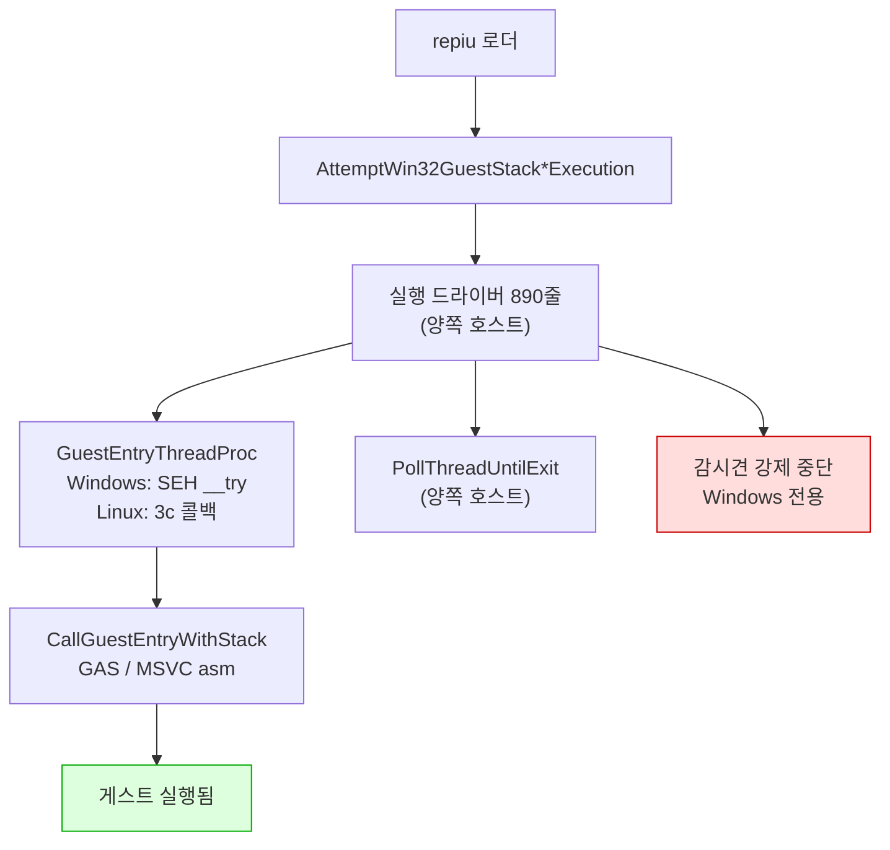
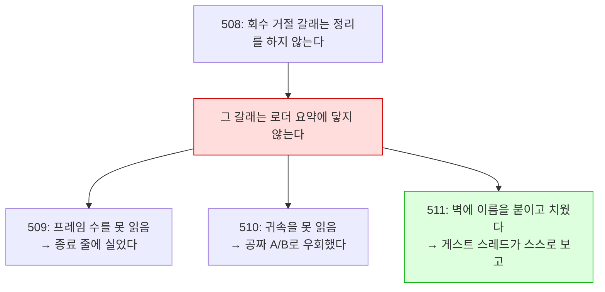
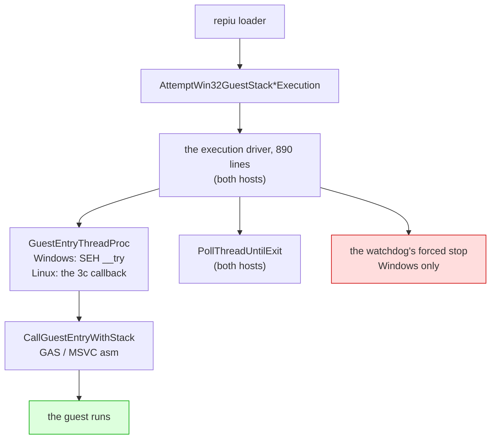

# Linux 이식 frontier / Linux port frontier

설계: [20260822-503](../design/20260822-503-linux-execution-engine.md) ·
작업 지시: [20260822-503](../work-orders/20260822-503-linux-execution-engine.md) ·
작업 로그: [20260822-503](../work-logs/20260822-503-linux-execution-engine.md) ·
측정 절차: [linux-engine-port-measurement](../guides/linux-engine-port-measurement.md)

이 문서는 **Linux 이식이 지금 어디까지 왔는지와 다음에 무엇이 필요한지**만 유지합니다.
단계별 증거는 작업 로그에 있습니다. 표기는 이 디렉터리의 규칙을 따릅니다 — **확인됨**,
**추정**, **미확정**.

## 1. 한 줄 요약

**게스트 코드와 기본 `dynamic` AOT backend가 Linux에서 실행됩니다.** DOS/4GW 샘플은
`legacy`와 `dynamic` 모두 같은 종료 코드 2·초점 오프셋 0x10·opcode 0x80에서 멈춥니다.

**화면도 열렸습니다(Task 506).** WSLg `pumpit1`은 약 45.1초에 첫 버퍼 스왑, 약 51.7초에
69,263/307,200 non-black 픽셀을 기록했고 이후 스왑이 계속되었습니다. 오디오 장치도 열립니다.

**종료도 스스로 됩니다(Task 507).** 예산 만료·SIGTERM 여덟 번 모두 프로세스가 스스로
끝났습니다 — 이전에는 TERM을 받고도 영원히 기다렸습니다.

**그리고 코어 덤프 없이 끝납니다(Task 508).** 507 뒤에 남아 있던 것은 회수를 거절당한 실행이
SIGTRAP으로 끝나는 경우였습니다. 60초 예산 6회에서 거절 6회 중 2회가 그렇게 끝났고, 수정 후
같은 6회에서 거절은 그대로 6회·SIGTRAP은 0회입니다. **이제 Linux에서 `exit=133`을 보면 그것은
회귀입니다.**

**그리고 왜 느린지도 이제 압니다(Task 511).** 프레임당 격차 126M cycle 중 **68%가 폴트
핸들러**이고, Linux에서 그것은 시그널 전달입니다. 아래 4절에 분해가 있습니다.

**화면이 나오는 것을 사람이 확인했습니다(2026-08-28, 사용자 관측).** 같은 관측이 남긴 다음
과제가 **속도**였고, Task 509가 쟀습니다 — **Linux는 Windows의 3.7%, 약 26.8배 느립니다**
(Release, vsync OFF, `pumpit1`, 호스트당 3회, 범위 무중첩). 남은 것은 **어디가 느린가**이고,
4절에 순서를 적었습니다.

## 2. 확인됨 — 지금 서 있는 것

| 항목 | 상태 | 근거 |
|---|---|---|
| `src/platform/win32` 81개 소스 Linux 컴파일 | **81 / 81** | 3d-16, 3d-17 측정 |
| `repiu` 로더 Linux 링크 | ELF 32-bit `EXEC`, 텍스트 0x40000000, 쓰기 불가 | 3d-17 |
| 엔진 수준 미정의 심볼 | **0** (라이브러리 배선 9개뿐이었고 해결됨) | 3d-17 측정 |
| `repiu_core_probe` | 양쪽 호스트 **15 / 15** | 3d-18 |
| 게스트 스택 전환·폴트 복구 | 양쪽에서 같은 probe 통과 | 3d-16 |
| 스레드 생성·조회·대기·해제 | 양쪽에서 같은 probe 통과 | 3d-18 |
| **게스트 실행** | **샘플 실행, Windows와 같은 명령에서 정지** | **3d-19** |
| 폴트 18건·종료 코드·blocker | 두 호스트 일치 | 3d-19 |
| **Linux dynamic AOT** | 캐시 배치·인라인 패치·pumpit1 스왑/non-black 픽셀 | **Task 506** |
| **Linux 종료 경로** | 예산 만료·SIGTERM 모두 프로세스가 스스로 종료 | **Task 507** |
| **Linux 종료 경로 — 코어 덤프 없음** | 회수 거절 6/6에서 SIGTRAP **0회** (수정 전 2회) | **Task 508** |
| **Linux i386 Release 빌드** | 성공(프로젝트 최초), 샘플이 3d-19 기준선 통과 | **Task 509** |
| **Linux 프레임률** | 27.21 fps 대 Windows 730.05 fps — 약 **26.8배** | **Task 509** |
| **격차의 축** | 폴트 핸들러가 프레임당 격차의 **68.3%** (42.6배), 3회 재현 | **Task 511** |
| **그 42.6배의 분해** | 프레임당 경계 **13.6배** × 핸들러 본문 **3.3배**. 커널 전달은 Linux가 **0.44배**로 더 쌈 | **Task 512** |

계층으로 내려간 것들입니다.

| 계층 | 헤더 | 단계 |
|---|---|---|
| 게스트 레지스터 컨텍스트 | `platform/guest_cpu_context.h` | 3a |
| 가상 메모리 | `platform/virtual_memory.h` | 3b |
| 폴트 전달 | `platform/fault_handler.h` | 3c |
| 워커 신호 | `platform/worker_signal.h` | 3d-6 |
| 안전한 메모리 복사 | `platform/safe_memory_copy.h` | 3d-7 |
| 시간·사이클 카운터 | `platform/host_time.h` | 3d-8 |
| 환경 변수 읽기·열거·쓰기 | `platform/host_environment.h` | 3d-9, 3d-16, 3d-17 |
| 진단 출력 | `platform/host_error_stream.h` | 3d-14 |
| 스레드 번호·생성·조회·대기 | `platform/host_thread.h` | 3d-15, 3d-18 |
| 게스트 스택 전환 오프셋과 전역 | `platform/guest_stack_switch.h` | 3d-16 |
| 자식 프로세스 재실행 | `platform/host_process.h` | 3d-17 |
| 양보·짧은 대기 | `platform/host_time.h` | 3d-19 |

어셈블리는 GAS로 옮겨졌습니다 — 다섯 디스패치 thunk(`stack_bridge.inc.S` 매크로 하나,
3d-12)와 트램폴린의 세 진입점(`guest_stack_switch.S`, 3d-16).

## 3. 벽은 열렸습니다 (3d-19)



`IsGuestStackSwitchSupported()`와 `IsDirectX86ExecutionSupported()`는 이제 컴파일러가 아니라
**아키텍처**를 묻습니다 — 3d-16이 스택 전환을 GAS로 쓴 뒤로 컴파일러에 달려 있지 않습니다.

## 3.5 2026-08-27 main 병합 인계

이 날 main에 들어간 것은 다섯입니다. 종합 설계는 없고, 각 작업의 설계·지시서·로그가 정본입니다.

| 커밋 | 무엇 |
|---|---|
| `6f9ac34` | 503d-22 마감 — 포기한 인터럽트가 다시 오지 못함을 probe로 고정, 그 과정에서 드러난 교차 스레드 구멍을 닫음 |
| `9acbabe` | `SA_NODEFER`를 **후보에서 제외** — 증상을 원인으로 읽고 있었음. 같은 플래그를 두고 자기모순이던 주석도 정정 |
| `bd6e736` | 503d-23 — **9초 정지 해결.** `native_fast_path`가 복귀 브레이크포인트를 무장하면서 트랩 플래그를 해제하는데 Linux에서 무장만 버려짐 |
| `db234db` | Task 505 — **Glide 창이 Linux에서 열림.** 이식이 아니라 울타리 57개 해제 |
| `486fe09` | `0x010EE1xx`를 "대기 루프"라 한 것 정정 — Task 219가 이미 확정한 비트스트림 디코더 |

### 이 날 반복해서 걸린 것

**성공 신호 하나로 성공을 판정한 것**이 세 번입니다.

| 무엇을 봤나 | 무엇으로 읽었나 | 실제 |
|---|---|---|
| `exit 0` | 정상 완주 | 창을 못 열어 게임이 포기 |
| `opened=1` | 창이 열림 | 더미 폴백도 같은 값을 반환 |
| `dispatch_entry` 폭증 | 전진 중 | 일하는 중이지 나아가는 중이 아님 |

그리고 **관측 창보다 긴 주기는 보이지 않는다**에 두 번 걸렸습니다 — 30초는 "느리다",
240초는 "갇혔다", 1,200초에서야 실상.

세 경우 모두 **한 걸음 더 갔으면** 잡혔습니다. 종료 코드 대신 로그를, 반환값 대신 메시지를,
카운터 대신 EIP 궤적과 코드를 봤어야 했습니다. `0x010EE1xx`는 특히 그렇습니다 — 답이
저장소 안에 두 달 전부터 있었습니다.

### 다음

**감시견과 종료 경로의 강제 중단을 안전한 Linux 복구 경로로 바꾸는 작업**입니다. Task 506
검증에서도 측정을 마치고 종료를 요청했을 때 TERM에 응답하지 않아 측정 프로세스를 PID 확인 후
강제 종료했습니다.

> 이 항목은 Task 507·508로 끝났습니다. **현재의 다음 항목은 아래 4절**에 있습니다. 이 절은
> 2026-08-27 시점의 기록으로 남깁니다.

## 3.6 2026-08-28 main 병합 인계

이 날 main에 들어간 것은 넷입니다. 화면이 열린 다음 **왜 느린지까지** 갔습니다.

| 커밋 | 무엇 |
|---|---|
| `f2694dc` | Tasks 506·507·508 — **화면이 나오고, 종료가 되고, 코어를 덤프하지 않습니다** |
| `1f914db` | Task 509 — 실행이 자기 프레임률을 보고합니다. **Linux는 Windows의 3.7%** |
| `9d5a12b` | Task 510 — Glide 게이트를 축에서 **배제**. 코드 변경 0 |
| `2cd1e13` | Task 511 — 실행 중 귀속 보고. **격차의 68%가 폴트 핸들러** |
| `bd0ebaa` | Task 512 — 그 68%를 **횟수 13.6배 × 단가 3.3배**로 분해. 시그널 전달 자체는 **무죄** |

### 하나의 사슬로 읽으십시오

세 작업이 같은 벽에 세 번 부딪혔고, 세 번째에야 이름을 붙였습니다.



**교훈**: Linux에서 계측이 아무것도 내지 않으면, 계측을 의심하기 전에 **그것이 `attempt`를
거쳐 `main.cpp`로 나가는지** 먼저 보십시오. 그렇다면 렌더까지 간 Linux 실행에서는 나오지
않습니다.

### 이 날 걸린 것

**하나. 배율이 크면 백분율이 거짓말을 합니다.** `SETTER_ELIDE=0`이 Linux에서 −1.0%라 "호스트
왕복은 공짜"로 읽힐 뻔했습니다. 같은 노브가 Windows에서 27.1%를 깎는데, **절대 비용은 양쪽이
같습니다**(+0.51 대 +0.38 ms). 안 보인 이유는 싸서가 아니라 프레임이 36.75 ms이기
때문입니다. → **항상 프레임당 ms 또는 cycle로 비교하십시오.**

**둘. 널 결과는 그 자체로 읽을 수 없습니다.** "축이 아니다"와 "노브가 이 장면에서 아무 일도
안 했다"가 같은 모양입니다. → **대조군을 돌리십시오.** 510이 그렇게 살아났습니다.

**셋. Debug 수치를 성질로 읽었습니다.** Task 506의 "약 45.1초에 첫 스왑"은 Debug였고,
Release에서는 약 2초입니다. "자산 디코드가 오래 걸린다"는 엔진의 성질이 아니었습니다.

**넷. 누적 평균은 변화를 지웁니다.** Linux 프레임당 비용이 실행 중 83M → 272M cycle로 세 배가
됩니다. 시간별 보고가 없었으면 "일정하게 26.8배"로 적었을 것입니다.

### 다음 — 시그널 전달의 횟수인가 단가인가

**축은 확정되고 분해까지 끝났습니다.** `veh`(폴트 핸들러)가 격차의 68.3%이고, 그 42.6배는
**프레임당 경계 13.6배 × 핸들러 본문 3.3배**입니다. **시그널 전달 자체는 무죄입니다** —
커널 왕복이 Linux에서 0.44배로 더 쌉니다(512).

**다음 질문 하나: 왜 경계를 13.6배 더 밟는가.**

초과분은 **single-step이 아닙니다**(Linux 배달의 3.6%, Windows 24.4%). breakpoint이거나
access violation입니다.

**유력 후보는 아래 6절에 이미 적혀 있습니다** — Linux 사용자 공간이 하드웨어 디버그
레지스터를 못 써서 `native_fast_path`·`native_region`·`native_linear_span` **셋이 모두
차단**돼 있습니다. **그 셋은 정확히 트랩을 피하려고 있는 경로**이고, 꺼진 대가는 측정된 적이
없습니다.

먼저 할 일은 **초과 배달의 종류를 세는 것**입니다. `veh_gap_counts`가 이미 single-step /
breakpoint / other 세 칸으로 나뉘어 있으므로, 511의 보고 줄에 나머지 두 칸을 더하면 종류별
분포가 바로 나옵니다 — 512와 같은 모양의, 새로 세지 않는 변경입니다.

남은 둘: **핸들러 본문 3.3배**(하위 버킷 `kVehPrologue`·`kAotReentry` 등이 가릅니다), 그리고
`dos`의 **433.9배**(격차 기여는 1.9%로 작지만 배율은 표에서 가장 큽니다 — 작다고 넘기지 말 것).

### 재현에 필요한 것

```bash
./scripts/build_linux_i386.sh --config Release
bash scripts/task509_frame_rate_measure.sh 3 90000 <label>     # 프레임률
bash scripts/task508_refused_recovery_repro.sh 3 60000 <label> # 종료 갈래
```

귀속은 `REPIU_EXECUTION_TIME_PROFILE=1 REPIU_LIVE_PROFILE_INTERVAL_MS=10000`입니다. 조건과
함정은 [실행 프레임률 측정 절차](../guides/execution-frame-rate-measurement.md)에 있습니다.

**Linux 빌드 트리는 지금 Release입니다.** 단일 구성 생성기라 Debug를 대체했고, 정확성 작업으로
돌아가려면 `--config Debug` 재구성이 필요합니다(SDL 재빌드 포함).

## 3.7 2026-08-29 main 병합 인계

이 날 main에 들어간 것은 Linux 성능 축의 다섯입니다(Tasks 515~519). **한 줄로: 26.8배의
정체를 "재진입마다 트랩 하나"까지 좁혔고, 그 다음 한 걸음에서 네 번 틀렸습니다.**

| 커밋 | 무엇 |
|---|---|
| `15cae5e` | 515 — 초과 경계는 **breakpoint**(69%). 후보 둘을 대조군으로 지움 |
| `b357ec1` | 516 — 축은 boundary가 아니라 **재진입**. Linux는 재진입당 트랩 1.010, Windows 0.0432 |
| `6d3b59b` | 517 — Linux에서 direct dispatch는 **돈다**(87%). 그런데 성공해도 트랩이 붙음 |
| `08f1074` | 518 — 디스패치마다 relink 6.1회 (**결론은 519가 철회**) |
| `d3870cb` | 519 — relink는 지속성과 무관한 수였음. `content=0` |

### 지금 쓸 수 있는 계측

실행 중에 네 줄이 나옵니다. `REPIU_EXECUTION_TIME_PROFILE=1`과
`REPIU_LIVE_PROFILE_INTERVAL_MS=10000`으로 켭니다.

| 줄 | 무엇 |
|---|---|
| `[repiu-live-profile]` | guest-run 대비 veh/glide/port-io/dos/unaccounted 몫, 창 값 포함 |
| `[repiu-live-veh]` | 배달 수·배달당 cycle·커널 gap, 그리고 클래스 셋(ss/bp/other) |
| `[repiu-live-aot]` | 캐시 entry/boundary/재진입, 경계 사유 다섯, `sum_ok` |
| `[repiu-live-gdd]` | Glide direct dispatch: patched/verified/resolved/relinked(content·fixup)/entry/success |

**이 넷이 이 축에서 나온 실질 산출물입니다.** Linux는 로더 요약에 닿지 못하므로 이 줄들이
아니면 아무것도 읽을 수 없습니다.

### 다음 한 걸음

**Windows에서 그 INT3은 왜 다시 밟히지 않는가.** 활성화는 `Eip`만 돌리고 INT3을 지우지
않는데, Windows에서는 재진입의 95%가 트랩 없이 처리되고 Linux에서는 100%가 트랩을 냅니다.

**시작하기 전에 위 8절의 표를 읽으십시오** — 같은 실수를 네 번 했습니다.

### 남은 다른 축

* `other`(접근 위반) 프레임당 **10.7배** — 페이지 보호·포트 I/O·write watch.
* 핸들러 본문 **3.3배** — 하위 버킷(`kVehPrologue`·`kAotReentry` 등)이 가릅니다.
* `dos` 프레임당 **433.9배** — 격차 기여는 1.9%로 작지만 배율은 가장 큽니다.

## 4. 다음에 필요한 것

> 이 절은 3d-20을 가리키고 있었습니다. 3d-20(다른 스레드의 레지스터)·3d-21(표본기)·
> 3d-22(시한이 지난 인터럽트)는 끝났고, 목록에서 **빠지지 않은 둘**이 아래에 그대로
> 남습니다. 인터럽트 계층 자체는 양쪽 호스트에서 probe를 통과합니다.

1. ~~**AOT 코드 캐시**~~ — **해결 (Task 506).** Win32 메모리 호출 62곳을 3b 계층으로 옮겼고,
   Linux `dynamic`에서 배치·동적 실행·인라인 패치·페이지 retirement가 동작합니다. `pumpit1`은
   45.1초에 첫 스왑, 51.7초에 첫 non-black 스왑을 기록했습니다.
2. ~~**감시견의 강제 중단.**~~ — **해결 (Task 507).** 종료 블록을 `InterruptHostThread`로
   옮겼습니다. 회수에 성공하면 정상 종료하고, 회수가 거절되면 `DetachHostThread`로 기다리지
   않고 내려가며 AOT 캐시 해제를 건너뛰고 `_Exit`로 프로세스를 즉시 끝냅니다. `pumpit1`에서
   예산 만료·SIGTERM 여덟 번 모두 스스로 종료했습니다(더 이상 매달리지 않음). 회수가 거절된
   경로에서 SIGTRAP으로 끝나는 경우가 남아 있고, 그 원인은 위 6절에 적었습니다 — 프로세스가
   끝나는 것 자체는 507의 조건을 만족합니다.
3. ~~**회수를 거절당한 종료의 코어 덤프.**~~ — **해결 (Task 508).** 근인은 트랩이 아니라
   **순서**였습니다. 종료 블록이 회수 성공 여부와 무관하게 `RemoveFaultHandler()`를 부르는데,
   거절당한 실행에서는 그 뒤로도 게스트 스레드가 돌면서 AOT 엔진이 평소처럼 심는 INT3을
   밟습니다. 508은 거절된 갈래에서 정리를 통째로 건너뛰고(핸들러도 떼지 않고) 파일로 나가는
   두 진단과 detach만 남긴 뒤 `_Exit` 합니다. 60초 예산 6회에서 거절 6/6·SIGTRAP 0회.

### 측정됨 (Task 509) — Linux는 Windows의 3.7%입니다

| 호스트 | fps (Release, vsync OFF, `pumpit1` 90초, 3회) | 평균 | 프레임당 |
|---|---|---:|---:|
| Windows | 743.91 · 737.46 · 708.79 | **730.05** | 1.37 ms |
| Linux (WSLg) | 26.22 · 27.76 · 27.65 | **27.21** | 36.75 ms |

**약 26.8배이고 두 집단의 범위가 겹치지 않습니다.** 가장 보수적으로 잡아도 25.5배입니다.
프레임당 Linux가 **35.4 ms를 더 씁니다.**

**기동은 원인이 아닙니다** — 양쪽 모두 `span_ms` 88초로 첫 프레임까지 2초 남짓입니다. 차이는
전부 렌더 루프 안입니다. 여기서 Task 506의 "약 45.1초에 첫 스왑"이 **Debug 수치**였음이
드러납니다. Release에서는 약 2초입니다.

**배율이 아직 분해되지 않았습니다.** 컴파일러 차이(MSVC 대 GCC)와 WSLg의 X11 한 겹이 26.8배
안에 함께 들어 있습니다.

### 귀속 1차 (Task 510) — Glide 게이트는 축이 아닙니다

이미 있는 노브 다섯 변인을 A/B 했습니다(코드 변경 0). **프레임당 ms로 비교해야 합니다** —
배율이 26.8배인 곳에서 백분율은 같은 비용을 한쪽 37%, 다른 쪽 1%로 보이게 합니다.

| 변인 | 평균 fps | 프레임당 | 기준선 대비 |
|---|---:|---:|---:|
| Linux 기준선 | 27.21 | 36.75 ms | — |
| `RENDEZVOUS_SPIN_US=2000` | 30.50 | 32.78 ms | −3.97 ms |
| `ASYNC_PRESENT=1` | 32.83 | 30.46 ms | −6.29 ms |
| 위 둘 동시 | 33.12 | 30.19 ms | −6.56 ms (가산 아님) |
| `SETTER_ELIDE=0` | 26.93 | 37.13 ms | +0.38 ms |
| `DRAW_BATCH=0` | 28.14 | 35.54 ms | −1.21 ms |
| **Windows `SETTER_ELIDE=0`** | 532.29 | 1.88 ms | **+0.51 ms** |

마지막 줄이 대조군입니다. **같은 노브가 Windows에서 27.1% 떨어집니다** — 노브는 이 장면에서
살아 있습니다. 그런데 **절대 비용은 양쪽이 같습니다**(+0.51 대 +0.38 ms). Linux에서 안 보인
이유는 그 일이 싸서가 아니라 프레임이 36.75 ms이기 때문입니다.

**배제됨**: rendezvous 깨우기 지연(한 몫이나 지배항 아님), present 임계 경로(같음), 호스트
왕복 **횟수**, 게이트 **크로싱 횟수**.

**남은 것: 프레임당 약 30 ms.** 어떤 Glide 노브도 닿지 못했고, 최선의 조합으로도 Windows의
22.0배입니다.

**보조 정황(추정)**: 기동 구간(스왑 0회, 게스트 코드가 자산 디코드)은 첫 프레임까지 300 ms
안쪽 차이 — 약 10~15%입니다. 게스트 코드 실행 자체가 20배 느린 것은 아니라는 방향입니다.

### 귀속 2차 (Task 511) — 축은 폴트 전달입니다

벽을 치웠습니다(실행 중 보고, 게스트 스레드 위). 같은 기계이므로 TSC cycle이 직접 비교됩니다 —
프레임당, 100만 cycle 단위입니다.

| 버킷 | Windows | Linux | 배율 | **격차 기여** |
|---|---:|---:|---:|---:|
| **veh (폴트 핸들러)** | 2.065 | 88.072 | **42.6x** | **68.3%** |
| glide | 1.618 | 26.480 | 16.4x | 19.7% |
| unaccounted | 2.159 | 17.214 | 8.0x | 12.0% |
| dos | 0.006 | 2.438 | **433.9x** | 1.9% |
| port-io | 0.006 | 0.105 | 18.6x | 0.1% |
| 합계 | 5.843 | 131.805 | 22.6x | 126.0M |

**Linux 격차의 68%가 폴트 핸들러입니다.** (511은 이것을 "시그널 전달"이라 불렀는데 **Task 512가
정정했습니다** — 전달 경로 자체는 Linux가 더 쌉니다. 아래 512 절을 볼 것.) `veh` 몫은 3회에서
66.82% · 66.71% · 64.55%로 재현되고, Windows 대조군은 35.35%입니다.

**510과 어긋나지 않습니다.** 510이 시험한 것은 호스트 왕복 **횟수**와 크로싱 **횟수**였고,
여기 glide 26.5M cycle의 대부분은 횟수가 아니라 회당 비용과 대기입니다.

**그리고 프레임당 비용이 실행 중에 세 배가 됩니다**(83M → 272M). "일정하게 26.8배"가 아니라
장면이 진행될수록 나빠집니다 — 누적 평균만 냈으면 보이지 않았을 것입니다.

### 귀속 3차 (Task 512) — 전달은 범인이 아닙니다. 횟수입니다

511이 축을 "시그널 전달"이라 불렀는데 **정정합니다.** 42.6배를 두 인자로 갈랐습니다.

| | Windows | Linux | 배율 |
|---|---:|---:|---:|
| 프레임당 배달 | 18.8 | 256.3 | **13.6x** |
| 배달당 cycle (핸들러 본문) | 104,002 | 341,557 | **3.3x** |
| 곱 | | | 44.8x ≈ 511의 42.6x |
| **커널 왕복 바닥 (`gap min`)** | 21,756 | **9,632** | **0.44x** |
| **커널 왕복 single-step 평균** | 28,185 | **16,466** | **0.58x** |

**`gap`은 핸들러가 나간 뒤 다음 진입까지, 곧 커널의 전달 경로만 봅니다**(Task 372). 그 값이
Linux에서 더 작습니다 — **시그널 전달은 Windows의 예외 디스패치보다 두 배 이상 쌉니다.**
비싼 것은 전달이 아니라 그 주위입니다.

**정규화 주의.** 초당으로 보면 Linux가 폴트를 **40% 적게** 냅니다(7,732 대 12,951). 프레임당이
큰 것은 프레임이 24배 드물기 때문입니다. 프레임당이 하중을 지는 정규화이지만(한 프레임 =
`grBufferSwap` 한 번 = 같은 게스트 경로), **게임 로직이 저프레임률에서 일을 줄이는 구조라면
그 전제가 깨집니다 — 확인되지 않았습니다.**

### 귀속 4차 (Task 515) — 초과분은 breakpoint이고, 후보 둘은 반증됐습니다

**프레임당 배달 수**로 봅니다.

| 클래스 | Windows | Linux | 배율 | 초과분 기여 |
|---|---:|---:|---:|---:|
| single-step | 4.87 | 8.95 | 1.8x | 1.8% |
| **breakpoint** | 6.94 | **167.80** | **24.2x** | **69%** |
| other (접근 위반) | 6.92 | 74.29 | 10.7x | 29% |

성격 자체가 뒤집혀 있습니다 — Windows는 세 클래스가 고른데(24/39/37%), Linux는 **breakpoint
67.0%**에 몰려 있습니다.

**후보 둘을 Windows 대조군으로 반증했습니다.**

| Windows 대조군 | bp/frame | 기준선 대비 |
|---|---:|---:|
| 기준선 | 6.94 | — |
| `native_fast_path` 끔 | 6.67 | −3.9% |
| direct-return table 끔 | 6.73 | −2.9% |

**정제 하나**: `native_region`·`native_linear_span`은 Windows에서도 opt-in이라 기본 꺼짐입니다.
**기본값이 두 호스트에서 다른 것은 `native_fast_path` 하나뿐**입니다 — 그런데 그 카운터가
**기준선에서도 `0/0/0`**입니다. 이 장면에서는 Windows에서도 한 번도 작동하지 않으므로
**두 호스트의 차이가 될 수 없습니다.** (노브를 껐는데 안 변할 때 카운터를 보라는 510의 규칙이
여기서 약한 결론을 강한 결론으로 바꿨습니다.)

### 귀속 5~8차 (Tasks 516~519) — 재진입마다 트랩이 하나, 그리고 틀린 답 셋

**516: 축은 boundary가 아니라 재진입입니다.**

| | Windows | Linux | 배율 |
|---|---:|---:|---:|
| 프레임당 boundary | 6.69 | 13.78 | 2.1x |
| 프레임당 reentry | 160.63 | ~154 | **0.90x** |
| **reentry당 breakpoint** | **0.0432** | **1.010** | **23x** |

재진입 비율은 Linux가 오히려 10% 적습니다. 다른 것은 **나올 때마다 트랩을 내는가**이고, 이
23배가 515의 breakpoint 24.2배와 맞습니다. Windows가 트랩을 피하는 경로는 **Glide direct
dispatch**로, 재진입의 95.1%(8,719,788 / 9,171,551)를 처리합니다.

**517: 그 경로는 Linux에서도 돕니다.** `patched=172 verified=172 entry=338,929
success=338,928 miss=0`, 재진입의 87%. 그런데 산술이 강제합니다 — Linux의 비-gdd 재진입은
50,685뿐인데 트랩이 392,670으로 **7.7배 초과**합니다. **성공한 direct dispatch도 트랩을
냅니다.**

**518~519: relink 카운터는 이 질문에 답할 수 없는 수였습니다.** 518이 "디스패치마다 6.1회
relink → 패치가 안 붙는다"고 적었고, 519가 카운터를 갈라 **`content=0`, `fixup`이 전부**임을
보였습니다. `fixup` 쪽은 캐시를 읽지 않고 매번 다시 쓰므로 지속성과 무관합니다.
**518의 결론은 철회됐습니다.**

### 그다음 — Windows에서 그 INT3은 왜 다시 밟히지 않는가

`ActivateWin32GlideGateDirectTarget`은 breakpoint 폴트 핸들러 안에서 불리고, 성공하면 `Eip`를
게스트 게이트 주소로 돌리고 트랩 플래그를 끕니다. **INT3 자체는 지우지 않습니다.** 그런데
Windows에서는 같은 INT3이 사실상 다시 밟히지 않고, Linux에서는 매번 밟힙니다. **여기가 다음
자리입니다.**

**측정 다섯 번 동안 제 추정이 네 번 틀렸습니다.** 공통 원인이 하나이고, 다음 사람에게
그것이 이 절에서 가장 값나가는 내용입니다.

| # | 함의 | 실제 |
|---|---|---|
| 515 | 껐는데 안 변하니 원인이 아니다 | 애초에 한 번도 안 돌고 있었음 (`0/0/0`) |
| 516 | `residency_mean=0`이니 캐시가 안 돈다 | 표본 카운터가 이 경로에서 안 채워짐 |
| 517 | 트랩이 매 재진입에 있으니 direct dispatch가 안 돈다 | 87%가 그 경로로 감 |
| 519 | relink가 많으니 패치가 안 붙는다 | relink는 지속성과 무관한 수 |

**넷 다 카운터의 이름으로 뜻을 추정하고 증가 지점을 읽지 않은 것입니다.** 새 카운터를 읽기
전에 `fetch_add`가 어디에 있는지부터 보십시오.

다음 후보는 **AOT 코드 캐시가 Linux에서 경계를 얼마나 이어 붙이는가**입니다 — direct edge
연결과 인라인 패치의 **효과**. Task 506이 "동작한다"까지는 확인했지만 얼마나 효과적인지는
재지 않았습니다.

그 수치(patched/verified/resolved-target/fallback 계열)는 지금 `main.cpp` 요약으로만 나가
**Linux에서 읽을 수 없습니다.** 512·515와 같은 모양으로 live 줄에 실으면 됩니다.

`other`의 10.7배도 남습니다 — 페이지 보호·포트 I/O·write watch 쪽입니다.

**초과분은 single-step이 아닙니다.** `gap_ss_count`가 Linux 배달의 **3.6%**인데 Windows는
**24.4%**입니다. 초과분은 breakpoint이거나 access violation입니다.

**유력 후보가 이 문서 6절에 이미 있습니다** — 하드웨어 디버그 레지스터를 Linux 사용자 공간이
쓸 수 없어 `native_fast_path`·`native_region`·`native_linear_span` **셋이 모두 차단**되어
있습니다. 그 셋은 정확히 **트랩을 피하려고** 있는 경로이고, 그것들이 꺼진 대가는 **측정된 적이
없습니다.** 이것이 다음 단위입니다.

남은 둘: **핸들러 본문 3.3배**(하위 버킷 `kVehPrologue`·`kAotReentry` 등이 가릅니다),
그리고 `dos`의 **433.9배**.

`veh`가 축인 것은 확정입니다. 남은 질문은 **배달이 많은 것인가 회당 단가가 큰 것인가**이고,
`veh` 버킷의 `counts`가 그 답을 갖고 있습니다. 둘은 고칠 방법이 전혀 다릅니다 — 횟수면
경계를 줄이는 일이고, 단가면 전달 경로 자체의 문제입니다.

`dos`의 **433.9배**도 따로 봐야 합니다. 격차 기여는 1.9%로 작지만 배율은 이 표에서 가장
큽니다.

세 항목이 모두 닫히면서 **Linux에서 게스트가 돌고, 창이 열리고, 종료가 됩니다.**

**그리고 화면이 나오는 것을 사람이 확인했습니다 (2026-08-28, 사용자 관측).** 계측이 닿는
데까지는 non-black 픽셀 수였고, "실제로 게임 화면이 보이는가"는 사람이 봐야 하는
질문이었습니다 — 그 답이 예입니다. 같은 관측이 남긴 것은 **"속도가 아주 느리다"**였고,
Task 509가 그것을 숫자로 바꿨습니다(위 표).

이제 남은 것은 **어디에서 느린가**이고, Task 510이 Glide 축을 배제했습니다(위 표).
그런데 세밀한 귀속 계측은 **Linux에서 출력되지 않습니다** — `REPIU_GLIDE_ORDINAL_TIME_PROFILE`과
`REPIU_AOT_RETURN_STAGE_PROFILE`이 전부 `attempt`를 거쳐 `main.cpp`가 찍는데, `attempt`를 채우는
`CopyThreadObservationToAttempt`가 "게스트 스레드가 멈췄다"를 전제로 하고 Linux 렌더 실행은
`stopped=0`이라 거기 닿지 못합니다(Task 508). **509에서 프레임 수가 없던 것과 같은 벽입니다.**
다음 단위가 그 벽입니다.

그리고 **WSLg인지 실제 데스크톱인지**를 나누는 것이 배율 분해의 절반입니다. WSLg는 X11을
한 겹 더 지나므로 present 비용이 다를 수 있고, 26.8배 안에 그 몫이 얼마인지 모릅니다.

**무엇이 그려지는가**(Task 506이 "별도 검증"으로 남긴 것)는 사람이 화면을 본 것으로 절반이
닫혔고, Windows와 같은 장면인지 프레임 단위로 대조하는 것은 남아 있습니다.
`REPIU_GLIDE_FRAME_DUMP`가 두 호스트에 다 있으므로 대조 자체는 가능합니다.

6절의 나머지(핸들러 미반환, 자식 프로세스 재실행, CHD 마운트)는 게스트 구동을 막고 있지
않으므로 그 뒤입니다.

## 5. 실행 확인 방법 (3d-19에서 확립)

게임 자산 없이 "게스트가 도는가"를 확인하는 절차입니다. `build/openwatcom_samples/`의 DOS/4GW
샘플과 direct executable 경로를 씁니다.

```bash
cd build/linux_i386
REPIU_EXECUTION_BACKEND=legacy ./repiu     ../../build/openwatcom_samples/clibexam__bprintf_c/sample.exe
```

같은 샘플을 Windows에서 돌려 **대조하는 것이 요점**입니다. 3d-19 시점의 기준값:

| 항목 | 값 |
|---|---|
| 폴트 총계 | 18 (양쪽) |
| 스레드 종료 코드 | 2 (양쪽) |
| 정지 지점 | `… 8E C1 89 D6 42 [26] 80 3E 00 …`, focus offset 0x10, opcode 0x80 (양쪽) |
| 예외 코드 | Linux `0x0000000B` / Windows `0xC0000005` — 호스트 번호이고 기록용 |
| census 칸 | Linux 18/0 / Windows 17/1 — Windows에만 구분되는 코드가 있어서 |

주소는 재배치 이미지 베이스만큼 다릅니다(Linux 0x01000000, Windows 0x03000000). **오프셋으로
비교하십시오.**

## 6. 미확정 — 확인하지 않고 넘어온 것들

| 항목 | 상태 | 어디에 |
|---|---|---|
| 자식 프로세스 재실행이 Linux에도 필요한가 | **미측정** | Task 500의 근거(GPU 드라이버의 주소 공간 선점)가 Linux에도 해당하는지 확인한 적 없음. 되돌릴 자리는 `host_process.h` |
| 자산 경로와 CHD 마운트의 Linux 검증 | **범위 밖** | 설계의 "범위 밖" 절. 실행 시도 전에 다시 볼 것 |
| ~~렌더 백엔드 (창)~~ | **해결 (Task 505)** | 이식할 것이 없었습니다 — 두 파일 모두 이미 SDL3이고 진짜 Win32 API는 **0개**였습니다. 503d-10이 컴파일용으로 세운 울타리 57개(backend 44 + shader 13)가 전부였고, 실제 수정은 각 파일 한 줄(`SDL_FunctionPointer`)입니다. 이제 `opened=1`, 640x480 논리 창 2배(1280x960), 깊이 24비트 승인 |
| ~~첫 프레임에 도달하지 못함 (화면)~~ | **해결 (Task 506)** | `dynamic` AOT가 legacy의 명령 단위 단일 스텝 병목을 우회했습니다. `pumpit1`은 약 45.1초에 첫 스왑(검정), 약 51.7초에 69,263/307,200 non-black 픽셀, 이후 40회 이상의 연속 스왑을 기록했습니다. 무엇이 정확히 그려지는지는 별도 검증입니다. |
| 오디오 출력 셋 | **정정됨** | 아래 8절 |
| 하드웨어 디버그 레지스터 | **불가 — 이제 술어로 강제** | Linux 사용자 공간은 자기 스레드의 것을 쓸 수 없습니다. **`native_linear_span`만이 아니라** `native_fast_path`·`native_region`도 이 위에 서 있었고, 그 중 `native_fast_path`는 **기본 켜짐**이라 9초 정지를 냈습니다(3d-23). `HardwareDebugRegistersAvailable()`이 셋 모두를 env 설정보다 앞에서 막습니다 |
| **Release probe 실패** | **미해결 (Task 509에서 발견)** | probe 모음이 **Release에서 검증된 적이 없습니다.** Linux Release는 `dos_file_handle_cache` 뒤 `== pit_timer ==` 헤더 전에 **segfault(exit 139)**, Windows Release는 `fault_handler_data_faults`·`stack_bridge_contract` **2건 실패**. 양쪽 Debug는 15/15이고, 509의 변경을 넣은 Windows Debug도 15/15입니다 — 호스트가 아니라 **구성**이 가르는 문제입니다. **엔진은 Release에서 정상** — Linux Release `repiu`가 DOS/4GW 샘플에서 3d-19 기준선을 그대로 냅니다. 509의 변경(프레임 카운터·종료 줄)은 이 probe들의 경로를 지나지 않습니다 |
| 교차 프로세스 텔레메트리 | **울타리 안** | `live_telemetry_snapshot.cpp`의 공유 섹션·정지 스냅샷. 게스트 구동에 불필요 |
| `CaptureSuspendedThreadSnapshot` | **호출자 없음** | 정의만 있고 선언도 호출도 없음. 지우는 것은 의도 확인 후 |
| ~~종료 시 SIGTRAP~~ | **해결 (Task 508)** | 507이 재현했고 508이 근인을 확정했습니다 — **트랩이 아니라 순서**입니다. 종료 블록은 회수 성공 여부와 무관하게 같은 정리 순서를 밟고, 그 세 번째 단계가 `RemoveFaultHandler()`입니다. 회수를 거절당했다는 것은 게스트 스레드가 계속 돈다는 뜻이고, `dynamic` backend는 정상 동작으로 INT3과 트랩 플래그를 심으므로 핸들러가 사라진 뒤 그중 하나를 밟으면 커널 기본 처분(코어 덤프)이 실행됩니다. 507이 넣어 둔 단계 표시가 증거였습니다 — **두 번의 SIGTRAP 모두 마지막 줄이 `step=translation-worker`**, 곧 `step=fault-handler` 바로 다음이었습니다. 508은 거절된 갈래에서 정리를 하지 않습니다: `probe-dump` → `DetachHostThread` → `_Exit`. 60초 예산 6회에서 거절 6/6, SIGTRAP 0회 (수정 전 같은 조건 6회에서 2회). 507이 걱정한 "해제된 AOT 캐시를 가리키는 EIP"는 발생하지 않습니다 — **해제 자체를 하지 않기 때문**입니다. |
| ~~pumpit1의 9초 정지~~ | **해결 (3d-23)** | 근인은 `native_fast_path`가 복귀 브레이크포인트를 무장하면서 트랩 플래그를 해제하는데, Linux에서 무장만 버려진 것. 게스트가 되돌릴 것 없이 풀려났습니다. `fast=18/0/17`(복귀 0)이 카운터에 그대로 있었습니다. 디버그 레지스터가 없는 곳에서 세 경로를 차단해 수정 |
| 인터럽트 핸들러가 반환하지 않는 것 | **원인 미상** | 정지한 게스트에서 첫 배달이 핸들러로 들어간 뒤 반환하지 않았고, 그래서 이후 46건이 전부 보류·시한 초과가 됐습니다. **`SA_NODEFER`는 답이 아닙니다** — 아래를 볼 것 |
| ~~인터럽트 핸들러의 `SA_NODEFER`~~ | **후보에서 제외 (2026-08-27)** | 이것을 "고칠 거리"로 적어 둔 것이 오해였습니다. 이 플래그가 **없어서** 시그널 하나가 한 스레드에서 차단된 채 남고, 그것이 "핸들러가 반환하지 않았다"를 읽게 해 준 **진단 신호**입니다. 붙이면 멈춘 핸들러가 반환하게 되는 게 아니라 그 안으로 배달이 중첩되고, 이 스레드는 이미 3c의 대체 스택 위에 있어 그 스택이 조용히 넘칩니다. 근거는 `host_thread.cpp`의 `EnsureInterruptHandler` 주석에 있습니다 |

## 7. 정정 — 오디오 출력은 이미 이식되어 있었습니다

이 문서의 이전 판은 오디오 출력 셋을 "Linux 백엔드 없음, 무음"으로 적었습니다. **틀렸습니다.**
세 파일 모두 이미 SDL을 쓰고 있고 waveOut 호출이 하나도 없습니다.

| 파일 | `SDL_` 호출 | waveOut 호출 |
|---|---|---|
| `ymz280b_audio_out.cpp` | 16 | **0** |
| `piu10_mp3_audio_out.cpp` | 31 | **0** |
| `cd_audio_wave_out.cpp` | 24 | **0** |

`cd_audio_wave_out`은 **이름만** waveOut입니다. 설계의 "정정 1"이 `Win32AotPageWriteWatchSet`
이름을 보고 `GetWriteWatch`를 쓴다고 단정했다 틀린 것과 **같은 함정**이고, 그 교훈은 이미
설계에 적혀 있었습니다 — **이름이 아니라 구현을 봐야 합니다.**

소리가 나지 않은 진짜 이유는 SDL 쪽이었습니다. i386 빌드인데 `libpulse`의 32비트 판이 없어
SDL이 PulseAudio 백엔드를 빼고 ALSA만 컴파일했고, WSL에는 ALSA가 직접 열 장치가 없습니다.

```
#define SDL_AUDIO_DRIVER_ALSA 1     ← 이것만 있었음
#define SDL_AUDIO_DRIVER_DISK 1
#define SDL_AUDIO_DRIVER_DUMMY 1
```

`libpulse-dev:i386`을 넣고 트리를 **버리고 다시 구성**해야 합니다 — SDL의 드라이버 감지는
구성 시점에 캐시되므로, 남은 캐시가 "안 고쳐졌다"처럼 보이게 만듭니다.

### 7.1 그래서 갖춰야 하는 구성 (2026-08-26 확인)

위가 진단이고, 여기는 **실제로 세워 놓고 확인한 결과**입니다. 다음 세션이 데스크톱에서
돌려 보려면 이 절만 보면 됩니다.

패키지는 전부 `:i386`입니다. 32비트 프로세스가 링크하고 `dlopen` 하는 것들이라 amd64 판은
설치돼 있어도 쓰이지 않습니다.

```bash
sudo dpkg --add-architecture i386
sudo apt update && sudo apt install -y pkg-config \
    libpulse-dev:i386 libasound2-dev:i386 libgl-dev:i386 \
    libx11-dev:i386 libxext-dev:i386 libxrandr-dev:i386 libxi-dev:i386 \
    libxfixes-dev:i386 libxcursor-dev:i386 libxrender-dev:i386 \
    libxkbcommon-dev:i386
```

`libxss-dev`와 `libxtst-dev`는 **필요 없습니다.** 빌드 스크립트가 XSCRNSAVER와 XTEST를 끄고,
그 주석이 이유를 적어 두었습니다 — 켜 둔 확장 하나가 곧 찾아야 할 32비트 패키지 하나입니다.

`pkg-config`가 빠지기 쉽습니다. 없으면 SDL이 PulseAudio를 **조용히** 빼고, 있어도 i386 `.pc`가
`/usr/lib/i386-linux-gnu/pkgconfig`에 있어 기본 검색 경로에 안 잡힙니다. 그래서 패키지를 깔아도
"없다"는 답이 나옵니다. 빌드 스크립트가 `PKG_CONFIG_PATH`로 그 디렉터리를 앞에 붙입니다.

확인된 것:

| 항목 | 결과 |
|---|---|
| SDL 오디오 드라이버 | `PULSEAUDIO` + `ALSA` (이전엔 `DUMMY`뿐) |
| SDL 비디오 드라이버 | `X11` (+ XCURSOR·XFIXES·XINPUT2·XRANDR·XSHAPE·XSYNC·XDBE) |
| 런처 | WSLg에서 창 실행, 롬셋 22개 중 16개 인식 |
| **오디오 장치** | `[repiu-ymz] YMZ280B ready through SDL3 at 88200 Hz` |
| 게스트 실행 (pumpit1, legacy) | 8초 동안 dispatch 167,776회, EIP가 재배치 이미지 안에서 이동 |

소리가 실제로 **들리는지**는 사람이 들어야 합니다. 측정이 답할 수 있는 것은 장치가 열렸다는
데까지입니다.

두 가지가 이 확인을 반복할 때 걸립니다.

* **`--headless`로 구성된 트리는 창도 소리도 만들지 못합니다.** 그 옵션이 켜는
  `SDL_UNIX_CONSOLE_BUILD=ON`은 X11/Wayland 요구를 통째로 건너뜁니다. 데스크톱에서 쓰려면
  `--headless` 없이 구성하고, SDL이 감지 결과를 캐시하므로 **트리를 지우고** 다시 해야 합니다.
* **WSLg 자체가 없을 수 있습니다.** `/mnt/wslg`가 없거나 `DISPLAY`·`PULSE_SERVER`가 비어 있으면
  패키지가 아니라 WSL이 문제입니다. `wsl --update` 후 `wsl --shutdown`입니다. 오래된 커널
  (5.10 대)에는 WSLg가 아예 없습니다.

## 8. 반복해서 겪은 함정 — 그리고 컴파일로는 못 잡는 것

**막고 있는 것 하나가 그 뒤의 숫자를 전부 가립니다.** 네 번 겪었습니다.

| 단계 | 막고 있던 것 | 겉보기 | 실제 |
|---|---|---|---|
| 3d-15 | 2,000줄 `#if defined(_WIN32)` | 실패 84 | 97 (숨은 것은 13개뿐) |
| 3d-16 | `#include <psapi.h>` 한 줄 | fatal error 1 | 17개, 네 곳 |
| 3d-17 | 빠진 spdlog include 경로 | fatal error 1 | 19개, 두 곳 |
| 3d-19 | 함수 **반환 타입**의 `DWORD` | 오류 2 | 69개 (시그니처가 본문을 가림) |

**파일 크기도 오류 개수도 남은 작업량의 지표가 아닙니다.** 절차는
[측정 가이드](../guides/linux-engine-port-measurement.md)에 있습니다 — 저장소를 고치지 말고
**막고 있는 것을 치운 사본**으로 다시 재십시오.

**그리고 3d-19가 다른 종류를 하나 더 찾았습니다.** `runtime_memory_policy.cpp`는 컴파일 측정을
**늘 통과했습니다** — 컴파일되고 `#if !defined(_WIN32)`에서 조기 반환만 했기 때문입니다.
조기 반환 넷을 찾은 것은 어떤 측정도 아니고 **실제 실행**이었습니다.

> 컴파일되는 코드가 아무것도 하지 않는 것은 컴파일로 볼 수 없습니다.

같은 모양이 남아 있는 곳은 **넷**이고, 전부 AOT 경로입니다(`grep -rn "requires Win32"`).

| 파일 | 함수가 답하지 않는 것 |
|---|---|
| `aot_code_cache_win32.cpp:812` | 코드 캐시 배치 |
| `aot_code_cache_win32.cpp:1023` | 동적 번역 |
| `aot_code_cache_win32.cpp:1775` | inline-cache 패치 |
| `aot_page_coherence_win32.cpp:637` | 게스트 페이지 회수 |

3d-20의 목록이 이것입니다.

### 8.1 빌드 스크립트가 스스로를 가린 경우

**빌드가 죽은 자리가 빌드가 잘못한 자리는 아닙니다.**

`cmake --build --parallel`을 숫자 없이 부르면 make에 `-j`가 숫자 없이 전달됩니다. 그것은
코어 수가 아니라 **무제한**이고, 4코어 VM에서 `cc1plus` **58개**가 측정됐습니다. Debug의 큰
번역 단위가 1 GB 넘게 쓰므로 VM 메모리가 고갈됐고, WSL이 세 번 통째로 멈췄습니다 — 그때마다
**서로 다른 고장으로 보였습니다.**

| 겉보기 | 실제 |
|---|---|
| `cc1plus`가 OOM으로 죽음 | 무제한 병렬 |
| `Wsl/Service/E_UNEXPECTED` | 무제한 병렬 |
| `Wsl/Service/0x8007274c` | 무제한 병렬 |

가린 것을 하나 더 겹치게 만든 것은 **분명해 보이는 조절 수단이 아무 일도 하지 않는다**는
점이었습니다. CMake는 `--parallel`이 붙어 있으면 `CMAKE_BUILD_PARALLEL_LEVEL`을 **보지
않습니다.** 그래서 병렬도를 1이나 2로 낮췄다고 믿은 세 번의 시도가 전부 무제한이었고, 그 결과
"이 머신이 이 프로젝트에는 작다"는 잘못된 결론이 두 번 나왔습니다. 커밋 `d838ce1`이 잡 수를
명시합니다.

호스트가 8 GB급이면 `.wslconfig`로 상한과 스왑을 주는 편이 안전합니다 — 죽는 대신 느려집니다.

```ini
[wsl2]
memory=4GB
swap=8GB
```

---

# Linux port frontier

Design: [20260822-503](../design/20260822-503-linux-execution-engine.md) ·
Work order: [20260822-503](../work-orders/20260822-503-linux-execution-engine.md) ·
Work log: [20260822-503](../work-logs/20260822-503-linux-execution-engine.md) ·
Measurement: [linux-engine-port-measurement](../guides/linux-engine-port-measurement.md)

This document keeps only **where the Linux port stands and what the next step needs**. Per-sub-stage
evidence is in the work log. Status labels follow this directory's convention: **Confirmed**,
**Inferred**, **Unresolved**.

## 1. In one line

**Guest code and the default `dynamic` AOT backend execute on Linux.** The DOS/4GW sample stops under
both `legacy` and `dynamic` with exit code 2, focus offset 0x10, and opcode 0x80.

**The screen opens too (Task 506).** WSLg `pumpit1` recorded its first buffer swap at about 45.1
seconds and 69,263 of 307,200 non-black pixels at about 51.7 seconds, followed by continuing swaps.
The audio device opens as well.

**Shutdown ends by itself too (Task 507).** Eight budget-expiry and SIGTERM runs all ended the
process by itself -- before this, TERM was accepted and then waited on forever.

**And it ends without a core dump (Task 508).** What 507 left was that a run whose recovery was
refused sometimes ended in SIGTRAP. Two of six refused runs on a 60-second budget ended that way;
after the fix, the same six were still refused six times with zero SIGTRAPs. **An `exit=133` on Linux
is now a regression.**

**And now we know why it is slow (Task 511).** Of the 126M-cycle gap per frame, **68% is the fault
handler**, which on Linux is signal delivery. Section 4 below carries the decomposition.

**A person has confirmed the screen appears (2026-08-28, user observation).** What the same
observation left was **speed**, and Task 509 measured it: **Linux runs at 3.7% of Windows, about
26.8x slower** (Release, vsync off, `pumpit1`, three runs per host, non-overlapping ranges). What
remains is **where** it is slow, and section 4 records the order.

**A window and sound are confirmed on WSLg too** — the launcher's window, and `YMZ280B ready through
SDL3 at 88200 Hz`. The 32-bit packages this needs, and the traps around them, are collected in 7.1.

## 2. Confirmed — what stands today

| Item | State | Evidence |
|---|---|---|
| The 81 `src/platform/win32` sources compiling on Linux | **81 of 81** | 3d-16, 3d-17 measurements |
| The `repiu` loader linking on Linux | ELF 32-bit `EXEC`, text at 0x40000000, not writable | 3d-17 |
| Undefined symbols of the engine's own | **none** (nine were library wiring, resolved) | 3d-17 measurement |
| `repiu_core_probe` | **15 of 15** on both hosts | 3d-18 |
| The guest stack switch and fault recovery | the same probe passes on both | 3d-16 |
| Thread create, query, join, release | the same probe passes on both | 3d-18 |
| **Guest execution** | **the sample runs, stopping where Windows does** | **3d-19** |
| 18 faults, exit code, blocker | the two hosts agree | 3d-19 |
| **Linux dynamic AOT** | cache placement, inline patching, pumpit1 swaps/non-black pixels | **Task 506** |
| **The Linux shutdown path** | budget expiry and SIGTERM both end the process by itself | **Task 507** |
| **The Linux shutdown path, no core dump** | **zero** SIGTRAPs across 6 of 6 refused runs (two before the fix) | **Task 508** |
| **A Linux i386 Release build** | succeeds (a project first); the sample passes 3d-19's baseline | **Task 509** |
| **The Linux frame rate** | 27.21 fps against Windows' 730.05 -- about **26.8x** | **Task 509** |
| **The axis of the gap** | the fault handler is **68.3%** of the per-frame gap (42.6x), over three runs | **Task 511** |
| **That 42.6x, decomposed** | **13.6x** more boundaries a frame times a **3.3x** handler body; kernel delivery is **0.44x**, cheaper on Linux | **Task 512** |

What moved into the platform layer:

| Layer | Header | Sub-stage |
|---|---|---|
| Guest register context | `platform/guest_cpu_context.h` | 3a |
| Virtual memory | `platform/virtual_memory.h` | 3b |
| Fault delivery | `platform/fault_handler.h` | 3c |
| Worker signal | `platform/worker_signal.h` | 3d-6 |
| Safe memory copy | `platform/safe_memory_copy.h` | 3d-7 |
| Time and cycle counter | `platform/host_time.h` | 3d-8 |
| Environment read, enumerate, write | `platform/host_environment.h` | 3d-9, 3d-16, 3d-17 |
| Diagnostic output | `platform/host_error_stream.h` | 3d-14 |
| Thread id, create, query, join | `platform/host_thread.h` | 3d-15, 3d-18 |
| Stack-switch offsets and globals | `platform/guest_stack_switch.h` | 3d-16 |
| Child-process relaunch | `platform/host_process.h` | 3d-17 |
| Yielding and short waits | `platform/host_time.h` | 3d-19 |

The assembly is in GAS: the five dispatch thunks as one macro in `stack_bridge.inc.S` (3d-12), and
the trampoline's three entries in `guest_stack_switch.S` (3d-16).

## 3. The wall is open (3d-19)



`IsGuestStackSwitchSupported()` and `IsDirectX86ExecutionSupported()` now ask about the
**architecture** rather than the compiler — since 3d-16 wrote the stack switch in GAS, the compiler
stopped being the question.

## 3.5 Main-merge handoff, 2026-08-27

Five things landed on main this day. There is no consolidated design; each task's design, work order
and log are the record.

| Commit | What |
|---|---|
| `6f9ac34` | Closing out 503d-22 — a probe pins that an abandoned interrupt cannot come back, and the cross-thread hole that surfaced while writing it is closed |
| `9acbabe` | `SA_NODEFER` **struck as a candidate** — a symptom had been read as a cause. A comment that contradicted itself about the same flag is corrected |
| `bd6e736` | 503d-23 — **the nine-second stall resolved.** `native_fast_path` arms a return breakpoint and clears the trap flag; on Linux only the arming was discarded |
| `db234db` | Task 505 — **a Glide window opens on Linux.** Not a port but 57 fences taken down |
| `486fe09` | Correcting "wait loop" for `0x010EE1xx` — it is the bitstream decoder Task 219 already identified |

### What caught me repeatedly

**Judging success from a single success signal**, three times.

| What was seen | How it was read | What it was |
|---|---|---|
| `exit 0` | a clean finish | the game giving up for want of a window |
| `opened=1` | a window opened | the dummy fallback returns the same value |
| a soaring `dispatch_entry` | advancing | working, not advancing |

And twice by **a window showing nothing with a period longer than itself** — thirty seconds said
"slow", 240 said "trapped", and only 1,200 showed what was happening.

All three would have been caught by **going one step further**: the log rather than the exit code,
the message rather than the return value, the EIP trajectory and the code rather than the counter.
`0x010EE1xx` most of all — the answer had been in this repository for two months.

### Next

**Replace the watchdog and shutdown forced-stop path with safe Linux recovery.** When measurement
ended, the Task 506 run also stopped responding to TERM and had to be killed after confirming the
exact PID.

> This item was finished by Tasks 507 and 508. **The current next item is in section 4 below.** This
> section is kept as the record it was on 2026-08-27.

## 3.6 Main-merge handoff, 2026-08-28

Four things landed on main this day. The screen opened, and then the question moved to **why it is
slow**.

| Commit | What |
|---|---|
| `f2694dc` | Tasks 506, 507, 508 -- **a picture on the screen, a run that stops, and no core dump** |
| `1f914db` | Task 509 -- a run reports its own frame rate. **Linux is at 3.7% of Windows** |
| `9d5a12b` | Task 510 -- the Glide gate **ruled out** as the axis. No code change |
| `2cd1e13` | Task 511 -- attribution during the run. **68% of the gap is the fault handler** |
| `bd0ebaa` | Task 512 -- that 68% split into **13.6x count times 3.3x price**. Signal delivery itself is **cleared** |

### Read them as one chain

Three tasks hit the same wall three times, and only the third named it.

**The lesson**: when an instrument produces nothing on Linux, before suspecting the instrument, check
**whether it reports through `attempt` and `main.cpp`**. If it does, a Linux run that reaches
rendering will never print it.

### What caught me this day

**One: where the factor is large, percentages lie.** `SETTER_ELIDE=0` costs 1.0% on Linux, which
almost read as "host round trips are free there". The same knob costs Windows 27.1%, and **the
absolute cost is the same on both** (+0.51 against +0.38 ms). It is invisible because the frame is
36.75 ms, not because it is cheap. → **Always compare in ms or cycles per frame.**

**Two: a null result cannot be read on its own.** "Not the axis" and "the knob did nothing in this
scene" look identical. → **Run the control.** That is what rescued 510.

**Three: a Debug number was read as a property.** Task 506's "first swap at about 45.1 seconds" was
Debug; in Release it is about two seconds. "The asset decode takes a long time" was not a property of
the engine.

**Four: a cumulative average erases change.** Linux's cost per frame triples during a run, 83M to
272M cycles. Without reporting over time this would have been written down as "uniformly 26.8x".

### Next — is signal delivery a count problem or a price problem

**The axis is settled and decomposed.** `veh` (the fault handler) is 68.3% of the gap, and its 42.6x
is **13.6x more boundaries a frame times a 3.3x handler body**. **Signal delivery itself is
cleared** -- the kernel round trip is 0.44x, cheaper on Linux (512).

**One question next: why 13.6x more boundaries.**

The excess is **not single steps** (3.6% of Linux's deliveries against Windows' 24.4%). It is
breakpoints or access violations.

**A strong candidate is already written in section 6 below**: Linux user space cannot use the
hardware debug registers, so `native_fast_path`, `native_region` and `native_linear_span` are **all
three blocked**. **Those exist precisely to avoid traps**, and the price of running without them has
never been measured.

The first step is **counting what the excess deliveries are**. `veh_gap_counts` is already split into
single-step, breakpoint and other, so adding the remaining two to 511's report line gives the
distribution directly -- the same shape of change as 512, counting nothing new.

Two others remain: the **3.3x handler body** (which the sub-buckets `kVehPrologue`, `kAotReentry` and
the rest separate), and `dos` at **433.9x** (a small 1.9% of the gap, but the largest factor in the
table -- not something to wave off as small).

### What reproducing needs

```bash
./scripts/build_linux_i386.sh --config Release
bash scripts/task509_frame_rate_measure.sh 3 90000 <label>     # the frame rate
bash scripts/task508_refused_recovery_repro.sh 3 60000 <label> # the shutdown arm
```

Attribution is `REPIU_EXECUTION_TIME_PROFILE=1 REPIU_LIVE_PROFILE_INTERVAL_MS=10000`. The conditions
and the traps are in [Measuring the execution frame
rate](../guides/execution-frame-rate-measurement.md).

**The Linux build tree is currently Release.** It uses a single-config generator, so that replaced
the Debug tree; going back to correctness work means `--config Debug` again, and SDL rebuilds.

## 3.7 Main-merge handoff, 2026-08-29

Five tasks on the Linux performance axis landed this day (515-519). **In one line: the 26.8x was
narrowed to "one trap per cache reentry", and the step after that was got wrong four times.**

| Commit | What |
|---|---|
| `15cae5e` | 515 -- the excess boundaries are **breakpoints** (69%); two candidates struck by control |
| `b357ec1` | 516 -- the axis is **reentries**, not boundaries. 1.010 traps per reentry against Windows' 0.0432 |
| `6d3b59b` | 517 -- direct dispatch **does run** on Linux (87%), yet a success still costs a trap |
| `08f1074` | 518 -- 6.1 relinks per dispatch (**conclusion withdrawn by 519**) |
| `d3870cb` | 519 -- relink cannot speak to persistence. `content=0` |

### The instrument that now exists

Four lines during a run, enabled with `REPIU_EXECUTION_TIME_PROFILE=1` and
`REPIU_LIVE_PROFILE_INTERVAL_MS=10000`.

| Line | What |
|---|---|
| `[repiu-live-profile]` | veh / glide / port-io / dos / unaccounted as shares of guest-run, with a window value |
| `[repiu-live-veh]` | deliveries, cycles per delivery, the kernel gap, and the three classes |
| `[repiu-live-aot]` | cache entry / boundary / reentry, the five boundary reasons, `sum_ok` |
| `[repiu-live-gdd]` | Glide direct dispatch: patched / verified / resolved / relinked (content and fixup) / entry / success |

**These four are the durable product of this axis.** Linux never reaches the loader summary, so
without them nothing here can be read at all.

### The next single step

**Why does that INT3 stop being hit on Windows.** Activation only redirects `Eip` and never removes
the INT3, yet Windows resolves 95% of reentries without a trap and Linux traps on all of them.

**Read the table in section 8 above before starting** -- the same mistake was made four times.

### The other axes still open

* `other` (access violations) at **10.7x** a frame -- page protection, port I/O, write watches.
* The handler body at **3.3x** -- separated by the sub-buckets (`kVehPrologue`, `kAotReentry`).
* `dos` at **433.9x** a frame -- a small 1.9% of the gap but the largest factor in the table.

## 4. What is needed next

> This section used to point at 3d-20. 3d-20 (another thread's registers), 3d-21 (the sampler) and
> 3d-22 (what a timed-out interrupt leaves behind) are done, and **the two items that were never
> struck off** are still below. The interrupt layer itself passes its probe on both hosts.

1. ~~**The AOT code cache**~~ — **resolved in Task 506.** Its 62 Win32 memory calls moved onto the 3b
   layer, and placement, dynamic execution, inline patching, and page retirement now run under
   Linux. `pumpit1` reached its first swap at 45.1 seconds and first non-black swap at 51.7 seconds.
2. ~~**The watchdog's forced interruption.**~~ — **resolved in Task 507.** The shutdown block moved
   onto `InterruptHostThread`. A successful recovery ends the run normally; a refused recovery goes
   down through `DetachHostThread` without waiting, skips releasing the AOT cache, and ends the
   process immediately with `_Exit`. Eight budget-expiry and SIGTERM runs on `pumpit1` all ended by
   themselves -- none hung. A refused-recovery run sometimes ends in a SIGTRAP instead of a clean
   exit; section 6 above records why. The process ending either way satisfies 507's criterion.
3. ~~**The core dump on a refused-recovery shutdown.**~~ — **resolved in Task 508.** The cause was
   the **ordering**, not the trap: the shutdown block called `RemoveFaultHandler()` whether or not
   recovery had succeeded, and on a refused run the guest thread kept going and hit an INT3 the AOT
   engine plants in the ordinary course of dispatching. 508 skips the cleanup wholesale on the
   refused arm -- the handler included -- keeping only the two diagnostics that write a file, plus
   the detach, before `_Exit`. Six 60-second-budget runs: 6 of 6 refused, zero SIGTRAPs.

### Measured (Task 509) — Linux runs at 3.7% of Windows

| Host | fps (Release, vsync off, `pumpit1`, 90 s, 3 runs) | Mean | Per frame |
|---|---|---:|---:|
| Windows | 743.91 · 737.46 · 708.79 | **730.05** | 1.37 ms |
| Linux (WSLg) | 26.22 · 27.76 · 27.65 | **27.21** | 36.75 ms |

**About 26.8x, and the two groups do not overlap.** Taken as conservatively as the data allows it is
still 25.5x. Per frame, Linux spends **35.4 ms more**.

**Start-up is not the cause** -- `span_ms` is 88 seconds on both, so both reach their first frame in
about two seconds. The whole difference is inside the render loop. This is also where Task 506's
"first swap at about 45.1 seconds" turns out to have been a **Debug** number; in Release it is about
two seconds.

**The factor has not been decomposed.** The compiler difference (MSVC against GCC) and WSLg's extra
layer of X11 are both inside the 26.8x.

### First attribution pass (Task 510) — the Glide gate is not the axis

Five variables A/B'd over knobs that already exist, with no code change. **Compare in ms per frame**:
where the factor is 26.8x, percentages make the same cost look like 37% on one host and 1% on the
other.

| Variable | Mean fps | Per frame | vs baseline |
|---|---:|---:|---:|
| Linux baseline | 27.21 | 36.75 ms | — |
| `RENDEZVOUS_SPIN_US=2000` | 30.50 | 32.78 ms | −3.97 ms |
| `ASYNC_PRESENT=1` | 32.83 | 30.46 ms | −6.29 ms |
| both together | 33.12 | 30.19 ms | −6.56 ms (not additive) |
| `SETTER_ELIDE=0` | 26.93 | 37.13 ms | +0.38 ms |
| `DRAW_BATCH=0` | 28.14 | 35.54 ms | −1.21 ms |
| **Windows `SETTER_ELIDE=0`** | 532.29 | 1.88 ms | **+0.51 ms** |

The last row is the control. **The same knob costs Windows 27.1%** -- it is alive in this scene. Yet
**the absolute cost is the same on both** (+0.51 against +0.38 ms). It is invisible on Linux not
because it is cheap there but because the frame is 36.75 ms.

**Ruled out**: rendezvous wake latency (a share, not dominant), present on the critical path (same),
the **number** of host round trips, the **number** of gate crossings.

**What remains: about 30 ms per frame.** No Glide knob touched it, and the best combination is still
22.0x Windows.

**Supporting, inferred**: the start-up stretch (zero swaps, guest code decoding assets) differs by
under 300 ms to the first frame -- about 10-15%. That points away from guest code execution itself
being twenty times slower.

### Second attribution pass (Task 511) — the axis is fault delivery

The wall came down (reporting during the run, on the guest thread). Both hosts are the same machine,
so TSC cycles compare directly -- per frame, in millions of cycles:

| Bucket | Windows | Linux | Factor | **Share of the gap** |
|---|---:|---:|---:|---:|
| **veh (the fault handler)** | 2.065 | 88.072 | **42.6x** | **68.3%** |
| glide | 1.618 | 26.480 | 16.4x | 19.7% |
| unaccounted | 2.159 | 17.214 | 8.0x | 12.0% |
| dos | 0.006 | 2.438 | **433.9x** | 1.9% |
| port-io | 0.006 | 0.105 | 18.6x | 0.1% |
| total | 5.843 | 131.805 | 22.6x | 126.0M |

**68% of Linux's gap is the fault handler.** (511 called this "signal delivery"; **Task 512 corrected
that** -- the delivery path itself is cheaper on Linux. See 512's section below.) The `veh` share
reproduces at 66.82%, 66.71% and 64.55% over three runs, against a Windows control of 35.35%.

**This does not contradict 510.** What 510 varied was the **number** of host round trips and the
**number** of crossings; most of the 26.5M glide cycles here is cost per crossing and waiting, not
count.

**And the cost per frame triples during a run** (83M to 272M). It is not "uniformly 26.8x"; it gets
worse as the scene proceeds -- which a cumulative average alone would not have shown.

### Third attribution pass (Task 512) — delivery is not the culprit; the count is

511 called the axis "signal delivery", and that **needs correcting.** The 42.6x splits into two
factors:

| | Windows | Linux | Factor |
|---|---:|---:|---:|
| Deliveries per frame | 18.8 | 256.3 | **13.6x** |
| Cycles per delivery (handler body) | 104,002 | 341,557 | **3.3x** |
| Product | | | 44.8x, against 511's 42.6x |
| **Kernel round-trip floor (`gap min`)** | 21,756 | **9,632** | **0.44x** |
| **Kernel round trip, single-step mean** | 28,185 | **16,466** | **0.58x** |

**The `gap` measures handler exit to next entry -- the kernel's delivery path alone** (Task 372). It
is smaller on Linux: **signal delivery is more than twice as cheap as Windows' exception dispatch.**
What costs is not the delivery but everything around it.

**A normalisation caution.** Per second, Linux takes **40% fewer** faults (7,732 against 12,951). The
per-frame figure is large because frames are 24x rarer. Per frame is the load-bearing normalisation
(one frame is one `grBufferSwap`, and the guest code between two of them walks the same path), **but
that premise breaks if the game logic sheds work at a low frame rate, which has not been checked.**

### Fourth attribution pass (Task 515) — the excess is breakpoints, and two candidates are refuted

Read as **deliveries per frame**:

| Class | Windows | Linux | Factor | Share of the excess |
|---|---:|---:|---:|---:|
| Single-step | 4.87 | 8.95 | 1.8x | 1.8% |
| **Breakpoint** | 6.94 | **167.80** | **24.2x** | **69%** |
| Other (access violations) | 6.92 | 74.29 | 10.7x | 29% |

The character itself is inverted: Windows spreads evenly across the three (24/39/37%), Linux
concentrates at **67.0% breakpoint**.

**Two candidates were refuted by Windows control.**

| Windows control | bp/frame | vs baseline |
|---|---:|---:|
| Baseline | 6.94 | — |
| `native_fast_path` off | 6.67 | −3.9% |
| Direct-return table off | 6.73 | −2.9% |

**One refinement**: `native_region` and `native_linear_span` are opt-in on Windows too, so they are
off by default there. **The only default that differs between the hosts is `native_fast_path`** --
and its counter reads **`0/0/0` in the baseline as well.** It never engages in this scene on Windows
either, so it **cannot be the difference between the hosts.** (Task 510's rule -- check the counter
when a knob changes nothing -- turned a weak conclusion into a strong one here.)

### Attribution passes five to eight (Tasks 516-519) — one trap per reentry, and three wrong answers

**516: the axis is reentries, not boundaries.**

| | Windows | Linux | Factor |
|---|---:|---:|---:|
| Boundaries a frame | 6.69 | 13.78 | 2.1x |
| Reentries a frame | 160.63 | ~154 | **0.90x** |
| **Breakpoints per reentry** | **0.0432** | **1.010** | **23x** |

Linux actually reenters 10% less often. What differs is **whether leaving costs a trap**, and that
23x matches 515's 24.2x breakpoint excess. The path Windows uses to avoid it is **Glide direct
dispatch**, carrying 95.1% of its reentries (8,719,788 of 9,171,551).

**517: that path runs on Linux too.** `patched=172 verified=172 entry=338,929 success=338,928
miss=0`, and 87% of reentries. Yet the arithmetic forces a conclusion: only 50,685 Linux reentries
skip direct dispatch while there are 392,670 breakpoints -- **7.7x more traps than reentries to
account for them.** A successful direct dispatch traps too.

**518-519: the relink counter could not answer this question.** 518 measured 6.1 relinks per
dispatch and concluded the patch was not sticking; 519 split the counter and found **`content=0`
with `fixup` carrying all of it.** The fixup collection never reads the cache and rewrites every
time, so it says nothing about persistence. **518's conclusion is withdrawn.**

### Next — why does that INT3 stop being hit on Windows

`ActivateWin32GlideGateDirectTarget` runs inside the breakpoint fault handler, and on success
redirects `Eip` to the guest gate address and clears the trap flag. **It never removes the INT3.**
Yet on Windows that INT3 is effectively never hit again, and on Linux it is hit every time. That is
where this goes next.

**Across five measurements, four of my inferences were wrong**, all in the same way, and for the
next reader that is the most valuable thing in this section.

| # | The inference | What was true |
|---|---|---|
| 515 | turning it off changed nothing, so it is not the cause | it had never run at all (`0/0/0`) |
| 516 | `residency_mean=0`, so the cache runs nothing | the sample counter does not fill on this path |
| 517 | a trap on every reentry, so direct dispatch is not running | 87% of reentries go through it |
| 519 | many relinks, so the patch does not stick | relink cannot speak to persistence |

**All four took a counter's meaning from its name instead of from where it increments.** Read the
`fetch_add` before reading the number.

The next candidate is **how well the AOT code cache links its boundaries on Linux** -- the
effectiveness of direct-edge linking and inline patching. Task 506 confirmed they *run*; how
effective they are was never measured.

Those numbers (the patched / verified / resolved-target / fallback family) leave only through
`main.cpp`'s summary today and so **cannot be read on Linux**. Putting them on the live line is the
same shape of change as 512 and 515.

`other` at 10.7x also remains -- page protection, port I/O and write watches.

**The excess is not single steps.** `gap_ss_count` is **3.6%** of Linux's deliveries against Windows'
**24.4%**. The excess is breakpoints or access violations.

**A strong candidate is already in section 6 of this document**: Linux user space cannot use the
hardware debug registers, so `native_fast_path`, `native_region` and `native_linear_span` are **all
three blocked**. Those paths exist precisely **to avoid traps**, and the price of running without
them has **never been measured**. That is the next unit.

Two others remain: the **3.3x handler body** (which the sub-buckets `kVehPrologue`, `kAotReentry` and
the rest separate), and `dos` at **433.9x**.

That `veh` is the axis is settled. What remains is **whether there are many deliveries or each one is
expensive**, and the `counts` beside the `veh` bucket holds that answer. The two have completely
different fixes: a count problem means removing boundaries, a price problem is the delivery path
itself.

`dos` at **433.9x** also wants looking at on its own. Its share of the gap is a small 1.9%, but the
factor is the largest in the table.

With those three closed, **the guest runs on Linux, a window opens, and shutdown works.**

**And a person has confirmed the screen appears (2026-08-28, user observation).** Measurement reached
as far as a non-black pixel count; whether a game screen is actually visible was a question only a
person could answer, and the answer is yes. What the same observation added is that **it is very
slow**, and Task 509 turned that into the number in the table above.

What remains is **where** it is slow, and Task 510 ruled the Glide axis out (table above). The
fine-grained attribution, though, **cannot be printed on Linux**:
`REPIU_GLIDE_ORDINAL_TIME_PROFILE` and `REPIU_AOT_RETURN_STAGE_PROFILE` all travel through `attempt`
and are printed by `main.cpp`, and `CopyThreadObservationToAttempt`, which fills `attempt`, stands on
"the guest thread has stopped" -- which a Linux render run does not, reporting `stopped=0` and ending
at `_Exit` (Task 508). **It is the same wall that hid the frame count in 509**, and it is the next
unit.

And **separating WSLg from a real desktop** is half of decomposing the factor: WSLg goes through one
more layer of X11, and how much of the 26.8x that accounts for is unknown.

**What is drawn** -- Task 506's "separate verification" -- is half closed by a person having seen the
screen; comparing frame by frame against Windows remains. `REPIU_GLIDE_FRAME_DUMP` exists on both
hosts, so the comparison itself is available.

The rest of section 6 -- the handler that does not return, the child-process relaunch, the CHD mount
-- is not blocking the guest from running, so it comes after.

## 5. How to check that the guest runs (established in 3d-19)

The procedure for establishing that the guest executes, with no game assets: a DOS/4GW sample from
`build/openwatcom_samples/` through the direct-executable path.

```bash
cd build/linux_i386
REPIU_EXECUTION_BACKEND=legacy ./repiu     ../../build/openwatcom_samples/clibexam__bprintf_c/sample.exe
```

**Comparing against the same sample on Windows is the point.** The baseline as of 3d-19:

| Item | Value |
|---|---|
| Faults in total | 18 on both |
| Thread exit code | 2 on both |
| Stopping point | `… 8E C1 89 D6 42 [26] 80 3E 00 …`, focus offset 0x10, opcode 0x80, on both |
| Exception code | Linux `0x0000000B` / Windows `0xC0000005` — the host's number, for the record |
| Census bucket | Linux 18/0 / Windows 17/1 — Windows has distinct codes where Linux has one |

Addresses differ by the relocated image base (Linux 0x01000000, Windows 0x03000000). **Compare
offsets.**

## 6. Unresolved — carried across without confirmation

| Item | State | Where |
|---|---|---|
| Whether Linux needs the child-process relaunch | **not measured** | Task 500's reason (a GPU driver claiming the guest's address space) has never been checked on Linux. `host_process.h` is where it comes out |
| Asset paths and the CHD mount on Linux | **out of scope** | the design's out-of-scope section; revisit before attempting a run |
| ~~The render backend (the window)~~ | **resolved (Task 505)** | There was nothing to port — both files were already SDL3 with **zero** real Win32 API calls. All of it was 57 fences 503d-10 raised to get them compiling (44 backend + 13 shader); the actual fix was one line each (`SDL_FunctionPointer`). Now `opened=1`, a 640x480 logical window at 2x (1280x960), depth 24 bits granted |
| ~~No first frame is reached (the screen)~~ | **resolved in Task 506** | `dynamic` AOT bypassed legacy's per-instruction single-step bottleneck. `pumpit1` produced its first black swap at about 45.1 seconds, 69,263/307,200 non-black pixels at about 51.7 seconds, and more than forty continuing swaps. What is drawn accurately remains a separate verification question. |
| The three audio outputs | **corrected** | see section 8 |
| Hardware debug registers | **unavailable — now enforced by a predicate** | Linux user space cannot write its own thread's. **Not only `native_linear_span`** stood on them but `native_fast_path` and `native_region` too, and `native_fast_path` is **on by default**, which is what produced the nine-second stall (3d-23). `HardwareDebugRegistersAvailable()` now gates all three ahead of their environment settings |
| **The Release probe failures** | **open (found in Task 509)** | the probe suite has **never been validated in Release.** Linux Release **segfaults (exit 139)** after `dos_file_handle_cache` and before the `== pit_timer ==` header; Windows Release fails `fault_handler_data_faults` and `stack_bridge_contract`. Debug is 15 of 15 on both, including a Windows Debug build carrying 509's change -- what separates them is the **configuration**, not the host. **The engine is fine in Release** -- the Linux Release `repiu` reproduces 3d-19's baseline on the DOS/4GW sample. 509's change (frame counters and one shutdown line) does not pass through these probes |
| Cross-process telemetry | **fenced** | the shared section and suspended snapshot in `live_telemetry_snapshot.cpp`; not needed to run the guest |
| `CaptureSuspendedThreadSnapshot` | **no callers** | defined, never declared or called; removing it wants its intent confirmed first |
| ~~A SIGTRAP on teardown~~ | **resolved (Task 508)** | 507 reproduced it and 508 settled the cause: **the ordering, not the trap**. The shutdown block walks the same cleanup sequence whether or not recovery succeeded, and its third step is `RemoveFaultHandler()`. A refused recovery means the guest thread keeps running, and the `dynamic` backend plants INT3s and sets the trap flag in the ordinary course of dispatching, so hitting one after the handler is gone runs the kernel's default disposition -- a core dump. 507's own step markers were the evidence: **both SIGTRAPs printed `step=translation-worker` last**, the step immediately after `step=fault-handler`. 508 does no cleanup on the refused arm: `probe-dump`, `DetachHostThread`, `_Exit`. Six 60-second-budget runs gave 6 of 6 refused and zero SIGTRAPs (two under the same conditions before the fix). The "EIP pointing into an already-released AOT cache" 507 worried about does not arise -- **because nothing is released**. |
| ~~pumpit1's nine-second stall~~ | **resolved (3d-23)** | `native_fast_path` armed a return breakpoint and cleared the trap flag; on Linux only the arming was discarded, so the guest was released with nothing to bring it back. `fast=18/0/17` (zero returns) had been sitting in the counters. Fixed by blocking all three such paths where there are no debug registers |
| The interrupt handler not returning | **cause unknown** | on the stalled guest the first delivery entered the handler and never came back, which is why the 46 requests after it all went pending and timed out. **`SA_NODEFER` is not the answer** — see below |
| ~~`SA_NODEFER` on the interrupt handler~~ | **struck as a candidate (2026-08-27)** | listing this as something to fix was a misreading. The flag's **absence** is what leaves one signal blocked on one thread, and that is the **diagnostic** that says "the handler did not return". Adding it would not make a stuck handler return; it would nest deliveries into one that already is, on a thread already running on 3c's alternate stack, which that nesting can quietly overflow. The reasoning is in the `EnsureInterruptHandler` comment in `host_thread.cpp` |

## 7. Correction — the audio outputs were already portable

An earlier revision of this document recorded the three audio outputs as "silent, with no Linux
backend". **That was wrong.** All three already use SDL, with no waveOut call between them.

| File | `SDL_` calls | waveOut calls |
|---|---|---|
| `ymz280b_audio_out.cpp` | 16 | **0** |
| `piu10_mp3_audio_out.cpp` | 31 | **0** |
| `cd_audio_wave_out.cpp` | 24 | **0** |

Only the *name* `cd_audio_wave_out` says waveOut. This is the **same trap** the design's first
correction records — assuming `Win32AotPageWriteWatchSet` used `GetWriteWatch` because of its name —
and its lesson was already written down: **read the implementation, not the name.**

The real reason there was no sound is on the SDL side. This is an i386 build, and with no 32-bit
`libpulse` present SDL compiled the PulseAudio backend out and left only ALSA, which has no device
to open under WSL.

```
#define SDL_AUDIO_DRIVER_ALSA 1     ← the only one
#define SDL_AUDIO_DRIVER_DISK 1
#define SDL_AUDIO_DRIVER_DUMMY 1
```

The fix is `libpulse-dev:i386` and then **discarding and reconfiguring** the tree: SDL caches its
driver detection at configure time, so a surviving cache makes this look as though it had not worked.

### 7.1 What the environment has to be (verified 2026-08-26)

The above is the diagnosis; this is **what was actually stood up and confirmed**. A session that
wants to run on a desktop needs only this subsection.

Every package is `:i386`. A 32-bit process links and `dlopen`s these, so an amd64 copy goes unused
even when installed.

```bash
sudo dpkg --add-architecture i386
sudo apt update && sudo apt install -y pkg-config \
    libpulse-dev:i386 libasound2-dev:i386 libgl-dev:i386 \
    libx11-dev:i386 libxext-dev:i386 libxrandr-dev:i386 libxi-dev:i386 \
    libxfixes-dev:i386 libxcursor-dev:i386 libxrender-dev:i386 \
    libxkbcommon-dev:i386
```

`libxss-dev` and `libxtst-dev` are **not** needed: the build script turns XSCRNSAVER and XTEST off,
and its comment says why — every extension left on is one more 32-bit package to hunt down.

`pkg-config` is easy to miss. Without it SDL drops PulseAudio **silently**, and with it the i386
`.pc` files still sit in `/usr/lib/i386-linux-gnu/pkgconfig`, which is not on the default search
path — which is how an installed package still reports as missing. The build script prepends that
directory through `PKG_CONFIG_PATH`.

What was confirmed:

| Item | Result |
|---|---|
| SDL audio drivers | `PULSEAUDIO` + `ALSA` (previously `DUMMY` alone) |
| SDL video drivers | `X11` (+ XCURSOR, XFIXES, XINPUT2, XRANDR, XSHAPE, XSYNC, XDBE) |
| The launcher | a window on WSLg; 22 ROM sets listed, 16 runnable |
| **The audio device** | `[repiu-ymz] YMZ280B ready through SDL3 at 88200 Hz` |
| The guest running (pumpit1, legacy) | 167,776 dispatches in 8 seconds, EIP moving inside the relocated image |

Whether sound is **audible** is for a person to hear. What measurement reaches is that the device
opened.

Two things get in the way of repeating this check.

* **A tree configured with `--headless` can produce neither a window nor a sound.** The
  `SDL_UNIX_CONSOLE_BUILD=ON` it sets skips the X11/Wayland requirement outright. Configure without
  `--headless`, and **discard the tree** first, because SDL caches what it detected.
* **WSLg may simply not be there.** If `/mnt/wslg` is missing, or `DISPLAY` and `PULSE_SERVER` are
  unset, the problem is WSL rather than the packages: `wsl --update`, then `wsl --shutdown`. An old
  kernel (the 5.10 series) has no WSLg at all.

## 8. One trap met four times

**A single obstruction hides every number behind it.**

| Sub-stage | The obstruction | Apparent | Actual |
|---|---|---|---|
| 3d-15 | a 2,000-line `#if defined(_WIN32)` | 84 failures | 97 (only 13 were hidden) |
| 3d-16 | one `#include <psapi.h>` | 1 fatal error | 17, in four places |
| 3d-17 | a missing spdlog include directory | 1 fatal error | 19, in two places |
| 3d-19 | `DWORD` in a function's **return type** | 2 errors | 69 (the signature hid the body) |

**Neither file size nor error count measures the work remaining.** The procedure is in the
[measurement guide](../guides/linux-engine-port-measurement.md): measure a **copy with the
obstruction removed**, without editing the repository to find out.

**And 3d-19 found a different kind.** `runtime_memory_policy.cpp` had **always passed** the compile
measurement, because it compiles and merely returns early at `#if !defined(_WIN32)`. What found its
four early returns was not a measurement but an actual run.

> Code that compiles and does nothing cannot be seen by compiling.

Four of that shape remain, all on the AOT path (`grep -rn "requires Win32"`):

| File | What the function does not answer |
|---|---|
| `aot_code_cache_win32.cpp:812` | placing the code cache |
| `aot_code_cache_win32.cpp:1023` | dynamic translation |
| `aot_code_cache_win32.cpp:1775` | inline-cache patching |
| `aot_page_coherence_win32.cpp:637` | retiring a guest page |

That is 3d-20's list.

### 8.1 When the build script hid itself

**Where a build dies is not where the build went wrong.**

`cmake --build --parallel` with no number passes `-j` bare to make. That does not mean one job per
core but **unlimited**, and on a four-core VM it was measured at **58** concurrent `cc1plus`
processes. The engine's larger translation units take over a gigabyte each in Debug, so the VM ran
out of memory and WSL went down with it three times — **looking like three different faults.**

| Apparent | Actual |
|---|---|
| an OOM-killed `cc1plus` | unlimited parallelism |
| `Wsl/Service/E_UNEXPECTED` | unlimited parallelism |
| `Wsl/Service/0x8007274c` | unlimited parallelism |

What layered a second concealment on top is that **the obvious control does nothing**: CMake
consults `CMAKE_BUILD_PARALLEL_LEVEL` only when `--parallel` is absent. Three attempts believed to
be running at parallel level 1 or 2 were all unlimited, and twice that produced the wrong
conclusion — that the machine was too small for the project. Commit `d838ce1` names the job count.

On a host with 8 GB or so, a ceiling and a swap file in `.wslconfig` are worth having: the build
then slows instead of dying.

```ini
[wsl2]
memory=4GB
swap=8GB
```
