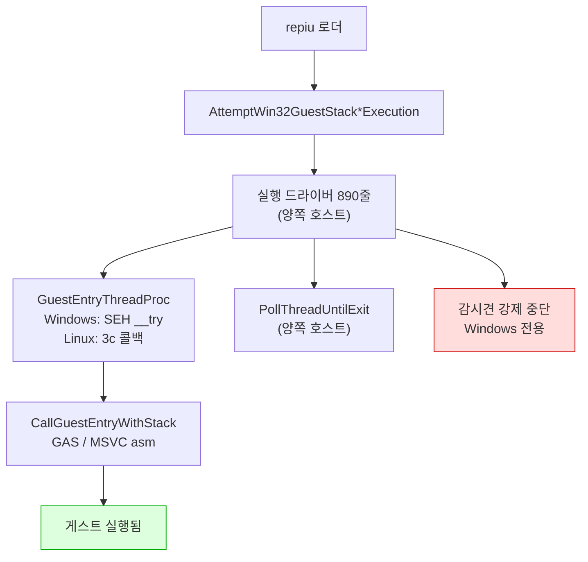
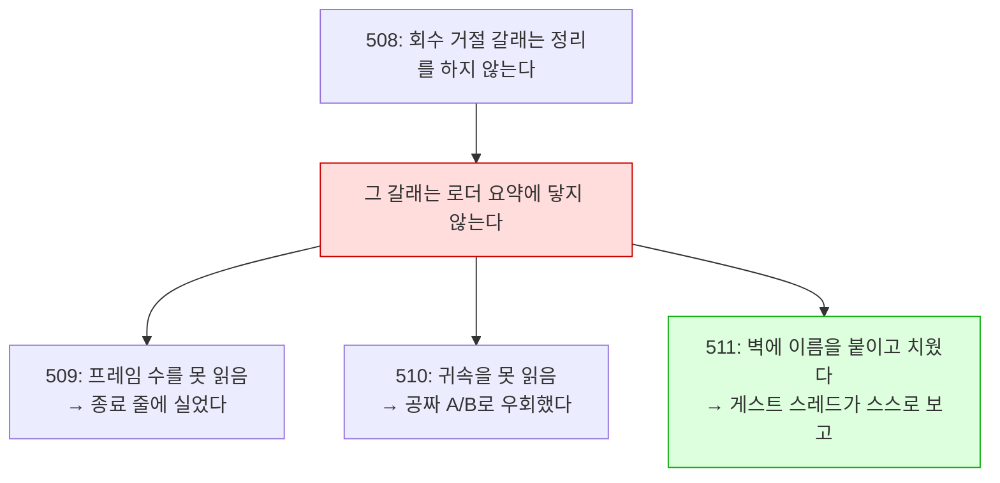
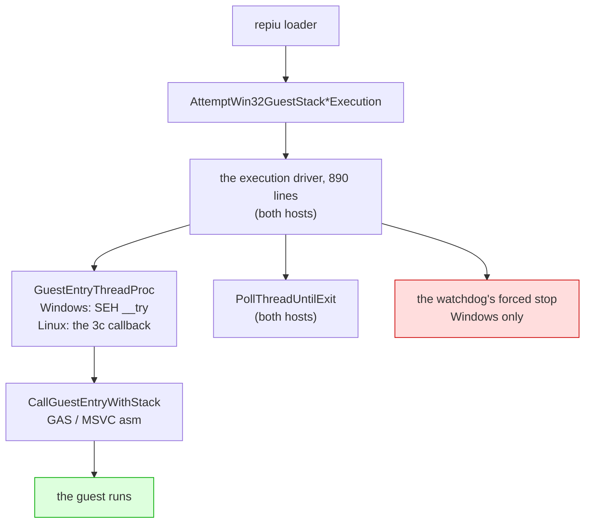

# Linux 이식 frontier / Linux port frontier

설계: [20260822-503](../design/20260822-503-linux-execution-engine.md) ·
작업 지시: [20260822-503](../work-orders/20260822-503-linux-execution-engine.md) ·
작업 로그: [20260822-503](../work-logs/20260822-503-linux-execution-engine.md) ·
측정 절차: [linux-engine-port-measurement](../guides/linux-engine-port-measurement.md)

이 문서는 **Linux 이식이 지금 어디까지 왔는지와 다음에 무엇이 필요한지**만 유지합니다.
단계별 증거는 작업 로그에 있습니다. 표기는 이 디렉터리의 규칙을 따릅니다 — **확인됨**,
**추정**, **미확정**.

## 1. 한 줄 요약

**게스트 코드와 기본 `dynamic` AOT backend가 Linux에서 실행됩니다.** DOS/4GW 샘플은
`legacy`와 `dynamic` 모두 같은 종료 코드 2·초점 오프셋 0x10·opcode 0x80에서 멈춥니다.

**화면도 열렸습니다(Task 506).** WSLg `pumpit1`은 약 45.1초에 첫 버퍼 스왑, 약 51.7초에
69,263/307,200 non-black 픽셀을 기록했고 이후 스왑이 계속되었습니다. 오디오 장치도 열립니다.

**종료도 스스로 됩니다(Task 507).** 예산 만료·SIGTERM 여덟 번 모두 프로세스가 스스로
끝났습니다 — 이전에는 TERM을 받고도 영원히 기다렸습니다.

**그리고 코어 덤프 없이 끝납니다(Task 508).** 507 뒤에 남아 있던 것은 회수를 거절당한 실행이
SIGTRAP으로 끝나는 경우였습니다. 60초 예산 6회에서 거절 6회 중 2회가 그렇게 끝났고, 수정 후
같은 6회에서 거절은 그대로 6회·SIGTRAP은 0회입니다. **이제 Linux에서 `exit=133`을 보면 그것은
회귀입니다.**

**그리고 왜 느린지도 이제 압니다(Task 511).** 프레임당 격차 126M cycle 중 **68%가 폴트
핸들러**이고, Linux에서 그것은 시그널 전달입니다. 아래 4절에 분해가 있습니다.

**화면이 나오는 것을 사람이 확인했습니다(2026-08-28, 사용자 관측).** 같은 관측이 남긴 다음
과제가 **속도**였고, Task 509가 쟀습니다 — **Linux는 Windows의 3.7%, 약 26.8배 느립니다**
(Release, vsync OFF, `pumpit1`, 호스트당 3회, 범위 무중첩). 남은 것은 **어디가 느린가**이고,
4절에 순서를 적었습니다.

## 2. 확인됨 — 지금 서 있는 것

> **범위 (2026-08-29, [3.8](#38-2026-08-29-실제-ubuntu--wslg는-대표-환경이-아니었습니다)).**
> 이 절과 Tasks 505~519의 측정은 **WSLg에서** 이루어졌습니다. 실제 ext4 데스크톱은 다르게
> 동작할 수 있고, 실제로 달랐습니다 — 그 환경에서는 게임이 시작조차 못 하고 있었습니다.
> 아래를 인용할 때 환경을 함께 적으십시오.

| 항목 | 상태 | 근거 |
|---|---|---|
| `src/platform/win32` 81개 소스 Linux 컴파일 | **81 / 81** | 3d-16, 3d-17 측정 |
| `repiu` 로더 Linux 링크 | ELF 32-bit `EXEC`, 텍스트 0x40000000, 쓰기 불가 | 3d-17 |
| 엔진 수준 미정의 심볼 | **0** (라이브러리 배선 9개뿐이었고 해결됨) | 3d-17 측정 |
| `repiu_core_probe` | 양쪽 호스트 **15 / 15** | 3d-18 |
| 게스트 스택 전환·폴트 복구 | 양쪽에서 같은 probe 통과 | 3d-16 |
| 스레드 생성·조회·대기·해제 | 양쪽에서 같은 probe 통과 | 3d-18 |
| **게스트 실행** | **샘플 실행, Windows와 같은 명령에서 정지** | **3d-19** |
| 폴트 18건·종료 코드·blocker | 두 호스트 일치 | 3d-19 |
| **Linux dynamic AOT** | 캐시 배치·인라인 패치·pumpit1 스왑/non-black 픽셀 | **Task 506** |
| **Linux 종료 경로** | 예산 만료·SIGTERM 모두 프로세스가 스스로 종료 | **Task 507** |
| **Linux 종료 경로 — 코어 덤프 없음** | 회수 거절 6/6에서 SIGTRAP **0회** (수정 전 2회) | **Task 508** |
| **Linux i386 Release 빌드** | 성공(프로젝트 최초), 샘플이 3d-19 기준선 통과 | **Task 509** |
| **Linux 프레임률** | 27.21 fps 대 Windows 730.05 fps — 약 **26.8배** | **Task 509** |
| **격차의 축** | 폴트 핸들러가 프레임당 격차의 **68.3%** (42.6배), 3회 재현 | **Task 511** |
| **그 42.6배의 분해** | 프레임당 경계 **13.6배** × 핸들러 본문 **3.3배**. 커널 전달은 Linux가 **0.44배**로 더 쌈 | **Task 512** |

계층으로 내려간 것들입니다.

| 계층 | 헤더 | 단계 |
|---|---|---|
| 게스트 레지스터 컨텍스트 | `platform/guest_cpu_context.h` | 3a |
| 가상 메모리 | `platform/virtual_memory.h` | 3b |
| 폴트 전달 | `platform/fault_handler.h` | 3c |
| 워커 신호 | `platform/worker_signal.h` | 3d-6 |
| 안전한 메모리 복사 | `platform/safe_memory_copy.h` | 3d-7 |
| 시간·사이클 카운터 | `platform/host_time.h` | 3d-8 |
| 환경 변수 읽기·열거·쓰기 | `platform/host_environment.h` | 3d-9, 3d-16, 3d-17 |
| 진단 출력 | `platform/host_error_stream.h` | 3d-14 |
| 스레드 번호·생성·조회·대기 | `platform/host_thread.h` | 3d-15, 3d-18 |
| 게스트 스택 전환 오프셋과 전역 | `platform/guest_stack_switch.h` | 3d-16 |
| 자식 프로세스 재실행 | `platform/host_process.h` | 3d-17 |
| 양보·짧은 대기 | `platform/host_time.h` | 3d-19 |

어셈블리는 GAS로 옮겨졌습니다 — 다섯 디스패치 thunk(`stack_bridge.inc.S` 매크로 하나,
3d-12)와 트램폴린의 세 진입점(`guest_stack_switch.S`, 3d-16).

## 3. 벽은 열렸습니다 (3d-19)



`IsGuestStackSwitchSupported()`와 `IsDirectX86ExecutionSupported()`는 이제 컴파일러가 아니라
**아키텍처**를 묻습니다 — 3d-16이 스택 전환을 GAS로 쓴 뒤로 컴파일러에 달려 있지 않습니다.

## 3.5 2026-08-27 main 병합 인계

이 날 main에 들어간 것은 다섯입니다. 종합 설계는 없고, 각 작업의 설계·지시서·로그가 정본입니다.

| 커밋 | 무엇 |
|---|---|
| `6f9ac34` | 503d-22 마감 — 포기한 인터럽트가 다시 오지 못함을 probe로 고정, 그 과정에서 드러난 교차 스레드 구멍을 닫음 |
| `9acbabe` | `SA_NODEFER`를 **후보에서 제외** — 증상을 원인으로 읽고 있었음. 같은 플래그를 두고 자기모순이던 주석도 정정 |
| `bd6e736` | 503d-23 — **9초 정지 해결.** `native_fast_path`가 복귀 브레이크포인트를 무장하면서 트랩 플래그를 해제하는데 Linux에서 무장만 버려짐 |
| `db234db` | Task 505 — **Glide 창이 Linux에서 열림.** 이식이 아니라 울타리 57개 해제 |
| `486fe09` | `0x010EE1xx`를 "대기 루프"라 한 것 정정 — Task 219가 이미 확정한 비트스트림 디코더 |

### 이 날 반복해서 걸린 것

**성공 신호 하나로 성공을 판정한 것**이 세 번입니다.

| 무엇을 봤나 | 무엇으로 읽었나 | 실제 |
|---|---|---|
| `exit 0` | 정상 완주 | 창을 못 열어 게임이 포기 |
| `opened=1` | 창이 열림 | 더미 폴백도 같은 값을 반환 |
| `dispatch_entry` 폭증 | 전진 중 | 일하는 중이지 나아가는 중이 아님 |

그리고 **관측 창보다 긴 주기는 보이지 않는다**에 두 번 걸렸습니다 — 30초는 "느리다",
240초는 "갇혔다", 1,200초에서야 실상.

세 경우 모두 **한 걸음 더 갔으면** 잡혔습니다. 종료 코드 대신 로그를, 반환값 대신 메시지를,
카운터 대신 EIP 궤적과 코드를 봤어야 했습니다. `0x010EE1xx`는 특히 그렇습니다 — 답이
저장소 안에 두 달 전부터 있었습니다.

### 다음

**감시견과 종료 경로의 강제 중단을 안전한 Linux 복구 경로로 바꾸는 작업**입니다. Task 506
검증에서도 측정을 마치고 종료를 요청했을 때 TERM에 응답하지 않아 측정 프로세스를 PID 확인 후
강제 종료했습니다.

> 이 항목은 Task 507·508로 끝났습니다. **현재의 다음 항목은 아래 4절**에 있습니다. 이 절은
> 2026-08-27 시점의 기록으로 남깁니다.

## 3.6 2026-08-28 main 병합 인계

이 날 main에 들어간 것은 넷입니다. 화면이 열린 다음 **왜 느린지까지** 갔습니다.

| 커밋 | 무엇 |
|---|---|
| `f2694dc` | Tasks 506·507·508 — **화면이 나오고, 종료가 되고, 코어를 덤프하지 않습니다** |
| `1f914db` | Task 509 — 실행이 자기 프레임률을 보고합니다. **Linux는 Windows의 3.7%** |
| `9d5a12b` | Task 510 — Glide 게이트를 축에서 **배제**. 코드 변경 0 |
| `2cd1e13` | Task 511 — 실행 중 귀속 보고. **격차의 68%가 폴트 핸들러** |
| `bd0ebaa` | Task 512 — 그 68%를 **횟수 13.6배 × 단가 3.3배**로 분해. 시그널 전달 자체는 **무죄** |

### 하나의 사슬로 읽으십시오

세 작업이 같은 벽에 세 번 부딪혔고, 세 번째에야 이름을 붙였습니다.



**교훈**: Linux에서 계측이 아무것도 내지 않으면, 계측을 의심하기 전에 **그것이 `attempt`를
거쳐 `main.cpp`로 나가는지** 먼저 보십시오. 그렇다면 렌더까지 간 Linux 실행에서는 나오지
않습니다.

### 이 날 걸린 것

**하나. 배율이 크면 백분율이 거짓말을 합니다.** `SETTER_ELIDE=0`이 Linux에서 −1.0%라 "호스트
왕복은 공짜"로 읽힐 뻔했습니다. 같은 노브가 Windows에서 27.1%를 깎는데, **절대 비용은 양쪽이
같습니다**(+0.51 대 +0.38 ms). 안 보인 이유는 싸서가 아니라 프레임이 36.75 ms이기
때문입니다. → **항상 프레임당 ms 또는 cycle로 비교하십시오.**

**둘. 널 결과는 그 자체로 읽을 수 없습니다.** "축이 아니다"와 "노브가 이 장면에서 아무 일도
안 했다"가 같은 모양입니다. → **대조군을 돌리십시오.** 510이 그렇게 살아났습니다.

**셋. Debug 수치를 성질로 읽었습니다.** Task 506의 "약 45.1초에 첫 스왑"은 Debug였고,
Release에서는 약 2초입니다. "자산 디코드가 오래 걸린다"는 엔진의 성질이 아니었습니다.

**넷. 누적 평균은 변화를 지웁니다.** Linux 프레임당 비용이 실행 중 83M → 272M cycle로 세 배가
됩니다. 시간별 보고가 없었으면 "일정하게 26.8배"로 적었을 것입니다.

### 다음 — 시그널 전달의 횟수인가 단가인가

**축은 확정되고 분해까지 끝났습니다.** `veh`(폴트 핸들러)가 격차의 68.3%이고, 그 42.6배는
**프레임당 경계 13.6배 × 핸들러 본문 3.3배**입니다. **시그널 전달 자체는 무죄입니다** —
커널 왕복이 Linux에서 0.44배로 더 쌉니다(512).

**다음 질문 하나: 왜 경계를 13.6배 더 밟는가.**

초과분은 **single-step이 아닙니다**(Linux 배달의 3.6%, Windows 24.4%). breakpoint이거나
access violation입니다.

**유력 후보는 아래 6절에 이미 적혀 있습니다** — Linux 사용자 공간이 하드웨어 디버그
레지스터를 못 써서 `native_fast_path`·`native_region`·`native_linear_span` **셋이 모두
차단**돼 있습니다. **그 셋은 정확히 트랩을 피하려고 있는 경로**이고, 꺼진 대가는 측정된 적이
없습니다.

먼저 할 일은 **초과 배달의 종류를 세는 것**입니다. `veh_gap_counts`가 이미 single-step /
breakpoint / other 세 칸으로 나뉘어 있으므로, 511의 보고 줄에 나머지 두 칸을 더하면 종류별
분포가 바로 나옵니다 — 512와 같은 모양의, 새로 세지 않는 변경입니다.

남은 둘: **핸들러 본문 3.3배**(하위 버킷 `kVehPrologue`·`kAotReentry` 등이 가릅니다), 그리고
`dos`의 **433.9배**(격차 기여는 1.9%로 작지만 배율은 표에서 가장 큽니다 — 작다고 넘기지 말 것).

### 재현에 필요한 것

```bash
./scripts/build_linux_i386.sh --config Release
bash scripts/task509_frame_rate_measure.sh 3 90000 <label>     # 프레임률
bash scripts/task508_refused_recovery_repro.sh 3 60000 <label> # 종료 갈래
```

귀속은 `REPIU_EXECUTION_TIME_PROFILE=1 REPIU_LIVE_PROFILE_INTERVAL_MS=10000`입니다. 조건과
함정은 [실행 프레임률 측정 절차](../guides/execution-frame-rate-measurement.md)에 있습니다.

**Linux 빌드 트리는 지금 Release입니다.** 단일 구성 생성기라 Debug를 대체했고, 정확성 작업으로
돌아가려면 `--config Debug` 재구성이 필요합니다(SDL 재빌드 포함).

## 3.7 2026-08-29 main 병합 인계

이 날 main에 들어간 것은 Linux 성능 축의 다섯입니다(Tasks 515~519). **한 줄로: 26.8배의
정체를 "재진입마다 트랩 하나"까지 좁혔고, 그 다음 한 걸음에서 네 번 틀렸습니다.**

| 커밋 | 무엇 |
|---|---|
| `15cae5e` | 515 — 초과 경계는 **breakpoint**(69%). 후보 둘을 대조군으로 지움 |
| `b357ec1` | 516 — 축은 boundary가 아니라 **재진입**. Linux는 재진입당 트랩 1.010, Windows 0.0432 |
| `6d3b59b` | 517 — Linux에서 direct dispatch는 **돈다**(87%). 그런데 성공해도 트랩이 붙음 |
| `08f1074` | 518 — 디스패치마다 relink 6.1회 (**결론은 519가 철회**) |
| `d3870cb` | 519 — relink는 지속성과 무관한 수였음. `content=0` |

### 지금 쓸 수 있는 계측

실행 중에 네 줄이 나옵니다. `REPIU_EXECUTION_TIME_PROFILE=1`과
`REPIU_LIVE_PROFILE_INTERVAL_MS=10000`으로 켭니다.

| 줄 | 무엇 |
|---|---|
| `[repiu-live-profile]` | guest-run 대비 veh/glide/port-io/dos/unaccounted 몫, 창 값 포함 |
| `[repiu-live-veh]` | 배달 수·배달당 cycle·커널 gap, 그리고 클래스 셋(ss/bp/other) |
| `[repiu-live-aot]` | 캐시 entry/boundary/재진입, 경계 사유 다섯, `sum_ok` |
| `[repiu-live-gdd]` | Glide direct dispatch: patched/verified/resolved/relinked(content·fixup)/entry/success |

**이 넷이 이 축에서 나온 실질 산출물입니다.** Linux는 로더 요약에 닿지 못하므로 이 줄들이
아니면 아무것도 읽을 수 없습니다.

### 다음 한 걸음

**Windows에서 그 INT3은 왜 다시 밟히지 않는가.** 활성화는 `Eip`만 돌리고 INT3을 지우지
않는데, Windows에서는 재진입의 95%가 트랩 없이 처리되고 Linux에서는 100%가 트랩을 냅니다.

**시작하기 전에 위 8절의 표를 읽으십시오** — 같은 실수를 네 번 했습니다.

### 남은 다른 축

* `other`(접근 위반) 프레임당 **10.7배** — 페이지 보호·포트 I/O·write watch.
* 핸들러 본문 **3.3배** — 하위 버킷(`kVehPrologue`·`kAotReentry` 등)이 가릅니다.
* `dos` 프레임당 **433.9배** — 격차 기여는 1.9%로 작지만 배율은 가장 큽니다.


## 3.8 2026-08-29 실제 Ubuntu — WSLg는 대표 환경이 아니었습니다

Tasks 522~523. **한 줄로: 505~519의 "확인됨"은 전부 WSLg 한정이었고, 실제 ext4 데스크톱에서는
게임이 시작조차 하지 못했습니다.**

VMware Ubuntu(커널 7.0.0-30-generic)에서 창이 열리지 않았습니다. 단일 스텝 인구 조사가 한
주소 `0x010F3438`에 **814,138 / 814,683 샘플(99.93%)**을 보여 주었습니다 — 초당 3만 4천 번,
25초 내내. 진행이 아니라 정지입니다.

### 사슬 — 원인과 증상 사이 여덟 단계

```
Glide2x.ovl 대소문자 불일치 (ext4)
  → glide_exports 0개        → 게이트 계획 무효
  → 이미지 쓰기 3/5 실패      → 디스크립터 등록 실패
  → linexe_environment_active = false
  → INT 21h AX=FF00h 폴백(AL=0) → DOS/4G DLL 로더 초기화 실패
  → 게스트 fatal 경로 → 자기 0xCC에서 영원히 회전
```

**여덟 단계 중 어디에서도 오류가 보고되지 않았습니다.** `exists()`가 거짓이면 `if` 하나가
조용히 건너뛰어지고 실행이 계속되기 때문입니다.

| 호스트 | 파일시스템 | `"Glide2x.ovl"` |
|---|---|---|
| Windows | NTFS | 대소문자 무시 → 찾음 |
| WSLg | DrvFs (`/mnt/e/...`) | 대소문자 무시 → 찾음 |
| **실제 Ubuntu** | **ext4** | **구분 → 못 찾음** |

### 결정적 관측 기법

**두 호스트의 DOS/DPMI 호출 순서를 나란히 놓는 것**이었습니다. `REPIU_DOS_INT_TRACE=1`.

| # | WSLg | VMware (전) | VMware (후) |
|---|---|---|---|
| 2 | `21 FF00` | `21 FF00` | `21 FF00` |
| **3** | `31 0006` | **`21 ED2B`** | **`31 0006`** |

세 번째 호출이 갈리는 지점이고, 그것이 일치로 돌아오는 것이 수정의 서명입니다.

### 얻은 것

| | 전 | 후 |
|---|---:|---:|
| Glide exports | 0 | **173** |
| `linexe_environment_active` | false | **true** |
| 게스트 INT3 트랩 | 814,138 | **0** |
| Glide 게이트 진입 | 0 | **96** |
| 종료 | segfault (139) | 타임아웃 (3) |

### 이 절이 바꾸는 것

* **"확인됨"에 환경을 적으십시오.** 이 문서의 505~519 주장은 WSLg에서 측정된 것입니다.
  실제 데스크톱에서 다시 재지 않았습니다.
* **크래시 없음 ≠ 정상 동작**을 또 만났습니다 — 이번에는 "로그 없음 ≠ 문제 없음"의 형태로.
* `docs/analysis/dll-loader-int21-ff00.md`의 원인 서술이 낡아 있었습니다. **문서를 먼저 읽되,
  코드로 확인해야 합니다.**

### 남은 것

* **창 확인은 VM 데스크톱에서.** SSH 세션에는 `DISPLAY`가 없어 SDL이 더미 폴백을 타고
  `frames=0`입니다.
* VM teardown의 segfault는 `step=thread-release` 이후 `step=done` 전에서 여전히 발생합니다.
* 실제 데스크톱에서의 성능 수치는 아직 없습니다.


### 데스크톱 패키지 — 같은 조용한 실패가 한 겹 더 있었습니다

창이 열린 뒤 **제목줄이 없었습니다.** Wayland에는 서버 측 장식이 없어 클라이언트가 직접
그려야 하고, SDL3는 그것을 `libdecor`에 맡깁니다. 그런데 SDL 구성이 이랬습니다.

```
/* #undef HAVE_LIBDECOR_H */    ← 지원이 통째로 컴파일에서 빠짐
#define SDL_VIDEO_DRIVER_WAYLAND 1
```

`libdecor-0-dev:i386`이 없어 SDL이 지원을 빼고 빌드했고, **아무것도 그 사실을 보고하지
않았습니다.** 창이 그냥 맨몸으로 열릴 뿐입니다. 런타임에도 `libdecor-0-0`은 `:amd64`만 깔려
있었는데 `repiu`는 32비트입니다 — 빌드를 고쳤어도 거기서 또 막혔을 상황이었습니다.

| | 조치 |
|---|---|
| 재빌드 없는 우회 | `SDL_VIDEODRIVER=x11` (XWayland는 서버가 장식을 그림) |
| 정식 | `libdecor-0-dev:i386 libdecor-0-0:i386 libdecor-0-plugin-1-gtk:i386` |

**패키지 설치만으로는 안 됩니다.** CMake가 패키지 없던 시절의 실패를 캐시에 담고 있습니다
(`SDL_WAYLAND_LIBDECOR=ON`인데 `PC_LIBDECOR_FOUND=`가 빈 값). 빌드 디렉터리를 통째로 버리는
것보다 캐시 항목만 비우는 편이 쌉니다.

```
cmake -U "PC_LIBDECOR*" -U HAVE_LIBDECOR_H -S . -B build/linux_i386
```

`scripts/build_linux_i386.sh`가 이제 이것을 점검하고 경고합니다 — libpulse와 같은 방식이고,
같은 이유입니다. **빌드는 성공하고 게임도 도는데 조용히 반쪽만 동작하는** 부류입니다.

## 4. 다음에 필요한 것

> 이 절은 3d-20을 가리키고 있었습니다. 3d-20(다른 스레드의 레지스터)·3d-21(표본기)·
> 3d-22(시한이 지난 인터럽트)는 끝났고, 목록에서 **빠지지 않은 둘**이 아래에 그대로
> 남습니다. 인터럽트 계층 자체는 양쪽 호스트에서 probe를 통과합니다.

1. ~~**AOT 코드 캐시**~~ — **해결 (Task 506).** Win32 메모리 호출 62곳을 3b 계층으로 옮겼고,
   Linux `dynamic`에서 배치·동적 실행·인라인 패치·페이지 retirement가 동작합니다. `pumpit1`은
   45.1초에 첫 스왑, 51.7초에 첫 non-black 스왑을 기록했습니다.
2. ~~**감시견의 강제 중단.**~~ — **해결 (Task 507).** 종료 블록을 `InterruptHostThread`로
   옮겼습니다. 회수에 성공하면 정상 종료하고, 회수가 거절되면 `DetachHostThread`로 기다리지
   않고 내려가며 AOT 캐시 해제를 건너뛰고 `_Exit`로 프로세스를 즉시 끝냅니다. `pumpit1`에서
   예산 만료·SIGTERM 여덟 번 모두 스스로 종료했습니다(더 이상 매달리지 않음). 회수가 거절된
   경로에서 SIGTRAP으로 끝나는 경우가 남아 있고, 그 원인은 위 6절에 적었습니다 — 프로세스가
   끝나는 것 자체는 507의 조건을 만족합니다.
3. ~~**회수를 거절당한 종료의 코어 덤프.**~~ — **해결 (Task 508).** 근인은 트랩이 아니라
   **순서**였습니다. 종료 블록이 회수 성공 여부와 무관하게 `RemoveFaultHandler()`를 부르는데,
   거절당한 실행에서는 그 뒤로도 게스트 스레드가 돌면서 AOT 엔진이 평소처럼 심는 INT3을
   밟습니다. 508은 거절된 갈래에서 정리를 통째로 건너뛰고(핸들러도 떼지 않고) 파일로 나가는
   두 진단과 detach만 남긴 뒤 `_Exit` 합니다. 60초 예산 6회에서 거절 6/6·SIGTRAP 0회.

### 측정됨 (Task 509) — Linux는 Windows의 3.7%입니다


> **2026-08-29 재측정 ([Task 524](../work-logs/20260829-524-wslg-baseline-remeasure.md)).**
> 같은 조건으로 v0.0.172에서 다시 재니 WSLg가 **34.11 · 35.22 · 36.96, 평균 35.43 fps
> (프레임당 28.2 ms)**였습니다. 아래 표의 27.21보다 **1.30배 빠르고 두 집단의 범위가 겹치지
> 않습니다**(최저 34.11 > 최고 27.76).
>
> **왜 빨라졌는지는 모릅니다.** 그 사이 머지에 성능을 노린 변경은 없었습니다. 측정 시점의
> 호스트 상태 차이일 수도 있고 아래 값이 이미 낡았을 수도 있습니다. 원인을 확인하지 않았으므로
> 추정하지 않습니다.
>
> **Windows 쪽은 다시 재지 않았습니다.** 730.05와 비교하면 격차는 26.8배에서 **약 20.6배**로
> 줄지만, 한쪽만 새로 잰 비교이므로 그 배수는 아래 표만큼 단단하지 않습니다.

| 호스트 | fps (Release, vsync OFF, `pumpit1` 90초, 3회) | 평균 | 프레임당 |
|---|---|---:|---:|
| Windows | 743.91 · 737.46 · 708.79 | **730.05** | 1.37 ms |
| Linux (WSLg) | 26.22 · 27.76 · 27.65 | **27.21** | 36.75 ms |

**약 26.8배이고 두 집단의 범위가 겹치지 않습니다.** 가장 보수적으로 잡아도 25.5배입니다.
프레임당 Linux가 **35.4 ms를 더 씁니다.**

**기동은 원인이 아닙니다** — 양쪽 모두 `span_ms` 88초로 첫 프레임까지 2초 남짓입니다. 차이는
전부 렌더 루프 안입니다. 여기서 Task 506의 "약 45.1초에 첫 스왑"이 **Debug 수치**였음이
드러납니다. Release에서는 약 2초입니다.

**배율이 아직 분해되지 않았습니다.** 컴파일러 차이(MSVC 대 GCC)와 WSLg의 X11 한 겹이 26.8배
안에 함께 들어 있습니다.

### 귀속 1차 (Task 510) — Glide 게이트는 축이 아닙니다

이미 있는 노브 다섯 변인을 A/B 했습니다(코드 변경 0). **프레임당 ms로 비교해야 합니다** —
배율이 26.8배인 곳에서 백분율은 같은 비용을 한쪽 37%, 다른 쪽 1%로 보이게 합니다.

| 변인 | 평균 fps | 프레임당 | 기준선 대비 |
|---|---:|---:|---:|
| Linux 기준선 | 27.21 | 36.75 ms | — |
| `RENDEZVOUS_SPIN_US=2000` | 30.50 | 32.78 ms | −3.97 ms |
| `ASYNC_PRESENT=1` | 32.83 | 30.46 ms | −6.29 ms |
| 위 둘 동시 | 33.12 | 30.19 ms | −6.56 ms (가산 아님) |
| `SETTER_ELIDE=0` | 26.93 | 37.13 ms | +0.38 ms |
| `DRAW_BATCH=0` | 28.14 | 35.54 ms | −1.21 ms |
| **Windows `SETTER_ELIDE=0`** | 532.29 | 1.88 ms | **+0.51 ms** |

마지막 줄이 대조군입니다. **같은 노브가 Windows에서 27.1% 떨어집니다** — 노브는 이 장면에서
살아 있습니다. 그런데 **절대 비용은 양쪽이 같습니다**(+0.51 대 +0.38 ms). Linux에서 안 보인
이유는 그 일이 싸서가 아니라 프레임이 36.75 ms이기 때문입니다.

**배제됨**: rendezvous 깨우기 지연(한 몫이나 지배항 아님), present 임계 경로(같음), 호스트
왕복 **횟수**, 게이트 **크로싱 횟수**.

**남은 것: 프레임당 약 30 ms.** 어떤 Glide 노브도 닿지 못했고, 최선의 조합으로도 Windows의
22.0배입니다.

**보조 정황(추정)**: 기동 구간(스왑 0회, 게스트 코드가 자산 디코드)은 첫 프레임까지 300 ms
안쪽 차이 — 약 10~15%입니다. 게스트 코드 실행 자체가 20배 느린 것은 아니라는 방향입니다.

### 귀속 2차 (Task 511) — 축은 폴트 전달입니다

벽을 치웠습니다(실행 중 보고, 게스트 스레드 위). 같은 기계이므로 TSC cycle이 직접 비교됩니다 —
프레임당, 100만 cycle 단위입니다.

| 버킷 | Windows | Linux | 배율 | **격차 기여** |
|---|---:|---:|---:|---:|
| **veh (폴트 핸들러)** | 2.065 | 88.072 | **42.6x** | **68.3%** |
| glide | 1.618 | 26.480 | 16.4x | 19.7% |
| unaccounted | 2.159 | 17.214 | 8.0x | 12.0% |
| dos | 0.006 | 2.438 | **433.9x** | 1.9% |
| port-io | 0.006 | 0.105 | 18.6x | 0.1% |
| 합계 | 5.843 | 131.805 | 22.6x | 126.0M |

**Linux 격차의 68%가 폴트 핸들러입니다.** (511은 이것을 "시그널 전달"이라 불렀는데 **Task 512가
정정했습니다** — 전달 경로 자체는 Linux가 더 쌉니다. 아래 512 절을 볼 것.) `veh` 몫은 3회에서
66.82% · 66.71% · 64.55%로 재현되고, Windows 대조군은 35.35%입니다.

**510과 어긋나지 않습니다.** 510이 시험한 것은 호스트 왕복 **횟수**와 크로싱 **횟수**였고,
여기 glide 26.5M cycle의 대부분은 횟수가 아니라 회당 비용과 대기입니다.

**그리고 프레임당 비용이 실행 중에 세 배가 됩니다**(83M → 272M). "일정하게 26.8배"가 아니라
장면이 진행될수록 나빠집니다 — 누적 평균만 냈으면 보이지 않았을 것입니다.

### 귀속 3차 (Task 512) — 전달은 범인이 아닙니다. 횟수입니다

511이 축을 "시그널 전달"이라 불렀는데 **정정합니다.** 42.6배를 두 인자로 갈랐습니다.

| | Windows | Linux | 배율 |
|---|---:|---:|---:|
| 프레임당 배달 | 18.8 | 256.3 | **13.6x** |
| 배달당 cycle (핸들러 본문) | 104,002 | 341,557 | **3.3x** |
| 곱 | | | 44.8x ≈ 511의 42.6x |
| **커널 왕복 바닥 (`gap min`)** | 21,756 | **9,632** | **0.44x** |
| **커널 왕복 single-step 평균** | 28,185 | **16,466** | **0.58x** |

**`gap`은 핸들러가 나간 뒤 다음 진입까지, 곧 커널의 전달 경로만 봅니다**(Task 372). 그 값이
Linux에서 더 작습니다 — **시그널 전달은 Windows의 예외 디스패치보다 두 배 이상 쌉니다.**
비싼 것은 전달이 아니라 그 주위입니다.

**정규화 주의.** 초당으로 보면 Linux가 폴트를 **40% 적게** 냅니다(7,732 대 12,951). 프레임당이
큰 것은 프레임이 24배 드물기 때문입니다. 프레임당이 하중을 지는 정규화이지만(한 프레임 =
`grBufferSwap` 한 번 = 같은 게스트 경로), **게임 로직이 저프레임률에서 일을 줄이는 구조라면
그 전제가 깨집니다 — 확인되지 않았습니다.**

### 귀속 4차 (Task 515) — 초과분은 breakpoint이고, 후보 둘은 반증됐습니다

**프레임당 배달 수**로 봅니다.

| 클래스 | Windows | Linux | 배율 | 초과분 기여 |
|---|---:|---:|---:|---:|
| single-step | 4.87 | 8.95 | 1.8x | 1.8% |
| **breakpoint** | 6.94 | **167.80** | **24.2x** | **69%** |
| other (접근 위반) | 6.92 | 74.29 | 10.7x | 29% |

성격 자체가 뒤집혀 있습니다 — Windows는 세 클래스가 고른데(24/39/37%), Linux는 **breakpoint
67.0%**에 몰려 있습니다.

**후보 둘을 Windows 대조군으로 반증했습니다.**

| Windows 대조군 | bp/frame | 기준선 대비 |
|---|---:|---:|
| 기준선 | 6.94 | — |
| `native_fast_path` 끔 | 6.67 | −3.9% |
| direct-return table 끔 | 6.73 | −2.9% |

**정제 하나**: `native_region`·`native_linear_span`은 Windows에서도 opt-in이라 기본 꺼짐입니다.
**기본값이 두 호스트에서 다른 것은 `native_fast_path` 하나뿐**입니다 — 그런데 그 카운터가
**기준선에서도 `0/0/0`**입니다. 이 장면에서는 Windows에서도 한 번도 작동하지 않으므로
**두 호스트의 차이가 될 수 없습니다.** (노브를 껐는데 안 변할 때 카운터를 보라는 510의 규칙이
여기서 약한 결론을 강한 결론으로 바꿨습니다.)

### 귀속 5~8차 (Tasks 516~519) — 재진입마다 트랩이 하나, 그리고 틀린 답 셋

**516: 축은 boundary가 아니라 재진입입니다.**

| | Windows | Linux | 배율 |
|---|---:|---:|---:|
| 프레임당 boundary | 6.69 | 13.78 | 2.1x |
| 프레임당 reentry | 160.63 | ~154 | **0.90x** |
| **reentry당 breakpoint** | **0.0432** | **1.010** | **23x** |

재진입 비율은 Linux가 오히려 10% 적습니다. 다른 것은 **나올 때마다 트랩을 내는가**이고, 이
23배가 515의 breakpoint 24.2배와 맞습니다. Windows가 트랩을 피하는 경로는 **Glide direct
dispatch**로, 재진입의 95.1%(8,719,788 / 9,171,551)를 처리합니다.

**517: 그 경로는 Linux에서도 돕니다.** `patched=172 verified=172 entry=338,929
success=338,928 miss=0`, 재진입의 87%. 그런데 산술이 강제합니다 — Linux의 비-gdd 재진입은
50,685뿐인데 트랩이 392,670으로 **7.7배 초과**합니다. **성공한 direct dispatch도 트랩을
냅니다.**

**518~519: relink 카운터는 이 질문에 답할 수 없는 수였습니다.** 518이 "디스패치마다 6.1회
relink → 패치가 안 붙는다"고 적었고, 519가 카운터를 갈라 **`content=0`, `fixup`이 전부**임을
보였습니다. `fixup` 쪽은 캐시를 읽지 않고 매번 다시 쓰므로 지속성과 무관합니다.
**518의 결론은 철회됐습니다.**

### 그다음 — Windows에서 그 INT3은 왜 다시 밟히지 않는가

`ActivateWin32GlideGateDirectTarget`은 breakpoint 폴트 핸들러 안에서 불리고, 성공하면 `Eip`를
게스트 게이트 주소로 돌리고 트랩 플래그를 끕니다. **INT3 자체는 지우지 않습니다.** 그런데
Windows에서는 같은 INT3이 사실상 다시 밟히지 않고, Linux에서는 매번 밟힙니다. **여기가 다음
자리입니다.**

**측정 다섯 번 동안 제 추정이 네 번 틀렸습니다.** 공통 원인이 하나이고, 다음 사람에게
그것이 이 절에서 가장 값나가는 내용입니다.

| # | 함의 | 실제 |
|---|---|---|
| 515 | 껐는데 안 변하니 원인이 아니다 | 애초에 한 번도 안 돌고 있었음 (`0/0/0`) |
| 516 | `residency_mean=0`이니 캐시가 안 돈다 | 표본 카운터가 이 경로에서 안 채워짐 |
| 517 | 트랩이 매 재진입에 있으니 direct dispatch가 안 돈다 | 87%가 그 경로로 감 |
| 519 | relink가 많으니 패치가 안 붙는다 | relink는 지속성과 무관한 수 |

**넷 다 카운터의 이름으로 뜻을 추정하고 증가 지점을 읽지 않은 것입니다.** 새 카운터를 읽기
전에 `fetch_add`가 어디에 있는지부터 보십시오.

다음 후보는 **AOT 코드 캐시가 Linux에서 경계를 얼마나 이어 붙이는가**입니다 — direct edge
연결과 인라인 패치의 **효과**. Task 506이 "동작한다"까지는 확인했지만 얼마나 효과적인지는
재지 않았습니다.

그 수치(patched/verified/resolved-target/fallback 계열)는 지금 `main.cpp` 요약으로만 나가
**Linux에서 읽을 수 없습니다.** 512·515와 같은 모양으로 live 줄에 실으면 됩니다.

`other`의 10.7배도 남습니다 — 페이지 보호·포트 I/O·write watch 쪽입니다.

**초과분은 single-step이 아닙니다.** `gap_ss_count`가 Linux 배달의 **3.6%**인데 Windows는
**24.4%**입니다. 초과분은 breakpoint이거나 access violation입니다.

**유력 후보가 이 문서 6절에 이미 있습니다** — 하드웨어 디버그 레지스터를 Linux 사용자 공간이
쓸 수 없어 `native_fast_path`·`native_region`·`native_linear_span` **셋이 모두 차단**되어
있습니다. 그 셋은 정확히 **트랩을 피하려고** 있는 경로이고, 그것들이 꺼진 대가는 **측정된 적이
없습니다.** 이것이 다음 단위입니다.

남은 둘: **핸들러 본문 3.3배**(하위 버킷 `kVehPrologue`·`kAotReentry` 등이 가릅니다),
그리고 `dos`의 **433.9배**.

`veh`가 축인 것은 확정입니다. 남은 질문은 **배달이 많은 것인가 회당 단가가 큰 것인가**이고,
`veh` 버킷의 `counts`가 그 답을 갖고 있습니다. 둘은 고칠 방법이 전혀 다릅니다 — 횟수면
경계를 줄이는 일이고, 단가면 전달 경로 자체의 문제입니다.

`dos`의 **433.9배**도 따로 봐야 합니다. 격차 기여는 1.9%로 작지만 배율은 이 표에서 가장
큽니다.

세 항목이 모두 닫히면서 **Linux에서 게스트가 돌고, 창이 열리고, 종료가 됩니다.**

**그리고 화면이 나오는 것을 사람이 확인했습니다 (2026-08-28, 사용자 관측).** 계측이 닿는
데까지는 non-black 픽셀 수였고, "실제로 게임 화면이 보이는가"는 사람이 봐야 하는
질문이었습니다 — 그 답이 예입니다. 같은 관측이 남긴 것은 **"속도가 아주 느리다"**였고,
Task 509가 그것을 숫자로 바꿨습니다(위 표).

이제 남은 것은 **어디에서 느린가**이고, Task 510이 Glide 축을 배제했습니다(위 표).
그런데 세밀한 귀속 계측은 **Linux에서 출력되지 않습니다** — `REPIU_GLIDE_ORDINAL_TIME_PROFILE`과
`REPIU_AOT_RETURN_STAGE_PROFILE`이 전부 `attempt`를 거쳐 `main.cpp`가 찍는데, `attempt`를 채우는
`CopyThreadObservationToAttempt`가 "게스트 스레드가 멈췄다"를 전제로 하고 Linux 렌더 실행은
`stopped=0`이라 거기 닿지 못합니다(Task 508). **509에서 프레임 수가 없던 것과 같은 벽입니다.**
다음 단위가 그 벽입니다.

그리고 **WSLg인지 실제 데스크톱인지**를 나누는 것이 배율 분해의 절반입니다. WSLg는 X11을
한 겹 더 지나므로 present 비용이 다를 수 있고, 26.8배 안에 그 몫이 얼마인지 모릅니다.

**무엇이 그려지는가**(Task 506이 "별도 검증"으로 남긴 것)는 사람이 화면을 본 것으로 절반이
닫혔고, Windows와 같은 장면인지 프레임 단위로 대조하는 것은 남아 있습니다.
`REPIU_GLIDE_FRAME_DUMP`가 두 호스트에 다 있으므로 대조 자체는 가능합니다.

6절의 나머지(핸들러 미반환, 자식 프로세스 재실행, CHD 마운트)는 게스트 구동을 막고 있지
않으므로 그 뒤입니다.

## 5. 실행 확인 방법 (3d-19에서 확립)

게임 자산 없이 "게스트가 도는가"를 확인하는 절차입니다. `build/openwatcom_samples/`의 DOS/4GW
샘플과 direct executable 경로를 씁니다.

```bash
cd build/linux_i386
REPIU_EXECUTION_BACKEND=legacy ./repiu     ../../build/openwatcom_samples/clibexam__bprintf_c/sample.exe
```

같은 샘플을 Windows에서 돌려 **대조하는 것이 요점**입니다. 3d-19 시점의 기준값:

| 항목 | 값 |
|---|---|
| 폴트 총계 | 18 (양쪽) |
| 스레드 종료 코드 | 2 (양쪽) |
| 정지 지점 | `… 8E C1 89 D6 42 [26] 80 3E 00 …`, focus offset 0x10, opcode 0x80 (양쪽) |
| 예외 코드 | Linux `0x0000000B` / Windows `0xC0000005` — 호스트 번호이고 기록용 |
| census 칸 | Linux 18/0 / Windows 17/1 — Windows에만 구분되는 코드가 있어서 |

주소는 재배치 이미지 베이스만큼 다릅니다(Linux 0x01000000, Windows 0x03000000). **오프셋으로
비교하십시오.**

## 6. 미확정 — 확인하지 않고 넘어온 것들

| 항목 | 상태 | 어디에 |
|---|---|---|
| 자식 프로세스 재실행이 Linux에도 필요한가 | **미측정** | Task 500의 근거(GPU 드라이버의 주소 공간 선점)가 Linux에도 해당하는지 확인한 적 없음. 되돌릴 자리는 `host_process.h` |
| 자산 경로와 CHD 마운트의 Linux 검증 | **범위 밖** | 설계의 "범위 밖" 절. 실행 시도 전에 다시 볼 것 |
| ~~렌더 백엔드 (창)~~ | **해결 (Task 505)** | 이식할 것이 없었습니다 — 두 파일 모두 이미 SDL3이고 진짜 Win32 API는 **0개**였습니다. 503d-10이 컴파일용으로 세운 울타리 57개(backend 44 + shader 13)가 전부였고, 실제 수정은 각 파일 한 줄(`SDL_FunctionPointer`)입니다. 이제 `opened=1`, 640x480 논리 창 2배(1280x960), 깊이 24비트 승인 |
| ~~첫 프레임에 도달하지 못함 (화면)~~ | **해결 (Task 506)** | `dynamic` AOT가 legacy의 명령 단위 단일 스텝 병목을 우회했습니다. `pumpit1`은 약 45.1초에 첫 스왑(검정), 약 51.7초에 69,263/307,200 non-black 픽셀, 이후 40회 이상의 연속 스왑을 기록했습니다. 무엇이 정확히 그려지는지는 별도 검증입니다. |
| 오디오 출력 셋 | **정정됨** | 아래 8절 |
| 하드웨어 디버그 레지스터 | **불가 — 이제 술어로 강제** | Linux 사용자 공간은 자기 스레드의 것을 쓸 수 없습니다. **`native_linear_span`만이 아니라** `native_fast_path`·`native_region`도 이 위에 서 있었고, 그 중 `native_fast_path`는 **기본 켜짐**이라 9초 정지를 냈습니다(3d-23). `HardwareDebugRegistersAvailable()`이 셋 모두를 env 설정보다 앞에서 막습니다 |
| **Release probe 실패** | **미해결 (Task 509에서 발견)** | probe 모음이 **Release에서 검증된 적이 없습니다.** Linux Release는 `dos_file_handle_cache` 뒤 `== pit_timer ==` 헤더 전에 **segfault(exit 139)**, Windows Release는 `fault_handler_data_faults`·`stack_bridge_contract` **2건 실패**. 양쪽 Debug는 15/15이고, 509의 변경을 넣은 Windows Debug도 15/15입니다 — 호스트가 아니라 **구성**이 가르는 문제입니다. **엔진은 Release에서 정상** — Linux Release `repiu`가 DOS/4GW 샘플에서 3d-19 기준선을 그대로 냅니다. 509의 변경(프레임 카운터·종료 줄)은 이 probe들의 경로를 지나지 않습니다 |
| 교차 프로세스 텔레메트리 | **울타리 안** | `live_telemetry_snapshot.cpp`의 공유 섹션·정지 스냅샷. 게스트 구동에 불필요 |
| `CaptureSuspendedThreadSnapshot` | **호출자 없음** | 정의만 있고 선언도 호출도 없음. 지우는 것은 의도 확인 후 |
| ~~종료 시 SIGTRAP~~ | **해결 (Task 508)** | 507이 재현했고 508이 근인을 확정했습니다 — **트랩이 아니라 순서**입니다. 종료 블록은 회수 성공 여부와 무관하게 같은 정리 순서를 밟고, 그 세 번째 단계가 `RemoveFaultHandler()`입니다. 회수를 거절당했다는 것은 게스트 스레드가 계속 돈다는 뜻이고, `dynamic` backend는 정상 동작으로 INT3과 트랩 플래그를 심으므로 핸들러가 사라진 뒤 그중 하나를 밟으면 커널 기본 처분(코어 덤프)이 실행됩니다. 507이 넣어 둔 단계 표시가 증거였습니다 — **두 번의 SIGTRAP 모두 마지막 줄이 `step=translation-worker`**, 곧 `step=fault-handler` 바로 다음이었습니다. 508은 거절된 갈래에서 정리를 하지 않습니다: `probe-dump` → `DetachHostThread` → `_Exit`. 60초 예산 6회에서 거절 6/6, SIGTRAP 0회 (수정 전 같은 조건 6회에서 2회). 507이 걱정한 "해제된 AOT 캐시를 가리키는 EIP"는 발생하지 않습니다 — **해제 자체를 하지 않기 때문**입니다. |
| ~~pumpit1의 9초 정지~~ | **해결 (3d-23)** | 근인은 `native_fast_path`가 복귀 브레이크포인트를 무장하면서 트랩 플래그를 해제하는데, Linux에서 무장만 버려진 것. 게스트가 되돌릴 것 없이 풀려났습니다. `fast=18/0/17`(복귀 0)이 카운터에 그대로 있었습니다. 디버그 레지스터가 없는 곳에서 세 경로를 차단해 수정 |
| 인터럽트 핸들러가 반환하지 않는 것 | **원인 미상** | 정지한 게스트에서 첫 배달이 핸들러로 들어간 뒤 반환하지 않았고, 그래서 이후 46건이 전부 보류·시한 초과가 됐습니다. **`SA_NODEFER`는 답이 아닙니다** — 아래를 볼 것 |
| ~~인터럽트 핸들러의 `SA_NODEFER`~~ | **후보에서 제외 (2026-08-27)** | 이것을 "고칠 거리"로 적어 둔 것이 오해였습니다. 이 플래그가 **없어서** 시그널 하나가 한 스레드에서 차단된 채 남고, 그것이 "핸들러가 반환하지 않았다"를 읽게 해 준 **진단 신호**입니다. 붙이면 멈춘 핸들러가 반환하게 되는 게 아니라 그 안으로 배달이 중첩되고, 이 스레드는 이미 3c의 대체 스택 위에 있어 그 스택이 조용히 넘칩니다. 근거는 `host_thread.cpp`의 `EnsureInterruptHandler` 주석에 있습니다 |

## 7. 정정 — 오디오 출력은 이미 이식되어 있었습니다

이 문서의 이전 판은 오디오 출력 셋을 "Linux 백엔드 없음, 무음"으로 적었습니다. **틀렸습니다.**
세 파일 모두 이미 SDL을 쓰고 있고 waveOut 호출이 하나도 없습니다.

| 파일 | `SDL_` 호출 | waveOut 호출 |
|---|---|---|
| `ymz280b_audio_out.cpp` | 16 | **0** |
| `piu10_mp3_audio_out.cpp` | 31 | **0** |
| `cd_audio_wave_out.cpp` | 24 | **0** |

`cd_audio_wave_out`은 **이름만** waveOut입니다. 설계의 "정정 1"이 `Win32AotPageWriteWatchSet`
이름을 보고 `GetWriteWatch`를 쓴다고 단정했다 틀린 것과 **같은 함정**이고, 그 교훈은 이미
설계에 적혀 있었습니다 — **이름이 아니라 구현을 봐야 합니다.**

소리가 나지 않은 진짜 이유는 SDL 쪽이었습니다. i386 빌드인데 `libpulse`의 32비트 판이 없어
SDL이 PulseAudio 백엔드를 빼고 ALSA만 컴파일했고, WSL에는 ALSA가 직접 열 장치가 없습니다.

```
#define SDL_AUDIO_DRIVER_ALSA 1     ← 이것만 있었음
#define SDL_AUDIO_DRIVER_DISK 1
#define SDL_AUDIO_DRIVER_DUMMY 1
```

`libpulse-dev:i386`을 넣고 트리를 **버리고 다시 구성**해야 합니다 — SDL의 드라이버 감지는
구성 시점에 캐시되므로, 남은 캐시가 "안 고쳐졌다"처럼 보이게 만듭니다.

### 7.1 그래서 갖춰야 하는 구성 (2026-08-26 확인)

위가 진단이고, 여기는 **실제로 세워 놓고 확인한 결과**입니다. 다음 세션이 데스크톱에서
돌려 보려면 이 절만 보면 됩니다.

패키지는 전부 `:i386`입니다. 32비트 프로세스가 링크하고 `dlopen` 하는 것들이라 amd64 판은
설치돼 있어도 쓰이지 않습니다.

```bash
sudo dpkg --add-architecture i386
sudo apt update && sudo apt install -y pkg-config \
    libpulse-dev:i386 libasound2-dev:i386 libgl-dev:i386 \
    libx11-dev:i386 libxext-dev:i386 libxrandr-dev:i386 libxi-dev:i386 \
    libxfixes-dev:i386 libxcursor-dev:i386 libxrender-dev:i386 \
    libxkbcommon-dev:i386
```

`libxss-dev`와 `libxtst-dev`는 **필요 없습니다.** 빌드 스크립트가 XSCRNSAVER와 XTEST를 끄고,
그 주석이 이유를 적어 두었습니다 — 켜 둔 확장 하나가 곧 찾아야 할 32비트 패키지 하나입니다.

`pkg-config`가 빠지기 쉽습니다. 없으면 SDL이 PulseAudio를 **조용히** 빼고, 있어도 i386 `.pc`가
`/usr/lib/i386-linux-gnu/pkgconfig`에 있어 기본 검색 경로에 안 잡힙니다. 그래서 패키지를 깔아도
"없다"는 답이 나옵니다. 빌드 스크립트가 `PKG_CONFIG_PATH`로 그 디렉터리를 앞에 붙입니다.

확인된 것:

| 항목 | 결과 |
|---|---|
| SDL 오디오 드라이버 | `PULSEAUDIO` + `ALSA` (이전엔 `DUMMY`뿐) |
| SDL 비디오 드라이버 | `X11` (+ XCURSOR·XFIXES·XINPUT2·XRANDR·XSHAPE·XSYNC·XDBE) |
| 런처 | WSLg에서 창 실행, 롬셋 22개 중 16개 인식 |
| **오디오 장치** | `[repiu-ymz] YMZ280B ready through SDL3 at 88200 Hz` |
| 게스트 실행 (pumpit1, legacy) | 8초 동안 dispatch 167,776회, EIP가 재배치 이미지 안에서 이동 |

소리가 실제로 **들리는지**는 사람이 들어야 합니다. 측정이 답할 수 있는 것은 장치가 열렸다는
데까지입니다.

두 가지가 이 확인을 반복할 때 걸립니다.

* **`--headless`로 구성된 트리는 창도 소리도 만들지 못합니다.** 그 옵션이 켜는
  `SDL_UNIX_CONSOLE_BUILD=ON`은 X11/Wayland 요구를 통째로 건너뜁니다. 데스크톱에서 쓰려면
  `--headless` 없이 구성하고, SDL이 감지 결과를 캐시하므로 **트리를 지우고** 다시 해야 합니다.
* **WSLg 자체가 없을 수 있습니다.** `/mnt/wslg`가 없거나 `DISPLAY`·`PULSE_SERVER`가 비어 있으면
  패키지가 아니라 WSL이 문제입니다. `wsl --update` 후 `wsl --shutdown`입니다. 오래된 커널
  (5.10 대)에는 WSLg가 아예 없습니다.

## 8. 반복해서 겪은 함정 — 그리고 컴파일로는 못 잡는 것

**막고 있는 것 하나가 그 뒤의 숫자를 전부 가립니다.** 네 번 겪었습니다.

| 단계 | 막고 있던 것 | 겉보기 | 실제 |
|---|---|---|---|
| 3d-15 | 2,000줄 `#if defined(_WIN32)` | 실패 84 | 97 (숨은 것은 13개뿐) |
| 3d-16 | `#include <psapi.h>` 한 줄 | fatal error 1 | 17개, 네 곳 |
| 3d-17 | 빠진 spdlog include 경로 | fatal error 1 | 19개, 두 곳 |
| 3d-19 | 함수 **반환 타입**의 `DWORD` | 오류 2 | 69개 (시그니처가 본문을 가림) |

**파일 크기도 오류 개수도 남은 작업량의 지표가 아닙니다.** 절차는
[측정 가이드](../guides/linux-engine-port-measurement.md)에 있습니다 — 저장소를 고치지 말고
**막고 있는 것을 치운 사본**으로 다시 재십시오.

**그리고 3d-19가 다른 종류를 하나 더 찾았습니다.** `runtime_memory_policy.cpp`는 컴파일 측정을
**늘 통과했습니다** — 컴파일되고 `#if !defined(_WIN32)`에서 조기 반환만 했기 때문입니다.
조기 반환 넷을 찾은 것은 어떤 측정도 아니고 **실제 실행**이었습니다.

> 컴파일되는 코드가 아무것도 하지 않는 것은 컴파일로 볼 수 없습니다.

같은 모양이 남아 있는 곳은 **넷**이고, 전부 AOT 경로입니다(`grep -rn "requires Win32"`).

| 파일 | 함수가 답하지 않는 것 |
|---|---|
| `aot_code_cache_win32.cpp:812` | 코드 캐시 배치 |
| `aot_code_cache_win32.cpp:1023` | 동적 번역 |
| `aot_code_cache_win32.cpp:1775` | inline-cache 패치 |
| `aot_page_coherence_win32.cpp:637` | 게스트 페이지 회수 |

3d-20의 목록이 이것입니다.

### 8.1 빌드 스크립트가 스스로를 가린 경우

**빌드가 죽은 자리가 빌드가 잘못한 자리는 아닙니다.**

`cmake --build --parallel`을 숫자 없이 부르면 make에 `-j`가 숫자 없이 전달됩니다. 그것은
코어 수가 아니라 **무제한**이고, 4코어 VM에서 `cc1plus` **58개**가 측정됐습니다. Debug의 큰
번역 단위가 1 GB 넘게 쓰므로 VM 메모리가 고갈됐고, WSL이 세 번 통째로 멈췄습니다 — 그때마다
**서로 다른 고장으로 보였습니다.**

| 겉보기 | 실제 |
|---|---|
| `cc1plus`가 OOM으로 죽음 | 무제한 병렬 |
| `Wsl/Service/E_UNEXPECTED` | 무제한 병렬 |
| `Wsl/Service/0x8007274c` | 무제한 병렬 |

가린 것을 하나 더 겹치게 만든 것은 **분명해 보이는 조절 수단이 아무 일도 하지 않는다**는
점이었습니다. CMake는 `--parallel`이 붙어 있으면 `CMAKE_BUILD_PARALLEL_LEVEL`을 **보지
않습니다.** 그래서 병렬도를 1이나 2로 낮췄다고 믿은 세 번의 시도가 전부 무제한이었고, 그 결과
"이 머신이 이 프로젝트에는 작다"는 잘못된 결론이 두 번 나왔습니다. 커밋 `d838ce1`이 잡 수를
명시합니다.

호스트가 8 GB급이면 `.wslconfig`로 상한과 스왑을 주는 편이 안전합니다 — 죽는 대신 느려집니다.

```ini
[wsl2]
memory=4GB
swap=8GB
```

## 2026-08-30 Task 540: Linux P_8/AP_88 경로 검토

사용자가 Win32의 느린 구간이 paletted texture 사용 구간이었다고 확인하여 Linux 실행을
추가 대조했습니다. Linux CMake도 Win32와 동일한 공용
`src/engine/glide_opengl_backend.cpp`와 `src/hle/glide_texture_decode.cpp`를 사용합니다.
따라서 Linux에 별도의 palette 구현 누락은 없습니다. P_8/AP_88은 CPU에서 RGBA8로
확장되고 OpenGL texture로 업로드되며, palette 변경 뒤에는 현재 draw의 stale texture만
지연 갱신됩니다.

현재 Linux WSLg `pumpipx3`의 texture census는 uploads/distinct `54/48`, P_8(`format 5`)
`42`, ARGB_4444(`format 12`) `12`, palette downloads/changed/identical `266/266/0`,
lazy refresh/failure `224/0`을 기록했습니다. refresh source/RGBA bytes는
`14,680,064/58,720,256`, decode/upload time은 `25.845/7.021 ms`였고, decode failure,
palette missing, GL debug error는 모두 0입니다.

이번 확인에서 Linux 환경의 실제 EGL/OpenGL renderer는 Mesa `llvmpipe`이며
`Accelerated: no`였습니다. 이는 모든 Linux에 대한 결론이 아니라 현재 WSLg 측정 환경에
대한 사실입니다. 그러나 P_8을 RGBA8로 확장한 texture의 fragment sampling과
rasterization까지 소프트웨어로 수행될 수 있으므로, 하드웨어 가속 Win32보다 paletted
texture 장면이 불리할 수 있습니다.

refresh decode/upload 누계 32.866 ms만으로는 지속적인 5 fps 구간 전체를 설명할 수 없습니다.
반면 upload 뒤 실제 draw에서 발생하는 llvmpipe의 texture sampling 비용은 해당 계측에
포함되지 않았으므로 아직 배제할 수 없습니다. 또한 texture upload 경로의 무조건적인
`glGetError()`가 Linux driver에서 동기화 비용을 만드는지는 미측정입니다.

**판정:** Linux 포트의 기능 누락은 확인되지 않았고, 현재 Linux에서 가장 구체적인
추가 위험은 WSLg가 하드웨어 가속이 아닌 `llvmpipe`라는 점입니다. 전체 late drop을
paletted texture에 귀속하려면 하드웨어 가속 native Linux와의 비교 및 frame별 P_8 draw
비용 계측이 필요합니다.

## 2026-08-30 Task 540: Linux P_8/AP_88 path review

Following the user's confirmation that the slow Win32 section used paletted textures, the
Linux run was checked separately. Linux builds the same shared
`src/engine/glide_opengl_backend.cpp` and `src/hle/glide_texture_decode.cpp` as Win32, so
there is no separate Linux palette implementation missing. P_8/AP_88 are expanded to RGBA8
on the CPU and uploaded as OpenGL textures; after a palette change, only the stale texture
used by the current draw is refreshed lazily.

The current Linux WSLg `pumpipx3` texture census reported uploads/distinct `54/48`, P_8
(`format 5`) `42`, ARGB_4444 (`format 12`) `12`, palette downloads/changed/identical
`266/266/0`, and lazy refresh/failure `224/0`. Refresh source/RGBA bytes were
`14,680,064/58,720,256`; decode/upload time was `25.845/7.021 ms`. Decode failures,
missing palettes, and GL debug errors were all zero.

The actual EGL/OpenGL renderer in this Linux environment is Mesa `llvmpipe` with
`Accelerated: no`. This is a fact about the current WSLg measurement environment, not every
Linux installation. It does mean that fragment sampling and rasterization of the RGBA8
expansion can be performed in software, making a paletted-texture scene less favourable than
hardware-accelerated Win32.

The 32.866 ms refresh decode/upload total cannot explain the entire sustained 5 FPS interval.
However, the llvmpipe texture-sampling cost during later draws is not included in that upload
measurement and is not yet ruled out. The unconditional `glGetError()` in the texture upload
paths may also synchronize expensively on a Linux driver, but that has not been measured.

**Decision:** no missing Linux functionality was found. The most concrete additional Linux
risk is that WSLg uses unaccelerated `llvmpipe`. Attributing the entire late drop to paletted
textures requires an accelerated native-Linux comparison and per-frame P_8 draw accounting.

## 2026-08-30 Task 541: WSLg acceleration versus the i386 runtime

### 한국어

Task 540의 `llvmpipe` 관찰은 WSLg 전체의 3D 가속 부재를 의미하지 않습니다. 같은
WSLg 세션에서 기본 `glxinfo -B`는 `llvmpipe`와 `Accelerated: no`를 보고했지만,
`GALLIUM_DRIVER=d3d12 glxinfo -B`는 `Microsoft Corporation`,
`D3D12 (NVIDIA GeForce RTX 4090)`, `Accelerated: yes`를 보고했습니다. `/dev/dxg`와
`/dev/dri/renderD128`도 존재했습니다. Microsoft WSLg 문서가 설명하는 D3D12 Gallium
가속 경로 자체는 동작합니다.

이번 측정 대상 `build/linux_i386/repiu`는 ELF 32-bit i386이며
`/lib/i386-linux-gnu/libGL.so.1`과 `libGLX.so.0`를 사용합니다. i386 Mesa 패키지는
설치되어 있었지만 `/usr/lib/i386-linux-gnu/dri/d3d12_dri.so`는 없었고,
64-bit 쪽 `/usr/lib/x86_64-linux-gnu/dri/d3d12_dri.so`만 확인되었습니다.

**확인됨**

- WSLg에서 64-bit GL client의 D3D12 하드웨어 가속이 동작합니다.
- 기존 측정의 기본 GL client는 `llvmpipe`였습니다.
- 게임 바이너리는 32-bit i386입니다.
- i386 Mesa D3D12 DRI 모듈은 현재 테스트 환경에서 보이지 않습니다.

**추정**

- 32-bit 게임 프로세스는 i386 D3D12 DRI 모듈을 로드하지 못해
  `swrast/llvmpipe`로 폴백했을 가능성이 높습니다.
- 따라서 Task 540에서 관찰한 RGBA8 paletted texture의 sampling/rasterization 비용은
  Linux 포트 자체보다 현재 i386 GL runtime 제약의 영향을 크게 받았을 수 있습니다.

**미확정**

- 게임 프로세스 내부의 실제 `GL_RENDERER` 값은 아직 기록하지 않았습니다. 64-bit
  `glxinfo`의 성공만으로 i386 게임의 renderer를 확정할 수 없습니다.
- i386 D3D12 DRI 모듈이 Ubuntu 24.04 패키지에서 제공되지 않는 이유와 대체 경로는
  아직 확인하지 않았습니다.

**판정 변경:** “Linux/WSLg가 소프트웨어 OpenGL이라서 느리다”가 아니라,
“이번 WSLg 측정에서는 기본 GL 경로가 소프트웨어로 폴백했으며, 특히 32-bit 게임용
i386 D3D12 DRI가 없는 것이 유력한 환경 제약”이 현재의 정확한 결론입니다. 다음 비교는
게임 프로세스 내부 renderer 로그와 가속 전·후 동일 장면의 frame/P_8 draw 계측이어야 합니다.

참고: [Microsoft WSLg](https://github.com/microsoft/wslg),
[WSLg GPU selection](https://github.com/microsoft/wslg/wiki/GPU-selection-in-WSLg)

### English

Task 540's `llvmpipe` observation does not mean that WSLg lacks 3D acceleration. In the
same WSLg session, the default `glxinfo -B` reported `llvmpipe` and `Accelerated: no`,
while `GALLIUM_DRIVER=d3d12 glxinfo -B` reported `Microsoft Corporation`,
`D3D12 (NVIDIA GeForce RTX 4090)`, and `Accelerated: yes`. `/dev/dxg` and
`/dev/dri/renderD128` were also present. The D3D12 Gallium path described by the
Microsoft WSLg documentation works.

The measured `build/linux_i386/repiu` is an ELF 32-bit i386 executable using
`/lib/i386-linux-gnu/libGL.so.1` and `libGLX.so.0`. The i386 Mesa packages were installed,
but `/usr/lib/i386-linux-gnu/dri/d3d12_dri.so` was absent; only the 64-bit
`/usr/lib/x86_64-linux-gnu/dri/d3d12_dri.so` was present.

**Confirmed**

- A 64-bit GL client can use WSLg D3D12 hardware acceleration.
- The default GL client in the previous measurement used `llvmpipe`.
- The game binary is 32-bit i386.
- The i386 Mesa D3D12 DRI module is absent in the current test environment.

**Inferred**

- The 32-bit game likely fails to load an i386 D3D12 DRI module and falls back to
  `swrast/llvmpipe`.
- The RGBA8 paletted-texture sampling/rasterization cost observed in Task 540 may therefore
  be dominated by the i386 GL runtime constraint rather than the Linux port itself.

**Unresolved**

- The actual `GL_RENDERER` inside the game process has not yet been recorded. A successful
  64-bit `glxinfo` check cannot establish the renderer used by the i386 game.
- Why the i386 D3D12 DRI module is not supplied by the Ubuntu 24.04 package, and whether an
  alternative runtime path exists, remains unverified.

**Decision update:** The precise conclusion is not “Linux/WSLg is software OpenGL and is
slow.” It is “the default GL path in this WSLg measurement fell back to software, and the
absence of an i386 D3D12 DRI module is a likely environment constraint for the 32-bit game.”
The next comparison should log the renderer inside the game process and measure the same
scene's frame time and P_8 draw cost with acceleration enabled.

References: [Microsoft WSLg](https://github.com/microsoft/wslg),
[WSLg GPU selection](https://github.com/microsoft/wslg/wiki/GPU-selection-in-WSLg)

## 2026-08-30 Task 542: Linux x64 host feasibility

### 한국어

WSLg 가속을 활용하기 위한 Linux x64 host 전환은 장기 후보로 검토할 가치가 있습니다.
그러나 원본 guest는 32-bit DOS/4G 코드이므로, 이것은 guest를 64-bit로 변환하는
작업이 아닙니다. 현재 engine의 32-bit native 실행 경계를 x86-64 host에 맞게 새로
설계하는 작업입니다.

현재 제약은 명확합니다. Linux build script가 `-m32`를 사용하고, 실행 엔진의
`IsDirectX86ExecutionSupported()`와 `IsGuestStackSwitchSupported()`가 i386만 허용하며,
`guest_cpu_context.cpp`도 `__i386__`의 `REG_EIP`/`REG_ESP` context만 처리합니다.
Linux GAS trampoline은 EAX/ESP/EBP와 32-bit cdecl/stdcall frame을 사용합니다.
`aot_code_cache.cpp`는 thunk·counter·cache pointer를 32-bit immediate로 patch하고
4 GiB 밖의 code-cache 배치를 거부합니다. non-PIE와 고정 guest/code address range도
현재 실행 계약의 일부입니다.

**판정:** x64 host를 `-m64`만으로 재빌드하는 것은 불가능합니다. 가능한 장기 경로는
(1) x86-64 AOT/DBT로 guest 실행을 번역하거나, (2) 32-bit native guest와 x64 renderer를
분리하는 IPC 구조입니다. 우선순위는 x64 graphics-only GL probe, x64 compile probe,
그 다음 실행 모델 선택 순서로 정합니다.

설계 근거는 [20260830-542 Linux x64 host feasibility](../design/20260830-542-linux-x64-host-feasibility.md)에
기록했습니다.

### x64 컴파일 probe 결과

graphics-only probe에서 64비트 WSLg client가 D3D12 가속을 사용할 수 있음은 이미
확인했습니다. 이어서 수행한 `-m64` CMake build는 third-party dependency를
컴파일하고 프로젝트 소스까지 도달했지만, 첫 번째 프로젝트 소유 ABI assertion에서
중단되었습니다.

```text
include/repiu/engine/live_telemetry.h:207:28: error: static assertion failed
static_assert(sizeof(long) == 4);
note: the comparison reduces to ‘(8 == 4)’
```

이는 renderer 오류가 아니라 Linux x86-64 LP64의 실제 장벽입니다.
`SharedLiveTelemetry`는 다른 process가 map하는 고정 레이아웃이고 여러
`volatile long` field를 포함하므로 host의 `long` 폭을 그대로 사용하면 shared-memory
layout도 바뀝니다. 따라서 다음 구현 단위는 실행 계층을 probe하기 전에 이 ABI에
명시적인 32비트 field type과 대응 atomic operation을 도입하는 것입니다. probe
자체에서는 source code를 변경하지 않았습니다.

### English

A Linux x64 host remains a worthwhile long-term candidate for using WSLg acceleration.
The original guest is 32-bit DOS/4G code, however, so this is not a conversion of the
guest to 64-bit. It is a redesign of the current 32-bit native-execution boundary for an
x86-64 host.

The constraints are concrete. The Linux build script uses `-m32`; the execution engine's
`IsDirectX86ExecutionSupported()` and `IsGuestStackSwitchSupported()` accept only i386;
and `guest_cpu_context.cpp` handles only the `__i386__` `REG_EIP`/`REG_ESP` context. The
Linux GAS trampoline uses EAX/ESP/EBP and 32-bit cdecl/stdcall frames. `aot_code_cache.cpp`
patches thunk, counter, and cache pointers as 32-bit immediates and rejects code-cache
placements above 4 GiB. Non-PIE and fixed guest/code address ranges are also part of the
current execution contract.

**Decision:** rebuilding the host with only `-m64` is not viable. The long-term options are
(1) translating guest execution through x86-64 AOT/DBT or (2) separating the 32-bit native
guest and an x64 renderer through IPC. First run an x64 graphics-only GL probe, then an x64
compile probe, and choose the execution model.

The design rationale is recorded in [20260830-542 Linux x64 host feasibility](../design/20260830-542-linux-x64-host-feasibility.md).

### x64 compile probe result

The graphics-only probe had already established that a 64-bit WSLg client can use
D3D12 acceleration. The following `-m64` CMake build compiled the third-party
dependencies and reached the project sources, but stopped at the first project-owned
ABI assertion:

```text
include/repiu/engine/live_telemetry.h:207:28: error: static assertion failed
static_assert(sizeof(long) == 4);
note: the comparison reduces to ‘(8 == 4)’
```

This is a real Linux x86-64 LP64 barrier, not a renderer failure. `SharedLiveTelemetry`
is mapped by another process and contains many `volatile long` fields, so using the
host `long` width would change the shared-memory layout. The next implementation unit
is therefore to give this ABI an explicit 32-bit field type and matching atomic
operations before probing the execution layer again. No source code was changed by
the probe itself.

## 2026-08-31 Task 543: Linux x64 telemetry ABI normalization

### 한국어

Task 543은 `SharedLiveTelemetry`의 host-sized `long` 의존성을 제거했습니다.
고정 shared-memory field는 `std::int32_t` 기반 `LiveTelemetryWord`가 되었고,
shared field 및 32비트 placement counter에는 4바이트 atomic overload가 사용됩니다.
기존 local `volatile long` counter 경로는 그대로 유지했습니다.

Linux i386 `repiu_exe` 정적 라이브러리와 Win32 `repiu_supervisor_win32` Debug
target은 성공했습니다. Linux x64 probe는 첫 LP64 assertion을 통과했지만 다음
오류에서 중단되었습니다.

```text
src/engine/execution/execution_trampoline.cpp:2288:9:
error: ‘CallGuestEntryWithStackTimed’ was not declared in this scope
src/engine/execution/execution_trampoline.cpp:2306:9:
error: ‘CallGuestEntryDirectTimed’ was not declared in this scope
```

두 함수는 `_M_IX86 || __i386__`에서만 정의되고 Linux x64 guest thread procedure는
이를 호출합니다. 따라서 다음 작업은 x64에서 이 호출을 억지로 활성화하는 것이
아니라, x86-64 host의 guest entry 및 stack bridge 설계를 분리하는 것입니다.

### English

Task 543 removed the host-sized `long` dependency from `SharedLiveTelemetry`.
Fixed shared-memory fields now use the `std::int32_t`-based `LiveTelemetryWord`, and
four-byte atomic overloads are used for shared fields and 32-bit placement counters.
The existing local `volatile long` counter path remains unchanged.

The Linux i386 `repiu_exe` static library and Win32 `repiu_supervisor_win32` Debug
target succeeded. The Linux x64 probe passed the first LP64 assertion and stopped at:

```text
src/engine/execution/execution_trampoline.cpp:2288:9:
error: ‘CallGuestEntryWithStackTimed’ was not declared in this scope
src/engine/execution/execution_trampoline.cpp:2306:9:
error: ‘CallGuestEntryDirectTimed’ was not declared in this scope
```

The two functions are defined only under `_M_IX86 || __i386__`, while the Linux x64
guest thread procedure calls them. The next unit must therefore separate the x86-64
host guest-entry and stack-bridge design instead of force-enabling this call path.

## 2026-08-31 Task 544: Linux x64 guest entry build fence

### 한국어

Linux non-Win32 `GuestEntryThreadProc`에 x64 fail-closed 경계를 추가했습니다. x64
host는 기존 i386 timed entry를 호출하지 않고 unsupported code 4를 반환하며,
i386 guest entry 경로는 그대로 유지합니다.

그 결과 Linux x64 C++ 단계는 통과했지만, 첫 assembler 장벽이
`src/platform/linux/aot_dbt_dispatch_thunks.S`에서 확인되었습니다.

```text
Error: `pusha' is not supported in 64-bit mode
Error: operand size mismatch for `push'
Error: `popa' is not supported in 64-bit mode
```

현재 thunk가 32비트 register-save frame과 stack ABI를 직접 사용한다는 뜻입니다.
따라서 x64 port는 기존 assembly에 `-m64`를 적용하는 작업이 아니며, 다음 단위에서
x86-64 register frame·SysV ABI bridge·guest state bridge를 설계해야 합니다.

### English

Added an x64 fail-closed boundary to the non-Win32 Linux `GuestEntryThreadProc`.
An x64 host returns unsupported code 4 instead of calling the existing i386 timed
entry, while the i386 guest-entry path remains unchanged.

The Linux x64 C++ stage then passed, but the first assembler barrier appeared in
`src/platform/linux/aot_dbt_dispatch_thunks.S`:

```text
Error: `pusha' is not supported in 64-bit mode
Error: operand size mismatch for `push'
Error: `popa' is not supported in 64-bit mode
```

The current thunk directly uses a 32-bit register-save frame and stack ABI. The x64
port therefore cannot reuse this assembly with `-m64`; the next unit must design an
x86-64 register frame, SysV ABI bridge, and guest-state bridge.

## 2026-08-31 Task 545: Linux x64 32-bit assembly fence

### 한국어

Linux x64 compile probe가 i386 전용 GAS에서 멈추지 않도록
`aot_dbt_dispatch_thunks.S`와 `guest_stack_switch.S`를 실제 포인터 폭이 4바이트인
구성에서만 수집하도록 CMake 경계를 추가했습니다. `repiu_core_probe`의
`stack_bridge`와 `guest_stack_switch`도 같은 조건으로 제한하고, x64 출력에서는
두 probe를 skipped로 표시합니다.

이 변경은 x64 실행을 제공하지 않습니다. Task 544의 fail-closed guest entry와
thunk 주소의 unsupported 정책은 유지됩니다. 목적은 x64 C++/POSIX 계층의 다음
장벽을 독립적으로 관찰하는 것이며, 32비트 assembly를 x64로 변환한 것으로
간주하지 않습니다.

현재 세션에서는 WSL 빌드가 `Wsl/Service/CreateInstance/E_ACCESSDENIED`로
거부되어 실제 x64 재빌드를 완료하지 못했습니다. 소스 정적 검증에서는 x64
구성의 포인터 폭이 8, i386 구성의 포인터 폭이 4로 기록되어 조건의 대상이
분리되어 있음을 확인했습니다. 실제 빌드 결과는 다음 검증 세션에서 보완해야
합니다.

### English

Added a CMake boundary so Linux x64 collects `aot_dbt_dispatch_thunks.S` and
`guest_stack_switch.S` only in configurations with four-byte pointers. The
`stack_bridge` and `guest_stack_switch` probes are restricted by the same condition
and are reported as skipped by the x64 core probe.

This does not provide x64 execution. Task 544's fail-closed guest entry and the
unsupported thunk-address policy remain in effect. The purpose is to observe the next
x64 C++/POSIX barriers independently rather than treating a converted 32-bit
assembly unit as an x64 port.

The WSL build could not be rerun in this session because the environment rejected
`Wsl/Service/CreateInstance/E_ACCESSDENIED`. Static source/build-cache checks confirmed
that the x64 configuration records an eight-byte pointer width and the i386
configuration records four bytes, so the intended inputs are separated. The concrete
build result must be completed in the next Linux verification session.

## 2026-08-31 Task 546: Linux x64 AOT/DBT execution model

### 한국어

Task 545에서 i386 assembly 입력을 x64 build에서 분리한 뒤, x64 실행 모델의 설계를
고정했습니다. x64 경로는 host RSP를 guest ESP로 바꾸지 않고, guest GPR/EIP/ESP/
EFLAGS/selector/x87 상태를 32비트로 유지하면서 host pointer와 x64 code-cache 주소를
별도 타입으로 취급해야 합니다.

현재 `kCopy`는 LEGACY_32 decoder가 읽은 바이트를 그대로 emitted code에 넣을 수
있다는 뜻이지만, x64 long mode에서는 stack, address-size, segment, absolute address,
control-transfer semantics가 달라질 수 있습니다. 따라서 x64 emitter는 semantic
re-encode 또는 helper 경계를 사용해야 하며, 검증되지 않은 복사는 허용하지 않습니다.
Resolver는 `pushad` frame index 대신 이름 있는 x64 frame과 SysV AMD64 bridge를
사용하고, fault는 host RIP를 guest EIP로 간주하지 않고 active frame과 code-cache
address map으로 복원해야 합니다.

다음 구현 순서는 x64 frame/type header, synthetic ABI probe, 제한된 emitter subset,
dispatch/fault 연결, DOS/4GW sample 상태 비교입니다. 이 단위에서는 실행 코드를
추가하지 않았습니다.

설계 근거는 [20260831-546 Linux x64 AOT/DBT execution model](../design/20260831-546-linux-x64-aot-dbt-execution-model.md)에
기록했습니다.

### English

After Task 545 separated i386 assembly inputs from the x64 build, Task 546 fixed the
x64 execution model. The x64 path must keep guest GPR/EIP/ESP/EFLAGS/selectors/x87 state
at 32-bit width, keep host pointers and x64 code-cache addresses in separate types, and
never replace host RSP with guest ESP.

The current `kCopy` means that bytes decoded in LEGACY_32 mode may be copied into the
emitted image, but stack, address-size, segment, absolute-address, and control-transfer
semantics can differ in x64 long mode. The x64 emitter therefore needs semantic
re-encoding or helper boundaries, and unverified copies must remain unsupported.
Resolvers need a named x64 frame and SysV AMD64 bridge instead of `pushad` frame indexes.
Fault recovery must not treat host RIP as guest EIP; it must use the active frame and the
code-cache address map.

The next implementation order is the x64 frame/type header, a synthetic ABI probe, a
restricted emitter subset, dispatch/fault integration, and DOS/4GW sample state
comparison. This unit adds no execution code.

The design rationale is recorded in [20260831-546 Linux x64 AOT/DBT execution model](../design/20260831-546-linux-x64-aot-dbt-execution-model.md).

## 2026-08-31 Task 547: Linux x64 frame/ABI probe

### 한국어

Task 546의 첫 구현으로 Linux x64 전용 `LinuxX64AotDispatchFrame`을 추가했습니다.
guest register, EIP/ESP, metadata는 `std::uint32_t`로 유지하고 context, guest memory
base, host continuation은 64비트 `std::uintptr_t`로 분리했습니다. frame은 16바이트
정렬되며 C++ assertion이 assembly에서 사용하는 오프셋과 구조체 layout을 고정합니다.

`repiu_core_probe`에는 실제 guest를 호출하지 않는 synthetic SysV AMD64 probe를
추가했습니다. 이 probe는 resolver에 frame과 context를 전달하고, 16-byte call-site
stack alignment, callee-saved register 보존, XMM state의 FXSAVE/FXRSTOR 복원,
named frame 수정 여부를 검사합니다. x64 production thunk나 guest emitter는 아직
추가하지 않았습니다.

이번 세션에서는 WSL 권한 제한으로 Linux x64 compile/run을 완료하지 못했으므로,
assembler와 probe의 실제 결과는 미확정입니다. 다음 검증에서 `repiu_core_probe`를
실행하여 synthetic contract를 확인해야 합니다.

### English

As the first implementation of Task 546, added the Linux x64-only
`LinuxX64AotDispatchFrame`. Guest registers, EIP/ESP, and metadata remain
`std::uint32_t`, while context, guest-memory base, and host continuation are separate
64-bit `std::uintptr_t` fields. The frame is 16-byte aligned, and C++ assertions pin the
layout and the offsets consumed by assembly.

Added a synthetic SysV AMD64 probe to `repiu_core_probe` without calling a real guest.
It passes context and the named frame to a resolver and checks 16-byte call-site stack
alignment, callee-saved-register preservation, XMM state restoration through
FXSAVE/FXRSTOR, and named-frame edits. No production x64 thunk or guest emitter is
included yet.

WSL was rechecked successfully: `Ubuntu-24.04` is running under WSL2. The Linux x64
Release and Debug `repiu_core_probe` C++/GAS compile and link both succeeded. The Debug
probe passed the existing `dos_file_handle_cache` stage, then produced no output at
`pit_timer` and was manually interrupted. The synthetic SysV ABI probe therefore remains
unexecuted and must be isolated from the shared `pit_timer` hang in the next session.

## 2026-08-31 Task 548: Linux x64 ucontext adapter

### 한국어

Task 547의 x64 core-probe 빌드에서 기존 `guest_cpu_context_probe`가 i386 전용
`REG_ESP`/`REG_UESP`를 직접 참조하는 다음 포팅 장벽을 확인했습니다. Linux x64
`ucontext_t`에 맞춰 GPR, RIP, RSP, EFLAGS를 32비트 guest context로 변환하고,
`REG_CSGSFS`에 packed된 CS/GS/FS를 읽도록 adapter를 확장했습니다. x64 signal
context에 없는 DS/ES/SS는 0으로 두며 signal return 시 segment selector를 쓰지
않습니다.

FXSAVE의 x87 80-bit register bytes와 abridged tag는 기존 FSAVE-style
`GuestFloatingSaveArea`로 변환했습니다. 현재 계약에 XMM/MXCSR를 추가하지 않았고,
이 adapter를 통해 host 64비트 RIP/RSP를 guest native 실행 주소로 재개하지 않는
경계도 유지했습니다.

WSL 재확인 결과 `Ubuntu-24.04`가 WSL2로 실행 중이었고, Linux x64 Release
`repiu_exe`와 Release/Debug `repiu_core_probe`의 C++/GAS 빌드·링크가 성공했습니다.
Debug core probe는 `env_toggle`, `execution_backend`, `execution_timeout`,
`dos_file_handle_cache`까지 통과했지만 `pit_timer`에서 출력 없이 멈춰 수동
중단했습니다. 따라서 `guest_cpu_context_all`과 `linux_x64_aot_frame_all`은 아직
실행 확인되지 않았습니다.

**확인됨:** x64 ucontext adapter 컴파일·링크, x64 core-probe 컴파일·링크,
WSL2 실행 환경.

**미확정:** x64 context probe 실행 결과, synthetic frame ABI 실행 결과, 공통
`pit_timer` hang의 원인.

### English

The next x64 porting barrier appeared while building Task 547's core probe: the
existing `guest_cpu_context_probe` directly referenced the i386-only
`REG_ESP`/`REG_UESP` fields. The Linux x64 adapter now maps GPRs, RIP, RSP, and EFLAGS
into the 32-bit guest context and reads CS/GS/FS from packed `REG_CSGSFS`. DS/ES/SS are
left zero because the x64 signal context does not provide them, and segment selectors
are not written back on signal return.

The adapter converts x87 80-bit register bytes and the FXSAVE abridged tag into the
existing FSAVE-style `GuestFloatingSaveArea`. XMM/MXCSR were not added to the current
contract, and the boundary preventing host 64-bit RIP/RSP from being used to resume
native guest execution remains in place.

WSL was rechecked successfully: `Ubuntu-24.04` is running under WSL2. The Linux x64
Release `repiu_exe` and the Release/Debug `repiu_core_probe` C++/GAS builds and links
both succeeded. The Debug core probe passed `env_toggle`, `execution_backend`,
`execution_timeout`, and `dos_file_handle_cache`, then produced no output at `pit_timer`
and was manually interrupted. `guest_cpu_context_all` and
`linux_x64_aot_frame_all` therefore remain unexecuted.

**Confirmed:** x64 ucontext adapter compile/link, x64 core-probe compile/link, and the
WSL2 execution environment.

**Unresolved:** x64 context-probe execution, synthetic frame-ABI execution, and the
cause of the shared `pit_timer` hang.

---

# Linux port frontier

Design: [20260822-503](../design/20260822-503-linux-execution-engine.md) ·
Work order: [20260822-503](../work-orders/20260822-503-linux-execution-engine.md) ·
Work log: [20260822-503](../work-logs/20260822-503-linux-execution-engine.md) ·
Measurement: [linux-engine-port-measurement](../guides/linux-engine-port-measurement.md)

This document keeps only **where the Linux port stands and what the next step needs**. Per-sub-stage
evidence is in the work log. Status labels follow this directory's convention: **Confirmed**,
**Inferred**, **Unresolved**.

## 1. In one line

**Guest code and the default `dynamic` AOT backend execute on Linux.** The DOS/4GW sample stops under
both `legacy` and `dynamic` with exit code 2, focus offset 0x10, and opcode 0x80.

**The screen opens too (Task 506).** WSLg `pumpit1` recorded its first buffer swap at about 45.1
seconds and 69,263 of 307,200 non-black pixels at about 51.7 seconds, followed by continuing swaps.
The audio device opens as well.

**Shutdown ends by itself too (Task 507).** Eight budget-expiry and SIGTERM runs all ended the
process by itself -- before this, TERM was accepted and then waited on forever.

**And it ends without a core dump (Task 508).** What 507 left was that a run whose recovery was
refused sometimes ended in SIGTRAP. Two of six refused runs on a 60-second budget ended that way;
after the fix, the same six were still refused six times with zero SIGTRAPs. **An `exit=133` on Linux
is now a regression.**

**And now we know why it is slow (Task 511).** Of the 126M-cycle gap per frame, **68% is the fault
handler**, which on Linux is signal delivery. Section 4 below carries the decomposition.

**A person has confirmed the screen appears (2026-08-28, user observation).** What the same
observation left was **speed**, and Task 509 measured it: **Linux runs at 3.7% of Windows, about
26.8x slower** (Release, vsync off, `pumpit1`, three runs per host, non-overlapping ranges). What
remains is **where** it is slow, and section 4 records the order.

**A window and sound are confirmed on WSLg too** — the launcher's window, and `YMZ280B ready through
SDL3 at 88200 Hz`. The 32-bit packages this needs, and the traps around them, are collected in 7.1.

## 2. Confirmed — what stands today

> **Scope (2026-08-29, [3.8](#38-a-real-ubuntu-desktop-2026-08-29--wslg-was-not-representative)).**
> This section and the Tasks 505–519 measurements were taken **on WSLg**. A real ext4 desktop
> can behave differently, and did — the game was not starting there at all. Name the
> environment whenever you quote these.

| Item | State | Evidence |
|---|---|---|
| The 81 `src/platform/win32` sources compiling on Linux | **81 of 81** | 3d-16, 3d-17 measurements |
| The `repiu` loader linking on Linux | ELF 32-bit `EXEC`, text at 0x40000000, not writable | 3d-17 |
| Undefined symbols of the engine's own | **none** (nine were library wiring, resolved) | 3d-17 measurement |
| `repiu_core_probe` | **15 of 15** on both hosts | 3d-18 |
| The guest stack switch and fault recovery | the same probe passes on both | 3d-16 |
| Thread create, query, join, release | the same probe passes on both | 3d-18 |
| **Guest execution** | **the sample runs, stopping where Windows does** | **3d-19** |
| 18 faults, exit code, blocker | the two hosts agree | 3d-19 |
| **Linux dynamic AOT** | cache placement, inline patching, pumpit1 swaps/non-black pixels | **Task 506** |
| **The Linux shutdown path** | budget expiry and SIGTERM both end the process by itself | **Task 507** |
| **The Linux shutdown path, no core dump** | **zero** SIGTRAPs across 6 of 6 refused runs (two before the fix) | **Task 508** |
| **A Linux i386 Release build** | succeeds (a project first); the sample passes 3d-19's baseline | **Task 509** |
| **The Linux frame rate** | 27.21 fps against Windows' 730.05 -- about **26.8x** | **Task 509** |
| **The axis of the gap** | the fault handler is **68.3%** of the per-frame gap (42.6x), over three runs | **Task 511** |
| **That 42.6x, decomposed** | **13.6x** more boundaries a frame times a **3.3x** handler body; kernel delivery is **0.44x**, cheaper on Linux | **Task 512** |

What moved into the platform layer:

| Layer | Header | Sub-stage |
|---|---|---|
| Guest register context | `platform/guest_cpu_context.h` | 3a |
| Virtual memory | `platform/virtual_memory.h` | 3b |
| Fault delivery | `platform/fault_handler.h` | 3c |
| Worker signal | `platform/worker_signal.h` | 3d-6 |
| Safe memory copy | `platform/safe_memory_copy.h` | 3d-7 |
| Time and cycle counter | `platform/host_time.h` | 3d-8 |
| Environment read, enumerate, write | `platform/host_environment.h` | 3d-9, 3d-16, 3d-17 |
| Diagnostic output | `platform/host_error_stream.h` | 3d-14 |
| Thread id, create, query, join | `platform/host_thread.h` | 3d-15, 3d-18 |
| Stack-switch offsets and globals | `platform/guest_stack_switch.h` | 3d-16 |
| Child-process relaunch | `platform/host_process.h` | 3d-17 |
| Yielding and short waits | `platform/host_time.h` | 3d-19 |

The assembly is in GAS: the five dispatch thunks as one macro in `stack_bridge.inc.S` (3d-12), and
the trampoline's three entries in `guest_stack_switch.S` (3d-16).

## 3. The wall is open (3d-19)



`IsGuestStackSwitchSupported()` and `IsDirectX86ExecutionSupported()` now ask about the
**architecture** rather than the compiler — since 3d-16 wrote the stack switch in GAS, the compiler
stopped being the question.

## 3.5 Main-merge handoff, 2026-08-27

Five things landed on main this day. There is no consolidated design; each task's design, work order
and log are the record.

| Commit | What |
|---|---|
| `6f9ac34` | Closing out 503d-22 — a probe pins that an abandoned interrupt cannot come back, and the cross-thread hole that surfaced while writing it is closed |
| `9acbabe` | `SA_NODEFER` **struck as a candidate** — a symptom had been read as a cause. A comment that contradicted itself about the same flag is corrected |
| `bd6e736` | 503d-23 — **the nine-second stall resolved.** `native_fast_path` arms a return breakpoint and clears the trap flag; on Linux only the arming was discarded |
| `db234db` | Task 505 — **a Glide window opens on Linux.** Not a port but 57 fences taken down |
| `486fe09` | Correcting "wait loop" for `0x010EE1xx` — it is the bitstream decoder Task 219 already identified |

### What caught me repeatedly

**Judging success from a single success signal**, three times.

| What was seen | How it was read | What it was |
|---|---|---|
| `exit 0` | a clean finish | the game giving up for want of a window |
| `opened=1` | a window opened | the dummy fallback returns the same value |
| a soaring `dispatch_entry` | advancing | working, not advancing |

And twice by **a window showing nothing with a period longer than itself** — thirty seconds said
"slow", 240 said "trapped", and only 1,200 showed what was happening.

All three would have been caught by **going one step further**: the log rather than the exit code,
the message rather than the return value, the EIP trajectory and the code rather than the counter.
`0x010EE1xx` most of all — the answer had been in this repository for two months.

### Next

**Replace the watchdog and shutdown forced-stop path with safe Linux recovery.** When measurement
ended, the Task 506 run also stopped responding to TERM and had to be killed after confirming the
exact PID.

> This item was finished by Tasks 507 and 508. **The current next item is in section 4 below.** This
> section is kept as the record it was on 2026-08-27.

## 3.6 Main-merge handoff, 2026-08-28

Four things landed on main this day. The screen opened, and then the question moved to **why it is
slow**.

| Commit | What |
|---|---|
| `f2694dc` | Tasks 506, 507, 508 -- **a picture on the screen, a run that stops, and no core dump** |
| `1f914db` | Task 509 -- a run reports its own frame rate. **Linux is at 3.7% of Windows** |
| `9d5a12b` | Task 510 -- the Glide gate **ruled out** as the axis. No code change |
| `2cd1e13` | Task 511 -- attribution during the run. **68% of the gap is the fault handler** |
| `bd0ebaa` | Task 512 -- that 68% split into **13.6x count times 3.3x price**. Signal delivery itself is **cleared** |

### Read them as one chain

Three tasks hit the same wall three times, and only the third named it.

**The lesson**: when an instrument produces nothing on Linux, before suspecting the instrument, check
**whether it reports through `attempt` and `main.cpp`**. If it does, a Linux run that reaches
rendering will never print it.

### What caught me this day

**One: where the factor is large, percentages lie.** `SETTER_ELIDE=0` costs 1.0% on Linux, which
almost read as "host round trips are free there". The same knob costs Windows 27.1%, and **the
absolute cost is the same on both** (+0.51 against +0.38 ms). It is invisible because the frame is
36.75 ms, not because it is cheap. → **Always compare in ms or cycles per frame.**

**Two: a null result cannot be read on its own.** "Not the axis" and "the knob did nothing in this
scene" look identical. → **Run the control.** That is what rescued 510.

**Three: a Debug number was read as a property.** Task 506's "first swap at about 45.1 seconds" was
Debug; in Release it is about two seconds. "The asset decode takes a long time" was not a property of
the engine.

**Four: a cumulative average erases change.** Linux's cost per frame triples during a run, 83M to
272M cycles. Without reporting over time this would have been written down as "uniformly 26.8x".

### Next — is signal delivery a count problem or a price problem

**The axis is settled and decomposed.** `veh` (the fault handler) is 68.3% of the gap, and its 42.6x
is **13.6x more boundaries a frame times a 3.3x handler body**. **Signal delivery itself is
cleared** -- the kernel round trip is 0.44x, cheaper on Linux (512).

**One question next: why 13.6x more boundaries.**

The excess is **not single steps** (3.6% of Linux's deliveries against Windows' 24.4%). It is
breakpoints or access violations.

**A strong candidate is already written in section 6 below**: Linux user space cannot use the
hardware debug registers, so `native_fast_path`, `native_region` and `native_linear_span` are **all
three blocked**. **Those exist precisely to avoid traps**, and the price of running without them has
never been measured.

The first step is **counting what the excess deliveries are**. `veh_gap_counts` is already split into
single-step, breakpoint and other, so adding the remaining two to 511's report line gives the
distribution directly -- the same shape of change as 512, counting nothing new.

Two others remain: the **3.3x handler body** (which the sub-buckets `kVehPrologue`, `kAotReentry` and
the rest separate), and `dos` at **433.9x** (a small 1.9% of the gap, but the largest factor in the
table -- not something to wave off as small).

### What reproducing needs

```bash
./scripts/build_linux_i386.sh --config Release
bash scripts/task509_frame_rate_measure.sh 3 90000 <label>     # the frame rate
bash scripts/task508_refused_recovery_repro.sh 3 60000 <label> # the shutdown arm
```

Attribution is `REPIU_EXECUTION_TIME_PROFILE=1 REPIU_LIVE_PROFILE_INTERVAL_MS=10000`. The conditions
and the traps are in [Measuring the execution frame
rate](../guides/execution-frame-rate-measurement.md).

**The Linux build tree is currently Release.** It uses a single-config generator, so that replaced
the Debug tree; going back to correctness work means `--config Debug` again, and SDL rebuilds.

## 3.7 Main-merge handoff, 2026-08-29

Five tasks on the Linux performance axis landed this day (515-519). **In one line: the 26.8x was
narrowed to "one trap per cache reentry", and the step after that was got wrong four times.**

| Commit | What |
|---|---|
| `15cae5e` | 515 -- the excess boundaries are **breakpoints** (69%); two candidates struck by control |
| `b357ec1` | 516 -- the axis is **reentries**, not boundaries. 1.010 traps per reentry against Windows' 0.0432 |
| `6d3b59b` | 517 -- direct dispatch **does run** on Linux (87%), yet a success still costs a trap |
| `08f1074` | 518 -- 6.1 relinks per dispatch (**conclusion withdrawn by 519**) |
| `d3870cb` | 519 -- relink cannot speak to persistence. `content=0` |

### The instrument that now exists

Four lines during a run, enabled with `REPIU_EXECUTION_TIME_PROFILE=1` and
`REPIU_LIVE_PROFILE_INTERVAL_MS=10000`.

| Line | What |
|---|---|
| `[repiu-live-profile]` | veh / glide / port-io / dos / unaccounted as shares of guest-run, with a window value |
| `[repiu-live-veh]` | deliveries, cycles per delivery, the kernel gap, and the three classes |
| `[repiu-live-aot]` | cache entry / boundary / reentry, the five boundary reasons, `sum_ok` |
| `[repiu-live-gdd]` | Glide direct dispatch: patched / verified / resolved / relinked (content and fixup) / entry / success |

**These four are the durable product of this axis.** Linux never reaches the loader summary, so
without them nothing here can be read at all.

### The next single step

**Why does that INT3 stop being hit on Windows.** Activation only redirects `Eip` and never removes
the INT3, yet Windows resolves 95% of reentries without a trap and Linux traps on all of them.

**Read the table in section 8 above before starting** -- the same mistake was made four times.

### The other axes still open

* `other` (access violations) at **10.7x** a frame -- page protection, port I/O, write watches.
* The handler body at **3.3x** -- separated by the sub-buckets (`kVehPrologue`, `kAotReentry`).
* `dos` at **433.9x** a frame -- a small 1.9% of the gap but the largest factor in the table.


## 3.8 A real Ubuntu desktop, 2026-08-29 — WSLg was not representative

Tasks 522–523. **In one line: everything Tasks 505–519 called confirmed was confirmed on WSLg
only, and on a real ext4 desktop the game did not start at all.**

No window opened on VMware Ubuntu (kernel 7.0.0-30-generic). A single-step census put
**814,138 of 814,683 samples (99.93%)** on one address, `0x010F3438` — 34,000 traps a second for
25 seconds. That is a stall, not progress.

### The chain — eight steps between cause and symptom

```
Glide2x.ovl case mismatch (ext4)
  → glide_exports empty       → gate plan invalid
  → 3 of 5 image writes fail  → descriptor registration fails
  → linexe_environment_active = false
  → INT 21h AX=FF00h falls back (AL=0) → DOS/4G DLL loader init fails
  → guest fatal path → spins forever on its own 0xCC
```

**Not one of those eight steps reported an error**, because a false `exists()` skips one `if`
and execution carries on.

| Host | Filesystem | `"Glide2x.ovl"` |
|---|---|---|
| Windows | NTFS | case-insensitive → found |
| WSLg | DrvFs (`/mnt/e/...`) | case-insensitive → found |
| **Real Ubuntu** | **ext4** | **case-sensitive → missed** |

### The decisive technique

**Putting the two hosts' DOS/DPMI call sequences side by side** (`REPIU_DOS_INT_TRACE=1`).

| # | WSLg | VMware (before) | VMware (after) |
|---|---|---|---|
| 2 | `21 FF00` | `21 FF00` | `21 FF00` |
| **3** | `31 0006` | **`21 ED2B`** | **`31 0006`** |

The third call is where they diverge, and its return to agreement is the fix's signature.

### What it bought

| | Before | After |
|---|---:|---:|
| Glide exports | 0 | **173** |
| `linexe_environment_active` | false | **true** |
| Guest INT3 traps | 814,138 | **0** |
| Glide gate entries | 0 | **96** |
| Exit | segfault (139) | timeout (3) |

### What this section changes

* **Name the environment beside every "confirmed".** The 505–519 claims in this document were
  measured on WSLg and have not been re-measured on a real desktop.
* **No crash is not correct behaviour** — met again, this time as *no log is not no problem*.
* The cause narrative in `docs/analysis/dll-loader-int21-ff00.md` had gone stale. **Read the
  documents first, then confirm against the code.**

### Still open

* **The window itself must be checked from the VM desktop.** An SSH session has no `DISPLAY`,
  so SDL takes its dummy fallback and `frames=0`.
* The teardown segfault after `step=thread-release` and before `step=done` remains.
* There is still no performance figure from a real desktop.


### Desktop packages — the same quiet failure, one layer up

The window opened with **no title bar.** Wayland has no server-side decorations, so the client
draws its own and SDL3 delegates that to `libdecor`. The SDL configuration read:

```
/* #undef HAVE_LIBDECOR_H */    <- support compiled out entirely
#define SDL_VIDEO_DRIVER_WAYLAND 1
```

`libdecor-0-dev:i386` was absent, so SDL built its Wayland driver without the support, and
**nothing reported it** — the window is simply bare. At runtime only the amd64 `libdecor-0-0`
was installed while `repiu` is 32-bit, so a fixed build would have been blocked there too.

| | Action |
|---|---|
| Workaround, no rebuild | `SDL_VIDEODRIVER=x11` (XWayland gets server-side decorations) |
| Proper | `libdecor-0-dev:i386 libdecor-0-0:i386 libdecor-0-plugin-1-gtk:i386` |

**Installing the package is not enough.** CMake caches the failure from before it existed
(`SDL_WAYLAND_LIBDECOR=ON` while `PC_LIBDECOR_FOUND=` is empty). Clearing the cached entries is
cheaper than discarding the build directory:

```
cmake -U "PC_LIBDECOR*" -U HAVE_LIBDECOR_H -S . -B build/linux_i386
```

`scripts/build_linux_i386.sh` now checks for this and warns, the same way and for the same
reason it does for libpulse: **the build succeeds and the game runs, quietly half-working.**

## 3.9 세션 인수인계, 2026-08-31 — x64 host가 fault를 받고 주소를 갖고 낮추는 법을 안다

Tasks 549–552, branch `task549-linux-x64-core-probe-hang`.

> **2026-09-01 갱신.** 이 절이 쓰인 시점의 기록입니다. 그 뒤 Tasks 553–557이 같은 branch에
> 이어졌고, **전체가 `v0.0.175`로 main에 머지됐습니다.**

**한 줄로: x64 host가 실제 fault를 받아 재개하고, guest에게 guest 자신의 주소를 줄 수
있으며, memory operand를 어떻게 낮출지 압니다. guest 실행은 여전히 Task 544의
fail-closed 그대로입니다.**

| Commit | 내용 |
|---|---|
| `0cbba6e` | 549 — 실제 정지 지점은 `pit_timer`가 아니라 `fault_handler`. 결함 3개 수정 |
| `1204947` | 550 — long-mode byte 판정기. 복사해도 되는 바이트를 fail-closed로 정함 |
| `e33054e` | 551 — 결정 4를 측정으로 닫음. guest arena가 하위 4 GiB에 배치됨 |
| `db6413a` | 552 — 결정 4 확정 + memory operand lowering, 실행으로 검증 |

### 지금 존재하는 것

세 host에서 `core_probe_all=true`이고, x64는 skipped 2(i386 assembly)를 뺀 17/17입니다.

| Probe | 무엇을 답하나 |
|---|---|
| `guest_cpu_context` | x64 `ucontext_t` ↔ 32비트 guest context 변환 |
| `fault_handler` | x64에서 실제 fault를 받아 재개, `int3` rewind, trap flag single-step |
| `linux_x64_aot_frame` | SysV AMD64 frame·정렬·callee-saved·XMM (Task 547) |
| `host_thread` | 다른 thread의 register를 읽고 편집해 되쓰기 |
| `long_mode_compatibility` | 32비트 바이트를 long mode에서 복사해도 되는가 (host 무관) |
| `guest_address_space` | 이 host가 guest에게 그 주소를 줄 수 있는가 |
| `long_mode_lowering` | lowering된 바이트를 **실행해서** 같은 주소를 읽는지 (x64 전용) |

빌드는 `scripts/build_linux_x64.sh`입니다. **두 configuration을 동시에 두려면
`--build-dir`이 필요합니다** — 같은 디렉터리에 다른 build type을 요청하면 거부합니다.
현재 tree는 `build/linux_x64`(Debug), `build/linux_x64_release`(Release),
`build/linux_i386`(Release), `build/win32_x86_debug`입니다.

### Task 546 구현 순서 기준 현재 위치

| 단계 | 상태 |
|---|---|
| 1. frame/type header + width assertion | ✅ 547 |
| 2. synthetic x64 ABI probe | ✅ 547, 549에서 측정 |
| 3. x64 emitter 명령 subset | ✅ 553에서 emitter에 연결됨 (550·552 + 553) |
| 4. dispatch resolver + fault-context adapter | ◐ adapter만 (548·549). resolver 미착수 |
| 5. DOS/4GW sample에서 block 단위 상태 비교 | ⬜ |

### 다음 한 걸음

> **2026-09-01 갱신 — 이 걸음은 [Task 553](#2026-09-01-task-553-emitter에-연결됨--wired-to-the-emitter)이
> 끝냈습니다.** 아래는 그때의 기록으로 남깁니다. Task 546 구현 순서 3단계는 완료이고,
> 다음은 4단계(x64 dispatch resolver)입니다.

**lowering을 code cache emitter의 `kCopy` 경로에 연결하는 것.** 지금은 판정기와
`LowerLongModeBytes`가 독립적으로 존재하고 emitter는 둘 다 호출하지 않으므로, **i386
동작은 한 줄도 바뀌지 않았습니다.** 연결하는 순간 그 성질이 사라지므로, x64에서만
호출되도록 경계를 먼저 정하고 시작해야 합니다.

### 열려 있는 항목

* **`mmap_min_addr` 여유 0** (551). PIU 프로파일의 guest base `0x00010000`이 커널 기본
  floor와 **같은 값**입니다. 이 값을 올린 배포판·컨테이너에서는 guest를 배치할 수 없고,
  **x64만이 아니라 i386도 같은 노출**입니다. 기본값이 마침 일치해 지금까지 보이지
  않았을 뿐입니다.
* **Task 546 문서의 결정 번호 불일치.** 한국어 절은 결정이 5개, 영어 절은 6개이고 서로
  대응하지 않습니다. 영어 결정 5(`kCopy`는 자동이 아니다)는 한국어에서 번호 없이 결정 3
  본문에 있고, 영어 결정 6이 한국어 결정 5입니다. 549–552 문서의 "결정 5·6" 인용은
  **영어 번호를 따른 것이라 한국어 절 독자에게는 어긋납니다**(결정 4는 양쪽 일치).
* **segment override.** 결정 5에 따라 helper 경계로 남아 있고 lowering이 없습니다.
* **stack/control 명령의 lowering.** 판정기가 `kNeedsReencode`로 표시만 하고 변환은
  없습니다.

### 이번에 반복해서 걸린 것

**한 번은 다른 사람의 실수, 두 번은 패턴입니다.**

Task 547과 548이 연속으로 "`pit_timer`에서 멈춤"을 기록했고, 그 때문에 두 세션 분량의
측정이 미확정으로 남았습니다. `pit_timer`에는 loop도 대기도 syscall도 없으므로 소스를
한 번만 읽었어도 배제됐을 것입니다. 실제로는 buffering 때문에 **출력이 멈춘 곳이 실행이
멈춘 곳과 달랐습니다.** §8과 §8.1의 형태가 한 단계 얕은 곳에서 반복된 것입니다.

> 출력이 멈춘 곳은 실행이 멈춘 곳이 아니다.

그리고 이번 세션에서 저 자신도 같은 종류로 틀렸습니다. "PIE 기본값이라 실행 파일이 높은
주소에 놓이고 `-no-pie`로 낮추면 `0x400000` 충돌이 생긴다"고 단정했는데, 이 프로젝트는
이미 `-no-pie -Wl,-Ttext-segment=0x40000000`으로 링크하고 있었습니다(Task 503). **측정
하나가 추론 하나를 뒤집었습니다.**

## 3.9 (English) Session handoff, 2026-08-31 — the x64 host takes faults, holds addresses, and knows how to lower

Tasks 549–552 on branch `task549-linux-x64-core-probe-hang`.

> **Updated 2026-09-01.** This is the record as of when the section was written. Tasks
> 553–557 followed on the same branch, and **all of it merged to main as `v0.0.175`.**

**In one line: the x64 host takes real faults and resumes from them, can give the guest
the guest's own addresses, and knows how to lower a memory operand. Guest execution is
still fail-closed exactly as Task 544 left it.**

| Commit | What |
|---|---|
| `0cbba6e` | 549 — the real stop is `fault_handler`, not `pit_timer`. Three defects fixed |
| `1204947` | 550 — the long-mode byte classifier, fail-closed, for what may be copied |
| `e33054e` | 551 — decision 4 closed by measurement; the guest arena is placed below 4 GiB |
| `db6413a` | 552 — decision 4 settled, plus memory-operand lowering verified by execution |

### What exists now

`core_probe_all=true` on all three hosts; x64 is 17 of 17 with 2 skipped (i386 assembly).

| Probe | What it answers |
|---|---|
| `guest_cpu_context` | x64 `ucontext_t` ↔ the 32-bit guest context |
| `fault_handler` | taking and resuming real faults on x64, `int3` rewind, trap-flag single step |
| `linux_x64_aot_frame` | the SysV AMD64 frame, alignment, callee-saved, XMM (Task 547) |
| `host_thread` | reading, editing and writing back another thread's registers |
| `long_mode_compatibility` | whether 32-bit bytes may be copied in long mode (host-independent) |
| `guest_address_space` | whether this host can give the guest those addresses |
| `long_mode_lowering` | **executing** lowered bytes to see they read the same address (x64 only) |

The build is `scripts/build_linux_x64.sh`. **Two configurations need `--build-dir`** — it
refuses a different build type in the same directory. The trees are
`build/linux_x64` (Debug), `build/linux_x64_release` (Release), `build/linux_i386`
(Release), and `build/win32_x86_debug`.

### Position against Task 546's implementation order

| Step | State |
|---|---|
| 1. frame/type header and width assertions | ✅ 547 |
| 2. synthetic x64 ABI probe | ✅ 547, measured in 549 |
| 3. the x64 emitter's instruction subset | ✅ wired to the emitter in 553 (550, 552, 553) |
| 4. dispatch resolver and fault-context adapter | ◐ the adapter only (548, 549); no resolver |
| 5. block-level state comparison on a DOS/4GW sample | ⬜ |

### The next single step

> **Updated 2026-09-01 -- this step is done, by
> [Task 553](#2026-09-01-task-553-emitter에-연결됨--wired-to-the-emitter).** What follows is
> kept as the record of the time. Step 3 of Task 546's order is complete; step 4, the x64
> dispatch resolver, is next.

**Connect the lowering to the code cache emitter's `kCopy` path.** Today the classifier
and `LowerLongModeBytes` stand on their own and the emitter calls neither, which is why
**not one line of i386 behaviour has changed.** Wiring them ends that property, so the
boundary that keeps the calls to x64 only has to be settled before starting.

### Open items

* **Zero `mmap_min_addr` headroom** (551). The PIU profiles' guest base `0x00010000` is
  **the same number** as the kernel's default floor. Any distribution or container that
  raises it cannot place the guest, and **this is i386's exposure too**, invisible only
  because the defaults happen to match.
* **The decision numbering in Task 546 disagrees between its halves.** The Korean section
  numbers five decisions and the English six, and they do not correspond. English
  decision 5 (`kCopy` is not automatic) appears unnumbered inside Korean decision 3, and
  English 6 is Korean 5. The "decision 5/6" citations in the 549–552 documents follow the
  **English** numbering and therefore do not line up for a reader of the Korean half;
  decision 4 agrees in both.
* **Segment overrides** stay at a helper boundary per decision 5, with no lowering.
* **Stack and control instructions** are marked `kNeedsReencode` with no transform.

### What caught me repeatedly

**Once is someone's mistake; twice is a pattern.**

Tasks 547 and 548 both recorded a stop at `pit_timer`, and two sessions' worth of
measurement was left unresolved because of it. `pit_timer` holds no loop, no wait and no
syscall, so one reading of its source would have ruled it out. What actually happened is
that buffering made **where the output stopped differ from where the run stopped** — §8
and §8.1's shape, one layer shallower.

> Where the output stops is not where the run stopped.

And I made the same kind of error in this session. I stated that a PIE default puts the
executable high and that `-no-pie` would collide at `0x400000` — while the project has
been linking `-no-pie -Wl,-Ttext-segment=0x40000000` since Task 503. **One measurement
overturned one inference.**

## 4. What is needed next

> This section used to point at 3d-20. 3d-20 (another thread's registers), 3d-21 (the sampler) and
> 3d-22 (what a timed-out interrupt leaves behind) are done, and **the two items that were never
> struck off** are still below. The interrupt layer itself passes its probe on both hosts.

1. ~~**The AOT code cache**~~ — **resolved in Task 506.** Its 62 Win32 memory calls moved onto the 3b
   layer, and placement, dynamic execution, inline patching, and page retirement now run under
   Linux. `pumpit1` reached its first swap at 45.1 seconds and first non-black swap at 51.7 seconds.
2. ~~**The watchdog's forced interruption.**~~ — **resolved in Task 507.** The shutdown block moved
   onto `InterruptHostThread`. A successful recovery ends the run normally; a refused recovery goes
   down through `DetachHostThread` without waiting, skips releasing the AOT cache, and ends the
   process immediately with `_Exit`. Eight budget-expiry and SIGTERM runs on `pumpit1` all ended by
   themselves -- none hung. A refused-recovery run sometimes ends in a SIGTRAP instead of a clean
   exit; section 6 above records why. The process ending either way satisfies 507's criterion.
3. ~~**The core dump on a refused-recovery shutdown.**~~ — **resolved in Task 508.** The cause was
   the **ordering**, not the trap: the shutdown block called `RemoveFaultHandler()` whether or not
   recovery had succeeded, and on a refused run the guest thread kept going and hit an INT3 the AOT
   engine plants in the ordinary course of dispatching. 508 skips the cleanup wholesale on the
   refused arm -- the handler included -- keeping only the two diagnostics that write a file, plus
   the detach, before `_Exit`. Six 60-second-budget runs: 6 of 6 refused, zero SIGTRAPs.

### Measured (Task 509) — Linux runs at 3.7% of Windows


> **Re-measured 2026-08-29 ([Task 524](../work-logs/20260829-524-wslg-baseline-remeasure.md)).**
> Under the same conditions at v0.0.172, WSLg gave **34.11 · 35.22 · 36.96, mean 35.43 fps
> (28.2 ms per frame)** — **1.30x faster** than the 27.21 below, with the two groups not
> overlapping (lowest 34.11 > highest 27.76).
>
> **Why it got faster is not known.** No merge in between aimed at performance. It may be host
> conditions at measurement time, or the figure below may simply have gone stale. The cause was
> not established, so none is claimed.
>
> **Windows was not re-measured.** Against 730.05 the gap narrows from 26.8x to **about 20.6x**,
> but only one side is new, so that multiple is not as firm as the table below.

| Host | fps (Release, vsync off, `pumpit1`, 90 s, 3 runs) | Mean | Per frame |
|---|---|---:|---:|
| Windows | 743.91 · 737.46 · 708.79 | **730.05** | 1.37 ms |
| Linux (WSLg) | 26.22 · 27.76 · 27.65 | **27.21** | 36.75 ms |

**About 26.8x, and the two groups do not overlap.** Taken as conservatively as the data allows it is
still 25.5x. Per frame, Linux spends **35.4 ms more**.

**Start-up is not the cause** -- `span_ms` is 88 seconds on both, so both reach their first frame in
about two seconds. The whole difference is inside the render loop. This is also where Task 506's
"first swap at about 45.1 seconds" turns out to have been a **Debug** number; in Release it is about
two seconds.

**The factor has not been decomposed.** The compiler difference (MSVC against GCC) and WSLg's extra
layer of X11 are both inside the 26.8x.

### First attribution pass (Task 510) — the Glide gate is not the axis

Five variables A/B'd over knobs that already exist, with no code change. **Compare in ms per frame**:
where the factor is 26.8x, percentages make the same cost look like 37% on one host and 1% on the
other.

| Variable | Mean fps | Per frame | vs baseline |
|---|---:|---:|---:|
| Linux baseline | 27.21 | 36.75 ms | — |
| `RENDEZVOUS_SPIN_US=2000` | 30.50 | 32.78 ms | −3.97 ms |
| `ASYNC_PRESENT=1` | 32.83 | 30.46 ms | −6.29 ms |
| both together | 33.12 | 30.19 ms | −6.56 ms (not additive) |
| `SETTER_ELIDE=0` | 26.93 | 37.13 ms | +0.38 ms |
| `DRAW_BATCH=0` | 28.14 | 35.54 ms | −1.21 ms |
| **Windows `SETTER_ELIDE=0`** | 532.29 | 1.88 ms | **+0.51 ms** |

The last row is the control. **The same knob costs Windows 27.1%** -- it is alive in this scene. Yet
**the absolute cost is the same on both** (+0.51 against +0.38 ms). It is invisible on Linux not
because it is cheap there but because the frame is 36.75 ms.

**Ruled out**: rendezvous wake latency (a share, not dominant), present on the critical path (same),
the **number** of host round trips, the **number** of gate crossings.

**What remains: about 30 ms per frame.** No Glide knob touched it, and the best combination is still
22.0x Windows.

**Supporting, inferred**: the start-up stretch (zero swaps, guest code decoding assets) differs by
under 300 ms to the first frame -- about 10-15%. That points away from guest code execution itself
being twenty times slower.

### Second attribution pass (Task 511) — the axis is fault delivery

The wall came down (reporting during the run, on the guest thread). Both hosts are the same machine,
so TSC cycles compare directly -- per frame, in millions of cycles:

| Bucket | Windows | Linux | Factor | **Share of the gap** |
|---|---:|---:|---:|---:|
| **veh (the fault handler)** | 2.065 | 88.072 | **42.6x** | **68.3%** |
| glide | 1.618 | 26.480 | 16.4x | 19.7% |
| unaccounted | 2.159 | 17.214 | 8.0x | 12.0% |
| dos | 0.006 | 2.438 | **433.9x** | 1.9% |
| port-io | 0.006 | 0.105 | 18.6x | 0.1% |
| total | 5.843 | 131.805 | 22.6x | 126.0M |

**68% of Linux's gap is the fault handler.** (511 called this "signal delivery"; **Task 512 corrected
that** -- the delivery path itself is cheaper on Linux. See 512's section below.) The `veh` share
reproduces at 66.82%, 66.71% and 64.55% over three runs, against a Windows control of 35.35%.

**This does not contradict 510.** What 510 varied was the **number** of host round trips and the
**number** of crossings; most of the 26.5M glide cycles here is cost per crossing and waiting, not
count.

**And the cost per frame triples during a run** (83M to 272M). It is not "uniformly 26.8x"; it gets
worse as the scene proceeds -- which a cumulative average alone would not have shown.

### Third attribution pass (Task 512) — delivery is not the culprit; the count is

511 called the axis "signal delivery", and that **needs correcting.** The 42.6x splits into two
factors:

| | Windows | Linux | Factor |
|---|---:|---:|---:|
| Deliveries per frame | 18.8 | 256.3 | **13.6x** |
| Cycles per delivery (handler body) | 104,002 | 341,557 | **3.3x** |
| Product | | | 44.8x, against 511's 42.6x |
| **Kernel round-trip floor (`gap min`)** | 21,756 | **9,632** | **0.44x** |
| **Kernel round trip, single-step mean** | 28,185 | **16,466** | **0.58x** |

**The `gap` measures handler exit to next entry -- the kernel's delivery path alone** (Task 372). It
is smaller on Linux: **signal delivery is more than twice as cheap as Windows' exception dispatch.**
What costs is not the delivery but everything around it.

**A normalisation caution.** Per second, Linux takes **40% fewer** faults (7,732 against 12,951). The
per-frame figure is large because frames are 24x rarer. Per frame is the load-bearing normalisation
(one frame is one `grBufferSwap`, and the guest code between two of them walks the same path), **but
that premise breaks if the game logic sheds work at a low frame rate, which has not been checked.**

### Fourth attribution pass (Task 515) — the excess is breakpoints, and two candidates are refuted

Read as **deliveries per frame**:

| Class | Windows | Linux | Factor | Share of the excess |
|---|---:|---:|---:|---:|
| Single-step | 4.87 | 8.95 | 1.8x | 1.8% |
| **Breakpoint** | 6.94 | **167.80** | **24.2x** | **69%** |
| Other (access violations) | 6.92 | 74.29 | 10.7x | 29% |

The character itself is inverted: Windows spreads evenly across the three (24/39/37%), Linux
concentrates at **67.0% breakpoint**.

**Two candidates were refuted by Windows control.**

| Windows control | bp/frame | vs baseline |
|---|---:|---:|
| Baseline | 6.94 | — |
| `native_fast_path` off | 6.67 | −3.9% |
| Direct-return table off | 6.73 | −2.9% |

**One refinement**: `native_region` and `native_linear_span` are opt-in on Windows too, so they are
off by default there. **The only default that differs between the hosts is `native_fast_path`** --
and its counter reads **`0/0/0` in the baseline as well.** It never engages in this scene on Windows
either, so it **cannot be the difference between the hosts.** (Task 510's rule -- check the counter
when a knob changes nothing -- turned a weak conclusion into a strong one here.)

### Attribution passes five to eight (Tasks 516-519) — one trap per reentry, and three wrong answers

**516: the axis is reentries, not boundaries.**

| | Windows | Linux | Factor |
|---|---:|---:|---:|
| Boundaries a frame | 6.69 | 13.78 | 2.1x |
| Reentries a frame | 160.63 | ~154 | **0.90x** |
| **Breakpoints per reentry** | **0.0432** | **1.010** | **23x** |

Linux actually reenters 10% less often. What differs is **whether leaving costs a trap**, and that
23x matches 515's 24.2x breakpoint excess. The path Windows uses to avoid it is **Glide direct
dispatch**, carrying 95.1% of its reentries (8,719,788 of 9,171,551).

**517: that path runs on Linux too.** `patched=172 verified=172 entry=338,929 success=338,928
miss=0`, and 87% of reentries. Yet the arithmetic forces a conclusion: only 50,685 Linux reentries
skip direct dispatch while there are 392,670 breakpoints -- **7.7x more traps than reentries to
account for them.** A successful direct dispatch traps too.

**518-519: the relink counter could not answer this question.** 518 measured 6.1 relinks per
dispatch and concluded the patch was not sticking; 519 split the counter and found **`content=0`
with `fixup` carrying all of it.** The fixup collection never reads the cache and rewrites every
time, so it says nothing about persistence. **518's conclusion is withdrawn.**

### Next — why does that INT3 stop being hit on Windows

`ActivateWin32GlideGateDirectTarget` runs inside the breakpoint fault handler, and on success
redirects `Eip` to the guest gate address and clears the trap flag. **It never removes the INT3.**
Yet on Windows that INT3 is effectively never hit again, and on Linux it is hit every time. That is
where this goes next.

**Across five measurements, four of my inferences were wrong**, all in the same way, and for the
next reader that is the most valuable thing in this section.

| # | The inference | What was true |
|---|---|---|
| 515 | turning it off changed nothing, so it is not the cause | it had never run at all (`0/0/0`) |
| 516 | `residency_mean=0`, so the cache runs nothing | the sample counter does not fill on this path |
| 517 | a trap on every reentry, so direct dispatch is not running | 87% of reentries go through it |
| 519 | many relinks, so the patch does not stick | relink cannot speak to persistence |

**All four took a counter's meaning from its name instead of from where it increments.** Read the
`fetch_add` before reading the number.

The next candidate is **how well the AOT code cache links its boundaries on Linux** -- the
effectiveness of direct-edge linking and inline patching. Task 506 confirmed they *run*; how
effective they are was never measured.

Those numbers (the patched / verified / resolved-target / fallback family) leave only through
`main.cpp`'s summary today and so **cannot be read on Linux**. Putting them on the live line is the
same shape of change as 512 and 515.

`other` at 10.7x also remains -- page protection, port I/O and write watches.

**The excess is not single steps.** `gap_ss_count` is **3.6%** of Linux's deliveries against Windows'
**24.4%**. The excess is breakpoints or access violations.

**A strong candidate is already in section 6 of this document**: Linux user space cannot use the
hardware debug registers, so `native_fast_path`, `native_region` and `native_linear_span` are **all
three blocked**. Those paths exist precisely **to avoid traps**, and the price of running without
them has **never been measured**. That is the next unit.

Two others remain: the **3.3x handler body** (which the sub-buckets `kVehPrologue`, `kAotReentry` and
the rest separate), and `dos` at **433.9x**.

That `veh` is the axis is settled. What remains is **whether there are many deliveries or each one is
expensive**, and the `counts` beside the `veh` bucket holds that answer. The two have completely
different fixes: a count problem means removing boundaries, a price problem is the delivery path
itself.

`dos` at **433.9x** also wants looking at on its own. Its share of the gap is a small 1.9%, but the
factor is the largest in the table.

With those three closed, **the guest runs on Linux, a window opens, and shutdown works.**

**And a person has confirmed the screen appears (2026-08-28, user observation).** Measurement reached
as far as a non-black pixel count; whether a game screen is actually visible was a question only a
person could answer, and the answer is yes. What the same observation added is that **it is very
slow**, and Task 509 turned that into the number in the table above.

What remains is **where** it is slow, and Task 510 ruled the Glide axis out (table above). The
fine-grained attribution, though, **cannot be printed on Linux**:
`REPIU_GLIDE_ORDINAL_TIME_PROFILE` and `REPIU_AOT_RETURN_STAGE_PROFILE` all travel through `attempt`
and are printed by `main.cpp`, and `CopyThreadObservationToAttempt`, which fills `attempt`, stands on
"the guest thread has stopped" -- which a Linux render run does not, reporting `stopped=0` and ending
at `_Exit` (Task 508). **It is the same wall that hid the frame count in 509**, and it is the next
unit.

And **separating WSLg from a real desktop** is half of decomposing the factor: WSLg goes through one
more layer of X11, and how much of the 26.8x that accounts for is unknown.

**What is drawn** -- Task 506's "separate verification" -- is half closed by a person having seen the
screen; comparing frame by frame against Windows remains. `REPIU_GLIDE_FRAME_DUMP` exists on both
hosts, so the comparison itself is available.

The rest of section 6 -- the handler that does not return, the child-process relaunch, the CHD mount
-- is not blocking the guest from running, so it comes after.

## 5. How to check that the guest runs (established in 3d-19)

The procedure for establishing that the guest executes, with no game assets: a DOS/4GW sample from
`build/openwatcom_samples/` through the direct-executable path.

```bash
cd build/linux_i386
REPIU_EXECUTION_BACKEND=legacy ./repiu     ../../build/openwatcom_samples/clibexam__bprintf_c/sample.exe
```

**Comparing against the same sample on Windows is the point.** The baseline as of 3d-19:

| Item | Value |
|---|---|
| Faults in total | 18 on both |
| Thread exit code | 2 on both |
| Stopping point | `… 8E C1 89 D6 42 [26] 80 3E 00 …`, focus offset 0x10, opcode 0x80, on both |
| Exception code | Linux `0x0000000B` / Windows `0xC0000005` — the host's number, for the record |
| Census bucket | Linux 18/0 / Windows 17/1 — Windows has distinct codes where Linux has one |

Addresses differ by the relocated image base (Linux 0x01000000, Windows 0x03000000). **Compare
offsets.**

## 6. Unresolved — carried across without confirmation

| Item | State | Where |
|---|---|---|
| Whether Linux needs the child-process relaunch | **not measured** | Task 500's reason (a GPU driver claiming the guest's address space) has never been checked on Linux. `host_process.h` is where it comes out |
| Asset paths and the CHD mount on Linux | **out of scope** | the design's out-of-scope section; revisit before attempting a run |
| ~~The render backend (the window)~~ | **resolved (Task 505)** | There was nothing to port — both files were already SDL3 with **zero** real Win32 API calls. All of it was 57 fences 503d-10 raised to get them compiling (44 backend + 13 shader); the actual fix was one line each (`SDL_FunctionPointer`). Now `opened=1`, a 640x480 logical window at 2x (1280x960), depth 24 bits granted |
| ~~No first frame is reached (the screen)~~ | **resolved in Task 506** | `dynamic` AOT bypassed legacy's per-instruction single-step bottleneck. `pumpit1` produced its first black swap at about 45.1 seconds, 69,263/307,200 non-black pixels at about 51.7 seconds, and more than forty continuing swaps. What is drawn accurately remains a separate verification question. |
| The three audio outputs | **corrected** | see section 8 |
| Hardware debug registers | **unavailable — now enforced by a predicate** | Linux user space cannot write its own thread's. **Not only `native_linear_span`** stood on them but `native_fast_path` and `native_region` too, and `native_fast_path` is **on by default**, which is what produced the nine-second stall (3d-23). `HardwareDebugRegistersAvailable()` now gates all three ahead of their environment settings |
| **The Release probe failures** | **open (found in Task 509)** | the probe suite has **never been validated in Release.** Linux Release **segfaults (exit 139)** after `dos_file_handle_cache` and before the `== pit_timer ==` header; Windows Release fails `fault_handler_data_faults` and `stack_bridge_contract`. Debug is 15 of 15 on both, including a Windows Debug build carrying 509's change -- what separates them is the **configuration**, not the host. **The engine is fine in Release** -- the Linux Release `repiu` reproduces 3d-19's baseline on the DOS/4GW sample. 509's change (frame counters and one shutdown line) does not pass through these probes |
| Cross-process telemetry | **fenced** | the shared section and suspended snapshot in `live_telemetry_snapshot.cpp`; not needed to run the guest |
| `CaptureSuspendedThreadSnapshot` | **no callers** | defined, never declared or called; removing it wants its intent confirmed first |
| ~~A SIGTRAP on teardown~~ | **resolved (Task 508)** | 507 reproduced it and 508 settled the cause: **the ordering, not the trap**. The shutdown block walks the same cleanup sequence whether or not recovery succeeded, and its third step is `RemoveFaultHandler()`. A refused recovery means the guest thread keeps running, and the `dynamic` backend plants INT3s and sets the trap flag in the ordinary course of dispatching, so hitting one after the handler is gone runs the kernel's default disposition -- a core dump. 507's own step markers were the evidence: **both SIGTRAPs printed `step=translation-worker` last**, the step immediately after `step=fault-handler`. 508 does no cleanup on the refused arm: `probe-dump`, `DetachHostThread`, `_Exit`. Six 60-second-budget runs gave 6 of 6 refused and zero SIGTRAPs (two under the same conditions before the fix). The "EIP pointing into an already-released AOT cache" 507 worried about does not arise -- **because nothing is released**. |
| ~~pumpit1's nine-second stall~~ | **resolved (3d-23)** | `native_fast_path` armed a return breakpoint and cleared the trap flag; on Linux only the arming was discarded, so the guest was released with nothing to bring it back. `fast=18/0/17` (zero returns) had been sitting in the counters. Fixed by blocking all three such paths where there are no debug registers |
| The interrupt handler not returning | **cause unknown** | on the stalled guest the first delivery entered the handler and never came back, which is why the 46 requests after it all went pending and timed out. **`SA_NODEFER` is not the answer** — see below |
| ~~`SA_NODEFER` on the interrupt handler~~ | **struck as a candidate (2026-08-27)** | listing this as something to fix was a misreading. The flag's **absence** is what leaves one signal blocked on one thread, and that is the **diagnostic** that says "the handler did not return". Adding it would not make a stuck handler return; it would nest deliveries into one that already is, on a thread already running on 3c's alternate stack, which that nesting can quietly overflow. The reasoning is in the `EnsureInterruptHandler` comment in `host_thread.cpp` |

## 7. Correction — the audio outputs were already portable

An earlier revision of this document recorded the three audio outputs as "silent, with no Linux
backend". **That was wrong.** All three already use SDL, with no waveOut call between them.

| File | `SDL_` calls | waveOut calls |
|---|---|---|
| `ymz280b_audio_out.cpp` | 16 | **0** |
| `piu10_mp3_audio_out.cpp` | 31 | **0** |
| `cd_audio_wave_out.cpp` | 24 | **0** |

Only the *name* `cd_audio_wave_out` says waveOut. This is the **same trap** the design's first
correction records — assuming `Win32AotPageWriteWatchSet` used `GetWriteWatch` because of its name —
and its lesson was already written down: **read the implementation, not the name.**

The real reason there was no sound is on the SDL side. This is an i386 build, and with no 32-bit
`libpulse` present SDL compiled the PulseAudio backend out and left only ALSA, which has no device
to open under WSL.

```
#define SDL_AUDIO_DRIVER_ALSA 1     ← the only one
#define SDL_AUDIO_DRIVER_DISK 1
#define SDL_AUDIO_DRIVER_DUMMY 1
```

The fix is `libpulse-dev:i386` and then **discarding and reconfiguring** the tree: SDL caches its
driver detection at configure time, so a surviving cache makes this look as though it had not worked.

### 7.1 What the environment has to be (verified 2026-08-26)

The above is the diagnosis; this is **what was actually stood up and confirmed**. A session that
wants to run on a desktop needs only this subsection.

Every package is `:i386`. A 32-bit process links and `dlopen`s these, so an amd64 copy goes unused
even when installed.

```bash
sudo dpkg --add-architecture i386
sudo apt update && sudo apt install -y pkg-config \
    libpulse-dev:i386 libasound2-dev:i386 libgl-dev:i386 \
    libx11-dev:i386 libxext-dev:i386 libxrandr-dev:i386 libxi-dev:i386 \
    libxfixes-dev:i386 libxcursor-dev:i386 libxrender-dev:i386 \
    libxkbcommon-dev:i386
```

`libxss-dev` and `libxtst-dev` are **not** needed: the build script turns XSCRNSAVER and XTEST off,
and its comment says why — every extension left on is one more 32-bit package to hunt down.

`pkg-config` is easy to miss. Without it SDL drops PulseAudio **silently**, and with it the i386
`.pc` files still sit in `/usr/lib/i386-linux-gnu/pkgconfig`, which is not on the default search
path — which is how an installed package still reports as missing. The build script prepends that
directory through `PKG_CONFIG_PATH`.

What was confirmed:

| Item | Result |
|---|---|
| SDL audio drivers | `PULSEAUDIO` + `ALSA` (previously `DUMMY` alone) |
| SDL video drivers | `X11` (+ XCURSOR, XFIXES, XINPUT2, XRANDR, XSHAPE, XSYNC, XDBE) |
| The launcher | a window on WSLg; 22 ROM sets listed, 16 runnable |
| **The audio device** | `[repiu-ymz] YMZ280B ready through SDL3 at 88200 Hz` |
| The guest running (pumpit1, legacy) | 167,776 dispatches in 8 seconds, EIP moving inside the relocated image |

Whether sound is **audible** is for a person to hear. What measurement reaches is that the device
opened.

Two things get in the way of repeating this check.

* **A tree configured with `--headless` can produce neither a window nor a sound.** The
  `SDL_UNIX_CONSOLE_BUILD=ON` it sets skips the X11/Wayland requirement outright. Configure without
  `--headless`, and **discard the tree** first, because SDL caches what it detected.
* **WSLg may simply not be there.** If `/mnt/wslg` is missing, or `DISPLAY` and `PULSE_SERVER` are
  unset, the problem is WSL rather than the packages: `wsl --update`, then `wsl --shutdown`. An old
  kernel (the 5.10 series) has no WSLg at all.

## 8. One trap met four times

**A single obstruction hides every number behind it.**

| Sub-stage | The obstruction | Apparent | Actual |
|---|---|---|---|
| 3d-15 | a 2,000-line `#if defined(_WIN32)` | 84 failures | 97 (only 13 were hidden) |
| 3d-16 | one `#include <psapi.h>` | 1 fatal error | 17, in four places |
| 3d-17 | a missing spdlog include directory | 1 fatal error | 19, in two places |
| 3d-19 | `DWORD` in a function's **return type** | 2 errors | 69 (the signature hid the body) |

**Neither file size nor error count measures the work remaining.** The procedure is in the
[measurement guide](../guides/linux-engine-port-measurement.md): measure a **copy with the
obstruction removed**, without editing the repository to find out.

**And 3d-19 found a different kind.** `runtime_memory_policy.cpp` had **always passed** the compile
measurement, because it compiles and merely returns early at `#if !defined(_WIN32)`. What found its
four early returns was not a measurement but an actual run.

> Code that compiles and does nothing cannot be seen by compiling.

Four of that shape remain, all on the AOT path (`grep -rn "requires Win32"`):

| File | What the function does not answer |
|---|---|
| `aot_code_cache_win32.cpp:812` | placing the code cache |
| `aot_code_cache_win32.cpp:1023` | dynamic translation |
| `aot_code_cache_win32.cpp:1775` | inline-cache patching |
| `aot_page_coherence_win32.cpp:637` | retiring a guest page |

That is 3d-20's list.

### 8.1 When the build script hid itself

**Where a build dies is not where the build went wrong.**

`cmake --build --parallel` with no number passes `-j` bare to make. That does not mean one job per
core but **unlimited**, and on a four-core VM it was measured at **58** concurrent `cc1plus`
processes. The engine's larger translation units take over a gigabyte each in Debug, so the VM ran
out of memory and WSL went down with it three times — **looking like three different faults.**

| Apparent | Actual |
|---|---|
| an OOM-killed `cc1plus` | unlimited parallelism |
| `Wsl/Service/E_UNEXPECTED` | unlimited parallelism |
| `Wsl/Service/0x8007274c` | unlimited parallelism |

What layered a second concealment on top is that **the obvious control does nothing**: CMake
consults `CMAKE_BUILD_PARALLEL_LEVEL` only when `--parallel` is absent. Three attempts believed to
be running at parallel level 1 or 2 were all unlimited, and twice that produced the wrong
conclusion — that the machine was too small for the project. Commit `d838ce1` names the job count.

On a host with 8 GB or so, a ceiling and a swap file in `.wslconfig` are worth having: the build
then slows instead of dying.

```ini
[wsl2]
memory=4GB
swap=8GB
```

## 2026-08-31 Task 549: 멈춘 곳과 멈췄다고 읽은 곳 / Where it stopped and where it was read as stopping

### 한국어

두 세션(Task 547, 548)이 Linux x64 core probe가 `pit_timer`에서 멈춘다고 기록했고,
그 때문에 `guest_cpu_context_all`과 `linux_x64_aot_frame_all`이 두 번 연속
미확정으로 남았습니다. **`pit_timer`는 멈춘 적이 없습니다.**

`repiu_core_probe`는 `std::cout`에 개행만 쓰고 flush하지 않습니다. `wsl.exe`를 통해
실행하면 stdout이 pipe가 되어 block buffering 되고, 죽거나 강제 중단된 실행은 buffer가
들고 있던 내용을 전부 잃습니다. 남는 것은 마지막으로 flush된 경계입니다.

이것은 §8 "One trap met four times"와 §8.1 "빌드가 죽은 곳은 빌드가 잘못된 곳이
아니다"와 같은 형태입니다. 여기서는 한 단계 더 얕습니다.

> 출력이 멈춘 곳은 실행이 멈춘 곳이 아니다.

`pit_timer`에는 loop도, 대기도, syscall도 없습니다. 귀속을 코드로 한 번만 확인했다면
어느 세션에서든 배제할 수 있었습니다.

| 겉보기 | 실제 |
|---|---|
| `pit_timer`에서 정지 | `fault_handler`에서 정지 |
| Linux x64 전용 문제 | i386도 같은 probe에서 죽고 있었음 |
| i386 대 x64 차이 | Release 대 Debug 차이 |

`std::cout << std::unitbuf` 한 줄과 probe 단계 표지를 넣자 세 개의 결함이 한 번에
드러났습니다.

#### 1. x86-64 register write-back이 host 상위 32비트를 지웠다 (확인됨)

`machine.gregs[REG_RIP] = static_cast<greg_t>(registers.Eip)`는 bits 32..63을 0으로
만듭니다. 측정된 host page는 `0x7791a47c0000`이었고, 잘린 값은 `0xa47c0000`입니다.
signal resume이 매핑된 적 없는 주소로 돌아가 즉시 다시 fault하고, 그 상태가
무한히 이어졌습니다. `timeout`이 아니면 끝나지 않는 정지입니다.

`GuestCpuContext`는 모든 host에서 고정 32비트 계약이므로, 이 구조체를 통한 편집은
register의 low half가 무엇이 되는지만 말할 수 있고 그 위 절반에 대해서는 아무것도
말할 수 없습니다. 이제 low half만 쓰고 상위 절반은 보존합니다. Task 546 결정 6의
"host RIP is not guest EIP"가 여기서 처음 실물로 나타났습니다.

#### 2. breakpoint rewind가 잘린 Eip로 host memory를 읽었다 (확인됨)

`RewindPastBreakpoint`는 `registers->Eip - 1`의 바이트가 `0xCC`인지 확인합니다.
x64에서 그 값은 RIP의 low half이므로, 역참조 대상은 매핑된 적 없는 주소입니다.
fault handler 안에서 일어나는 fault는 보고될 곳이 없는 유일한 fault입니다. 이제 host
context의 RIP에서 직접 후보 주소를 구합니다. i386에서는 두 값이 같습니다.

#### 3. signal handler에 건네는 상태가 -O2에서 사라졌다 (확인됨, i386 회귀)

`fault_handler_probe`의 `stage`는 signal handler가 읽는 값인데 ordinary global이었고,
두 store 사이에 있는 것은 *다른* 객체에 대한 `volatile` load뿐입니다. 그것은 아무
순서도 강제하지 않고, 그 사이에서 `stage`를 읽는 코드가 없으므로 첫 store는 dead
store입니다. 삭제는 컴파일러가 옳습니다.

커널 보고가 이를 확정했습니다.

```text
segfault at f7f70010 ip 4001793d sp ff940c90 error 4
Code: ... <0f> b6 43 10        movzx eax, byte ptr [ebx+0x10]
```

fault 주소는 probe의 page + `kReadOffset`, error 4는 "user read, page not present",
faulting instruction은 probe 자신의 재시도 read입니다. 즉 **handler가 접근을 허용하지
않은 채 재개했다**는 뜻입니다. handler 진입은 정확히 한 번이었고 `kind`는
`kAccessViolation`이었으므로, `kNotHandled`에 도달할 수 있는 경로는 `stage`가
`kReadFault`가 아닌 경우뿐입니다.

이 회귀는 Linux i386 Release에서만 보였습니다. x64 tree는 Debug라 같은 소스가
통과합니다. 최적화 수준이 바뀌면 언제든 다시 나타날 수 있는 UB였고, 08-27 바이너리가
통과했던 것은 정확성이 아니라 운입니다.

> signal handler와 나누어 쓰는 상태는 `volatile`이거나 atomic이어야 한다. 그 사이에
> 있는 다른 객체의 `volatile` 접근은 아무것도 보장하지 않는다.

#### 측정 결과

| Host | 결과 |
|---|---|
| Linux x64 Debug | `core_probe_all=true`, 14/14, skipped 2 |
| Linux i386 Release | `core_probe_all=true`, 15/15 |

x64에서 처음으로 확인된 것:

```text
guest_cpu_context_all=true
fault_handler_all=true
linux_x64_aot_frame_all=true
host_thread_all=true
```

x64 host가 실제 fault를 받아 재개하고, planted `int3`에서 rewind하고, trap flag로 한
instruction을 single-step하며, 다른 thread의 register를 읽고 편집해 되씁니다. Task
547의 synthetic SysV AMD64 frame probe도 통과합니다. guest 실행은 여전히 Task 544의
fail-closed 상태이며, 이 결과가 그것을 바꾸지는 않습니다.

### English

Two sessions (Tasks 547 and 548) recorded that the Linux x64 core probe stopped at
`pit_timer`, which is why `guest_cpu_context_all` and `linux_x64_aot_frame_all` were left
unresolved twice. **`pit_timer` never stopped.**

`repiu_core_probe` writes newlines to `std::cout` and never flushes. Run through
`wsl.exe`, stdout is a pipe and buffers in whole blocks, so a run that dies or is
interrupted loses everything the buffer still held; what survives is the last flushed
boundary.

This is the shape of §8 and §8.1, one layer shallower.

> Where the output stops is not where the run stopped.

`pit_timer` holds no loop, no wait, and no syscall. One reading of its source would have
ruled it out in either session.

| Apparent | Actual |
|---|---|
| stopped at `pit_timer` | stopped at `fault_handler` |
| a Linux x64 problem | i386 was dying in the same probe |
| i386 versus x64 | Release versus Debug |

One `std::cout << std::unitbuf` and a set of stage markers exposed three defects at once.

#### 1. The x86-64 register write-back zeroed the host's upper 32 bits (confirmed)

`machine.gregs[REG_RIP] = static_cast<greg_t>(registers.Eip)` clears bits 32..63. The
measured host page was `0x7791a47c0000`; truncated it is `0xa47c0000`. A signal resume
returned to an address that had never been mapped, refaulted at once, and went on doing
that -- a stop that only `timeout` ends.

`GuestCpuContext` is a fixed 32-bit contract on every host, so an edit through it can say
what the low half of a register becomes and nothing about the half above it. The adapter
now writes the low half and preserves the upper. Task 546's decision 6, "host RIP is not
guest EIP", showed up here in the concrete for the first time.

#### 2. The breakpoint rewind read host memory through a truncated Eip (confirmed)

`RewindPastBreakpoint` checks whether the byte at `registers->Eip - 1` is `0xCC`. On x64
that value is the low half of RIP, so the dereference targets an address that was never
mapped -- and a fault inside the fault handler is the one fault with nowhere to be
reported. The candidate address now comes from the host context's own RIP. On i386 the
two are the same number.

#### 3. State handed to a signal handler vanished at -O2 (confirmed; an i386 regression)

`fault_handler_probe`'s `stage` is read by a signal handler but was an ordinary global,
and what sits between its two stores is a `volatile` load of a *different* object. That
orders nothing, and nothing the compiler can see reads `stage` in between, so the first
store is dead. Deleting it is the compiler being right.

The kernel's report settled it:

```text
segfault at f7f70010 ip 4001793d sp ff940c90 error 4
Code: ... <0f> b6 43 10        movzx eax, byte ptr [ebx+0x10]
```

The fault address is the probe's page plus `kReadOffset`, error 4 is a user read of a
page that is not present, and the faulting instruction is the probe's own retried read --
so **the handler resumed without granting access**. The handler was entered exactly once
with `kind` as `kAccessViolation`, and the only path to `kNotHandled` from there is a
`stage` that is not `kReadFault`.

The regression was visible only on Linux i386 Release; the x64 tree is a Debug tree, so
the same source passed there. It is undefined behaviour that can return whenever an
optimisation decision changes, and the 08-27 binary passing was luck rather than
correctness.

> State shared with a signal handler must be `volatile` or atomic. A `volatile` access to
> some other object in between guarantees nothing.

#### What was measured

| Host | Result |
|---|---|
| Linux x64 Debug | `core_probe_all=true`, 14 of 14, 2 skipped |
| Linux i386 Release | `core_probe_all=true`, 15 of 15 |

Confirmed on x64 for the first time:

```text
guest_cpu_context_all=true
fault_handler_all=true
linux_x64_aot_frame_all=true
host_thread_all=true
```

The x64 host takes real faults and resumes from them, rewinds onto a planted `int3`,
single-steps one instruction under the trap flag, and reads, edits and writes back
another thread's registers. Task 547's synthetic SysV AMD64 frame probe passes as well.
Guest execution remains fail-closed as Task 544 left it, and none of this changes that.

## 2026-08-31 Task 550: 복사해도 되는 바이트를 정하는 판정기 / What may be copied

### 한국어

Task 546 구현 순서 3단계(x64 emitter subset)에 착수하려다, 그 단계가 의존하는 판정이
없다는 것을 확인했습니다. 결정 5는 "x64 emitter가 long-mode 의미를 증명하기 전에는
복사된 32비트 바이트를 x86 전용으로 취급한다"고 적었지만 증명할 주체가 없었습니다.

`ClassifyLongModeBytes`는 fail-closed입니다. 기본값이 `kUnsupported`이고, 살펴본
적 없는 명령은 거부되며, 누군가 안전한 이유를 적어 넣을 때 통과합니다.

**핵심: x64에서 32비트 바이트를 실행할 때 위험한 것은 fault가 아니라 조용한 오답입니다.**

Task 544가 만난 `pusha`/`popa`는 assembler가 거부해 주었으므로 세 갈래 중 가장 운이
좋은 쪽이었습니다.

| 갈래 | 무슨 일이 일어나나 | 발견 난이도 |
|---|---|---|
| `#UD` | long mode에 그 opcode가 없다 | 쉬움 — 예외가 난다 |
| 폭 변화 | 같은 연산이 64비트로 수행된다 | 중간 — 값이 어긋난다 |
| **의미 변화** | **다른 명령으로 해석되어 실행된다** | **어려움 — 조용하다** |

확인된 의미 변화 (Intel SDM Vol.2 / AMD64 APM Vol.3):

| 바이트 | 32비트 | 64비트 |
|---|---|---|
| `40`–`4F` | `INC`/`DEC r32` | REX prefix — 뒤따르는 명령에 붙는다 |
| `62` / `63` | `BOUND` / `ARPL` | EVEX prefix / `MOVSXD` |
| `C4` / `C5` | `LES` / `LDS` | VEX3 / VEX2 prefix |
| `A0`–`A3` | `mov eAX, moffs32` | `moffs64` — 길이가 5에서 9로 바뀐다 |
| ModRM `mod=00,rm=101` | 절대 `disp32` | `RIP`-relative |

`40`–`4F`와 마지막 줄이 가장 무겁습니다. 앞의 것은 32비트 코드에서 가장 흔한 1바이트
명령 축에 들고, 뒤의 것은 전역을 절대 주소로 읽는 모든 곳에 나타납니다. 마지막 줄은
opcode가 아니라 addressing form이라 opcode 목록으로는 잡히지 않아 별도 검사가
필요합니다. `A0`–`A3`는 길이까지 바뀌므로 **그 뒤 바이트들의 해석도** 어긋납니다.

memory operand가 있는 명령은 어느 것도 통과시키지 않습니다. `67` prefix가 32비트
주소 계산을 되살리지만, 그것이 정답이 되려면 guest memory가 하위 4 GiB에 있어야 하고
그 배치는 Task 546 결정 4의 미결 항목입니다. **판정기가 정할 문제가 아닙니다.**

통과하는 subset은 register 대 register ALU와 `MOV`, 8·16·32비트뿐입니다.

#### probe를 거부 중심으로 쓴 이유

> 통과 목록만 확인하는 probe는 모든 것을 허용하는 판정기에 대해서도 통과한다.

그래서 probe는 A·B·C 목록을 바이트로 만들어 하나도 `kIdenticalBytes`를 받지 않는지
확인합니다. A의 여덟 항목은 개별 이름으로 보고합니다 — 조용히 통과하면 안 되는
것들이라 집계 하나에 묻히면 안 됩니다.

이 probe는 해독해 판정할 뿐 실행하지 않으므로 모든 host에서 같은 답을 내야 합니다.
x64 fence 뒤가 아니라 공용 목록에 둔 이유입니다.

#### 측정 결과

| Host | 결과 |
|---|---|
| Linux x64 Debug | `core_probe_all=true`, 15/15, skipped 2 |
| Linux x64 Release | `core_probe_all=true`, 15/15, skipped 2 |
| Linux i386 Release | `core_probe_all=true`, 16/16 |
| Win32 x86 Debug | `core_probe_all=true`, 16/16 |

i386과 x64의 `long_mode_*` 16줄은 `diff`로 동일합니다.

#### Task 549를 Release에서 재확인

Task 549는 Debug tree에서만 검증됐고, 같은 작업이 찾은 결함은 `-O0`에서 보이지 않는
종류였습니다. x64 Release tree를 따로 만들어 돌린 결과 `fault_handler_all=true`,
`linux_x64_aot_frame_all=true`, `host_thread_all=true`로 Debug와 같습니다. Task 549의
수정은 최적화 수준에 의존하지 않습니다.

그 과정에서 Task 549가 추가한 `scripts/build_linux_x64.sh`의 결함도 드러났습니다.
`--config Release`가 Debug tree를 그 자리에서 reconfigure해 검증된 tree를 지웠을
것입니다. 이제 거부하고 `--build-dir`을 안내합니다.

> Task 549의 결함이 보인 것은 Debug와 Release를 나란히 둘 수 있었기 때문이다. 한쪽을
> 지우는 스크립트는 그 능력을 없앤다.

### English

Starting step 3 of Task 546's implementation order -- the x64 emitter subset -- showed
that the judgement it depends on did not exist. Decision 5 says copied 32-bit bytes are
x86-only "unless the x64 emitter proves their long-mode semantics", and nothing did the
proving.

`ClassifyLongModeBytes` is fail-closed: `kUnsupported` is the default, an instruction
nobody has looked at is refused, and it passes only once someone writes down why it is
safe.

**The point: what is dangerous about executing 32-bit bytes on x64 is not faulting but
being quietly wrong.**

Task 544 met `pusha`/`popa`, which the assembler refused outright -- the luckiest of the
three outcomes.

| Kind | What happens | How hard to notice |
|---|---|---|
| `#UD` | the opcode is gone from long mode | easy -- it raises |
| Width change | the same operation runs at 64 bits | moderate -- values drift |
| **Meaning change** | **it decodes as a different instruction and runs** | **hard -- it is silent** |

Confirmed meaning changes (Intel SDM Vol.2 / AMD64 APM Vol.3):

| Bytes | 32-bit | 64-bit |
|---|---|---|
| `40`–`4F` | `INC`/`DEC r32` | REX prefix, applied to what follows |
| `62` / `63` | `BOUND` / `ARPL` | EVEX prefix / `MOVSXD` |
| `C4` / `C5` | `LES` / `LDS` | VEX3 / VEX2 prefix |
| `A0`–`A3` | `mov eAX, moffs32` | `moffs64`; length goes from five to nine |
| ModRM `mod=00,rm=101` | absolute `disp32` | `RIP`-relative |

`40`–`4F` and the last row carry the most weight: the first is among the most common
one-byte instructions in 32-bit code, the last appears wherever a global is read by
absolute address. The last row is an addressing form rather than an opcode, so no opcode
list catches it and it is checked separately. `A0`–`A3` also changes length, so **the
decode of everything after it** is wrong too.

No instruction with a memory operand is admitted. A `67` prefix would restore 32-bit
address computation, but that is only correct while guest memory sits below 4 GiB, and
that placement is Task 546's still-open decision 4. **It is not the classifier's to
settle.**

The admitted subset is register-to-register ALU and `MOV` at 8, 16, and 32 bits.

#### Why the probe is written around refusals

> A probe that checks only the pass list also passes against a classifier that allows
> everything.

So it builds the bytes for lists A, B, and C and checks that not one is answered
`kIdenticalBytes`, reporting A's eight entries under their own names -- they are the ones
that must never pass quietly, so they must not hide in a count.

The probe decodes and judges without executing, so every host must give the same answer.
That is why it sits in the shared list rather than behind an x64 fence.

#### What was measured

| Host | Result |
|---|---|
| Linux x64 Debug | `core_probe_all=true`, 15 of 15, 2 skipped |
| Linux x64 Release | `core_probe_all=true`, 15 of 15, 2 skipped |
| Linux i386 Release | `core_probe_all=true`, 16 of 16 |
| Win32 x86 Debug | `core_probe_all=true`, 16 of 16 |

The sixteen `long_mode_*` lines from i386 and x64 are identical under `diff`.

#### Task 549 rechecked on Release

Task 549 was verified on a Debug tree only, and the defect it found was of a kind `-O0`
cannot show. An x64 Release tree was built separately and run: `fault_handler_all=true`,
`linux_x64_aot_frame_all=true`, `host_thread_all=true`, the same as Debug. Task 549's
fixes do not depend on the optimisation level.

Doing that exposed a flaw in the `scripts/build_linux_x64.sh` Task 549 added: `--config
Release` would have reconfigured the Debug tree in place and destroyed the verified tree.
It now refuses and points at `--build-dir`.

> Task 549's defect was visible because a Debug tree and a Release tree could sit side by
> side. A script that overwrites one takes that away.

## 2026-08-31 Task 551: 결정 4를 측정으로 닫다 / Decision 4, closed by measurement

### 한국어

Task 546 결정 4는 "하위 4 GiB 배치" 정책을 둘로 쪼개라고 적었습니다 — guest address
보존에 **진짜 필요한** 부분과, host pointer가 4 GiB 아래 있으리라는 **우연한 가정**.
두 갈래의 답이 실제로 다르고, 둘 다 코드를 읽는 것만으로는 확정되지 않았습니다.

#### (a) guest memory — 됩니다 (확인됨)

```text
guest_arena base=0x10000 size=0x85d7000 placed=true host_error=0 overlaps_own_image=0
```

x86-64 Linux가 134 MB arena를 `0x00010000`에 `MAP_FIXED_NOREPLACE`로 정확히 내줍니다.
guest relocation이 이미 그 주소를 guest memory에 써 넣었으므로 이건 선호가 아니라
요구사항이었고, 거절당했다면 port가 거기서 끝났습니다. **memory operand lowering을
막던 미결 항목이 풀렸습니다.**

#### (b) host pointer — 부분적으로만 (확인됨)

| 항목 | Linux x64 | 정하는 주체 |
|---|---|---|
| engine 자신의 code | 4 GiB 아래 | Task 503의 `-no-pie -Wl,-Ttext-segment=0x40000000` |
| heap | 4 GiB 아래 | non-PIE image를 따라감 |
| stack | **4 GiB 위** | 커널 |
| 실행 가능한 매핑 | **4 GiB 위**, 최고 `0x788914de2000` | `ld.so`와 런타임 `dlopen` |

engine 이미지가 낮은 것은 우연이 아니라 Task 503이 guest 재배치 범위 밖에 두려고
`0x400000`이 아닌 `0x40000000`을 고른 결과입니다. 그러나 stack과 shared library는
build가 정할 수 없으므로 **그 둘을 담을 수 있는 host pointer는 `uintptr_t`여야
합니다.** 결정 4가 제거하라고 한 가정이 정확히 이 부분입니다.

#### 하위 4 GiB로 옮겨도 RIP-relative는 그대로 남습니다

(a)가 확인됐다고 Task 550의 목록이 줄어들지는 않습니다. `0x67` prefix는 RIP-relative
addressing을 끄지 못합니다 — Intel SDM이 명시하듯 RIP-relative는 64-bit *mode*가 켜는
것이지 64비트 address-size가 켜는 것이 아니고, address-size prefix는 계산 결과를
32비트로 자를 뿐입니다. 즉 `67`을 붙이면 절대 주소가 아니라 **EIP-relative**가 됩니다.

```
8B 05 78 56 34 12      32비트: mov eax, [0x12345678]       (절대)
67 8B 05 78 56 34 12   64비트: mov eax, [eip + 0x12345678]  (여전히 상대)
```

절대 주소를 얻으려면 SIB로 `base=101, index=100, mod=00` 형태로 다시 인코딩해야
합니다. **가장 흔한 silent divergence는 배치 결정과 무관하게 남습니다.**

또한 (a)가 확인돼도 memory operand가 `kIdenticalBytes`가 되지는 않습니다. `67`을
붙이는 순간 복사가 아니라 lowering이므로, 판정기에서는 `kUnsupported`가 아니라
`kNeedsReencode`(prefix 한 바이트짜리 가장 싼 lowering)로 옮겨가는 것입니다.

#### 새로 드러난 위험: `mmap_min_addr` 여유가 0

```text
guest_address_space_mmap_min_addr=65536,lowest_guest_base=65536,headroom=0
```

PIU 프로파일의 base가 커널 기본 floor와 **같은 값**입니다. 여유가 한 바이트도
없으므로 `vm.mmap_min_addr`을 조금이라도 높인 환경에서는 guest를 배치할 수 없습니다.
**x64만의 문제가 아니라 i386도 같습니다.** 기본값이 마침 같아서 지금까지 보이지
않았을 뿐입니다.

#### Win32의 `placed=false`는 Windows 이야기가 아닙니다

```text
guest_arena base=0x10000 size=0x85d7000 placed=false host_error=487 overlaps_own_image=1
```

평범한 MSVC 실행 파일은 `0x400000`에 놓이고 그것은 arena 범위 안입니다. 실제 Win32
loader host는 `/BASE:0x10000000`으로 링크되어 arena 위쪽이라 충돌하지 않습니다.

> 배치 실패는 host의 성질이 아니라 **묻고 있는 바이너리의 성질**일 수 있다.

probe가 `overlaps_own_image`를 함께 보고하지 않았다면 이 줄은 "Windows는 guest를
배치할 수 없다"로 읽혔을 것입니다.

#### 계약과 측정을 나눈 것이 값을 했습니다

probe는 **계약**만 판정합니다 — 정확히 그 주소로 오거나 아예 오지 않을 것. 정확한
배치의 성공 여부는 host마다 다른 **측정값**이라 값으로만 남깁니다. 배치 실패를 probe
실패로 만들었다면 Win32 core probe 전체가 빨간색이 됐을 것이고 그건 거짓 신호입니다.

| Host | arena 배치 | `core_probe_all` |
|---|---|---|
| Linux x64 Debug | `placed=true` | true, 16/16, skipped 2 |
| Linux i386 Release | `placed=true` | true, 17/17 |
| Win32 x86 Debug | `placed=false` (자기 image 겹침) | true, 17/17 |

### English

Task 546's decision 4 asks the "place below 4 GiB" policy to be split into what is
**genuinely required** to preserve guest addresses and the **accidental assumption** that
host pointers sit below 4 GiB. The two halves really do have different answers, and
neither was settled by reading code.

#### (a) Guest memory -- it works (confirmed)

x86-64 Linux gives the 134 MB arena the exact base it asks for, at `0x00010000`, through
`MAP_FIXED_NOREPLACE`. The guest's relocations have already written that address into
guest memory, so this was a requirement rather than a preference, and a refusal would
have ended the port. **The item blocking memory-operand lowering is now open.**

#### (b) Host pointers -- only partly (confirmed)

| Item | Linux x64 | Decided by |
|---|---|---|
| The engine's own code | below 4 GiB | Task 503's `-no-pie -Wl,-Ttext-segment=0x40000000` |
| Heap | below 4 GiB | follows the non-PIE image |
| Stack | **above 4 GiB** | the kernel |
| Executable mappings | **above 4 GiB**, highest `0x788914de2000` | `ld.so` and runtime `dlopen` |

The engine image being low is not an accident -- Task 503 chose `0x40000000` over
`0x400000` to stay clear of the guest's relocation range. But the stack and the shared
libraries are not the build's to place, so **any host pointer that can hold one must be
`uintptr_t`**, which is exactly the assumption decision 4 asks to be removed.

#### Placing the guest low does not retire RIP-relative

Confirming (a) does not shorten Task 550's list. A `0x67` prefix cannot switch
RIP-relative addressing off: as the Intel SDM states, RIP-relative is enabled by 64-bit
*mode* rather than by a 64-bit address size, and the address-size prefix only truncates
the computed address to 32 bits. With `67` the form becomes **EIP-relative**, not
absolute.

```
8B 05 78 56 34 12      32-bit: mov eax, [0x12345678]       (absolute)
67 8B 05 78 56 34 12   64-bit: mov eax, [eip + 0x12345678]  (still relative)
```

An absolute address needs re-encoding through SIB with `base=101, index=100, mod=00`.
**The most common silent divergence survives the placement decision.**

Nor does (a) make memory operands `kIdenticalBytes`: adding `67` is a lowering, not a
copy, so in the classifier they move from `kUnsupported` to `kNeedsReencode` -- the
cheapest lowering there is, one prefix byte.

#### A new risk: zero `mmap_min_addr` headroom

The PIU profiles' base is **the same number** as the kernel's default floor, so there is
not one byte of margin. Any environment that raises `vm.mmap_min_addr` cannot place the
guest, and **this is not specific to x64 -- i386 has it too**. It has stayed invisible
only because the default happens to match.

#### `placed=false` on Win32 is not about Windows

An ordinary MSVC executable is based at `0x400000`, inside the arena range. The real
Win32 loader host links at `/BASE:0x10000000`, above the arena, and does not collide.

> A placement failure can be a property of **the binary asking**, not of the host.

Without the probe reporting `overlaps_own_image` beside it, that line would read as
"Windows cannot place the guest".

#### Separating the contract from the measurement earned its keep

The probe judges only the contract -- land exactly there or not at all. Whether exact
placement succeeds is a measurement reported as a value. Had a placement failure been a
probe failure, the whole Win32 core probe would have gone red on a false signal.

## 2026-08-31 Task 552: 결정 4가 연 것 / What decision 4 opened

### 한국어

결정 4가 "guest memory는 하위 4 GiB"로 확정되면서 Task 550이 전부 거절하던 memory
operand가 **거절에서 재작성으로** 바뀌었습니다.

| 형태 | 판정 | lowering |
|---|---|---|
| base/index 사용 | `kNeedsReencode` | `kAddressSizePrefix` — `0x67` 한 바이트 |
| `mod=00, rm=101` | `kNeedsReencode` | `kAbsoluteToSib` — `0x67` + ModRM을 SIB 절대형으로 |
| segment override | `kUnsupported` | 없음 (결정 5: helper 경계) |

`kIdenticalBytes`가 되지는 않습니다. `0x67`을 붙이는 순간 바이트가 달라지므로 복사가
아니라 lowering입니다. 판정만 하고 변환을 남에게 맡기지 않도록 `LowerLongModeBytes`를
같은 파일에 두었습니다 — 판정과 변환이 갈라지면 둘 다 믿을 수 없게 됩니다.

#### 절대형에 prefix만으로는 부족한 이유 (확인됨)

`0x67`은 RIP-relative를 끄지 못하고 **EIP-relative**로 바꿀 뿐이라 여전히 상대
주소입니다. 절대 주소는 SIB(`mod=00`, `rm=100`, SIB `base=101`, `index=100`)로만
표현됩니다.

`0x67`은 SIB 절대형에도 필요합니다. 없으면 `disp32`가 64비트로 **sign-extend** 되어
bit 31이 선 주소가 `0xFFFFFFFF8…`이 됩니다. 현재 arena는 `0x085E7000` 아래라 그럴 일이
없지만 **그것은 우연한 안전이지 규칙이 아닙니다.**

#### 실행으로 확인했습니다

주장이 "이렇게 바꾸면 같은 주소를 읽는다"였으므로 매뉴얼 인용이 아니라 실행으로
확인했습니다. lowering된 바이트를 실행 가능한 페이지에 써 넣고 호출합니다.

```text
long_mode_lowering_prefix=true,observed=0x5a17c0de
long_mode_lowering_absolute=true,distinct_pages=1,observed=0x5a17c0de,0x5a17c0de
```

- **prefix**: base register 상위 절반에 `0xDEADBEEF`를 채웠습니다. `0x67`이 그 절반을
  버리지 않았다면 매핑되지 않은 주소를 건드렸을 것입니다.
- **absolute**: 같은 바이트를 **서로 다른 주소의 두 페이지**에서 실행해 같은 값을
  얻었습니다. RIP-relative였다면 두 결과가 갈렸을 것이므로, 이 한 줄이 재작성이
  필요한 이유이자 통했다는 증거입니다.

재작성하지 않은 형태는 일부러 실행하지 않았습니다. 그 형태의 문제가 "어디에 놓였느냐에
따라 다른 것을 읽는다"이고, 이 host에서는 매핑되지 않은 주소를 뜻하므로 probe 안에서
증명하면 실행 자체가 끝납니다.

> 재작성이 옳다는 주장은 프로세서에 대한 주장이다. 매뉴얼을 인용하는 것은 측정이
> 아니다.

#### 측정 결과

| Host | 결과 |
|---|---|
| Linux x64 Debug | `core_probe_all=true`, 17/17, skipped 2 |
| Linux i386 Release | `core_probe_all=true`, 17/17 |
| Win32 x86 Debug | `core_probe_all=true`, 17/17 |

32비트 host에서는 lowering probe가 빌드되지 않습니다. 불필요한 것을 넘어 보여줄 것이
없기 때문입니다. 판정기는 host와 무관하므로 i386과 x64의 `long_mode_*` 16줄은
`diff`로 동일합니다.

### English

With decision 4 settled as "guest memory below 4 GiB", the memory operands Task 550
refused entirely move **from refusal to rewrite**.

| Form | Verdict | Lowering |
|---|---|---|
| base/index used | `kNeedsReencode` | `kAddressSizePrefix` -- one `0x67` |
| `mod=00, rm=101` | `kNeedsReencode` | `kAbsoluteToSib` -- `0x67` plus a SIB rewrite |
| segment override | `kUnsupported` | none (decision 5: a helper boundary) |

They do not become `kIdenticalBytes`: adding `0x67` changes the bytes, so it is a
lowering rather than a copy. `LowerLongModeBytes` sits beside the classifier so the
judgement and the rewrite cannot drift apart -- if they did, neither could be believed.

#### Why a prefix is not enough for the absolute form (confirmed)

`0x67` cannot switch RIP-relative off; it makes the form **EIP-relative**, which is still
relative. An absolute address is expressible only through SIB (`mod=00`, `rm=100`, SIB
`base=101`, `index=100`).

The `0x67` is needed on the SIB form too: without it the `disp32` is **sign-extended** to
64 bits, so an address with bit 31 set becomes `0xFFFFFFFF8…`. Today's arena ends below
`0x085E7000` and never sets that bit, but **that is accidental safety rather than a
rule.**

#### Confirmed by running it

The claim is "rewritten this way, it reads the same address" -- so it was run rather than
quoted. The lowered bytes are written into an executable page and called.

- **prefix**: the base register carried `0xDEADBEEF` in its upper half. Had `0x67` not
  discarded it, the instruction would have touched an unmapped address.
- **absolute**: the same bytes executed from **two pages at two different addresses**
  returned the same value. RIP-relative bytes would have disagreed, so that line is both
  the reason for the rewrite and the evidence it works.

The un-lowered form is deliberately not executed: its problem is that what it reads
depends on where it sits, which here means an unmapped address, and proving that inside a
probe would end the run.

> A claim that a rewrite is correct is a claim about a processor. Quoting the manual at
> it is not a measurement.

#### What was measured

| Host | Result |
|---|---|
| Linux x64 Debug | `core_probe_all=true`, 17 of 17, 2 skipped |
| Linux i386 Release | `core_probe_all=true`, 17 of 17 |
| Win32 x86 Debug | `core_probe_all=true`, 17 of 17 |

The lowering probe is not built on the 32-bit hosts, because there it has nothing to
demonstrate rather than merely being unnecessary. The classifier is host-independent, so
the sixteen `long_mode_*` lines from i386 and x64 remain identical under `diff`.

## 2026-09-01 Task 553: emitter에 연결됨 / Wired to the emitter

### 한국어

Task 550의 판정기와 Task 552의 lowering이 **code cache emitter에 연결됐습니다.** Task 546
구현 순서 3단계가 끝났습니다. 설계는
[20260831-553](../design/20260831-553-linux-x64-code-cache-long-mode-emission.md),
로그는 [20260901-553](../work-logs/20260901-553-linux-x64-code-cache-long-mode-emission.md)입니다.

`AotCodeCacheBuildOptions::enable_long_mode_emission`이 경계입니다. 기본값 `false`이고,
**호스트 매크로가 아닙니다** — 방출은 계산이라 같은 plan에 대한 답이 모든 호스트에서
같아야 하고, `#ifdef`로 갈랐다면 그 답을 Windows에서 볼 수 없게 됩니다.

| 결과 | 방출 |
|---|---|
| `kIdenticalBytes` | guest 바이트 그대로 |
| lowering 이름 있음 | `LowerLongModeBytes`의 바이트 |
| 그 외 · lowering 실패 · `kCopy` 아님 | `0xCC` + `kHleBoundary` fixup |

option이 켜지면 **`kCopy`만 방출됩니다.** 나머지 kind의 slot은 손으로 쓴 32비트
시퀀스이고 long mode가 그 중 여럿을 조용히 다르게 읽으므로(`68 imm32`는 그곳에서 8바이트를
민다) 전부 fail-closed입니다.

#### 확인됨 — 검증기가 "조용히 다른 명령"을 놓치고 있었습니다

이번에 측정이 추론 하나를 뒤집었습니다. "검증 디코드 모드를 바꾸지 않으면 실패한다"고
적었는데, 되돌려 재보니 **그대로 통과했습니다.**

code cache의 방출 후 검증은 **길이 합계만** 봅니다. `67 8B 04 25 78 56 34 12`를 32비트
모드로 읽으면 3바이트 `mov`와 5바이트 `and` 두 명령이고, 합이 8바이트로 맞아 아무 말도
하지 않습니다. 판정기가 다루는 위험이 한 층 위 검증기에서 그대로 재현된 것입니다.

**수정:** long mode 방출에서는 map entry 하나가 정확히 명령 한 개이므로(복사·lowering·
`0xCC`), 길이에 더해 개수를 확인합니다. 그 뒤 모드를 되돌린 build는 `decode_failures=1`로
실패합니다.

> 바이트를 덮는 것과 의도한 대로 디코드되는 것은 다릅니다.

#### 측정

| Host | 결과 |
|---|---|
| Win32 x86 Debug | `core_probe_all=true`, 18/18 |
| Linux x64 Release | `core_probe_all=true`, 18/18, skipped 2 |
| Linux i386 Release | `core_probe_all=true`, 18/18 |

새 probe `long_mode_emission`은 호스트 무관이라 세 호스트 출력이 줄 단위로 동일합니다.

**guest 실행은 여전히 Task 544의 fail-closed 그대로입니다.**

### English

Task 550's classifier and Task 552's lowering are **wired to the code cache emitter**,
finishing step 3 of Task 546's implementation order. The design is
[20260831-553](../design/20260831-553-linux-x64-code-cache-long-mode-emission.md) and the
log is
[20260901-553](../work-logs/20260901-553-linux-x64-code-cache-long-mode-emission.md).

The boundary is `AotCodeCacheBuildOptions::enable_long_mode_emission`, defaulting to
`false` and **not a host macro** — emission is computation, so the answer for a given plan
must be the same everywhere, and an `#ifdef` would have hidden that answer from Windows.

| Outcome | Emitted |
|---|---|
| `kIdenticalBytes` | the guest's bytes unchanged |
| a named lowering | what `LowerLongModeBytes` produces |
| anything else, a failed lowering, or not `kCopy` | `0xCC` + a `kHleBoundary` fixup |

With the option on **only `kCopy` is emitted.** The other kinds' slots are hand-written
32-bit sequences and long mode reads several of them differently without raising
(`68 imm32` pushes eight bytes there), so all of them are fail-closed.

#### Confirmed -- the verifier was missing "quietly a different instruction"

One measurement overturned one inference again. The design said that without changing the
verification decode's mode this would fail; reverted and measured, it **still passed.**

The code cache's post-emission verification checks **total length only**. Read in 32-bit
mode, `67 8B 04 25 78 56 34 12` is a three-byte `mov` and a five-byte `and`; the eight
bytes are covered and nothing is said. The classifier's own hazard, reappearing one layer
up inside the verifier.

**Fixed:** under long-mode emission a map entry is exactly one instruction -- a copy, a
lowering, or one `0xCC` -- so the count is checked alongside the length. With that in
place, the build with the mode reverted fails with `decode_failures=1`.

> Covering the bytes is not the same as decoding them as intended.

#### What was measured

| Host | Result |
|---|---|
| Win32 x86 Debug | `core_probe_all=true`, 18 of 18 |
| Linux x64 Release | `core_probe_all=true`, 18 of 18, 2 skipped |
| Linux i386 Release | `core_probe_all=true`, 18 of 18 |

The new `long_mode_emission` probe is host-independent, and the three hosts' output is
identical line for line.

**Guest execution is still fail-closed exactly as Task 544 left it.**

## 2026-09-01 Task 554: x64는 code cache를 놓을 자리가 없었다 / The cache had nowhere to go

### 한국어

step 4(dispatch resolver)로 들어가려다 그 앞에서 막힌 것을 찾았습니다. 설계는
[20260901-554](../design/20260901-554-linux-x64-code-cache-placement.md), 로그는
[20260901-554](../work-logs/20260901-554-linux-x64-code-cache-placement.md)입니다.

#### 확인됨 — x64 host는 code cache를 하나도 배치하지 못하고 있었습니다

code cache 주소는 host pointer인데 engine은 `std::uint32_t`에 담고
(`AotCodeCachePlacement::base_address`, `FindAotGuestAddress`,
`FindAotCacheAddress`), 4 GiB를 넘으면 **절단하지 않고 거절합니다**
(`AOT code cache is outside the x86 address range`). 그리고 `PlaceAotCodeCache`는 hint
없이 요청합니다.

| 요청 | 결과 | 하위 4 GiB |
|---|---|---|
| `hint=NULL` | `0x00007fddf72e8000` | 아니오 |
| `MAP_32BIT` | `0x00000000419d5000` | 예 |
| `hint=0x20000000` | `0x0000000020000000` | 예 |

Task 551의 `mmap_min_addr` 여유 0과 같은 형태입니다 — 기본값이 맞는지 아닌지에 결과가
달려 있고, 여기서는 맞지 않았습니다.

#### 넓히지 않고 낮췄습니다

`base_address` 참조가 121곳이고 `uintptr_t`로 넓히는 것이 대안이었지만, 결정적인 이유가
하나 있습니다.

> **cache 주소는 C++ 필드만이 아닙니다.** inline cache의 `abs32` patch target, timer safe
> point의 request address, jump table 항목처럼 **방출된 바이트 안에도** 있습니다. C++
> 필드를 넓혀도 방출된 `disp32`는 넓어지지 않습니다.

그래서 64비트 host에서만 하위 4 GiB 후보 사다리(`0x20000000`부터 128 MiB 간격 넷)를 타고,
32비트 host는 예전처럼 hint 없이 요청합니다. 정책은
`src/runtime/aot_code_cache_reservation.cpp`로 분리했습니다.

#### 측정 — 대비

| 사다리 | x64 base | addressable |
|---|---|---|
| 끔 (이전 동작) | `0x00007f733924e000` | **0** |
| 켬 | `0x0000000020000000` | **1** |

rung이 하나면 안 되는 이유도 같은 probe가 보여줍니다. 둘을 동시에 잡으면 두 번째가
`0x28000000`으로 갑니다 — `MAP_FIXED_NOREPLACE`는 덮지 않고 실패하기 때문입니다.

| Host | 결과 | attempt |
|---|---|---|
| Linux x64 Release | `core_probe_all=true`, 19/19, skipped 2 | `0` (`0x20000000`) |
| Linux i386 Release | `core_probe_all=true`, 19/19 | `unhinted` |
| Win32 x86 Debug | `core_probe_all=true`, 19/19 | `unhinted` |

**배치가 됐을 뿐입니다.** x64 dispatch slot 방출도, thunk도, resolver 본체도 아직
없습니다. guest 실행은 Task 544의 fence 그대로입니다.

### English

The blocker in front of step 4 (the dispatch resolver). The design is
[20260901-554](../design/20260901-554-linux-x64-code-cache-placement.md); the log is
[20260901-554](../work-logs/20260901-554-linux-x64-code-cache-placement.md).

#### Confirmed -- an x64 host was placing no code cache at all

A code cache address is a host pointer that the engine keeps in a `std::uint32_t`
(`AotCodeCachePlacement::base_address`, `FindAotGuestAddress`, `FindAotCacheAddress`), and
above 4 GiB the engine **refuses rather than truncating**
(`AOT code cache is outside the x86 address range`). `PlaceAotCodeCache` asks with no hint.

| Request | Result | Below 4 GiB |
|---|---|---|
| `hint=NULL` | `0x00007fddf72e8000` | no |
| `MAP_32BIT` | `0x00000000419d5000` | yes |
| `hint=0x20000000` | `0x0000000020000000` | yes |

The same shape as Task 551's zero `mmap_min_addr` headroom -- the outcome turns on whether
the defaults happen to line up, and here they did not.

#### Lowered rather than widened

`base_address` has 121 references and widening it to `uintptr_t` was the alternative. One
reason decided it.

> **A cache address is not only a C++ field.** It is also **inside the emitted bytes** --
> the inline cache's `abs32` patch targets, the timer safe point's request address, the
> jump table's entries. Widening a C++ field does not widen an emitted `disp32`.

So a 64-bit host walks a ladder of below-4-GiB candidates (four, 128 MiB apart from
`0x20000000`) and a 32-bit host asks without a hint exactly as before. The policy lives in
`src/runtime/aot_code_cache_reservation.cpp`.

#### Measured -- the contrast

| Ladder | x64 base | addressable |
|---|---|---|
| off (the previous behaviour) | `0x00007f733924e000` | **0** |
| on | `0x0000000020000000` | **1** |

The same probe shows why one rung would not do: hold two at once and the second takes
`0x28000000`, because `MAP_FIXED_NOREPLACE` refuses rather than displacing.

| Host | Result | attempt |
|---|---|---|
| Linux x64 Release | `core_probe_all=true`, 19 of 19, 2 skipped | `0` (`0x20000000`) |
| Linux i386 Release | `core_probe_all=true`, 19 of 19 | `unhinted` |
| Win32 x86 Debug | `core_probe_all=true`, 19 of 19 | `unhinted` |

**Only the placement.** There is no x64 dispatch slot emission, no thunk and no resolver
body yet, and guest execution is fenced exactly as Task 544 left it.

## 2026-09-01 Task 555: lowering이 host stack을 건드리고 있었다 / The lowering was reaching the host stack

### 한국어

x64 현황을 설명하려고 판정기를 다시 읽다가 나온 결함입니다. 설계는
[20260901-555](../design/20260901-555-linux-x64-stack-pointer-refusal.md), 로그는
[20260901-555](../work-logs/20260901-555-linux-x64-stack-pointer-refusal.md)입니다.

#### 확인됨 — `add esp,16`이 cache에 그대로 복사되고 있었습니다

Task 546 결정 3은 host RSP를 SysV stack으로 남기고 guest ESP는 state로 둡니다. 그러면
long mode에서 `ESP`는 **host stack pointer의 하위 절반**입니다. 그런데 판정기는 base
register가 무엇인지 보지 않았습니다.

| 형태 | 이전 판정 | 실제 결과 |
|---|---|---|
| `mov eax,[esp+8]` | `kAddressSizePrefix` | host stack을 읽음 |
| `add esp,16` | **`kIdenticalBytes`** | host RSP를 씀 — **host stack pointer 파괴** |

두 번째가 더 나쁘고, memory operand가 없어 Task 552의 lowering 경로를 지나가지도
않았습니다. **Task 550부터 있던 구멍**이고 Task 553이 emitter에 연결했습니다.

검사를 껐다 켠 측정이 이것을 말합니다.

```text
검사 끔:  copied=2, lowered=2, refused=2
검사 켬:  copied=1, lowered=2, refused=3
```

#### 근인은 적히지 않은 전제였습니다

Task 552의 lowering이 옳으려면 **lowering 시점에 guest GPR *n*이 host GPR *n*에 있어야**
합니다. `0x67`이 뜻을 갖는 이유가 그것인데 어디에도 없었습니다. 지금은 헤더에 문장으로
있습니다. register mapping이 미결정이라 대부분의 register에 대해 이것은 **미확정**이고,
`ESP`만 **이미 거짓으로 결정된** 경우입니다.

> 적히지 않은 전제는 지켜지지 않습니다.

#### 측정

세 호스트 전부 `core_probe_all=true`, 19/19(x64는 skipped 2)입니다.

```text
long_mode_stack_pointer_refused=true,non_stack_base_still_lowered=true
```

두 값이 한 줄에 있는 것이 의도입니다 — 거절이 표적이지 담요가 아님을 같은 자리에서
보입니다.

### English

A defect that surfaced while re-reading the classifier to explain the x64 status. The
design is [20260901-555](../design/20260901-555-linux-x64-stack-pointer-refusal.md); the
log is [20260901-555](../work-logs/20260901-555-linux-x64-stack-pointer-refusal.md).

#### Confirmed -- `add esp,16` was being copied into the cache verbatim

Task 546's decision 3 keeps host RSP as the SysV stack and holds guest ESP as state, so in
long mode `ESP` is **the low half of the host's stack pointer**. The classifier never
looked at what the base register was.

| Shape | Previous verdict | What actually happened |
|---|---|---|
| `mov eax,[esp+8]` | `kAddressSizePrefix` | reads the host stack |
| `add esp,16` | **`kIdenticalBytes`** | writes host RSP -- **destroys the host stack pointer** |

The second is worse, and having no memory operand it never entered Task 552's lowering path
at all. It is **a hole from Task 550**, which Task 553 then wired into the emitter.

Measured with the check off and on:

```text
check off:  copied=2, lowered=2, refused=2
check on:   copied=1, lowered=2, refused=3
```

#### The cause was an unstated premise

For Task 552's lowering to be correct, **guest GPR *n* must be in host GPR *n* when the
lowered instruction runs.** That is what makes `0x67` mean anything, and it was written
nowhere. It is now a sentence in the header. The register mapping is undecided, so for most
registers this is **undecided**; `ESP` is the one already **decided false**.

> A premise that is not written down is not kept.

#### What was measured

All three hosts report `core_probe_all=true`, 19 of 19 (x64 with 2 skipped).

```text
long_mode_stack_pointer_refused=true,non_stack_base_still_lowered=true
```

The two values share a line deliberately -- the refusal is shown to be targeted rather than
a blanket, in the same place.

## 2026-09-01 Task 556: 명령의 51%, block의 1.8% / 51% of instructions, 1.8% of blocks

### 한국어

x64가 실제 guest에서 얼마나 낼 수 있는지 쟀습니다. 설계는
[20260901-556](../design/20260901-556-x64-emittable-fraction-census.md), 로그는
[20260901-556](../work-logs/20260901-556-x64-emittable-fraction-census.md)입니다.

`pumpit1`의 `PIU.EXE`, 14,307 block · 59,908 명령.

| 항목 | 수 | 비율 |
|---|---:|---:|
| 복사 | 19,187 | 32.03% |
| lowering | 11,458 | 19.13% |
| **방출 가능** | **30,645** | **51.15%** |
| **완결 block** | **260 / 14,307** | **1.82%** |

#### 두 숫자를 함께 읽어야 합니다

명령 비율만 보면 절반을 왔다고 읽게 됩니다. block은 control flow로 끝나므로, 완결
block이 1.82%라는 것은 완결 block에서 출발해도 다음이 완결일 확률이 1.82%라는 뜻입니다 —
**기대 연쇄 길이 약 1 block.**

> 명령의 51%는 실행의 51%가 아닙니다.

#### 거절 사유

| 사유 | 건수 | 비중 |
|---|---:|---:|
| `not-a-copy-record` (control flow 등) | 12,856 | 43.9% |
| `operand-width` (사실상 전부 `push`·`pop`) | 8,217 | 28.1% |
| `stack-pointer` (Task 555) | 6,401 | 21.9% |
| `silently-different` | 1,466 | 5.0% |
| `rip-relative/lowering-declined` | 265 | 0.9% |
| `invalid-in-long-mode` | 58 | 0.2% |

**stack 계열(14,618, 거절의 50%)과 control flow(12,856, 44%)가 거의 같은 크기이고 둘 다
있어야 연쇄가 생깁니다.** `push`를 다 낮춰도 block 끝의 `ret`이 INT3이고, 그 반대도
같습니다. 그래서 둘이 한 묶음이고 다음 두 단위입니다.

싼 항목 하나: **`INC`/`DEC r32` 805건**은 `40+r` → `FF /0`·`FF /1` 2바이트 재인코딩이고,
가장 위험한 부류인 `silently-different`를 절반 넘게 줍니다.

x87은 plan 안에 2,758건인데, **Task 557이 그 자리를 정정했습니다** — x87 거절은 전부
`stack-pointer`이고(`[esp]`를 가리켜서) 약 1,900건은 이미 방출됩니다. 별개의 덩어리가
아니라 **stack lowering이 함께 여는 것**입니다.

#### 도구가 스스로를 검사합니다

census는 방출 규칙을 다시 구현하지 않고 **실제 image를 빌드해** emitter 카운터를 읽은 뒤
자신의 분해와 대조해 `agrees=`를 출력합니다. Windows와 Linux x64가 같은 숫자입니다.

### English

How much of the real guest an x64 host can emit. The design is
[20260901-556](../design/20260901-556-x64-emittable-fraction-census.md); the log is
[20260901-556](../work-logs/20260901-556-x64-emittable-fraction-census.md).

`pumpit1`'s `PIU.EXE`: 14,307 blocks, 59,908 instructions.

| Item | Count | Share |
|---|---:|---:|
| Copied | 19,187 | 32.03% |
| Lowered | 11,458 | 19.13% |
| **Emittable** | **30,645** | **51.15%** |
| **Complete blocks** | **260 / 14,307** | **1.82%** |

#### The two numbers have to be read together

The instruction share alone looks half done. A block ends in control flow, so 1.82%
complete means that from a complete block the next one is complete with probability
1.82% -- **an expected chain of about one block.**

> 51% of instructions is not 51% of execution.

#### Refusal reasons

| Reason | Count | Share |
|---|---:|---:|
| `not-a-copy-record` (control flow and friends) | 12,856 | 43.9% |
| `operand-width` (essentially all `push` and `pop`) | 8,217 | 28.1% |
| `stack-pointer` (Task 555) | 6,401 | 21.9% |
| `silently-different` | 1,466 | 5.0% |
| `rip-relative/lowering-declined` | 265 | 0.9% |
| `invalid-in-long-mode` | 58 | 0.2% |

**The stack family (14,618, half of all refusals) and control flow (12,856, 44%) are
nearly equal, and a chain needs both.** Lower every `push` and the `ret` at the block's
end is still an INT3, and the reverse holds too. They are one pair, and they are the next
two units.

One cheap item: **`INC`/`DEC r32`, 805**, is a two-byte re-encoding of `40+r` into `FF /0`
and `FF /1`, and it removes more than half of `silently-different`, the most dangerous
class.

x87 is 2,758 in the plan, and **Task 557 corrected where it sits**: every x87 refusal is
`stack-pointer`, for pointing through `[esp]`, and about 1,900 are already emitted. It is
not a separate mass but **something the stack lowering opens with it.**

#### The tool checks itself

The census does not reimplement the emission rule: it **builds a real image**, reads the
emitter's counters, and prints `agrees=` after comparing them with its own breakdown.
Windows and Linux x64 produce the same numbers.

## 2026-09-01 Task 557: `INC`/`DEC r32` 재인코딩, 그리고 x87의 자리 정정 / Re-encoded, and x87 relocated

### 한국어

Task 556 표에서 노력 대비 건수가 가장 좋은 항목을 처리했습니다. 설계는
[20260901-557](../design/20260901-557-inc-dec-modrm-lowering.md), 로그는
[20260901-557](../work-logs/20260901-557-inc-dec-modrm-lowering.md)입니다.

`40+r` → `FF /0`, `48+r` → `FF /1`. **784건**이 낮춰졌습니다.

| 항목 | 556 | 557 |
|---|---:|---:|
| 방출 가능 | 51.15% | **52.46%** |
| `silently-different` | 1,466 | **682** |
| 완결 block | 260 (1.82%) | **316 (2.21%)** |

`inc esp`·`dec esp`는 `kStackPointerRegister`로 거절됩니다 — 낮추면 `FF C4`가 되어 host
RSP를 쓰기 때문이고, Task 555의 구멍이 이 문으로 다시 들어오지 못하게 합니다.

#### 확인됨 — 이 guest에 prefix가 붙은 `INC`/`DEC`는 없습니다

805건 중 784건이 낮춰지고 21건이 남았습니다. 설계는 "805보다 적으면 prefix 형태"라고
예상했는데 **틀렸습니다.** mnemonic별 표에 사유를 붙여 재니 남은 것은
`inc stack-pointer 20` — `FF /0`에 `[esp+N]`이 붙은 형태입니다.

#### 정정 — `operand-width`는 x87이 아니라 전부 stack 명령입니다

Task 556이 `operand-width`를 "stack 명령 + x87"이라고 적은 것은 **틀렸습니다.**

```text
push  operand-width  4923
pop   operand-width  3291     합계 8,214 / 8,217
```

x87은 거기 없습니다. **x87 거절은 전부 `stack-pointer`**이고, 이유는 x87이라서가 아니라
`[esp]`를 가리켜서입니다. plan 안 x87 2,758건 중 **약 1,900건은 이미 방출됩니다.**

> x87은 별개의 큰 덩어리가 아닙니다. 대부분 이미 되고, 나머지는 stack lowering이 함께
> 엽니다.

### English

The best count-per-effort item from Task 556's table. The design is
[20260901-557](../design/20260901-557-inc-dec-modrm-lowering.md); the log is
[20260901-557](../work-logs/20260901-557-inc-dec-modrm-lowering.md).

`40+r` becomes `FF /0` and `48+r` becomes `FF /1`. **784** instructions lowered.

| Item | 556 | 557 |
|---|---:|---:|
| Emittable | 51.15% | **52.46%** |
| `silently-different` | 1,466 | **682** |
| Complete blocks | 260 (1.82%) | **316 (2.21%)** |

`inc esp` and `dec esp` are refused as `kStackPointerRegister` -- lowered they would be
`FF C4`, writing host RSP, and this keeps Task 555's hole from returning through this door.

#### Confirmed -- this guest has no prefixed `INC`/`DEC`

784 of 805 lowered, 21 left. The design predicted "fewer than 805 means prefixed forms
remain"; **that was wrong.** With reasons attached to the per-mnemonic table, what remains
is `inc stack-pointer 20` -- the `FF /0` form with an `[esp+N]` operand.

#### Correction -- `operand-width` is all stack instructions, not x87

Task 556 describing `operand-width` as "stack instructions + x87" was **wrong.**

```text
push  operand-width  4923
pop   operand-width  3291     total 8,214 of 8,217
```

x87 is not there. **Every x87 refusal is `stack-pointer`**, not for being x87 but for
pointing through `[esp]`. Of the plan's 2,758 x87 instructions, **about 1,900 are already
emitted.**

> x87 is not a separate mass. Most of it already works, and the rest comes with the stack
> lowering.
