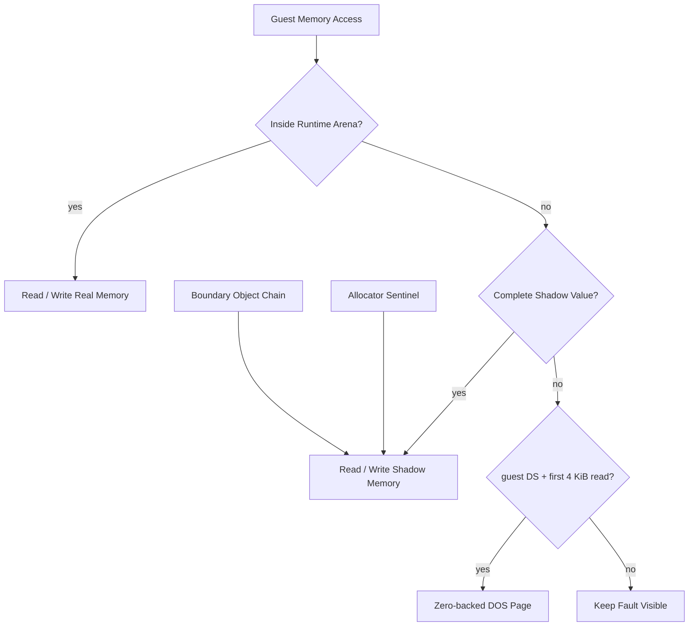
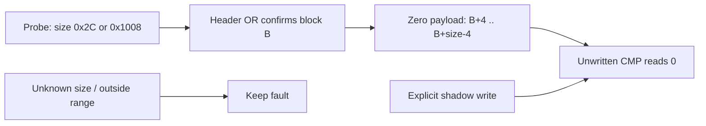
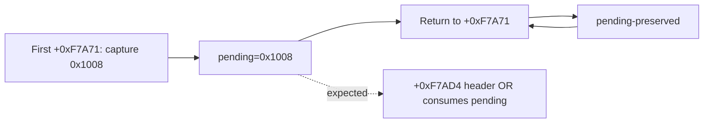
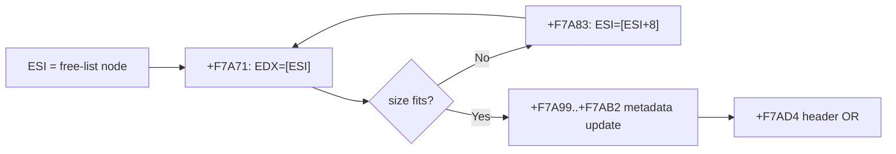
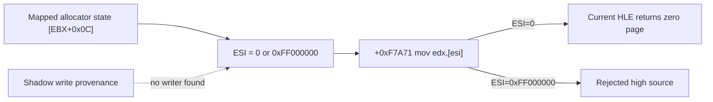

# Runtime arena, shadow memory, sentinel 분석

## Runtime arena

**확인됨:** LE image, guest stack, heap 성격의 확장 영역을 하나의 Win32 precommitted arena에 배치한다. DOS resize 관찰에 따라 slack을 확장하여 정상적인 guest write가 실제 memory에 들어가도록 했다.

## Shadow memory

**확인됨:** arena 밖이지만 원본 allocator가 유효하다고 간주하는 주소의 store를 byte-addressed map에 보존한다. 이후 `8B /r` 등은 4바이트가 모두 존재할 때만 shadow value를 읽는다. 이는 실제 memory를 무제한 확장하는 대신 분석된 범위만 보존하는 안전망이다.

## Sentinel과 allocator metadata

**확인됨:** allocator 실패/경계 표식으로 보이는 `0xFFFFFFFF` store와 그 주변 block header field가 연속적으로 관찰되었다. sentinel address와 앞선 header address의 차이가 block size register와 일치했고, 인접 `89 /r` store들이 linked allocator metadata 형태를 만들었다.

**추정:** `0xFFFFFFFF`는 일반 데이터가 아니라 allocator 목록의 종료 또는 실패 상태를 나타내는 표식이다. 정확한 원본 allocator 자료구조 이름은 아직 확정하지 않았다.

## Arena 경계 객체 chain

**확인됨:** arena 마지막 64바이트에서 시작한 객체의 field store가 경계를 넘는다. 다음 object base가 직전 frontier와 정확히 일치할 때만 chain을 연장한다. 관측된 `ESI=0x640`, `EDX=0x2C`에서 span `0x11300`을 계산했고 `66 C7`, `C7`, `89`, `D9` store를 제한적으로 shadow 처리했다.

## DS zero page

**확인됨:** `8B 16`과 `ESI=0`은 host null pointer가 아니라 guest `DS:0` 접근이다. relocated base를 더하지 않고, guest `DS`가 활성화된 unprefixed `8B /r`의 첫 4 KiB miss만 zero-backed DOS low memory로 처리한다. `0xFF000000` 같은 고주소는 계속 거부한다.

## Shadow arithmetic source

**확인됨:** `03 07` (`add eax,[edi]`)이 allocator metadata shadow dword를 source로 읽는다. source 전체가 shadow에 있을 때만 ADD를 수행하고 destination register와 여섯 산술 flag를 복원한다. 다음 명령 `83 0E 01`은 같은 metadata의 bit 0을 설정하는 read-modify-write로 관찰되었다.

**확인됨:** `83 0E 01`의 OR 결과를 같은 shadow dword에 기록한 뒤 allocator 호출이 반환했고, 다음 field byte를 읽는 `38 10` (`cmp [eax],dl`)까지 진행했다. 이는 metadata가 단순 write-only 진단 값이 아니라 원본 allocator control flow에서 다시 읽히는 실제 자료구조임을 강화한다.

**확인됨:** 첫 shadow byte CMP 뒤 같은 block offset `+0x20`의 unwritten byte compare가 관찰되었다. allocator probe에서 확인된 요청 크기 `0x2C`와 `0x1008`만 pending 상태로 보존하고 header OR에서 block base와 결합했다. `[block+4, block+size-4)` 안의 unwritten byte만 0으로 읽고 explicit shadow store를 우선하자 `38 50 20`을 통과해 파일 파싱 루프와 quiet timeout까지 진행했다.

**안전성 확인:** 단순히 `8 <= EAX <= 1 MiB`를 허용하면 allocator와 무관한 값을 크기로 오인해 Windows heap corruption `0xC0000374`가 발생했다. 확인된 두 크기의 allowlist로 제한한 뒤 전체 테스트가 통과했고 손상이 재현되지 않았다.

## Allocator probe 반복

**확인됨:** `+0xF7A71` 최근 16개 ring trace에서 timeout 실행은 모두 `EAX=0x1008`, `ESI=source=0`, `DS=0x2C`, pending-before/after `0x1008`, result `pending-preserved`였다. 총 관측은 실행별 약 2,800~2,900회였다. 새 request가 반복 capture되는 것이 아니라 첫 pending request가 `+0xF7AD4` header OR에서 소비되지 않은 채 allocator probe로 돌아오는 흐름이다.

별도 timing 경로에서는 `EAX=0x1008`, `ESI=source=0xFF000000`, pending false가 한 번 관찰되고 `rejected`로 종료됐다. 이는 DS zero-page 접근이 아니므로 relocated base를 더하거나 0으로 처리하면 안 된다는 기존 결론을 재확인한다.

## Allocator free-list control flow

**확인됨:** allocator range exception trace에서 `+0xF7A71`은 `8B 16` (`mov edx,[esi]`), `+0xF7A83`은 `8B 76 08` (`mov esi,[esi+8]`)이다. 후자는 현재 free-list node의 offset `+8` next link를 따라간다.

metadata node `ESI=0x026E49C4` 경로에서는 `+0xF7A99`, `+0xF7AA8`, `+0xF7AAA`, `+0xF7AAC`, `+0xF7AAF`, `+0xF7AB2`, `+0xF7AD4`가 순서대로 관찰되어 split/update와 OR까지 도달했다. 이때 pending은 false였다.

문제 경로에서는 next link를 따라간 뒤 `ESI=0`이 되고 `+0xF7A71` zero-page 처리만 반복한다. pending `0x1008`은 유지되지만 OR에 도달하지 않는다. 따라서 현재 핵심 가설은 allocator branch 자체보다 shadow free-list의 `node+8` link가 원본의 circular sentinel/back-link 관계를 보존하지 못해 null로 끝난다는 것이다.

## Link provenance 결과와 가설 수정

**확인됨:** 고정 256-entry shadow write provenance와 allocator read correlation에서 null/poison link transition은 관찰되지 않았다. `ESI=0` 또는 `0xFF000000`은 `+0xF7A83`의 `[ESI+8]` shadow read 결과가 아니다. allocator 앞부분의 mapped-memory `mov esi,[ebx+0x0C]`에서 이미 해당 값으로 들어온다. 이 instruction은 fault하지 않으므로 exception 기반 shadow writer가 존재하지 않는다.

따라서 “shadow node의 `+8` link가 null로 손상됐다”는 가설은 기각한다. 남은 문제는 allocator state가 가리키는 low-memory sentinel을 현재 HLE가 전부 0으로 모델링하는 것이 올바른지, 또는 selector/low-memory 초기 상태를 별도로 구성해야 하는지다.

**안전성 확인:** exception handler에서 per-byte `unordered_map` provenance를 확장한 초기 구현은 `0xC0000374` heap corruption 두 번과 hang 한 번을 일으켰다. 동적 container를 제거하고 고정 ring으로 바꾼 뒤 sample과 반복 PIU 실행에서 손상이 재현되지 않았다.

# Runtime Arena, Shadow Memory, and Sentinel Analysis

The runtime arena contains the relocated LE image, guest stack, and observed heap expansion. Byte-addressed shadow memory preserves only analyzed out-of-arena stores and serves reads only when every requested byte exists.

Observed `0xFFFFFFFF` stores and adjacent block-header writes form an allocator sentinel/metadata pattern, although the original allocator structure name remains inferred. Boundary objects are chained only through exact base/frontier continuity and a validated span. Guest `DS:0` is treated as low memory, never as `relocated_base + 0`.
