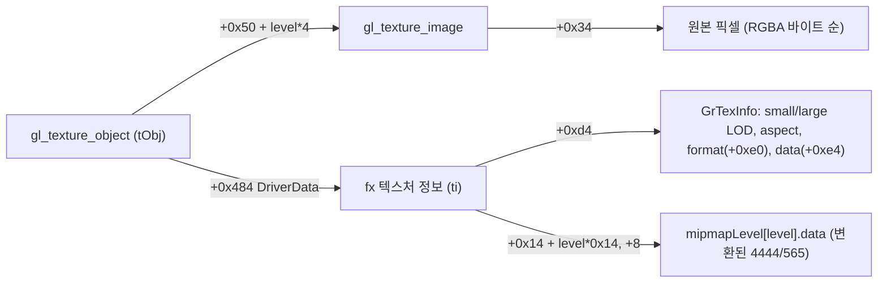

# 게임에 내장된 Mesa fx 드라이버와 텍스처 정밀도 / The embedded Mesa fx driver and texture precision

issue #37. 2026-10-09, pumpitea `PIU.EXE`(CHD 마운트 `build/runtime_mounts/pumpitea/PIU/PIU.EXE`)를
`repiu_aot_probe --dump-image`로 0x01000000 기준 재배치 이미지로 뽑아 capstone으로 읽었다.

## 확인됨

### 게임은 OpenGL로 그리고, Mesa 3.x의 3dfx 드라이버가 Glide로 옮긴다

PIU 실행 파일은 Glide를 직접 부르는 대신 OpenGL을 쓰고, Mesa 3.x의 fx 드라이버(fxMesa)를 정적으로
링크해 Glide 호출로 바꾼다. 이전에 보았던 `fxTMInit`(Task 235)도 이 드라이버의 텍스처 메모리 관리자다.
`GL_NEAREST`(0x2600)·`GL_LINEAR`(0x2601) 비교, `gl_texture_object`의 `Image[]`·`DriverData`
접근이 그대로 보인다.

### RGBA 텍스처는 게임이 무엇을 요청하든 ARGB4444로 잘린다

| 단계 | pumpitea 주소 | 하는 일 |
|---|---|---|
| `fxTexGetFormat` | `0x01049044` | GL 내부 형식 → Glide 형식. `4`·`GL_RGBA`(0x1908)·`GL_RGBA2`~`GL_RGBA16`(0x8055~0x805B) → **ARGB_4444(12)**, `3`·`GL_RGB`·`GL_R3_G3_B2`·`GL_RGB4`~`GL_RGB16` → RGB_565(10), alpha·luminance·intensity 계열 → 2/3/13, color index(0x1900, 0x80E2~0x80E7) → P_8(5) |
| `fxIsTexSupported` | `0x010491E4` | `GL_TEXTURE_2D`(0xDE1)와 형식 확인 |
| `fxTexBuildImageMap` | `0x01049294` | 원본 → Glide 형식 변환. `fxDDTexImage2D` 쪽 `0x01049A3E`·`0x01049AA2`에서 호출 |
| 4444 패킹 | `0x01049813`~`0x01049859`(같은 크기), `0x010498DF`~(크기 변환) | `(A&0xF0)<<8 \| (R&0xF0)<<4 \| (G&0xF0) \| (B&0xF0)>>4`. 반올림·디더링 없음 |
| 565 패킹 | `0x0104965F`~ | `0xF8`/`0xFC` 마스크로 같은 방식 |
| 업로드 | `0x0103FE61` → `grTexDownloadMipMapLevel` | `GrTexInfo`의 형식(`+0xe0`)과 변환된 데이터만 Glide로 |

pumpitea의 60초 실행에서 112개 업로드 중 87개가 4444, 25개가 565였다(Task 753 조사 로그). 실제 Voodoo도
같은 데이터를 받았으므로 4444 계조는 원본 동작이다.

### 구조체 배치(pumpitea, Mesa 3.0 계열)

* `gl_texture_image`: `+0` 내부 형식, `+0xc` 폭, `+0x10` 높이, **`+0x34` 원본 데이터**.
* fx 텍스처 정보(`ti`): `+4` whichTMU, `+0x14 + level*0x14` mipmapLevel(데이터 `+8`), `+0xc4` isInTM,
  `+0xc8` minLevel, `+0xcc` maxLevel, `+0xd0` 기준 내부 형식, `+0xd4` `GrTexInfo`, `+0x509` validated.
  `tObj`로 돌아가는 포인터는 없다.
* 업로드 함수(`0x0103FD5C`)는 `push ecx/esi/edi/ebp` 뒤 `sub esp,0x10`을 한다. 호출 직전 레지스터는
  `ESI` = `ti`, `EBP` = 현재 Mesa level, `EBX` = 다음 Glide LOD이다. 이 함수의 호출자들은 `tObj`를
  `EBP`에 두고 `EDX`로 넘기므로(`0x010407EC`, `0x01040C70`), 게이트에서 본 `[ESP+0x34]`(저장된 호출자
  `EBP`)가 `tObj`일 가능성이 높다 — `[tObj+0x484] == ESI`로 검증할 수 있다. **확인됨(2026-10-09 사용자 실행):** pumpitea에서 4444 48개·565 13개, 업로드 61개 모두 이 연결과 재절단 검증을 통과했다(`used=61`, 실패 0). 이어 pumpit8에서도 업로드
130개(4444 88개·565 42개)가 모두 통과했다(`used=130`, 실패 0).

### 19개 롬셋 모두 같은 Mesa 빌드다

세 서명 — `fxTexGetFormat` 진입(`3D 09 19 00 00 0F 82`), 4444 패킹(`80 E3 F0 30 ED 89 DF 80 E1 F0`),
업로드 호출 꼬리(`8B 4C 24 28 51 83 C7 14 43 E8`) — 이 19개 롬셋 모두에서 한 번씩 나오고, 형식 함수와
4444 패킹의 거리(0x7CF)도 같다. 롬셋마다 주소만 다르다(pumpite·pumpitea, pumpit2·2a, pumpit3·3a,
pumpitpr·pru는 주소까지 같다).

## 미확정

* 크기 변환 경로(원본이 Glide 크기보다 작을 때)가 실제로 쓰이는지. Mesa 코드상 정수 배 확대이고 구현도
  그 규칙을 따르지만, pumpitea 실행에서는 따로 집계하지 않았다(검증에 실패하면 4444로 돌아간다).
* pumpitea·pumpit8 외 롬셋의 실행 결과(서명은 같다).

## 관련

* issue #37 설계: `docs/design/20261009-i037-full-precision-textures.md`
* 이미지 덤프: `repiu_aot_probe <PIU.EXE> --dump-image <디렉터리>`

---

# The embedded Mesa fx driver and texture precision

Issue #37, 2026-10-09: pumpitea's `PIU.EXE` was dumped as its image relocated at 0x01000000 with
`repiu_aot_probe --dump-image` and read with capstone.

**Confirmed.** PIU draws through OpenGL and statically links Mesa 3.x's 3dfx driver (fxMesa), which
turns it into Glide (Task 235's `fxTMInit` is that driver's texture memory manager). Every RGBA texture
is cut to ARGB4444 whatever the game requests: `fxTexGetFormat` (`0x01049044`) maps `4`, `GL_RGBA` and
`GL_RGBA2`–`GL_RGBA16` to ARGB_4444 (12) and `3`, `GL_RGB`, `GL_R3_G3_B2` and `GL_RGB4`–`GL_RGB16` to
RGB_565 (10); `fxTexBuildImageMap` (`0x01049294`, called at `0x01049A3E`/`0x01049AA2`) packs
`(A&0xF0)<<8 | (R&0xF0)<<4 | (G&0xF0) | (B&0xF0)>>4` with no rounding or dithering (`0x01049813`
onward, a resizing variant from `0x010498DF`; 565 from `0x0104965F` with `0xF8`/`0xFC`); only the
result reaches `grTexDownloadMipMapLevel` (`0x0103FE61`). In a 60-second run 87 of 112 uploads were
4444 and 25 were 565. Real Voodoo hardware got the same data, so the banding is original behavior.

Layout: `gl_texture_image` has the internal format at `+0`, width `+0xc`, height `+0x10` and **the
original pixels at `+0x34`** (RGBA byte order); `tObj->Image[level]` is `+0x50 + level*4` and
`tObj->DriverData` `+0x484`; the fx texture info (`ti`) holds whichTMU `+4`, mipmapLevel data at
`+0x14 + level*0x14 + 8`, isInTM `+0xc4`, min/max level `+0xc8`/`+0xcc`, base internal format `+0xd0`,
`GrTexInfo` at `+0xd4` and validated `+0x509`, with no pointer back to `tObj`. The upload function
(`0x0103FD5C`) pushes `ecx/esi/edi/ebp` and reserves 0x10; at its Glide call `ESI` is `ti`, `EBP` the
Mesa level and `EBX` the next Glide LOD, and its callers keep `tObj` in `EBP` (`0x010407EC`,
`0x01040C70`), so the saved caller `EBP` at the gate's `[ESP+0x34]` is probably `tObj`, checkable with
`[tObj+0x484] == ESI` — **confirmed by the user's run on 2026-10-09:** all 61 pumpitea uploads (48 4444, 13 565) passed the link and the re-truncation check (`used=61`, no failures), and so did all 130 in a
following pumpit8 run (88 4444, 42 565; `used=130`).

All 19 ROM sets carry the same Mesa build: three signatures — the `fxTexGetFormat` entry, the 4444
packing and the upload call tail — occur once each in every set at the same relative distance; only
the addresses differ.

**Unresolved.** Whether the resizing path (an original smaller than the Glide size) occurs in practice —
Mesa enlarges by whole factors and the implementation follows that rule, but the pumpitea run did not
count it separately (a failed check falls back to 4444) — and runs on ROM sets other than pumpitea and pumpit8
(the signatures match).
