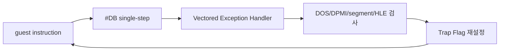

# 네이티브 실행 single-step 병목 / Native Execution Single-Step Bottleneck

## 확인됨 / Confirmed

32-bit DOS/4GW read ABI 복원 후 PIU는 `Not PTX file`로 종료하지 않는다. 120초 관찰에서 heartbeat는 `27,231,182`, dispatch count는 `13,615,591`, progress는 `1,320,177`까지 계속 증가했다. 예외나 guest fatal 출력은 없었으며 관찰 제한이 실행을 종료했다.

약 23초 이후 표본 EIP 대부분은 relocated `0x030EE1xx`에 집중된다. object 2 base `0x03010000`를 빼면 `+0xDE1xx`이며, 원본 file offset `0x1005xx`의 bit 단위 unpack/decode loop와 대응한다. 주변 코드는 shift, mask, table lookup을 반복한다. 이는 정지한 wait loop가 아니라 PTX/resource 처리 계산이 진행되는 경로다.

현재 trampoline은 guest 진입 시 Trap Flag를 설정하고, 모든 single-step 예외 처리 후 다시 Trap Flag를 설정한다. 120초 동안 약 1,361만 명령만 처리된 이유는 원본 계산량 자체보다 명령마다 VEH dispatcher를 통과하는 구조적 비용이다.

## 현재 부족한 부분 / Current Gap

새로운 guest ABI나 파일 데이터가 부족하다는 증거는 아직 없다. 현재 확인된 부족한 부분은 **안전한 native fast path**다. 일반 산술·분기·메모리 명령을 여러 개 연속으로 네이티브 실행하면서도 `INT`, privileged instruction, software segment semantics, LINEXE/Glide gate를 정확히 가로채는 실행 경계가 필요하다.

## English

After restoring the 32-bit DOS/4GW read ABI, PIU no longer terminates through `Not PTX file`. During a 120-second observation, heartbeat reached `27,231,182`, dispatch count `13,615,591`, and progress `1,320,177`, with no guest fatal output or exception. The observation limit ended the run.

Most sampled EIPs after about 23 seconds fall in relocated `0x030EE1xx`, object 2 `+0xDE1xx`, corresponding to a bit-oriented unpack/decode loop near original file offset `0x1005xx`. The path is computing rather than waiting. The trampoline currently sets Trap Flag on entry and after every handled single-step exception, routing every guest instruction through the VEH dispatcher. The confirmed gap is therefore a safe native fast path, not yet another missing file or guest ABI.

## 첫 native fast path 검증 / First Native Fast-Path Verification

**확인됨:** object 2 `+0xDE170` 함수에 relocation-aware signature 검증과 return-address hardware breakpoint를 적용했다. 모듈 분리 후 30초 실행에서 fast path는 `9,242`회 진입하고 `9,242`회 정상 반환했으며 취소는 0회였다. 기존 PTX fatal이나 새로운 예외는 발생하지 않았다.

병목 표본은 `+0xDE1xx`에서 인접한 `+0xDE2xx` 및 이후 helper로 이동했다. progress는 같은 30초 규모에서 약 `705,486`이므로 첫 함수 하나만으로 전체 처리량이 크게 개선되지는 않았다. 다음 단계에는 개별 signature 항목을 계속 추가할지, 안전성을 정적으로 판정하는 공용 region verifier로 확장할지 결정해야 한다.

**Confirmed:** A relocation-aware signature and return-address hardware breakpoint were applied to object 2 `+0xDE170`. After extracting the implementation into its own module, a 30-second run recorded `9,242` entries, `9,242` normal returns, and zero cancellations, without the former PTX fatal or a new exception. Samples moved into adjacent helpers at `+0xDE2xx` and beyond; accelerating one function alone does not materially remove the total bottleneck.

## 공용 decoder 프로토타입 / Generic Decoder Prototype

**확인됨:** direct `CALL` candidate와 보수적 CFG 순회를 구현한 자체 decoder 프로토타입은 207개 함수 진입을 처리했지만, 핵심 unpack call graph에서 `29 CF`를 `29`와 `CF`로 잘못 분리했다. operand byte `CF`를 `IRET`로 오인했으므로 instruction boundary 안전성을 보장할 수 없다. 프로토타입은 fail-closed 상수로 비활성화했으며 production fast path로 사용하지 않는다.

정확한 x86 instruction boundary와 operand/control-flow metadata를 위해 MIT License의 Zydis를 pinned dependency로 도입하기로 결정했다. 자체 decoder는 Zydis adapter와 rePIU 고유 안전 정책으로 교체할 예정이다.

**Confirmed:** The in-house direct-call/CFG decoder prototype handled 207 function entries but split `29 CF` into opcode `29` followed by operand byte `CF` in the critical unpack call graph. Misclassifying that operand as `IRET` means instruction-boundary safety is not established. The prototype is disabled by a fail-closed constant and is not used as a production fast path. It will be replaced by a pinned MIT-licensed Zydis decoder plus rePIU-specific safety policy.

## Zydis 기반 검증 결과 / Zydis-Based Verification Result

**확인됨:** Zydis v4.1.1 legacy-32 decoder로 자체 instruction-length decoder를 교체했다. 첫 30초 실행에서 fast path는 `12,134`회 진입, `12,117`회 정상 반환, `17`회 안전 취소를 기록했다. 취소된 함수는 이후 cache에서 영구 거부하도록 보완했으며, 60초 재검증에서는 `19,437/19,431/6` entry/return/cancel을 기록했다. guest fatal이나 `Not PTX file`은 발생하지 않았다.

기존 실행은 30~120초 동안 주로 object 2 `+0xDE1xx` bit-unpack loop에 머물렀다. Zydis 적용 후 30초 시점에는 `+0x76Dxx~+0x774xx`, 36초 이후 `+0x479xx`, 57초 이후 다시 여러 resource 처리 구간으로 진행했다. 따라서 원본 unpack call graph가 실제로 native 실행되어 기존 단일 병목을 통과한 것이 확인된다. 새로 확인된 필수 HLE 누락은 아직 없다.

**Confirmed:** Replaced the in-house length decoder with pinned Zydis v4.1.1 legacy-32 decoding. The first 30-second run recorded `12,134/12,117/17` entries/returns/cancellations. After permanently rejecting a function on intermediate exception, a 60-second run recorded `19,437/19,431/6` without guest fatal output or `Not PTX file`. Execution no longer remains in object 2 `+0xDE1xx`; samples advance through `+0x76Dxx~+0x774xx`, `+0x479xx`, and subsequent resource-processing regions, confirming that the original unpack call graph passes the former bottleneck.

## 네이티브 span 거절 decode 비용 / Native-span rejection decode cost

**확인됨:** 약 881초 `aot-dbt` 실행은 native linear-span
`entry/boundary/reject=1,982,870/1,967,120/2,747,330`을 기록했습니다. 기본 scanner의
거절은 동일 entry에서도 매번 Zydis decode를 반복했습니다. Task 304의 byte-validated
음성 캐시는 세 번의 60초 ON 실행에서 거절의 99.68~99.69%를 재사용했습니다.

후반 progress 변화 중앙값은 `+0.02%`로 exception 횟수 자체를 줄이지 않는 decode
최적화의 전체 처리량 효과는 작았습니다. 그러나 texture milestone은 세 쌍 모두
빨라졌고 중앙값은 `1,031ms`(약 4.9%)였습니다. 따라서 이 비용은 초기 resource decode
구간에는 유의하지만, 남은 장기 병목은 여전히 single-step/retired breakpoint 같은 예외
횟수입니다.

**Confirmed:** An approximately 881-second `aot-dbt` run recorded native linear-span
`entry/boundary/reject=1,982,870/1,967,120/2,747,330`; repeated entries were decoded again by
Zydis on every rejection. Task 304's byte-validated negative cache reused 99.68-99.69% of
rejections in three 60-second ON runs. Median late progress changed only `+0.02%`, confirming
that decode caching does not remove the exception-count bottleneck, but every texture
milestone improved with a 1,031ms median (about 4.9%). The remaining long-run frontier is
therefore exception frequency, including single-step and retired breakpoint traps.

## Retired trap 직후 span 실험 / Immediate span experiment after retired traps

**확인됨:** Task 305는 active/new generation으로 해결되지 않은 retired cache trap에서 기존
native-span scanner를 즉시 시도했습니다. 첫 구현은 pending/trace 상태를 잘못 해제하여 첫
실제 성공 직후 `RET(C3)` 경계 처리를 건너뛰었고 약 19.5초에 종료됐습니다. 이 상태는
경계까지 반드시 보존해야 한다는 실행 계약을 확인했습니다.

수정 후 세 번의 30초 교차 A/B에서 span 성공률은 95.28~95.46%, single-step 감소는
`2.94% / 2.86% / 2.65%`였습니다. 반면 progress 변화는 `+0.35% / -0.03% / +0.45%`,
중앙값 `+0.35%`였고 texture 변화 중앙값은 `-17ms`였습니다. fatal은 모두 0이고 EEPROM
hash는 일치했습니다. 따라서 retired trap 일부를 single-step 없이 처리할 수 있다는 것은
확인됐지만 현재 scanner/Dr0 비용을 포함한 순 처리량 이득은 작으며, 기능은 opt-in입니다.

**Confirmed:** Task 305 immediately tried the existing native-span scanner when a retired
cache trap could not resolve to an active or new generation. The first implementation
incorrectly cleared pending/trace state, skipped `RET(C3)` handling at the first real boundary,
and ended around 19.5 seconds. This confirmed that the state must survive until the boundary.

After the fix, three 30-second alternating pairs observed a 95.28-95.46% span success rate and
single-step reductions of `2.94% / 2.86% / 2.65%`. Progress changed by
`+0.35% / -0.03% / +0.45%` (median `+0.35%`), and median texture change was `-17ms`.
All runs kept zero fatal events and matching EEPROM hashes. Retired traps can therefore skip
some single-step work, but the net throughput benefit after scanner/Dr0 cost is small, so the
feature remains opt-in.

## Retired trap hotset 측정 / Retired-trap hotset measurement

**확인됨:** Task 306의 60초 opt-in profile은 retired trap `7,401`회, guest 주소 61개,
cache 주소 146개를 기록했으며 histogram overflow와 metadata miss는 모두 0이었습니다.
guest 상위 16개 coverage는 98.24%였습니다. `0x030F4A94` 2,850회(38.51%)와
`0x030F507C` 1,891회(25.55%)만 합쳐도 64.06%입니다.

전체의 7,293회(98.54%)는 emitted length가 5바이트 미만인 entry였고 resolver 결과도
모두 quarantine이었습니다. relink 가능한 108회는 generation publish 107회와 failure
1회였습니다. 따라서 현재 `E9 rel32` 재연결 범위를 늘리는 것으로는 대부분의 예외를
줄일 수 없습니다. 다음 성능 후보는 1~4바이트 retired entry를 side table 또는 공용
dispatch gate를 통해 `INT3` 예외 없이 최신 generation/guest fallback으로 보내는 경로입니다.

실행은 내부 60초 timeout까지 도달했고 AOT legacy fallback은 0, guest terminal fatal
count는 0, EEPROM hash는 fixture와 일치했습니다. Glide 미구현 함수는 기존 정책대로
`[repiu-fatal] ... action=continue` 진단으로 남지만 guest 실행을 종료시키지는 않았습니다.

**Confirmed:** Task 306's opt-in 60-second profile recorded 7,401 retired traps across 61
guest addresses and 146 cache addresses, with zero histogram overflow or metadata misses.
The guest top 16 covered 98.24%. `0x030F4A94` contributed 2,850 events (38.51%) and
`0x030F507C` contributed 1,891 (25.55%), for 64.06% combined.

7,293 events (98.54%) came from entries shorter than five emitted bytes and all resolved as
quarantine. The 108 relinkable events split into 107 generation publications and one failure.
Extending the current `E9 rel32` relink therefore cannot remove most exceptions. The next
performance candidate is a side table or shared dispatch gate that redirects one-to-four-byte
retired entries to the latest generation or guest fallback without raising `INT3`.

The run reached its internal 60-second timeout with zero AOT legacy fallback, zero terminal
guest fatal count, and an EEPROM hash matching the fixture. Existing unimplemented Glide
calls remained explicitly labeled `[repiu-fatal] ... action=continue` diagnostics without
terminating guest execution.

## Exception-free HLE 경계의 실제 상한 / Measured limit of exception-free HLE boundaries

Task 308은 planner-HLE `INT3/VEH`를 정상 host-call로 바꾸어 “예외 횟수 자체가 전체
병목”이라는 가설을 직접 검증했습니다. 안전 slice의 60초 OFF/ON 결과는 다음과 같습니다.

| 지표 | OFF | ON | 변화 |
|---|---:|---:|---:|
| progress | 44,977 | 45,716 | +1.64% |
| single-step | 276,680 | 254,889 | -7.88% |
| AOT boundary | 66,245 | 41,224 | -37.77% |
| 직접 HLE 성공 | 0 | 25,134 | +25,134 |

예외 경계를 25,021회 줄이고 single-step도 21,791회 줄였지만 progress는 739만
증가했습니다. 따라서 현재 실행에서 “일반 HLE 예외 제거”의 wall-clock 상한은 5배
기준과 질적으로 다릅니다. 다음 계측은 count가 아니라 CPU 시간을 short retired
hotset, native-span scanner/Dr0, VEH 내부, host HLE와 guest loop별로 나누어야 합니다.

Task 308 directly tested whether exception count itself dominates whole-run time by replacing
planner-HLE `INT3/VEH` exits with normal host calls for a safe subset.

| Metric | OFF | ON | Change |
|---|---:|---:|---:|
| progress | 44,977 | 45,716 | +1.64% |
| single-step | 276,680 | 254,889 | -7.88% |
| AOT boundary | 66,245 | 41,224 | -37.77% |
| direct HLE success | 0 | 25,134 | +25,134 |

Removing 25,021 exception boundaries and 21,791 single steps yielded only 739 additional
progress units. The next profile must attribute CPU time—not counts—to short retired hotsets,
native-span scanning/Dr0, VEH work, host HLE, and individual guest loops.

## Single-step EIP별 handler latency / Handler latency by single-step EIP

Task 309는 `REPIU_SINGLE_STEP_HOTSPOT_PROFILE=1|on|true`에서
`HandleSingleStepTrace`의 guest EIP별 count와 TSC latency tick을 기록했습니다.
60초 `aot-dbt`, superblock OFF 실행은 single-step 272,543개를 1,132개 EIP로
분류했으며 histogram overflow는 0이었습니다. count 상위 32 coverage는 49.11%,
cycle 상위 32 coverage는 67.21%였습니다.

| outcome | event 비율 | handler tick 비율 | 평균 tick/event |
|---|---:|---:|---:|
| HLE | 33.60% | 84.82% | 186,160 |
| timer | 0.07% | 0.10% | 106,576 |
| native 진입 | 29.15% | 10.37% | 26,239 |
| 일반 TF 재설정 | 37.18% | 4.71% | 9,338 |

cycle 상위 두 주소는 `0x030F940E: mov edx, ds` 11.10%와
`0x030F536A: mov eax, ds` 9.32%였습니다. 그 다음 상위 집단은
`0x0303BDAA`, `0x0303C795`, `0x0303C758`, `0x0303C779`,
`0x0303BDC3`, `0x0303BDF0`의 `IN/OUT` HLE였습니다. 상위 8개 합계는
43.09%로, 하나의 guest 계산 loop가 handler latency 80% 이상을 소유한다는
가설은 기각됐습니다.

**확인됨:** count hotspot과 latency hotspot은 다릅니다. 남은 handler 내부
latency는 일반 TF 재설정보다 segment/port-I/O HLE에 집중됩니다.

**미확정:** 이 TSC 범위는 kernel #DB 진입 전과 VEH 복귀 후를 포함하지 않고,
preemption이 sample을 부풀릴 수 있습니다. 따라서 전체 single-step 비용 또는 순수
CPU cycle로 해석할 수 없습니다. `DispatchGuestHleHandlers`의 순차 predicate/decode가
상위 HLE latency의 원인인지도 handler 내부 단계 계측 전에는 확정하지 않습니다.

Task 309 recorded guest-EIP counts and TSC latency ticks inside `HandleSingleStepTrace` when
`REPIU_SINGLE_STEP_HOTSPOT_PROFILE=1|on|true`. A 60-second `aot-dbt`, superblock-OFF run
classified all 272,543 steps across 1,132 EIPs with no histogram overflow. The top 32 covered
49.11% of events and 67.21% of measured ticks.

HLE represented 33.60% of events but 84.82% of handler ticks, averaging 186,160 ticks per
event. Ordinary TF re-arm represented 37.18% of events and only 4.71% of ticks, averaging
9,338. The leading sites were segment-register moves and port-I/O HLE, and the top eight
covered 43.09%. This rejects the hypothesis that one guest compute loop owns at least 80% of
handler latency.

The scope does not include kernel #DB entry or work after VEH returns, and preemption can
inflate TSC latency. It is not a pure CPU-cycle or whole-single-step measurement. Whether
sequential predicate/decode work in `DispatchGuestHleHandlers` causes the hot HLE latency
remains unresolved until handler-stage attribution is added.
