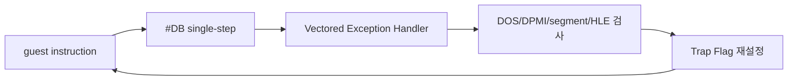

# 네이티브 실행 single-step 병목 / Native Execution Single-Step Bottleneck

## 확인됨 / Confirmed

32-bit DOS/4GW read ABI 복원 후 PIU는 `Not PTX file`로 종료하지 않는다. 120초 관찰에서 heartbeat는 `27,231,182`, dispatch count는 `13,615,591`, progress는 `1,320,177`까지 계속 증가했다. 예외나 guest fatal 출력은 없었으며 관찰 제한이 실행을 종료했다.

약 23초 이후 표본 EIP 대부분은 relocated `0x030EE1xx`에 집중된다. object 2 base `0x03010000`를 빼면 `+0xDE1xx`이며, 원본 file offset `0x1005xx`의 bit 단위 unpack/decode loop와 대응한다. 주변 코드는 shift, mask, table lookup을 반복한다. 이는 정지한 wait loop가 아니라 PTX/resource 처리 계산이 진행되는 경로다.

현재 trampoline은 guest 진입 시 Trap Flag를 설정하고, 모든 single-step 예외 처리 후 다시 Trap Flag를 설정한다. 120초 동안 약 1,361만 명령만 처리된 이유는 원본 계산량 자체보다 명령마다 VEH dispatcher를 통과하는 구조적 비용이다.

## 현재 부족한 부분 / Current Gap

새로운 guest ABI나 파일 데이터가 부족하다는 증거는 아직 없다. 현재 확인된 부족한 부분은 **안전한 native fast path**다. 일반 산술·분기·메모리 명령을 여러 개 연속으로 네이티브 실행하면서도 `INT`, privileged instruction, software segment semantics, LINEXE/Glide gate를 정확히 가로채는 실행 경계가 필요하다.

## English

After restoring the 32-bit DOS/4GW read ABI, PIU no longer terminates through `Not PTX file`. During a 120-second observation, heartbeat reached `27,231,182`, dispatch count `13,615,591`, and progress `1,320,177`, with no guest fatal output or exception. The observation limit ended the run.

Most sampled EIPs after about 23 seconds fall in relocated `0x030EE1xx`, object 2 `+0xDE1xx`, corresponding to a bit-oriented unpack/decode loop near original file offset `0x1005xx`. The path is computing rather than waiting. The trampoline currently sets Trap Flag on entry and after every handled single-step exception, routing every guest instruction through the VEH dispatcher. The confirmed gap is therefore a safe native fast path, not yet another missing file or guest ABI.

## 첫 native fast path 검증 / First Native Fast-Path Verification

**확인됨:** object 2 `+0xDE170` 함수에 relocation-aware signature 검증과 return-address hardware breakpoint를 적용했다. 모듈 분리 후 30초 실행에서 fast path는 `9,242`회 진입하고 `9,242`회 정상 반환했으며 취소는 0회였다. 기존 PTX fatal이나 새로운 예외는 발생하지 않았다.

병목 표본은 `+0xDE1xx`에서 인접한 `+0xDE2xx` 및 이후 helper로 이동했다. progress는 같은 30초 규모에서 약 `705,486`이므로 첫 함수 하나만으로 전체 처리량이 크게 개선되지는 않았다. 다음 단계에는 개별 signature 항목을 계속 추가할지, 안전성을 정적으로 판정하는 공용 region verifier로 확장할지 결정해야 한다.

**Confirmed:** A relocation-aware signature and return-address hardware breakpoint were applied to object 2 `+0xDE170`. After extracting the implementation into its own module, a 30-second run recorded `9,242` entries, `9,242` normal returns, and zero cancellations, without the former PTX fatal or a new exception. Samples moved into adjacent helpers at `+0xDE2xx` and beyond; accelerating one function alone does not materially remove the total bottleneck.

## 공용 decoder 프로토타입 / Generic Decoder Prototype

**확인됨:** direct `CALL` candidate와 보수적 CFG 순회를 구현한 자체 decoder 프로토타입은 207개 함수 진입을 처리했지만, 핵심 unpack call graph에서 `29 CF`를 `29`와 `CF`로 잘못 분리했다. operand byte `CF`를 `IRET`로 오인했으므로 instruction boundary 안전성을 보장할 수 없다. 프로토타입은 fail-closed 상수로 비활성화했으며 production fast path로 사용하지 않는다.

정확한 x86 instruction boundary와 operand/control-flow metadata를 위해 MIT License의 Zydis를 pinned dependency로 도입하기로 결정했다. 자체 decoder는 Zydis adapter와 rePIU 고유 안전 정책으로 교체할 예정이다.

**Confirmed:** The in-house direct-call/CFG decoder prototype handled 207 function entries but split `29 CF` into opcode `29` followed by operand byte `CF` in the critical unpack call graph. Misclassifying that operand as `IRET` means instruction-boundary safety is not established. The prototype is disabled by a fail-closed constant and is not used as a production fast path. It will be replaced by a pinned MIT-licensed Zydis decoder plus rePIU-specific safety policy.
