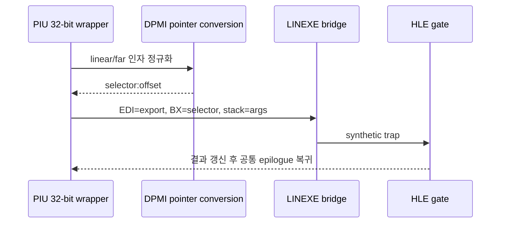
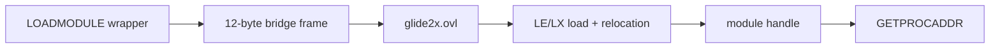

# PIU LINEXE 호출 게이트 ABI 분석

## 확인 결과

PIU는 `LINEXE_LOADER`에서 다음 여덟 export를 해석합니다. 객체 4의 `0x962C0`부터 8바이트 간격으로 이름 포인터와 해석 결과를 저장합니다.

| 슬롯 | export | PIU 래퍼 | 브리지 인자 순서 |
|---|---|---:|---|
| `0x962C0/+4` | `LINEXE_LOADMODULE` | object 2 `+0xE3440` | module name far pointer |
| `0x962C8/+4` | `LINEXE_FREEMODULE` | `+0xE34B0` | module handle |
| `0x962D0/+4` | `GETLOADTABLE` | `+0xE34E8` | load-table output far pointer |
| `0x962D8/+4` | `GETLOADNAME` | `+0xE356C` | handle, name buffer far pointer, size |
| `0x962E0/+4` | `LINEXE_GETMODHANDLE` | `+0xE35C8` | module-name far pointer, handle output far pointer |
| `0x962E8/+4` | `LINEXE_GETPROCADDR` | `+0xE3648` | procedure name, handle far pointer, procedure output far pointer |
| `0x962F0/+4` | `REL` | `+0xE36F4` | region far pointer, byte count |
| `0x962F8/+4` | `UNREL` | `+0xE3754` | region far pointer, byte count |



래퍼는 `ES/EBX/ESI/EDI/EBP`를 보존하고 object 2 `+0xE37B2`의 공통 epilogue로 돌아옵니다. HLE 게이트는 export별 인자만 소비하고 래퍼의 저장 프레임을 직접 제거하면 안 됩니다.

## 첫 LOADMODULE 동적 관찰

첫 전이는 `object 2 +0xE34A0`에서 발생하며 runtime 명령은 `66 EA 04 00 2C 00`, export target은 `EDI=0080:1B28`입니다. 현재 `ESP=025D6A84`, `EBP=025D6A88`에서 확인한 frame은 다음과 같습니다.

| 현재 ESP 기준 | 값 | 의미 |
|---:|---:|---|
| `+00h` | `00A40000` | bridge용 selector 인자 |
| `+04h` | `020F37B2` | 공용 결과 epilogue |
| `+08h` | `00000023` | 저장된 CS |
| `+0Ch` | `0000002B` | wrapper 보존 frame 시작 |
| `+24h` | `023D68C9` | 정규화된 module-name linear pointer |

`023D68C9`의 문자열은 `glide2x.ovl`이며 asset은 실제로 존재합니다. 따라서 다음 구현은 단순 성공값 생성이 아니라 LE/LX overlay module의 적재, relocation, handle 및 procedure export 생명주기를 어디까지 제공할지 결정해야 합니다.



```powershell
python tools/analysis/piu_linexe_call_gate_abi.py MASTER/PIU_1ST/PIU/PIU.EXE
```

# PIU LINEXE Call-Gate ABI Analysis

PIU resolves eight LINEXE exports into name/result slots starting at object 4 offset `0x962C0`. Wrappers normalize pointers, put the export target in `EDI` and selector in `BX`, then use a shared far-call bridge. An HLE gate must update the result and return to object 2 `+0xE37B2` without removing the wrapper's saved frame.

The first dynamic `LOADMODULE` boundary uses runtime instruction `66 EA 04 00 2C 00`, target `EDI=0080:1B28`, and a 12-byte temporary bridge frame. The normalized module-name pointer resolves to `glide2x.ovl`, which exists in the user assets. The next decision is therefore the scope of LE/LX overlay loading, relocation, module handles, and procedure exports rather than a synthetic success return.
