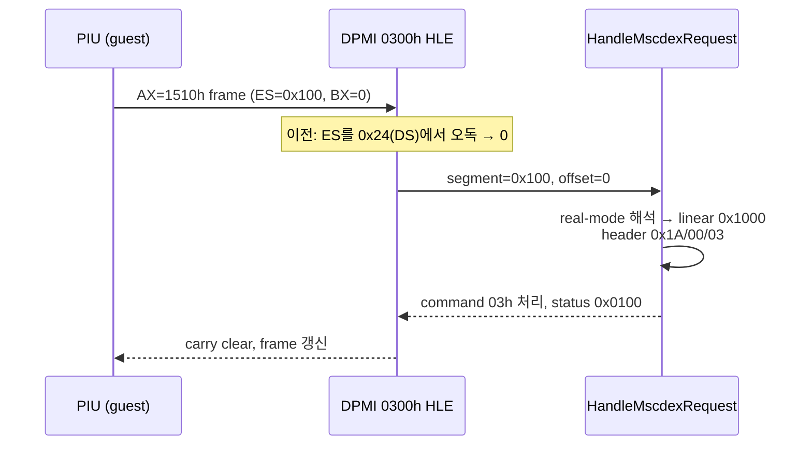
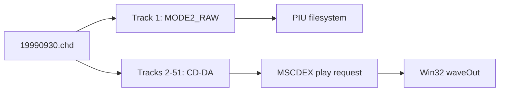

# pumpit1 MSCDEX 및 CHD CD 오디오 분석

## 2026-07-16 첫 실제 요청 확인과 거절 원인 수정 (Task 211)

**확인됨:** PIU가 실제로 MSCDEX를 호출하는 것이 처음으로 관측되었다. 초기화 약 5초 시점에 `INT 2Fh AX=1500h` 탐지 1건 응답 후, DPMI `AX=0300h` 프레임으로 `AX=1510h` 요청이 전달된다.

**확인됨 (거절 원인):** 이 요청은 그동안 `HandleMscdexRequest` 초입에서 거절되고 있었다. Task 211 진단 계측(`mscdex_es/kind/reason/header` 텔레메트리)으로 원인을 확정했다 — DPMI real-mode register 구조에서 **ES를 스펙 오프셋 `0x22`가 아닌 `0x24`(DS 슬롯)에서 읽어** 항상 0을 얻었고, segment 0은 zero-init 저메모리 backing으로 해석되어 헤더 길이 검사(`request[0] < 13`)에서 거절되었다(reason=2). FLAGS도 word가 아닌 dword로 읽고 있었다.

**확인됨 (수정 후):** 오프셋 교정 후 게스트가 전달한 진짜 ES는 `0x0100`(DPMI `AX=0100h`로 할당된 real-mode 블록, bump base `0x1000`)이었고, 패킷 26바이트가 backing에 정상 기록되어 있었다(`header=0x0003001A`: 길이 26, subunit 0, command 03h). 요청은 **command `03h`(IOCTL INPUT)로 처리되어 status `0x0100`(done)** 을 반환했다 (`mscdex request/cmd/status = 1/3/0x100`).

**미확정:** play(`84h`)/stop(`85h`)/resume(`88h`)은 이번 관측 창(초기화 구간)에서는 도달하지 않았다. 실제 CD-DA 재생과 가청 출력 확인은 게임이 곡 재생 단계까지 진행해야 가능하다. 검증 구동은 main의 `0x030F3438` 정지(Task 210) 때문에 `ReadGuestSegmentSelector` 물리 우선을 로컬에서만 비활성화한 진단 실험 하에서 수행되었다 — 실험 없이 main aot-dynamic에서는 MSCDEX에 도달하지 못한다.

**Confirmed (Task 211):** PIU's first real MSCDEX traffic was observed (~5 s into initialization): one answered `INT 2Fh AX=1500h` probe, then an `AX=1510h` request through a DPMI `AX=0300h` frame. The request had been declined at the top of `HandleMscdexRequest` because the frame **ES was read at offset `0x24` (the DS slot) instead of the spec's `0x22`**, always yielding 0; segment 0 resolved into zero-initialized low-memory backing and failed the header length check (reason=2). FLAGS was also read as a dword instead of a word. After correcting the offsets, the guest's actual ES is `0x0100` (a DPMI `AX=0100h` real-mode block), the 26-byte packet is present in the backing (`header=0x0003001A`), and the request completes as **command `03h` (IOCTL INPUT) with status `0x0100`**. Play/stop/resume commands (`84h/85h/88h`) were not reached in the initialization window, and verification ran under the documented local experiment that disables the physical-register preference in `ReadGuestSegmentSelector`, since main's aot-dynamic stalls at `0x030F3438` (Task 210) before reaching MSCDEX.

## 확인됨

`19990930.chd`의 CHT2 metadata에는 51개 track이 있습니다. track 1은 `MODE2_RAW` data이고 track 2~51은 `AUDIO`입니다. 공용 probe가 각 track의 첫 raw sector를 libchdr로 읽었으며 `tracks=51`, `audio_tracks=50`, `lead_out=258607`을 확인했습니다.

기존 binary 관찰에서는 직접 `INT 2Fh AX=1500h`과 DPMI real-mode simulation의 `AX=1510h`이 확인되어 있습니다. 이번 구현은 CHD가 있는 `pumpit1`에 drive `D:` 하나를 노출하고 `1510h` request command `03h`, `84h`, `85h`, `88h`를 처리합니다.

420초 실행은 `heartbeat=146,445,146`, `dispatch=73,222,573`까지 유지됐고 supervisor가 child를 exit 124로 회수했습니다. 잔류 process는 없습니다. 그러나 기존 `+0xE43CE` decode 구간에 머물렀으며 `mscdex_probe/request/cmd/status`는 끝까지 `0/0/0/0`이었습니다. 실제 PIU audio play packet과 audible output은 이번 실행에서 확인되지 않았습니다.

Glide 누적 trace는 ordinal별 count, export name, 최초 8개 stack dword를 보존합니다. supervisor 강제 종료 시 loader 최종 summary는 실행되지 않으므로 live telemetry는 계속 마지막 호출만 표시합니다.

## 추정

CHT2 `FRAMES`는 저장 track extent이고 `PREGAP`은 논리 track start 앞부분으로 처리했습니다. 다음 track은 4-frame padding 뒤에서 시작합니다. 계산된 모든 track 첫 sector 읽기는 성공했지만 TOC LBA를 실제 하드웨어 capture와 비교하는 작업은 남아 있습니다.

## 미확정

* PIU가 실제로 보내는 IOCTL subfunction 순서와 play address mode
* CD-DA byte order 변환 후 실제 sample의 좌우/위상 정확성
* stop/resume 및 Q-channel polling에 대한 PIU의 기대 status bit

# pumpit1 MSCDEX and CHD CD Audio Analysis

The real CHD contains one MODE2_RAW data track and fifty audio tracks. The independent probe read the first raw sector of all 51 tracks and reported lead-out LBA 258607. The implementation exposes one D: MSCDEX drive, handles IOCTL/play/stop/resume, streams CD-DA through Win32 waveOut, and accumulates per-Glide-ordinal traces. A 420-second run remained healthy and was fully reaped, but stayed in the known decode region and recorded zero MSCDEX calls, so PIU's concrete play packet and audible output remain unconfirmed.
