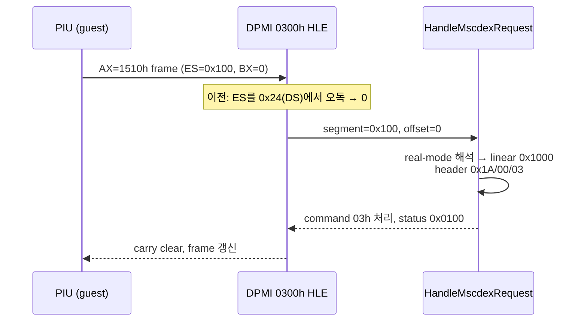
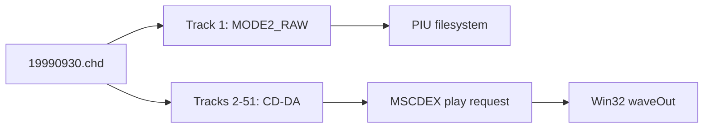

# pumpit1 MSCDEX 및 CHD CD 오디오 분석

## 2026-07-29 위치가 게임에 전혀 전달되지 않던 근인 (Task 350 후속) [해결됨]

**확인됨 (실구동 로그 `repiu_log.txt`, 02:08~02:10):**

```
MSCDEX available/audio/tracks/requests/current LBA: true/true/51/2679/166629
MSCDEX request ES/resolve kind/declines/reason/header: 0x00000100/2/0/0/0x0303001A
MSCDEX IOCTL last subfunction/handled/reject mask: 0x0000000C/false/0x00001000
MSCDEX last play mode/start/length/seek target: 0/163433/11899/0
```

**확인됨:** PIU는 **IOCTL subfunction `0Ch`(Q-channel)로 재생 위치를 폴링**한다.
`01h`은 쓰지 않는다. reject mask가 `0x00001000`(bit 12 단독)이고 `handled=false`
이므로, 거절당한 subfunction은 `0Ch` 하나뿐이며 그것이 곧 위치 조회다. MSCDEX
요청 2679건, packet 단계 decline 0건이므로 전달 경로 자체는 정상이었다.

**확인됨 (근인):** `HandleMscdexIoctl`이 request header offset 0x12의 transfer
count를 그대로 control handler에 넘기고, `case 12`가 `length < 11`이면 거절했다.
PIU가 선언하는 count가 11 미만이라 **모든 위치 폴링이 status `0x8103`으로
거절**됐다. 실제 driver는 reply 크기를 control block code에서 정하지 이 필드에서
정하지 않으며, 호출자가 이 필드를 짧게 두거나 0으로 두는 것은 흔하다. 이 gate는
Task 350 이전부터 동일하게 존재했으므로 위치는 처음부터 한 번도 전달된 적이 없다.

header `0x0303001A`의 최상위 바이트 `0x03`도 같은 사실을 가리킨다. 이 값은 요청
처리 *직전*에 캡처한 request[3]으로, 직전 요청이 남긴 status word 하위 바이트다.
`0x03`은 `0x8103`(unknown command)의 하위 바이트다.

**수정:** transfer count를 거절 기준으로 쓰지 않고, `ResolveMscdexBuffer`가 실제로
writable로 검증한 용량(항상 16바이트 이상, 여기 정의된 모든 control block을 포함)을
기준으로 판정한다. 선언된 count는 텔레메트리에만 기록한다.

**확인됨 (논리 주소 전환 검증):** play 요청이 `mode=0`(HSG), `start=163433`,
`length=11899`인데 이는 트랙 24의 `start_lba`, `frames`와 **정확히 일치**한다. 즉
게임은 우리가 보고한 TOC를 되읽어 재생한다(가설 (a) 확정). 내부 위치도 166629까지
= play 시작에서 3196프레임(42.6초) 전진해 있었으므로 오디오 백엔드는 정상이었고,
막힌 곳은 전달 경로뿐이었다.

**부수 결함:** loader 요약의 format string에 백슬래시를 써서 `\reject mask`의
`\r`이 carriage return으로 변환되어 로그 한 줄이 쪼개져 있었다. 슬래시로 교정했다.

## 2026-07-29 트랙 2 인트로 음악이 2초 잘려 시작하던 원인 (Task 350) [해결됨]

**확인됨:** `19990930.chd`의 트랙 2 metadata는
`FRAMES:820 PREGAP:150 PGTYPE:MODE1`이다. MAME/chdman 규약에서 `PGTYPE`가 `V`로
시작할 때만 pregap 프레임이 해당 트랙의 `FRAMES` 안에 실제로 저장된다. 트랙 2는
`V`가 없으므로 **pregap 150프레임이 파일에 존재하지 않는다.** 트랙 3~51은 모두
`PGTYPE:VAUDIO`라서 pregap이 저장되어 있다.

**확인됨 (근인):** `ChdCdImage::Open`이 `PGTYPE`를 보지 않고 항상
`start_lba = storage_lba + pregap`을 적용했다. 트랙 2에서는 이 계산이 저장된
음악의 앞 150프레임, 정확히 **2.00초**를 건너뛴다. 트랙 2 전체가 820프레임
(10.93초)뿐이라 청감상 "중간부터 시작"으로 나타났다. 동시에
`end_lba`가 물리 끝으로 clamp되어 뒤쪽도 잘리고 있었다.

**확인됨 (증거):** probe `--scan 2`가 저장 시작 바로 다음 섹터에서 peak 32604
(풀스케일) 음악을 보고했고 무음 구간이 전혀 없었다. 대조군인 `--scan 3`은 머리
184프레임이 무음이어서 pregap 저장 사실과 일치했다. **영향받은 트랙은 트랙 2
하나뿐이다.**

**확인됨 (주소 공간 혼용):** CHD는 트랙마다 4프레임 경계로 padding하므로 파일 내
프레임 번호와 디스크 논리 LBA가 다르다. 기존 구현은 물리 번호 하나만 유지하며
그것을 TOC로 보고했다. 트랙 2의 실제 논리 INDEX 01은 `6954 + 150 = 7104`인데
기존 보고값은 `7106`이었다. 두 값이 근접해서, 게임이 우리 TOC를 되읽어 재생하는지
원본 디스크 주소를 내장하는지 구분할 수 없었고 **두 경우 모두 약 2초 밀린 지점**을
가리켰다. 따라서 물리/논리를 분리하고 게스트에게는 논리 주소만 보고하도록 바꿨다.

수정 후 probe 결과:

```
track=2 phys=6956 frames=820 logical=6954 data_start=7104 start=7104 end=7924
first_audible_lba=7105  offset_from_reported_start=1
```

논리 7104가 물리 6956으로 매핑되고 음악은 그 1프레임(13 ms) 뒤부터 시작한다.
lead-out은 물리 258607에서 논리 258684로 바뀌었다.

## 2026-07-29 MSCDEX 위치 보고 결함 (Task 350)

**확인됨:** `HandleMscdexIoctl`이 control block code `06h/09h/0Ah/0Bh/0Ch/0Fh`만
처리하고 나머지를 `false`로 반환해 request status `0x8103`을 썼다. 특히 위치
폴링의 표준 호출인 **`01h` read head location이 미구현**이었다.

**확인됨:** `0Ch` Q-channel의 offset 4~6은 트랙 내 상대 시간인데
`MscdexLbaToMsf`(150프레임 가산)를 써서 **항상 정확히 2초 크게** 보고했다.

**확인됨:** `0Fh`의 offset 3/7은 규약상 마지막 Play의 시작/끝 주소인데 현재
위치와 0을 쓰고 있었고, paused 비트를 `playing`의 반전으로 유도해 정지와
일시정지를 구분하지 못했다.

**확인됨:** `CdAudioWaveOut::current_lba`가 `SDL_PutAudioStreamData` 직후 갱신되는
디코드 커서였다. 큐 임계값이 32섹터(426.7 ms), 투입 단위가 8섹터(106.7 ms)이므로
보고 위치가 가청 위치보다 320~427 ms 앞서고 계단식으로 튀었으며, `Play()` 직후
소리가 나기 전에 이미 0.43초 지점을 가리켰다. `playing`도 마지막 버퍼를 큐에
넣은 시점에 내려가 실제 소리가 0.4초 남은 상태에서 재생 종료로 보고됐다.

**수정:** `01h` 구현, `0Ch` 상대시간 보정과 ADR nibble/index 처리, `0Fh` 필드
정정과 실제 paused 상태, device command `83h` seek와 `0Ch` IOCTL output 추가,
`85h`/`88h`의 위치 보존 정지/재개, 가청 위치 산출(워커 스레드 샘플링).

~~**미확정:** PIU가 실제로 어떤 subfunction으로 위치를 묻는지~~
**2026-07-29 확정:** `0Ch` Q-channel이다. 위 절 참조.

**미구현 (의도적):** IOCTL `0Dh` audio sub-channel info는 구현하지 않았다. 이
호출은 sub-channel Q 데이터를 전송 버퍼로 내보내는 것이라, TOC에서 합성할 수는
있으나 형식 기대치를 틀리면 조용히 잘못된 데이터를 주게 된다. 근거 없이 만들어
내는 대신 거절을 유지하고 reject mask에 기록되도록 했다. 게임이 실제로 이 호출을
쓰는 것이 로그로 확인되면 그때 구현한다.

## 2026-07-16 첫 실제 요청 확인과 거절 원인 수정 (Task 211)

**확인됨:** PIU가 실제로 MSCDEX를 호출하는 것이 처음으로 관측되었다. 초기화 약 5초 시점에 `INT 2Fh AX=1500h` 탐지 1건 응답 후, DPMI `AX=0300h` 프레임으로 `AX=1510h` 요청이 전달된다.

**확인됨 (거절 원인):** 이 요청은 그동안 `HandleMscdexRequest` 초입에서 거절되고 있었다. Task 211 진단 계측(`mscdex_es/kind/reason/header` 텔레메트리)으로 원인을 확정했다 — DPMI real-mode register 구조에서 **ES를 스펙 오프셋 `0x22`가 아닌 `0x24`(DS 슬롯)에서 읽어** 항상 0을 얻었고, segment 0은 zero-init 저메모리 backing으로 해석되어 헤더 길이 검사(`request[0] < 13`)에서 거절되었다(reason=2). FLAGS도 word가 아닌 dword로 읽고 있었다.

**확인됨 (수정 후):** 오프셋 교정 후 게스트가 전달한 진짜 ES는 `0x0100`(DPMI `AX=0100h`로 할당된 real-mode 블록, bump base `0x1000`)이었고, 패킷 26바이트가 backing에 정상 기록되어 있었다(`header=0x0003001A`: 길이 26, subunit 0, command 03h). 요청은 **command `03h`(IOCTL INPUT)로 처리되어 status `0x0100`(done)** 을 반환했다 (`mscdex request/cmd/status = 1/3/0x100`).

**미확정:** play(`84h`)/stop(`85h`)/resume(`88h`)은 이번 관측 창(초기화 구간)에서는 도달하지 않았다. 실제 CD-DA 재생과 가청 출력 확인은 게임이 곡 재생 단계까지 진행해야 가능하다. 검증 구동은 main의 `0x030F3438` 정지(Task 210) 때문에 `ReadGuestSegmentSelector` 물리 우선을 로컬에서만 비활성화한 진단 실험 하에서 수행되었다 — 실험 없이 main aot-dynamic에서는 MSCDEX에 도달하지 못한다.



**Confirmed (Task 211):** PIU's first real MSCDEX traffic was observed (~5 s into initialization): one answered `INT 2Fh AX=1500h` probe, then an `AX=1510h` request through a DPMI `AX=0300h` frame. The request had been declined at the top of `HandleMscdexRequest` because the frame **ES was read at offset `0x24` (the DS slot) instead of the spec's `0x22`**, always yielding 0; segment 0 resolved into zero-initialized low-memory backing and failed the header length check (reason=2). FLAGS was also read as a dword instead of a word. After correcting the offsets, the guest's actual ES is `0x0100` (a DPMI `AX=0100h` real-mode block), the 26-byte packet is present in the backing (`header=0x0003001A`), and the request completes as **command `03h` (IOCTL INPUT) with status `0x0100`**. Play/stop/resume commands (`84h/85h/88h`) were not reached in the initialization window, and verification ran under the documented local experiment that disables the physical-register preference in `ReadGuestSegmentSelector`, since main's aot-dynamic stalls at `0x030F3438` (Task 210) before reaching MSCDEX.

## 확인됨

`19990930.chd`의 CHT2 metadata에는 51개 track이 있습니다. track 1은 `MODE2_RAW` data이고 track 2~51은 `AUDIO`입니다. 공용 probe가 각 track의 첫 raw sector를 libchdr로 읽었으며 `tracks=51`, `audio_tracks=50`, `lead_out=258607`을 확인했습니다.



기존 binary 관찰에서는 직접 `INT 2Fh AX=1500h`과 DPMI real-mode simulation의 `AX=1510h`이 확인되어 있습니다. 이번 구현은 CHD가 있는 `pumpit1`에 drive `D:` 하나를 노출하고 `1510h` request command `03h`, `84h`, `85h`, `88h`를 처리합니다.

420초 실행은 `heartbeat=146,445,146`, `dispatch=73,222,573`까지 유지됐고 supervisor가 child를 exit 124로 회수했습니다. 잔류 process는 없습니다. 그러나 기존 `+0xE43CE` decode 구간에 머물렀으며 `mscdex_probe/request/cmd/status`는 끝까지 `0/0/0/0`이었습니다. 실제 PIU audio play packet과 audible output은 이번 실행에서 확인되지 않았습니다.

Glide 누적 trace는 ordinal별 count, export name, 최초 8개 stack dword를 보존합니다. supervisor 강제 종료 시 loader 최종 summary는 실행되지 않으므로 live telemetry는 계속 마지막 호출만 표시합니다.

## 추정

~~CHT2 `FRAMES`는 저장 track extent이고 `PREGAP`은 논리 track start 앞부분으로 처리했습니다.~~
**2026-07-29 정정 (Task 350):** 이 처리가 트랙 2에서 틀렸다. `PGTYPE`를 보지 않고
pregap을 항상 건너뛴 것이 인트로 음악이 2초 잘리던 근인이다. 위 절 참조.
TOC LBA를 실제 하드웨어 capture와 비교하는 작업은 여전히 남아 있으나, 이제 보고
값이 논리(Red Book) 주소이므로 직접 비교가 가능하다.

## 미확정

* CD-DA byte order 변환 후 실제 sample의 좌우/위상 정확성
* PIU가 Q-channel 응답의 어떤 필드를 실제로 소비하는지 (상대시간 vs 절대시간,
  index/ADR 바이트 기대치)
* stop/resume 및 Q-channel polling에 대한 PIU의 기대 status bit
* 우리 논리 TOC와 실제 원본 디스크 TOC의 track별 대조

# pumpit1 MSCDEX and CHD CD Audio Analysis

The real CHD contains one MODE2_RAW data track and fifty audio tracks. The independent probe read the first raw sector of all 51 tracks and reported lead-out LBA 258607. The implementation exposes one D: MSCDEX drive, handles IOCTL/play/stop/resume, streams CD-DA through Win32 waveOut, and accumulates per-Glide-ordinal traces. A 420-second run remained healthy and was fully reaped, but stayed in the known decode region and recorded zero MSCDEX calls, so PIU's concrete play packet and audible output remain unconfirmed.
