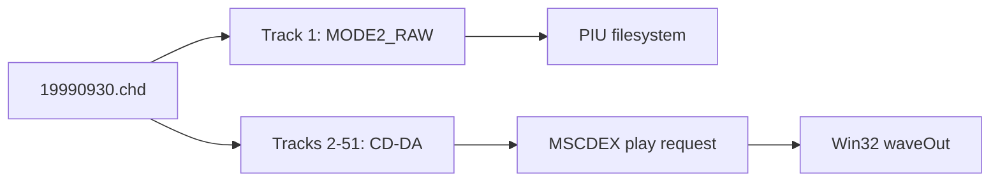

# pumpit1 MSCDEX 및 CHD CD 오디오 분석

## 확인됨

`19990930.chd`의 CHT2 metadata에는 51개 track이 있습니다. track 1은 `MODE2_RAW` data이고 track 2~51은 `AUDIO`입니다. 공용 probe가 각 track의 첫 raw sector를 libchdr로 읽었으며 `tracks=51`, `audio_tracks=50`, `lead_out=258607`을 확인했습니다.

기존 binary 관찰에서는 직접 `INT 2Fh AX=1500h`과 DPMI real-mode simulation의 `AX=1510h`이 확인되어 있습니다. 이번 구현은 CHD가 있는 `pumpit1`에 drive `D:` 하나를 노출하고 `1510h` request command `03h`, `84h`, `85h`, `88h`를 처리합니다.

420초 실행은 `heartbeat=146,445,146`, `dispatch=73,222,573`까지 유지됐고 supervisor가 child를 exit 124로 회수했습니다. 잔류 process는 없습니다. 그러나 기존 `+0xE43CE` decode 구간에 머물렀으며 `mscdex_probe/request/cmd/status`는 끝까지 `0/0/0/0`이었습니다. 실제 PIU audio play packet과 audible output은 이번 실행에서 확인되지 않았습니다.

Glide 누적 trace는 ordinal별 count, export name, 최초 8개 stack dword를 보존합니다. supervisor 강제 종료 시 loader 최종 summary는 실행되지 않으므로 live telemetry는 계속 마지막 호출만 표시합니다.

## 추정

CHT2 `FRAMES`는 저장 track extent이고 `PREGAP`은 논리 track start 앞부분으로 처리했습니다. 다음 track은 4-frame padding 뒤에서 시작합니다. 계산된 모든 track 첫 sector 읽기는 성공했지만 TOC LBA를 실제 하드웨어 capture와 비교하는 작업은 남아 있습니다.

## 미확정

* PIU가 실제로 보내는 IOCTL subfunction 순서와 play address mode
* CD-DA byte order 변환 후 실제 sample의 좌우/위상 정확성
* stop/resume 및 Q-channel polling에 대한 PIU의 기대 status bit

# pumpit1 MSCDEX and CHD CD Audio Analysis

The real CHD contains one MODE2_RAW data track and fifty audio tracks. The independent probe read the first raw sector of all 51 tracks and reported lead-out LBA 258607. The implementation exposes one D: MSCDEX drive, handles IOCTL/play/stop/resume, streams CD-DA through Win32 waveOut, and accumulates per-Glide-ordinal traces. A 420-second run remained healthy and was fully reaped, but stayed in the known decode region and recorded zero MSCDEX calls, so PIU's concrete play packet and audible output remain unconfirmed.
