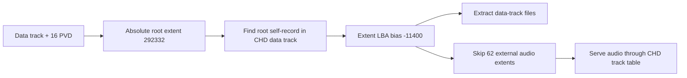

# pumpit2 CHD/ISO9660 마운트 분석

## 확인됨

- `roms/pumpit2.zip`은 `pumpit1.zip`과 동일한 SHA-256
  `B73A9549A22EBD7F1BA71B1EA245B79CF96F7AECFEAFCD3F0565F89D4A6EF380`이며
  PIU10 ROM 네 항목을 공유합니다.
- `19921229.chd`의 SHA-256은
  `578B6DADE2F3400FFF7F98DFF4C80DE24989B75F81278F1C314C677AD61FC897`입니다.
- CHD에는 63개 트랙이 있고 앞의 62개는 오디오, 63번은 `MODE2_RAW` 데이터
  트랙입니다. CHD 논리 공간의 데이터 시작 LBA는 `280832`입니다.
- 멀티세션 ISO의 directory extent는 원본 디스크 절대 LBA로 기록되어 있습니다.
  CHD가 세션 간 gap을 저장하지 않으므로 루트 디렉터리 자기 참조를 스캔해
  `ISO extent + (-11400) = CHD logical LBA` 변환을 확인했습니다.
- `AUDIO01.DAT`부터 이어지는 62개 레코드는 데이터 트랙 밖의 오디오 트랙을
  가리킵니다. 파일 시스템 cache에서는 제외하고 CD-DA/MSCDEX 트랙 경로가
  원본 오디오를 담당합니다.
- 최초 mount는 일반 파일 332개, 35,408,346바이트를 추출했습니다. 생성된
  `PIU/PIU.EXE`는 1,729,538바이트이며 SHA-256은
  `8DDDD0B8785281D976ADFABCB415A9FF83B159319C36422F9A057A5B01BBDED5`입니다.
- DOS/4GW 분석은 4개 LE object, entry `0x001016B0`, stack top
  `0x0059CC90`, relocation failure 0건으로 통과했습니다.
- 기본 `legacy` backend의 3초 smoke에서 원본 코드가 `INTRO.ANI`와
  `STAGE.CFG`를 읽었고, PIU10 YMZ280B sample ROM과 63-track MSCDEX가
  초기화됐습니다.
- AOT 실패의 직접 원인은 `0x010FB9D1`의 direct call이 return address를 소비하는
  `0x010EFE34` thunk를 호출하면서도 planner가 `0x010FB9D6` fall-through를
  보수적으로 코드로 간주한 것입니다. 실제로는 데이터인 영역을 따라가
  `0x010FB9E5 -> 0x010FB9E6` 미해결 `kBlockFallthrough` fixup 한 건이 남았습니다.
- Task 395는 게임 주소를 인식하지 않고 `aot-dbt`의 모든 미해결 direct edge만
  host-stack runtime dispatcher로 보냅니다. pumpit2 Release 3초 smoke는 dispatch
  site 1개로 cache build를 통과하고 timeout까지 원본 guest를 실행했습니다.
  pumpit1은 site 0개였고, 일반 `aot`는 기존처럼 같은 edge를 fail-closed했습니다.

## 추정

- 외부 extent 62개와 오디오 트랙 62개의 개수가 일치하고 첫 레코드가
  `AUDIO01.DAT`이므로 이 레코드들은 오디오 트랙용 ISO 참조로 판단합니다.

## 미확정

- 실제 플레이 전 구간, CD-DA 재생 전환, 입력과 화면 출력은 사용자 장시간
  검증이 남아 있습니다.

# pumpit2 CHD/ISO9660 mount analysis

## Confirmed

- `pumpit2.zip` is byte-identical to `pumpit1.zip` and shares the four PIU10
  ROM members. The SHA-256 values are recorded above.
- The CHD contains 62 audio tracks followed by one `MODE2_RAW` data track at
  logical LBA 280832.
- Multisession ISO directory extents retain original absolute disc LBAs, while
  CHD omits the inter-session gap. Scanning for the root directory self-record
  establishes an extent-to-CHD bias of -11400 without a game-specific address.
- The mount extracted 332 data-track files totaling 35,408,346 bytes and
  skipped 62 external audio extents. CD-DA remains owned by the CHD track table
  and MSCDEX path.
- The extracted executable identity and LE/runtime measurements are listed in
  the Korean section. Parsing and relocations completed without failure.
- A three-second legacy-backend smoke read original game assets and initialized
  the PIU10 YMZ280B sample ROM plus a 63-track MSCDEX device.
- The AOT failure came from a conservative fall-through after a direct call to a
  return-address-consuming thunk. It walked data and left one unresolved
  `kBlockFallthrough` fixup at `0x010FB9E5 -> 0x010FB9E6`.
- Task 395 handles unresolved direct edges generically under AOT-DBT. A three-second
  pumpit2 smoke built one dispatch site and ran until the requested timeout;
  pumpit1 built zero sites, while plain AOT retained fail-closed behavior.

## Inferred

- The 62 external `AUDIOxx.DAT` extents correspond to the 62 audio tracks.

## Unresolved

- Full gameplay, CD-DA transitions, input, and rendering still need a longer
  user-run validation.
