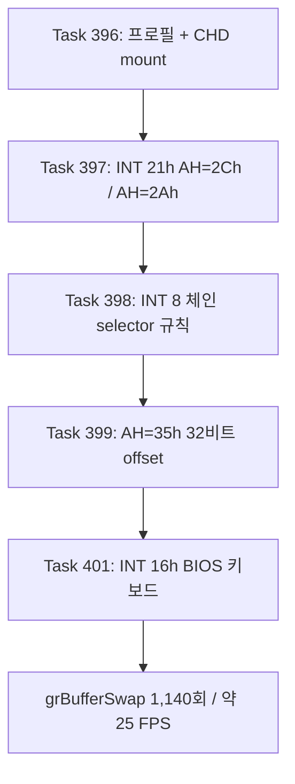
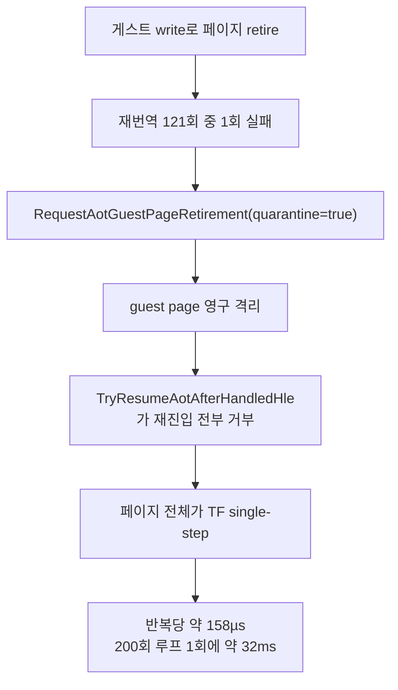

# pumpit3 bring-up: 프로필 추가에서 렌더 루프까지 / pumpit3 Bring-Up: From Profile to Render Loop

이 문서는 `pumpit3`(Pump It Up The O.B.G: The 3rd Dance Floor) 타겟이 실행되지 않던
상태에서 렌더 루프에 진입하기까지, 그리고 그 성능을 귀속하기까지 확인된 사실을
누적합니다. Task별 시간순 증거는 `docs/work-logs/`에, 인터럽트 규약 세부는
[interrupts-and-port-io.md](interrupts-and-port-io.md)에, port I/O 축의 반복 측정
절차는 [port I/O / arena 귀속 가이드](../guides/port-io-arena-attribution.md)에
있습니다. 다음 할 일 목록은
[current-execution-frontier.md](current-execution-frontier.md) 앞부분입니다.

## 요약

프로필과 CHD mount는 Task 396에서 이미 정상이었습니다. 실행을 막은 것은 **전부 HLE 쪽
공백**이었고, 네 개의 서로 다른 결함이 차례로 드러났습니다. 게임 코드는 한 줄도
수정하지 않았습니다.

| Task | 정지 지점 | 근인 | 결과 |
|---|---|---|---|
| 397 | `0x030D3941` | `INT 21h AH=2Ch` 미구현 | 지연 보정 루프 통과 |
| 397 | `0x030D2CA8` | `INT 21h AH=2Ah` 미구현 | `time()` 완성 |
| 398 | `0x0301F827` | INT 8 체인 인식 조건이 타이틀별 offset에 의존 | 크래시 소멸, 실행 지속 |
| 399 | 진행 정지 | `INT 21h AH=35h`가 `EBX` 하위 16비트만 기록 | 폴링 정지 해소 |
| 401 | `0x03011537` | `INT 16h` 미구현 | **렌더 루프 진입** |



## 확인됨: 왜 pumpit1/pumpit2에서는 드러나지 않았나

세 실행 파일 모두 같은 Watcom 런타임을 링크하지만, **pumpit3만 그 코드를 실제로
호출합니다.**

* `INT 21h AH=2Ch`: pumpit1/pumpit2는 호출되지 않는 `_dos_gettime` 영역에 1곳뿐입니다.
  pumpit3는 게임 코드 4곳(`0xDEB41` `0xDEB4B` `0xDEB5B` `0xDEB97`)에서 직접 부릅니다.
* `INT 21h AH=2Ah`: `0xDDE9D`의 `__getdt`가 `2Ah` → `2Ch` → `2Ah` 순으로 호출하며,
  유일한 호출자는 `0xDB20A`의 `time()`입니다.

**교훈:** "라이브러리 영역에 있으니 호출되지 않는다"는 pumpit1/pumpit2 기준 추론이었고
pumpit3에는 성립하지 않았습니다. 도달 여부는 호출 그래프로 판정해야 합니다.

## 확인됨: 한 결함이 다른 결함을 가리고 있었다

Task 398의 INT 8 체인 인식 조건은 `target_offset == 0 && target_selector == DS`였습니다.
pumpit3가 저장한 값은 `0000:03010000`이라 맞지 않았는데, **그 이상한 offset 자체가
Task 399가 고칠 결함의 산물**이었습니다.

게스트 wrapper `0x030D0963`은 `int 21h`(AH=35h) 뒤 `mov eax, ebx`로 32비트 전체를
씁니다. 그런데 `HandleDosGetInterruptVector`는 하위 16비트만 기록했으므로, 진입 시
`EBX = 0x0301F7BC`의 상위 절반이 남아 `0x03010000`이 반환됐습니다. `AH=25h`,
`AX=0204`, `AX=0205`가 모두 32비트를 다루는데 `AH=35h`만 16비트였습니다.

Task 398은 "저장 포인터가 실행 가능한 코드를 가리키는가"만 보도록
`target_selector != CS`로 바꿔 타이틀별 값 의존을 없앴고, Task 399가 근인을 고쳤습니다.
두 규칙은 서로 독립이며 수정 후 저장 값은 `002B:00000000`입니다.

## 확인됨: 진행 정지는 Task 399가 해소했다

사용자가 관측한 "크래시는 없는데 진행하지 않음"은 Task 399로 사라졌습니다. 직접 실행
두 번으로 계측 오버헤드 가설을 배제했습니다.

| 실행 | hotspot profile | 결과 |
|---|---|---|
| Task 399 이전 | off | 폴링 루프에서 60초 이상 정지 |
| Task 399 이후 | on | 폴링 통과, `0x03011537` 종료 |
| Task 399 이후 | **off** | 폴링 통과, `0x03011537` 종료 |

## 확인됨: 현재 도달 상태 (45초 직접 실행)

```
_GRBUFFERSWAP@4         count=1140      (약 25 FPS)
Glide window            1 / 640x480
texture uploads         27 (distinct 24)
INT 8 chain HLE         696
MSCDEX                  available / audio / 65 tracks
DOS AH hotspots         [2C:273122 11:1139 12:1139 4A:110]
종료                     minimal execution attempt timed out
single-step census      total/distinct/overflow = 287,599/122/0
```

## 확인됨(Task 404): 실행이 두 갈래로 갈리며, 갈림길은 페이지 격리입니다

2026-08-03에 HEAD `cc21627` Release로 pumpit3 10회, pumpit1 4회를 45초씩 EEPROM 격리로
실행했습니다. **pumpit3만 실행마다 두 갈래로 갈립니다.**

| 대상 | 프레임 | wall(Gcyc) | VEH | Glide | port-io | JAMMA scan | single-step | SS 커널 왕복 |
|---|---:|---:|---:|---:|---:|---:|---:|---:|
| pumpit1 (4회) | 700~749 | 122 | 13~15% | 24~25% | 1.1% | ~0.9% | 9,200 | 0.5~0.8% |
| **pumpit3 격리 발생 (6회)** | 0 | 122~130 | 25~27% | 1% | 6.7~8.6% | 6.3~8.2% | **510,000~578,000** | **35~40%** |
| pumpit3 격리 없음 (4회) | 0~1 | 62~70 | 24~25% | 2% | 1.7~2.8% | 1.2~2.2% | **265** | 0.04% |

**single-step이 약 2,000배 차이나며, 그 차이는 `AOT generation publishes/quarantines`가
`.../1`인지 `.../0`인지와 정확히 함께 움직입니다.** pumpit1은 4회 모두 격리 0입니다.

### 격리된 페이지 위에 200회 지연 루프가 있습니다

격리 실행에서 single-step의 93%가 네 주소에 몰립니다. `0x0301DB1F`~`0x0301DB2A`
(파일 offset `0x28D1F`)이며, Task 402가 지목한 200회 I/O 지연 루프 그 자체입니다.

```
0x0301DB1F  43              inc  ebx
0x0301DB20  29 c0           sub  eax,eax
0x0301DB22  66 ed           in   ax,dx      ; port 0x02A8
0x0301DB24  81 fb c8 00 ..  cmp  ebx,200
0x0301DB2A  7c f3           jl   0x0301DB1F
```

hotspot census 표본은 122,636 / 121,725 / 120,859 / 120,860이고, `IN`을 뺀 셋은 outcome이
전부 `TF`입니다. **명령 하나마다 예외 하나**입니다.

인과 사슬은 다음과 같으며, 거부된 재진입 수 **120,859가 `0x0301DB22`의 port-I/O HLE
횟수와 정확히 일치**하는 것이 연결 근거입니다.



로그 근거: `AOT generation failures/relinked/retired traps: 1/3752/4065`,
`AOT generation publishes/quarantines: 74/1`,
`AOT dynamic attempt/success: 121/120`,
`hle reentry funnel ... quarantined/success: 120859/53339`.

비용은 반복당 예외 4회 × 82,635 cycle(single-step gap 실측)에 핸들러 본체 약 97,500
cycle을 더해 약 **158µs/반복**입니다. 실기 ISA 버스 기준 0.2ms 대비 약 150배입니다.

### 디스플레이 제한이 아닙니다

`REPIU_GLIDE_SWAP_INTERVAL=0`으로 vsync를 꺼도 pumpit1은 700→722/749(+4%),
pumpit3는 0→0입니다. Task 371의 디스플레이 제한 결론은 이 장면에 적용되지 않습니다.

### 함께 나온 것

* **JAMMA 스냅샷이 기대만큼 싸지 않습니다.** `GetAsyncKeyState` 호출당 **17,596 cycle**로
  측정되어 Task 403이 기록한 3,044의 5.8배입니다. 그래서 스냅샷 이후에도 JAMMA scan이
  격리 실행에서 wall의 6.3~8.2%입니다.
* **세그먼트 레지스터 HLE가 이벤트당 약 2.4~2.7M cycle입니다.** `0x030CF17D`
  (`8e da` = `mov ds,dx`)와 `0x030CF18D`(`07` = `pop es`)가 890회씩에 4.63G cycle이고,
  인근 `0x030CF0xx` 묶음까지 합치면 격리 없는 실행에서도 **wall의 약 12%**입니다.
* **부팅 크래시 1회.** arena base가 `0x0F5…`로 잡힌 실행에서 `INT 21h AH=4Ah` resize가
  error `0x0008`로 실패하고(`requested end 0x0F5D9000` vs `allocator end 0x0F5C6000`)
  게스트가 예외로 죽었습니다.

### 확인됨(Task 404 후속): 격리가 없어도 port I/O 예외가 지배합니다

계측을 넣고 5회를 더 돌렸을 때 격리는 재현되지 않았고(0/5), 대신 렌더까지 간 3회에서
**격리와 무관한 더 큰 비용**이 드러났습니다.

| 항목 | run-02 | run-04 | run-05 |
|---|---:|---:|---:|
| wall (Gcyc) | 122.27 | 122.22 | 121.98 |
| 프레임 | 87 | 150 | 102 |
| port I/O 호출 | 857,750 | 1,074,586 | 990,793 |
| `0xC0000096` fault | 840,701 | 1,059,807 | 975,034 |
| 전체 예외 대비 | 90.4% | **92.9%** | 92.5% |
| 예외 없는 dispatch 적용률 | 1.8% | **1.4%** | 1.5% |
| VEH gap `other` | 41.9% | **49.3%** | 47.3% |
| port I/O 본체 | 5.5% | 6.0% | 6.0% |

**게스트 `IN` 한 번마다 CPU fault 한 번입니다.** `Port-I/O dispatch enabled: true`인데도
예외 없는 경로는 port I/O 호출의 1.4~1.8%에만 적용됩니다.

gap은 순수 오버헤드가 아닙니다(VEH 밖 시간이므로 트랩 사이 게스트 명령 실행 포함).
gap 평균 56,338~60,248 cycle을 Task 347의 전이 가격 28,154~41,033과 비교하면 왕복이
그 중 절반~3분의 2이며, **왕복만으로도 wall의 약 30%**입니다.

이것이 Task 402의 "port I/O + 커널 왕복 46~56%" 중 Task 403이 손대지 않은 절반입니다.
Task 403은 본체(JAMMA scan)만 제거했고, 큰 쪽인 왕복은 그대로 남아 있었습니다.

### 확인됨(Task 405): 지연 루프는 AOT 캐시가 아니라 arena에서 실행됩니다

주소별 census 결과 **모든 실행, 모든 항목에서 `cache_count`가 0**입니다. port I/O가
AOT 캐시 안에서 실행된 경우는 pumpit3 4회·pumpit1 1회를 통틀어 한 번도 없습니다.

| run | 프레임 | census 합계 | #1 주소 | #1 횟수 | 비중 |
|---|---:|---:|---|---:|---:|
| 1 | 1 | 91,746 | `0x0301DB22` | 78,795 | 85.9% |
| **2** | **125** | **1,040,393** | **`0x0301DB22`** | **1,011,000** | **97.2%** |
| 3 | 1 | 101,177 | `0x0301DB22` | 88,054 | 87.0% |
| 4 (격리) | 0 | 214,702 | `0x0301DB22` | 202,997 | 94.5% |

**dispatch 적용률 1.4%의 원인은 planner도 emitter도 아닙니다.** slot 기구는 정상이며
(outside-veh port I/O 15,560 = dispatch thunk 진입 15,560), 단지 **그 코드가 캐시에서
실행되지 않을 뿐**입니다. HLE reentry funnel이 44,589건인데 port I/O 예외가 1,034,948건인
것도 같은 사실입니다 — 대부분은 캐시 복귀를 시도조차 하지 않고 arena에서 재개합니다.

**Task 404가 격리 실행에서만 확인했던 지연 루프가 격리 없는 경로에서도 원인임이
확정**됐습니다.

**계측 주의:** profiled `kPortIoDevice` count와 cycles는 port I/O를 과대 계상합니다.
`ExecutionTimeScope`가 함수 진입 시 생성되어 opcode 검사에서 빠져나가는 호출까지 세기
때문이며, 차이는 single-step 횟수를 따라갑니다(비격리 약 10,000, 격리 654,587).
**실제 횟수는 census 쪽입니다.**

### 확인됨(Task 404 후속): 세대 실패 사유

```
0x0301DFFE / page 0x0301D000 / quarantined=true / terminal=false
"dynamic AOT entry was not active in the new image"
```

격리된 페이지가 `0x0301D000`(지연 루프가 있는 그 페이지)임이 실측으로 확인됐고, 사유는
용량·번역기·coverage가 아니라 **배치 계열**입니다. 재번역이 이미지를 만들었으나 요청한
진입 주소의 address-map 항목이 없었습니다. 진입 주소 `0x0301DFFE`는 정상 명령 경계입니다
(파일 `0x291FE`의 `8a 2d 68 ec 34 00`).

### 확인됨(Task 406): 번역은 있는데 캐시로 돌아가지 않습니다

`REPIU_PORT_IO_CENSUS_MAPPING=1`로 매핑 존재 여부와 재진입 예약을 함께 셌습니다.

| run | 프레임 | `0x0301DB22` count | cache | arena | **mapped** | **reentry** |
|---|---:|---:|---:|---:|---:|---:|
| 1 | 1 | 141,603 | 0 | 141,603 | 130,803 (92.4%) | **0** |
| **2** | **111** | **992,156** | **0** | **992,156** | **992,156 (100%)** | **0** |
| 3 | 1 | 222,367 | 0 | 222,367 | 213,567 (96.0%) | **0** |

**번역 부재 가설은 기각입니다.** run-2에서는 992,156회 전부 AOT 캐시 매핑이 존재했고,
전부 arena에서 실행됐으며, 재진입이 한 번도 예약되지 않았습니다. 2위 이하 주소도
`mapped`가 `count`의 95~100%, `reentry` 0으로 같습니다.

`aot_reentry_pending`은 실행이 **캐시 경계로 빠져나왔을 때** 세워집니다. 이 루프는
arena에서 돌고 있어 경계를 통해 나온 적이 없으므로 예약도 없습니다. Task 405에서
reentry funnel 44,589건이 port I/O 예외 1,034,948건보다 훨씬 적었던 이유입니다.

### 확인됨(Task 407): 두 모드는 재진입 관점에서 정반대입니다

| | 격리 실행 | 정상 실행 |
|---|---|---|
| census `reentry` | `0x0301DB22`의 **93~98%** | **0%** |
| 진입 시 `prev_code` | `0x80000004` single-step | `0xC0000005` access violation |
| 진입 시 `prev_eip` | `0x0301DB20` (arena) | `0x0301F827` (arena) |
| TF / reentry | **켜짐** | 꺼짐 |

**격리 실행에서는 런타임이 복귀를 시도합니다** — TF를 켜고 재진입을 예약한 채 매 명령을
single-step하는데 페이지가 격리돼 매번 거부됩니다. Task 404의 사슬을 반대편에서 확인한
것입니다. **정상 실행에서는 시도조차 하지 않습니다.**

### 확인됨(Task 407): arena 진입 신호가 둘

* **(a) 부팅기 — 캐시 INT3 이후.** 첫 16건이 3회 실행에서 완전히 동일했습니다.
  직전 예외가 캐시 주소(`0x0C2xxxxx`)의 `0x80000003`인데 다음 port I/O는 arena이고
  TF가 꺼져 있습니다. 경계 경로(`aot_runtime_dispatch.cpp:1791`)는 TF를 켜므로
  **이 INT3는 그 경로가 처리한 것이 아닙니다.**
* **(b) 정상 상태 — arena access violation 이후.** 마지막 16건이 전부 `0x0301F851`
  (PIC EOI)이고 직전이 `0x0301F827`의 AV입니다. 인터럽트 핸들러 영역도 arena 자유
  실행 중입니다.

공통점은 **둘 다 TF 꺼짐 + 재진입 예약 없음**으로 끝난다는 것입니다. 진입 전이는
실행당 11,597~239,423회로 상시 동작입니다.

### 부분 확인(Task 408, Task 409에서 정정): 첫 진입은 INT 8 타이머 핸들러였습니다

**주의 — 아래는 진입 "첫 1건"의 사실이며 모집단을 대표하지 않습니다.** single-step
예외가 실행당 260~283회뿐인데 `0x0301DB22`의 진입은 2,018~3,124회이므로, 진입의 **최대
약 10%만** 직전이 single-step일 수 있습니다. 나머지는 breakpoint나 access violation이며,
분포는 Task 409의 4분류 히스토그램으로 확정합니다.

주소별 진입 표본으로 격리 없는 4회 실행 전부 같은 첫 표본을 얻었습니다.

| run | 프레임 | `0x0301DB22` count | 진입 | prev-code | prev-eip | flags |
|---|---:|---:|---:|---|---|---|
| 1 | 188 | 1,061,800 | 3,124 | `0x80000004` | `0x0301F7CE` | `0x00` |
| 2 | 1 | 90,415 | 2,018 | `0x80000004` | `0x0301F7CE` | `0x00` |
| 3 | 1 | 136,081 | 2,430 | `0x80000004` | `0x0301F7CE` | `0x00` |
| 4 | 1 | 46,987 | 2,403 | `0x80000004` | `0x0301F7CE` | `0x00` |

`0x0301F7CE`는 파일 offset `0x2A9CE`이고 **`CLI` 바로 다음 명령**입니다.

```
0x0301F7CB  fa                    cli
0x0301F7CC  31 d2                 xor  edx,edx
0x0301F7CE  83 ba 98 ec 34 00 00  cmp  dword [edx+0x34EC98],0
```

`CLI`는 privileged라 HLE가 처리하고 EIP를 전진시키며, 다음 명령에서 single-step 예외가
납니다. Task 407 신호 (b)의 `0x0301F827`도 같은 루틴 안 89바이트 뒤이므로 **두 신호는
같은 INT 8 핸들러의 서로 다른 지점**입니다.

> **정정(Task 410, 측정으로 반증):** 원문은 이어서 "그 예외 처리가 **TF를 끄고 arena에
> 재개**하고, 이후 게스트는 타이머 핸들러 전체를 arena에서 자유 실행합니다"라고
> 적었습니다. **틀렸습니다.** 그 예외를 소비하는 것은 `HandleAotReentry`의
> `ResolveAotTransferTarget` 성공 분기(`aot_runtime_dispatch.cpp:1893~1902`)이고, 이
> 분기는 **arena가 아니라 캐시 `0x0C403877`(= `0x0301F7CE`의 캐시 번역본)로
> 복귀시킵니다.** 격리 없는 3회에서 arena EIP single-step의 **100%**가 이 지점이며
> (12,133/12,133 · 12,901/12,901 · 13,094/13,094), 8회 전부 같은 `exit-eip`입니다.
> 관측된 `flags = 0x00`은 그 복귀 직후 상태였습니다.
> **arena로의 이탈은 그 뒤에 예외 없이 일어납니다** —
> [Task 410 로그 §5](../work-logs/20260803-410-veh-exit-site-attribution.md).

**주소마다 기전이 다릅니다.** `0x030D0A1A`는 진입 횟수가 count와 같아(10,404/10,404)
매 실행이 캐시 INT3 직후이고, `0x0301DB22`는 340:1입니다. 전역 버퍼로는 원리적으로
구분할 수 없었습니다.

**정정:** 설계는 진입:count 비를 약 1:200으로 예상했으나 실측은 1:19.6~1:340입니다.
진입 횟수는 지연 호출 수가 아니라 **arena 체류 횟수**이며, 한 체류에서 여러 번의
지연 호출이 일어납니다.

### 확인됨(Task 409): 진입 기전은 주소마다 다릅니다 — 이제 분포로 확인

주소별 직전 예외 4분류 히스토그램(격리 없는 3회 실행)입니다.

| 주소 | count | 진입 | step | bp | av | 지배 |
|---|---:|---:|---:|---:|---:|---|
| `0x030D0A1A` | 10,404 | **10,404** | 0~4 | **10,249~10,319** | 85~155 | breakpoint |
| `0x0301F851` | 4,732 | 359 | 0 | 1 | **358** | access violation |
| `0x030D0A0F` | 1,152 | **1,152** | 0 | **1,152** | 0 | breakpoint |
| `0x0301DB22` | 42,906~946,114 | **1** | **1** | 0 | 0 | (아래 참조) |

`0x030D0A1A`와 `0x030D0A0F`는 진입 횟수가 count와 같아 **매 실행이 캐시 INT3 직후**이며
캐시와 arena를 매번 왕복합니다.

### 미확정(Task 409): `0x0301DB22`의 진입 기전은 확정되지 않았습니다

같은 판정식인데 진입 횟수가 **Task 408에서 2,018~3,124회, Task 409에서 1회**로 세
자릿수 차이입니다. 빌드 차이는 카운터 추가뿐이므로 **실행 간 차이**이며, Task 408
실행들의 분류 분포는 측정되지 않았습니다. 이 편차를 설명하기 전에는 진입 기전을
하나로 말할 수 없습니다.

Task 409 3회에 한해서는 첫 표본이 곧 모집단이며(진입 1회), 직전은 `0x0301F7CE`의
single-step입니다.

### 확인됨(Task 410): 진입 기전과 편차의 축이 모두 확정됐습니다

pumpit3 45초 8회(같은 빌드·같은 세션, census mapping 끔). 검산 `합 == 총수`가 8회 전부
성립했습니다. 전문은
[Task 410 로그 §5](../work-logs/20260803-410-veh-exit-site-attribution.md).

**소비 지점** — `HandleAotReentry`의 `ResolveAotTransferTarget` 성공 분기
(`aot_runtime_dispatch.cpp:1893~1902`)이며, 격리 없는 3회에서 arena EIP single-step의
**100%**입니다. 모집단 전체가 한 지점이므로 이 모드에서는 첫 표본이 곧 모집단입니다.

**전제 반증** — 그 분기는 arena가 아니라 **캐시 `0x0C403877`로 복귀**시킵니다
(8회 전부 동일). `flags = 0x00`은 그 복귀 직후 상태입니다. 위 Task 408 절의 정정 인용을
보십시오.

**새 시작점** — 복귀는 캐시인데 바로 다음 예외가 이미 arena 실행이고, 그 사이 VEH
예외가 **하나도 없습니다.** 즉 **이탈은 예외 없는 경로**입니다. 진입:count = 1:480.
후보는 AOT-DBT HLE slot / Glide gate의 target-miss bridge와 **캐시에 남은 미해결
direct edge**(pumpit3는 probe가 `direct control-flow target is outside the cache`를
내는 타이틀 — Task 395)이며 **셋 다 미측정**입니다.

**편차의 축은 격리입니다.**

| 모드 | arena single-step | 프레임 | 지배 종료 지점 |
|---|---:|---:|---|
| 격리 없음 (3회) | 12,133 ~ 13,094 | 1,362 ~ 1,402 | `aot-reentry-resolved` 100% |
| 격리 (4회) | 2,286,195 ~ 4,974,756 | 867 또는 미도달 | `step-trace-stepped` 75.1% + `step-trace-hle-stepped` 24.5% |

**180~410배**이고 분포는 정반대입니다. 격리 실행의 지배 경로 둘은 TF를 **켠 채** arena에
남기며, 이것이 Task 404가 본 격리 시 single-step 폭증의 정체입니다.
`aot-reentry-resolved`의 **절대수는 두 모드가 비슷하므로**(12,133 대 9,953) 격리는 정상
경로를 없애지 않고 그 위에 스텝 실행을 얹습니다.

**부수 확인** — 8회 중 1회가 arena base `0x07000000`으로 잡혀 부팅 크래시했고
(`VirtualAlloc MEM_RESERVE failed with error 487` 후 fallback), 그 실행의 게스트
주소는 정상 실행과 정확히 **+0x04000000** 관계입니다.

### 미확정

* ~~진입 횟수의 실행 간 3자릿수 편차~~ — **Task 410에서 격리 유무로 확인됨.**
* ~~`0x0301F7CE`의 single-step을 처리하며 TF를 끄고 arena에 남기는 곳~~ —
  **Task 410에서 확정·반증됨.** 소비 지점은 `HandleAotReentry`의 resolve 성공
  분기이며, **arena가 아니라 캐시로 복귀시킵니다.**
* **캐시 `0x0C403877`에서 arena로 나가는 예외 없는 경로가 무엇인가** — 새 시작점.
  후보 셋(AOT-DBT HLE slot / Glide gate의 target-miss bridge, 미해결 direct edge) 모두
  미측정입니다.
* **`CLI` 다음에 왜 single-step이 나는지** — TF를 켠 주체. 위 예외 없는 이탈과 같은
  기전일 가능성이 있으나 확인하지 않았습니다.
* **(a) 신호의 INT3 정체** — 캐시 INT3인데 경계 경로가 아닌 것.
* **(b) 신호의 AV 처리가 왜 arena에 남기는지.**
* **캐시 중간 진입의 정확성.** 캐시 코드는 selector guard, segment fold, timer safe
  point를 전제로 방출됩니다. 다만 Task 410에서 resolve 복귀가 **100% 성공**하고 정상
  실행이 1,362~1,402 프레임을 그리므로, 이 전제가 실제로 깨지고 있다는 증거는
  아직 없습니다.
* **재번역이 요청 진입 주소를 address map에 남기지 못하는 조건.**
* ~~격리가 미도달의 유일한 원인은 아닙니다. 격리가 없던 4회도 45초 안에 렌더 루프에
  도달하지 못했습니다.~~ **정정(Task 410):** 격리 없는 3회는 `_GRBUFFERSWAP@4`
  1,362~1,402회로 **렌더 루프에 도달·유지했고**, 미도달은 격리 실행 쪽이었습니다
  (867회 또는 0회 — 6·7번 실행은 Glide 초기화 호출만 있고 swap이 없습니다).
  다만 세션 간 절대 비교는 여전히 성립하지 않으므로, 이 값은 **같은 세션 안의 대비**로만
  읽습니다.
* **세션 간 절대 비교는 성립하지 않습니다.** 같은 날 pumpit1도 700~749 프레임으로,
  08-02 기록(2,222/2,251)과 크게 다릅니다. 위 표는 **같은 세션 안의 대비**로만
  읽어야 합니다.

## 미확정: 다음 대상

### 1. [해소됨] `INT 21h AH=2Ch` 비용 가설은 Task 402에서 기각됐습니다

여기 처음 적었던 "census 표본의 95%이므로 25 FPS의 주된 비용일 가능성이 높다"는
**범주 오류**였습니다. census `total_cycles`는 single-step 핸들러 scope만 재며 그 자체가
wall clock의 2.04%입니다.

Task 402가 wall clock 대비로 측정한 결과 `AH=2Ch`는 **약 3.2~3.8%** 이고 완전 제거
상한은 **1.04배**입니다. 게다가 이 지연 루틴은 자기 보정형이라 호출당 비용이 약분되므로,
싸게 만들어도 지연 시간은 같습니다. **축 종결.**

실제 비용 중심은 포트 `0x02A8` 폴링(wall의 약 46~56%)이며 근인은 `ReadJammaPort8`이
포트 읽기마다 `GetAsyncKeyState`를 최대 10회 호출하는 것입니다. 상세는
[Task 402 작업 로그](../work-logs/20260802-402-int21-2c-cost-measurement.md).

보정 상수 자체에 대한 미확정 사항은 남습니다. 보정 시점과 지연 시점의 실행 backend가
다르면(interpret ↔ AOT/DBT) 계수가 어긋나 실제 지연 길이가 틀어질 수 있습니다.

### 2. teardown 지연

45초 interrupted 실행에서 `glide_backend.Close()` 이후 teardown이 5분 넘게 진행되지
않는 것을 관측했습니다. Task 401은 census dump를 게스트 스레드 정지 직후로 옮겨
관측 자료가 사라지지 않게만 했고, **지연 자체는 손대지 않았습니다.**

### 3. 화면 내용 검증

프레임은 나오지만 **그려지는 내용이 올바른지는 확인하지 않았습니다.** texture upload가
27건(distinct 24)으로 적은 편이므로, 자산 로딩이 어디까지 진행됐는지 확인이 필요합니다.

### 4. pumpit1/pumpit2 회귀

Tasks 398/399/401은 세 타이틀이 공유하는 경로를 바꿉니다. pumpit3에서만 검증했고
**pumpit1/pumpit2 회귀는 확인하지 않았습니다.**

---

# pumpit3 Bring-Up: From Profile to Render Loop

This topic accumulates what was confirmed while taking the `pumpit3` target from "does not
run" to entering its render loop. Chronological per-task evidence is in
`docs/work-logs/`; interrupt contract details are in
[interrupts-and-port-io.md](interrupts-and-port-io.md).

## Summary

The profile and CHD mount were already correct as of Task 396. Everything that blocked
execution was **a gap on the HLE side**, and four distinct defects surfaced in sequence. No
game code was modified.

| Task | Stop | Root cause | Result |
|---|---|---|---|
| 397 | `0x030D3941` | `INT 21h AH=2Ch` unimplemented | Delay-calibration loop completes |
| 397 | `0x030D2CA8` | `INT 21h AH=2Ah` unimplemented | `time()` completes |
| 398 | `0x0301F827` | INT 8 chain recognition depended on a per-title offset | Crash gone, run continues |
| 399 | Stall | `INT 21h AH=35h` wrote only the low 16 bits of `EBX` | Polling stall cleared |
| 401 | `0x03011537` | `INT 16h` unimplemented | **Render loop reached** |

## Confirmed: why pumpit1 and pumpit2 never exposed these

All three executables link the same Watcom runtime, but **only pumpit3 actually calls that
code.** `INT 21h AH=2Ch` appears once in pumpit1/pumpit2, inside an uncalled `_dos_gettime`
region, while pumpit3 calls it from four game-code sites. `AH=2Ah` is reached through
`__getdt` at `0xDDE9D`, whose only caller is `time()` at `0xDB20A`.

**Lesson:** "it is in the library region, so it is not called" was an inference from
pumpit1/pumpit2 that does not transfer. Reachability has to come from the call graph.

## Confirmed: one defect was masking another

Task 398's chain condition required `target_offset == 0 && target_selector == DS`. pumpit3
saved `0000:03010000`, and **that odd offset was itself produced by the defect Task 399
fixed**: the guest wrapper at `0x030D0963` consumes the full 32-bit `EBX`, while
`HandleDosGetInterruptVector` wrote only the low half, leaving the caller's `0x0301F7BC`
high bits behind. `AH=25h`, `AX=0204`, and `AX=0205` all handled 32 bits; only `AH=35h` did
not.

Task 398 replaced the condition with `target_selector != CS` — testing only whether the
saved pointer designates executable code — and Task 399 fixed the cause. The two are
independent; after the fix the saved value is `002B:00000000`.

## Confirmed: Task 399 cleared the stall

The "no crash but no progress" state the user observed disappeared with Task 399. Two direct
runs ruled out instrumentation overhead: with the hotspot profiler **off**, execution still
passed the poll and reached the same next stop.

## Confirmed: current reach (45-second direct run)

`_GRBUFFERSWAP@4` 1,140 calls (~25 FPS), one 640x480 window, 27 texture uploads (24
distinct), 696 INT 8 chains, MSCDEX available with 65 tracks, DOS AH hotspots
`[2C:273122 11:1139 12:1139 4A:110]`, ending with `minimal execution attempt timed out`.
The single-step census recorded 287,599 samples over 122 distinct addresses with no
overflow.

## Confirmed (Task 404): runs are bimodal, and page quarantine is the fork

On 2026-08-03, ten 45-second pumpit3 runs and four pumpit1 runs on HEAD `cc21627` Release,
one machine, one session, EEPROM isolated per run:

| Target | Frames | Wall (Gcyc) | VEH | Glide | port-io | JAMMA scan | single-step | SS kernel round trip |
|---|---:|---:|---:|---:|---:|---:|---:|---:|
| pumpit1 (4) | 700-749 | 122 | 13-15% | 24-25% | 1.1% | ~0.9% | 9,200 | 0.5-0.8% |
| **pumpit3, quarantine fired (6)** | 0 | 122-130 | 25-27% | 1% | 6.7-8.6% | 6.3-8.2% | **510,000-578,000** | **35-40%** |
| pumpit3, no quarantine (4) | 0-1 | 62-70 | 24-25% | 2% | 1.7-2.8% | 1.2-2.2% | **265** | 0.04% |

Single-step counts differ about 2,000-fold, and the split tracks
`AOT generation publishes/quarantines` reading `.../1` against `.../0` exactly. pumpit1
quarantined nothing in any run.

### The quarantined page carries the 200-iteration delay loop

In the quarantined runs 93% of single steps land on `0x0301DB1F`-`0x0301DB2A` (file offset
`0x28D1F`) — the 200-iteration I/O delay loop from Task 402, four instructions long, with
census samples of 122,636 / 121,725 / 120,859 / 120,860 and a pure trace-flag outcome on
every instruction except the `IN`. One exception per instruction.

The chain is: a guest write retires the page, the re-translation that should publish the
next generation fails once out of 121 dynamic attempts, the failure path calls
`RequestAotGuestPageRetirement(..., quarantine=true)`, and from then on
`TryResumeAotAfterHandledHle` refuses every re-entry so the page runs under single step.
The link is exact: **120,859 rejected re-entries equals the port-I/O HLE count at
`0x0301DB22`**. Supporting counters are
`AOT generation failures/relinked/retired traps: 1/3752/4065`,
`AOT generation publishes/quarantines: 74/1`, and
`AOT dynamic attempt/success: 121/120`.

Cost: four exceptions per iteration at a measured 82,635-cycle single-step gap plus about
97,500 cycles of handler body, roughly **158 µs per iteration** and **32 ms** per
200-iteration delay call, against 0.2 ms of ISA bus time on real hardware.

### Not display-limited

With `REPIU_GLIDE_SWAP_INTERVAL=0`, pumpit1 goes 700 to 722/749 (+4%) and pumpit3 stays at
zero. Task 371's display-limit verdict does not apply to this scene.

### Also found

`GetAsyncKeyState` measures **17,596 cycles** per call here, 5.8x the 3,044 Task 403
recorded, which is why the JAMMA scan still holds 6.3-8.2% of wall in the quarantined runs
despite the snapshot. Segment-register HLE costs about 2.4-2.7M cycles per event —
`0x030CF17D` (`mov ds,dx`) and `0x030CF18D` (`pop es`) alone are 4.63G cycles over 890
events each, and with the neighbouring `0x030CF0xx` cluster about **12% of wall even in a
run with no quarantine**. One run also died at boot when the arena landed at a higher base
and `INT 21h AH=4Ah` resize failed with error `0x0008` (`requested end 0x0F5D9000` against
`allocator end 0x0F5C6000`).

### Confirmed (Task 404 follow-up): port I/O exceptions dominate even without quarantine

Five further runs with the instrumentation in place reproduced no quarantine (0 of 5), and
the three that reached rendering exposed a larger cost unrelated to it:

| Metric | run-02 | run-04 | run-05 |
|---|---:|---:|---:|
| Wall (Gcyc) | 122.27 | 122.22 | 121.98 |
| Frames | 87 | 150 | 102 |
| Port I/O calls | 857,750 | 1,074,586 | 990,793 |
| `0xC0000096` faults | 840,701 | 1,059,807 | 975,034 |
| Share of all exceptions | 90.4% | **92.9%** | 92.5% |
| Exception-free dispatch coverage | 1.8% | **1.4%** | 1.5% |
| VEH gap `other` | 41.9% | **49.3%** | 47.3% |
| Port I/O handler body | 5.5% | 6.0% | 6.0% |

Each guest `IN` costs one CPU fault, and although `Port-I/O dispatch enabled: true`, the
exception-free path covers only 1.4-1.8% of port I/O calls. The gap is not pure overhead —
it is time outside the VEH, so it includes the guest instructions between traps — but
comparing its 56,338-60,248-cycle mean with Task 347's 28,154-41,033-cycle transition price
puts the round trip at roughly half to two thirds of it, about **30% of wall on its own**.

This is the half of Task 402's "port I/O plus kernel round trip at 46-56%" that Task 403
never touched: Task 403 removed the body (the JAMMA scan) and left the larger round trip.

### Confirmed (Task 405): the delay loop runs in the arena, not the AOT cache

The per-address census records `cache_count` as **zero in every entry of every run**: across
four pumpit3 runs and one pumpit1 run, port I/O never executed from inside the AOT cache.

| Run | Frames | Census total | Top address | Count | Share |
|---|---:|---:|---|---:|---:|
| 1 | 1 | 91,746 | `0x0301DB22` | 78,795 | 85.9% |
| **2** | **125** | **1,040,393** | **`0x0301DB22`** | **1,011,000** | **97.2%** |
| 3 | 1 | 101,177 | `0x0301DB22` | 88,054 | 87.0% |
| 4 (quarantined) | 0 | 214,702 | `0x0301DB22` | 202,997 | 94.5% |

**The 1.4% dispatch coverage is not a planner or emitter defect.** The slot mechanism works —
15,560 outside-VEH port I/O calls equal 15,560 dispatch-thunk entries — the code simply does
not execute from the cache. The re-entry funnel says the same thing: 44,589 attempts against
1,034,948 port I/O exceptions, so most never try to return to the cache at all.

This also **confirms on the non-quarantine path** the delay loop that Task 404 had established
only under quarantine.

**Measurement caveat:** the profiled `kPortIoDevice` count and cycles over-count port I/O,
because `ExecutionTimeScope` is constructed on entry and so counts calls that bail at the
opcode check. The gap tracks single-stepping (about 10,000 without quarantine, 654,587 with).
**The census is the accurate count.**

### Confirmed (Task 404 follow-up): the generation-failure reason

`0x0301DFFE`, page `0x0301D000`, quarantined, not terminal, **"dynamic AOT entry was not
active in the new image"**. The quarantined page is measured to be the one holding the delay
loop, and the cause is in the placement family rather than capacity, translation, or
coverage: the re-translation built an image with no address-map entry for the requested entry
address. That address is a legitimate instruction boundary (`8a 2d 68 ec 34 00` at file
offset `0x291FE`).

### Confirmed (Task 406): the translation exists, execution just never returns to it

Counting mapping existence and re-entry scheduling together under
`REPIU_PORT_IO_CENSUS_MAPPING=1`:

| Run | Frames | `0x0301DB22` count | cache | arena | **mapped** | **reentry** |
|---|---:|---:|---:|---:|---:|---:|
| 1 | 1 | 141,603 | 0 | 141,603 | 130,803 (92.4%) | **0** |
| **2** | **111** | **992,156** | **0** | **992,156** | **992,156 (100%)** | **0** |
| 3 | 1 | 222,367 | 0 | 222,367 | 213,567 (96.0%) | **0** |

**The missing-translation hypothesis is rejected.** In run 2 all 992,156 executions had a
valid AOT cache mapping, all executed in the arena, and re-entry was never once scheduled.
Every other address matches, with `mapped` at 95-100% of `count` and `reentry` at zero.

`aot_reentry_pending` is set when execution leaves the cache **through a boundary**. This loop
runs in the arena and never left through one, so nothing is ever scheduled — which is why Task
405's re-entry funnel saw only 44,589 attempts against 1,034,948 port I/O exceptions.

### Confirmed (Task 407): the two modes are opposites with respect to re-entry

| | Quarantined run | Healthy run |
|---|---|---|
| Census `reentry` | **93-98%** at `0x0301DB22` | **0%** |
| `prev_code` at entry | `0x80000004` single step | `0xC0000005` access violation |
| `prev_eip` at entry | `0x0301DB20` (arena) | `0x0301F827` (arena) |
| Trap flag / re-entry | **set** | clear |

**In the quarantined runs the runtime is trying to return** — trap flag on, re-entry scheduled,
every instruction single-stepped, and the quarantined page refusing each time, which confirms
Task 404's chain from the other side. **In the healthy runs it never tries.**

### Confirmed (Task 407): two arena-entry signatures

**(a) Boot phase, after a cache INT3.** The first sixteen entries were identical across three
runs: the previous exception is an `0x80000003` at a cache address (`0x0C2xxxxx`) yet the next
port I/O is in the arena with the trap flag clear. The boundary path at
`aot_runtime_dispatch.cpp:1791` always sets the trap flag, so **these breakpoints were not
handled by it**. **(b) Steady state, after an arena access violation.** The last sixteen are
all `0x0301F851` (PIC EOI) preceded by an access violation at `0x0301F827`, so the
interrupt-handler region free-runs in the arena too.

Both end with **no trap flag and no scheduled re-entry**, and entry transitions number
11,597-239,423 per run, so this is routine rather than exceptional.

### Partly confirmed (Task 408, corrected by Task 409): the first entry was the INT 8 handler

**Caution — what follows is a fact about the *first* entry and does not describe the
population.** Single-step exceptions totalled only 260-283 per run while `0x0301DB22` had
2,018-3,124 entries, so **at most about a tenth** of them can have had a single-step
predecessor; the rest followed a breakpoint or an access violation. Task 409's four-way
histogram settles the distribution.

The per-address entry sample gave the same first value in all four quarantine-free runs:
previous exception `0x80000004` (single step) at `0x0301F7CE` with flags `0x00` — outside the
cache, trap flag clear, nothing scheduled. Entry counts were 3,124 / 2,018 / 2,430 / 2,403
against read counts of 1,061,800 / 90,415 / 136,081 / 46,987.

`0x0301F7CE` is file offset `0x2A9CE`, **the instruction immediately after a `CLI`**:

```
0x0301F7CB  fa                    cli
0x0301F7CC  31 d2                 xor  edx,edx
0x0301F7CE  83 ba 98 ec 34 00 00  cmp  dword [edx+0x34EC98],0
```

`CLI` is privileged, so HLE emulates it and advances EIP; a single step then fires on the next
instruction and **that handler clears the trap flag and resumes in the arena**, after which the
guest free-runs the whole timer handler. Task 407's signature (b) address `0x0301F827` is 89
bytes further into the same routine, so **both signatures are points in the same INT 8
handler**.

**Mechanisms differ per address:** `0x030D0A1A` has as many entries as executions
(10,404 of 10,404), every one after a cache INT3, while `0x0301DB22` is 340 to 1 — a
distinction a global buffer could not have made.

**Correction:** the design expected an entry-to-count ratio near 1:200 and measured 1:19.6 to
1:340. Entries count **arena residencies**, not delay-loop calls, since one residency covers
several calls.

### Confirmed (Task 409): entry mechanisms differ per address, now by distribution

The four-way predecessor histogram across three quarantine-free runs:

| Address | count | Entries | step | bp | av | Dominant |
|---|---:|---:|---:|---:|---:|---|
| `0x030D0A1A` | 10,404 | **10,404** | 0-4 | **10,249-10,319** | 85-155 | breakpoint |
| `0x0301F851` | 4,732 | 359 | 0 | 1 | **358** | access violation |
| `0x030D0A0F` | 1,152 | **1,152** | 0 | **1,152** | 0 | breakpoint |
| `0x0301DB22` | 42,906-946,114 | **1** | **1** | 0 | 0 | see below |

`0x030D0A1A` and `0x030D0A0F` have as many entries as executions, so **every execution follows
a cache INT3** and they cross between cache and arena each time.

### Unresolved (Task 409): the entry mechanism for `0x0301DB22` is not settled

The same test gave **2,018-3,124 entries in Task 408 and 1 in Task 409** — three orders of
magnitude apart. The only build difference was added counters, so this is run-to-run variation,
and Task 408's entries were never classified. Until that variation is explained the mechanism
cannot be stated as one thing. For Task 409's three runs the first sample is the whole
population, with the single step at `0x0301F7CE` as predecessor.

### Unresolved

The three-orders-of-magnitude variation in entry counts; which handler consumes the single step
at `0x0301F7CE`, clears the trap flag, and leaves execution in the arena — reading has ruled
out `HandleTimerInterruptChainBoundary` (pattern mismatch, never touches EFlags), the ten
trap-flag-clearing sites in `execution_trampoline.cpp` (none on a normally progressing path),
and the three branches at `aot_runtime_dispatch.cpp:1866-1913` (cache move, quarantine hold,
trap flag left set); why a single step follows the `CLI` at all; the identity of
signature (a)'s breakpoint; why signature (b)'s access-violation handling leaves execution in
the arena;
whether entering cache code mid-stream is correct given that it is emitted assuming selector
guards, folded segment bases, and timer safe points; and the condition under which a
re-translation omits its own requested entry from the address map. Quarantine is also
not the only reason pumpit3 fails to reach its render loop: the four runs without it did
not reach it either. And cross-session absolute comparison does not hold, because pumpit1
measured 700-749 frames on the same day against 2,222/2,251 on 08-02 — the table above is
valid only as a within-session contrast.

## Unresolved: what to do next

1. **[Resolved] The `INT 21h AH=2Ch` cost hypothesis was rejected in Task 402.** Reading
   "95% of census samples" as a cost claim here was a category error: the census measures
   only the single-step handler scope, itself 2.04% of wall clock. Measured against wall
   clock, `AH=2Ch` is about 3.2-3.8%, capping any gain at 1.04x, and the routine is
   self-calibrating so cost per call cancels anyway. The real cost centre is the port
   `0x02A8` poll at 46-56% of wall, caused by `ReadJammaPort8` calling `GetAsyncKeyState`
   up to ten times per port read. See the
   [Task 402 work log](../work-logs/20260802-402-int21-2c-cost-measurement.md). What remains
   open is the calibration constant itself, which can drift if calibration and delay run on
   different execution backends.
2. **Teardown stall.** An interrupted run made no progress past `glide_backend.Close()` for
   over five minutes. Task 401 only moved the census dump ahead of it so observations
   survive; the stall itself is untouched.
3. **Frame content is unverified.** Frames are produced, but whether the picture is correct
   was not checked, and 27 texture uploads is low enough to warrant checking how far asset
   loading got.
4. **pumpit1/pumpit2 regression.** Tasks 398, 399, and 401 change paths shared by all three
   titles and were verified only on pumpit3.
