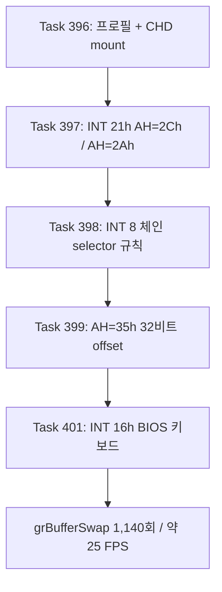

# pumpit3 bring-up: 프로필 추가에서 렌더 루프까지 / pumpit3 Bring-Up: From Profile to Render Loop

이 문서는 `pumpit3`(Pump It Up The O.B.G: The 3rd Dance Floor) 타겟이 실행되지 않던
상태에서 렌더 루프에 진입하기까지 확인된 사실을 누적합니다. Task별 시간순 증거는
`docs/work-logs/`에, 인터럽트 규약 세부는
[interrupts-and-port-io.md](interrupts-and-port-io.md)에 있습니다.

## 요약

프로필과 CHD mount는 Task 396에서 이미 정상이었습니다. 실행을 막은 것은 **전부 HLE 쪽
공백**이었고, 네 개의 서로 다른 결함이 차례로 드러났습니다. 게임 코드는 한 줄도
수정하지 않았습니다.

| Task | 정지 지점 | 근인 | 결과 |
|---|---|---|---|
| 397 | `0x030D3941` | `INT 21h AH=2Ch` 미구현 | 지연 보정 루프 통과 |
| 397 | `0x030D2CA8` | `INT 21h AH=2Ah` 미구현 | `time()` 완성 |
| 398 | `0x0301F827` | INT 8 체인 인식 조건이 타이틀별 offset에 의존 | 크래시 소멸, 실행 지속 |
| 399 | 진행 정지 | `INT 21h AH=35h`가 `EBX` 하위 16비트만 기록 | 폴링 정지 해소 |
| 401 | `0x03011537` | `INT 16h` 미구현 | **렌더 루프 진입** |



## 확인됨: 왜 pumpit1/pumpit2에서는 드러나지 않았나

세 실행 파일 모두 같은 Watcom 런타임을 링크하지만, **pumpit3만 그 코드를 실제로
호출합니다.**

* `INT 21h AH=2Ch`: pumpit1/pumpit2는 호출되지 않는 `_dos_gettime` 영역에 1곳뿐입니다.
  pumpit3는 게임 코드 4곳(`0xDEB41` `0xDEB4B` `0xDEB5B` `0xDEB97`)에서 직접 부릅니다.
* `INT 21h AH=2Ah`: `0xDDE9D`의 `__getdt`가 `2Ah` → `2Ch` → `2Ah` 순으로 호출하며,
  유일한 호출자는 `0xDB20A`의 `time()`입니다.

**교훈:** "라이브러리 영역에 있으니 호출되지 않는다"는 pumpit1/pumpit2 기준 추론이었고
pumpit3에는 성립하지 않았습니다. 도달 여부는 호출 그래프로 판정해야 합니다.

## 확인됨: 한 결함이 다른 결함을 가리고 있었다

Task 398의 INT 8 체인 인식 조건은 `target_offset == 0 && target_selector == DS`였습니다.
pumpit3가 저장한 값은 `0000:03010000`이라 맞지 않았는데, **그 이상한 offset 자체가
Task 399가 고칠 결함의 산물**이었습니다.

게스트 wrapper `0x030D0963`은 `int 21h`(AH=35h) 뒤 `mov eax, ebx`로 32비트 전체를
씁니다. 그런데 `HandleDosGetInterruptVector`는 하위 16비트만 기록했으므로, 진입 시
`EBX = 0x0301F7BC`의 상위 절반이 남아 `0x03010000`이 반환됐습니다. `AH=25h`,
`AX=0204`, `AX=0205`가 모두 32비트를 다루는데 `AH=35h`만 16비트였습니다.

Task 398은 "저장 포인터가 실행 가능한 코드를 가리키는가"만 보도록
`target_selector != CS`로 바꿔 타이틀별 값 의존을 없앴고, Task 399가 근인을 고쳤습니다.
두 규칙은 서로 독립이며 수정 후 저장 값은 `002B:00000000`입니다.

## 확인됨: 진행 정지는 Task 399가 해소했다

사용자가 관측한 "크래시는 없는데 진행하지 않음"은 Task 399로 사라졌습니다. 직접 실행
두 번으로 계측 오버헤드 가설을 배제했습니다.

| 실행 | hotspot profile | 결과 |
|---|---|---|
| Task 399 이전 | off | 폴링 루프에서 60초 이상 정지 |
| Task 399 이후 | on | 폴링 통과, `0x03011537` 종료 |
| Task 399 이후 | **off** | 폴링 통과, `0x03011537` 종료 |

## 확인됨: 현재 도달 상태 (45초 직접 실행)

```
_GRBUFFERSWAP@4         count=1140      (약 25 FPS)
Glide window            1 / 640x480
texture uploads         27 (distinct 24)
INT 8 chain HLE         696
MSCDEX                  available / audio / 65 tracks
DOS AH hotspots         [2C:273122 11:1139 12:1139 4A:110]
종료                     minimal execution attempt timed out
single-step census      total/distinct/overflow = 287,599/122/0
```

## 미확정: 다음 대상

### 1. [해소됨] `INT 21h AH=2Ch` 비용 가설은 Task 402에서 기각됐습니다

여기 처음 적었던 "census 표본의 95%이므로 25 FPS의 주된 비용일 가능성이 높다"는
**범주 오류**였습니다. census `total_cycles`는 single-step 핸들러 scope만 재며 그 자체가
wall clock의 2.04%입니다.

Task 402가 wall clock 대비로 측정한 결과 `AH=2Ch`는 **약 3.2~3.8%** 이고 완전 제거
상한은 **1.04배**입니다. 게다가 이 지연 루틴은 자기 보정형이라 호출당 비용이 약분되므로,
싸게 만들어도 지연 시간은 같습니다. **축 종결.**

실제 비용 중심은 포트 `0x02A8` 폴링(wall의 약 46~56%)이며 근인은 `ReadJammaPort8`이
포트 읽기마다 `GetAsyncKeyState`를 최대 10회 호출하는 것입니다. 상세는
[Task 402 작업 로그](../work-logs/20260802-402-int21-2c-cost-measurement.md).

보정 상수 자체에 대한 미확정 사항은 남습니다. 보정 시점과 지연 시점의 실행 backend가
다르면(interpret ↔ AOT/DBT) 계수가 어긋나 실제 지연 길이가 틀어질 수 있습니다.

### 2. teardown 지연

45초 interrupted 실행에서 `glide_backend.Close()` 이후 teardown이 5분 넘게 진행되지
않는 것을 관측했습니다. Task 401은 census dump를 게스트 스레드 정지 직후로 옮겨
관측 자료가 사라지지 않게만 했고, **지연 자체는 손대지 않았습니다.**

### 3. 화면 내용 검증

프레임은 나오지만 **그려지는 내용이 올바른지는 확인하지 않았습니다.** texture upload가
27건(distinct 24)으로 적은 편이므로, 자산 로딩이 어디까지 진행됐는지 확인이 필요합니다.

### 4. pumpit1/pumpit2 회귀

Tasks 398/399/401은 세 타이틀이 공유하는 경로를 바꿉니다. pumpit3에서만 검증했고
**pumpit1/pumpit2 회귀는 확인하지 않았습니다.**

---

# pumpit3 Bring-Up: From Profile to Render Loop

This topic accumulates what was confirmed while taking the `pumpit3` target from "does not
run" to entering its render loop. Chronological per-task evidence is in
`docs/work-logs/`; interrupt contract details are in
[interrupts-and-port-io.md](interrupts-and-port-io.md).

## Summary

The profile and CHD mount were already correct as of Task 396. Everything that blocked
execution was **a gap on the HLE side**, and four distinct defects surfaced in sequence. No
game code was modified.

| Task | Stop | Root cause | Result |
|---|---|---|---|
| 397 | `0x030D3941` | `INT 21h AH=2Ch` unimplemented | Delay-calibration loop completes |
| 397 | `0x030D2CA8` | `INT 21h AH=2Ah` unimplemented | `time()` completes |
| 398 | `0x0301F827` | INT 8 chain recognition depended on a per-title offset | Crash gone, run continues |
| 399 | Stall | `INT 21h AH=35h` wrote only the low 16 bits of `EBX` | Polling stall cleared |
| 401 | `0x03011537` | `INT 16h` unimplemented | **Render loop reached** |

## Confirmed: why pumpit1 and pumpit2 never exposed these

All three executables link the same Watcom runtime, but **only pumpit3 actually calls that
code.** `INT 21h AH=2Ch` appears once in pumpit1/pumpit2, inside an uncalled `_dos_gettime`
region, while pumpit3 calls it from four game-code sites. `AH=2Ah` is reached through
`__getdt` at `0xDDE9D`, whose only caller is `time()` at `0xDB20A`.

**Lesson:** "it is in the library region, so it is not called" was an inference from
pumpit1/pumpit2 that does not transfer. Reachability has to come from the call graph.

## Confirmed: one defect was masking another

Task 398's chain condition required `target_offset == 0 && target_selector == DS`. pumpit3
saved `0000:03010000`, and **that odd offset was itself produced by the defect Task 399
fixed**: the guest wrapper at `0x030D0963` consumes the full 32-bit `EBX`, while
`HandleDosGetInterruptVector` wrote only the low half, leaving the caller's `0x0301F7BC`
high bits behind. `AH=25h`, `AX=0204`, and `AX=0205` all handled 32 bits; only `AH=35h` did
not.

Task 398 replaced the condition with `target_selector != CS` — testing only whether the
saved pointer designates executable code — and Task 399 fixed the cause. The two are
independent; after the fix the saved value is `002B:00000000`.

## Confirmed: Task 399 cleared the stall

The "no crash but no progress" state the user observed disappeared with Task 399. Two direct
runs ruled out instrumentation overhead: with the hotspot profiler **off**, execution still
passed the poll and reached the same next stop.

## Confirmed: current reach (45-second direct run)

`_GRBUFFERSWAP@4` 1,140 calls (~25 FPS), one 640x480 window, 27 texture uploads (24
distinct), 696 INT 8 chains, MSCDEX available with 65 tracks, DOS AH hotspots
`[2C:273122 11:1139 12:1139 4A:110]`, ending with `minimal execution attempt timed out`.
The single-step census recorded 287,599 samples over 122 distinct addresses with no
overflow.

## Unresolved: what to do next

1. **[Resolved] The `INT 21h AH=2Ch` cost hypothesis was rejected in Task 402.** Reading
   "95% of census samples" as a cost claim here was a category error: the census measures
   only the single-step handler scope, itself 2.04% of wall clock. Measured against wall
   clock, `AH=2Ch` is about 3.2-3.8%, capping any gain at 1.04x, and the routine is
   self-calibrating so cost per call cancels anyway. The real cost centre is the port
   `0x02A8` poll at 46-56% of wall, caused by `ReadJammaPort8` calling `GetAsyncKeyState`
   up to ten times per port read. See the
   [Task 402 work log](../work-logs/20260802-402-int21-2c-cost-measurement.md). What remains
   open is the calibration constant itself, which can drift if calibration and delay run on
   different execution backends.
2. **Teardown stall.** An interrupted run made no progress past `glide_backend.Close()` for
   over five minutes. Task 401 only moved the census dump ahead of it so observations
   survive; the stall itself is untouched.
3. **Frame content is unverified.** Frames are produced, but whether the picture is correct
   was not checked, and 27 texture uploads is low enough to warrant checking how far asset
   loading got.
4. **pumpit1/pumpit2 regression.** Tasks 398, 399, and 401 change paths shared by all three
   titles and were verified only on pumpit3.
