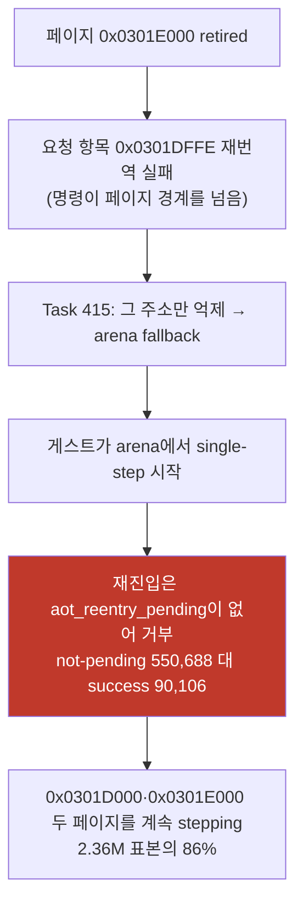
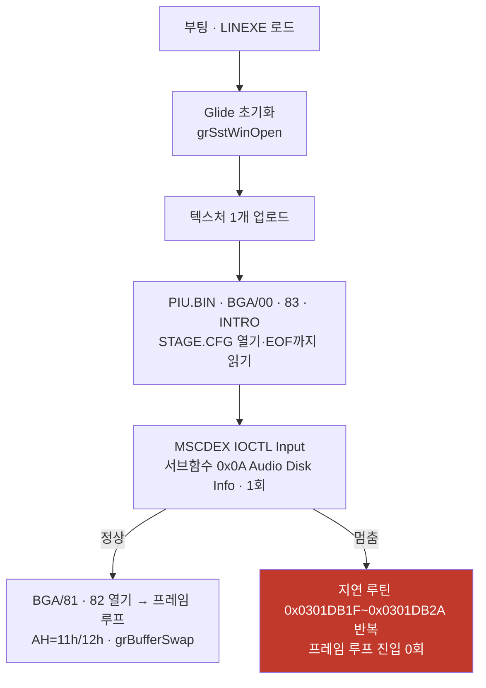
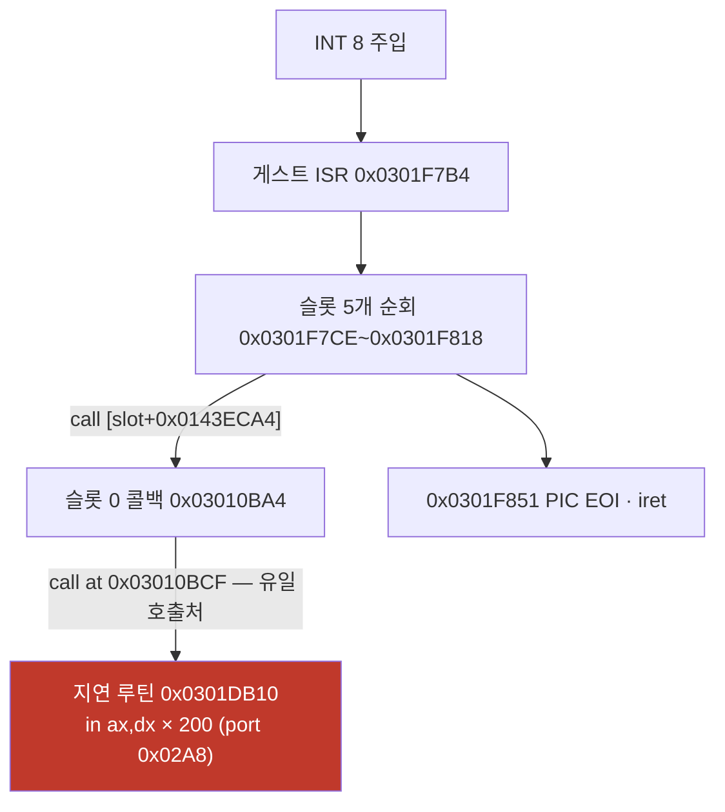

# pumpit3 기동 중 멈춤 / pumpit3 Startup Stall

사용자 보고(2026-08-04): **pumpit3가 실행 중 멈추며, 간혹 통과하지만 멈추면 늘 같은
위치**. 화면은 검은 화면이고 **아무리 기다려도 진행되지 않습니다.**

이 문서는 그 증상을 재현하고 좁힌 결과를 누적합니다. 반복 절차는
[pumpit3 멈춤 재현·판정 가이드](../guides/pumpit3-stall-reproduction.md)와
[실행 정지 지점 EIP census 가이드](../guides/execution-stall-eip-census.md)에 있고,
관련 축은 [현재 실행 frontier](current-execution-frontier.md)와
[pumpit3 bring-up](pumpit3-bring-up.md)에 있습니다.

## 해소됨 (Task 414 + Task 417, 2026-08-04) — 원인은 **둘**이었습니다

| 시점 | 정상 실행(60초) | 프레임 |
|---|---|---|
| 세션 시작 | **11회 중 0회** | 0~1 |
| Task 414(지연 루프 batching) | 15회 중 13회 | 1,378~1,497 |
| **Task 417**(걸친 요청 항목 활성화) | **8회 중 8회** | 1,018~1,416 |

두 원인은 독립입니다. **(1) 포화** — tick마다 결과를 버리는 포트 읽기 200회가 fault
200회였습니다(아래 §Task 414). **(2) arena 낙하** — 요청 항목 `0x0301DFFE`가 retired
이웃 페이지로 4바이트 걸쳐 재번역이 거부되면서 실행이 arena로 떨어지고 복귀 예약이
서지 않아 두 페이지를 2.36M회 single-step했습니다. 요청 항목만 활성화 규칙을 완화하자
**세대 실패 자체가 사라졌습니다**(`generation failure addresses` 0).
A/B: strict 5회 중 2회 멈춤 대 relaxed **8회 중 0회**, pumpit1 회귀 없음(2,848).
전문: [Task 417 로그](../work-logs/20260804-417-spanning-entry-activation.md).

## Task 414 상세 — 지연 루프 batching

게스트는 tick(240 Hz)마다 **결과를 버리는 포트 읽기를 200번** 하고, 우리는 그 200번마다
CPU fault를 냈습니다. `IN`을 emulate한 뒤 루프 카운터를 마지막 반복 직전으로 전진시켜
**200회를 2회로** 줄이자 pumpit3가 다시 그립니다.

| 조건 | 정상 실행 | 프레임(60초) |
|---|---|---|
| batching 끔(`REPIU_PORT_IO_DELAY_LOOP=0`) | **14회 중 0회** | 0~1 |
| batching 켬(기본값) | **7회 중 6회** | 803 · 1,378 · 1,381 · 1,385 · 1,396 · 1,425 |

pumpit1 회귀 없음(2,865 대 2,735, batch 0회 — 그 타이틀엔 패턴이 없음).
전문은 [Task 414 작업 로그](../work-logs/20260804-414-port-io-delay-loop-batching.md).

**남은 멈춤 (Task 416 전수 census로 확정):** 오늘 남은 재현율은 약 **15회 중 2회**이고,
기전은 **번역 실패 항목이 실행을 arena에 떨어뜨린 뒤 캐시로 돌아갈 길이 없는 것**입니다.



| 지표 | 정상(run-01) | 멈춤(run-03) |
|---|---:|---:|
| 세대 실패 | 1회(같은 주소) | 1회(같은 주소) |
| 그 주소 **실행 여부**(skips) | **0** | **1** |
| 재진입 `not-pending` | **0** | **550,688** |
| 재진입 success | 150,629 | 90,106 |
| single-step | 23,881 | **2,358,334** |
| publishes | 206 | 72 |

**두 실행 모두 같은 번역 실패를 겪습니다. 갈림은 게스트가 그 주소를 실제로 밟느냐
하나입니다.** 밟으면 arena로 떨어지고, 그 뒤로는 복귀 예약이 서지 않아 나오지
못합니다.

**정정:** 이전 판(Task 415 로그)에서 `last_eip` 표본 15개를 근거로 "여러 함수에
흩어져 있다 = 전역 trace 모드"라고 적었으나, **전수 census가 반증**했습니다. 실제로는
`0x0301E000` 51.6%(710 주소) + `0x0301D000` 34.7%(283 주소)로 **두 인접 페이지에
86%가 몰려 있습니다.** 나머지는 그 코드를 부르는 ISR 경로(`0x0301F000` 4.6%,
`0x03010000` 5.4%)입니다.

## 요약

같은 빌드(v0.0.128)로 45초 7회, 240초 4회, 60초 6회 = **총 17회**를 측정해 **5회를
재현**했습니다(재현율 약 29%). 멈춘 실행의 서명은 **완전히 동일**합니다.



## 확인됨 1 — 느린 것이 아니라 **진짜 정지**입니다

240초 실행(45초의 5.3배)에서도 멈춘 실행은 `STAGE.CFG`에 머뭅니다.

| run | timeout | 격리 | 연 파일 | 프레임 | 마지막 파일 |
|---|---:|---:|---:|---:|---|
| long1 | 240s | 1 | 9 | 2,668 | `step\tasha_e2.NOT` |
| **long2** | 240s | 1 | **6** | **1** | **`stage.cfg`** |
| long3 | 240s | 0 | 14 | 6,766 | `bga\11.dat` |
| long4 | 240s | 0 | 14 | 6,846 | `bga\11.dat` |

사용자 관측("아무리 기다려도 진행 안 됨")과 일치합니다.

## 확인됨 2 — 멈춤 서명은 실행마다 완전히 같습니다

멈춘 5회(run6, run7, long2, hs4, hs5) 전부:

* 연 파일 **6개**, 마지막이 `stage.cfg`
* `_GRBUFFERSWAP@4` **0~1회** (검은 화면)
* 텍스처 업로드 **1개**(정상은 32개)
* AOT `publishes` **정확히 79** (정상은 199~204)
* `INT 21h AH=11h`/`12h` **0회** — 정상 실행은 이 쌍을 **프레임마다 1회씩** 부릅니다
  (1,361 / 1,393 / 1,401 / 1,823이 각각 프레임 수와 일치)

**"멈추면 늘 같은 위치"가 계측으로 확인됐습니다.**

## 확인됨 3 — 속도 문제가 아닙니다

멈춘 실행의 `INT 21h AH=2Ch`(시각 조회) 호출률이 **정상보다 높습니다.**

| run | 상태 | 시간 | `AH=2Ch` | 초당 |
|---|---|---:|---:|---:|
| long2 | 멈춤 | 240s | 268,383 | **1,118** |
| long3 | 정상 | 240s | 221,667 | 924 |

또한 지연 루틴 바깥의 게스트 코드는 **정상과 거의 같은 횟수**로 실행됩니다
(`0x030D395B` 113,989 대 115,814, `0x030D394B` 91,442 대 91,609,
`0x030CF17D` 890 대 890). 게스트는 **같은 양의 일을 하면서 진행만 못 합니다.**

## 확인됨 4 — AOT 페이지 격리는 원인이 아닙니다

**정상 실행도 같은 페이지를 같은 사유로 격리합니다.**

| run | 상태 | 격리 대상 |
|---|---|---|
| hs1 | 정상(1,824 프레임) | `0x0301DFFE` / page `0x0301D000` |
| long1 | 정상(2,668 프레임) | `0x0301DFFE` / page `0x0301D000` |
| hs4·hs5·run6·run7·long2 | **멈춤** | `0x0301DFFE` / page `0x0301D000` |

사유 문자열도 전부 `dynamic AOT entry was not active in the new image`로 같습니다
(Task 404 확인 4와 동일). **따라서 격리 자체는 갈림길이 아니며, 격리를 없애도 이
증상이 사라진다는 보장은 없습니다.**

## 확인됨 5 — 멈춘 동안 게스트는 지연 루틴을 single-step합니다

`REPIU_SINGLE_STEP_HOTSPOT_PROFILE=1` 덤프(hs4, 60초):

| 게스트 주소 | 표본 | 성격 |
|---|---:|---|
| `0x0301DB1F` | 1,726,284 | 200회 I/O 지연 루프 |
| `0x0301DB20` | 1,723,216 | 〃 |
| `0x0301DB2A` | 1,720,177 | 〃 |
| `0x0301DB22` | 1,720,094 | 〃 (`in ax,dx`) |
| `0x0301DB10`~`0x0301DB1D` | 각 13,173 | 루틴 prologue → **호출 13,173회** |

hs5도 같은 분포입니다(1.74M 대역). 격리된 페이지만 single-step되므로
**호출자는 캐시에서 실행되어 이 덤프에 나타나지 않습니다.** 그것이 다음 미확정입니다.

## 확인됨 6 — 예외 분류상 이상은 없습니다

멈춘 실행의 "other" 예외는 **전부 `0xC0000096`**(privileged instruction)이며
나눗셈 오류(`0xC0000094`)나 미분류 코드는 **0건**입니다. 즉 게스트 폴트로 인한
비정상 분기가 아니라 **정상 명령 흐름 안에서의 무한 대기**입니다.

## 정상 실행에서만 실행되는 코드

| 주소 | 정상 | 멈춤 | 해석 |
|---|---:|---:|---|
| `0x03011537`, `0x0301154E` | 1,823회(= 프레임 수) | **0** | 프레임 루프의 HLE 호출 |
| `0x030D1D8A` | 11,484 | 0 | |
| `0x030D4975`, `0x030D235A`, `0x030D1B6E` | 각 3,828 | 0 | |

## 확인됨 7 (Task 411) — 지연 루틴을 부르는 것은 **타이머 ISR**입니다 (정적, 실행 0회)

확인됨 5의 13,173은 **대기 횟수가 아니라 타이머 tick 수**입니다. `repiu_aot_probe`의
`--xref`/`--dump`만으로 실행 없이 확정했습니다(주소는 실행 기준, 프로브 인자는
`-0x02000000`).



| 확인 | 근거 |
|---|---|
| 지연 루틴의 호출처는 **하나** | `--xref 0x0101DB10` → `xref_call=0x1010bcf` 1건, `xref_abs` **0건**(간접 호출 불가) |
| 그 루틴은 200회 포트 폴링 | `mov ecx,0x2A8` → `in ax,dx` → `cmp ebx,0xC8` → `jl`. Task 405의 `0x0301DB22`가 그 `in` |
| 호출자는 타이머 슬롯 0 콜백 | `0x03010BA4`의 주소는 이미지에서 두 곳에서만 만들어지고, 둘 다 `mov edx` 후 `RegisterTimerSlot`(`0x0301F718`)까지 EDX가 보존되어 `[slot+0x0143ECA4]`에 저장됨. ISR이 `call dword [eax+0x0143ECA4]`(`0x0301F7EE`)로 호출 |
| `stage.cfg` 파서는 유한 | `0x03019910` = `fopen(name,"rt")` → `fgets` → `strtok(" \n\r\t")` → `SONG`/`TRACK`/`OFFSET` 비교 → EOF에서 `fclose` 후 1 반환 |

hs4는 60초 실행이므로 13,173은 약 **220 Hz**이고, 슬롯 rate(`[slot+0x94]=0xB6`)와 ISR
누산기(`+= [slot+0x9C]`, `>= 0x10000`에서 발화) 구조와 맞습니다.

**따라서 멈춘 동안에도 타이머 인터럽트와 그 핸들러는 정상 동작합니다.** 지연 루프의
1.7M 표본은 대기 루프가 아니라 **ISR이 만드는 배경 잡음**이며, 이전 "다음 대상 1"
(복귀 주소 기록)의 전제는 **반증**됐습니다. 남은 질문은 그대로입니다 — **멈춘 동안
주 실행 흐름은 어디에 있는가.**

## 확인됨 8 (Task 411) — 멈춘 동안 게스트는 **거의 실행되지 않습니다**

시간 기준 [게스트 위치 census](../guides/execution-stall-eip-census.md#4b)로 측정했습니다
(2026-08-04, 11회 실행 전부 멈춤 · 검산 `sum == total` true, `overflow` 0).

| 축 | 값(120초 실행) |
|---|---|
| origin | arena 137 / cache-mapped 292 / cache-unmapped 0 / **host 2,475(85.2%)** |
| 최다 단일 주소 | `0x77BE33AC` 1,626(**전체의 56.0%**) — WOW64 32비트 `ntdll` 대역 |
| 게스트 쪽 최다 | `0x0301DB24`/`0x0301DB22` = **ISR 지연 루프**(arena) |

**60초와 240초를 비교하면 진행이 없다는 것이 직접 보입니다.** 지연 루프 표본만 4배가
되고 나머지는 그대로이며 path trace는 6개로 같습니다.

| 주소 | 성격 | 60초 | 240초 |
|---|---|---:|---:|
| `0x0301DB24` / `0x0301DB22` | ISR 지연 루프 | 102 / 72 | **402 / 289** |
| `0x03021F3A` | 비트스트림 리더(cache) | 32 | **32** |
| `0x0302203C` / `0x030220CE` | 〃 | 18 / 16 | 22 / 9 |

**항등식 — 포트 I/O는 전부 ISR이 만듭니다.** port I/O 예외 ÷ INT 8 주입이
459,999 ÷ 2,275 = **202.2**(240초), 88,214 ÷ 451 = **195.6**(120초)로 지연 루프의 200회와
같습니다. 주입 1회당 루프 1회입니다.

**tick을 소화하지 못합니다.** 120초에서 due 2,787 / injected 451 / coalesced 1,681 /
dropped 654입니다.

**cycle은 예외 처리로 소진됩니다.** guest-run 126.4 G 중 VEH gap 94.6 G(74.9%) + VEH
본체 31.5 G(24.9%)로 합이 사실상 100%이고, gap의 최대 인구는 port I/O가 아니라
**breakpoint 78.3 G(62.0%)**, 1건당 평균 **2,280,636 cycle**입니다.

**추정(미확정):** 멈춤은 대기 루프가 아니라 **포화**입니다. `stage.cfg` 직후가 늘
정지 지점인 것은 **240 Hz 슬롯이 바로 거기서 등록**되기 때문이며, 그 순간부터 tick마다
200회 포트 fault가 발생합니다. 다만 "ISR 1회가 tick 주기 4.16 ms를 넘는다"는 아직
계산이고, 최대 인구인 breakpoint gap의 정체가 없으므로 **포화의 주된 항목은
미확정**입니다.

## 확인됨 9 (Task 412) — 스레드는 **막힌 것이 아니라 바쁩니다**

[host 시간 귀속](../guides/execution-stall-eip-census.md) 계측으로 60초 실행을
측정했습니다(검산 `sited + no-site + failed == host` 성립, overflow·capture-failure 0).

* **CPU 82.42%** (kernel 25,641 ms + user 23,797 ms / wall 59,984 ms). **대기 가설
  폐기.**
* host 표본의 호출 지점 상위(심볼): `WriteGuestBytes+0x6D` 13.6%,
  `FindAotCacheAddress+0x95` 12.7%, `ReResolveWin32AotSegmentOverrides`(세 항목 합)
  약 **15.1%**, `RequestAotInlineCachePatch+0x75` 6.9%, `RefreshJammaSnapshot`(다섯 항목
  합) 약 **10.4%**. `no-site` 31.7%는 `ESP`가 로더 스택이 아닌 표본입니다.
* **즉 62%의 정체는 한 지점이 아니라 우리 VEH 경로 작업의 합**입니다.

**멈춤에는 두 모드가 있습니다.** 격리 모드(single-step 예외 523,362, tick 주입 86%)와
비격리 모드(single-step 300, tick 주입 23%)가 **둘 다 6개 파일에서 멈춥니다.** 지배
비용이 모드마다 다르므로(격리는 single-step gap 44%, 비격리는 breakpoint gap 62%),
**멈춤은 어느 한 비용에 단독 귀속되지 않습니다.**

**반증됨 (Task 413) — inline-cache patch 가격은 원인이 아닙니다.** 16 MB 전체 보호를
쓰는 페이지로 좁혀도 프레임은 양쪽 다 0~1이었습니다(healthy 0/3 대 0/3).

## 방법론 주의 — 핫스팟 덤프의 "없음"은 "실행 안 됨"이 아닙니다

`Win32SingleStepHotspotProfile`은 **`HandleSingleStepTrace`가 실행될 때만** 기록합니다.
즉 **single-step trace가 켜진 구간의 명령만** 표본에 들어갑니다. 격리 모드에서는 격리된
페이지가 통째로 single-step되므로 그 페이지가 덤프를 지배하고, 캐시에서 도는 코드는
**실행되고 있어도 덤프에 나타나지 않습니다.**

따라서 두 덤프의 주소 집합을 빼는 방식으로 분석할 때:

* **"멈춤에만 있는 주소"는 대부분 무의미합니다.** 이번 분석에서 282개가 나왔는데 전부
  격리 페이지(`0x0301DBxx`)였고, 이는 "정상 실행에서 그 코드가 안 돈다"가 아니라
  "정상 실행에서는 캐시로 돌아 기록되지 않는다"는 뜻입니다.
* **"정상에만 있는 주소"는 의미가 있습니다.** 정상 실행에서 trace가 켜진 채 지나간
  코드를 멈춘 실행이 한 번도 밟지 않았다는 뜻이기 때문입니다.

이 구분을 놓치면 Task 408이 첫 표본 하나로 모집단을 판정했던 것과 같은 종류의 오류가
납니다.

## MSCDEX 요청 헤더 해독

`Win32 MSCDEX request ES/resolve kind/declines/reason/header`의 마지막 값은 DOS 장치
드라이버 요청 헤더 앞 4바이트를 리틀엔디언 32비트로 읽은 것입니다
(byte 0 길이, byte 1 subunit, byte 2 command, byte 3~4 status).

| 관측값 | 길이 | command | 의미 |
|---|---:|---|---|
| `0x0003001A` (멈춤) | 0x1A = 26 | `0x03` | IOCTL Input |
| `0x0085000D` (정상) | 0x0D = 13 | `0x85` | Stop Audio |

멈춘 실행의 마지막 MSCDEX 활동은 **IOCTL Input, 서브함수 `0x0A`(Audio Disk Info),
`handled=true`, 선언 길이 7**입니다.

## 다음 대상 (권장 순서)

~~격리 페이지 진입 시 복귀 주소 기록~~ — **확인됨 7에서 정적으로 해결됐고 전제가
반증됐습니다.** 호출자는 타이머 ISR이므로 대기 루프가 아닙니다.

1. **시간 기준 게스트 위치 census(Task 411).** 기존 계측은 전부 표본 시점이 예외에
   묶여 있어(핫스팟 census는 single-step 구간만, native phase sampler는 예외 dispatch가
   1초간 조용해야 발화) **예외 없이 캐시에서 도는 대기 루프**를 보지 못합니다. 게스트
   스레드를 주기적으로 정지시켜 EIP를 누적하면 그 사각지대가 사라집니다.
   설계: [20260804-411](../design/20260804-411-stall-guest-position-census.md).
2. 상위 주소가 한 함수에 모이면 `repiu_aot_probe --dump`로 **탈출 조건**을 확정합니다
   (주소 변환은 아래 절).
3. 조건이 나오면 그때 수정 설계를 씁니다.

## 주소 변환 — 프로브와 실행이 베이스가 다릅니다

`repiu_aot_probe`는 이미지를 **`0x01000000`** 기준으로 매핑하고(entry `0x010D00A0`),
실행 시 arena base는 보통 **`0x03000000`** 입니다. 따라서

```
probe_address = live_address - 0x02000000
```

입니다. 변환을 빼면 `--dump`가 `mapped=false`만 돌려주므로 주의합니다. arena base가
`0x07000000`으로 잡힌 실행(부팅 크래시 모드)에서는 `-0x06000000`입니다.

## 미확정

* **breakpoint 예외 뒤 평균 2.28 M cycle이 어디서 쓰이는가**(확인됨 8). census는 그
  시간에 스레드가 `ntdll`에 있다고 말하므로 게스트 캐시 실행이 아닙니다. 후보는 AOT
  패치 경로의 syscall(`VirtualProtect`/`FlushInstructionCache`)이며 미측정입니다.
  다음 계측은 **host 표본에 모듈+offset과 얕은 스택**을 붙이는 것입니다.
* **예외 1건 가격의 세션 간 차이.** Task 336의 전이 34,000 cycle 대비 이번 세션은
  예외당 gap+본체 약 950,000 cycle입니다. 이것이 재현율 29%(08-03) → 100%(08-04)를
  설명하는지 미확인입니다.
* ~~지연 루틴을 13,173회 부르는 호출자~~ — 확인됨 7에서 해결(타이머 슬롯 0 콜백).
* **무엇이 멈춤과 통과를 가르는가.** 격리 대상·사유가 같고 예외 분류도 정상입니다.
  2026-08-04 세션에서는 `publishes`가 84~101로 흩어져 79 고정도 아니었습니다.
* `STAGE.CFG` 파싱 직후의 MSCDEX IOCTL `0x0A`(Audio Disk Info) 응답이 게스트 기대와
  맞는지. 멈춘 실행은 이 요청을 **1회**만 보내고 정상은 4~12회 보냅니다. 다만 이것이
  원인인지 결과인지는 **미확인**입니다.

---

# pumpit3 Startup Stall

User report (2026-08-04): **pumpit3 stalls during a run — it sometimes gets through, but
when it stalls it is always at the same place.** The screen is black and **it never
progresses no matter how long it is left.**

## Resolved (Task 414, 2026-08-04) — it was **saturation**, and batching the delay loop ends it

The guest performs **200 port reads whose results it discards** on every 240 Hz tick, and we
raised one CPU fault for each. Advancing the loop counter after the emulated `IN` so the
guest runs only its final iteration turns those 200 faults into two, and pumpit3 renders
again: **zero of fourteen** healthy runs with batching off against **six of seven** with it
on (803, 1,378, 1,381, 1,385, 1,396, 1,425 frames in 60 s). pumpit1 shows no regression
(2,865 against 2,735 frames, with zero batches — the pattern does not exist there). Full
account in the [Task 414 work log](../work-logs/20260804-414-port-io-delay-loop-batching.md).

**What remains (settled by Task 416's full census):** about two runs in fifteen, and the
mechanism is that **a failed translation drops execution into the arena with no way back to
the cache**. Page `0x0301E000` is retired, the requested entry `0x0301DFFE` fails to
re-translate because its instruction straddles into that page, Task 415 suppresses that one
address, and execution falls back to the arena — where re-entry is refused 550,688 times for
having nothing pending against 90,106 successes, leaving the guest stepping 2.36 M times.

The healthy and stalled runs **both** hit the same translation failure; the only difference
is whether the guest actually executes that address (skips 0 against 1), and single steps
follow at 23,881 against 2,358,334 with publishes at 206 against 72.

**Correction:** the previous entry (Task 415's log) read fifteen one-per-second `last_eip`
samples as "scattered across many functions, so trace mode is stuck globally". The full
census **refutes that**: `0x0301E000` holds 51.6% of samples across 710 addresses and
`0x0301D000` another 34.7% across 283, so **86% sits on two adjacent pages**, with the rest
on the ISR path that calls into them. Confirmed 1-9 below stay as the evidence base.

## Summary

Seventeen runs on build v0.0.128 — seven at 45 s, four at 240 s, six at 60 s —
reproduced it **five times** (about 29%), and the stalled runs share an **identical
signature**.

## Confirmed 1 — a true stop, not slowness

At 240 seconds, 5.3 times the 45-second baseline, the stalled run is still at
`STAGE.CFG` with one buffer swap, while the other three runs reach 2,668, 6,766, and
6,846 frames. This matches the user's report that waiting never helps.

## Confirmed 2 — the signature is identical every time

All five stalled runs open **six** files ending at `stage.cfg`, produce **zero or one**
`_GRBUFFERSWAP@4`, upload **one** texture against thirty-two, publish **exactly 79** AOT
generations against 199-204, and call `INT 21h AH=11h`/`12h` **zero** times — a pair
that healthy runs issue **once per frame** (1,361, 1,393, 1,401, and 1,823 matching
their frame counts). "Always the same place" is confirmed by measurement.

## Confirmed 3 — not a speed problem

The stalled run issues `INT 21h AH=2Ch` at **1,118 per second against a healthy 924**,
and the guest code outside the delay routine executes at nearly identical counts
(`0x030D395B` 113,989 against 115,814; `0x030CF17D` 890 against 890). The guest performs
the same amount of work and simply does not advance.

## Confirmed 4 — AOT page quarantine is not the cause

Healthy runs quarantine the **same page for the same reason** — `0x0301DFFE`, page
`0x0301D000`, `dynamic AOT entry was not active in the new image` — including runs that
reach 1,824 and 2,668 frames. Removing the quarantine is therefore not guaranteed to
remove this symptom.

## Confirmed 5 — during the stall the guest single-steps the delay routine

The hotspot dump puts 1.72 million samples on `0x0301DB1F`-`0x0301DB2A`, the
200-iteration I/O delay loop, with its prologue at `0x0301DB10`-`0x0301DB1D` showing
**13,173 calls**. Only the quarantined page is single-stepped, so **the caller runs from
the cache and is invisible here** — which is the next unresolved item.

## Confirmed 6 — no anomalous exception class

Every "other" exception in the stalled runs is `0xC0000096` (privileged instruction),
with **no** divide error and no unclassified code, so this is an infinite wait inside
normal instruction flow rather than a fault-driven detour.

## Confirmed 7 (Task 411) — the delay routine's caller is the **timer ISR** (static, no runs)

Confirmed 5's 13,173 is a **tick count, not a wait count**, settled with
`repiu_aot_probe --xref` and `--dump` alone. `--xref 0x0101DB10` returns exactly one
`xref_call=0x1010bcf` and **no** absolute references, so nothing reaches the routine
indirectly either; the routine itself is `mov ecx,0x2A8` / `in ax,dx` / `cmp ebx,0xC8` /
`jl`, the 200-iteration poll whose `in` is Task 405's `0x0301DB22`. Its caller
`0x03010BA4` has its address materialised in only two places, both `mov edx, 0x03010BA4`
before `ParseStageCfg("stage.cfg")`; that parser and the slot initialiser both **preserve
EDX**, so the value reaches `RegisterTimerSlot` (`0x0301F718`), which stores it at
`[slot*0x18 + 0x0143ECA4]` — the pointer the ISR calls at `0x0301F7EE`. The `stage.cfg`
parser at `0x03019910` is an ordinary finite line parser (`fopen(name,"rt")`, `fgets`,
`strtok` on `" \n\r\t"`, `SONG`/`TRACK`/`OFFSET`, `fclose`, return 1).

Over the 60-second hs4 run 13,173 calls is about **220 Hz**, matching the slot rate at
`[slot+0x94] = 0xB6` and the ISR accumulator that fires at `0x10000`. **So the timer
interrupt and its handler keep working during the stall**: the 1.7 M delay-loop samples are
background noise the ISR generates, not a wait loop, and the previous "record the return
address" plan is **refuted at its premise**. The open question is unchanged — where is the
main flow during the stall?

## Confirmed 8 (Task 411) — during the stall the guest barely executes at all

Measured with the time-based [guest position census](../guides/execution-stall-eip-census.md)
on 2026-08-04, where **all eleven runs stalled** and every census passed its gates
(`sum == total` true, `overflow` zero).

In the 120-second run the origin split is arena 137, cache-mapped 292, cache-unmapped 0,
and **host 2,475 (85.2%)**, with a single address — `0x77BE33AC`, **56.0% of all samples** —
in the WOW64 32-bit `ntdll` range rather than our code. On the guest side the top entries
are the ISR delay loop.

Comparing 60 against 240 seconds shows the absence of progress directly: the delay loop
goes 102/72 → **402/289** while the bitstream reader at `0x03021F3A` stays at **32** and its
neighbours barely move, with DOS path traces stuck at six either way.

Two identities pin the source. Port I/O divided by INT 8 injections is 459,999 ÷ 2,275 =
**202.2** at 240 seconds and 88,214 ÷ 451 = **195.6** at 120 — one pass of the
200-iteration loop per injection, so **every port fault is the ISR's**. And the guest cannot
consume its own ticks: due 2,787 against 451 injected and 1,681 coalesced at 120 seconds.

Its cycles go to exception handling: of 126.4 G guest-run cycles the VEH gap is 94.6 G
(74.9%) and the handler bodies 31.5 G (24.9%), essentially 100% together, and the largest
gap class is not port I/O but **breakpoint at 78.3 G (62.0%)**, averaging **2,280,636
cycles** each.

**Inferred, not confirmed:** the stall is **saturation** rather than a wait. The stop is
always just after `stage.cfg` because **that is where the 240 Hz slot is registered**, and
from there every tick costs 200 port faults. But "one ISR pass exceeds the 4.16 ms tick
period" remains arithmetic, and the largest population — the breakpoint gap — has no
attribution yet, so **what dominates the saturation is unresolved**.

## Confirmed 9 (Task 412) — the thread is **busy, not blocked**

A 60-second run measured with host-time attribution (its gate held:
`sited + no-site + failed` equals the host samples, zero overflow, zero capture failures)
puts the guest thread at **82.42% CPU** — kernel 25,641 ms plus user 23,797 ms against
59,984 ms of wall — which **retires the blocked hypothesis**. The symbolised call sites
behind those host samples are `WriteGuestBytes+0x6D` at 13.6%,
`FindAotCacheAddress+0x95` at 12.7%, `ReResolveWin32AotSegmentOverrides` at about **15.1%**
across three entries, `RequestAotInlineCachePatch+0x75` at 6.9%, and `RefreshJammaSnapshot`
at about **10.4%** across five, with 31.7% `no-site` where `ESP` was not the loader stack.
**So the 62% is not one place but the sum of our own VEH-path work.**

**The stall has two modes** — quarantined (523,362 single-step exceptions, 86% of ticks
injected) and unquarantined (300 single steps, 23% injected) — and **both stop at six
files**, so with the dominant cost differing by mode (single-step gap 44% against breakpoint
gap 62%), **the stall attributes to neither cost alone.**

**Refuted (Task 413):** the inline-cache patch price is not the cause. Narrowing the
whole-16 MB protection to the written pages left frames at zero or one in both conditions
(0/3 healthy either way).

## Method caveat — "absent from the dump" is not "not executed"

The hotspot profile records **only while `HandleSingleStepTrace` runs**, so it samples
just the instructions executed under an active single-step trace. Under quarantine the
quarantined page is stepped in full and dominates the dump, while code running from the
cache is **executed but never recorded**. Subtracting one dump's address set from
another therefore behaves asymmetrically: "addresses only in the stalled run" is mostly
meaningless — all 282 of them here were in the quarantined page, meaning only that
healthy runs execute that code from the cache — whereas "addresses only in the healthy
run" is meaningful, since it names code a stalled run never reached. Missing this
distinction produces the same class of error as Task 408's single-sample conclusion.

## Decoding the MSCDEX request header

The last field of the MSCDEX request log is the first four header bytes read as a
little-endian dword: length, subunit, command, status. The stalled runs end on
`0x0003001A` — length 26, command `0x03`, IOCTL Input — against `0x0085000D` in healthy
runs, which is length 13, command `0x85`, Stop Audio. The stalled run's final MSCDEX
activity is IOCTL Input subfunction `0x0A` (Audio Disk Info), handled, declared length 7.

## Next, in order

~~Record the return address on entry to the quarantined page~~ — **settled statically in
Confirmed 7, and its premise refuted**: the caller is the timer ISR, not a wait loop.

What remains is a **time-based guest position census** (Task 411): every current
instrument samples only at an exception — the hotspot census while single-stepping, the
native phase sampler only after a full second with no exception dispatch — so a wait loop
running in the AOT cache without faulting is invisible to all of them. Suspending the
guest thread on an interval and accumulating EIP removes that blind spot; see the
[design](../design/20260804-411-stall-guest-position-census.md). When the top addresses
cluster in one function, `repiu_aot_probe --dump` settles the exit condition, and only then
is a fix designed.

## Address conversion — the probe and the run use different bases

`repiu_aot_probe` maps the image at **`0x01000000`** (entry `0x010D00A0`) while a run
normally places the arena at **`0x03000000`**, so `probe_address = live_address -
0x02000000`; without the conversion `--dump` only answers `mapped=false`. When the arena
lands at `0x07000000` (the boot-crash mode) the offset is `0x06000000` instead.

## Unresolved

Where the mean 2.28 M cycles after each breakpoint exception go (Confirmed 8) — the census
puts the thread in `ntdll` there, so it is not guest cache execution, and syscalls on the
AOT patch path such as `VirtualProtect` or `FlushInstructionCache` are the untested
candidates; the next instrument is **module plus offset and a shallow stack on host
samples**. Why one exception costs about 950,000 cycles here against Task 336's
34,000-cycle transition, and whether that explains 29% reproduction on 08-03 against 100%
on 08-04. ~~The caller of the delay routine~~ — answered in Confirmed 7. What separates a
stalled run from a healthy one, given identical quarantine targets, reasons, and exception
classes; note that the 08-04 session's publishes scattered over 84-101 rather than holding
at 79. And
whether the MSCDEX IOCTL `0x0A` (Audio Disk Info) answer issued just after `STAGE.CFG`
matches what the guest expects — stalled runs send that request **once** against four to
twelve in healthy runs, but whether that is cause or consequence is **unverified**.
