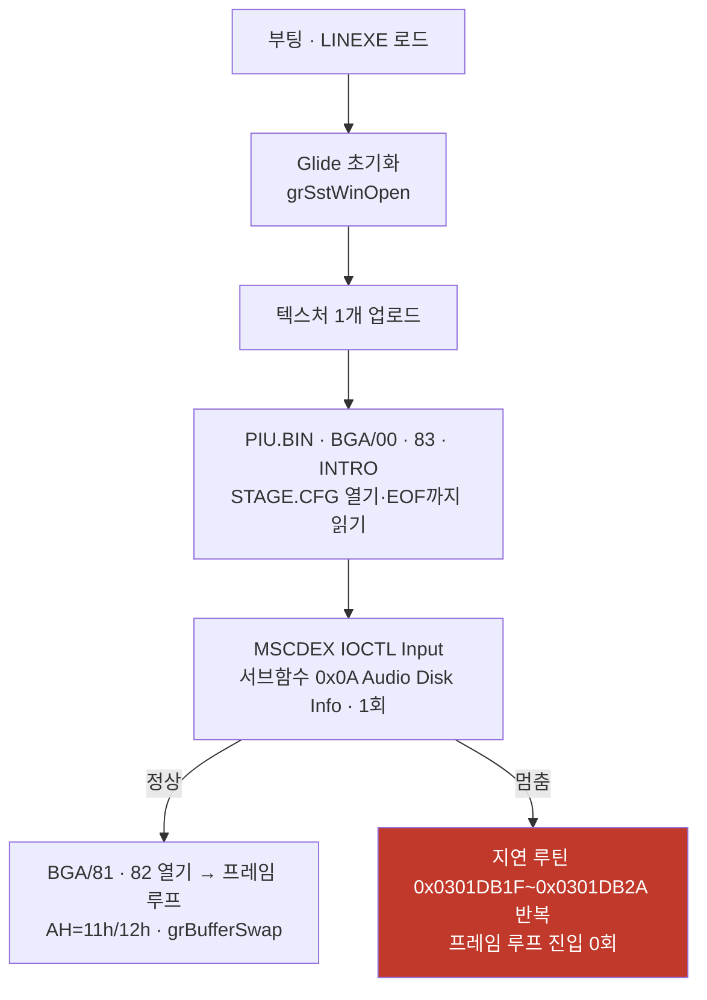

# pumpit3 기동 중 멈춤 / pumpit3 Startup Stall

사용자 보고(2026-08-04): **pumpit3가 실행 중 멈추며, 간혹 통과하지만 멈추면 늘 같은
위치**. 화면은 검은 화면이고 **아무리 기다려도 진행되지 않습니다.**

이 문서는 그 증상을 재현하고 좁힌 결과를 누적합니다. 반복 절차는
[pumpit3 멈춤 재현·판정 가이드](../guides/pumpit3-stall-reproduction.md)와
[실행 정지 지점 EIP census 가이드](../guides/execution-stall-eip-census.md)에 있고,
관련 축은 [현재 실행 frontier](current-execution-frontier.md)와
[pumpit3 bring-up](pumpit3-bring-up.md)에 있습니다.

## 요약

같은 빌드(v0.0.128)로 45초 7회, 240초 4회, 60초 6회 = **총 17회**를 측정해 **5회를
재현**했습니다(재현율 약 29%). 멈춘 실행의 서명은 **완전히 동일**합니다.



## 확인됨 1 — 느린 것이 아니라 **진짜 정지**입니다

240초 실행(45초의 5.3배)에서도 멈춘 실행은 `STAGE.CFG`에 머뭅니다.

| run | timeout | 격리 | 연 파일 | 프레임 | 마지막 파일 |
|---|---:|---:|---:|---:|---|
| long1 | 240s | 1 | 9 | 2,668 | `step\tasha_e2.NOT` |
| **long2** | 240s | 1 | **6** | **1** | **`stage.cfg`** |
| long3 | 240s | 0 | 14 | 6,766 | `bga\11.dat` |
| long4 | 240s | 0 | 14 | 6,846 | `bga\11.dat` |

사용자 관측("아무리 기다려도 진행 안 됨")과 일치합니다.

## 확인됨 2 — 멈춤 서명은 실행마다 완전히 같습니다

멈춘 5회(run6, run7, long2, hs4, hs5) 전부:

* 연 파일 **6개**, 마지막이 `stage.cfg`
* `_GRBUFFERSWAP@4` **0~1회** (검은 화면)
* 텍스처 업로드 **1개**(정상은 32개)
* AOT `publishes` **정확히 79** (정상은 199~204)
* `INT 21h AH=11h`/`12h` **0회** — 정상 실행은 이 쌍을 **프레임마다 1회씩** 부릅니다
  (1,361 / 1,393 / 1,401 / 1,823이 각각 프레임 수와 일치)

**"멈추면 늘 같은 위치"가 계측으로 확인됐습니다.**

## 확인됨 3 — 속도 문제가 아닙니다

멈춘 실행의 `INT 21h AH=2Ch`(시각 조회) 호출률이 **정상보다 높습니다.**

| run | 상태 | 시간 | `AH=2Ch` | 초당 |
|---|---|---:|---:|---:|
| long2 | 멈춤 | 240s | 268,383 | **1,118** |
| long3 | 정상 | 240s | 221,667 | 924 |

또한 지연 루틴 바깥의 게스트 코드는 **정상과 거의 같은 횟수**로 실행됩니다
(`0x030D395B` 113,989 대 115,814, `0x030D394B` 91,442 대 91,609,
`0x030CF17D` 890 대 890). 게스트는 **같은 양의 일을 하면서 진행만 못 합니다.**

## 확인됨 4 — AOT 페이지 격리는 원인이 아닙니다

**정상 실행도 같은 페이지를 같은 사유로 격리합니다.**

| run | 상태 | 격리 대상 |
|---|---|---|
| hs1 | 정상(1,824 프레임) | `0x0301DFFE` / page `0x0301D000` |
| long1 | 정상(2,668 프레임) | `0x0301DFFE` / page `0x0301D000` |
| hs4·hs5·run6·run7·long2 | **멈춤** | `0x0301DFFE` / page `0x0301D000` |

사유 문자열도 전부 `dynamic AOT entry was not active in the new image`로 같습니다
(Task 404 확인 4와 동일). **따라서 격리 자체는 갈림길이 아니며, 격리를 없애도 이
증상이 사라진다는 보장은 없습니다.**

## 확인됨 5 — 멈춘 동안 게스트는 지연 루틴을 single-step합니다

`REPIU_SINGLE_STEP_HOTSPOT_PROFILE=1` 덤프(hs4, 60초):

| 게스트 주소 | 표본 | 성격 |
|---|---:|---|
| `0x0301DB1F` | 1,726,284 | 200회 I/O 지연 루프 |
| `0x0301DB20` | 1,723,216 | 〃 |
| `0x0301DB2A` | 1,720,177 | 〃 |
| `0x0301DB22` | 1,720,094 | 〃 (`in ax,dx`) |
| `0x0301DB10`~`0x0301DB1D` | 각 13,173 | 루틴 prologue → **호출 13,173회** |

hs5도 같은 분포입니다(1.74M 대역). 격리된 페이지만 single-step되므로
**호출자는 캐시에서 실행되어 이 덤프에 나타나지 않습니다.** 그것이 다음 미확정입니다.

## 확인됨 6 — 예외 분류상 이상은 없습니다

멈춘 실행의 "other" 예외는 **전부 `0xC0000096`**(privileged instruction)이며
나눗셈 오류(`0xC0000094`)나 미분류 코드는 **0건**입니다. 즉 게스트 폴트로 인한
비정상 분기가 아니라 **정상 명령 흐름 안에서의 무한 대기**입니다.

## 정상 실행에서만 실행되는 코드

| 주소 | 정상 | 멈춤 | 해석 |
|---|---:|---:|---|
| `0x03011537`, `0x0301154E` | 1,823회(= 프레임 수) | **0** | 프레임 루프의 HLE 호출 |
| `0x030D1D8A` | 11,484 | 0 | |
| `0x030D4975`, `0x030D235A`, `0x030D1B6E` | 각 3,828 | 0 | |

## 방법론 주의 — 핫스팟 덤프의 "없음"은 "실행 안 됨"이 아닙니다

`Win32SingleStepHotspotProfile`은 **`HandleSingleStepTrace`가 실행될 때만** 기록합니다.
즉 **single-step trace가 켜진 구간의 명령만** 표본에 들어갑니다. 격리 모드에서는 격리된
페이지가 통째로 single-step되므로 그 페이지가 덤프를 지배하고, 캐시에서 도는 코드는
**실행되고 있어도 덤프에 나타나지 않습니다.**

따라서 두 덤프의 주소 집합을 빼는 방식으로 분석할 때:

* **"멈춤에만 있는 주소"는 대부분 무의미합니다.** 이번 분석에서 282개가 나왔는데 전부
  격리 페이지(`0x0301DBxx`)였고, 이는 "정상 실행에서 그 코드가 안 돈다"가 아니라
  "정상 실행에서는 캐시로 돌아 기록되지 않는다"는 뜻입니다.
* **"정상에만 있는 주소"는 의미가 있습니다.** 정상 실행에서 trace가 켜진 채 지나간
  코드를 멈춘 실행이 한 번도 밟지 않았다는 뜻이기 때문입니다.

이 구분을 놓치면 Task 408이 첫 표본 하나로 모집단을 판정했던 것과 같은 종류의 오류가
납니다.

## MSCDEX 요청 헤더 해독

`Win32 MSCDEX request ES/resolve kind/declines/reason/header`의 마지막 값은 DOS 장치
드라이버 요청 헤더 앞 4바이트를 리틀엔디언 32비트로 읽은 것입니다
(byte 0 길이, byte 1 subunit, byte 2 command, byte 3~4 status).

| 관측값 | 길이 | command | 의미 |
|---|---:|---|---|
| `0x0003001A` (멈춤) | 0x1A = 26 | `0x03` | IOCTL Input |
| `0x0085000D` (정상) | 0x0D = 13 | `0x85` | Stop Audio |

멈춘 실행의 마지막 MSCDEX 활동은 **IOCTL Input, 서브함수 `0x0A`(Audio Disk Info),
`handled=true`, 선언 길이 7**입니다.

## 다음 대상 (권장 순서)

1. **격리 페이지 진입 시 복귀 주소 기록.** 지연 루틴(`0x0301DB10`) 진입 시점의 스택
   최상단을 census에 남기면 **호출자를 직접 이름 붙일 수 있습니다.** 비용은 진입당
   게스트 읽기 한 번이고, 이미 있는 arena 진입 census 옆에 붙일 수 있습니다.
   히스토그램으로는 더 갈 수 없다는 것이 위 방법론 절의 결론입니다.
2. 그 호출자가 나오면 `repiu_aot_probe --dump`로 루프 본체를 디스어셈블해 **탈출
   조건**을 확정합니다(주소 변환은 아래 절).
3. 조건이 나오면 그때 설계 문서를 쓰고 수정에 들어갑니다.

**대안(해상도 낮음):** supervisor로 게스트 EIP를 주기 표본해 멈춤 전후를 비교합니다.
도구는 이미 있으나 어느 호출자인지까지는 좁히지 못할 가능성이 큽니다.

## 주소 변환 — 프로브와 실행이 베이스가 다릅니다

`repiu_aot_probe`는 이미지를 **`0x01000000`** 기준으로 매핑하고(entry `0x010D00A0`),
실행 시 arena base는 보통 **`0x03000000`** 입니다. 따라서

```
probe_address = live_address - 0x02000000
```

입니다. 변환을 빼면 `--dump`가 `mapped=false`만 돌려주므로 주의합니다. arena base가
`0x07000000`으로 잡힌 실행(부팅 크래시 모드)에서는 `-0x06000000`입니다.

## 미확정

* **지연 루틴을 13,173회 부르는 호출자와 그 탈출 조건.** 캐시에서 실행되므로 현재
  계측으로는 보이지 않습니다. 위 "다음 대상" 1번이 이것을 겨냥합니다.
* **무엇이 멈춤과 통과를 가르는가.** 격리 대상·사유가 같고 예외 분류도 정상이므로
  현재까지의 축으로는 갈리지 않습니다. `publishes`가 항상 정확히 79라는 점은 갈림이
  **결정적 지점 하나**에서 일어남을 시사하나, 그 지점은 아직 이름이 없습니다.
* `STAGE.CFG` 파싱 직후의 MSCDEX IOCTL `0x0A`(Audio Disk Info) 응답이 게스트 기대와
  맞는지. 멈춘 실행은 이 요청을 **1회**만 보내고 정상은 4~12회 보냅니다. 다만 이것이
  원인인지 결과인지는 **미확인**입니다.

---

# pumpit3 Startup Stall

User report (2026-08-04): **pumpit3 stalls during a run — it sometimes gets through, but
when it stalls it is always at the same place.** The screen is black and **it never
progresses no matter how long it is left.**

## Summary

Seventeen runs on build v0.0.128 — seven at 45 s, four at 240 s, six at 60 s —
reproduced it **five times** (about 29%), and the stalled runs share an **identical
signature**.

## Confirmed 1 — a true stop, not slowness

At 240 seconds, 5.3 times the 45-second baseline, the stalled run is still at
`STAGE.CFG` with one buffer swap, while the other three runs reach 2,668, 6,766, and
6,846 frames. This matches the user's report that waiting never helps.

## Confirmed 2 — the signature is identical every time

All five stalled runs open **six** files ending at `stage.cfg`, produce **zero or one**
`_GRBUFFERSWAP@4`, upload **one** texture against thirty-two, publish **exactly 79** AOT
generations against 199-204, and call `INT 21h AH=11h`/`12h` **zero** times — a pair
that healthy runs issue **once per frame** (1,361, 1,393, 1,401, and 1,823 matching
their frame counts). "Always the same place" is confirmed by measurement.

## Confirmed 3 — not a speed problem

The stalled run issues `INT 21h AH=2Ch` at **1,118 per second against a healthy 924**,
and the guest code outside the delay routine executes at nearly identical counts
(`0x030D395B` 113,989 against 115,814; `0x030CF17D` 890 against 890). The guest performs
the same amount of work and simply does not advance.

## Confirmed 4 — AOT page quarantine is not the cause

Healthy runs quarantine the **same page for the same reason** — `0x0301DFFE`, page
`0x0301D000`, `dynamic AOT entry was not active in the new image` — including runs that
reach 1,824 and 2,668 frames. Removing the quarantine is therefore not guaranteed to
remove this symptom.

## Confirmed 5 — during the stall the guest single-steps the delay routine

The hotspot dump puts 1.72 million samples on `0x0301DB1F`-`0x0301DB2A`, the
200-iteration I/O delay loop, with its prologue at `0x0301DB10`-`0x0301DB1D` showing
**13,173 calls**. Only the quarantined page is single-stepped, so **the caller runs from
the cache and is invisible here** — which is the next unresolved item.

## Confirmed 6 — no anomalous exception class

Every "other" exception in the stalled runs is `0xC0000096` (privileged instruction),
with **no** divide error and no unclassified code, so this is an infinite wait inside
normal instruction flow rather than a fault-driven detour.

## Method caveat — "absent from the dump" is not "not executed"

The hotspot profile records **only while `HandleSingleStepTrace` runs**, so it samples
just the instructions executed under an active single-step trace. Under quarantine the
quarantined page is stepped in full and dominates the dump, while code running from the
cache is **executed but never recorded**. Subtracting one dump's address set from
another therefore behaves asymmetrically: "addresses only in the stalled run" is mostly
meaningless — all 282 of them here were in the quarantined page, meaning only that
healthy runs execute that code from the cache — whereas "addresses only in the healthy
run" is meaningful, since it names code a stalled run never reached. Missing this
distinction produces the same class of error as Task 408's single-sample conclusion.

## Decoding the MSCDEX request header

The last field of the MSCDEX request log is the first four header bytes read as a
little-endian dword: length, subunit, command, status. The stalled runs end on
`0x0003001A` — length 26, command `0x03`, IOCTL Input — against `0x0085000D` in healthy
runs, which is length 13, command `0x85`, Stop Audio. The stalled run's final MSCDEX
activity is IOCTL Input subfunction `0x0A` (Audio Disk Info), handled, declared length 7.

## Next, in order

Record the **return address on entry to the quarantined page**, which names the caller
directly for one guest read per entry and fits beside the existing arena-entry census;
histograms cannot go further, for the reason in the method caveat. With the caller in
hand, disassemble the loop body through `repiu_aot_probe --dump` to settle the exit
condition, then write the design. A supervisor-based periodic EIP sample is the
lower-resolution alternative and probably will not identify the caller.

## Address conversion — the probe and the run use different bases

`repiu_aot_probe` maps the image at **`0x01000000`** (entry `0x010D00A0`) while a run
normally places the arena at **`0x03000000`**, so `probe_address = live_address -
0x02000000`; without the conversion `--dump` only answers `mapped=false`. When the arena
lands at `0x07000000` (the boot-crash mode) the offset is `0x06000000` instead.

## Unresolved

The caller that invokes the delay routine 13,173 times and its exit condition — the
target of the next step above; what actually separates a stalled run from a healthy one,
given that the quarantine target, reason, and exception classes are identical (the
constant 79 publishes suggests a single decisive point that has no name yet); and
whether the MSCDEX IOCTL `0x0A` (Audio Disk Info) answer issued just after `STAGE.CFG`
matches what the guest expects — stalled runs send that request **once** against four to
twelve in healthy runs, but whether that is cause or consequence is **unverified**.
