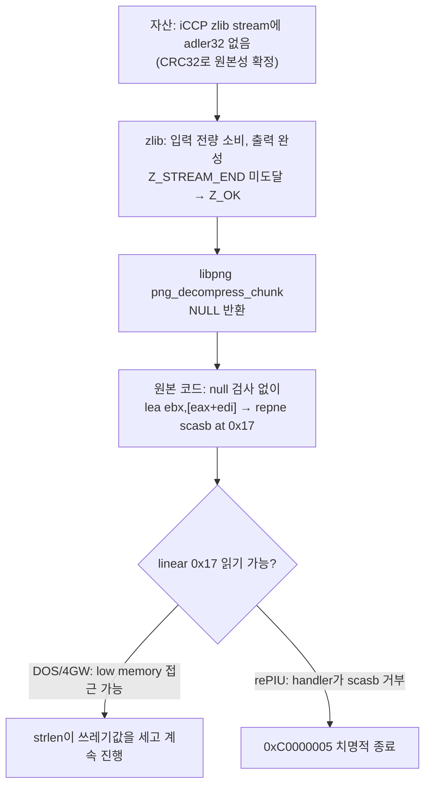

# pumpit8 BGA iCCP 종료 분석

## 확인됨

* ROM ZIP, CHD, `PIU/PIU.EXE`, JAMMA, PIU10, CAT702 초기화는 성공합니다.
* `BGA/083.DAT` 전체 390,039바이트를 정상적으로 읽은 뒤 `BR01_01.tga` 처리 중 종료됩니다.
* 원본 실행 파일에는 libpng `1.0.6` 문자열과 PNG chunk dispatcher가 포함되어 있습니다.
* dispatcher의 `iCCP` 분기에서 `0x010E5BE0`을 호출하며, 그 내부 압축 해제 보조 함수는
  `0x010E49F8`입니다.
* `+0xE49F8` 진입 인자는 PNG context `0x0525EC60`, chunk buffer `0x0526BCF0`, chunk length
  `0xA37`, compression method `0`, prefix length `0x17`입니다.
* `+0xE5D01`에서 보조 함수 반환값 `EAX`는 `0`입니다. 이어서 원본 코드는 prefix
  `0x17`을 더해 `EDI=0x17`을 만들고 `+0xE5D0D`의 `repne scasb`로 읽으면서
  `0xC0000005` 접근 위반을 일으킵니다.

## 추가 확인

입력 손상과 allocator 할당 실패는 배제되었습니다. 함수 진입 시 chunk buffer는
`Photoshop ICC profile\0`, compression method 0, `78 9C` zlib header 순서로 온전합니다.
반환 이후 앞 8바이트에 나타난 포인터 값은 실패 정리 과정에서 원본 chunk buffer를
해제한 뒤 기록된 free-list metadata입니다.

inflate의 마지막 관찰 상태는 다음과 같습니다.

| 필드 | 값 |
|---|---:|
| 반환 | `Z_OK (0)` |
| `avail_in` | 0 |
| `total_in` | `0xA20` (2,592) |
| `total_out` | `0xC48` (3,144) |
| `avail_out` | `0x13B8` |

오류 반환 분기는 실행되지 않았고 `Z_STREAM_END (1)`도 관찰되지 않았습니다. 출력의 첫
32바이트는 Windows `sRGB Color Space Profile.icm`의 첫 32바이트와 정확히 일치하며,
profile header의 자체 크기도 `0xC48`입니다. 즉 ICC 본문은 모두 만들어졌지만 zlib
datastream 종단 검증이 끝나지 않아 libpng helper가 null을 반환합니다. PNG iCCP의
compressed profile은 zlib datastream이어야 합니다
([PNG 1.1 chunk specification](https://www.libpng.org/pub/png/spec/1.1/PNG-Chunks.html)).

## chunk 추출과 독립 검증 (Task 474)

**확인됨.** `REPIU_EXECUTION_PROBE_DUMP_*`로 `+0xE49F8` 진입 시점의 chunk buffer
`0x0526BCF0`에서 `0xA37` 바이트 전체를 비침투적으로 추출해 host의 독립 zlib decoder로
검증했습니다. 진입 레지스터는 `EAX=ESI=0x0525EC60`(PNG context),
`EBX=EBP=0x0526BCF0`(chunk buffer), `ECX=0x00000A37`(chunk length),
`EDX=0`(compression method), `EDI=0x17`(prefix length)입니다.

| 항목 | 값 |
|---|---|
| chunk 전체 | 2,615 (`0xA37`) 바이트 |
| keyword | `Photoshop ICC profile` |
| compression method | 0 |
| prefix | 23 (`0x17`) 바이트 |
| compressed 필드 | 2,592 (`0xA20`) 바이트 |
| zlib header | `78 9C`, 유효 |
| inflate 출력 | 3,144 (`0xC48`) 바이트 |
| ICC 선언 크기 / signature | `0xC48` / `acsp` |
| deflate stream 종료 위치 | compressed 필드 offset 2,592 |
| adler32(출력) | `0xF784F3FB` |
| 마지막 4바이트 | `4F 9F 7E 13` |

**확인됨 (정확히 4바이트 부족).** deflate block은 완결되어 온전한 3,144바이트 sRGB ICC
profile을 만듭니다. compressed 필드를 2,590바이트(raw deflate)에서 한 바이트라도 줄이면
출력이 나오지 않으므로, deflate stream은 compressed 필드의 **마지막 바이트에서 정확히
끝납니다**. 따라서 zlib datastream이 요구하는 4바이트 adler32가 **전부 없습니다**. 마지막
4바이트는 adler32가 아니라 deflate 데이터의 일부입니다. 온전한 chunk라면 길이는 `0xA3B`,
compressed 필드는 `0xA24`여야 합니다.

이는 관측된 guest zlib 상태와 정확히 정합합니다. `avail_in`이 0이 되도록 2,592바이트를
모두 소비하고 출력은 완성했지만, 종단 검증에 필요한 4바이트가 없어 `Z_STREAM_END`에
도달하지 못하고 `Z_OK`로 끝납니다. 입력 손상이 아니라 **stream tail 결손**입니다.

**확인됨 (원본 자산은 정적 추출 불가).** `BGA/083.DAT`는 `RES\0` version 3 container이며
header 16바이트 뒤 payload 전체가 고엔트로피입니다. 파일 어디에도 PNG signature와 `iCCP`
문자열이 없습니다. PNG는 runtime에만 존재하므로 원본 대조는 정적 추출이 아니라 runtime
관측으로만 가능합니다.

## PNG 입력 경로 관측 (Task 474)

**확인됨.** `0x05180000`부터 1 MiB를 dump해 PNG signature와 `iCCP` chunk header를
검색했습니다. 결과는 PNG signature 1건, `iCCP` 1건입니다.

* `0x0526BC00`의 PNG signature 뒤 240바이트는 전부 0입니다. 즉 이것은 PNG stream 전체가
  아니라 libpng가 signature 8바이트만 읽어 둔 작은 buffer입니다.
* `0x0525ED7A`의 `iCCP`는 앞 4바이트가 0이며 png context 내부(`png_ptr+0x11A`)입니다. PNG
  stream의 chunk header가 아니라 libpng가 보관하는 현재 chunk 이름 필드입니다.
* chunk buffer `0x0526BCF0` 직전 heap header는 block size `0x0A41`을 담습니다. 요청
  `length+1 = 0xA38`과 정합합니다.

따라서 **PNG는 메모리에 통째로 존재하지 않고 read callback으로 streaming됩니다.** 1 MiB
창 안에 PNG stream 본체는 없습니다. png context 앞부분의 arena 포인터는
`+0x00=0x04027DB7`, `+0x0C=0x04A88418`, `+0x10=0x042B8640`, `+0x18=0x04027EBD`,
`+0x1C=0x051CE968`(guest stack)입니다.

## PNG stream 원본성 확정 (Task 474)

**확인됨.** png context `+0x0C`의 `0x04A88418`을 indirect dump 기점으로 1 MiB를 추출해
PNG stream 본체를 찾았습니다. `0x04B20318`에 PNG signature가 있고 chunk 구조는 다음과
같이 완전히 정합합니다.

| guest 주소 | chunk | length |
|---|---|---:|
| `0x04B20320` | `IHDR` | 13 (`0xD`) |
| `0x04B20339` | `iCCP` | 2,615 (`0xA37`) |
| `0x04B20D7C` | `gAMA` | 4 |
| `0x04B20D8C` | `cHRM` | 32 (`0x20`) |
| `0x04B20DB8` | `IDAT` | 23,935 (`0x5D7F`) |

IHDR은 256×256, bit depth 8, color type 6입니다. **PNG stream의 chunk length 필드 자체가
`0xA37`입니다.** 따라서 앞 절의 원인 1(길이 전달 오류)은 배제됩니다.

**확인됨 (CRC32 일치).** `iCCP` chunk의 저장된 CRC32는 `0x8FC1BA08`이고, chunk type
`iCCP`와 2,615바이트 데이터로 계산한 CRC32도 `0x8FC1BA08`입니다. libpng가 복사해 간 chunk
buffer 내용도 stream 바이트와 완전히 동일합니다. 즉 **이 chunk는 작성된 그대로 메모리에
도달했습니다.** 어느 단계에서든 4바이트가 유실됐다면 CRC는 깨집니다.

**확인됨 (rePIU 자료 이동은 정상).** `BGA/083.DAT` 파일 read는 4096 + 385,536 + 407 =
390,039바이트로 완전하며 오류 0건입니다(마지막 short read는 정상 EOF). RES 복호화와 PNG
streaming도 CRC로 검증됩니다. 따라서 **자산 손상 원인은 rePIU에 없습니다.** 원본 자산의
`iCCP` compressed profile이 adler32 없이 작성된 것입니다. 같은 1 MiB 창의 PNG signature
7건 중 `iCCP`를 가진 것은 이 1건뿐이므로, 이 자산에 국한된 작성 시점 결함입니다.

**확인됨 (원본 코드에 null 검사 없음).** `repiu_aot_probe`로 호출 지점을 정적 역어셈블한
결과는 다음과 같습니다.

```
0x010E5CFC  call 0x010E49F8        ; png_decompress_chunk -> NULL
0x010E5D01  mov  ebp, eax
0x010E5D03  lea  ebx, [eax+edi*1]  ; 0 + 0x17
0x010E5D06  mov  edi, ebx
0x010E5D08  sub  ecx, ecx
0x010E5D0A  dec  ecx
0x010E5D0B  xor  eax, eax
0x010E5D0D  repne scasb            ; strlen(0x17)
0x010E5D20  call 0x010E9088        ; png_set_iCCP
```

`call`과 fault 사이에 조건 분기가 없습니다. 즉 null 반환 시 linear `0x17`을 읽는 것은
원본 코드의 결정적 동작이며, rePIU의 분기 오역이 아닙니다.

**확인됨 (rePIU 측 결함 위치).** rePIU에는 이미 64 KiB 미만 guest 주소 읽기를 VEH로
대행하는 `HandleGuestLowMemoryReadFault`가 있습니다. 그러나 이 handler는 `MOV`, `MOVZX`,
`MOVSX`만 처리하고 그 외 mnemonic은 stage 4로 거부합니다. `repne scasb`는 여기서 거부되어
접근 위반이 처리되지 않은 채 치명적 종료로 이어집니다.



## 추정

DOS/4GW의 zero-base flat selector에서 linear `0x17`은 low DOS memory(IVT 영역)에 해당해
읽기 가능합니다. 원본 하드웨어에서는 `repne scasb`가 그 영역을 훑어 임의의 길이를 만든 뒤
`png_set_iCCP`로 진행하므로 종료되지 않았을 가능성이 높습니다. rePIU가 low memory 읽기
대행 facility를 이미 갖고 있다는 사실 자체가 guest가 low memory를 읽는다는 선행 관측의
근거입니다. 다만 원본 실행 환경에서 이 지점이 실제로 통과한다는 것은 아직 직접 관측으로
확정되지 않았습니다.

## 해소 (Task 475)

**확인됨.** `SCAS`, `LODS`, `CMPS`의 low memory 읽기를 대행하는
`ServiceGuestLowMemoryStringInstruction`을 추가한 뒤 이 종료가 사라졌습니다.

| 항목 | 값 |
|---|---|
| string 대행 횟수 / 반복 수 | 2,522 / 2,522 |
| 마지막 EIP | `0x040E5D0D` (runtime base + `0xE5D0D`) |
| 마지막 주소 | `0x00000017` |
| 마지막 mnemonic | `SCASB` |
| 회당 반복 수 | 1 |
| 예외 발생 | 0건 |

대행 횟수와 반복 수가 같습니다. low memory image가 0으로 초기화되어 있어 `repne scasb`가
첫 바이트에서 `ZF=1`로 종료되고 길이 0을 만들기 때문이며, 설계에서 예상한 그대로입니다.
원본이 IVT를 훑어 임의의 길이를 만들었을 동작과 같은 성격으로, 이 경로가 렌더링 결과에
영향을 주지 않는다는 점도 정합합니다.

실행은 `BGA/083.DAT`를 지나 `AUDIO/004.AUD`까지 진행했고, SDL 창은 약 6.9 FPS로
렌더링했습니다(Debug 빌드). 종료는 접근 위반이 아니라 관측을 끝내기 위한 SDL 종료
요청이었습니다. `MOV` 경로 계수는 수정 전후 모두 0이므로 기존 경로 동작은 바뀌지
않았습니다.

이 지점이 닫혔을 뿐이며 게임 전체가 완주 가능하다는 뜻은 아닙니다. 이후 구간은 별도
관측 대상입니다.

# pumpit8 BGA iCCP Crash Analysis

## Confirmed

* ROM ZIP, CHD, `PIU/PIU.EXE`, JAMMA, PIU10, and CAT702 initialization all succeed.
* Execution reads all 390,039 bytes of `BGA/083.DAT` and terminates while processing
  `BR01_01.tga`.
* The original executable contains the libpng `1.0.6` version string and a PNG chunk dispatcher.
* Its `iCCP` branch calls `0x010E5BE0`; the nested decompression helper is `0x010E49F8`.
* At `+0xE49F8`, the inputs are PNG context `0x0525EC60`, chunk buffer `0x0526BCF0`, chunk length
  `0xA37`, compression method `0`, and prefix length `0x17`.
* At `+0xE5D01`, the helper return in `EAX` is zero. The original code then adds prefix `0x17`,
  forms `EDI=0x17`, and faults with `0xC0000005` while `repne scasb` at `+0xE5D0D` reads it.

## Additional Confirmation

Input corruption before the helper and allocation failure are excluded. At entry, the chunk buffer
contains an intact `Photoshop ICC profile` keyword, compression method 0, and `78 9C` zlib header.
The pointer-like first eight bytes seen after return are free-list metadata written after the helper
releases the old chunk buffer during failure cleanup.

The last observed inflate state is `Z_OK`, `avail_in=0`, `total_in=0xA20`,
`total_out=0xC48`, and `avail_out=0x13B8`. Neither an error-result branch nor `Z_STREAM_END` is
observed. The first 32 output bytes exactly match the Windows 3,144-byte
`sRGB Color Space Profile.icm`, including its `0xC48` profile size. The ICC payload is therefore
fully produced, but zlib datastream termination is not validated and the libpng helper returns
null. The PNG specification requires the iCCP compressed profile to be a zlib datastream
([PNG 1.1 chunk specification](https://www.libpng.org/pub/png/spec/1.1/PNG-Chunks.html)).

## Chunk Extraction and Independent Validation (Task 474)

**Confirmed.** `REPIU_EXECUTION_PROBE_DUMP_*` non-invasively extracted all `0xA37` bytes from the
chunk buffer at `0x0526BCF0` on entry to `+0xE49F8`, and an independent host zlib decoder validated
them. Entry registers are `EAX=ESI=0x0525EC60` (PNG context), `EBX=EBP=0x0526BCF0` (chunk buffer),
`ECX=0x00000A37` (chunk length), `EDX=0` (compression method), and `EDI=0x17` (prefix length).

| Item | Value |
|---|---|
| Whole chunk | 2,615 (`0xA37`) bytes |
| Keyword | `Photoshop ICC profile` |
| Compression method | 0 |
| Prefix | 23 (`0x17`) bytes |
| Compressed field | 2,592 (`0xA20`) bytes |
| zlib header | `78 9C`, valid |
| Inflate output | 3,144 (`0xC48`) bytes |
| ICC declared size / signature | `0xC48` / `acsp` |
| Deflate stream end | compressed-field offset 2,592 |
| adler32(output) | `0xF784F3FB` |
| Last four bytes | `4F 9F 7E 13` |

**Confirmed (short by exactly four bytes).** The deflate blocks complete and produce the intact
3,144-byte sRGB ICC profile. Removing even one byte from the 2,590-byte raw deflate field yields no
output, so the deflate stream ends **exactly on the last byte of the compressed field**. The
four-byte adler32 a zlib datastream requires is therefore **entirely absent**; the trailing four
bytes are deflate data, not a checksum. An intact chunk would be `0xA3B` long with an `0xA24`
compressed field.

This matches the observed guest zlib state exactly: it consumes all 2,592 bytes to `avail_in == 0`
and finishes the output, but lacks the four bytes needed to validate termination, so it ends in
`Z_OK` rather than `Z_STREAM_END`. The defect is a missing stream tail, not corrupted input.

**Confirmed (the original asset cannot be extracted statically).** `BGA/083.DAT` is a `RES\0`
version-3 container whose entire payload after the 16-byte header is high-entropy. The file
contains no PNG signature and no `iCCP` string anywhere. The PNG exists only at runtime, so
comparison against the original requires runtime observation rather than static extraction.

## PNG Input Path Observation (Task 474)

**Confirmed.** A 1 MiB dump from `0x05180000` was searched for PNG signatures and `iCCP` chunk
headers, finding one of each.

* The 240 bytes following the PNG signature at `0x0526BC00` are all zero, so this is not the PNG
  stream but a small buffer into which libpng read only the 8-byte signature.
* The `iCCP` at `0x0525ED7A` is preceded by four zero bytes and lies inside the png context at
  `png_ptr+0x11A`. It is libpng's stored current-chunk-name field, not a chunk header in the PNG
  stream.
* The heap header immediately before chunk buffer `0x0526BCF0` carries block size `0x0A41`,
  consistent with the requested `length+1 = 0xA38`.

The PNG therefore **does not exist as one contiguous memory image; it is streamed through a read
callback.** No PNG stream body is present in the 1 MiB window. The arena pointers early in the png
context are `+0x00=0x04027DB7`, `+0x0C=0x04A88418`, `+0x10=0x042B8640`, `+0x18=0x04027EBD`, and
`+0x1C=0x051CE968` (guest stack).

## PNG Stream Authenticity Established (Task 474)

**Confirmed.** An indirect dump based at `0x04A88418` (png context `+0x0C`) extracted 1 MiB
containing the PNG stream body. A PNG signature sits at `0x04B20318` and the chunk structure is
fully consistent.

| Guest address | Chunk | Length |
|---|---|---:|
| `0x04B20320` | `IHDR` | 13 (`0xD`) |
| `0x04B20339` | `iCCP` | 2,615 (`0xA37`) |
| `0x04B20D7C` | `gAMA` | 4 |
| `0x04B20D8C` | `cHRM` | 32 (`0x20`) |
| `0x04B20DB8` | `IDAT` | 23,935 (`0x5D7F`) |

IHDR is 256×256, bit depth 8, color type 6. **The PNG stream's own chunk length field reads
`0xA37`**, which eliminates cause 1 from the previous section.

**Confirmed (CRC32 matches).** The `iCCP` chunk's stored CRC32 is `0x8FC1BA08`, and the CRC32
computed over the chunk type `iCCP` plus its 2,615 data bytes is also `0x8FC1BA08`. The chunk
buffer libpng copied out is byte-identical to the stream. **The chunk therefore reached memory
exactly as authored** — any four-byte loss at any stage would break the CRC.

**Confirmed (rePIU data movement is sound).** The `BGA/083.DAT` reads total 4096 + 385,536 + 407 =
390,039 bytes with zero errors, the final short read being ordinary EOF. RES decryption and PNG
streaming are validated by the CRC. **The asset defect does not originate in rePIU**: the original
asset's `iCCP` compressed profile was written without its adler32. Of the seven PNG signatures in
the same 1 MiB window only this one carries an `iCCP` chunk, so this is an authoring-time defect
specific to this asset.

**Confirmed (the original code has no null check).** Static disassembly of the call site with
`repiu_aot_probe` gives:

```
0x010E5CFC  call 0x010E49F8        ; png_decompress_chunk -> NULL
0x010E5D01  mov  ebp, eax
0x010E5D03  lea  ebx, [eax+edi*1]  ; 0 + 0x17
0x010E5D06  mov  edi, ebx
0x010E5D08  sub  ecx, ecx
0x010E5D0A  dec  ecx
0x010E5D0B  xor  eax, eax
0x010E5D0D  repne scasb            ; strlen(0x17)
0x010E5D20  call 0x010E9088        ; png_set_iCCP
```

No conditional branch separates the call from the fault. Reading linear `0x17` on a null return is
therefore deterministic original behavior, not a rePIU branch mistranslation.

**Confirmed (where the rePIU defect is).** rePIU already services guest reads below 64 KiB through
`HandleGuestLowMemoryReadFault` in the VEH. That handler accepts only `MOV`, `MOVZX`, and `MOVSX`,
rejecting every other mnemonic at stage 4. `repne scasb` is rejected there, so the access violation
goes unhandled and terminates the run.

## Inferred

Under DOS/4GW's zero-based flat selector, linear `0x17` falls in low DOS memory (the interrupt
vector table) and is readable. On original hardware the `repne scasb` would scan that region,
produce an arbitrary length, and proceed into `png_set_iCCP` without terminating. That rePIU
already carries a low-memory read-servicing facility is itself evidence from earlier work that this
guest reads low memory. That this specific site passes in the original environment is not yet
confirmed by direct observation.

## Resolved (Task 475)

**Confirmed.** Adding `ServiceGuestLowMemoryStringInstruction`, which services `SCAS`, `LODS`, and
`CMPS` reads of low memory, removes this termination.

| Item | Value |
|---|---|
| String services / iterations | 2,522 / 2,522 |
| Last EIP | `0x040E5D0D` (runtime base + `0xE5D0D`) |
| Last address | `0x00000017` |
| Last mnemonic | `SCASB` |
| Iterations per service | 1 |
| Exceptions raised | 0 |

Services and iterations are equal because the low-memory image is zero-initialized, so the
`repne scasb` terminates on its first byte with `ZF=1` and yields a length of zero — exactly as the
design predicted. This matches the character of the original scanning the IVT for an arbitrary
length, and is consistent with the path having no effect on rendering output.

Execution proceeded past `BGA/083.DAT` as far as `AUDIO/004.AUD`, with the SDL window rendering at
roughly 6.9 FPS on the Debug build. The run ended on an SDL exit request issued to stop the
observation, not on an access violation. The `MOV` path counter is zero both before and after the
change, so that path's behavior is unaltered.

Only this site is closed; it does not mean the whole game can be completed. Later stages remain
separate observation targets.
