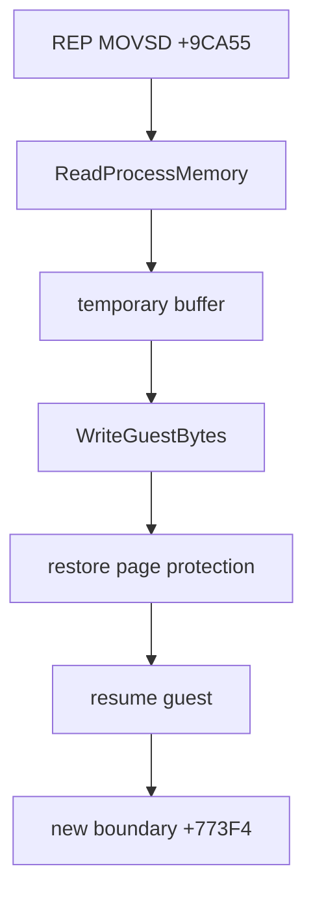

# REP MOVS와 장시간 실행 경계 / REP MOVS and Long-Runtime Boundary

## 확인됨 / Confirmed

약 340초 실행에서 object 2 `+0x9CA55`의 `F2 A5` (`REP MOVSD`)가 source `0x03716B20`, destination `0x045C6000`, 잔여 680바이트를 복사하다 host 접근 위반을 일으켰습니다. VEH 안의 직접 `memmove`는 같은 VEH를 재진입시켜 process가 `0xC0000005`로 종료됐습니다.

임시 버퍼를 통한 `ReadProcessMemory`와 page 보호를 임시 변경하는 `WriteGuestBytes` 조합으로 재진입을 제거했습니다. 동일 위치는 더 이상 copy failure로 종료되지 않았으며 실행은 이후 object 2 `+0x773F4`까지 진행했습니다.

At about 340 seconds, object 2 `+0x9CA55`, `F2 A5` (`REP MOVSD`), copied 680 bytes from `0x03716B20` to `0x045C6000`. A direct `memmove` inside the VEH recursively reentered the handler and terminated the process with `0xC0000005`.

The temporary-buffer path now reads with `ReadProcessMemory` and writes with `WriteGuestBytes`, which temporarily changes page protection. Execution then reaches the later object 2 boundary at `+0x773F4`.

## 추정 / Inferred

새 경계는 `8B 46 34` (`MOV EAX,[ESI+34h]`)이며 당시 `ESI=0x041B6B50`입니다. allocator 관련 포인터도 8 MiB arena 끝 `0x045D7000`에 가까운 `0x045D3EB0`까지 진행했습니다. arena 소진, 해제되지 않은 allocation, page protection 불일치가 후보지만 아직 확정하지 않았습니다.

The new boundary is `8B 46 34` (`MOV EAX,[ESI+34h]`) with `ESI=0x041B6B50`. An allocator-related pointer was near the 8 MiB arena end (`0x045D3EB0` versus `0x045D7000`). Arena exhaustion, unreleased allocation, and page-protection mismatch remain candidates.

## 미확정 / Unresolved

fault 주소를 VEH 공유 telemetry에서 직접 기록하려는 계측은 초기 실행에 `0x80000001` 회귀를 만들어 채택하지 않았습니다. 다음 단계는 VEH hot path 밖의 crash snapshot 또는 allocator high-water/free 추적 중 하나를 선택해야 합니다.

Publishing the fault address directly from the VEH introduced an early `0x80000001` regression and was rejected. The next step is either a crash snapshot outside the VEH hot path or allocator high-water/free tracing.

## 2026-07-12 allocator 계측 제약 / Allocator instrumentation constraint

`ThreadContext`는 이미 큰 고정 trace ring을 포함하며 host stack에 생성됩니다. 여기에 누적 필드를 추가하거나 VEH hot path의 stack frame을 키우는 계측은 초기 약 0.4~0.8초에 `0x80000001` 종료를 반복 재현했습니다. 따라서 해당 계측은 제거했고 shared ABI도 version 8로 유지했습니다.

supervisor가 child handle에 대해 `VirtualQueryEx`와 `ReadProcessMemory`를 수행하는 외부 snapshot을 구현했습니다. 이 방식은 guest VEH를 변경하지 않으며 `+0x873F4` 도달 시 `ESI+34h`의 commit/protection/value를 출력합니다. 다만 현재 새 Debug build가 계측 제거 후에도 초기 `0x80000001`을 보이므로, allocator 결론 전에 이 host guard-page 회귀의 provenance를 분리해야 합니다.

`ThreadContext` already contains large fixed trace rings and lives on the host stack. Adding accumulator fields or increasing the VEH hot-path frame repeatedly caused an early `0x80000001` termination, so that instrumentation was removed and shared ABI version 8 retained.

The supervisor now performs an external `VirtualQueryEx`/`ReadProcessMemory` snapshot at `+0x873F4`. It does not modify the guest VEH. However, the newly rebuilt Debug worker still terminates with early `0x80000001` even after in-VEH instrumentation is removed, so the host guard-page provenance must be separated before drawing an allocator conclusion.

## 2026-07-12 host debug-print 수정 후 6분 관찰 / Six-minute result after host debug-print fix

**확인됨:** 초기 종료의 직접 원인은 allocator가 아니라 host `DBG_PRINTEXCEPTION_C (0x40010006)`를 guest VEH가 잘못 소유한 것이었습니다. host EIP의 debug-print exception을 소비하도록 수정한 뒤 일반 실행은 341초를 통과했고 heartbeat는 369초에 `129,015,370`까지 계속 증가했습니다. 이전 `+0x873F4` 경계와 REP MOVS failure는 재현되지 않았습니다.

369초의 새 `0xC0000005`는 supervisor 370초 제한보다 1초 짧게 설정된 loader 내부 timeout과 일치합니다. 마지막 guest EIP는 object 2 `+0xE43CE`이고 dispatch entry/exit는 균형입니다. 따라서 현재 증거는 8 MiB arena 소진보다 `TerminateThread` 기반 timeout 정리와 VEH/host call 상태의 경합을 가리킵니다.

**Confirmed:** The early exit was caused by the guest VEH incorrectly owning host `DBG_PRINTEXCEPTION_C (0x40010006)`, not by allocator exhaustion. After consuming host debug-print exceptions, normal execution passed 341 seconds and heartbeat reached `129,015,370` at 369 seconds. Neither the old `+0x873F4` boundary nor a REP MOVS failure recurred.

The new `0xC0000005` at 369 seconds coincides with the loader timeout configured one second before the supervisor timeout. The last guest EIP is object 2 `+0xE43CE`, with balanced dispatch counts. Evidence now points to timeout cleanup racing `TerminateThread` against VEH/host-call state, rather than exhaustion of the configured arena.

## Supervisor timeout 전환 검증 / Supervisor timeout verification

**확인됨:** loader timeout을 완전히 비활성화한 375초 실행은 이전 369초 경계를 통과했습니다. heartbeat는 `132,954,212`, dispatch entry/exit는 `66,477,106/66,477,106`으로 균형이었으며 supervisor가 process 전체를 exit 124로 종료했습니다. 따라서 369초의 process access violation은 guest allocator나 고정 실행 경계가 아니라 loader의 `TerminateThread` teardown 경합이었습니다.

**Confirmed:** With loader timeout fully disabled, a 375-second run passed the former 369-second boundary. Heartbeat reached `132,954,212`, dispatch remained balanced at `66,477,106/66,477,106`, and the supervisor terminated the whole process with exit 124. The former access violation was therefore a loader `TerminateThread` teardown race, not allocator exhaustion or a fixed guest boundary.
