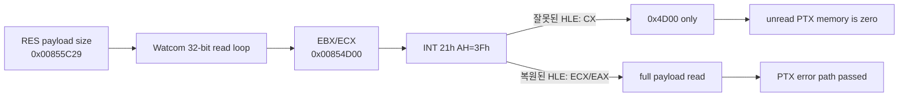

# RES/PTX resource loading 분석 / RES/PTX Resource Loading Analysis

## 확인된 실행 흐름

**확인됨:** `Not PTX file`은 object 2 `+0xDDC98`의 memory PTX loader에서 발생한다. loader는 입력 16바이트를 stack에 복사한 뒤 `PTX\0` magic과 version word `0x0100`을 검사한다. error printer는 반환하지 않고 Watcom `exit(-1)`로 연결된다. 종료 stack의 return address는 `+0xDDD2B`, runtime error path `+0xDF884`, runtime cleanup `+0xE52D8`이다.

입력 pointer는 `0x03BB6AE9`, caller는 `+0xE1DC9`이다. 상위 caller의 문자열은 `hfont1.tga`, `hfont2.tga`이며 `PIU.DAT` table에는 대응하는 `HFONT1.PTX`, `HFONT2.PTX`가 있다. 두 entry의 실제 payload는 각각 absolute `0x27B499`, `0x28AE4B`에서 정상 `PTX\0` header를 가진다.

archive buffer base는 pointer와 file offset으로부터 `0x0393B650`으로 역산된다. `0x0393B650 + 0x27B499 = 0x03BB6AE9`이므로 entry pointer 계산은 정확하다. 그러나 file-I/O ring은 archive가 `0x8600`까지만 읽혔음을 보여 주며 pointer 위치는 zero-filled reserve에 남는다.

`PIU.DAT` header의 payload size는 `0x00855C29`이지만 실제 payload read는 `0x5C00`이다. table/header `0x2A00`을 더하면 최종 file position `0x8600`이 된다. 이는 payload size의 low 16-bit `0x5C29`만 read loop에 전달된 패턴과 일치한다.

## 미확정

상위 16비트가 사라지는 정확한 명령과 원인은 아직 미확정이다. 후보는 RES loader 내부의 size 전달, Watcom read wrapper ABI, 또는 관련 guest instruction HLE이다. 다음 단계는 `0x00855C29` consumer에서 DOS read loop까지 size provenance를 정적으로 복원하는 것이다.

## Confirmed execution flow

**Confirmed:** `Not PTX file` comes from the memory PTX loader at object 2 `+0xDDC98`. It copies 16 input bytes, checks `PTX\0` and version `0x0100`, and calls a non-returning error printer that reaches Watcom `exit(-1)`. Termination-stack return addresses are `+0xDDD2B`, runtime error path `+0xDF884`, and runtime cleanup `+0xE52D8`.

The input pointer is `0x03BB6AE9`, called from `+0xE1DC9`. Higher frames reference `hfont1.tga` and `hfont2.tga`; the archive contains `HFONT1.PTX` and `HFONT2.PTX` with valid headers at absolute file offsets `0x27B499` and `0x28AE4B`.

The archive buffer base is `0x0393B650`, and `base + 0x27B499` equals the observed input pointer, proving entry-pointer arithmetic is correct. Earlier runs read only through `0x8600`, leaving the distant entry zero-filled.

## 32-bit DOS/4GW read ABI 복원 / Restored 32-bit DOS/4GW Read ABI

**확인됨:** read #26의 `INT 21h AH=3Fh` 진입 EIP는 `0x030F87B7`이고, 호출 반환 주소는 `0x030F53F3`입니다. 진입 스택에는 요청 후보 `0x00854D00`, 전체 payload 크기 `0x00855C29`, 목적지 `0x0393F050`이 동시에 남아 있었습니다. 따라서 RES parser나 Watcom 상위 호출부에서 크기가 16비트로 잘린 것이 아닙니다.

원본 wrapper는 `mov ecx, ebx; mov ah, 3fh; int 21h`를 실행하고 이후 32-bit `EAX`를 검사합니다. 상위 loop도 반환된 `EAX`를 32-bit remaining count에서 뺍니다. HLE만 `ECX & 0xffff`와 16-bit `AX` 반환을 사용하고 있었으므로, 첫 큰 요청을 `0x4D00`으로 축소하고 다음 반복을 0-byte read로 만들었습니다.

**검증됨:** `ECX` 전체를 요청 크기로 사용하고 실제 읽은 바이트 수를 `EAX` 전체에 반환하자 `Not PTX file` 및 `exit(-1)` 경로가 사라졌습니다. 40초 관찰 동안 원본 실행은 종료하지 않고 약 420만 dispatch와 지속적인 heartbeat/progress를 보였습니다. 이는 PIU.DAT 전용 우회가 아니라 DOS/4GW 보호 모드 file-read ABI 복원입니다.

**Confirmed:** At read #26, the `INT 21h AH=3Fh` entry EIP was `0x030F87B7`, with return address `0x030F53F3`. The stack simultaneously retained request candidate `0x00854D00`, full payload size `0x00855C29`, and destination `0x0393F050`, disproving an earlier 16-bit truncation in the RES parser or upper Watcom caller.

The original wrapper executes `mov ecx, ebx; mov ah, 3fh; int 21h` and consumes a 32-bit `EAX` result. Its caller subtracts that result from a 32-bit remaining count. Only the HLE reduced the request to `ECX & 0xffff` and returned a 16-bit `AX`. Restoring full `ECX/EAX` removes the `Not PTX file`/`exit(-1)` path. A 40-second observation remained live for roughly 4.2 million dispatches with continuing heartbeat and progress, without adding archive-specific behavior.
