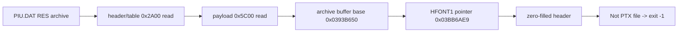
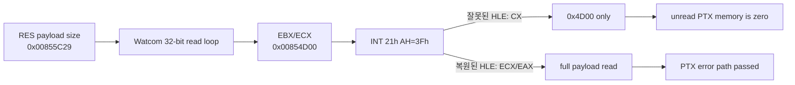
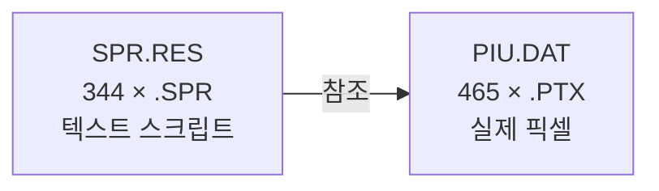

# RES/PTX resource loading 분석 / RES/PTX Resource Loading Analysis

## 확인된 실행 흐름


```mermaid
flowchart LR
    D[PIU.DAT RES archive] --> H[header/table 0x2A00 read]
    H --> P[payload 0x5C00 read]
    P --> B[archive buffer base 0x0393B650]
    B --> F[HFONT1 pointer 0x03BB6AE9]
    F --> Z[zero-filled header]
    Z --> E[Not PTX file -> exit -1]
```

**확인됨:** `Not PTX file`은 object 2 `+0xDDC98`의 memory PTX loader에서 발생한다. loader는 입력 16바이트를 stack에 복사한 뒤 `PTX\0` magic과 version word `0x0100`을 검사한다. error printer는 반환하지 않고 Watcom `exit(-1)`로 연결된다. 종료 stack의 return address는 `+0xDDD2B`, runtime error path `+0xDF884`, runtime cleanup `+0xE52D8`이다.

입력 pointer는 `0x03BB6AE9`, caller는 `+0xE1DC9`이다. 상위 caller의 문자열은 `hfont1.tga`, `hfont2.tga`이며 `PIU.DAT` table에는 대응하는 `HFONT1.PTX`, `HFONT2.PTX`가 있다. 두 entry의 실제 payload는 각각 absolute `0x27B499`, `0x28AE4B`에서 정상 `PTX\0` header를 가진다.

archive buffer base는 pointer와 file offset으로부터 `0x0393B650`으로 역산된다. `0x0393B650 + 0x27B499 = 0x03BB6AE9`이므로 entry pointer 계산은 정확하다. 그러나 file-I/O ring은 archive가 `0x8600`까지만 읽혔음을 보여 주며 pointer 위치는 zero-filled reserve에 남는다.

`PIU.DAT` header의 payload size는 `0x00855C29`이지만 실제 payload read는 `0x5C00`이다. table/header `0x2A00`을 더하면 최종 file position `0x8600`이 된다. 이는 payload size의 low 16-bit `0x5C29`만 read loop에 전달된 패턴과 일치한다.

## 미확정

상위 16비트가 사라지는 정확한 명령과 원인은 아직 미확정이다. 후보는 RES loader 내부의 size 전달, Watcom read wrapper ABI, 또는 관련 guest instruction HLE이다. 다음 단계는 `0x00855C29` consumer에서 DOS read loop까지 size provenance를 정적으로 복원하는 것이다.

## Confirmed execution flow

**Confirmed:** `Not PTX file` comes from the memory PTX loader at object 2 `+0xDDC98`. It copies 16 input bytes, checks `PTX\0` and version `0x0100`, and calls a non-returning error printer that reaches Watcom `exit(-1)`. Termination-stack return addresses are `+0xDDD2B`, runtime error path `+0xDF884`, and runtime cleanup `+0xE52D8`.

The input pointer is `0x03BB6AE9`, called from `+0xE1DC9`. Higher frames reference `hfont1.tga` and `hfont2.tga`; the archive contains `HFONT1.PTX` and `HFONT2.PTX` with valid headers at absolute file offsets `0x27B499` and `0x28AE4B`.

The archive buffer base is `0x0393B650`, and `base + 0x27B499` equals the observed input pointer, proving entry-pointer arithmetic is correct. Earlier runs read only through `0x8600`, leaving the distant entry zero-filled.

## 32-bit DOS/4GW read ABI 복원 / Restored 32-bit DOS/4GW Read ABI

**확인됨:** read #26의 `INT 21h AH=3Fh` 진입 EIP는 `0x030F87B7`이고, 호출 반환 주소는 `0x030F53F3`입니다. 진입 스택에는 요청 후보 `0x00854D00`, 전체 payload 크기 `0x00855C29`, 목적지 `0x0393F050`이 동시에 남아 있었습니다. 따라서 RES parser나 Watcom 상위 호출부에서 크기가 16비트로 잘린 것이 아닙니다.

원본 wrapper는 `mov ecx, ebx; mov ah, 3fh; int 21h`를 실행하고 이후 32-bit `EAX`를 검사합니다. 상위 loop도 반환된 `EAX`를 32-bit remaining count에서 뺍니다. HLE만 `ECX & 0xffff`와 16-bit `AX` 반환을 사용하고 있었으므로, 첫 큰 요청을 `0x4D00`으로 축소하고 다음 반복을 0-byte read로 만들었습니다.


```mermaid
flowchart LR
    SIZE[RES payload size<br/>0x00855C29] --> LOOP[Watcom 32-bit read loop]
    LOOP --> REQ[EBX/ECX<br/>0x00854D00]
    REQ --> INT[INT 21h AH=3Fh]
    INT -->|잘못된 HLE: CX| SHORT[0x4D00 only]
    INT -->|복원된 HLE: ECX/EAX| FULL[full payload read]
    SHORT --> ZERO[unread PTX memory is zero]
    FULL --> NEXT[PTX error path passed]
```

**검증됨:** `ECX` 전체를 요청 크기로 사용하고 실제 읽은 바이트 수를 `EAX` 전체에 반환하자 `Not PTX file` 및 `exit(-1)` 경로가 사라졌습니다. 40초 관찰 동안 원본 실행은 종료하지 않고 약 420만 dispatch와 지속적인 heartbeat/progress를 보였습니다. 이는 PIU.DAT 전용 우회가 아니라 DOS/4GW 보호 모드 file-read ABI 복원입니다.

**Confirmed:** At read #26, the `INT 21h AH=3Fh` entry EIP was `0x030F87B7`, with return address `0x030F53F3`. The stack simultaneously retained request candidate `0x00854D00`, full payload size `0x00855C29`, and destination `0x0393F050`, disproving an earlier 16-bit truncation in the RES parser or upper Watcom caller.

The original wrapper executes `mov ecx, ebx; mov ah, 3fh; int 21h` and consumes a 32-bit `EAX` result. Its caller subtracts that result from a 32-bit remaining count. Only the HLE reduced the request to `ECX & 0xffff` and returned a 16-bit `AX`. Restoring full `ECX/EAX` removes the `Not PTX file`/`exit(-1)` path. A 40-second observation remained live for roughly 4.2 million dispatches with continuing heartbeat and progress, without adding archive-specific behavior.

## RES 아카이브 포맷 확정과 자산 계층 (2026-07-22 Task 260) / Confirmed RES Archive Format and Asset Layering

**확인됨 (포맷).** `SPR.RES`와 `DATAS/PIU.DAT`은 **동일한 `RES\0` 포맷**이다.

```c
struct ResHeader {          // 0x10 bytes
    char     magic[4];      // "RES\0"
    uint32_t version;       // 1
    uint32_t entry_count;
    uint32_t data_bytes;    // 데이터부 총 크기
};
struct ResEntry {           // 24 bytes
    char     name[16];      // NUL 패딩
    uint32_t size;
    uint32_t offset;        // 데이터 base 기준 상대 오프셋
};
// 데이터 base = 0x10 + entry_count * 24
```

| 아카이브 | 엔트리 | data base | 내용 |
|---|---:|---|---|
| `SPR.RES` (105,473 B) | 344 | `0x2050` | 전부 `.SPR` |
| `DATAS/PIU.DAT` (8,751,057 B) | 465 | `0x2BA8` | 전부 `.PTX` |

이는 위 절의 `data_bytes = 0x00855C29` 관측과 정합한다(`PIU.DAT` 헤더 오프셋 0x0C).

**확인됨 (무결성).** 두 아카이브 모두 엔트리 범위 초과 0건, 간극 0건, 겹침 0건이며,
정렬한 마지막 엔트리의 `offset+size`가 파일 크기와 정확히 일치하고 헤더의
`data_bytes`도 실측과 일치한다. **아카이브 자체는 손상이 없다.**

**확인됨 (`.SPR`은 텍스트 스크립트).** `.SPR`은 픽셀을 담지 않는다.

```
1.SPR      "TYPE ANI\r\nNUM 3\r\n..."
108.SPR    "TYPE TILE\r\nNUM 1..."
```

`TYPE ANI` / `TYPE TILE` + `NUM n` 형태로 **어떤 PTX 텍스처의 어느 영역을 어떻게
배치·애니메이션할지** 기술한다. 크기도 54~4,568 B에 불과하다. 실제 픽셀은 전부
`PIU.DAT`의 `.PTX`에 있다. 게임이 이를 `strtok` 계열로 토큰 파싱하는 것과 정합한다.


```mermaid
flowchart LR
    SPRRES["SPR.RES<br/>344 × .SPR<br/>텍스트 스크립트"] -->|참조| PIUDAT["PIU.DAT<br/>465 × .PTX<br/>실제 픽셀"]
```

**확인됨 (확장자 치환).** 게임은 `.TGA`를 요청하지만 자산은 `.PTX`다. 위 절의
`hfont1.tga` → `HFONT1.PTX` 관측이 일반 규칙임을 확인했다: `logo_a.tga`/`logo_m.tga`
열기가 실패하는 한편 `PIU.DAT`에 `LOGO_A.PTX`(@0x1228), `LOGO_M.PTX`(@0x1240)가 있다.
`SPR.RES`에는 `.PTX`가 하나도 없다.

```
*.SPR  →  SPR.RES 조회
*.TGA  →  .PTX 로 치환  →  PIU.DAT 조회
```

**확인됨 (개별 파일 열기 실패는 정상).** 실행 추적에서 열기 **109건 중 77건이
err=2**로 실패한다(`white.spr`, `logo_a.tga`, `clearbk.spr`, `st_*.spr` 등). 결함이
아니라 **개별 파일을 먼저 시도하고 없으면 아카이브에서 읽는 오버라이드 관례**다.
성공한 32건은 CD에 실물로 존재하는 것뿐이다. **이 실패 로그를 "자산 로딩 실패"로
읽으면 오진이다.**

**확인됨 (read ABI 수정이 유지됨).** 위 절에서 복원한 32-bit read ABI가 현재도
유효하다. `PIU.DAT` 실측: `off=14848 want=8735744 got=8735744`(나머지 전체를 한 번에),
이어 `off=8750592 got=465`(EOF), 최종 seek이 `8751057` = 파일 크기와 일치. read·seek
오류 0건. `SPR.RES`도 105,473 B 전량 읽힌다.

**주의 (거짓 양성).** 요청보다 적게 반환되는 read는 대부분 **정상 EOF**다(게임이
4096씩 읽다 마지막에 잔여만 받음). "short read = 결함"으로 계측하면 오탐이 쏟아진다.

**미확정 (`.PTX` 픽셀 포맷).** `LOGO_A.PTX`(9,944 B) 헤더는
`50 54 58 00 | 00 01 20 00 20 00 82 00 2C 01 00 00 | FA FE 8A 28 A2 8A 28 A2 …`.
매직 뒤 12바이트를 u16 6개로 읽으면 거의 모든 파일이 동일한
`(256, 32, 32, 129, 300, 0)`이고 일부만 `130`이다. 파일 크기는 7~26 KB로 제각각인데
이 필드는 고정이므로 **해상도 필드가 아니다.** 데이터부의 `8A 28 A2` 반복 패턴으로
보아 압축 또는 팔레트 기반일 가능성이 있다.

> **정정 (2026-09-29, 아래 전수 조사 절 참조).** "필드가 고정"이라는 위 서술은 표본
> 오류였다. 465개 전수 조사에서 헤더 u16 필드 f1·f2는 파일마다 다르다.

**관련 미해결.** 실행 중 Glide로 올라오는 텍스처는 256×256 두세 개뿐인데 PTX는
465개다. PTX 디코드→텍스처 업로드 경로가 어디서 멈추는지가 배경 미표시
(`docs/analysis/glide2x-ovl-and-opengl-hle.md` Task 259)의 다음 관문이다.

**관측 방법.** `REPIU_DOS_ASSET_TRACE=1`로 구동하면 열기(성공·실패 전건), 읽기
(파일명·오프셋·요청/실제 바이트), 시크가 stderr에 남는다. 핸들이 아니라 **DOS
경로명**으로 기록된다.

**Confirmed (Task 260).** `SPR.RES` and `PIU.DAT` share one `RES\0` format: a
0x10-byte header (magic, version, entry count, data size) followed by 24-byte
entries of `char name[16]; uint32 size; uint32 offset`, data based at
`0x10 + count * 24`. Both verify exactly — no out-of-range entries, no gaps, no
overlaps, last entry ending on the file size, header `data_bytes` matching the
measured payload. `.SPR` entries are **text scripts** (`TYPE ANI`/`TYPE TILE`/
`NUM n`) describing placement and animation, consistent with `strtok`-style
parsing; the pixels live in `.PTX`. The `hfont1.tga` → `HFONT1.PTX` substitution
noted above is the general rule. Two things that read like defects are normal: 77
of 109 loose-file opens fail with error 2 because the game tries a loose override
before the archive, and most short reads are ordinary EOF from a 4096-byte loop.
The restored 32-bit read ABI still holds — `PIU.DAT` is read to its last byte with
zero errors. Open: the `.PTX` pixel format, whose post-magic fields are nearly
constant across files of very different sizes and therefore are not dimensions.
(Corrected on 2026-09-29: the fields do vary per file; see the census section below.)

## PTX 헤더 전수 조사와 버전별 자산 세대 (2026-09-29)

**확인됨 (헤더 필드는 파일마다 다르다).** `MASTER/PIU_1ST/datas/PIU.DAT`의 465개
엔트리를 전수 조사했다. 전부 `PTX\0` 매직이며, 매직 뒤 u16 6개 `(f0..f5)`의 분포는
다음과 같다.

| tuple `(f0,f1,f2,f3,f4,f5)` | 건수 |
|---|---:|
| `(256, 32, 32, 129, 300, 0)` | 279 |
| `(256, 32, 32, 130, 300, 0)` | 150 |
| `(256, 16, 16, 130, 300, 0)` | 7 |
| `(256, 8, 32, …)`, `(256, 32, 8, …)` 등 | 각 1~4 |

`f0=256(0x0100)`은 loader가 검사하는 version word, `f4=300`·`f5=0`은 전 파일 공통,
**`f1`·`f2`는 파일마다 다르고 `f3`은 129 또는 130 두 값뿐이다.** Task 260의 "필드
고정" 서술은 표본 오류로 정정한다.

**추정 (필드 의미).** `f1`·`f2`는 8픽셀 단위 치수로 읽으면 관측과 정합한다:
`(32,32)`→256×256(texture census의 최빈 크기), `DIGIT.PTX`의 `(32,2)`→256×16(숫자
스트립), `(16,16)`→128×128. `f3=129/130`은 실행 중 Glide로 내려오는 texel 포맷이
`RGB_565`와 `ARGB_4444` 둘뿐인 것과 평행하므로 픽셀 포맷 플래그로 추정한다. 그렇다면
**PTX 페이로드는 이미 16-bit texel의 압축본**이며 24/32-bit 원본은 이 세대 자산에
존재하지 않는다. 페이로드는 첫 바이트부터 고엔트로피이고 상수색 구간이 3바이트(12비트)
주기 반복(`8A 28 A2 …`)으로 나타나므로 bit-packed 압축이다. 압축 방식은 미확정.

**확인됨 (버전별 자산 세대).** 로컬 `roms/` 실측:

| 세대 | 버전 (실측) | 컨테이너 | 픽셀 원본 |
|---|---|---|---|
| 1 | pumpit1 (`MASTER/PIU_1ST`) | `RES\0` v1 평문 | `.PTX` (16-bit texel 추정, 압축) |
| 2 | pumpito, pumpitea | `RES\0` v2 (payload 난독화) + TITLE `.PNZ` | PNG·PTX 겸용 (아래 pumpitea 절) |
| 3 | pumpitp2, pumpit8, pumpipx3 | `RES\0` v3 (payload 난독화) + TITLE `.PNZ` | PNG (pumpit8 BGA에서 RGBA8 color type 6 **확인됨**, `docs/analysis/pumpit8-bga-iccp-crash.md`) |

`.PNZ`는 디스크에서 PNG 시그니처가 보이지 않는 난독화 상태이며, PNG는 런타임 복호
후에만 존재한다(pumpit8 관측과 동일 패턴).

**확인됨 (pumpitea는 2세대이고 엔진은 PNG·PTX 겸용).** `roms/pumpitea/010209_1821.BIN`
(MODE2/2352, 2세션)의 마지막 세션 ISO9660(파일 frame 114520의 PVD, extent bias `-2`)을
직접 열람했다. `PIU/BGA`는 `RES\0` **v2** `.DAT` 92개, `PIU/TITLE`은 `.PNZ` 80개로
pumpito와 같은 2세대 구성이며, `TITLE/C1.PNZ`(234,708 B)는 pumpito와 이름·크기가
일치한다. 이미지에서 추출한 `PIU.EXE`(1,795,551 B, pumpite 마운트 분석과 동일 크기)의
문자열은 **libpng `1.0.6` + zlib `1.1.3`(`inflate/deflate 1.1.3`) PNG 경로**
(`sgl_Load_PNG`, PNG chunk 이름 테이블에 `iCCP` 포함)와 **PTX 경로**(`Not PTX file`,
`PNG`·`PTX`가 나란한 포맷 이름 테이블, `TILE`/`ANI`/`PATTERN` SPR 키워드)를 모두
담는다. 참조 포맷 문자열은 `bga\00.dat`, `t%02d.pnz`, `font.tga`, `event.tga` 등이다.
즉 2세대부터 이미 PNG 파이프라인이 실행 파일에 존재하며, v2 payload 난독화 해제 전이므로
개별 자산이 PNG인지 PTX인지의 비율은 미확정이다.

## PTX Header Census and Per-Version Asset Generations (2026-09-29)

**Confirmed (header fields vary per file).** A census of all 465 entries in
`MASTER/PIU_1ST/datas/PIU.DAT` shows every entry carries the `PTX\0` magic, and the
six post-magic u16 fields distribute as `(256,32,32,129,300,0)` ×279,
`(256,32,32,130,300,0)` ×150, with the remainder varying only in `f1`/`f2`
(1..32) and `f3` (129 or 130). `f0=256` is the version word the loader checks and
`f4=300`/`f5=0` are constant. Task 260's "fields are constant" statement was a
sampling error and is corrected.

**Inferred (field meaning).** Reading `f1`/`f2` as dimensions in 8-pixel units
matches observation (`(32,32)`→256×256, `DIGIT.PTX` `(32,2)`→256×16 digit strip),
and `f3=129/130` parallels the only two texel formats ever seen at the Glide
boundary (`RGB_565`, `ARGB_4444`), so it is inferred to be a pixel-format flag. If
so, **PTX payloads are compressed 16-bit texels and no 24/32-bit original exists in
this asset generation.** The payload is high-entropy bit-packed data (constant-color
runs repeat with a 12-bit period); the codec is unresolved.

**Confirmed (asset generations).** Local `roms/` measurements: generation 1
(pumpit1) uses plaintext `RES\0` v1 with `.PTX`; generation 2 (pumpito, pumpitea)
uses `RES\0` v2 with obfuscated payloads plus `.PNZ` titles; generation 3
(pumpitp2, pumpit8, pumpipx3) uses `RES\0` v3 plus `.PNZ`, whose pixel source is
PNG — confirmed RGBA8 color type 6 at runtime for pumpit8 BGA
(`docs/analysis/pumpit8-bga-iccp-crash.md`). `.PNZ` files show no PNG signature on
disk; the PNG exists only after runtime deobfuscation.

**Confirmed (pumpitea is generation 2 with a dual PNG/PTX engine).** Reading the
last-session ISO9660 of `roms/pumpitea/010209_1821.BIN` directly (MODE2/2352, PVD
at file frame 114520, extent bias `-2`): `PIU/BGA` holds 92 `RES\0` **v2** `.DAT`
archives and `PIU/TITLE` holds 80 `.PNZ` files — the same generation-2 layout as
pumpito, with `TITLE/C1.PNZ` (234,708 B) matching pumpito by name and size. The
extracted `PIU.EXE` (1,795,551 B, the size the pumpite mount analysis recorded)
carries **both** the libpng `1.0.6` + zlib `1.1.3` PNG path (`sgl_Load_PNG`, a PNG
chunk-name table including `iCCP`) and the PTX path (`Not PTX file`, a format-name
table listing `PNG` beside `PTX`, and the `TILE`/`ANI`/`PATTERN` SPR keywords),
with format strings such as `bga\00.dat`, `t%02d.pnz`, `font.tga`, and
`event.tga`. The PNG pipeline therefore already exists in generation 2; the
per-asset PNG-versus-PTX ratio stays unresolved until the v2 payload obfuscation
is broken.
