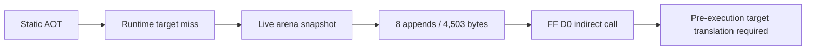

# Runtime AOT 동적 변환 분석

## 확인됨

`aot-dynamic` 실험 backend는 정적 map에 없는 arena target을 live snapshot에서 변환할 수 있습니다. PIU 최초 실행에서 8개의 target 변환이 연속 성공했고 총 4,503바이트가 cache에 추가됐습니다. legacy fallback 없이 AOT boundary/re-entry가 `23/22`까지 진행됐습니다.

selector 0을 사용하는 segment byte/word/dword read는 DOS low-memory offset으로 처리해야 `ES:[0]` 복원/검사 흐름을 통과했습니다. 이후 확인된 blocker는 guest `FF D0` 간접 call입니다. 기존 “원본 instruction 한 개를 TF로 실행한 뒤 target에서 재진입” 정책은 call target이 Win32에서 직접 실행 가능하지 않으면 call 자체가 완료되기 전에 access violation을 발생시킵니다.

## 결론

이 분석 시점에는 간접 call/jump를 실행 전에 Zydis operand와 guest CONTEXT로
계산하고, guest return 의미를 보존하는 dispatcher가 필요했습니다. 후속 작업에서
prefix 없는 legacy-32 `FF /2`, `FF /4`, `C3`, `C2 iw`와 worker-backed inline
cache가 구현됐습니다. `aot-dynamic`은 계속 명시적인 실험 모드이며 `aot`과
`legacy` fallback은 유지됩니다.

후속 task 191은 live target이 이미 번역된 instruction byte를 수정하는 경우까지
확장했습니다. translated page write는 active generation을 retire하고, 다른 page에서
수정된 target으로 다음에 들어갈 때 live arena snapshot으로 새 generation을
append합니다. 합성 LINEXE/Glide gate는 HLE-owned excluded range로 전달해 일반 CFG
복사를 막습니다.

## 미확정

* far call/jump와 selector:offset target
* retired generation cache reclamation과 여러 guest thread publication
* 여러 page를 넘는 REP/string store의 일반 write-watch 검증

# Runtime AOT Dynamic Translation Analysis

The experimental `aot-dynamic` backend initially translated eight live arena
targets and appended 4,503 bytes before reaching an `FF D0` call that required
pre-execution target resolution. Later work implemented prefix-free legacy-32
`FF /2`, `FF /4`, `C3`, and `C2 iw` dispatch with guest-return preservation and
worker-backed inline caches. `aot-dynamic` remains isolated as an experimental
mode, while stable `aot` and legacy fallback remain available.

Task 191 extended the dynamic path to writes that modify already translated
instruction bytes. It retires the active page generation and lazily appends a
live-arena translation on the next cross-page entry. Synthetic LINEXE/Glide gate
ranges are excluded from ordinary CFG copying. Cache reclamation, multi-thread
publication, and general cross-page REP/string-store coverage remain follow-up
work.
