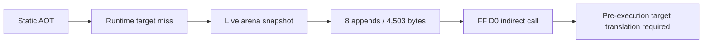

# Runtime AOT 동적 변환 분석

## 확인됨

`aot-dynamic` 실험 backend는 정적 map에 없는 arena target을 live snapshot에서 변환할 수 있습니다. PIU 최초 실행에서 8개의 target 변환이 연속 성공했고 총 4,503바이트가 cache에 추가됐습니다. legacy fallback 없이 AOT boundary/re-entry가 `23/22`까지 진행됐습니다.

selector 0을 사용하는 segment byte/word/dword read는 DOS low-memory offset으로 처리해야 `ES:[0]` 복원/검사 흐름을 통과했습니다. 이후 확인된 blocker는 guest `FF D0` 간접 call입니다. 기존 “원본 instruction 한 개를 TF로 실행한 뒤 target에서 재진입” 정책은 call target이 Win32에서 직접 실행 가능하지 않으면 call 자체가 완료되기 전에 access violation을 발생시킵니다.

## 결론

이 분석 시점에는 간접 call/jump를 실행 전에 Zydis operand와 guest CONTEXT로
계산하고, guest return 의미를 보존하는 dispatcher가 필요했습니다. 후속 작업에서
prefix 없는 legacy-32 `FF /2`, `FF /4`, `C3`, `C2 iw`와 worker-backed inline
cache가 구현됐습니다. `aot-dynamic`은 계속 명시적인 실험 모드이며 `aot`과
`legacy` fallback은 유지됩니다.

후속 task 191은 live target이 이미 번역된 instruction byte를 수정하는 경우까지
확장했습니다. translated page write는 active generation을 retire하고, 다른 page에서
수정된 target으로 다음에 들어갈 때 live arena snapshot으로 새 generation을
append합니다. 합성 LINEXE/Glide gate는 HLE-owned excluded range로 전달해 일반 CFG
복사를 막습니다.

## 미확정

* far call/jump와 selector:offset target
* retired generation cache reclamation과 여러 guest thread publication
* 여러 page를 넘는 REP/string store의 일반 write-watch 검증

## 2026-08-30 Task 529 관측 결과

현재 live AOT boundary census는 유효 `FF` opcode의 ModRM reg field를 분리해 기록합니다.
`pumpipx3`의 60초 trace-free 실행에서 late drop 직전 누적 `FF /4`가 `3628`이었고, 약 40초
표본에서 `15811`로 증가했습니다. `pumpit1`은 대응 표본에서 `58 -> 90`이었으며 두 타이틀 모두
`FF /2`와 truncated 표본은 관측되지 않았습니다. 이는 `FF /4` near indirect jump 경계가
`pumpipx3`의 drop과 시간상 일치하는 후보임을 보여주지만, census에는 site·addressing mode·target
정보가 없으므로 원인 확정이나 최적화 근거로 사용할 수 없습니다. 다음 단계는 이 세 축을
관측 전용으로 연결하는 것입니다.

## 2026-08-30 Task 530 관측

`FF /4` 표본을 guest EIP별로 고정 슬롯에 누적하고, 최대 4바이트 boundary window와 ModRM
addressing mode를 함께 기록했습니다. `pumpipx3`와 `pumpit1`의 60초 trace-free 측정에서
관측된 `/4`는 모두 `sib`였고 site overflow와 ModRM truncation은 0이었습니다.
`pumpipx3`의 주 site는 `0x010EF6DE`로 #3~#4의 `2828`에서 #5 `3600`으로 늘었으며,
`pumpit1`의 단일 site는 `0x010F1DD7`로 `58 -> 91`이었습니다. Captured bytes는 각각
`2E FF 24 95`와 `2E FF 24 85`로, 두 타이틀은 SIB index byte가 다릅니다.

이 결과는 두 타이틀의 반복적인 `CS:FF /4` site를 확인하고 `pumpipx3` late-drop 후보를
`0x010EF6DE`로 좁히지만, displacement와 실제 resolved target을 포함하지 않습니다. 따라서
현재로서는 target 비용이나 인과관계를 확정할 수 없으며, 다음 단계는 원본 실행 경로를 유지한
채 displacement/target과 site별 window cycle을 관측하는 것입니다.

# Runtime AOT Dynamic Translation Analysis

The experimental `aot-dynamic` backend initially translated eight live arena
targets and appended 4,503 bytes before reaching an `FF D0` call that required
pre-execution target resolution. Later work implemented prefix-free legacy-32
`FF /2`, `FF /4`, `C3`, and `C2 iw` dispatch with guest-return preservation and
worker-backed inline caches. `aot-dynamic` remains isolated as an experimental
mode, while stable `aot` and legacy fallback remain available.

Task 191 extended the dynamic path to writes that modify already translated
instruction bytes. It retires the active page generation and lazily appends a
live-arena translation on the next cross-page entry. Synthetic LINEXE/Glide gate
ranges are excluded from ordinary CFG copying. Cache reclamation, multi-thread
publication, and general cross-page REP/string-store coverage remain follow-up
work.

## Task 529 observation

The live AOT boundary census now separates the ModRM reg field of effective `FF` opcodes. In the
60-second trace-free `pumpipx3` run, cumulative `FF /4` rose from `3628` just before the late drop
to `15811` in the sample around 40 seconds. `pumpit1` rose from `58` to `90` over the corresponding
samples; neither title produced `FF /2` or truncated samples. This makes the `FF /4` near indirect
jump boundary a time-aligned candidate for the `pumpipx3` drop, but the census has no site,
addressing-mode, or target data, so it does not establish causality or justify optimization. The next
step is to connect those three axes observationally.

## Task 530 observation

`FF /4` samples are now accumulated by guest EIP in fixed slots, together with the captured
four-byte boundary window and ModRM addressing mode. In the 60-second trace-free measurements of
both titles, every observed `/4` used `sib` addressing, with zero site overflow and zero ModRM
truncation. The `pumpipx3` top site was `0x010EF6DE`, growing from `2828` at live sample #3/#4 to
`3600` at #5; `pumpit1` exposed one site, `0x010F1DD7`, growing from `58` to `91`. The captured
bytes were `2E FF 24 95` and `2E FF 24 85`, respectively, so the titles use different SIB index
bytes.

This confirms repeated title-specific `CS:FF /4` sites and narrows the `pumpipx3` late-drop
candidate to `0x010EF6DE`, but the current window does not include the displacement or resolved
target. Target cost and causality therefore remain unresolved. The next step is to observe the
displacement/target and correlate it with site-specific window cycles while preserving the original
execution path.

## Task 531 관측

Task 531에서 target operand 전용 bounded evaluator를 추가했습니다. 동일 guest EIP에서 최대
15바이트를 읽고 32-bit register 및 ModRM/SIB 형식을 지원하며, 16-bit address-size,
지원하지 않는 명시적 segment, truncated instruction, unreadable memory는 fail-closed로
처리합니다. 관측 전용이며 guest state나 dispatch를 변경하지 않습니다.

새 60초 측정에서 관측된 `/4` 표본은 모두 resolved였습니다. `pumpipx3` dominant site
`0x010EF6DE`는 정적으로 `jmp cs:[edx*4+0x010EF65C]`이며 runtime pointer는
`0x010EF678`(index 7), raw target은 `0x010EF8E9`이고 `mov ebx, esi`로 disassemble됩니다.
site count는 live #3의 `2827`에서 #5의 `15686`으로 증가했지만 마지막 pointer와 target은
같았고, 중간 table 값 변화 때문에 target-change count는 `21`에서 `121`로 증가했습니다.

`pumpit1`의 `0x010F1DD7`은 `jmp cs:[eax*4+0x010F1D8F]`입니다. #3에서는 pointer
`0x010F1D9B`, target `0x010F1CFD`를 읽었고 #4/#5에서는 pointer `0x010F1D97`, target
`0x010F1CF4`를 읽었습니다. 즉 EAX table index가 3에서 2로 바뀌었습니다. Target
resolution은 #3에서 `58/58`, #4/#5에서 `90/90`이었고 unresolved/truncated/unsupported/
unreadable target은 0이었습니다.

새 증거는 pumpipx3 차이를 index 7 jump-table 반복 읽기와 target-table mutation으로
좁히지만, 인과관계나 target 실행 비용을 확정하지는 않습니다. 다음 관측은 pumpipx3
jump-table entry의 writer와 drop 직전·직후 resolved target 주변의 cycle 귀속을 확인해야
합니다.

## Task 531 observation

Task 531 added a separate bounded target evaluator. It reads at most 15 bytes from the same guest
EIP, supports 32-bit register and ModRM/SIB forms, and fails closed for 16-bit address-size,
unsupported explicit segments, truncated instructions, and unreadable memory. It is observational
and does not alter guest state or dispatch.

In the new 60-second runs every observed `/4` sample resolved. Pumpipx3's dominant site
`0x010EF6DE` statically decodes as `jmp cs:[edx*4+0x010EF65C]`; the runtime pointer was
`0x010EF678` (index 7) and the raw target was `0x010EF8E9`, disassembled as `mov ebx, esi`.
The site grew from `2827` at live sample #3 to `15686` at #5, while the last pointer and target
stayed the same; target-change count rose from `21` to `121` because intermediate reads changed
the table value.

Pumpit1's `0x010F1DD7` is `jmp cs:[eax*4+0x010F1D8F]`. It read pointer `0x010F1D9B` and target
`0x010F1CFD` at #3, then pointer `0x010F1D97` and target `0x010F1CF4` at #4/#5, so its EAX table
index changed from 3 to 2. Target resolution was `58/58` at #3 and `90/90` at #4/#5, with zero
unresolved, truncated, unsupported, or unreadable samples.

The evidence narrows the pumpipx3 difference to repeated index-7 jump-table reads and target-table
mutation, but does not establish causality or target execution cost. The next required observation
is the writer of the pumpipx3 jump-table entry and cycle attribution around the resolved targets.

## Task 532 관측

Task 531의 `target_change_count`는 같은 memory pointer에서 table dword만 바뀐 경우와
register/index 변화로 다른 pointer를 읽은 경우를 구분하지 못했습니다. Task 532는 resolved
memory operand에 대한 `pointer_change_count`, pointer validity, 동일 pointer target 변화와
pointer 변경 동반 target 변화 count를 추가했습니다. Synthetic probe에서 두 분류를 각각
검증했고 Win32 x86 Debug probe와 Linux i386 Release build가 통과했습니다. 실행 경로와 guest
state는 변경하지 않았습니다.

새 60초 측정에서 `pumpipx3` dominant site `0x010EF6DE`는 #1의 `pc=21`, #3의 `pc=27`,
#4/#5의 `pc=121`이 각각 같은 snapshot의 `tc`와 일치했고 `spc=0`, `ppc=tc`였습니다.
`pumpit1` site `0x010F1DD7`도 #1~#3에서 `pc=8`, #4/#5에서 `pc=13`이 `tc`와 일치했고
`spc=0`이었습니다. 두 site에서 `pv=1`, `dc=0`, target read failure 0, unresolved 0이
유지되었습니다.

이 결과는 Task 531의 `pumpipx3` target-table mutation 해석을 지지하지 않습니다. 현재
관측으로는 `pumpipx3`의 EDX 기반 index/operand pointer 변화가 target 변화와 동반된다는
설명이 더 타당하며, `pumpit1`의 EAX index 3→2 변화와도 일관됩니다. 다만 pointer producer나
guest writer, resolved target의 실제 cycle 비용, late drop과의 인과관계는 미확정입니다.

## Task 532 observation

Task 531's `target_change_count` could not distinguish a table dword changing at the same memory
pointer from reading another pointer after a register/index change. Task 532 added resolved-memory
`pointer_change_count`, pointer validity, same-pointer target-change count, and pointer-accompanied
target-change count. The synthetic probe verified both categories independently; the Win32 x86 Debug
probe and Linux i386 Release build passed. Execution flow and guest state were unchanged.

In the new 60-second runs, pumpipx3's dominant site `0x010EF6DE` had `pc=21`, `27`, and `121` at
snapshots #1, #3, and #4/#5, respectively, matching `tc` in each snapshot; `spc=0` and `ppc=tc`.
Pumpit1's `0x010F1DD7` likewise had `pc=8` at #1--#3 and `pc=13` at #4/#5, matching `tc`, with
`spc=0`. Both sites retained `pv=1`, `dc=0`, zero target-read failures, and zero unresolved
samples.

This result does not support Task 531's pumpipx3 target-table mutation interpretation. The current
observation is better explained by EDX-based index/operand-pointer changes accompanying target
changes, consistent with pumpit1's EAX index change from 3 to 2. The pointer producer or guest
writer, actual resolved-target cycle cost, and causality of the late drop remain unresolved.

## Task 533 관측

Task 533은 resolved SIB operand에서 index/base register 번호, 값, validity, component change
count를 수집하도록 target result, site/hotspot state, live reporter를 확장했습니다. Synthetic
SIB probe에서 index 변경은 index count만 증가시키는 것을 확인했고, Win32 x86 Debug probe와
Linux i386 Release build가 통과했습니다. Guest state와 dispatch 결과는 변경하지 않았습니다.

새 trace-free 60초 측정에서 `pumpipx3` dominant site `0x010EF6DE`는 `ir=2`(EDX), `iv=7`,
base 없음으로 관측되었습니다. index-change count와 pointer-change count는 #1에서 `21/21`,
#3에서 `27/27`, #4/#5에서 `121/121`로 일치했습니다. `pumpit1`의 `0x010F1DD7`은 `ir=0`(EAX),
base 없음으로 관측되었고, EAX가 3일 때 `8/8`, EAX가 2일 때 `13/13`으로 역시 일치했습니다.
모든 target read는 resolved였으며 unresolved/truncated/unsupported/unreadable은 0이었습니다.

정적 bounded disassembly에서 pumpipx3 site 직전은 `0x010EF6DA xor edx, edx`와
`0x010EF6DC mov dl, bl`이고, 그 앞에 `0x010EF6CF mov bl, [eax]`가 있습니다. 이는 runtime
EDX index 7과 일치하는 강한 local producer 후보지만 exception boundary만으로 전체 producer
chain을 확정할 수는 없습니다. Pumpit1은 `jmp cs:[eax*4+0x010F1D8F]`이며 직전의
`0x010F1DD5 mov edx, eax`는 EAX를 쓰지 않으므로 EAX producer는 미확정입니다.

따라서 두 site의 pointer 변경이 base가 아닌 index 값 변경에 의해 발생한다는 점은 확인되며,
이번 window에서는 동일 pointer의 target table mutation 근거가 없습니다. Guest writer,
pumpit1 EAX producer, late drop의 인과관계, resolved target instruction의 순수 cycle 비용은
아직 미확정입니다. 현재 hook이 FF boundary VEH 처리 중에 위치하므로 순수 target cycle은
handler 및 후속 guest 작업과 섞이지 않도록 이번 작업에서는 측정하지 않았습니다.

## Task 533 observation

Task 533 extended the resolved SIB operand result, site/hotspot state, and live reporter with
index/base register numbers, values, validity, and component-change counts. The synthetic SIB
probe confirmed that an index change increments only the index count. The Win32 x86 Debug probe and
Linux i386 Release build passed without changing guest state or dispatch.

In the new trace-free 60-second measurements, pumpipx3's dominant site `0x010EF6DE` reported
`ir=2` (EDX), `iv=7`, and no base. Index-change and pointer-change counts matched at `21/21`,
`27/27`, and `121/121` in the successive late samples. Pumpit1's `0x010F1DD7` reported `ir=0`
(EAX), no base, and matching `8/8` counts while EAX was 3 followed by `13/13` while EAX was 2.
All target reads resolved, with zero unresolved, truncated, unsupported, or unreadable samples.

Pumpipx3's local static sequence is `xor edx, edx` at `0x010EF6DA`, `mov dl, bl` at
`0x010EF6DC`, and the preceding `mov bl, [eax]` at `0x010EF6CF`. It is consistent with runtime
EDX index 7 and is a producer candidate rather than proof of the complete chain. Pumpit1's
preceding `mov edx, eax` at `0x010F1DD5` does not write the EAX used by the SIB operand, so its
producer remains unresolved.

The evidence confirms index-driven pointer changes and gives no support to the earlier same-pointer
target-table mutation interpretation for these windows. The guest writer, EAX producer, late-drop
causality, and pure target-instruction cycle cost remain unresolved. Pure target cycles were
deferred because the current FF-boundary hook would mix VEH/handler and guest work with target cost.

## Task 534 관측

Task 534은 각 FF /4 site와 hotspot에 resolved SIB index register/value pair의 고정 8-slot
histogram을 추가했습니다. Live line에는 index observation sample, distinct slot, overflow
sample, 그리고 채워진 slot의 값/count가 포함됩니다. Synthetic probe는 EDX=0 세 번과 EDX=1
한 번을 두 slot에 기록하고 overflow가 0임을 확인했습니다. Win32 x86 Debug probe와 Linux
i386 Release build가 통과했고 guest execution과 dispatch는 변경하지 않았습니다.

새 `pumpipx3` run의 `0x010EF6DE`는 마지막 값 7만이 아니라 EDX=0과 EDX=7을 모두 기록했습니다.
#1에서는 `0:11, 7:2818`/총 2829, #5에서는 `0:14, 7:3587`/총 3601이었습니다. `pumpit1`의
`0x010F1DD7`도 EAX=3과 EAX=2를 기록했으며, #1에서는 `3:28, 2:30`/총 58, #5에서는
`3:41, 2:49`/총 90이었습니다. 두 site 모두 slot 2개, overflow 0이었고 target read는
전부 resolved였습니다.

Pumpipx3 정적 table `0x010EF65C`는 index 0을 target `0x010EF6E6`으로, index 7을
`0x010EF8E9`(`mov ebx, esi`)로 매핑합니다. 따라서 새 index 0 관측은 index 7 pointer의
동일 dword mutation이 아니라 두 번째 jump-table entry 사용을 의미합니다. Pumpit1의 두
값도 기존에 확인된 index 3과 index 2 pointer/target에 대응합니다.

이번 결과는 해당 window에서 stronger same-pointer target-table mutation 해석을 반박합니다.
다만 transition 순서, pumpit1 EAX producer, guest writer, late drop 인과관계, 순수 target
cycle은 미확정입니다. Pumpit1은 #5까지 유효한 FF data를 남겼지만 timeout cleanup이
`recovered=0, stopped=0`, process exit 1로 끝났으므로 cleanup 한계로 기록합니다.

## Task 534 observation

Task 534 added a fixed eight-slot histogram of resolved SIB index register/value pairs to every
FF /4 site and hotspot. The live line reports index observation samples, distinct slots, overflow
samples, and populated slot values/counts. The synthetic probe verified two slots for EDX=0 and
EDX=1 with no overflow. The Win32 x86 Debug probe and Linux i386 Release build passed without
changing guest execution or dispatch.

The new pumpipx3 run at `0x010EF6DE` recorded EDX 0 and 7: `0:11, 7:2818` of 2829 observations
at #1, then `0:14, 7:3587` of 3601 at #5. Pumpit1 at `0x010F1DD7` recorded EAX 3 and 2:
`3:28, 2:30` of 58 at #1, then `3:41, 2:49` of 90 at #5. Both sites had two slots and zero
overflow; all target reads resolved.

Pumpipx3's static table at `0x010EF65C` maps index 0 to `0x010EF6E6` and index 7 to
`0x010EF8E9` (`mov ebx, esi`). The transient index-0 observations therefore identify a second
table entry, not same-pointer mutation of the index-7 dword. Pumpit1's two values match its earlier
index-3 and index-2 pointer/target observations.

The result rejects the stronger same-pointer target-table mutation interpretation for these windows.
Transition order, the pumpit1 EAX producer, guest writer, late-drop causality, and pure target
cycles remain unresolved. Pumpit1 reached live sample #5, but timeout cleanup ended with
`recovered=0` and `stopped=0` (process exit 1), retained as a cleanup limitation.

## 2026-08-30 Task 535: FF /4 index transition order

**구현 및 검증:** Task 535는 FF /4 site와 hotspot마다 resolved SIB index component의 전환을
최대 32개까지 순서대로 저장하도록 추가했습니다. 각 항목은 이전 register/value와 현재
register/value를 담으며 live reporter는 전체 전환(`tx`), 저장 슬롯(`ts`), overflow(`to`)를
출력합니다. 전환 수는 index component change count와 일치하고, 저장 슬롯과 overflow의
합은 전체 전환 수와 일치합니다. Synthetic probe, Win32 x86 Debug build, Linux i386 Release
build가 성공했으며, synthetic attribution/census 결과는 각각 true였습니다. 이 계측은
guest state와 dispatch를 변경하지 않습니다.

**확인된 runtime evidence:** `pumpipx3`의 `0x010EF6DE`는 EDX(register id 2)를 사용하며,
sample #1에서 `tx=21, ts=21, to=0`과 `0→7→0→7...` 순서를 보였습니다. Sample #5는
`tx=121, ts=32, to=89`로 증가했고, 저장된 32개 prefix도 동일한 교대 순서였습니다.
따라서 전환 패턴은 확인되지만 고정 trace 용량 때문에 후반 89개 전환의 개별 순서는
저장되지 않았습니다. `pumpit1`의 `0x010F1DD7`은 EAX(register id 0)를 사용하며, sample
#1에서 `tx=8, ts=8, to=0`, sample #5에서 `tx=13, ts=13, to=0`으로 각각
`3→2→3→2...` 순서를 완전히 저장했습니다. 모든 target read는 resolved였습니다.

**정적 상관:** Pumpipx3의 `0x010EF65C` table은 index 0을 `0x010EF6E6`으로, index 7을
`0x010EF8E9`으로 매핑합니다. 따라서 runtime `0↔7` transition은 서로 다른 table entry
선택을 직접 보여주며, 동일 pointer의 target dword mutation만으로 설명되지 않습니다.
인접 코드는 `xor edx, edx` at `0x010EF6DA`, `mov dl, bl` at `0x010EF6DC`, 그리고
`mov bl, [eax]` at `0x010EF6CF`입니다. Pumpit1의 `3↔2` transition은 기존의 index-3
및 index-2 pointer/target pair 선택과 일치합니다.

**추정 및 미확정:** 이 결과는 두 runtime에서 target/pointer variation의 index selection
순서를 확정하지만, EDX/EAX producer chain, guest writer, late performance drop causality,
또는 resolved target instruction의 순수 cycle cost를 확정하지 않습니다. Pumpipx3 후반
overflow를 포함한 전체 sequence가 필요하면 더 큰 bounded trace 또는 streaming/hash 관측이
필요합니다. 현재 FF-boundary VEH hook은 handler와 후속 guest work를 섞으므로 순수 target
timing은 별도의 timing boundary에서 측정해야 합니다.

## 2026-08-30 Task 535 observation

Task 535 adds bounded ordered transition capture for resolved FF /4 SIB indexes. Pumpipx3's
dominant site alternates EDX 0 and 7, while pumpit1's site alternates EAX 3 and 2. The static
pumpipx3 table maps those indexes to different targets (`0x010EF6E6` and `0x010EF8E9`), so
the transition trace establishes table-entry selection rather than same-pointer target mutation
for the observed prefix. Pumpipx3's late sample has 89 transitions beyond the 32 stored slots;
pumpit1 stores all 13 late transitions. The producer chains, writer, late-drop cause, and pure
target cycles remain open.

## 2026-08-30 Task 536: existing hotspot boundary check

**구현 및 검증:** 코드 변경 없이 기존 `SingleStepHotspotProfile` full dump를 활성화해 resolved
FF /4 target 주소의 관측 여부를 확인했습니다. `pumpipx3` dump는
`total_samples=381761`, `distinct=114`, `overflow=0`, `total_cycles=4251287558`이었고,
`pumpit1`은 `total_samples=26363`, `distinct=106`, `overflow=0`,
`total_cycles=8945029040`이었습니다. 두 dump 모두 생성되었고 FF attribution은 계속
resolved였습니다.

`pumpipx3` FF site `0x010EF6DE`는 3,600 samples, 11,281,020 cycles
(`avg≈3134`)로 기록됐지만 target candidates `0x010EF6E6`와 `0x010EF8E9`는 absent였습니다.
`pumpit1` FF site `0x010F1DD7`은 90 samples, 1,885,705 cycles (`avg≈20952`)로 기록됐지만
`0x010F1CFD`와 `0x010F1CF4`는 absent였습니다. 이 cycle 값은 순수 target instruction 비용이
아니라 `HandleSingleStepTrace` handler window입니다.

기존 hotspot 경계가 FF site는 관측하지만 resolved target을 관측하지 못한다는 점이 확인되어,
현재 dump만으로 pure target cycle을 산출할 수 없다고 판정합니다. `HandleAotReentry`가 FF
실행 이후 target을 먼저 AOT cache로 resolve하고 `HandleSingleStepTrace` sample을 열지 않는
dispatcher 순서와도 일치합니다. Target의 실제 AOT 실행 비용, index별 비용 차이, late-drop
causality는 dedicated target timing boundary가 구현되기 전까지 미확정입니다.

## 2026-08-30 Task 536 observation

The existing full hotspot dump observes the FF sites but none of the resolved target addresses.
Pumpipx3 recorded 3,600 samples and 11,281,020 handler-window cycles at `0x010EF6DE`; pumpit1
recorded 90 samples and 1,885,705 handler-window cycles at `0x010F1DD7`. All four resolved target
candidates were absent. This boundary cannot measure pure target cycles; a dedicated boundary around
the AOT target entry and following exit is required.

## 2026-08-30 Task 537: FF4 AOT target interval

**구현:** Task 537은 `aot_ff_target_timing.h/.cpp`에 16개 고정 aggregate 슬롯을 두고,
FF4 resolved target 후보를 AOT target resolve 시점과 다음 `DispatchGuestFault` 진입
시점 사이에 연결했습니다. timing은 `REPIU_AOT_FF_TARGET_TIMING=1`에서만 활성화됩니다.
합성 probe는 후보 source/target/index key와 100-cycle interval aggregate를 검증했고,
Windows x86 Debug와 Linux i386 Release 빌드가 성공했습니다.

이 경계의 값은 pure instruction cost가 아니라 **AOT target interval**입니다. AOT target
block, target block의 exception, host exception entry 및 common dispatcher 이전 작업이
포함될 수 있습니다.

**실측 결과:** Task 536과 같은 조건으로 두 title을 60초 실행하고 timing toggle만
추가했습니다.

| title | FF4 resolved | started/completed | mismatch | active/overflow | total cycles |
| --- | ---: | ---: | ---: | --- | ---: |
| `pumpipx3` | 15,811 | 15,799 / 15,799 | 12 | 0 / 0 | 785,219,364 |
| `pumpit1` | 90 | 90 / 90 | 0 | 0 / 0 | 144,273,952 |

`pumpipx3`의 `0x010EF6DE -> 0x010EF8E9` index 7 key는 15,616회,
`sum=762,449,236`, `avg≈48,824.87`, `min=10,730`, `max=14,939,564`였습니다.
같은 site의 index 0 (`0x010EF6E6`)은 61회, `avg≈12,814.69`였습니다. `pumpit1`은
`0x010F1DD7 -> 0x010F1CFD` index 3이 41회, `avg≈443,752.88`였고,
`0x010F1DD7 -> 0x010F1CF4` index 2가 49회, `avg≈2,573,062.94`였습니다.

`pumpipx3`의 timing interval은 FF4 resolved sample의 99.9241%까지 연결되었고
12 mismatch가 남았습니다. 두 title 모두 unresolved target, active interval, slot
overflow, discard는 없었습니다. `pumpipx3`과 `pumpit1`의 interval total은 각각 guest
run cycle의 약 0.3886%와 0.0730%이므로, 이 target interval만으로 pumpipx3의 후반
`fps≈4.2`나 높은 VEH 비율을 설명할 수 없습니다. 최종 live window의 AOT boundary는
각각 390,483회와 27,431회였고 FF4 resolved sample은 15,811회와 90회였습니다.
이는 boundary churn이 더 큰 분석 축이라는 상관 증거이지만 아직 인과 증거는 아닙니다.

두 실행의 shutdown은 기존과 같이 timeout, `attempts=40`, `answered=1`,
`recovered=0`, `stopped=0`, `failure=0`이었습니다. 이 cleanup 한계는 timing interval
완료나 target resolution failure와 분리해 기록합니다.

## 2026-08-30 Task 537 observation

Task 537 adds a 16-slot fixed aggregate for the interval from a successfully attributed FF4
target to its AOT-cache target entry, closed at the next common `DispatchGuestFault` entry.
The synthetic probe, Windows x86 Debug build, and Linux i386 Release build all passed.

The boundary measures an **AOT target interval**, not pure target instruction cycles, because
the interval may include the target block, its exception, host exception entry, and work before
the common dispatcher.

With the Task 536 conditions and only `REPIU_AOT_FF_TARGET_TIMING=1` added, pumpipx3 had
15,811 resolved samples and 15,799 completed intervals, with 12 mismatches and no active
interval or overflow. Pumpit1 had 90 resolved and completed intervals with no mismatch,
active interval, or overflow. Pumpipx3's dominant index-7 target pair contributed 15,616
intervals and 762,449,236 cycles; pumpit1's index-3 and index-2 pairs contributed 41 and 49
intervals respectively.

The interval totals were about 0.3886% of pumpipx3 guest-run cycles and 0.0730% of pumpit1's,
so they do not by themselves explain pumpipx3's late low frame rate or high VEH share. The
larger observed difference remains AOT boundary volume and FF4 sample volume (390,483 versus
27,431 boundaries; 15,811 versus 90 resolved FF4 samples in the final live windows). This is
correlation only. The 12 mismatches and the producer/exception path behind the boundary churn
remain unresolved, while the known timeout cleanup limitation was reproduced.
## 2026-08-30 Task 538: one-second FF4/AOT timeline

**측정:** Task 537 계측을 유지하고 `REPIU_LIVE_PROFILE_INTERVAL_MS=1000`으로
`pumpipx3`와 `pumpit1`을 각각 60초 실행했습니다. 소스, guest code, AOT dispatch 정책은
변경하지 않았습니다. 누적 `FF4 samples`, `AOT boundary`, `CD`와 창별 frames 및
`cycles_per_frame`를 인접 보고 행끼리 차분했습니다.

`pumpipx3`에서 FF4는 #1~#29의 2,849에서 정지했습니다. #30에서 777개가 추가되었지만
창은 52 frames와 71.5M cycles/frame을 기록했습니다. 핵심 burst는 #38에서 발생했으며
FF4 `+12,183`, AOT boundary `+13,073`, CD `+261`이었습니다. 같은 창의 42 frames와
105.4M cycles/frame 뒤에 #39에서 5 frames와 811.6M cycles/frame이 나타났고 FF4는
추가되지 않았습니다. 따라서 FF4/AOT burst와 지속적인 collapse의 순서는 재현되지만,
FF4 interval 자체가 원인이라고 결론내릴 수 없습니다.

`pumpit1`의 FF4 변화는 #7의 +12와 #33의 +32뿐이었습니다. #33의 19 frames 및
262.8M cycles/frame 저하는 다음 창에 회복되었고, pumpipx3의 5 fps 상태는 나타나지
않았습니다. 이 비교는 pumpipx3의 burst가 title-specific AOT-boundary churn과 함께
발생한다는 상관을 강화하지만, guest state transition 및 exception/cache producer는
여전히 미확정입니다. CD counter에는 collapse 직전의 새로운 큰 증가가 없었습니다.

## 2026-08-30 Task 538 observation

Task 538 reran both titles with a one-second live-profile interval. Pumpipx3's FF4 count
remained 2,849 through #29, rose by 777 at #30, and rose by 12,183 at #38. The #38 window
also added 13,073 AOT boundaries and 261 CD samples. The next window entered 5 frames and
811,557,496 cycles/frame, while FF4 stayed unchanged. This places the FF4/AOT burst one
report window before the persistent collapse, but only establishes temporal correlation.

Pumpit1 had +12 FF4 at #7 and +32 at #33; its brief #33 slowdown recovered at #34 and never
became a sustained 5 fps state. No new CD surge appeared at the pumpipx3 transition. The
guest state transition, EDX producer/writer, and exception/cache path remain the next
analysis frontier.
