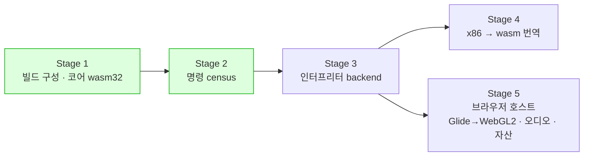

# 웹(WebAssembly) 이식 frontier / Web port frontier

설계: [20260828-513](../design/20260828-513-web-wasm-execution.md) ·
작업 로그: [513 빌드](../work-logs/20260828-513-web-wasm-build.md) ·
[514 명령 census](../work-logs/20260828-514-guest-instruction-census.md)

이 문서는 **웹 이식이 지금 어디까지 왔고 왜 멈춰 있는지**만 유지합니다. 단계별 증거는 작업
로그에, 다섯 단계 계획은 설계에 있습니다.

## 1. 상태 — **보류 중** (2026-08-28)

**Stage 1~2가 끝났고, Stage 3~5는 의도적으로 보류했습니다.** 보류 이유는 이 작업에 문제가
있어서가 아니라 **Linux 성능 축이 먼저이기 때문**입니다 — 그쪽은 게임이 이미 화면까지
나오고 있고([linux-port-frontier](linux-port-frontier.md)), 웹은 아직 실행 backend가
없습니다.

**브라우저에서 게임은 실행되지 않습니다.** 현재 backend 둘(`legacy`·`dynamic`)이 모두
네이티브 x86 실행 위에 서 있어 wasm에는 대응 형태가 없습니다.

## 2. 확인됨 — 지금 서 있는 것

| 항목 | 값 | 근거 |
|---|---|---|
| 플랫폼 공용 코어가 wasm32로 빌드 | `repiu_exe` 오브젝트 **64개** | Task 513 |
| **코어 소스 수정** | **0줄** | Task 513 |
| 엔진 자신의 미해결 심볼 | **0** (166개는 전부 엔진 밖) | Task 513 |
| `repiu_core_probe` (wasm32) | **9 / 9 통과**, 제외된 6개는 이름을 찍음 | Task 513 |
| 포인터 폭 | 4 / 4 / 4 — i386과 같음 | Task 513 |
| `repiu_glide_issue_probe` (wasm32) | **통과** — Glide 카탈로그 경로는 플랫폼 기능을 쓰지 않음 | Task 513 |
| Windows 회귀 | 15 / 15, 변화 없음 | Task 513 |
| **Stage 3의 크기** | 명령 형태 **320개**(mnemonic 120개), 상위 17개가 **87.89%** | Task 514 |
| 세 호스트 census 일치 | 완전 일치 | Task 514 |

의존성(SDL3·libchdr·miniz·Zydis)은 Emscripten에서 그대로 구성·빌드됩니다.

**AGENTS.md의 "공용 구조를 먼저 설계한다"가 두 번 값을 했습니다** — Task 501이 Linux에서,
513이 **x86이 아닌 호스트**에서 같은 결론에 닿았습니다.

## 3. 재개 조건 — 먼저 정해야 하는 둘

Stage 3(플랫폼 중립 인터프리터)이 다음 단위입니다. 상위 17 mnemonic이 87.89%이므로 **점진적
구축이 가능합니다.** 다만 **인터프리터를 쓰기 전에** 둘을 정해야 하고, 나중에 바꾸면 인터프리터를
다시 쓰는 일이 됩니다.

| 정할 것 | 왜 먼저인가 | 지금 아는 것 |
|---|---|---|
| **x87 표현(80비트인가)** | 레지스터 파일 폭을 나중에 바꾸는 것은 재작성입니다 | 80비트가 관측 가능함은 확인(14곳). 레지스터 파일 전체가 메모리로 노출되는지는 **미확정** — 동적 census 뒤에 정합니다 |
| **Worker 실행 전제** | 실행 루프의 형태를 결정합니다 | CHD가 플레이 내내 열려 있어야 하고, 브라우저의 동기 파일 I/O는 **Worker 안에서만** 성립합니다 (설계 결정 7) |

## 4. 다섯 단계 중 어디인가



**Stage 3이 계획의 중심입니다.** 인터프리터가 플랫폼 중립 C++이므로 **Windows에서 기존
backend와 대조**할 수 있고, 그 대조가 없으면 Stage 4의 번역 버그를 브라우저 안에서 잡아야
합니다.

## 5. 확인되지 않은 것

* **`repiu_chd_cd_probe`는 실행이 확인되지 않았습니다.** 빌드·링크는 되지만 Emscripten 기본
  MEMFS가 호스트 파일시스템을 못 봐서 CHD 경로를 넘길 수 없습니다.
* **브라우저에서 돌린 적이 없습니다.** wasm 산출물은 Node로만 확인했습니다.
* 설계 결정 7의 실행 모델(Worker)은 **추정**입니다 — 브라우저 쪽을 측정하지 않았습니다.
* Stage 4·5는 설계만 있고 구현이 없습니다.

## 6. 재현

```bash
./scripts/build_web_wasm.sh          # Emscripten 필요
node build/web_wasm/repiu_core_probe.js
```

명령 census는 `src/tools/instruction_census/`이고, 절차는
[Task 514 로그](../work-logs/20260828-514-guest-instruction-census.md)의 재현 절에 있습니다.

---

# Web (WebAssembly) port frontier

Design: [20260828-513](../design/20260828-513-web-wasm-execution.md) ·
Work logs: [513, the build](../work-logs/20260828-513-web-wasm-build.md) ·
[514, the instruction census](../work-logs/20260828-514-guest-instruction-census.md)

This document keeps only **how far the web port has come and why it is stopped**. The evidence per
stage is in the work logs, and the five-stage plan is in the design.

## 1. State — **on hold** (2026-08-28)

**Stages 1 and 2 are done; Stages 3 through 5 are deliberately on hold.** Not because anything is
wrong with the work, but because **the Linux performance axis comes first** -- there the game already
reaches the screen ([linux-port-frontier](linux-port-frontier.md)), while the web has no execution
backend at all yet.

**The game does not run in a browser.** Both present backends (`legacy` and `dynamic`) stand on
native x86 execution, which has no counterpart on wasm.

## 2. Confirmed — what stands today

| Item | Value | Evidence |
|---|---|---|
| The platform-neutral core builds as wasm32 | **64** `repiu_exe` objects | Task 513 |
| **Core sources modified** | **0** | Task 513 |
| Undefined symbols of the engine's own | **none** (all 166 are outside it) | Task 513 |
| `repiu_core_probe` (wasm32) | **9 of 9 passed**, with the 6 excluded ones named | Task 513 |
| Pointer width | 4 / 4 / 4 -- the same as i386 | Task 513 |
| `repiu_glide_issue_probe` (wasm32) | **passes** -- the Glide catalogue path uses no platform facility | Task 513 |
| Windows regression | 15 of 15, unchanged | Task 513 |
| **The size of Stage 3** | **320** instruction forms (120 mnemonics); the top 17 are **87.89%** | Task 514 |
| Census agreement across three hosts | complete | Task 514 |

The dependencies (SDL3, libchdr, miniz, Zydis) configure and build under Emscripten as they are.

**AGENTS.md's "design shared structures first" has now paid twice** -- Task 501 reached the same
conclusion on Linux, and 513 on **a host that is not x86**.

## 3. Resume conditions — two things to settle first

Stage 3, a platform-neutral interpreter, is the next unit. With the top 17 mnemonics at 87.89% it
**can be built incrementally.** But two things have to be settled **before** writing it, because
changing either afterwards means rewriting it.

| To settle | Why first | What is known |
|---|---|---|
| **The x87 representation (80-bit or not)** | changing the register file's width later is a rewrite | 80 bits are observable, confirmed in 14 places. Whether the whole register file is exposed to memory is **unresolved** -- settle it after a dynamic census |
| **Assuming Worker execution** | it decides the shape of the execution loop | the CHD must stay open for the whole session, and synchronous file I/O in a browser exists **only inside a Worker** (design decision 7) |

## 4. Where this sits in the five stages

**Stage 3 is the centre of the plan.** Because the interpreter is platform-neutral C++, it can be
**compared against the existing backends on Windows**; without that comparison, Stage 4's
translation bugs would have to be caught inside a browser.

## 5. What is not confirmed

* **`repiu_chd_cd_probe` has not been run.** It builds and links, but Emscripten's default MEMFS
  cannot see the host filesystem, so no CHD path can be passed to it.
* **Nothing has been run in a browser.** The wasm artefacts were only exercised under Node.
* The execution model in design decision 7 (the Worker) is **inferred** -- the browser side was never
  measured.
* Stages 4 and 5 are designed and unimplemented.

## 6. Reproducing

```bash
./scripts/build_web_wasm.sh          # needs Emscripten
node build/web_wasm/repiu_core_probe.js
```

The instruction census is `src/tools/instruction_census/`; its procedure is in the reproducing
section of [Task 514's log](../work-logs/20260828-514-guest-instruction-census.md).
