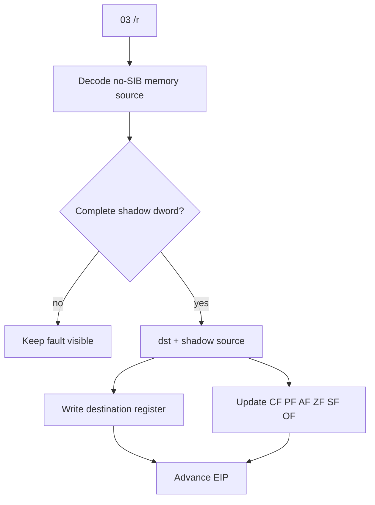

# Shadow memory `03 /r` ADD 설계

## 배경

DS zero-page read를 통과한 뒤 `piu_1st`는 relocated base + `0x000F7BAD`의 `03 07`에서 중단된다.

```asm
add eax, dword ptr [edi]
```

예외 시점 `EDI=0x026E49C4`는 기존 allocator metadata shadow 범위에 있다. 실제 Win32 memory에는 mapping이 없지만 shadow memory에는 원본 코드가 앞서 기록한 dword가 존재한다.

## 처리 흐름



## 범위

* opcode `03 /r`만 처리한다.
* 기존 no-SIB ModRM decoder가 지원하는 memory addressing만 허용한다.
* source 4바이트가 shadow memory에 모두 존재해야 한다.
* destination은 ModRM reg field가 지정한 32-bit general register다.
* `CF`, `PF`, `AF`, `ZF`, `SF`, `OF`를 32-bit ADD 결과에 맞게 갱신하고 나머지 EFLAGS는 보존한다.
* 실제 guest memory source는 CPU가 직접 실행하므로 이 fault HLE의 범위로 확대하지 않는다.

## 검증

Win32 x86 build와 전체 테스트를 실행하고 `0x000F7BAD` 통과 후 다음 blocker를 기록한다.

# Shadow-Memory `03 /r` ADD Design

After the DS zero-page read, execution stops at `03 07` at relocated offset `0x000F7BAD`, or `add eax, dword ptr [edi]`. `EDI=0x026E49C4` lies inside existing allocator-metadata shadow memory.

Handle only opcode `03 /r`, addressing forms supported by the existing no-SIB decoder, and sources whose complete dword exists in shadow memory. Write the ModRM-selected 32-bit destination register, update `CF/PF/AF/ZF/SF/OF` according to 32-bit ADD semantics, preserve unrelated EFLAGS, and advance EIP. Real mapped memory remains on the direct CPU path.
