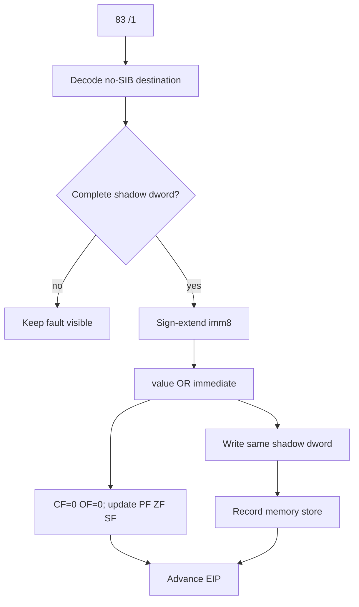

# Shadow memory `83 /1` OR read-modify-write 설계

## 배경

shadow-source `03 07` ADD를 통과한 뒤 relocated base + `0x000F7AD4`에서 다음 명령이 관찰된다.

```asm
83 0E 01
or dword ptr [esi], 1
```

예외 시점 `ESI`는 기존 allocator metadata shadow 주소다. 명령은 dword를 읽고 bit 0을 설정한 뒤 같은 주소에 쓰는 read-modify-write다.

## 처리 흐름



## 범위와 flags

* opcode `83`, ModRM reg field `/1`인 OR만 처리한다.
* 기존 no-SIB memory decoder가 지원하는 destination만 허용한다.
* destination 4바이트가 shadow memory에 모두 존재해야 한다.
* imm8을 32-bit로 sign extension한 뒤 OR한다.
* 결과를 같은 shadow address에 dword로 기록한다.
* `CF`와 `OF`를 0으로 하고 `PF`, `ZF`, `SF`를 결과에 맞게 갱신한다.
* Intel에서 undefined인 `AF`는 HLE가 임의 값을 만들지 않도록 보존한다.
* store diagnostic에는 opcode `0x83`, source kind `or-imm8`로 기록한다.

## 검증

Win32 x86 build, 전체 테스트, 제한 시간 반복 실행으로 `0x000F7AD4` 통과와 다음 blocker를 확인한다.

# Shadow-Memory `83 /1` OR Read-Modify-Write Design

After the shadow-source ADD, execution reaches `83 0E 01` at relocated offset `0x000F7AD4`, or `or dword ptr [esi], 1`, where `ESI` is existing allocator-metadata shadow memory.

Handle only opcode `83` with ModRM group `/1`, no-SIB memory destinations supported by the existing decoder, and complete shadow dwords. Sign-extend imm8, OR it with the value, write the result back to the same shadow address, clear `CF/OF`, update `PF/ZF/SF`, preserve undefined `AF`, record the store as `or-imm8`, and advance EIP.
