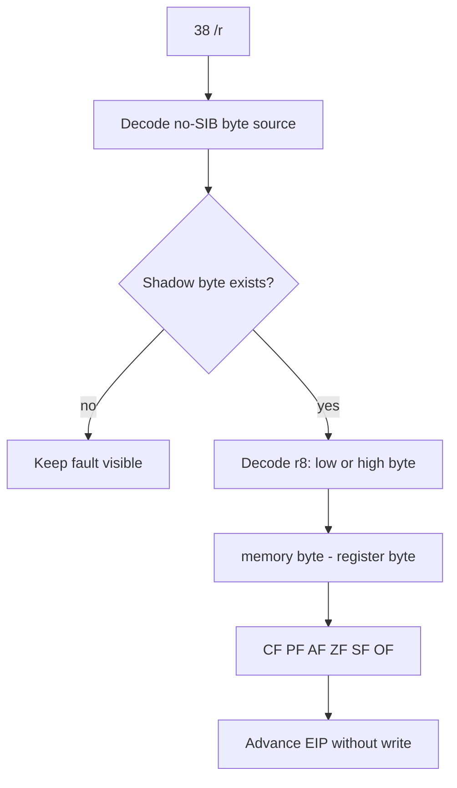

# Shadow memory `38 /r` byte CMP 설계

## 배경

shadow OR read-modify-write를 통과한 뒤 relocated base + `0x000F5F34`에서 다음 명령이 관찰된다.

```asm
38 10
cmp byte ptr [eax], dl
```

`EAX`는 기존 allocator metadata shadow dword 다음 field 주소이고 `DL=0`이다. CMP는 memory를 변경하지 않고 subtraction 결과의 flags만 반영한다.

## 처리 흐름



## 범위

* opcode `38 /r`만 처리한다.
* 기존 no-SIB decoder가 지원하는 memory addressing만 허용한다.
* memory source byte가 shadow memory에 존재해야 한다.
* ModRM reg field의 `AL/CL/DL/BL/AH/CH/DH/BH` encoding을 지원한다.
* byte subtraction 결과로 `CF`, `PF`, `AF`, `ZF`, `SF`, `OF`를 갱신한다.
* CMP이므로 shadow memory와 register 값은 변경하지 않는다.

## 검증

Win32 x86 build, 전체 테스트, 제한 시간 반복 실행으로 `0x000F5F34` 통과와 다음 blocker를 확인한다.

# Shadow-Memory `38 /r` Byte CMP Design

After the shadow OR read-modify-write, execution reaches `38 10` at relocated offset `0x000F5F34`, or `cmp byte ptr [eax], dl`. EAX addresses the next shadow allocator-metadata field and DL is zero.

Handle only no-SIB `38 /r` forms whose memory byte exists in shadow memory. Decode all ModRM byte-register forms, compute byte subtraction flags `CF/PF/AF/ZF/SF/OF`, change no register or memory value, and advance EIP.
