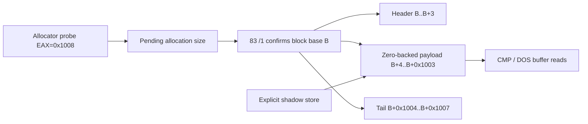

# Allocator payload bounded shadow zero backing 설계

## 관찰 근거

`0x000F7A71`의 allocator probe에서 `EAX=0x1008`이 관찰된다. allocator가 반환한 block base를 `B`라고 할 때 후속 실행은 다음 관계를 보인다.

* OR header: `B`
* 반환 payload pointer: `B+4`
* DOS read buffer: `B+4`
* DOS read 요청: `0x1000` bytes
* 다음 block/tail 경계: `B+0x1008`

따라서 요청 `0x1008`은 header 4 + payload `0x1000` + tail 4 구조와 일치한다.

## 설계

* DS zero-page `8B /r` allocator probe가 source 0이고 `EAX` 요청 크기가 관찰로 확인된 `0x2C` 또는 `0x1008`이면 pending allocation size로 기록한다.
* shadow `83 /1` OR가 block header를 확정할 때 pending size를 소비해 payload zero range를 등록한다.
* payload range는 `[block_base+4, block_base+request_size-4)`다.
* shadow read는 explicit byte를 우선하고, 없을 때만 등록된 payload range에서 0을 반환한다.
* explicit shadow store는 zero backing 위에 값을 덮어쓴다.
* header, tail, payload 밖의 miss는 계속 fault다.

## 제외 범위

임의의 shadow min/max hole, 모든 allocator block, DOS low memory를 0으로 간주하지 않는다. 관찰된 probe와 header 확정이 같은 실행 흐름에서 연결된 한 범위만 등록한다. 초기의 넓은 크기 허용은 allocator와 무관한 `EAX` 값을 크기로 오인해 host heap 손상을 일으켰으므로 사용하지 않는다.

# Bounded Shadow Zero Backing for Allocator Payloads

The observed allocator request `0x1008`, returned payload pointer `B+4`, DOS read size `0x1000`, and next boundary `B+0x1008` consistently describe a 4-byte header, 4096-byte payload, and 4-byte tail.

Record only the confirmed request sizes `0x2C` and `0x1008` at the DS-zero-page allocator probe, consume the pending size when shadow `83 /1` confirms block base `B`, and register only `[B+4, B+size-4)` as zero-backed payload. Explicit shadow bytes take priority. Header, tail, unrelated holes, arbitrary misses, and unconfirmed sizes remain faults.
