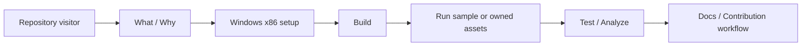

# 프로젝트 README 설계

## 목적

저장소 첫 방문자가 rePIU의 목적, 현재 완성도, 요구 환경, 빌드·실행·검증 방법과 기여 규칙을 한 문서에서 파악할 수 있게 한다. 원본 게임 로직을 보존하고 DOS/DPMI/하드웨어만 HLE로 대체한다는 프로젝트 경계를 가장 먼저 설명한다.

## 내용 정책

* 현재 구현과 미래 목표를 구분하고 프로젝트를 완성된 게임 런처로 표현하지 않는다.
* 저장소에 없는 원본 PIU 자산, CI, 정식 license file 또는 contribution file이 있다고 주장하지 않는다.
* 저장소 내부 문서는 모두 상대 링크로 연결한다.
* 실제 `scripts/`와 built-in target profile에 존재하는 명령만 예제로 제공한다.
* 상세 바이너리 분석과 기술 설명은 `docs/analysis/`, `docs/kb/`, `ARCHITECTURE.md`로 위임한다.

# Project README Design

The root README will give new developers an accurate path from project purpose through Windows x86 setup, build, sample execution, testing, analysis, support, and contribution. It will clearly distinguish the experimental current implementation from future goals, disclose that proprietary assets are not included, use repository-relative documentation links, and include only commands supported by the current scripts and target profiles.
