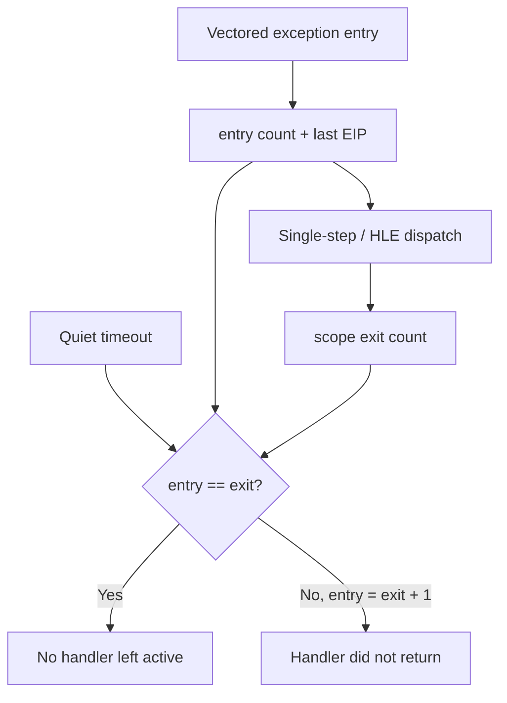

# Exception dispatch liveness 진단 설계

## 문제

quiet timeout은 HLE progress와 single-step counter가 더 이상 변하지 않았다는 사실만 보여 준다. 마지막 single-step은 relocated offset `0xF4DC1`에서 반복되지만, guest가 native loop에 들어간 것인지 vectored exception handler 내부에서 반환하지 못한 것인지 현재 출력만으로 구분할 수 없다.

과거 `SuspendThread/GetThreadContext`는 같은 timeout 상태에서 loader를 멈추게 했으므로 다시 사용하지 않는다.

## 설계

* vectored exception handler가 유효한 guest context를 받은 직후 atomic entry counter와 last entry EIP를 기록한다.
* RAII scope의 destructor에서 atomic exit counter를 증가시켜 모든 정상 return 경로를 빠짐없이 센다.
* polling thread는 기존 progress 판단을 바꾸지 않고, guest 종료 또는 timeout 뒤 atomic 값을 attempt로 복사한다.
* loader는 entry, exit, outstanding dispatch 수와 last entry EIP를 출력한다.
* `entry == exit`이면 timeout 순간 handler가 활성 상태가 아니었음을 뜻한다. `entry == exit + 1`이면 마지막 EIP 처리 중 handler가 반환하지 못했다는 직접 증거다.
* 이 진단은 guest thread를 suspend하지 않고 게임 코드, EIP, flag 또는 handler 선택을 변경하지 않는다.

# Exception Dispatch Liveness Diagnostic Design

Quiet timeout currently cannot distinguish native guest execution from a vectored exception handler that never returned. Forced thread suspension previously hung this loader state and remains disabled. Record atomic handler-entry and scope-exit counts plus the last entry EIP inside the existing exception route. Equal counts mean no dispatch remained active; one outstanding entry directly identifies a handler that failed to return. This observation does not alter polling, guest state, flags, instruction selection, or control flow.
