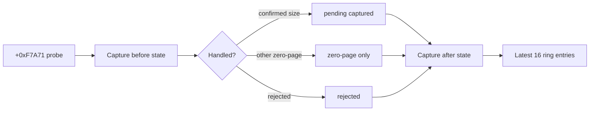

# Allocator probe bounded trace 설계

## 목적

relocated offset `0xF7A71`의 `8B 16` allocator probe가 수만 번 반복되는 동안 operand와 pending allocation 상태가 어떻게 변하는지 확인한다. 전체 이력을 무제한 저장하지 않고 최근 16개 관측만 ring buffer에 유지한다.

## 관측 필드

* monotonic sequence
* EAX request candidate
* ESI와 decoded source
* guest DS selector
* pending valid/size before and after
* result: `captured`, `pending-preserved`, `zero-page`, `rejected`

## 정책

* exact relocated offset `0xF7A71`만 기록한다.
* capacity는 16으로 고정하고 오래된 entry를 덮어쓴다.
* trace는 진단 전용이며 register, memory, flag, pending 판단 또는 control flow를 변경하지 않는다.
* loader는 총 관측 수와 최신 entry를 sequence 순서로 출력한다.

# Allocator Probe Bounded Trace Design

Trace only the allocator probe at relocated offset `0xF7A71`, retaining the latest 16 observations in a fixed ring. Each entry records sequence, EAX, ESI/decoded source, guest DS, pending allocation state before and after, and a bounded result classification. The trace is diagnostic only and does not alter registers, memory, flags, pending-allocation decisions, or control flow. Loader output reports the total count and prints retained entries chronologically.
