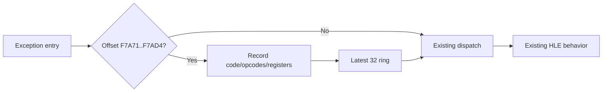

# Allocator control-flow exception trace 설계

## 목적

allocator probe `+0xF7A71`에서 header OR `+0xF7AD4`까지의 범위에서 실제로 발생하는 exception 순서를 관찰해 어느 instruction과 상태가 반복되는지 확인한다. 모든 instruction을 재해석하지 않고 기존 vectored exception 경로에 들어온 사건만 기록한다.

## 관측 필드

* monotonic sequence와 relocated EIP offset
* exception code와 instruction 첫 4 bytes
* EAX, EDX, ESI, EDI, EFLAGS
* pending allocation valid/size

## 안전 범위

* exact allocator code range `[0xF7A71, 0xF7AD5)`만 기록한다.
* 최근 32개만 ring에 보존한다.
* guest EIP가 runtime image 안에 있을 때만 opcode bytes를 읽는다.
* 기존 exception dispatch 순서, context, flag, pending state와 timeout 판정을 변경하지 않는다.

# Allocator Control-Flow Exception Trace Design

Record only existing vectored-exception entries in relocated allocator range `[0xF7A71, 0xF7AD5)`. A fixed latest-32 ring stores sequence, relocated EIP, exception code, four opcode bytes, EAX/EDX/ESI/EDI/EFLAGS, and pending allocation state. Opcode bytes are read only from a validated runtime-image EIP. The trace does not alter dispatch order, context, flags, pending state, or timeout policy.
