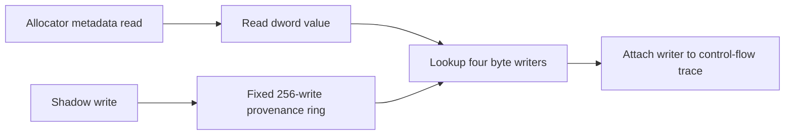

# Shadow allocator link provenance 설계

## 목적

allocator가 `[ESI+8]` next link를 읽을 때 그 dword를 마지막으로 기록한 guest instruction을 연결한다. shadow memory 값뿐 아니라 writer provenance를 유지해 null 또는 `0xFF000000` link가 어디서 만들어졌는지 확인한다.

## 설계

* 최근 256개 shadow write의 sequence, writer EIP, opcode, destination, value와 width를 고정 ring에 보존한다.
* allocator range를 `0xF7A60..0xF7AD4`로 넓히고 `8B /r` metadata read가 성공하면 최근 control-flow entry에 source/value를 추가한다.
* `+0xF7A62`의 allocator root field가 0이 된 첫 사건을 별도로 보존한다.
* 하나의 write 범위가 읽은 dword 네 byte를 모두 포함할 때만 complete writer로 판정한다.
* exception handler 안에서 heap allocation이 발생하지 않도록 provenance에 동적 container를 사용하지 않는다.
* public trace에는 read address/value와 writer 유효성 및 writer metadata를 포함한다.
* provenance는 진단 정보이며 shadow value, handler 선택, register와 flag를 바꾸지 않는다.

# Shadow Allocator Link Provenance Design

Maintain the latest 256 shadow writes in a fixed provenance ring and attach a writer to successful allocator metadata reads when one write covers all four bytes. Provenance records write sequence, writer EIP/opcode, destination, value, and width. Dynamic containers are forbidden in this exception-handler diagnostic path. The allocator control-flow trace exposes read address/value and its writer without modifying shadow values, handler selection, registers, or flags.
