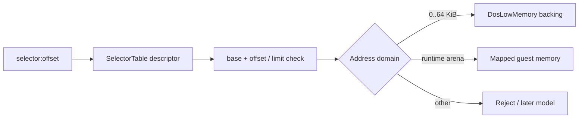

# DPMI selector와 low-memory model 설계

## 목적

Win32 trampoline에 흩어진 `guest_ds`와 `offset < 64 KiB` zero fallback을 공용 runtime model로 옮긴다. guest segment selector는 descriptor를 통해 linear address domain을 선택하고, base zero의 low-memory descriptor는 명시적인 64 KiB backing을 읽는다.

## 구조

* `DosLowMemory`는 고정 64 KiB byte backing과 checked byte/dword read/write API를 제공한다.
* `SelectorTable`은 selector, base, limit, present descriptor를 보존하고 checked linear address translation을 제공한다.
* observed guest segment load는 아직 DPMI descriptor API가 없으므로 base `0`, limit `0xFFFF` descriptor를 등록한다.
* DS/FS low-memory read는 selector table을 거쳐 `DosLowMemory`를 사용한다.
* generic `8B /r` low-memory fallback도 active DS descriptor translation이 성공할 때만 처리한다.

## 초기 상태

low-memory backing은 이번 단계에서 0으로 초기화한다. IVT, BIOS data, DOS extender private state 또는 allocator sentinel 값은 근거 없이 합성하지 않는다. 이후 관찰된 DPMI/DOS service 또는 executable bootstrap 근거가 생기면 별도 initializer로 추가한다.

# DPMI Selector and Low-Memory Model Design

Replace scattered guest-selector and “offset below 64 KiB means zero” rules with shared runtime state. `DosLowMemory` owns a checked fixed 64 KiB backing. `SelectorTable` gains checked selector-base translation. Observed segment loads register a provisional base-zero, 64 KiB descriptor until descriptor-management DPMI calls are implemented. DS/FS and generic `8B /r` low-memory reads must translate through this state. The backing remains zero-initialized; no IVT, BIOS, extender-private, or allocator-sentinel values are invented without evidence.
