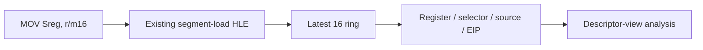

# Segment load provenance 설계

## 목적

selector `0x2C`와 기타 guest selector가 어느 EIP에서 DS/ES/SS/FS/GS에 로드되는지 최근 이력으로 확인한다. environment view와 allocator low-memory view 사이에 실제 segment 변경이 있는지 판별한다.

## 설계

* existing `RecordGuestSegmentLoad`에서 최근 16개를 allocation-free ring에 기록한다.
* sequence, relocated EIP, segment register, selector와 source address/value를 보존한다.
* loader는 chronological order로 출력한다.
* segment state와 descriptor registration 의미는 변경하지 않는다.

# Segment Load Provenance Design

Record the latest 16 existing segment-load HLE events in a fixed ring, including sequence, relocated EIP, target segment register, selector, and source. Chronological loader output will determine whether DS/FS changes separate the environment and allocator views. The trace does not alter segment shadow state or descriptor registration.
