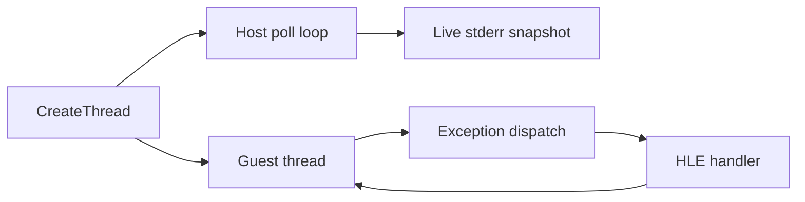

# 동일 프로세스 live execution telemetry 설계

## 목적

실제 DOS4GW selector binding을 활성화한 PIU 실행은 최종 `Win32MinimalExecutionAttempt`를 반환하지 않는다. 반환 후 복사되는 기존 진단만으로는 host polling 이전, polling 중, exception handler 내부 중 어디에서 정지했는지 구분할 수 없다.

## 설계

* guest와 host가 공유하는 `ThreadContext`에는 lock-free atomic heartbeat와 phase를 둔다.
* exception dispatch entry/exit에서 heartbeat와 마지막 EIP를 갱신한다.
* host poll loop는 시작 직후와 1초 간격으로 atomic snapshot을 직접 stderr에 기록한다.
* 출력은 guest 종료나 `CopyThreadObservationToAttempt`에 의존하지 않는다.
* 첫 단계에서는 동일 프로세스 안의 telemetry만 사용한다.
* host poll snapshot도 출력되지 않거나 도중에 완전히 중단되는 증거가 있으면 별도 supervisor/shared-memory 설계로 전환한다.

# In-Process Live Execution Telemetry Design

With real DOS4GW selector bindings enabled, PIU does not return a final `Win32MinimalExecutionAttempt`. Add lock-free atomic heartbeat and phase state shared by the guest and host threads. Exception dispatch updates the heartbeat and last EIP, while the host poll loop writes an immediate snapshot and one snapshot per second directly to stderr without waiting for guest termination. Escalate to an external supervisor and shared memory only if in-process polling output itself cannot be recovered.
