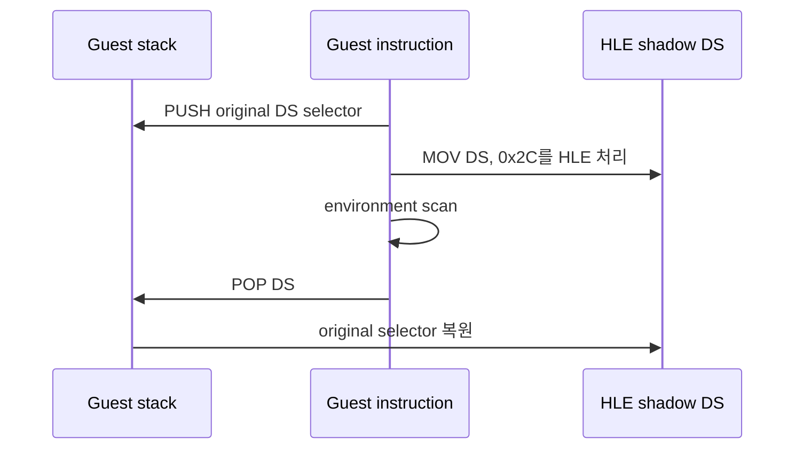

# shadow segment POP 동기화 설계

PIU startup의 relocated `+0xF4DA2`는 16:16 far pointer에서 selector `0x2C`를 읽어 DS에 설치한다. 환경 블록 스캔 후 `+0xF4DD5`의 `POP DS`가 원래 selector를 복원한다.

현재 `MOV DS`는 single-step HLE가 선처리하지만 유효한 Windows selector를 복원하는 `POP DS`는 네이티브로 성공하여 shadow DS가 갱신되지 않는다. 관찰된 opcode `1F`의 32비트 stack 형식만 선처리한다.

* `[ESP]`에서 16비트 selector를 읽는다.
* shadow DS와 segment load trace를 갱신한다.
* 32비트 stack 규칙에 따라 ESP를 4 증가시킨다.
* EIP를 1 증가시키고 trace flag를 유지한다.
* guest stack 범위 밖이면 처리하지 않고 기존 fault 정책을 유지한다.
* memory access violation HLE 뒤에도 다음 명령을 추적하도록 guest 예외 dispatch에서 TF를 보존한다.

# Shadow Segment POP Synchronization Design

PIU temporarily loads DS=`0x2C` from a 16:16 far pointer at relocated `+0xF4DA2` and restores the original selector with `POP DS` at `+0xF4DD5`. MOV DS is preprocessed by single-step HLE, but the valid native POP DS succeeds without updating shadow state. Preprocess only the observed unprefixed opcode `1F`: read the 16-bit selector from `[ESP]`, update shadow DS and trace, advance the 32-bit stack by four bytes, and advance EIP by one. Reject out-of-range guest stacks.

Preserve TF at guest exception-dispatch entry so tracing continues after an access-violation instruction is handled by HLE.
