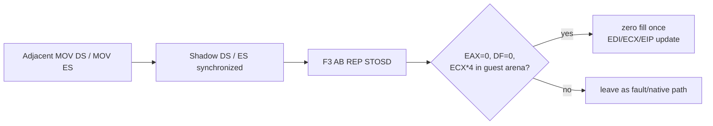

# 연속 segment load와 REP STOSD HLE 설계

PIU startup `+0xF4D91`에는 `MOV DS,BX`와 `MOV ES,DX`가 연속한다. 첫 명령을 single-step HLE가 건너뛰면 다음 명령은 trap 전에 네이티브 실행되어 shadow ES 갱신이 누락된다. segment load handler는 다음 명령도 지원되는 segment load라면 같은 dispatch에서 연속 처리한다.

`+0xF4E17`의 `REP STOSD`는 EAX=0, DF=0 상태로 guest arena를 초기화한다. TF 상태의 native REP는 반복마다 debug exception을 발생시키므로 다음 조건에서 일괄 HLE 처리한다.

범위 계산은 64비트로 overflow를 검사하고 destination 전체가 writable guest arena 안일 때만 수행한다.

# Adjacent Segment Loads and REP STOSD HLE Design

PIU has adjacent MOV DS and MOV ES instructions at `+0xF4D91`. When HLE advances past the first instruction, the CPU can execute the second before the next trap, leaving shadow ES stale. Consume consecutive supported segment loads in the same dispatch. At `+0xF4E17`, preprocess the observed zero-fill `F3 AB` only when EAX=0, DF=0, and the full 64-bit-checked ECX×4 destination span is writable guest arena memory. Zero the span once, advance EDI, clear ECX, and advance EIP by two.
