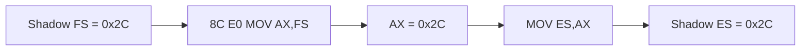

# shadow segment register store 설계

PIU `+0xFC717`의 `8C E0`은 FS selector를 AX에 복사한 뒤 `+0xFC71F`에서 ES로 전달한다. 네이티브 실행은 Win32 FS=`0x53`을 노출하지만 원본 guest 의미는 shadow FS=`0x2C`이다.

opcode `8C /r` 중 ModR/M `mod=3` register-direct 형식만 처리한다. segment register 번호가 ES/SS/DS/FS/GS 중 하나인지 확인하고 shadow selector를 목적 register 하위 16비트에 기록한다.

# Shadow Segment Register Store Design

PIU opcode `8C E0` at `+0xFC717` copies FS into AX and then transfers it to ES at `+0xFC71F`. Native execution leaks Win32 FS=`0x53`; guest semantics require shadow FS=`0x2C`. Handle only observed opcode-8C register-direct forms (`mod=3`), validate the segment register, write its shadow selector to the destination register's low 16 bits, and advance EIP by two.
