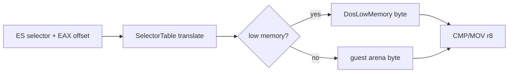

# descriptor-backed segment override byte 연산 설계

PIU `+0xFC723`은 ES=`0x2C`로 object 3의 byte sequence를 순회한다. 관찰된 명령은 `CMP DL,ES:[EAX]`와 `MOV DH,ES:[EAX]`다.

`ReadSegmentByte`에 descriptor translation fallback을 추가한다. 관찰된 ES prefix `26`, opcode `3A`/`8A`, ModR/M `mod=0, r/m=EAX` 형식만 decode한다. CMP는 x86 CF/PF/AF/ZF/SF/OF를 갱신하고 MOV는 AL/CL/DL/BL/AH/CH/DH/BH 중 목적 byte register를 갱신한다.

# Descriptor-Backed Segment-Override Byte Operation Design

At `+0xFC723`, PIU traverses object-3 bytes through ES=`0x2C` using CMP DL,ES:[EAX] and MOV DH,ES:[EAX]. Add a descriptor-translation fallback to `ReadSegmentByte`, routing translated low addresses to DOS low memory and mapped addresses to the guest arena. Decode only observed ES-prefix opcode-3A/8A forms with `mod=0, r/m=EAX`. CMP updates x86 arithmetic flags and MOV updates the selected 8-bit register.
