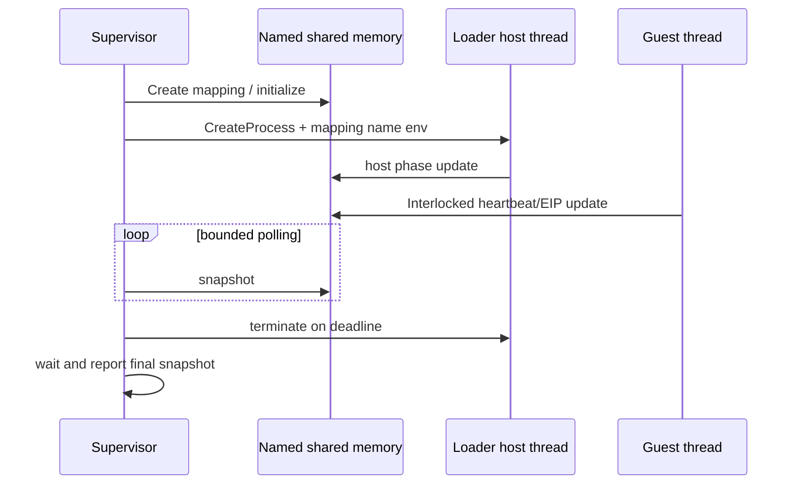

# 외부 telemetry supervisor 설계

## 근거

descriptor byte frontier 이후 child 내부 host poll과 live stderr가 함께 멈췄다. child process 내부 상태에 의존하지 않는 관찰 경계가 필요하다.

## 경계

* shared block은 고정 magic/version과 32비트 interlocked field만 사용한다.
* child는 환경 변수로 mapping 이름을 받고 `OpenFileMapping`한다.
* exception dispatch entry/exit, last EIP, heartbeat와 host phase를 shared block에 기록한다.
* supervisor는 loader와 같은 디렉터리에서 child를 실행하고 지정 timeout 후 종료·join한다.
* child stdout/stderr와 무관하게 supervisor snapshot은 별도 프로세스에서 출력된다.

# External Telemetry Supervisor Design

After the descriptor-byte frontier, both the child host poll and live stderr stop. Create a named shared-memory block with fixed magic/version and 32-bit interlocked fields. The child opens the mapping named by an environment variable and writes host phase, exception heartbeat, entry/exit counts, and last EIP. A separate supervisor launches the loader, polls snapshots independently of child output, terminates the child at a bounded deadline, joins it, and reports the final snapshot.
