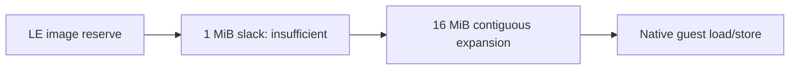

# 실제 contiguous runtime arena 확장 설계

Supervisor는 allocator 객체 주소 `0x026E3578`이 기존 arena end `0x026D7000`을 약 `0xC578` 초과함을 확인했다. shadow opcode 확장 대신 원본 x86 코드가 직접 접근할 실제 메모리를 제공한다.

첫 검증 단계는 현재 Win32 placement 계약을 유지하면서 expansion을 16 MiB로 늘려 전체 contiguous 범위를 reserve/commit한다. allocator boundary fault와 heap corruption이 사라지는지 supervisor로 검증한다. 성공 후 reserve와 commit frontier 분리는 별도 단계로 수행한다.

# Contiguous Runtime Arena Expansion Design

The supervisor confirmed allocator object address `0x026E3578`, about `0xC578` beyond the existing arena end `0x026D7000`. Provide real memory directly accessible by original x86 code instead of extending opcode-specific shadow backing. The first validation step preserves the current Win32 placement contract and increases contiguous expansion from 1 MiB to 16 MiB, reserving and committing the full range. After proving the allocator-boundary fault disappears, reserve capacity and demand-commit frontier can be separated in a follow-up step.
