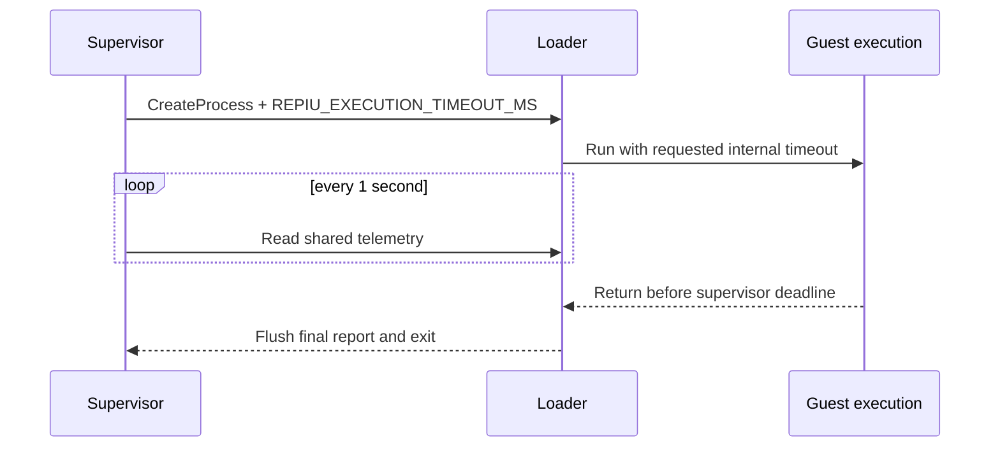

# 장시간 실행 관찰 설계

## 목적

기존 loader 내부 실행 제한 1초는 빠른 회귀 검증에 유용하지만, supervisor의 제한을 늘려도 자식이 먼저 종료되어 장시간 진행을 관찰할 수 없다. 기본 동작은 유지하면서 supervisor 실행에서만 실제 guest 실행 시간을 늘린다.

## 시간 계약

* loader 단독 실행의 기본 제한은 1,000ms로 유지한다.
* `REPIU_EXECUTION_TIMEOUT_MS`가 유효하면 loader가 그 값을 사용한다.
* supervisor는 자신의 전체 제한보다 1,000ms 짧은 값을 자식에게 전달하여 최종 상태 출력과 정상 종료 시간을 확보한다.
* supervisor 제한이 2,000ms 미만이면 자식 제한은 최소 1,000ms로 고정한다.
* 환경 변수 값은 양의 32비트 정수만 허용하고 잘못된 값은 기본값으로 대체한다.

# Extended Execution Observation Design

## Purpose

The loader's existing one-second internal limit is useful for fast regression checks, but it makes a longer supervisor deadline ineffective because the child exits first. Preserve the default while extending actual guest execution only under the supervisor.

## Timing contract

* Standalone loader execution keeps the 1,000ms default.
* The loader uses a valid `REPIU_EXECUTION_TIMEOUT_MS` value when present.
* The supervisor passes a child timeout 1,000ms shorter than its own deadline, leaving time for the final report and orderly exit.
* Supervisor deadlines below 2,000ms produce a minimum child timeout of 1,000ms.
* Only positive 32-bit integer values are accepted; invalid values fall back to the default.
