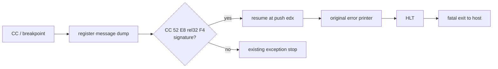

# 원본 fatal tail 계속 실행 설계

## 목적

원본 DLL loader의 fatal 경로에서 `INT 3` 진단을 보존하면서 뒤의 원본 메시지 출력 함수와 `HLT`까지 실행한다. 모든 breakpoint를 건너뛰지 않고 확인된 fatal-tail instruction signature에만 적용한다.

## 규칙

* exception code가 breakpoint이고 context EIP 직전 byte가 `0xCC`인지 확인한다.
* context EIP부터 `52 E8 ?? ?? ?? ?? F4`인지 guest readable range에서 확인한다.
* `EDX`의 ASCIZ 문자열을 bounded read하여 진단 상태에 저장한다.
* Windows breakpoint context는 다음 명령을 가리키므로 EIP를 증가시키지 않는다.
* 이 breakpoint를 통과한 뒤의 `HLT`만 fatal 종료로 처리한다.
* 다른 `INT 3`와 `HLT`는 기존 미처리 정책을 유지한다.

# Original Fatal-Tail Continuation Design

Preserve diagnostics at the original DLL loader breakpoint while allowing its error printer and terminal `HLT` to execute. Continue only when a breakpoint context points immediately after `0xCC` and the following guest-readable bytes match `52 E8 rel32 F4`. Capture a bounded ASCIZ message from `EDX`, do not increment the already-advanced Windows breakpoint EIP, and treat only the subsequent `HLT` as a fatal return to the host. All other breakpoints and halts retain the existing stop policy.
