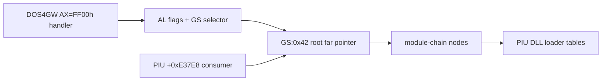

# DOS/4G private environment 분석 설계

## 목적

PIU 시작 코드가 `INT 21h AX=FF00h` 성공 뒤 `GS`로 받는 DOS/4G private structure를 복원한다. DOS4GW provider 측 handler와 PIU consumer 측 `GS:0x42` 순회를 교차 분석해 필요한 최소 필드만 확정한다.

## 증거 기준

* 반환 register와 flag는 DOS4GW binary의 provider code로 확인한다.
* 구조 field는 PIU consumer의 실제 load width와 offset으로 확인한다.
* inferred field와 confirmed field를 구분한다.
* 성공 경로에 필요하지 않은 전체 extender 내부 구조는 구현 범위에서 제외한다.

# DOS/4G Private Environment Analysis Design

Recover the DOS/4G private structure returned to PIU through `GS` after a successful `INT 21h AX=FF00h`. Cross-reference the DOS4GW provider handler with PIU's consumer traversal beginning at `GS:0x42`, distinguish confirmed fields from inferences, and define only the fields required by the observed successful path rather than reproducing the entire extender internals.
