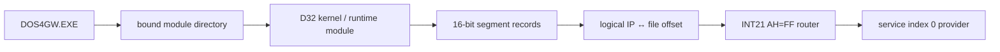

# DOS4GW 결합 모듈·segment map 복원 설계

## 목적

DOS4GW.EXE 안에 결합된 runtime module의 directory, segment base, logical IP와 file offset 관계를 복원하여 `INT 21h AX=FF00h` service index 0 provider를 정확히 디스어셈블한다.

## 원칙

* 기존에 확인된 `LINEXE.EXP` file range와 동일한 방법으로 다른 결합 모듈의 범위를 찾는다.
* 문자열 위치만으로 code address를 추정하지 않고 directory/segment record로 변환을 검증한다.
* 하나의 logical address가 여러 segment에 존재할 수 있으므로 selector/segment identity를 함께 기록한다.
* 외부 자료는 Open Watcom source 또는 공식 format 문서를 우선하고 링크를 남긴다.

# DOS4GW Bound-Module and Segment-Map Recovery Design

Recover the directory, segment bases, and logical-IP-to-file-offset mapping of runtime modules bound into DOS4GW.EXE so the `INT 21h AX=FF00h` service-zero provider can be disassembled accurately. Reuse evidence from the known `LINEXE.EXP` range, validate mappings through directory and segment records rather than string proximity, retain segment identity where logical addresses overlap, and prefer Open Watcom source or official format documentation for external evidence.
