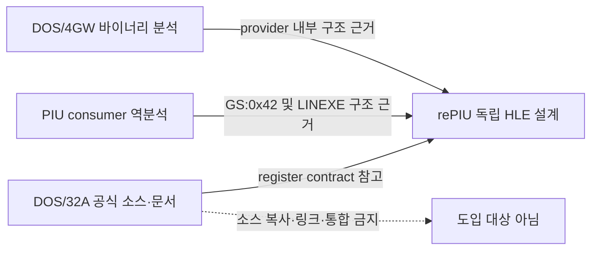

# DOS/32A 동작 참고 및 독립 구현 경계 설계

## 목적

DOS/32A를 DOS/4GW 호환 동작의 보조 증거로 사용하되 소스 코드를 복사·변형·통합하지 않는다. rePIU 구현은 원본 PIU 실행 관찰과 DOS/4GW 분석을 주 근거로 하는 독립 구현으로 유지한다.

## 확인된 참고 범위

[DOS/32A의 INT 21h 구현](https://github.com/amindlost/dos32a/blob/master/src/dos32a/text/client/int21h.asm)은 `AX=FF00h`, `DX=0078h` 호출에 `EAX=FFFF3447h`와 client data selector인 `GS`를 반환한다. [공식 호출 문서](https://github.com/amindlost/dos32a/blob/master/docs/html/prog/int21h/0ff00.htm)도 식별 signature를 설명한다. 이 내용은 rePIU가 식별 호출의 register contract를 검증하는 교차 참고 자료로 사용한다.

반면 DOS/32A 저장소에서는 PIU가 요구하는 `LINEXE_LOADER`, `LINEXE_LOADMODULE`, `LINEXE_FREEMODULE`, `GETLOADTABLE`, `GETLOADNAME` 구현 근거를 확인하지 못했다. 따라서 drop-in compatibility가 Rational DOS/4G의 모든 private environment layout을 동일하게 제공한다는 결론으로 확대하지 않는다.

## 구현 경계

* DOS/32A 코드는 저장소에 vendor하거나 번역하여 옮기지 않는다.
* 코드 주석과 분석 문서에 참고 URL과 참고 범위를 명시한다.
* `EAX=FFFF3447h`, `GS` 반환은 private environment가 준비된 뒤 하나의 원자적 성공 계약으로 구현한다.
* `GS:0x42` module chain과 `LINEXE_*` export는 PIU consumer 및 DOS/4GW 원본 증거로 독립 복원한다.
* 단순히 signature만 성공으로 반환하고 유효하지 않은 `GS`를 제공하지 않는다.

# DOS/32A Behavioral Reference and Clean-Room Boundary

Use DOS/32A only as corroborating evidence for DOS/4GW-compatible behavior; do not copy, translate, link, or integrate its source. The official implementation confirms that `AX=FF00h`, `DX=0078h` returns `EAX=FFFF3447h` and a client-data selector in `GS`. It does not establish that DOS/32A reproduces PIU's Rational `LINEXE_*` private module chain. rePIU therefore treats the register contract as a cross-reference while deriving `GS:0x42` independently from PIU and DOS/4GW evidence. Success must expose both the signature and a valid private environment atomically.
