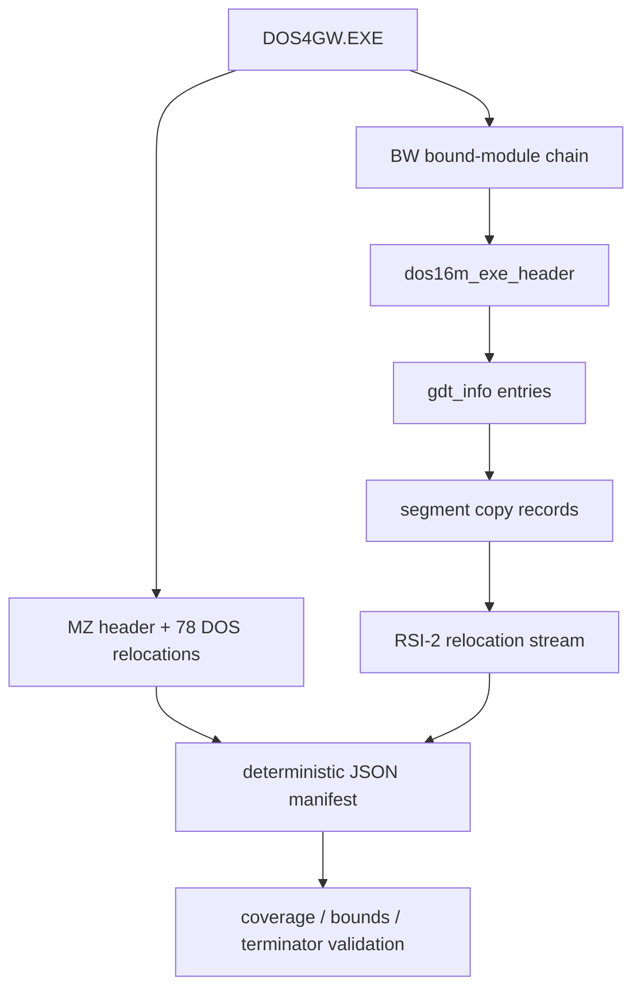

# DOS/16M resident loader copy/relocation table 정적 복원 설계

## 목표

DOS4GW.EXE에 포함된 DOS/16M resident MZ image와 다섯 BW EXP module을 실행하지 않고 해석하여, loader가 복사하는 file range와 적용하는 relocation 항목 전체를 재현 가능한 manifest로 복원한다.

## 포맷 해석

[Open Watcom `exe16m.h`](https://github.com/open-watcom/open-watcom-v2/blob/master/bld/watcom/h/exe16m.h)의 `dos16m_exe_header`와 `gdt_info`를 포맷 근거로 사용한다. [Open Watcom `load16m.c`](https://github.com/open-watcom/open-watcom-v2/blob/master/bld/wl/c/load16m.c)는 group image가 paragraph 정렬로 기록되고, RSI-2가 `selector`, `count`, `count개의 offset` block으로 이어지며 마지막 selector의 bit 1이 종료 표식임을 확인하는 보조 근거다. 외부 코드는 복사하지 않고 필드 의미와 직렬화 규칙만 참고한다.

각 BW module에서 `first_selector`부터 `first_reloc_sel` 직전까지가 load group이다. `gdtlen + 1`은 file copy 길이이며 `gdtreserved & 0x2000`인 zero-length/BSS group은 file byte를 소비하지 않는다. group file range는 header와 추가 GDT entry 뒤부터 selector 순서대로 배치되고 paragraph boundary로 정렬된다. 그 직후부터 `next_header_pos`까지가 RSI-2 stream과 zero padding이다.

## 산출물과 불변 조건

* `tools/analysis/dos16m_resident_tables.py`: read-only binary parser 및 manifest generator
* `docs/analysis/dos16m-resident-copy-relocation-table.json`: 모든 MZ/BW copy 및 relocation entry
* `docs/analysis/dos16m-resident-copy-relocation-table.md`: 사람이 읽을 수 있는 요약과 mapping

parser는 signature, file bounds, selector 순서, copy range 비중첩, relocation target selector/offset bounds, RSI-2 terminator 및 trailing zero padding을 검증한다. 어느 조건도 추정으로 보정하지 않고 오류로 종료한다.

# DOS/16M Resident Loader Static Reconstruction Design

Statically reconstruct every resident MZ relocation, BW segment-copy range, and RSI-2 selector relocation in DOS4GW.EXE. The parser uses the official Open Watcom DOS/16M structures and serialization behavior as format references without incorporating their source. It emits a deterministic JSON manifest and validates signatures, bounds, selector order, non-overlapping copy ranges, relocation targets, the RSI-2 terminator, and zero padding.
